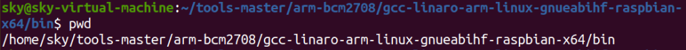
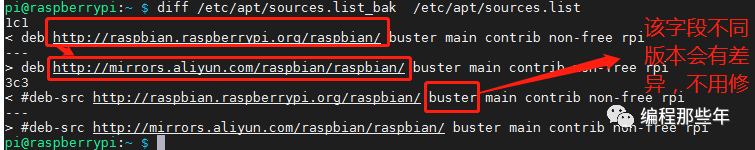

# 树莓派交叉编译 & 内核编译 - HQ

[TOC]

------

#### 注意

- 

------

# 树莓派交叉编译

### 引入

**为什么要交叉编译**

1. 因为目的平台上的资源贫乏，无法运行我们所需要编译器，平台上不允许或不能够安装我们所需要的编译器比如C51。

2. 树莓派有时又是因为目的平台还没有建立，连操作系统都没有，根本谈不上运行什么编译器。操作系统也是代码，也要编译。

> 平台运行需要两样至少东西：bootloader（启动引导代码）以及操作系统核心
>
> 宿主机（host） ：编辑和编译程序的平台，一般是基于X86的PC机，通常也被称为主机。
>
> 目标机（target）：用户开发的系统，通常都是非X86平台。host编译得到的可执行代码在target上运行。
>

**交叉编译需要用到什么工具**

交叉编译器、交叉编译工具链

### 交叉编译工具链的安装

https://github.com/raspberrypi/

1. 从共享文件夹拷贝到工作目录  `cp /mnt/hgfs/share/tools-master.zip .`
2. 解压  `unzip tools-master.zip`
3. ``cd /home/CLC/lessonPI/tools-master/arm-bcm2708/gcc-linaro-arm-linux-gnueabihf-raspbian-x64/bin`
4. `pwd`获得路径
5. `echo $PATH` 获得当前环境变量的值

**临时有效，配置环境变量**

```
PATH 环境变量

export PATH=/usr/local/sbin:/usr/local/bin:/usr/sbin:/usr/bin:/sbin:/bin:/usr/games:/home/CLC/lessonPI/tools-master/arm-bcm2708/gcc-linaro-arm-linux-gnueabihf-raspbian-x64/bin
```

**永久有效，配置环境变量**

```
修改工作目录下的.bashrc 隐藏文件，配置命令终端的  vi /home/CLC/.bashrc

在文件最后一行加入：

export PATH=/usr/local/sbin:/usr/local/bin:/usr/sbin:/usr/bin:/sbin:/bin:/usr/games:/home/CLC/lessonPI/tools-master/arm-bcm2708/gcc-linaro-arm-linux-gnueabihf-raspbian-x64/bin

source /home/CLC/.bashrc 加载配置文件，马上生效配置。
```

> 

将安装路径添加到PATH中，添加到.bashrc的结尾即可

> 

> 

### 交叉编译使用举例

交叉编译：检查下交叉编译工具对不对 

```
arm-linux-gnueabihf-gcc -v    4.8.3  
arm-linux-gnueabihf-gcc xxx.c -o xxx
```

如何把编译生成的可执行文件下载到开发板  

```
# 指令 文件名 开发板用户名@开发板地址：开发板的绝对路径
scp clientInPi pi@192.168.43.30:/home/pi
```


# 树莓派源码分析 & 内核编译 - 简略

### Linux内核源代码目录树结构

**arch：**包含和硬件体系结构相关的代码，每种平台占一个相应的目录。和32位PC相关的代码存放在i386目录下，其中比较重要的包括kernel（内核核心部分）、mm（内存管理）、math-emu（浮点单元仿真）、lib（硬件相关工具函数）、boot（引导程序）、pci（PCI总线）和power（CPU相关状态）。

**block：**部分块设备驱动程序。

**crypto：**常用加密和散列算法（如AES、SHA等），还有一些压缩和CRC校验算法。

**Documentation：**关于内核各部分的通用解释和注释。

**drivers：**设备驱动程序，每个不同的驱动占用一个子目录。

**fs：**各种支持的文件系统，如ext、fat、ntfs等。

**include：**头文件。其中，和系统相关的头文件被放置在linux子目录下。

**init：**内核初始化代码（注意不是系统引导代码）。

**ipc：**进程间通信的代码。

**kernel：**内核的最核心部分，包括进程调度、定时器等，和平台相关的一部分代码放在arch/*/kernel目录下。

**lib：**库文件代码。

**mm：**内存管理代码，和平台相关的一部分代码放在arch/*/mm目录下。

**net：**网络相关代码，实现了各种常见的网络协议。

**scripts：**用于配置内核文件的脚本文件。

**security：**主要是一个SELinux的模块。

**sound：**常用音频设备的驱动程序等。

**usr：**实现了一个cpio。

在i386体系下，系统引导将从`arch/i386/kernel/head.s`开始执行，并进而转移到`init/main.c`中的`main()函数`初始化内核。

### 树莓派Linux源码配置

**`.config`文件是linux内核配置文件，当执行#make uImage编译生成内核时，顶层的Makefile会读取`.config`文件的内容，根据这个配置文件来编译所定制的内核。**

内核源码配置的三种方式

1. 根据厂家提供的Linux内核源码，进行修改，`厂家.config`->`自己.config`
2. `make menuconfig` 进行配置，通常是基于厂家的config来配置。
3. 完全自己开发

### 内核编译 - 详细过程参考下一章

**1.编译内核**

```
ARCH=arm CROSS_COMPILE=arm-linux-gnueabihf- KERNEL=kernel7 make -j4 zImage modules dtbs
```

> `-j4` 指定用多少电脑资源进行编译
>
> `zImage` 生成内核镜像
>
> `modules` 要生成驱动模块
>
> `dtbs` 生成配置文件（设备树）

**2.编译成功后**

看到源码树目录多了vmlinux，失败则无此文件，成功后，目标zImage镜像arch/arm/boot底下。

**3.打包zImage成树莓派可用的xxx.img**

直接用linux源码包里的工具：

```
./scripts/mkknlimg arch/arm/boot/zImage ./kernel_new.img
```

**4.数据拷贝**

```
mkdir data1 data2
```

挂载U盘

```
sudo mount /dev/sdb1 data1  一个fat分区，是boot相关的内容，kernel的img
sudo mount /dev/sdb2 data2  一个是ext4分区，也就是系统的根目录分区。
```

安装modules, 设备驱动文件，如 hdmi usb wifi io ...

```
sudo ARCH=arm CROSS_COMPILE=arm-linux-gnueabihf- KERNEL=kernel7 make INSTALL_MOD_PATH=/home/chenlc/data2 modules_install
```

安装更新 kernel.img 文件，注意镜像名字是kernel7.img

再把编译新生成的拷贝到data1，起名kernel7.img

```
cp kernel_new.img /home/chenlc/data1/kernel7.img
```

拷贝配置文件

```
cp arch/arm/boot/dts/.*dtb* /home/chenlc/data1
```

后面步骤参考下一章

> 


# 树莓派交叉编译 & 本地编译 - 详细

### 一、概述

树莓派的github主页：https://github.com/raspberrypi，里面包含了linux源码、交叉编译工具链等内容。

对于我们要用到的有两个仓库：

https://github.com/raspberrypi/linux 内核源码

https://github.com/raspberrypi/tools 交叉编译工具链（仅在交叉编译时用到）

注：
1、树莓派里安装的系统镜像版本要和kernel代码对应。因为树莓派系统是在不断开发和升级的，如果你的树莓派使用的是某个时间的系统镜像，那么最好也使用当时的kernel代码。
2、关于内核编译方法，官网有很详细的介绍：https://www.raspberrypi.org/documentation/linux/kernel/building.md，这里算是翻译和补充。
3、以下编译过程在树莓派1和树莓派3B上测试ok。

### 二、ubuntu里交叉编译

#### 1、获取交叉编译工具和源码

源码：**git clone git@github.com:raspberrypi/linux**

交叉编译工具：**git clone git@github.com:raspberrypi/tools**

#### 2、配置编译环境变量

##### 2.1 手动配置环境变量

编译工具下载后，在64位ubuntu上编译我们需要的编译工具bin文件在：`tools/arm-bcm2708/gcc-linaro-arm-linux-gnueabihf-raspbian-x64/bin` 目录下，将此目录添加到环境变量PATH中，添加方法：

```
PATH=$PATH:/home/nicek/githubProjects/raspberrypi/tools/arm-bcm2708/gcc-linaro-arm-linux-gnueabihf-raspbian-x64/bin
```

如果是在32位系统中编译则要选择32位的交叉编译工具。

配置完成之后可以用编译工具命令查看到版本号：

```
arm-linux-gnueabihf-gcc -v
```

之后，所有的make命令都要指明一些环境变量：

```
ARCH=arm CROSS_COMPILE=arm-linux-gnueabihf- KERNEL=kernel7
```

| ARCH=arm      | 指明当前要编译arm，虽然树莓派是64位的，这里仍然选择arm，而不是arm64。 |
| ------------- | ------------------------------------------------------------ |
| CROSS_COMPILE | 指明交叉工具链名称。                                         |
| KERNEL        | 指明kernel类型，**树莓派1设置为kernel，树莓派2、3设置为kernel7。** |

每次make都需要指明这些环境变量，如：

```
ARCH=arm CROSS_COMPILE=arm-linux-gnueabihf- KERNEL=kernel7 make menuconfig
ARCH=arm CROSS_COMPILE=arm-linux-gnueabihf- KERNEL=kernel7 make -j4 zImage
```

##### 2.2 自动配置环境变量

上面这些环境变量每次命令都要写很麻烦，可以通过export一次设置：

```
export PATH=$PATH:/home/nicek/githubProjects/raspberrypi/tools/arm-bcm2708/gcc-linaro-arm-linux-gnueabihf-raspbian-x64/bin ARCH=arm CROSS_COMPILE=arm-linux-gnueabihf- KERNEL=kernel7
```

之后在本终端里执行的所有命令都带有这些环境变量信息。

此 export 命令可以写成一个脚本，然后在编译前在终端里source一下这个脚本即可设置好所有的环境变量。就像android编译前也要先source一下envsetup.sh一样。

```
#!/bin/bash DIR="$( cd "$( dirname "${BASH_SOURCE[0]}" )" && pwd )" export PATH="$PATH:$DIR/arm-bcm2708/gcc-linaro-arm-linux-gnueabihf-raspbian-x64/bin/" export ARCH=arm CROSS_COMPILE=arm-linux-gnueabihf- KERNEL=kernel7 
```

上述命令中的路径可能和你实际不同，注意修改。

export环境变量后，在本终端里的后续命令都可以不用再指明这些环境变量，如：

```
配置之前的命令：
ARCH=arm CROSS_COMPILE=arm-linux-gnueabihf- KERNEL=kernel7 make menuconfig
配置之后的命令：
make menuconfig
```

#### 3、配置config

linux源码中有很多工程：
树莓派1的工程是**bcmrpi_defconfig**
树莓派2、3的工程是**bcm2709_defconfig**

##### 3.1 使用源码里自带的config

```
ARCH=arm CROSS_COMPILE=arm-linux-gnueabihf- KERNEL=kernel7 make bcm2709_defconfig
```

> `ARCH=ARM` 指定ARM架构
>
> `CROSS_COMPILE=arm-linux-gnueabihf-` 指定编译器
>
> `KERNEL=kernel7` 树莓派
>
> `make bcm2709_defconfig` 主要核心指令

此命令功能是获取bcm2709_defconfig的配置到 .config里。
我们可以直接用工程里的配置，但这样的话可能会丢失原来使用的树莓派的配置，这里提供一个方法可以获取当前正在使用的树莓派的config。

##### 3.2 获取当前树莓派的config

已经开机的树莓派上会有这个节点：**/proc/config.gz**，从这个节点可以获取本树莓派的config。
如果没有这个节点的话则需要先加载模块：**sudo modprobe configs**

把 config.gz 内容复制到要编译的电脑上：

```
scp pi@[ip]:/proc/config.gz .
```

解压，保存为.confg文件。

```
zcat config.gz > .config
```

注：必须在linux环境下解压，在mac下会乱码。

把此config文件复制到linux源码的根目录。

#### 4、编译

安装必要的库：

```
sudo apt-get install bc
sudo apt-get install libncurses5-dev libncursesw5-dev
sudo apt-get install zlib1g:i386
sudo apt-get install libc6-i386 lib32stdc++6 lib32gcc1 lib32ncurses5
```

**4.1 执行menuconfig**

```
ARCH=arm CROSS_COMPILE=arm-linux-gnueabihf- KERNEL=kernel7 make menuconfig
```

如果没什么改的就不用执行这一步。

**4.2 编译**

```
ARCH=arm CROSS_COMPILE=arm-linux-gnueabihf- KERNEL=kernel7 make -j4 zImage modules dtbs 2>&1 | tee build.log
```

以n进程编译。不指明几进程的话则默认以单进程编译。

**4.3 打包zImage文件**

直接用linux源码包里的工具：

```
./scripts/mkknlimg arch/arm/boot/zImage ./kernel_new.img
```

在本目录生成一个kernel_new.img文件，这个文件就是要放到sd卡中的文件。
注：网上很多地方说的用 tools/mkimage/imagetool-uncompressd.py 的方法不行！！

#### 5、挂载树莓派sd卡，并安装编译出的DIRECTLY 到sd卡

把树莓派的sd卡插入ubuntu系统电脑，树莓派的sd卡有两个分区：
一个fat分区，是boot相关的内容，kernel的img文件就放在这个分区里；
一个是ext4分区，也就是系统的根目录分区。

我们生成的文件涉及到这两个分区的内容，一般插入ubuntu后会自动挂载，fat分区可以不用root权限操作，ext4分区需要root权限操作。
两个分区具体挂载在什么地方可以自己决定，以下用[fat]表示boot挂载的路径，[ext4]表示ext4挂载的路径。

**5.1 安装modules**

```
sudo ARCH=arm CROSS_COMPILE=arm-linux-gnueabihf- KERNEL=kernel7 make INSTALL_MOD_PATH=[ext4] modules_install
```

操作ext4分区，需要root权限。

**5.2 更新 kernel.img 文件**
前面已经用 mkknlimg 工具打包了kernel_new.img文件了，把它复制到boot分区并配置使用即可：

```
cp kernel_new.img [fat]/
```

编辑 [fat]/config.txt 文件，在最后加入一行：

```
kernel=kernel_new.img
```

**5.3 复制其他相关文件**

```
cp arch/arm/boot/dts/*.dtb [fat]/
cp arch/arm/boot/dts/overlays/*.dtb* [fat]/overlays/
cp arch/arm/boot/dts/overlays/README [fat]/overlays/
```

更新完成后插回树莓派即可开机，开机后可以用 uname -a 命令查看kernel信息已经改变。

### 三、树莓派本地编译

树莓派上本地编译和上面交叉编译原理基本相同，由于是本地编译，在编译工具和环境变量配置方面还简单一些。
树莓派上编一次内核花了将近2小时。

#### 1、获取源码

```
git clone git@github.com:raspberrypi/linux
```

#### 2、配置编译环境

在ubuntu里交叉编译时需要配置的环境变量有：

- PATH: 添加交叉工具链的目录
- ARCH: 配置成arm
- CROSS_COMPILE: 配置成ubuntu上使用的交叉工具链arm-linux-gnueabihf- KERNEL=kernel7
- KERNEL: 配置成kernel7

而在树莓派本地编译：
关于交叉工具链，本身的编译工具就可以编译给自己使用，所以不用配置；
只需要配置 KERNEL=kernel7 即可。

和上面相同，可以用 export KERNEL=kernel7，一次设置之后此终端里所有命令都带有此环境变量。
也可以更进一步写成脚本，不过这里这一行命令很简单，不写脚本也可以。

#### 3、配置config

和上面一样，
树莓派1使用的是 **bcmrpi_defconfig**，
树莓派2、3使用的是 **bcm2709_defconfig**。
例：KERNEL=kernel7 make bcm2709_defconfig

如果要使用树莓派自带的config的话：
**sudo modprobe configs** # 加载模块
**zcat config.gz > .config** # 获取配置

#### 4、编译

安装必要的库：

```
sudo apt-get install bc
sudo apt-get install libncurses5-dev libncursesw5-dev
sudo apt-get install zlib1g
sudo apt-get install libc6
```

1、执行menuconfig
**KERNEL=kernel7 make menuconfig**
没什么要改的话就不用执行这一步。

2、编译
**KERNEL=kernel7 make -j4 zImage modules dtbs 2>&1 | tee build.log**
以n进程编译。不指明几进程的话则默认以单进程编译。

3、打包zImage文件
直接用linux源码包里的工具：
**./scripts/mkknlimg arch/arm/boot/zImage ./kernel_new.img**
在本目录生成一个kernel_new.img文件，这个文件就是要放到sd卡中的文件。

#### 5、更新系统

1、安装模块
**sudo make modules_install**

2、复制dtb文件
**sudo cp arch/arm/boot/dts/\*.dtb /boot/ sudo cp arch/arm/boot/dts/overlays/\*.dtb\* /boot/overlays/ sudo cp arch/arm/boot/dts/overlays/README /boot/overlays/**

3、更新kernel.img文件
**sudo cp arch/arm/boot/zImage /boot/$KERNEL.img**


# 树莓派Linux内核编译 - 编程那些年

[编程那些年 - 文章](https://mp.weixin.qq.com/s?__biz=MzkzMDE4MDM2NQ==&mid=2247483946&idx=1&sn=c896dceca1b41e69705d0f5d1e439838&scene=19#wechat_redirect)

树莓派的Linux内核编译有两种方法: 一种是在树莓派上直接编译，另一种是利用交叉编译的方法。一般我们都推荐采用交叉编译的方式进行编译，这是因为通常交叉编译Pi内核的速度比Pi本身编译快得多（性能因素）。下面就讲下如下利用这两种方式来编译Pi内核。 

### 第一种方法：Pi本地编译

**前提条件**

准备一张16G以上TF卡。

如果上述没有该条件，可以利用NFS挂载方式，将源码目录挂载到主机上，利用主机的空间来存储代码，但会影响到编译速度。 比如我将虚拟机的nfs目录挂载到Pi的/mnt目录下，并在该目录下存储代码，如下：

```
pi@raspberrypi:~ $ mount | grep mnt
192.168.1.133:/nfs/ on /mnt type nfs (rw,relatime,vers=3,rsize=524288,wsize=524288,namlen=255,hard,nolock,proto=tcp,port=2049,timeo=70,retrans=3,sec=sys,local_lock=all,addr=192.168.1.133)
pi@raspberrypi:~ $ ls /mnt/
linux
pi@raspberrypi:~ $
```

**编译前准备**

​    首先，配置好树莓派的网络*（用推荐用有线网络，否则下载会非常慢）*和树莓派的源（推荐使用阿里源，将**“raspbian.raspberrypi.org”**替换为**“mirrors.aliyun.com/raspbian”**字段），正常souces.list前后替换后差异内容大致如下：



  安装git和树莓派内核编译所需的依赖库，如下所示：

```
 $ sudo apt install git bc bison flex libssl-dev make
```

**下载内核源码**

   利用git获取当前git仓库默认Pi的内核源码，如下所示：

```
$ git clone --depth=1 https://github.com/raspberrypi/linux
```

  当然，你也可以选择下载自己所需的内核源码版本，如需要下载4.14.y，可利用branch参数下载，如下：

```
$ git clone --depth=1 https://github.com/raspberrypi/linux --branch rpi-4.14.y
```

**配置内核**

根据当前你使用的Raspberry Pi的实际型号，通过运行以下具体命令进行准备默认配置：

​    如果是Raspberry Pi 2, Pi 3, Pi 3+系列，默认配置如下：

```
pi@raspberrypi:/mnt $ cd linux
pi@raspberrypi:/mnt/linux $ KERNEL=kernel7
pi@raspberrypi:/mnt/linux $ make bcm2709_defconfig
```

Raspberry Pi 4的默认配置如下：

```
pi@raspberrypi:/mnt $ cd linux
pi@raspberrypi:/mnt/linux $ KERNEL=kernel7l
pi@raspberrypi:/mnt/linux $ make bcm2711_defconfig
```

Raspberry Pi 1、Pi Zero、Pi Zero W系列的默认采用配置如下：

```
pi@raspberrypi:/mnt $ cd linux
pi@raspberrypi:/mnt/linux $ KERNEL=kernel
pi@raspberrypi:/mnt/linux $ make bcmrpi_defconfig
```

​    如果需要额外对内核进行配置，则可以利用如下命令实现：

```
pi@raspberrypi:/mnt/linux $ make menuconfig
```

 **编译和安装**

​    最后进行编译安装内核、驱动模块、设备树配置操作，这个过程会比较漫长，需要耐心等待，命令如下：

```
pi@raspberrypi:/mnt/linux $ make -j4 zImage modules dtbs
pi@raspberrypi:/mnt/linux $ sudo make modules_install
pi@raspberrypi:/mnt/linux $ sudo cp arch/arm/boot/dts/*.dtb /boot/
pi@raspberrypi:/mnt/linux $ sudo cp arch/arm/boot/dts/overlays/*.dtb* /boot/overlays/
pi@raspberrypi:/mnt/linux $ sudo cp arch/arm/boot/dts/overlays/README /boot/overlays/
pi@raspberrypi:/mnt/linux $ sudo cp arch/arm/boot/zImage /boot/$KERNEL.img
pi@raspberrypi:/mnt/linux $  sudo reboot -f
```

### 第二种方法：交叉编译内核

首先，需要准备一台Linux交叉编译主机，比如Ubuntu 18.04（可以安装实体机或者VMware或VirtualBox里）。

**编译前准备**
首先在交叉编译Linux主机上安装所需的依赖和交叉编译工具，如下：

```
sudo apt install git bc bison flex libssl-dev make libc6-dev libncurses5-dev
```

如果Pi安装的是32的内核，则安装32位的交叉编译工具链：

（注：通过在Pi里运行**“file /sbin/busybox”** 或其他可执行程序可查看当前内核是32位还是64位的。如果是32位的，会显示如下32-bit 字段，否则为64位的）

```
$ sudo apt install crossbuild-essential-armhf
```

否则，如果Pi使用的是64的内核，则安装64位的交叉编译工具链：

```
$ sudo apt install crossbuild-essential-arm64
```

**获取源码**

 利用git获取当前git仓库默认Pi的内核源码，如下所示：

```
$ git clone --depth=1 https://github.com/raspberrypi/linux
```

  当然，你也可以选择下载自己所需的内核源码版本，如需要下载4.14.y，可利用branch参数下载，如下：

```
$ git clone --depth=1 https://github.com/raspberrypi/linux --branch rpi-4.14.y
```

**配置内核**

**针对32位系统:**

如果是Pi 2, Pi 3, Pi 3+, 和3系列树莓派，运行如下命令：

```
linux@ubuntu:~$ cd linux
linux@ubuntu:~/linux$ KERNEL=kernel7
linux@ubuntu:~/linux$ make ARCH=arm CROSS_COMPILE=arm-linux-gnueabihf- bcm2709_defconfig
```

如果是Raspberry Pi 4，运行如下命令：

```
linux@ubuntu:~$ cd linux
linux@ubuntu:~/linux$ KERNEL=kernel7l
linux@ubuntu:~/linux$ make ARCH=arm CROSS_COMPILE=arm-linux-gnueabihf- bcm2711_defconfig
```

如果是Pi 1, Pi Zero, Pi Zero W，运行如下命令：

```
linux@ubuntu:~$ cd linux
linux@ubuntu:~/linux$ KERNEL=kernel
linux@ubuntu:~/linux$ make ARCH=arm CROSS_COMPILE=arm-linux-gnueabihf- bcmrpi_defconfig
```

**针对64位系统：**

  如果是Pi 2, Pi 3, Pi 3+, 和3系列树莓派，运行如下命令：

```
linux@ubuntu:~$ cd linux
linux@ubuntu:~/linux$ KERNEL=kernel8
linux@ubuntu:~/linux$ make ARCH=arm64 CROSS_COMPILE=aarch64-linux-gnu- bcmrpi3_defconfig
```

如果是Raspberry Pi 4，运行如下命令：

```
linux@ubuntu:~$ cd linux
linux@ubuntu:~/linux$ KERNEL=kernel8
linux@ubuntu:~/linux$ make ARCH=arm64 CROSS_COMPILE=aarch64-linux-gnu- bcm2711_defconfig
```

**编译内核**

如果是32位内核，运行如下命令：

```
make -j4  ARCH=arm CROSS_COMPILE=arm-linux-gnueabihf- zImage modules dtbs
```

如果是64位内核，运行如下命令：

```
make -j4  ARCH=arm64 CROSS_COMPILE=aarch64-linux-gnu- Image modules dtbs
```

**内核安装到TF卡**

将TF卡接到Linux交叉编译主机上（如果是VMwar虚拟机，则需要将"设置->硬件->USB控制机->USB兼容性(C)”调成“USB 1.1”）

运行**lsblk**命令查看识别到的TF卡设备节点，如下：*

```
linux@ubuntu:~/linux$ lsblk
NAME   MAJ:MIN RM  SIZE RO TYPE MOUNTPOINT
sda      8:0    0   20G  0 disk 
└─sda1   8:1    0   20G  0 part /
sdb      8:16   1 14.6G  0 disk 
├─sdb1   8:17   1  256M  0 part /media/linux/boot
└─sdb2   8:18   1  3.3G  0 part /media/linux/rootfs
```

正常TF卡设备会自动挂载到/media/${当前用户目录}/下的boot和rootfs目录下，如果没有自动挂载，则根据识别到实际TF卡的设备节点，将设备挂载到主机上，如下：

```
sudo mkdir /media/linux/rootfs -p
sudo mkdir /media/linux/boot -p
sudo mount /dev/sdb1 /media/linux/boot
sudo mount /dev/sdb2 /media/linux/rootfs
```

​    然后将内核模块安装到SD中：

  如果是32位内核，运行如下命令：

```
sudo env PATH=$PATH make ARCH=arm CROSS_COMPILE=arm-linux-gnueabihf- INSTALL_MOD_PATH=/media/linux/rootfs modules_install
```

如果是64位内核，运行如下命令：

```
sudo env PATH=$PATH make ARCH=arm64 CROSS_COMPILE=aarch64-linux-gnu- INSTALL_MOD_PATH=/media/linux/rootfs modules_install
```

最后备份原理SD卡中的旧内核， 并将新内核和设备树配置文件到SD卡中:

如果是32位内核，运行如下命令：

```
sudo cp /media/linux/boot/$KERNEL.img /media/linux/boot/$KERNEL-backup.img
sudo cp arch/arm/boot/zImage /media/linux/boot/$KERNEL.img
sudo cp arch/arm/boot/dts/*.dtb /media/linux/boot
sudo cp arch/arm/boot/dts/overlays/*.dtb* /media/linux/boot/overlays/
sudo cp arch/arm/boot/dts/overlays/README /media/linux/boot/overlays/
sudo umount /media/linux/boot
sudo umount /media/linux/rootfs
```

如果是64位内核，运行如下命令：

```
sudo
cp /media/linux/boot/$KERNEL.img /media/linux/boot/$KERNEL-backup.img
sudo cp arch/arm64/boot/Image /media/linux/boot/$KERNEL.img
sudo cp arch/arm64/boot/dts/broadcom/*.dtb /media/linux/boot/
sudo cp arch/arm64/boot/dts/overlays/*.dtb* /media/linux/boot/overlays/
sudo cp arch/arm64/boot/dts/overlays/README /media/linux/boot/overlays/
sudo umount /media/linux/boot/
sudo umount /media/linux/rootfs
```

当然，你也可以不备份旧的内核，而是通过重命令编译出来的内核名称，如将编译出来的img改为kernel-new.img，然后修改config.txt的配置文件种的kernel字段,如下：

```
kernel=kernel-new.img
```

这么做的好处是保证原有的内核不被破坏，如果新的内核无法启动，只需要将config.txt的kernel字段改回来即可。

最后，将TF卡插回Pi上，然后启动Pi即可。


