# 树莓派配置使用教程 - HQ

[TOC]

------

#### 注意

- [树莓派使用文章汇总 - 编程那些年 - 已摘录](http://mp.weixin.qq.com/mp/homepage?__biz=MzkzMDE4MDM2NQ==&hid=2&sn=9f206e6f23e14e08383bab0cdd812062&scene=18#wechat_redirect)
- [Linux基础文章汇总 - 编程那些年 - 已摘录](http://mp.weixin.qq.com/mp/homepage?__biz=MzkzMDE4MDM2NQ==&hid=3&sn=a29994435d8945a531f14c5be3b4f801&scene=18#wechat_redirect)
- [超简单教你在树莓派上安装opencv(一) - 未摘录](https://blog.csdn.net/weixin_45911959/article/details/122709090)
- [超简单教你在树莓派上安装opencv(一) - 未摘录](https://blog.csdn.net/weixin_45911959/article/details/124157416)

------

## 【树莓派】基本使用 & 基本操作

打开树莓派Linux系统可视化配置界面  `sudo raspi-config`

>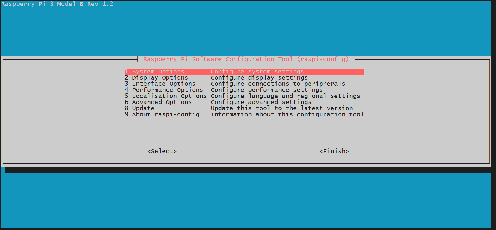


## 【树莓派】静态IP的正确配置方式(wifi)

WiFi模式下使用以下几种方法，可以快速配置静态IP， 不用担心因为路由器DHCP的租约到期导致IP被重新分配的问题，并且会保留配置好的网络环境对应的静态IP，不用每次都来修改配置，非常方便。接下来就讲下几种配置方法。

### 方法一：直接修改配置文件

1、刷完机后首先根据需要，参考公众号文章《**【树莓派】配置串口登录**》**、《【树莓派】系统启用SSH服务》**选择性的做相应的配置
2、根据《**【树莓派】配置无线网络(wifi)**》文章连接WIFI，并确认动态获取的IP，通过**ifconfig**命令查看：

```
pi@raspberrypi:~ $ ifconfig wlan0
wlan0: flags=4163<UP,BROADCAST,RUNNING,MULTICAST>  mtu 1500
        inet 192.168.1.120  netmask 255.255.255.0  broadcast 192.168.1.255
        inet6 fe80::23ec:e056:3e62:59f1  prefixlen 64  scopeid 0x20<link>
        ether b8:27:eb:5d:03:fe  txqueuelen 1000  (Ethernet)
        RX packets 303  bytes 39869 (38.9 KiB)
        RX errors 0  dropped 0  overruns 0  frame 0
        TX packets 26  bytes 3706 (3.6 KiB)
        TX errors 0  dropped 0 overruns 0  carrier 0  collisions 0
```

3、并通过**route**命令查看默认路由：

```
pi@raspberrypi:~ $ route -n
Kernel IP routing table
Destination     Gateway         Genmask         Flags Metric Ref    Use Iface
0.0.0.0         192.168.1.1     0.0.0.0         UG    303    0        0 wlan0
192.168.1.0     0.0.0.0         255.255.255.0   U     303    0        0 wlan0
pi@raspberrypi:~ $ 
```

4、通过**vim.tiny**或者nano命令修改**/etc/dhcpcd.conf**文件，将动态获取的IP以静态配置的方式追加到该文件末尾：

```
pi@raspberrypi:~ $ vim.tiny  /etc/dhcpcd.conf# fallback to static profile on eth0
#interface eth0
#fallback static_eth0
interface wlan0
static ip_address=192.168.1.120/24
static routers=192.168.1.1
static domain_name_servers=192.168.1.1
```

这其中 "interface wlan0"表示无线网卡，如果要配置有线网卡为静态IP，则改为"interface eth0"即可
"static ip_address=192.168.1.120/24"表示静态IP设置为上面获取的"192.168.1.120"， 24表示子网掩码为"255.255.255.0 "

"static routers=192.168.1.1"表示默认路由为上面的"192.168.1.1"

"static domain_name_servers=192.168.1.1"表示DNS为"192.168.1.1",当然不同的网络这里会有差异，可在电脑上通过ipconfig命令查看确认的DNS

最后重启树莓派即可。

### 方法二：通过网络设置界面

1、刷完机后首先根据需要，参考公众号文章《**【树莓派】配置串口登录**》、《**【树莓派】系统启用SSH服务**》选择性的做相应的配置
2、根据《**【树莓派】配置无线网络(wifi)**》文章连接WIFI，并确认动态获取的IP，通过**ifconfig**命令查看：

```
pi@raspberrypi:~ $ ifconfig wlan0
wlan0: flags=4163<UP,BROADCAST,RUNNING,MULTICAST>  mtu 1500
        inet 192.168.1.120  netmask 255.255.255.0  broadcast 192.168.1.255
        inet6 fe80::23ec:e056:3e62:59f1  prefixlen 64  scopeid 0x20<link>
        ether b8:27:eb:5d:03:fe  txqueuelen 1000  (Ethernet)
        RX packets 303  bytes 39869 (38.9 KiB)
        RX errors 0  dropped 0  overruns 0  frame 0
        TX packets 26  bytes 3706 (3.6 KiB)
        TX errors 0  dropped 0 overruns 0  carrier 0  collisions 0
```

3、并通过**route**命令查看默认路由：

```
pi@raspberrypi:~ $ route -n
Kernel IP routing table
Destination     Gateway         Genmask         Flags Metric Ref    Use Iface
0.0.0.0         192.168.1.1     0.0.0.0         UG    303    0        0 wlan0
192.168.1.0     0.0.0.0         255.255.255.0   U     303    0        0 wlan0
pi@raspberrypi:~ $ 
```

4、树莓派接上HDM显示器I重新开机或者通过VNC、RDP（*PS:远程登录要预先配置好响应服务*）等方式远程登录进树莓派，右键右上角的网络图标，选择**"Wireless & Wired Network Settings"：**

> 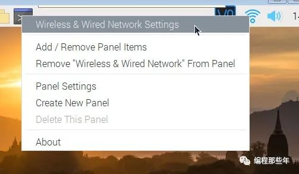

5、弹出的**"Network Preferences"**窗口，选择"**Configure->Interface->wlan0"**, 勾选**"Automatically configure empty options"**, 勾选**"Disable IPv6"**, 并根据上面动态获取到的IP和默认路由输入到对应的**"IPV4 Address**"和**"Router"**栏中。并点击一次"Apply"，然后点击"Close"如下：

> 

如果保存成功的话，通过**cat /etc/dhcpcd.conf**可看到如下配置：

```
# fallback to static profile on eth0
#interface eth0
#fallback static_eth0


interface wlan0
inform 192.168.1.120
static routers=192.168.1.1
noipv6 
```

可以看到本质也是配置的dhcpcd.conf文件。

### 方法三、骚操作 修改路由器

1、刷完机后首先根据需要，参考公众号文章《**【树莓派】配置串口登录**》、《**【树莓派】系统启用SSH服务**》选择性的做相应的配置
2、根据《**【树莓派】配置无线网络(wifi)**》文章连接WIFI，并确认动态获取的IP
3、通过浏览器直接进入路由器web管理界面,找到IP和MAC绑定选项，查找到树莓派的IP，直接将其**IP和MAC绑定**即可*(不同的路由器配置的位置不太一样)*：

> 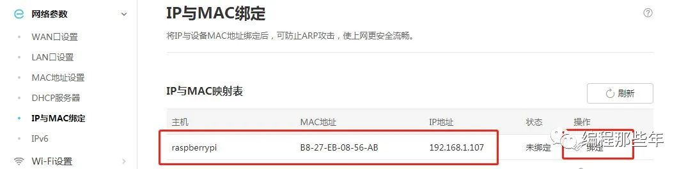


## 【树莓派】系统刷机教程

### 简介

树莓派（Raspberry Pi）是一款小型的专门为学习而设计的ARM开发板，支持Raspbian，Ubuntu Mate， Ubuntu Server等多种Linux操作系统。接下来就简单的讲解下如何烧录树莓派系统。

### 准备环境

##### 准备一张8G以上存储大小的SD卡

### 下载镜像及工具

1、 进入Raspberry Pi官网(https://www.raspberrypi.org/)，下载所需的镜像，有三个选项可选，分别是桌面环境+推荐软件、桌面环境、最小运行环境：

> 

或者下载NOOBS压缩包（方法三使用）

> 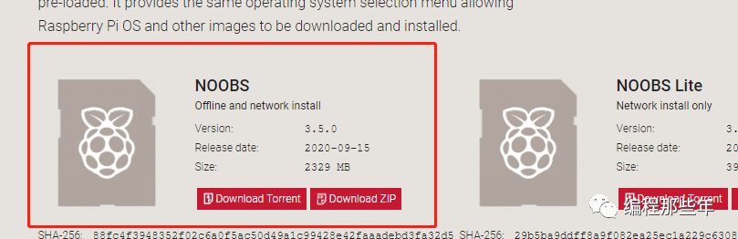

*（PS：可在公众号回复"树莓派"获取"桌面环境版本"和NOOBS压缩包）*

2、下载刻录镜像所需的工具，这里可选择"Win32DiskImager" 或者树莓派官方提供的"Raspberry Pi Imager"

Win32DiskImager下载地址如下：

```
1https://win32diskimager.download/
```

Raspberry Pi Imager下载地址如下：

```
1https://www.raspberrypi.org/software/
```

（注：也可直接在公众号回复"树莓派"获取刻录工具）

### 烧录镜像

  首先在电脑上插入TF卡，并采用以上几种刻录工具中的一种对下载好的img镜像进行刻录。

#### 1、采用Win32DiskImager刻录：

  打开Win32DiskImager软件， 点击"文件"图标，选择要刻录的img系统镜像，并在"设备"处确认TF卡的正常分区号。然后点击写入即可开始刻录系统。

> 

等待烧录

> 

当提示"写入成功"后，根据需要配置下[树莓派的串口](http://mp.weixin.qq.com/s?__biz=MzkzMDE4MDM2NQ==&mid=2247483746&idx=1&sn=9c09f6a167f989eb3ad136c47c1f6149&chksm=c27f7d00f508f416ecc48f7e1f067200cd22fd5c498afb99e57e27ea24640d21f79dedd8c75f&scene=21#wechat_redirect)和[SSH服务](http://mp.weixin.qq.com/s?__biz=MzkzMDE4MDM2NQ==&mid=2247483728&idx=1&sn=dc585685feab7f1b6b7f1c64961906ba&chksm=c27f7d32f508f42454bf01b04fdcaadacbc7fbeab58909664b2f1fd25f93914cc7b81df9d401&scene=21#wechat_redirect)后， 把TF拔下来插到树莓派上即可。

> 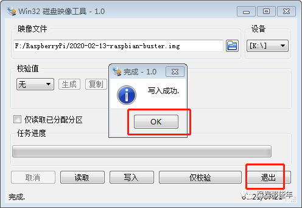

#### 2、采用Raspberry Pi Imager工具烧录

打开Raspberry Pi Imager工具

> 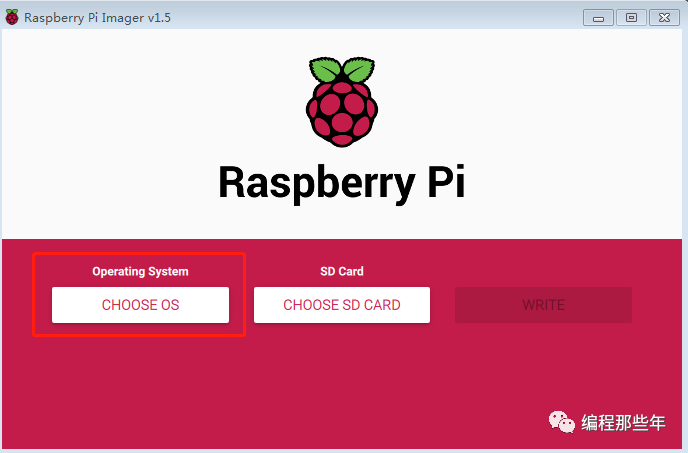

点击"CHOOSE OS"按钮， 选择要在线安装的操作系统（受限于网络）或已经提前下载好的系统，

> 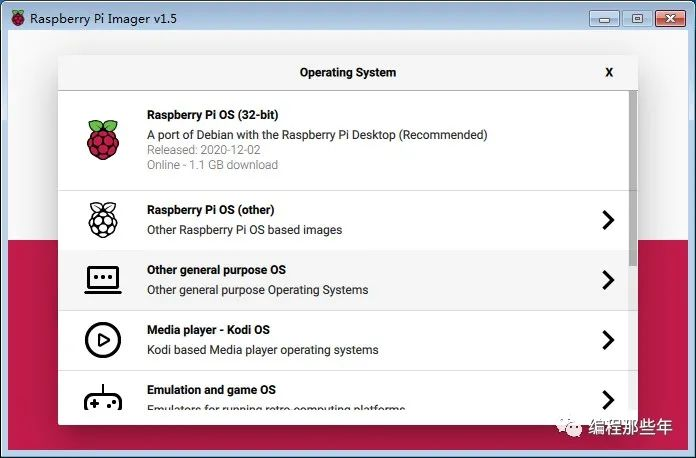

> 

点击"CHOOSE SD CARD READ"按钮 ,选择要写入的TF卡后

> 

> 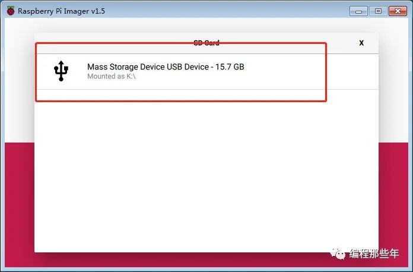

点击"WRITE"按钮，开始烧录

> 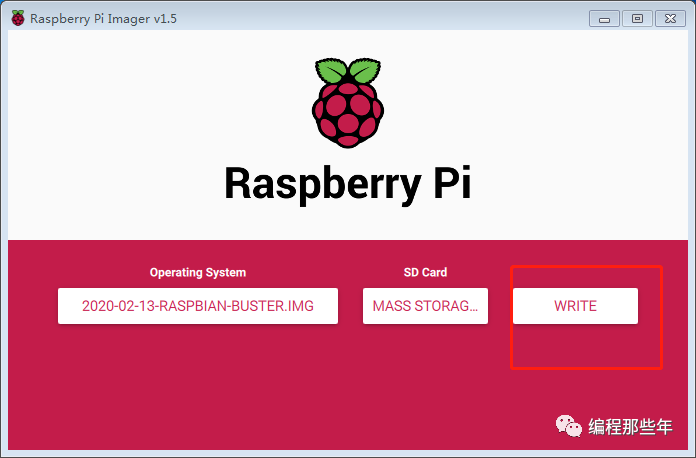

> 

等待烧录完成后，根据需要配置下[树莓派的串口](http://mp.weixin.qq.com/s?__biz=MzkzMDE4MDM2NQ==&mid=2247483746&idx=1&sn=9c09f6a167f989eb3ad136c47c1f6149&chksm=c27f7d00f508f416ecc48f7e1f067200cd22fd5c498afb99e57e27ea24640d21f79dedd8c75f&scene=21#wechat_redirect)和[树莓派的SSH服务](http://mp.weixin.qq.com/s?__biz=MzkzMDE4MDM2NQ==&mid=2247483728&idx=1&sn=dc585685feab7f1b6b7f1c64961906ba&chksm=c27f7d32f508f42454bf01b04fdcaadacbc7fbeab58909664b2f1fd25f93914cc7b81df9d401&scene=21#wechat_redirect)等配置后， 把TF拔下来插到树莓派上即可。

#### 3、利用NOOBS文件刷机

去Raspberry Pi官网下载NOOBS压缩包（PS：也可直接在公众号回复"树莓派"获取）
将SD卡格式化为FAT32格式
将下载好的NOOBS文件解压，并将NOOBS文件夹的全部内容拷贝到SD卡的根目录中

> 

 将SD卡插入树莓派，并接上HDMI显示和键盘，上电开机机， NOOBS会自动将你的SD卡进行分区。
 然后会弹出系统安装窗口，你可以根据自己的喜好选择其一安装（不需要网络），这里我选择了Raspbian，并选择好所需的语言和键盘语言

> 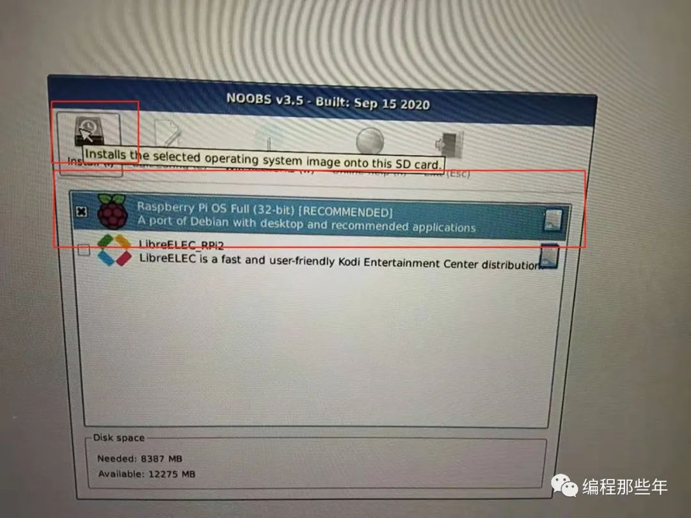

然后等待安装完成即可

### 常见问题

如果在刷机过程中出现刷机失败，可利用"SD Card Formatter"软件对SD卡进行格式化后，再重新刷机。

以上工具均可在公众号回复“树莓派”获取网盘下载链接


## 【树莓派】让你的SD卡快速扩容

### 简介

在树莓派实际使用当中，我们会发现SD卡的存储并没有得到充分的利用，是否有办法让可用空间变的更大，毫无疑问肯定是有的，不然我就不在这里废话了。

### 准备环境

  **设备：**树莓派 3B*（其他型号也可以）*
  **SD卡容量：**16G

### 方案一：使用raspi-config扩容（推荐）

  首先输入**"df -h"**命令可以看到，当前root分区总共只用了3.1G，而可用空间仅剩288M，但实际我们的存储是16G的，所以可用空间理论上不应该这么小，如下：

```
pi@raspberrypi:~$ df -h
Filesystem      Size  Used Avail Use% Mounted on
/dev/root       3.1G  2.7G  288M  91% /
devtmpfs        310M     0  310M   0% /dev
tmpfs           438M     0  438M   0% /dev/shm
tmpfs           438M   17M  421M   4% /run
tmpfs           5.0M  4.0K  5.0M   1% /run/lock
tmpfs           438M     0  438M   0% /sys/fs/cgroup
/dev/mmcblk0p1   43M   22M   21M  51% /boot
tmpfs            88M     0   88M   0% /run/user/1000
pi@raspberrypi:~$
```

此时可以利用**"raspi-config"**对root分区进行扩容，输入如下命令：

```
sudo raspi-config
```

选择**"7 Advanced Options"**回车：

> 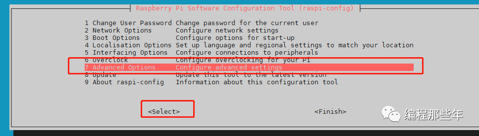

然后选择**"A1 Expand Filesystem Ensures that all of …."**,回车：

> 

询问是否修改root分区，直接回车：

> 

到首页面，按**"Tab"**键，选择**"Finish"**，回车：

> 

询问是否重启，选择重启：

> 

重启完后，输入**"df -h"**,会发现root分区已经扩容成功：

```
pi@raspberrypi:~ $ df -h
Filesystem      Size  Used Avail Use% Mounted on
/dev/root        15G  2.9G   11G  22% /
devtmpfs        433M     0  433M   0% /dev
tmpfs           438M     0  438M   0% /dev/shm
tmpfs           438M   12M  426M   3% /run
tmpfs           5.0M  4.0K  5.0M   1% /run/lock
tmpfs           438M     0  438M   0% /sys/fs/cgroup
/dev/mmcblk0p1  253M   53M  200M  21% /boot
tmpfs            88M     0   88M   0% /run/user/1000
```

又可以愉快的玩耍了。

### 方案二：利用fdisk和resize2fs扩容

  利用**"fdisk"**和**"resize2fs"**命令确认mmcblk0p2节点的其实地址为：**"532480"**（注：根据实际情况确认该地址，要输错了会导致分区出错，很重要！！！）,并对该分区重新创建：

```
pi@raspberrypi:~ $ sudo  fdisk  /dev/mmcblk0

Welcome to fdisk (util-linux 2.33.1).
Changes will remain in memory only, until you decide to write them.
Be careful before using the write command.

Command (m for help): p #查看分区信息， /dev/mmcblk0p2 start地址很重要
Disk /dev/mmcblk0: 14.6 GiB, 15681454080 bytes, 30627840 sectors
Units: sectors of 1 * 512 = 512 bytes
Sector size (logical/physical): 512 bytes / 512 bytes
I/O size (minimum/optimal): 512 bytes / 512 bytes
Disklabel type: dos
Disk identifier: 0xea7d04d6

Device         Boot  Start     End Sectors  Size Id Type
/dev/mmcblk0p1        8192  532479  524288  256M  c W95 FAT32 (LBA)
/dev/mmcblk0p2      532480 7397375 6864896  3.3G 83 Linux

Command (m for help): d #删除mmcblk0p2分区
Partition number (1,2, default 2): 2

Partition 2 has been deleted.

Command (m for help): n #新建分区
Partition type
   p   primary (1 primary, 0 extended, 3 free)
   e   extended (container for logical partitions)
Select (default p):

Using default response p.
Partition number (2-4, default 2): 2 #分区号选择2 即mmcblk0p2分区
First sector (2048-30627839, default 2048): 532480  #刚才查看的mmcblk0p2起始地址
Last sector, +/-sectors or +/-size{K,M,G,T,P} (532480-30627839, default 30627839): #默认直接回车

Created a new partition 2 of type 'Linux' and of size 14.4 GiB.
Partition #2 contains a ext4 signature.

Do you want to remove the signature? [Y]es/[N]o: y

The signature will be removed by a write command.

Command (m for help): p #这里重新查看发现mmcblk0p2分区变大了
Disk /dev/mmcblk0: 14.6 GiB, 15681454080 bytes, 30627840 sectors
Units: sectors of 1 * 512 = 512 bytes
Sector size (logical/physical): 512 bytes / 512 bytes
I/O size (minimum/optimal): 512 bytes / 512 bytes
Disklabel type: dos
Disk identifier: 0xea7d04d6

Device         Boot  Start      End  Sectors  Size Id Type
/dev/mmcblk0p1        8192   532479   524288  256M  c W95 FAT32 (LBA)
/dev/mmcblk0p2      532480 30627839 30095360 14.4G 83 Linux

Filesystem/RAID signature on partition 2 will be wiped.

Command (m for help): w #保存，如果输错了，按q不保存重新来
The partition table has been altered.
Syncing disks.


pi@raspberrypi:~ $ sudo resize2fs /dev/mmcblk0p2 #利用resize2fs调整文件系统实际大小
resize2fs 1.44.5 (15-Dec-2018) 
Filesystem at /dev/mmcblk0p2 is mounted on /; on-line resizing required
old_desc_blocks = 1, new_desc_blocks = 1
The filesystem on /dev/mmcblk0p2 is now 3761920 (4k) blocks long.
```

然后重启，也是可以愉快的玩耍的。

### 交换分区大小

虽然可用空间变大了，但我们在使用的实际当中会发现有些卡顿，这是因为树莓派默认的给的swap分区只要100M。

**关于交换分区的解释大致如下：**

  Swap分区是存储上一个特殊用途的分区或文件，是当系统内存不够用的时候，把物理内存中的一部分空间释放出来，以供当前运行的程序使用。那些被释放或交换出来的内容就会被临时保存到Swap分区中，等到程序需要时，再从Swap分区中恢复数据到内存中。

**修改方法如下：**

  通过修改**"/etc/dphys-swapfile"**文件的**"CONF_SWAPSIZE"**字段达到扩大交换分区的目的（*以M为单位*）：

```
pi@raspberrypi:~ $ sudo vi /etc/dphys-swapfile #输入如下命令

# /etc/dphys-swapfile - user settings for dphys-swapfile package
# author Neil Franklin, last modification 2010.05.05
# copyright ETH Zuerich Physics Departement
#   use under either modified/non-advertising BSD or GPL license


# this file is sourced with . so full normal sh syntax applies


# the default settings are added as commented out CONF_*=* lines


# where we want the swapfile to be, this is the default
#CONF_SWAPFILE=/var/swap


# set size to absolute value, leaving empty (default) then uses computed value
#   you most likely don't want this, unless you have an special disk situation
CONF_SWAPSIZE=2048 #将该字段的100改为2048


# set size to computed value, this times RAM size, dynamically adapts,
#   guarantees that there is enough swap without wasting disk space on excess
#CONF_SWAPFACTOR=2


# restrict size (computed and absolute!) to maximally this limit
#   can be set to empty for no limit, but beware of filled partitions!
#   this is/was a (outdated?) 32bit kernel limit (in MBytes), do not overrun it
#   but is also sensible on 64bit to prevent filling /var or even / partition
#CONF_MAXSWAP=2048
```

然后重启下服务：

```
pi@raspberrypi:~ $ sudo /etc/init.d/dphys-swapfile restart
[ ok ] Restarting dphys-swapfile (via systemctl): dphys-swapfile.service.
pi@raspberrypi:~
```

酱紫，我们就把Swap分区从100M调整到了2G，可通过**"free -m"**命令查看：

```
pi@raspberrypi:~ $ free -m
              total        used        free      shared  buff/cache   available
Mem:            875         101         613          11         159         712
Swap:          2047           0        2047  #这里就是交换的内容
pi@raspberrypi:~ $
```


## 【树莓派】系统备份与还原

很多同学在开发树莓派的过程中会遇到因为操作失误导致系统无法正常启动或者偶然出现宕机的情况，此时如果没有备份，需要重刷系统是一件很崩溃的事情， 本文就讲解下如何简单的对Pi上的系统进行备份。

**方法一、利用Win32DiskImager工具备份**

​    首先下载Win32DiskImager， 下载地址如下：

```
https://sourceforge.net/projects/win32diskimager/
```

​     将SD卡接到windows主机上，打开Win32DiskImager工具，点击**文件图标**，输入选择要保存的路径，同时输入文件名称，然后选择**“打开”**，如下：

> 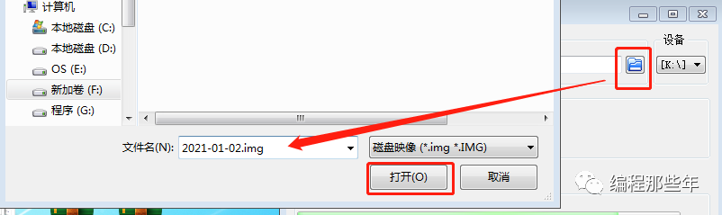

​      点击**“读取”**开始备份，耐心等待备份完成即可， 如下：

> 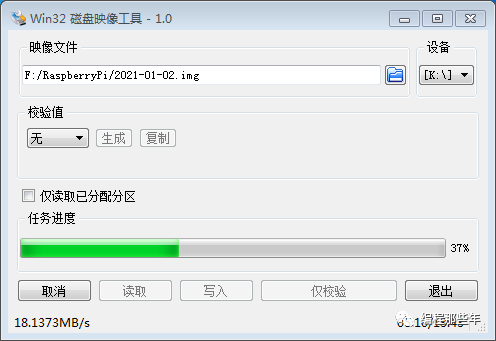

  正常整个img备份下来的大小和实际TF的大小一样（如TF卡实际可读写大小为14.6G，那么备份出来的大小就是14.6G）。下次如果TF卡无法正常启动，可利用Win32DiskImager将备份好的img再次写入即可。

**方法二、利用Linux dd命令主机备份**

  该方法要求：Linux主机可利用空间要大于SD卡的实际大小。 将SD卡接到Linux主机或者连接到Linux虚拟机后，用如下命令备份*（SD卡的实际设备节点可通过lsblk确认）*：

```
:/$ lsblk
NAME   MAJ:MIN RM  SIZE RO TYPE MOUNTPOINT
sda      8:0    0   20G  0 disk 
└─sda1   8:1    0   20G  0 part /
sdb      8:16   1 14.6G  0 disk 
├─sdb1   8:17   1  256M  0 part /media/linux/boot
└─sdb2   8:18   1  3.3G  0 part /media/linux/rootfs
:/$ sudo dd bs=4M if=/dev/sdb of=/mnt/hgfs/F/2021-01-02.img
```

​    如果需要还原，则直接通过dd命令还原，如下：

```
:/$ sudo dd bs=4M if=/mnt/hgfs/F/2021-01-02.img of=/dev/sdb
```

  当然，由于dd出来的img会比较大，可以利用gzip等压缩工具对img进行压缩，命令如下：

```
:/$ sudo dd bs=4M if=/dev/sdb | gzip >/mnt/hgfs/F/2021-01-02.img.gz
```

​    此后，如果需要进行还原，可利用如下命令实现：

```
:/$  gunzip --stdout /mnt/hgfs/F/2021-01-02.img.gz | sudo dd bs=4M of=/dev/sdb
```

**方法三、利用dump 和 restore 备份工具**

   偷懒直接参考别人写好的脚步，首先从在Pi上下载相关脚步， github地址如下:

```
 git clone git://github.com/nanhantianyi/rpi-backup
```

​     然后在Pi上接入u盘，将其挂载在/media目录， 并利用backup.sh脚本备份系统，如下：

```
sudo mkdir -p /media/linux
sudo mount /dev/sdb1 /media/linux
cd rpi-backup/
pi@pi:~/rpi-backup$ sudo ./back.sh /media/linux/2021-01-02.img
```

​    如果要还原，可直接使用Win32DiskImager或者Linux dd命令均可，还原后，再利用resize.sh脚本在Pi上进行root分区扩容，如下：

```
sudo bash resize.sh 
```


## 【树莓派】配置串口登录

当树莓派刚刷完机之后，它的硬件串口（/dev/ttyAMA0）默认是分配给板载蓝牙使用的，因此无法通过串口进行登录。这个时候就需要对串口进行配置， 才能够通过MobaXterm等软件以Serial的方式登录到树莓派的终端上。

**方式一、直接修改配置文件**

  1、树莓派下电， 把TF卡从Pi上拔下来，插到电脑上，直接进入根目录，用Nopad++软件打开**config.txt**，在文件末尾添加如下内容：

> 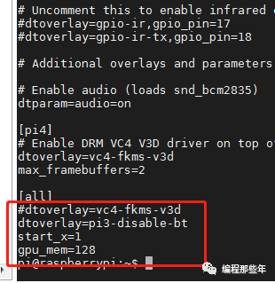

保存后退出。 

   2、修改cmdline.txt文件， 确保里面包含"**console=serial0,115200",**同时删除“**rootwait”**之后的内容。最后保存下来的内容如下:

> 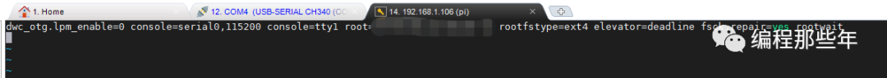

 如果配置正常，在树莓派上通过**"cat /proc/cmdline"**，可以看到 **"consle=ttyAMA0,115200"**字样，如下所示：

> 

**方式二、接HDMI显示或者远程登陆，通过命令行配置**

   如果有接着HDMI显示器或者直接之前开启过SSH，则可以通过开启终端，在终端上输入**“sudo raspi-config”**命令，然后按方向键**"↓"**键选择 **“5 Interfacing Options”**，回车，如下所示：

> 

  用方向键**"↓"**键，选择**"P6 Serial "，** 回车：

> 

然后选择**"YES"**即可***（备注：如果想关闭串口登录，去编程读写串口，则选择"NO"）\***，回车即可，如下：

> 

选择**"OK",**回车：

> 

然后在配置首页按**"Tab"**键，选择**"Finish"，重启树莓派，**正常就能通过串口登录。

 另外需要注意的是： 通常采用USB转TTL去接树莓派时，通常需要接三个线，即：

- 树莓派的**GND接**USB转TTL的**GND**


- 树莓派的**TX接**USB转TTL的**RX**


- 树莓派的**RX接**USB转TTL的**TX**


树莓派的**引脚视图**如下：

> 


## 【树莓派】系统启用SSH服务

树莓派官方发布的 Raspbian 系统镜像，默认禁用了SSH 服务，因此默认是无法通过SecurityCRT、MobaXterm 或者Putty等软件远程登录到Pi上的。想要通过SSH登录到树莓派控制台，可通过以下四种方式进行配置：

**一、SSH服务配置方法**

**方式一、直接添加配置文件**

树莓派下电， 把TF卡从Pi上拔下来，插到电脑上，直接进入**根目录**，新建一个**名为ssh的空白文件**就行了，如下：

> 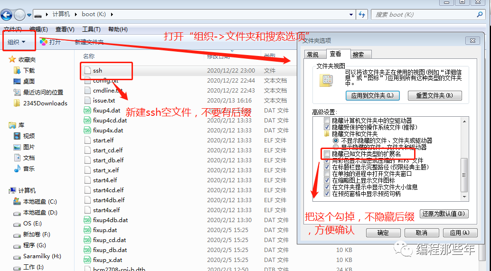

然后再把卡插回树莓派，重新上电，就可以使用SSH了（前提是已经配置了网络，网络详细配置见《[【树莓派】配置无线网络(wifi)](http://mp.weixin.qq.com/s?__biz=MzkzMDE4MDM2NQ==&mid=2247483683&idx=1&sn=b5e62b916bbc42df384d708d9e6a00c9&chksm=c27f7d41f508f4570b5543e7ebb8bcee4d535d71ca090f9f7a6cbeb6a512ecc33c2bd7e32ac4&scene=21#wechat_redirect)》）。

**方式二、通过命令行配置（sudo raspi-config）**

  在命令行输入"**sudo raspi-config"**，然后回车:

> 

选择**"Interfacing Options",**回车：

> 

选择**"P2 SSH"**,回车：

> 

 按方向键**"←"键**选择**"YES"**，回车：

> 

  **再次回车,**然后按**Tab键**选择**"Finish"**退出。  

> 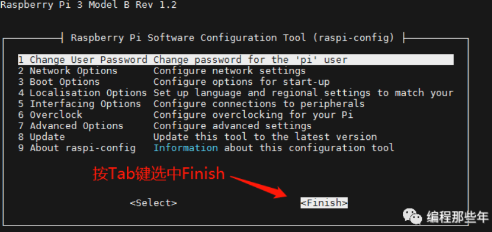

可以通过**"ps ax | grep sshd"**，查看是否有sshd进程：

>  

如果有，就说明服务已经起来，就可以连接了。

**方式三、高效命令行方式开启：**

​    首先运行**"sudo systemctl enable ssh.service"**，回车，使能开机启动SSH服务。

​    然后运行**"sudo systemctl start ssh.service"**，回车，启动SSH服务,如下所示：    

> 

**方式四、接HDMI显示器，通过界面配置：**

选择“**Start Menu->Preferences->Raspberry Pi Configuration**”,

> 

选中**"Interfaces"**后，将SSH选项**"Enable"**，然后点击"OK"即可，如下：

> 

**二、SSH远程连接设置流程**

**以MobaXterm软件为例：**

  首先，打开MobaXterm软件,点击**“Session"**:

> 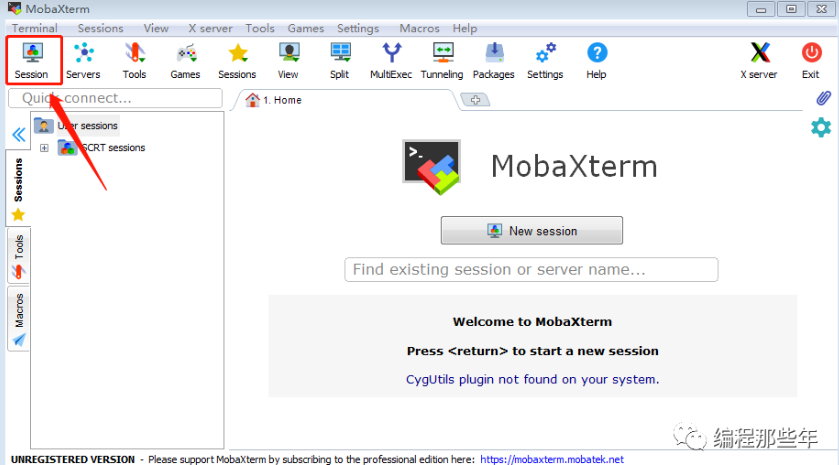

  单击**"SSH"**按钮，新建SSH会话，输入树莓派的实际IP和登录用户名：

> 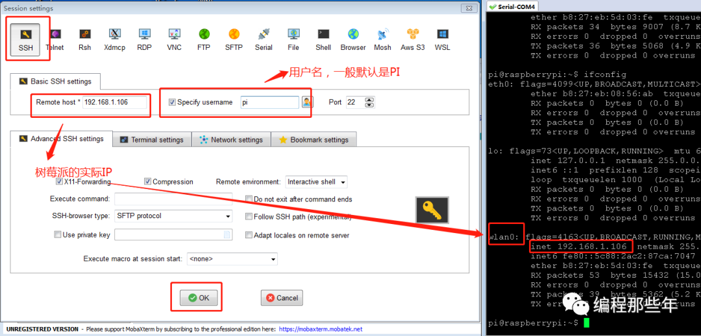

然后点击确认，**输入密码，回车**即可连接*（**pi**的默认密码为**raspberry**，输入的密码默认不可见**）*，如下：

> 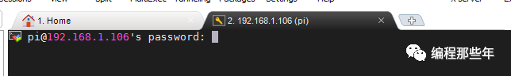

> 


## 【树莓派】配置无线网络(wifi)

 树莓派网络分为有线网络和无线网络两种连接方式，有线网络只需要一根网线接入，让设备动态获取IP即可， 基本不需要进行设置。但在使用无线网络连接时，经常会出现一些问题，如输入**ifconfig**命令时**找不到设备节点wlan0**：

> 

或者**找到了wlan0设备节点，但是没有获取到IP**：

> 

此时我们可以通过**“ls /sys/class/net”**命令确认设备节点是否存在来排除是否为硬件故障或者没有加载驱动：

> 

然后通过**“sudo iw dev wlan0 scan |grep SSID”**命令确认能否搜索到你想要的wifi,如下：

> 

**可以通过以下几种方式配置wifi网络：**

**方式一、通过命令行方式配置（sudo raspi-config）：**

   输入**“sudo raspi-config“，**会出现以下配置界面：

> 

用键盘”↓“键选择第二项（**2 Network Options**），然后回车，出现以下界面：

> 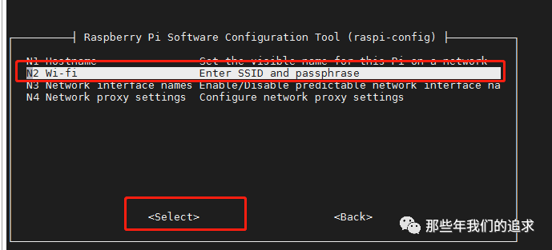

选择**N2 Wi-fi,**然后回车:

> 

用键盘”↓“键一直下翻，选择**CN China**,然后回车，到输入SSID界面：

> 

这是输入**WiFi的名字**（注意有些型号如树莓派3/3B是不支持5G和中文的）**，**回车出现下列输入密码界面：

> 

**输入密码**然后回车，回到raspi-config的首页，用**Tab键**选择**Finish，**然后**重启**，此时在终端上输入**ifconfig**,正常能看到wlan0动态获取到的IP，如下：

> 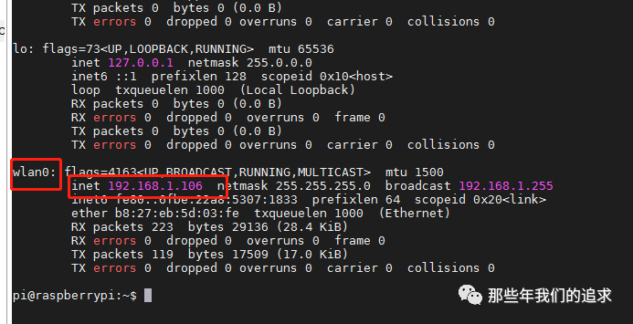

如果这种方法不生效，可使用其他方法设置。

**方式二、直接修改配置文件**

在终端上输入 sudo nano /etc/wpa_supplicant.conf

输入如下内容：（编辑完后先Ctrl+x退出，然后按Y保存退出、按N则不保存退出）

> 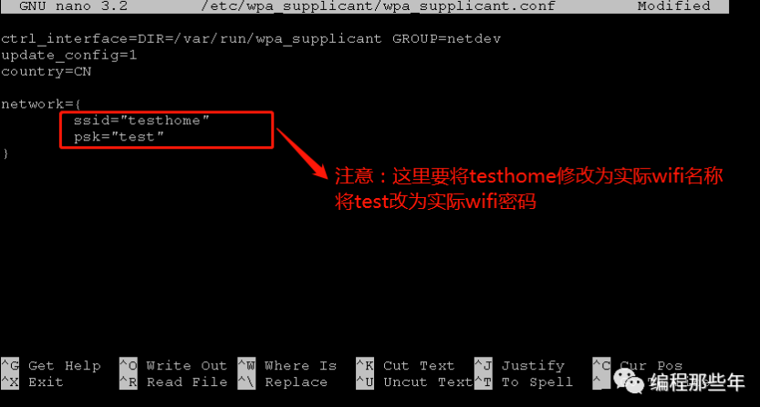

   然后运行**“sudo reboot”**重启树莓派，再次通过**ifconfig**判断是否正确获取到IP:

> 

**方式三、接HDMI显示，通过界面配置WIFI**

如果手上有HDMI显示器或者带HDMI接口的电视机，则可直接通过可视化界面配置WIFI，这种方法最为直接简单，如下：

> 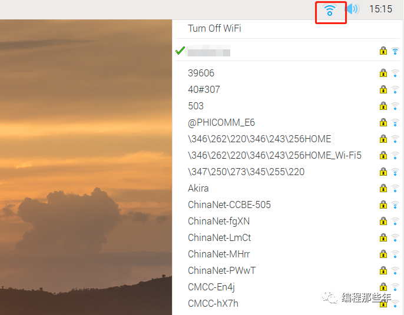

注：另外，配置问题如果出现"**Wi-FI is currently blocked by rkfill"**，

则可以通过**"sudo rfkill unblock all"**解锁，然后按上面的三种配置方式中的其中一种配置即可。


## 【树莓派】简单配置CSI摄像头

本文讲讲树莓派如何正常安装CSI摄像头以及一些基础的配置和简单的使用

### 测试环境

**硬件：**树莓派3B/3B+
**系统：**Raspberry Debian 9 / Debian 10

### 硬件连接

1、找到 **CSI 接口**(*树莓派3B的CSI接口在HDMI接口和音频口中间*)，**需要拉起 CSI 接口挡板,**如下：

> 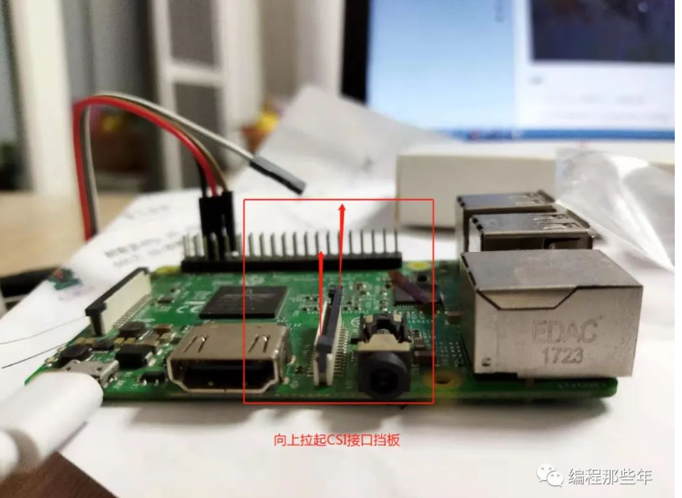

2、将摄像头排线插入CSI接口。**记住，有蓝色胶带的一面应该面向音频口或者网卡方向， 确认方向并插紧排线，将挡板压下去**，如下所示：

> 

安装好的效果图大致如下：

> 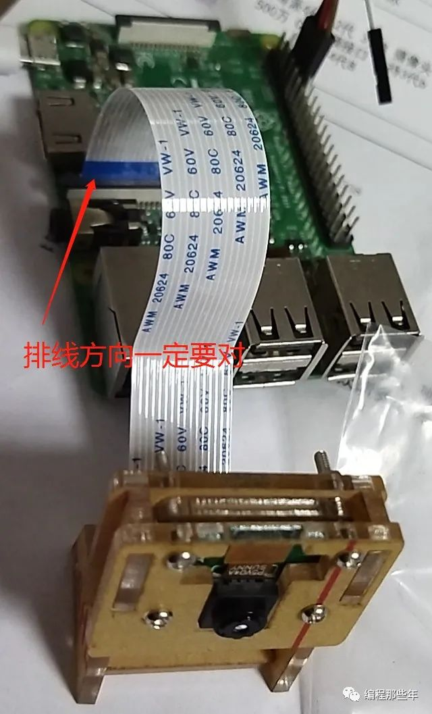

### 使能摄像头

#### 1、首先使用"ls"指令来查看是否存在vchiq设备节点：

```
linux@ubuntu:~$ ls /dev
pi@raspberrypi:~ $ ls  /dev/
autofs           disk       gpiomem  loop3             mmcblk0             ptmx   ram15  random   stdout  tty15  tty23  tty31  tty4   tty48  tty56  tty7       vchiq   vcs6   vcsa7
block            dri        hwrng    loop4             mmcblk0p1           pts    ram2   raw      tty     tty16  tty24  tty32  tty40  tty49  tty57  tty8       vcio    vcs7   vcsm
btrfs-control    fb0        initctl  loop5             mmcblk0p2           ram0   ram3   rfkill   tty0    tty17  tty25  tty33  tty41  tty5   tty58  tty9       vc-mem  vcsa   vhci
bus              fd         input    loop6             mqueue              ram1   ram4   serial0  tty1    tty18  tty26  tty34  tty42  tty50  tty59  ttyAMA0    vcs     vcsa1  watchdog
cachefiles       full       kmsg     loop7             net                 ram10  ram5   serial1  tty10   tty19  tty27  tty35  tty43  tty51  tty6   ttyprintk  vcs1    vcsa2  watchdog0
char             fuse       log      loop-control      network_latency     ram11  ram6   shm      tty11   tty2   tty28  tty36  tty44  tty52  tty60  ttyS0      vcs2    vcsa3  zero
console          gpiochip0  loop0    mapper            network_throughput  ram12  ram7   snd      tty12   tty20  tty29  tty37  tty45  tty53  tty61  uhid       vcs3    vcsa4
cpu_dma_latency  gpiochip1  loop1    mem               null                ram13  ram8   stderr   tty13   tty21  tty3   tty38  tty46  tty54  tty62  uinput     vcs4    vcsa5
cuse             gpiochip2  loop2    memory_bandwidth  ppp                 ram14  ram9   stdin    tty14   tty22  tty30  tty39  tty47  tty55  tty63  urandom    vcs5    vcsa6
pi@raspberrypi:~ $  
```

如果没有，则可能是内核或者设备硬件存在问题，可尝试重刷系统或更换硬件。

#### 2、运行"vcgencmd get_camera"查看当前摄像头是否可用：

```
pi@raspberrypi:~$ vcgencmd get_camera
supported=1 detected=1"
```

如果detected=0，说明摄像头模块没接好，重新排查下硬件。detected=1则说明CSI摄像头接入正常。supported=1说明摄像头已经使能，摄像头已经可以使用。supported=1则说明CSI摄像头没有使能。需要使能下摄像头模块。

#### 3、运行"sudo raspi-config"命令使能树莓派CSI摄像头

```
pi@raspberrypi:~ $ sudo raspi-config 
```

> 

> 

> 

> 

然后重启下树莓派

### 添加UVC驱动

有些程序采用V4L2编程，会访问到/dev/videoX设备，因此需要添加UVC驱动，针对树莓派3B/3B+可以采用如下的方法添加bcm2835-v4l2驱动：

```
pi@raspberrypi:~$ vim.tiny /etc/modules
# /etc/modules: kernel modules to load at boot time.
#
# This file contains the names of kernel modules that should be loaded
# at boot time, one per line. Lines beginning with "#" are ignored.

i2c-dev
bcm2835-v4l2
```

然后重启即可在/dev/目录下看到videoX（X为数字编号,如0）的驱动

### 使用rapistill命令拍照

运行**"raspistill -o image.jpg"**即可成功拍照并保存，更多参数使用raspistill --help

```
pi@raspberrypi:~ $ raspistill -o image.jpg
```

将image.jpg图片传输到windows桌面打开， 即可看到拍照出来的效果，如


## 【树莓派】扩展root分区

最近用安装魔镜，老是提醒我root分区已满，我还总是不信，因为自己用的是16G的内存卡，结果一查看确实不足了。

输入 df -h

> 

原来我的root只被分到4.5个G啊，这还是我重新烧录系统后的结果。

更改分区有风险，我就因为更改一次而系统崩溃启动不了，所以请大家跟我一步一步操作。

### 1、进入分区管理

输入 sudo fdisk /dev/mmcblk0 

输入p，看到两个分区，第一个分区不要动，我们改动第二个分区。

注意，记住/dev/mmcblk0p2的start起始块数，我的为98304。

> 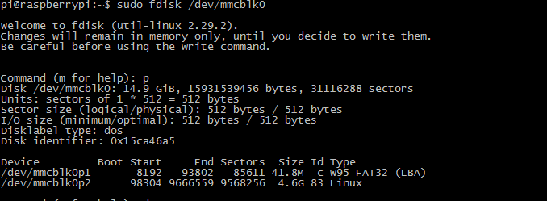

### 2、删除分区

输入d ， 再输入2，删除第二分区

接着输入p，确认只剩下一个分区

> 

### 3、创建分区

输入n，创建一个分区

> 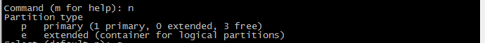

输入p，建立主分区

输入2，输入起始块数98304

接着回车，默认能够分配到最大

最后输入y，确认

> 

### 4、保存并重启

输入w，保存更改

输入sudo reboot，重启

> 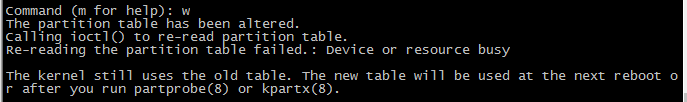

### 5、修护分区

输入sudo resize2fs /dev/mmcblk0p2

> 

最后再查看一下

输入df -h

> 

看到我们的root分区已经被扩展到15G了。

如果以后出现安装不了文件的情况，请尝试输入sudo apt-get update 和 sudo apt-get upgrade。


## 【树莓派】apt更改镜像源

### 方法一

原理就是使用国内的镜像源，代替国外的镜像源。

有两个推荐的源：

- 清华大学镜像：[https://mirrors.tuna.tsinghua.edu.cn/raspbian/raspbian/](https://links.jianshu.com/go?to=https%3A%2F%2Fmirrors.tuna.tsinghua.edu.cn%2Fraspbian%2Fraspbian%2F)
- 阿里云镜像：[https://mirrors.aliyun.com/raspbian/raspbian/](https://links.jianshu.com/go?to=https%3A%2F%2Fmirrors.aliyun.com%2Fraspbian%2Fraspbian%2F)

**1.备份原系统的apt的源镜像列表**

sudo cp /etc/apt/sources.list /etc/apt/sources.list.bak

**2.编辑sources.list 文件**

sudo vim /etc/apt/sources.list

**3.注释掉原来的内容，添加以下内容：**

deb http://mirrors.aliyun.com/raspbian/raspbian/ buster main contrib non-free rpi

deb-src http://mirrors.aliyun.com/raspbian/raspbian/ buster main contrib non-free rpi

**注意：这里编辑的时候需要注意版本（只需要更换链接部分的内容就可以）**

**sudo apt-get install screenfetch**

**screenfetch //查看当前版本信息**

| Debian版本 | 对应名称 |
| ---------- | -------- |
| Debian7    | wheezy   |
| Debian8    | jessie   |
| Debian9    | stretch  |
| Debian10   | buster   |

保存退出。

再执行 sudo apt-get update 和 sudo apt-get upgrade，就能看到加速效果了

### 方法二

```shell
sudo nano /etc/apt/sources.list

\#将原有内容用#注释掉

deb http://mirrors.aliyun.com/raspbian/raspbian/ buster main contrib non-free rpi

deb-src http://mirrors.aliyun.com/raspbian/raspbian/ buster main contrib non-free rpi

sudo nano /etc/apt/sources.list.d/raspi.list

\#将原有内容用#注释掉

deb http://mirrors.aliyun.com/raspbian/raspbian/ buster main

deb-src http://mirrors.aliyun.com/raspbian/raspbian/ buster main
```

更新

```shell
sudo apt-mark hold raspberrypi-bootloader //锁住内核和驱动

sudo apt-get update

sudo apt-get upgrade -y

------

1.编辑sources.list

打开终端 输入

sudo nano /etc/apt/sources.list

用#注释或直接删除原有的内容，新增两条：

deb http://mirrors.tuna.tsinghua.edu.cn/raspbian/raspbian/ stretch main contrib non-free rpi

\#deb-src http://mirrors.tuna.tsinghua.edu.cn/raspbian/raspbian/ stretch main contrib non-free rpi

ctrl+x 保存并退出。

编辑raspi.list

sudo nano /etc/apt/sources.list.d/raspi.list

用#注释或直接删除原有的内容，新增两条：

deb http://mirror.tuna.tsinghua.edu.cn/raspberrypi/ stretch main ui

\#deb-src http://mirror.tuna.tsinghua.edu.cn/raspberrypi/ stretch main ui

ctrl+x 保存并退出。

更新软件源列表：

sudo apt-get update

------

我的设置：

\#deb http://mirrors.tuna.tsinghua.edu.cn/raspbian/raspbian/ stretch main contrib non-free rpi

\#deb-src http://mirrors.tuna.tsinghua.edu.cn/raspbian/raspbian/ stretch main contrib non-free rpi

\#deb http://mirrors.zju.edu.cn/raspbian/raspbian/ stretch main contrib non-free rpi

\#deb-src http://mirrors.zju.edu.cn/raspbian/raspbian/ stretch main contrib non-free rpi

deb http://mirrors.aliyun.com/raspbian/raspbian/ stretch main contrib non-free rpi

deb-src http://mirrors.aliyun.com/raspbian/raspbian/ stretch main contrib non-free rpi

\#deb http://raspbian.raspberrypi.org/raspbian/ buster main contrib non-free rpi

\# Uncomment line below then 'apt-get update' to enable 'apt-get source'

\#deb-src http://raspbian.raspberrypi.org/raspbian/ buster main contrib non-free rpi

---

\#deb http://mirror.tuna.tsinghua.edu.cn/raspberrypi/ stretch main ui

\#deb-src http://mirror.tuna.tsinghua.edu.cn/raspberrypi/ stretch main ui

\#deb http://mirrors.ustc.edu.cn/archive.raspberrypi.org/ stretch main ui

\#deb-src http://mirrors.ustc.edu.cn/archive.raspberrypi.org/ stretch main ui

deb http://mirrors.aliyun.com/raspbian/raspbian/ stretch main

deb-src http://mirrors.aliyun.com/raspbian/raspbian/ stretch main

\#deb http://mirrors.ustc.edu.cn/archive.raspberrypi.org/debian/ stretch main ui

\#deb http://archive.raspberrypi.org/debian/ buster main

\# Uncomment line below then 'apt-get update' to enable 'apt-get source'

\#deb-src http://archive.raspberrypi.org/debian/ buster main
```


## 【树莓派】登录与连接方法

默认情况，树莓派的串口和蓝牙连接。

想办法断开蓝牙连接，把串口用来数据通信

https://blog.csdn.net/syjsxxjy/article/details/80774262

1. **观看树莓派的启动过程，字符**
2. **串口登录树莓派**

> 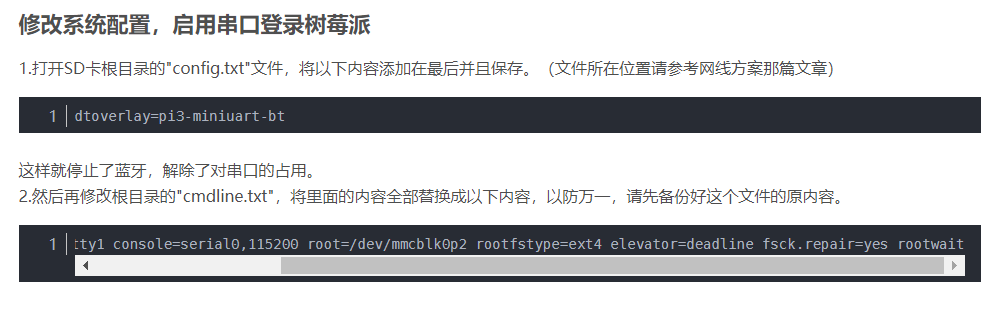

> 默认账号：pi
>
> 默认密码：raspberry


### 配置方法 1

首先查看wlan0是否连接，连接的情况下会展示连接的无线网名称和状态，没有连接会输出"Not connected"

iw wlan0 link

检索附近的无线网络名称

sudo iwlist wlan0 scan | grep ESSID

在选择某个无线网名称时会在配置文件中进行修改，如果是只读文件的话需要先赋予读写权限sudo chmod 666 /etc/wpa_supplicant/wpa_supplicant.conf 再修改

vi /etc/wpa_supplicant/wpa_supplicant.conf

如果需要更换网络，将原先的network这组数据注释，添加新的网络

修改完网络之后需要先停用后启用

sudo ifdown wlan0 关闭（down）wlan0端口

sudo ifup wlan0 启用（up）wlan0端口

如果密码不对，就会连接不上。请确认密码是否正确

查看网络是否连接成功，IP地址是否分配

ifconfig wlan0

这样算是重新连接成功

ifconfig不到wlan0相关信息

我们所使用的 Raspberry-pi-os是2020最新版本，无论哪个版本的树莓派装了这个后，用ifconfig指令都看不到wlan无线网络的信息，但是用sudo ifconfig -a可以看到有wlan0，

那就证明我们的网卡驱动没问题，只是无线射频被锁起来了，使用rfkill list查看是否关闭射频：

我这有一个被锁住了，需要打开它：rfkill unblock all，全部打开，再ifconfig 看看


### 配置方法 2

**打开ssh功能**

sudo raspi-config

修改  https://blog.csdn.net/qq_36760780/article/details/82016711

```
sudo nano /etc/wpa_supplicant/wpa_supplicant.conf

network={

    ssid="wifipig"

    psk="123456789"

}
```

> 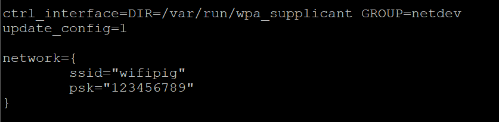

Nano是文档编辑器，已进入便可以编写。

Ctrl+o 保存**，**会有提示是否写入。我们按回车。Ctrl+x退出

固定树莓派的ip地址==（错误方式，只是障眼法，并未改变实际ip地址）==

sudo nano   /etc/rc.local

> 

### Xrdp界面登录

sudo apt-get install xrdp

安装好之后通过win10的远程电脑登录即可。

> 

### 传输文件

使用filezilla软件

连接主机的IP地址前加上sftp://即可稳定连接[sftp://192.168.3.104](sftp://192.168.3.104/)

### 附件

cmdline.txt

```shell
console=serial0,115200 console=tty1 root=PARTUUID=f4481065-02 rootfstype=ext4 elevator=deadline fsck.repair=yes rootwait quiet init=/usr/lib/raspi-config/init_resize.sh splash plymouth.ignore-serial-consoles

```

config.txt

```shell
# For more options and information see
# http://rpf.io/configtxt
# Some settings may impact device functionality. See link above for details

# uncomment if you get no picture on HDMI for a default "safe" mode
#hdmi_safe=1

# uncomment this if your display has a black border of unused pixels visible
# and your display can output without overscan
#disable_overscan=1

# uncomment the following to adjust overscan. Use positive numbers if console
# goes off screen, and negative if there is too much border
#overscan_left=16
#overscan_right=16
#overscan_top=16
#overscan_bottom=16

# uncomment to force a console size. By default it will be display's size minus
# overscan.
#framebuffer_width=1280
#framebuffer_height=720

# uncomment if hdmi display is not detected and composite is being output
#hdmi_force_hotplug=1

# uncomment to force a specific HDMI mode (this will force VGA)
#hdmi_group=1
#hdmi_mode=1

# uncomment to force a HDMI mode rather than DVI. This can make audio work in
# DMT (computer monitor) modes
#hdmi_drive=2

# uncomment to increase signal to HDMI, if you have interference, blanking, or
# no display
#config_hdmi_boost=4

# uncomment for composite PAL
#sdtv_mode=2

#uncomment to overclock the arm. 700 MHz is the default.
#arm_freq=800

# Uncomment some or all of these to enable the optional hardware interfaces
#dtparam=i2c_arm=on
#dtparam=i2s=on
#dtparam=spi=on

# Uncomment this to enable infrared communication.
#dtoverlay=gpio-ir,gpio_pin=17
#dtoverlay=gpio-ir-tx,gpio_pin=18

# Additional overlays and parameters are documented /boot/overlays/README

# Enable audio (loads snd_bcm2835)
dtparam=audio=on

[pi4]
# Enable DRM VC4 V3D driver on top of the dispmanx display stack
dtoverlay=vc4-fkms-v3d
max_framebuffers=2

[all]
#dtoverlay=vc4-fkms-v3d

```


