# FTP客户端与服务器 - HQ

[TOC]

------

#### 注意

- 下面这段代码针对GET与PUT的实现流程并未搞清楚

  > 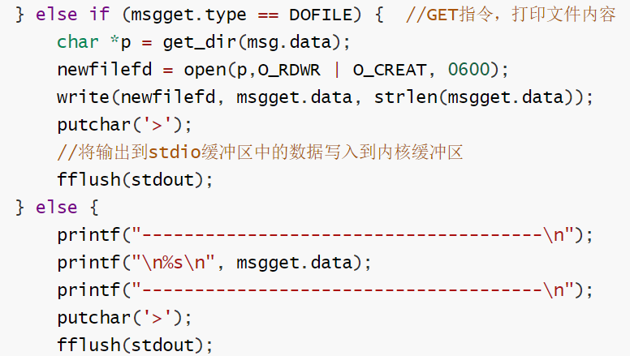

------

# FTP客户端与服务器 - 上官课程代码

### 知识基础

函数，指针，结构体
Linux套接字，进程线程，多种输入输出函数，网络编程，底层调用

### 实现功能

客户端程序连接到服务器后，可通过 **ls,lls,pwd,put** 等多种指令操作服务器端文件，打印文件路径，下载上传文件。

参考Linux中自带的ftp工具

> 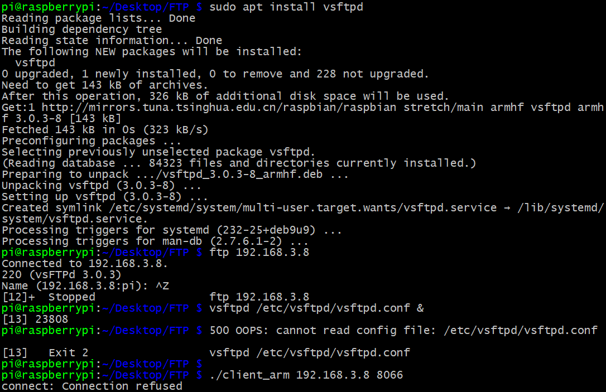

### 操作命令

```c
// 终端1
gcc ftp_server.c -o server
./server 192.168.3.8 8000
---
// 终端2
gcc ftp_client.c -o client
./client 192.168.3.8 8000
---
//可发送指令
ls
lls
pwd
cd
lcd
quit
get xxx
put xxx
```

### 运行展示

#### 上官版本

ubuntu运行截图

> 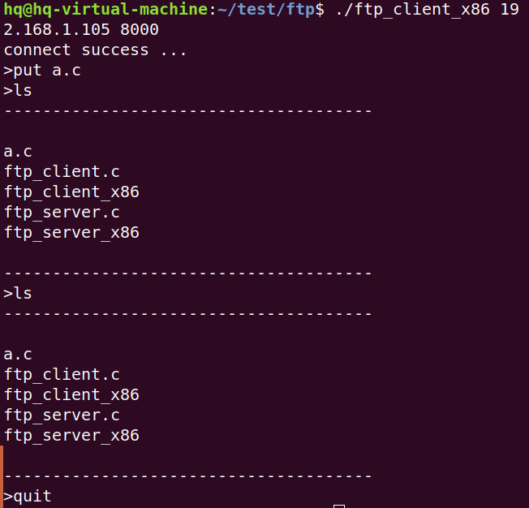
>
> 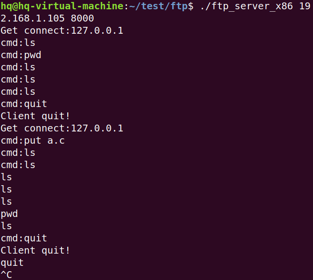

树莓派运行截图

> 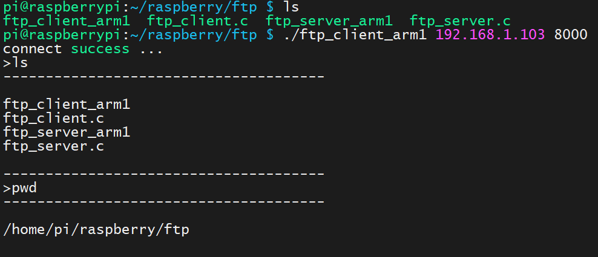
>
> 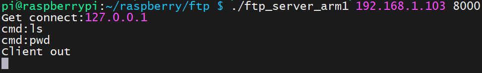

虚拟机与树莓派互连截图

> 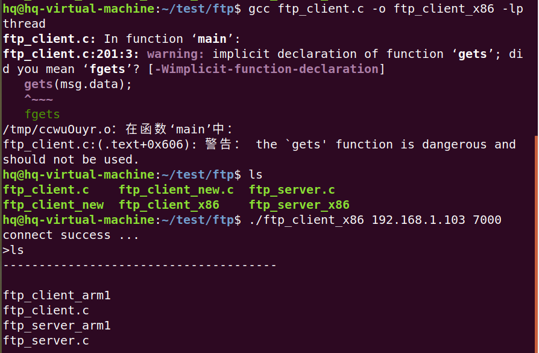
>
> 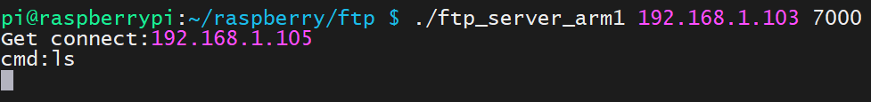

#### HQ更新版本

编译

> 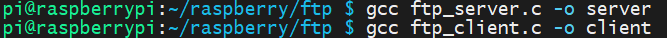

客户端

> 
>
> 

服务器

>


### 知识基础整理

#### man手册

man分为八个目录，每个目录用一个数字表示

- 1.可执行程序
- 2.系统调用
- 3.库函数
- 4.特殊文件
- 5.文件格式和规范
- 6.游戏
- 7.杂项，包括宏包和规范
- 8.系统管理命令


### 调用函数整理

#### strcmp

> 

#### strstr

> 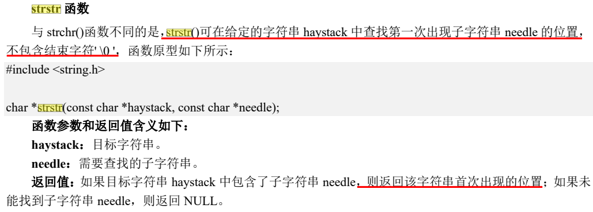

#### strtok

> 
>
> 

#### memset

> 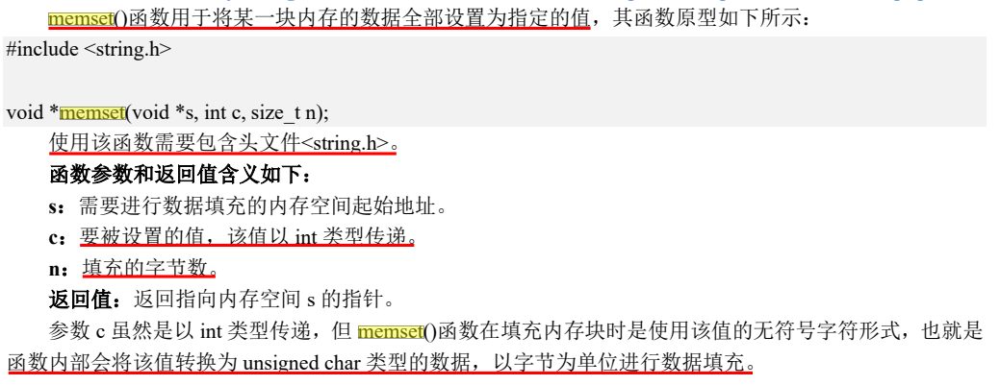

#### perror

> 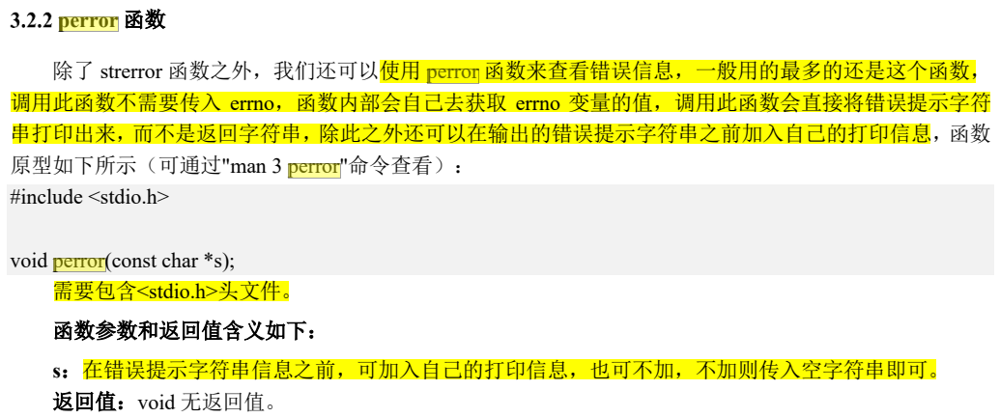

#### atoi

> 

#### inet_aton

将一个字符串IP地址转换为一个32位的网络序列IP地址。如果这个函数成功，函数的返回值非零，如果输入地址不正确则会返回零。使用这个函数并没有错误码存放在errno中，所以它的值会被忽略。

```c
int inet_aton(const char *string, struct in_addr*addr);
参数描述：
1 输入参数string包含ASCII表示的IP地址。
2 输出参数addr是将要用新的IP地址更新的结构。
返回值：
如果这个函数成功，函数的返回值非零，如果输入地址不正确则会返回零。使用这个函数并没有错误码存放在errno中，所以它的值会被忽略。
```

> 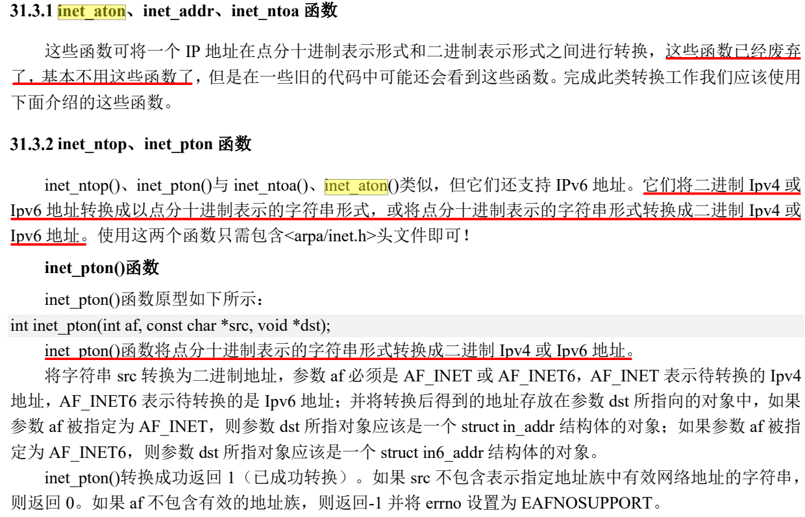

#### socket

> 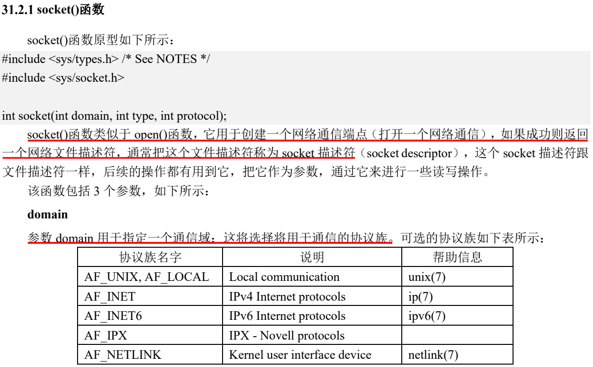
>
> 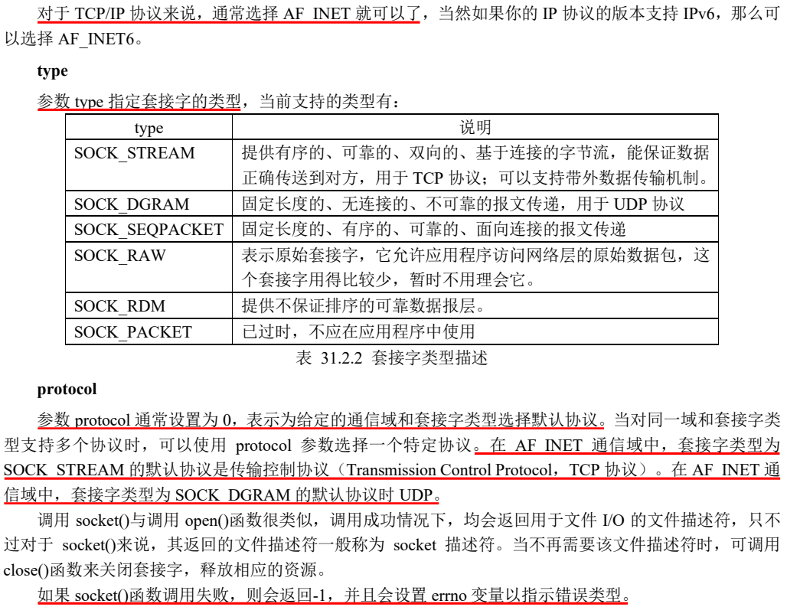

#### bind

> 
>
> 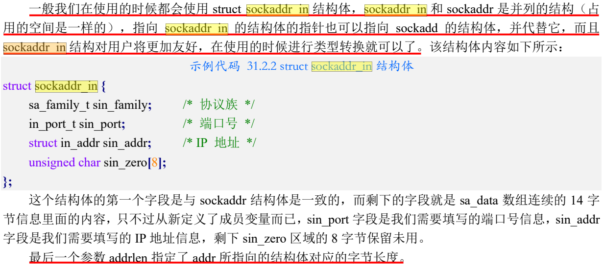
>
> 

#### listen

> 

#### accept

> 

#### accept

> 

#### read

> 
>
> 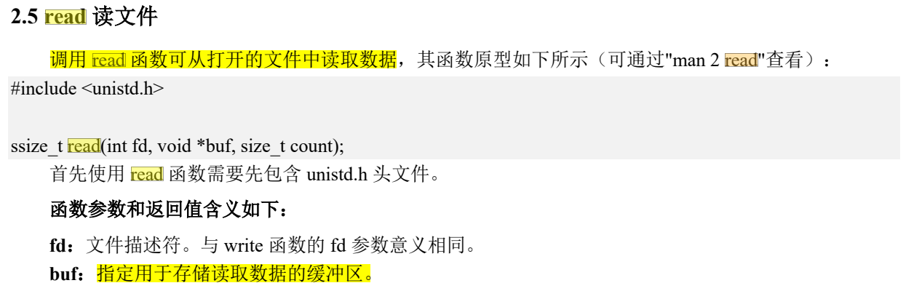
>
> 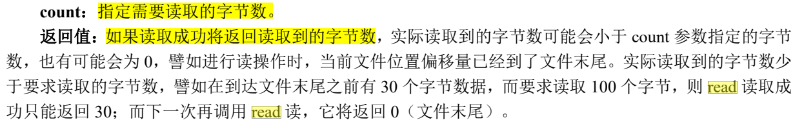

#### recv

> 
>
> 

#### write

> 
>
> 

#### send

> 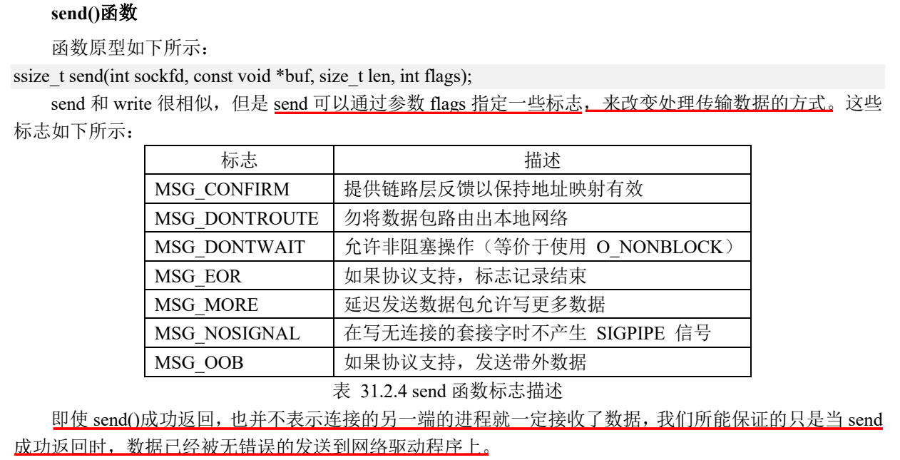

#### fork

>
>
>

#### popen

>函数原型：
>
>```c
>FILE * popen(conste char * command, const char * type);
>```
>
>函数说明：
>
>- popen()会调用fork()生成子进程，在子进程中调用/bin/sh -c来执行参数command的指令，command对应的指令与在终端命令行中输入的命令相似如: “ls - l”、"/tmp/load_usb.sh"等
>
>参数：
>
>- type: 可使用“r”或者"w", 分别代表读取及写入，但由于popen是以创建管道的方式创建子进程并连接到子进程的标准输出设备或标准输入设备，因此其带有管道的一些特性，同一时刻只能定义为写或者读。
>
>- command: 如其名，单纯是一个命令字符串指针。
>
>- 返回值：文件指针，函数执行成功返回文件指针，否则返回NULL。
>
>在使用我们可以使用popen函数运行开机初始化设备时所需要加载的驱动脚本，比如：
>
>```c
>#include <stdio.h> 
>int  main(int argc, char *argv[]) 
>{ 
>    FILE * fp; 
>    char buffer[1024];
>    
>    sprintf(buffer, "/customer/sys_ko/load.sh");
>    fp = popen(buffer, "r"); 
>    pclose(fp); 
>    
>    return 0;
>}
>```
>
>执行此程序后系统会执行/customer/sys_ko/目录下的脚本文件load.sh

#### fread

> 
>
> 

#### chdir

> 

#### access

> 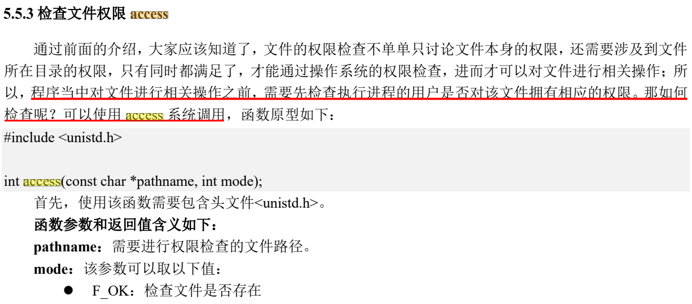
>
> 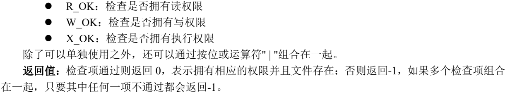

#### open

> 
>
> 
>
> 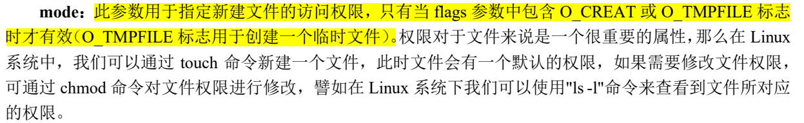
>
> 

#### fflush

> 


### ftp_server.c 服务器程序 - HQ

```c
/* 通过man指令查询调用函数所在头文件 */
#include <stdio.h>
#include <sys/types.h>
#include <sys/socket.h>
#include <netinet/in.h>
#include <arpa/inet.h>
#include <stdlib.h>
#include <string.h>
#include <sys/stat.h>
#include <fcntl.h>
#include <unistd.h>

/* 通过宏定义将模拟指令简化为整形数，便于处理 */
#define LS   0
#define GET  1
#define PWD  2
#define IFGO 3
#define LCD  4
#define LLS  5
#define CD   6
#define PUT  7
#define QUIT 8
#define DOFILE  9

/* 定义用来存储信息块的结构体 */
struct Msg {
        int type;
        char data[1024];
        char secondBuf[128];
};

/* 判断模拟指令类型 */
int get_cmd_type(char *cmd)
{
	if (!strcmp("ls", cmd))			return LS;
	if (!strcmp("quit", cmd))		return QUIT;
	if (!strcmp("pwd", cmd))		return PWD;
	if (strstr(cmd, "cd") != NULL)	return CD;
	if (strstr(cmd, "get") != NULL)	return GET;
	if (strstr(cmd, "put") != NULL)	return PUT;
	//其他指令未定义，返回100表示未找到
	return 100; 
}

/* 分割字符串 */
char *get_dir(char *cmsg)
{
	char *p;
	p = strtok(cmsg, " ");
    //再次调用时，cmsg应设置为NULL
	p = strtok(NULL, " ");
	return p;
}

/* 信息处理函数 */
void msg_handler(struct Msg msg, int fd)
{
	char dataBuf[1024] = {0};
	char *file = NULL;
	int fdfile;  //文件描述符
	
	//msg.data为字符数组
	printf("The command requested by the client is:  %s\n", msg.data);
	//将模拟指令字符串转换为整型数
	int ret = get_cmd_type(msg.data);

	switch(ret)
	{
        /* 输出当前文件列表 */
		case LS:
        	msg.type = 0;
            FILE *r1 = popen(msg.data, "r");
            fread(msg.data, sizeof(msg.data), 1, r1);
            write(fd, &msg, sizeof(msg));
            break;
            
		/* 输出当前路径 */
		case PWD:
			msg.type = 0;
            //调用fork()生成子进程，在子进程中调用/bin/sh -c来执行参数msg.data的指令，是以创建管道的方式创建子进程并连接到子进程的标准输出设备或标准输入设备，功能是执行指令将输出放入文件中，返回文件指针
			FILE *r2 = popen(msg.data, "r");
            //从文件读取1个数据项，每个数据项大小为sizeof(msg.data),将读取到的数据存放在参数 ptr指向的缓冲区中
			fread(msg.data, sizeof(msg.data), 1, r2);
            //将数据写入套接字描述符中
			write(fd, &msg, sizeof(msg));
			break;
		
        /* 切换目录 */
		case CD:
			msg.type = 1;
			//分割字符串，得到待切换的目录字符串
			char *dir = get_dir(msg.data);
			printf("Switched to directory:  %s\n", dir);
            //调用函数切换目录
			chdir(dir);
			break;
            
       	/* 打印文件内容 */
		case GET:
            msg.type = DOFILE;  //作为服务器信息处理函数GET/PUT的判断标志
			//分割字符串，得到文件名字符串
			file = get_dir(msg.data);  //获取第二个参数
			//系统调用函数，查看file文件是否存在
			if (access(file, F_OK) == -1) {
				strcpy(msg.data, "The requested file does not exist!");
				write(fd, &msg, sizeof(msg));
			} else {
				fdfile = open(file, O_RDWR);  //打开文件，获得文件描述符
				read(fdfile, dataBuf, sizeof(dataBuf));  //将文件内容读取到dataBuf
				close(fdfile);  //关闭文件描述符，释放占用的资源
				//将内容拷贝到masg.data然后写入到套接字描述符中
                strcpy(msg.data, dataBuf);
				write(fd, &msg, sizeof(msg));
			}
			break;
            
        /* 上传文件内容 */
		case PUT:
            //以可读可写打开文件，如果pathname参数指向的文件不存在则创建权限为0666的文件
			fdfile = open(get_dir(msg.data), O_RDWR | O_CREAT, 0666);
			write(fdfile, msg.secondBuf, strlen(msg.secondBuf));
			close(fdfile);
			break;
            
        /* 退出 */
		case QUIT:
			printf("The client has exited.\n");
			printf("--------------------------------------\n");
			exit(-1);	
	}
}

/* 主程序，建立socket连接，*/
int main(int argc, char **argv)
{
	int s_fd;
	int c_fd;
	int n_read;
	char readBuf[128];

	struct sockaddr_in s_addr;  //定义服务器的套接字
	struct sockaddr_in c_addr;  //定义与执行connect的客户端建立连接的套接字
	struct Msg msg;  

    //传入参数不符合要求
	if(argc != 3) {
		printf("Unqualified parameters!\n");
		exit(-1);
	}
    
	//初始化，将两个结构体的内容全部初始化为0
	memset(&s_addr, 0, sizeof(struct sockaddr_in));
	memset(&c_addr, 0, sizeof(struct sockaddr_in));

	/* 1.socket，申请socket描述符 */
    //选择TCP/IP协议；提供有序的、可靠的、双向的、基于连接的字节流；为给定的通信域和套接字类型选择默认协议
	s_fd = socket(AF_INET, SOCK_STREAM, 0);
	if(s_fd == -1) {
		perror("Ask for socket error!");
		exit(-1);
	}
    
    /* 2.bind，将服务器IP地址和端口号与一个套接字进行绑定（将套接字与地址关联） */
	s_addr.sin_family = AF_INET;  //设置为TCP/IP协议族
	s_addr.sin_port = htons(atoi(argv[2]));  //设置端口号，由于传入的参数为字符串类型，要转换为int类型，htons为宏定义，用于避免出现大小端问题
	inet_aton(argv[1], &s_addr.sin_addr);  //将IP地址在点分十进制和二进制表示形式之间进行转化

	bind(s_fd, (struct sockaddr *)&s_addr, sizeof(struct sockaddr_in));

	/* 3.listen，让服务器进入监听状态，等待客户端连接请求 */
	listen(s_fd, 15);  //s_fd等待连接队列最大为15

    int clen = sizeof(struct sockaddr_in);
	/* 放在死循环中，一直监听客户端连接，并fork子进程去处理 */

	printf("Waiting for client connection ...\n");
	printf("--------------------------------------\n");
	while(1) {
        
        /* 4.accept，进入阻塞状态，获取客户端的连接请求，并建立连接 */
		c_fd = accept(s_fd, (struct sockaddr *)&c_addr, &clen);
        //输出错误信息
		if(c_fd == -1)
			perror("Failed to establish connection!");
        //打印客户端IP地址
        printf("Client connection succeeded.\n");
		printf("The IP address of the client is:  %s\n",inet_ntoa(c_addr.sin_addr));
		printf("--------------------------------------\n");
		/* 当新的客户端接入的时候才创建子进程，一个子进程负责一条连接通道 */
        //fork()调用成功，将会在父进程中返回子进程的PID，而在子进程中返回值是0
        //fork()调用失败，父进程返回值-1，不创建子进程，并设置errno
        //if进行区分，子进程进入while循环中，父进程又返回4处
		if(fork() == 0)	{
			while(1) {
                //清空msg结构体
				memset(msg.data, 0, sizeof(msg.data));
				//等待客户端输入，将所有数据都传到msg结构体中，返回值是读到的字节数
				n_read = read(c_fd, &msg, sizeof(msg));
               
				if(n_read == 0)	{
					printf("The client has exited.\n");
					printf("--------------------------------------\n");
					break;	
				}
				else if(n_read > 0)	{
					msg_handler(msg, c_fd);	 //执行处理函数
				}				
			}
		}
	}
    
    /* 关闭套接字，释放相应资源 */
	close(c_fd);  
	close(s_fd);
	return 0;
}
```


### ftp_client.c 客户端程序 - HQ

```c
/* 通过man指令查询调用函数所在头文件 */
#include <stdio.h>
#include <sys/types.h>
#include <sys/socket.h>
#include <netinet/in.h>
#include <arpa/inet.h>
#include <stdlib.h>
#include <string.h>
#include <fcntl.h>
#include <unistd.h>

/* 通过宏定义将模拟指令简化为整形数，便于处理 */
#define LS   0
#define GET  1
#define PWD  2
#define IFGO 3  //大于IFGO的不需要执行handler_server_message函数
#define LCD  4
#define LLS  5
#define CD   6
#define PUT  7
#define QUIT 8
#define DOFILE  9

/* 定义用来存储信息块的结构体 */
struct Msg {
        int type;
        char data[1024];
        char secondBuf[128];
};

/* 判断模拟指令类型 */
int get_cmd_type(char *cmd)
{
	if (!strcmp("quit", cmd))   return QUIT;
	if (!strcmp("ls", cmd))		return LS;
	if (!strcmp("lls", cmd))	return LLS;
	if (!strcmp("pwd", cmd))	return PWD;
	
    if (strstr(cmd, "lcd"))		return LCD;
	if (strstr(cmd, "cd"))		return CD;
	if (strstr(cmd, "get"))		return GET;
	if (strstr(cmd, "put"))		return PUT;
	//其他指令未定义，返回-1表示未找到
	return -1;
}

/* 分割字符串 */
char *get_dir(char *cmd)
{
	char *p;
	p = strtok(cmd, " ");
    //再次调用时，cmsg应设置为NULL
	p = strtok(NULL, " ");
	return p;
}

/* 指令处理函数 */
int cmd_handler(struct Msg msg, int fd)
{
	char *dir = NULL;
	char buf[32] = {0};
	int ret;
	int filefd;  //文件描述符

	//将模拟指令字符串转换为整型数
	ret = get_cmd_type(msg.data);

	switch(ret)
	{
        /* 输出当前文件列表 */
		case LS:
            msg.type = 0;
			//将数据写入套接字描述符中
			write(fd, &msg, sizeof(msg));
			break;
			
        /* 切换目录 */
		case CD:
            msg.type = 0;
			//将数据写入套接字描述符中
			write(fd, &msg, sizeof(msg));
			break;
			
        /* 输出当前路径 */
		case PWD:
			msg.type = 0;
			//将数据写入套接字描述符中
			write(fd, &msg, sizeof(msg));
			break;
            
        /* 打印文件内容 */
		case GET:
			msg.type = 0;  //此处设置无效，这里的msg是局部变量
			write(fd, &msg, sizeof(msg));
			break;
            
        /* 上传文件内容 */
		case PUT:
			strcpy(buf, msg.data);
            //分割字符串，得到文件名字符串
			dir = get_dir(buf);
            //系统调用函数，查看file文件是否存在
			if (access(dir, F_OK) == -1)	{
				printf("%s is not exsit.\n",dir);
			} else {
				filefd = open(dir, O_RDWR);
				read(filefd, msg.secondBuf, sizeof(msg.secondBuf));
				close(filefd);  //关闭文件描述符
				write(fd, &msg, sizeof(msg));
			}
			break;
        
        /* 输出当前文件列表 */
		case LLS:
			printf("--------------------------------------\n\n");
			system("ls");
			printf("\n--------------------------------------\n");
			break;
         
        /* 切换目录 */
		case LCD:
			dir = get_dir(msg.data);
            //调用函数切换目录
			chdir(dir);
			break;
            
        /* 退出 */
		case QUIT:
			strcpy(msg.data, "quit");
			write(fd, &msg, sizeof(msg));
			close(fd);
			exit(-1);
	}
	return ret;
}

/* 服务器信息处理函数，从服务器返回的信息，在这里进行处理 */
void handler_server_message(int c_fd, struct Msg msg)
{
	int n_read;
	struct Msg msgget;
	int newfilefd;

	//读取服务器数据，将数据读取到msgget结构体中
	n_read = read(c_fd, &msgget, sizeof(msgget));

	//对msgget结构体中的内容进行解析，如果是普通指令则直接输出，如果是get指令则将数据写入文件(创建并写入)中
	if(n_read == 0) {  //套接字描述符中没有任何数据，退出
		printf("Server disconnected, quit!\n");
		exit(-1);
	} else if (msgget.type == DOFILE) {  //GET指令，打印文件内容
		newfilefd = open(get_dir(msg.data), O_RDWR | O_CREAT, 0600);
		write(newfilefd, msgget.data, strlen(msgget.data));
		
        //将输出到stdio缓冲区中的数据写入到内核缓冲区
		fflush(stdout);
		close(newfilefd);

		//将下载的文件内容打印部分
		printf("--------------------------------------\n");
		printf("\n%s\n", msgget.data);
		printf("--------------------------------------\n");
		
		printf("> ");
	} else {
		printf("--------------------------------------\n");
		printf("\n%s\n", msgget.data);
		printf("--------------------------------------\n");
		printf("> ");
		fflush(stdout);
	}
}

/* 主程序，建立socket连接，*/
int main(int argc, char **argv)
{
	int c_fd;
	struct sockaddr_in c_addr;  //定义客户端的套接字
	struct Msg msg;
	
    //传入参数不符合要求
	if(argc != 3) {
		printf("param is not good\n");
		exit(-1);
	}
    
    //初始化，将结构体的内容全部初始化为0
	memset(&c_addr, 0, sizeof(struct sockaddr_in));
	    	
	/* 1.socket，申请socket描述符 */
    //选择TCP/IP协议；提供有序的、可靠的、双向的、基于连接的字节流；为给定的通信域和套接字类型选择默认协议
	c_fd = socket(AF_INET, SOCK_STREAM, 0);
	if(c_fd == -1) {
		perror("Ask for socket error!");
		exit(-1);
	}

	/* 2.配置客户端IP地址和端口号 */
    c_addr.sin_family = AF_INET;  //设置为TCP/IP协议族
	c_addr.sin_port = htons(atoi(argv[2]));   //设置端口号，由于传入的参数为字符串类型，要转换为int类型，htons为宏定义，用于避免出现大小端问题
	inet_aton(argv[1], &c_addr.sin_addr);  //将IP地址在点分十进制和二进制表示形式之间进行转化
    
    /* 3.客户端调用connect()函数将套接字与远程服务器进行连接 */
	if(connect(c_fd, (struct sockaddr *)&c_addr, sizeof(struct sockaddr)) == -1) {
		perror("Connection failed ");
		exit(-1);
	}
    
   	//连接成功
	printf("Successfully connected to server.\n");
    printf("--------------------------------------\n");
	int mark = 0;
    
    /* 不断输出指令并处理指令 */
	while(1) {
		memset(msg.data, 0, sizeof(msg.data));  //每次循环都重新初始化
		if(mark == 0) printf("> ");
		
		//接收用户输入，gets函数已经被弃用，这里替换成fgets函数，由于fgets函数会读入回车，这里将回车去掉
		fgets(msg.data, sizeof(msg.data), stdin);
		//printf("%s", msg.data);
		msg.data[strlen(msg.data) - 1] = '\0';
		//printf("-------------\n");
		//printf("%s", msg.data);
		
		//判断输入信息是否符合要求，否则重新循环
		if(strlen(msg.data) == 0) {
			if(mark == 1) printf("> "); 
			continue;
		}
		mark = 1;
        
		//调用命令处理函数
		int ret = cmd_handler(msg, c_fd);
		if(ret > IFGO) {   //IFGO = 3，使后几个命令跳过handler_server_message函数
			printf("> ");
			fflush(stdout);  //刷新输出缓冲区
			continue;
		}
		if(ret == -1) {    //ret出现错误
			printf("Sorry, the command you entered does not exist.\n");
			printf("> ");
			fflush(stdout);
			continue;
		}

        // 调用服务器信息处理函数  
		handler_server_message(c_fd, msg);
	}
	/* 关闭套接字，释放相应资源 */
	close(c_fd);  
	return 0;
}
```


# FTP客户端与服务器 - 详细介绍

## 一、实现的功能

**利用socket，建立起服务端与客户端的对接（服务端能支持多台客户端的同时连接）**

### 1.客户端功能

1、客户端输入`ls指令`，能获取服务端上文件列表。
2、客户端输入`cd指令+路径`，可以切换服务端的目录。
3、在程序运行的过程中，客户端输入`lls指令` 能够查看自己的文件列表。
4、在程序运行的过程中，客户端输入`lcd指令+路径` 能够切换自己的目录。
5、客户端输入`get指令+文件名`，能将服务端上面的某个文件下载到客户端。
6、客户端输入`put指令+文件名`，能将客户端上面的某个文件上传到服务端。

### 2.服务端功能

1、不断监听客户端的指令（等待指令）。
2、在接收上面客户端的指令后，去执行指令。


## 二、实现思路

### 1.建立socket连接

（1）服务端建立socket连接：==socket—>blind—>listen—>accept==
（2）客户端建立socket连接：==socket—>connect==

### 2.客户端和服务端进行信息的交互

（1）定义指令
（2）客户端匹配用户输入的指令，客户端发送指令到服务端，服务端解析指令作出响应


## 三、具体流程分析（代码）

### 第一步：建立socket连接

**服务端建立socket连接**
流程：socket—>blind—>listen—>accept
代码如下（示例）：

```c
int main(int argc, char **argv)
{
        int c_fd;
        int s_fd;
        int n_read;
        char readBuf[128];

        struct Msg msg;
        struct sockaddr_in s_addr;
        struct sockaddr_in c_addr;
        
		/*调试信息，进行手动指定端口号和IP地址，所以在用这两个参数之前需要先判断*/
        if(argc != 3) {
                printf("parameter error!\n");
                exit(-1);
        }
        
		/*用之前清空，防止数据产生混乱*/
        memset(&s_addr,0,sizeof(struct sockaddr_in));
        memset(&c_addr,0,sizeof(struct sockaddr_in));

        //1.socket
        /*s_fd：这里socket返回的是监听fd，是用来监听客户端的，不能用来和任何客户端进行读写*/
        /*AF_INET:IPv4,SOCK_STREAM:tcp协议,0:使用系统默认的方式*/
        s_fd = socket(AF_INET,SOCK_STREAM,0);
        /*如果返回值为-1说明错误，打印出错误号*/
        if(s_fd == -1){
                perror("socket");
                exit(-1);
        }
        
        //2.bind
        /*有IPv4和IPv6两种，这里我们选IPv4*/
        s_addr.sin_family = AF_INET;   // 设置地址族为IPv4
    
        /*htons:端口号大小端的转换（具体大小端要看对应的计算机）
		atoi:字符串转换成整型，使我们输入的数字端口号可以被识别 */
        s_addr.sin_port = htons(atoi(argv[2]));  // 设置地址的端口号信息
    
        /*inet_aton：将我们输入的地址字符串转换成网络可以识别的IP*/
        inet_aton(argv[1],&s_addr.sin_addr);  //　设置IP地址
    
        /*(struct sockaddr *)&s_addr这之所以需要类型转换的原因是因为我们用的是IPV4的结构体，而给出的标准是IPV4和IPV6的通用结构体，所以我们一般用IPV4的结构体之后将其转换为系统给出的通用结构体，其实转不转都一样，就是会报警告而已，而这个警告是我们可以理解的警告，所以问题不大*/
        bind(s_fd,(struct sockaddr *)&s_addr,sizeof(struct sockaddr_in));

        //3.listen
        /*设置最大监听10个*/
        listen(s_fd,10);
        
        //4.accept
        int clen = sizeof(struct sockaddr_in);
    
		/*while不停的循环接收客户端发来的信息，并且作出响应*/
        while(1){
        		/*accept返回的fd叫做连接fd，用来和连接那端的客户端程序进行读写。*/
                c_fd = accept(s_fd,(struct sockaddr *)&c_addr,&clen);
                /*调试信息*/
                if(c_fd != -1){
                        perror("accept");
                }
				/*成功打印出连接的地址*/
                printf("get connect: %s\n",inet_ntoa(c_addr.sin_addr));
				/*当我的accept每接收到一个信息就建立一个子进程*/
                if(fork() == 0){
                        while(1){
                        /*每次循环接收信息之前，清空之前的信息*/
                                memset(msg.cmd,0,sizeof(msg.cmd));
                                /*用accept建立的连接fd来读写信息*/
                                n_read = read(c_fd,&msg,sizeof(msg));
                                if(n_read == 0){
                                        printf("client out\n");
                                        break;
                                }else if(n_read > 0){
                                /*一旦发现有信息，就执行这个函数*/
                                        msg_handler(msg,c_fd);
                                }
                        }
          		 }
        }
		/*关闭监听fd和连接fd*/
        close(c_fd);
        close(s_fd);
        return 0;
}
```

**客户端建立socket连接**
流程：socket—>connect
客户端建立socket与服务端建立socket大同小异这里就不过多赘述了
代码如下（示例）：

```c
int main(int argc,char **argv)
{
        int c_fd;
        struct Msg msg;
        struct sockaddr_in c_addr;

        if(argc != 3){
                printf("parameter error!\n");
                exit(-1);
        }

        memset(&c_addr,0,sizeof(struct sockaddr_in));

        //1.socket
        c_fd = socket(AF_INET,SOCK_STREAM,0);
        if(c_fd == -1){
                perror("socket");
                exit(-1);
        }
        c_addr.sin_family = AF_INET;
        c_addr.sin_port = htons(atoi(argv[2]));
        inet_aton(argv[1],&c_addr.sin_addr);

        //2.connect
        if(connect(c_fd,(struct sockaddr *)&c_addr,sizeof(struct sockaddr)) == -1){
                perror("connect");
                exit(-1);
        }
        printf("connect ...\n");
        return 0;

}
```

### 第二步：客户端和服务端进行信息的交互

**定义指令**
共有指令
代码如下（示例）：

```c
#define LS   0
#define PWD  1
#define GET  2

#define IFGO 3

#define CD   4
#define PUT  5
#define LLS  6
#define LCD  7
#define LPWD 8

#define QUIT 9
#define DOFILE 10

struct Msg
{
        int type;
        char cmd[1024];
        char buf[128];

};
```

服务端指令
代码如下（示例）：

```c
int get_cmd_type(char *cmd)  //检测命令并转为相应int
{
        if(!strcmp("ls",cmd))           return LS;//strcmp,比较的字符串相等时返回0
        if(!strcmp("pwd",cmd))          return PWD;
        if(!strcmp("quit",cmd))         return QUIT;

        if(strstr(cmd,"cd"))      return CD;//strstr(str1,str2) 函数用于判断字符串str2是否是str1的子串
        if(strstr(cmd,"get"))     return GET;
        if(strstr(cmd,"put"))     return PUT;

        return 10;

}
```

客户端指令
代码如下（示例）：

```c
int get_cmd_type(char *cmd)
{
        if(strstr(cmd,"lcd"))     return LCD;
        if(!strcmp("ls",cmd))     return LS;
        if(!strcmp("pwd",cmd))    return PWD;
        if(!strcmp("quit",cmd))   return QUIT;

        if(strstr(cmd,"cd"))      return CD;
        if(strstr(cmd,"get"))     return GET;
        if(strstr(cmd,"put"))     return PUT;

        if(!strcmp("lls",cmd))    return LLS;

        return -1;

}
```

**客户端匹配用户输入的指令，客户端发送指令到服务端，服务端解析指令作出响应**
客户端：
代码如下（示例）：

```c
/*这是一个分割命令的函数，为了实现cd指令+路径*/
char *getDir(char *cmd)
{
        char *p;
        p = strtok(cmd," ");
        p = strtok(NULL," ");
        return p;
}
/*当客处理用户输入指令函数*/
int cmd_handler(struct Msg msg,int fd)
{
        char *dir = NULL;
        char buf[32];
        int ret;
        int filefd;

        ret = get_cmd_type(msg.cmd); //cmd转为int类型
		/*根据不同的指令，进行不同的操作*/
        switch(ret){
                case LS:
                case CD:
                case PWD:
                case GET:
                        msg.type = 0;
                        write(fd,&msg,sizeof(msg));
                        break;

                case PUT:
                        strcpy(buf,msg.cmd);
                        dir = getDir(buf);  //获取第二个参数
                        if(access(dir,F_OK) == -1){  //判断文件是否存在
                                printf("%s not exsit\n",dir);
                        }else{
                                filefd = open(dir,O_RDWR);
                                read(filefd,msg.buf,sizeof(msg.buf));  //读文件内容
                                close(filefd);

                                write(fd,&msg,sizeof(msg));
                        }
                        break;
		case LPWD:
                        printf("-------------------------------------\n\n");
                        system("pwd");
                        printf("\n-------------------------------------\n");
                        break;

                case LLS:
                	printf("-------------------------------------\n\n");
                        system("ls");
                        printf("\n-------------------------------------\n");
                        break;
                        
                case LCD:
                        dir = getDir(msg.cmd);  //获取第二个参数
                        int t = chdir(dir);  //cd
                        break;

                case QUIT:
                        strcpy(msg.cmd,"quit");
                        write(fd,&msg,sizeof(msg));
                        close(fd);
                        exit(-1);

        }
                return ret;

}
//处理服务端发来的指令
void handler_server_message(int c_fd,struct Msg msg)
{
        int n_read;
        struct Msg msgget;
        int newfilefd;

        n_read = read(c_fd,&msgget,sizeof(msgget));

        if(n_read == 0){
                printf("server is out,quit\n");
                exit(-1);
        }

        else if(msgget.type == DOFILE){
                char *p = getDir(msg.cmd);
                newfilefd = open(p,O_RDWR|O_CREAT,0600);
                write(newfilefd,msgget.cmd,strlen(msgget.cmd));
                putchar('>');
                fflush(stdout);
        }

        else{
                printf("-------------------------------------\n");
                printf("\n%s\n",msgget.cmd);
                printf("-------------------------------------\n");
                putchar('>');
                fflush(stdout);
        }

}
```

服务端
代码如下（示例）：

```c
/*解析客户端发来的指令，并对应作出响应*/
void msg_handler(struct Msg msg,int fd)
{
        char dataBuf[1024] = {0};
        char *file = NULL;
        int fdfile;
        printf("cmd: %s\n",msg.cmd);  //打印命令
        int ret = get_cmd_type(msg.cmd);  //将命令转为int类型

        switch(ret){
                case LS:
                case PWD:
                        msg.type = 0;
                        FILE *r = popen(msg.cmd,"r");  //执行命令，返回结果
                        fread(msg.cmd,sizeof(msg.cmd),1,r);  //将结果读到msg.cmd
                        write(fd,&msg,sizeof(msg));  //写入客户端
                        break;

                case CD:
                        msg.type = 1;
                        char *dir = getDesDir(msg.cmd);  //获取第二个参数
                        printf("dir:%s\n",dir);
                        chdir(dir);  //系统调用函数，同cd
                        break;

                case GET:
                        file = getDesDir(msg.cmd);

                        if(access(file,F_OK) == -1){  //判断文件是否存在
                                strcpy(msg.cmd,"Have Not File!");
                                write(fd,&msg,sizeof(msg));
                        }else{
                                msg.type = DOFILE;  //设置标志
                                fdfile = open(file,O_RDWR);
                                read(fdfile,dataBuf,sizeof(dataBuf));  //读文件内容
                                close(fdfile);

                                strcpy(msg.cmd,dataBuf);
                                write(fd,&msg,sizeof(msg));
                        }
                        break;
               case PUT:
                        fdfile = open(getDesDir(msg.cmd),O_RDWR|O_CREAT,0600);
                        write(fdfile,msg.buf,strlen(msg.buf));
                        close(fdfile);
                        break;

                case QUIT:
                        printf("client quit!\n");
                        exit(-1);

        }

}
```


## 四、整体流程分析（代码）

### 1.客户端

```c
#include <stdio.h>
#include <sys/types.h>
#include <sys/socket.h>
#include <netinet/in.h>
#include <arpa/inet.h>
#include <stdlib.h>
#include <string.h>
#include <sys/stat.h>
#include <fcntl.h>
#include "config.h"
#include <unistd.h>

int get_cmd_type(char *cmd)
{
        if(strstr(cmd,"lcd"))     return LCD;
        if(!strcmp("ls",cmd))     return LS;
        if(!strcmp("pwd",cmd))    return PWD;
        if(!strcmp("quit",cmd))   return QUIT;

        if(strstr(cmd,"cd"))      return CD;
        if(strstr(cmd,"get"))     return GET;
        if(strstr(cmd,"put"))     return PUT;

        if(!strcmp("lls",cmd))    return LLS;

        return -1;

}
/*==============以上是定义指令=====================*/
char *getDir(char *cmd)
{
        char *p;
        p = strtok(cmd," ");
        p = strtok(NULL," ");
        return p;

}

int cmd_handler(struct Msg msg,int fd)
{
        char *dir = NULL;
        char buf[32];
        int ret;
        int filefd;

        ret = get_cmd_type(msg.cmd); //cmd转为int类型

        switch(ret){
                case LS:
                case CD:
                case PWD:
                case GET:
                        msg.type = 0;
                        write(fd,&msg,sizeof(msg));
                        break;

                case PUT:
                        strcpy(buf,msg.cmd);
                        dir = getDir(buf);  //获取第二个参数
                        if(access(dir,F_OK) == -1){  //判断文件是否存在
                                printf("%s not exsit\n",dir);
                        }else{
                                filefd = open(dir,O_RDWR);
                                read(filefd,msg.buf,sizeof(msg.buf));  //读文件内容
                                close(filefd);

                                write(fd,&msg,sizeof(msg));
                        }
                        break;
		case LPWD:
                        printf("-------------------------------------\n\n");
                        system("pwd");
                        printf("\n-------------------------------------\n");
                        break;

                case LLS:
                	printf("-------------------------------------\n\n");
                        system("ls");
                        printf("\n-------------------------------------\n");
                        break;
                        
                case LCD:
                        dir = getDir(msg.cmd);  //获取第二个参数
                        int t = chdir(dir);  //cd
                        break;

                case QUIT:
                        strcpy(msg.cmd,"quit");
                        write(fd,&msg,sizeof(msg));
                        close(fd);
                        exit(-1);

        }
                return ret;

}
/*==============以上是客户端匹配用户输入的指令=====================*/
void handler_server_message(int c_fd,struct Msg msg)
{
        int n_read;
        struct Msg msgget;
        int newfilefd;

        n_read = read(c_fd,&msgget,sizeof(msgget));

        if(n_read == 0){
                printf("server is out,quit\n");
                exit(-1);
        }

        else if(msgget.type == DOFILE){
                char *p = getDir(msg.cmd);
                newfilefd = open(p,O_RDWR|O_CREAT,0600);
                write(newfilefd,msgget.cmd,strlen(msgget.cmd));
                putchar('>');
                fflush(stdout);
        }

        else{
                printf("-------------------------------------\n");
                printf("\n%s\n",msgget.cmd);
                printf("-------------------------------------\n");
                putchar('>');
                fflush(stdout);
        }

}
/*==============以上是处理服务端发来的消息=====================*/
/*==============以下是建立socket连接=====================*/
int main(int argc,char **argv)
{
        int c_fd;
        struct Msg msg;
        struct sockaddr_in c_addr;

        if(argc != 3){
                printf("parameter error!\n");
                exit(-1);
        }

        memset(&c_addr,0,sizeof(struct sockaddr_in));

        //1.socket
        c_fd = socket(AF_INET,SOCK_STREAM,0);
        if(c_fd == -1){
                perror("socket");
                exit(-1);
        }
        c_addr.sin_family = AF_INET;
        c_addr.sin_port = htons(atoi(argv[2]));
        inet_aton(argv[1],&c_addr.sin_addr);

        //2.connect
        if(connect(c_fd,(struct sockaddr *)&c_addr,sizeof(struct sockaddr)) == -1){
                perror("connect");
                exit(-1);
        }
        printf("connect ...\n");
        int mark = 0;

        while(1){

                memset(msg.cmd,0,sizeof(msg.cmd));
                if(mark == 0) printf(">");

                gets(msg.cmd);

                if(strlen(msg.cmd) == 0){
                        if(mark == 1){
                                printf(">");
                        }
                        continue;
                }

                mark = 1;

                int ret = cmd_handler(msg,c_fd);

                if(ret > IFGO){
                        putchar('>');
                        fflush(stdout);  //打印输出缓冲区到标准输出设备上
                        continue;
                }

                if(ret == -1){
                        printf("command not \n");
                        printf(">");
                        fflush(stdout);
                        continue;
                }

                handler_server_message(c_fd,msg);

        }

        return 0;

}
```


### 2.服务端

代码如下（示例）：

```c
#include <stdio.h>
#include <sys/types.h>
#include <sys/socket.h>
#include <netinet/in.h>
#include <arpa/inet.h>
#include <stdlib.h>
#include <string.h>
#include <sys/stat.h>
#include <fcntl.h>
#include "config.h"
#include <unistd.h>

int get_cmd_type(char *cmd)  //检测命令并转为相应int
{
        if(!strcmp("ls",cmd))           return LS;//strcmp,比较的字符串相等时返回0
        if(!strcmp("pwd",cmd))          return PWD;
        if(!strcmp("quit",cmd))         return QUIT;

        if(strstr(cmd,"cd"))      return CD;//strstr(str1,str2) 函数用于判断字符串str2是否是str1的子串
        if(strstr(cmd,"get"))     return GET;
        if(strstr(cmd,"put"))     return PUT;

        return 10;

}
/*==============以上是定义指令=====================*/
char *getDesDir(char *cmsg)  //取空格分开的的第二个字符串
{
        char *p;
        p = strtok(cmsg," ");//char *strtok(char s[], const char *delim);分解字符串为一组字符串。s为要分解的字符串，delim为分隔符字符串。
        p = strtok(NULL," ");
        return p;
}

void msg_handler(struct Msg msg,int fd)
{
        char dataBuf[1024] = {0};
        char *file = NULL;
        int fdfile;
        printf("cmd: %s\n",msg.cmd);  //打印命令
        int ret = get_cmd_type(msg.cmd);  //将命令转为int类型

        switch(ret){
                case LS:
                case PWD:
                        msg.type = 0;
                        FILE *r = popen(msg.cmd,"r");  //执行命令，返回结果
                        fread(msg.cmd,sizeof(msg.cmd),1,r);  //将结果读到msg.cmd
                        write(fd,&msg,sizeof(msg));  //写入客户端
                        break;

                case CD:
                        msg.type = 1;
                        char *dir = getDesDir(msg.cmd);  //获取第二个参数
                        printf("dir:%s\n",dir);
                        chdir(dir);  //系统调用函数，同cd
                        break;

                case GET:
                        file = getDesDir(msg.cmd);

                        if(access(file,F_OK) == -1){  //判断文件是否存在
                                strcpy(msg.cmd,"Have Not File!");
                                write(fd,&msg,sizeof(msg));
                        }else{
                                msg.type = DOFILE;  //设置标志
                                fdfile = open(file,O_RDWR);
                                read(fdfile,dataBuf,sizeof(dataBuf));  //读文件内容
                                close(fdfile);

                                strcpy(msg.cmd,dataBuf);
                                write(fd,&msg,sizeof(msg));
                        }
                        break;
               case PUT:
                        fdfile = open(getDesDir(msg.cmd),O_RDWR|O_CREAT,0600);
                        write(fdfile,msg.buf,strlen(msg.buf));
                        close(fdfile);
                        break;

                case QUIT:
                        printf("client quit!\n");
                        exit(-1);

        }

}
/*==============以上是处理客户端发来的消息=====================*/
/*==============以下是建立socket连接=====================*/
int main(int argc,char **argv)
{
        int c_fd;
        int s_fd;
        int n_read;
        char readBuf[128];

        struct Msg msg;
        struct sockaddr_in s_addr;
        struct sockaddr_in c_addr;

        if(argc != 3){
                printf("parameter error!\n");
                exit(-1);
        }

        memset(&s_addr,0,sizeof(struct sockaddr_in));
        memset(&c_addr,0,sizeof(struct sockaddr_in));

        //1.socket
        s_fd = socket(AF_INET,SOCK_STREAM,0);
        if(s_fd == -1){
                perror("socket");
                exit(-1);
        }
        s_addr.sin_family = AF_INET;
        s_addr.sin_port = htons(atoi(argv[2]));
        inet_aton(argv[1],&s_addr.sin_addr);

        //2.bind
        bind(s_fd,(struct sockaddr *)&s_addr,sizeof(struct sockaddr_in));

        //3.listen
        listen(s_fd,10);
        //4.accept
        int clen = sizeof(struct sockaddr_in);

        while(1){
                c_fd = accept(s_fd,(struct sockaddr *)&c_addr,&clen);
                if(c_fd != -1){
                        perror("accept");
                }

                printf("get connect: %s\n",inet_ntoa(c_addr.sin_addr));

                if(fork() == 0){

                        while(1){
                                memset(msg.cmd,0,sizeof(msg.cmd));
                                n_read = read(c_fd,&msg,sizeof(msg));
                                if(n_read == 0){
                                        printf("client out\n");
                                        break;
                                }else if(n_read > 0){
                                        msg_handler(msg,c_fd);
                                }
                        }
           }
        }

        close(c_fd);
        close(s_fd);
        return 0;
}
```


### 3.共有文件：

代码如下（示例）：

```c
#define LS   0
#define PWD  1
#define GET  2

#define IFGO 3

#define CD   4
#define PUT  5
#define LLS  6
#define LCD  7
#define LPWD 8

#define QUIT 9
#define DOFILE 10

struct Msg
{
        int type;
        char cmd[1024];
        char buf[128];

};
```


## 五、实现效果（图片）


## 六、反思与总结

1. **socket返回的fd叫做监听fd，是用来监听客户端的，不能用来和任何客户端进行读写；**
2. **accept返回的fd叫做连接fd，用来和连接那端的客户端程序进行读写。**
3. **(struct sockaddr *)&s_addr这之所以需要类型转换的原因是因为我们用的是IPV4的结构体，而给出的标准是IPV4和IPV6的通用结构体，所以我们一般用IPV4的结构体之后将其转换为系统给出的通用结构体**
4. htons:端口号大小端的转换（具体大小端要看对应的计算机）
5. atoi:字符串转换成整型，使我们输入的数字端口号可以被识别
6. inet_aton：将我们输入的地址字符串转换成网络可以识别的api
7. 除了上面用到的，我们常用到的一些函数
   inet_addr、inet_ntoa、inet_aton
   inet_pton、inet_ntop
8. ==记得在每次数据交换的时候都要清空数据，不然会有上一次的数据进行干扰==
   ==在==


