# 从0实现基于Socket聊天室 - HQ

[TOC]

------

#### 注意

- 

------

# 使用说明

### 介绍

基于Linux套接字的多线程聊天室


### 操作

**编译安装**

```
./gcc.sh
```

**运行**

服务器

```
./server 8888
```

客户端

```
./cliet 127.0.0.1 8888
```

**清除**

```
./clean.sh
```

### 设计参考文章

《[从0实现基于Linux socket聊天室-多线程服务器模型-1](https://mp.weixin.qq.com/s?__biz=MzUxMjEyNDgyNw==&mid=2247487494&idx=1&sn=24bb6d39889d3cd27982bb996a811470&chksm=f96862f2ce1febe4e329663a236bd6c569de8fe5c3e95f71316b7800b7c0b06d11a64cea4c86&scene=21&token=1206659739&lang=zh_CN#wechat_redirect)》

《[从0实现基于Linux socket聊天室-多线程服务器一个很隐晦的错误-2](https://mp.weixin.qq.com/s?__biz=MzUxMjEyNDgyNw==&mid=2247487509&idx=1&sn=efd0ee711ded58a4f5c86ac37b4a4ace&chksm=f96862e1ce1febf7313f8ef7f3a79976536c6c51b753be922cbc9f047a455cd33080561a2841&scene=21&token=1206659739&lang=zh_CN#wechat_redirect)》

《[从0实现基于Linux socket聊天室-实现聊天室的登录、注册功能-3](https://mp.weixin.qq.com/s?__biz=MzUxMjEyNDgyNw==&mid=2247487573&idx=1&sn=b2d64611ad56203d0a2d4cdb582483d5&chksm=f96862a1ce1febb74bda0d0fa79ff01d834b66406549e6aec447fdcc97742bc393e969163434&scene=21&token=1206659739&lang=zh_CN#wechat_redirect)》

《[从0实现基于Linux socket聊天室-增加公聊、私聊-4](https://mp.weixin.qq.com/s?__biz=MzUxMjEyNDgyNw==&mid=2247487625&idx=1&sn=dc9ac657a9440abade9110d1c0fd92c0&chksm=f968627dce1feb6b03b07f3fbb427f1b3b962f88064f1d04bdcd382b5a9677340a3089d9bb23&scene=21&token=1206659739&lang=zh_CN#wechat_redirect)》

《[从0实现基于Linux socket聊天室-增加数据库sqlite功能-5](https://mp.weixin.qq.com/s?__biz=MzUxMjEyNDgyNw==&mid=2247499688&idx=1&sn=a79d2974e18113b3f9caa95e4b3f0076&chksm=f96b8d5cce1c044ae89cb5d78f331997eb732d8a365d4fc531063a7a0f3ed9e099e2c51e82be&token=426194556&lang=zh_CN&scene=21#wechat_redirect)》

《[从0实现基于Linux socket聊天室-增加数据加密功能-6  -  微信文章](https://mp.weixin.qq.com/s/9ylvqttxuTGuMKdERL-UHg)》

《[从0实现基于Linux socket聊天室-增加数据加密功能-6  -  CSDN图片更清晰](https://blog.csdn.net/daocaokafei/article/details/121345309)》

本文需要增加数据库功能，关于数据库的基础知识点，表的创建、增删改查等操作，以及对应的库函数的使用请参考以下3篇文章：


《[嵌入式数据库sqlite3【基础篇】-基本命令操作，小白一看就懂](https://mp.weixin.qq.com/s?__biz=MzUxMjEyNDgyNw==&mid=2247487673&idx=1&sn=1503fe6d5a9a935c69e31088989bd303&chksm=f968624dce1feb5b7f89641374c64b3d6f8fd2703c2efe652e6bb6817779dd725d66741ed012&scene=21&token=1206659739&lang=zh_CN#wechat_redirect)》


《[嵌入式数据库sqlite3【进阶篇】-子句和函数的使用，小白一文入门](https://mp.weixin.qq.com/s?__biz=MzUxMjEyNDgyNw==&mid=2247487776&idx=1&sn=6f41a0b12195e1a8c808a9d317dd132e&chksm=f96863d4ce1feac277bc0218ea9f7f65754b0e652c8543149df598f4c8ef87f3e1646de0de4c&scene=21&token=1206659739&lang=zh_CN#wechat_redirect)》


《[如何用C语言操作sqlite3，一文搞懂](https://mp.weixin.qq.com/s?__biz=MzUxMjEyNDgyNw==&mid=2247488235&idx=1&sn=6fa05807122804931a8bf35c78d221bd&chksm=f968601fce1fe909ebcd396000dea7d864f94cd891abfbaabc20550268b89fb7113f81092a93&scene=21&token=1206659739&lang=zh_CN#wechat_redirect)》


《[手把手教你如何实现一个简单的数据加解密算法](https://mp.weixin.qq.com/s?__biz=MzUxMjEyNDgyNw==&mid=2247499346&idx=1&sn=24e51acab57c498b853780933cc276f0&chksm=f96b8ca6ce1c05b06ebd06cc2cb7081caba86cc2602bc7b234fc08b62ba1363b918f306e419f&scene=21&token=787829922&lang=zh_CN#wechat_redirect)》

获得完整代码， 直接访问https://gitee.com/wx_98fa5ee790/chat

或者关注公众号：一口Linux，后台回复：chat


# 基础知识介绍

## 1、多线程服务器模型

### 前言

Socket在实际系统程序开发当中，应用非常广泛，也非常重要。实际应用中服务器经常需要支持多个客户端连接，实现高并发服务器模型显得尤为重要。高并发服务器从简单的循环服务器模型处理少量网络并发请求，演进到解决C10K，C10M问题的**高并发服务器模型**。本文通过一个简单的多线程模型，带领大家学习如何自己**实现一个简单的并发服务器**。


### C/S架构

**服务器-客户机，即Client-Server(C/S)结构**。C/S结构通常采取两层结构。**服务器负责数据的管理，客户机负责完成与用户的交互任务。**

在C/S结构中，应用程序分为两部分:服务器部分和客户机部分。

- 服务器部分是多个用户共享的信息与功能，执行后台服务，如控制共享数据库的操作等;

- 客户机部分为用户所专有，负责执行前台功能，在出错提示、在线帮助等方面都有强大的功能，并且可以在子程序间自由切换。

> 

如上图所示：这是基于套接字实现客户端和服务器相连的函数调用关系，socket API资料比较多，本文不再过多叙述。


### pthread线程库:(POSIX)

**pthread线程库**是Linux下比较常用的一个线程库，关于他的用法和特性大家可以自行搜索相关文章，下面只简单介绍他的用法和编译。

#### 线程标识

线程有ID, 但不是系统唯一, 而是进程环境中唯一有效. **线程的句柄是pthread_t类型**, 该类型不能作为整数处理, 而是一个结构. 下面介绍两个函数:

```c
头文件: <pthread.h>
原型: int pthread_equal(pthread_t tid1, pthread_t tid2);
返回值: 相等返回非0, 不相等返回0.
说明: 比较两个线程ID是否相等.

头文件: <pthread.h>
原型: pthread_t pthread_self();
返回值: 返回调用线程的线程ID.
```

#### 线程创建

在执行中创建一个线程, 可以为该线程分配它需要做的工作(线程执行函数), 该线程共享进程的资源. 

```c
头文件: <pthread.h>
原型: int pthread_create(pthread_t *restrict tidp, const pthread_attr_t *restrict attr, void *(start_rtn)(void), void *restrict arg);
返回值: 成功则返回0, 否则返回错误编号.
参数:
tidp: 指向新创建线程ID的变量, 作为函数的输出.
attr: 用于定制各种不同的线程属性, NULL为默认属性（见下）.
start_rtn: 函数指针, 为线程开始执行的函数名.该函数可以返回一个void *类型的返回值，
而这个返回值也可以是其他类型，并由 pthread_join()获取
arg: 函数的唯一无类型(void)指针参数, 如要传多个参数, 可以用结构封装.
```

#### 编译

```c
因为pthread的库不是linux系统的库，所以在进行编译的时候要加上     -lpthread
# gcc filename -lpthread  //默认情况下gcc使用c库，要使用额外的库要这样选择使用的库
```


## 2、常见的网络服务器模型

本文结合自己的理解，主要以TCP为例，总结了几种常见的网络服务器模型的实现方式，并最终实现一个简单的命令行聊天室。

### 单进程循环

单进程循环就是主进程一次和一个客户端通信，客户端都要先连接服务器，服务器接受一个客户端连接后从客户端读取数据，然后处理并将处理的结果返还给客户端，然后再接受下一个客户端的连接请求。

**优点**

单线程循环模型优点是简单、易于实现，没有同步、加锁这些麻烦事，也没有这些开销。

**缺点**

1. **阻塞模型，网络请求串行处理；**
2. 没有利用多核cpu的优势，网络请求串行处理；
3. **无法支持同时多个客户端连接；**
4. 程序串行操作，服务器无法实现同时收发数据。

> 


### 单线程IO复用

==linux高并发服务器中常用epoll作为IO复用机制。==**线程将需要处理的socket读写事件都注册到epoll中，当有网络IO发生时，epoll_wait返回，线程检查并处理到来socket上的请求。**

**优点**

1. 实现简单， 减少锁开销，减少线程切换开销。

**缺点**

1. **只能使用单核cpu，handle时间过长会导致整个服务挂死；**
2. 当有客户端数量超过一定数量后，性能会显著下降；
3. **只适用高IO、低计算，handle处理时间短的场景。**

> 


### 多线程/多进程

多线程、多进程模型**主要特点是每个网络请求由一个进程/线程处理，线程内部使用阻塞式系统调用**，在线程的职能划分上，可以由一个单独的线程处理accept连接，其余线程处理具体的网络请求（收包，处理，发包）；还可以多个进程单独listen、accept网络连接。

**优点**

1、实现相对简单；2、利用到CPU多核资源。

**缺点**

1、线程内部还是阻塞的，举个极端的例子，如果一个线程在handle的业务逻辑中sleep了，这个线程也就挂住了。

> 


### 多线程/多进程IO复用

**多线程、多进程IO服用模型，每个子进程都监听服务，并且都使用epoll机制来处理进程的网络请求**，子进程 accept() 后将创建已连接描述符，然后通过已连接描述符来与客户端通信。该机制适用于高并发的场景。

**优点**

1. **支撑较高并发。**

**缺点**

1. **异步编程不直观、容易出错**

> 


### 多线程划分IO角色

多线程划分IO角色主要功能有：**一个accept thread处理新连接建立；一个IO thread pool处理网络IO；一个handle thread pool处理业务逻辑。**使用场景如：电销应用，thrift TThreadedSelectorServer。

**优点**

1. **按不同功能划分线程，各线程处理固定功能，效率更高**
2. **可以根据业务特点配置线程数量来性能调优**

**缺点**

1. ==线程间通信需要引入锁开销==
2. 逻辑较复杂，实现难度大

> 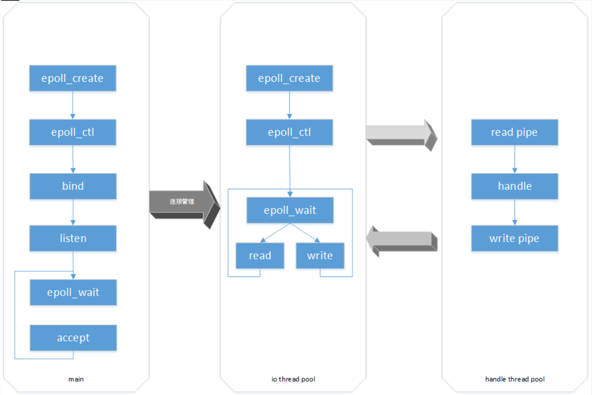

### 小结

上面介绍了常见的网络服务器模型，还有AIO、协程，甚至还有其他的变型，在这里不再讨论。重要的是理解每种场景中所面临的问题和每种模型的特点，设计出符合应用场景的方案才是好方案。


## 3、多线程并发服务器模型

下面我们主要讨论多线程并发服务器模型。

### 代码结构

并发服务器代码结构如下：

```c
thread_func()
{
	while(1) {
    	recv(...);
  		process(...);
    	send(...);
  	}
  	close(...);
}

main()
{
	socket(...); 
    bind(...);
	listen(...);
 	while(1) { 
 		accept(...);
 		pthread_create();
 	}
}
```

由上可以看出，服务器分为两部分：主线程、子线程。

#### 主线程

main函数即主线程，它的主要任务如下：

1. socket()创建监听套接字；
2. bind（）绑定端口号和地址；
3. listen（）开启监听；
4. accept（）等待客户端的连接，
5. **当有客户端连接时，accept（）会创建一个新的套接字new_fd；**
6. **主线程会创建子线程，并将new_fd传递给子线程。**

#### 子线程

1. ==子线程函数为thread_func（），他通过new_fd处理和客户端所有的通信任务。==


# 一、搭建一个多线程的服务器模型

### 客户端连接服务器详细步骤

下面我们分步骤来看客户端连接服务器的分步说明。

#### 1. 客户端连接服务器

1. 服务器建立起监听套接字listen_fd，并初始化；
2. **客户端创建套接字fd1；**
3. 客户端client1通过套接字fd1连接服务器的listen_fd；

> 

#### 2. 主线程创建子线程thread1

1. server收到client1的连接请求后，**accpet函数会返回一个新的套接字newfd1;**
2. **后面server与client1的通信就依赖newfd1**，==监听套接字listen_fd会继续监听其他客户端的连接；==
3. 主线程通过pthead_create()创建一个子线程thread1，**并把newfd1传递给thread1；**
4. ==server与client1的通信就分别依赖newfd1、fd1。==
5. client1为了能够实时收到server发送的信息，同时还要能够从键盘上读取数据，这两个操作都是阻塞的，没有数据的时候进程会休眠，所以必须创建子线程read_thread;
6. **client1的主线负责从键盘上读取数据并发送给，子线程read_thread负责从server接受信息。**

> 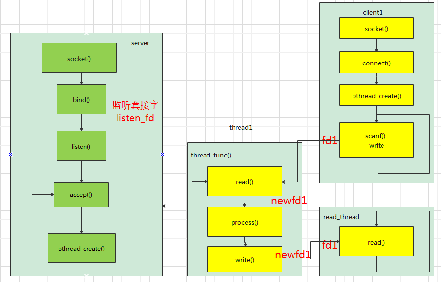

#### 3. client2连接服务器

1. 客户端client2创建套接字fd2;
2. 通过connect函数连接server的listen_fd；

#### 4. 主线程创建子线程thread2

1. server收到client2的连接请求后，**accpet函数会返回一个新的套接字newfd2;**
2. 后面server与client2的通信就依赖newfd2，监听套接字listen_fd会继续监听其他客户端的连接；
3. 主线程通过pthead_create()创建一个子线程thread2，并把newfd2传递给thread2；
4. server与client1的通信就分别依赖newfd2、fd2。
5. 同样client2为了能够实时收到server发送的信息，同时还要能够从键盘上读取数据必须创建子线程read_thread;
6. client1的主线负责从键盘上读取数据并发送给，子线程read_thread负责从server接受信息。

> 

由上图可见，==每一个客户端连接server后，server都要创建一个专门的thread负责和该客户端的通信；每一个客户端和server都有一对固定的fd组合用于连接。==


### 实例

本例的主要功能描述如下：

1. 实现多个客户端可以同时连接服务器；
2. 客户端可以实现独立的收发数据；
3. 客户端发送数据给服务器后，服务器会将数据原封不动返回给客户端。

#### 服务器端

```c
/*********************************************
		   服务器程序  TCPServer.c
*********************************************/
#include <stdio.h>
#include <sys/types.h>
#include <sys/socket.h>
#include <arpa/inet.h>
#include <errno.h>
#include <string.h>
#include <pthread.h>
#include <stdlib.h>

#define RECVBUFSIZE 2048

void *rec_func(void *arg)
{
	int sockfd, new_fd, nbytes;
	char buffer[RECVBUFSIZE];
	int i;
	new_fd = *((int *)arg);
	free(arg);

	while (1)
	{
		if ((nbytes = recv(new_fd, buffer, RECVBUFSIZE, 0)) == -1)
		{
			fprintf(stderr, "Read Error:%s\n", strerror(errno));
			exit(1);
		}
		if (nbytes == -1)
		{ //客户端出错了 返回值-1
			close(new_fd);
			break;
		}
		if (nbytes == 0)
		{ //客户端主动断开连接，返回值是0
			close(new_fd);
			break;
		}
		buffer[nbytes] = '\0';
		printf("I have received:%s\n", buffer);

		if (send(new_fd, buffer, strlen(buffer), 0) == -1)
		{
			fprintf(stderr, "Write Error:%s\n", strerror(errno));
			exit(1);
		}
	}
}

int main(int argc, char *argv[])
{
	char buffer[RECVBUFSIZE];
	int sockfd, new_fd, nbytes;
	struct sockaddr_in server_addr;
	struct sockaddr_in client_addr;
	int sin_size, portnumber;
	char hello[] = "Hello! Socket communication world!\n";
	pthread_t tid;
	int *pconnsocke = NULL;
	int ret, i;

	if (argc != 2)
	{
		fprintf(stderr, "Usage:%s portnumber\a\n", argv[0]);
		exit(1);
	}

	/*端口号不对，退出*/
	if ((portnumber = atoi(argv[1])) < 0)
	{
		fprintf(stderr, "Usage:%s portnumber\a\n", argv[0]);
		exit(1);
	}

	/*服务器端开始建立socket描述符 sockfd用于监听*/
	if ((sockfd = socket(AF_INET, SOCK_STREAM, 0)) == -1)
	{
		fprintf(stderr, "Socket error:%s\n\a", strerror(errno));
		exit(1);
	}

	/*服务器端填充 sockaddr结构*/
	bzero(&server_addr, sizeof(struct sockaddr_in));
	server_addr.sin_family = AF_INET;
	/*自动填充主机IP*/
	server_addr.sin_addr.s_addr = htonl(INADDR_ANY); //自动获取网卡地址
	server_addr.sin_port = htons(portnumber);

	/*捆绑sockfd描述符*/
	if (bind(sockfd, (struct sockaddr *)(&server_addr), sizeof(struct sockaddr)) == -1)
	{
		fprintf(stderr, "Bind error:%s\n\a", strerror(errno));
		exit(1);
	}

	/*监听sockfd描述符*/
	if (listen(sockfd, 10) == -1)
	{
		fprintf(stderr, "Listen error:%s\n\a", strerror(errno));
		exit(1);
	}

	while (1)
	{
		/*服务器阻塞，直到客户程序建立连接*/
		sin_size = sizeof(struct sockaddr_in);
		if ((new_fd = accept(sockfd, (struct sockaddr *)&client_addr, &sin_size)) == -1)
		{
			fprintf(stderr, "Accept error:%s\n\a", strerror(errno));
			exit(1);
		}

		pconnsocke = (int *)malloc(sizeof(int));
		*pconnsocke = new_fd;

		/*创建新线程去处理*/
		ret = pthread_create(&tid, NULL, rec_func, (void *)pconnsocke);
		if (ret < 0)
		{
			perror("pthread_create err");
			return -1;
		}
	}
	// close(sockfd);
	exit(0);
}
```

#### 客户端

```c
/*********************************************
		   服务器程序  TCPServer.c
*********************************************/
#include <stdio.h>
#include <sys/types.h>
#include <sys/socket.h>
#include <arpa/inet.h>
#include <errno.h>
#include <string.h>
#include <pthread.h>
#include <stdlib.h>

#define RECVBUFSIZE 1024

void *func(void *arg)
{
	int sockfd, new_fd, nbytes;
	char buffer[RECVBUFSIZE];

	new_fd = *((int *)arg);
	free(arg);

	while (1)
	{
		if ((nbytes = recv(new_fd, buffer, RECVBUFSIZE, 0)) == -1)
		{
			fprintf(stderr, "Read Error:%s\n", strerror(errno));
			exit(1);
		}
		buffer[nbytes] = '\0';
		printf("I have received:%s\n", buffer);
	}
}

int main(int argc, char *argv[])
{
	int sockfd;
	char buffer[RECVBUFSIZE];
	struct sockaddr_in server_addr;
	struct hostent *host;
	int portnumber, nbytes;
	pthread_t tid;
	int *pconnsocke = NULL;
	int ret;

	//检测参数个数
	if (argc != 3)
	{
		fprintf(stderr, "Usage:%s hostname portnumber\a\n", argv[0]);
		exit(1);
	}
	// argv2 存放的是端口号 ，读取该端口，转换成整型变量
	if ((portnumber = atoi(argv[2])) < 0)
	{
		fprintf(stderr, "Usage:%s hostname portnumber\a\n", argv[0]);
		exit(1);
	}
	//创建一个 套接子
	if ((sockfd = socket(AF_INET, SOCK_STREAM, 0)) == -1)
	{
		fprintf(stderr, "Socket Error:%s\a\n", strerror(errno));
		exit(1);
	}

	//填充结构体，ip和port必须是服务器的
	bzero(&server_addr, sizeof(server_addr));
	server_addr.sin_family = AF_INET;
	server_addr.sin_port = htons(portnumber);
	server_addr.sin_addr.s_addr = inet_addr(argv[1]); // argv【1】 是server ip地址

	/*阻塞等待连接*/
	if (connect(sockfd, (struct sockaddr *)(&server_addr), sizeof(struct sockaddr)) == -1)
	{
		fprintf(stderr, "Connect Error:%s\a\n", strerror(errno));
		exit(1);
	}

	//创建线程
	pconnsocke = (int *)malloc(sizeof(int));
	*pconnsocke = sockfd;

	ret = pthread_create(&tid, NULL, func, (void *)pconnsocke);
	if (ret < 0)
	{
		perror("pthread_create err");
		return -1;
	}
	while (1)
	{
#if 1
		printf("input msg:");
		scanf("%s", buffer);
		if (send(sockfd, buffer, strlen(buffer), 0) == -1)
		{
			fprintf(stderr, "Write Error:%s\n", strerror(errno));
			exit(1);
		}
#endif
	}
	close(sockfd);
	exit(0);
}
```

#### 编译

编译线程，需要用到pthread库，编译命令如下：

1. gcc s.c -o s -lpthread
2. gcc cli.c -o c -lpthread 先本机测试
3. 开启一个终端 ./s 8888
4. 再开一个终端 ./cl 127.0.0.1 8888,输入一个字符串"qqqqqqq"
5. 再开一个终端 ./cl 127.0.0.1 8888,输入一个字符串"yikoulinux

> 

有读者可能会注意到，server创建子线程的时候用的是以下代码：

```c
int *pconnsocke = NULL;
pconnsocke = (int *)malloc(sizeof(int));
*pconnsocke = new_fd;

ret = pthread_create(&tid, NULL, rec_func, (void *)pconnsocke);
if (ret < 0)
{
	perror("pthread_create err");
	return -1;
}
```


## 为什么必须要malloc一块内存专门存放这个新的套接字呢？

这个是一个很隐蔽，很多新手都容易犯的错误。要讲清楚这个问题的原因需要一些背景知识：

1. Linux创建一个新进程时，新进程会创建一个主线程；
2. 每个用户进程有自己的地址空间，**系统为每个用户进程创建一个task_struct来描述该进程， 实际上task_struct 和地址空间映射表一起用来，表示一个进程；**
3. Linux里同样用task_struct来描述一个线程，线程和进程都参与统一的调度；
4. 进程内的不同线程执行是同一程序的不同部分，各个线程并行执行，受操作系统异步调度；
5. 由于进程的地址空间是私有的，因此在进程间上下文切换时，系统开销比较大；
6. ==在同一个进程中创建的线程共享该进程的地址空间。==

明白这些基础知识后，下面我来看下，当进程创建一个子线程的时候，传递的参数情况：


### 直接传递栈中内存地址

我们首先分析下如果创建子线程传递的是局部变量new_fd的地址这种情况。

>

由上图所示：

1. 创建一个线程，如果我们按照图中传递参数方法，那么new_fd是在栈中的，创建子线程的时候我们把new_fd地址传递给了thread1，线程回调参数arg的地址是new_fd地址。
2. **因为主函数会一直循环不退出，所以new_fd一直存在栈中。**用这种方法的确可以把new_fd的值3传递到子线程的局部变量fd，这样子线程就可以使用这个fd与客户端通信。
3. 但是因为我们设计的是并发服务器模型，我们没有办法预测客户端什么时候会连接我们的服务器，==假设遇到一个极端情况，在同一时刻，多个客户端同时连接服务器，那么主线程是要同时创建多个子线程的。==


### 多个客户端同时连接服务器

> 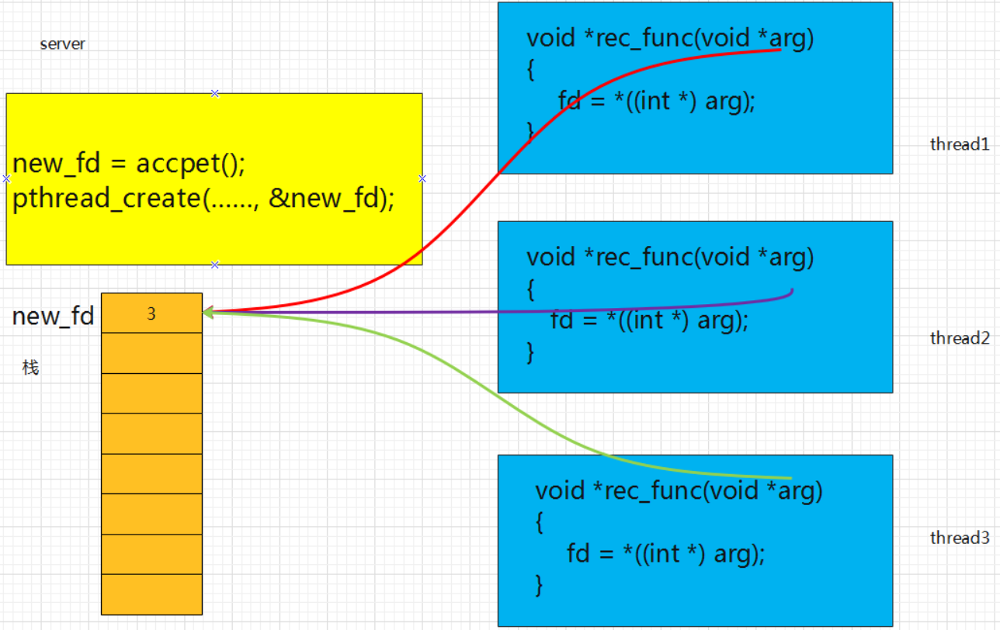

如上图所示，所有新建的的thread回调函数的参数arg存放的都是new_fd的地址。如果客户端连接的时候时间间隔比较大，是没有问题的，==但是在一些极端的情况下还是有可能出现由于高并发引起的错误。==

**我们来捋一下极端的调用时序**

#### 第一步：

>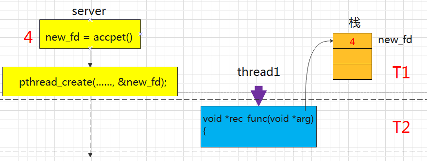

如上图所示：

1. T1时刻，当客户端1连接服务器的时候，服务器的accept函数会创建新的套接字4；
2. T2时刻，创建了子线程thread1，同时子线程回调函数参数arg指向了栈中new_fd对应的内存。
3. 假设，正在此时，又有一个客户端要连接服务器，而且thread1页已经用尽了时间片，那么主线程server会被调度到。

#### 第二步：

>

如上图所示：

1. T3时刻，主线程server接受了客户端的连接，accept函数会创建新的套接字5，同时创建子线程thread2，此时OS调度的thread2；
2. T4时刻，thread2通过arg得到new_fd了的值5,并存入fd；
3. ==T5时刻，时间片到了，调度thread1，thread1通过arg去读取new_fd，此时栈中new_fd的值已经被5覆盖了；==
4. ==所以出现了2个线程同时使用同一个fd的情况发生。==

这种情况的发生，虽然概率很低，但是并不代表不发生，该bug就是在解决实际项目中遇到过的。


### 传递堆内存地址

如果采用**传递堆的地址**的方式，我们看下图：

>

1. T1时刻，当客户端1连接服务器的时候，服务器的accept函数会创建新的套接字4，**在堆中申请一块内存，用指针pconnsocke指向该内存，同时将4保存到堆中；**
2. T2时刻，创建了子线程thread1，同时**子线程回调函数参数arg指向了堆中pconnsocke指向的内存。**
3. 假设，正在此时，又有一个客户端要连接服务器，而且thread1页已经用尽了时间片，那么主线程server会被调度到。
4. T3时刻，主线程server接受了客户端的连接，accept函数会创建新的套接字5，**在堆中申请一块内存，用指针pconnsocke指向该内存，同时将5保存到堆中**，然后创建子线程thread2；
5. T4时刻，**thread2通过arg指向了堆中pconnsocke指向的内存**，此处值为5,并存入fd；
6. T5时刻，时间片到了，调度thread1，thread1通过arg去读取fd，此时堆中数据位4；
7. 就不会出现了2个线程同时使用同一个fd的情况发生。


# 二、实现聊天室的登录、注册功能

上一篇我们已经讲了如何搭建一个多线程的服务器模型，可以支持多个客户端同时连接服务器，本篇我们来**实现多个客户端，如何实现向服务器注册信息，并实现登录的功能。**

### 数据结构

接着上一篇的实例代码继续增加功能。==要实现注册和登录功能，那么我们就必须要让服务器和客户端在交互数据包的时候按照统一的格式收发信令。==

**信令格式**

```c
// C/S通信的结构体
struct protocol
{
	int cmd;	   //命令
	int state;	   //存储命令返回信息
	char name[32]; //用户名
	char data[64]; //数据
};
```

**命令类型：**信令格式中命令定义如下：

```c
/*cmd*/
#define BROADCAST 0X00000001  //广播数据
#define PRIVATE 0X00000002	  //私聊
#define REGISTE 0X00000004	  //注册账号
#define LOGIN 0X00000008	  //登录
#define ONLINEUSER 0X00000010 //显示在线用户
#define LOGOUT 0X00000020	  //退出
```

**在线用户信息：**服务器需要维护所有用户信息，需要知道用户是否在线，是否注册。

```c
//在线用户
struct ONLINE
{
	int fd;			 //-1：该用户下线   >0:该用户已经登录，对应的套接字
	int flage;		 //-1 该条目没有用户信息  1：该条目有用户注册信息
	char name[32];	 //注册的用户名字
	char passwd[32]; //用户名密码
};
struct ONLINE online[MAX_USER_NUM];
```

注册的客户端信息需要存储在服务器，为了简单起见，我们暂时不用数据库存储，只==定义一个全局的数组保存客户端信息，并且规定只允许64个客户端登录。==

**服务器处理结果返回值**

```c
/*return code*/
#define OP_OK 0X80000000		   //操作成功
#define ONLINEUSER_OK 0X80000001   //显示在线用户，未结束
#define ONLINEUSER_OVER 0X80000002 //显示在线用户，已经发送完毕
#define NAME_EXIST 0X80000003	   //注册信息，用户名已经存在
#define NAME_PWD_NMATCH 0X80000004 //登录时，输入的用户名密码不对
#define USER_LOGED 0X80000005	   //登录时，提示该用户已经在线
#define USER_NOT_REGIST 0X80000006 //登录时，提示用户没有注册
```


### 功能流程图

现在我们根据功能，首先画一个流程图。

#### 注册

> 

由上图所示：

1. 服务器要先启动，监听客户端的连接；
2. 客户端启动，首先连接服务器，并显示登陆、注册界面；
3. 服务器接收到客户端连接后，会创建一个子线程专门用于于客户端的通信；
4. **选择注册后，提示输入用户名、密码，封装注册信息到结构体变量msg中，并发送该信令给服务器；**
5. 服务器接收到客户端注册信息后，进入注册处理流程；
6. ==注册功能：==
   - 首先查找该用户名是否存在，数组online[]中注册的位置，flage值为1，否则为-1；
   - 如果该用户名已经注册，则返回NAME_EXIST 错误信息；
   - 如果该用户名没有被注册，则找一个空闲位置，将该用户名密码保存到数据库online[]中，并返回注册成功的信令；

7. 客户端接收到服务器注册处理指令后，会打印提示信息，并显示步骤2的菜单。

#### 登录

>

由上图所示：

1. 服务器要先启动，监听客户端的连接；
2. 客户端启动，首先连接服务器，并显示登陆、注册界面；
3. 服务器接收到客户端连接后，会创建一个子线程专门用于于客户端的通信；
4. **选择登陆后，提示输入用户名、密码，封装登陆信息到结构体变量msg中，并发送该信令给服务器；**
5. 服务器接收到客户端注册信息后，进入登陆处理流程；
6. 登陆功能：
   - 首先查找该用户名、密码是否在数组online[]中存在匹配项，找到返回对应的下标，并将于该客户端相连接的套接字保存到对应的条目中，返回登陆成功信息给客户端；
   - 如果没有找到，则返回-1，并返回0X80000004错误信息给客户端；
7. 客户端接收到服务器注册处理指令后，会打印提示信息，并设置客户端在线的标记login_f 为1，此时会显示 聊天功能对应的菜单。


### 代码

chat.h

```c
#ifndef _TCP_CHAT
#define _TCP_CHAT

#include <sys/socket.h>
#include <netinet/in.h>
#include <arpa/inet.h>
#include <stdio.h>
#include <sys/types.h>
#include <sys/stat.h>
#include <fcntl.h>
#include <string.h>
#include <pthread.h>
#include <stdlib.h>
#include <string.h>

#define SERVER_PORT 8888
#define MAX_USER_NUM 64

//在线用户
struct ONLINE
{
	int fd;	   //-1
	int flage; // registed or not
	char name[32];
	char passwd[32];
};

// C/S通信的结构体
struct protocol
{
	int cmd;
	int state;
	char name[32];
	char data[64];
};

/*cmd*/
#define BROADCAST 0X00000001
#define PRIVATE 0X00000002
#define REGISTE 0X00000004
#define LOGIN 0X00000008
#define ONLINEUSER 0X00000010
#define LOGOUT 0X00000020

/*return code*/
#define OP_OK 0X80000000
#define ONLINEUSER_OK 0X80000001
#define ONLINEUSER_OVER 0X80000002
#define NAME_EXIST 0X80000003
#define NAME_PWD_NMATCH 0X80000004
#define USER_LOGED 0X80000005
#define USER_NOT_REGIST 0X80000006

#endif
```

client.c

```c
/*********************************************
		   公众号:一口Linux
*********************************************/
#include "chat.h"

int sockfd;
int addrlen;
struct sockaddr_in server_addr;
pthread_t pid;
int login_f = -1;

void *func(void *arg)
{
	int len;
	char buf[64] = {0};

	while (1)
	{
		if (login_f != 1)
		{
			continue;
		}

		len = read(sockfd, buf, sizeof(buf));
		if (len <= 0)
		{
			close(sockfd);
			return;
		}
		buf[len] = '\0';

		printf("%s\n", buf);
	}
}

void broadcast(int fd)
{
}

void private(int fd)
{
}

void list_online_user(sockfd)
{
}

int registe(int fd)
{
	struct protocol msg, msgback;
	msg.cmd = REGISTE;
	printf("input your name\n");
	scanf("%s", msg.name);
	printf("input your passwd\n");
	scanf("%s", msg.data);

	write(sockfd, &msg, sizeof(msg));
	read(sockfd, &msgback, sizeof(msgback));
	if (msgback.state != OP_OK)
	{
		printf("Name had exist,try again!\n");
		getchar();
		getchar();
		return -1;
	}
	else
	{
		printf("Regist success!\n");
		getchar();
		getchar();
		return 0;
	}
}

int login(int fd)
{
	struct protocol msg, msgback;

	msg.cmd = LOGIN;
	printf("input your name\n");
	scanf("%s", msg.name);
	printf("input your passwd\n");
	scanf("%s", msg.data);

	write(sockfd, &msg, sizeof(msg));
	read(sockfd, &msgback, sizeof(msgback));
	if (msgback.state != OP_OK)
	{
		printf("Name had exist,try again!\n");
		getchar();
		getchar();
		login_f = -1;
		return NAME_PWD_NMATCH;
	}
	else
	{
		printf("Login success!\n");
		getchar();
		getchar();
		login_f = 1;
		return OP_OK;
	}
}

int logout(int fd)
{
	close(fd);
	login_f = -1;
}

int main(int argc, char **argv)
{
	int sel;
	int ret;
	int min_sel, max_sel;
	int portnumber;
	struct protocol msg;

	if (argc < 3)
	{
		printf("cmd: %s ip portnumber\n", argv[0]);
		return;
	}
	// argv2 存放的是端口号 ，读取该端口，转换成整型变量
	if ((portnumber = atoi(argv[2])) < 0)
	{
		fprintf(stderr, "Usage:%s hostname portnumber\a\n", argv[0]);
		exit(1);
	}
	sockfd = socket(PF_INET, SOCK_STREAM, 0);
	if (sockfd < 0)
	{
		perror("socket() fail\n");
		return;
	}

	server_addr.sin_family = PF_INET;
	server_addr.sin_port = htons(portnumber);
	server_addr.sin_addr.s_addr = inet_addr(argv[1]);

	addrlen = sizeof(struct sockaddr_in);

	connect(sockfd, (struct sockaddr *)&server_addr, addrlen);
	pthread_create(&pid, NULL, func, NULL);
	while (1)
	{
		// getchar();
		system("clear");
		if (login_f == -1)
		{
			printf("\t 1 注册\n");
			printf("\t 2 登录\n");
		}
		else if (login_f == 1)
		{
			printf("\t 3 公聊\n");
			printf("\t 4 私聊\n");
			printf("\t 5 在线列表\n");
		}
		printf("\t 0 退出\n");

		fflush(stdin);
		scanf("%d", &sel);
		if (sel == 0)
		{
			break;
		}
		if (login_f == 1)
		{
			min_sel = 3;
			max_sel = 5;
		}
		else if (login_f == -1)
		{
			min_sel = 1;
			max_sel = 2;
		}

		if (sel < min_sel || sel > max_sel)
		{
			printf("Valid choice ,try again\n");
			continue;
		}
		switch (sel)
		{
		case 1:
			registe(sockfd);
			break;
		case 2:
			ret = login(sockfd);
			break;
		case 3:
			broadcast(sockfd);
			break;
		case 4:
		private
			(sockfd);
			break;
		case 5:
			list_online_user(sockfd);
		case 0:
			logout(sockfd);
			break;
		default:
			break;
		}
		if (sel == 0)
		{
			exit(0);
		}
	}
}
```

server.c

```c
/*********************************************
		   公众号:一口Linux
*********************************************/
#include "chat.h"

struct ONLINE online[MAX_USER_NUM];

void del_user_online(int index)
{
	int i;
	char buf[128] = {0};

	if (index < 0)
	{
		return;
	}
	online[index].fd = -1;
	sprintf(buf, "%s offline\n", online[index].name);
	//通知所有客户端，某个用户下线了
	for (i = 0; i < MAX_USER_NUM; i++)
	{
		if (online[i].fd == -1)
		{
			continue;
		}
		write(online[i].fd, buf, strlen(buf));
	}
	return;
}

int add_user(int sockfd, struct protocol *msg)
{
	int i, index = -1;
	char buf[128] = {0};

	for (i = 0; i < 64; i++) //添加到在线用户列表
	{
		if (online[i].flage == -1)
		{
			online[i].flage = 1;
			strcpy(online[i].name, msg->name);
			strcpy(online[i].passwd, msg->data);
			printf("regist %s to %d \n", msg->name, i);
			index = i;
			return index;
		}
	}
	return index;
}

void broadcast(int index, struct protocol *msg)
{
}

int find_dest_user_online(int sockfd, int *index, struct protocol *msg)
{
	int i;

	for (i = 0; i < MAX_USER_NUM; i++)
	{
		// this pos not use
		if (online[i].flage == -1)
		{
			continue;
		}

		if ((strcmp(msg->name, online[i].name) == 0) && (strcmp(msg->data, online[i].passwd) == 0))
		{
			if (online[i].fd == -1)
			{
				online[i].fd = sockfd;
				*index = i;
				return OP_OK;
			}
			else
			{
				// user had loged
				printf("%s had login\n", online[i].name);
				return USER_LOGED;
			}
		}
	}
	return NAME_PWD_NMATCH;
}

int find_dest_user(char *name)
{
	int i;

	for (i = 0; i < MAX_USER_NUM; i++)
	{

		if (online[i].flage == -1)
		{
			continue;
		}

		if (strcmp(name, online[i].name) == 0)
		{
			return i;
		}
	}
	return -1;
}

void private(int index, struct protocol *msg)
{
}

void list_online_user(int index)
{
}

void registe(int sockfd, int *index, struct protocol *msg)
{
	int dest_index;
	char buf[128];
	struct protocol msg_back;

	msg_back.cmd = REGISTE;
	//找到那个人
	dest_index = find_dest_user(msg->name);

	if (dest_index == -1)
	{ // this user can registe
		*index = add_user(sockfd, msg);

		online[*index].flage = 1;
		msg_back.state = OP_OK;

		printf("user %s regist success!\n", msg->name);
		write(sockfd, &msg_back, sizeof(msg_back));

		return;
	}
	else
	{
		msg_back.state = NAME_EXIST;
		printf("user %s exist!\n", msg->name);

		write(sockfd, &msg_back, sizeof(msg_back));
		return;
	}
}

void login(int sockfd, int *index, struct protocol *msg)
{
	int i;
	int ret;
	char buf[128];
	struct protocol msg_back;

	msg_back.cmd = LOGIN;

	//找到那个人
	ret = find_dest_user_online(sockfd, index, msg);

	if (ret != OP_OK)
	{
		msg_back.state = ret;
		strcpy(buf, "there is no this user\n");
		printf("user %s login fail!\n", msg->name);

		write(sockfd, &msg_back, sizeof(msg_back));
		return;
	}
	else
	{
		msg_back.state = OP_OK;
		strcpy(msg_back.data, "login success\n");
		printf("user %s login success!index =%d \n", msg->name, *index);
		write(online[*index].fd, &msg_back, sizeof(msg_back));
	}
	//通知所有客户端，某个用户上线了
	sprintf(buf, "%s online\n", online[*index].name);

	for (i = 0; i < MAX_USER_NUM; i++)
	{
		if (online[i].fd != -1)
		{
			write(online[i].fd, buf, strlen(buf));
		}
	}
}

void *func(void *arg)
{
	int sockfd = *((int *)arg);
	char buf[64];
	int len;
	int index = -1; //该用户在在线用户列表的下标
	struct protocol msg;

	free(arg);

	//进入聊天了
	while (1)
	{
		len = read(sockfd, &msg, sizeof(msg));
		if (len <= 0)
		{ //下线
			printf("%s offline\n", online[index].name);
			//从在线列表中删除
			del_user_online(index);
			close(sockfd);
			return;
		}

		switch (msg.cmd)
		{
		case REGISTE:
			registe(sockfd, &index, &msg);
			break;
		case LOGIN:
			login(sockfd, &index, &msg);
			break;
		case BROADCAST:
			broadcast(index, &msg);
			break;
		case PRIVATE:
		private
			(index, &msg);
			break;
		case ONLINEUSER:
			list_online_user(index);
			break;
		default:
			break;
		}
	}
}

int main(int argc, char **argv)
{
	int lsfd, newfd;
	int addrLen, cliaddrlen;
	struct sockaddr_in my_addr;
	struct sockaddr_in cli_adr;
	char buf[64] = "xuezhiqian fuhele\n";
	pthread_t pid;
	int *arg;
	int i;
	int portnumber;

	if (argc < 2)
	{
		printf("cmd: %s  portnumber\n", argv[0]);
		return;
	}
	/*¶˿ںŲ»¶ԣ¬͋³ö*/
	if ((portnumber = atoi(argv[1])) < 0)
	{
		fprintf(stderr, "Usage:%s portnumber\a\n", argv[0]);
		exit(1);
	}
	lsfd = socket(PF_INET, SOCK_STREAM, 0);
	if (lsfd < 0)
	{
		perror("socket() fail\n");
		return;
	}
	bzero(&my_addr, sizeof(struct sockaddr_in));
	my_addr.sin_family = PF_INET;
	my_addr.sin_port = htons(portnumber);
	my_addr.sin_addr.s_addr = htonl(INADDR_ANY);
	addrLen = sizeof(struct sockaddr_in);

	if (bind(lsfd, (struct sockaddr *)&my_addr, addrLen) < 0)
	{
		perror("bind() fail\n");
		return;
	}

	listen(lsfd, 5);
	cliaddrlen = sizeof(struct sockaddr_in);

	for (i = 0; i < 64; i++)
	{
		online[i].fd = -1;
		online[i].flage = -1;
	}
	while (1)
	{
		newfd = accept(lsfd, (struct sockaddr *)&cli_adr, &cliaddrlen);
		printf("client:ip:%s   port:%d  \n",
			   inet_ntoa(cli_adr.sin_addr), cli_adr.sin_port);

		arg = malloc(sizeof(int));
		*arg = newfd; //必须搞清楚为什么要申请内存

		pthread_create(&pid, NULL, func, (void *)arg);
	}
	close(newfd);
	close(lsfd);
}
```


### 截图

#### 客户端1注册

用户名：yikoulinux  密  码：qqqq

**客户端log**

> 

**服务器log**

>

#### 客户端2注册

用户名：yikoupeng 密  码：qqqq

**服务器/客户端log**

>

#### 客户端1登录

**登录log**

>

按下回车，客户端会隐藏登录、注册的菜单，并显示公聊、私聊、在线列表的菜单。如下图所示：

>

#### 客户端2登录

**登录log**

> 

**备注：**

1. 本篇只介绍登陆注册功能的实现；
2. ==因为本文只讨论功能的实现，对于很多异常出错的操作并没有全部完善；==
3. 在线用户的信息应该保存到数据库中【比如sqlite】，本篇为了便于读者理解，暂时用数组替代；
4. **注册登录没有实现密码的二次校验（第一遍输入错误，提示重新输入）和隐式输入（用*代替密码，思路：关闭回显，读取输入，恢复设置）。**


# 三、增加公聊、私聊

上文中，我们基于多线程的框架，实现了注册和登录的功能，这一章，我们在此基础上来==实现公聊、私聊、显示在线用户列表功能。==

### 公聊

接着上几篇的流程图我们详细讲解公聊流程图如下：

>

**如上图所示，我们去掉了网络连接和客户端登录、注册等功能，直接进入聊天的流程：**

1. 客户端从菜单选择公聊功能；
2. 输入要聊天信息；
3. 回车发送聊天信息；
4. 服务器的子线程收到公聊数据之后，进入公聊流程；
5. **查找所有在线用户，向所有的在线用户发送该公聊信息；**
6. **客户端进入聊天后会创建一个子线程，该子线程会循环接收所有服务器发送的数据信息。**


### 私聊

>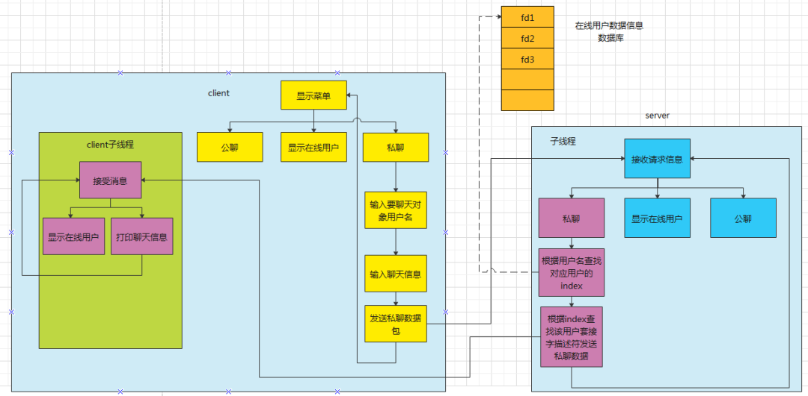

**如上图所示：**

1. 客户端从菜单选择私聊功能；
2. 输入要聊天的对象和聊天信息；
3. 发送聊天信息给服务器；
4. 服务器的子线程收到私聊数据之后，进入私聊流程；
5. **查找所有在线用户，向要私聊的在线用户发送该私聊信息；**
6. **客户端子线程会循环接收所有服务器发送的数据信息。**


### 显示在线用户

>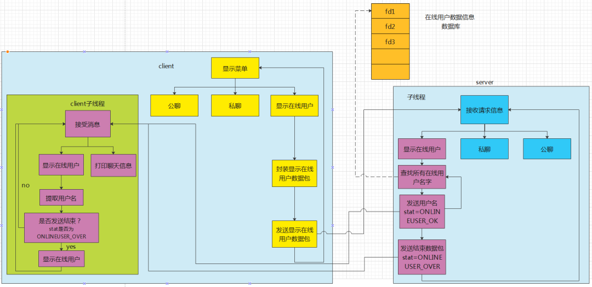

**如上图所示：**

1. 客户端从菜单选择显示在线用户功能；
2. **封装显示在线用户数据包，并发送该数据包给服务器；**
3. 服务器收到数据包后，进入显示在线用户功能模块；
4. **检查在线用户数据信息数据库，将在线用户【fd不为-1】名称封装到数据包中，一次只填充一个，stat字段填充ONLINEUSER_OK；**
5. **所有用户发送完毕，补充一个数据包，stat填充ONLINEUSER_OVER；**
6. **收到服务器发送的在线用户数据包后，客户端子线程进入显示在线用户子模块；提取数据包中在线用户名字并打印，判断该数据包stat是否为 ONLINEUSER_OVER，如果不是则继续接收下一个数据包，如果是，则提示用户显示完毕。**


### 运行截图

现在预设：客户A：yikoulinux   客户B：yikoupeng

#### 公聊

客户B发公聊：

>

客户A收到信息：

>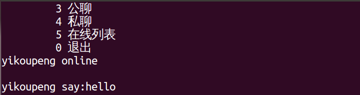

服务器log：

>

#### 私聊

客户B私发信息给A：

> 

客户A收到的消息：

> 

#### 显示在线用户信息

>


chat.h

```c
#ifndef _TCP_CHAT
#define _TCP_CHAT

#include <sys/socket.h>
#include <netinet/in.h>
#include <arpa/inet.h>
#include <stdio.h>
#include <sys/types.h>
#include <sys/stat.h>
#include <fcntl.h>
#include <string.h>
#include <pthread.h>
#include <stdlib.h>
#include <string.h>

#define SERVER_PORT 8888
#define MAX_USER_NUM 64

//在线用户
struct ONLINE
{
	int fd;	   //-1
	int flage; // registed or not
	char name[32];
	char passwd[32];
};

// C/S通信的结构体
struct protocol
{
	int cmd;
	int state;
	char name[32];
	char data[64];
};

/*cmd*/
#define BROADCAST 0X00000001
#define PRIVATE 0X00000002
#define REGISTE 0X00000004
#define LOGIN 0X00000008
#define ONLINEUSER 0X00000010
#define LOGOUT 0X00000020

/*return code*/
#define OP_OK 0X80000000
#define ONLINEUSER_OK 0X80000001
#define ONLINEUSER_OVER 0X80000002
#define NAME_EXIST 0X80000003
#define NAME_PWD_NMATCH 0X80000004
#define USER_LOGED 0X80000005
#define USER_NOT_REGIST 0X80000006

#endif
```

client.c

```c
#include "chat.h"

int sockfd;
int addrlen;
struct sockaddr_in server_addr;
pthread_t pid;
int login_f = -1;

void *func(void *arg)
{
	int len;
	char buf[128] = {0};
	struct protocol *msg;

	while (1)
	{
		if (login_f != 1)
		{
			continue;
		}
		memset(buf, 0, sizeof(buf));
		len = read(sockfd, buf, sizeof(buf));
		if (len <= 0)
		{
			close(sockfd);
			return;
		}
		msg = (struct protocol *)buf;
		//  this is show online user,
		if ((msg->state == ONLINEUSER_OK) && (msg->cmd == ONLINEUSER))
		{
			printf("%s\t", msg->name);
			continue;
		}
		if ((msg->state == ONLINEUSER_OVER) && (msg->cmd == ONLINEUSER))
		{
			printf("\n");
			continue;
		}

		buf[len] = '\0';

		printf("%s\n", buf);
	}
}

void broadcast(int fd)
{
	struct protocol msg;

	msg.cmd = BROADCAST;
	printf("say:\n#");

	scanf("%s", msg.data);

	write(fd, &msg, sizeof(msg));
}

void private(int fd)
{
	struct protocol msg;

	msg.cmd = PRIVATE;

	printf("input name you want to talk:\n#");
	scanf("%s", msg.name);

	printf("say:\n#");
	scanf("%s", msg.data);

	write(fd, &msg, sizeof(msg));
}

void list_online_user(sockfd)
{
	struct protocol msg;

	msg.cmd = ONLINEUSER;

	write(sockfd, &msg, sizeof(msg));
	getchar();
	getchar();
	/*
	while(1)
	{
	  read(sockfd ,&msg,sizeof(msg));
	  if(msg.state == ONLINEUSER_OK)
	  {
		printf("%s\t",msg.name);
	  }else{
		break;
	  }
	}*/
}

int registe(int fd)
{
	struct protocol msg, msgback;

	msg.cmd = REGISTE;
	printf("input your name\n");
	scanf("%s", msg.name);
	printf("input your passwd\n");
	scanf("%s", msg.data);

	write(sockfd, &msg, sizeof(msg));
	read(sockfd, &msgback, sizeof(msgback));
	if (msgback.state != OP_OK)
	{
		printf("Name had exist,try again!\n");
		getchar();
		getchar();
		return -1;
	}
	else
	{
		printf("Regist success!\n");
		getchar();
		getchar();
		return 0;
	}
}

int login(int fd)
{
	struct protocol msg, msgback;

	msg.cmd = LOGIN;
	printf("input your name\n");
	scanf("%s", msg.name);
	printf("input your passwd\n");
	scanf("%s", msg.data);

	write(sockfd, &msg, sizeof(msg));
	read(sockfd, &msgback, sizeof(msgback));
	if (msgback.state != OP_OK)
	{
		printf("Name had exist,try again!\n");
		getchar();
		getchar();
		login_f = -1;
		return NAME_PWD_NMATCH;
	}
	else
	{
		printf("Login success!\n");
		getchar();
		getchar();
		login_f = 1;
		return OP_OK;
	}
}

int logout(int fd)
{
	close(fd);
	login_f = -1;
}

int main(int argc, char **argv)
{
	int sel;
	int ret;
	int min_sel, max_sel;
	int portnumber;

	struct protocol msg;

	if (argc < 3)
	{
		printf("cmd: %s ip portnumber\n", argv[0]);
		return;
	}
	// argv2 存放的是端口号 ，读取该端口，转换成整型变量
	if ((portnumber = atoi(argv[2])) < 0)
	{
		fprintf(stderr, "Usage:%s hostname portnumber\a\n", argv[0]);
		exit(1);
	}
	sockfd = socket(PF_INET, SOCK_STREAM, 0);
	if (sockfd < 0)
	{
		perror("socket() fail\n");
		return;
	}

	server_addr.sin_family = PF_INET;
	server_addr.sin_port = htons(portnumber);
	server_addr.sin_addr.s_addr = inet_addr(argv[1]);

	addrlen = sizeof(struct sockaddr_in);

	connect(sockfd, (struct sockaddr *)&server_addr, addrlen);
	pthread_create(&pid, NULL, func, NULL);
	while (1)
	{
		// getchar();
		system("clear");
		if (login_f == -1)
		{
			printf("\t 1 娉ㄥ唽 \n");
			printf("\t 2 鐧诲綍 \n");
		}
		else if (login_f == 1)
		{
			printf("\t 3 鍏亰 \n");
			printf("\t 4 绉佽亰 \n");
			printf("\t 5 鍦ㄧ嚎鍒楄〃 \n");
		}
		printf("\t 0 閫€鍑?\n");

		fflush(stdin);
		scanf("%d", &sel);
		if (sel == 0)
		{
			break;
		}
		if (login_f == 1)
		{
			min_sel = 3;
			max_sel = 5;
		}
		else if (login_f == -1)
		{
			min_sel = 1;
			max_sel = 2;
		}

		if (sel < min_sel || sel > max_sel)
		{
			printf("Valid choice ,try again\n");
			continue;
		}
		switch (sel)
		{
		case 1:
			registe(sockfd);
			break;
		case 2:
			ret = login(sockfd);
			break;
		case 3:
			broadcast(sockfd);
			break;
		case 4:
		private
			(sockfd);
			break;
		case 5:
			list_online_user(sockfd);
			break;
		case 0:
			logout(sockfd);
			break;
		default:
			break;
		}
		if (sel == 0)
		{
			exit(0);
		}
	}
}
```

server.c

```c
#include "chat.h"

struct ONLINE online[MAX_USER_NUM];

void del_user_online(int index)
{
	int i;
	char buf[128] = {0};

	if (index < 0)
	{
		return;
	}
	online[index].fd = -1;
	sprintf(buf, "%s offline\n", online[index].name);
	//通知所有客户端，某个用户下线了
	for (i = 0; i < MAX_USER_NUM; i++)
	{
		if (online[i].fd == -1)
		{
			continue;
		}
		write(online[i].fd, buf, strlen(buf));
	}
	return;
}

int add_user(int sockfd, struct protocol *msg)
{
	int i, index = -1;
	char buf[128] = {0};

	for (i = 0; i < 64; i++) //添加到在线用户列表
	{
		if (online[i].flage == -1)
		{
			online[i].flage = 1;
			strcpy(online[i].name, msg->name);
			strcpy(online[i].passwd, msg->data);
			printf("regist %s to %d \n", msg->name, i);
			index = i;
			return index;
		}
	}
	return index;
}

void broadcast(int index, struct protocol *msg)
{
	int i;
	char buf[128] = {0};

	sprintf(buf, "%s say:%s\n", online[index].name, msg->data);

	for (i = 0; i < MAX_USER_NUM; i++)
	{ // jump offline and sender self
		if ((online[i].fd == -1) || (i == index))
		{
			continue;
		}
		write(online[i].fd, buf, strlen(buf));
	}
}

int find_dest_user_online(int sockfd, int *index, struct protocol *msg)
{
	int i;

	for (i = 0; i < MAX_USER_NUM; i++)
	{
		// this pos not use
		if (online[i].flage == -1)
		{
			continue;
		}

		if ((strcmp(msg->name, online[i].name) == 0) && (strcmp(msg->data, online[i].passwd) == 0))
		{
			if (online[i].fd == -1)
			{
				online[i].fd = sockfd;
				*index = i;
				return OP_OK;
			}
			else
			{
				// user had loged
				printf("%s had login\n", online[i].name);
				return USER_LOGED;
			}
		}
	}
	return NAME_PWD_NMATCH;
}

int find_dest_user(char *name)
{
	int i;

	for (i = 0; i < MAX_USER_NUM; i++)
	{

		if (online[i].flage == -1)
		{
			continue;
		}

		if (strcmp(name, online[i].name) == 0)
		{
			return i;
		}
	}
	return -1;
}

void private(int index, struct protocol *msg)
{
	int dest_index;
	char buf[128];
	//找到那个人
	dest_index = find_dest_user(msg->name);

	if (dest_index == -1)
	{
		sprintf(buf, "there is no  user :%s \n", msg->name);
		write(online[index].fd, buf, strlen(buf));
		return;
	}
	else
	{
		sprintf(buf, "%s say to %s:%s\n", online[index].name, online[dest_index].name, msg->data);
		write(online[dest_index].fd, buf, strlen(buf));
		return;
	}
}

void list_online_user(int index)
{
	int i;
	struct protocol msg;

	for (i = 0; i < MAX_USER_NUM; i++)
	{
		if (online[i].fd == -1)
		{
			continue;
		}
		memset(&msg, 0, sizeof(msg));

		msg.cmd = ONLINEUSER;
		msg.state = ONLINEUSER_OK;
		strcpy(msg.name, online[i].name);

		printf("list online[i].name =%s \n", online[i].name);

		write(online[index].fd, &msg, sizeof(msg));
	}
	msg.cmd = ONLINEUSER;
	msg.state = ONLINEUSER_OVER;

	write(online[index].fd, &msg, sizeof(msg));
}

void registe(int sockfd, int *index, struct protocol *msg)
{
	int dest_index;
	char buf[128];
	struct protocol msg_back;

	msg_back.cmd = REGISTE;
	//找到那个人
	dest_index = find_dest_user(msg->name);

	if (dest_index == -1)
	{ // this user can registe
		*index = add_user(sockfd, msg);

		online[*index].flage = 1;
		msg_back.state = OP_OK;

		printf("user %s regist success!\n", msg->name);
		write(sockfd, &msg_back, sizeof(msg_back));

		return;
	}
	else
	{
		msg_back.state = NAME_EXIST;
		printf("user %s exist!\n", msg->name);

		write(sockfd, &msg_back, sizeof(msg_back));
		return;
	}
}

void login(int sockfd, int *index, struct protocol *msg)
{
	int i;
	int ret;
	char buf[128];
	struct protocol msg_back;

	msg_back.cmd = LOGIN;

	//找到那个人
	ret = find_dest_user_online(sockfd, index, msg);

	if (ret != OP_OK)
	{
		msg_back.state = ret;
		strcpy(buf, "there is no this user\n");
		printf("user %s login fail!\n", msg->name);

		write(sockfd, &msg_back, sizeof(msg_back));
		return;
	}
	else
	{
		msg_back.state = OP_OK;
		strcpy(msg_back.data, "login success\n");
		printf("user %s login success!index =%d \n", msg->name, *index);
		write(online[*index].fd, &msg_back, sizeof(msg_back));
	}
	//通知所有客户端，某个用户上线了
	sprintf(buf, "%s online\n", online[*index].name);

	for (i = 0; i < MAX_USER_NUM; i++)
	{
		if (online[i].fd != -1)
		{
			write(online[i].fd, buf, strlen(buf));
		}
	}
}

void *func(void *arg)
{
	int sockfd = *((int *)arg);
	char buf[64];
	int len;
	int index = -1; //该用户在在线用户列表的下标
	struct protocol msg;

	free(arg);
	//客户端连接后 必须先输入一个名字,不考虑数据类型出错，以及重名问题,也不考虑人数满了的情况
	//  read(sockfd,&msg,sizeof(msg));

	//  index = add_user_online(sockfd,&msg);

	//进入聊天了
	while (1)
	{
		len = read(sockfd, &msg, sizeof(msg));
		if (len <= 0)
		{ //下线
			printf("%s offline\n", online[index].name);
			//从在线列表中删除
			del_user_online(index);
			close(sockfd);
			return;
		}

		switch (msg.cmd)
		{
		case REGISTE:
			registe(sockfd, &index, &msg);
			break;
		case LOGIN:
			login(sockfd, &index, &msg);
			break;
		case BROADCAST:
			broadcast(index, &msg);
			break;
		case PRIVATE:
		private
			(index, &msg);
			break;
		case ONLINEUSER:
			list_online_user(index);
			break;
		default:
			break;
		}
	}
}

int main(int argc, char **argv)
{
	int lsfd, newfd;
	int addrLen, cliaddrlen;
	struct sockaddr_in my_addr;
	struct sockaddr_in cli_adr;
	char buf[64] = "xuezhiqian fuhele\n";
	pthread_t pid;
	int *arg;
	int i;
	int portnumber;

	if (argc < 2)
	{
		printf("cmd: %s  portnumber\n", argv[0]);
		return;
	}
	/*׋ࠚۅһהì΋Զ*/
	if ((portnumber = atoi(argv[1])) < 0)
	{
		fprintf(stderr, "Usage:%s portnumber\a\n", argv[0]);
		exit(1);
	}
	lsfd = socket(PF_INET, SOCK_STREAM, 0);
	if (lsfd < 0)
	{
		perror("socket() fail\n");
		return;
	}
	bzero(&my_addr, sizeof(struct sockaddr_in));
	my_addr.sin_family = PF_INET;
	my_addr.sin_port = htons(portnumber);
	my_addr.sin_addr.s_addr = htonl(INADDR_ANY);
	addrLen = sizeof(struct sockaddr_in);

	if (bind(lsfd, (struct sockaddr *)&my_addr, addrLen) < 0)
	{
		perror("bind() fail\n");
		return;
	}

	listen(lsfd, 5);
	cliaddrlen = sizeof(struct sockaddr_in);

	for (i = 0; i < 64; i++)
	{
		online[i].fd = -1;
		online[i].flage = -1;
	}
	while (1)
	{
		newfd = accept(lsfd, (struct sockaddr *)&cli_adr, &cliaddrlen);
		printf("client:ip:%s   port:%d  \n",
			   inet_ntoa(cli_adr.sin_addr), cli_adr.sin_port);

		arg = malloc(sizeof(int));
		*arg = newfd; //必须搞清楚为什么要申请内存

		pthread_create(&pid, NULL, func, (void *)arg);
	}
	close(newfd);
	close(lsfd);
}
```


# 四、增加数据库sqlite功能

### 一. 调整目录结构

为了方便编译，现在我们将前面文章的代码结构做如下调整。

```
root@ubuntu:/mnt/hgfs/code/chat# tree .
.
├── chat_client
│   ├── include
│   ├── Makefile
│   ├── obj
│   │   └── Makefile
│   └── src
│       ├── client.c
│       └── Makefile
├── chat.h
├── chat_server
│   ├── bin
│   │   └── server
│   ├── data
│   ├── include
│   ├── Makefile
│   ├── obj
│   │   └── server.o
│   └── src
│       ├── Makefile
│       └── server.c
└── gcc.sh

10 directories, 15 files
```

**最终增加了数据的文件目录如下：**

```
peng@ubuntu:/mnt/hgfs/code/chat-sqlite$ tree .
.
├── chat_client
│   ├── include
│   ├── Makefile
│   ├── obj
│   │   └── Makefile
│   └── src
│       ├── client.c
│       └── Makefile
├── chat.h
├── chat_server
│   ├── data
│   ├── include
│   │   └── data.h
│   ├── Makefile
│   ├── obj
│   │   └── Makefile
│   └── src
│       ├── data.c
│       ├── Makefile
│       └── server.c
├── clean.sh
├── gcc.sh
├── user.db
└── 解压密码.txt

9 directories, 17 files
```

**clean.sh** 用于清除临时文件 **gcc.sh** 用于编译整个工程

服务端代码放置到chat_server目录下；客户端代码放置到chat_client目录下；

**数据库相关代码放在chat_server/data下。**

**chat.h是所有客户端和服务器都会用到的头文件，所以放置在根目录下。**

后续增加功能后，新增的头文件和C文件分别添加到对应工程目录的include和src目录下即可。


### 二、 设计数据库表

我们之前维护的所有客户端的信息是用一个全局数组，并且没有保存功能，==现在我们要把所有客户端的信息全部保存到数据库中。==

数据库存储的目录

```
chat_server/data
```

数据库名：

```
user.db
```

存储用户信息的表名：

```
user
```

表user格式如下：

| 名称   | 属性             | 说明                                   |
| :----- | :--------------- | :------------------------------------- |
| name   | TEXT PRIMARY KEY | 用户名，不能重复                       |
| passwd | TEXT NOT NULL    | 密码                                   |
| fd     | INT NOT NULL     | 套接字描述符：-1表示不在线，>0表示在线 |
| regist | INT NOT NULL     | 用户名是否注册：-1没有注册，1注册      |


### 三、 主要功能操作的语句及函数

数据库操作最重要的就是语句，下面讲解针对不同的功能对应的实现语句

#### 1 创建表user

```sql
CREATE TABLE IF NOT EXISTS user(name TEXT PRIMARY KEY  NOT NULL,passwd TEXT NOT NULL,fd INT NOT NULL,regist INT  NOT NULL);
```

#### 2 增加一个用户

客户端发送注册请求后，服务器端注册用户信息到数据库中

数据库操作语句如下：

```c
insert into user values('一口Linux', '123456',-1, 1)
```

功能函数如下：

```c
int db_add_user(char name[],char passwd[])
功能：
增加一个用户，执行该函数前需要先判断该用户名是否存在

参数：
name：用户名
passwd：密码

返回值：
-1：失败
1：成功
```

#### 3 判断用户是否在线

客户端发送登陆命令后，服务器通过该函数判断该用户是否已经登陆成功

数据库操作语句如下：

```sql
select fd from user where name='一口Linux'
```

功能函数如下：

```c
int db_user_if_online(char *name,char *passwd)
功能：
判断用户是否在线，该函数主要根据fd的值来判断用户是否在线

参数：
name：用户名
passwd：密码  

返回值：
1：在线
-1：不在线
-2：用户不存在
```

#### 4 判断某个用户名是否注册

用户发送注册命令，服务器需要判断该用户名是否已经被注册过

数据库操作语句如下：

```sql
select regist from user where name='一口Linux'
```

功能函数如下：

```c
int db_user_if_reg(char *name)
功能：
判断某个用户名是否注册过

参数：
name：用户名

返回值：
 1：注册过
-1：没有注册过
```

#### 5 判断用户名密码是否正确

用户发送登陆命令，需要判断用户名密码是否正确

数据库操作语句如下：

```sql
select * from user where name='一口Linux' and passwd='123456'
```

功能函数如下：

```c
int db_user_pwd_corrct(char *name,char* passwd)
功能：
判断客户端发送的用户名密码是否正确

参数：
name：用户名
passwd：密码

返回值：
 1：正确
-1：用户名或者密码不正确
```

#### 6 用户上线、下线

用户登陆成功后，或者发送下线申请，或者异常掉线，需要更新数据库的状态。

数据库操作语句如下：

```sql
UPDATE  user set fd=-1 where name='一口Linux'
```

fd的值是套接字描述符，下线设置为-1，上线设置为对应的>0的值

功能函数如下：

```c
int db_user_on_off(int fd,char *name,unsigned int on_off) 
功能：
更新数据库中用户的fd字段

参数：
fd：套接字描述符
name：用户名
on_off：上线还是下线

返回值：
 1：正确
-1：失败
```

#### 7. 显示在线用户

用户发送显示在线用户命令后，服务器从数据库当中查找所有在线用户，并将姓名循环发送给客户端

```c
int db_list_online_user(int fd)
```


### 四、运行结果

#### 编译

```
./gcc.sh
```

#### 1.服务器启动

```
./server 9999
```

端口号设定为9999

>

#### 2. 客户端注册

客户端启动

```
./client 127.0.0.1 9999
```

选择1  注册，输入用户名密码即可。

>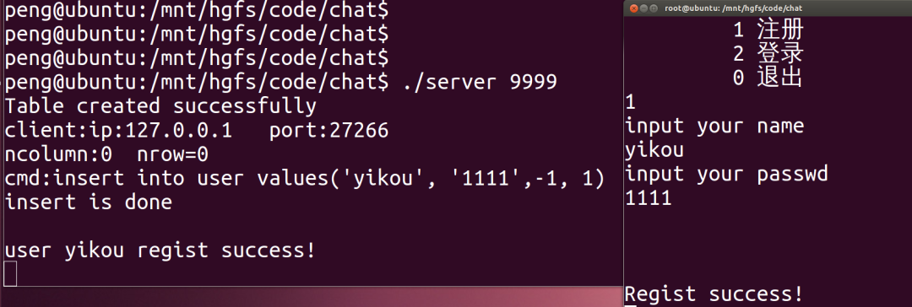

#### 3. 用户登录

输入选项2，输入刚才注册的用户名密码，如果不一致会提示错误登录成功：

#### 4. 注册登录其他几个用户

注册并登录新的用户111、222、333

>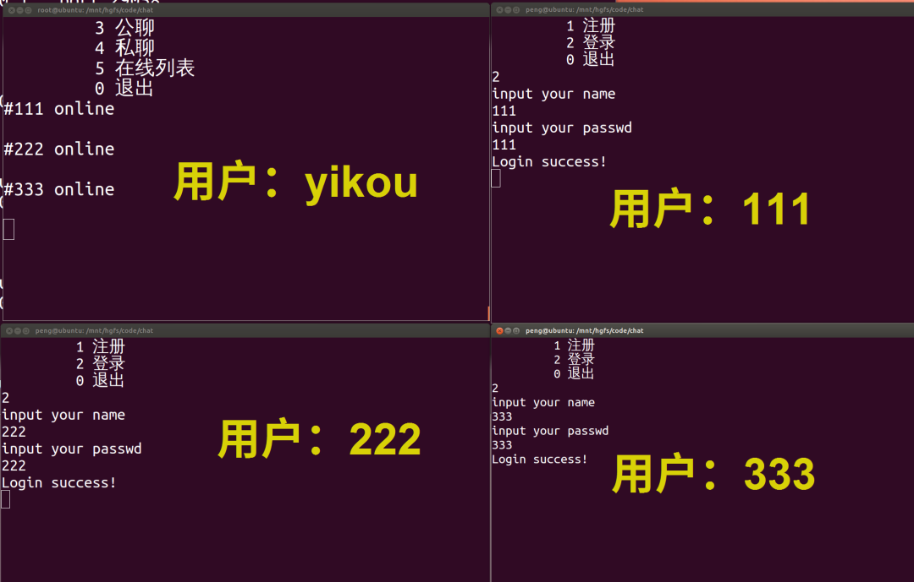

#### 5. 公聊

选择选项3，即进入公聊， 用户yikou向所有用户说：hello！

>

可见所有用户均收到信息。

#### 6. 私聊

用户yikou向用户111发送信息：

> 

由下图可知，只有用户111收到该信息，其他用户均没有收到信息。

>

#### 7. 显示在线用户

>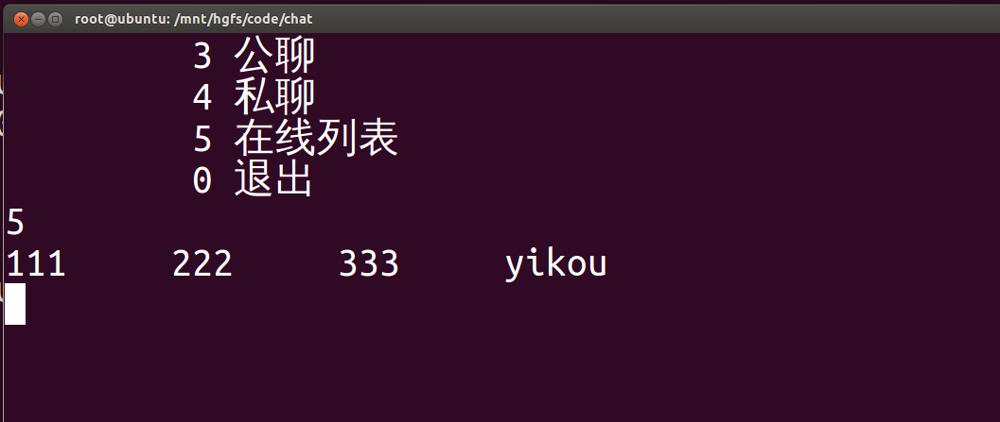

#### 8. 查看最终数据库信息

>


### 五、代码说明

为方便读者学习增加数据库和去掉数据之间的差别，

用git维护版本。

>

切换到没有数据库的版本，执行下面命令即可。

```
git reset --hard  597330ae0a183c9db8f68b7c9f60df94f8965778
```

要切回有数据库的版本执行下面的命令：

```
git reset --hard 10bfbfaf2d09ae895313273c960ecfd84663f9fd
```

使用数据库后，数据的存储管理更加方便，数据类型更易于扩充， 逻辑关系也更加清晰。


# 五、增加数据加密功能

### 一. 调整目录结构

为了方便编译，现在我们将前面文章的代码结构做如下调整。

```shell
root@ubuntu:/mnt/hgfs/code/chat# tree .
.
├── chat_client
│   ├── include
│   ├── Makefile
│   ├── obj
│   │   └── Makefile
│   └── src
│       ├── client.c
│       └── Makefile
├── chat.h
├── chat_server
│   ├── bin
│   │   └── server
│   ├── data
│   ├── include
│   ├── Makefile
│   ├── obj
│   │   └── server.o
│   └── src
│       ├── Makefile
│       └── server.c
└── gcc.sh

10 directories, 15 files
```

服务端代码放置到chat_server目录下；客户端代码放置到chat_client目录下；

**数据库相关代码放在chat_server/data下。**

**chat.h是所有客户端和服务器都会用到的头文件，所以放置在根目录下。**

后续增加功能后，新增的头文件和C文件分别添加到对应工程目录的include和src目录下即可。


### 二、模块设计

#### 1. 设计数据库表

我们之前维护的所有客户端的信息是用一个全局数组，并且没有保存功能，现在我们要把所有客户端的信息全部保存到数据库中。

数据库存储的目录：

```
chat_server/data
```

数据库名：

```
user.db
```

存储用户信息的表名：

```
user
```

表user格式如下：

| 名称   | 属性             | 说明                                   |
| :----- | :--------------- | :------------------------------------- |
| name   | TEXT PRIMARY KEY | 用户名，不能重复                       |
| passwd | TEXT NOT NULL    | 密码                                   |
| fd     | INT NOT NULL     | 套接字描述符：-1表示不在线，>0表示在线 |
| regist | INT NOT NULL     | 用户名是否注册：-1没有注册，1注册      |

#### 2. 下发keygen流程

> 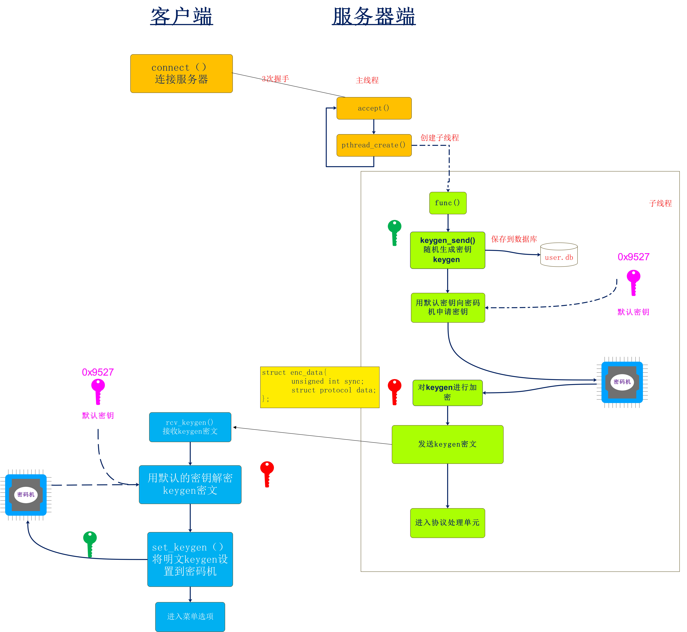

#### 3. 客户端发送数据

>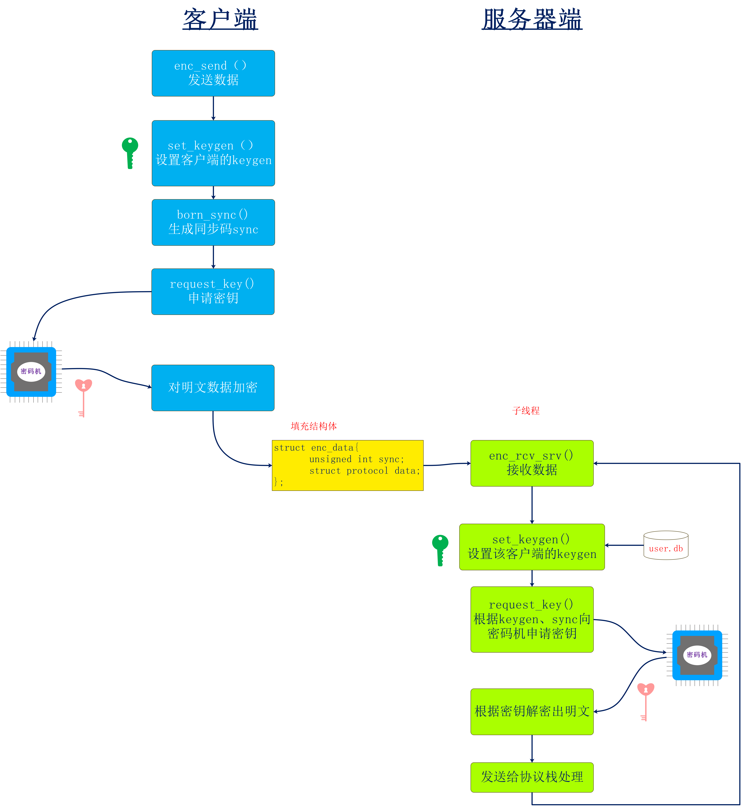

#### 4. 客户端接收数据

>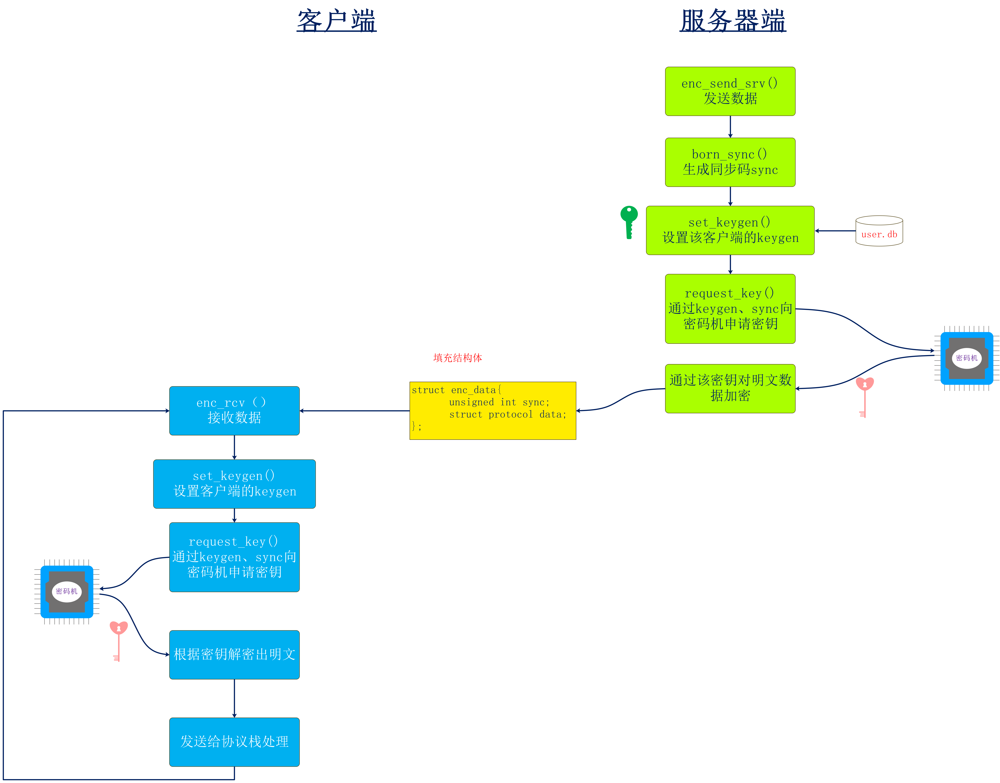


### 三、 主要功能操作的语句及函数

数据库操作最重要的就是语句，下面讲解针对不同的功能对应的实现语句

#### 1 创建表user

```sql
CREATE TABLE IF NOT EXISTS user(name TEXT PRIMARY KEY  NOT NULL,passwd TEXT NOT NULL,fd INT NOT NULL,regist INT  NOT NULL);
```

#### 2 增加一个用户

客户端发送注册请求后，服务器端注册用户信息到数据库中

数据库操作语句如下：

```sql
insert into user values('一口Linux', '123456',-1, 1)
```

功能函数如下：

```c
int db_add_user(char name[],char passwd[])
功能：
增加一个用户，执行该函数前需要先判断该用户名是否存在

参数：
name：用户名
passwd：密码

返回值：
-1：失败
1：成功
```

#### 3 判断用户是否在线

客户端发送登陆命令后，服务器通过该函数判断该用户是否已经登陆成功

数据库操作语句如下：

```sql
select fd from user where name='一口Linux'
```

功能函数如下：

```c
int db_user_if_online(char *name,char *passwd)
功能：
判断用户是否在线，该函数主要根据fd的值来判断用户是否在线

参数：
name：用户名
passwd：密码  

返回值：
1：在线
-1：不在线
-2：用户不存在
```

#### 4 判断某个用户名是否注册

用户发送注册命令，服务器需要判断该用户名是否已经被注册过

数据库操作语句如下：

```sql
select regist from user where name='一口Linux'
```

功能函数如下：

```c
int db_user_if_reg(char *name)
功能：
判断某个用户名是否注册过

参数：
name：用户名

返回值：
 1：注册过
-1：没有注册过
```

#### 5 判断用户名密码是否正确

用户发送登陆命令，需要判断用户名密码是否正确

数据库操作语句如下：

```sql
select * from user where name='一口Linux' and passwd='123456'
```

功能函数如下：

```c
int db_user_pwd_corrct(char *name,char* passwd)
功能：
判断客户端发送的用户名密码是否正确

参数：
name：用户名
passwd：密码

返回值：
 1：正确
-1：用户名或者密码不正确
```

#### 6 用户上线、下线

用户登陆成功后，或者发送下线申请，或者异常掉线，需要更新数据库的状态。

数据库操作语句如下：

```sql
UPDATE  user set fd=-1 where name='一口Linux'
```

fd的值是套接字描述符，下线设置为-1，上线设置为对应的>0的值

功能函数如下：

```c
int db_user_on_off(int fd,char *name,unsigned int on_off) 
功能：
更新数据库中用户的fd字段

参数：
fd：套接字描述符
name：用户名
on_off：上线还是下线

返回值：
 1：正确
-1：失败
```


### 四、运行结果

> 

界面与之前操作一致！

可以参考前面系列文章！

下面是操作视频：时长02:10


### 五、代码说明

本实例代码已经上传到gitee仓库， 地址：https://gitee.com/wx_98fa5ee790/chat

云盘下载的代码，log如下：

```
linux@ubuntu:/mnt/hgfs/share/code$ git log
commit 478e60fc788ff9ffedf890f164e7a61a9a650d14
Author: peng <peng@ubuntu.(none)>
Date:   Sun Nov 7 05:41:58 2021 -0800

        1.服务器端增加数据库操作功能，数据库名称：user.db 用户表：user
        2.基于数据库操作的注册、登录、上线、下线功能已经测试通过
        3.增加clean功能的脚本clean.sh
                        学习Linux嵌入式请关注公众号：一口Linux

commit 597330ae0a183c9db8f68b7c9f60df94f8965778
Author: root <root@ubuntu.(none)>
Date:   Sat Nov 6 09:15:40 2021 -0700

                这是聊天室的初始版本V0.1
                该版本包含登录、注册、公聊、私聊等功能
                请关注公众号：一口Linux
```

切换到没有数据库的版本，执行下面命令即可。

```
git reset --hard  597330ae0a183c9db8f68b7c9f60df94f8965778
```

要切回有数据库的版本执行下面的命令：

```
git reset --hard 478e60fc788ff9ffedf890f164e7a61a9a650d14
```


