# 嵌入式数据库sqlite3 - HQ

[TOC]

------

#### 注意

- 数据库的基础知识点，表的创建、增删改查等操作，以及对应的库函数的使用参考以下文章


  《[嵌入式数据库sqlite3【基础篇】-基本命令操作，小白一看就懂](https://mp.weixin.qq.com/s?__biz=MzUxMjEyNDgyNw==&mid=2247487673&idx=1&sn=1503fe6d5a9a935c69e31088989bd303&chksm=f968624dce1feb5b7f89641374c64b3d6f8fd2703c2efe652e6bb6817779dd725d66741ed012&scene=21&token=1206659739&lang=zh_CN#wechat_redirect)》


  《[嵌入式数据库sqlite3【进阶篇】-子句和函数的使用，小白一文入门](https://mp.weixin.qq.com/s?__biz=MzUxMjEyNDgyNw==&mid=2247487776&idx=1&sn=6f41a0b12195e1a8c808a9d317dd132e&chksm=f96863d4ce1feac277bc0218ea9f7f65754b0e652c8543149df598f4c8ef87f3e1646de0de4c&scene=21&token=1206659739&lang=zh_CN#wechat_redirect)》


  《[如何用C语言操作sqlite3，一文搞懂](https://mp.weixin.qq.com/s?__biz=MzUxMjEyNDgyNw==&mid=2247488235&idx=1&sn=6fa05807122804931a8bf35c78d221bd&chksm=f968601fce1fe909ebcd396000dea7d864f94cd891abfbaabc20550268b89fb7113f81092a93&scene=21&token=1206659739&lang=zh_CN#wechat_redirect)》


  《[手把手教你如何实现一个简单的数据加解密算法](https://mp.weixin.qq.com/s?__biz=MzUxMjEyNDgyNw==&mid=2247499346&idx=1&sn=24e51acab57c498b853780933cc276f0&chksm=f96b8ca6ce1c05b06ebd06cc2cb7081caba86cc2602bc7b234fc08b62ba1363b918f306e419f&scene=21&token=787829922&lang=zh_CN#wechat_redirect)》


- 

------

# 嵌入式数据库sqlite3【基础篇】

## 前言

数据在实际工作中应用非常广泛，数据库的产品也比较多，oracle、DB2、SQL2000、mySQL；基于嵌入式linux的数据库主要有SQLite, Firebird, Berkeley DB, eXtremeDB。

本文主要讲解数据库SQLite，通过这个开源的小型的嵌入式数据库带领大家掌握一些基本的数据库操作，这些操作在很多系统中都是通用的，可谓学一通百。

### SQLite介绍


SQLite，是一款轻型的数据库，是遵守ACID的关系型数据库管理系统，它包含在一个相对小的C库中。

> 作者D.RichardHipp
>
> 2000年1月，Hipp开始和一个同事讨论关于创建一个简单的嵌入式SQL数据库的想法，这个数据库将使用GNU DBM哈希库（gdbm）做后台，同时这个数据库将不需要安装和管理支持。后来，一有空闲时间，Hipp就开始实施这项工作，2000年8月，SQLite 1.0版发布了。【在此向大神献上我的膝盖！】
>
> 它的设计目标是嵌入式的，而且已经在很多嵌入式产品中使用了它，它占用资源非常的低，在嵌入式设备中，可能只需要几百K的内存就够了。它能够支持Windows/Linux/Unix等等主流的操作系统，同时能够跟很多程序语言相结合，比如 Tcl、C#、PHP、Java等，还有ODBC接口，同样比起Mysql、PostgreSQL这两款开源的世界著名数据库管理系统来讲，它的处理速度比他们都快。
>

### SQLite特性

1. 零配置一无需安装和管理配置；
2. 储存在单一磁盘文件中的一个完整的数据库；
3. 数据库文件可以在不同字节顺序的机器间自由共享；
4. 支持数据库大小至2TB；
5. 足够小，全部源码大致3万行c代码，250KB；
6. 比目前流行的大多数数据库对数据的操作要快。


## 安装

现在运行的主要是sqlite3版本，在ubuntu下安装也非常方便。

```
sudo apt-get install sqlite sqlite3   安装应用程序
sudo apt-get install libsqlite3-dev   安装库+头文件，用代码操作数据库必须安装
```

查看版本号：==输入命令 sqlite3 进入操作界面==，输入命令.version，即可查看详细版本号。

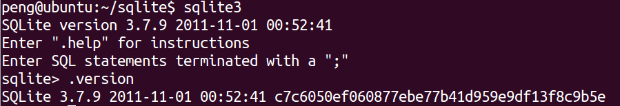

也可以使用下面命令，安装图形化操作工具：

```
sudo apt-get install sqlitebrowser    图形化工具建立数据库
```

> 

除此之外，还可以部署在windows下，本文只讨论ubtuntu下，采用命令行方式来操作数据库。


## 数据类型

操作数据库，主要就是操作表，表的每一列内容都有一定数据类型，比如整型值、字符串、布尔型等。

**Sqlite3主要数据类型如下：**

| 数据类型 | 定义                                                         |
| :------- | :----------------------------------------------------------- |
| NULL     | 表示该值为NULL值。                                           |
| INTEGER  | 无符号整型值。                                               |
| REAL     | 浮点值。                                                     |
| TEXT     | 文本字符串，存储使用的编码方式为UTF-8、UTF-16BE、UTF-16LE。  |
| BLOB     | 存储Blob数据，该类型数据和输入数据完全相同，1表示true，0表示false。 |

**同时sqlite3也接受如下的数据类型：**

| 数据类型      | 定义                                                         |
| :------------ | :----------------------------------------------------------- |
| smallint      | 16位的整数。                                                 |
| interger      | 32位的整数。                                                 |
| decimal(p,s)  | 精确值p是指全部有几个十进制数,s是指小数点后可以有几位小数。如果没有特别指定，则系统会默认为p=5 s=0 。 |
| float         | 32位元的实数。                                               |
| double        | 64位元的实数。                                               |
| char(n)       | n 长度的字串，n不能超过 254。                                |
| varchar(n)    | 长度不固定且其最大长度为 n 的字串，n不能超过 4000。          |
| graphic(n)    | 和 char(n) 一样，不过其单位是两个字节， n不能超过127。这个形态是为了支持两个字节长度的字体，如中文字。 |
| vargraphic(n) | 可变长度且其最大长度为n的双字元字串，n不能超过2000           |
| date          | 包含了 年份、月份、日期。                                    |
| time          | 包含了 小时、分钟、秒。                                      |
| timestamp     | 包含了 年、月、日、时、分、秒、千分之一秒。                  |

#### 约束

表的每一列都有一些限制属性，比如有的列的数据不能重复，有的则限制数据范围等，约束就是用来进一步描述每一列数据属性的。SQLite 数据库常用约束如下：

| 名称        | 定义     |
| :---------- | :------- |
| NOT NULL    | 非空     |
| UNIQUE      | 唯一     |
| PRIMARY KEY | 主键     |
| FOREIGN KEY | 外键     |
| CHECK       | 条件检查 |
| DEFAULT     | 默认     |

#### 非空 NOT NULL

有一些字段我们可能一时不知到该填些什么，同时它也没设定默认值， 当添加数据时，我们把这样的字段空着不填，系统认为他是 NULL 值。但是还有另外一类字段，必须被填上数据，如果不填，系统就会报错。这样的字段被称为 NOT NULL 非空字段,需要在定义表的时候事先声明。

#### 唯一 UNIQUE

除了主列以外，还有一些列也不能有重复值。

#### 主键 PRIMARY KEY

一般是整数或者字符串，只要==保证唯一==就行。在 SQLite 中，主键如果是整数类型，该列的值可以自动增长。

#### 外键 FOREIGN KEY

我们的数据库中已经有 Teachers 表了，假如我们再建立一个 Students 表， 要求 Students 表中的每一个学生都对应一个 Teachers 表中的教师。很简单，只需要在 Students 表中建立一个 TeacherId 字段，保存对应教师的 Id 号， 这样，学生和教师之间就建立了关系。问题是：我们有可能给学生存入一个不在 Teachers 表中的 TeacherId 值， 而且发现不了这个错误。这种情况下，可以把 Students 表中 TeacherId 字段声明为一个外键， 让它的值对应到 Teachers 表中的 Id 字段上。这样，一旦在 Students 表中存入一个不存在的教师 Id ，系统就会报错。

#### 默认值 DEFAULT

有一些特别的字段列，在每一条记录中，他的值基本上都是一样的。只是在个别情况下才改为别的值，这样的字段列我们可以给他设一个默认值。

#### 条件检查 CHECK

某些值必须符合一定的条件才允许存入，这是就需要用到这个 CHECK 约束。


## 常用命令

==当出现`“…>”`时候，我们在输入一个`”;”`符号，它就会在切换回`”sqlite>”`状态，接下来就可以继续你的其他操作。==

下面介绍Shell模式中的各常用命令的使用。

| 命令              | 功能                                                         |
| :---------------- | :----------------------------------------------------------- |
| .help             | 可显示shell模式中可使用的所有命令列表                        |
| .database         | 显示数据库信息；包含当前数据库的位置                         |
| .mode  column     | 使得SQL语句处理的结果以列对齐的方式显示                      |
| .mode   list      | column                                                       |
| .headers on/off   | 打开关闭列标题显示开关，以使得查询结果在屏幕显示时具有列标题 |
| .tables           | 列出当前打开的数据库中共有多少张表                           |
| .exit             | 退出SQLite环境                                               |
| .schema foods     | 显示表foods 创建时的SQL语句                                  |
| .schema           | 显示所有表被创建时的语句                                     |
| .nullvalue STRING | 查询时用指定的串代替输出的NULL串 默认为.nullvalue ''         |
| .show             | 显示shell模式中定义的与输出相关的一些设置                    |
| .output file.csv  | 设置输出文件格式为CSV，文件名为file.csv                      |
| .separator ,      | 设置select语句输出的列数据间以“ ，”分隔                      |
| .output stdout    | 恢复输出内容到标准输出设备(屏幕)                             |

【注意】sqlite的命令都是.开头的，操作语句前面是没有`.`的。


## 使用实例

数据库的操作语句主要是增删改查，下面我们通过一些实例让大家了解数据库的这些基本操作。

### 表类型

假设我们要创建一个教学管理的数据库jxgl.db，数据库中要保存学生表STUDENT。

| sno   | sname | ssex | sage | sdept |
| :---- | :---- | :--- | :--- | :---- |
| 95001 | yikou | m    | 21   | cs    |
| 95002 | peng  | m    | 21   | cs    |

根据我们的常识，可知每一列的数据有以下特性：

- sno    学号：整型值，每个人学号是唯一的，学校一般用学号来区分所有的学生，而且一般学号是递增的，所以我们设置sno为primary key；
- sname 姓名：一般是字符串，可以重复，但是不能为空；
- ssex   性别：字符串，可以为空；
- sage  年龄：整型值，假定年龄要大于14；
- sdept  专业：字符串，可以为空,此处我们默认为'CS'。

下面我们一步步实现这个数据库的所有操作。

### 创建教学管理“jxgl”数据库

数据库的打开和退出，使用如下命令。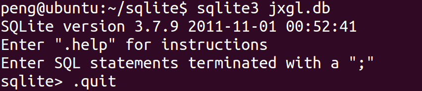

#### 创建表

```
CREATE TABLE IF NOT EXISTS STUDENT(Sno integer primary key,   Sname text not null,   Ssex text,Sage integer check(Sage>14),Sdept text default 'CS');
```

该表的属性就是按照上一节表属性 执行结果：


#### 查看表

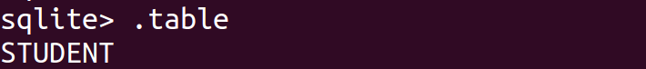

看到STUDENT，说明该表创建好了。

**【注意】**

1. ==操作语句不是命令，前面不要加. ；==
2. ==操作语句后面一定要`;`结尾，如果漏掉了，一定要补上分号；==
3. ==操作语句对字母的全角半角很敏感，所有的符号都要用半角。==

### 插入数据

插入数据采用insert into语句来实现，如下所示：

```
INSERT INTO STUDENT VALUES('95001','李勇','M',20,'CS');
INSERT INTO STUDENT VALUES('95002','刘晨','F',19,'IS');
INSERT INTO STUDENT VALUES('95003','王敏','F',18,'MA');
INSERT INTO STUDENT VALUES('95004','张立','M',18,'IS');
```

执行结果如下:

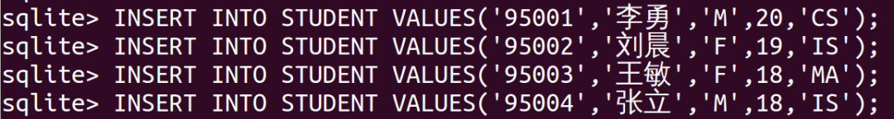

#### 插入的数据只初始化部分值

设置了not null那一列 必须要赋值，而且表名字不区分大小写。

```
insert into student(sname,sage) values ('一口',19);
```

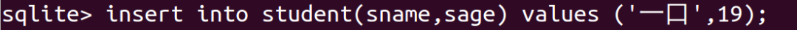

#### 查看表

用SELECT语句查看表中的内容：

```
SELECT * FROM STUDENT;
```

其中的 * 表示查看所有的数据信息。

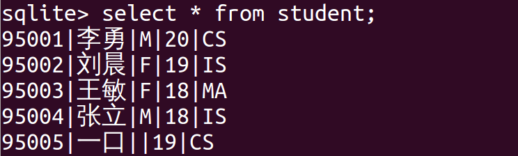

有没有看到，结果看起来不舒服啊，下面我们来调整下显示格式：

```
sqlite> .headers on          显示列名
sqlite> .mode column         列对齐
```

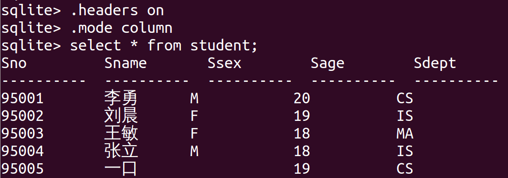

### 删除一行信息

```
delete from student where sname='一口';
```

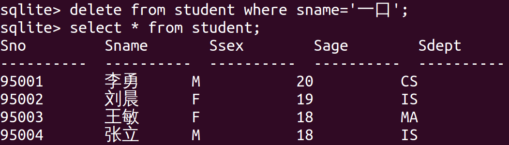由上图可见，名字为“一口”的那条记录被删除了。

### 修改一条记录的某个内容

```
UPDATE student SET sage=29 WHERE sname='张立';
```

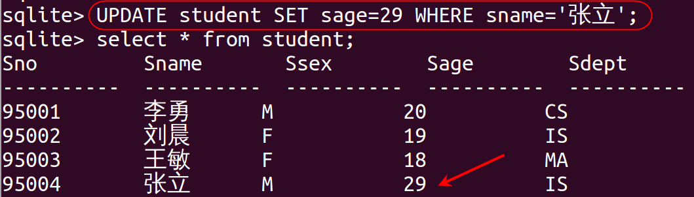

### 修改数据表结构

修改表结构，需要用到语句ALTER TABLE。下面我们向STUDENT表增加“spwd”列，其数据类型为TEXT型，用SELECT命令查看表中内容。

```
ALTER TABLE STUDENT ADD spwd TEXT default '123456';
```

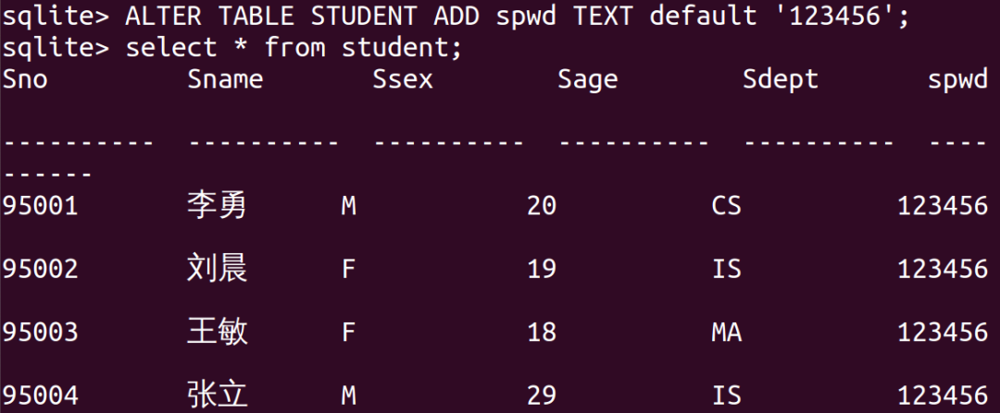

### 修改表名字

```
alter table student rename to stu;
```

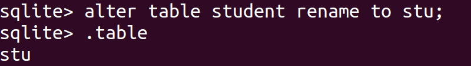

### 删除数据表

```
DROP TABLE STUDENT;
```

### 删除列

sqlite3没有实现删除一列的命令，要实现这个操作，需要先将该表拷贝到一个新表，但是只集成需要的列，要删除的列不继承过来。可以 用以下方式操作删除一列：

```
sqlite> create table test as select sno, sname,ssex,sage,sdept  from stu;
sqlite> drop table stu;
sqlite> alter table test rename to stu;
```

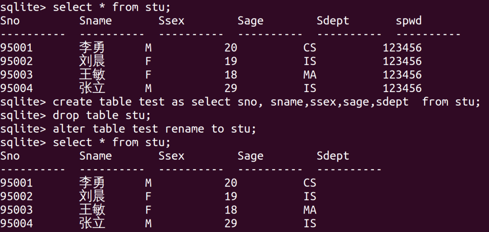由上图可知，我们刚才增加的列spwd被删除了。


## sqlite进阶

### where子句

如果我不想查看所有的数据，而指向查看某一个人的信息要怎么操作呢？我们就要借助where子句来实现。where子句可以结合操作语句来进程增删改查，是最常用的一个子句。

**根据姓名查找记录：**

```
Select * from student where sname='一口';
```

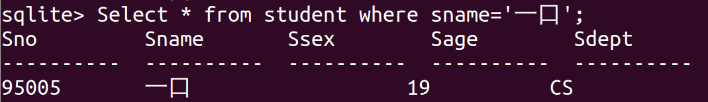

**根据学号查找记录：**

```
Select * from student where sno=95001;
```

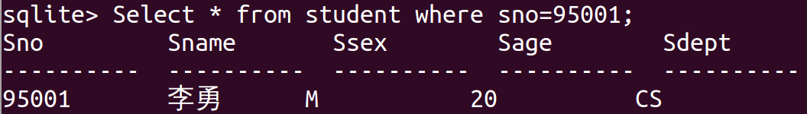

**根据姓名和年龄同时查找记录：**

```
select *from student where sname='一口' and sage=19;
```

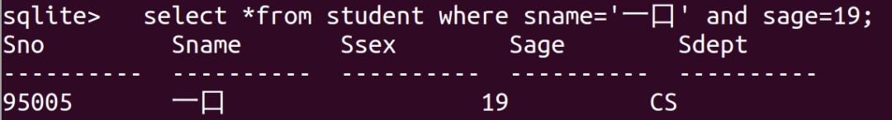

**显示某两列的数据**

```
select sno,sname from student ; 
```

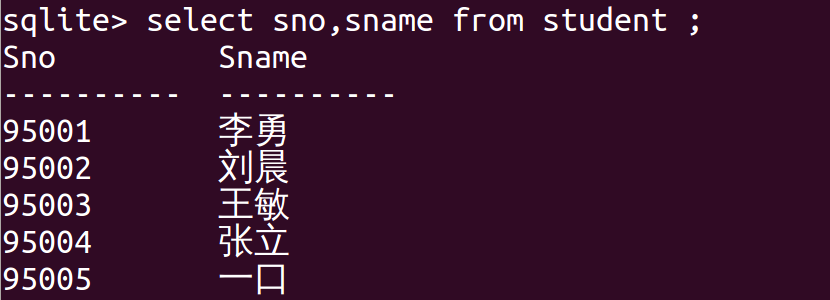

### 数据库的备份和恢复

现在我们假设要将表foods备份出为foodsdb.sql，并用命令恢复该数据库。按照以下步骤操作即可。

```
sqlite>.dump       --把创建表及向表中插入记录的所有SQL语句显示在屏幕上
sqlite>.output  foodsdb.sql --指定dump命令输出到文件的文件名
sqlite>.dump        --输出创建并插入数据到基本表的SQL语句到output指定的文件
sqlite>.output stdout  --恢复输出内容到标准输出设备(屏幕)
sqlite>.dump           --此时输出的SQL语句转回到屏幕 
sqlite>Drop table foods; --删除foods表语句说明：
```

上述Drop为SQL语句，用于删除指定的表。因为是SQL语句，因此以“;”结尾

```
sqlite>.read foodsdb.sql    --执行foodsdb.sql中的包含的所有SQL语句，用来重建刚删除的4张表及相关数据
```

好了，跟着一口君一步步操作，基本上sqlite3的增删改查操作，相信各位应该没什么问题了，sqlite还有其他一些子句以及函数的用法，留待下一篇继续介绍。


# 嵌入式数据库sqlite3【进阶篇】

### 数据库准备

新建数据库，company.db。设计一个表格employee，内容如下：

| id   | name   | age  | dep    | salary |
| :--- | :----- | :--- | :----- | :----- |
| 1    | 马云   | 21   | market | 6000   |
| 2    | 马化腾 | 22   | tech   | 7000   |
| 3    | 李彦宏 | 23   | trs    | 8600   |
| 4    | 张朝阳 | 24   | trs    | 6000   |
| 5    | 罗永浩 | 26   | tech   | 8900   |
| 6    | 王欣   | 25   | market | 4000   |

根据上述表格，我们首先确定主键是id。 创建表格命令如下：

```
CREATE TABLE employee(id integer primary key, name text,age integer , dep text, salary integer);
insert into employee values (1,'马云',21,'market',6000);
insert into employee values (2,'马化腾',22,'tech',7000);
insert into employee values (3,'李彦宏',23,'trs',8000);
insert into employee values (4,'张朝阳',24,'trs',6000);
insert into employee values (5,'罗永浩',26,'tech',8900);
insert into employee values (6,'王欣',25,'market',4000);
insert into employee values (7,'一口',18,'market',4000);
```

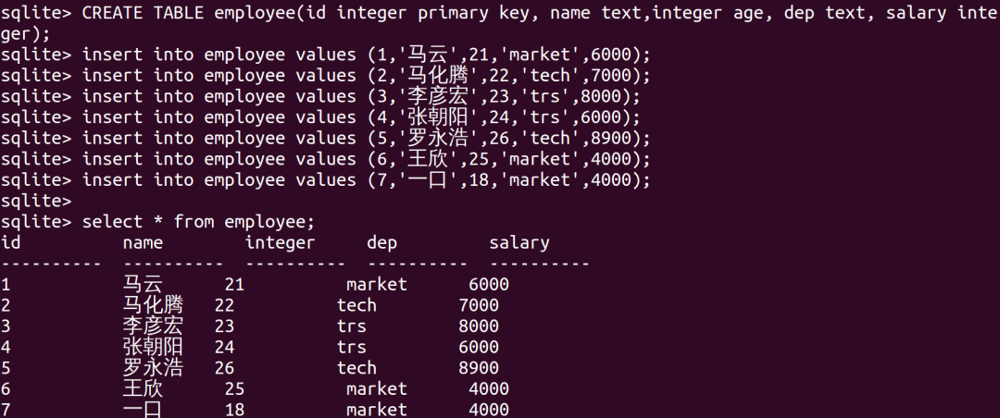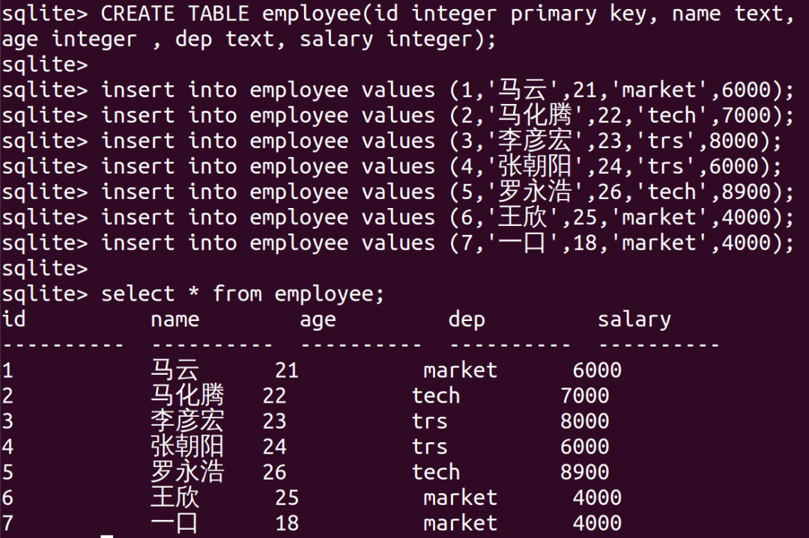

### order子句

我们可以使用order子句实现对记录的排序：

```
select * from employee order by age;
```

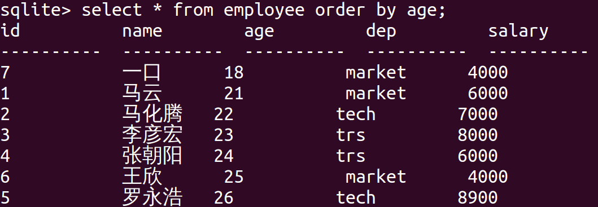

### Where 子句与逻辑运算符

SQLite的 WHERE 子句用于指定从一个表或多个表中获取数据的条件。如果满足给定的条件，即为真（true）时，则从表中返回特定的值。

可以使用 WHERE 子句来过滤记录，只获取需要的记录。WHERE 子句不仅可用在 SELECT 语句中，它也可用在 UPDATE、DELETE 语句中，等等，这些我们将在随后的章节中学习到。

#### 语法

SQLite 的带有 WHERE 子句的 SELECT 语句的基本语法如下：

```
SELECT column1, column2, columnN FROM table_name WHERE [condition]
```

#### 实例

您还可以使用比较或逻辑运算符指定条件，比如 >、<、=、>=,<= ,LIKE、NOT，等等。

下面的实例演示了 SQLite 逻辑运算符的用法。

**下面的 SELECT 语句列出了 AGE 大于等于 25 且工资大于等于 65000.00 的所有记录：**

```
 SELECT * FROM EMPLOYEE WHERE AGE >= 25 AND SALARY >= 6500;
```

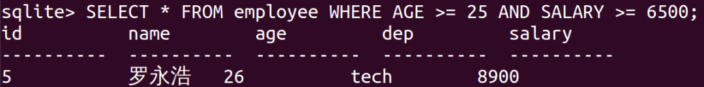

**下面的 SELECT 语句列出了 AGE 大于等于 25 或工资大于等于 65000.00 的所有记录：**

SELECT * FROM EMPLOYEE WHERE AGE >= 25 OR SALARY >= 65000;

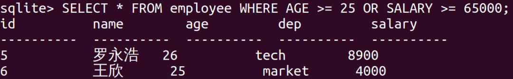

**下面的 SELECT 语句列出了 AGE 不为 NULL 的所有记录，结果显示所有的记录，意味着没有一个记录的 AGE 等于 NULL：**

```
SELECT * FROM EMPLOYEE WHERE AGE IS NOT NULL;
```

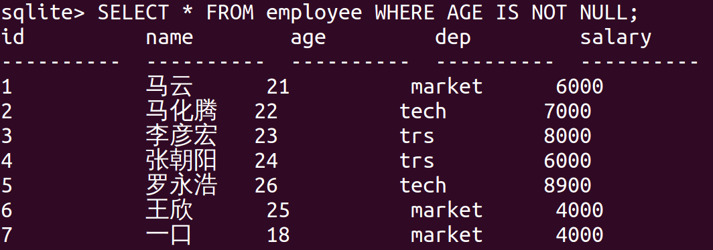

where子句还可以配合like子句一起使用。

**下面的 SELECT 语句列出了 NAME 以 'Ki' 开始的所有记录，'Ki' 之后的字符不做限制：**

```
SELECT * FROM EMPLOYEE WHERE NAME LIKE '马%'; 
```


**下面的 SELECT 语句列出了 AGE 的值为 22 或 25 的所有记录：**

```
SELECT * FROM EMPLOYEE WHERE AGE IN ( 22, 25 );
```

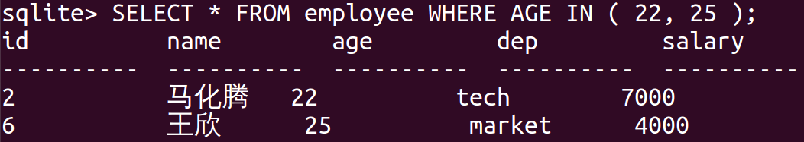

**下面的 SELECT 语句列出了 AGE 的值既不是 25 也不是 27 的所有记录：**

```
SELECT * FROM EMPLOYEE WHERE AGE NOT IN ( 22, 25 );
```

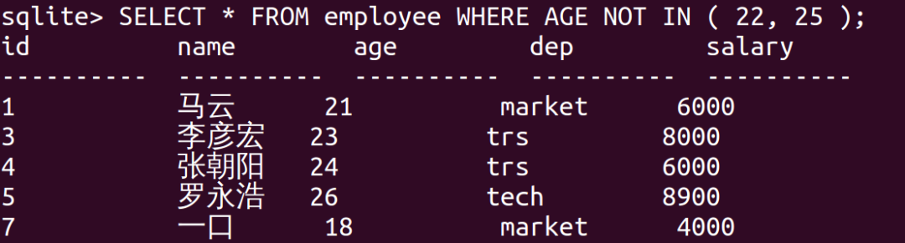

**下面的 SELECT 语句列出了 AGE 的值在 22 与 25 之间的所有记录：**

```
SELECT * FROM EMPLOYEE WHERE AGE BETWEEN 22 AND 25; 
```


### group by子句

GROUP BY 语句用于结合聚合函数，根据一个或多个列对结果集进行分组。举例：

**统计整个公司工资总和：**

```
select sum(salary) from employee;
```

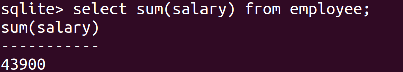

**统计每个部门的工资总和：**

```
select dep, sum(salary) from employee group by dep;
```

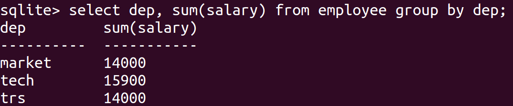

**统计各部门的工资总和并且要求id值大于3**

```
select dep, sum(salary) from employee where id>3 group by dep;    where子句要放在group by的前面。
```

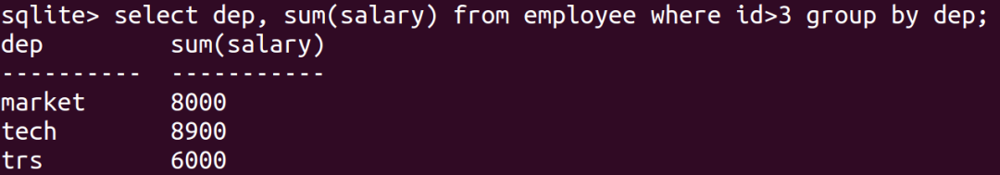

### having子句

having子句是group by的条件子句，where子句先发生，然后才是having 子句执行。

HAVING子句中能够使用三种要素：常数，聚合函数，GROUP BY子句中指定的列名(聚合建)， 用having就一定要和group by连用， 用group by不一有having（它只是一个筛选条件用的）

#### 举例

**统计各部门的工资总和并且要求id值大于3**

```
select dep, sum(salary) from employee where id>3 group by dep having sum(salary)>5000;
```

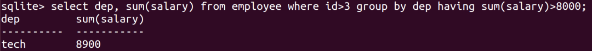

**查找重复记录的方法**

我们先插入依据名字相同的记录。

```
insert into employee values (8,'一口',19,'market',5000);
select id,name from employee group by name having count(*) > 1;
```

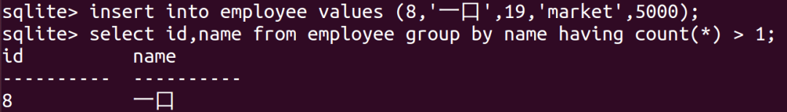

可以看到，结果显示了相同名字的重复记录。

**显示名字相同的多项**

```
select id,name,dep,salary  from employee group by name  having count(*) > 1;
```

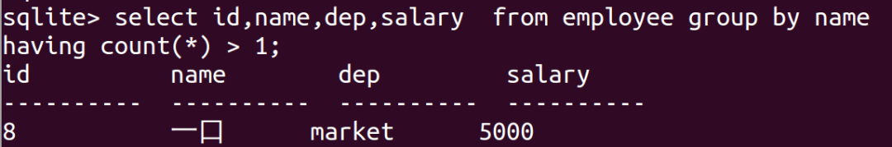

**显示table中所有的记录**

```
select count(*) from employee;
```

**显示所有记录的个数**

```
select dep,avg(salary) from employee group by dep;
```

**显示dep下每一组的平均值**

```
select * from employee where id > 3 intersect select * from employee where id < 9;
```

**显示id > 3 && id < 9 的所有记录：即4 - 8 的记录**

```
select * from employee where id > 3 union all select * from employee where id < 9;
```

**显示所有的大于3并且小于9的，并集（如果有相同的，会重复显示）**

```
select * from studentnew where id > 3 union all select * from studentnew where id < 9;
```

**显示大于9的记录**

```
select * from employee where id > 3 union all select * from studentnew where id < 6;
```

**显示大于6的记录，（与上一个进行比较）**

```
select *from employee where salary= (select salary from employee order by salary desc limit 1);
select *from employee where salary= (select max(salary) from employee );
```

**显示最高工资的所有员工的记录**

```
select name,max(salary) from employee;
```

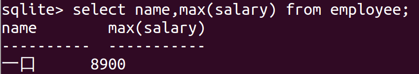

**显示table中名字不相同的员工;**

```
select distinct name from employee; 
```

**显示所有员工的名字;**

```
 select all name from employee; 
 
```

## 函数

SQLite 有许多内置函数用于处理字符串或数字数据。下面列出了一些有用的 SQLite 内置函数，且所有函数都是大小写不敏感，这意味着您可以使用这些函数的小写形式或大写形式或混合形式。欲了解更多函数的说明，可以参考 SQLite 的官方文档，下面列举常用的一些函数

| 序号 | 函数           | & 描述                                                       |
| :--- | :------------- | :----------------------------------------------------------- |
| 1.   | COUNT          | SQLite COUNT 聚集函数是用来计算一个数据库表中的行数。        |
| 2.   | MAX            | SQLite MAX 聚合函数允许我们选择某列的最大值。                |
| 3.   | MIN            | SQLite MIN 聚合函数允许我们选择某列的最小值。                |
| 4.   | AVG            | SQLite AVG 聚合函数计算某列的平均值。                        |
| 5.   | SUM            | SQLite SUM 聚合函数允许为一个数值列计算总和。                |
| 6.   | RANDOM         | SQLite RANDOM 函数返回一个介于 -9223372036854775808 和 +9223372036854775807 之间的伪随机整数。 |
| 7.   | ABS            | SQLite ABS 函数返回数值参数的绝对值。                        |
| 8.   | UPPER          | SQLite UPPER 函数把字符串转换为大写字母。                    |
| 9.   | LOWER          | SQLite LOWER 函数把字符串转换为小写字母。                    |
| 10.  | LENGTH         | SQLite LENGTH 函数返回字符串的长度。                         |
| 11.  | sqlite_version | SQLite sqlite_version 函数返回 SQLite 库的版本。             |

### SQLite COUNT 函数

SQLite COUNT 聚集函数是用来计算一个数据库表中的行数。下面是实例：

```
SELECT count(*) FROM EMPLOYEE ;
```

执行结果：

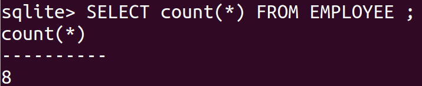

### SQLite MAX 函数

SQLite MAX 聚合函数允许我们选择某列的最大值。下面是实例：

```
SELECT max(salary) FROM EMPLOYEE ;
```

执行结果：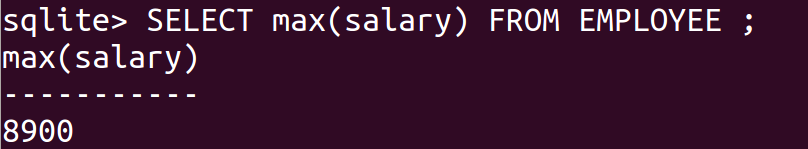

### SQLite MIN 函数

SQLite MIN 聚合函数允许我们选择某列的最小值。下面是实例：

```
SELECT min(salary) FROM EMPLOYEE ;
```

执行结果：

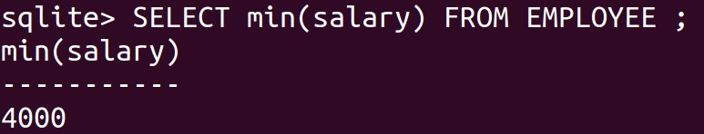在

### SQLite AVG 函数

SQLite AVG 聚合函数计算某列的平均值。下面是实例：

```
SELECT avg(salary) FROM EMPLOYEE ;
```

执行结果：

### SQLite SUM 函数

SQLite SUM 聚合函数允许为一个数值列计算总和。下面是实例：

```
SELECT sum(salary) FROM EMPLOYEE ;
```

执行结果：

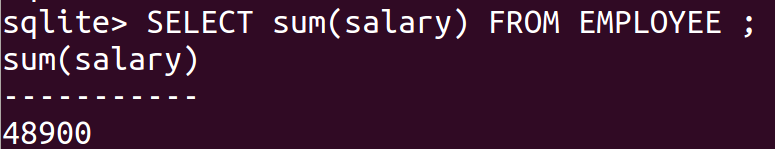在

### SQLite RANDOM 函数

SQLite RANDOM 函数返回一个介于 -9223372036854775808 和 +9223372036854775807 之间的伪随机整数。下面是实例：

```
SELECT random() AS Random;
```

执行结果：

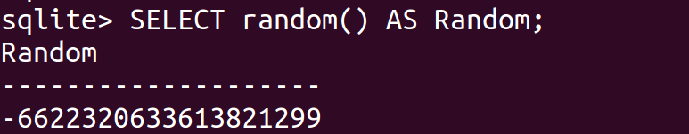在

### SQLite ABS 函数

SQLite ABS 函数返回数值参数的绝对值。下面是实例：

```
SELECT abs(5), abs(-15), abs(NULL), abs(0), abs("ABC");
```

执行结果：

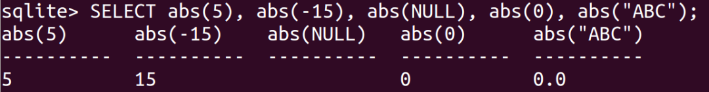

### SQLite UPPER 函数

SQLite UPPER 函数把字符串转换为大写字母。下面是实例：

```
insert into employee values (9,'yikoulinux',22,'market',8000);
SELECT upper(name) FROM EMPLOYEE ;
```

执行结果：

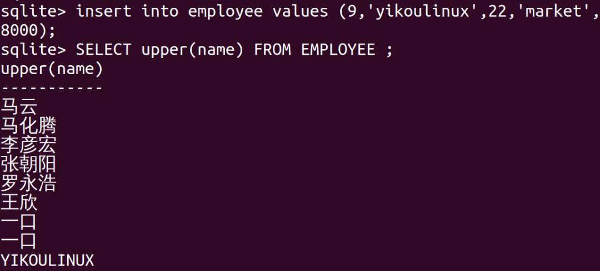

### SQLite LOWER 函数

SQLite LOWER 函数把字符串转换为小写字母。下面是实例：

```
SELECT lower(name) FROM EMPLOYEE ;
```

执行结果：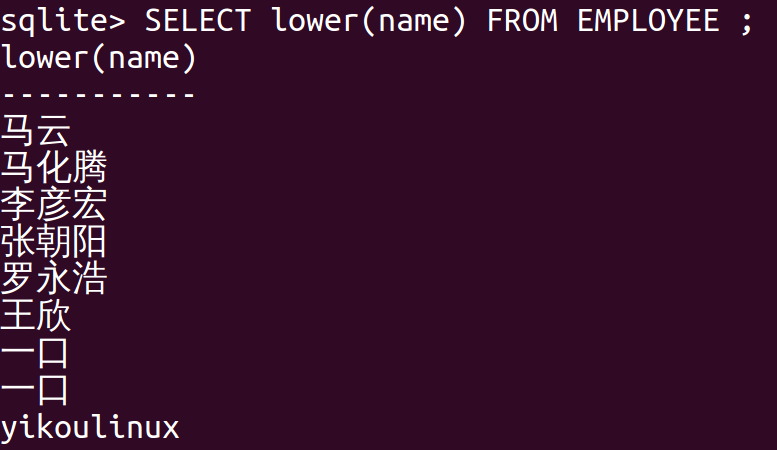

### SQLite LENGTH 函数

SQLite LENGTH 函数返回字符串的长度。下面是实例：

```
SELECT name, length(name) FROM EMPLOYEE ;
```

执行结果：

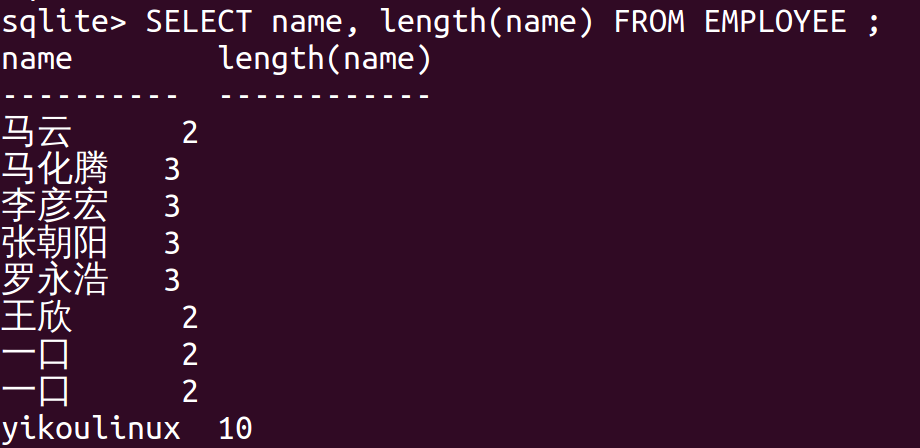

### SQLite sqlite_version 函数

SQLite sqlite_version 函数返回 SQLite 库的版本。下面是实例：

```
SELECT sqlite_version() AS 'SQLite Version';
```

执行结果：

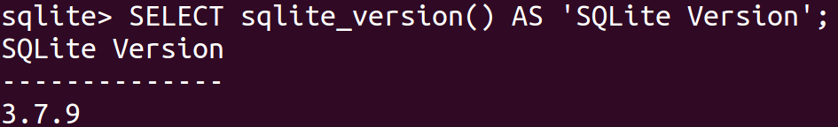


## SQLite时间/日期函数：

### datetime()

datetime() 产生日期和时间   无参数表示获得当前时间和日期

```
select datetime();
```

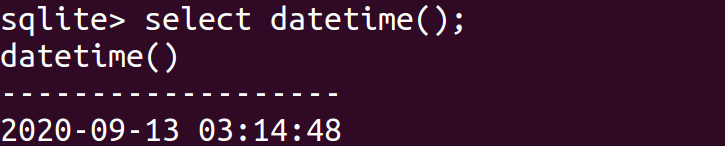

**有字符串参数则把字符串转换成日期**

```
select datetime('2012-01-07 12:01:30'); 
```

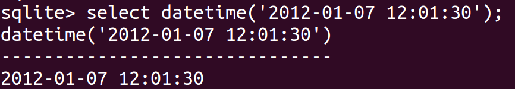

2012-01-07 12:01:30

```
select date('2019-09-09','+1 day','+1 year');
```

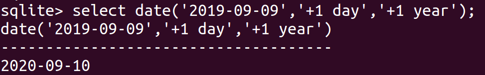

2013-01-09

```
select datetime('2019-09-09 00:20:00','+1 hour','-12 minute');
```

2019-09-09 01:08:00

```
select datetime('now','start of year');
```

2020-01-01 00:00:00

```
select datetime('now','start of month');
```

2020-09-01 00:00:00

```
select datetime('now','start of day');
```

2020-09-13 00:00:00

```
select datetime('now','localtime');
```

结果：2020-09-12 20:26:35

### date()

date()用于产生日期

```
select date('2019-09-09 12:01:30'); 
```

2019-09-09

```
select date('now','start of year');
```

2020-01-01

```
select date('2019-09-09','+1 month');
```

2019-10-09

### time()

time() 用于产生时间。

```
select time();
```

03:28:49

```
select time('23:18:59');
```

23:18:59

```
select time('23:18:59','start of day');
```

00:00:00

在时间/日期函数里可以使用如下格式的字符串作为参数：

- YYYY-MM-DD
- YYYY-MM-DD HH:MM
- YYYY-MM-DD HH:MM:SS
- YYYY-MM-DD HH:MM:SS.SSS
- HH:MM
- HH:MM:SS
- HH:MM:SS.SSS
- now

其中now是产生现在的时间。

日期不能正确比较大小,会按字符串比较，日期默认格式 dd-mm-yyyy

### strftime()

strftime() 对以上三个函数产生的日期和时间进行格式化。

strftime()函数可以把YYYY-MM-DD HH:MM:SS格式的日期字符串转换成其它形式的字符串。strftime(格式, 日期/时间, 修正符, 修正符, …)

它可以用以下的符号对日期和时间进行格式化：

```
%d 在该月中的第几天, 01-31 
%f 小数形式的秒，SS.SSS 
%H 小时, 00-23 
%j 算出某一天是该年的第几天，001-366 
%m 月份，00-12 
%M 分钟, 00-59 
%s 从1970年1月1日到现在的秒数 
%S 秒, 00-59 
%w 星期, 0-6 (0是星期天) 
%W 算出某一天属于该年的第几周, 01-53 
%Y 年, YYYY 
%% 百分号
select strftime('%Y.%m.%d %H:%M:%S','now'); 
```

2020.09.13 03:32:49

```
select strftime('%Y.%m.%d %H:%M:%S','now','localtime'); 
```

2020.09.12 20:33:24


## SELECT LIKE 用法

在SQL结构化查询语言中，LIKE语句有着至关重要的作用。

### 语法

LIKE语句的语法格式是：

```
select * from 表名 where 字段名 like 对应值（子串），
```

它主要是针对字符型字段的，它的作用是在一个字符型字段列中检索包含对应子串的。

- A）:% 包含零个或多个字符的任意字符串：

1. LIKE'Mc%' 将搜索以字母 Mc 开头的所有字符串（如 McBadden）。
2. LIKE'%inger' 将搜索以字母 inger 结尾的所有字符串（如 Ringer、Stringer）。
3. LIKE'%en%' 将搜索在任何位置包含字母 en 的所有字符串（如 Bennet、Green、McBadden）。

- B:_（下划线） 任何单个字符：LIKE'_heryl' 将搜索以字母 heryl 结尾的所有六个字母的名称（如 Cheryl、Sheryl）。
- C：[ ] 指定范围 ([a-f]) 或集合 ([abcdef]) 中的任何单个字符：

1. LIKE'[CK]ars[eo]n' 将搜索下列字符串：Carsen、Karsen、Carson 和 Karson（如 Carson）。
2. LIKE'[M-Z]inger' 将搜索以字符串 inger 结尾、以从 M 到 Z 的任何单个字母开头的所有名称（如 Ringer）。

- D：[^] 不属于指定范围 ([a-f]) 或集合 ([abcdef]) 的任何单个字符：LIKE'M[^c]%' 将搜索以字母 M 开头，并且第二个字母不是 c 的所有名称（如MacFeather）。
- E：* 它同于DOS命令中的通配符，代表多个字符：c*c代表cc,cBc,cbc,cabdfec等多个字符。
- F：？同于DOS命令中的？通配符，代表单个字符 :b?b代表brb,bFb等
- G：# 大致同上，不同的是代只能代表单个数字。k#k代表k1k,k8k,k0k 。
- F：[!] 排除 它只代表单个字符

### 举例

下面我们来举例说明一下：

- 例1，查询name字段中包含有“明”字的。

```
select * from table1 where name like '%明%'
```

- 例2，查询name字段中以“李”字开头。

```
select * from table1 where name like '李*'
```

- 例3，查询name字段中含有数字的。

```
select * from table1 where name like '%[0-9]%'
```

- 例4，查询name字段中含有小写字母的。

```
select * from table1 where name like '%[a-z]%'
```

- 例5，查询name字段中不含有数字的。

```
select * from table1 where name like '%[!0-9]%'
```

以上例子能列出什么值来显而易见。但在这里，我们着重要说明的是通配符“*”与“%”的区别。很多朋友会问，为什么我在以上查询时有个别的表示所有字符的时候用"%"而不用“*”？先看看下面的例子能分别出现什么结果：

```
select * from table1 where name like '*明*'
select * from table1 where name like '%明%'
```

大家会看到，前一条语句列出来的是所有的记录，而后一条记录列出来的是name字段中含有“明”的记录，所以说，当我们作字符型字段包含一个子串的查询时最好采用“%”而不用“*”,用“*”的时候只在开头或者只在结尾时，而不能两端全由“*”代替任意字符的情况下。

SQLITE数据库的操作，暂告一段落，虽然是轻量级数据库，但是数据库的操作基本思想是一致的，基本上是学一通百，下一章，我们来学习如何通过c语言程序来操作数据库。


# 如何用C语言操作sqlite3【实战篇】

sqlite3编程接口非常多，对于初学者来说，我们暂时只需要掌握常用的几个函数，其他函数自然就知道如何使用了。

## 数据库

本篇假设数据库为my.db,有数据表student。

| no   | name      | score |
| :--- | :-------- | :---- |
| 4    | 一口Linux | 89.0  |

创建表格语句如下：

```
CREATE TABLE  IF NOT EXISTS student (no integer primary key, name text, score real);
```


## 常用函数

### sqlite3_open

```
int   sqlite3_open(char  *path,   sqlite3 **db)；
功能：
    打开sqlite数据库
参数：
 path： 数据库文件路径
 db： 指向sqlite句柄的指针，后面对数据库所有的操作都要依赖这个句柄
返回值：
 成功返回0，失败返回错误码(非零值)
```

### sqlite3_close

```
int   sqlite3_close(sqlite3 *db);
功能：
 关闭sqlite数据库      
返回值：
 成功返回0，失败返回错误码
const  char  *sqlite3_errmsg(sqlite3 *db);
功能：
 打印错误信息        
返回值：
 返回错误信息
```


## 不使用回调函数执行SQL语句

### sqlite3_get_table

```
int   sqlite3_get_table(sqlite3 *db, const  char  *sql,  char ***resultp,  int*nrow,  int *ncolumn, char **errmsg);
功能：
 执行SQL操作
参数：
 db：数据库句柄
 sql：SQL语句
 resultp：用来指向sql执行结果的指针
 nrow：满足条件的记录的数目
 ncolumn：每条记录包含的字段数目
 errmsg：错误信息指针的地址
返回值：
 成功返回0，失败返回错误码
```

### 举例

下面比如我们要显示student表中所有的数据信息，我们就可以利用sqlite3_get_table（）执行语句：

```
select * from student
```

实现代码如下：

```c
void do_show_sample(sqlite3 *db)
{
  char **result, *errmsg;
  int nrow, ncolumn, i, j, index;

  if (sqlite3_get_table(db, "select * from student", &result, &nrow, &ncolumn, &errmsg) != 0)
  {
    printf("error : %s\n", errmsg);
    sqlite3_free(errmsg);
  }
  index = ncolumn;
  for (i = 0; i < nrow; i++)
  {
    for (j = 0; j < ncolumn; j++)
    {
      printf("%-8s : %-8s\n", result[j], result[index]);
      index++;
    }
    printf("************************\n");
  }
  sqlite3_free_table(result);
  return;
}
```

假定当前的表格的数据信息如下：

| no   | name      | score |
| :--- | :-------- | :---- |
| 4    | 一口Linux | 77.0  |
| 5    | 一口peng  | 88.0  |
| 6    | 一口wang  | 99.0  |
| 7    | 一口网    | 66.0  |

关于这个函数中出现的这些参数的具体含义，我们可以见下图：

> 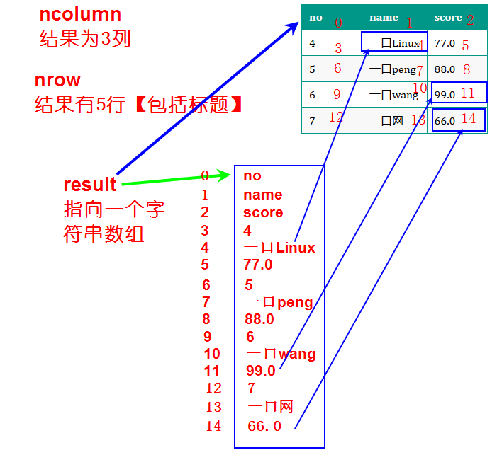
>

**由上图可知：**

```
ncolumn = 3
nrow    = 5
result 指向所有的结果组成的字符串数组，
各个具体字符串的下标，图上已经标明。
```

结合此图再去理解代码，就很容易理解代码的实现原理。


## 使用回调函数执行SQL语句

### sqlite3_exec

```
typedef  int (*sqlite3_callback)(void *, int, char **, char **);

int   sqlite3_exec(sqlite3 *db, const  char  *sql,  sqlite3_callback callback, void *,  char **errmsg);
功能：
 执行SQL操作
参数：
 db：数据库句柄
 sql：SQL语句，就是我们前面两章用于操作表的增删改查语句
 callback：回调函数
 errmsg：错误信息指针的地址
返回值：
 成功返回0，失败返回错误码
```

### 回调函数

```
typedef  int (*sqlite3_callback)(void *para, int f_num, char **f_value, char **f_name);
功能：
 每找到一条记录自动执行一次回调函数
参数：
 para：传递给回调函数的参数
 f_num：记录中包含的字段数目
 f_value：包含每个字段值的指针数组
 f_name：包含每个字段名称的指针数组
返回值：
 成功返回0，失败返回-1
```

### 举例

```c
sqlite3 *db;
char *errmsg， **resultp;

int callback(void *para, int f_num, char **f_val, char **f_name)
{
  int i;

  for (i = 0; i < f_num; i++)
  {
    printf("%-8s", f_val[i]);
  }
  printf("\n");

  return 0;
}

void do_show(sqlite3 *db)
{
  char *errmsg;

  printf("no      name    score\n");

  if (sqlite3_exec(db, "select * from student", callback, NULL, &errmsg) != 0)
  {
    printf("error : %s\n", sqlite3_errmsg(db));
  }
  printf("\n");

  return;
}
```

回调函数方法实现的代码，需要实现一个回调函数：callback。

函数sqlite3_exec（）在解析命令"select * from student" ，没获取到一行数据就会调用一次回调函数， 参考上面的表格student，

```
callback（）总共会被调用5次，
f_num 对应结果的列数，为3
f_value 则指向 每一列对应的值组成的字符串数组
```

假设现在callback是第四次被调用，如下图：

> 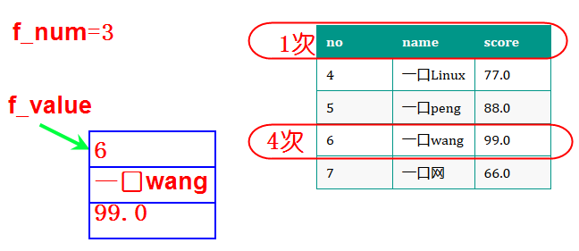

### 运行结果

编译需要使用第三方库lsqlite3。

```
gcc student.c -o run -lsqlite3
```


## 其他函数

```
sqlite3 *pdb, 数据库句柄，跟文件句柄FILE很类似
sqlite3_stmt *stmt, 这个相当于ODBC的Command对象，用于保存编译好的SQL语句

sqlite3_exec(), 执行非查询的sql语句
sqlite3_prepare(), 准备sql语句，执行select语句或者要使用parameter bind时，用这个函数（封装了sqlite3_exec）
Sqlite3_step(), 在调用sqlite3_prepare后，使用这个函数在记录集中移动
```

还有一系列的函数，用于从记录集字段中获取数据，如

```
sqlite3_column_text(), 取text类型的数据
sqlite3_column_blob（），取blob类型的数据
sqlite3_column_int(), 取int类型的数据
```

国际惯例，上完整代码：

```c
#include <stdio.h>
#include <stdlib.h>
#include <unistd.h>
#include <sqlite3.h>

void do_insert(sqlite3 *db)
{
  int no;
  char name[16];
  float score;
  char sqlstr[128], *errmsg;

  printf("input no : ");
  scanf("%d", &no);
  printf("input name : ");
  scanf("%s", name);
  printf("input score : ");
  scanf("%f", &score);
  sprintf(sqlstr, "insert into student values (%d, '%s', %.1f)",
          no, name, score);
#if __DEBUG
  printf("cmd:%s\n", sqlstr);
#endif
  if (sqlite3_exec(db, sqlstr, NULL, NULL, &errmsg) != 0)
  {
    printf("error : %s\n", sqlite3_errmsg(db));
  }
  else
  {
    printf("insert is done\n");
  }
  printf("\n");

  return;
}

void do_delete(sqlite3 *db)
{
  char *errmsg;
  char sqlstr[128], expression[64];

  printf("input expression : ");
  scanf("%s", expression); // name='ma'
  sprintf(sqlstr, "delete from student where %s", expression);
#if __DEBUG
  printf("cmd:%s\n", sqlstr);
#endif
  if (sqlite3_exec(db, sqlstr, NULL, NULL, &errmsg) != 0)
  {
    printf("error : %s\n", sqlite3_errmsg(db));
  }
  else
  {
    printf("deletet is done\n");
  }
  printf("\n");

  return;
}

int callback(void *para, int f_num, char **f_val, char **f_name)
{
  int i;

  for (i = 0; i < f_num; i++)
  {
    printf("%-8s", f_val[i]);
  }
  printf("\n");

  return 0;
}

void do_show(sqlite3 *db)
{
  char *errmsg;

  printf("no      name    score\n");

  if (sqlite3_exec(db, "select * from student", callback, NULL, &errmsg) != 0)
  {
    printf("error : %s\n", sqlite3_errmsg(db));
  }
  printf("\n");

  return;
}

void do_show_sample(sqlite3 *db)
{
  char **result, *errmsg;
  int nrow, ncolumn, i, j, index;

  if (sqlite3_get_table(db, "select * from student", &result, &nrow, &ncolumn, &errmsg) != 0)
  {
    printf("error : %s\n", errmsg);
    sqlite3_free(errmsg);
  }

  index = ncolumn;

  for (i = 0; i < nrow; i++)
  {
    for (j = 0; j < ncolumn; j++)
    {
      printf("%-8s : %-8s\n", result[j], result[index]);

      index++;
    }
    printf("************************\n");
  }
  sqlite3_free_table(result);

  return;
}

int main()
{
  sqlite3 *db;
  int n;
  char clean[64];

  if (sqlite3_open("my.db", &db) < 0)
  {
    printf("fail to sqlite3_open : %s\n", sqlite3_errmsg(db));
    return -1;
  }

  while (1)
  {
    printf("*********************************************\n");
    printf("1: insert record   \n2: delete record  \n3: show record  \n4: quit\n");
    printf("*********************************************\n");
    printf("please select : ");

    if (scanf("%d", &n) != 1)
    {
      fgets(clean, 64, stdin);
      printf("\n");
      continue;
    }
    switch (n)
    {
    case 1:
      do_insert(db);
      break;
    case 2:
      do_delete(db);
      break;
    case 3:
      do_show_sample(db);
      break;
    case 4:
      sqlite3_close(db);
      exit(0);
    }
  }
  return 0;
}
```

**运行主页面：**

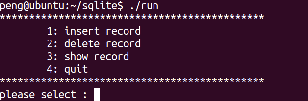

**插入记录：**

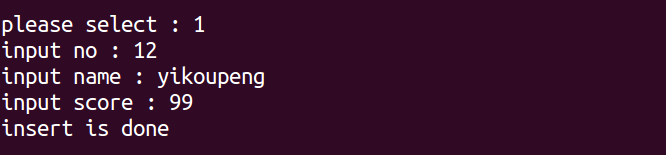

**显示记录：**

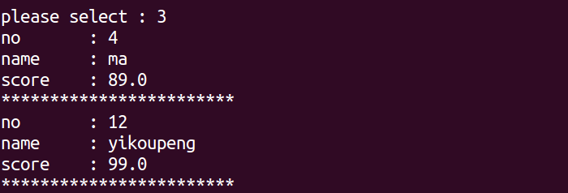

**删除记录：**

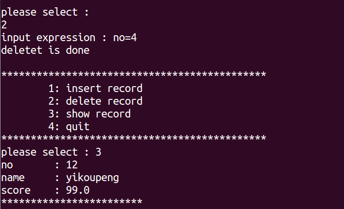


