# 数据加密算法 - HQ

[TOC]

------

#### 注意

- 一篇关于MD5摘要算法的文章《[C语言实现MD5，竟如此简单！](https://mp.weixin.qq.com/s?__biz=MzUxMjEyNDgyNw==&mid=2247492215&idx=1&sn=ec2f39e7750220855dce51758f6ff0ff&chksm=f96b9083ce1c1995c6443705cf283d25e776dd8b6f3971050f24a1ed3abe049fe8a97d9ee480&scene=21&token=1206659739&lang=zh_CN#wechat_redirect)》

  关于加密的一些基本概念，大家可以参考下面这一篇文章 《[公钥密码学简介](https://mp.weixin.qq.com/s?__biz=MzUxMjEyNDgyNw==&mid=2247498406&idx=1&sn=d344df3eede3fa6c4d14a327da0570a0&chksm=f96b8852ce1c0144ace9bae8fe1426c2c1b8fa83faede3e4bc2d7942bac51cd525e9d64ee646&scene=21&token=1206659739&lang=zh_CN#wechat_redirect)》

- 

------

# C语言实现MD5加密

本文详细讲解视频已经上传到B站：

https://www.bilibili.com/video/BV1uy4y1p7on/

公众号后台回复【md5】即可获得本文所有源码。

## 一、摘要算法

摘要算法又称哈希算法。

==它表示输入任意长度的数据，输出固定长度的数据，它的主要特征是加密过程不需要密钥，并且经过加密的数据无法被解密。==

目前可以被解密逆向的只有CRC32算法，==只有输入相同的明文数据经过相同的消息摘要算法才能得到相同的密文。==

**消息摘要算法不存在密钥的管理与分发问题，适合于分布式网络上使用。**由于其加密计算的工作量相当巨大，所以以前的这种算法通常只用于数据量有限的情况下的加密。

**消息摘要算法分为三类：**

- MD(Message Digest)：消息摘要
- SHA(Secure Hash Algorithm)：安全散列
- MAC(Message Authentication Code)：消息认证码

这三类算法的主要作用：**验证数据的完整性**

## 二、MD5简介

MD5即Message-Digest Algorithm 5（信息-摘要算法）。

属于摘要算法，是一个不可逆过程，就是无论多大数据，经过算法运算后都是生成固定长度的数据，结果使用16进制进行显示的128bit的二进制串。通常表示为32个十六进制数连成的字符串。

**MD5有什么用？**

用于确保信息传输完整一致。是计算机广泛使用的杂凑算法之一（又译摘要算法、哈希算法），主流编程语言普遍已有MD5实现。更多用在文档校验上，用来生成密钥检测文档是否被篡改。

## 三、在线MD5加密

有很多在线进行MD5加密的网站，如下：

http://www.metools.info/code/c26.html

举例: 给字符串 **12334567** 加密成。

如图结果为：

```
32135A337F8DC8E2BB9A9B80D86BDFD0
```

## 四、C语言实现MD5算法

源文件如下：md5.h

```
#ifndef MD5_H
#define MD5_H
 
typedef struct
{
    unsigned int count[2];
    unsigned int state[4];
    unsigned char buffer[64];   
}MD5_CTX;
 
                         
#define F(x,y,z) ((x & y) | (~x & z))
#define G(x,y,z) ((x & z) | (y & ~z))
#define H(x,y,z) (x^y^z)
#define I(x,y,z) (y ^ (x | ~z))
#define ROTATE_LEFT(x,n) ((x << n) | (x >> (32-n)))
#define FF(a,b,c,d,x,s,ac) \
          { \
          a += F(b,c,d) + x + ac; \
          a = ROTATE_LEFT(a,s); \
          a += b; \
          }
#define GG(a,b,c,d,x,s,ac) \
          { \
          a += G(b,c,d) + x + ac; \
          a = ROTATE_LEFT(a,s); \
          a += b; \
          }
#define HH(a,b,c,d,x,s,ac) \
          { \
          a += H(b,c,d) + x + ac; \
          a = ROTATE_LEFT(a,s); \
          a += b; \
          }
#define II(a,b,c,d,x,s,ac) \
          { \
          a += I(b,c,d) + x + ac; \
          a = ROTATE_LEFT(a,s); \
          a += b; \
          }                                            
void MD5Init(MD5_CTX *context);
void MD5Update(MD5_CTX *context,unsigned char *input,unsigned int inputlen);
void MD5Final(MD5_CTX *context,unsigned char digest[16]);
void MD5Transform(unsigned int state[4],unsigned char block[64]);
void MD5Encode(unsigned char *output,unsigned int *input,unsigned int len);
void MD5Decode(unsigned int *output,unsigned char *input,unsigned int len);
 
#endif
```

md5.c

```
#include <memory.h>
#include "md5.h"
 
unsigned char PADDING[]={0x80,0,0,0,0,0,0,0,0,0,0,0,0,0,0,0,
                         0,0,0,0,0,0,0,0,0,0,0,0,0,0,0,0,
                         0,0,0,0,0,0,0,0,0,0,0,0,0,0,0,0,
                         0,0,0,0,0,0,0,0,0,0,0,0,0,0,0,0};
                         
void MD5Init(MD5_CTX *context)
{
     context->count[0] = 0;
     context->count[1] = 0;
     context->state[0] = 0x67452301;
     context->state[1] = 0xEFCDAB89;
     context->state[2] = 0x98BADCFE;
     context->state[3] = 0x10325476;
}
void MD5Update(MD5_CTX *context,unsigned char *input,unsigned int inputlen)
{
    unsigned int i = 0,index = 0,partlen = 0;
    index = (context->count[0] >> 3) & 0x3F;
    partlen = 64 - index;
    context->count[0] += inputlen << 3;
    if(context->count[0] < (inputlen << 3))
       context->count[1]++;
    context->count[1] += inputlen >> 29;
    
    if(inputlen >= partlen)
    {
       memcpy(&context->buffer[index],input,partlen);
       MD5Transform(context->state,context->buffer);
       for(i = partlen;i+64 <= inputlen;i+=64)
           MD5Transform(context->state,&input[i]);
       index = 0;        
    }  
    else
    {
        i = 0;
    }
    memcpy(&context->buffer[index],&input[i],inputlen-i);
}
void MD5Final(MD5_CTX *context,unsigned char digest[16])
{
    unsigned int index = 0,padlen = 0;
    unsigned char bits[8];
    index = (context->count[0] >> 3) & 0x3F;
    padlen = (index < 56)?(56-index):(120-index);
    MD5Encode(bits,context->count,8);
    MD5Update(context,PADDING,padlen);
    MD5Update(context,bits,8);
    MD5Encode(digest,context->state,16);
}
void MD5Encode(unsigned char *output,unsigned int *input,unsigned int len)
{
    unsigned int i = 0,j = 0;
    while(j < len)
    {
         output[j] = input[i] & 0xFF;  
         output[j+1] = (input[i] >> 8) & 0xFF;
         output[j+2] = (input[i] >> 16) & 0xFF;
         output[j+3] = (input[i] >> 24) & 0xFF;
         i++;
         j+=4;
    }
}
void MD5Decode(unsigned int *output,unsigned char *input,unsigned int len)
{
     unsigned int i = 0,j = 0;
     while(j < len)
     {
           output[i] = (input[j]) |
                       (input[j+1] << 8) |
                       (input[j+2] << 16) |
                       (input[j+3] << 24);
           i++;
           j+=4; 
     }
}
void MD5Transform(unsigned int state[4],unsigned char block[64])
{
     unsigned int a = state[0];
     unsigned int b = state[1];
     unsigned int c = state[2];
     unsigned int d = state[3];
     unsigned int x[64];
     MD5Decode(x,block,64);
     FF(a, b, c, d, x[ 0], 7, 0xd76aa478); /* 1 */
 FF(d, a, b, c, x[ 1], 12, 0xe8c7b756); /* 2 */
 FF(c, d, a, b, x[ 2], 17, 0x242070db); /* 3 */
 FF(b, c, d, a, x[ 3], 22, 0xc1bdceee); /* 4 */
 FF(a, b, c, d, x[ 4], 7, 0xf57c0faf); /* 5 */
 FF(d, a, b, c, x[ 5], 12, 0x4787c62a); /* 6 */
 FF(c, d, a, b, x[ 6], 17, 0xa8304613); /* 7 */
 FF(b, c, d, a, x[ 7], 22, 0xfd469501); /* 8 */
 FF(a, b, c, d, x[ 8], 7, 0x698098d8); /* 9 */
 FF(d, a, b, c, x[ 9], 12, 0x8b44f7af); /* 10 */
 FF(c, d, a, b, x[10], 17, 0xffff5bb1); /* 11 */
 FF(b, c, d, a, x[11], 22, 0x895cd7be); /* 12 */
 FF(a, b, c, d, x[12], 7, 0x6b901122); /* 13 */
 FF(d, a, b, c, x[13], 12, 0xfd987193); /* 14 */
 FF(c, d, a, b, x[14], 17, 0xa679438e); /* 15 */
 FF(b, c, d, a, x[15], 22, 0x49b40821); /* 16 */
 
 /* Round 2 */
 GG(a, b, c, d, x[ 1], 5, 0xf61e2562); /* 17 */
 GG(d, a, b, c, x[ 6], 9, 0xc040b340); /* 18 */
 GG(c, d, a, b, x[11], 14, 0x265e5a51); /* 19 */
 GG(b, c, d, a, x[ 0], 20, 0xe9b6c7aa); /* 20 */
 GG(a, b, c, d, x[ 5], 5, 0xd62f105d); /* 21 */
 GG(d, a, b, c, x[10], 9,  0x2441453); /* 22 */
 GG(c, d, a, b, x[15], 14, 0xd8a1e681); /* 23 */
 GG(b, c, d, a, x[ 4], 20, 0xe7d3fbc8); /* 24 */
 GG(a, b, c, d, x[ 9], 5, 0x21e1cde6); /* 25 */
 GG(d, a, b, c, x[14], 9, 0xc33707d6); /* 26 */
 GG(c, d, a, b, x[ 3], 14, 0xf4d50d87); /* 27 */
 GG(b, c, d, a, x[ 8], 20, 0x455a14ed); /* 28 */
 GG(a, b, c, d, x[13], 5, 0xa9e3e905); /* 29 */
 GG(d, a, b, c, x[ 2], 9, 0xfcefa3f8); /* 30 */
 GG(c, d, a, b, x[ 7], 14, 0x676f02d9); /* 31 */
 GG(b, c, d, a, x[12], 20, 0x8d2a4c8a); /* 32 */
 
 /* Round 3 */
 HH(a, b, c, d, x[ 5], 4, 0xfffa3942); /* 33 */
 HH(d, a, b, c, x[ 8], 11, 0x8771f681); /* 34 */
 HH(c, d, a, b, x[11], 16, 0x6d9d6122); /* 35 */
 HH(b, c, d, a, x[14], 23, 0xfde5380c); /* 36 */
 HH(a, b, c, d, x[ 1], 4, 0xa4beea44); /* 37 */
 HH(d, a, b, c, x[ 4], 11, 0x4bdecfa9); /* 38 */
 HH(c, d, a, b, x[ 7], 16, 0xf6bb4b60); /* 39 */
 HH(b, c, d, a, x[10], 23, 0xbebfbc70); /* 40 */
 HH(a, b, c, d, x[13], 4, 0x289b7ec6); /* 41 */
 HH(d, a, b, c, x[ 0], 11, 0xeaa127fa); /* 42 */
 HH(c, d, a, b, x[ 3], 16, 0xd4ef3085); /* 43 */
 HH(b, c, d, a, x[ 6], 23,  0x4881d05); /* 44 */
 HH(a, b, c, d, x[ 9], 4, 0xd9d4d039); /* 45 */
 HH(d, a, b, c, x[12], 11, 0xe6db99e5); /* 46 */
 HH(c, d, a, b, x[15], 16, 0x1fa27cf8); /* 47 */
 HH(b, c, d, a, x[ 2], 23, 0xc4ac5665); /* 48 */
 
 /* Round 4 */
 II(a, b, c, d, x[ 0], 6, 0xf4292244); /* 49 */
 II(d, a, b, c, x[ 7], 10, 0x432aff97); /* 50 */
 II(c, d, a, b, x[14], 15, 0xab9423a7); /* 51 */
 II(b, c, d, a, x[ 5], 21, 0xfc93a039); /* 52 */
 II(a, b, c, d, x[12], 6, 0x655b59c3); /* 53 */
 II(d, a, b, c, x[ 3], 10, 0x8f0ccc92); /* 54 */
 II(c, d, a, b, x[10], 15, 0xffeff47d); /* 55 */
 II(b, c, d, a, x[ 1], 21, 0x85845dd1); /* 56 */
 II(a, b, c, d, x[ 8], 6, 0x6fa87e4f); /* 57 */
 II(d, a, b, c, x[15], 10, 0xfe2ce6e0); /* 58 */
 II(c, d, a, b, x[ 6], 15, 0xa3014314); /* 59 */
 II(b, c, d, a, x[13], 21, 0x4e0811a1); /* 60 */
 II(a, b, c, d, x[ 4], 6, 0xf7537e82); /* 61 */
 II(d, a, b, c, x[11], 10, 0xbd3af235); /* 62 */
 II(c, d, a, b, x[ 2], 15, 0x2ad7d2bb); /* 63 */
 II(b, c, d, a, x[ 9], 21, 0xeb86d391); /* 64 */
     state[0] += a;
     state[1] += b;
     state[2] += c;
     state[3] += d;
}
```

## 五、MD5加密实例

MD5加密步骤如下：

1、定义

```
MD5_CTX md5c; 
```

2、初始化

```
/********************************************************
* 名    称: MD5Init()
* 功    能: 初始化MD5结构体
* 入口参数: 
   context：要初始化的MD5结构体 
* 出口参数: 无
*********************************************************/
MD5Init(MD5_CTX *context);
```

3、MD5值计算

实现MD5值的计算及结构体的更新：

```
/*********************************************************
* 名    称: MD5Update()
* 功    能: 将要加密的信息传递给初始化过的MD5结构体，无返回值
* 入口参数: 
   context：初始化过了的MD5结构体 
    input：需要加密的信息，可以任意长度
    inputLen：指定input的长度
* 出口参数: 无
*********************************************************/
MD5Update(MD5_CTX *context,(unsigned char *)input,inputLen); 
```

4、输出转换

```
/*********************************************************
* 名    称: MD5Update()
* 功    能: 将加密结果存储到，无返回值
* 入口参数: 
   context：初始化过了的MD5结构体 
    digest ：加密过的结果
* 出口参数: 无
*********************************************************/
MD5Final(MD5_CTX *context,unsigned char digest[16]);
```

5、格式整理

转换成32位的16进制字符串。

### 实例1 字符串加密

对字符串进行加密：

```
  1 #include <stdio.h>
  2 #include <stdlib.h>
  3 #include "md5.h"
  4 #include <sys/types.h>
  5 #include <sys/stat.h>
  6 #include <fcntl.h>
  7 #include <string.h>
  8 
  9 void main( void ) 
 10 { 
 11     int read_len;
 12     int i ;
 13     char temp[8]={0};
 14     unsigned char digest[16]; //存放结果 
 15     char hexbuf[128]="12334567";
 16     unsigned char decrypt[16]={0};  
 17     unsigned char decrypt32[64]={0};    
 18 
 19     MD5_CTX md5c; 
 20 
 21     MD5Init(&md5c); //初始化
 22     read_len = strlen(hexbuf);
 23     MD5Update(&md5c,(unsigned char *)hexbuf,read_len);  
 24 
 25     MD5Final(&md5c,decrypt); 
 26     strcpy((char *)decrypt32,"");
 27 
 28     for(i=0;i<16;i++)
 29     {
 30         sprintf(temp,"%02x",decrypt[i]);
 31         strcat((char *)decrypt32,temp);
 32     }
 33     printf("md5:%s\n",decrypt32);
 34     
 35     return;
 36 }
```

执行结果如下：

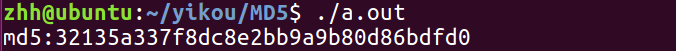

本例对字符串**12334567**进行加密，结果和在线加密结果一致。

### 实例2 文件加密

对文件进行加密

```
#include <stdio.h>
#include <stdlib.h>
#include "md5.h"
#include <sys/types.h>
#include <sys/stat.h>
#include <fcntl.h>
#include <string.h>

#define FORWORD_FW "123.c"

int calc_md5(char*filename,char*dest)
{
 int i;
 int filelen = 0;
 int read_len;
 char temp[8]={0}; 
 char hexbuf[128]={0};
 unsigned char decrypt[16]={0};  
 unsigned char decrypt32[64]={0};
 MD5_CTX md5;
 char fw_path[128];

 int fdf;
 
 fdf = open(filename,O_RDWR);
 if(fdf<0)
 {
  printf("%s not exist\n",FORWORD_FW);
  return -1;
 }
 
 MD5Init(&md5);  
 while(1)
 {
  read_len = read(fdf, hexbuf,sizeof(hexbuf)); 
  if (read_len <0) {  
   close(fdf);   
   return -1;
  }
  if(read_len==0)
  {
   break;
  }
  filelen += read_len;
  MD5Update(&md5,(unsigned char *)hexbuf,read_len); 
 }

 
 MD5Final(&md5,decrypt); 
 strcpy((char *)decrypt32,"");
 
 for(i=0;i<16;i++)
 {
  sprintf(temp,"%02x",decrypt[i]);
  strcat((char *)decrypt32,temp);
 }
 strcpy(dest,decrypt32);

 printf("md5:%s len=%d\n",dest,filelen);
 close(fdf);

 return filelen;
}
int main(int argc, char *argv[])
{
 int ret;
 int filelen;
 char md5_str[64]={0};
 char cmd[256]={0};
 
 filelen = calc_md5(FORWORD_FW,md5_str);
 if(filelen<0)
 {
  printf("calc_md5 fail\n");
  return -1;
 }

 return 0;
}
```

运行结果：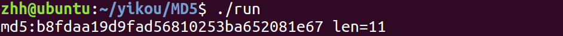

在线验证结果对比：

http://www.metools.info/other/o21.html

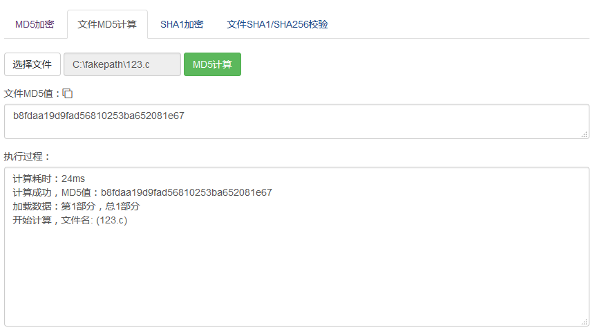


# 实现一个简单的数据加解密算法

## 前言

本文，一口君带着大家自己实现一个简单但也很实用的加密方法，

让大家了解实际项目开发中数据加密的流程。

## 一、一种常见的网络通信的加密流程

关于加密的算法很多，实际实现过程千差万别，下图是一个常见的网络通信加密的应用场景。

密码机的一些说明：

- 客户端服务器端都可以设置密码机（可以是软件、也可以是一个硬件，可以在本地也可以在某个服务器上，只要能够产生密钥即可）
- keygen和同步码都会影响到密码机生成的密钥序列
- 密码机在keygen和同步码相同的情况下，会产生相同的密钥序列，加解密双方需要记住产生密钥的顺序，解密多少数据就申请多少密钥

> 

如上图所示，基于C/S架构的服务器和客户端通信模型，

下面以客户端如果要发送一段加密的密文给服务器，C/S需要交互的流程。

#### 1 服务器端发送密钥密文

- 首先服务器端、客户端都保存了一个默认的密钥
- 服务器端随机生成密钥keygen，并使用该**默认密钥**对keygen加密，生成**密钥密文**
- 客户端可以通过命令定期请求该密钥密文或者服务器定时下发
- 客户端收到**密钥密文**后，也可以通过**默认密钥**进行解密得到明文的keygen

#### 2. 客户端对数据加密

- 客户端在发送数据之前，首先生成一个同步码
- 将**同步码**和keygen设置给密码机，然后向密码机申请一定长度的密钥
- 将明文和密钥通过一定的算法进行加密（通常是异或），生成**数据密文**

#### 3. 客户端发送同步码和数据密文

- 客户端将**数据密文**和**同步码明文**一起发送给服务器
- 服务器提取出同步码

#### 4. 服务器端接收数据并解密

- 服务器将keygen和同步码设置给密码机，同时申请一定数量的密钥
- 服务器根据密钥对密文进行解密，即得到对应的明文

因为服务器和客户端此时都使用了**相同的keygen，和同步码**，所以双方申请的密钥序列一定是一样的。


## 二、函数实现

下面是一口君实现的加密算法的一些函数原型以及功能说明，这些函数基本实现了第一节的功能。

#### 1. 申请加密密钥函数request_key

```
int request_key(int sync,int key_num,char key[])
功能：
 向密码机申请一定数量的用于加密数据的密钥，如果不设置新的keygen，那么生成的密码会顺序产生下去，每次申请密钥都会记录上次生成的密钥的偏移，下次在申请的时候，都会从上一位置继续分配密钥
参数：
 sync：同步码，密码机依据此同步产生随机序列的密钥
 key_num：申请的密钥个数
 key：申请的密钥存储的缓存
返回值:
 实际返回密钥个数
```

#### 2. 设置密钥序列函数set_keygen

```
void set_keygen(int key)
功能：
 向密码机设置keygen，设置后会影响产生的随机密钥序列
参数：
 key：密钥
返回值:
 无
```

#### 3. 产生随机数born_seed

```
int born_seed(int sync,int key)
功能：
 根据同步码和keygen生成随机密钥种子
参数：
    sync：同步码 
 key：密钥
返回值:
 种子
```

#### 4. 重置keygen reset_keygen()

```
void reset_keygen()
功能：
 重置keygen，会影响生成的随机数序列
```


## 三、测试代码实例

最终文件如下：

```
key.c  key.h  main.c
```

### 示例1 检测产生的随机序列

```
int main(int argc, char *argv[])
{
 int i;
 unsigned int len;
 int j, r, key_num;
 unsigned int sync = 0;
 unsigned char key[MAX_KEY_REQUEST];


 key_num = 10;

 printf("\n--------------采用默认keygen 同步码=0 产生密文----------------\n");
 reset_keygen();

 memset(key,0,sizeof(key));
 len = request_key(sync,key_num,key);

 print_array("密钥0-9:",key,len);

 memset(key,0,sizeof(key));
 len = request_key(sync,key_num,key);

 print_array("密钥10-19:",key,len);

 printf("\n--------------采用keygen=1234 同步码=0 产生密文----------------\n");
 set_keygen(1234);

 memset(key,0,sizeof(key));
 len = request_key(sync,key_num,key);

 print_array("密钥0-9:",key,len);

 memset(key,0,sizeof(key));
 len = request_key(sync,key_num,key);

 print_array("密钥10-19:",key,len);
}
```

执行结果：

```
--------------采用默认keygen 同步码=0 产生密文----------------
密钥0-9: ----[10]
a5 52 c8 14 5d f7 46 5b 89 42 
密钥10-19: ----[10]
38 69 6f a6 08 d2 69 39 cd 29 

--------------采用keygen=1234 同步码=0 产生密文----------------
密钥0-9: ----[10]
0e 83 0b 73 ec f5 4b 4a 74 35 
密钥10-19: ----[10]
e7 f1 06 41 c8 6b aa df 0c 3d 
```

可以看到采用不同的keygen产生的随机序列是不一样的。

如果设置不同的同步码，仍然序列还会不一样。

### 示例2 用默认keygen，加解密

```
char data0[10]={
 0x1,0x2,0x3,0x4,0x5,0x6,0x7,0x8,0x9,0x10,
};
int main(int argc, char *argv[])
{
 int i;
 unsigned int len;
 int j, r, key_num;
 unsigned int sync = 0;
 unsigned char key[MAX_KEY_REQUEST];
 char buf[120]={0};

 key_num = 10;
 printf("\n--------------采用默认keygen开始加密----------------\n");
 reset_keygen();
 print_array("\n明文:",data0,key_num);

 memset(key,0,sizeof(key));
 len = request_key(sync,key_num,key);

 print_array("密钥:",key,len);
 for(i=0;i<len;i++)
 {
  buf[i] = data0[i]^key[i];
 }
 print_array("\n密文:",buf,len);
 
 printf("\n--------------------开始解密--------------------\n");
 reset_keygen();

 memset(key,0,sizeof(key));
 len = request_key(sync,key_num,key);

 
 for(i=0;i<len;i++)
 {
  buf[i] = buf[i]^key[i];
 }

 print_array("\n明文:",buf,len);
}
```

测试结果

```
--------------采用默认keygen开始加密----------------

明文: ----[10]
01 02 03 04 05 06 07 08 09 10 
密钥: ----[10]
a5 52 c8 14 5d f7 46 5b 89 42 

密文: ----[10]
a4 50 cb 10 58 f1 41 53 80 52 

--------------------开始解密--------------------

明文: ----[10]
01 02 03 04 05 06 07 08 09 10 
```

### 示例3 用不同的keygen和同步码加解密

```
int main(int argc, char *argv[])
{
 int i;
 unsigned int len;
 int j, r, key_num;
 unsigned int sync = 0;
 unsigned char key[MAX_KEY_REQUEST];
 char buf[120]={0};
 unsigned int mykeygen;


 if (argc != 4) {
  fprintf(stderr, "Usage: %s <seed> <key num> <keygen>\n", argv[0]);
  exit(EXIT_FAILURE);
 }

 sync = atoi(argv[1]);
 key_num = atoi(argv[2]);
 mykeygen = atoi(argv[3]);

 printf("\n--------------采用自定义的keygen、同步码开始加密----------------\n");
 set_keygen(mykeygen);
 print_array("\n明文:",data0,key_num);

 memset(key,0,sizeof(key));
 len = request_key(sync,key_num,key);
 print_array("密钥:",key,len);

 for(i=0;i<len;i++)
 {
  buf[i] = data0[i]^key[i];
 }
 print_array("\n密文:",buf,len);
 

 printf("\n--------------------开始解密--------------------\n");
 set_keygen(mykeygen);

 memset(key,0,sizeof(key));
 len = request_key(sync,key_num,key);
 for(i=0;i<len;i++)
 {
  buf[i] = buf[i]^key[i];
 }
 print_array("\n明文:",buf,len);
 exit(EXIT_SUCCESS);
}
```

执行结果如下：

```
--------------采用自定义的keygen、同步码开始加密----------------

明文: ----[10]
01 02 03 04 05 06 07 08 09 10 
密钥: ----[10]
53 00 29 cd 27 eb cc 80 1a d7 

密文: ----[10]
52 02 2a c9 22 ed cb 88 13 c7 

--------------------开始解密--------------------

明文: ----[10]
01 02 03 04 05 06 07 08 09 10 
```

可见我们的确实现了数据的加密和解密。


## 四、数据加密的实际使用

假定我们使用上述实例代码，把对应的功能移植到C/S两端，

那么一次完整的数据加密以及数据的传输参考流程如下：

> 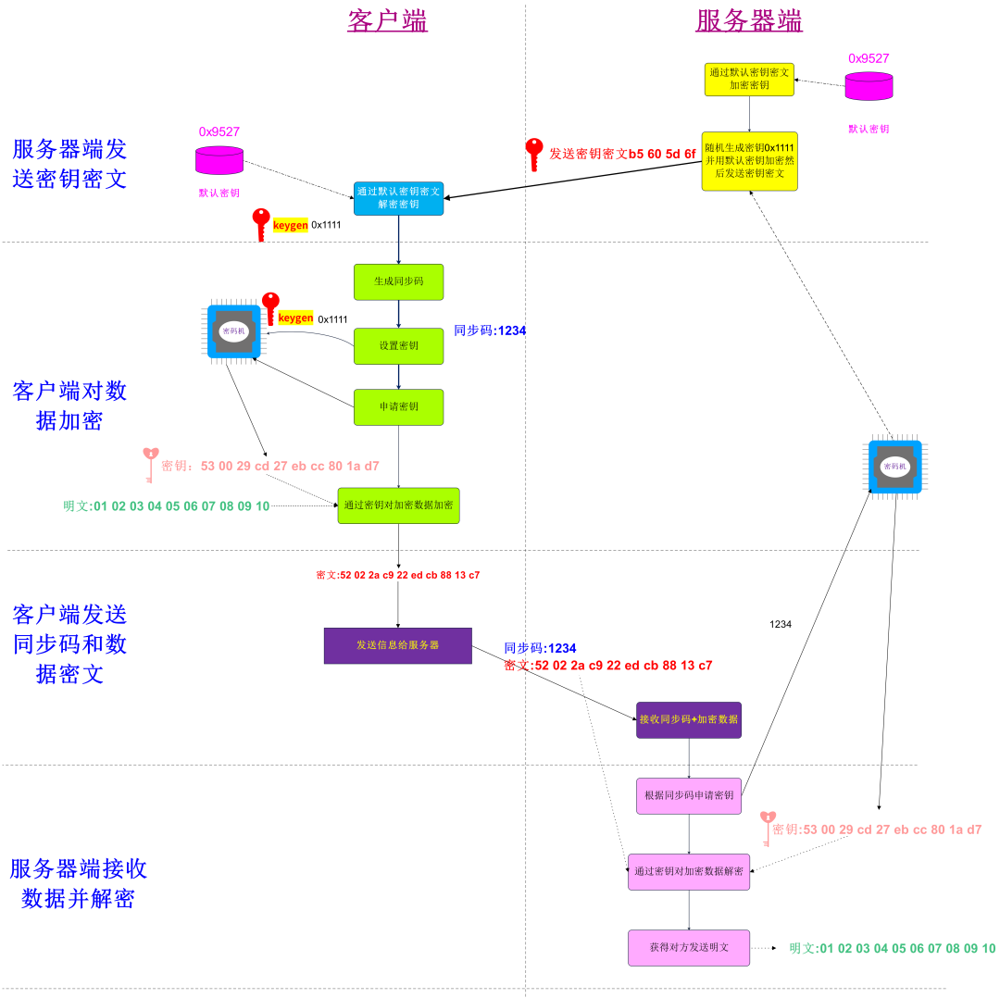

记住一点，**只要双方设置相同的keygen和同步码，那么密码机吐出来的密钥就是相同序列，**

**客户端发送每发送一个报文，就把自己的明文同步码一起发送给服务器，**

**服务器根据提前发送给客户端的keygen和同步码就可以实现解密操作，**

虽然你可以看到明文的同步码，

但是还需要破解密码机算法、服务器下发的keygen密文。


## 五、 原理

==实现加密算法的主要问题是如何产生随机序列作为密钥。==

本例是借用库函数rand() 原型如下：

```
#include <stdlib.h>

int rand(void);
```

函数rand() 虽然可以产生随机序列，但是每次产生的序列其实顺序是一样的。

```
#include <stdio.h>

main()
{
 int i = 0;

 for(i=0;i<10;i++)
 {
  printf("%d ",rand());
 }
 putchar('\n');
}
```

运行结果如下：

```
peng@peng-virtual-machine:/mnt/hgfs/peng/rand/code$ ./a.out 
1804289383 846930886 1681692777 1714636915 1957747793 424238335 719885386 1649760492 596516649 1189641421 
peng@peng-virtual-machine:/mnt/hgfs/peng/rand/code$ ./a.out 
1804289383 846930886 1681692777 1714636915 1957747793 424238335 719885386 1649760492 596516649 1189641421 
```

要想每次都产生不一样的随机序列应该怎么办呢？需要借助srand()函数

```
void srand(unsigned int seed);
```

只需要通过该函数设置一个种子，那么产生的序列，就会完全不一样，

通常我们用time()返回值作为种子，

在此我们随便写入几个数据，来测试下该函数

```
#include <stdio.h>

main()
{
 int i = 0;

 srand(111);
 for(i=0;i<10;i++)
 {
  printf("%d ",rand());
 }
 putchar('\n');
 srand(1111);
 for(i=0;i<10;i++)
 {
  printf("%d ",rand());
 }
 putchar('\n');
}
```

执行结果如下：

```
peng@peng-virtual-machine:/mnt/hgfs/peng/rand/code$ ./a.out 
1629905861 708017477 1225010071 14444113 324837614 2112273117 1166384513 1539134273 1883039818 779189906 
1383711924 882432674 1555165704 1334863495 1474679554 676796645 154721979 534868285 1892754119 100411878 
```

可见输入不同的种子就会产生不同的序列。

函数原型如下：

> 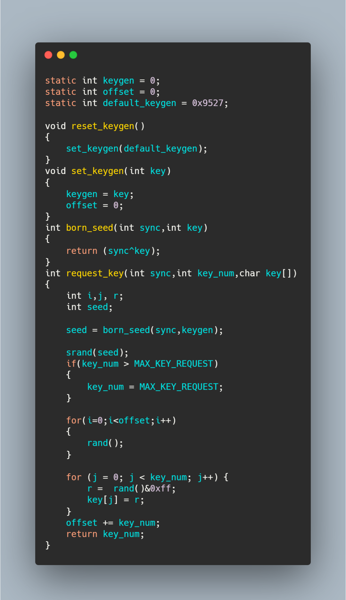

本例原理比较简单，没有考虑太复杂的应用（比如多路密钥的管理)和数据安全性，

只阐述加解密的流程，仅作为学习理解加解密流程用，此种加密算法属于对称加密，相对比较简单，还是比较容易破解。

目前市场上都是由专业的公司和团队实现加解密功能。

> 本文完整代码下载地址：链接：https://pan.baidu.com/s/1VvGNlNGEUWWZHQZ1_gYU7A 提取码：o9se
>
> 后台回复：数据加密，即可获得全部源码
>


## 公钥密码学简介 - 摘录

> 本文翻译自Nassos Michas的文章《An Introduction to Public Key Cryptography》，参考：
> https://medium.com/better-programming/an-introduction-to-public-key-cryptography-3ea0cf7bf4ba

作为工程师应学习的非对称密码学概念，如果您从事软件开发，则可能已经以一种或另一种方式向您介绍了加密技术。

签名消息，加密有效载荷，验证签名以及使用证书；这些都是我们每天都使用的功能，即使我们不知道也是如此。

公钥密码学或非对称密码学是70年代中期开始的广泛科学研究的主题，也是当今众多书籍和研究论文的目标。

这绝不是试图以任何水平的科学或学术细节介绍密码技术。相反，我将尝试展示非对称密码技术背后的关键功能概念，并提供示例说明如何使用它（同时尽量避免使用专业术语）。

在以下各节中，我们将讨论：

-  对称加密与非对称加密。
-  密钥生成。
-  非对称加密，或如何发送加密的消息。
-  签署有效载荷。
-  证书。

### 对称加密与非对称加密

对称加密与非对称加密的区别在于使用密钥来交付基础加密功能的方式：


> With symmetric encryption, one key is shared with one or more parties (image by author)

==在对称加密中，同一密钥既用于加密又用于解密。密钥成为参与者之间共享的共享秘密。==

显然，随着参与者数量的增加，泄露密钥的风险也随之增加。

> 在上图中，如果 史蒂夫（Steve）的PC受到了威胁，任何获得密钥的人都可以解密发送给爱丽丝（Alice），约翰（John）和伊丽莎白（Elizabeth）的所有消息。
>
> 因此，一旦共享秘密在任何单个位置受到破坏，整个系统的安全性就会受到损害。

**对称加密的主要缺点是使用单个共享密钥以及找到安全的传播方式的要求。**

对称加密是直到70年代中期之前使用的主要加密机制，当时研究人员开始建议使用另一种方法来创建和传播密钥，更重要的是。

这是非对称加密诞生的时候：

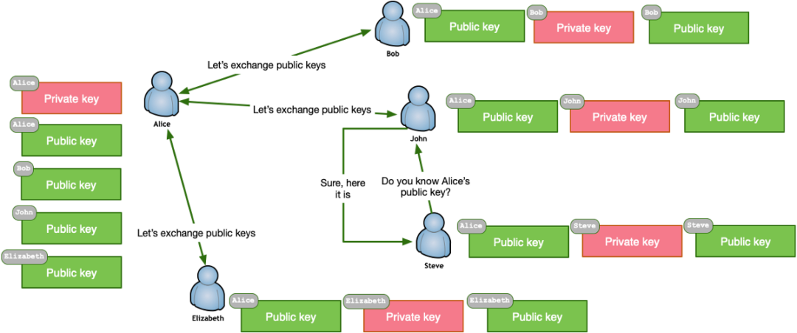

> With asymmetric encryption, parties maintain key-pairs and exchange public keys (image by author)

==在非对称加密中，每一方都是一对密钥（公共密钥和私有密钥）的所有者。==

最大的突破是，公开密钥不是一个共享的秘密，应该由两个或多个参与者小心地隐藏起来。相反，**参与者可以通过不受信任的网络交换公用密钥，甚至可以与其他任何人共享公用密钥。**

对称加密彻底改变了密码学领域，如今它已成为大多数大规模加密方案的基础。例如，互联网。

### 密钥生成

非对称加密中公钥和私钥的创建取决于数学问题，尤其是单向函数。

单向函数的特征在于易于以一种方式解决（即生成密钥），但是反计算（即在具有加密的有效载荷时找到密钥）在计算上非常昂贵。

就像我在本文开头所承诺的那样，我不会不必要地使用与密码学有关的技术术语。但是，请记住这一点：并非所有键都是相同的。

**密钥的质量和强度取决于生成密钥的算法以及密钥的位数。**

当前使用Diffie-Hellman算法生成的密钥的密钥大小建议为2048位或更大，约为使用椭圆曲线算法生成的密钥的1/10。

因此，是时候使用瑞士的加密工具LibreSSL（v2.8.3，如果您使用的是OpenSSL，下面的大多数命令也应如此）来创建我们的第一个非对称加密密钥对。

#### 创建一个加密的私钥

```
openssl genrsa -des3 -out alice-privatekey.pem 2048
```

```
openssl genrsa -des3 -out bob-privatekey.pem 2048
```

您现在已经成功为Alice和Bob生成了私钥。LibreSSL和OpenSSL中都有指定密钥属性的其他选项，包括在生成过程中使用椭圆曲线算法。

私钥应该保持，好…私密，切勿与其他任何人共享。

#### 从私钥中提取公钥

```
openssl rsa -in alice-privatekey.pem -outform PEM -pubout -out alice-publickey.pem
```

```
openssl rsa -in bob-privatekey.pem -outform PEM -pubout -out bob-publickey.pem
```

现在，由于没有嵌入任何敏感信息，因此可以提取Alice和Bob的公钥并将其发送给任何感兴趣的方。

### 非对称加密，或如何发送加密的消息

**非对称加密适用于公钥和私钥。**

==要发送加密的消息，在加密过程中使用接收者的公钥，在解密过程中使用接收者的私钥==，如下所示：

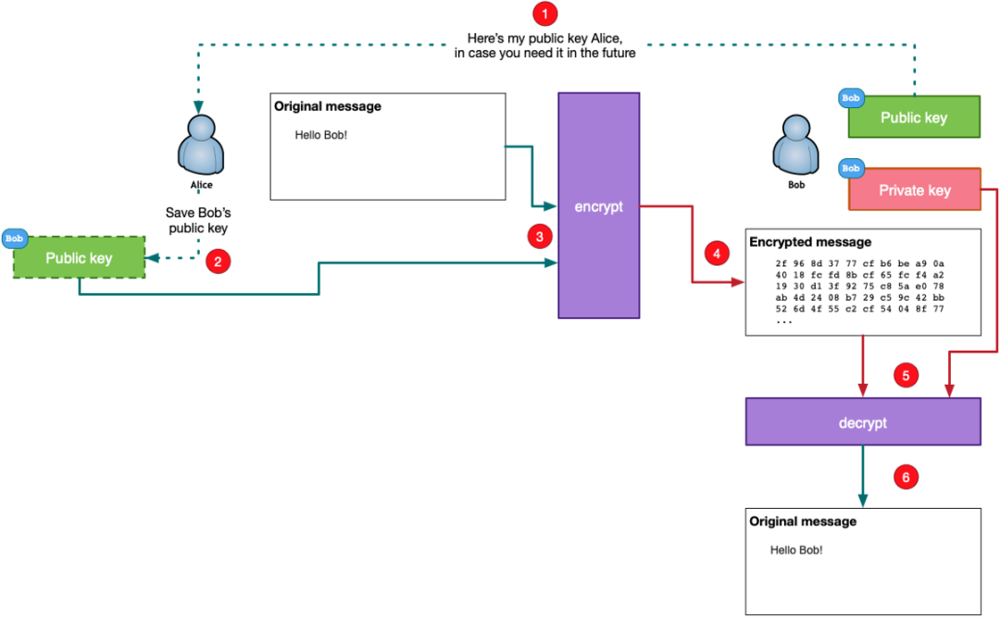

> Public-key encryption/decryption (image by author)

以下是上述场景中涉及的步骤，其中Alice希望将加密的消息发送给Bob：

> · 爱丽丝获得鲍勃的公钥。
>
> · 爱丽丝存储鲍勃的公钥以备将来使用。
>
> · 爱丽丝将鲍勃的公钥与有效载荷一起使用，然后将其通过她的加密软件进行加密。
>
> · 加密的有效负载将发送到Bob。
>
> · 鲍勃将自己的私钥和爱丽丝发送给他的解密软件的加密消息传递。
>
> · Bob获得了Alice发送的原始有效负载。

因此，让我们进入实际部分，并使用Bob的公钥向他发送加密文件。哦，等等…我们不能！

### 混合加密

上面介绍的理论部分没有任何问题，因为它的工作原理与广告宣传完全一样。但是，有一个不对称加密的"陷阱"：**要加密的有效负载的大小必须（几乎）与用于加密的公钥的大小匹配。**

因此，要向Bob发送大约1MB的照片，您需要Bob拥有至少800万比特的公共密钥。那是八百万个1和0，一个接一个。生成这样的密钥可能不太实际-即使可以实现。

尽管您可以创建一种结构，在该结构中以块模式使用非对称加密来加密大型有效负载，但是通过以接近可用公共密钥大小的较小比特来加密有效负载，实际上，这是没人在使用的东西。就所用空间而言，效率低下，而且速度将非常缓慢。

为了减轻非对称加密的密钥大小限制，当前的做法是使用混合加密：

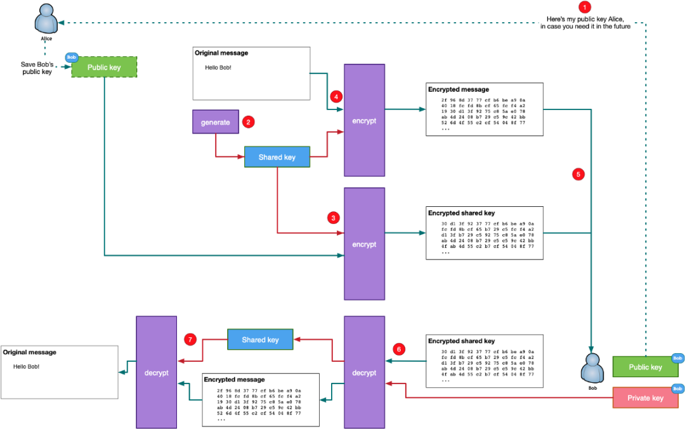

> Hybrid encryption (image by author)

**在混合加密中，将创建一个随机对称密钥来加密有效负载，并使用公共密钥来加密随机对称密钥。**让我们看看它是如何工作的：

> · 鲍勃将他的公钥发送给爱丽丝。
>
> · 爱丽丝生成共享的对称密钥。
>
> · 爱丽丝用鲍勃的公钥加密对称密钥。
>
> · 爱丽丝使用（2）中创建的共享密钥对消息进行加密。
>
> · 爱丽丝将加密的消息和加密的共享密钥发送给鲍勃。
>
> · 鲍勃使用他的私钥解密共享密钥。
>
> · 鲍勃使用共享密钥解密加密的消息。

如果手动执行，上述情况将是冗长而乏味的。但是，有完善的工具和标准可以自动安全地交换消息和文件，例如OpenPGP及其在PGP和GPG中的化身。

### 使用GPG加密（GNU Privacy Guard）

GnuPG是RFC4880（也称为PGP）定义的OpenPGP标准的完整和免费实现。

GnuPG允许您对数据和通信进行加密和签名，并具有通用的密钥管理系统以及用于各种公钥目录的访问模块。

现在，让我们尝试使用GPG将加密的文件从爱丽丝发送到鲍勃：

> · 爱丽丝和鲍勃都需要创建GPG密钥对：gpg –gen-key
>
> · 鲍勃应导出其公钥并将其发送给Alice：gpg –output bob.gpg –export bob@bob.com
>
> · 爱丽丝收到鲍勃的公钥后，应将其导入到本地密钥数据库中：gpg –import bob.gpg
>
> · 爱丽丝创建未加密的消息：echo" Hello Bob"> bob.msg
>
> · 爱丽丝对邮件进行加密，然后将加密的邮件与加密的共享密钥一起发送到Bob：gpg-输出bob.msg.gpg –encrypt-收件人bob@bob.com bob.msg
>
> · 鲍勃（Bob）接收加密的消息，并通过解密共享密钥并解密加密的消息来解密它：gpg –output bob.msg –decrypt bob.msg.pgp

GPG和PGP都已被广泛使用，并且已经包含在我们日常使用的许多产品中，例如电子邮件客户端，因此您几乎不必手动执行上述顺序。

### 签署有效载荷

有时，不一定需要加密消息的内容，但是，我们可能仍要确保发送者的身份。其他时候，内容需要加密，发件人的身份也需要验证。在两种情况下，这都是我们使用数字签名的地方。

在我们看到如何生成数字签名以及如何对内容进行验证以及验证发件人的身份之前，让我们在这里进行重要的区分-我经常看到人们可以互换使用：数字签名不是电子签名 。

#### 数字签名

==数字签名只是用于验证数字消息真实性的数学证明。==

它使邮件的接收者具有很高的确定性，可以相信特定的邮件是由已知的发件人创建的，并且该邮件在传输过程中没有被更改。

#### 电子签名

==电子签名带有物理签名的意图，通常使用数字签名来实现。==

在许多国家/地区，电子签名只要符合其所依据的特定法规的要求，就可以提供与手写签名相同的法律地位。

发送者使用私钥产生数字签名，接收者使用发送者的公钥验证数字签名：

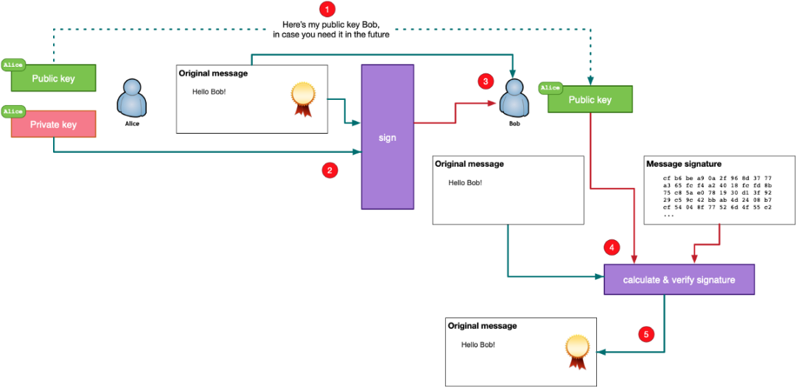

> Verifying a message with a digital signature (image by author)

> · 爱丽丝将她的公钥发送给鲍勃。
>
> · 爱丽丝创建一条消息，并使用她的公钥产生数字签名。通常，在消息的计算出的哈希值上，例如在所得的SHA-256上，产生数字签名。
>
> · Bob收到了原始的未加密消息以及该消息的Alice的数字签名。
>
> · Bob使用Alice的公钥重新计算了原始未加密邮件的数字签名，并将其与Alice发送的签名进行了比较。
>
> · 如果两个签名都匹配，则鲍勃知道是爱丽丝发送了原始邮件，并且邮件的内容没有更改。

接下来，让我们看看如何创建数字签名以及收件人如何验证收到的邮件是否未被篡改。

#### 签发签名

```
openssl dgst -sha256 -sign alice-privatekey.pem -out bob.msg.sign bob.msg
```

上面的命令使用Alice的私钥在bob.msg文件的SHA-256输出上计算数字签名。然后，爱丽丝将bob.msg以及bob.msg.sign文件发送给Bob。

#### 验证签名

```
openssl dgst -sha256 -verify alice-publickey.pem -signature bob.msg.sign bob.msg
```

鲍勃从爱丽丝那里收到了两个文件，然后继续使用爱丽丝的公钥来验证签名。上面的命令根据数字签名验证结果返回" Verified OK"或" Verification Failure"。

#### 证明书

**证书，也称为数字证书，身份证书或公钥证书，是证明公钥所有权的电子文档。**

证书的最常见格式由X.509定义，从根本上讲，它包含一个公共密钥，该公共密钥的数字签名以及有关公共密钥所有者身份的信息。

证书可用于多种目的，因此，存在不同的证书配置文件。

公钥对应于证书的所有者。但是，要使其他任何人都能够验证所有者的身份，则需要一个受信任的第三方实体。

这就是证书颁发机构的用处。证书颁发机构是负责签署证书的一方，通常是受信任的知名公司或组织。

为了有效地执行此角色，证书颁发机构需要拥有自己的根证书，该证书由尽可能多的用户信任。但是，证书颁发机构也可以提供交叉签名，从而对其他证书颁发机构的根证书进行签名。

刚开始时听起来可能会令人困惑，所以让我们尝试通过一个示例进行说明：

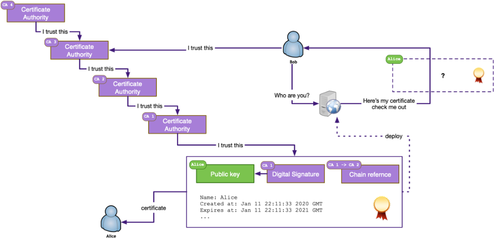

> A certificate validation chain of trust (image by author)

> · 在上面的示例中，鲍勃连接到爱丽丝的网站，并希望验证是由爱丽丝经营的。
>
> · Bob在访问爱丽丝的网站时获得了证书。该证书包含Alice的公钥以及来自证书颁发机构CA1的数字签名。
>
> · 由于Bob不了解也不信任CA1，因此他检查了嵌入证书中的证书链。
>
> · 通过追溯可用的交叉签名，Bob到达了他信任的证书颁发机构CA3。现在，他知道爱丽丝的网站可以信任由爱丽丝运营。

当然，所有这些过程都是由Internet浏览器在幕后在HTTPS协议的传输层安全性（TLS）下进行的。

证书身份验证是基于共同受信任的父证书颁发机构的事实，这也是对证书的主要批评之一。

如果该父证书颁发机构被破坏或流氓怎么办？

尽管证书主要用于网站隐私，标识和内容可靠性，但它们也可以用于客户端标识。

如果您对自己的证书颁发机构感兴趣，可以尝试使用各种可用的开源实现之一，例如OpenCA，EJBCA或OpenXKPI。

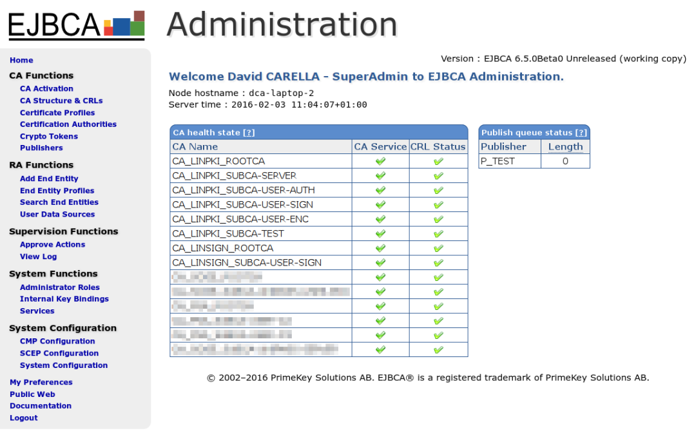

> Screenshot of the web administration console of EJBCA (David CARELLA, Wikipedia, CC BY-SA 4.0)

当然，请考虑到由于您自己的证书颁发机构的根证书不会被您的Internet浏览器或其他任何人信任，因此您需要按照操作系统的说明将其手动插入到受信任的证书存储中。

使用您自己的证书颁发机构颁发的证书的所有用户的计算机也是如此。

不，不是一种选择是让一个知名的大型根证书颁发机构对您自己的证书颁发机构的根证书进行交叉签名。

### 结论

==公钥密码术或非对称加密是一种基于密钥对，公钥和私钥的密码系统。非对称加密的主要用例是加密通信，提供消息验证和真实性。==

在本文中，我试图介绍非对称加密背后的基本概念，尽管只是从头开始讨论了这样一个复杂的话题。密码学是一个引人入胜的领域，迄今为止，它一直在进行积极的研究，并为好奇的人们提供了大量的信息。

离开之前，如果您需要在项目中进行加密，请牢记加密的黄金法则：不要投放自己的加密货币。

那里有许多库以及已经实施的强大，安全，经过考验的算法。做研究并选择已经满足项目需求的研究。


