# libcurl库实现车牌识别 - HQ

[TOC]

------

#### 注意

- 

------

## 人脸识别方案

**技术平台**

- 百度OCR
- 腾讯云OCR
- 商汤科技OCR
- 翔云OCR
- 科大讯飞OCR

使用libcurl库调用翔云API进行人脸识别。

**翔云API文档**

> 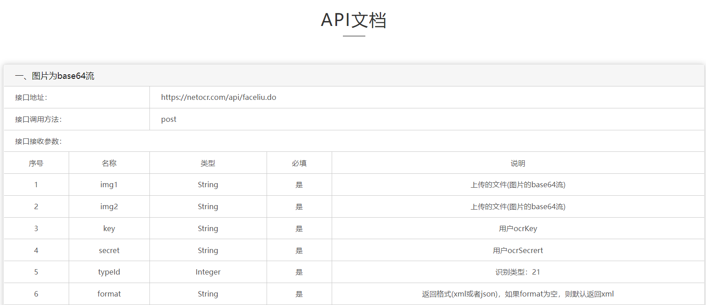
>
> 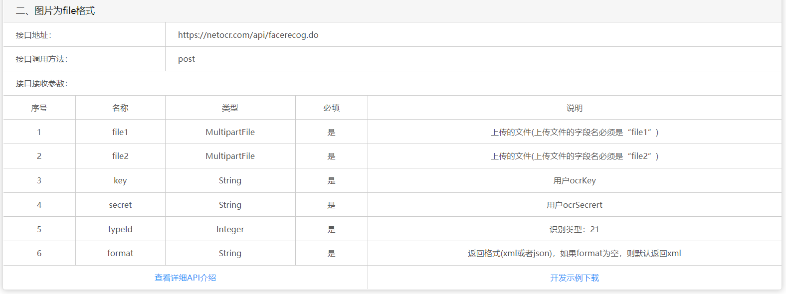


## libcurl库使用方法

### 使用步骤

1. 调用curl_global_init()初始化libcurl
2. 调用curl_easy_init()函数得到 easy interface型指针
3. 调用curl_easy_setopt()设置传输选项
4. 根据curl_easy_setopt()设置的传输选项，实现回调函数以完成用户特定任务
5. 调用curl_easy_perform()函数完成传输任务
6. 调用curl_easy_cleanup()释放内存
7. 调用curl_global_cleanup()析构libcurl

**在整过过程中设置curl_easy_setopt()参数是最关键的**，几乎所有的libcurl程序都要使用它。

在基于LibCurl的程序里，**主要采用callback function （回调函数）的形式完成传输任务**，用户在启动传输前设置好各类参数和回调函数，当满足条件时libcurl将调用用户的回调函数实现特定功能。

### 安装步骤

解压

```
tar xvf curl-7.71.1.tar.bz2 
```

建立一个安装目录（可以不用新建文件夹，make install安装的时候会自动创建）

```
mkdir _install 
```

#### 普通安装（无ssl功能，只能用来访问http的网页，建议添加ssl功能安装）

使用默认gcc编译/安装在当前路径的_install文件夹中,$PWD代表是当前路径

```
./configure --prefix=$PWD/_install  
```

使用arm-linux交叉编译器编译/安装在当前路径的_install文件夹中**（如果不需要交叉编译，这步跳过）**

```
./configure --prefix=$PWD/_install --host=arm-linux   
```

安装

```
make  编译当前文件夹的内容
make install 安装
```

#### 添加ssl功能安装（人脸识别/车牌识别是通过https访问，必须要添加ssl功能）

由于翔云API使用的是https，所以libcurl库安装编译的时候需要ssl库。

即先在ubuntu中安装好ssl库，然后再编译安装libcurl库。

[ssl库安装参考博文 - 已摘录到笔记末尾](https://www.cnblogs.com/jsjliyang/p/10606908.html)  

> 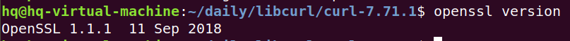

```
wget https://www.openssl.org/source/openssl-1.1.1a.tar.gz
tar xvf openssl-1.1.1a.tar.gz
cd openssl-1.1.1a/
./config
make
make install
```

进入安装目录中，卸载安装文件，重新编译安装libcurl库

```
cd _install  
rm * -rf
./configure --prefix=$PWD/_install --with-ssl  # 重新编译
make
make install
```

### 编译

-I（大i）是链接头文件，-L是链接库文件

```
gcc test_1.c -I ~/daily/libcurl/curl-7.71.1/_install/include/ -L ~/daily/libcurl/curl-7.71.1/_install/lib/ -lcurl
```

如果提示找不到库，则修改环境变量，导入链接库地址（不修改的话，程序运行时可能报错）

```
export LD_LIBRARY_PATH=~/daily/libcurl/curl-7.71.1/_install/lib/  
```

程序运行后，会在/tmp/下生成`get.html`和`post.html`文件

```
vi /tmp/get.html   # 查看调用libcurl编程访问的百度主页
```

### 其他指令

**图片转换指令**

base64是网络上最常见的用于传输8Bit字节码的编码方式之一，base64是一种基于64个可打印字符来表示二进制数据的方法。

base64是从二进制到字符的过程，可用于在HTTP环境下传递较长的标识信息。

```
base64 shishi.jpg  //将图片转换为base64编码
system("base 64 shishi.jpg > tmpFile")；  //将图片转换并存到\新建tmpFile文件中
```


## 例程代码

### 程序代码 - 原始测试程序

读取百度的网址内容并返回到readData函数然后输出

```cpp
#include <stdio.h>
#include <curl/curl.h>
#include <string.h>

#define true 1
#define false 0
typedef unsigned int bool;  // C语言中没有bool

size_t readData(void *ptr, size_t size, size_t nmemb, void *stream)
{
    char buf[1024] = {'\0'};
    strncpy(buf, ptr, 1024);
    printf("===========================================");
    printf("%s\n", buf);
}

bool getUrl(char *filename)
{
    CURL *curl;
    CURLcode res;
    FILE *fp;
    if ((fp = fopen(filename, "w")) == NULL) // 返回结果用文件存储
        return false;
    struct curl_slist *headers = NULL;
    headers = curl_slist_append(headers, "Accept: Agent-007");
    curl = curl_easy_init(); // 初始化
    if (curl)
    {
        // curl_easy_setopt(curl, CURLOPT_PROXY, "10.99.60.201:8080");// 代理
        curl_easy_setopt(curl, CURLOPT_HTTPHEADER, headers); // 改协议头
        curl_easy_setopt(curl, CURLOPT_URL, "http://www.baidu.com");
        curl_easy_setopt(curl, CURLOPT_WRITEFUNCTION, readData); //调用回调函数readData，将返回的数据发给readData
                                                                 //    curl_easy_setopt(curl, CURLOPT_WRITEDATA, fp); //将返回的http头输出到fp指向的文件
                                                                 //    curl_easy_setopt(curl, CURLOPT_HEADERDATA, fp); //将返回的html主体数据输出到fp指向的文件
        res = curl_easy_perform(curl);                           // 执行
        if (res != 0)
        {

            curl_slist_free_all(headers);
            curl_easy_cleanup(curl);
        }
        fclose(fp);
        return true;
    }
}

bool postUrl(char *filename)
{
    CURL *curl;
    CURLcode res;
    FILE *fp;
    if ((fp = fopen(filename, "w")) == NULL)
        return false;
    curl = curl_easy_init();
    if (curl)
    {
        curl_easy_setopt(curl, CURLOPT_COOKIEFILE, "/tmp/cookie.txt");                   // 指定cookie文件
        curl_easy_setopt(curl, CURLOPT_POSTFIELDS, "&logintype=uid&u=xieyan&psw=xxx86"); // 指定post内容
        // curl_easy_setopt(curl, CURLOPT_PROXY, "10.99.60.201:8080");
        curl_easy_setopt(curl, CURLOPT_URL, " http://mail.sina.com.cn/cgi-bin/login.cgi "); // 指定url
        curl_easy_setopt(curl, CURLOPT_WRITEDATA, fp);
        res = curl_easy_perform(curl);
        curl_easy_cleanup(curl);
    }
    fclose(fp);
    return true;
}

int main(void)
{
    getUrl("/tmp/get.html");
    postUrl("/tmp/post.html");
}
```


### 程序代码 - 人脸识别 - 未优化

功能说明：输入两张图片，进行比较，是否为同一个人，程序未优化，返回的数据为原始数据，未处理

> 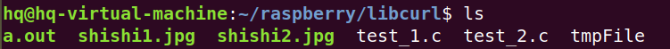
>
> 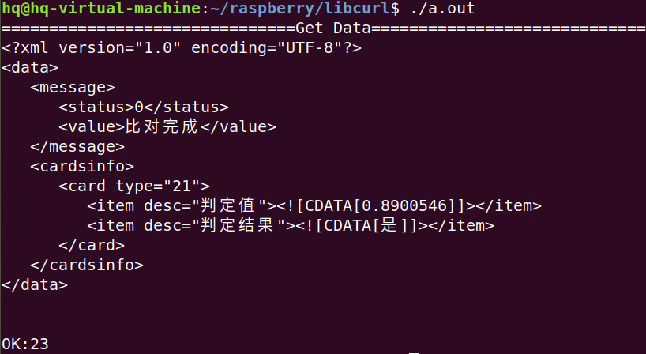

```cpp
#include <stdio.h>
#include <curl/curl.h>
#include <string.h>
#include <stdlib.h>
#include <sys/types.h>
#include <sys/stat.h>
#include <fcntl.h>
#include <unistd.h>

#define true 1
#define false 0
typedef unsigned int bool;

size_t readData(void *ptr, size_t size, size_t nmemb, void *stream)
{
    char buf[10240] = {'\0'};
    strncpy(buf, ptr, 10240);
    printf("===============================Get Data==================================\n");
    printf("%s\n", buf);
}

bool postUrl()
{
    CURL *curl;
    CURLcode res;
    char img1[12];
    char img2[12];

    //调用api需要的传参
    char *key = "QEgxgMoZNAVjg4jyL1WGtY";
    char *secret = "fc7420fe2eed4f8b8406f0f19fdc4919";
    int typeId = 21;
    char *format = "xml";
    char *postString;

    system("base64 shishi1.jpg > tmpFile");
    int fd = open("./tmpFile", O_RDWR);
    int filelen = lseek(fd, 0, SEEK_END); //计算文件大小
    lseek(fd, 0, SEEK_SET);               //移动光标重新回到开头
    char *bufpic1 = (char *)malloc(filelen + 2);
    system("base64 shishi1.jpg > tmpFile");
    memset(bufpic1, 0, filelen + 2); //清空
    read(fd, bufpic1, filelen);
    close(fd);

    system("base64 shishi2.jpg > tmpFile");
    fd = open("./tmpFile", O_RDWR);
    filelen = lseek(fd, 0, SEEK_END);
    //移动光标
    lseek(fd, 0, SEEK_SET);
    char *bufpic2 = (char *)malloc(filelen + 2);
    memset(bufpic2, 0, filelen + 2);
    read(fd, bufpic2, filelen);
    close(fd);

    int len = strlen(key) + strlen(secret) + strlen(bufpic1) + strlen(bufpic2) + 124;
    postString = (char *)malloc(len);
    memset(postString, '\0', len);
    //拼接字符串
    sprintf(postString, "&img1=%s&img2=%s&key=%s&secret=%s&typeId=%d&format=%s",
            bufpic1, bufpic2, key, secret, 21, format);

    curl = curl_easy_init();
    if (curl)
    {
        curl_easy_setopt(curl, CURLOPT_COOKIEFILE, "/tmp/cookie.txt");            // 指定cookie文件
        curl_easy_setopt(curl, CURLOPT_POSTFIELDS, postString);                   // 指定post内容
        curl_easy_setopt(curl, CURLOPT_URL, "https://netocr.com/api/faceliu.do"); // 指定url
        curl_easy_setopt(curl, CURLOPT_WRITEFUNCTION, readData);                  //调用函数readData，将返回的数据发给readData
        res = curl_easy_perform(curl);
        //打印返回值
        printf("OK:%d\n", res);
        curl_easy_cleanup(curl);
    }
    return true;
}

int main(void)
{
    postUrl();
}
```


### 程序代码 - 人脸识别 - 优化

功能说明：输入两张图片，进行比较，是否为同一个人，将重复代码封装成函数，程序优化过，返回是/否

> 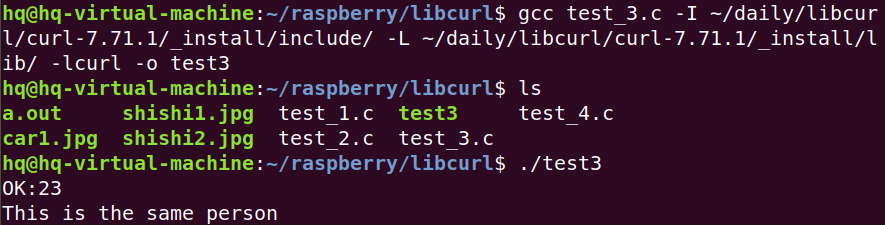

```cpp
#include <stdio.h>
#include <curl/curl.h>
#include <string.h>
#include <stdlib.h>
#include <sys/types.h>
#include <sys/stat.h>
#include <fcntl.h>
#include <unistd.h>

#define true 1
#define false 0
typedef unsigned int bool;
char buf[10240] = {'\0'};

size_t readData(void *ptr, size_t size, size_t nmemb, void *stream)
{
    strncpy(buf, ptr, 10240);
}

char *getPicBase64FromFile(char *filePath)
{
    char *bufPic;
    char cmd[128] = {'\0'};

    sprintf(cmd, "base64 %s > tmpFile", filePath);
    system(cmd);

    int fd = open("./tmpFile", O_RDWR);
    int filelen = lseek(fd, 0, SEEK_END); //计算文件大小
    lseek(fd, 0, SEEK_SET);               //移动光标重新回到开头
    bufPic = (char *)malloc(filelen + 2);
    memset(bufPic, '\0', filelen + 2); //清空
    read(fd, bufPic, filelen);
    close(fd);
    system("rm -f tmpFile");  //把临时生成的文件删掉

    return bufPic;
}

bool postUrl()
{
    CURL *curl;
    CURLcode res;

    char *key = "QEgxgMoZNAVjg4jyL1WGtY";
    char *secret = "fc7420fe2eed4f8b8406f0f19fdc4919";
    int typeId = 21;
    char *format = "xml";
    char *postString;

    char *bufPic1 = getPicBase64FromFile("./shishi1.jpg");
    char *bufPic2 = getPicBase64FromFile("./shishi2.jpg");

    int len = strlen(key) + strlen(secret) + strlen(bufPic1) + strlen(bufPic2) + 124;
    postString = (char *)malloc(len);
    memset(postString, '\0', len);
    //拼接字符串
    sprintf(postString, "&img1=%s&img2=%s&key=%s&secret=%s&typeId=%d&format=%s",
            bufPic1, bufPic2, key, secret, 21, format);

    curl = curl_easy_init();
    if (curl)
    {
        curl_easy_setopt(curl, CURLOPT_COOKIEFILE, "/tmp/cookie.txt");            // 指定cookie文件
        curl_easy_setopt(curl, CURLOPT_POSTFIELDS, postString);                   // 指定post内容
        curl_easy_setopt(curl, CURLOPT_URL, "https://netocr.com/api/faceliu.do"); // 指定url
        curl_easy_setopt(curl, CURLOPT_WRITEFUNCTION, readData);                  //调用函数readData，将返回的数据发给readData
        res = curl_easy_perform(curl);

        //打印返回值
        printf("OK:%d\n", res);
        if (strstr(buf, "是") != NULL) //查找字符串中是否含“是”
        {
            printf("This is the same person\n");
        }
        else
        {
            printf("This is the different person\n");
        }
        curl_easy_cleanup(curl);
    }
    return true;
}

int main(void)
{
    postUrl();
}
```


### 程序代码 - 车牌识别

功能说明：车牌识别，返回的是原始数据

> 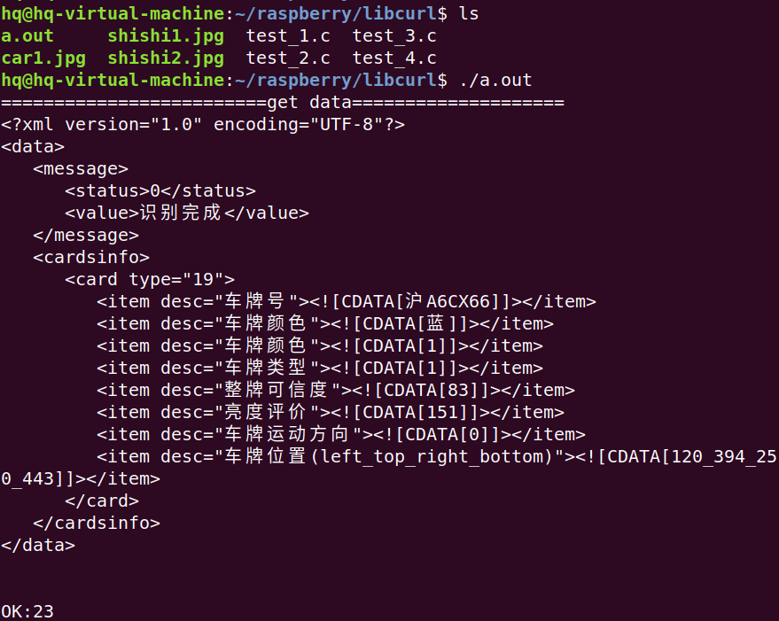

```cpp
#include <stdio.h>
#include <curl/curl.h>
#include <string.h>
#include <stdlib.h>
#include <sys/types.h>
#include <sys/stat.h>
#include <fcntl.h>
#include <unistd.h>

#define true 1
#define false 0
typedef unsigned int bool;
char buf[10240] = {'\0'};

size_t readData(void *ptr, size_t size, size_t nmemb, void *stream)
{
    strncpy(buf, ptr, 10240);
    printf("=========================get data====================\n");
    printf("%s\n", buf);
}

char *getPicBase64FromFile(char *filePath)
{
    char *bufPic;
    char cmd[128] = {'\0'};

    sprintf(cmd, "base64 %s > tmpFile", filePath);
    system(cmd);

    int fd = open("./tmpFile", O_RDWR);
    int filelen = lseek(fd, 0, SEEK_END); //计算文件大小
    lseek(fd, 0, SEEK_SET);               //移动光标重新回到开头
    bufPic = (char *)malloc(filelen + 2);
    memset(bufPic, '\0', filelen + 2); //清空
    read(fd, bufPic, filelen);
    close(fd);
    system("rm -f tmpFile");

    return bufPic;
}

bool postUrl()
{
    CURL *curl;
    CURLcode res;

    char *key = "QEgxgMoZNAVjg4jyL1WGtY";
    char *secret = "fc7420fe2eed4f8b8406f0f19fdc4919";
    int typeId = 19;
    char *format = "xml";
    char *postString;

    char *bufPic1 = getPicBase64FromFile("./car1.jpg");

    int len = strlen(key) + strlen(secret) + strlen(bufPic1) + 124;
    postString = (char *)malloc(len);
    memset(postString, '\0', len);
    //拼接字符串
    sprintf(postString, "&img=%s&key=%s&secret=%s&typeId=%d&format=%s",
            bufPic1, key, secret, typeId, format);

    curl = curl_easy_init();
    if (curl)
    {
        curl_easy_setopt(curl, CURLOPT_COOKIEFILE, "/tmp/cookie.txt");             // 指定cookie文件
        curl_easy_setopt(curl, CURLOPT_POSTFIELDS, postString);                    // 指定post内容
        curl_easy_setopt(curl, CURLOPT_URL, "https://netocr.com/api/recogliu.do"); // 指定url
        curl_easy_setopt(curl, CURLOPT_WRITEFUNCTION, readData);                   //调用函数readData，将返回的数据发给readData
        res = curl_easy_perform(curl);

        //打印返回值
        printf("OK:%d\n", res);
        if (strstr(buf, "是") != NULL) //查找字符串中是否含“是”
        {
            //    printf("This is the same person\n");
        }
        else
        {
            //    printf("This is the different person\n");
        }
        curl_easy_cleanup(curl);
    }
    return true;
}

int main(void)
{
    postUrl();
}
```

 


## Ubuntu18.04安装Openssl-1.1.1 - 摘录

> https://www.cnblogs.com/jsjliyang/p/10606908.html

#### 1.查看版本

Ubuntu的版本是18.04。使用`openssl version`命令查看openssl版本，可以看到Ubuntu自带了openssl-1.1.0版本，因此安装新版本需要替换旧版本。


#### 2.下载openssl

打开openssl官网的[下载页面](https://www.openssl.org/source/)可以看到最新的软件包，下载openssl-1.1.1b.tar.gz。放到Ubuntu系统中。
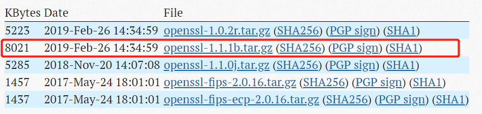

#### 3.解压和安装

- 使用命令`tar -xzvf openssl-1.1.1b.tar.gz`解压。
- 使用`cd openssl-1.1.1b`进入目录，并且使用`./config`生成MakeFile，不加任何参数，默认的安装位置为：`/usr/local/bin/openssl`。
  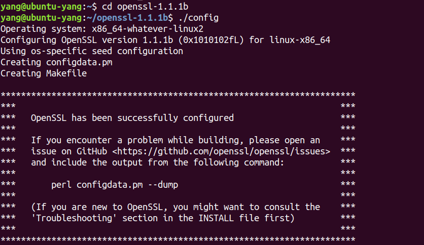
- 使用`make`进行编译
- 不放心的话可以使用`make tset`检查一下（可选步骤）
- 使用`sudo make install`进行安装，这里一定要选择root用户的权限执行。

#### 4.备份与替换

- 到上一步openssl就算安装好了，但是还无法使用，需要通过软链接的方式将新旧版本就行替换，依次运行下列命令。

```bash
sudo mv /usr/bin/openssl /usr/bin/openssl.old    //将旧版本的openssl进行备份
sudo ln -s /usr/local/bin/openssl /usr/bin/openssl    //将新版本的openssl进行软链接
cd /etc/   //进入etc目录
su     //下一步一定要切换到root用户
echo "/usr/local/lib" >> ld.so.conf    //将openssl的安装路径加入配置中
ldconfig  //重新加载配置
```

- 使用`openssl version`查看，已经安装好。
  
- 如果需要更换版本的话（一般也不会），修改软链接的名称即可，参照：

```bash
sudo mv /usr/bin/openssl /usr/bin/openssl.new
sudo mv /usr/bin/openssl.old /usr/bin/openssl
```

#### 5.安装依赖库

- openssl安装结束之后，需要安装依赖库才能够进行编程，使用`sudo apt-get install libssl-dev`安装依赖库，可以看到同时也下载了libssl-doc。
  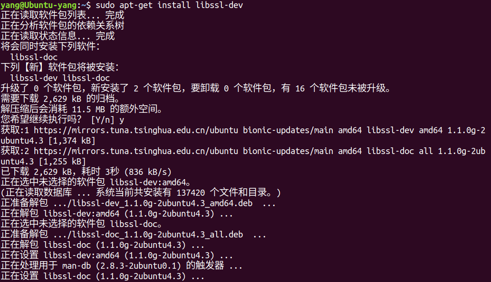
- 由于下载的依赖库比较旧，我们在前面安装的openssl包中已经安装了新版本的库，因此需要将新旧库进行替换，仍然要做上一步的原因是尽量把能自动配置安装的东西安装好，只需要手动替换新的东西。下面是新旧库的对比（上面为新）：
  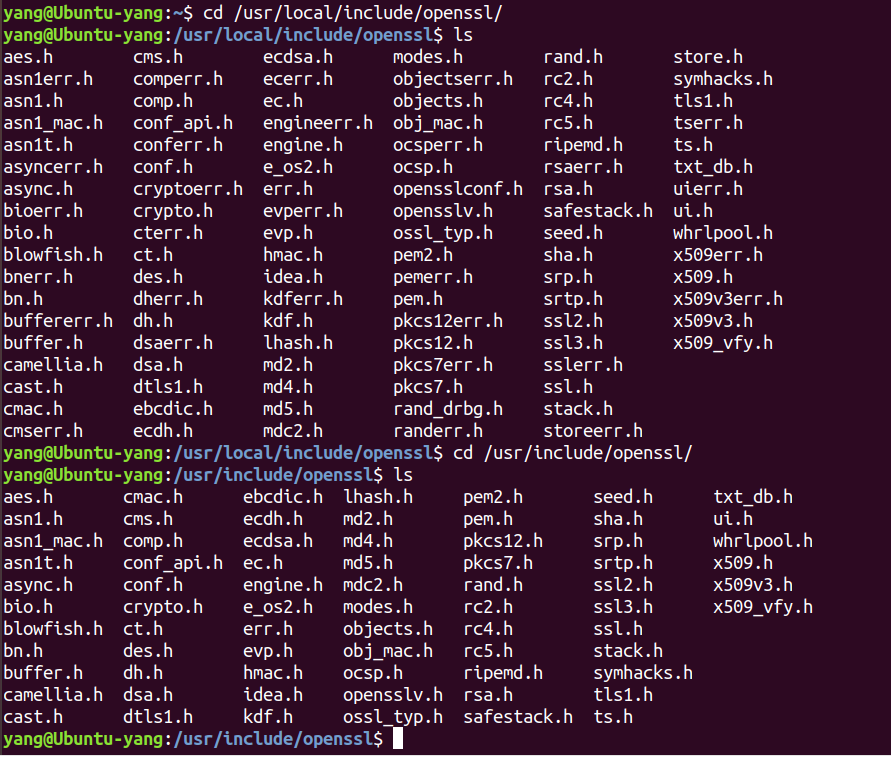
- 依次使用以下命令进行替换：

```verilog
sudo mv /usr/include/openssl /usr/include/openssl.old    //将旧版本进行备份
sudo ln -s /usr/local/include/openssl /usr/include/openssl    //将新版本进行软链接
```

#### 6.测试

编写一个测试代码test_openssl.c：

```cpp
#include <stdio.h>
#include <openssl/evp.h>

int main(){
    
    OpenSSL_add_all_algorithms();
    
    return 0;
}
```

然后用下面的命令编译：
`gcc -o to test_openssl.c -L/usr/local/openssl/lib -lssl -lcrypto -ldl -lpthread`
执行`./to;echo $?`，结果打印0。
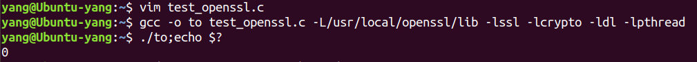

#### 参考资料

- [Linux下OpenSSL的安装与使用](https://www.cnblogs.com/rocedu/p/5087623.html)
- [解决引用openssl静态库libcrypto.a和libssl.a出现undefined reference to异常的有关问题](https://blog.csdn.net/azhangyi188/article/details/51063880)


