# 树莓派摄像头使用 - HQ

[TOC]

------

#### 注意

- 

------

## 树莓派摄像头配置流程

> [摘自文章](https://jingyan.baidu.com/article/47a29f2474a555c01523994c.html)

==树莓派利用pi Camera模块，通过mjpg-streamer软件获取视频，通过手机端或电脑端浏览实时视频。==

### 步骤1

1. sudo apt-get update  #更新软件列表

   sudo apt-get upgrade #更新软件

2. sudo apt-get install subversion #Subversion是一个自由开源的版本控制系统

3. sudo apt-get install libjpeg8-dev #JPEG支持库

   sudo apt-get install imagemagick

   sudo apt-get install libv4l-dev  #4l是小写"L"

   sudo apt-get install cmake #下载编译工具


### 步骤2

1. sudo apt-get install git

2. git clone https://github.com/jacksonliam/mjpg-streamer.git

   > 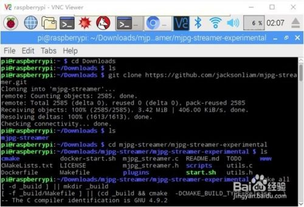

3. cd mjpg-streamer/mjpg-streamer-experimental #进入下载目录后进入左侧路径


### 步骤3

1. make all #编译

   > 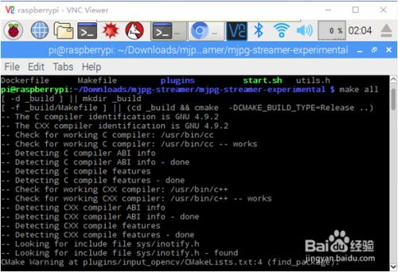

2. sudo make install #安装

   > 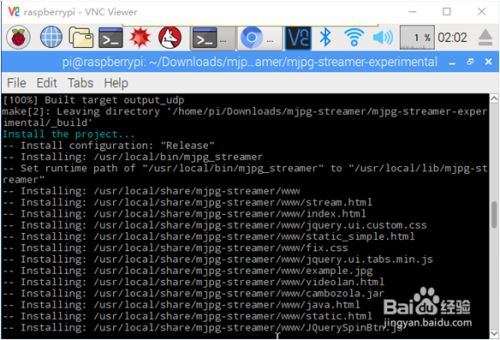

3. 修改树莓派系统设置，打开摄像头，重启树莓派

   `sudo raspi-config`

   > 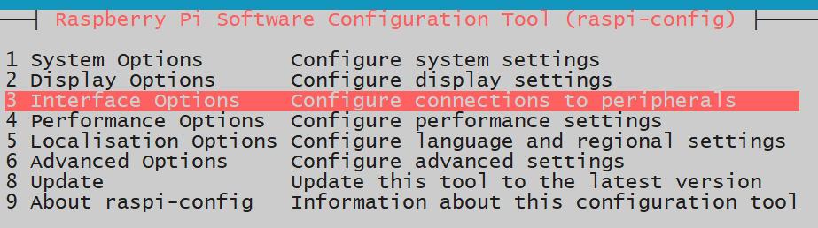
   >
   > 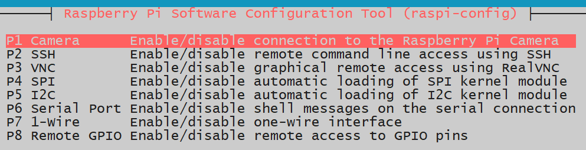

4. 修改启动脚本 `vi start.sh` 

   > 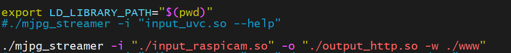

5. 运行 `./start.sh` 此处因为没连接摄像头，提示失败

   >

   其他参考方法

   > `sudo mjpg_streamer -i "./input_uvc.so -r 640x480 -f 10 -n" -o "./output_http.so -p 8080 -w /usr/local/www" `
   >
   > 此命令尤为重要，如下图所示，输出信息，说明成功！
   >
   > 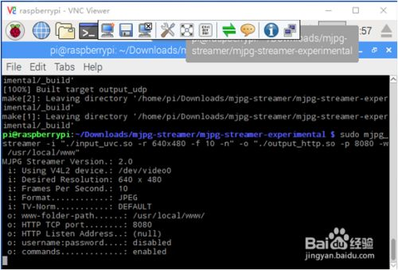

6. 在浏览器输入 `http://IP地址:8080`，回车 显示如下页面，点击页面左侧，Stream栏，显示监视画面

   > 


## 【树莓派】网络视频监控 - 编程那些年

> https://mp.weixin.qq.com/s/4-pMaQdpekXrVC7QFXE2Pw
>

利用树莓派和CSI摄像头，通过两种常见方案，我们可以简单实现局域网内的实时视频监控，接下来就讲解下如何部署这两种方案。

### 测试环境

**硬件：**树莓派3B/3B+
**系统：**Raspberry Debian 9 / Debian 10

### 准备工作

首先，按《[【树莓派】让你的SD卡快速扩容](http://mp.weixin.qq.com/s?__biz=MzkzMDE4MDM2NQ==&mid=2247483971&idx=1&sn=518b9e1bf8dce24754eb3cc00bd5ed55&chksm=c27f7e21f508f737583a9f06be5717ea241164806b70168b823d96fef2e4b2f98413c3427289&scene=21#wechat_redirect)》方法对SD卡进行扩容，防止空间不足的问题
其次，根据《[【树莓派】CSI摄像头简单配置](http://mp.weixin.qq.com/s?__biz=MzkzMDE4MDM2NQ==&mid=2247484041&idx=1&sn=2e128e6df8726622a9eb11e65de66813&chksm=c27f7eebf508f7fdb293193eb8ed27231c488fa6ac8d88a3a67fbd603482ce0516483a565351&scene=21#wechat_redirect)》正确连接CSI摄像头，并保证能够正常拍照

### 方案一、利用mjpg-streamer框架实现

更新下树莓派的软件源

```
$ sudo apt update 
```

安装编译mjpg-streamer所需的依赖包

```
$ sudo apt install cmake libjpeg8-dev libv4l-dev   #libv4l是小写"L"
```

下载mjpg-streamer源码包并对其解压

```
$ wget https://github.com/Five-great/mjpg-streamer/archive/master.zip
$ unzip  master.zip 
$ cd mjpg-streamer-master/mjpg-streamer-experimental/
```

或者通过git命令直接下载最新的源码

```
$ git clone https://github.com/jacksonliam/mjpg-streamer.git --depth=1
$ cd mjpg-streamer/mjpg-streamer-experimental 
```

对源码进行编译并安装

```
$ make
$ sudo make install
```

对树莓派的摄像头节点进行确认

```
pi@raspberrypi:~/mjpg-streamer-master/mjpg-streamer-experimental $ ls /dev/video*
/dev/video0  /dev/video10  /dev/video11  /dev/video12
```

如果存在video**(\*为数字,如video0)*的设备节点，说明可以走uvc通道，直接运行start.sh脚步即可。

```
pi@raspberrypi:~/mjpg-streamer-master/mjpg-streamer-experimental $ chmod +x start.sh
pi@raspberrypi:~/mjpg-streamer-master/mjpg-streamer-experimental $ ./start.sh 
MJPG Streamer Version: git rev: 4be5902ba243d597f8d642da5b5271f25e2fb44d
 i: Using V4L2 device.: /dev/video0 #设备节点就是/dev/vide0
 i: Desired Resolution: 640 x 480
 i: Frames Per Second.: -1
 i: Format............: JPEG
 i: TV-Norm...........: DEFAULT
省略。。。。
 o: www-folder-path......: ./www/
 o: HTTP TCP port........: 8080
 o: HTTP Listen Address..: (null)
 o: username:password....: disabled
 o: commands.............: enabled
```

如果不存在video* *(***为数字，如video0)*的设备节点，则需要修改start.sh脚步，将input_uvc.so修改为input_raspicam.so， 如下：

```
pi@raspberrypi:~/mjpg-streamer-master/mjpg-streamer-experimental $  vi  startup.sh
export LD_LIBRARY_PATH="$(pwd)"
#./mjpg_streamer -i "input_uvc.so --help"

#./mjpg_streamer -i "./input_uvc.so" -o "./output_http.so -w ./www"
./mjpg_streamer -i "./input_raspicam.so" -o "./output_http.so -w ./www" #增加该字段
#./mjpg_streamer -i "./input_uvc.so -n -f 30 -r 1280x960"  -o "./output_http.so -w ./www"
#./mjpg_streamer -i "./input_uvc.so -n -f 30 -r 640x480 -d /dev/video0"  -o "./output_http.so -w ./www" &
#./mjpg_streamer -i "./input_uvc.so -d /dev/video0" -i "./input_uvc.so -d /dev/video1" -o "./output_http.so -w ./www"
#valgrind ./mjpg_streamer -i "./input_uvc.so" -o "./output_http.so -w ./www"
```

然后运行start.sh脚步即可。

```
pi@raspberrypi:~/mjpg-streamer-master/mjpg-streamer-experimental $ chmod +x start.sh
pi@raspberrypi:~/mjpg-streamer-master/mjpg-streamer-experimental $ ./start.sh 
MJPG Streamer Version.: 2.0
 i: fps.............: 5
 i: resolution........: 640 x 480
 i: camera parameters..............:

Sharpness 0, Contrast 0, Brightness 50
Saturation 0, ISO 0, Video Stabilisation No, Exposure compensation 0
Exposure Mode 'auto', AWB Mode 'auto', Image Effect 'none'
Metering Mode 'average', Colour Effect Enabled No with U = 128, V = 128
Rotation 0, hflip No, vflip No
ROI x 0.000000, y 0.000000, w 1.000000 h 1.000000
 o: www-folder-path......: ./www/
 o: HTTP TCP port........: 8080
 o: HTTP Listen Address..: (null)
 o: username:password....: disabled
 o: commands.............: enabled
 i: Starting Camera
Encoder Buffer Size 81920
```

然后打开浏览器，网址输入http://192.168.1.107:8080，即可看到监控视频效果:*（PS：192.168.1.107为树莓派IP，可通过ifconfig命令确认实际IP）*

> 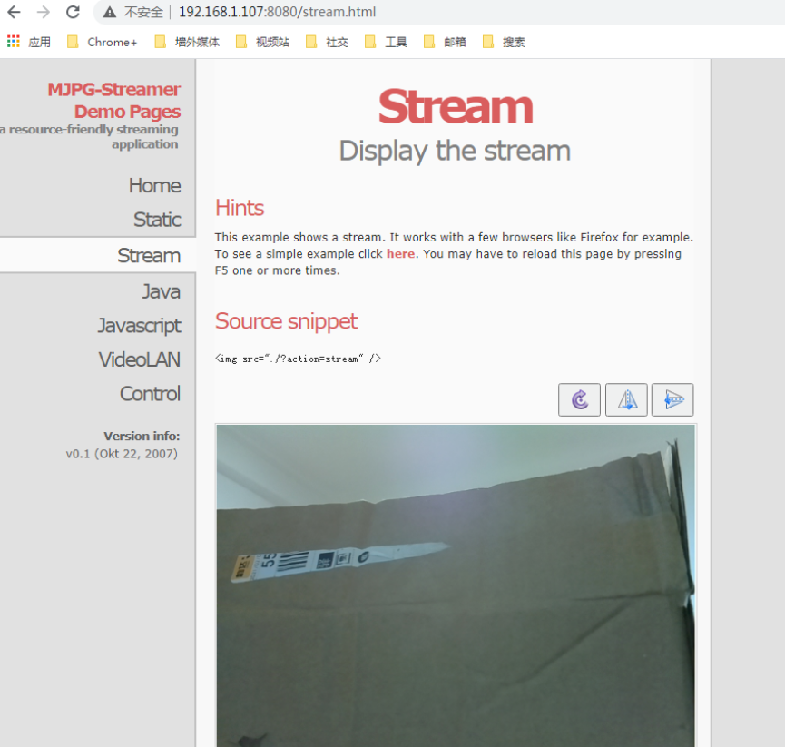

此时，在树莓派上，可通过wget命令对视频进行截图，如下：

```
$ wget  http://192.168.1.107:8080/?action=snapshot -O ./image1.jpg 
#这其中192.168.1.107为实际的ip，image1.jpg为要保存到的图片名称
```

**最后，可以创建并添加开机启动的配置文件，实现开机自动启动视频监控:**

创建要使用的开机脚本

```
pi@raspberrypi:~ $ cd 
pi@raspberrypi:~ $ vi test.sh  #/home/pi/test.sh路径

#!/bin/bash

cd  /home/pi/mjpg-streamer/mjpg-streamer-experimental/
./start.sh
```

添加配置文件

```
pi@raspberrypi:/etc/xdg/autostart $ cd   /etc/xdg/autostart/
pi@raspberrypi:/etc/xdg/autostart $ sudo cp xcompmgr.desktop  mjpg.desktop 
pi@raspberrypi:/etc/xdg/autostart $sudo  vim.tiny  mjpg.desktop   

[Desktop Entry]
Type=Application
Name=mjpeg-http
Comment=Start mjpeg-http compositor
NoDisplay=true
Exec=/home/pi/test.sh

保存退出，并重启树莓派。服务就会自动起来
```

### 方案二、利用VLC串流实时输出网络视频流

首先安装VLC软件包

```
$ sudo apt update
$ sudo apt install vlc # Raspberry Debian 10 可以不装
```

然后运行如下命令：

```
pi@raspberrypi:~ $ sudo raspivid -o - -t 0 -w 640 -h 360 -fps 25|cvlc -vvv stream:///dev/stdin --sout '#standard{access=http,mux=ts,dst=:8090}' :demux=h264 

VLC media player 3.0.8 Vetinari (revision 3.0.8-0-gf350b6b5a7)
[009b5b58] main libvlc debug: VLC media player - 3.0.8 Vetinari
[009b5b58] main libvlc debug: Copyright © 1996-2019 the VideoLAN team
[009b5b58] main libvlc debug: revision 3.0.8-0-gf350b6b5a7
省略...
[73600668] main input debug: Buffering 43%
```

即可开启raspivid视频捕捉并发送到VLC。

在PC端安装VLC软件,下载地址如下：
*(PS:偷懒的也可以在公众号后台回复"VLC"获取64位版本)*

```
https://www.videolan.org/
```

安装时，一路默认即可。

最后打开安装好的VLC软件，选择**"媒体（M）->流（S）…->网络（N）"**，输入

```
http://192.168.1.107:8090 #192.168.1.107为树莓派实际IP
```

如下图所示：

> 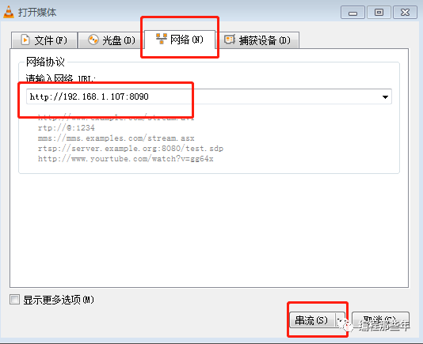
>
> 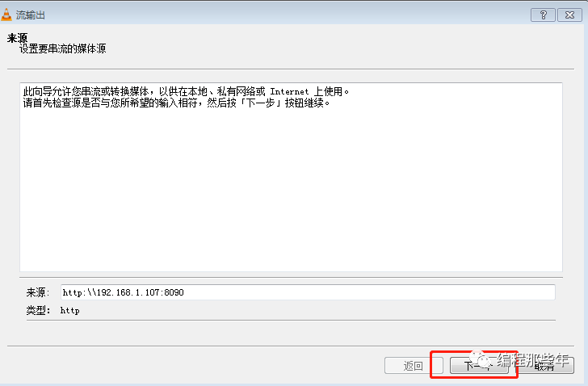
>
> 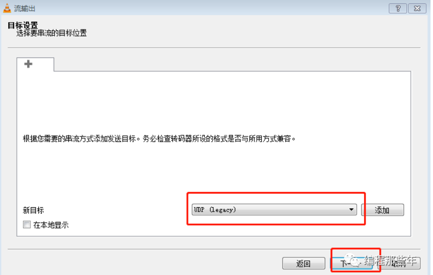
>
> 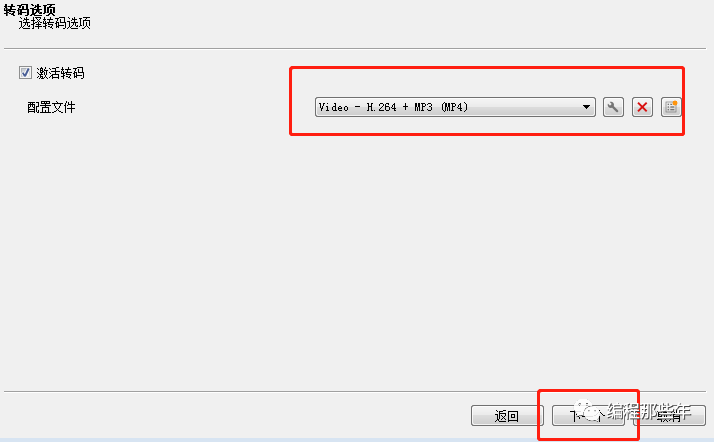
>
> 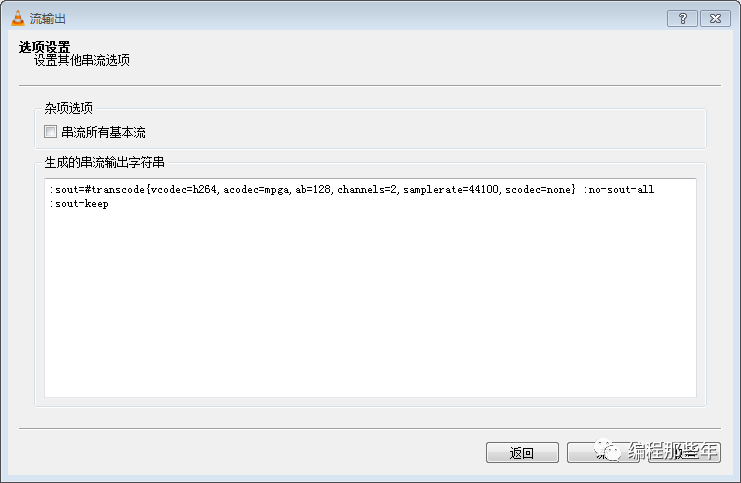
>
> 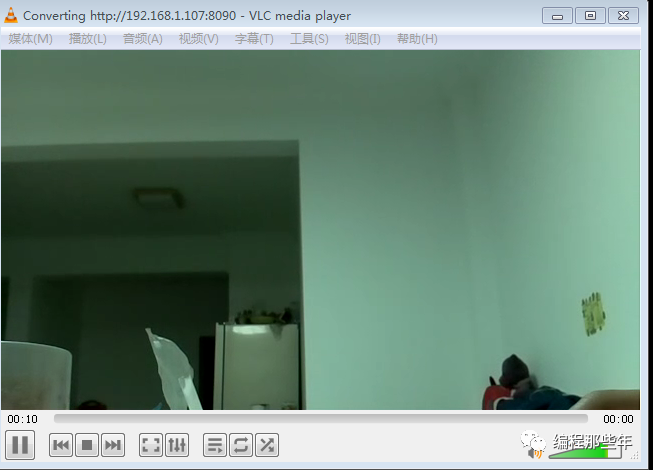

等待一会即可播出树莓派捕捉的视频流。


