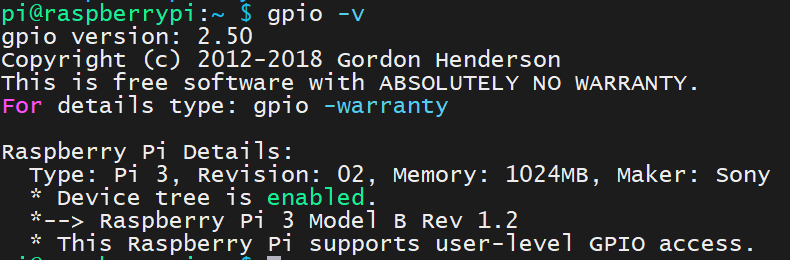
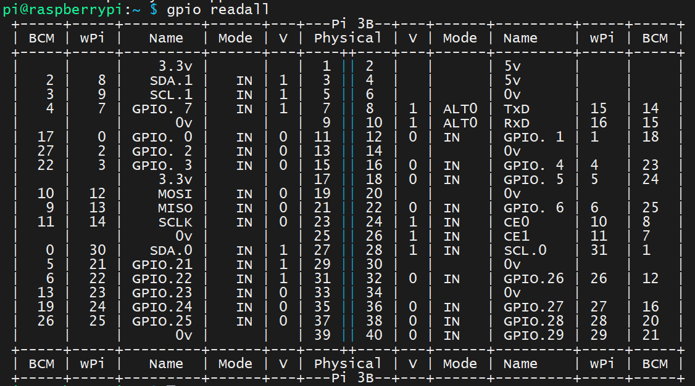
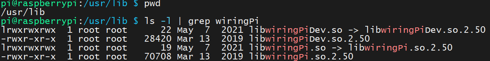
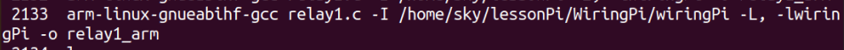

# 树莓派wiringPi库开发 - HQ

[TOC]

------

#### 注意

- 

------

## wiringPi库使用

### wiringPi库指令

**查看wiringPi库版本**

```
gpio -v
```

> 

**查看树莓派所以引脚状态**

```
gpio readall
```

> 

### 对wiringPi库进行交叉编译（暂时不可行）

通常我们先要交叉编译wiringPi库，编译出的库适合树莓派，这时候再进行交叉编译可执行程序，并链接库（通过-I -L来指定）。

否则会因为链接的库的格式不对，是宿主机的平台，出现以下错误，要把树莓派的wringPI库在ubuntu中交叉编译后进行库链接。

```
arm-linux-gnueabihf-gcc demo2.c -I /home/CLC/lessonPI/WiringPi/wiringPi -lwiringPi

/home/CLC/lessonPI/tools-master/arm-bcm2708/gcc-linaro-arm-linux-gnueabihf-raspbian-x64/bin/../lib/gcc/arm-linux-gnueabihf/4.8.3/../../../../arm-linux-gnueabihf/bin/ld: cannot find -lwiringPi

collect2: error: ld returned 1 exit status
```

由于在网络上搜集到的wiringPi.rar库安装包默认使用gcc编译安装，只适用于x86平台，不适用于arm平台，且此库中不含config等可更改编译选项的配置文件，所以这个库无法使用。

> 使用方法：将wiringPi.rar库压缩包解压缩后拷贝到ubuntu中，阅读README文件说明，运行build脚本安装

### 使用wiringPi库进行交叉编译

1、直接将树莓派中的wiringPi动态库`libwiringPi.so.2.50`拷贝到ubuntu中

> 

2、在ubuntu中新建软连接指向wiringPi动态库

```
ln -s libwiringPi.so.2.50 libwiringPi.so
```

3、在ubuntu中交叉编译程序，交叉编译的同时指定wiringPi动态库

```shell
arm-linux-gnueabihf-gcc xxx.c -I /home/hq/raspberry/wiringPi -L. -lwiringPi -o xxx
```

> `-Ixxx` 的意思是除了默认的头文件搜索路径(比如/usr/include等）外，同时还在路径`xxx`下搜索需要被引用的头文件。 
>
> `gcc -I. -I/usr/xxx`的意思是，同时还要在 `.` 目录（即执行gcc的当前目录） 以及 `/usr/xxx` 目录下搜索头文件。
>
> `-Lxxx`  指定编译的时候，搜索库的路径。比如你自己的库，可以用它制定目录，不然编译器将只在标准库的目录找。这个`xxx`就是目录的名称。
>
> 


## wiringPi库例程汇总

### 例程 - 1 - 串口

serial.c serial2.c

```c
#include <wiringSerial.h>
#include <stdio.h>
#include <wiringPi.h>


int main()
{
    int fd;
    int cmd;
    //树莓派初始化
    wiringPiSetup();
    //Linux中一切皆文件，串口也是文件
    fd = serialOpen("/dev/ttyAMA0",9600);
        
    while(1)
    {
        while(serialDataAvail(fd) != -1)
        {
            cmd = serialGetchar(fd);
            printf("get data =%c\n",cmd);
        }
        //在树莓派中，换行一般是/r/n配合使用
        serialPuts(fd,"YANG HAO QING COOL!\r\n");
        delayMicroseconds(1000000); //1s
    }
    serialClose(fd);
    return 0;
}

#include <wiringSerial.h>
#include <stdio.h>
#include <wiringPi.h>
#include <stdlib.h>
#include <string.h>
#include <unistd.h>
void serialSetup()
{
    if(-1 == wiringPiSetup())
    {
        printf("openSerial error\n");
        exit(-1);
    }
}


int main()
{
    char buf[128] = {'\0'};
    int serialDataCount = 0;
    serialSetup();


    int fd;
    if((fd = serialOpen("/dev/ttyAMA0",9600)) == -1)
    {    printf("serial open failed\n");
        exit(-1);
    }
    while(1)
    {
        serialDataCount = read(fd, buf, sizeof(buf));
        if(serialDataCount == 0)
        {
            printf("nodatas\n");
        }
        else
        {
            printf("getDatas:%s\n",buf);
            memset(buf, '\0', sizeof(buf));
            serialDataCount = 0;
        }
    
    }
    return 0;
}
```


### 例程 - 2 - 继电器

relay1.c

```c
#include <wiringPi.h>
#include <stdio.h>


#define SWITCHER 7
int main()
{


    int cmd = 0;


    if(wiringPiSetup() == -1){
        printf("硬件初始化失败\n");
        return -1;
    }
    pinMode(SWITCHER,OUTPUT);


    digitalWrite(SWITCHER,HIGH);
    while(1)
    {    
        printf("请输入0/1: 0-断开开关 1-导通开关\n");
        scanf("%d",&cmd);
        getchar();
        if(cmd == 1)
        {
            digitalWrite(SWITCHER,LOW);        
        }
        else if(cmd == 0)
        {
            digitalWrite(SWITCHER,HIGH);
        }
        else
        {
            printf("输入错误\n");
        }
    }
}
```


### 例程 - 3 - 超声波传感器

ultrasonic.c

```c
#include <wiringPi.h>
#include <stdio.h>
#include <sys/time.h>
#define Trig    4
#define Echo    5


void ultraInit(void)
{
    pinMode(Echo, INPUT);  //设置端口为输入
    pinMode(Trig, OUTPUT);  //设置端口为输出
}


float disMeasure(void)
{
    struct timeval tv1;  //timeval是time.h中的预定义结构体 其中包含两个一个是秒，一个是微秒
    /*
     *     struct timeval
     *         {
     *                 time_t tv_sec;  //Seconds.
     *                         suseconds_t tv_usec;  //Microseconds.
     *                             };
     *                                 */


    struct timeval tv2;
    long start, stop;
    float dis;


    digitalWrite(Trig, LOW);
    delayMicroseconds(2);


    digitalWrite(Trig, HIGH);
    delayMicroseconds(10);      //发出超声波脉冲
    digitalWrite(Trig, LOW);


    while(!(digitalRead(Echo) == 1));
    gettimeofday(&tv1, NULL);           //获取当前时间 开始接收到返回信号的时候


    while(!(digitalRead(Echo) == 0));
    gettimeofday(&tv2, NULL);           //获取当前时间  最后接收到返回信号的时候
    /*
     *     int gettimeofday(struct timeval *tv, struct timezone *tz);
     *         The functions gettimeofday() and settimeofday() can get and set the time as well as a timezone.
     *             The use of the timezone structure is obsolete; the tz argument should normally be specified as NULL.
     *                 */
    start = tv1.tv_sec * 1000000 + tv1.tv_usec;   //微秒级的时间
    stop  = tv2.tv_sec * 1000000 + tv2.tv_usec;


    dis = (float)(stop - start) / 1000000 * 34000 / 2;  //计算时间差求出距离


    return dis;
}


int main(void)
{
    float dis;


    if(wiringPiSetup() == -1){ //如果初始化失败，就输出错误信息 程序初始化时务必进行
        printf("setup wiringPi failed !");
        return -1;
    }


    ultraInit();


    while(1){
        dis = disMeasure();
        printf("distance = %0.2f cm\n",dis);
        delay(1000);
    }


    return 0;
}
```


### 例程 - 4 - 控制4路继电器

relay_4route.c 4路继电器

```c
#include <wiringPi.h>
#include <stdio.h>
#include <string.h>


#define SWI1 29
#define SWI2 28
#define SWI3 27
#define SWI4 26
int main()
{


    char cmd[12] = {'\0'};


    if(wiringPiSetup() == -1){
        printf("硬件初始化失败\n");
        return -1;
    }
    pinMode(SWI1,OUTPUT);
    pinMode(SWI2,OUTPUT);
    pinMode(SWI3,OUTPUT);
    pinMode(SWI4,OUTPUT);


    digitalWrite(SWI1,HIGH);
    digitalWrite(SWI2,HIGH);
    digitalWrite(SWI3,HIGH);    
    digitalWrite(SWI4,HIGH);
    
    while(1)
    {
        printf("请输入1/2/3/4: off-断开开关 on-导通开关\n");
        memset(cmd,'\0',sizeof(cmd));   //初始化整个字符数组
    //    scanf("%s",cmd);
        gets(cmd);
        if(strcmp(cmd,"1 on") == 0)
        {
            digitalWrite(SWI1,LOW);        
        }
        else if(strcmp(cmd,"1 off") == 0)
        {
            digitalWrite(SWI1,HIGH);
        }
        
        if(strcmp(cmd,"2 on") == 0)
        {
            digitalWrite(SWI2,LOW);        
        }
        else if(strcmp(cmd,"2 off") == 0)
        {
            digitalWrite(SWI2,HIGH);
        }
        
        if(strcmp(cmd,"3 on") == 0)
        {
            digitalWrite(SWI3,LOW);        
        }
        else if(strcmp(cmd,"3 off") == 0)
        {
            digitalWrite(SWI3,HIGH);
        }
        
        if(strcmp(cmd,"4 on") == 0)
        {
            digitalWrite(SWI4,LOW);        
        }
        else if(strcmp(cmd,"4 off") == 0)
        {
            digitalWrite(SWI4,HIGH);
        }


        if(strcmp(cmd,"all on") == 0)
        {
            digitalWrite(SWI1,LOW);        
            digitalWrite(SWI2,LOW);        
            digitalWrite(SWI3,LOW);        
            digitalWrite(SWI4,LOW);        
        }            
        else if(strcmp(cmd,"all off") == 0)
        {
            digitalWrite(SWI1,HIGH);
            digitalWrite(SWI2,HIGH);
            digitalWrite(SWI3,HIGH);
            digitalWrite(SWI4,HIGH);
        }
    
    }
}
```


### 例程 - 5 - 语言识别

语音识别

```c
/*=======================================
功能说明：语音识别
=======================================*/
#include <wiringSerial.h>
#include <stdio.h>
#include <wiringPi.h>
#include <unistd.h>
#include <string.h>


int main()
{
    int fd;
    char cmd[128] = {'\0'};
    int nread;


    //树莓派初始化
    wiringPiSetup();
    //Linux中一切皆文件，串口也是文件
    fd = serialOpen("/dev/ttyAMA0",9600);
        
    while(1)
    {
        nread = read(fd, cmd, sizeof(cmd));
        if(strlen(cmd) == 0)
        {
            printf("overtime!\r\n");
            continue;
        }
        //比较字符串1中是否含有字符串2，返回出现的位置
        if(strstr(cmd,"open") != NULL)
            printf("open light\n");
        if(strstr(cmd,"close") != NULL)
            printf("close light\n");


        printf("get Data: %dbyte,content: %s\r\n",nread,cmd);
        memset(cmd,'\0',sizeof(cmd)/sizeof(char));    


    }
    serialClose(fd);
    return 0;
}
```


## 树莓派wiringPi库详解 

https://www.cnblogs.com/lulipro/p/5992172.html

wiringPi是一个很棒的树莓派IO控制库，使用C语言开发，提供了丰富的接口：GPIO控制，中断，多线程，等等。java 的pi4j项目也是基于wiringPi的，我最近也在看源代码，到时候整理好了会放出来的。

下面开始wiringPi之旅吧！

### 安装

进入 wiringPi的[github (https://git.drogon.net/?p=wiringPi;a=summary) ](https://git.drogon.net/?p=wiringPi;a=summary)下载安装包。点击页面的第一个链接的右边的snapshot,下载安装压缩包。

然后进入安装包所在的目录执行以下命令：

```
>tar xfz wiringPi-98bcb20.tar.gz   //98bcb20为版本标号，可能不同
>cd wiringPi-98bcb20
>./build
```

 验证wiringPi的是否安装成功，输入gpio -v，会在终端中输出相关wiringPi的信息。否则安装失败。

 

### 编译和运行

假如你写了一个LEDtest.c 的项目，则如下。

```
编译：

g++ -Wall -o LEDtest LEDtest.cpp  -lwiringPi         //使用C++编程 , -Wall 是为了使能所有警告，以便发现程序中的问题

gcc -Wall -o LEDtest LEDtest.c   -lwiringPi          //使用C语言编程


运行：

sudo ./LEDtest
```

 

### 查看引脚编号表格

使用如下控制台下命令

```
> gpio readall
```

 也可以查看下面的图。

**注意：**查看时，将树莓派的USB接口面对自己，这样看才是正确的。

> 

  

## wiringPi库API大全

在使用wiringPi库时，你需要包含头文件 #include<wiringPi.h>。凡是写wiringPi的程序，都包含这个头文件。

### 硬件初始化函数

使用wiringPi时，你必须在执行任何操作前初始化树莓派，否则程序不能正常工作。

可以调用下表函数之一进行初始化，它们都会返回一个int ， 返回 -1 表示初始化失败。

| int wiringPiSetup (void)     | 返回:执行状态，-1表示失败 | 当使用这个函数初始化树莓派引脚时，程序使用的是wiringPi 引脚编号表。引脚的编号为 0~16需要root权限 |
| ---------------------------- | ------------------------- | ------------------------------------------------------------ |
| int wiringPiSetupGpio (void) | 返回执行状态，-1表示失败  | 当使用这个函数初始化树莓派引脚时，程序中使用的是BCM GPIO 引脚编号表。需要root权限 |
| wiringPiSetupPhys(void)      | 不常用，不做介绍          | /                                                            |
| wiringPiSetupSys (void) ;    | 不常用，不做介绍          | /                                                            |

 

### 通用GPIO控制函数

| void pinMode (int pin, int mode)        | pin：配置的引脚mode:指定引脚的IO模式可取的值：INPUT、OUTPUT、PWM_OUTPUT，GPIO_CLOCK | 作用：配置引脚的IO模式  注意： 只有wiringPi 引脚编号下的1脚（BCM下的18脚） 支持PWM输出只有wiringPi编号下的7（BCM下的4号）支持GPIO_CLOCK输出 |
| --------------------------------------- | ------------------------------------------------------------ | ------------------------------------------------------------ |
| void digitalWrite (int pin, int value)  | pin：控制的引脚value：引脚输出的电平值。 可取的值：HIGH，LOW分别代表高低电平 | 让对一个已近配置为输出模式的 引脚 输出指定的电平信号         |
| int digitalRead (int pin)               | pin：读取的引脚返回：引脚上的电平，可以是LOW HIGH 之一       | 读取一个引脚的电平值 LOW HIGH ，返回                         |
| void analogWrite(int pin, int value)    | pin:引脚value：输出的模拟量                                  | 模拟量输出树莓派的引脚本身是不支持AD转换的，也就是不能使用模拟量的API，需要增加另外的模块 |
| int analogRead (int pin)                | pin：引脚返回：引脚上读取的模拟量                            | 模拟量输入树莓派的引脚本身是不支持AD转换的，也就是不能使用模拟量的API，需要增加另外的模块 |
| void pwmWrite (int pin, int value)      | pin：引脚value：写入到PWM寄存器的值，范围在0~1024之间。      | 输出一个值到PWM寄存器，控制PWM输出。 pin只能是wiringPi 引脚编号下的1脚（BCM下的18脚） |
| void pullUpDnControl (int pin, int pud) | pin：引脚pud：拉电阻模式可取的值：PUD_OFF     不启用任何拉电阻。关闭拉电阻。        PUD_DOWN   启用下拉电阻，引脚电平拉到GND        PUD_UP     启用上拉电阻，引脚电平拉到3.3v | 对一个设置IO模式为 INPUT 的输入引脚设置拉电阻模式。与Arduino不同的是，树莓派支持的拉电阻模式更丰富。树莓派内部的拉电阻达50K欧姆 |

#### LED闪烁程序

```
#include<iostream>
#include<cstdlib>
#include<wiringPi.h>   

const int LEDpin = 1;

int main()
{
      if(-1==wiringPiSetup())
      {
             cerr<<"setup error\n";
             exit(-1);
      }
      pinMode(LEDpin,OUTPUT);      


      for(size_t i=0;i<10;++i)
      {
                digitalWrite(LEDpin,HIGH); 
                delay(600);
                digitalWrite(LEDpin,LOW);
                delay(600);
   
      }
        
      cout<<"------------bye-------------"<<endl;
      return 0;   
}
```

####  PWM输出控制LED呼吸灯的例子

```
#include<iostream>
#include<wiringPi.h>
#include<cstdlib>
using namespace std;


const int PWMpin = 1;   //只有wiringPi编号下的1脚（BCM标号下的18脚）支持
void setup();

int main()
{

    setup();
    int val = 0;
    int step = 2;
    while(true)
    {
        if(val>1024)
        {
            step = -step;    
            val = 1024;
        }
        else if(val<0)
        {
            step = -step;
            val = 0;
        }

        pwmWrite(PWMpin,val);
        val+=step;
        delay(10);
    }

    return 0;
}

void setup()
{
    if(-1==wiringPiSetup())
    {
        cerr<<"setup error\n";
        exit(-1);
    }
    pinMode(PWMpin,PWM_OUTPUT);
}
```


### 时间控制函数

| unsigned int millis (void)                    | 这个函数返回 一个 从你的程序执行 wiringPiSetup 初始化函数（或者wiringPiSetupGpio ） 到 当前时间 经过的 毫秒数。 返回类型是unsigned int，最大可记录 大约49天的毫秒时长。 |
| --------------------------------------------- | ------------------------------------------------------------ |
| unsigned int micros (void)                    | 这个函数返回 一个 从你的程序执行 wiringPiSetup 初始化函数（或者wiringPiSetupGpio ） 到 当前时间 经过的 微秒数。 返回类型是unsigned int，最大可记录 大约71分钟的时长。 |
| void delay (unsigned int howLong)             | 将当前执行流暂停 指定的毫秒数。因为Linux本身是多线程的，所以实际暂停时间可能会长一些。参数是unsigned int 类型，最大延时时间可达49天 |
| void delayMicroseconds (unsigned int howLong) | 将执行流暂停 指定的微秒数（1000微秒 = 1毫秒 = 0.001秒）。 因为Linux本身是多线程的，所以实际暂停时间可能会长一些。参数是unsigned int 类型，最大延时时间可达71分钟 |

   

### 中断

wiringPi提供了一个中断处理注册函数，它只是一个注册函数，并不处理中断。他无需root权限。

| int wiringPiISR (int pin, int edgeType, void (*function)(void)) | 返回值：返回负数则代表注册失败pin：接受中断信号的引脚edgeType：触发的方式。 INT_EDGE_FALLING：下降沿触发  INT_EDGE_RISING：上升沿触发  INT_EDGE_BOTH ：上下降都会触发  INT_EDGE_SETUP：编程时用不到。        function：中断处理函数的指针，它是一个无返回值，无参数的函数。 | 注册的函数会在中断发生时执行和51单片机不同的是：这个注册的中断处理函数会和main函数并发执行（同时执行，谁也不耽误谁）当本次中断函数还未执行完毕，这个时候树莓派又触发了一个中断，那么这个后来的中断不会被丢弃，它仍然可以被执行。但是wiringPi最多可以跟踪并记录后来的仅仅1个中断，如果不止1个，则他们会被忽略，得不到执行。 |
| ------------------------------------------------------------ | ------------------------------------------------------------ | ------------------------------------------------------------ |
|                                                              |                                                              |                                                              |

  通过1脚检测 因为按键按下引发的 下降沿，触发中断，反转11控制的LED

```
#include<iostream>
#include<wiringPi.h>
#include<cstdlib>
using namespace std;

void ButtonPressed(void);
void setup();

/********************************/
const int LEDPin = 11;
const int ButtonPin = 1;
/*******************************/

int main()
{

    setup();

    //注册中断处理函数
    if(0>wiringPiISR(ButtonPin,INT_EDGE_FALLING,ButtonPressed))
    {
        cerr<<"interrupt function register failure"<<endl;
        exit(-1);
    }


    while(1)
    ;

    return 0;
}

void setup()
{
    if(-1==wiringPiSetup())
    {
        cerr<<"wiringPi setup error"<<endl;
        exit(-1);
    }
    
    pinMode(LEDPin,OUTPUT);    //配置11脚为控制LED的输出模式
    digitalWrite(LEDPin,LOW);  //初始化为低电平

    pinMode(ButtonPin,INPUT);            //配置1脚为输入
    pullUpDnControl(ButtonPin,PUD_UP);  //将1脚上拉到3.3v

}


//中断处理函数：反转LED的电平
void ButtonPressed(void)
{

    digitalWrite(LEDPin,  (HIGH==digitalRead(LEDPin))?LOW:HIGH );

}
```


### 多线程

wiringPi提供了简单的Linux系统下的通用的 Posix threads线程库接口来支持并发。

| int piThreadCreate(name)   | name:被包装的线程执行函数返回：状态码。返回0表示成功启动，反之失败。`源代码： int piThreadCreate (void *(*fn)(void *)) {  pthread_t myThread ;  return pthread_create (&myThread, NULL, fn, NULL) ; } ` | 包装一个用PI_THEEAD定义的函数为一个线程，并启动这个线程。首先你需要通过以下方式创建一个特特殊的函数，这个函数中的代码就是在新的线程中将执行的代码。，myTread是你自己线程的名字，可自定义。` PI_THREAD (myThread) {   //在这里面写上的代码会和主线程并发执行。 } 在wiringPi.h中，我发现这样一个宏定义：#define PI_THREAD(X) void *X (void *dummy) 那么，被预处理后我们写的线程函数会变成下面这个样子，请注意返回值，难怪我每次写都会警告，因为没有返回一个指针， 那么，以后注意返回NULL，或者 (void*)0   void *myThread (void *dummy) { //在这里面写上的代码会和主线程并发执行。 }  //在这里面写上的代码会和主线程并发执行。 ` |
| -------------------------- | ------------------------------------------------------------ | ------------------------------------------------------------ |
| piLock(int keyNum)         | keyNum:0-3的值，每一个值代表一把锁                           | 使能同步锁。wiringPi只提供了4把锁，也就是keyNum只能取0~3的值，官方认为有这4把锁就够了。keyNum：0,1,2,3 每一个数字就代表一把锁。源代码：void piLock (int keyNum) {  pthread_mutex_lock (&piMutexes [keyNum]) ; } |
| piUnlock(int keyNum)       | keyNum:0-3的值，每一个值代表一把锁                           | 解锁，或者说让出锁。源代码：void piUnlock (int key) {  pthread_mutex_unlock (&piMutexes [key]) ; } |
| int piHiPri (int priority) | priority：优先级指数，0~99返回值：0，成功     -1:，失败      | 设定线程的优先级，设定线程的优先级变高，不会使程序运行加快，但会使这个线程获得相当更多的时间片。priority是相对的。比如你的程序只用到了主线程，和另一个线程A，主线程设定优先级为1，A线程设定为2，那也代表A比main线程优先级高。 |

 凡是涉及到多线程编程，就会涉及到线程安全的问题，多线程访问同一个数据，需要使用同步锁来保障数据操作正确性和符合预期。

当A线程锁上 锁S 后，其他共用这个锁的竞争线程，只能等到锁被释放，才能继续执行。

成功执行了piLock 函数的线程将拥有这把锁。其他线程想要拥有这把锁必须等到这个线程释放锁，也就是这个线程执行piUnlock后。

同时要扩展的知识是：volatile 这个C/C++中的关键字，它请求编译器不缓存这个变量的数据，而是每次都从内存中读取。特别是在多线程下共享放变量，必须使用volatile关键字声明才是保险的。

  

### softPwm，软件实现的PWM

树莓派硬件上支持的PWM输出的引脚有限，为了突破这个限制，wiringPi提供了软件实现的PWM输出API。

需要包含头文件：#include <softPwm.h>

编译时需要添pthread库链接 -lpthread

| int softPwmCreate (int pin, int initialValue, int pwmRange) | pin：用来作为软件PWM输出的引脚initalValue：引脚输出的初始值pwmRange：PWM值的范围上限建议使用100.返回：0表示成功。 | 使用一个指定的pin引脚创建一个模拟的PWM输出引脚 |
| ----------------------------------------------------------- | ------------------------------------------------------------ | ---------------------------------------------- |
| void softPwmWrite (int pin, int value)                      | pin：通过softPwmCreate创建的引脚value：PWM引脚输出的值       | 更新引脚输出的PWM值                            |

  

### 串口通信

使用时需要包含头文件：#include <wiringSerial.h>

| int serialOpen (char *device, int baud)              | device:串口的地址，在Linux中就是设备所在的目录。默认一般是"/dev/ttyAMA0",我的是这样的。 baud：波特率返回：正常返回文件描述符，否则返回-1失败。 | 打开并初始串口                                               |
| ---------------------------------------------------- | ------------------------------------------------------------ | ------------------------------------------------------------ |
| void serialClose (int fd)                            | fd：文件描述符                                               | 关闭fd关联的串口                                             |
| void serialPutchar (int fd, unsigned char c)         | fd:文件描述符c:要发送的数据                                  | 发送一个字节的数据到串口                                     |
| void serialPuts (int fd, char *s)                    | fd：文件描述符s：发送的字符串，字符串要以'\0'结尾            | 发送一个字符串到串口                                         |
| void serialPrintf (int fd, char *message, …)         | fd：文件描述符message：格式化的字符串                        | 像使用C语言中的printf一样发送数据到串口                      |
| int  serialDataAvail (int fd)                        | fd：文件描述符返回：串口缓存中已经接收的，可读取的字节数，-1代表错误 | 获取串口缓存中可用的字节数。                                 |
| int serialGetchar (int fd)                           | fd：文件描述符返回：读取到的字符                             | 从串口读取一个字节数据返回。如果串口缓存中没有可用的数据，则会等待10秒，如果10后还有没，返回-1所以，在读取前，做好通过serialDataAvail判断下。 |
| void serialFlush (int fd)                            | fd：文件描述符                                               | 刷新，清空串口缓冲中的所有可用的数据。                       |
| *size_t write (int fd,const void * buf,size_t count) | fd：文件描述符buf：需要发送的数据缓存数组count:发送buf中的前count个字节数据返回：实际写入的字符数，错误返回-1 | 这个是Linux下的标准IO库函数，需要包含头文件#include <unistd.h>当要发送到的数据量过大时，wiringPi建议使用这个函数。 |
| *size_t read(int fd,void * buf ,size_t count);       | fd：文件描述符buf：接受的数据缓存的数组count:接收的字节数.返回：实际读取的字符数。 | 这个是Linux下的标准IO库函数，需要包含头文件#include <unistd.h>当要接收的数据量过大时，wiringPi建议使用这个函数。 |

 初次使用树莓派串口编程，需要配置。我开始搞了很久，以为是程序写错了 还一直在调试。。。(～￣—￣)～

```
/* 修改 cmdline.txt文件 */
>cd /boot/
>sudo vim cmdline.txt
删除【】之间的部分
dwc_otg.lpm_enable=0 【console=ttyAMA0,115200】 kgdboc=ttyAMA0,115200 console=tty1 root=/dev/mmcblk0p2 rootfstype=ext4 elevator=deadline rootwait


/*修改 inittab文件 */
>cd /etc/
>sudo vim inittab

注释掉最后一行内容:，在前面加上 # 号
#T0:23:respawn:/sbin/getty -L ttyAMA0 115200 vt100


sudo reboot 重启
```

 **下面是双机通信的一个例子**

C51代码，作为串口通信的接发送。serial库请看[另一篇文章](http://www.cnblogs.com/lulipro/p/5994368.html)

```
#include<reg52.h>
#include"serial.h"

/**********function****************/
bit isOpenPressed(void);
bit isClosePressed(void);
void delay(unsigned int t);
/*********************************/

sbit closeButton = P2^0;   //与关闭按键相连的引脚
sbit openButton  = P2^1;   //与打开按键相连的引脚

void main(void)
{

      closeButton = 1;      //拉高
      openButton  = 1;      //拉高
      
      EA =1;              //打开总中断
      serial_init(9600);  //初始化51串口
              
      while(1)
      {
          if(isClosePressed())     //如果关闭按钮按下
          {
                  serial_write(0);  //发送数据 0给树莓派
                delay(10);
          }
    
          else if(isOpenPressed()) //如果打开按钮按下
          {
                  serial_write(1);     //发送数据 1给树莓派
                delay(10);
          }
      }
}


bit isOpenPressed(void)
{
       bit press =0;

       if(0==openButton)
       {
               delay(5);
            if(0==openButton)
            {
                 while(!openButton)
                 ;
                 press = 1;
            }
       }
        
       return press;    
}

bit isClosePressed(void)
{
       bit press =0;

       if(0==closeButton)
       {
               delay(5);
            if(0==closeButton)
            {
                 while(!closeButton)
                 ;
                  press = 1;
            }
       }
        
       return press;    
}


void delay(unsigned int t)
{
    unsigned int  i    ;
    unsigned char j;
    for(i = t;i>0;i--)
        for(j=120;j>0;j--)
            ;
}
```

树莓派代码，作为串口通信的接收方

```
#include<iostream>
#include<cstdlib>
#include<wiringPi.h>
#include<wiringSerial.h>
using namespace std;


void setup();
const int LEDPin = 11;

int main()
{
    setup();
    
    int fd; //Linux 的思想是：将一切IO设备，都看做 文件，fd就是代表串口抽象出来的文件
    
    if((fd = serialOpen("/dev/ttyAMA0",9600))==-1)    //初始化串口，波特率9600
    {
        
        cerr<<"serial open error"<<endl;
        exit(-1);

    }

    while(true)
    {
    
        if(serialDataAvail(fd) >= 1)    //如果串口缓存中有数据
        {
            int data = serialGetchar(fd);

            if(data==0)   //接受到51发送的 数据 0
            {
                // close led
                digitalWrite(LEDPin,LOW);

            }
            else if(data==1)  //接受到51发送的 数据 1
            {
                //open led
                digitalWrite(LEDPin,HIGH);
            }
        }
    

    }

    return 0;
}


void setup()
{
    if(-1==wiringPiSetup())
    {
        cerr<<"set up error"<<endl;
        exit(-1);
    }
    
    pinMode(LEDPin,OUTPUT);
    digitalWrite(LEDPin,HIGH);

}
```

 


### shift移位寄存器芯片API

需要包含头文件 #include <wiringShift.h>

| void shiftOut (uint8_t dPin, uint8_t cPin, uint8_t order, uint8_t val) | dPin：移位芯片的串行数据入口引脚，比如74HC595的SER脚cPin：移位芯片的时钟引脚。如74HC595的11脚order：  LSBFIRST 先发送数据的低位  MSBFIRST先发送数据的高位   val：要发送的8位数据 | 将val串化，通过芯片转化为并行输出如常见的74HC595 |
| ------------------------------------------------------------ | ------------------------------------------------------------ | ------------------------------------------------ |
| uint8_t shiftIn (uint8_t dPin, uint8_t cPin, uint8_t order)  | 同上。                                                       | 将并行数据，通过芯片转化为串行输出。             |

 用过595的都知道还有一个引脚：12脚，Rpin，用于把移位寄存器中的数据更新到存储寄存器中，然后wiringPi的API中没有使用这个引脚。我建议使用的时候自己加上。

```
#include<iostream>
#include<wiringPi.h>
#include <wiringShift.h>
#include<cstdlib>
using namespace std;

const int SERpin = 1;   //serial data input
const int SCKpin = 2;   //shift register clock
const int RCKpin = 3;   // storage register clock
/************************/
void setup();

/*************************/

int main()
{
    setup();
    
    for(int i=0;i<8;++i)
    {
        digitalWrite(RCKpin,LOW);

               shiftOut(SERpin,SCKpin,LSBFIRST,1<<i);
        digitalWrite(RCKpin,HIGH);

               delay(800);
    }
    return 0;
    
}


void setup()
{
    if(-1==wiringPiSetup())
    {
        cerr<<"setup error\n";
        exit(-1);
    }
    
    pinMode(SERpin,OUTPUT);
    pinMode(RCKpin,OUTPUT);
    pinMode(SCKpin,OUTPUT);
    
    
}
```

 

### 树莓派硬件平台特有的API

并没有列全，我只是列出了相对来说有用的，其他的，都基本不会用到。

| pwmSetMode (int mode)            | mode：PWM运行模式                | 设置PWM的运行模式。pwm发生器可以运行在2种模式下，通过参数指定：    PWM_MODE_BAL  ：树莓派默认的PWM模式    PWM_MODE_MS  ：传统的pwm模式， |
| -------------------------------- | -------------------------------- | ------------------------------------------------------------ |
| pwmSetRange (unsigned int range) | range，范围的最大值0~range       | 设置pwm发生器的数值范围，默认是1024                          |
| pwmSetClock (int divisor)        |                                  | This sets the divisor for the PWM clock. To understand more about the PWM system, you’ll need to read the Broadcom ARM peripherals manual. |
| piBoardRev (void)                | 返回：树莓派板子的版本编号1或者2 | /                                                            |

 

 


