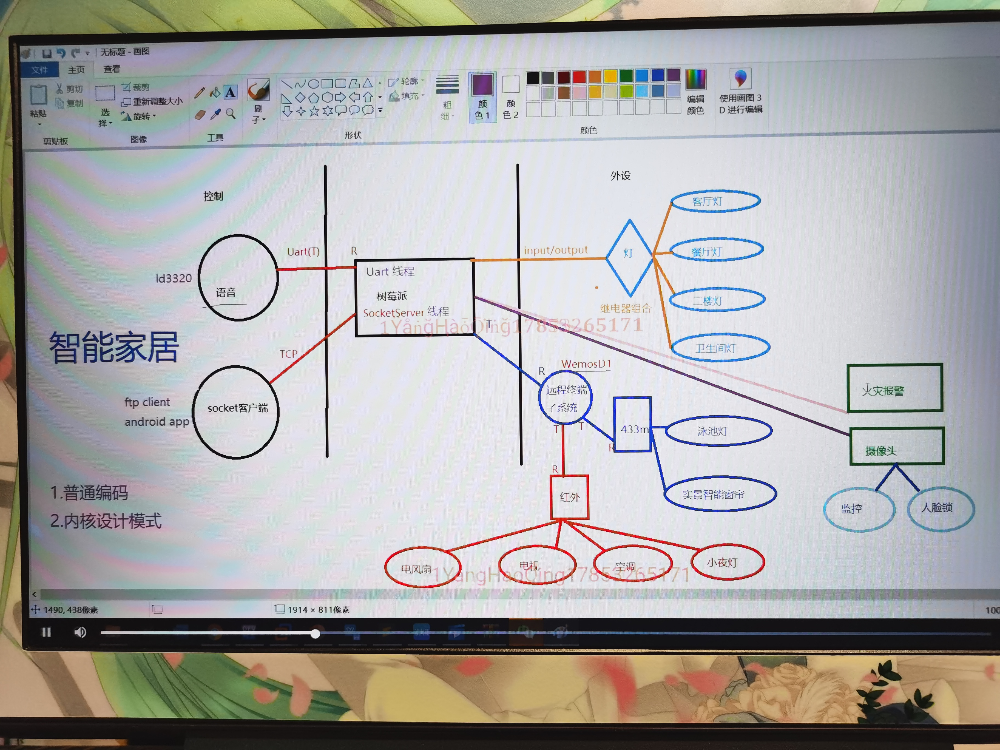
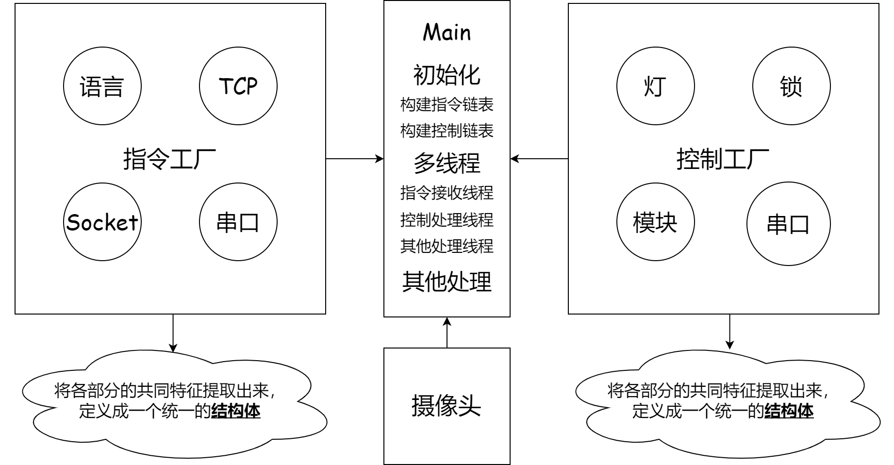
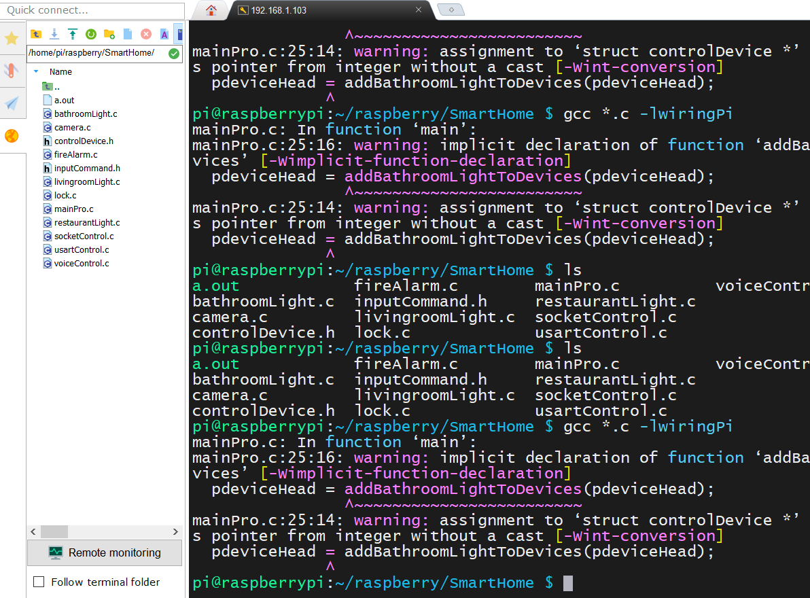
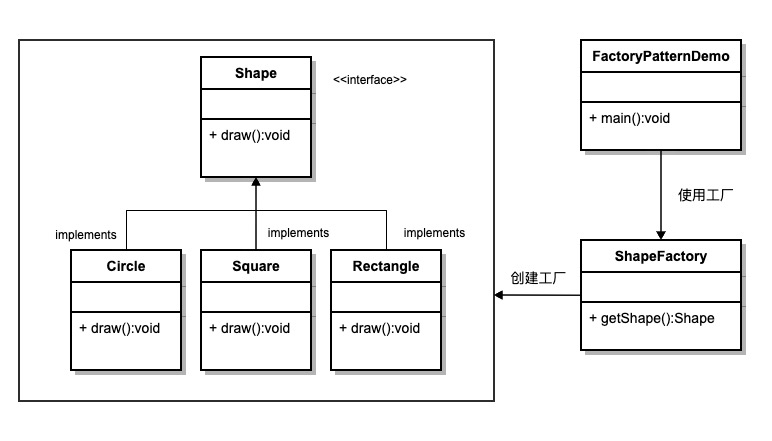
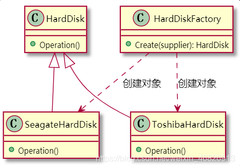
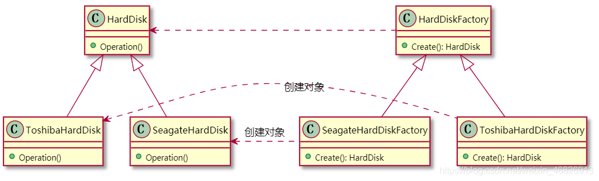

# 树莓派应用开发 - HQ

[TOC]

------

#### 注意

- 

------

# 智能家居项目

## 项目整体架构

智能家居功能结构图

> 

智能家居工厂模式结构图

>


## 项目开发流程

在Source Insight中编写好程序后，通过ssh（SFTP）直接拖拽到树莓派中，然后编译程序，修改程序错误。

> 


## 面向对象编程思想

类：类是一种用户定义的引用数据类型，也称类类型。（结构体）

对象：类的一种具象。（结构体变量）

```c
#include <stdio.h>

/* 类：抽象 模板*/
struct Animal {
    char name[128];
    int age;
    int sex;   		//成员属性
    int others;
    void (*peat)();
    void (*pbeat)();  //成员方法
};

void dogEat()
{
    printf("狗吃肉\n");
}
void catEat()
{
    printf("猫吃鱼\n");
}
void personEat()
{
    printf("人吃米\n");
}

int main()
{
	/* 对象：事务的具象 */
	struct Animal dog;  
	struct Animal cat;
	struct Animal person;
    dog.peat = dogEat;
    cat.peat = catEat;
    person.peat = personEat;
    
    /* 结构体定义时赋值 */
    struct Animal dog2 = {
        .peat = dogEat,
    };
    struct Animal person2 = {
        .peat = personEat,
    };
    /* 调用 */
    dog.peat();
    cat.peat();
    person.peat();
    dog2.peat();
    person2.peat();
    return 0;
}
```


## 项目代码架构 - 工厂模式

### 设计模式

- 代码设计经验的总结，稳定，拓展性更强，是一系列编程思想。

- 代码更容易被他人理解，保证代码可靠性，程序的重用性。
- 设计模式通常描述了一组相互紧密作用的类与对象。

> 设计模式（Design pattern）代表了最佳的实践，通常被有经验的面向对象的软件开发人员所采用。设计模式是软件开发人员在软件开发过程中面临的一般问题的解决方案。这些解决方案是众多软件开发人员经过相当长的一段时间的试验和错误总结出来的。
>
> 设计模式是一套被反复使用的、多数人知晓的、经过分类编目的、代码设计经验的总结。使用设计模式是为了重用代码、让代码更容易被他人理解、保证代码可靠性。 毫无疑问，设计模式于己于他人于系统都是多赢的，设计模式使代码编制真正工程化，设计模式是软件工程的基石，如同大厦的一块块砖石一样。项目中合理地运用设计模式可以完美地解决很多问题，每种模式在现实中都有相应的原理来与之对应，每种模式都描述了一个在我们周围不断重复发生的问题，以及该问题的核心解决方案，这也是设计模式能被广泛应用的原因。

### 工厂模式

[参考文章 - 菜鸟编程](https://www.runoob.com/design-pattern/factory-pattern.html)

#### 特点

- 这种类型的设计模式属于**创建型模式**，它**提供了一种创建对象的最佳方式。**

- 在工厂模式中，我们在**创建对象时不会对客户端暴露创建逻辑**，并且是**通过使用一个共同的接口来指向新创建的对象。**

#### 介绍

**意图：**==定义一个创建对象的接口，让其子类自己决定实例化哪一个工厂类，工厂模式使其创建过程延迟到子类进行。==

**主要解决：**主要解决接口选择的问题。

**何时使用：**我们明确地计划不同条件下创建不同实例时。

**如何解决：**让其子类实现工厂接口，返回的也是一个抽象的产品。

**关键代码：**创建过程在其子类执行。

**应用实例：** 1、您需要一辆汽车，可以直接从工厂里面提货，而不用去管这辆汽车是怎么做出来的，以及这个汽车里面的具体实现。 2、Hibernate 换数据库只需换方言和驱动就可以。

**优点：** 1、一个调用者想创建一个对象，只要知道其名称就可以了。 2、扩展性高，如果想增加一个产品，只要扩展一个工厂类就可以。 3、屏蔽产品的具体实现，调用者只关心产品的接口。

**缺点：**每次增加一个产品时，都需要增加一个具体类和对象实现工厂，使得系统中类的个数成倍增加，在一定程度上增加了系统的复杂度，同时也增加了系统具体类的依赖。这并不是什么好事。

**使用场景：** 1、日志记录器：记录可能记录到本地硬盘、系统事件、远程服务器等，用户可以选择记录日志到什么地方。 2、数据库访问，当用户不知道最后系统采用哪一类数据库，以及数据库可能有变化时。 3、设计一个连接服务器的框架，需要三个协议，"POP3"、"IMAP"、"HTTP"，可以把这三个作为产品类，共同实现一个接口。

**注意事项：**作为一种创建类模式，在任何需要生成复杂对象的地方，都可以使用工厂方法模式。有一点需要注意的地方就是复杂对象适合使用工厂模式，而简单对象，特别是只需要通过 new 就可以完成创建的对象，无需使用工厂模式。如果使用工厂模式，就需要引入一个工厂类，会增加系统的复杂度。

#### 实现

我们将创建一个 *Shape* 接口和实现 *Shape* 接口的实体类。下一步是定义工厂类 *ShapeFactory*。

*FactoryPatternDemo* 类使用 *ShapeFactory* 来获取 *Shape* 对象。它将向 *ShapeFactory* 传递信息（*CIRCLE / RECTANGLE / SQUARE*），以便获取它所需对象的类型。

> 

#### 工厂模式对比

- 简单工厂：唯一工厂类，一个产品抽象类，工厂类的创建方法依据入参判断并创建具体产品对象。
- 工厂方法：多个工厂类，一个产品抽象类，利用多态创建不同的产品对象，避免了大量的if-else判断。
- 抽象工厂：多个工厂类，多个产品抽象类，产品子类分组，同一个工厂实现类创建同组中的不同产品，减少了工厂子类的数量。

在下述情况下可以考虑使用工厂模式：

1. 在编码时不能预见需要创建哪种类的实例。
2. 系统不应依赖于产品类实例如何被创建、组合和表达的细节。

总之，工厂模式就是为了方便创建同一接口定义的具有复杂参数和初始化步骤的不同对象。工厂模式一般用来创建复杂对象。只需用new就可以创建成功的简单对象，无需使用工厂模式，否则会增加系统的复杂度。


## 简单工厂模式案例 - HQ

定义一个类（.h头文件），通过这个类定义多个对象（.c源文件），然后使用链表将各个对象串联起来使用（main.c进行调用实现功能）。

#### mainPro.c

```c
#include "animal.h"

/* 链表查找 */
struct Animal *findName(char *str, struct Animal *phead)
{
	struct Animal *tmp = phead;
	if (phead == NULL) {
		printf("空链表\n");
		return NULL;
	} else {
		while (tmp != NULL) {
			if (strcmp(tmp->name, str) == 0)
				return tmp;
			tmp = tmp->next;
		}
		return NULL;
	}
}
/* 打印输出 */
void animalPrintf(struct Animal *phead)
{
		char buf[128] = {'\0'};
		struct Animal *ptmp;
	
		printf("请输入名称：Tom, XiaoHei, XiaoMing\n");
		scanf("%s", buf);
		ptmp = findName(buf, phead);
		if (ptmp != NULL) {
			ptmp->pbeat();
			ptmp->peat();
		}
		memset(buf, '\0', sizeof(buf)); //清空
}


int main()
{
	/* 定义链表头结点指针 */
	struct Animal *phead = NULL;
	/* 将对象加入到链表中 */
	phead = putCatinLink(phead);
	phead = putDoginLink(phead);
	phead = putPersoninLink(phead);
	/* 执行内容 */
	while (1) {
		animalPrintf(phead);
	}
	
	return 0;
}
```

#### animal.h

```c
#include <stdio.h>
#include <string.h>

/* 类：抽象 模板*/
struct Animal {
    char name[128];
    int age;
    int sex;   		//成员属性
    int others;
    void (*peat)();
    void (*pbeat)();  //成员方法

	struct Animal *next;
};

/* 函数声明 */
struct Animal *putDoginLink(struct Animal *phead);
struct Animal *putCatinLink(struct Animal *phead);
struct Animal *putPersoninLink(struct Animal *phead);
```

#### cat.c

```c
#include "animal.h"

void catEat()
{
    printf("猫吃鱼\n");
}

void catBeat()
{
	printf("猫咬老鼠\n");
}

/* 定义结构体变量并初始化部分参数 */
struct Animal cat = {
	.name = "Tom",
	.peat = catEat,
	.pbeat = catBeat,
};

/* 加入链表，头插法 */
struct Animal *putCatinLink(struct Animal *phead)
{
	if (phead == NULL) {
		phead = &cat;
		return phead;
	} else {
		cat.next = phead;
		phead = &cat;
		return phead;
	}
}
```

#### dog.c

```c
#include "animal.h"

void dogEat()
{
    printf("狗吃肉\n");
}

void dogBeat()
{
	printf("狗咬人\n");
}

/* 定义结构体变量并初始化部分参数 */
struct Animal dog = {
	.name = "XiaoHei",
	.peat = dogEat,
	.pbeat = dogBeat,
};

/* 加入链表，头插法 */
struct Animal *putDoginLink(struct Animal *phead)
{
	if (phead == NULL) {
		phead = &dog;
		return phead;
	} else {
		dog.next = phead;
		phead = &dog;
		return phead;
	}
}

```

#### person.c

```c
#include "animal.h"

void personEat()
{
    printf("人吃菜\n");
}

void personBeat()
{
	printf("人打架\n");
}

/* 定义结构体变量并初始化部分参数 */
struct Animal person = {
	.name = "XiaoMing",
	.peat = personEat,
	.pbeat = personBeat,
};

/* 加入链表，头插法 */
struct Animal *putPersoninLink(struct Animal *phead)
{
	if (phead == NULL) {
		phead = &person;
		return phead;
	} else {
		person.next = phead;
		phead = &person;
		return phead;
	}
}
```


## 简单工厂模式 - 摘录

### 1、简介

**简单工厂方法定义一个用于创建对象的类，该类接受一个参数，通过参数决定创建不同的对象。**

GOF并没有把简单工厂方法定义为23种设计模式之一，**可以认为简单工厂方法是工厂方法的简化形式**。

为了体现简单工厂方法和工厂方法的区别和联系，此处把简单工厂方法先单独讲一下。

### 2、模拟场景

假设你要生产电脑，电脑由硬盘、内存条、CPU、主板的部件组成。你为了保证供应链可靠，每种部件都选择了至少两家供应商。比如：

> 硬盘供应商 seagate、Toshiba
>
> 内存条供应商 SAMSUNG、Crucial
>
> CPU供应商 intel、AMD
>
> 主板供应商 intel、AMD

此处列出多个部件是为了后面讲解工厂方法、抽象工厂方法时使用同一个模拟场景。本章讲简单工厂方法暂时不需要涉及这么多部件，所以仅以硬盘这一个部件为例进行讲解。

### 3、实现的思路

硬盘就是要创建的对象（即：产品）。**为了让不同供应商提供的硬盘可以通用，要定义一个硬盘产品类，并让不同供应商的硬盘都继承硬盘产品类的接口。**

==还需要定义一个创建硬盘对象的类（即：工厂）。工厂类根据参数决定创建哪家供应商的硬盘对象。==

### 4、实现硬盘对象创建

**参与者:**

（1）Product: HardDisk 定义硬盘对象的接口

（2）Concrete Product: SeagateHardDisk, ToshibaHardDisk 实现不同供应商的硬盘

（3）SimpleFactory: HardDiskFactory 根据参数，创建不同供应商的硬盘对象

**UML：**

> 

**HardDisk代码示例：**

**hard_disk.h：**

```
#ifndef HARD_DISK_H
#define HARD_DISK_H

struct HardDisk {
    void (*Operation)(struct HardDisk *this);
};

#endif
```

**SeagateHardDisk代码示例：**

**seagate_hard_disk.h：**

```
#ifndef SEAGATE_HARD_DISK_H
#define SEAGATE_HARD_DISK_H

#include "hard_disk.h"

struct SeagateHardDisk {
    struct HardDisk hardDisk;
};

// 构造函数
void SeagateHardDisk(struct SeagateHardDisk *this);

// 析构函数
void _SeagateHardDisk(struct SeagateHardDisk *this);

#endif
```

**seagate_hard_disk.c：**

```
#include "seagate_hard_disk.h"
#include "stdio.h"

void SeagateOperation(struct SeagateHardDisk *this)
{
    printf("这是 Seagate 硬盘\n");
}

void SeagateHardDisk(struct SeagateHardDisk *this)
{
    this->hardDisk.Operation = (void(*)(struct HardDisk *))SeagateOperation;
}

void _SeagateHardDisk(struct SeagateHardDisk *this)
{
    this->hardDisk.Operation = NULL;
}
```

**ToshibaHardDisk代码示例：**

**toshiba_hard_disk.h：**

```
#ifndef TOSHIBA_HARD_DISK_H
#define TOSHIBA_HARD_DISK_H

#include "hard_disk.h"

struct ToshibaHardDisk {
    struct HardDisk hardDisk;
};

// 构造函数
void ToshibaHardDisk(struct ToshibaHardDisk *this);

// 析构函数
void _ToshibaHardDisk(struct ToshibaHardDisk *this);

#endif
```

**toshiba_hard_disk.c：**

```
#include "toshiba_hard_disk.h"
#include "stdio.h"

void ToshibaOperation(struct ToshibaHardDisk *this)
{
    printf("这是 Toshiba 硬盘\n");
}

void ToshibaHardDisk(struct ToshibaHardDisk *this)
{
    this->hardDisk.Operation = (void(*)(struct HardDisk *))ToshibaOperation;
}

void _ToshibaHardDisk(struct ToshibaHardDisk *this)
{
    this->hardDisk.Operation = NULL;
}
```

**HardDiskFactory代码示例：**

**hard_disk_factory.h：**

```
#ifndef HARD_DISK_FACTORY_H
#define HARD_DISK_FACTORY_H

#include "hard_disk.h"

enum HARD_DISK_SUPPLIER_E {
    HARD_DISK_SUPPLIER_SEAGATE,
    HARD_DISK_SUPPLIER_TOSHIBA
};

struct HardDiskFactory {
    struct HardDisk* (*Create)(struct HardDiskFactory *this, 
                               enum HARD_DISK_SUPPLIER_E supplier);
    void (*Destroy)(struct HardDiskFactory *this, 
                    struct HardDisk* hardDisk);
};

// 构造函数
void HardDiskFactory(struct HardDiskFactory *this);

// 析构函数
void _HardDiskFactory(struct HardDiskFactory *this);

#endif
```

**hard_disk_factory.c：**

```
#include "hard_disk_factory.h"
#include "seagate_hard_disk.h"
#include "toshiba_hard_disk.h"
#include "stdio.h"
#include "stdlib.h"

struct HardDisk *Create(struct HardDiskFactory *this, 
                        enum HARD_DISK_SUPPLIER_E supplier) 
{
    switch (supplier) {
        case HARD_DISK_SUPPLIER_SEAGATE:
        {
            struct SeagateHardDisk *seagateHardDisk = NULL;
            if ((seagateHardDisk = malloc(sizeof(struct SeagateHardDisk))) == NULL) {
                printf("fail in malloc\n");
                return NULL;
            }
            SeagateHardDisk(seagateHardDisk);
            return (struct HardDisk *)seagateHardDisk;
        }
        case HARD_DISK_SUPPLIER_TOSHIBA:
        {
            struct ToshibaHardDisk *toshibaHardDisk = NULL;
            if ((toshibaHardDisk = malloc(sizeof(struct ToshibaHardDisk))) == NULL) {
                printf("fail in malloc\n");
                return NULL;
            }
            ToshibaHardDisk(toshibaHardDisk);
            return (struct HardDisk *)toshibaHardDisk;
        }
        default:
            printf("未知的供应商\n");
            return NULL;
    }
}

void Destroy(struct HardDiskFactory *this, struct HardDisk* hardDisk)
{
    if (hardDisk != NULL) {
        free(hardDisk);
    }
}

// 构造函数
void HardDiskFactory(struct HardDiskFactory *this)
{
    this->Create = Create;
    this->Destroy = Destroy;
}

// 析构函数
void _HardDiskFactory(struct HardDiskFactory *this)
{
    this->Create = NULL;
    this->Destroy = NULL;
}
```

**客户端代码示例：**

```
#include "hard_disk.h"
#include "hard_disk_factory.h"
#include "stddef.h"

void main()
{
    struct HardDisk *hardDisk = NULL;

    struct HardDiskFactory hardDiskFactory;
    HardDiskFactory(&hardDiskFactory);
    
    // 创建 seagate 硬盘对象
    hardDisk = hardDiskFactory.Create(&hardDiskFactory, HARD_DISK_SUPPLIER_SEAGATE);
    // 使用 seagate 硬盘对象
    hardDisk->Operation(hardDisk);  
    // 销毁 seagate 硬盘对象
    hardDiskFactory.Destroy(&hardDiskFactory, hardDisk);       
    
    // 创建 toshiba 硬盘对象
    hardDisk = hardDiskFactory.Create(&hardDiskFactory, HARD_DISK_SUPPLIER_TOSHIBA);
    // 使用 seagate 硬盘对象
    hardDisk->Operation(hardDisk);
    // 销毁 toshiba 硬盘对象
    hardDiskFactory.Destroy(&hardDiskFactory, hardDisk);    
    
    _HardDiskFactory(&hardDiskFactory);
}
```

**客户端显示示例：**

```
./hard_disk
这是 Seagate 硬盘
这是 Toshiba 硬盘
```

### 5、工厂方法模式实现例子

#### 简介

上一篇[**C语言 | 简单工厂方法模式实现例子**](http://mp.weixin.qq.com/s?__biz=MzU5MzcyMjI4MA==&mid=2247508787&idx=1&sn=0f2cec660baf6bb4b1c8ead9a7abe8b9&chksm=fe0ecdf4c97944e29217116cb16131a674414877b424a9f87f8b5395602b4fc160270b2ca383&scene=21#wechat_redirect)中生产电脑的模拟场景来看。

在简单工厂方法中，不同供应商的硬盘都由HardDiskFactory创建出来。这种做法存在几个问题：

1、当供应商很多时，HardDiskFactory就会成为一个“过大类”

2、假设现在要新引入一家硬盘供应商，那就需要在HardDiskFactory的Create方法中增加一个case分支。在Create方法中增加case分支的做法违反了“开闭原则”。

我们现在要讲的“工厂方法”可以解决上述问题：

工厂方法针对每一个供应商的硬盘提供一个工厂。通过不同工厂对象来创建不同的产品对象。也就是说，工厂方法不直接定义用于创建对象的类，而是定义一个创建硬盘对象的接口，让子类决定实例化哪一个供应商的硬盘。

当新增一个硬盘供应商时，只需要新增一个工厂对象。不需要在原有工厂中增加代码，所以不违反“开闭原则”，也不会因为不断增加供应商而产生“过大类”。

#### 硬盘对象创建

#### 参与者

**1、Product: HardDisk**

定义硬盘对象的接口（与简单工厂方法相同）

**2、Concrete Product: SeagateHardDisk, ToshibaHardDisk**

实现不同供应商的硬盘（与简单工厂方法相同）

**3、Factory: HardDiskFactory**

声明硬盘工厂方法，具体硬盘对象的创建交给其子类 ConcreteFactory

**4、ConcreteFactory: SeagateHardDiskFactory, ToshibaHardDiskFactory**

创建具体硬盘对象

#### UML



HardDisk、SeagateHardDisk、ToshibaHardDisk示例代码与简单工厂方法完全一致，此处不再重复

**HardDiskFactory代码示例：**

**hard_disk_factory.h：**

```
#ifndef HARD_DISK_FACTORY_H
#define HARD_DISK_FACTORY_H

#include "hard_disk.h"

struct HardDiskFactory {
    struct HardDisk* (*Create)(struct HardDiskFactory *this);
    void (*Destroy)(struct HardDiskFactory *this, 
                    struct HardDisk* hardDisk);
};

#endif
```

**SeagateHardDiskFactory代码示例：**

**seagate_hard_disk_factory.h：**

```
#define SEAGATE_HARD_DISK_FACTORY_H

#include "hard_disk_factory.h"

struct SeagateHardDiskFactory {
    struct HardDiskFactory hardDiskFactory;
};

// 构造函数
void SeagateHardDiskFactory(struct SeagateHardDiskFactory *this);

// 析构函数
void _SeagateHardDiskFactory(struct SeagateHardDiskFactory *this);

#endif
```

**seagate_hard_disk_factory.c：**

```
#include "seagate_hard_disk_factory.h"
#include "seagate_hard_disk.h"
#include "stdio.h"
#include "stdlib.h"

struct HardDisk* SeagateCreate(struct HardDiskFactory *this)
{
    struct SeagateHardDisk *seagateHardDisk = NULL;
    if ((seagateHardDisk = malloc(sizeof(struct SeagateHardDisk))) == NULL) {
        printf("fail in malloc\n");
        return NULL;
    }
    SeagateHardDisk(seagateHardDisk);
    return (struct HardDisk*)seagateHardDisk;
}

void SeagateDestroy(struct HardDiskFactory *this, struct HardDisk *hardDisk)
{
    if (hardDisk != NULL) {
        free(hardDisk);
        hardDisk = NULL;
    }    
}

// 构造函数
void SeagateHardDiskFactory(struct SeagateHardDiskFactory *this)
{
    this->hardDiskFactory.Create = SeagateCreate;
    this->hardDiskFactory.Destroy = SeagateDestroy;
}

// 析构函数
void _SeagateHardDiskFactory(struct SeagateHardDiskFactory *this)
{
    this->hardDiskFactory.Create = NULL;
    this->hardDiskFactory.Destroy = NULL;
}
```

**ToshibaHardDiskFactory代码示例：**

**toshiba_hard_disk_factory.h：**

```
#ifndef TOSHIBA_HARD_DISK_FACTORY_H
#define TOSHIBA_HARD_DISK_FACTORY_H

#include "hard_disk_factory.h"

struct ToshibaHardDiskFactory {
    struct HardDiskFactory hardDiskFactory;
};

// 构造函数
void ToshibaHardDiskFactory(struct ToshibaHardDiskFactory *this);

// 析构函数
void _ToshibaHardDiskFactory(struct ToshibaHardDiskFactory *this);

#endif
```

**toshiba_hard_disk_factory.c：**

```
#include "toshiba_hard_disk_factory.h"
#include "toshiba_hard_disk.h"
#include "stdio.h"
#include "stdlib.h"

struct HardDisk* ToshibaCreate(struct HardDiskFactory *this)
{
    struct ToshibaHardDisk *toshibaHardDisk = NULL;
    if ((toshibaHardDisk = malloc(sizeof(struct ToshibaHardDisk))) == NULL) {
        printf("fail in malloc\n");
        return NULL;
    }
    ToshibaHardDisk(toshibaHardDisk);
    return (struct HardDisk*)toshibaHardDisk;
}

void ToshibaDestroy(struct HardDiskFactory *this, struct HardDisk *hardDisk)
{
    if (hardDisk != NULL) {
        free(hardDisk);
        hardDisk = NULL;
    }    
}

// 构造函数
void ToshibaHardDiskFactory(struct ToshibaHardDiskFactory *this)
{
    this->hardDiskFactory.Create = ToshibaCreate;
    this->hardDiskFactory.Destroy = ToshibaDestroy;
}

// 析构函数
void _ToshibaHardDiskFactory(struct ToshibaHardDiskFactory *this)
{
    this->hardDiskFactory.Create = NULL;
    this->hardDiskFactory.Destroy = NULL;
}
```

**客户端代码示例：**

```
#include "hard_disk.h"
#include "hard_disk_factory.h"
#include "seagate_hard_disk_factory.h"
#include "toshiba_hard_disk_factory.h"
#include "stddef.h"

void main()
{
    struct HardDisk *hardDisk = NULL;
    struct HardDiskFactory *hardDiskFactory;

    struct SeagateHardDiskFactory seagateHardDiskFactory;
    SeagateHardDiskFactory(&seagateHardDiskFactory);
    hardDiskFactory = (struct HardDiskFactory *)&seagateHardDiskFactory;
    // 创建 seagate 硬盘对象
    hardDisk = hardDiskFactory->Create(hardDiskFactory);
    // 使用 seagate 硬盘对象
    hardDisk->Operation(hardDisk);  
    // 销毁 seagate 硬盘对象
    hardDiskFactory->Destroy(hardDiskFactory, hardDisk);
    _SeagateHardDiskFactory(&seagateHardDiskFactory);    
 
    struct ToshibaHardDiskFactory toshibaHardDiskFactory;
    ToshibaHardDiskFactory(&toshibaHardDiskFactory);
    hardDiskFactory = (struct HardDiskFactory *)&toshibaHardDiskFactory;
    // 创建 toshiba 硬盘对象
    hardDisk = hardDiskFactory->Create(hardDiskFactory);
    // 使用 seagate 硬盘对象
    hardDisk->Operation(hardDisk);
    // 销毁 toshiba 硬盘对象
    hardDiskFactory->Destroy(hardDiskFactory, hardDisk);
    _ToshibaHardDiskFactory(&toshibaHardDiskFactory);
}
```

**客户端显示示例：**

```
./hard_disk
这是 Seagate 硬盘
这是 Toshiba 硬盘
```


