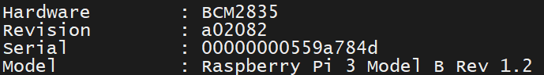
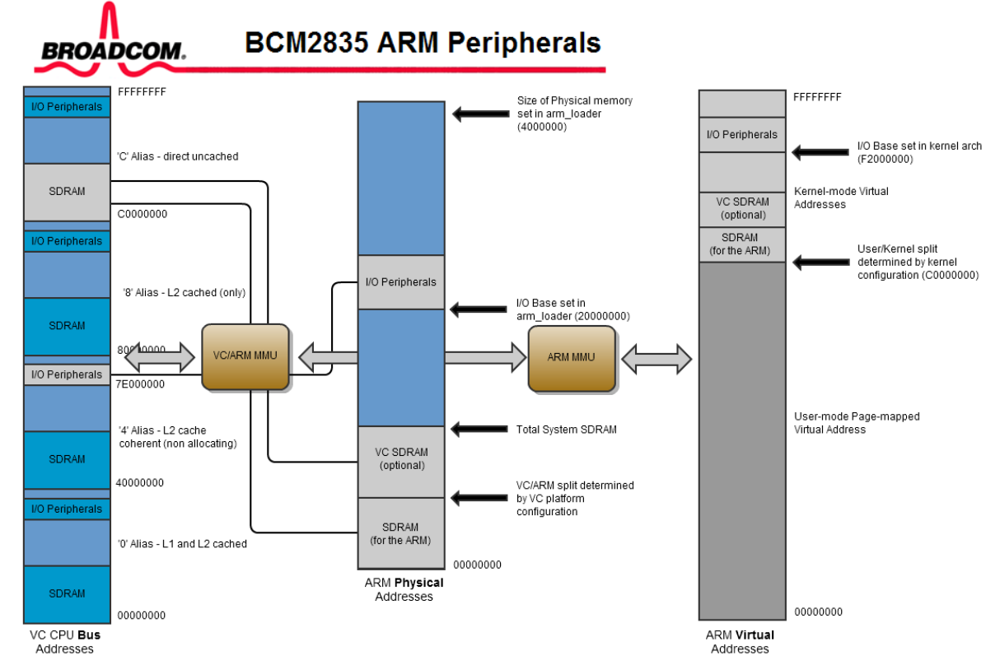
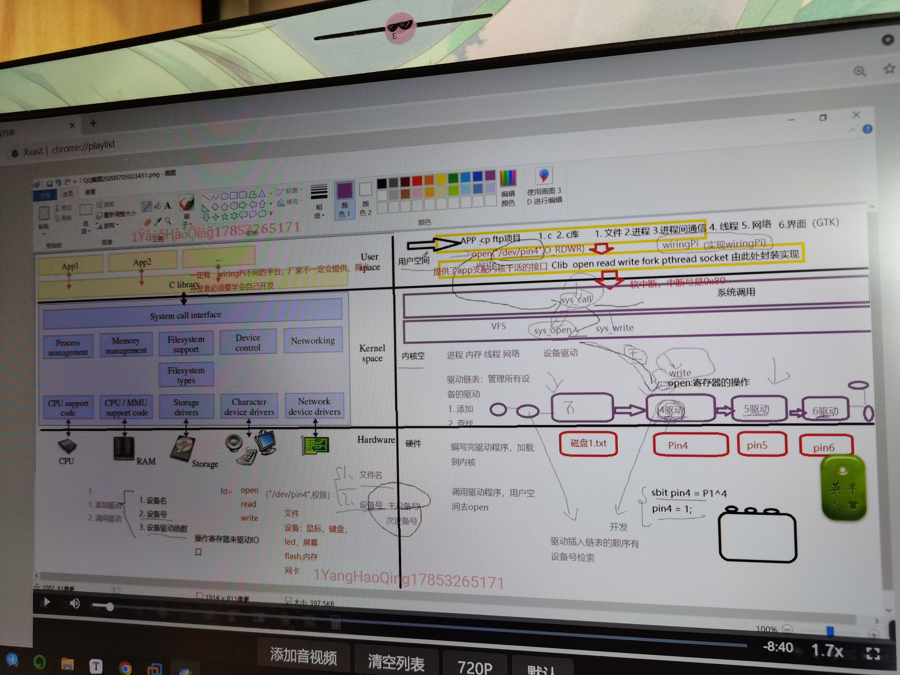
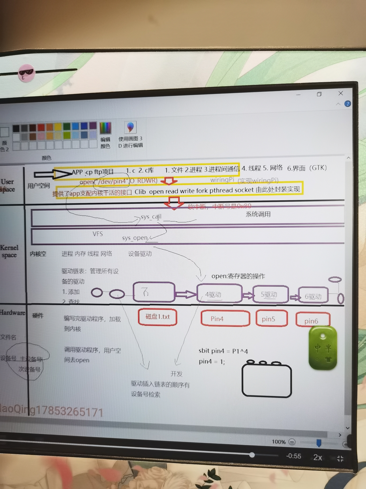
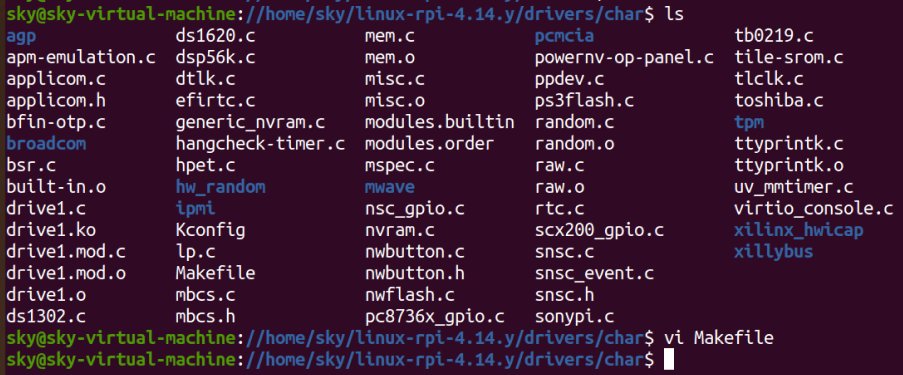
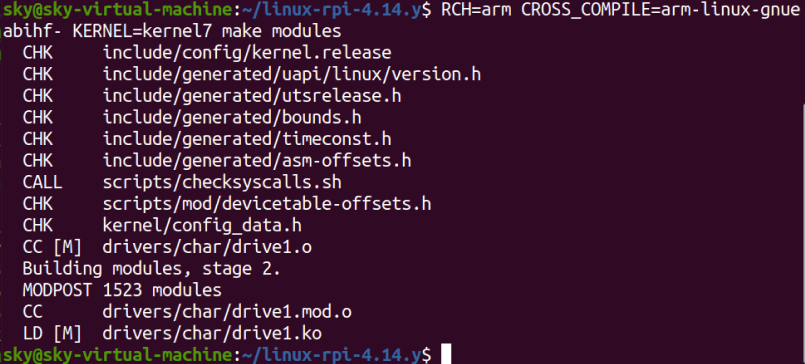
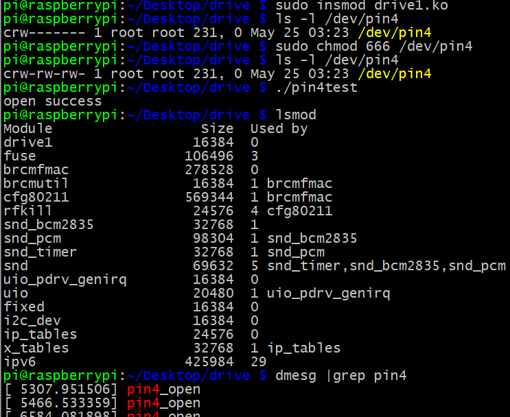

# 树莓派驱动开发 - HQ

[TOC]

------

#### 注意

- 

------

## 驱动开发知识

### 指令

| 指令                  | 功能               |
| --------------------- | ------------------ |
| `lsmod`               | 列出系统的驱动模块 |
| `sudo mknod hq c 8 1` | 手动生成设备指令   |
| `lsmod xxx.ko`        | 加载驱动模块       |
| `rmmod xxx`           | 删除驱动模块       |
|                       |                    |
|                       |                    |
|                       |                    |
|                       |                    |

### 地址

**总线地址**

地址总线属于一种电脑总线，是由CPU或者有DMA能力的单元，用来沟通这些单元想要存取（读取/写入）电脑内存元件/地方的实体位址。

简单来讲就是，CPU能够访问内存的范围。32位系统最大能识别的内存4G

**物理地址**

硬件实际地址或绝对地址。

**虚拟地址**

逻辑地址（基于算法的地址，软件层面的地址）。

### 树莓派CPU

`cat /proc/cpuinfo`

> 

>

### 树莓派芯片手册

查询芯片手册第六章 GPIO 配置，得知下面寄存器配置信息

> 也可通过官网查询各个引脚信息 pinout.xyz/pinout/

```
GPFSEL0 GPIO Function Select 0 
功能选择 输出/输入（GPIO Function Select Registers） 32位
14-12   001 = GPIO Pin4 is an output

GPSET0 GPIO Pin Output Set 0  输出1
0 = No effect
1 = Set GPIO pin n

GPCLR0 GPIO Pin Output Clear 0 清0
0 = No effect
1 = Clear GPIO pin n
```


## 驱动开发介绍

#### 驱动开发方式

1. 直接将驱动编译进内核，即内核（zImage）包含了驱动。
2. 以模块方式生成驱动文件xxx.ko（通过内核的交叉编译工具链进行编译生成），嵌入式系统启动后，通过命令inmosd xxx.ko 加载。
3. 通过修改设备树，将驱动加入内核。

驱动代码的编译需要一个提前编译好的内核，编译内核就必须配置，配置的最终目标会生成 .config文件，该文件指导Makefile去把有用东西组织成内核，厂家配linux内核源码，比如说买了树莓派，树莓派linux内核源码。

#### 驱动开发流程

1. 运行应用程序之前，通过insmod将驱动模块加载到内核（执行pin4_init函数，将pin4驱动结构体加到内核的驱动链表中），然后在/dev下生成pin4。
2. 应用调用open函数，触发异常，进入内核态，调用sys_call系统调用，再调用sys_open，根据文件名找到相关的设备号，根据设备号从驱动链表里面找出驱动，如果找到然后返回fd句柄，与此同时也会执行驱动里面的open函数。

> 

> 

> 


## 交叉编译驱动模块 - 简要

将模块.c文件放到树莓派内核源码中（可以放到其他文件夹，修改对应文件夹中Makefile即可，或者自己写Makefile）

> 

修改Makefile文件，在顶部添加下面内容（obj-m意为将驱动编译成模块） 

> 

执行命令开始交叉编译（make modules只生成驱动模块），生成.ko驱动模块

> 

拷贝到树莓派中，lsmod加载驱动模块（`sudo insmod xxx.ko`）

编写驱动测试应用，交叉编译后拷贝到树莓派中，运行测试

> 可能需要添加权限 `sudo chmod 666 /dev/pin4`
>
> demsg 打印内核的的输出（包括printk函数的输出）

> 


## 交叉编译驱动模块 - 详细

### 测试环境

硬件：树莓派3B/3B+
系统：Raspberry Debian 9 / Debian 10

### 准备工作

首先，按本公众号文章《**【树莓派】Linux内核编译**》方法对要使用的内核进行编译及安装。

### 编写驱动源码

创建驱动源码目录, 并新建源码文件和Makefile文件

```
linux@ubuntu:~$ mkdir  first_driver
linux@ubuntu:~$ cd first_driver/
linux@ubuntu:~/first_driver$ touch firstdriv.c  Makefile
```

下面是一个最简单的hello world驱动模块测试程序：

```c
//vi firstdriv.c 
#include <linux/init.h>
#include <linux/module.h>

MODULE_LICENSE("GPL");

static int __init driv_init(void)
{
        printk(KERN_INFO "hello world!\n");
        return 0;
}

static void __exit driv_exit(void)
{
        printk(KERN_INFO "bye world!\n");
}

module_init(driv_init);
module_exit(driv_exit);
```

### 编写Makefile文件

```makefile
#vi Makefile
#交叉编译工具, 根据实际使用的编译工具指定， 有可能是arm-none-linux-gnueabi-、arm-eabi-gcc，aarch64-linux-gnu-等等
CROSS_COMPILE := arm-linux-gnueabihf-

CC := $(CROSS_COMPILE)gcc
LD := $(CROSS_COMPILE)ld
 #指定要编译的板子内核为arm 32位版本，如果是64位系统，则修改为arm64
ARCH := arm

obj-m := firstdriv.o

#使用的内核路径
LINUXDIR=/home/linux/linux-rpi-4.14.y

PWD=$(shell pwd)  #当前路径

modules:        
        $(MAKE) ARCH=$(ARCH) -C $(LINUXDIR) M=$(PWD) modules 
#       $(MAKE) -C $(LINUXDIR) M=$(PWD) modules
clean:
        rm -rf *.o *.ko *.mod.* *.symvers *.order

.PHONY: modules clean
```

 **Makefile 中一些变量含义：**
（1）CROSS_COMPILE 指定要使用的交叉编译工具，需要根据实际使用的工具链进行修改，如果是在板子上编译，可以不需要该变量。

（2）ARCH 指定了当前的架构， 如果是直接在arm板子上编译，可以不需要该变量。

（3）LINUXDIR变量便是当前内核的源代码目录， 需要根据自己实际存放位置进行修改。

（4）`make -C $(LINUX_KERNEL_PATH) M=$(CURRENT_PATH) modules`

这句话就是编译驱动模块。（**注意:**这句话最前面的空行其实是一个***Tab键\***，不是空格)

### 编译

运行make命令进行编译

```
linux@ubuntu:~/first_driver$ make
make ARCH=arm   -C /home/linux/linux-rpi-4.14.y M=/home/linux/first_driver   modules 
make[1]: Entering directory '/home/linux/linux-rpi-4.14.y'
  CC [M]  /home/linux/first_driver/firstdriv.o
  Building modules, stage 2.
  MODPOST 1 modules
  CC      /home/linux/first_driver/firstdriv.mod.o
  LD [M]  /home/linux/first_driver/firstdriv.ko
make[1]: Leaving directory '/home/linux/linux-rpi-4.14.y'
```

如果没有报错，通过ls命令可以看到目录下生成了ko文件

```
linux@ubuntu:~/first_driver$ ls
firstdriv.c  firstdriv.ko  firstdriv.mod.c  firstdriv.mod.o  firstdriv.o  Makefile  modules.order  Module.symvers
```

如果需要清理，则运行 make clean即可

```
linux@ubuntu:~/first_driver$ make clean
rm -rf *.o *.ko *.mod.* *.symvers *.order
linux@ubuntu:~/first_driver$ ls
firstdriv.c  Makefile
linux@ubuntu:~/first_driver$ 
```

### 测试

#### 1、驱动加载

此时即可将ko文件拷贝树莓派中，然后通过运行 "sudo  insmod firstdriv.ko "命令加载驱动

```
sudo  insmod firstdriv.ko
```

通过dmesg命令，可从内核日志中看到，有"hello world!"字段输出。

#### 2、卸载驱动

通过"sudo rmmod  firstdriv"命令卸载驱动

```
sudo rmmod firstdriv
```

通过"dmesg"命令，可从内核日志中看到，有"bye world!"输出。

(**PS:**以上测试代码及Makfile可在公众号后台回复"**firstdriv**"获取)


## 驱动例程

### 驱动例程 - 简单测试程序

#### driver_test.c

```c
#include <sys/types.h>
#include <sys/stat.h>
#include <fcntl.h>
#include <stdio.h>

int main()
{
    int fd;
    fd = open("/dev/pin4", O_RDWR);
    if (fd < 0) {
        printf("open failed\n");
        perror("reason:");
    } else {
        printf("open success\n");
    }
    fd = write(fd, '1', 1);  
    close(fd);
}
```

#### first_driver.c

```c
#include <linux/init.h>
#include <linux/module.h>

MODULE_LICENSE("GPL");

static int __init driv_init(void)
{
	printk(KERN_INFO "hello world!\n");
	return 0;
}

static void __exit driv_exit(void)
{
	printk(KERN_INFO "bye world!");
}

module_init(driv_init);
module_exit(driv_exit);
```

#### Makefile

```makefile
#vi Makefile
##交叉编译工具, 根据实际使用的编译工具指定， 有可能是arm-none-linux-gnueabi-、arm-eabi-gcc，aarch64-linux-gnu-等等
CROSS_COMPILE := arm-linux-gnueabihf-

CC := $(CROSS_COMPILE)gcc 
LD := $(CROSS_COMPILE)ld  
 #指定要编译的板子内核为arm 32位版本，如果是64位系统，则修改为arm64
ARCH := arm  

obj-m := firstdriv.o  

#使用的内核路径
LINUXDIR=/home/linux/linux-rpi-4.14.y

PWD=$(shell pwd)  #当前路径

modules:	
	$(MAKE) ARCH=$(ARCH) -C $(LINUXDIR) M=$(PWD) modules 
#       $(MAKE) -C $(LINUXDIR) M=$(PWD) modules
clean:
	rm -rf *.o *.ko *.mod.* *.symvers *.order

.PHONY: modules clean
```


### 驱动框架

```c
#include <linux/fs.h>      //file_operations声明
#include <linux/module.h>  //module_init  module_exit声明
#include <linux/init.h>    //__init  __exit 宏定义声明
#include <linux/device.h>  //class  devise声明
#include <linux/uaccess.h> //copy_from_user 的头文件
#include <linux/types.h>   //设备号  dev_t 类型声明
#include <asm/io.h>        //ioremap iounmap的头文件

static struct class *pin4_class;
static struct device *pin4_class_dev;

static dev_t devno;                //设备号
static int major = 231;            //主设备号
static int minor = 0;              //次设备号
static char *module_name = "pin4"; //模块名

/* led_open函数 */
static ssize_t pin4_open(struct inode *inode, struct file *file)
{
    printk("pin4_open\n"); //内核的打印函数和printf类似
    return 0;
}

/* led_read函数 */
static ssize_t pin4_read(struct file *file, char __user *buf, size_t count, loff_t *ppos)
{
    printk("pin4_open\n"); //内核的打印函数和printf类似
    return 0;
}

/* led_write函数 */
static ssize_t pin4_write(struct file *file, const char __user *buf, size_t count, loff_t *ppos)
{
    printk("pin4_write\n");
    return 0;
}

/* 创建驱动对象 */
static struct file_operations pin4_fops = {
    .owner = THIS_MODULE,
    .open = pin4_open,
    .write = pin4_write,
    .read = pin4_read,
};

/* 真实驱动入口 */
int __init pin4_drv_init(void)  
{
    int ret;
    devno = MKDEV(major, minor);                           //2.创建设备号
    ret = register_chrdev(major, module_name, &pin4_fops); //3.注册驱动  告诉内核，把这个驱动加入到内核驱动的链表中

    //4.创建设备文件，让代码在dev下自动生成设备
    pin4_class = class_create(THIS_MODULE, "myfirstdemo"); 
    pin4_class_dev = device_create(pin4_class, NULL, devno, NULL, module_name); 
    return 0;
}

/* 驱动出口 */
void __exit pin4_drv_exit(void)
{
    device_destroy(pin4_class, devno);
    class_destroy(pin4_class);
    unregister_chrdev(major, module_name); //卸载驱动
}

module_init(pin4_drv_init); //1.入口，内核加载该驱动的时候，这个宏会被展开，然后调用pin4_drv_init
module_exit(pin4_drv_exit);
MODULE_LICENSE("GPL v2");
```


### 驱动例程 - 控制I/O

#### driver_test.c

```c
#include <sys/types.h>
#include <sys/stat.h>
#include <fcntl.h>
#include <stdio.h>

int main()
{
    int fd;
    int cmd;
    int data;
    
    fd = open("/dev/pin4", O_RDWR);
    if (fd < 0) {
        printf("open failed\n");
        perror("reason:");
    } else {
        printf("open success\n");
    }
    printf("input command:1/0\n1:set pin4 high\n0:set pin4 low\n");
    scanf("%d", &cmd);
    if (cmd == 1) {   //1,0可以改成变量cmd
        data = 1;
    } else if (cmd == 0) {
 		data = 0;       
    } else {
        perror("input error");
    }
    printf("data = %d\n", data);
    fd = wirte(fd, &data, 1);  
    close(fd);
}
```

#### gpio_control_driver.c

```c
#include <linux/fs.h>      //file_operations声明
#include <linux/module.h>  //module_init  module_exit声明
#include <linux/init.h>    //__init  __exit 宏定义声明
#include <linux/device.h>  //class  devise声明
#include <linux/uaccess.h> //copy_from_user 的头文件
#include <linux/types.h>   //设备号  dev_t 类型声明
#include <asm/io.h>        //ioremap iounmap的头文件

static struct class *pin4_class;
static struct device *pin4_class_dev;

static dev_t devno;                //设备号
static int major = 231;            //主设备号
static int minor = 0;              //次设备号
static char *module_name = "pin4"; //模块名

/* 寄存器 */
volatile unsigned int *GPFSEL0 = NULL;
volatile unsigned int *GPSET0 = NULL;
volatile unsigned int *GPCLR0 = NULL;

/* led_open函数 */
static ssize_t pin4_open(struct inode *inode, struct file *file)
{
    printk("pin4_open\n"); //内核的打印函数和printf类似
    //配置pin4引脚为输出引脚，pin 12-14配置成001
    *GPFSEL0 &= ~(0x6 << 12);  //把bit13-14配置成0
    *GPFSEL0 |= (0x1 << 12);   //把bit12配置成1
    return 0;
}

// /* led_read函数 */
// static ssize_t pin4_read(struct file *file, char __user *buf, size_t count, loff_t *ppos)
// {
//     printk("pin4_open\n"); //内核的打印函数和printf类似
//     return 0;
// }

/* led_write函数 */
static ssize_t pin4_write(struct file *file, const char __user *buf, size_t count, loff_t *ppos)
{
    int user_cmd;
    printk("pin4_write\n");
    // 获取上层write函数的值
    copy_from_user(&user_cmd, buf, count);
    //根据值来操作IO口，高电平或者低电平
    if (user_cmd == 1) {
        printk("set pin4\n");
        *GPSET0 |= 0x1 << 4;  //将GPSET0寄存器的bit4置1
    } else if (user_cmd == 0) {
        printk("clear pin4\n");
        *GPCLR0 |= 0x1 << 4;  //将GPCLR0寄存器的bit4置1
    } else {
        printf("undo\n");
    }
    return 0;
}

/* 创建驱动对象 */
static struct file_operations pin4_fops = {
    .owner = THIS_MODULE,
    .open = pin4_open,
    .write = pin4_write,
    .read = pin4_read,
};

/* 真实驱动入口 */
int __init pin4_drv_init(void)
{
    int ret;
    printk("insmod driver pin4 success\n");
    devno = MKDEV(major, minor);                           // 2.创建设备号
    ret = register_chrdev(major, module_name, &pin4_fops); // 3.注册驱动  告诉内核，把这个驱动加入到内核驱动的链表中

    // 4.创建设备文件，让代码在dev下自动生成设备
    pin4_class = class_create(THIS_MODULE, "myfirstdemo");
    pin4_class_dev = device_create(pin4_class, NULL, devno, NULL, module_name);

    //将寄存器的物理地址转换为虚拟地址，IO口寄存器映射成普通内存单元进行访问
    GPFSEL0 = (volatile unsigned int *) ioremap(0x3f200000, 4);
    GPSET0 = (volatile unsigned int *) ioremap(0x3f20001c, 4);
    GPCLR0 = (volatile unsigned int *) ioremap(0x3f200028, 4);

    return 0;
}

/* 驱动出口 */
void __exit pin4_drv_exit(void)
{
    // 将虚拟地址解绑
    iounmap(GPFSEL0);
    iounmap(GPSET0);
    iounmap(GPCLR0);

    device_destroy(pin4_class, devno);
    class_destroy(pin4_class);
    unregister_chrdev(major, module_name); //卸载驱动
}

module_init(pin4_drv_init); // 1.入口，内核加载该驱动的时候，这个宏会被展开，然后调用pin4_drv_init
module_exit(pin4_drv_exit);
MODULE_LICENSE("GPL v2");
```


### 驱动例程 - LED驱动 - 来自网络

https://blog.csdn.net/yang562887291/article/details/76945391

编写LED驱动前需要移植树莓派内核，以获得内核源码。

**我们在编写驱动程序的时候，IO空间的起始地址是0x3f000000,加上GPIO的偏移量0x2000000,所以GPIO的物理地址应该是从0x3f200000开始的，然后在这个基础上进行Linux系统的MMU内存虚拟化管理，映射到虚拟地址上。**

特别注意，BCM2708 和BCM2709 IO起始地址不同，BCM2708是0x20000000,BCM2709是0x3f000000,这是造成大部分人驱动出现“段错误”的原因。树莓派3B的CPU为BCM2709。

在虚拟机分别编译，将模块、测试程序拷贝至树莓派，插入模块后运行测试程序。

```
sudo insmod xxx.ko

sudo ./led_test 1 打开LED

sudo ./led_test 0 关闭LED
```

#### LED驱动代码

```c
#include <linux/miscdevice.h>    
#include <linux/delay.h>    
#include <asm/irq.h>    
#include <linux/kernel.h>    
#include <linux/module.h>    
#include <linux/init.h>    
#include <linux/mm.h>    
#include <linux/fs.h>    
#include <linux/types.h>    
#include <linux/delay.h>    
#include <linux/moduleparam.h>    
#include <linux/slab.h>    
#include <linux/errno.h>    
#include <linux/ioctl.h>    
#include <linux/cdev.h>    
#include <linux/string.h>    
#include <linux/list.h>    
#include <linux/pci.h>    
#include <asm/uaccess.h>    
#include <asm/atomic.h>    
#include <asm/unistd.h>    
#include <asm/io.h>    
#include <asm/uaccess.h>    
#include <linux/ioport.h>    
      
#define PIN					26 //GPIO26 
  
#define BCM2835_GPSET0                          0x001c  
#define BCM2835_GPFSEL0                         0x0000  
#define BCM2835_GPCLR0                          0x0028  
#define BCM2835_GPIO_FSEL_OUTP      1  
  
#define BCM2835_GPIO_BASE                   0x3f200000  
  
int open_state = 0;         //文件打开状态    
  
    
int bcm2835_gpio_fsel(uint8_t pin, uint8_t mode)    
{    
    //初始化GPIOB功能选择寄存器的物理地址    
    volatile uint32_t * bcm2835_gpio = (volatile uint32_t *)ioremap(BCM2835_GPIO_BASE, 16);    
    volatile uint32_t * bcm2835_gpio_fsel = bcm2835_gpio + BCM2835_GPFSEL0/4 + (pin/10);    
    uint8_t   shift = (pin % 10) * 3;    
    uint32_t  value = mode << shift;    
    *bcm2835_gpio_fsel = *bcm2835_gpio_fsel | value;    
    
    printk("fsel address: 0x%lx : %x\n", (long unsigned int)bcm2835_gpio_fsel, *bcm2835_gpio_fsel);    
    
    return 0;    
}    
    
int bcm2835_gpio_set(uint8_t pin)    
{    
    //GPIO输出功能物理地址    
    volatile uint32_t * bcm2835_gpio = (volatile uint32_t *)ioremap(BCM2835_GPIO_BASE, 16);    
    volatile uint32_t * bcm2835_gpio_set = bcm2835_gpio + BCM2835_GPSET0/4 + pin/32;    
    uint8_t   shift = pin % 32;    
    uint32_t  value = 1 << shift;    
    *bcm2835_gpio_set = *bcm2835_gpio_set | value;    
    
    printk("set address:  0x%lx : %x\n", (long unsigned int)bcm2835_gpio_set, *bcm2835_gpio_set);    
    
    return 0;    
}    
    
int bcm2835_gpio_clr(uint8_t pin)    
{    
   //GPIO清除功能物理地址    
    volatile uint32_t * bcm2835_gpio = (volatile uint32_t *)ioremap(BCM2835_GPIO_BASE, 16);    
    volatile uint32_t * bcm2835_gpio_clr = bcm2835_gpio + BCM2835_GPCLR0/4 + pin/32;    
    uint8_t   shift = pin % 32;    
    uint32_t  value = 1 << shift;    
    *bcm2835_gpio_clr = *bcm2835_gpio_clr | value;    
        
    printk("clr address:  0x%lx : %x\n", (long unsigned int)bcm2835_gpio_clr, *bcm2835_gpio_clr);    
    
    return 0;    
}   
  
static int leds_open(struct inode *inode, struct file *filp)    
{    
    if(open_state == 0)      
    {      
        open_state =  1;      
        printk("Open file suc!\n");      
        return 0;      
    }      
    else      
    {      
        printk("The file has opened!\n");      
        return -1;      
    }      
}    
    
static long leds_ioctl(struct file*filp, unsigned int cmd, unsigned long arg)    
{    
    switch(cmd)      
    {      
        case 0:      
            bcm2835_gpio_clr(PIN);    
            printk("LED OFF!\n");    
            break;      
        case 1:      
            bcm2835_gpio_set(PIN);    
            printk("LED ON!\n");    
            break;      
    
        default:      
            return-EINVAL;      
    }      
    
    return 0;    
}    
    
static int leds_release(struct inode *inode, struct file *filp)    
{    
    if(open_state == 1)      
    {      
        open_state =  0;      
        printk("close file suc!\n");      
        return 0;      
    }      
    else      
    {      
        printk("The file has closed!\n");      
        return -1;      
    }      
}    
    
static const struct file_operations leds_fops = {    
    .owner = THIS_MODULE,    
    .open = leds_open,    
    .unlocked_ioctl = leds_ioctl,    
    .release = leds_release,    
};    
    
static struct miscdevice misc = {    
    .minor =MISC_DYNAMIC_MINOR,    
    .name ="my_leds",    
    .fops =&leds_fops,    
};    
    
    
static int __init leds_init(void)    
{    
    int ret;    
    
    //注册混杂设备    
    ret =misc_register(&misc);    
    
    //配置功能选择寄存器为输出    
    bcm2835_gpio_fsel(PIN, BCM2835_GPIO_FSEL_OUTP);    
    
    //设置输出电平为高电平，LED亮    
    bcm2835_gpio_set(PIN);    
    
    printk("ledsinit.\n");    
    return ret;    
}    
    
static void leds_exit(void)    
{    
    //LED灭    
    bcm2835_gpio_clr(PIN);    
    
    misc_deregister(&misc);            
    
    printk("leds_exit\n");    
}    
    
module_init(leds_init);    
module_exit(leds_exit);    
    
MODULE_AUTHOR("yangwen");    
MODULE_LICENSE("GPL"); 
```

#### 测试代码

```c
#include <stdio.h>  
#include <stdlib.h>  
#include <unistd.h>  
#include <sys/ioctl.h>  
  
int main(int argc, char **argv)  
{  
    int on;  
    int fd;  
    if (argc != 2 || sscanf(argv[1],"%d", &on) != 1 ||on < 0 || on > 1 ) {  
        fprintf(stderr, "Usage:%s 0|1\n",argv[0]);  
        exit(1);  
    }  
    fd = open("/dev/my_leds", 0);  
    if (fd < 0) {  
        perror("open device leds");  
        exit(1);  
    }  
    /*通过ioctl来控制灯的亮、灭*/  
    if(on){  
        printf("turn on leds!\n");  
        ioctl(fd, 1);  
    }  
    else {  
        printf("turn off leds!\n");  
        ioctl(fd, 0);  
    }  
    close(fd);  
    return 0;  
} 
 
```

#### Makefile

```makefile
CROSS= /home/yangwen/Raspberry/tools-master/arm-bcm2708/arm-rpi-4.9.3-linux-gnueabihf/bin/arm-linux-gnueabihf-
all: led_test
 
led_test: led_test.c
	$(CROSS)gcc -o $@ led_test.c -static
 
clean:
	@rm -rf led_test *.o
```


