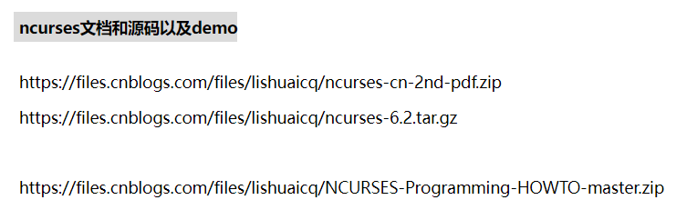

# ncurses库开发 - HQ

[TOC]

------

#### 注意

- ncurses文档 https://max.book118.com/html/2017/0625/117995100.shtm

- 参考学习

  > 

------

## ncurses库使用方法

### ncurses库的安装

#### apt直接安装

**ubuntu版本**

```shell
sudo apt-get install libncurses5-dev
```

**树莓派版本**

在基于Debian的机器上安装ncurses库

```
sudo apt-get install libncurses5-dev libncursesw5-dev 
```

这将同时安装在计算机上的`libncurses5-dev`（为ncurses）和`libncursesw5-dev`（用于ncursesw）

> 如果安装时提示 `unable to locate package ncurses.h` 
>
> 可以先执行 `sudo apt-get update & sudo apt-get upgrade`

#### 安装包安装

1、下载ncurses库源码压缩包

大家可以去这个网址下载：http://ftp.gnu.org/pub/gnu/ncurses/   我选用的是ncurses-6.1版本

2、将ncurses压缩包拷贝到我们的Linux主目录的bin文件夹下

cp -r ncurses-6.1.tar.gz   /bin/

3、进入到主目录的/bin目录下，解压压缩包

（1）cd /bin

（2）tar -zxvf ncurses-6.1.tar.gz

4、进入ncurses-6.1目录

cd ncurses-6.1

5、配置

配置方式：

 ./configure --without-cxx   

 make编译就可以通过

6、make编译

make

7、安装

make install   

你可以进入/usr/lib下查找是否有libncurses.so或libncurses.a这个库，有的话，就是安装成功

### 编译链接ncurses库

```shell
gcc a.c -lcurses
gcc a.c -o a -lcurses -lpthread
```


## ncurses库显示中文乱码的解决办法

Ncurses是程序库，使用最多的组件是窗体，在Linux系统操作中，不少朋友使用Ncurses的时候遇到中文乱码问题，遇到该问题要如何处理呢？下面小编就给大家介绍下Linux使用Ncurses时出现中文乱码的解决方法。

> 

**有几个关键点**

1.gcc编译时用，`gcc -lncursesw --verbose`查看是否支持`-lncursesw`连接;

2.代码文件里面，设置 locale　　

```
#include
#include
int main（int argc， char const *argv［］）
{
    setlocale（LC_ALL， “”）;
    initscr（）;
    noecho（）;
    refresh（）;
    printw（“我来测试中文的/n”）;
    getchar（）;
    return 0;
}
```

3.命令行执行`apt-cache search libncursesw5`，查看是否安装ncurses库

发现我的linux不支持;在`/usr/include/`下发现有ncurses.h

但是，没有别人说的ncursesw目录;

后来发现，我装了libncurses5，也装了libncursesw5，导致-lncursesw选项不能用，我就把libncurses5卸载了，然后再重新装libncursesw5

　　具体命令是

```
　　1. apt-cache search libncurses5
　　2. apt-get purge libncurses5
　　3. sudo apt-get purge libncurses5-dbg
　　4. sudo apt-get purge libncurses5-dev
　　5. sudo apt-get autoremove
　　6. sudo apt-get clean
　　7. dpkg -l |grep ^rc|awk ‘{print $2}’ |xargs dpkg -P
```

　　接着再安装libncursesw5，命令如下

```
　　1. sudo apt-get install libncursesw5
　　2. sudo apt-get install libncursesw5-dbg
　　3. sudo apt-get install libncursesw5-dev
```

　　然后

```
　　gcc -c test.o test.c
　　gcc -o test test.o -lncursesw
```

接着运行 。/test

发现中文可以正常打印了


