## MobaXterm & SecureCRT软件使用 - HQ

[TOC]

------

#### 注意

- 

------

## SecureCRT

> 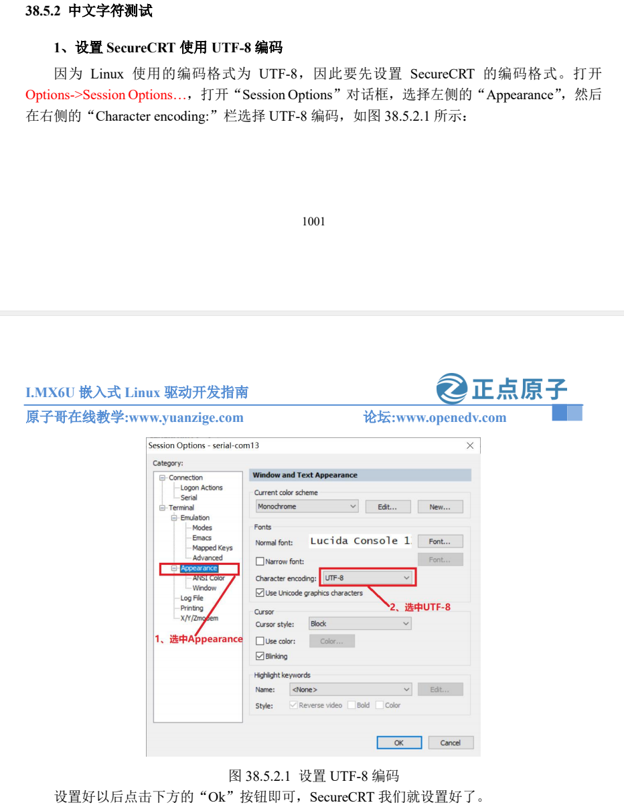


## 个人记录

#### 个人页面

> 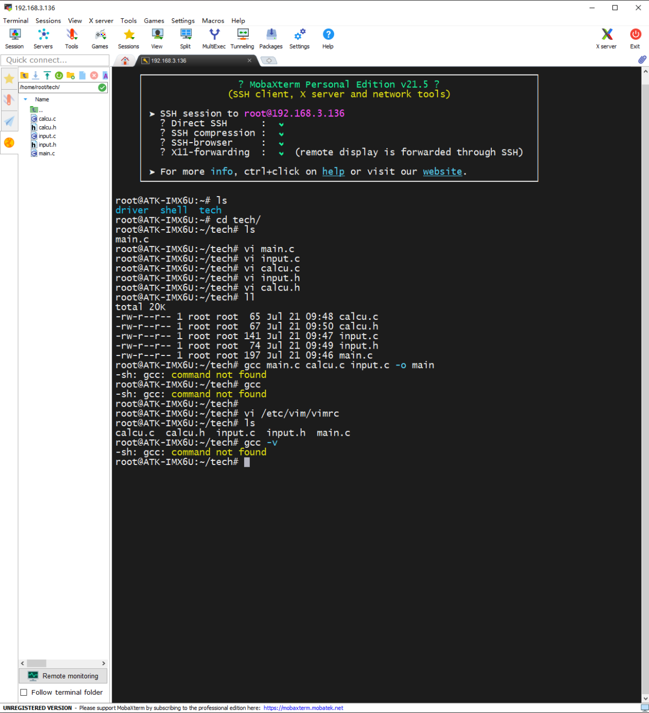


## 博客教程 - 1

由于MobXterm右键的默认功能是复制，但是对于一般用户而言，还是关闭右键的复制功能，使用右键呼出菜单的方式更为方便。

操作方式如下： 

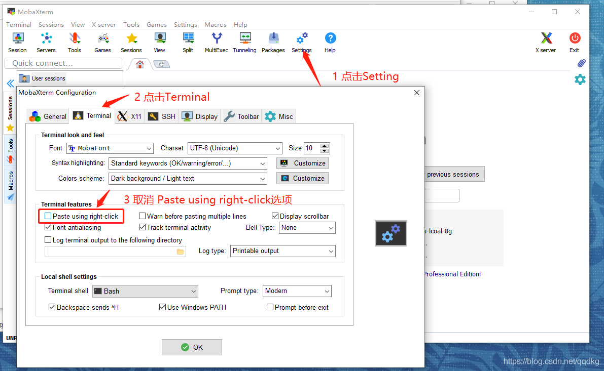

图1 在MobaXterm中关闭右键复制选项

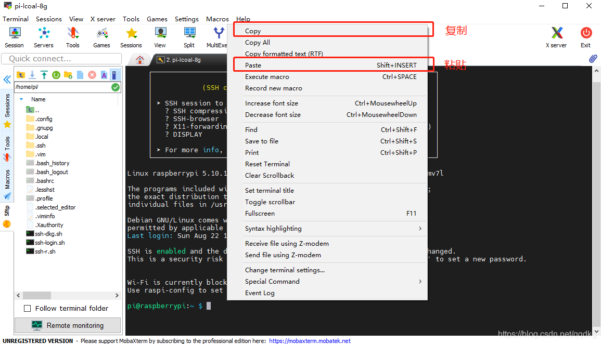

图2 右键菜单

现在我们可以更方便的在本地和终端之间复制文本了。

当然，我们也可以使用键盘在MobaXterm的终端中粘贴文本，可以在Settings-Keboard shortcut选项中看到MobXterm的热键设置。

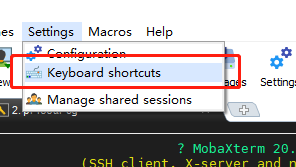

图3 MobaXterm查看热键设置

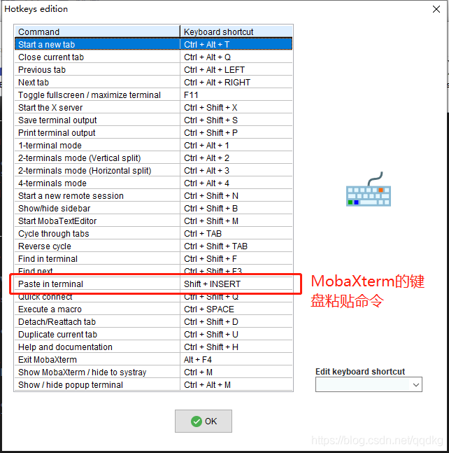

图4 MobaXterm的键盘粘贴命令

为了输入效率，我们可以在MobaXterm中使用“Shift+Insert”组合按键在终端中执行粘贴操作。


## 博客教程 - 2

**下载地址**：http://www.zdfans.com/html/15905.html

#### 一、切换小标签（tab）

Ctrl+Tab键：向右切换
Ctrl+Shift+Tab键：向左切换

#### 二、设置字体大小


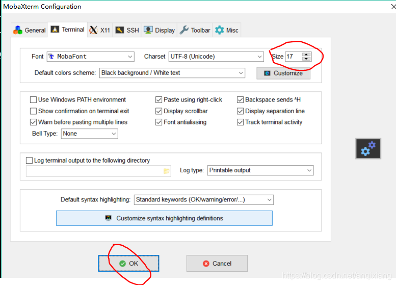

#### 三、通过私钥ssh远程主机

**在画框的地方选择私钥即可**
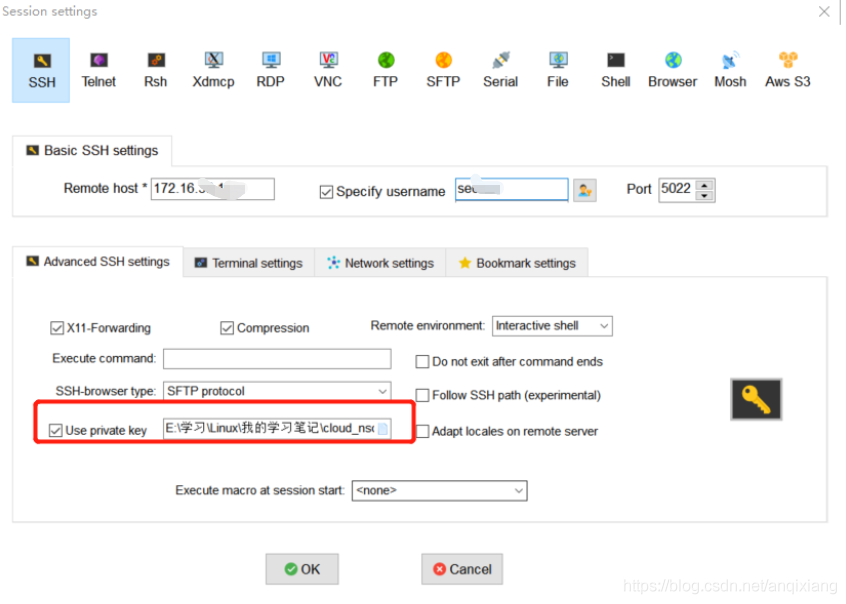

#### 四、从服务器上下载文件到本地电脑

**找到要下载的文件，右击，选择Download**
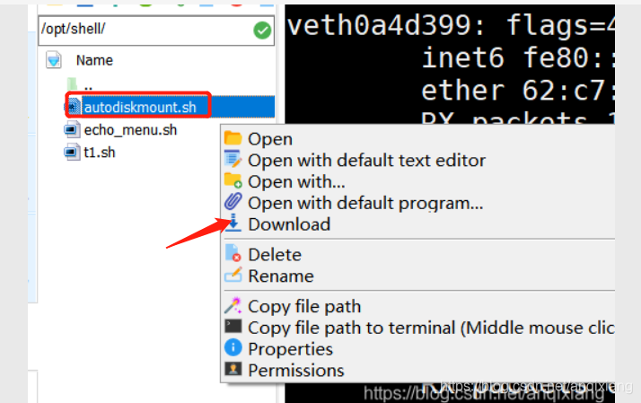

**选择保存的路径,如桌面**
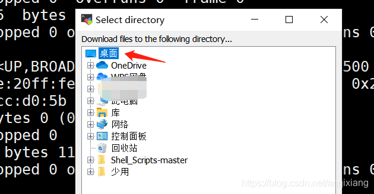

#### 五、快捷键

```
Ctrl+Shift+N	创建一个新的远程会话
F11		当前窗口进入全屏，再按F11退出全屏
12
```

#### 六、会话数量解除

**我的Xterm会话数量到14个时，发现新增的会话没有保存下来，这是由于软件自身的限制，解决方法如下：**

**找到Xterm的目录，打开MobaXterm.ini文件**


**在[Misc]下面添加SettingsSave=0，保存,重启Xterm**
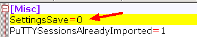

#### 七、多台机器输入相同命令


#### 八、设置保持SSH连接

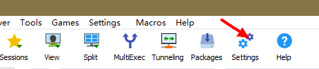
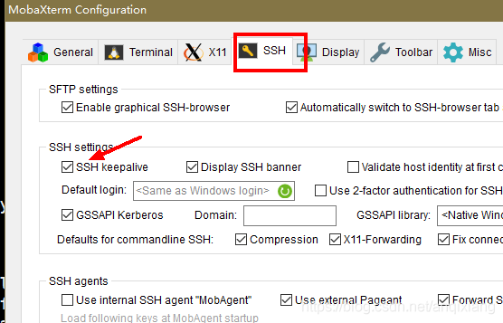

#### 九、用Windows的编辑工具打开远程主机上的文件

**选中编辑的文件，右击，选择Open with…**
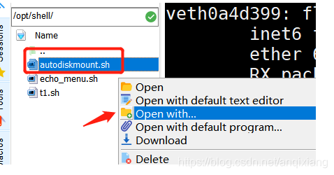
**选择编辑，双击即可**
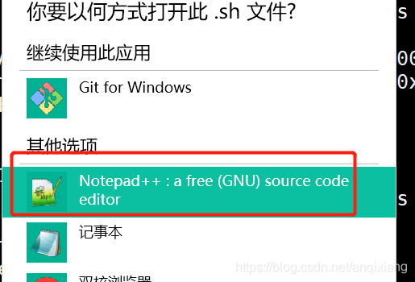

#### 十、终端较多时，创建目录，分类管理

**右击User sessions—>选择New folder创建目录**
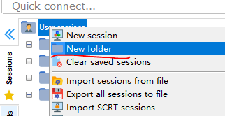
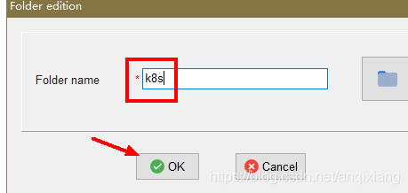

**右击k8s—>选择New session**
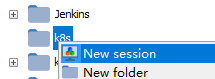
**新建的终端就会位于k8s目录下**
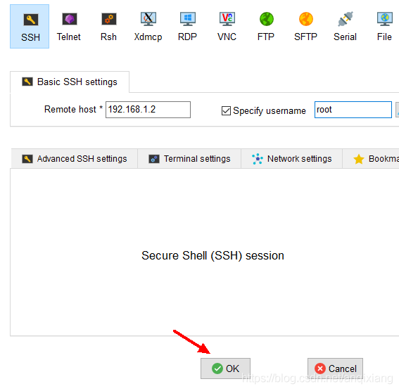
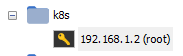
**也可以把已创建的终端直接拖到目录下**


## 博客教程 - 3

**MobaXterm主要功能：**

- 支持各种连接 SSH，X11，RDP，VNC，FTP，MOSH
- 支持 Unix 命令(bash，ls，cat，sed，grep，awk，rsync，…)
- 连接 SSH 终端后支持 SFTP 传输文件
- 各种丰富的插件(git/dig/aria2…)
- 可运行 Windows 或软件

**MobaXterm详细使用教程**

**1. 软件的安装**

官网下载后解压文件，运行 MobaXterm_Personal_11.1.exe 即可开始安装。第一次打开会自解压，会比较慢，后续就正常了。

**2. 创建SSH session**

安装完毕之后界面长这个样。


[](http://www.fobgavin.com/wp-content/uploads/2019/07/FobGavin.com_MobaXterm_1-.jpg)


当然你们刚安装完成是不会有任何session的。下面来创建第一个SSH session。

点击菜单栏 「sessions」 –> 「new session」，即可弹出 「session setting」 对话框。由上面那一大串的连接方式我们就可以知道Moba的强大之处。


[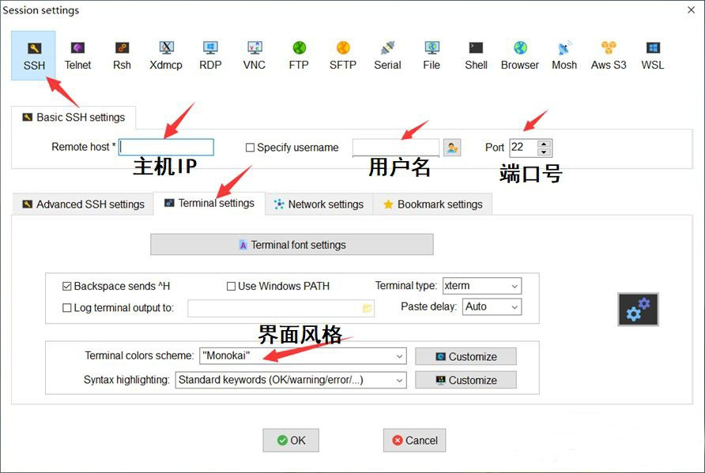](http://www.fobgavin.com/wp-content/uploads/2019/07/FobGavin.com_MobaXterm_2-.jpg)


我们点选第一个SSH图标，并填入相关信息，就可以完成session创建了。

点击确定后，输入密码(输入密码时并不会显示，只管输入后按确定即可，第一次登陆成功后会提示保存密码，一般选择同意)，就可以连接上虚拟机了。而且边上虚拟机之后，它会自动通过FTP也连接到虚拟机，直接拖拽就可以进行文件复制了。

登陆后界面主要分两块，左边的是主机的文件，右边是终端。勾选左下角的 “Follow terminal folder” 可以让两个的工作路径保持一致。


[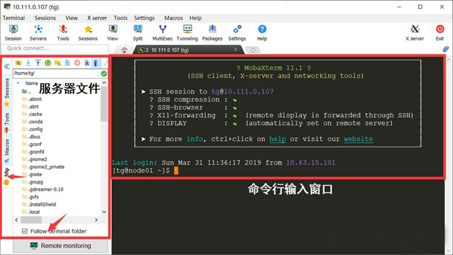](http://www.fobgavin.com/wp-content/uploads/2019/07/FobGavin.com_MobaXterm_3-.jpg)


**3. 快速连接session**

创建一个session之后，就可以在左侧的session标签里留下它的信息，下次需要连接的时候直接双击即可。


[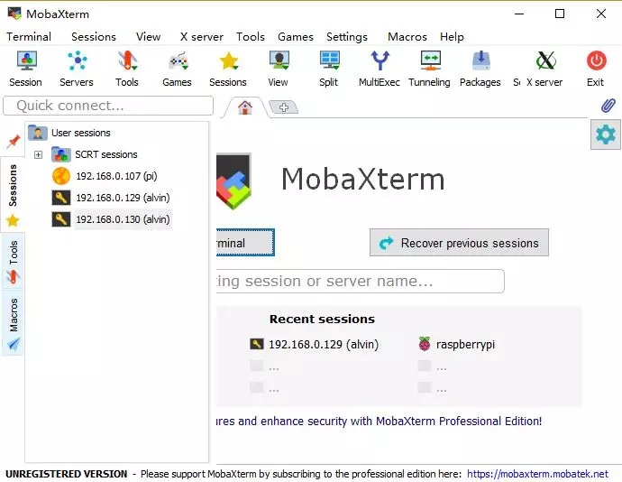](http://www.fobgavin.com/wp-content/uploads/2019/07/FobGavin.com_MobaXterm_3.jpg)


**4. 创建串口session**

下面介绍串口session的创建。

如同第2步，在「session setting」 对话框里选择serial，再选好串口号及波特率，点击OK就完成连接了。

同样session会保存在左侧的session标签页里，方便下次连接。


[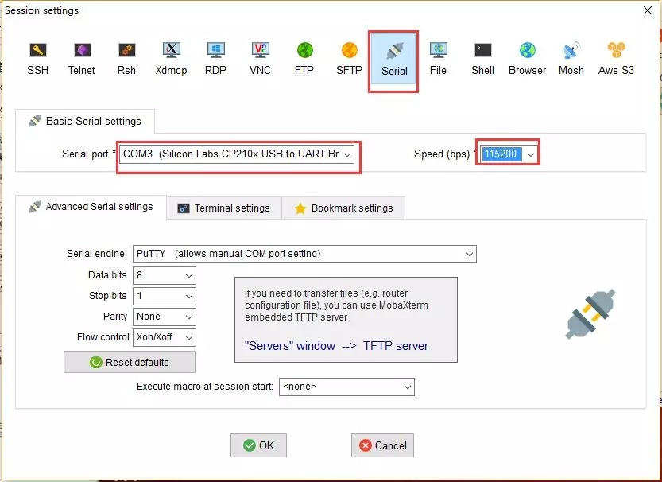](http://www.fobgavin.com/wp-content/uploads/2019/07/FobGavin.com_MobaXterm_4.jpg)


**5. 文件传输和下载**

可以采用直接拖拽的方式，或者采用鼠标右键选择相应功能。


[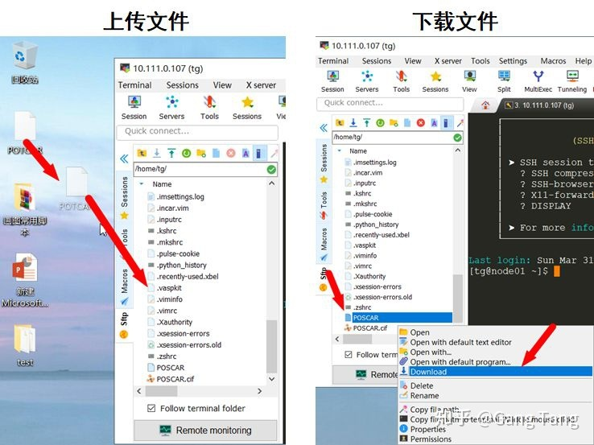](http://www.fobgavin.com/wp-content/uploads/2019/07/FobGavin.com_MobaXterm_4-.jpg)


**6、个性化设置，设置终端字体，右键复制、文件保存路径等**


[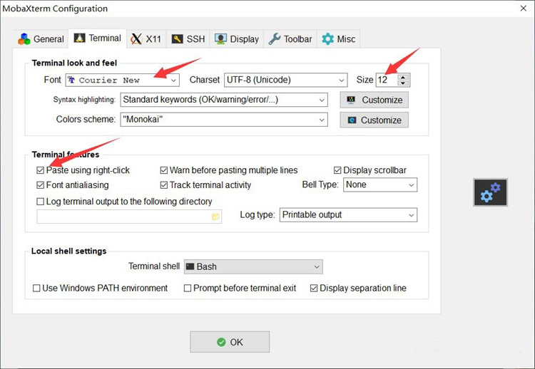](http://www.fobgavin.com/wp-content/uploads/2019/07/FobGavin.com_MobaXterm_5-.jpg)


**7、特色功能，Unix 命令集(GNU/ Cygwin)工具箱功能。**

(1) 直接命令登陆远程服务器，并且使用scp命令传输文件


[](http://www.fobgavin.com/wp-content/uploads/2019/07/FobGavin.com_MobaXterm_7-.jpg)


[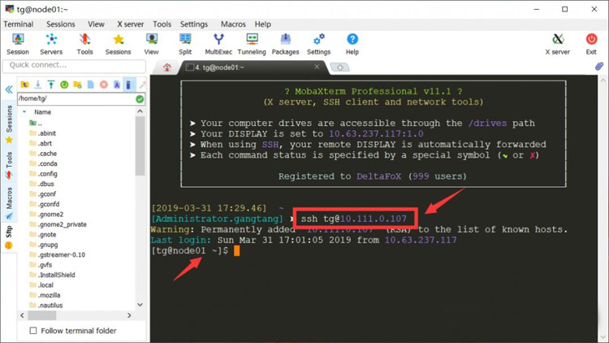](http://www.fobgavin.com/wp-content/uploads/2019/07/FobGavin.com_MobaXterm_7-1.jpg)


[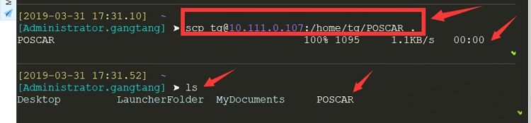](http://www.fobgavin.com/wp-content/uploads/2019/07/FobGavin.com_MobaXterm_7-2.jpg)


(2) 我们可以直接apt-get安装vim等常用功能(或者官网下载插件)，实现在windows下模拟linux环境，这样就可以使用vi命令准备INCAR文件，也可以使用Gnuplot进行绘图。


[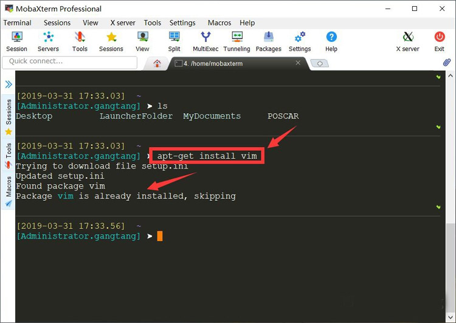](http://www.fobgavin.com/wp-content/uploads/2019/07/FobGavin.com_MobaXterm_8.jpg)


[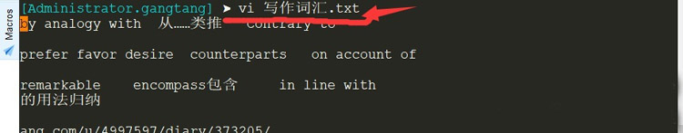](http://www.fobgavin.com/wp-content/uploads/2019/07/FobGavin.com_MobaXterm_8-1.jpg)


[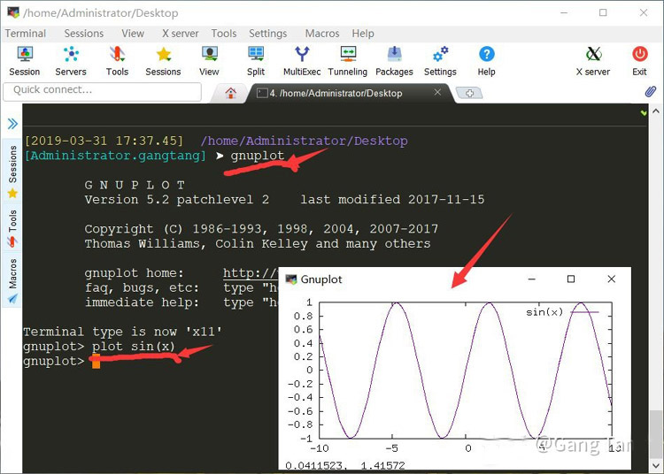](http://www.fobgavin.com/wp-content/uploads/2019/07/FobGavin.com_MobaXterm_8-2-1.jpg)


(3) 通过for循环在windows下实现批量操作，以VESTA为例，首先找到在windows下解压的路径，然后设置环境变量。然后通过for循环可以批量打开POSCAR结构(注意只有关闭VESTA窗口第二个结构才会自动弹出)。


[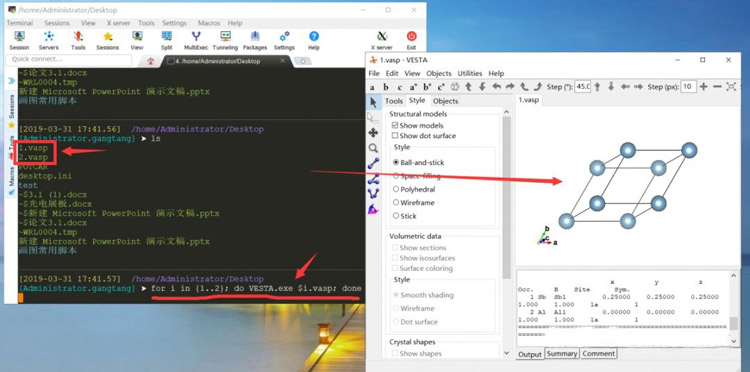](http://www.fobgavin.com/wp-content/uploads/2019/07/FobGavin.com_MobaXterm_9.jpg)


**8.右键粘贴**

在Moba及很多终端工具里，都有这样的功能：鼠标左键划选复制文件，右键粘贴文本。但在Moba中右键粘贴功能默认不打开，我们可以手动打开。

在菜单栏点击 「settings」 –> 「Configuration」，在弹出的对话框中选择 「terminal」，再将 「paste using right-click」 打上对勾即可。


[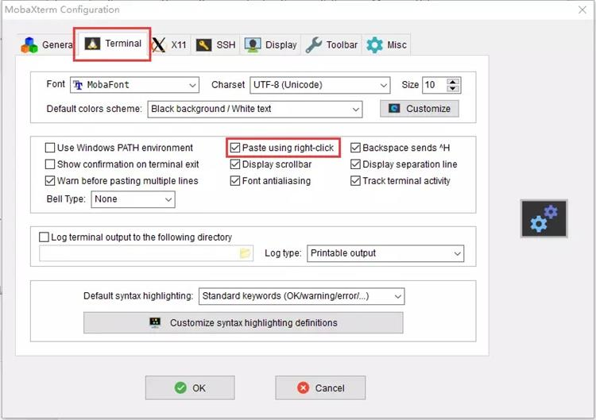](http://www.fobgavin.com/wp-content/uploads/2019/07/FobGavin.com_MobaXterm_10.jpg)


## 博客教程 - 4

文章链接 https://mp.weixin.qq.com/s/aW1G-4siORJ8ylTpFs4bDw

今天介绍的是一款集万千于一身的全能型终端神器—MobaXterm！这款神器的优点：

1. 支持SSH，FTP，串口，VNC，X server等功能；
2. 支持标签，切换也十分方便；
3. 众多快捷键，操作方便；
4. 有丰富的插件可以免费安装；
5. 直接的便携版，不用安装。
6. 内建多标签和多终端分屏 .....


### MobaXterm软件下载

MobaXterm有免费版本和收费版本，对于普通的开发者来说免费版已经够用了，付费版支持很多定制的功能，专业人士才可能用得到。

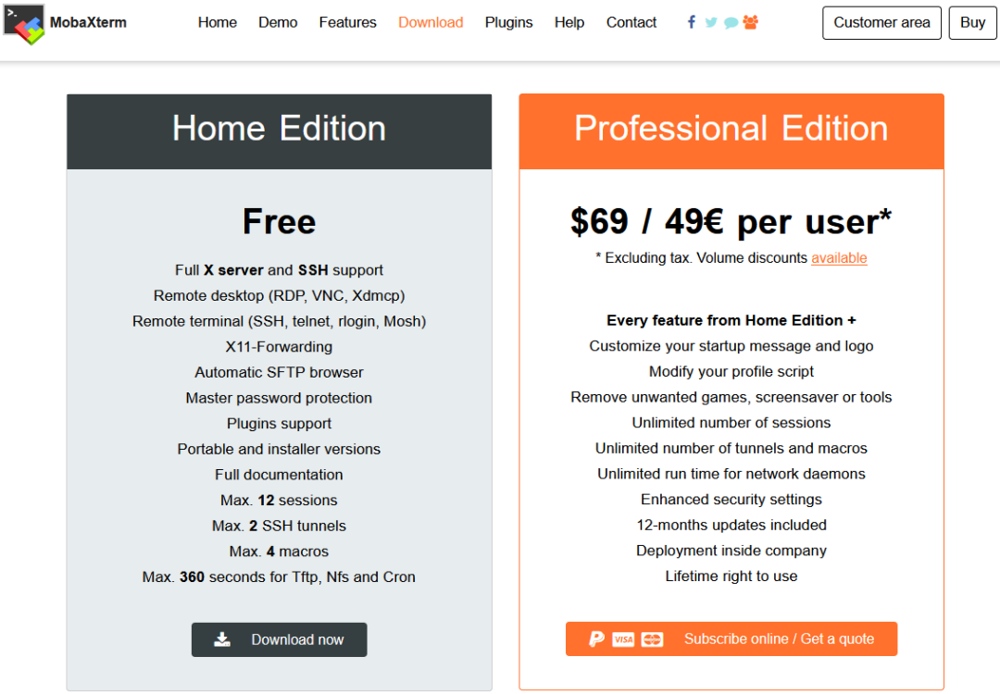选择免费版

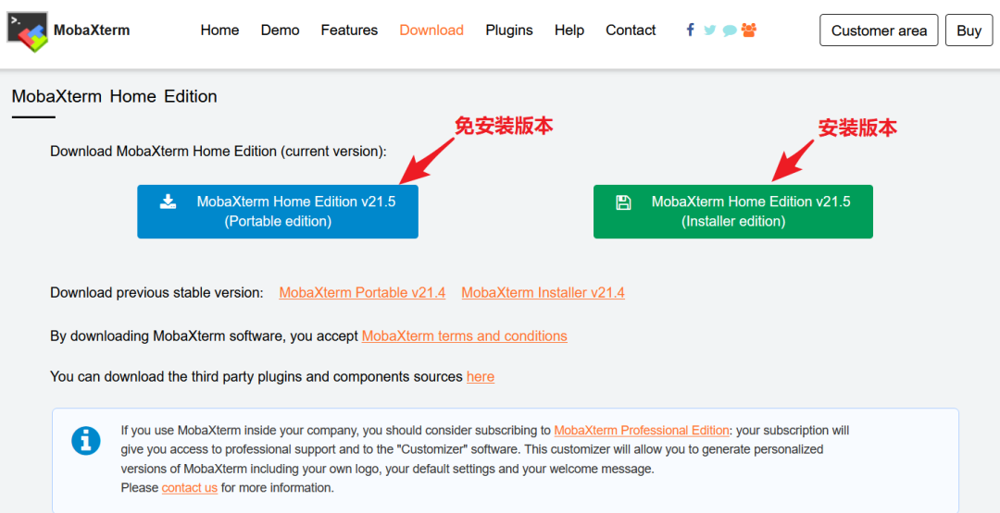选择免安装版本

使用免安装的版本也很多方便，你可以把它拷贝的U盘上面，可以在不同的电脑使用而且设置不会丢失，在家里有公司所有配置都一样。

下载或安装完成之后打开，界面如下:

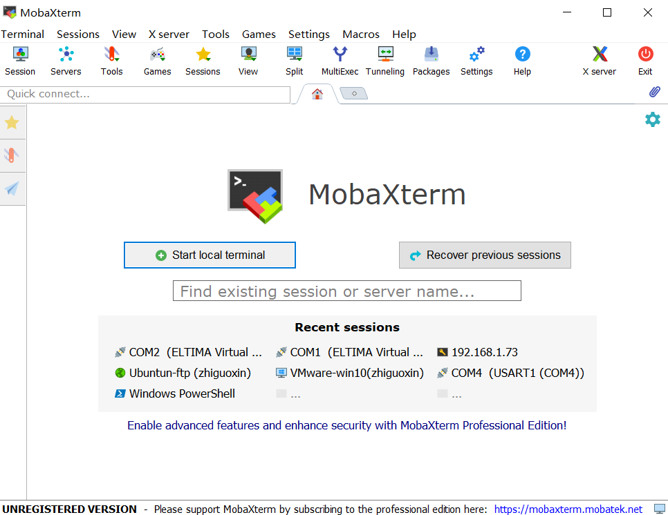

点击`Session`就可以新建不同的会话：

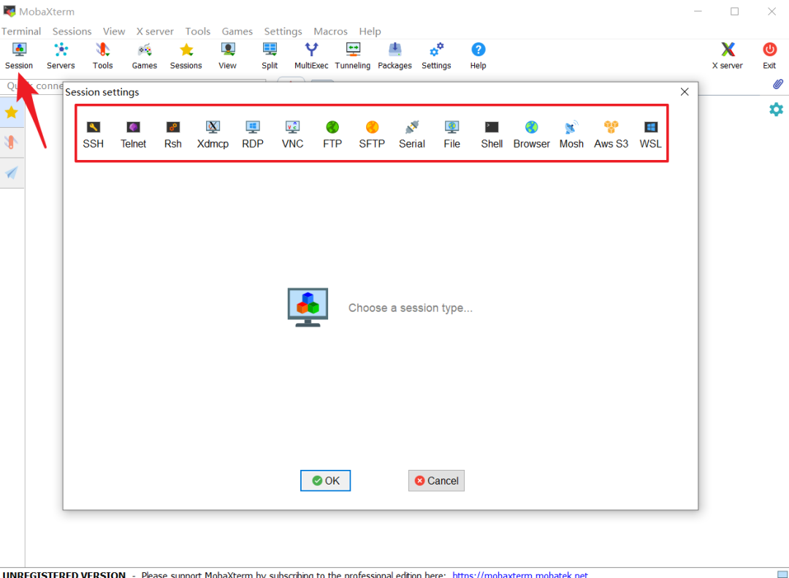

下面简单介绍一下几个常用的协议：

- **SSH**:`Secure Shell`，较可靠、专为远程登录会话和其他网络服务提供安全性的协议。利用 SSH 协议可以有效防止远程管理过程中的信息泄露问题。**最常见的我们可以用它来登录我们的Linux服务器**。
- **RDP**:远程桌面协议(RDP)是一个多通道(multi-channel)的协议，可以连上提供微软终端机服务的计算机。
- **FTP**:文件传输协议(File Transfer Protocol)是用于在网络上进行文件传输的标准协议，**可以在windows和liunx设备上互换文件**。
- **Serial**:串口就不用多说了，可以打印串口设备的调试信息。

### SSH登录Linux主机

点击`Session`，在弹出的对话框中选择`SSH`，后填入远程主机的IP地址，用户名，端口号，然后点击OK即可。

如果的电脑上有Ubuntu虚拟机，那么这里的远程主机的IP地址就是你ubuntu的IP地址，用户名就是ubuntu主机的用户名，端口号默认为`22`。

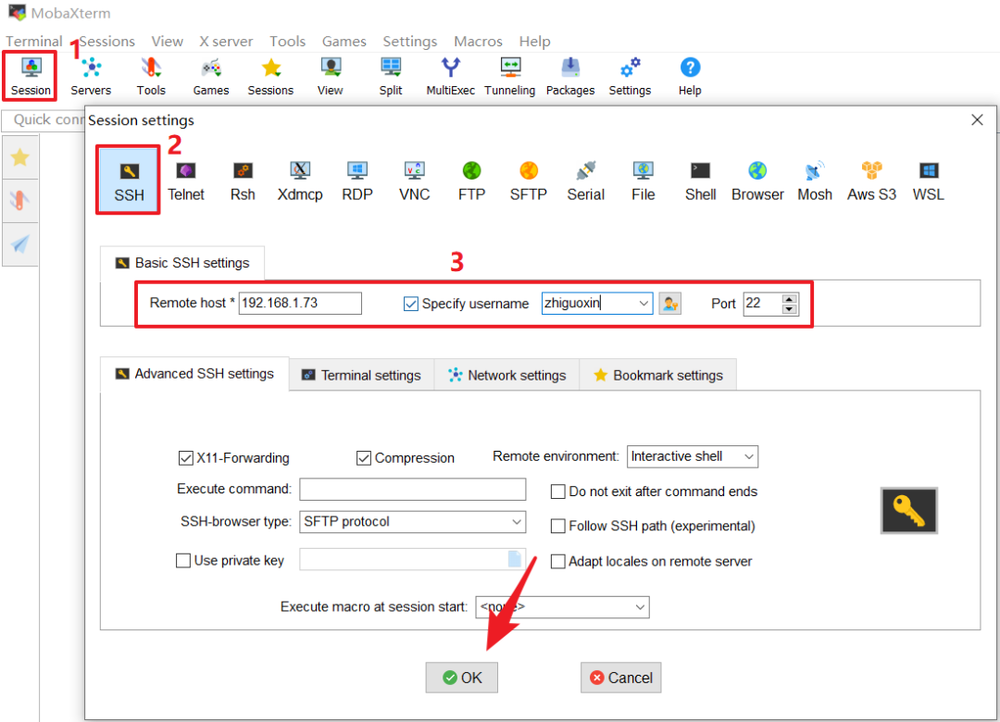

点击确定之后就进入到`ubuntu`主机了

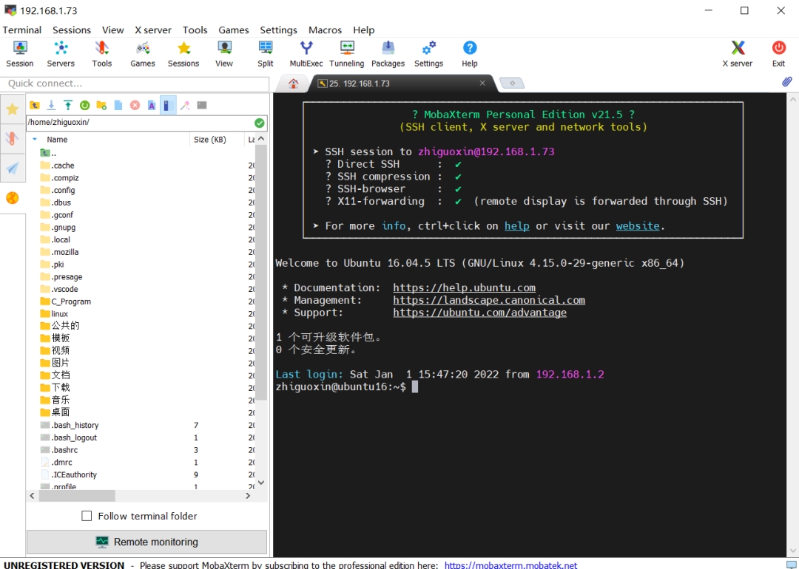

可以看到左边就是ubuntu主机的文件夹，右边就是终端窗口了。在里面输入`linux`命令，都是可以的。

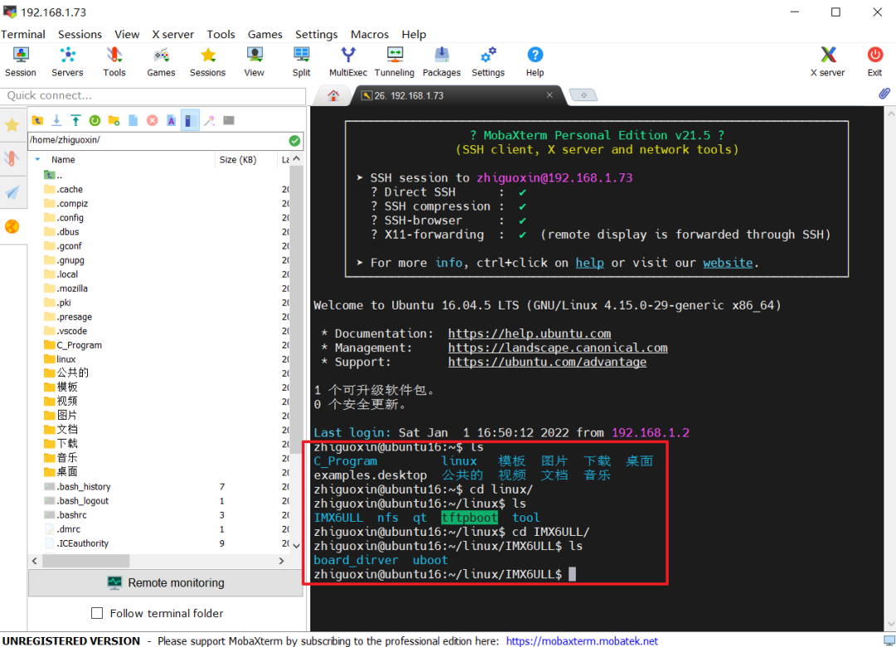

当然上传文件和下载文件也是很方便的，直接拖动或者右键也是支持的。

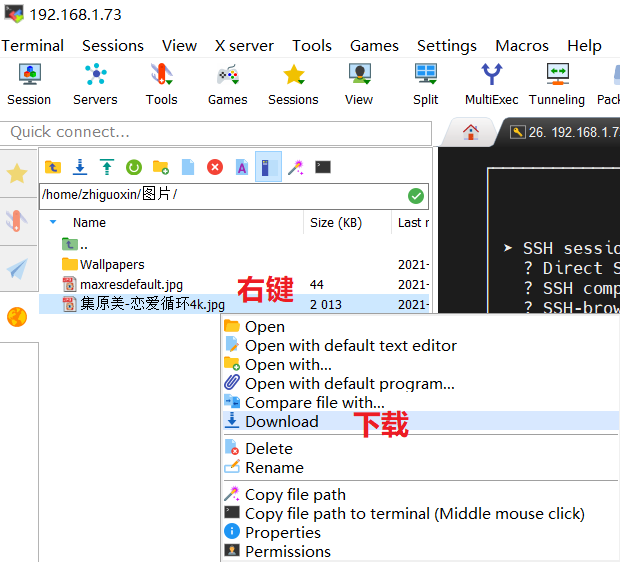

### RDP远程登录windows主机

点击`Session`，在弹出的对话框中选择RDP，后填入远程主机的IP地址，用户名，端口号，然后点击OK即可。

如果的电脑上有windows虚拟机，那么这里的远程主机的IP地址就是你虚拟机下windows的IP地址，用户名就是windows主机的用户名，端口号默认为`3389`。

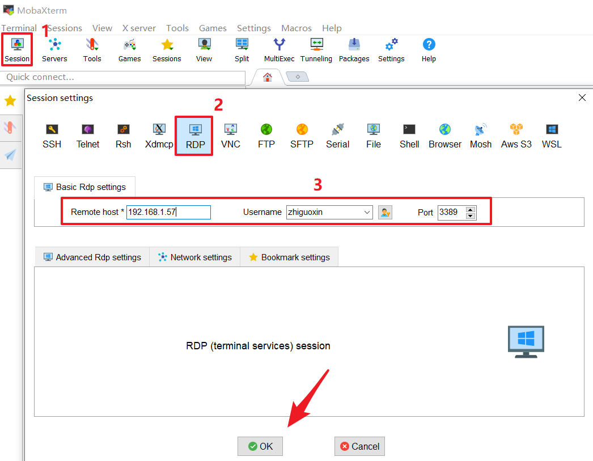

点击确定之后就进入到`windows`虚拟机了。

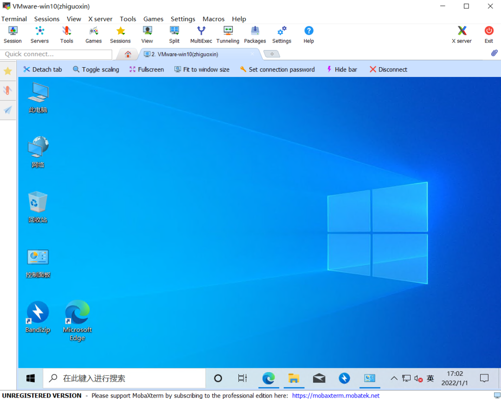

就可以进行各种操作了，是不是很方便。

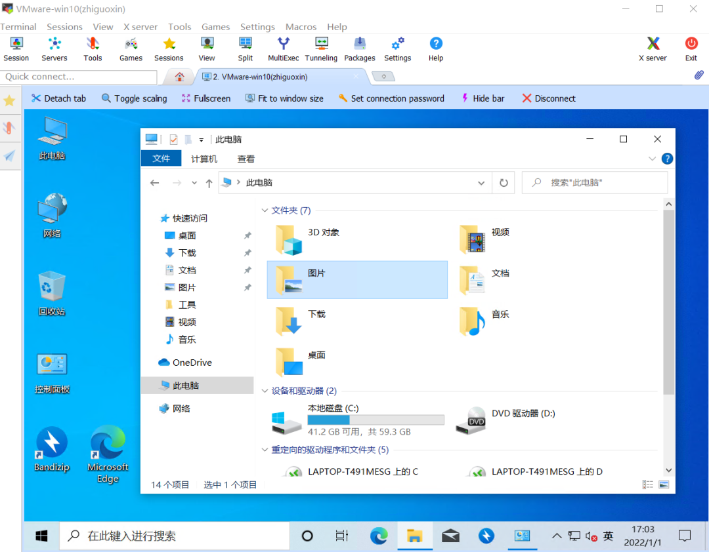

### FTP实现Linux和Windows文件互传

在学习linux时候，会频繁的在Windows和 Ubuntu下进行文件传输，比如在Windwos下进行代码编写，然后将编写好的代码拿到Ubuntu下进行编译。Windows 和Ubuntu下的文件互传需要使用FTP服务，首先要在开启Ubuntu下的FTP服务， 然后在Windows安装FTP客户端，大多数使用的是FileZilla这个免费的FTP 客户端软件，这个软件很好用，但是我们的MobaXterm也是支持这个功能的。

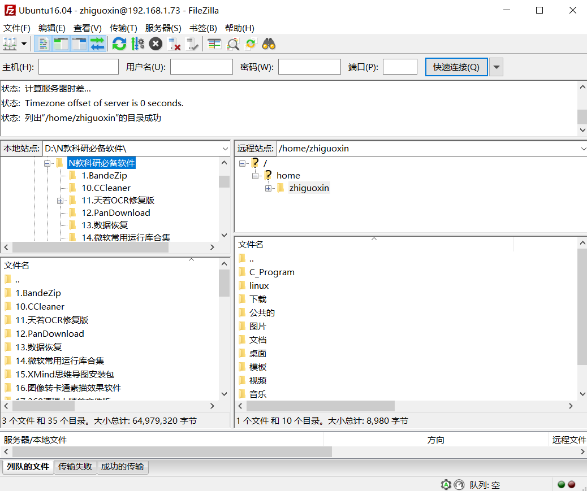这个是FileZilla软件界面

MobaXterm已经将这个FTP集成到这里面了，现在使用MobaXterm新建一个FTP连接。

点击`Session`，在弹出的对话框中选择FTP，后填入ubuntu主机的IP地址，用户名，端口号，然后点击OK即可。这里的远程主机的IP地址就是你虚拟机下ubuntu的IP地址，用户名就是ubuntu主机的用户名，端口号默认为`21`。

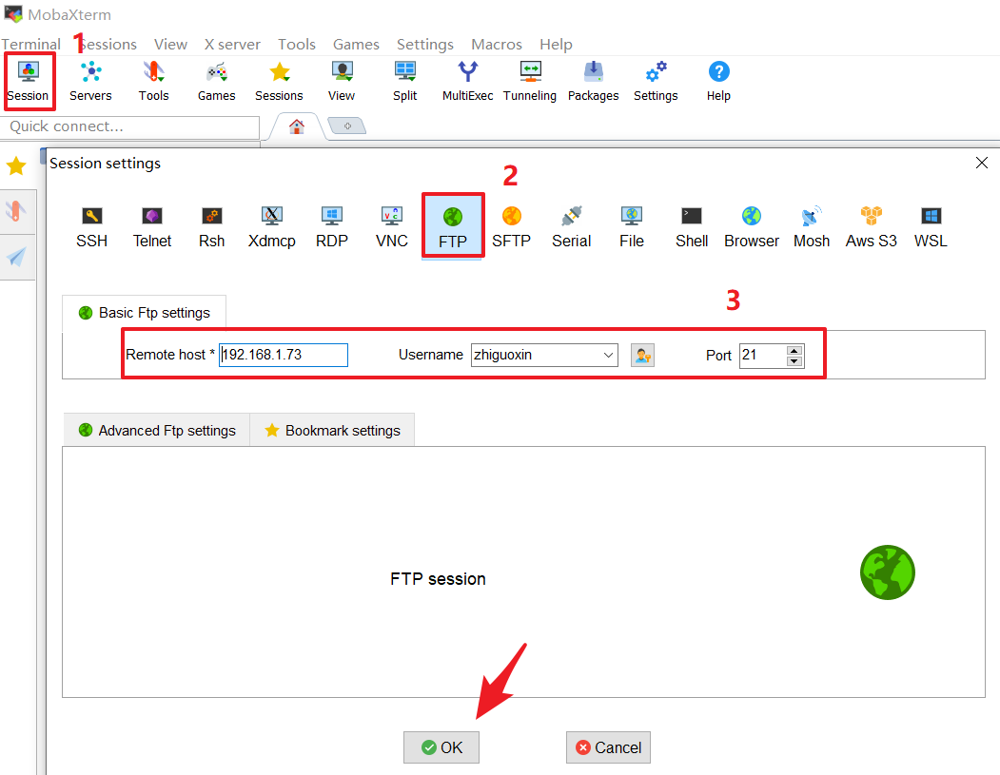

点击确定之后就可以互传文件了。和`FileZilla`操作方式一模一样，速度也很快。

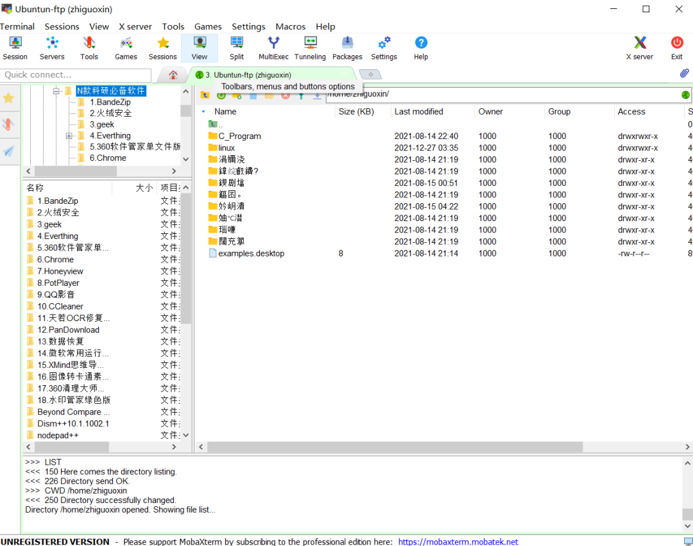

### Serial作为调试终端

使用`MobaXterm`的可以作为串口终端使用，当然你用串口调试助手也可以打印调试信息，但是不能终端使用，也就是不能输入命令。终端软件和串口调试助手不一样，终端软件功能更强大，在学习linux时使用串口调试助手等工具会出现命令不能输入，不能登陆。

点击`Session`，在弹出的对话框中选择`Serial`，打开串口设置窗口以后先选择要设置的串口号，要先用串口线将开发板连接到电脑上，然后设置波特率，MobaXterm软件可以自动识别串口，因此我们直接下拉选择即可，波特率也是同样的设置方式。完了以后还要设置串口的其他功能。点击`Advanced Serial settings`选项卡，设置串口的其他功能，比如串口号、数据位、停止位、奇偶校验和硬件流控等，如果要设置终端相关的功能的话点击`Terminal settings`即可，比如终端字体以及字体大小等。设置完成以后点击下方的`OK`按钮即可。

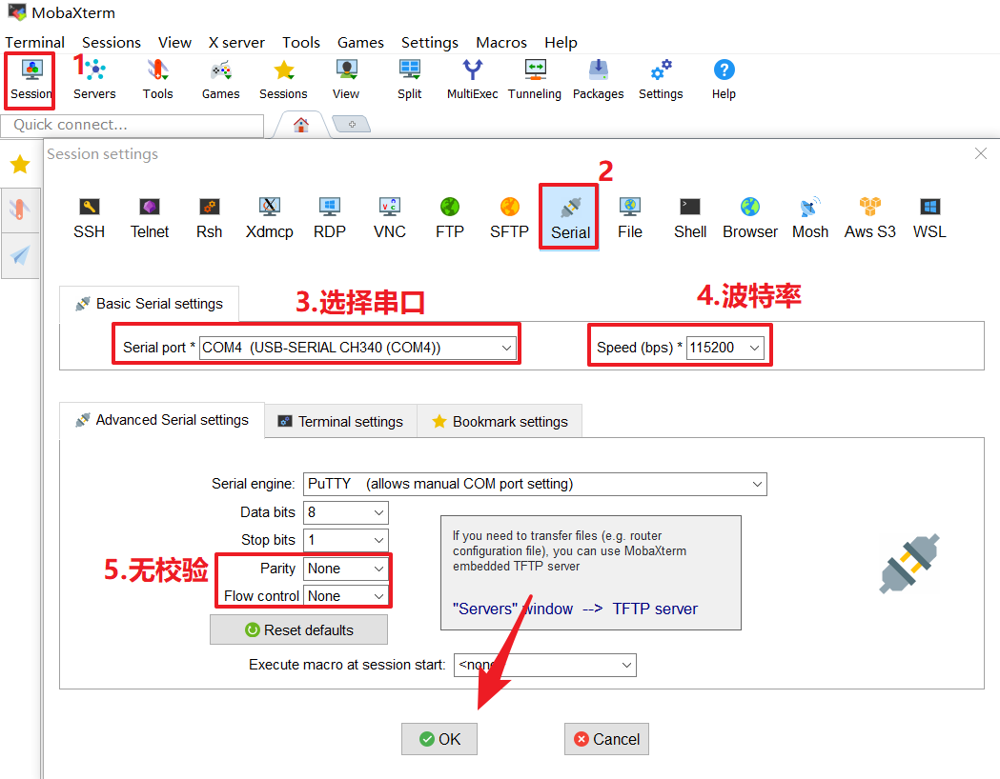

比如我们烧写`U-boot`时候，在倒计时`3`秒钟的时候按下回车键就可以输入`u-boot`对用的命令，打印出对应的信息了。

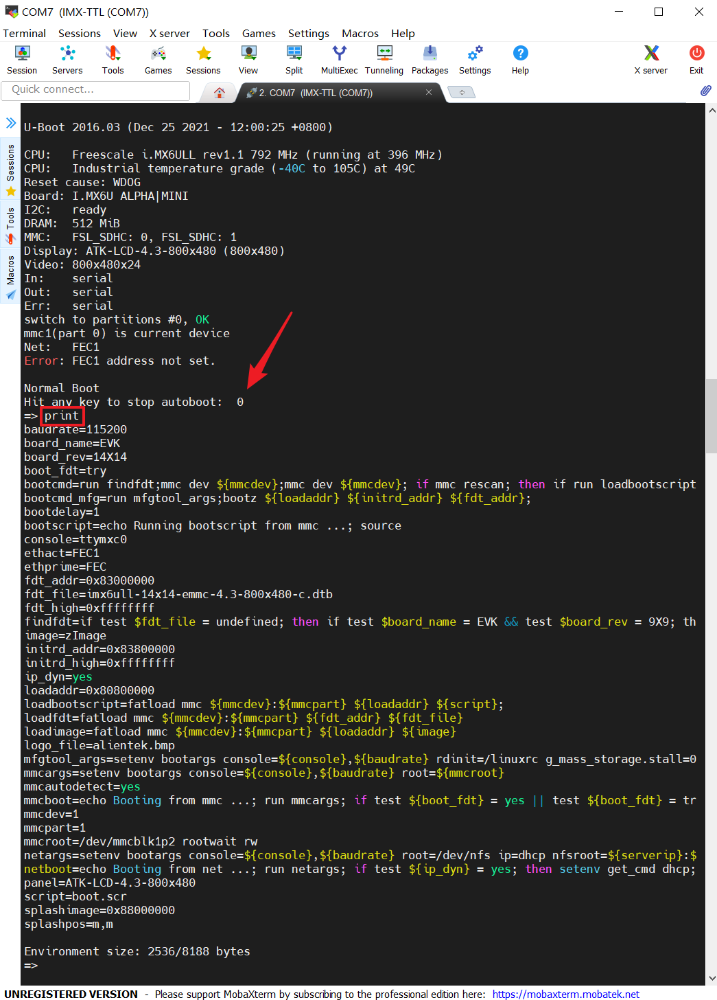

### 5. 几个有用的设置

#### 隐藏菜单栏按钮

菜单栏下的那排按钮感觉有点鸡肋，全部可以从菜单栏里找到，在菜单栏点击`view -> show menu bar`，即可隐藏此排按钮，去掉它可以省下很大空间。

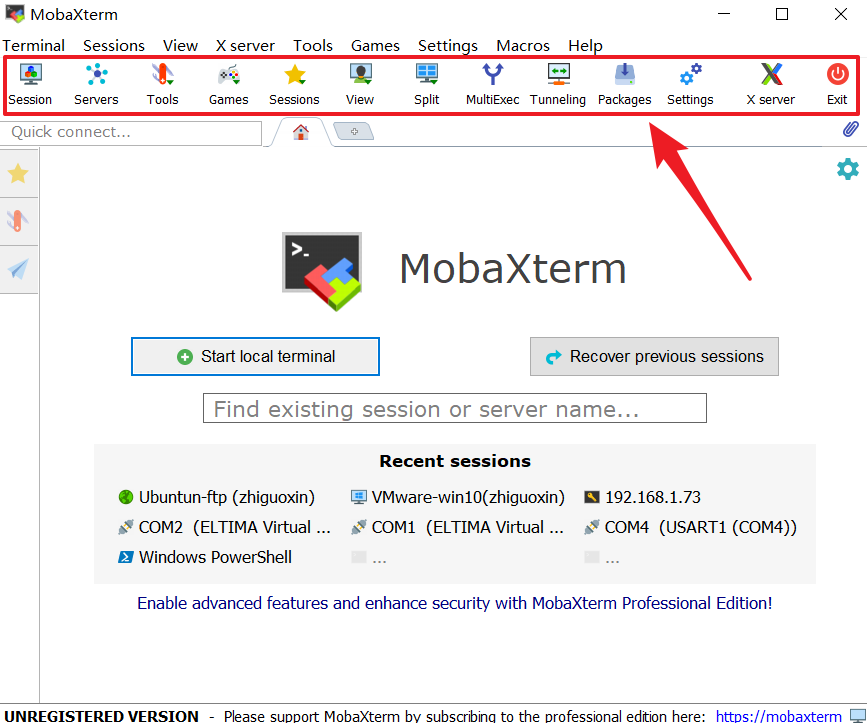

#### 打开右键粘贴

在Mobaxterm中右键粘贴功能默认不打开文本功能。可以手动打开。在菜单栏点击`settings -> Configuration`，在弹出的对话框中选择`terminal`，再将`paste using right-click`打上对勾即可。

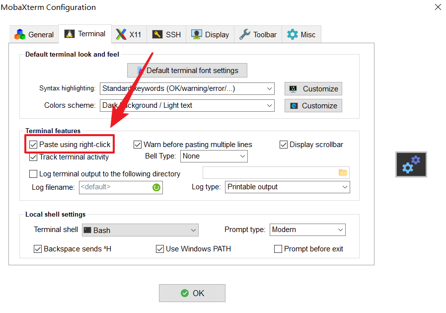

#### 关闭自动弹出SFTP

Moba在连接上远程电脑之后，将自动打开左侧的SFTP侧边栏。有时我们并不需要SFTP，因此可以将自动弹出SFTP功能关闭掉。在菜单栏点击`settings` >`Configuration`，在弹出的对话框中选择`SSH`，再将`automaticall switch to SSH-browser tab after login`前面的对勾去掉即可。


#### MobaXterm中文乱码

MobaXterm默认是UTF-8，若出现乱码可执行以下操作：在对应的终端点击`Teminal settings -> Term charset`即可。

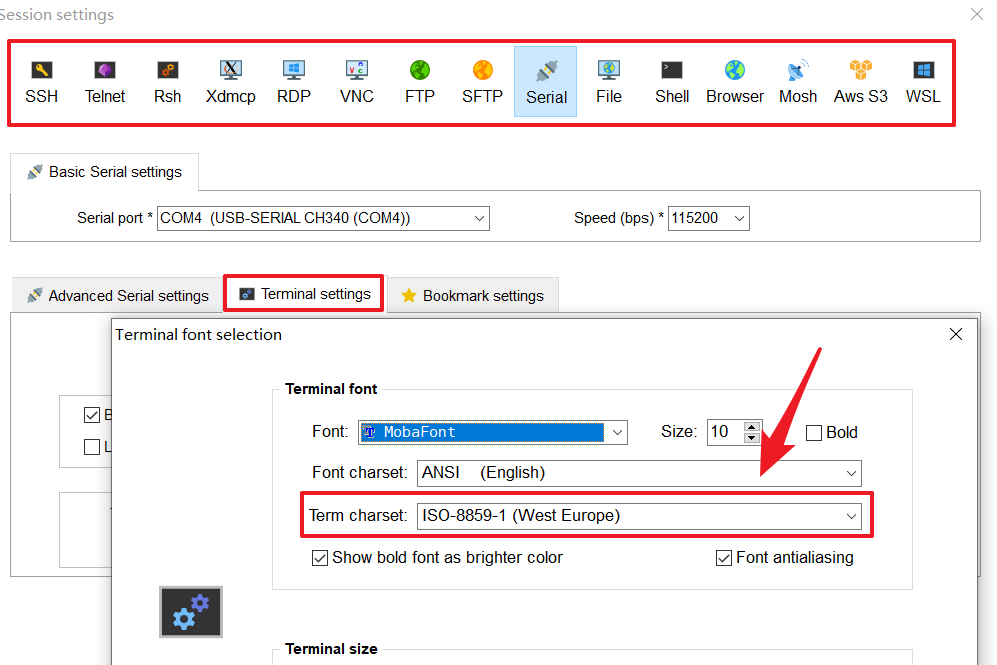

### 小结

本文介绍了四种连接方式：SSH，RDP、FTP，Serial，以及四个有用的设置。当然Mobaxterm的功能远不止这些，但这四种连接方式是最基本，最常用的，需要各位在使用中慢慢摸索啦！


