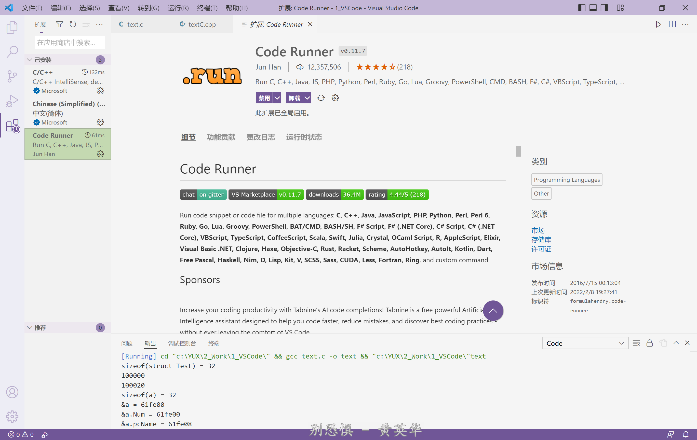
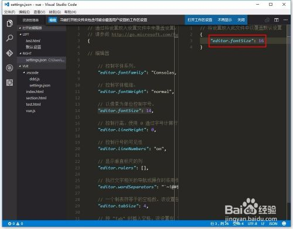

## Visual Studio Code 软件使用

[TOC]

------

#### 注意

- 

------

### 插件

#### 可以一键运行代码插件

> 

#### 代码自动补全 - ubuntu环境

> 

### 搭建多语言环境（超级详细）

教程网址 https://www.bilibili.com/video/BV1YL411L7Sg?p=10&share_medium=android&share_plat=android&share_source=WEIXIN&share_tag=s_i&timestamp=1649999012&unique_k=bm1jPwz

### 快捷键

- ctrl + p 进行搜索，跳转编辑文件
- ctrl + f 搜索单词
- alt + 上 把当前行上移一行
- shift + alt + 上 把当前行向上复制一行
- shift + ctrl + enter 向上插入一空行
- ctrl + / 添加注释alt + 鼠标点击 选中多行
- ctrl + l 选中当前行shift + 上下左右 选取文字
- ctrl + space 显示代码提示
- shift + alt + f 格式化代码
- f12 跳转到函数定义
- alt + f12 跳转到定义

### 修改字体

1. 于是自己研究了下，发现了真理~。点击菜单栏“文件”——“首选项”，再点击“用户设置”；

   

2. 在出现的默认设置页面中，点开“编辑器”一栏；

   

3. 找到editor.fontSize的参数。可以看到这个就是控制页面文字大小的设置了。

   

4. 于是在右边的用户设置窗口中，输入editor.fontSize：16，（大小自己定哈）然后保存文件；

   

