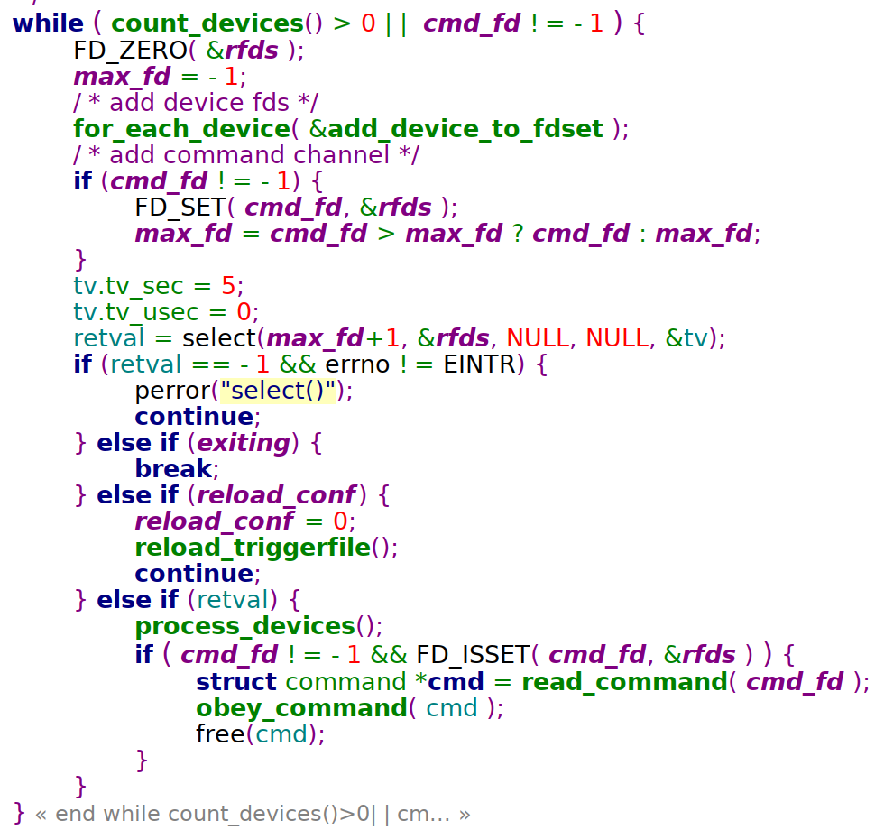
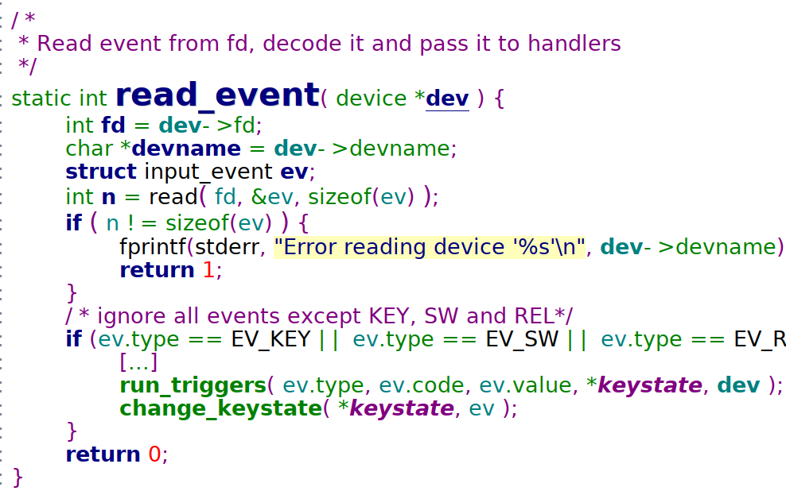
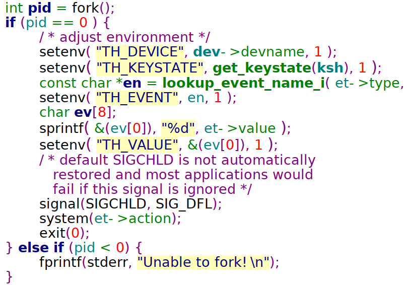

## 小型 C 语言开源项目：Triggerhappy

[TOC]

------

#### 注意

- https://mp.weixin.qq.com/s/uUDivmQrfk-tluYH54iZTA

------

哈喽，老吴这几天在知乎上看到了一个好问题：

**有哪些值得推荐的小型 C 语言开源项目？**

题主很可能是想要一个这样的开源项目：功能小巧、代码质量高，可读性好，以便自己循序渐进地学习 C 语言。

作为一个嵌入式开发人员，这样的开源项目还是接触得挺多的。


**今天就给大家推荐一个：Triggerhappy。**

老吴以前也写过一些关于 Triggerhappy 的文章，和以往不同，今天会以更全局地眼光去拆解这个项目。

**开始 Enjoy 吧！

**

## Triggerhappy 是什么？

简单地说，Triggerhappy 是一个监测输入事件的守护进程。

它会根据配置文件的内容，监测 /dev/input/event* 设备，然后执行用户预先配置的命令。

例如你的板子上有一个红外接收器，你可以很轻松地使用 Triggerhappy 来实现响应红外遥控器的按键事件。

Triggerhappy 非常的小巧，大约只有 80K，非常适合嵌入式场景。


**学习 Triggerhappy 能学到什么？**

1、模块化

2、数据结构

3、文本解析

4、单例程序的实现

5、信号的用法

6、IO 多路复用

7、输入设备的访问

8、进程的创建

9、本地 socket 的用法


**Triggerhappy 的代码特点**：

Triggerhappy 的整体代码风格和 Linux 设备驱动的代码风格很像，会用一个结构体来描述对象，然后用一个链表将多个对象管理起来。

功能划分很清晰，大约有 7、8个功能模块，每一个模块的实现都非常的干净利索，代码不超过 300 行，而且风格统一。

综合来看，符合 UNIX 的设计哲学：简单实用，且内容丰富，是一个非常适合练习 Linux 应用编程的开源项目。


## Triggerhappy 怎么用？

Triggerhappy 的用法很简单。

```
$ thd --dump /dev/input/event2
EV_KEY KEY_A 1 /dev/input/event2
EV_KEY KEY_A 0 /dev/input/event2
EV_KEY KEY_B 1 /dev/input/event2
EV_KEY KEY_B 0 /dev/input/event2
```

上面的命令会从 /dev/input/event2 中读取输入事件，并打印出来。


**另外，还可以通过配置文件设置事件处理器：**

```
$ cat /etc/triggerhappy.d/triggerhappy.conf
# <event name> <event value> <command line>
KEY_VOLUMEUP 1  /usr/bin/amixer set Master 5%+
KEY_VOLUMEUP 2  /usr/bin/amixer set Master 5%+
KEY_VOLUMEDOWN 1  /usr/bin/amixer set Master 5%-
KEY_VOLUMEDOWN 2  /usr/bin/amixer set Master 5%-
```

1 表示 pressing，2 表示 holding。

```
$ thd --triggers /etc/triggerhappy.d/triggerhappy.conf /dev/input/event*
```

这样运行后，我们就可以通过 KEY_VOLUMEUP、KEY_VOLUMEDOWN 控制音量了。


**最后，Triggerhappy 还支持通过 socket 通讯进行命令行控制：**

```
$ thd --socket /var/run/triggerhappy.socket --triggers /etc/triggerhappy.d/ /dev/input/event*

# 动态添加或移除设备
$ th-cmd --socket /var/run/triggerhappy.socket --add /dev/input/event0
th-cmd --socket /var/run/triggerhappy.socket --remove /dev/input/event3
```

这是一种很实用的设计，工作里，很多时候我发现自己都需要在不重新启动程序的情况动态地通知程序做某些事情。


## Triggerhappy 怎么实现？

Triggerhappy 大致做了下面这些事情。


**1、解析配置文件。**

根据配置文件创建相应的 trigger，一个 1 trigger 代表一条事件触发规则，trigger 都挂在链表 trigger_list 上：

```
typedef struct trigger {
 int type;   // 类型
 int code;   // 键码
 int value;  // 键值
    [...]
 char *action; // 事件发生时应执行的命令
 struct trigger *next;
} trigger;
```

解析过程大致是使用 getline() 读取一行数据，然后用 strdup() 复制出来，最后再用 strtok_r 切割出按键、键值、执行命令。


**2、创建 socket 通讯、信号处理等辅助设施。**

这些都是非核心功能，只是让 Triggerhappy 变得更易用。

```
int bind_cmdsocket(char *name);
struct command *read_command(int cmd_fd);
int send_command(int cmd_fd, enum command_type type, char *param, int passfd, int exclusive, char *tag);
int connect_cmdsocket(char *name);
```

Triggherhappy 包含 2 个可执行程序：后台服务程序 thd，命令行工具 thd-cmd。

thd 会调用 bind_cmdsocket() 创建一个 local socket，thd-cmd 通过 connect_cmdsocket() 连接它。接着 thd-cmd 可以通过 send_command() 发送命令，thd 则通过 read_command() 接收命令。


**3、根据命令行参数创建 devices。**

1 个 device 代表 1 个输入设备，所有的 device 都会挂在链表 device_list 上。

```
typedef struct device {
 int fd;
 char *devname;
 struct device *next;
} device;
void add_device(char *dev, int fd, int excl, char *tag);
int remove_device(char *dev);
void clear_devices(void);
```

add_device() 会构造一个 device，并且 open() 设备以得到文件描述符 fd。


**4、不断循环从所有 devices 中读取数据。**



这个步骤是 Triggerhappy 的核心功能，是一个基于 select() 的eventloop。

这个 eventloop 很简单，就是用 select() 检测所有 devices，当有数据可读时，对所有 devices 都调用 read_event() 读取数据：



点击查看大图

读到数据后，会根据键值找到相应的 trigger，并执行 trigger 对应的命令，实现方法就是 fork() + system()：



点击查看大图

到此，Triggerhappy 的核心流程就分析完毕了。


## 总结

Triggerhappy 功能划分很清晰，大约有 7、8个功能模块，每一个模块的实现都非常的干净利索，代码都不超过 300 行，且风格和 Linux 设备驱动类似。

综合来看，Triggerhappy 符合 UNIX 的设计哲学。它简单实用，内容丰富，代码清晰，是一个非常嵌入式开发人员练习 Linux 应用编程的开源项目。


