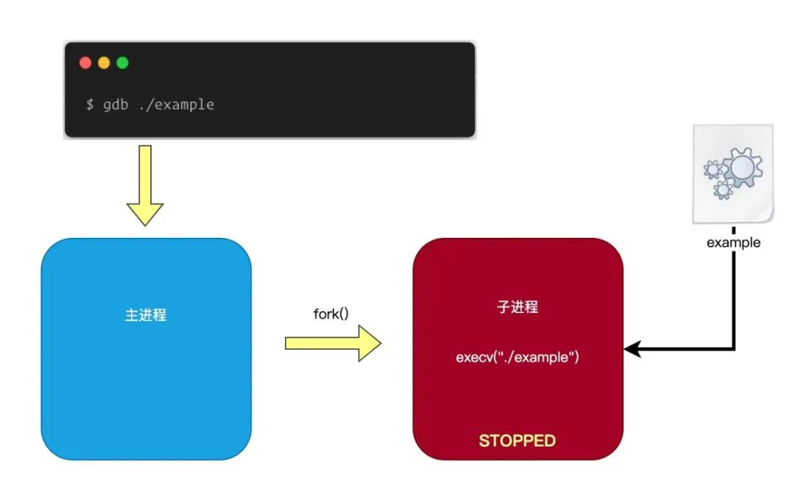
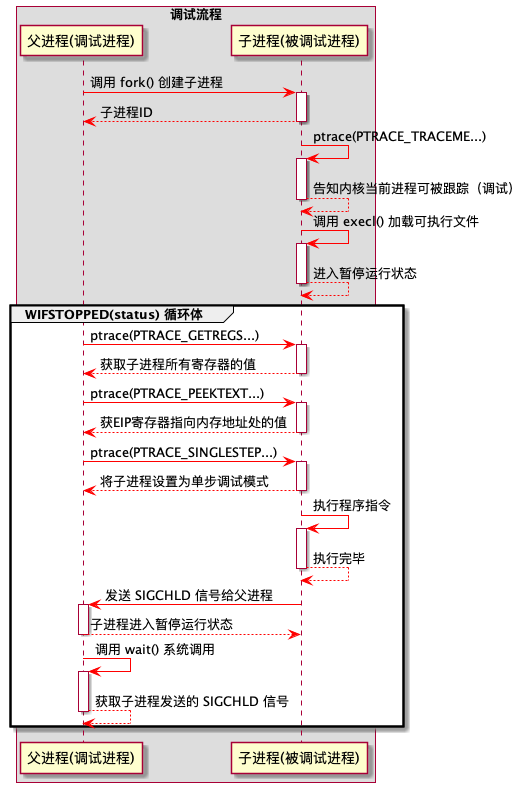
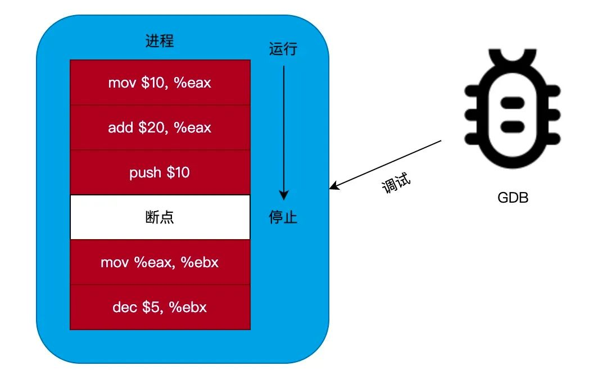
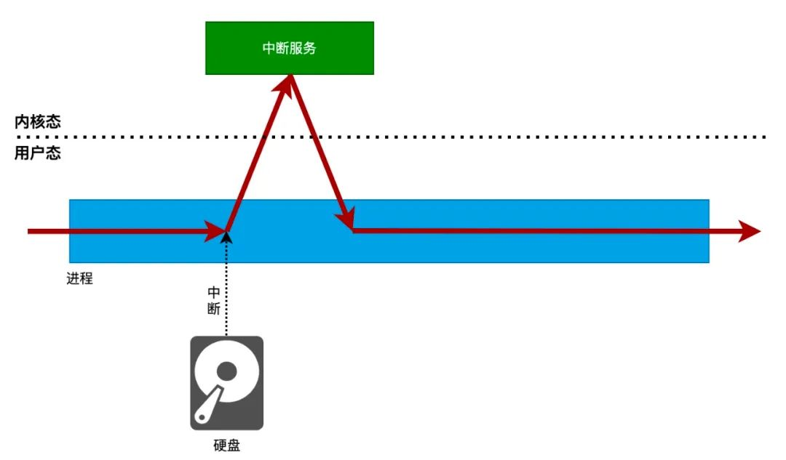
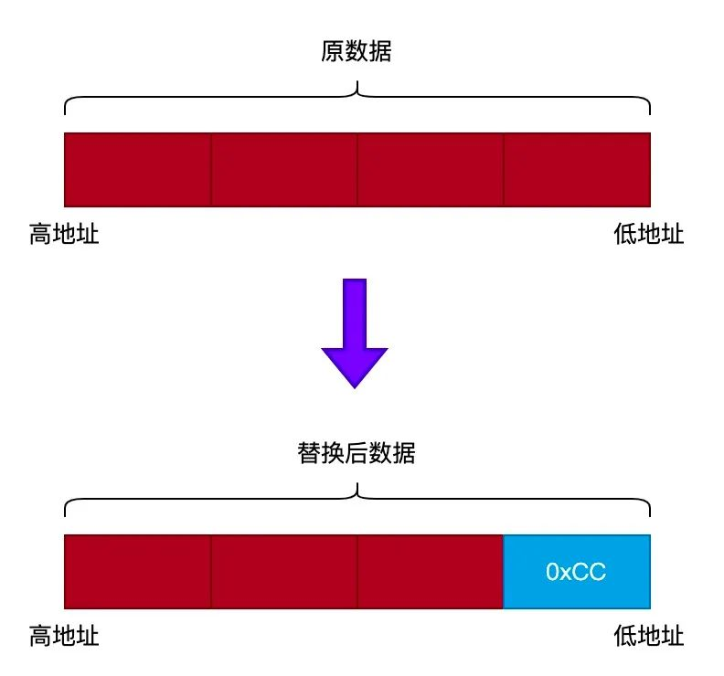
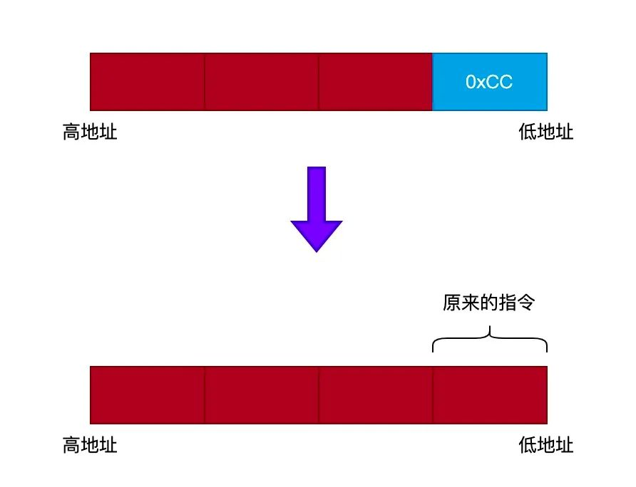

# 自己写一个GDB - 摘录

[TOC]

------

#### 注意

- https://mp.weixin.qq.com/s?__biz=MzA3NzYzODg1OA==&mid=2648466708&idx=1&sn=fd765d1e3c958c194010f35728e46fb0&scene=21#wechat_redirect
- https://mp.weixin.qq.com/s/ZjPD4tWszkUyS9C0CCF05w

------

# 自己动手写一个GDB｜基本功能

## 什么是 GDB

`GDB` 全称 `the GNU Project debugger`，主要用来调试用户态应用程序。

根据官方文档介绍，GDB 支持调试以下语言编写的应用程序：

- Ada
- Assembly
- C
- C++
- D
- Fortran
- Go
- Objective-C
- OpenCL
- Modula-2
- Pascal
- Rust

当然，最常用的还是用于调试 C/C++ 编写的应用程序。

本文并不是 GDB 的使用教程，所以不会对 GDB 的使用进行详细的介绍。本文的目的是，教会大家自己动手撸一个简易的 GDB。所以阅读本文前，最好先了解下 GDB 的使用。

在编程圈中流传一句话：`不要重复造轮子`。但是本人觉得，重复造轮子才能真正理解轮子的实现原理。

## ptrace 系统调用

`GDB` 实现的核心技术是 `ptrace()` 系统调用。

> 如果你对 ptrace 的实现原理有兴趣，可以阅读这篇文章进行了解：《[ptrace实现原理](https://mp.weixin.qq.com/s?__biz=MzA3NzYzODg1OA==&mid=2648465474&idx=2&sn=52dfd43e8f376e1ff16b2f81c3c002a7&scene=21#wechat_redirect)》

`ptrace()` 是一个复杂的系统调用，主要用于编写调试程序。你可以通过以下命令来查看 `ptrace()` 的介绍：

```
$ man ptrace
```

`ptrace()` 系统调用的功能很强大，但我们并不会用到所有的功能。所以，本文的约定是：在编写程序的过程中，使用到的功能才会进行详细介绍。

## 简易的 GDB

我们要实现一个有如下功能的 GDB：

- 可以对一个可执行程序进行调试。
- 可以在调试程序时，设置断点。
- 可以在调试程序时，打印程序的信息。

下面主要围绕这三个功能进行阐述。

### 1. 调试可执行文件

我们使用 GDB 调试程序时，一般使用 GDB 直接加载程序的可执行文件，如下命令：

```
$ gdb ./example
```

上面命令的执行过程如下：

- 首先，GDB 调用 `fork()` 系统调用创建一个新的子进程。
- 然后，子进程会调用 `exec()` 系统调用加载程序的可执行文件到内存。
- 接着，子进程便进入停止状态（停止运行），并且等待 GDB 主进程发送调试命令。

流程如下图所示：



我们可以按照上面的流程来编写代码：

#### 第一步：创建被调试子进程

调试程序一般分为 `被调试进程` 与 `调试进程`。

- `被调试进程`：就是需要被调试的进程。
- `调试进程`：主要用于向 被调试进程 发送调试命令。

实现代码如下：

```
int main(int argc, char** argv)
{
    pid_t child_pid;
 
    if (argc < 2) {
        fprintf(stderr, "Expected a program name as argument\n");
        return -1;
    }
 
    child_pid = fork();
    
    if (child_pid == 0) {               // 1) 子进程：被调试进程
        load_executable_file(argv[1]);  // 加载可执行文件
    } else if (child_pid > 0) {         // 2) 父进程：调试进程
        send_debug_command(child_pid);  // 发送调试命令
    } else {
        perror("fork");
        return -1;
    }
 
    return 0;
}
```

上面的代码执行流程如下：

- 主进程首先调用 `fork()` 系统调用创建一个子进程。
- 然后子进程会调用 `load_executable_file()` 函数加载要进行调试的程序，并且等待主进程发送调试命令。
- 最后主进程会调用 `send_debug_command()` 向被调试进程（子进程）发送调试命令。

所以，接下来我们主要介绍 `load_executable_file()` 和 `send_debug_command()` 这两个函数的实现过程。

### 第二步：加载被调试程序

前面我们说过，子进程主要用于加载被调试的程序，并且等待调试进程（主进程）发送调试命令，现在我们来分析下 `load_executable_file()` 函数的实现：

```
void load_executable_file(const char *target_file)
{
    /* 1) 运行跟踪(debug)当前进程 */
    ptrace(PTRACE_TRACEME, 0, 0, 0);
 
    /* 2) 加载并且执行被调试的程序可执行文件 */
    execl(target_file, target_file, 0);
}
```

`load_executable_file()` 函数的实现很简单，主要执行流程如下：

- 调用 `ptrace(PTRACE_TRACEME...)` 系统调用告知内核，当前进程可以被进行跟踪，也就是可以被调试。
- 调用 `execl()` 系统调用加载并且执行被调试的程序可执行文件。

首先，我们来看看 `ptrace()` 系统调用的原型定义：

```
long ptrace(long request,  pid_t pid, void *addr,  void *data);
```

下面我们对其各个参数进行说明：

- `request`：向进程发送的调试命令，可以发送的命令很多。比如上面代码的 `PTRACE_TRACEME` 命令定义为 0，表示能够对进程进行调试。
- `pid`：指定要对哪个进程发送调试命令的进程ID。
- `addr`：如果要读取或者修改进程某个内存地址的内容，就可以通过这个参数指定。
- `data`：如果要修改进程某个地址的内容，要修改的值可以通过这个参数指定，配合 `addr` 参数使用。

所以，代码：

```
ptrace(PTRACE_TRACEME, 0, 0, 0);
```

的作用就是告知内核，当前进程能够被跟踪（调试）。

接着，当调用 `execl()` 系统调用加载并且执行被调试的程序时，内核会把当前被调试的进程挂起（把运行状态设置为停止状态），等待主进程发送调试命令。

> 当进程的运行状态被设置为停止状态时，内核会停止对此进程进行调度，除非有其他进程把此进程的运行状态改为可运行状态。

### 第三步：向被调试进程发送调试命令

我们来到最重要的一步了，就是要向被调试的进程发送调试命令。

用过 `GDB` 调试程序的同学都非常熟悉，我们可以向被调试的进程发送 `单步调试`、`打印当前堆栈信息`、`查看某个变量的值` 和 `设置断点` 等操作。

这些命令都可以通过 `ptrace()` 系统调用发送，下面我们介绍一下怎么使用 `ptrace()` 系统调用来对被调试进程进行调试操作。

```
void send_debug_command(pid_t debug_pid)
{
    int status;
    int counter = 0;
    struct user_regs_struct regs;
    unsigned long long instr;

    printf("Tiny debugger started...\n");
 
    /* 1) 等待被调试进程(子进程)发送信号 */
    wait(&status);
 
    while (WIFSTOPPED(status)) {
        counter++;

        /* 2) 获取当前寄存器信息 */
        ptrace(PTRACE_GETREGS, debug_pid, 0, &regs);

        /* 3) 获取 EIP 寄存器指向的内存地址的值 */
        instr = ptrace(PTRACE_PEEKTEXT, debug_pid, regs.rip, 0);

        /* 打印当前执行中的指令信息 */
        printf("[%u.  EIP = 0x%08llx.  instr = 0x%08llx\n",
               counter, regs.rip, instr);

        /* 4) 将被调试进程设置为单步调试，并且唤醒被调试进程 */
        ptrace(PTRACE_SINGLESTEP, debug_pid, 0, 0);
 
        /* 5) 等待被调试进程(子进程)发送信号 */
        wait(&status);
    }
 
    printf("Tiny debugger exited...\n");
}
```

`send_debug_command()` 函数的实现有点小复杂，我们来分析下这个函数的主要执行流程吧。

- \1. 当被调试进程被内核挂起时，内核会向其父进程发送一个 `SIGCHLD` 信号，父进程可以通过调用 `wait()` 系统调用来捕获这个信息。
- \2. 然后我们在一个循环内，跟踪进程执行指令的过程。
- \3. 通过调用 `ptrace(PTRACE_GETREGS...)` 来获取当前进程所有寄存器的值。
- \4. 通过调用 `ptrace(PTRACE_PEEKTEXT...)` 来获取某个内存地址的值。
- \5. 通过调用 `ptrace(PTRACE_SINGLESTEP...)` 将被调试进程设置为单步调试模式，这样当被调试进程每执行一条指令，都会进入停止状态。

整个调试流程可以归纳为以下的图片：



## 测试程序 

最后，我们来测试一下这个简单的调试工具的效果。我们使用以下命令编译程序：

```
$ gcc tdb.c -o. tdb
```

编译之后，我们会获得一个名为 `tdb` 的可执行文件。然后，我们可以使用以下命令来调试程序：

```
$ ./tdb 要调试的程序可执行文件
```

例如我们要调试 `ls` 命令这个程序，可以输入以下命令：

```
$ ./tdb /bin/ls
Tiny debugger started...
[1.  EIP = 0x7f47efd6a0d0.  instr = 0xda8e8e78948
[2.  EIP = 0x7f47efd6a0d3.  instr = 0xc4894900000da8e8
[3.  EIP = 0x7f47efd6ae80.  instr = 0xe5894855fa1e0ff3
[4.  EIP = 0x7f47efd6ae84.  instr = 0x89495741e5894855
[5.  EIP = 0x7f47efd6ae85.  instr = 0xff89495741e58948
[6.  EIP = 0x7f47efd6ae88.  instr = 0x415641ff89495741
[7.  EIP = 0x7f47efd6ae8a.  instr = 0x4155415641ff8949
[8.  EIP = 0x7f47efd6ae8d.  instr = 0x4853544155415641
[9.  EIP = 0x7f47efd6ae8f.  instr = 0xec83485354415541
[10.  EIP = 0x7f47efd6ae91.  instr = 0xf38ec8348535441
[11.  EIP = 0x7f47efd6ae93.  instr = 0x48310f38ec834853
[12.  EIP = 0x7f47efd6ae94.  instr = 0xc148310f38ec8348
[13.  EIP = 0x7f47efd6ae98.  instr = 0x94820e2c148310f
[14.  EIP = 0x7f47efd6ae9a.  instr = 0x48d0094820e2c148
[15.  EIP = 0x7f47efd6ae9e.  instr = 0xcfe0158d48d00948
[16.  EIP = 0x7f47efd6aea1.  instr = 0x480002cfe0158d48
[17.  EIP = 0x7f47efd6aea8.  instr = 0x480002c5d1058948
[18.  EIP = 0x7f47efd6aeaf.  instr = 0x490002cfd2058b48
[19.  EIP = 0x7f47efd6aeb6.  instr = 0xd140252b4cd48949
...
[427299.  EIP = 0x7fec65592b30.  instr = 0x6616eb0000003cba
[427300.  EIP = 0x7fec65592b35.  instr = 0x841f0f6616eb
[427301.  EIP = 0x7fec65592b4d.  instr = 0xf0003d48050ff089
[427302.  EIP = 0x7fec65592b4f.  instr = 0xfffff0003d48050f
Tiny debugger exited...
```

可见，运行 `ls` 这个命令需要执行 40 多万条指令。

## 总结

本文简单介绍了调试器的执行流程，当然这个调试器暂时并没有什么作用。

下一篇文章将会介绍怎么设置断点和查看进程当前的堆栈信息，到时会更好玩，敬请期待。

> 本文的源代码地址：https://github.com/liexusong/tdb/blob/main/tdb-1.c


# 自己动手写一个GDB｜设置断点（原理篇）

在上一篇文章《[自己动手写一个GDB｜基础功能](https://mp.weixin.qq.com/s?__biz=MzA3NzYzODg1OA==&mid=2648466708&idx=1&sn=fd765d1e3c958c194010f35728e46fb0&scene=21#wechat_redirect)》中，我们介绍了怎么使用 `ptrace()` 系统调用来实现一个简单进程追踪程序，本文主要介绍怎么实现断点设置功能。

## 什么是断点

当使用 GDB 调试程序时，如果想在程序执行到某个位置（某一行代码）时停止运行，我们可以通过在此处位置设置一个 `断点` 来实现。

当程序执行到断点的位置时，会停止运行。这时，我们可以对进程进行调试，比如打印当前进程的堆栈信息或者打印变量的值等。如下图所示：



## 断点原理 

要说明 `断点` 的原理，我们首先需要了解下什么是 `中断`。本公众号以前也写过很多关于 `中断` 的文章，例如：《[一文看懂｜Linux中断处理](https://mp.weixin.qq.com/s?__biz=MzA3NzYzODg1OA==&mid=2648465955&idx=2&sn=5a3c7341f897683d602ba10356d71df3&scene=21#wechat_redirect)》。

想深入了解中断原理的，可以看看上文。下面简单介绍一下什么是中断：

> **`中断`** 是为了解决外部设备完成某些工作后通知CPU的一种机制（譬如硬盘完成读写操作后通过中断告知CPU已经完成）。
>
> **从物理学的角度看**，中断是一种电信号，由硬件设备产生，并直接送入中断控制器（如 8259A）的输入引脚上，然后再由中断控制器向处理器发送相应的信号。处理器一经检测到该信号，便中断自己当前正在处理的工作，转而去处理中断。此后，处理器会通知 OS 已经产生中断。这样，OS 就可以对这个中断进行适当的处理。不同的设备对应的中断不同，而每个中断都通过一个唯一的数字标识，这些值通常被称为中断请求线。

如果进程在运行的过程中，发生了中断，CPU 将会停止运行当前进程，转而执行内核设置好的 `中断服务例程`。如下图所示：



### 软中断 

大概了解中断的原理后，接下来我们将会介绍 `断点` 会用到的 `软中断` 功能。软中断跟上面介绍的中断（也称为 `硬中断`）类似，不过软中断并不是由外部设备产生，而是有特殊的指令触发，这个特殊的指令称为 `int3`。

`int3` 是一个单字节的操作码（十六进制为 `0xcc`）。当 CPU 执行到 `int3` 指令时，将会停止运行当前进程，转而执行内核定义好的 int3 中断处理例程：`do_int3()`。

`do_int3()` 例程会向当前进程发送一个 `SIGTRAP` 信号，当进程接收到 `SIGTRAP` 信号后，CPU 将会停止执行当前进程。这时调试进程（GDB）就可以对进程进行调试，如：打印变量的值、打印堆栈信息等。

### 设置断点

从上面的介绍可知，设置断点的目的是让进程停止运行，从而调试进程（GDB）就可以对其进行调试。

接下来，我们将会介绍如何设置一个断点。

我们知道，当 CPU 执行到 `int3` 指令（`0xcc`）时会停止运行当前进程。所以，我们只需要在要进行设置断点的位置改为 `int3` 指令即可。如下图所示：


从上图可以看出，设置断点时，只需要在要设置断点的位置修改为 `int3` 指令即可。但我们还需要保存原来被替换的指令，因为调试完毕后，我们还需要把 `int3` 指令修改为原来的指令，这样程序才能正常运行。

## 断点实现

既然，我们已经知道了断点的原理。那么，现在是时候介绍怎么实现断点功能了。

我们来说说设置断点的步骤吧：

- `第一步`：找到要设置断点的地址。
- `第二步`：保存此地址处的数据（为了调试完能够恢复原来的指令）。
- `第三步`：我们把此地址处的指令替换成 int3 指令。
- `第四步`：让被调试的进程继续运行，直到执行到 int3 指令（也就是断点）。此时，被调试进程会停止运行，调试进程（GDB）就可以对进程进行调试。
- `第五步`：调试完毕后，恢复断点处原来的指令，并且让 IP 寄存器回退一个字节（因为断点处原来的代码还没执行）。
- `第六步`：把被调试进程设置为单步调试模式，这是因为要在执行完断点处原来的指令后，重新设置断点（为什么？这是因为在一些循环语句中，可能需要重新执行原来的断点）。

知道断点实现的步骤后，我们可以开始编写代码了。

我们定义一个结构体 `breakpoint_context` 用于保存断点被设置前的信息：

```
struct breakpoint_context
{
    void *addr; // 设置断点的地址
    long data;  // 断点原来的数据
};
```

围绕 `breakpoint_context` 结构，我们定义几个辅助函数，分别是：

- **`create_breakpoint()`**：用于创建一个断点。
- **`enable_breakpoint()`**：用于启用断点。
- **`disable_breakpoint()`**：用于禁用断点。
- **`free_breakpoint()`**：用于释放断点。

现在我们来实现这几个辅助函数。

### 1. 创建断点

首先，我们来实现用于创建一个断点的辅助函数 `create_breakpoint()`：

```
breakpoint_context *create_breakpoint(void *addr)
{
    breakpoint_context *ctx = malloc(sizeof(*ctx));
    if (ctx) {
        ctx->addr = addr;
        ctx->data = NULL;
    }

    return ctx;
}
```

`create_breakpoint()` 函数需要提供一个类型为 `void *` 的参数，表示要设置的断点地址。

`create_breakpoint()` 函数的实现比较简单，首先调用 `malloc()` 函数申请一个 `breakpoint_context` 结构，然后把 `addr` 字段设置为断点的地址，并且把 `data` 字段设置为 NULL。

### 2. 启用断点

启用断点的原理是：首先读取断点处的数据，并且保存到 `breakpoint_context` 结构的 `data` 字段中。然后将断点处的指令设置为 `int3` 指令。

获取某个内存地址处的数据可以使用 `ptrace(PTRACE_PEEKTEXT,...)` 函数来实现，如下所示：

```
long data = ptrace(PTRACE_PEEKTEXT, pid, address, 0);
```

在上面代码中，`pid` 参数指定了目标进程的PID，而 `address` 参数指定了要获取此内存地址处的数据。

而要将某内存地址处设置为制定的值，可以使用 `ptrace(PTRACE_POKETEXT,...)` 函数来实现，如下所示：

```
ptrace(PTRACE_POKETEXT, pid, address, data);
```

在上面代码中，`pid` 参数指定了目标进程的PID，而 `address` 参数指定了要将此内存地址处的值设置为 `data`。

有了上面的基础，现在我们可以来编写 `enable_breakpoint()` 函数的代码了：

```
void enable_breakpoint(pid_t pid, breakpoint_context *ctx)
{
    // 1. 获取断点处的数据, 并且保存到 breakpoint_context 结构的 data 字段中
    ctx->data = ptrace(PTRACE_PEEKTEXT, pid, ctx->addr, 0);

    // 2. 把断点处的值设置为 int3 指令(0xCC)
    ptrace(PTRACE_POKETEXT, pid, ctx->addr, (ctx->data & 0xFFFFFF00) | 0xCC);
}
```

`enable_breakpoint()` 函数的原理，上面已经详细介绍过了。

不过有一点我们需要注意的，就是使用 `ptrace()` 函数一次只能获取和设置一个 4 字节大小的长整型数据。但是 `int3` 指令是一个单子节指令，所以设置断点时，需要对设置的数据进行处理。如下图所示：



### 3. 禁用断点 

禁用断点的原理与启用断点刚好相反，就是把断点处的 `int3` 指令替换成原来的指令，原理如下图所示：



由于 `breakpoint_context` 结构的 `data` 字段保存了断点处原来的指令，所以我们只需要把断点处的指令替换成 `data` 字段的数据即可，代码如下：

```
void disable_breakpoint(pid_t pid, breakpoint_context *ctx)
{
    long data = ptrace(PTRACE_PEEKTEXT, pid, ctx->addr, 0);
    ptrace(PTRACE_POKETEXT, pid, ctx->addr, (data & 0xFFFFFF00) | (ctx->data & 0xFF));
}
```

### 4. 释放断点

释放断点的实现就非常简单了，只需要调用 `free()` 函数把 `breakpoint_context` 结构占用的内存释放掉即可，代码如下：

```
void free_breakpoint(breakpoint_context *ctx)
{
    free(ctx);
}
```

## 总结

本来想一口气把断点的原理和实现都在本文写完的，但写着写着发现篇幅有点长。所以，决定把断点分为原理篇和实现篇。

本文是断点设置的原理篇，下一篇文章中，我们将会介绍如何使用上面介绍的知识点和辅助函数来实现我们的断点设置功能，敬请期待。


