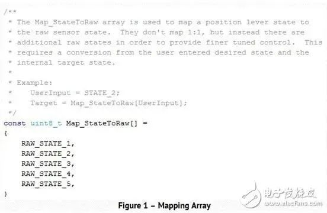

## 文档注释 - HQ

[TOC]

------

#### 注意

- 

------

## 文档注释技巧 - 摘录

### 技巧1——随时而不是过后进行注释

交付产品的压力经常导致天马行空般的编码风格，为了完成任务以便尽早推出产品，代码是想到哪就编到哪。在疯狂的代码编写过程中，很少想到记录下代码要完成的功能。等产品交货后，设计人员才会回去浏览代码并进行“注释”。

这样做的问题是，这时已经距离写完代码几周甚至几个月的时间了！对一些工程师来说记起昨天早餐吃的是什么都很难，更不用说两周前写的一段代码了。最终结果是不准确的注释说明，日后往往会引起误解和缺陷。

这里的技巧当然是在进行决策的同时随时进行注释。形式化的外部文档注释过程无疑会降低开发人员的进度，但向代码库中增加注释真的不会占用更多时间。

开发人员能够做的第一件事是先对代码要做什么事写一些注释行，然后再写代码。如果实现发生了变化，开发人员可以立即更新注释。在任何情况下，在编写代码的同时写下注释只会节省时间和增加条理性，从而更少发生错误，产品也能更快的上市。

### 技巧2——自动生成注释文档

尽管对代码做了很详细的注释，但总是有生成外部文档的要求，以便任何人不看代码就能明白程序功能。这个要求经常导致双倍的注释工作量。

幸运的是，市场上有现成的工具可以自动读取代码注释、然后生成界面和代码的其它文档细节！帮助工程师避免必须做两次相同的工作！一个具有这种功能的免费工具例子是**Doxygen**。

当开发人员在编写他们的代码时，他们以指定方式格式化他们的注释，并提供他们想要在外部文档中展示的细节内容。然后他们就可以运行Doxygen生成真实反映软件内注释的html、rtf或pdf文档。美妙的是如果你更新注释，外部文档也会自动更新！

### 技巧3——不要写显式的注释

虽然开发人员写了代码注释，但如果注释只是变量或函数名字的重复，会特别令人恼火。注释应该是描述性的文字，需要提供显式意思之外更多的细节！

提供尽可能多的信息，而且不要忘了提及相关和关联的变量或函数。开发人员应该能够只通过阅读注释就了解软件的行为。图1给出了一个注释简单映射数组代码的例子。

图1：映射数组

### 技巧4——提供使用例子以便更清楚地了解用途

函数或变量注释中包含如何使用它们的例子是很有用的。说应该如何使用是一回事，但展示如何使用会让人更清楚其用途。除了能够减少错误使用对象的机会外，还能给人一个更清晰的印象。

图2显示了一个如何注释函数的例子，它告诉开发人员应该如何使用这个函数，从而避免了容易出错的猜测过程，使人能够更清晰地了解其用途。

img

图2——使用例子

### 技巧5——创建注释标准

就像写代码一样，为代码开发注释和文档也应该有个标准。由于注释标准中不可能有许多条款，因此特别推荐向编写代码标准靠拢。

也就是说确保小组中的每个成员以相同的方式进行注释和归档，从而确保开发的易用性。开发人员应该专注于解决手头的设计问题，而不是费劲地去搞懂注释。

### 技巧6——使用文档模板

确保注释遵循标准的最容易的方法是为头文件、源文件和支持文件创建模板。当创建一个新模块时，可以从模板入手，然后增加相关的信息。这将有助于确保文件信息块、代码段、函数和变量都用相同的格式注释。

这种方法的最大优势是能够节省大量时间，并有助于减少将一个模块拷贝到另一个伪模板时发生的拷贝粘贴错误。为了让生活更加轻松，我特意开发了可以用于定义头文件和源文件的模板。

### 技巧7——图表的作用

在一个项目的软件实现阶段开始之前，应该有一个软件设计阶段。这个设计阶段无疑会生成许多漂亮的图（如流程图和状态机），并被用于实际实现。

虽然这些文档作为软件的开发路线图，但在开发和测试过程中总会出现偏差！遗憾的是，这些变化很少会返回到图表中。结果是设计文档和软件的不匹配！

在实现和测试阶段将这些图表放在手边，以便发生上述偏差时这些图表能及时得到更新。将这些图表留到日后更新永远不是正确的做法。虽然我们总是有返回去更新或修复的良好愿望，但这永远不是合适的时机。

### 技巧8——保持注释框使用的一致性

就像听起来一样奇怪，许多网络争论的内容是何时、哪里使用何种类型的注释框！不过严肃地讲，不管你的信仰是什么，归根到底是一致性问题。

如果一个团队决定只使用/*…*/类型的注释，那么就只使用这种类型。如果决定使用//类型，那就只使用//类型。

作者个人的观点是倾向于使用/*…*/进行函数和模块级说明，使用//进行函数代码说明。不管选择是什么，确保每次都按同样的方式去做，这样有助于生活更加轻松。

### 技巧9——使注释更容易阅读（即格式的美化）

为了确保避免误解并由此产生代码缺陷，使代码保持结构化和容易阅读很重要。注释也一样。偶尔结构化的注释会使眼睛很难捕捉注释，更难捕捉不在合适位置的内容。应该对注释进行格式化处理，这样如果代码打印出来时（虽然现在不常打印，但我偶然仍会打印代码）注释就不会分到好几页上去。

在大块注释（如文件头或函数注释）中，如果你使用块指示器，千万不要包含进任何拖尾字符（如#或*），要不只会使文档更新变得更加困难。

### 技巧10——嵌入图像和图表

借助自动化工具的使用，在注释文档中包含编码标准、缩写词、项目细节、要求和大量其它条款就成了可能。甚至能够包含诸如流程图等设计性图表！

使用这类功能允许代码库不仅包含执行代码和逻辑，还包含你想要了解的项目所有内容，并且所有信息都放在同一个地方。

