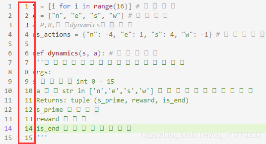
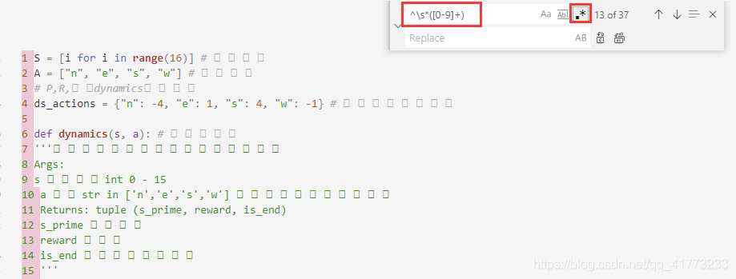

## 遇到问题汇总 - HQ

[TOC]

------

#### 注意

- 

------

## VS中遇到将分支推送到远程存储库时遇到错误

`rejected Updates were rejected because the remote contains work that you do not have locally`

在仓库目录下执行

`git pull origin master --allow-unrelated-histories`

之后就可以成功的pull，push了


## 复制代码时删除每一行的行号

### 1. 问题描述

有时候在我们复制代码时，会遇到代码每一行前有行号的情况，如下图所示：

> 

### 2. 解决方案

在vscode中能够直接用正则表达式将行号替换掉。

带点的：

```bash
^\s*([0-9]+)\.
```

不带点：

```bash
^\s*([0-9]+)
```

综合起来：

```bash
^\s*([0-9]+)[\.]*
```

其他博主提供：

```
输入“^\s*(#[0-9][0-9][0-9])” or “^\s*(#[0-9]+)”
```

复制到VScode编辑器中打开搜索替换，启用搜索的正则表达式，将正则表达式输进去（如果后面还有空格就再加一个空格），替换那行什么都不输入即可，全部替换掉即可, 如下图所示：

> 
> 这样就大功告成了


