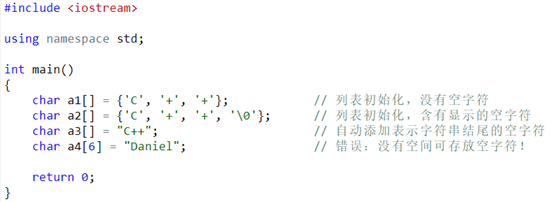
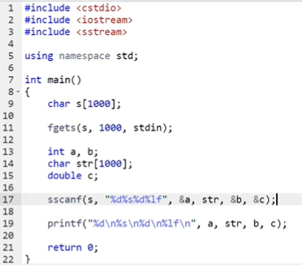
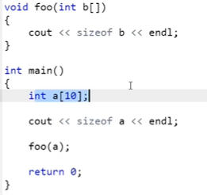
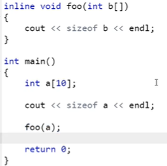
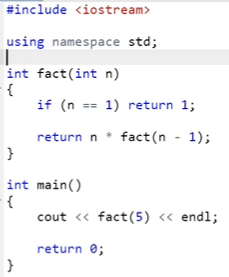
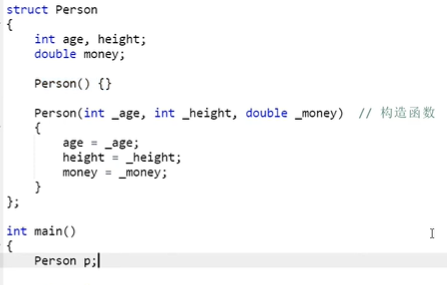
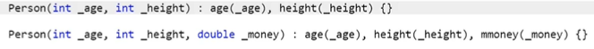
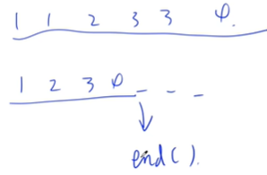
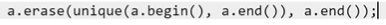

## C++基础学习 - AcWing算法课程 - HQ

[TOC]

------

#### 注意内容

- 有些语言中 `(4/3)` 无法得到 `1.3333…`，建议在公式中使用 `(4/3.0)`
- 99%的评测器，会自动过滤掉最后一个回车和每一行结尾的空格
- 当输出较多时，将`cin`和`cout`全部换成`printf`和`scanf`就会节约很多运行时间
- **函数内比如`for(int i[100000];;)`定义的局部变量将存放在栈内，看编译器的设置，默认`1M`，如果超出会出现段错误等；如果将变量定义为全局变量放在函数外，则存放在堆内，取决于内存的大小。**
- **在函数内定义的局部变量如果不进行初始化，则全部为随机值；而全局变量则定义后会默认初始化为0，无需主动初始化**

#### 运算中的注意事项

- 取模只能对整数，小数不行
- `4 / 3 = 1`,  `4.0 / 3` 则为浮点数运算， `4 / 3.0` 也为浮点数运算
- 两个整型数相除，只将其中一个转换为`double`类型即可`(double)r / s 或者 1.0 * r / s`
- 不要将判断字符串长度放到循环判断中，否则会增加不必要的运算量`for (int i = 1, len = s.size(); i <= len / 2; i ++ )`

#### 算法小技巧

- 如果题目涉及到小数运算，可以先转换为整数，然后再同比缩小

- `if (x == 0)` 可以简化写为 `if (!x)`

- `if (i % 2 != 0)` 可以简化写为 `if (i % 2)`

- `while (~a)` 等价于 `while (a != -1)`

- 程序遇到`return 0`就结束，所以可以在`for`中加入`return 0`来结束程序

- 注释快捷键 `ctrl+/` ，整体缩进 选中后`+tab` , 整体取消缩进 选中后`+shift+tab`

- 常用的变量

  |            英文            |    含义    |
  | :------------------------: | :--------: |
  |            cnt             |    个数    |
  | flag， bool is_xxxx = true |    标志    |
  |            sum             |    求和    |
  |          position          |    位置    |
  |         max_value          |   最大值   |
  |           value            |   输入值   |
  |            temp            |   暂存值   |
  |          ans, res          |    答案    |
  |           dummy            | 虚拟头结点 |
  |            cur             |    游标    |
  |            str             |   字符串   |
  |                            |            |
  |                            |            |
  |                            |            |
  |                            |            |
  |                            |            |
  |                            |            |


------

### 代码积累

##### 读入字符串

```cpp
#include <cstdio>
#include <iostream>
using namespace std;
int main()
{
    string name;
    cin >> name;
    return 0;
}
```

##### 当输入0时结束的几种写法

==cin会有返回值, 读到文件结束符（EOF = -1）的时候会返回false停止==

==scanf()读到文件结束符时也会返回一个值，返回为-1==

```cpp
while(cin >> c){}  //当输入结束时停止
一：
int x;
while (true)
{
    cin >> x;
    if (!x) break;
    ....
}
二： // cin会有返回值, 读到文件结束符（EOF = -1）的时候会返回false停止
while(cin >> x && x)             //while (cin >> m >> n, m > 0 && n > 0)
{
    ....
}
三： // 逗号表达式， 逗号表达式的值等于最后一个数的值
while(cin >> x, x)
{
    ....
}
四： // scanf()读到文件结束符时也会返回一个值，返回为-1
while(scanf("%d", &x) != -1)      等价写法    while(~scanf("%d", &x))
{
    ....
}
```


### 基础知识

##### 头文件

- ==万能头文件，包含所有头文件`#include <bits/stdc++.h>`==

  - 整理笔试时候常用的输入输出，可以使用


  ```cpp
  #include <bits/stdc++.h>
  ```

  来一次性输入所有的C++头文件包括：

  ```cpp
  #include <iostream>
  #include <cstdio>
  #include <fstream>
  #include <algorithm>
  #include <cmath>
  #include <deque>
  #include <vector>
  #include <queue>
  #include <string>
  #include <cstring>
  #include <map>
  #include <stack>
  #include <set>
  等等……
  ```

- ==`#include <cstdio>`==
  - `printf()`
  - `scanf()`
  - `puts()`
- `#include <iostream>`  //头文件更大一点 
  - `cin >>    cout <<`
  - `abs()` 求绝对值
  - `min(fig1, fig2)` 求最小值
  - `max(fig1, fig2)` 求最大值
- `#include <cmath>`
  - `sqrt()` 根号
  - `pow(2, 3)` 求2的3次方
- `#include <algorithm>`
  - `reverse(a, a + size);`    //翻转数组 a 的 0 到 size - 1
    - reverse函数用于反转在==[first,last)==范围内的顺序==（包括first指向的元素，不包括last指向的元素）==，reverse函数没有返回值
    - `for (int i = 0, j = size - 1; i < j; i ++ , j -- )  {swap(a[i], a[j]);}`
  - `swap(x, y);`   //交换两个值，变量可以是任意类型

##### 命名空间

- `using namespace std;`
- 如果不声明命名空间则需要在变量前加 `std::`
- 如果只用了 `scanf,printf` 则不需要再加`using namespace std;`

##### 变量类型

- 定义
  - `1e11=1*(10^11)=10^11=1000,0000,0000`
  - `int a, b = 2, c = b;`   //逗号运算符，从左到右计算
  - `float d = 1.5, e = 1, f = 1.235e2;`
  - `bool g = true, h = false;`
  - `char j = 'a', k = 'b';`
  - `long long l = 1231231LL;`   (加`LL`或`ll`代表是`long long`类型的整数)
    - **LL代表的意思是long long类型， 1LL是为了在计算时，把int类型的变量转化为long long类型，然后再赋值给long long类型的变量**
  - `long double m = 123.45;`
  
- 静态变量
  - ```cpp
    int output(void)
    {   //相当于在函数内部开了一个只有该函数能用的全局变量
        //函数内部的静态变量只会在第一次被调用的时候赋初值
        //没有赋初值则默认为0，与全局变量一样，且都存储在堆中
    	static int cnt = 0;
    }   	
    ```
  
- 布尔型 bool
  - `1byte`
  - `true` 真 1
  - `false` 假 0
  
- 字符型 char
  - `1byte`
  - 存储一个字符`'a'`或 `'\n'`
  
- 整型 int
  - `4byte`
  - `-2的31次方~2的31次方-1`
  - `-2147483648~2147483647`   共10位有效数字
  
- 浮点型 float (单精度浮点数，`6-7`位有效数字)
  - `4byte`
  - `123.5`    `1.235e2`
  
- 双精度浮点数 double (`15-16`位有效数字)
  - `8byte`
  - `%lf`
  
- long long 
  - `8byte`
  - `printf("%lld", a)`
  - `-2的63次方~2的63次方-1`
  - `long double`   (`18~19`位有效数字)

##### 输入输出

| 函数                   | 总结                                                         |
| ---------------------- | ------------------------------------------------------------ |
| cin>>                  | 遇到空格和换行自动停止读入，换行空格仍在缓存区中，下次读入自动跳过 读取后面的字符 |
| cin.get()              | 读入字符                                                     |
| getline(cin,str,delim) | 读取整行数据到 str 中 ,delim 分隔符                          |
| cin.getline(char*,int) | 接收字符串储存到 char * 中，长度为 n 可以接受空格            |
| char a; cin.get(a)     | a 中可以储存被 cin 丢弃的换行符                              |

- 输入 `cin >> a >> b;`  //把cin的值拿到a中，再拿到b中

- 输出 `cout << a + b << endl;`  //把a+b的值拿到cout中，再把endl（回车）拿到cout中
- 输入 `scanf("%f%f", &a, &b);`
  - ==在scanf()中，%c会读入空格，%d不会读入空格，cin >>也会过滤空格==
  - ==scanf("%d%d %c", a, b, c); 这样写空格不会被读入c（需要手动加空格过滤）==
  - ==scanf("%d%d\n%c", a, b, c); 这样写回车不会被读入c（需要手动加回车过滤）==
- 输出 保留1位和两位小数 `printf("%.1f %.2f\n", a + b, a * b);`
- 格式化输出
  - `printf("%5d", a)` 占用5个宽度，若不足则在前面补空格，若自身超过，则为原来长度，默认右对齐
  - `printf("%-5d", a)` 左对齐
  - `printf("%05d", a)` 将补空格改为补0
  - `printf("%5.2lf", a)` 保留2位小数，且一共占5位
  - 转义字符  `%% \\ \' \n`

##### 类型转换

- ==`float,double`转换为`int`时下取整==
  - `float 5.23` 转换为`int`时为`5`


##### 判断/循环

- 等于 `==`
- 不等于 `!=`
- else 就近原则，else和往上离他最近的if匹配
- **变量作用域，括号里面定义的变量只能在括号里面用，作用域只在括号内**
- while()是不断循环的if()

##### 条件表达式

- 与 `&&`
- 或 `||`
- 非 `!`
- 注意：短路原则，如果前面能决定整个式子的真假，则不会执行后面的式子

##### 求补码

- 先将负数取正，然后进行**取反+1**
  - -2取正为2，2的原码为0000 0010（正数的补码与原码一样）
  - 取反得到 1111 1101
  - +1 得到最终 -2 的补码为 `1111 1110`
- `~0 = -1`
  - `0 为 00000000` 
  - `~0 为 11111111`
- `~-1 = 0`   //负号和取反符号优先级相同，运算顺序从右到左
  - `-1 的原码为 10000001`
  - `-1 的反码为 11111110`    ==负数的反码为除符号位取反得反码，负数在计算机中用补码表示==
  - `-1 的补码为 11111111`


### 数据类型

#### 数组

##### 初始化

```cpp
int a[3] = {0, 1, 3};   //定义一个长度是3的数组
int b[] = {0, 1, 1};    //定义一个长度是3的数组

int c[5] = {0, 1, 1};   //定义一个长度是5的数组，没有给出的值，默认为0
char d[] = {'a', 'b', 'c'}; //定义一个长度是3的字符数组

int b[3][4] = {{1, 2, 3, 4}, {2, 2, 3, 4}, {3, 2, 3, 4}};
int b[3][4] = {
    {1, 2, 3, 4},
    {2, 2, 3, 4},
    {3, 2, 3, 4}
};

int f[10] = {0};       //将数组全部初始化成0的数组
int f[10];           //没有初始化，则全部为随机数
```

##### 使用方法

```cpp
int a[100] = {0};
a[0]~a[99]
int a[0] = a[99] * 2;
```

##### 常用函数

```cpp
#include <cstring>
int a[10], b[19];
```

- `memset(a, 0, 40);`     (数组名, 初始化为什么, ==一共初始多位个Byte==)   (int 为 4Byte)
  - ==并不是把数组的每个变量赋值为0，而是把这个数组的每一个字节赋值为0，每个Byte赋值为0，一个Byte有8位。==
  - `memset(a, -1, 40);`  ==只有0和-1特殊，赋值为啥数组值为啥==
  - `memset(a, 0, sizeof a);`   
- `sizeof`   是C语言的==语法关键字，不是运算符==，用来==计算数组占用的字节数量==
- `memcpy(a, b, sizeof b);`   数组复制 (复制的目标数组，原数组，复制的长度)


#### 字符串

- ASCII码：每个常用的字符都可以对应一个`-128~127`的数字，二者之间可以相互转化。
  - `a = 97, A = 65, 0 = 48, 空格 = 32，回车 = 10 ‘\n’`
  
- ==字符串就是字符数组加上结束符 '\0'==

- **可以使用字符串来初始化字符数组，但要注意，每个字符串结尾会暗含一个‘\0’字符，因此字符数组的长度至少比字符串长度多1**

- ==定义字符数组一般比规定长度长10个， `fgets`最后要读入一个回车，一般再多读入一个字符==

  - `char str[110];  fgets(str, 101, stdin);` 

- 初始化：

  > 

- **字符数组的输入**
  
  - ==读入遇到空格，回车，文件结束符停止==
    - `scanf("%s", s);`   //s数组本身为指针/地址，不需要加取地址符
    - `cin >> s;`       //读入字符串
    - `scanf("%s", s + 1);` //从s[1]开始读入字符串
    - `cin >> s + 1;`     //从s[1]开始读入字符串
  - ==读入遇到回车，文件结束符停止==
    - `cin.getline(s, 100);`   //把一行读到字符数组类型的字符串中（有空格也不会停止），从s最多读入100个字符，需要加上`#include <iostream>  using namespace std;`
    - `fgets(s, 100, stdin);`   //把一行读到字符数组中（有空格也不会停止），从s最多读入100个字符，`stdin`是从哪个文件夹读入（系统内定义好的变量），==不会过滤回车==
    - ==getline(cin, s);   //把一行读到string类型的字符串中，string类型的字符串只能用cin读，scanf()读不了==
  
- **字符数组的输出**
  
  - `cout << a1 << endl;`  //字符串输出到 `‘\0’` 结束
  - `printf("%s\n", a3);`  //字符串输出到 `‘\0’` 结束
  - `char a1[4] = {'A', 'B', 'C', '\0'};`
    - `cout << a1 << endl;`   //从A开始输出
    - `cout << a1 + 1 << endl;` //从B开始输出，以此类推
    - `puts(a);`  等价于  `printf("%s\n", a);`  包括换行符
  
- ==常用函数（都包含在`#include <cstring>` 头文件中）==
  
  - ==`strlen(str)`，求字符串的长度,不包括 `'\0'`==
    - `strlen` 返回字符数组中有效元素的个数，而不是字符数组的容量。
  - `strcmp(a, b)`，比较两个字符串的大小，比较方式是字典序
    - `a < b` 返回`-1`
    - `a == b` 返回`0`
    - `a > b`返回`1`
    - `strcmp(a, "asdasd");`
  - ==`strcpy(a, b)`，将字符串b复制给从a开始的字符数组。==
  - `memcpy(a, b, 4 * size);`    把`b`中`4 * size`个字节赋给`a`
    - ==并不是把数组的每个变量赋值为0，而是把这个数组的每一个字节赋值为0，每个Byte赋值为0，一个Byte有8位。==
    - `memset(a, -1, 40);`  ==只有0和-1特殊，赋值为啥数组值为啥==
    - `memset(a, 0, sizeof a);`   
  
- 常用写法
  - ==遍历==
  
    ```cpp
    char str[101];
    for (int i = 0; str[i]; i++ ) len++ ;
  
  - ==遍历==
    
    ```cpp
    fgets(str, 101, stdin);   //注意fgets不会自动过滤回车，遍历时要手动屏蔽
    for (int i = 0; str[i] && str[i] != '\n'; i++ ) len++ ; 


#### 标准库类型 string (c++特有，c没有)

- ==`string`涉及的函数都包含在`#include <iostream>` 头文件中==

- `string`类型字符串可以直接写 `s[i]`

- `string`可以定义数组类型  `string s[20];`   
  
  - `while (cin >> s[n]) n++ ;`
  
- 初始化
  - `string s1;`   //默认的空字符串
  - `string s2 = s1;`  //s2是s1的一个副本
  - `string s3 = "hiya";`  //s3是该字符串字面值的一个副本
  - `string s4(10, 'c');`  //s4的内容是 cccccccccc
  
- 输入
  - `cin >> s1 >> s2;`   ==//遇到空格等结束==
  - ==`getline(cin, s);`   //把一行读到string类型的字符串中，可以含有空格==
  - ==输入不能用scanf()==
  
- 输出
  - `cout << s1 << endl;`
  - `printf("%s\n", s1.c_str());`   ==//调用函数返回s1存储位置的首地址==
  - `puts(s1.c_str());`     ==//调用函数返回s1存储位置的首地址==
  
- 常用函数及用法
  
  - `string`的`empty`和`size`操作==（注意`size`是无符号整数，因此 `s.size() <= -1`一定成立）==
    - `cout << s1.empty() << endl;` //判断字符串是否为空，为空返回`true`，不空返回`false`
    - `cout << s2.size() << endl;` //返回长度
    - `s.length()` 与 `s.size()` 完全等价
  
- `string` 的比较
  
  - 支持 `> < >= <= == !=`等所有比较操作，按**字典序**进行比较。
  
- 两个`string`对象相加：
  - `string s1 = “hello”, s2 = “world\n”;`
  - `string s3 = s1 + s2;`    // s3的内容是 `hello, world\n`
  - `s3 += s1;`     **//支持累加**
  
- 字面值和`string`对象相加时注意
  - **做加法运算时，字面值和字符都会被转化成string对象，因此直接相加就是将这些字面值串联起来**
  - **当把string对象和字符字面值及字符串字面值混在一条语句中使用时，必须确保每个加法运算符的两侧的运算对象至少有一个是string**
    - `string s4 = s1 + “, “;`    // 正确：把一个string对象和有一个字面值相加
    - `string s5 = “hello” +”, “;`  // 错误：两个运算对象都不是string
    - `string s7 = “hello” + “, “ + s2;`  // 错误：不能把字面值直接相加，运算是从左到右进行的
  
- 范围遍历
  - ==`for (char c : s) cout << c << endl;`   //顺次遍历string字符串==
    - `for (int i = 0; i < s.size(); i ++ ) cout << s[i] << endl;`
  - ==`for (char &c : s) c = 'a';`     //加`&`后`c`就代表`s`,改变`c`可同步更改`s`==
    - `for (int i = 0; i < s.size(); i ++ ) {char &c = s[i]; c = 'a';}`
  
- `auto`关键字
  
  - `for (auto &c : s)`  //将变量类型用auto代替，让编译器去猜
  - `auto s = "aaaaaa";`  **//如果类型可以唯一确定，则可以用auto去判断，如果类型有多种选择，则不建议用auto**
  - 子类继承时可以用
  
- `s.substr(i, len);`  //函数返回字符串中的某一段，起始位置`i`，长度`len`，最多到结尾，可省略`len`代表到结尾
  
  - `cout << str.substr(0, p + 1) + str2 + str.substr(p + 1) << endl;`
  
- ==`str.back()`  //函数返回字符串的最后一个字符  等价于 `str[str.size() - 1]`==

- ==`b.pop_back();`  // 把最后的空格删掉==
  
  - `if (str.back() == '.') str.pop_back();`  //如果最后一个字符为`'.'`，则去掉
  
- `#include <sstream>` 中的 `stringstream ssin(s)`使用
  
  - `stringstream ssin(s);`  //作用是把一个字符串初始化为一个类似cin输入的，可以从字符串s中读出来任意格式的信息，从字符串s中提取出我们需要的各种信息，需要什么信息就读到什么变量中,后续用法与cin等价,ssin为变量名可更改
    - `int a, b; string str; double c;`
    - `ssin >> a >> str >> b >> c;`
    - `while (ssin >> str) if(str == a) cout << b <<;`
  
- ==`stoi(str);`   //将字符串转换为整数数字==

- `#include <cstdio>` 中的`sscanf()`用法

  > 

- 题目中常用写法
  - 给定字符串 `a` 的第一个字符的 `ASCII` 值加第二个字符的 `ASCII` 值，得到 `b` 的第一个字符，依次类推
    
    ```cpp
    for (int i = 0; i < a.size(); i ++ )
    	b += a[i] + a[(i + 1) % a.size()];  
    //如果直接输出不存到string b中，则需要(char)转换
    cout << (char)(a[i] + a[(i + 1) % a.size()]);
  
- 交换字符串
  - `#include <algorithm>`
  - `if (a.size() < b.size()) swap(a, b);`
  
- ==注意`string str != "."`  这里的`.`只能用双引号，单引号报错==
  
  - `while (cin >> str, str != ".");`
  
- 读入字符串，其中用逗号隔开，例如`45ef67kl,ab,ef`
  
  - `char c;`
  - `while (cin >> c, c != ',') s += c;`
  
- 双重循环查找字符串
  - 由于`for`的局部变量不适用，此处用双重`while()`循环
  
  - ```cpp
    #include <iostream>
    using namespace std;
    
    int main()
    {
        string s, a;
        cin >> s >> a;  
        
        int len1 = s.size(), len2 = a.size();  // 首先计算各自的长度
        int i = 0;
        while (i + len2 <= len1)    // 在长字符串中从第一个往后依次对比（循环移位）
        {
            int j = 0;
            while (j < len2)        // 每次对比短字符串长度个字符（每段是否相等）
            {
                if (s[i + j] != a[j]) break;   //有一个不等则退出
                j ++ ;   
            }
            if (j == len2) break;   // 如果找到则退出（此处只是为了找最先出现的位置）
            i ++ ;                  // i为最先出现的位置，从0开始
        }    
        cout << i << endl;    
        return 0;
    }
    ```
  


#### 函数（函数让代码变得更加简洁）

- 定义
  - **`int foo(int n){}`  不写return会返回随机值**
  - `int foo(可省略){}` 
- 声明
  - `int foo(int n);`
  - `int foo(int);`     **n可省略**
- C++中的引用
  - `int max(int& x, int& y)`   ==对x,y做的任何操作都会相应的改变实参，引用符一般紧贴int==
- 函数重载
  - `int max(int x, int y) 与 int max(double x, int y)`   函数名相同，但形参类型不同
- 数组参数
  - **数组的传递是引用，传递的是数组的地址，对原值进行了改变**
  
  - ```cpp
    int output(int n, int a[5])
    int output(int n, int a[])   //可省略
    int output(int n, int *a)    //指针写法
    		
    int a[5] = {1, 2, 3, 4, 5};  // main中定义
    output(5,a);
    
    void output(int n, int m, int a[][3])  //多维数组，只有第一个参数可以省略
    void output(int n, int m, int (*a)[3])  //指针写法
    
    int a[3][3] = {
        {1, 2, 3},
        {4, 5, 6},
        {7, 8, 9},
    };
    output(3, 3, a);
    ```
  

- 默认参数
  
  - `void foo(int a, int b = 10);` 
  - **传值覆盖，如果重新传递了b的值，则b变为传递值，这只对最后的几位参数有效**
  
- `sizeof ()`使用注意

  - main函数中是整个数组的大小，而foo函数中只是指向数组的指针的大小

  - > 


- **内联函数**
  
  - **将不会把它编译为函数，而是将所有调用函数的地方全部替换为函数**
  - > 
  - **适用于短，调用次数少的函数，且不适用于递归函数**
  
- `return`
  
  - 如果没有返回类型`（void）`的话，就`return;` （可省略）
  - 函数执行到`return`, 则函数结束, 类似于`break`
  - 如果都不满足条件，或出现错误一般写`return -1;`
- 函数调用
  - ==所要调用的函数必须在此调用之前定义过或者声明过==
  - 递归：函数调用自身，先层层递进，然后又依次出来，需要设置好一个边界/检测条件，否则会死循环
  - > 
  - > 


#### 类

- 类可以将变量、数组和函数完美地打包在一起。
- 定义
  - `class Person{  };`     ==最后一定要加分号==
  - 类中的变量和函数被统一称为类的成员变量。
  - `private`后面的内容是私有成员变量，在类的外部不能访问；`public`后面的内容是公有成员变量，在类的外部可以访问。且可以定义多个`private,public`。
  - ==对于类，如果不写公有私有，则默认是私有，对于结构体，不写则默认为公有。（只有这一个区别）==

- 构造函数
  - > 
  - 由定义时P的传参决定使用哪个构造函数.png)![img](data:image/png;base64,iVBORw0KGgoAAAANSUhEUgAAANEAAAATCAIAAACBeH8HAAAAAXNSR0IArs4c6QAAAARnQU1BAACxjwv8YQUAAAAJcEhZcwAADsMAAA7DAcdvqGQAABDeSURBVGhD7Vr5V5RH1p4/Jr/NfDPRk2SSc3JOTiZfFo1RATcQFCEIyNqAYRVxZxEUWYxsarMIKKDsyiYIBNl3aJaGhmaHbrqb3pf3e+qtpmnZiZ7vJDPznPd06r1v1a1bdZ+69xbmL8zuYDCDUfQfinXLx6ve2PzDAbbRZx3eFb7zHS9YDp6Noz4YdsU5I9dWYZT+O2Kr1bFy+pj7A20Nw6gZRmcm3CVMCuljwprLTcbsdc83629Uu7oQGKzdYLZpOXjwda/T7hZ745zx/d8U5ms0Wywa6x4KNOAkncGgYl2FBlxopMtOIHpW+68NYeenQsagZ9/YLyZb9CyML1vAOIZhRKIlqVSkUsnm5iZVKilrIVHKdgGltPjV6fC7qp3IsRBI8GucZe2jmeb3xG5zqzk+1Nx/TEil0gcPHtjZ2VVWViqVSsMaJdYaZhuAFnrAl9RV6yLHRpCvq8PxH/oQGDlmUm0Aw8AR4xvFOx22AO2A34KC/KSk++np3KSktNnZWToan8BatkEesJDtTAayMMrRolMPD484OzuHhIRMTU3R4e+PnTmn0+lyc3OdnJxOnjzp6+v7+vXrlZUVYqxej0/vLoOAfqKv+KUwl7C9CExC8+FoA2hAYhJuhR07/A4UFBRYWVldvnx5cHBQq9Vi/+UrzMvyrvh7L4Z5s3qQisXEhOzBr6/c3e5GRuT09s6o1aYgt71Jxg5YYmuLIDL8SX0dT6lAvCFbMDOrSEoq9/S8d+1aZlf3rFpNlrcih0ktPj6JMTF5IyMiWLSqZweMj48VviiKj+NWVbXfvp1RUFAnkcjJ9OymNdSNBPk/DA5MfdskUKqMq6qqHA4MSLty5VF3z6xaQ7qBrElJSQcPHkhJSVleXjZ5/H12fmfOKRSKoKCgQ4cOubi4nDlz5ujRo4WFhRBiVkClUpnsADQaDX1Vwwk6shL8UkpBAlA+UZiEJg3QBjejTUfRPmzf9UA32sHU2KrnXnHnzp1bt27xeDy1SgWdExPiWzdzztolHDoQVV/H17EuX1zURUQUcbxf+PlWODtnh11+Oj4+z44GtjeDBEKViklLLffxzvrfr2+kJDWLRWQiqZSJvVfu5p570b/ayTnXg5M2MjYLXQ+5dY7n0zi+pecc0oODCwQCETsB5fcOaGvtsbLkeHmlf/NNiH9A5vSMmKbS2lqe47lEjmexm0v+Ofvkprfzag1TWt5lZ5vs6VVm75Dh5Jrc07eg1TEarRZUi4uLi4yMnJubo94xwTjNHrEz5yQSSVhYWFpa2tDQUF9fn6ur68WLF4eHh+VyeXp6urW1NaICvs7Pk02vqqrKzMzEybC3t79w4cLbt29BI5lM9uzZM2SrH3/8MSEhgY3zhF4vXrw4e/bsgQMH4GM+nw/qoNvjx4/Dw8MRU69evTo+Ps6asAnKysoSExPj4+Ohwd3dHYb97i2gMA2Pjo6G/dhfNu8Y+HxRwfOBoqJhV+e82hqhBuU1w3R0iBydUoqKesfGFCVl865uqd09Y+xoKNneDMI5mYwpLOyvqx3meBenpPQvLRGlAwMrZ+zvFxR28ceVla8XDh+P/K19tGdQ7nSB+ySvdXhU1vDbjIVFYl4+Ty6HYeD+trRjv7S09py1v1JQ0BQYWBIUXCackkAsUzB+/o8joxp6uiWDg2I7O25EVDN/Qunll5bwoKmvX9rTO2954l78/WaRWAXaYWOePHkSExODPYGP6EaBfHAQXLC0tLTXnd+Zc6D59evXq6uraTgJCAjw8fEB//Lz85HmHz16lJGRgZxbUlICFoJ8X331FSqA+/fvg2SQo2dpaem5c+eioqIgTE5OHhsbg5VYBoiFFAb54cOHQTtUDFC4f/9+Dw8PCH/66ScoB+OpGeuAkuuzzz7DRKAd9AQHB29F0O7ubpwN0Cg1NRWMR52AvTN+WwXdNdQMHR0dWCD6YNWsXK9QaKRSg2CC4XBe1tRMUc4JhSrfi88DL1UXlklv3R64Ht4wLhCTD8TV20cg+EyPYLG8rFGq9JfDalLSeOAcBojE2qDQMg+/V08Ll8PvjngFvB7ii58WCn2DGodGl9u6FaFX6z/eFxsd3bG4SO+VmIh4ZDNAH7Gh8bfWxAdFMzOiqJj6oNBa4ZQMQh5f6eKe09Y+NzPPxMW3fPHFr64XGp8XK2wduZ3dM8MCJjy69e+fRF7wqJialusMRFFNTY23tzdcvLCwQGmAXw6Hc+PGDRpr9oSdOQcmIbfCr35+fghdyK1gG2IV+PTDDz94eXnBSZ9//jm8Pjk5CUqBXjBOLBY3NjaiNgKTXr16dezYMbCqt7cXr8jL8G5gYODdu3dBFJFIxOVyobmtrQ2qkL5ra2sXFxfBbCxJKBTCBvOTRNugr6WlZVFREYbjF3m/tbWVdliHiYmJuro6XAgQg8vLyxsaGiifzEGTe1NT0/Hjx2Fqc3MzlZBClN10cM7Ds7CmZlKjYXD0kYkqqhd++OnJ/3wc99W/uKUvBQolDQCUB2vWbgDpQ/uptUxwSGFKWtfSkkqlYXR6prFF/O2hrL/+I3H/P7lZ+RMyuf5J3njA5d47cQOnHbLCozvdPN5GRbXOzK6wCmAhmAdlG6ejMzD1DQ2p3Odz86IbkaUBIa+EQtxeme5+lbdPZWra2AX3Zxd/aQ67PMLx6XyUIXdwLk1IGj7nWhx4hcfx7znvWjEuMB54uAM7DC/DoeADFSKaIHygNKKvu8fOnMPdDfz48ssvLSwswDPqZnAORnz33XfwEHDkyBGwDYcA4Sc0NBTVN84BsifugBiO8Is0Csoi4SKAgWeQQCe4iD5wVVdXl5ubG9gA4iKmgiWYF3rwipzLet4Y0gE0AHAO4bCnpwcSTOfp6QmK00+0mwkwtb29HVkeTEKfzs5O5Hrjt1XQgbAf1MS6nj9/jlNBP1HO8ccYd/eCqioBdhgzCKeZG+GNNyM7M7P7ffzeBgSXjfAXiJ8NNC68c0g2BT6DZ4HBz5JT28A5EG5ukYmObQy52pOVPRgQNOzlWzM6Jioql3zzfY7N2er0nN7xSUVEZN/d2PZZI+eggzzsn1fWTYdXwrmG3+qTHmbOzi3ciCwKDKkUCsnC+QKDpVXW4SN5d2M7u3ukRUWG0LDh4nLF198+sDxRGp80MMBTJSZNe/s0TkxI6e0VW4eUgnQB1+A0kgnM3EEbu8fOnANvEKIePnyIvANeI0pBCNohDqH0gS/hRfgerkWORwpD8YcCHCxZDRUG5EeQDMxApHFwcMjOzsZwRGbEOZrmIAFpoP/SpUuIbYiXEKJcQKrdinPIktCAMg4SDAdRQCzaYR2QW5GjUXngPKAWRk7fmFsBqh8237x5E3c08I8K6ayLi0yAf1VT0wy74UxJueCsQ+6beqFKzbR2KE5Yx5eUDeFmAMItS8S4MJqCwQaYVBI2X71WkZ07uSwh/KismT1p86imluhEcWtjm/ayStDapT90+FlWzpBYqpucYhwd8rKyRqVSQjKlUs4fG5GtSPV64y3KBDIH+0eQpuZmblbR/ILodkzdtevd09NKCJdljI1tzqXQ3lE+LnzMlWtvb8dMDo5oLY6nRcUMTE5pJXLGg1OYkDgmEuloPYc6+0pYGHKUuSOmp6exk/RWQSW7xK7uEKAC/IoGvSTCMbifwpHIszY2No6Ojgg5CCEQxsbG/vLLL/39/WTRq/YheCDIodv58+cREREpEd6QT1GxIRFDiGsEwiR4CRqZKjMEQoTVkZERqoq1hQCvAPoj1OMGgzsNUjzCHuK/sce7gNlQODo6CvpCGwhNg6vx8wbggobKjy1csJv62TnlndgSZ5cnf/trxBGLuIiY/MmphZZ22dFjv9rYpnhx8s85ZdicSWltm9LAPQyTX5CHbUF1gQBv1PgOsBCDRstk577288/a/0nE19/G+QZkdffPd/cp7Oy5p22TfXzyXV0yrKziG5qmJFLm+o0Ou7OZ7l6ZdvYP3dxK+vqWKe/7B/qsrU8lJMZvWsVDsiQSvyipsDjB8fBO/fyLiH/8/Y6T06OK6gGpTJOROXnUKv2CR76LW7bFcW71m3m50hCb2HnY8qEnJ9/RJdnmTFJH54JWi3sr4VxeXl5UZCQNK3QuNGjiotU5nXSX2JlzyDKIDSiJcHbhexPA8adPn+LOCOqcOnWqoqICvsR1MisrCwcCdqAPtUYgECAsoSJEkMOJoXUoak/UhSgHQRrcQugZwljopDEGhTyWijaUUD0U9BWhaN++fd9//z10wjxsB435m4IOAYjdq/TFK22sAy5oCOrESIMWcWtCqAkJKzl5Ou+EdYXlqRwv/9zeoTnpClNeIQgIbrS1L750pf1Nw5Rcria9Gaa9o23fvo+RGXAGNpuChCiwM4X7xs4x+7BV8SHLZ7Y/Zza2EZ0t7TOXQt9Yn8oJDqqvruFLpDgbqEfl8Qm99o4F12+1t7Uvrch12FYokkiWDx48iDNPUwHVbgLen+YVxP/KDQlLt7V7bG1dfOJY2bFjqQWFPNmKdmlJn5nN/9n5JcevsbJ6XCzTKHSMcEaZyh392fW5n395XT1fqdRgp7TsZPAUiiIT57DV2EZs1EcffYREh/ZWm7kpduYcJsD2IcOiAdUUtA0WguZIrMhxSJcwCFcHdMYRp3ZQoDNcODAwgKoTtRQVQjMdjggEIe2PsTi1dGFoQBtKVLb72pJoz3v37uFeXFhYCJ2m2mt7UD2A8X0LIH6fPn06MzNzfn5Oo9MqVQb+mKh/YIk3tILfoZGFRalGqWPkSmZiUjkwKBZOqXGlgHs0BsOYYDw6JvrTTz/FyaFFyAbAeLJ307PS/sGFvgFJb7+4f3BexOoEF4VCRV/fwuSEAutG8qU8XlzU8niimRmNUkNuHpDPzMzk5eVjIlQC9AyvWxdeJiYnxwXCSaGov3+Ox5PwBmW9vbMLiwq52qAxMBIZMzS8PD6uUKoNKgOzoif/yCqWMLzhJYFAptaQowkl0hVpfcOb4yeOR0REwDvUNfAv7lu47SFBYf933NJ12JlzAJZEqU08xsLUhhFIqQCVbOyJ4fiFEFEQ3aiEAm0MB6vMtQFo4CsaJrW0PwWVgBn+/v40iRs/fCAgEeP6jN0sLi7GqYB2pBhcHVDy41FqGbmWgZPgNhXaKgbRALELHsKTnJIM96BqRK1Dj6VR6RogIVLQC0zFL9GpZtRwOcsw5DLMhRlBLBJm2MCIiRToA1IacFklKqqqKpE3UPOgdMZGYU+M6s2g0WqVag0CFSbCLLhxo1JUaQwqll5QhbWoYAAswVrov+0byCxarEhPZgeGhninTp3ENbGlpYW6A0KwHGUPMgwK9C1KiO2wK85h7yiM72aAEHYA9Cvba7tuxvdVULlpiHkf+om21wGfcNBRnO0ywu0e0AyugHY4x5Q3cDq8ptcr9PoVnV6hJX9cw0WRPFq9Tq3XaPEVxCN/ttCPjfFxo9o08LwLfAZR4EK1Tq/R6TGFXsfgIQyB0EBCDyUYCICsjTyn0BK2kJ4Yj8qkra0NBQkIRzVuBC7ROlwvDFodmUUJ49lf8Jz99wXQj+hU68jUhNmsAZgLazHZbkAKwqUVeQwhg4oAhAkkN1wKQbhtl7k5dsW5PxTM3fk7Frx3YAp4BK5l/+cRzMmK2AdtEo+Mzx6MoQrAHvpgpPFZlVAaGNtsBMQDCSbZ/SwA1UAVYgkkbrLW4peqRZtoZB80yFf2bT0+4Fb/+Tj3/8KzbbDqoLXnd+ODKHl/bLRhB5Pe0wV/Ps79F39uMMz/AVfqZlYOWkjTAAAAAElFTkSuQmCC)，所有未被赋初值的会默认赋为`0`。
  - 特殊赋值方式写法，运行会快一点
  - > 


#### 指针

- ==计算机中地址用16进制表示==
- 进程空间
  - ==栈空间：从上往下开辟空间，最上面有一段**内核空间，函数调用，局部变量**==
  - ==堆空间：从下往上开辟空间，静态变量，全局变量==
- 地址：存放变量的下标编号
  - ==输出地址   `cout << (void*)&c << endl;`==
- 定义
  - `int a = 10; int *p = &a;`
  - 数组指针
    - `int a[5] = {1, 2, 3, 4};`
    - `a`存放了数组开始的地址，也等于`a[0]`的地址，后面每隔4个地址(int)存一个数组变量
    - `p + 1` 的值为指向下一个变量的地址
- ==引用 `int &p = a;`  给a起了别名p，p就代表a==
- 链表 
  - 空结点
    - 可以写`0，NULL，nullptr`，这三个值一样
  - 使用技巧
    - ==添加虚拟结点`dummy`，处理头结点被删掉的情况，最后返回`虚拟结点->next`==
    - `auto dummy = new ListNode(-1); dummy->next = head;`
  
  - ```cpp
    #include <iostream>
    using namespace std;
    struct Node 
    {
        int val;
        Node *next;
        Node(int _val) : val(_val), next(NULL) {}   //定义结构体构造方法，NULL值为0，代表空指针
    };
    int main()
    {
        Node *P = new Node(1);   //定义了一个Node型的变量，加new则返回它的地址，new动态开辟一个空间
        auto q = new Node(2);
        auto o = new Node(3);
    
        p->next = q;
        q->next = o;
    
        //遍历
        Node *head = p;
        for (Node *i = head; i; i = i->next)
            cout << i->val << endl;
        //添加结点，一般在头结点之前添加
        Node *u = new Node(4);
        u->next = head;
        head = u;
        //删除结点，只是在遍历时跳过，并非删除这个结构体
        head->next = head->next->next;
    }
    ```
  


### 容器STL （STL是提高C++编写效率的一个利器）

- `#include <vector>`  
  - `vector`是变长数组，支持随机访问，不支持在任意位置`O(1)`插入。为了保证效率，元素的增删一般应该在末尾进行。
  - 定义声明
    - `#include <vector>` 头文件
    - `vector<int> a;`             相当于一个长度动态变化的int数组
    - `vector<int> b[233];`       ==相当于第一维长233，第二维长度动态变化的int数组==
    - `struct rec{…};`
    - `vector<rec> c;`            自定义的结构体类型也可以保存在vector中
  - `size/empty()`
    - `size`函数返回`vector`的实际长度==（包含的元素个数）==，`empty`函数返回一个`bool`类型，表明`vector`是否为空。二者的时间复杂度都是O(1)。
    - 所有的STL容器都支持这两个方法，含义也相同，之后我们就不再重复给出。
  - `clear`
    - `clear`函数把`vector`清空。
  - 迭代器
    - 迭代器就像STL容器的`“指针”`，可以用星号`“*”`操作符解除引用。
    - 一个保存`int`的`vector`的迭代器声明方法为：`vector<int>::iterator it;`
    - **`vector`的迭代器是==“随机访问迭代器”==，可以把`vector`的迭代器与一个整数相加减，其行为和指针的移动类似。可以把`vector`的两个迭代器相减，其结果也和指针相减类似，得到两个迭代器对应下标之间的距离。**
  - `begin/end`
    - `begin`函数返回指向`vector`中第一个元素的迭代器。例如`a`是一个非空的`vector`，则`*a.begin()`与`a[0]`的作用相同。
    - 所有的容器都可以视作一个==“前闭后开”==的结构，==`end`函数返回`vector`的尾部，即第`n`个元素再往后的“边界”==。==`*a.end()`与`a[n]`都是越界访问，其中`n = a.size()`。==
  - 下面两份代码都遍历了`vector<int>a`，并输出它的所有元素。
    - `for (int i = 0; i < a.size(); i++) cout << a[i] << endl;`
    - `for (vector<int>::iterator it = a.begin(); it != a.end(); it ++) cout << *it << endl;`
  - `front/back`
    - `front`函数返回`vector`的第一个元素，等价于`*a.begin()` 和 `a[0]`。
    - `back`函数返回`vector`的最后一个元素，等价于`*a.end()` 和 `a[a.size() – 1]`。
  - `push_back()` 和 `pop_back()`
    - `a.push_back(x)` 把元素`x`插入到`vector a`的尾部。
    - `b.pop_back()` 删除`vector a`的最后一个元素。
- `#include <queue>`
  - 头文件`queue`主要包括循环队列`queue`和优先队列`priority_queue`两个容器。   
  - 声明
    - `queue<int> q;`
    - `struct rec{…}; queue<rec> q;`       //结构体`rec`中必须定义小于号
    - ==`priority_queue<int> q;`        // 大根堆（每次返回最大值）==
    - ==`priority_queue<int, vector<int>, greater<int>> q;`   //小根堆（每次返回最小值）==  
    - `priority_queue<pair<int, int>>q;`   //二元组
  - 循环队列 `queue`
    - `push` 从队尾插入
    - `pop` 从队头弹出
    - `front` 返回队头元素
    - `back` 返回队尾元素
  - 优先队列 `priority_queue`
    - 在优先队列中，元素被赋予优先级。当访问元素时，具有最高优先级的元素最先删除。优先队列具有最高级先出 （first in, largest out）的行为特征。
    - 他和`queue`不同的就在于我们可以自定义其中数据的优先级, 让优先级高的排在队列前面,优先出队。
    - `push` 把元素插入堆
    - `pop` 删除堆顶元素
    - `top` 查询堆顶元素（最大值）
    - 没有`clear()`清空，可以重新初始化清空
-  `#include <stack>`
  - 头文件`stack`包含栈。声明和前面的容器类似。
  - `push` 向栈顶插入
  - `pop` 弹出栈顶元素
- `#include <deque>`
  - ==双端队列`deque`是一个支持在两端高效插入或删除元素的连续线性存储空间。==它就像是`vector`和`queue`的结合。与`vector`相比，`deque`在头部增删元素仅需要O(1)的时间；与`queue`相比，`deque`像数组一样支持随机访问。
  - `[]` 随机访问
  - `begin/end`，返回`deque`的头/尾迭代器
  - `front/back` 队头/队尾元素
  - `push_back` 从队尾入队
  - `push_front` 从队头入队
  - `pop_back` 从队尾出队
  - `pop_front` 从队头出队
  - `clear` 清空队列
- `#include <set>`
  - ==头文件`set`主要包括`set`和`multiset`两个容器，分别是“有序集合”和“有序多重集合”，即前者的元素不能重复，而后者可以包含若干个相等的元素。==`set`和`multiset`的内部实现是一棵红黑树（红黑树是一种自平衡二叉查找树），它们支持的函数基本相同。
  - 声明
    - `set<int> s;`
    - `struct rec{…}; set<rec> s;`      // 结构体rec中必须定义小于号
    - `multiset<double> s;`
  - `size/empty/clear`
  - 与`vector`类似
  - 迭代器
    - `set`和`multiset`的迭代器称为“双向访问迭代器”，不支持“随机访问”，支持星号`(*)`解除引用，仅支持`”++”`和`“--“`两个与算术相关的操作。
    - 设`it`是一个迭代器，例如`set<int>::iterator it;`
    - ==若把`it++`，则`it`会指向“下一个”元素。这里的“下一个”元素是指在元素从小到大排序的结果中，排在`it`下一名的元素。同理，若把`it--`，则`it`将会指向排在“上一个”的元素。==
  - `begin/end`
    - 返回集合的首、尾迭代器，时间复杂度均为O(1)。
    - `s.begin()` 是指向集合中最小元素的迭代器。
    - `s.end()` 是指向集合中最大元素的下一个位置的迭代器。换言之，就像`vector`一样，是一个“前闭后开”的形式。因此`--s.end()`是指向集合中最大元素的迭代器。
  - `insert`
    - `s.insert(x)`把一个元素x插入到集合s中，时间复杂度为O(logn)。
    - 在set中，若元素已存在，则不会重复插入该元素，对集合的状态无影响。
  - `find`
    - `s.find(x)` 在集合`s`中查找等于`x`的元素，并返回指向该元素的迭代器。若不存在，则返回`s.end()`。时间复杂度为`O(logn)`。
  - `lower_bound/upper_bound`
    - 这两个函数的用法与`find`类似，但查找的条件略有不同，时间复杂度为 `O(logn)`。
    - **`s.lower_bound(x)` 查找大于等于x的元素中最小的一个，并返回指向该元素的迭代器。**
    - **`s.upper_bound(x)` 查找大于x的元素中最小的一个，并返回指向该元素的迭代器。**
  - `erase`
    - 设`it`是一个迭代器，`s.erase(it)` 从`s`中删除迭代器`it`指向的元素，时间复杂度为`O(logn)`
    - 设`x`是一个元素，`s.erase(x)` 从`s`中删除所有等于`x`的元素，时间复杂度为`O(k+logn)`，其中`k`是被删除的元素个数。
  - `count`
    - `s.count(x)` 返回集合`s`中等于`x`的元素个数，时间复杂度为 `O(k +logn)`，其中`k`为元素`x`的个数。
- `#include <unordered_set>`
  - 无序的`set`
  - ==`unordered_set<int> a;` //哈希表，不能存储重复元素==
  - `unordered_multiset<int> b;` //哈希表，可以存储重复元素
- `#include <map>`
  - `map`容器是一个键值对`key-value`的映射，其内部实现是一棵以`key`为关键码的红黑树。`Map`的`key`和`value`可以是任意类型，其中`key`必须定义小于号运算符。
  - 声明  `map<key_type, value_type> name;`
    - `map<long long, bool> vis;`
    - `map<string, int> hash;`
    - `map<pair<int, int>, vector<int>> test;`
  - ``size/empty/clear/begin/end`均与`set`类似。
  - `insert/erase`
    - 与`set`类似，但其参数均是`pair<key_type, value_type>`。
  - `find`
    - **`h.find(x)` 在变量名为`h`的`map`中查找`key`为`x`的二元组。**
  - `[]`操作符
    - ==`h[key]` 返回`key`映射的`value`的引用，时间复杂度为`O(logn)`。==
    - ==`[]`操作符是`map`最吸引人的地方。我们可以很方便地通过`h[key]`来得到`key`对应的`value`，还可以对`h[key]`进行赋值操作，改变`key`对应的`value`。==
- `#include <bitset>`
  - `01`串
  - `bitset<1000> a; a[0] = 1; a[1] = 1; a.set(3); a.reset(3);`
- `next_permutation(begin(), end());`  函数返回比当前排列大的排列
  - `123,132,213...`


### 位运算

- 位运算
  - & 与  and       `0&0 = 0， 1&0 = 0， 1&1 = 1`
  - | 或  or         `0|0 = 0， 1|0 = 1， 1|1 = 1`
  - ~ 非  not       `~0 = 1， ~1 = 0`
  - ^ 异或 xor        `0 ^ 0 = 0, 1 ^ 1 = 0, 1 ^ 0 = 1`      ==异或可以看出无进位的二进制加法==

  - 右移 >>        `a >> k`  等价于  `a/2的k次方`

    - ==判断`a`的第`k`个数字： `a >> k & 1`== 

    - ==`for (int i = 5; i >= 0; i -- ) cout << (a >> i & 1);`==

  - << 左移         `a << k`  等价于  `a*2的k次方`   

**常用操作**

- ==`lowbit(x) = x & -x`  ，返回x的最后一位1以及之后的0==
  - `-x为x取反加一(~a+1)`
  - `x = 7, 00000111    -x = -7, 11111001       x & -x = 7 & -7  00000001` 


**常用库函数** 

- 基本都在`#include <algorithm>` 库中
- `reverse()` 翻转
  - 翻转一个`vector`
    - ==`reverse(a.begin(), a.end());`    参数应该为迭代器（或指针），指向容器的某个坐标（或地址）==
  - 翻转一个数组，元素存放在下标`1~n`
    - `reverse(a + 1, a + 1 + n);`  
    - ==`reverse(a, a + n + 1);`    翻转起始位置，终止位置 + 1==

- `unique()` 去重

  - ==返回去重之后的尾迭代器（或指针），仍然为前闭后开，即这个迭代器是去重之后末尾元素的下一个位置。==
  - **该函数常用于离散化，利用迭代器（或指针）的减法，可计算出去重后的元素个数。**

  - > 


  - **先去重，然后把后面多余部分删掉**


  - > 
    >

  - 把一个vector去重：
    - `int m = unique(a.begin(), a.end()) – a.begin();`

  - 把一个数组去重，元素存放在下标`1~n`：
    - `int m = unique(a + 1, a + 1 + n) – (a + 1);`


- `random_shuffle` 随机打乱
  
  - 用法与`reverse`相同
  - 类似 `#include <ctime> srand(time(0));` 随机种子
  
- `sort`
  
  - ==对两个迭代器（或指针）指定的部分进行快速排序。==  **可以在第三个参数传入定义大小比较的函数，或者重载“小于号”运算符。**
  
  - 把一个`int`数组（元素存放在下标`1~n`）从大到小排序，==传入比较函数==
    
    ```cpp
    int a[MAX_SIZE];
    bool cmp(int a, int b) {
        return a > b; 
    }
    sort(a + 1, a + 1 + n, cmp);
    
  - 把自定义的结构体`vector`排序，==重载“小于号”运算符==
    
    ```cpp
    struct rec {
        int id, x, y; 
    }
    vector<rec> a;
    bool operator <(const rec &a, const rec &b) {
    	return a.x < b.x || a.x == b.x && a.y < b.y;
    }
    sort(a.begin(), a.end());
  
- `lower_bound/upper_bound`  二分
  
  - `lower_bound` 的第三个参数传入一个元素`x`，==在两个迭代器（指针）指定的部分上执行二分查找，返回指向第一个大于等于`x`的元素的位置的迭代器（指针）。==
  - `upper_bound` 的用法和`lower_bound`大致相同，唯一的区别是==查找第一个大于`x`的元素。当然，两个迭代器（指针）指定的部分应该是提前排好序的。==
  - 在有序`int`数组（元素存放在下标`1~n`）中查找大于等于`x`的最小整数的下标：
    - `int I = lower_bound(a + 1, a + 1 + n, x) – a;`
  - 在有序`vector<int>` 中查找小于等于`x`的最大整数（假设一定存在）：
    - `int y = *--upper_bound(a.begin(), a.end(), x);`


