## C++语法补充 - HQ

[TOC]

------

#### 注意

- 

------

## C++中常用函数

### emplace_back()

**用法同push_back()**

但是push_back()方法要调用构造函数和复制构造函数，这也就代表着要先构造一个临时对象，然后把临时的copy构造函数拷贝或者移动到容器最后面。
而emplace_back()在实现时，则是直接在容器的尾部创建这个元素，省去了拷贝或移动元素的过程。

**其他用法**

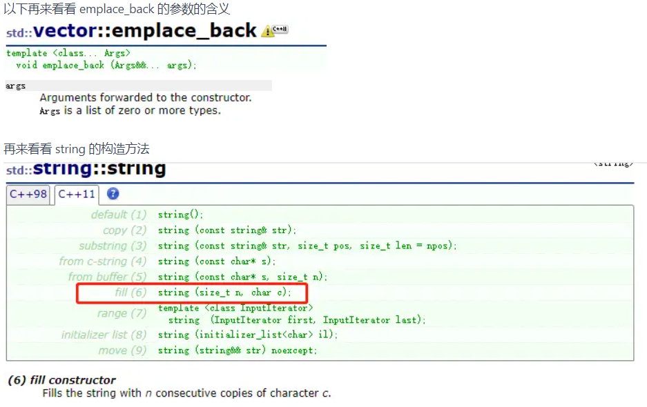

分析上面定义，可以得出：

```cpp
ans.emplace_back(1, i + 'a');
```

等价于

```cpp
ans.push_back(string(1, i + 'a'));
```

ans.emplace_back(1, i + 'a'); 会隐式的帮你调用 string() 参数的析构函数来创建一个 string 对象

### erase()

erase函数的原型如下：

（1）`string& erase(size_t pos = 0, size_t n = npos);`

（2）`interator erase(iterator position);`

（3）`iterator erase(iterator first, iterator last);`

有三种用法：

（1）`erase(pos, n);` 删除从pos开始的n个字符，例如erase( 0, 1)，删除0位置的一个字符，即删除第一个字符。

（2）`erase(position);` 删除position处的一个字符（position是个string类型的迭代器）。

（3）`erase(first，last);`删除从first到last之间的字符（first和last都是迭代器）。

```cpp

#include <iostream>
#include <string>
using namespace std;
 
int main ()
{
  string str ("This is an example phrase.");
  string::iterator it;
 
  // 第(1)种用法
  str.erase (10,8);
  cout << str << endl;        // "This is an phrase."
 
  // 第(2)种用法
  it=str.begin()+9;
  str.erase (it);
  cout << str << endl;        // "This is a phrase."
 
  // 第(3)种用法
  str.erase (str.begin()+5, str.end()-7);
  cout << str << endl;        // "This phrase."
  return 0;
}
 
 
 
erase()函数的功能是用来删除容器中的元素
 
删除某个容器里的某个元素：c.erase(T);
 
看似一个简单的动作，然而对不同类型的容器，内部却做了截然不同的事情，后面介绍。
假设有这样一个题目，将某个容器中所有满足条件N == X的元素删除，按照常规的思路应该有类似这样的代码：
// 假设Container和container分别表示一种容器和对应的一个对象
 
Container<T>::iterator it;
 
for (it = container.begin(); it != container.end(); ++it) {
 
  if (N == X)
 
    container.erase(it);
 
}
然而这样的代码对于任一种容器都是错误的
容器按内存分配方式可以分为链表容器和数组容器。
所谓的链
表容器指的是一种表现方式，包括list、slist等这样基于节点的容器（动态分配内存块）和set、map、multiset、multimap等关
联容器（平衡树实现），而数组容器指的是在一块连续的内存上保存元素的连续内存容器，比如vector、deque、string等。
链表容器
以list为例，当执行container.erase(it)时，确实第一个满足条件的元素删除了，但这时it指针已经被删除了，它也不指向任何元素
了，所以也只能到此为止了，也就是说上面的代码对于链表容器来说只能正确删除第一个满足条件的元素，针对这个问题我们首先想到的就是在删除指针之前，给其
做个备份。
将这个临时变量直接建立在erase实现里，这样做更简洁，也显得专业些。
list<int>::iterator it; 
 
  for (it = lt.begin(); it != lt.end(); ) {
 
    if (*it % 2 == 0)
 
      lt.erase(it++); //这里是关键
 
    else
 
      ++it;
 
  }
 
 
链表容器使用erase删除节点还有一个特点，就是会将下一个元素的地址返回，所以也可以这样实现：
list<int>::iterator it; 
 
  for (it = lt.begin(); it != lt.end(); ) {
 
    if (*it % 2 == 0)
 
      it = lt.erase(it);//自动返回下一个元素的地址，不用再主动前移指针
 
    else
 
      ++it;
 
  }
 
 
 
vector<int>::iterator it = v.begin();
 
  for (it = v.begin(); it != v.end(); ) { 
 
    if (*it % 2 == 0)
 
      v.erase(it);//删除元素后，后面元素自动往前移，不用挪动指                  
 
    else
 
      ++it;
 
  }
 
 网上有说在VS2005里面上面的v.erase(it)写法是行的  VS2008及2010却运行会出现错误 会出现
 
vector erase iterator outside range  最保险的做法是将v.erase(it)改成 it=v.erase(it)
```

### to_string()

```
res += to_string(root->val) + ' ';
```

将（）内的变量转换成string类型，需要包含头文件sting

### vector容器的resize()和reserve()

vector 的 reserve 增加了 vector 的 capacity ，但是它的 size 没有改变！而  resize 改变了 vector 的 capacity 同时也增加了它的 size ！

> 原因如下：
> reserve是容器预留空间，但在空间内不真正创建元素对象，所以在没有添加新的对象之前，不能引用容器内的元素。 加入新的元素时，要调用push_back() / insert()函数。
>
> resize是改变容器的大小，且在创建对象，因此，调用这个函数之后，就可以引用容器内的对象了， 因此当加入新的元素时，用operator[]操作符，或者用迭代器来引用元素对象。此时再调用push_back()函数，是加在这个新的空间后面的。

两个函数的参数形式也有区别的，reserve 函数之后一个参数，即需要预留的容器的空间；resize 函数可以有两个参数，第一个参数是容器新的大小， 第二个参数是要加入容器中的新元素，如果这个参数被省略，那么就调用元素对象的默认构造函数。

下面是这两个函数使用例子：

> 不管是调用resize还是reserve，二者对容器原有的元素都没有影响。

```cpp
vector<int> myVec;
myVec.reserve(100);     // 新元素还没有构造, 
                                       // 此时不能用[]访问元素
for (int i = 0; i < 100; i++)
{ 
     myVec.push_back(i); //新元素这时才构造
}
myVec.resize(102);      // 用元素的默认构造函数构造了两个新的元素
myVec[100] = 1;           //直接操作新元素
myVec[101] = 2;  
例子2：
#include <vector>
#include <iostream>
using namespace std;

int main(int argc, char* argv[])
{
    vector<int> vect;
    
    vect.push_back(1);
    vect.push_back(2);
    vect.push_back(3);
    vect.push_back(4);
    vect.reserve(100);
    cout << vect.size() << endl;  //size为4，但是capacity为100
    int i = 0;
    for (i = 0; i < 104; i++)
    {
        cout<<vect[i]<<endl;
    }
    return 0;
}
例子3：
#include <vector>
#include <iostream>
using namespace std;

int main(int argc, char* argv[])
{
    vector<int> vect;    
    vect.push_back(1);
    vect.push_back(2);
    vect.push_back(3);
    vect.push_back(4);
    vect.resize(100);    //新的空间不覆盖原有四个元素占有的空间，现在size和capacity都是100
    cout<<vect.size()<<endl;
    int i = 0;
    for (i = 0; i < 104; i++)
    {
        cout<<vect[i]<<endl;  
    }
    return 0;
}
例子4：
#include <vector>
#include <iostream>
using namespace std;

int main(int argc, char* argv[])
{
    vector<int> vect;        
    vect.resize(100);    //分配100个空间
    vect.push_back(1);
    vect.push_back(2);
    vect.push_back(3);
    vect.push_back(4);
    cout << vect.size() <<endl; //现在size和capacity都是104
    int i = 0;
    for (i = 0; i < 104; i++)
    {
        cout<<vect[i]<<endl;  
    }
    return 0;
}
```


## C++ 迭代器

1. 背景： 指针可以用来遍历**存储空间**连续的数据结构，但是对于存储空间费连续的，就需要寻找一个行为类似指针的类，来对非数组的数据结构进行遍历。
   **定义：迭代器是一种检查容器内元素并遍历元素的数据类型。**
   **迭代器提供对一个容器中的对象的访问方法，并且定义了容器中对象的范围**。
   **迭代器（Iterator）是指针（pointer）的泛化**，它允许程序员用相同的方式处理不同的数据结构（容器）。
   （1）迭代器类似于C语言里面的**指针类型**，它提供了对对象的间接访问。
   （2）指针是C语言中的知识点，迭代器是C++中的知识点。指针较灵活，迭代器功能较丰富。
   （3）迭代器提供一个对容器对象或者string对象的**访问方法，并定义了容器范围**。
2. 迭代器和指针的区别：
   容器和string有**迭代器类型**同时拥有**返回迭代器的成员**。如：容器有成员begin和end,其中begin成员复制返回指向第一个元素的迭代器，而end成员返回指向容器**尾元素的下一个位置的迭代器**，也就是说end指示的是一个不存在的元素，**所以end返回的是尾后迭代器**。
3. 容器迭代器的使用
   每种容器类型都定义了自己的迭代器类型，**如vector：vector< int>:: iterator iter**;//定义一个名为iter的变量，数据类型是由**vector< int>定义的iterator 类型**。简单说就是容器类定义了自己的**iterator类型**，用于访问容器内的元素。**每个容器定义了一种名为iterator的类型，这种类型支持迭代器的各种行为**。
   常用迭代器类型如下：
   
   如上图所示，迭代器类型主要支持两类，随机访问和双向访问。其中vector和deque支持随机访问，list,set,map等支持双向访问。
   1）随机访问：提供了对数组元素进行快速随机访问以及在序列尾部进行快速插入和删除操作。
   2)双向访问：插入和删除所花费的时间是固定的，与位置无关。
4. 迭代器的操作
   1、所有迭代器：
   
   2、双向迭代器：
   
   3、输入迭代器：
   
   4、输出迭代器
   
   5、随机迭代器
   
5. 使用方法

```cpp
#include <iostream>
#include <list>
#include <algorithm>
 
using namespace std;

 
int main()
{
　　list<int> list1;
　　for (int k=0;k<10;k++)
　　{
　　　　list1.push_back(k);
　　}
 
　　for (int k=0;k<10;k++)
　　{
　　　　list1.insert(list1.end(), k);
　　}
 
　　list<int>::iterator list_iter1;
　　for (list_iter1 = list1.begin();list_iter1 != list1.end();++list_iter1)
　　{
　　　　cout << *list_iter1 << " ";
　　}
　　cout << endl;
 
　　//find
　　list<int>::iterator list_iter2 = find(list1.begin(),list1.end(),2);
　　cout << *list_iter2 << endl;
 
　　system("pause");
　　return 0;
}
```

 


## C++ 引用

### 一、什么是引用

引用，顾名思义是某一个变量或对象的**别名**，对引用的操作与对其所绑定的变量或对象的操作完全等价

```
语法：类型 &引用名=目标变量名；
```

**特别注意：**

1.&不是求地址运算符，而是起标志作用

2.引用的类型必须和其所绑定的变量的类型相同

```
1 #include<iostream>
2 using namespace std;
3 int main(){
4     double a=10.3;
5     int &b=a; //错误，引用的类型必须和其所绑定的变量的类型相同
6     cout<<b<<endl;
7 }
```

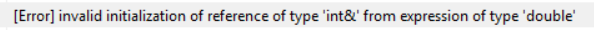

3.声明引用的同时**必须对其初始化**，否则系统会报错

```
1 #include<iostream>
2 using namespace std;
3 int main(){
4     int &a; //错误！声明引用的同时必须对其初始化
5     return 0;
6 }
```


4.引用相当于变量或对象的别名，因此**不能再将已有的引用名作为其他变量或对象的名字或别名**

5.引用不是定义一个新的变量或对象，因此**内存不会为引用开辟新的空间存储这个引用**

```
1 #include<iostream>
2 using namespace std;
3 int main(){
4     int value=10;
5     int &new_value=value;
6     cout<<"value在内存中的地址为："<<&value<<endl;
7     cout<<"new_value在内存中的地址为："<<&new_value<<endl;
8     return 0;
9 }
```

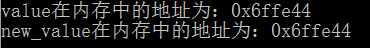

6.对数组的引用

```
语法：类型 (&引用名)[数组中元素数量]=数组名；
```

```
 1 #include<iostream>
 2 using namespace std;
 3 int main(){
 4     int a[3]={1,2,3};
 5     int (&b)[3]=a;//对数组的引用 
 6     cout<<&a[0]<<" "<<&b[0]<<endl;
 7     cout<<&a[1]<<" "<<&b[1]<<endl;
 8     cout<<&a[2]<<" "<<&b[2]<<endl;
 9     return 0;
10 }
```

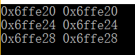

7.对指针的引用

```
语法：类型 *&引用名=指针名;//可以理解为：（类型*） &引用名=指针名，即将指针的类型当成类型*
```

```
1 #include<iostream>
2 using namespace std;
3 int main(){
4     int a=10;
5     int *ptr=&a;
6     int *&new_ptr=ptr;
7     cout<<&ptr<<" "<<&new_ptr<<endl;
8     return 0; 
9 }
```

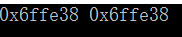

### 二、引用的应用

#### A.引用作为函数的参数

```
 1 #include<iostream>
 2 using namespace std;
 3 void swap(int &a,int &b){//引用作为函数的参数
 4     int temp=a;
 5     a=b;
 6     b=temp; 
 7 }
 8 int main(){
 9     int value1=10,value2=20;
10     cout<<"----------------------交换前----------------------------"<<endl;
11     cout<<"value1的值为："<<value1<<endl; 
12     cout<<"value2的值为："<<value2<<endl;
13     swap(value1,value2); 
14     cout<<"----------------------交换后----------------------------"<<endl;
15     cout<<"value1的值为："<<value1<<endl; 
16     cout<<"value2的值为："<<value2<<endl;
17     return 0;
18 }
```

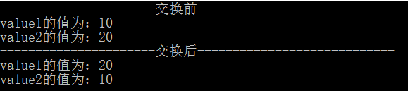

**特别注意：**

1.当用引用作为函数的参数时，其效果**和用指针作为函数参数的效果相当**。当调用函数时，函数中的形参就会被当成实参变量或对象的一个别名来使用，也就是说**此时函数中对形参的各种操作实际上是对实参本身进行操作，而非简单的将实参变量或对象的值拷贝给形参**。

2.通常函数调用时，系统采用值传递的方式将实参变量的值传递给函数的形参变量。此时，系统会在内存中开辟空间用来存储形参变量，并将实参变量的值拷贝给形参变量，也就是说形参变量只是实参变量的副本而已；并且如果函数传递的是类的对象，系统还会调用类中的拷贝构造函数来构造形参对象。而==**使用引用作为函数的形参时，由于此时形参只是要传递给函数的实参变量或对象的别名而非副本，故系统不会耗费时间来在内存中开辟空间来存储形参**。==因此**如果参数传递的数据较大时，建议使用引用作为函数的形参，这样会提高函数的时间效率，并节省内存空间**。

3.使用指针作为函数的形参虽然达到的效果和使用引用一样，但==**当调用函数时仍需要为形参指针变量在内存中分配空间**==，而引用则不需要这样，故==**在C++中推荐使用引用而非指针作为函数的参数**==

4.**如果在编程过程中既希望通过让引用作为函数的参数来提高函数的编程效率，又希望保护传递的参数使其在函数中不被改变，则此时应当使用==对常量的引用作为函数的参数==。**

5.数组的引用作为函数的参数：C++的数组类型是带有长度信息的，**==引用传递时如果指明的是数组则必须指定数组的长度==**

```
 1 #include<iostream>
 2 using namespace std;
 3 void func(int(&a)[5]){ //数组引用作为函数的参数，必须指明数组的长度 
 4 //函数体 
 5 }
 6 int main(){
 7     int number[5]={0,1,2,3,4};
 8     func(number); 
 9     return 0; 
10  }
```

####  B.常引用

```
语法：const 类型 &引用名=目标变量名；
```

**常引用不允许通过该引用对其所绑定的变量或对象进行修改**

```
1 #include<iostream>
2 using namespace std;
3 int main(){
4     int a=10;
5     const int &new_a=a;
6     new_a=11;//错误！不允许通过常引用对其所绑定的变量或对象进行修改 
7     return 0;
8 }
```

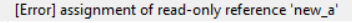

**特别注意：**

先看下面的例子

```
 1 #include<iostream>
 2 #include<string> 
 3 using namespace std;
 4 string func1(){
 5     string temp="This is func1";
 6     return temp;
 7 }
 8 void func2(string &str){
 9     cout<<str<<endl;
10 }
11 int main(){
12     func2(func1());
13     func2("Tomwenxing");
14     return 0;
15 }
```

运行上面的程序编译器会报错


这是由于==func1()和“Tomwenxing”都会在系统中产生一个临时对象（string对象）来存储它们==，而==**在C++中所有的临时对象都是const类型的**==，而上面的程序试图将const对象赋值给非const对象，这必然会使程序报错。如果在函数func2的参数前添加const，则程序便可正常运行了

```
 1 #include<iostream>
 2 #include<string> 
 3 using namespace std;
 4 string func1(){
 5     string temp="This is func1";
 6     return temp;
 7 }
 8 void func2(const string &str){
 9     cout<<str<<endl;
10 }
11 int main(){
12     func2(func1());
13     func2("Tomwenxing");
14     return 0;
15 }
```


#### C.引用作为函数的返回值

```
语法：类型 &函数名（形参列表）{ 函数体 }
```

**特别注意：**

1.引用作为函数的返回值时，**必须在定义函数时在函数名前加&**

2.用引用作函数的返回值的**最大的好处是在内存中不产生返回值的副本**

```
 1 //代码来源：RUNOOB
 2 #include<iostream>
 3 using namespace std;
 4 float temp;
 5 float fn1(float r){
 6     temp=r*r*3.14;
 7     return temp;
 8 } 
 9 float &fn2(float r){ //&说明返回的是temp的引用，换句话说就是返回temp本身
10     temp=r*r*3.14;
11     return temp;
12 }
13 int main(){
14     float a=fn1(5.0); //case 1：返回值
15     //float &b=fn1(5.0); //case 2:用函数的返回值作为引用的初始化值 [Error] invalid initialization of non-const reference of type 'float&' from an rvalue of type 'float'                           //（有些编译器可以成功编译该语句，但会给出一个warning） 
16     float c=fn2(5.0);//case 3：返回引用
17     float &d=fn2(5.0);//case 4：用函数返回的引用作为新引用的初始化值18     cout<<a<<endl;//78.5
19     //cout<<b<<endl;//78.5
20     cout<<c<<endl;//78.5
21     cout<<d<<endl;//78.5
22     return 0;
23 }
```

**case 1：用返回值方式调用函数（如下图，图片来源：伯乐在线）：**

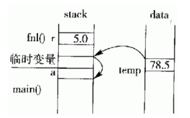

**返回全局变量temp的值时，C++会在内存中创建临时变量并将temp的值拷贝给该临时变量。当返回到主函数main后，赋值语句a=fn1(5.0)会把临时变量的值再拷贝给变量a**

**case 2：用函数的返回值初始化引用的方式调用函数（如下图，图片来源：伯乐在线）**

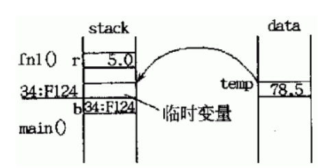

**这种情况下，函数fn1()是以值方式返回到，返回时，首先拷贝temp的值给临时变量。返回到主函数后，用临时变量来初始化引用变量b，使得b成为该临时变量到的别名。由于临时变量的作用域短暂（在C++标准中，临时变量或对象的生命周期在一个完整的语句表达式结束后便宣告结束，也就是在语句float &b=fn1(5.0);之后） ，所以b面临无效的危险，很有可能以后的值是个无法确定的值。**

**如果真的希望用函数的返回值来初始化一个引用，应当先创建一个变量，将函数的返回值赋给这个变量，然后再用该变量来初始化引用：**

```
1 int x=fn1(5.0);
2 int &b=x;
```

 **case 3:用返回引用的方式调用函数（如下图，图片来源：伯乐在线）**

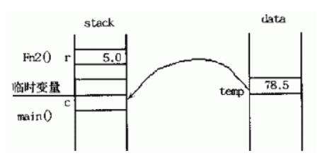

**这种情况下，函数fn2()的返回值不产生副本，而是直接将变量temp返回给主函数，即主函数的赋值语句中的左值是直接从变量temp中拷贝而来（也就是说c只是变量temp的一个拷贝而非别名） ，这样就避免了临时变量的产生。尤其当变量temp是一个用户自定义的类的对象时，这样还避免了调用类中的拷贝构造函数在内存中创建临时对象的过程，提高了程序的时间和空间的使用效率。**

**case 4:用函数返回的引用作为新引用的初始化值的方式来调用函数（如下图，图片来源：伯乐在线）**

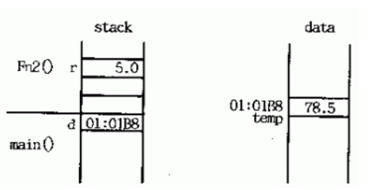

**这种情况下，函数fn2()的返回值不产生副本，而是直接将变量temp返回给主函数。在主函数中，一个引用声明d用该返回值初始化，也就是说此时d成为变量temp的别名。由于temp是全局变量，所以在d的有效期内temp始终保持有效，故这种做法是安全的。**

3.**不能返回局部变量的引用。**如上面的例子，如果temp是局部变量，那么它会在函数返回后被销毁，此时对temp的引用就会成为“无所指”的引用，程序会进入未知状态。

4.**不能返回函数内部通过new分配的内存的引用**。虽然不存在局部变量的被动销毁问题，但如果被返回的函数的引用只是作为一个临时变量出现，而没有将其赋值给一个实际的变量，那么就可能造成这个引用所指向的空间（有new分配）无法释放的情况（由于没有具体的变量名，故无法用delete手动释放该内存），从而造成内存泄漏。因此应当避免这种情况的发生

5**当返回类成员的引用时，最好是const引用**。这样可以避免在无意的情况下破坏该类的成员。

6.可以用函数返回的引用作为赋值表达式中的左值

```
 1 #include<iostream>
 2 using namespace std;
 3 int value[10];
 4 int error=-1;
 5 int &func(int n){
 6     if(n>=0&&n<=9)
 7         return value[n];//返回的引用所绑定的变量一定是全局变量，不能是函数中定义的局部变量 
 8     else
 9         return error;
10 }
11 
12 int main(){
13     func(0)=10;
14     func(4)=12;
15     cout<<value[0]<<endl;
16     cout<<value[4]<<endl;
17     return 0; 
18 }
```

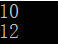

#### D.用引用实现多态

在C++中，**引用是除了指针外另一个可以产生多态效果的手段**。也就是说一个基类的引用可以用来绑定其派生类的实例

```
class Father;//基类（父类）
class Son：public Father{.....}//Son是Father的派生类
Son son;//son是类Son的一个实例
Father &ptr=son;//用派生类的对象初始化基类对象的使用
```

**特别注意：**

**ptr只能用来访问派生类对象中从基类继承下来的成员**。**如果基类（类Father）中定义的有虚函数，那么就可以通过在派生类（类Son）中重写这个虚函数来实现类的多态。**

### 三、总结

1.在引用的使用中，单纯给某个变量起别名是毫无意义的，**引用的目的主要用于在函数参数的传递中，解决大块数据或对象的传递效率和空间不如意的问题**

2.用引用传递函数的参数，能**保证参数在传递的过程中不产生副本**，从而提高传递效率，同时**通过const的使用，还可以保证参数在传递过程中的安全性**

3.引用本身是目标变量或对象的别名，对引用的操作本质上就是对目标变量或对象的操作。因此**能使用引用时尽量使用引用而非指针**


## for(auto x : num) 语法

C++11新增了一种循环：基于范围的for循环，这简化了一种常见的循环任务：对数组和容器类（eg:array和vector）的每个元素都执行相同的操作

```cpp
for (auto x : nums)
```

作用就是迭代容器中所有的元素，每一个元素的临时名字就是x，等同于下边代码

```cpp
for (vector<int>::iterator iter = nums.begin(); iter != nums.end(); iter++)
```

**语法形式**

```cpp
for(数据类型 变量 : 序列)
	循环语句
```

- **序列**
- 可以是花括号括起来的初始值列表、数组、`vector`、`string`，这些类型的特点是拥有能返回迭代器的 `begin` 和 `end`成员

- **数据类型：变量**
- 序列中的每个元素都能转换成该变量的类型，最简单的方法是使用`auto`类型说明符。
- ==若需要对序列中的元素进行写操作，则需要声明成引用类型`&`。==

【示例1】

```cpp
#include <iostream>
using namespace std;
int main(){    
    int num[5]={1,2,3,4,5};    
    for(auto x:num)        
       cout<<x<<endl;    
    return 0;
}
```

【示例2】

```cpp
#include <iostream>
using namespace std;
int main(){    
string s;    
cin>>s;    
cout<<s<<endl;    
for (auto &c : s)        
    c=toupper(c);    
cout<<s<<endl;
}
```

【示例3】

```cpp
#include <iostream>
using namespace std;
int main(){    
    for(auto x:{1,2,3,4,5})      
    cout<<x<<endl;
}
```

【示例4】下面的例子将vector对象中的每个元素都翻倍

```cpp
vector<int>v={0,1,2,3,4};
//因为要对v中的元素进行写操作，所以是引用类型
for(auto &r : v)
	r*= 2;
```

#### 关于是否要加 `&` 

- 不加引用是取值，加引用是取引用（相当于指针）。
- 如果数组中的对象不大（比如 int，char 等），以及明确要求不修改数组本身，则可以不加引用，每次取值拷贝。
- 如果数组中的对象很大，或者想要修改，则需要取引用。


## STL容器当作参数传递

### 1、STL容器类自带的拷贝构造函数和符号“=”对容器进行深拷贝

常见的STL容器包括：vector，deque，list，set，multiset，map，multimap，stack，queue，priority_queue。

将STL容器当作参数传递给函数时，如果是值传递，则会自动调用STL容器的拷贝构造函数，如下面的程序片段。

```cpp
vector<int> a;
...
void function(vector<int> a) {
	//a的作用域仅仅是函数范围
	//使用深拷贝在内存中重新分配了空间
	//在这里改变a的值不影响function外a的值
	...
}
//即使function中改了a的值，此处a没有任何变化
```

> vector的拷贝构造函数会根据传进来的vector开辟相同的空间，然后将传进来的vector的元素一个一个拷贝到新的vector中。在逐个拷贝元素的过程中，如果该元素不是int型，而是一个自定义的类，那么必须使用该自定义的类的拷贝构造函数。那么，此时是否为深拷贝，取决于该自定义的类是否重写了拷贝构造函数。
>
> 除了STL容器外，string类自带的拷贝构造函数也是深拷贝。

### 2、使用上述的容器或者string作为函数的参数时，引用传递和值传递的区别

值传递示意图：

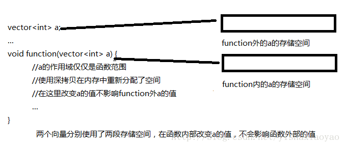

引用传递示意图：

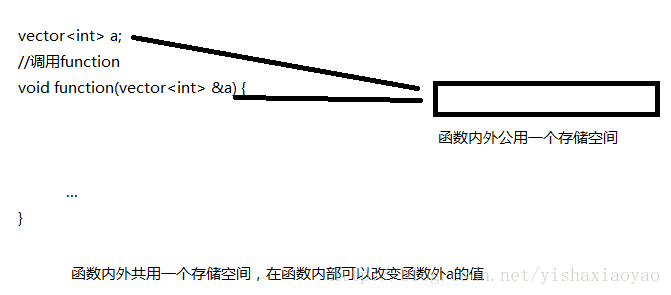


## 内联函数

### 1、为什么要用内联函数?

在C++中我们通常定义以下函数来求两个整数的最大值：

```cpp
int max(int a, int b)
{
    return a > b ? a : b;
}
```

为这么一个小的操作定义一个函数的好处有：

① 阅读和理解函数 max 的调用，要比读一条等价的条件表达式并解释它的含义要容易得多

② 如果需要做任何修改，修改函数要比找出并修改每一处等价表达式容易得多

**③ **使用函数可以确保统一的行为，每个测试都保证以相同的方式实现

**④ **函数可以重用，不必为其他应用程序重写代码

**虽然有这么多好处，但是写成函数有一个潜在的缺点：调用函数比求解等价表达式要慢得多。在大多数的机器上，调用函数都要做很多工作：调用前要先保存寄存器，并在返回时恢复，复制实参，程序还必须转向一个新位置执行**

**C++中支持内联函数，其目的是为了提高函数的执行效率，用关键字 inline 放在函数定义(注意是定义而非声明，下文继续讲到)的前面即可将函数指定为内联函数，内联函数通常就是将它在程序中的每个调用点上“内联地”展开，假设我们将 max 定义为内联函数：**

```c
inline int max(int a, int b)
{
    return a > b ? a : b;
}
```

 **则调用： cout << max(a, b) << endl;** 

**在编译时展开为： cout << (a > b ? a : b) << endl; 从而消除了把 max写成函数的额外执行开销。**

### 2、内联函数和宏

1、宏容易出错；

2、宏不可调试；

3、宏无法操作类的私有对象；

4、内联函数可以更加深入的优化**；**

### 3. 将内联函数放入头文件

关键字 inline 必须与函数定义体放在一起才能使函数成为内联，仅将 inline 放在函数声明前面不起任何作用。

如下风格的函数 Foo 不能成为内联函数：

```c
inline void Foo(int x, int y);   // inline 仅与函数声明放在一起   
void Foo(int x, int y)
{
    //...
} 
```

 而如下风格的函数 Foo 则成为内联函数：

```c
void Foo(int x, int y);   
inline void Foo(int x, int y)   // inline 与函数定义体放在一起
```

所以说，**C++ inline函数是一种“用于实现的关键字”，而不是一种“用于声明的关键字”。**一般地，用户可以阅读函数的声明，但是看不到函数的定义。

尽管在大多数教科书中内联函数的声明、定义体前面都加了 inline 关键字，但我认为 inline 不应该出现在函数的声明中。这个细节虽然不会影响函数的功能，但是体现了**高质量C++/C 程序设计风格的一个基本原则：声明与定义不可混为一谈，用户没有必要、也不应该知道函数是否需要内联。**

==定义在类声明之中的成员函数将自动地成为内联函数==，例如：

```
class A
{  
public:
    void Foo(int x, int y) { ... }   // 自动地成为内联函数  
} 
```

但是编译器是否将它真正内联则要看 Foo函数如何定义

==内联函数应该在头文件中定义，这一点不同于其他函数。==**编译器在调用点内联展开函数的代码时，必须能够找到 inline 函数的定义才能将调用函数替换为函数代码，而对于在头文件中仅有函数声明是不够的。**

当然内联函数定义也可以放在源文件中，但此时只有定义的那个源文件可以用它，而且必须为每个源文件拷贝一份定义(即每个源文件里的定义必须是完全相同的)，当然即使是放在头文件中，也是对每个定义做一份拷贝，只不过是编译器替你完成这种拷贝罢了。但相比于放在源文件中，放在头文件中既能够确保调用函数是定义是相同的，又能够保证在调用点能够找到函数定义从而完成内联(替换)。

但是你会很奇怪，重复定义那么多次，不会产生链接错误？

 我们来看一个例子：

```cpp
// 文件A.h 代码如下:
```

```
class A
{
public:
    A(int a, int b) : a(a),b(b){}
    int max();
private:
    int a;
    int b;
};
```

```cpp
// 文件A.cpp 代码如下:
#include "A.h"
inline int A::max()
{
    return a > b ? a : b;
}
// 文件Main.cpp 代码如下:
```

```
#include <iostream>
#include "A.h"
using namespace std;
inline int A::max()
{
    return a > b ? a : b;
}

int main()
{
    A a(3, 5);
    cout << a.max() << endl;
    return 0;
}
```

一切正常编译，`输出结果：5`

倘若你在Main.cpp中没有定义max内联函数，那么会出现链接错误： 
`error LNK2001: unresolved external symbol "public: int __thiscall A::max(void)" (?max@A@@QAEHXZ)main.obj` 
找不到函数的定义，所以内联函数可以在程序中定义不止一次，只要 inline 函数的定义在某个源文件中只出现一次，而且在所有源文件中，其定义必须是完全相同的就可以。

在头文件中加入或修改 inline 函数时，使用了该头文件的所有源文件都必须重新编译。

### 4. 慎用内联

“如果所有的函数都是内联函数，还用得着“内联”这个关键字吗？

  **内联是以代码膨胀（复制）为代价，仅仅省去了函数调用的开销，从而提高函数的执行效率。**如果执行函数体内代码的时间，相比于函数调用的开销较大，那么效率的收获会很少。另一方面，每一处内联函数的调用都要复制代码，将使程序的总代码量增大，消耗更多的内存空间。以下情况不宜使用内联：

（1）如果函数体内的代码比较长，使用内联将导致内存消耗代价较高。

（2）如果函数体内出现循环，那么执行函数体内代码的时间要比函数调用的开销大。

类的构造函数和析构函数容易让人误解成使用内联更有效。要当心构造函数和析构函数可能会隐藏一些行为，如“偷偷地”执行了基类或成员对象的构造函数和析构函数。所以不要随便地将构造函数和析构函数的定义体放在类声明中。”

————《高质量程序设计指南——C++/C语言》 林锐

>  而在Google C++编码规范中则规定得更加明确和详细：
>
> #### 内联函数：
>
> #### Tip： 只有当函数只有 10 行甚至更少时才将其定义为内联函数.
>
> 定义: 当函数被声明为内联函数之后, 编译器会将其内联展开, 而不是按通常的函数调用机制进行调用. 
> 优点: 当函数体比较小的时候, 内联该函数可以令目标代码更加高效. 对于存取函数以及其它函数体比较短, 性能关键的函数, 鼓励使用内联. 
> 缺点: 滥用内联将导致程序变慢. 内联可能使目标代码量或增或减, 这取决于内联函数的大小. 内联非常短小的存取函数通常会减少代码大小, 但内联一个相当大的函数将戏剧性的增加代码大小. 现代处理器由于更好的利用了指令缓存, 小巧的代码往往执行更快。 
> 结论: 一个较为合理的经验准则是, 不要内联超过 10 行的函数. 谨慎对待析构函数, 析构函数往往比其表面看起来要更长, 因为有隐含的成员和基类析构函数被调用! 
> 另一个实用的经验准则: 内联那些包含循环或 switch 语句的函数常常是得不偿失 (除非在大多数情况下, 这些循环或 switch 语句从不被执行). 
> 有些函数即使声明为内联的也不一定会被编译器内联, 这点很重要; 比如虚函数和递归函数就不会被正常内联. 通常, 递归函数不应该声明成内联函数.(递归调用堆栈的展开并不像循环那么简单, 比如递归层数在编译时可能是未知的, 大多数编译器都不支持内联递归函数). 虚函数内联的主要原因则是想把它的函数体放在类定义内, 为了图个方便, 抑或是当作文档描述其行为, 比如精短的存取函数.
>
> -inl.h文件：
>
> #### Tip： 复杂的内联函数的定义, 应放在后缀名为 -inl.h 的头文件中.
>
> 内联函数的定义必须放在头文件中, 编译器才能在调用点内联展开定义. 然而, 实现代码理论上应该放在 .cc 文件中, 我们不希望 .h 文件中有太多实现代码, 除非在可读性和性能上有明显优势.
>
> 如果内联函数的定义比较短小, 逻辑比较简单, 实现代码放在 .h 文件里没有任何问题. 比如, 存取函数的实现理所当然都应该放在类定义内. 出于编写者和调用者的方便, 较复杂的内联函数也可以放到 .h 文件中, 如果你觉得这样会使头文件显得笨重, 也可以把它萃取到单独的 -inl.h 中. 这样把实现和类定义分离开来, 当需要时包含对应的 -inl.h 即可。


## c++中（:）和（::）的用法

#### 1.（:）的用法

（1）表示机构内位域的定义（即该变量占几个bit空间）。

```cpp
typedef struct _XXX{
unsigned char a:4;
unsigned char c;
}; XXX
```

（2）构造函数后面的冒号起分割作用，是类给成员变量赋值的方法，初始化列表，更适用于成员变量的常量const型。

```cpp
struct _XXX{
_XXX() : y(0xc0) {}
};
```

 （3）`public:`和`private:`后面的冒号，表示后面定义的所有成员都是公有或私有的，直到下一个`"public:”`或`"private:”`出现为止。`"private:"`为默认处理。

（4）类名冒号后面的是用来定义类的继承。

```cpp
class 派生类名 : 继承方式 基类名
{
派生类的成员
};
```

继承方式：public、private和protected，默认处理是public。

#### 2．双冒号（::）用法

（1）表示“域操作符”

- 例：声明了一个类A，类A里声明了一个成员函数`void f()`，但没有在类的声明里给出f的定义，那么在类外定义f时， 就要写成`void A::f()`，表示这个`f()`函数是类A的成员函数。

（2）直接用在全局函数前，表示是全局函数 

- 例：在VC里，你可以在调用API 函数里，在API函数名前加`：：`

（3）表示引用成员函数及变量，作用域成员运算符

- 
  例：`System::Math::Sqrt()` 相当于`System.Math.Sqrt()`


## 运算符优先级和结合性一览表

| 优先级 | 运算符           | 名称或含义              | 使用形式                  | 结合方向 | 说明       |
| ------ | ---------------- | ----------------------- | ------------------------- | -------- | ---------- |
| 1      | []               | 数组下标                | 数组名[常量表达式]        | 左到右   |            |
| ()     | 圆括号           | (表达式) 函数名(形参表) |                           |          |            |
| .      | 成员选择（对象） | 对象.成员名             |                           |          |            |
| ->     | 成员选择（指针） | 对象指针->成员名        |                           |          |            |
| 2      | -                | 负号运算符              | -表达式                   | 右到左   | 单目运算符 |
| (类型) | 强制类型转换     | (数据类型)表达式        |                           |          |            |
| ++     | 自增运算符       | ++变量名 变量名++       | 单目运算符                |          |            |
| --     | 自减运算符       | --变量名 变量名--       | 单目运算符                |          |            |
| *      | 取值运算符       | *指针变量               | 单目运算符                |          |            |
| &      | 取地址运算符     | &变量名                 | 单目运算符                |          |            |
| !      | 逻辑非运算符     | !表达式                 | 单目运算符                |          |            |
| ~      | 按位取反运算符   | ~表达式                 | 单目运算符                |          |            |
| sizeof | 长度运算符       | sizeof(表达式)          |                           |          |            |
| 3      | /                | 除                      | 表达式 / 表达式           | 左到右   | 双目运算符 |
| *      | 乘               | 表达式*表达式           | 双目运算符                |          |            |
| %      | 余数（取模）     | 整型表达式%整型表达式   | 双目运算符                |          |            |
| 4      | +                | 加                      | 表达式+表达式             | 左到右   | 双目运算符 |
| -      | 减               | 表达式-表达式           | 双目运算符                |          |            |
| 5      | <<               | 左移                    | 变量<<表达式              | 左到右   | 双目运算符 |
| >>     | 右移             | 变量>>表达式            | 双目运算符                |          |            |
| 6      | >                | 大于                    | 表达式>表达式             | 左到右   | 双目运算符 |
| >=     | 大于等于         | 表达式>=表达式          | 双目运算符                |          |            |
| <      | 小于             | 表达式<表达式           | 双目运算符                |          |            |
| <=     | 小于等于         | 表达式<=表达式          | 双目运算符                |          |            |
| 7      | ==               | 等于                    | 表达式==表达式            | 左到右   | 双目运算符 |
| !=     | 不等于           | 表达式!= 表达式         | 双目运算符                |          |            |
| 8      | &                | 按位与                  | 表达式&表达式             | 左到右   | 双目运算符 |
| 9      | ^                | 按位异或                | 表达式^表达式             | 左到右   | 双目运算符 |
| 10     | \|               | 按位或                  | 表达式\|表达式            | 左到右   | 双目运算符 |
| 11     | &&               | 逻辑与                  | 表达式&&表达式            | 左到右   | 双目运算符 |
| 12     | \|\|             | 逻辑或                  | 表达式\|\|表达式          | 左到右   | 双目运算符 |
| 13     | ?:               | 条件运算符              | 表达式1? 表达式2: 表达式3 | 右到左   | 三目运算符 |
| 14     | =                | 赋值运算符              | 变量=表达式               | 右到左   |            |
| /=     | 除后赋值         | 变量/=表达式            |                           |          |            |
| *=     | 乘后赋值         | 变量*=表达式            |                           |          |            |
| %=     | 取模后赋值       | 变量%=表达式            |                           |          |            |
| +=     | 加后赋值         | 变量+=表达式            |                           |          |            |
| -=     | 减后赋值         | 变量-=表达式            |                           |          |            |
| <<=    | 左移后赋值       | 变量<<=表达式           |                           |          |            |
| >>=    | 右移后赋值       | 变量>>=表达式           |                           |          |            |
| &=     | 按位与后赋值     | 变量&=表达式            |                           |          |            |
| ^=     | 按位异或后赋值   | 变量^=表达式            |                           |          |            |
| \|=    | 按位或后赋值     | 变量\|=表达式           |                           |          |            |
| 15     | ,                | 逗号运算符              | 表达式,表达式,…           | 左到右   |            |

上表中可以总结出如下规律：

1. 结合方向只有三个是从右往左，其余都是从左往右。
2. 所有双目运算符中只有赋值运算符的结合方向是从右往左。
3. 另外两个从右往左结合的运算符也很好记，因为它们很特殊：一个是单目运算符，一个是三目运算符。
4. C语言中有且只有一个三目运算符。
5. 逗号运算符的优先级最低，要记住。
6. 此外要记住，对于优先级：算术运算符 > 关系运算符 > 逻辑运算符 > 赋值运算符。逻辑运算符中“逻辑非 !”除外。

#### 一些容易出错的优先级问题

上表中，优先级同为1 的几种运算符如果同时出现，那怎么确定表达式的优先级呢？这是很多初学者迷糊的地方。下表就整理了这些容易出错的情况：

| 优先级问题                                    | 表达式               | 经常误认为的结果                                        | 实际结果                                                     |
| --------------------------------------------- | -------------------- | ------------------------------------------------------- | ------------------------------------------------------------ |
| . 的优先级高于 *（-> 操作符用于消除这个问题） | *p.f                 | p 所指对象的字段 f，等价于： (*p).f                     | 对 p 取 f 偏移，作为指针，然后进行解除引用操作，等价于： *(p.f) |
| [] 高于 *                                     | int *ap[]            | ap 是个指向 int 数组的指针，等价于： int (*ap)[]        | ap 是个元素为 int 指针的数组，等价于： int *(ap [])          |
| 函数 () 高于 *                                | int *fp()            | fp 是个函数指针，所指函数返回 int，等价于： int (*fp)() | fp 是个函数，返回 int*，等价于： int* ( fp() )               |
| == 和 != 高于位操作                           | (val & mask != 0)    | (val &mask) != 0                                        | val & (mask != 0)                                            |
| == 和 != 高于赋值符                           | c = getchar() != EOF | (c = getchar()) != EOF                                  | c = (getchar() != EOF)                                       |
| 算术运算符高于位移 运算符                     | msb << 4 + lsb       | (msb << 4) + lsb                                        | msb << (4 + lsb)                                             |
| 逗号运算符在所有运 算符中优先级最低           | i = 1, 2             | i = (1,2)                                               | (i = 1), 2     逗号表达式的值为2                             |


## vector中二维数组的遍历

#### 迭代器遍历

```cpp
void reverse_iterator(vector<vector<int>> vec)
{
    vecotr<int>::iterator it;
    vector<vector<int>>::iterator iter;
    vector<int> vec_tmp;
    
    for (iter = vec.begin(); iter != vec.end(); iter++)
    {
        vec_tmp = *iter;
        for (it = vec_tmp.begin(); it != vec_tmp.end(); it++)
            cout << *it << " ";
        cout << endl;
    }
}
```

```cpp
void reverse_iterator(vector<vector<int>> vec)
{
    for (vector<vector<int>>::iterator it = vec.begin(); it != vec.end(); it++)
        for (vector<int>:: iterator iter = (*it).begin(); iter != (*it).end(); iter++)
        {
            cout << *iter << " ";
        }
}
```

#### 下标遍历

```cpp
void reverse_index(vector<vector<int>> vec)
{
    for (int i = 0; i < vec.size(); i++)
    {
        for (int j = 0; j < vec[i].size(); j++)
            cout << vec[i][j] << " ";
        cout << endl;
    }
}
```


## 反向迭代器

begin和end操作产生指向容器内第一个元素和最后一个元素的下一个位置的迭代器，如下所示。

这两个迭代器通常用于标记包含容器中所有元素的迭代范围。

- c.begin() 返回一个迭代器，它指向容器c的第一个元素
- c.end() 返回一个迭代器，它指向容器c的最后一个元素的下一个位置
- c.rbegin() 返回一个逆序迭代器，它指向容器c的最后一个元素
- c.rend() 返回一个逆序迭代器，它指向容器c的第一个元素前面的位置

上述每个操作都有两个不同的版本：一个是const成员，另一个是非const成员。这些操作返回什么类型取决于容器是否为const。如果容器不是const，则这些操作返回iterator或reverse_iterator类型。如果容器是const，则其返回类型要加上const_前缀，也就是const_iterator和const_reverse_iterator类型。

> 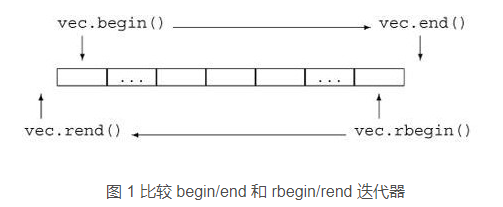


## NULL和nullptr类型区别

1. **nullptr和NULL类型区别**

- NULL是一个无类型的东西，而且是一个宏。
  - 在C中，习惯将NULL定义为void*指针值0，但同时，也允许将NULL定义为整常数0
  - 在C++中，NULL却被明确定义为整常数0

- nullptr是有类型的（放了在stddef头文件中），类型是 typdef decltype(nullptr) nullptr_t;

2. **C++中NULL使用存在的问题**

- 在c语言环境下，由于不存在函数重载等问题，直接将NULL定义为一个void*的指针就可以完美的解决一切问题。
- 在c++环境下情况就复杂起来， 首先我们将void*直接赋值给一个指针是不合法的，编译器会报错。有重载或者模板推导的时候，编译器就无法给出正确结果。
  - 根本原因和C++的重载函数有关。C++通过搜索匹配参数的机制，试图找到最佳匹配（best-match）的函数，而如果继续支持void*的隐式类型转换，则会带来语义二义性（syntax ambiguous）的问题。


3. **nullptr的应用：**

- 如果我们的编译器是支持nullptr的话，那么我们应该直接使用nullptr来替代NULL的宏定义。正常使用过程中他们是完全等价的。
- 0（NULL）和nullptr可以交换使用
- 不能将nullptr赋值给整形


## 逗号表达式

- ==逗号表达式的运算过程为:从左往右逐个计算表达式。==
- ==逗号表达式作为一个整体,它的值为最后一个表达式的值。==
- 逗号运算符的优先级别在所有运算符中最低。

逗号表达式的求解过程是：先求表达式一，再求表达式二，即从左向右算。整个逗号表达式的值是表达式二的值。如a=3*5，a*4，经计算和赋值后得到a的值为15，然后求解a*4，得60.整个逗号表达式的值为60.

> 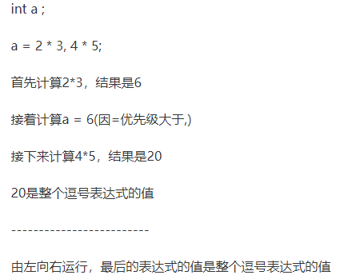


## 段错误 - 原因汇总

#### 一、段错误究根到底就是访问了非法内存：

这个内存区要么是不存在的，要么 是受到系统保护的，还有可能是缺少文件或者文件损坏。

可能的原因包括：
访问代码段（原因经常是指针未初始化指向了错误的位置或解引用空指针）、访问寄存器

> 例子1：解引用空指针 `int *p=NULL; printf("%d\n",*p);`       //因为内存低地址为代码段，不可访问
> 例子2：访问含有非法值得内存 `register int p =10; printf("%d\n",*p);` //由于register关键字使变量存储到内核寄存器中，因此不能访问。
> 野指针：即定义指针时并未对其初始化，其指向的的位置式未知的。对野指针解引用可能造成段错误或者导致程序崩溃。
> 防止方案：
>
> 1. 定义时初始化为NULL 
> 2. 解引用前赋值 
> 3. 使用完后指向NULL 每次使用指针之前记得赋值就好了

#### 二、数组越界

如：当使用malloc申请了一页内存，但使用却超出了。 越过数组边界写入数据，在动态分配的内存两端之外写入数据，或改写一些堆管 理数据结构（在动态分配的内存之前的区域写入数据）。

堆中：`p = malloc(256); p[-1] = 0; p[256] = 0;` //访问了未知空间的内存
栈中：`int *p=NULL; int a[6]; p=a; for(int i=0;i<10;i++){*p++=i;}` //stack smashing detected 访问了未知空间的内存

#### 三、scanf错误使用：

`int b; scanf("%d",b);`//应为scanf("%d",&b);

#### 四、指针访问只读内存区：

如：`char *p=“abcddf”; *p=‘A’;` //其实本质上错误原因和解引用空指针类似，“abcddf”在被定义时放在了代码段或常量区。//解决方法是将字符串存到数组中，再将指针指向数组头

##### 这里补充一下程序运行时内存分配：

1. 栈区：存放函数运行时产生的临时变量，局部变量、函数的入口参数，返回值和const定义的局部变量，函数结束后由编译器释放。

2. 堆区：用于存放程序运行时被动态分配的内存段，一般由程序员手动申请释放malloc申请，free释放。

3. 全局区（静态区）：全局区用来存储全局变量，主要分为两个段：

   - bss段：该段用于存放未初始化或者初始化为0的全局变量和静态变量（static）

   - data段：又叫数据段，用于存储初始化不为0的全局变量和静态变量、const定义的全局变量（在.rodata段）
     该段在程序结束后由系统释放。

   - 常量区：常量字符串就是放在这里的。 程序结束后由系统释放

   - 代码区：又叫.text段用于存放函数的代码，部分字符串常量也存在代码段

**三个申请内存的函数：**

1. `void *malloc(unsigned int size);` //单位为字节 如要申请200个字节的空间存储int型数据 `int *p=(int *)malloc(50 *sizeof(int))`

2. `void *calloc(unsigned n,unsigned size);` 

   //`long *buffer; buffer =(long *)calloc(20,sizeof(long));` 获得一块长整型数组空间

3. `void *realloc(void *mem_address,unsigned int newsize);`//重新分配内存
   三种方式，申请成功返回（void *）类型的指针，失败返回NULL；使用完之后切记要free释放


