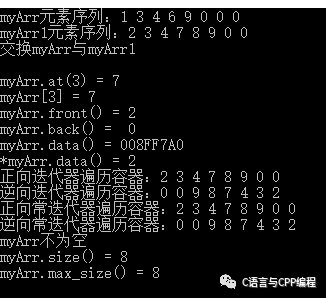
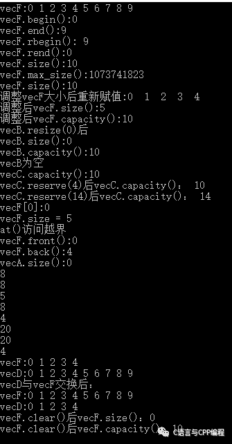
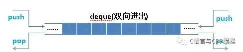
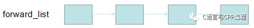
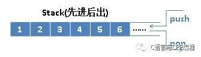
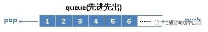
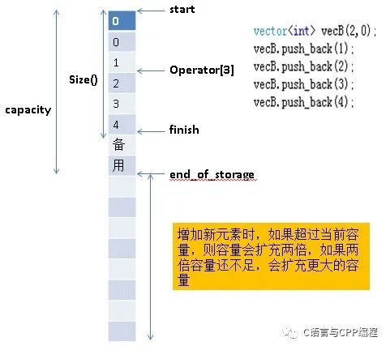
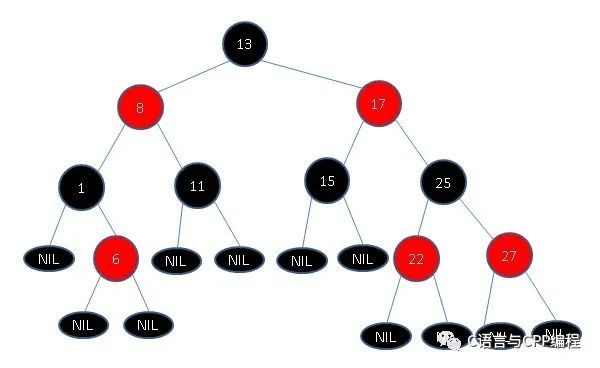

## STL - HQ

[TOC]

------

#### 注意

- 

------

## 0 STL简介 - AcWing

#### 注意

1. 系统为某一个程序分配空间时，所需时间与空间大小无关，与申请次数有关。所以变长数组要尽量减少申请空间的次数。

#### 各个容器的常用函数及用法

```cpp
vector, 变长数组，倍增的思想
    size()  返回元素个数 O(1)
    empty()  返回是否为空 O(1)
    clear()  清空
    front()/back()
    push_back()/pop_back()
    begin()/end()  a.begin()为a[0]  //a.end()为a[a.size()]最后一个数的后面一个数 
    []
    支持比较运算，按字典序  vector<int> a(4, 3), b(3, 4); if (a < b) ...
    void vector()
    {
        vector<int> a(10); //定义长度为10的vector
        vector<int> a[10]; //vector数组，定义10个vector
        vector<int> a(10, 3);  //初始化每个数为3
        for (auto x : a) cout << x << endl; //遍历

        //时间复杂度为O(1),有专门的变量来存储，其他所有容器都有
        a.size();  //返回元素个数
        a.empty(); //返回是否为空，返回true & false

        a.clear(); //清空

        //3中遍历方式
        for (int i = 0; i < 10; i++) a.push_back(i);
        //第一种
        for (int i = 0; i < a.size(); i++) cout << a[i] << ' ';
        cout << endl;
        //第二种   vector<int>::iterator 可以改为auto
        for (vector<int>::iterator i = a.begin(); i != a.end(); i++) cout << *i << ' ';
        cout << endl;
        //第三种  c++11 新增方式，效率稍快   auto系统自动推断变量类型
        for (auto x : a) cout << x << ' ';
        cout << endl;
    }

pair<int, int>  //存储一个二元组
    pair<int, string> p;
	p = make_pair(10, "yxc");  //初始化方式1
	p = {20, "abc"};  //初始化方式2
    first, 第一个元素
    second, 第二个元素
    pair<int, pair<int, int>> p; //支持嵌套 
    支持比较运算，以first为第一关键字，以second为第二关键字（字典序）

string，字符串
    size()/length()  都是返回字符串长度
    empty()
    clear()
    substr(起始下标，(子串长度))  返回子串
    c_str()  返回字符串所在字符数组的起始地址
	void string()
	{
		string a = "yxc";
        a += "def";
        a += 'c';
        
        cout << a.substr(0, 2) << endl; //从第0个位置截取某一段子串，省略第二个参数或长度大于原长则截取到结尾
        
        printf("%s\n", a.c_str()); //c_str()返回a存储字符数组的起始地址
	}

queue, 队列, 先进先出
    无clear() 可以写成 q = queue<int>();
    size()
    empty()
    push()  向队尾插入一个元素
    front()  返回队头元素
    back()  返回队尾元素
    pop()  弹出队头元素

priority_queue, 优先队列(底层是用堆实现)，默认是大根堆
    size()
    empty()
    push()  插入一个元素
    top()  返回堆顶元素
    pop()  弹出堆顶元素
    定义成小根堆的方式1：priority_queue<int, vector<int>, greater<int>> q;
	定义成小根堆的方式2：heap.push(-x);  //直接输入负数

stack, 栈, 先进后出
    size()
    empty()
    push()  向栈顶插入一个元素
    top()  返回栈顶元素
    pop()  弹出栈顶元素

deque, 双端队列，功能很强，但速度慢几倍
    size()
    empty()
    clear()
    front()/back()
    push_back()/pop_back()
    push_front()/pop_front()
    begin()/end()
    []

set, map, multiset, multimap, 基于平衡二叉树（红黑树），动态维护有序序列
    size()
    empty()
    clear()
    begin()/end()
    ++, -- 返回前驱和后继，时间复杂度 O(logn)

    set/multiset
        insert()  插入一个数
        find()  查找一个数
        count()  返回某一个数的个数
        erase()
            (1) 输入是一个数x，删除所有x   O(k + logn)  k为x的个数
            (2) 输入一个迭代器，删除这个迭代器
        lower_bound()/upper_bound()
            lower_bound(x)  返回大于等于x的最小的数 的迭代器，如果不存在返回end
            upper_bound(x)  返回大于x的最小的数 的迭代器，如果不存在返回end
    map/multimap
        insert()  插入的数是一个pair
        erase()  输入的参数是pair或者迭代器
        find()
        []  注意multimap不支持此操作。 map支持，时间复杂度是 O(logn)
        lower_bound()/upper_bound()
    void map()
	{
		//可以像用数组一样用map，时间复杂度是 O(logn)
    	map<string, int> a;
    	a["yxc"] = 1;  // 赋值 <"yxc", 1>
    	cout << a["yxc"] << endl;
	}

unordered_set, unordered_map, unordered_multiset, unordered_multimap, 哈希表
    和上面类似，增删改查的时间复杂度是 O(1)
    不支持 lower_bound()/upper_bound()， 迭代器的++，--

bitset, 圧位    可以省8位空间
    bitset<10000> s;
    ~, &, |, ^
    >>, <<
    ==, !=
    []

    count()  返回有多少个1

    any()  判断是否至少有一个1
    none()  判断是否全为0

    set()  把所有位置成1
    set(k, v)  将第k位变成v
    reset()  把所有位变成0
    flip()  等价于~
    flip(k) 把第k位取反
```


## 1 STL概述

为了建立数据结构和算法的一套标准，并且降低他们之间的耦合关系，以提升各自的独立性、弹性、交互操作性(相互合作性,interoperability),诞生了STL。

STL提供了六大组件，彼此之间可以组合套用，这六大组件分别是:**容器、算法、迭代器、仿函数、适配器（配接器）、空间配置器**。

- **容器**：各种数据结构，如vector、list、deque、set、map等,用来存放数据，从实现角度来看，STL容器是一种class template。
- **算法**：各种常用的算法，如sort、find、copy、for_each。从实现的角度来看，STL算法是一种function tempalte.
- **迭代器**：扮演了容器与算法之间的胶合剂，共有五种类型，从实现角度来看，迭代器是一种将operator* , operator-> , operator++,operator–等指针相关操作予以重载的class template. 所有STL容器都附带有自己专属的迭代器，只有容器的设计者才知道如何遍历自己的元素。原生指针(native pointer)也是一种迭代器。
- **仿函数**：行为类似函数，可作为算法的某种策略。从实现角度来看，仿函数是一种重载了operator()的class 或者class template
- **适配器**：一种用来修饰容器或者仿函数或迭代器接口的东西。
- **空间配置器**：负责空间的配置与管理。从实现角度看，配置器是一个实现了动态空间配置、空间管理、空间释放的class tempalte.

STL六大组件的交互关系，容器通过空间配置器取得数据存储空间，算法通过迭代器存储容器中的内容，仿函数可以协助算法完成不同的策略的变化，适配器可以修饰仿函数。

## 2 STL的优点：

1. STL 是 C++的一部分，因此不用额外安装什么，它被内建在你的编译器之内。
2. STL 的一个重要特性是将数据和操作分离。数据由容器类别加以管理，操作则由可定制的算法定义。迭代器在两者之间充当“粘合剂”,以使算法可以和容器交互运作
3. 程序员可以不用思考 STL 具体的实现过程，只要能够熟练使用 STL 就 OK 了。这样他们就可以把精力放在程序开发的别的方面。
4. STL 具有高可重用性，高性能，高移植性，跨平台的优点。
5. 高可重用性：STL 中几乎所有的代码都采用了模板类和模版函数的方式实现，这相比于传统的由函数和类组成的库来说提供了更好的代码重用机会。
6. 高性能：如 map 可以高效地从十万条记录里面查找出指定的记录，因为 map 是采用红黑树的变体实现的。
7. 高移植性：如在项目 A 上用 STL 编写的模块，可以直接移植到项目 B 上。容器和算法之间通过迭代器进行无缝连接。STL 几乎所有的代码都采用了模板类或者模板函数，这相比传统的由函数和类组成的库来说提供了更好的代码重用机会。

## 3 容器

STL容器就是将运用最广泛的一些数据结构实现出来。

常用的数据结构：数组(array) , 链表(list), tree(树)，栈(stack), 队列(queue), 集合(set),映射表(map), 根据数据在容器中的排列特性，这些数据分为序列式容器和关联式容器两种。

**序列式容器**强调值的排序，序列式容器中的每个元素均有固定的位置，除非用删除或插入的操作改变这个位置。Vector容器、Deque容器、List容器等。

**关联式容器**是非线性的树结构，更准确的说是二叉树结构。各元素之间没有严格的物理上的顺序关系，也就是说元素在容器中并没有保存元素置入容器时的逻辑顺序。关联式容器另一个显著特点是：在值中选择一个值作为关键字key，这个关键字对值起到索引的作用，方便查找。Set/multiset容器 Map/multimap容器

| 容器               |   底层数据结构   |                                               时间复杂度 | 有无序 | 可不可重复 |
| :----------------- | :--------------: | -------------------------------------------------------: | :----- | :--------: |
| array              |       数组       |                                            随机读改 O(1) | 无序   |   可重复   |
| vector             |       数组       | 随机读改、尾部插入、尾部删除 O(1)头部插入、头部删除 O(n) | 无序   |   可重复   |
| deque              |     双端队列     |                                  头尾插入、头尾删除 O(1) | 无序   |   可重复   |
| forward_list       |     单向链表     |                                          插入、删除 O(1) | 无序   |   可重复   |
| list               |     双向链表     |                                          插入、删除 O(1) | 无序   |   可重复   |
| stack              |   deque / list   |                                  顶部插入、顶部删除 O(1) | 无序   |   可重复   |
| queue              |   deque / list   |                                  尾部插入、头部删除 O(1) | 无序   |   可重复   |
| priority_queue     | vector /max-heap |                                      插入、删除 O(log2n) | 有序   |   可重复   |
| set                |      红黑树      |                                插入、删除、查找 O(log2n) | 有序   |  不可重复  |
| multiset           |      红黑树      |                                插入、删除、查找 O(log2n) | 有序   |   可重复   |
| map                |      红黑树      |                                插入、删除、查找 O(log2n) | 有序   |  不可重复  |
| multimap           |      红黑树      |                                插入、删除、查找 O(log2n) | 有序   |   可重复   |
| unordered_set      |      哈希表      |                          插入、删除、查找 O(1) 最差 O(n) | 无序   |  不可重复  |
| unordered_multiset |      哈希表      |                          插入、删除、查找 O(1) 最差 O(n) | 无序   |   可重复   |
| unordered_map      |      哈希表      |                          插入、删除、查找 O(1) 最差 O(n) | 无序   |  不可重复  |
| unordered_multimap |      哈希表      |                          插入、删除、查找 O(1) 最差 O(n) | 无序   |   可重复   |

### 1 array

array 是固定大小的顺序容器，它们保存了一个以严格的线性顺序排列的特定数量的元素。

| 方法                         |                             说明                             |
| :--------------------------- | :----------------------------------------------------------: |
| begin                        |             返回指向数组容器中第一个元素的迭代器             |
| end                          |     返回指向数组容器中最后一个元素之后的理论元素的迭代器     |
| rbegin                       |          返回指向数组容器中最后一个元素的反向迭代器          |
| rend                         |    返回一个反向迭代器，指向数组中第一个元素之前的理论元素    |
| cbegin                       |  返回指向数组容器中第一个元素的常量迭代器（const_iterator）  |
| cend                         | 返回指向数组容器中最后一个元素之后的理论元素的常量迭代器（const_iterator） |
| crbegin                      | 返回指向数组容器中最后一个元素的常量反向迭代器（const_reverse_iterator） |
| crend                        | 返回指向数组中第一个元素之前的理论元素的常量反向迭代器（const_reverse_iterator） |
| size                         |                   返回数组容器中元素的数量                   |
| max_size                     |                返回数组容器可容纳的最大元素数                |
| empty                        |             返回一个布尔值，指示数组容器是否为空             |
| operator[]                   |           返回容器中第 n（参数）个位置的元素的引用           |
| at                           |           返回容器中第 n（参数）个位置的元素的引用           |
| front                        |                 返回对容器中第一个元素的引用                 |
| back                         |                返回对容器中最后一个元素的引用                |
| data                         |                返回指向容器中第一个元素的指针                |
| fill                         |                用 val（参数）填充数组所有元素                |
| swap                         |              通过 x（参数）的内容交换数组的内容              |
| get（array）                 | 形如 std::get<0>(myarray)；传入一个数组容器，返回指定位置元素的引用 |
| relational operators (array) |     形如 arrayA > arrayB；依此比较数组每个元素的大小关系     |

### 测试代码

```
#include<iostream>
#include<array>
using namespace std;

int main() 
{
	array<int, 8> myArr = {1,3,4,6,9};//固定大小为8
	cout << "myArr元素序列：";
	for (auto i = 0; i < 8; ++i) 
	{
		cout << myArr[i] << " ";
	}
	cout << endl;

	array<int, 8> myArr1 = {2,3,4,7,8,9};//固定大小为8
	cout << "myArr1元素序列：";
	for (auto i = 0; i < 8; ++i) 
	{
		cout << myArr1[i] << " ";
	}
	cout << endl;

	myArr.swap(myArr1);   //交换两个容器的内容
	cout << "交换myArr与myArr1"<< endl;
	cout << endl;

	cout << "myArr.at(3) = " << myArr.at(3) << endl;//任意访问
	cout << "myArr[3] = " << myArr[3] << endl;//任意访问
	cout << "myArr.front() = " << myArr.front() << endl;//获取第一个元素
	cout << "myArr.back() =  " << myArr.back() << endl;//获取最后一个元素
	cout << "myArr.data() = " << myArr.data() << endl;//获取第一个元素的指针
	cout << "*myArr.data() = " << *myArr.data() << endl;//获取第一个元素的指针指向的元素

	cout << "正向迭代器遍历容器：";
	for (auto it = myArr.begin(); it != myArr.end(); ++it) 
	{
		cout << *it << " ";
	}
	cout << endl;
	//逆向迭代器测试
	cout << "逆向迭代器遍历容器：";
	for (auto rit = myArr.rbegin(); rit != myArr.rend(); ++rit) 
	{
		cout << *rit << " ";
	}
	cout << endl;
	//正向常迭代器测试
	cout << "正向常迭代器遍历容器：";
	for (auto it = myArr.cbegin(); it != myArr.cend(); ++it) 
	{
		cout << *it << " ";
	}
	cout << endl;
	//逆向常迭代器测试
	cout << "逆向常迭代器遍历容器：";
	for (auto rit = myArr.crbegin(); rit != myArr.crend(); ++rit) 
	{
		cout << *rit << " ";
	}
	cout << endl;
	if(myArr.empty())
		cout << "myArr为空 " << endl;
	else
		cout << "myArr不为空 " << endl;
	cout << "myArr.size() = " << myArr.size() << endl;
	cout << "myArr.max_size() = " << myArr.max_size() << endl;

	return 0;
}
```

### 运行结果

运行结果

### vector

vector 是表示可以改变大小的数组的序列容器。

| 方法                          |                             说明                             |
| :---------------------------- | :----------------------------------------------------------: |
| vector                        |                           构造函数                           |
| ~vector                       |                    析构函数，销毁容器对象                    |
| operator=                     |    将新内容分配给容器，替换其当前内容，并相应地修改其大小    |
| begin                         |               返回指向容器中第一个元素的迭代器               |
| end                           |       返回指向容器中最后一个元素之后的理论元素的迭代器       |
| rbegin                        |            返回指向容器中最后一个元素的反向迭代器            |
| rend                          |      返回一个反向迭代器，指向中第一个元素之前的理论元素      |
| cbegin                        |    返回指向容器中第一个元素的常量迭代器（const_iterator）    |
| cend                          | 返回指向容器中最后一个元素之后的理论元素的常量迭代器（const_iterator） |
| crbegin                       | 返回指向容器中最后一个元素的常量反向迭代器（const_reverse_iterator） |
| crend                         | 返回指向容器中第一个元素之前的理论元素的常量反向迭代器（const_reverse_iterator） |
| size                          |                     返回容器中元素的数量                     |
| max_size                      |                  返回容器可容纳的最大元素数                  |
| resize                        |           调整容器的大小，使其包含 n（参数）个元素           |
| capacity                      |        返回当前为 vector 分配的存储空间（容量）的大小        |
| empty                         |                     返回 vector 是否为空                     |
| reserve                       |         请求 vector 容量至少足以包含 n（参数）个元素         |
| shrink_to_fit                 |   要求容器减小其 capacity（容量）以适应其 size（元素数量）   |
| operator[]                    |           返回容器中第 n（参数）个位置的元素的引用           |
| at                            |           返回容器中第 n（参数）个位置的元素的引用           |
| front                         |                 返回对容器中第一个元素的引用                 |
| back                          |                返回对容器中最后一个元素的引用                |
| data                          |                返回指向容器中第一个元素的指针                |
| assign                        |  将新内容分配给 vector，替换其当前内容，并相应地修改其 size  |
| push_back                     |            在容器的最后一个元素之后添加一个新元素            |
| pop_back                      |     删除容器中的最后一个元素，有效地将容器 size 减少一个     |
| insert                        | 通过在指定位置的元素之前插入新元素来扩展该容器，通过插入元素的数量有效地增加容器大小 |
| erase                         | 从 vector 中删除单个元素（position）或一系列元素（[first，last)），这有效地减少了被去除的元素的数量，从而破坏了容器的大小 |
| swap                          | 通过 x（参数）的内容交换容器的内容，x 是另一个类型相同、size 可能不同的 vector 对象 |
| clear                         | 从 vector 中删除所有的元素（被销毁），留下 size 为 0 的容器  |
| emplace                       | 通过在 position（参数）位置处插入新元素 args（参数）来扩展容器 |
| emplace_back                  | 在 vector 的末尾插入一个新的元素，紧跟在当前的最后一个元素之后 |
| get_allocator                 |              返回与vector关联的构造器对象的副本              |
| swap(vector)                  | 容器 x（参数）的内容与容器 y（参数）的内容交换。两个容器对象都必须是相同的类型（相同的模板参数），尽管大小可能不同 |
| relational operators (vector) |      形如 vectorA > vectorB；依此比较每个元素的大小关系      |

### 测试代码

```
#include <vector>
#include <iostream>
using namespace std;

int main()
{

	//构造函数,复制构造函数(元素类型要一致),
	vector<int> vecA;  //创建一个空的的容器
	vector<int> vecB(10,20); //创建一个10个元素,每个元素值为20
	vector<int> vecC(vecB.begin(),vecB.end()); //使用迭代器,可以取部分元素创建一个新的容器
	vector<int> vecD(vecC); //复制构造函数,创建一个完全一样的容器

	//重载=
	vector<int> vecE;
	vecE = vecB;

	//vector::begin()，返回的是迭代器

	vector<int> vecF(10); //创建一个有10个元素的容器
	cout << "vecF:";
	for (int i = 0; i < 10; i++)
	{
		vecF[i] = i;
		cout << vecF[i]<< " ";
	}
	cout << endl;

	//vector::begin() 返回迭代器
	vector<int>::iterator Beginit = vecF.begin();
	cout<< "vecF.begin():" << *Beginit << endl; 

	//vector::end() 返回迭代器
	vector<int>::iterator EndIter = vecF.end();
	EndIter--; //向后移一个位置
	cout <<"vecF.end():"<< *EndIter << endl; 

	//vector::rbegin() 返回倒序的第一个元素，相当于最后一个元素
	vector<int>::reverse_iterator ReverBeIter = vecF.rbegin();
	cout << "vecF.rbegin(): "<< *ReverBeIter << endl; 

	//vector::rend() 反序的最后一个元素下一个位置，也相当于正序的第一个元素前一个位置
	vector<int>::reverse_iterator ReverEnIter = vecF.rend();
	ReverEnIter--;
	cout << "vecF.rend():"<< *ReverEnIter << endl; 

	//vector::size() 返回元素的个数
	cout << "vecF.size():"<< vecF.size() << endl; 

	//vector::max_size()
	cout << "vecF.max_size():"<< vecF.max_size() << endl; 

	//vector::resize()
	cout<< "vecF.size():" << vecF.size() << endl; 
	vecF.resize(5);

	cout<< "调整vecF大小后重新赋值:"; 
	for(int k = 0; k < vecF.size(); k++)
		cout << vecF[k] << "  "; 
	cout << endl;

	//vector::capacity()
	cout<< "调整后vecF.size():"<< vecF.size() << endl; 
	cout<< "调整后vecF.capacity():" << vecF.capacity() << endl; 

	//vector::empty()
	vecB.resize(0);
	cout<< "vecB.resize(0)后"<< endl; 

	cout  << "vecB.size():" << vecB.size() << endl; 
	cout  << "vecB.capacity():" << vecB.capacity() << endl; 
	if(vecB.empty())
	    cout << "vecB为空"<< endl; 
	else
		cout << "vecB不为空"<< endl; 

	//vector::reserve() //重新分配存储空间大小
	cout<< "vecC.capacity():" << vecC.capacity() << endl; //

	vecC.reserve(4);
	cout << "vecC.reserve(4)后vecC.capacity()： "<< vecC.capacity() << endl; //10
	vecC.reserve(14);
	cout << "vecC.reserve(14)后vecC.capacity()： "<< vecC.capacity() << endl; //14

	//vector::operator []
	cout << "vecF[0]:"<< vecF[0] << endl; //第一个元素是0

	//vector::at()
	try
	{
		cout << "vecF.size = " << vecF.size() << endl; //5
		cout << vecF.at(6) << endl; //抛出异常
	}
	catch(out_of_range)
	{	
		cout << "at()访问越界" << endl;
	}

	//vector::front() 返回第一个元素的值
	cout << "vecF.front():"<< vecF.front() << endl; //0

	//vector::back()
	cout << "vecF.back():"<< vecF.back() << endl; //4

	//vector::assign()
	cout <<"vecA.size():"<< vecA.size() << endl; //0
	vector<int>::iterator First = vecC.begin();
	vector<int>::iterator End = vecC.end()-2;
	vecA.assign(First,End);
	cout << vecA.size() << endl; //8
	cout << vecA.capacity() << endl; //8

	vecA.assign(5,3); //将丢弃原来的所有元素然后重新赋值
	cout << vecA.size() << endl; //5
	cout << vecA.capacity() << endl; //8

	//vector::push_back()
	cout << *(vecF.end()-1) << endl; //4
	vecF.push_back(20);
	cout << *(vecF.end()-1) << endl; //20

	//vector::pop_back()
	cout << *(vecF.end()-1) << endl; //20
	vecF.pop_back();
	cout << *(vecF.end()-1) << endl; //4

	//vector::swap()
	cout << "vecF:";
	for (int i = 0; i < vecF.size(); i++)
	{
		vecF[i] = i;
		cout << vecF[i]<< " ";
	}
	cout << endl;
	cout << "vecD:";
	for (int d = 0; d < vecD.size(); d++)
	{
		vecD[d] = d;
		cout << vecD[d]<< " ";
	}
	cout << endl;

	vecF.swap(vecD); //交换这两个容器的内容
	cout <<"vecD与vecF交换后：" <<endl;
	cout << "vecF:";
	for(int f = 0; f < vecF.size(); f++)
		cout << vecF[f] << " ";
	cout << endl;

	cout << "vecD:";
	for (int d = 0; d <vecD.size(); d++)
		cout << vecD[d] << " ";
	cout << endl;
	//vector::clear()
	vecF.clear();
	cout << "vecF.clear()后vecF.size()："<< vecF.size() << endl;     //0
	cout << "vecF.clear()后vecF.capacity()："<< vecF.capacity() << endl; //10

	return 0;
}
```

### 运行结果

运行结果

### deque

deque容器为一个给定类型的元素进行线性处理，像向量一样，它能够快速地随机访问任一个元素，并且能够高效地插入和删除容器的尾部元素。但它又与vector不同，**deque支持高效插入和删除容器的头部元素**，因此也叫做双端队列。



**deque的中控器**: deque是由一段一段的定量连续空间构成。一旦有必要在deque的前端或尾端增加新空间，便配置一段定量连续空间，串接在整个deque的头端或尾端。deque的最大任务，便是在这些分段的定量连续空间上，维护其整体连续的假象，并提供随机存取的接口。避开了“重新配置、复制、释放”的轮回，代价则是复杂的迭代器结构。


deque采用一块所谓的map（不是STL的map容器）作为主控。

map是一小块连续空间，其中每个元素(此处称为一个节点，node)都是指针，指向另一段(较大的)连续线性空间，称为缓冲区。

缓冲区才是deque的储存空间主体。

```
template<class T, class Alloc = alloc, size_t BufSiz = 0>  
class deque{  
public :  
    typedef T value_type ;  
    typedef value_type* pointer ;  
    ...  
protected :  
    //元素的指针的指针(pointer of pointer of T)  
    // 其实就是T**，一个二级指针，维护一个二维数组
    typedef pointer* map_pointer ; 
  
protected :  
    map_pointer map ; //指向map,map是块连续空间，其内的每个元素  
                      //都是一个指针(称为节点)，指向一块缓冲区  
    size_type map_size ;//map内可容纳多少指针  
    ...  
};  
```

map其实是一个T**，也就是说它是一个指针，所指之物也是一个指针，指向型别为T的一块空间。

| 方法          |                             说明                             |
| :------------ | :----------------------------------------------------------: |
| deque         |                           构造函数                           |
| push_back     | 在当前的最后一个元素之后 ，在 deque 容器的末尾添加一个新元素 |
| push_front    | 在 deque 容器的开始位置插入一个新的元素，位于当前的第一个元素之前 |
| pop_back      |  删除 deque 容器中的最后一个元素，有效地将容器大小减少一个   |
| pop_front     |       删除 deque 容器中的第一个元素，有效地减小其大小        |
| emplace_front | 在 deque 的开头插入一个新的元素，就在其当前的第一个元素之前  |
| emplace_back  | 在 deque 的末尾插入一个新的元素，紧跟在当前的最后一个元素之后 |

### 测试代码

```
#include "stdafx.h"
#include<iostream>
#include<deque>
 
using namespace std;
int main()
{
	deque<int> d;
	d.push_back( 11 );//在 deque 容器的末尾添加一个新元素
	d.push_back(20);
	d.push_back(35);
	cout<<"初始化双端队列d："<<endl;
	for(int i = 0; i < d.size(); i++)
	{
		cout<<d.at(i)<<"\t";
	}
	cout<<endl;

	d.push_front(10);//容器的开始位置插入一个新的元素，位于当前的第一个元素之前
	d.push_front(7);
	d.push_front(1);
 
	cout<<"队列d向前陆续插入10、7、1:"<<endl;
	for(int i = 0;i < d.size();i++)
	{
		cout<<d.at(i)<<"\t";
	}
	cout<<endl;

	d.pop_back(); //删除 deque 容器中的最后一个元素，有效地将容器大小减少一个
	d.pop_front(); //删除 deque 容器中的第一个元素，有效地减小其大小
	cout<<"删除deque最后一个和第一个元素后:"<<endl;
	for(int i = 0;i < d.size();i++)
	{
		cout<<d.at(i)<<"\t";
	}
	cout<<endl;
	return 0;
}
```

### forward_list

在头文件<forward_list>中，与list类似，区别就是list时双链表，forward_list是单链表，forward_list（单向链表）是序列容器，允许在序列中的任何地方进行恒定的时间插入和擦除操作。在链表的任何位置进行插入/删除操作都非常快。



**forward_list的特点**：

- forward_list只提供钱箱迭代器，因此不支持反向迭代器，比如rbegin()等成员函数。
- forward_list不提供size（）成员函数。
- forward_list没有指向最末元素的锚点，因此不提供back（）、push_back（）和pop_back（）。
- forward_list不提供随机访问，这一点跟list相同。
- 插入和删除元素不会造成“指向至其他元素”的指针，引用和迭代器失效。

> 容器成员函数总结就不写了,太多影响阅读,感兴趣小伙伴戳http://www.cplusplus.com/reference/stl/

### list


list双向链表，是序列容器，允许在序列中的任何地方进行常数时间插入和擦除操作，并在两个方向上进行迭代,可以高效地进行插入删除元素。

使用list容器之前必须加上头文件：#include;

**list容器的底层实现**:

和 array、vector 这些容器迭代器的实现方式不同，由于 list 容器的元素并不是连续存储的，所以该容器迭代器中，必须包含一个可以指向 list 容器的指针，并且该指针还可以借助重载的 *、++、--、==、!= 等运算符，实现迭代器正确的递增、递减、取值等操作。

```
template<tyepname T,...>
struct __list_iterator{
    __list_node<T>* node;
    //...
    //重载 == 运算符
    bool operator==(const __list_iterator& x){return node == x.node;}
    //重载 != 运算符
    bool operator!=(const __list_iterator& x){return node != x.node;}
    //重载 * 运算符，返回引用类型
    T* operator *() const {return *(node).myval;}
    //重载前置 ++ 运算符
    __list_iterator<T>& operator ++(){
        node = (*node).next;
        return *this;
    }
    //重载后置 ++ 运算符
    __list_iterator<T>& operator ++(int){
        __list_iterator<T> tmp = *this;
        ++(*this);
        return tmp;
    }
    //重载前置 -- 运算符
    __list_iterator<T>& operator--(){
        node = (*node).prev;
        return *this;
    }
    //重载后置 -- 运算符
    __list_iterator<T> operator--(int){
        __list_iterator<T> tmp = *this;
        --(*this);
        return tmp;
    }
    //...
}
```

### stack

stack没有迭代器，是一种容器适配器，用于在LIFO（后进先出）的操作，其中元素仅从容器的一端插入和提取。



stack底层一般用list或deque实现，封闭头部即可，不用vector的原因应该是容量大小有限制，扩容耗时

**底层用deque实现**：

```
//deque<T> >中间有个空格是为了兼容较老的版本
template <class T, class Sequence = deque<T> >
class stack {
    // 以㆘的 __STL_NULL_TMPL_ARGS 会开展为 <>
    friend bool operator== __STL_NULL_TMPL_ARGS (const stack&, const stack&);
    friend bool operator< __STL_NULL_TMPL_ARGS (const stack&, const stack&);
public:
    typedef typename Sequence::value_type value_type;
    typedef typename Sequence::size_type size_type;
    typedef typename Sequence::reference reference;
    typedef typename Sequence::const_reference const_reference;
protected:
    Sequence c; // 底层容器
public:
    // 以㆘完全利用 Sequence c 的操作，完成 stack 的操作。
    bool empty() const { return c.empty(); }
    size_type size() const { return c.size(); }
    reference top() { return c.back(); }
    const_reference top() const { return c.back(); }
    // deque 是两头可进出，stack 是末端进，末端出（所以后进者先出）。
    void push(const value_type& x) { c.push_back(x); }
    void pop() { c.pop_back(); }
};

template <class T, class Sequence>
bool operator==(const stack<T, Sequence>& x, const stack<T, Sequence>& y) {
    return x.c == y.c;
}

template <class T, class Sequence>
bool operator<(const stack<T, Sequence>& x, const stack<T, Sequence>& y) {
    return x.c < y.c;
}
```

**底层用list实现**：

```
  #include<stack>  
  #include<list>  
  #include<algorithm>  
  #include <iostream>  
  using namespace std;  
    
  int main(){  
      stack<int, list<int>> istack;  
      istack.push(1);  
      istack.push(3);  
      istack.push(5);  
        
      cout << istack.size() << endl; //3  
      cout << istack.top() << endl;//5  
      istack.pop();  
      cout << istack.top() << endl;//3  
      cout << istack.size() << endl;//2  
    
      system("pause");  
      return 0;  
  }  
```

### queue

queue 是一种容器适配器，用于在FIFO（先入先出）的操作，其中元素插入到容器的一端并从另一端提取。



队列不提供迭代器，不实现遍历操作。

```
template <class T, class Sequence = deque<T> >
class queue {
  friend bool operator== __STL_NULL_TMPL_ARGS (const queue& x, const queue& y);
  friend bool operator< __STL_NULL_TMPL_ARGS (const queue& x, const queue& y);
public:
  typedef typename Sequence::value_type value_type;
  typedef typename Sequence::size_type size_type;
  typedef typename Sequence::reference reference;
  typedef typename Sequence::const_reference const_reference;
protected:
  Sequence c;
public:
  bool empty() const { return c.empty(); }
  size_type size() const { return c.size(); }
  reference front() { return c.front(); }
  const_reference front() const { return c.front(); }
  reference back() { return c.back(); }
  const_reference back() const { return c.back(); }
  void push(const value_type& x) { c.push_back(x); }
  void pop() { c.pop_front(); }
};

template <class T, class Sequence>
bool operator==(const queue<T, Sequence>& x, const queue<T, Sequence>& y) {
  return x.c == y.c;
}

template <class T, class Sequence>
bool operator<(const queue<T, Sequence>& x, const queue<T, Sequence>& y) {
  return x.c < y.c;
}
```

### priority_queue

优先队列，其底层是用堆来实现的。在优先队列中，队首元素一定是当前队列中优先级最高的那一个。

### set

set 是按照特定顺序存储唯一元素的容器。

```
template<class _Kty,
    class _Pr = less<_Kty>,
    class _Alloc = allocator<_Kty> >
class set
```

1. set 的 底层数据结构是 红黑树，一种高效的平衡检索二叉树。
2. set 容器中 每一个元素就是二叉树的每一个节点，对于set容器的插入删除操作，效率都比较高，原因是因为二叉树的删除插入元素并不需要进行内存拷贝和内存移动，只是改变了指针的指向。
3. 对 set 进行插入删除操作 都不会引起iterator的失效，因为迭代器相当于一个指针指向每一个二叉树的节点，对set的插入删除并不会改变原有内存中节点的改变， 但是vector的插入删除操作一般会发生内存移动和内存拷贝，所以会发生迭代器的失效。
4. set容器的检索速度很快，因为采用二分查找的方法 。

### multiset

**multiset允许元素重复而set不允许**。

```
template<class _Kty,
	class _Pr = less<_Kty>,
	class _Alloc = allocator<_Kty> >
class multiset
```

### map

map 是关联容器，按照特定顺序存储由 key value (键值) 和 mapped value (映射值) 组合形成的元素。

由于 RB-tree 是一种平衡二叉搜索树，自动排序的效果很不错，所以标准的STL map 即以 RB-tree 为底层机制。又由于 map 所开放的各种操作接口，RB-tree 也都提供了，所以几乎所有的 map 操作行为，都只是转调 RB-tree 的操作行为。

| 方法        |                             说明                             |
| :---------- | :----------------------------------------------------------: |
| map         |                           构造函数                           |
| begin       |               返回引用容器中第一个元素的迭代器               |
| key_comp    |              返回容器用于比较键的比较对象的副本              |
| value_comp  | 返回可用于比较两个元素的比较对象，以获取第一个元素的键是否在第二个元素之前 |
| find        | 在容器中搜索具有等于 k的键的元素，如果找到返回一个迭代器，否则返回 map::end |
| count       |  在容器中搜索具有等于 k（参数）的键的元素，并返回匹配的数量  |
| lower_bound | 返回一个非递减序列 [first, last)中的第一个大于等于值 val的位置的迭代器 |
| upper_bound | 返回一个非递减序列 [first, last)中第一个大于 val的位置的迭代器 |
| equal_range | 获取相同元素的范围，返回包含容器中所有具有与 k等价的键的元素的范围边界 |

### multimap

multimap 的特性以及用法与 map 完全相同，唯一的差别在于它允许键值重复，因此它的插入操作采用的是底层机制 RB-tree 的 insert_equal() 而非 insert_unique。

### unordered_set

unordered_set是基于哈希表，因此要了解unordered_set，就必须了解哈希表的机制。哈希表是根据关键码值而进行直接访问的数据结构，通过相应的哈希函数(也称散列函数)处理关键字得到相应的关键码值，关键码值对应着一个特定位置，用该位置来存取相应的信息，这样就能以较快的速度获取关键字的信息。

```
template < class Key,  
    class Hash = hash<Key>,  
    class Pred = equal_to<Key>,  
    class Alloc = allocator<Key>  
> class unordered_set;  
```

## 4 算法

1. 简单查找算法，要求输入迭代器（input iterator）

```
find(beg, end, val); // 返回一个迭代器，指向输入序列中第一个等于 val 的元素，未找到返回 end
find_if(beg, end, unaryPred); // 返回一个迭代器，指向第一个满足 unaryPred 的元素，未找到返回 end
find_if_not(beg, end, unaryPred); // 返回一个迭代器，指向第一个令 unaryPred 为 false 的元素，未找到返回 end
count(beg, end, val); // 返回一个计数器，指出 val 出现了多少次
count_if(beg, end, unaryPred); // 统计有多少个元素满足 unaryPred
all_of(beg, end, unaryPred); // 返回一个 bool 值，判断是否所有元素都满足 unaryPred
any_of(beg, end, unaryPred); // 返回一个 bool 值，判断是否任意（存在）一个元素满足 unaryPred
none_of(beg, end, unaryPred); // 返回一个 bool 值，判断是否所有元素都不满足 unaryPred
```

1. 查找重复值的算法，传入向前迭代器（forward iterator）

```
adjacent_find(beg, end); // 返回指向第一对相邻重复元素的迭代器，无相邻元素则返回 end
adjacent_find(beg, end, binaryPred); // 返回指向第一对相邻重复元素的迭代器，无相邻元素则返回 end
search_n(beg, end, count, val); // 返回一个迭代器，从此位置开始有 count 个相等元素，不存在则返回 end
search_n(beg, end, count, val, binaryPred); // 返回一个迭代器，从此位置开始有 count 个相等元素，不存在则返回 end
```

1. 查找子序列算法，除 find_first_of（前两个输入迭代器，后两个前向迭代器） 外，都要求两个前向迭代器

```
search(beg1, end1, beg2, end2); // 返回第二个输入范围（子序列）在爹一个输入范围中第一次出现的位置，未找到则返回 end1
search(beg1, end1, beg2, end2, binaryPred); // 返回第二个输入范围（子序列）在爹一个输入范围中第一次出现的位置，未找到则返回 end1
find_first_of(beg1, end1, beg2, end2); // 返回一个迭代器，指向第二个输入范围中任意元素在第一个范围中首次出现的位置，未找到则返回end1
find_first_of(beg1, end1, beg2, end2, binaryPred); // 返回一个迭代器，指向第二个输入范围中任意元素在第一个范围中首次出现的位置，未找到则返回end1
find_end(beg1, end1, beg2, end2); // 类似 search，但返回的最后一次出现的位置。如果第二个输入范围为空，或者在第一个输入范围为空，或者在第一个输入范围中未找到它，则返回 end1
find_end(beg1, end1, beg2, end2, binaryPred); // 类似 search，但返回的最后一次出现的位置。如果第二个输入范围为空，或者在第一个输入范围为空，或者在第一个输入范围中未找到它，则返回 end1
```

1. 其他只读算法，传入输入迭代器

```
for_each(beg, end, unaryOp); // 对输入序列中的每个元素应用可调用对象 unaryOp，unaryOp 的返回值被忽略
mismatch(beg1, end1, beg2); // 比较两个序列中的元素。返回一个迭代器的 pair，表示两个序列中第一个不匹配的元素
mismatch(beg1, end1, beg2, binaryPred); // 比较两个序列中的元素。返回一个迭代器的 pair，表示两个序列中第一个不匹配的元素
equal(beg1, end1, beg2); // 比较每个元素，确定两个序列是否相等。
equal(beg1, end1, beg2, binaryPred); // 比较每个元素，确定两个序列是否相等。
```

1. 二分搜索算法，传入前向迭代器或随机访问迭代器（random-access iterator），要求序列中的元素已经是有序的

```
lower_bound(beg, end, val); // 返回一个非递减序列 [beg, end) 中的第一个大于等于值 val 的位置的迭代器，不存在则返回 end
lower_bound(beg, end, val, comp); // 返回一个非递减序列 [beg, end) 中的第一个大于等于值 val 的位置的迭代器，不存在则返回 end
upper_bound(beg, end, val); // 返回一个非递减序列 [beg, end) 中第一个大于 val 的位置的迭代器，不存在则返回 end
upper_bound(beg, end, val, comp); // 返回一个非递减序列 [beg, end) 中第一个大于 val 的位置的迭代器，不存在则返回 end
equal_range(beg, end, val); // 返回一个 pair，其 first 成员是 lower_bound 返回的迭代器，其 second 成员是 upper_bound 返回的迭代器
binary_search(beg, end, val); // 返回一个 bool 值，指出序列中是否包含等于 val 的元素。对于两个值 x 和 y，当 x 不小于 y 且 y 也不小于 x 时，认为它们相等。
```

1. 只写不读算法，要求输出迭代器（output iterator）

```
fill(beg, end, val); // 将 val 赋予每个元素，返回 void
fill_n(beg, cnt, val); // 将 val 赋予 cnt 个元素，返回指向写入到输出序列最有一个元素之后位置的迭代器
genetate(beg, end, Gen); // 每次调用 Gen() 生成不同的值赋予每个序列，返回 void
genetate_n(beg, cnt, Gen); // 每次调用 Gen() 生成不同的值赋予 cnt 个序列，返回指向写入到输出序列最有一个元素之后位置的迭代器
```

7.使用输入迭代器的写算法，读取一个输入序列，将值写入到一个输出序列（dest）中

```
copy(beg, end, dest); // 从输入范围将元素拷贝所有元素到 dest 指定定的目的序列
copy_if(beg, end, dest, unaryPred); // 从输入范围将元素拷贝满足 unaryPred 的元素到 dest 指定定的目的序列
copy_n(beg, n, dest); // 从输入范围将元素拷贝前 n 个元素到 dest 指定定的目的序列
move(beg, end, dest); // 对输入序列中的每个元素调用 std::move，将其移动到迭代器 dest 开始始的序列中
transform(beg, end, dest, unaryOp); // 调用给定操作（一元操作），并将结果写到dest中
transform(beg, end, beg2, dest, binaryOp); // 调用给定操作（二元操作），并将结果写到dest中
replace_copy(beg, end, dest, old_val, new_val); // 将每个元素拷贝到 dest，将等于 old_val 的的元素替换为 new_val
replace_copy_if(beg, end, dest, unaryPred, new_val); // 将每个元素拷贝到 dest，将满足 unaryPred 的的元素替换为 new_val
merge(beg1, end1, beg2, end2, dest); // 两个输入序列必须都是有序的，用小于号运算符将合并后的序列写入到 dest 中
merge(beg1, end1, beg2, end2, dest, comp); // 两个输入序列必须都是有序的，使用给定的比较操作（comp）将合并后的序列写入到 dest 中
```

8.划分算法，要求双向选代器（bidirectional iterator）

```
is_partitioned(beg, end, unaryPred); // 如果所有满足谓词 unaryPred 的元素都在不满足 unarypred 的元素之前，则返回 true。若序列为空，也返回 true
partition_copy(beg, end, dest1, dest2, unaryPred); // 将满足 unaryPred 的元素拷贝到到 dest1，并将不满足 unaryPred 的元素拷贝到到 dest2。返回一个迭代器 pair，其 first 成员表示拷贝到 dest1 的的元素的末尾，second 表示拷贝到 dest2 的元素的末尾。
partitioned_point(beg, end, unaryPred); // 输入序列必须是已经用 unaryPred 划分过的。返回满足  unaryPred 的范围的尾后迭代器。如果返回的迭代器不是 end，则它指向的元素及其后的元素必须都不满足 unaryPred
stable_partition(beg, end, unaryPred); // 使用 unaryPred 划分输入序列。满足 unaryPred 的元素放置在序列开始，不满足的元素放在序列尾部。返回一个迭代器，指向最后一个满足 unaryPred 的元素之后的位置如果所有元素都不满足 unaryPred，则返回 beg
partition(beg, end, unaryPred); // 使用 unaryPred 划分输入序列。满足 unaryPred 的元素放置在序列开始，不满足的元素放在序列尾部。返回一个迭代器，指向最后一个满足 unaryPred 的元素之后的位置如果所有元素都不满足 unaryPred，则返回 beg
```

1. 排序算法，要求随机访问迭代器（random-access iterator）

```
sort(beg, end); // 排序整个范围
stable_sort(beg, end); // 排序整个范围（稳定排序）
sort(beg, end, comp); // 排序整个范围
stable_sort(beg, end, comp); // 排序整个范围（稳定排序）
is_sorted(beg, end); // 返回一个 bool 值，指出整个输入序列是否有序
is_sorted(beg, end, comp); // 返回一个 bool 值，指出整个输入序列是否有序
is_sorted_until(beg, end); // 在输入序列中査找最长初始有序子序列，并返回子序列的尾后迭代器
is_sorted_until(beg, end, comp); // 在输入序列中査找最长初始有序子序列，并返回子序列的尾后迭代器
partial_sort(beg, mid, end); // 排序 mid-beg 个元素。即，如果 mid-beg 等于 42，则此函数将值最小的 42 个元素有序放在序列前 42 个位置
partial_sort(beg, mid, end, comp); // 排序 mid-beg 个元素。即，如果 mid-beg 等于 42，则此函数将值最小的 42 个元素有序放在序列前 42 个位置
partial_sort_copy(beg, end, destBeg, destEnd); // 排序输入范围中的元素，并将足够多的已排序元素放到 destBeg 和 destEnd 所指示的序列中
partial_sort_copy(beg, end, destBeg, destEnd, comp); // 排序输入范围中的元素，并将足够多的已排序元素放到 destBeg 和 destEnd 所指示的序列中
nth_element(beg, nth, end); // nth 是一个迭代器，指向输入序列中第 n 大的元素。nth 之前的元素都小于等于它，而之后的元素都大于等于它
nth_element(beg, nth, end, comp); // nth 是一个迭代器，指向输入序列中第 n 大的元素。nth 之前的元素都小于等于它，而之后的元素都大于等于它
```

1. 使用前向迭代器的重排算法。普通版本在输入序列自身内部重拍元素，_copy 版本完成重拍后写入到指定目的序列中，而不改变输入序列

```
remove(beg, end, val); // 通过用保留的元素覆盖要删除的元素实现删除 ==val 的元素，返回一个指向最后一个删除元素的尾后位置的迭代器
remove_if(beg, end, unaryPred); // 通过用保留的元素覆盖要删除的元素实现删除满足 unaryPred 的元素，返回一个指向最后一个删除元素的尾后位置的迭代器
remove_copy(beg, end, dest, val); // 通过用保留的元素覆盖要删除的元素实现删除 ==val 的元素，返回一个指向最后一个删除元素的尾后位置的迭代器
remove_copy_if(beg, end, dest, unaryPred); // 通过用保留的元素覆盖要删除的元素实现删除满足 unaryPred 的元素，返回一个指向最后一个删除元素的尾后位置的迭代器
unique(beg, end); // 通过对覆盖相邻的重复元素（用 == 确定是否相同）实现重排序列。返回一个迭代器，指向不重复元素的尾后位置
unique (beg, end, binaryPred); // 通过对覆盖相邻的重复元素（用 binaryPred 确定是否相同）实现重排序列。返回一个迭代器，指向不重复元素的尾后位置
unique_copy(beg, end, dest); // 通过对覆盖相邻的重复元素（用 == 确定是否相同）实现重排序列。返回一个迭代器，指向不重复元素的尾后位置
unique_copy_if(beg, end, dest, binaryPred); // 通过对覆盖相邻的重复元素（用 binaryPred 确定是否相同）实现重排序列。返回一个迭代器，指向不重复元素的尾后位置
rotate(beg, mid, end); // 围绕 mid 指向的元素进行元素转动。元素 mid 成为为首元素，随后是 mid+1 到到 end 之前的元素，再接着是 beg 到 mid 之前的元素。返回一个迭代器，指向原来在 beg 位置的元素
rotate_copy(beg, mid, end, dest); // 围绕 mid 指向的元素进行元素转动。元素 mid 成为为首元素，随后是 mid+1 到到 end 之前的元素，再接着是 beg 到 mid 之前的元素。返回一个迭代器，指向原来在 beg 位置的元素
```

1. 使用双向迭代器的重排算法

```
reverse(beg, end); // 翻转序列中的元素，返回 void
reverse_copy(beg, end, dest);; // 翻转序列中的元素，返回一个迭代器，指向拷贝到目的序列的元素的尾后位置
```

1. 使用随机访问迭代器的重排算法

```
random_shuffle(beg, end); // 混洗输入序列中的元素，返回 void
random_shuffle(beg, end, rand); // 混洗输入序列中的元素，rand 接受一个正整数的随机对象，返回 void
shuffle(beg, end, Uniform_rand); // 混洗输入序列中的元素，Uniform_rand 必须满足均匀分布随机数生成器的要求，返回 void
```

1. 最小值和最大值

```
min(val1, va12); // 返回 val1 和 val2 中的最小值，两个实参的类型必须完全一致。参数和返回类型都是 const的引引用，意味着对象不会被拷贝。下略
min(val1, val2, comp);
min(init_list);
min(init_list, comp);
max(val1, val2);
max(val1, val2, comp);
max(init_list);
max(init_list, comp);
minmax(val1, val2); // 返回一个 pair，其 first 成员为提供的值中的较小者，second 成员为较大者。下略
minmax(vall, val2, comp);
minmax(init_list);
minmax(init_list, comp);
min_element(beg, end); // 返回指向输入序列中最小元素的迭代器
min_element(beg, end, comp); // 返回指向输入序列中最小元素的迭代器
max_element(beg, end); // 返回指向输入序列中最大元素的迭代器
max_element(beg, end, comp); // 返回指向输入序列中最大元素的迭代器
minmax_element(beg, end); // 返回一个 pair，其中 first 成员为最小元素，second 成员为最大元素
minmax_element(beg, end, comp); // 返回一个 pair，其中 first 成员为最小元素，second 成员为最大元素
```

1. 字典序比较，根据第一对不相等的元素的相对大小来返回结果。如果第一个序列在字典序中小于第二个序列，则返回 true。否则，返回 fa1se。如果个序列比另一个短，且所有元素都与较长序列的对应元素相等，则较短序列在字典序中更小。如果序列长度相等，且对应元素都相等，则在字典序中任何一个都不大于另外一个。

```
lexicographical_compare(beg1, end1, beg2, end2);
lexicographical_compare(beg1, end1, beg2, end2, comp);
```

## 5 如何选择合适的容器

需要根据容器的特点和使用场景而定，可能满足需求的不止一种容器。

按是否有序关联性分为：

1. 序列式容器：array、vector、deque、list 和 forward_list；
2. 关联式容器：map、multimap、set 和 multiset；
3. 无序关联式容器：unordered_map、unordered_multimap、unordered_set 和 unordered_multiset；
4. 容器适配器：stack、queue 和 priority_queue。 根据容器底层采用是否是连续的存储空间分为：
5. 采用连续的存储空间：array、vector、deque；
6. 采用分散的存储空间：list、forward_list 以及所有的关联式容器和哈希容器。

**注意**：deque 容器归为使用连续存储空间的这一类，是存在争议的。因为 deque 容器底层采用一段一段的连续空间存储元素，但是各段存储空间之间并不一定是紧挨着的。

选择容器流程图(来源于网络)

选择容器的几点建议：

- 如果只是存储确定或不确定的对象，而不去删除它们，可以选用vector。就是因为vector是数组的替代品，是连续内存的，不适合频繁的删除。
- 如果在容器的指定位置插入新元素，则只能选择序列式容器，不选择关联式容器和哈希容器。
- 如果频繁的插入和删除，可以选用list(链表)，内存不是连续的，可以方便的插入和删除，但是不支持索引访问。
- 数据量很大，不在乎他们的排序，要求效率，对容器中各元素的存储位置没有要求，可以考虑使用哈希容器，反之就要避免使用哈希容器。
- 如果是随机访问迭代器，选择 array、vector、deque。
- 如果是双向迭代器，考虑 list 序列式容器以及所有的关联式容器。
- 如果必须是前向迭代器，考虑 forward_list序列式容器以及所有的哈希容器。
- 如果插入或删除操作时，容器中的其它元素不移动？选择不是array、vector、deque的其它容器。

## 6 面试中常出现的STL问题

1. vector的底层原理

vector底层是一个动态数组，包含三个迭代器，start和finish之间是已经被使用的空间范围，end_of_storage是整块连续空间包括备用空间的尾部。

当空间不够装下数据（vec.push_back(val)）时，会自动申请另一片更大的空间（1.5倍或者2倍），然后把原来的数据拷贝到新的内存空间，接着释放原来的那片空间【vector内存增长机制】。

当释放或者删除（vec.clear()）里面的数据时，其存储空间不释放，仅仅是清空了里面的数据。

因此，对vector的任何操作一旦引起了空间的重新配置，指向原vector的所有迭代器会都失效了



1. vector中的reserve和resize的区别

- reserve是直接扩充到已经确定的大小，可以减少多次开辟、释放空间的问题（优化push_back），就可以提高效率，其次还可以减少多次要拷贝数据的问题。reserve只是保证vector中的空间大小（capacity）最少达到参数所指定的大小n。reserve()只有一个参数。
- resize()可以改变有效空间的大小，也有改变默认值的功能。capacity的大小也会随着改变。resize()可以有多个参数。

1. vector中的size和capacity的区别

- size表示当前vector中有多少个元素（finish - start）;
- capacity函数则表示它已经分配的内存中可以容纳多少元素（end_of_storage - start）;

1. vector中erase方法与algorithn中的remove方法区别

- vector中erase方法真正删除了元素，迭代器不能访问了
- remove只是简单地将元素移到了容器的最后面，迭代器还是可以访问到。因为algorithm通过迭代器进行操作，不知道容器的内部结构，所以无法进行真正的删除。

1. vector迭代器失效的情况

- 当插入一个元素到vector中，由于引起了内存重新分配，所以指向原内存的迭代器全部失效。
- 当删除容器中一个元素后,该迭代器所指向的元素已经被删除，那么也造成迭代器失效。erase方法会返回下一个有效的迭代器，所以当我们要删除某个元素时，需要`it=vec.erase(it)`;。

1. 正确释放vector的内存(clear(), swap(), shrink_to_fit())

- `vec.clear()`：清空内容，但是不释放内存。
- `vector<int>().swap(vec)`：清空内容，且释放内存，想得到一个全新的vector。
- `vec.shrink_to_fit()`：请求容器降低其capacity和size匹配。
- `vec.clear();vec.shrink_to_fit()`;：清空内容，且释放内存。

1. list的底层原理


- ist的底层是一个双向链表，使用链表存储数据，并不会将它们存储到一整块连续的内存空间中。恰恰相反，各元素占用的存储空间（又称为节点）是独立的、分散的，它们之间的线性关系通过指针来维持,每次插入或删除一个元素，就配置或释放一个元素空间。
- list不支持随机存取，如果需要大量的插入和删除，而不关心随即存取

1. 什么情况下用vector，什么情况下用list，什么情况下用deque

- vector可以随机存储元素（即可以通过公式直接计算出元素地址，而不需要挨个查找），但在非尾部插入删除数据时，效率很低，适合对象简单，对象数量变化不大，随机访问频繁。除非必要，我们尽可能选择使用vector而非deque，因为deque的迭代器比vector迭代器复杂很多。
- list不支持随机存储，适用于对象大，对象数量变化频繁，插入和删除频繁，比如写多读少的场景。
- 需要从首尾两端进行插入或删除操作的时候需要选择deque。

1. priority_queue的底层原理

- priority_queue：优先队列，其底层是用堆来实现的。在优先队列中，队首元素一定是当前队列中优先级最高的那一个。

1. map 、set、multiset、multimap的底层原理

map 、set、multiset、multimap的底层实现都是红黑树，epoll模型的底层数据结构也是红黑树，linux系统中CFS进程调度算法，也用到红黑树。



红黑树的特性：

- 每个结点或是红色或是黑色；
- 根结点是黑色；
- 每个叶结点是黑的；
- 如果一个结点是红的，则它的两个儿子均是黑色；
- 每个结点到其子孙结点的所有路径上包含相同数目的黑色结点。

1. 为何map和set的插入删除效率比其他序列容器高

- 因为不需要内存拷贝和内存移动

1. 为何map和set每次Insert之后，以前保存的iterator不会失效？

- 因为插入操作只是结点指针换来换去，结点内存没有改变。而iterator就像指向结点的指针，内存没变，指向内存的指针也不会变。

1. 当数据元素增多时（从10000到20000），map的set的查找速度会怎样变化？

- RB-TREE用二分查找法，时间复杂度为logn，所以从10000增到20000时，查找次数从log10000=14次到log20000=15次，多了1次而已。

1. map 、set、multiset、multimap的特点

- set和multiset会根据特定的排序准则自动将元素排序，set中元素不允许重复，multiset可以重复。
- map和multimap将key和value组成的pair作为元素，根据key的排序准则自动将元素排序（因为红黑树也是二叉搜索树，所以map默认是按key排序的），map中元素的key不允许重复，multimap可以重复。
- map和set的增删改查速度为都是logn，是比较高效的。

1. 为何map和set的插入删除效率比其他序列容器高，而且每次insert之后，以前保存的iterator不会失效？

- 存储的是结点，不需要内存拷贝和内存移动。
- 插入操作只是结点指针换来换去，结点内存没有改变。而iterator就像指向结点的指针，内存没变，指向内存的指针也不会变。

1. 为何map和set不能像vector一样有个reserve函数来预分配数据?

- 在map和set内部存储的已经不是元素本身了，而是包含元素的结点。也就是说map内部使用的Alloc并不是map<Key, Data, Compare, Alloc>声明的时候从参数中传入的Alloc。

1. set的底层实现实现为什么不用哈希表而使用红黑树？

- set中元素是经过排序的，红黑树也是有序的，哈希是无序的
- 如果只是单纯的查找元素的话，那么肯定要选哈希表了，因为哈希表在的最好查找时间复杂度为O(1)，并且如果用到set中那么查找时间复杂度的一直是O（1），因为set中是不允许有元素重复的。而红黑树的查找时间复杂度为O(lgn)

1. hash_map与map的区别？什么时候用hash_map，什么时候用map？ 构造函数：hash_map需要hash function和等于函数，而map需要比较函数（大于或小于）。

存储结构：hash_map以hashtable为底层，而map以RB-TREE为底层。

总的说来，hash_map查找速度比map快，而且查找速度基本和数据量大小无关，属于常数级别。而map的查找速度是logn级别。但不一定常数就比log小，而且hash_map还有hash function耗时。

如果考虑效率，特别当元素达到一定数量级时，用hash_map。

考虑内存，或者元素数量较少时，用map。

1. 迭代器失效的问题

插入操作：

- 对于vector和string，如果容器内存被重新分配，iterators,pointers,references失效；如果没有重新分配，那么插入点之前的iterator有效，插入点之后的iterator失效；
- 对于deque，如果插入点位于除front和back的其它位置，iterators,pointers,references失效；当我们插入元素到front和back时，deque的迭代器失效，但reference和pointers有效；
- 对于list和forward_list，所有的iterator,pointer和refercnce有效。

删除操作：

- 对于vector和string，删除点之前的iterators,pointers,references有效；off-the-end迭代器总是失效的；
- 对于deque，如果删除点位于除front和back的其它位置，iterators,pointers,references失效；当我们插入元素到front和back时，off-the-end失效，其他的iterators,pointers,references有效；
- 对于list和forward_list，所有的iterator,pointer和refercnce有效。
- 对于关联容器map来说，如果某一个元素已经被删除，那么其对应的迭代器就失效了，不应该再被使用，否则会导致程序无定义的行为。

1. 线程不安全的情况

- 在对同一个容器进行多线程的读写、写操作时；
- 在每次调用容器的成员函数期间都要锁定该容器；
- 在每个容器返回的迭代器（例如通过调用begin或end）的生存期之内都要锁定该容器；
- 在每个在容器上调用的算法执行期间锁定该容器。


