## C 基础语法 - HQ

[TOC]

------

#### 注意

- if(a=表达式) 判断的就是a的值，而不是判断这个赋值操作的成功与否。
  - 查看对应的汇编代码，它是直接用a的地址里的值来和0做比较，就是把左边的a地址里的值作为if中的判断条件。
- `scanf("%c", &p[i].job);  //当读入一个字符时，要注意加&`  


------

## C 其他知识点

### 编译过程

> 

### 编译器数据模型区别

> 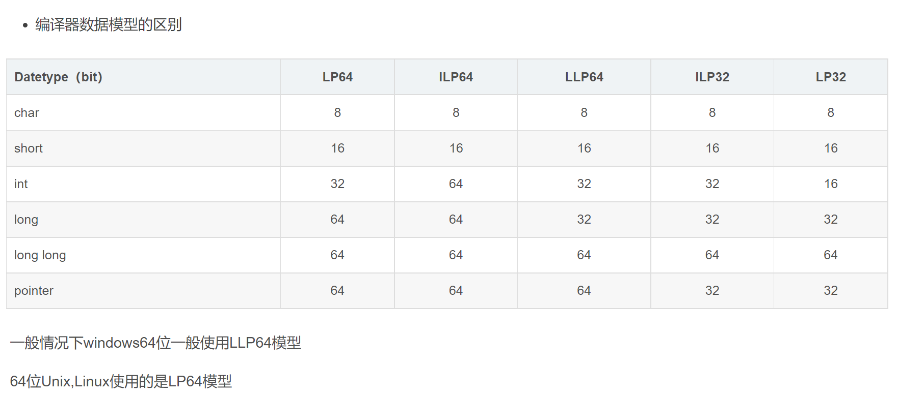

### 32/64位机器中，各数据类型所占位数

下图32位与64位类型所占字节数是在linux系统下的字节数，如果是windows下个别会有所变化，比如windows 64位下的long与unsigned long均为4字节

> 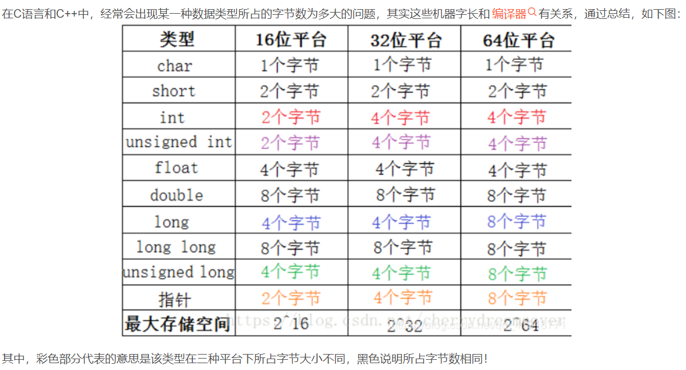

这即是说各个类型的变量长度是由编译器来决定的，而当前主流的编译器中一般是32位机器和64位机器中int型都是4个字节（例如，GCC）。下面列举在GCC编译器下32位机器和64位机器各个类型变量所占字节数：

> 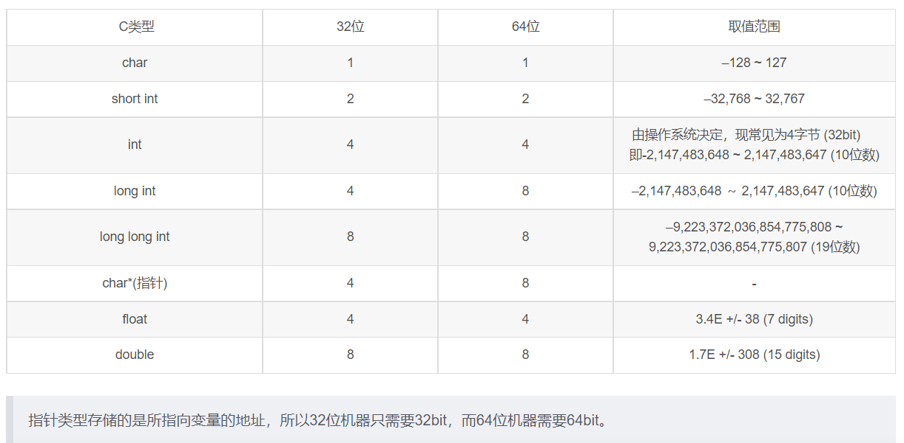


### assert() 断言（宏）

assert 宏的原型定义在 assert.h 中，其作用是如果它的条件返回错误，则终止程序执行。

```c
#include <assert.h> 
void assert( int expression );
```

其表达的意思就是，程序在我的假设条件下，能够正常良好的运作，其实就相当于一个 if 语句：

```c
if(假设成立) {
     程序正常运行；
}
else {
      报错&&终止程序！（避免由程序运行引起更大的错误）  
}
```

assert 的作用是现计算表达式 expression ，如果其值为假（即为0），那么它先向 stderr 打印一条出错信息,然后通过调用 abort 来终止程序运行。

使用 assert 的缺点是，频繁的调用会极大的影响程序的性能，增加额外的开销。

在调试结束后，可以通过在包含 #include 的语句之前插入 #define NDEBUG 来禁用 assert 调用，示例代码如下：

```c
#include 
#define NDEBUG 
#include
```

#### 用法总结与注意事项

**1)在函数开始处检验传入参数的合法性**

如:

```c
int resetBufferSize(int nNewSize) 
{ 
//功能:改变缓冲区大小, 
//参数:nNewSize 缓冲区新长度 
//返回值:缓冲区当前长度 
//说明:保持原信息内容不变 nNewSize<=0表示清除缓冲区 
assert(nNewSize >= 0); 
assert(nNewSize <= MAX_BUFFER_SIZE); 
 
... 
}
```

**2)每个assert只检验一个条件,因为同时检验多个条件时,如果断言失败,无法直观的判断是哪个条件失败**

不好:

```c
assert(nOffset>=0 && nOffset+nSize<=m_nInfomationSize); 
```

好:

```c
assert(nOffset >= 0); 
assert(nOffset+nSize <= m_nInfomationSize); 
```

**3)不能使用改变环境的语句,因为assert只在DEBUG个生效,如果这么做,会使用程序在真正运行时遇到问题**

错误: **assert(i++ < 100)**

这是因为如果出错，比如在执行之前i=100,那么这条语句就不会执行，那么i++这条命令就没有执行。

正确:

```c
assert(i < 100)
i++; 
```

**4)assert和后面的语句应空一行,以形成逻辑和视觉上的一致感**

**5)有的地方,assert不能代替条件过滤** 　　

程序一般分为Debug 版本和Release 版本，Debug 版本用于内部调试，Release 版本发行给用户使用。断言assert 是仅在Debug 版本起作用的宏，它用于检查"不应该"发生的情况。以下是一个内存复制程序，在运行过程中，如果assert 的参数为假，那么程序就会中止（一般地还会出现提示对话，说明在什么地方引发了assert）。


## C 函数

#### printf()

==printf()函数中，从右往左计算==

```cpp
int a = 1;
printf("%d，%d", a, ++a);
//输出为：2，2
```

#### putchar()

```cpp
putchar('\n')表示输出换行符，即实现回车换行的功能。
putchar是字符输出函数，每次只能输出一个字符。如：
putchar('a'); // 输出字符'a'
putchar('abc'); // 输出字符'c' ，多个字符时输出最后一个字符
```

#### sizeof()

os用8个字节表示一个地址

```cpp
int array[3] = {1, 2, 3};
int *p = array;
printf("%d\n", sizeof(array)); //3 * 4 = 12
printf("%d\n", sizeof(p)); //os用8个字节表示一个地址
printf("%d\n", sizeof(int)); //4
printf("%d\n", sizeof(int*));//os用8个字节表示一个地址
printf("%d\n", sizeof(char*));//os用8个字节表示一个地址
```


## C 位域

如果程序的结构中包含多个开关量，只有 **TRUE/FALSE** 变量，如下：

```c
struct
{
  unsigned int widthValidated;
  unsigned int heightValidated;
} status;
```

这种结构需要 8 字节的内存空间，但在实际上，在每个变量中，我们只存储 0 或 1。在这种情况下，C 语言提供了一种更好的利用内存空间的方式。如果您在结构内使用这样的变量，==您可以定义变量的宽度来告诉编译器，您将只使用这些字节。==例如，上面的结构可以重写成：

```c
struct
{
  unsigned int widthValidated : 1;
  unsigned int heightValidated : 1;
} status;
```

现在，上面的结构中，status 变量将占用 4 个字节的内存空间，但是只有 2 位被用来存储值。如果您用了 32 个变量，每一个变量宽度为 1 位，那么 status 结构将使用 4 个字节，但只要您再多用一个变量，如果使用了 33 个变量，那么它将分配内存的下一段来存储第 33 个变量，这个时候就开始使用 8 个字节。让我们看看下面的实例来理解这个概念：

```c
#include <stdio.h>
#include <string.h>
 
/* 定义简单的结构 */
struct
{
  unsigned int widthValidated;
  unsigned int heightValidated;
} status1;
 
/* 定义位域结构 */
struct
{
  unsigned int widthValidated : 1;
  unsigned int heightValidated : 1;
} status2;
 
int main( )
{
   printf( "Memory size occupied by status1 : %d\n", sizeof(status1));
   printf( "Memory size occupied by status2 : %d\n", sizeof(status2));
 
   return 0;
}
```

当上面的代码被编译和执行时，它会产生下列结果：

```
Memory size occupied by status1 : 8
Memory size occupied by status2 : 4
```

### 位域声明

有些信息在存储时，并不需要占用一个完整的字节，而只需占几个或一个二进制位。例如在存放一个开关量时，只有 0 和 1 两种状态，用 1 位二进位即可。为了节省存储空间，并使处理简便，C 语言又提供了一种数据结构，称为"位域"或"位段"。

**所谓"位域"是把一个字节中的二进位划分为几个不同的区域，并说明每个区域的位数。** **每个域有一个域名，允许在程序中按域名进行操作。这样就可以把几个不同的对象用一个字节的二进制位域来表示。**

典型的实例：

- 用 1 位二进位存放一个开关量时，只有 0 和 1 两种状态。
- 读取外部文件格式——可以读取非标准的文件格式。例如：9 位的整数。

#### 位域的定义和位域变量的说明

位域定义与结构定义相仿，其形式为：

```c
struct 位域结构名 
{

 位域列表

};
```

其中位域列表的形式为：

```c
type [member_name] : width ;
```

下面是有关位域中变量元素的描述：

| 元素        | 描述                                                         |
| :---------- | :----------------------------------------------------------- |
| type        | 只能为 int(整型)，unsigned int(无符号整型)，signed int(有符号整型) 三种类型，决定了如何解释位域的值。 |
| member_name | 位域的名称。                                                 |
| width       | 位域中位的数量。宽度必须小于或等于指定类型的位宽度。         |

带有预定义宽度的变量被称为**位域**。位域可以存储多于 1 位的数，例如，需要一个变量来存储从 0 到 7 的值，您可以定义一个宽度为 3 位的位域，如下：

```c
struct
{
  unsigned int age : 3;
} Age;
```

上面的结构定义指示 C 编译器，age 变量将只使用 3 位来存储这个值，如果您试图使用超过 3 位，则无法完成。

```c
struct bs{
    int a:8;
    int b:2;
    int c:6;
}data;
```

data 为 bs 变量，共占两个字节。其中位域 a 占 8 位，位域 b 占 2 位，位域 c 占 6 位。

**让我们再来看一个实例：**

```c
struct packed_struct {
  unsigned int f1:1;
  unsigned int f2:1;
  unsigned int f3:1;
  unsigned int f4:1;
  unsigned int type:4;
  unsigned int my_int:9;
} pack;
```

在这里，packed_struct 包含了 6 个成员：四个 1 位的标识符 f1..f4、一个 4 位的 type 和一个 9 位的 my_int。

**让我们来看下面的实例：**

```c
#include <stdio.h>
#include <string.h>
 
struct
{
  unsigned int age : 3;
} Age;
 
int main( )
{
   Age.age = 4;
   printf( "Sizeof( Age ) : %d\n", sizeof(Age) );
   printf( "Age.age : %d\n", Age.age );
 
   Age.age = 7;
   printf( "Age.age : %d\n", Age.age );
 
   Age.age = 8; // 二进制表示为 1000 有四位，超出
   printf( "Age.age : %d\n", Age.age );
 
   return 0;
}
```

当上面的代码被编译时，它会带有警告，当上面的代码被执行时，它会产生下列结果：

```c
Sizeof( Age ) : 4
Age.age : 4
Age.age : 7
Age.age : 0
```

**对于位域的定义尚有以下几点说明：**

- 一个位域存储在同一个字节中，如一个字节所剩空间不够存放另一位域时，则会从下一单元起存放该位域。也可以有意使某位域从下一单元开始。例如：

  ```c
  struct bs{
      unsigned a:4;
      unsigned  :4;    /* 空域 */
      unsigned b:4;    /* 从下一单元开始存放 */
      unsigned c:4
  }
  ```

  在这个位域定义中，a 占第一字节的 4 位，后 4 位填 0 表示不使用，b 从第二字节开始，占用 4 位，c 占用 4 位。

- 位域的宽度不能超过它所依附的数据类型的长度，成员变量都是有类型的，这个类型限制了成员变量的最大长度，`:` 后面的数字不能超过这个长度。

- 位域可以是无名位域，这时它只用来作填充或调整位置。无名的位域是不能使用的。例如：

  ```c
  struct k{
      int a:1;
      int  :2;    /* 该 2 位不能使用 */
      int b:3;
      int c:2;
  };

从以上分析可以看出，位域在本质上就是一种结构类型，不过其成员是按二进位分配的。

#### 位域的使用

位域的使用和结构成员的使用相同，其一般形式为：

```
位域变量名.位域名
位域变量名->位域名
```

位域允许用各种格式输出。

请看下面的实例：

```c
int main(){
    struct bs{
        unsigned a:1;
        unsigned b:3;
        unsigned c:4;
    } bit,*pbit;
    bit.a=1;    /* 给位域赋值（应注意赋值不能超过该位域的允许范围） */
    bit.b=7;    /* 给位域赋值（应注意赋值不能超过该位域的允许范围） */
    bit.c=15;    /* 给位域赋值（应注意赋值不能超过该位域的允许范围） */
    printf("%d,%d,%d\n",bit.a,bit.b,bit.c);    /* 以整型量格式输出三个域的内容 */
    pbit=&bit;    /* 把位域变量 bit 的地址送给指针变量 pbit */
    pbit->a=0;    /* 用指针方式给位域 a 重新赋值，赋为 0 */
    pbit->b&=3;    /* 使用了复合的位运算符 "&="，相当于：pbit->b=pbit->b&3，位域 b 中原有值为 7，与 3 作按位与运算的结果为 3（111&011=011，十进制值为 3） */
    pbit->c|=1;    /* 使用了复合位运算符"|="，相当于：pbit->c=pbit->c|1，其结果为 15 */
    printf("%d,%d,%d\n",pbit->a,pbit->b,pbit->c);    /* 用指针方式输出了这三个域的值 */
}
```

上例程序中定义了位域结构 bs，三个位域为 a、b、c。说明了 bs 类型的变量 bit 和指向 bs 类型的指针变量 pbit。这表示位域也是可以使用指针的。


## typedef

C 语言提供了 **typedef** 关键字，您可以使用它来为类型取一个新的名字。下面的实例为单字节数字定义了一个术语 **BYTE**：

```c
typedef unsigned char BYTE;
```

在这个类型定义之后，标识符 BYTE 可作为类型 **unsigned char** 的缩写，例如：

```c
BYTE  b1, b2;
```

==按照惯例，定义时会大写字母，以便提醒用户类型名称是一个象征性的缩写==，但您也可以使用小写字母，如下：

```c
typedef unsigned char byte;
```

您也可以使用 **typedef** 来为用户自定义的数据类型取一个新的名字。例如，您可以对结构体使用 typedef 来定义一个新的数据类型名字，然后使用这个新的数据类型来直接定义结构变量，如下：

```c
#include <stdio.h>
#include <string.h>
 
typedef struct Books
{
   char  title[50];
   char  author[50];
   char  subject[100];
   int   book_id;
} Book;
 
int main( )
{
   Book book;
 
   strcpy( book.title, "C 教程");
   strcpy( book.author, "Runoob"); 
   strcpy( book.subject, "编程语言");
   book.book_id = 12345;
 
   printf( "书标题 : %s\n", book.title);
   printf( "书作者 : %s\n", book.author);
   printf( "书类目 : %s\n", book.subject);
   printf( "书 ID : %d\n", book.book_id);
 
   return 0;
}
```

当上面的代码被编译和执行时，它会产生下列结果：

```c
书标题 : C 教程
书作者 : Runoob
书类目 : 编程语言
书 ID : 12345
```

### typedef vs #define

**#define** 是 C 指令，用于为各种数据类型定义别名，与 **typedef** 类似，但是它们有以下几点不同：

- **typedef** 仅限于为类型定义符号名称，**#define** 不仅可以为类型定义别名，也能为数值定义别名，比如您可以定义 1 为 ONE。
- **typedef** 是由编译器执行解释的，**#define** 语句是由预编译器进行处理的。

下面是 #define 的最简单的用法：

```c
#include <stdio.h>
 
#define TRUE  1
#define FALSE 0
 
int main( )
{
   printf( "TRUE 的值: %d\n", TRUE);
   printf( "FALSE 的值: %d\n", FALSE);
 
   return 0;
}
```

当上面的代码被编译和执行时，它会产生下列结果：

```c
TRUE 的值: 1
FALSE 的值: 0
```


## 输入输出

### 简单举例

#### scanf()

空格、回车也是字符，下面情况也会被读入

```cpp
scanf("%c%c%c", &a, &b, &c);
输入：a b c
输出：a b
原因：空格被读入，不再作为分隔符
正确输入：abc
```

下面图示问题的解决方法

- 将一条 scanf() 语句分为多条
- 这样输入  `123a6.7`   编译器自动判定每个输入的结束

> 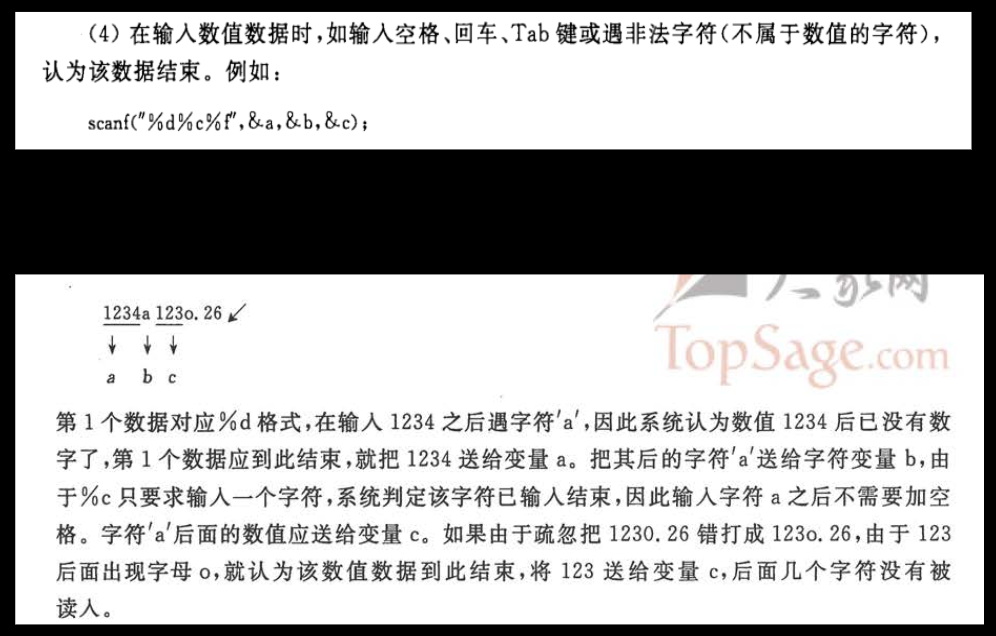

#### getchar()

```cpp
char c;
c = getchar();
```

#### putchar()

```cpp
char c = 'a';
putchar(c);
```

#### puts()

与printf()的区别

1. 自动加入换行符
2. printf()支持多种花样输出，而puts()就是输出字符串

```cpp
puts("请输入一个字符：");
```

#### gets()

```cpp
char str[100];
gets( str);
```

### 标准文件

C 语言把所有的设备都当作文件。所以设备（比如显示器）被处理的方式与文件相同。以下三个文件会在程序执行时自动打开，以便访问键盘和屏幕。

| 标准文件 | 文件指针 | 设备     |
| :------- | :------- | :------- |
| 标准输入 | stdin    | 键盘     |
| 标准输出 | stdout   | 屏幕     |
| 标准错误 | stderr   | 您的屏幕 |

文件指针是访问文件的方式，本节将讲解如何从屏幕读取值以及如何把结果输出到屏幕上。

**C 语言中的 I/O (输入/输出) 通常使用 printf() 和 scanf() 两个函数。**

**scanf() 函数用于从标准输入（键盘）读取并格式化， printf() 函数发送格式化输出到标准输出（屏幕）。**

```c
#include <stdio.h>      // 执行 printf() 函数需要该库
int main()
{
    printf("菜鸟教程");  //显示引号中的内容
    return 0;
}
```

编译以上程序，输出结果为：

```c
菜鸟教程
```

**实例解析：**

- 所有的 C 语言程序都需要包含 **main()** 函数。 代码从 **main()** 函数开始执行。
- **printf()** 用于格式化输出到屏幕。**printf()** 函数在 **"stdio.h"** 头文件中声明。
- **stdio.h** 是一个头文件 (标准输入输出头文件) and **#include** 是一个预处理命令，用来引入头文件。 当编译器遇到 **printf()** 函数时，如果没有找到 **stdio.h** 头文件，会发生编译错误。
- **return 0;** 语句用于表示退出程序。

#### %d 格式化输出整数

```c
#include <stdio.h>
int main()
{
    int testInteger = 5;
    printf("Number = %d", testInteger);
    return 0;
}
```

编译以上程序，输出结果为：

```
Number = 5
```

在 printf() 函数的引号中使用 "%d" (整型) 来匹配整型变量 testInteger 并输出到屏幕。

#### %f 格式化输出浮点型数据

```c
#include <stdio.h>
int main()
{
    float f;
    printf("Enter a number: ");
    // %f 匹配浮点型数据
    scanf("%f",&f);
    printf("Value = %f", f);
    return 0;
}
```

### getchar() & putchar() 函数

**int getchar(void)** 函数==从屏幕读取下一个可用的字符，并把它返回为一个整数。==这个函数在同一个时间内只会读取一个单一的字符。您可以在循环内使用这个方法，以便从屏幕上读取多个字符。

**int putchar(int c)** ==函数把字符输出到屏幕上，并返回相同的字符。==这个函数在同一个时间内只会输出一个单一的字符。您可以在循环内使用这个方法，以便在屏幕上输出多个字符。

请看下面的实例：

```c
#include <stdio.h>
 
int main( )
{
   int c;
 
   printf( "Enter a value :");
   c = getchar( );
 
   printf( "\nYou entered: ");
   putchar( c );
   printf( "\n");
   return 0;
}
```

当上面的代码被编译和执行时，它会等待您输入一些文本，当您输入一个文本并按下回车键时，程序会继续并只会读取一个单一的字符，显示如下：

```shell
$./a.out
Enter a value :runoob

You entered: r
```

### gets() & puts() 函数

**char \*gets(char \*s)** 函数==从 **stdin** 读取一行到 **s** 所指向的缓冲区，直到一个终止符或 EOF。==

**int puts(const char \*s)** 函数==把字符串 s 和一个尾随的换行符写入到 **stdout**。==

```c
#include <stdio.h>
 
int main( )
{
   char str[100];
 
   printf( "Enter a value :");
   gets( str );
 
   printf( "\nYou entered: ");
   puts( str );
   return 0;
}
```

当上面的代码被编译和执行时，它会等待您输入一些文本，当您输入一个文本并按下回车键时，程序会继续并读取一整行直到该行结束，显示如下：

```
$./a.out
Enter a value :runoob

You entered: runoob
```

### scanf() 和 printf() 函数

**int scanf(const char \*format, ...)** 函数从标准输入流 **stdin** 读取输入，并根据提供的 **format** 来浏览输入。

**int printf(const char \*format, ...)** 函数把输出写入到标准输出流 **stdout** ，并根据提供的格式产生输出。

**format** 可以是一个简单的常量字符串，但是您可以分别指定 %s、%d、%c、%f 等来输出或读取字符串、整数、字符或浮点数。还有许多其他可用的格式选项，可以根据需要使用。如需了解完整的细节，可以查看这些函数的参考手册。现在让我们通过下面这个简单的实例来加深理解：

```c
#include <stdio.h>
int main( ) {
 
   char str[100];
   int i;
 
   printf( "Enter a value :");
   scanf("%s %d", str, &i);
 
   printf( "\nYou entered: %s %d ", str, i);
   printf("\n");
   return 0;
}
```

当上面的代码被编译和执行时，它会等待您输入一些文本，当您输入一个文本并按下回车键时，程序会继续并读取输入，显示如下：

```
$./a.out
Enter a value :runoob 123

You entered: runoob 123 
```

在这里，应当指出的是，scanf() 期待输入的格式与您给出的 %s 和 %d 相同，这意味着您必须提供有效的输入，比如 "string integer"，如果您提供的是 "string string" 或 "integer integer"，它会被认为是错误的输入。另外，在读取字符串时，只要遇到一个空格，scanf() 就会停止读取，所以 "this is test" 对 scanf() 来说是三个字符串。


# 嵌入式常用C语言语法 - 小智课程

##### 类型&字节转换

> 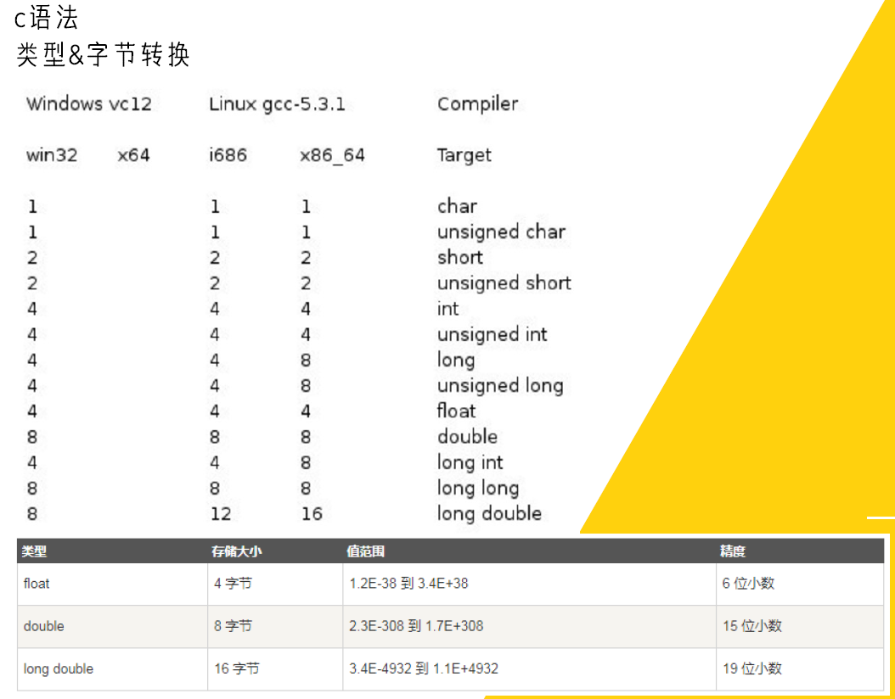

##### define语法

define只是单纯替换，如果是运算记得加括号

> 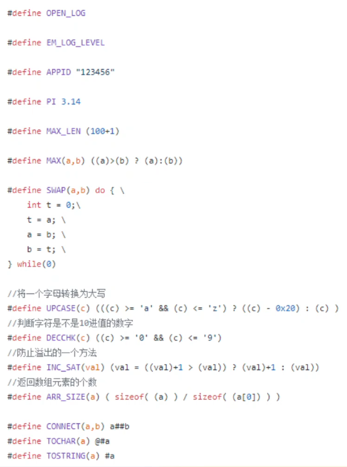

防止多个文件调用重定义问题

> 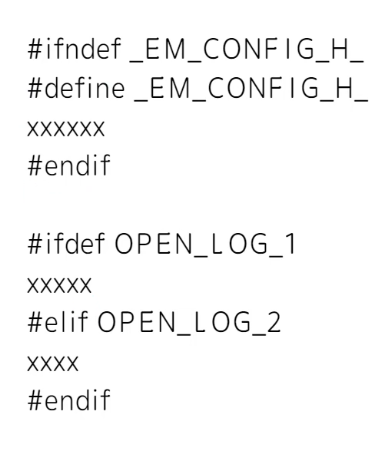

define与typedef（替换与别名）

> 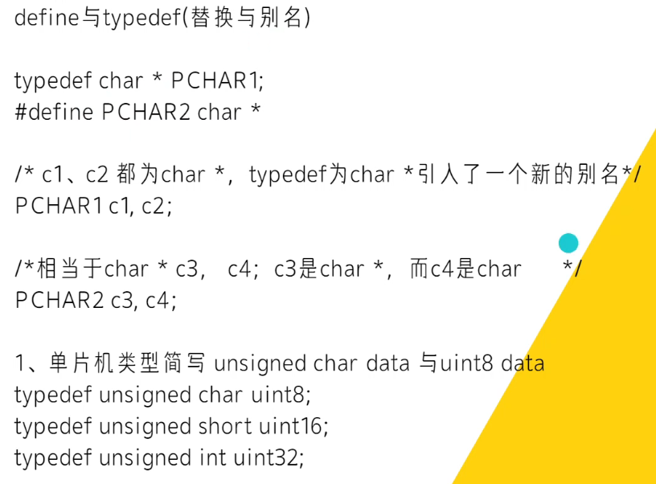

##### enum语法

enum用于变量的枚举。

定义枚举类型的变量，变量的取值将被限制

> 

##### struct语法

> 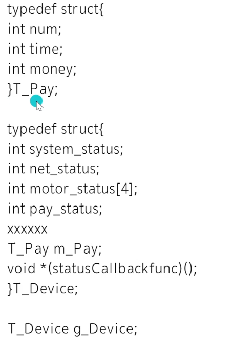

##### 指针

变量为了表示数据而生，指针为了传递数据为生。

指针没有那么神秘，它就是一个变量，不过放的是别的变量地址。

> 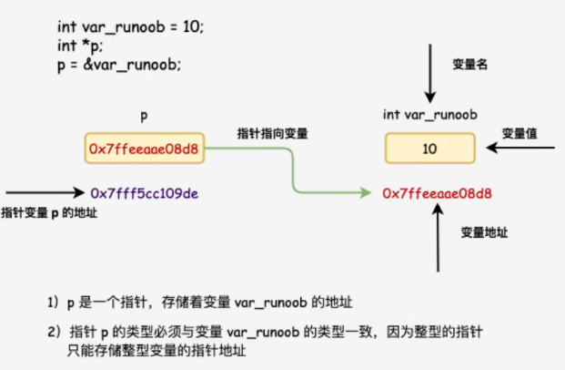

例程

> 

##### 函数指针

```
typedef int (*fun_ptr)(int,int); // 声明一个指向同样参数、返回值的函数指针类型
```

```cpp
#include <stdio.h>
 
int max(int x, int y)
{
    return x > y ? x : y;
}
 
int main(void)
{
    /* p 是函数指针 */
    int (* p)(int, int) = & max; // &可以省略
    int a, b, c, d;
 
    printf("请输入三个数字:");
    scanf("%d %d %d", & a, & b, & c);
 
    /* 与直接调用函数等价，d = max(max(a, b), c) */
    d = p(p(a, b), c); 
 
    printf("最大的数字是: %d\n", d);
 
    return 0;
}
```

##### 回调函数

**函数指针作为某个函数的参数**

函数指针变量可以作为某个函数的参数来使用的，回调函数就是一个通过函数指针调用的函数。

简单讲：回调函数是由别人的函数执行时调用你实现的函数。

>以下是来自知乎作者常溪玲的解说：
>
>你到一个商店买东西，刚好你要的东西没有货，于是你在店员那里留下了你的电话，过了几天店里有货了，店员就打了你的电话，然后你接到电话后就到店里去取了货。在这个例子里，你的电话号码就叫回调函数，你把电话留给店员就叫登记回调函数，店里后来有货了叫做触发了回调关联的事件，店员给你打电话叫做调用回调函数，你到店里去取货叫做响应回调事件。

**实例**

实例中 populate_array 函数定义了三个参数，其中**第三个参数是函数的指针**，通过该函数来设置数组的值。

实例中我们定义了回调函数 getNextRandomValue，它返回一个随机值，它作为一个函数指针传递给 populate_array 函数。

populate_array 将调用 10 次回调函数，并将回调函数的返回值赋值给数组。

```cpp
#include <stdlib.h>  
#include <stdio.h>
 
// 回调函数
void populate_array(int *array, size_t arraySize, int (*getNextValue)(void))
{
    for (size_t i=0; i<arraySize; i++)
        array[i] = getNextValue();
}
 
// 获取随机值
int getNextRandomValue(void)
{
    return rand();
}
 
int main(void)
{
    int myarray[10];
    /* getNextRandomValue 不能加括号，否则无法编译，因为加上括号之后相当于传入此参数时传入了 int , 而不是函数指针*/
    populate_array(myarray, 10, getNextRandomValue);
    for(int i = 0; i < 10; i++) {
        printf("%d ", myarray[i]);
    }
    printf("\n");
    return 0;
}
```

> 

##### 数据拷贝

malloc 申请静态内存，裸机不推荐，如果频繁的申请内存，会造成内存浪费

如下图，开始申请的3B的内存，释放后，再申请4B的内容就会把前面的3B空出来浪费掉。

> 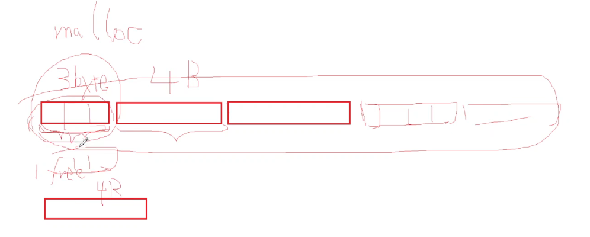

动态申请内存

> 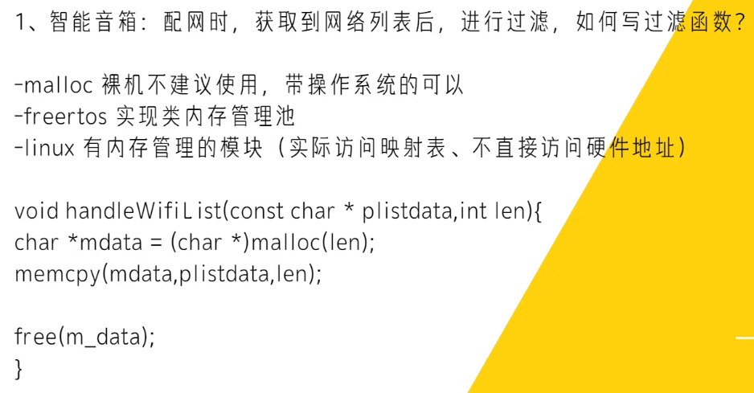

##### 数据结构

数组、栈、队列、链表、树

> 


# 基础语法学习 - 上官新版C语言

### 函数

#### 函数 - 一维数组作形参

- 数组作为函数参数传递的是，数组的首地址（地址传递）。
  - 并且，一般在传递数组的同时，传递数组的大小。
  - `len = sizeof(array) / sizeof(array[0]); `
- `printArray(array, len);`   数组名代表的是整个数组的首地址
- `printArray(&array[0], len);`   第一个元素的地址也是数组的首地址
- 由于传递的是数组的首地址，如果在函数中对数组的内容进行修改，则原数组中的内容也被修改（实参传递地址给形参）。

```cpp
#include <stdio.h>
//形参中不存在数组的概念，即使括号中约定了数组的大小，也无效
void printArray(int array[], int len) 
{
    //在操作系统中用8个字节表示一个地址
	printf("printArray: array的大小是：%d\n", sizeof(array));
	putchar('\n');
}
int main()
{
    int len = 0;
    int array[5] = {1, 2, 3, 4, 5};
    len = sizeof(array) / sizeof(array[0]); 
    printf("main: array的大小是：%d\n", sizeof(array));  //代表整个数组的大小，输出 5 * 4 = 20
    printArray(array, len);
    return 0;
}
```

#### 函数 - 二维数组作形参

```cpp
#include <stdio.h>

int getArrayData(int (*p)[4], int lines, int columns) //数组指针来接收二维数组的地址，行数，列数
{ 
    int data;
    return data = *(*(p + lines) + columns);
}

int main()
{
    int array[3][4] = {{1, 2, 3, 4}, {5, 6, 7, 8}, {9, 10, 11, 12}};
	int data;
    data = getArrayData(array, 1, 1); //获取array[1][1]的值
    return 0;
}
```


### 指针

各种指针的定义

> 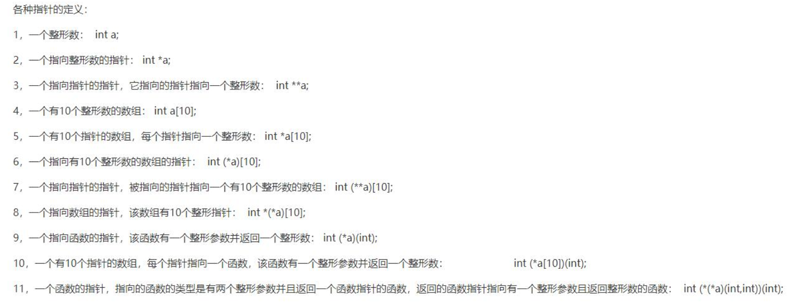

既然指针在操作系统中都是用8个字节表示一个地址，那么为什么定义的时候需要声明什么类型的指针变量呢？

> 声明类型以后，在p+1的时候，编译器才知道应该跨越多少字节（如指向`a[1]`，`a[1][1]` 的指针在加1后偏移的地址不同）才能指向下一个变量的地址。

#### 用指针指向一块地址

==注意要把常量转换成无符号整形指针的数据类型，一般还要加 volatile 防止被优化==

```c
volatile unsigned int *p = (volatile unsigned int *)0x000051EF;
printf("p = 0x%p\n", p);
```

#### 指针变量指向数组

C语言中，数组名代表数组中首元素的地址

```cpp
p = &a[0];  //p的值是a[0]的地址
p = a;   //p的值是数组a首元素(即a[0])的地址
```

#### 指针变量和常量指针

```cpp
int array[3] = {1, 2, 3};
int *p = array;
for (int i = 0; i < 3; i++) {
    printf("%d", *p++); //指针变量可以改变，指向数组下一个元素的地址
    printf("%d", *array++); //错误，array数组名为常量指针，指向固定地址  
}
```

#### 函数指针

函数地址（==函数名就是函数地址==）

> 如果在程序中定义了一个函数，在编译时，编译系统为函数代码分配了一段存储空间，这段存储空间的起始地址（又称入口地址）称为这个函数的指针。

定义一个函数指针变量

```c
int getData(int, int);
int (*p)(int, int);  
//如果不加括号 int *p(int a, int b); 括号优先级更高，代表一个返回值为整形指针的函数，所以必须加括号
p = getData; //函数指针指向函数，函数名就是函数地址
int data;
data = (*p)(1，2); //*表示取值运算符，调用p指向的函数
```

案例：回调函数

> 回调函数就是一个通过函数指针调用的函数。如果你把函数的指针（地址）作为参数传递给另一个函数，当这个指针被用来调用其所指向的函数时，我们就说这是回调函数。

```c
#include<stdio.h>

int Callback_1(int x) // Callback Function 1
{
    printf("Hello, this is Callback_1: x = %d ", x);
    return 0;
}

int Callback_2(int x) // Callback Function 2
{
    printf("Hello, this is Callback_2: x = %d ", x);
    return 0;
}

int Callback_3(int x) // Callback Function 3
{
    printf("Hello, this is Callback_3: x = %d ", x);
    return 0;
}

int Handle(int y, int (*Callback)(int))
{
    printf("Entering Handle Function. ");
    Callback(y);
    printf("Leaving Handle Function. ");
}

int main()
{
    int a = 2;
    int b = 4;
    int c = 6;
    printf("Entering Main Function. ");
    Handle(a, Callback_1);
    Handle(b, Callback_2);
    Handle(c, Callback_3);
    printf("Leaving Main Function. ");
    return 0;
}
```

运行结果：

```
Entering Main Function.
Entering Handle Function.
Hello, this is Callback_1: x = 2
Leaving Handle Function.
Entering Handle Function.
Hello, this is Callback_2: x = 4
Leaving Handle Function.
Entering Handle Function.
Hello, this is Callback_3: x = 6
Leaving Handle Function.
Leaving Main Function.
```

> 可以看到，并不是直接把int Handle(int (*Callback)()) 改成 int Handle(int (*Callback)(int)) 就可以的，而是通过另外增加一个参数来保存回调函数的参数值，像这里 int Handle(int y, int (*Callback)(int)) 的参数 y。同理，可以使用多个参数的回调函数。

#### 指针数组

定义

> 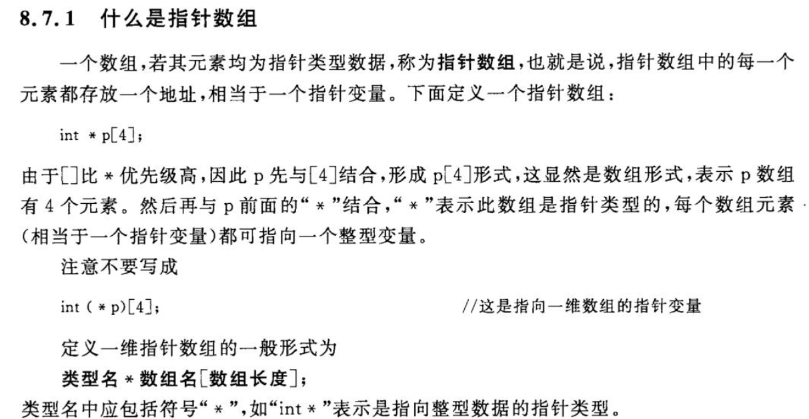

举例

```c
#include <stdio.h>
int main()
{
    int a = 10, b = 20, c = 30;
    int *p[3] = {&a, &b, &c};
    for (int i = 0; i < 3; i++)
        printf("%d ", *p[i]); //[]优先级大于*
    return 0;
}
```

函数指针数组

```c
int ret = 0;
int (*pfunc[3])(int, int) = {getMin, getMax, getSum};
for (int i = 0; i < 3; i++) {
    ret = (*pfunc[i])(10, 20);
}
```

#### 指针函数

定义

> 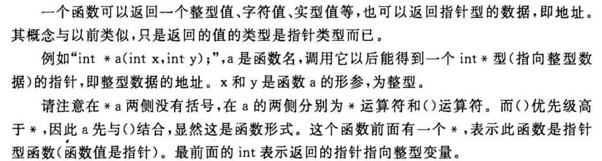

举例

```c
#include <stdio.h>
//二维数组表示一共3个人，每个人有4科成绩，调用函数返回一个人的4科成绩地址
int *getPosPerson(int pos, int (*pstu)[4])
{
    int *p;
    p = pstu + pos;
    return p;
}

int main()
{
    int scores[3][4] = {
        {1, 2, 3, 4},
        {5, 6, 7, 8},
        {9, 10, 11, 12}
    };
    int *ppos;
    int pos;
    scanf("%d", &pos);
    ppos = getPosPerson(pos, scores);
    for (int i = 0; i < 4; i++)
        printf("%d ", *ppos++);
    return 0;
}
```

#### 二级指针

定义

```c
int data = 100;
int *p = &data;
int **pp = &p;   
//可以定义int *pp = &p, 但是在取内容时只能向上取一级，即*pp 为 p的地址
printf("%d", **pp);
```

举例

```c
#include <stdio.h>
//二维数组表示一共3个人，每个人有4科成绩，调用函数传入二级指针，将一个人的4科成绩地址放入二级指针指向的地址
void getPosPerson(int pos, int (*pstu)[4], int **ppos)
{
    *ppos = (int *)(pstu + pos);
}

int main()
{
    int scores[3][4] = {
        {1, 2, 3, 4},
        {5, 6, 7, 8},
        {9, 10, 11, 12}
    };
    int *ppos;
    int pos;
    scanf("%d", &pos);
    getPosPerson(pos, scores, &ppos);
    for (int i = 0; i < 4; i++)
        printf("%d ", *ppos++);
    return 0;
}
```

#### 数组指针

二级指针和二维数组注意：

> 不能直接用二级指针指向二维数组，int **p = scores后虽然指向的地址相同，但是含义类型并不相同，错误，应该用数组指针指向二维数组。

```c
int scores[3][4] = {
        {1, 2, 3, 4},
        {5, 6, 7, 8},
        {9, 10, 11, 12}
    };
int **p;
//p = scores;  错误 
int (*p2)[4] = scores; //数组指针，定义一个指针，指向一个数组，数组指针才是真正等同于二维数组名
p = &p2;  //可以用二级指针指向数组指针的地址
**p = 100; //修改的是scores[0][0]的值
```


### 二维数组

#### 二维数组的初始化

1. 按行列初始化

   > 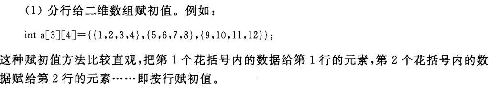

2. 没明确行列，类似一维数组

   > 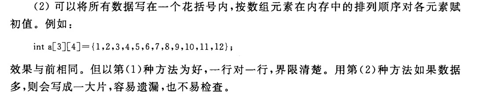

3. 部分赋初值

   1. 
   2. 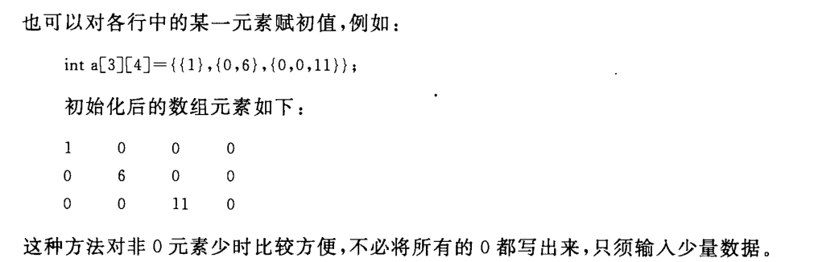
   3. 
   4. 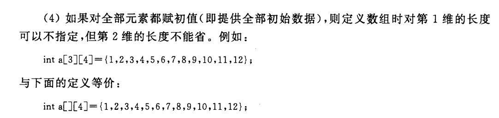

#### 二维数组与指针

C语言规定数组名代表数组首元素地址

```c
int a[3][3];

a[0],a[1],a[2] 是一维数组名,则
a[0] 代表一维数组a[0]中第0列元素的地址，即

a[0] = &a[0][0]
a[1] = &a[1][0]
a[2] = &a[2][0]
------------------------
a = &a[0]
*a = a[0]
**a = a[0][0]
a + 1 = &a[1]
*(a + 1) = a[1]
a[0] + 1 = &a[0][1] = *(a + 0) + 1   
------------------------------

```

参考

> 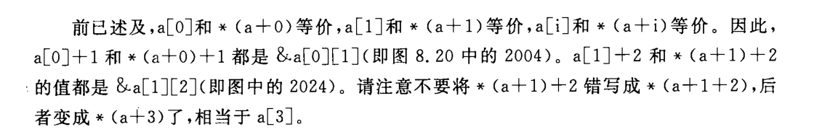

> 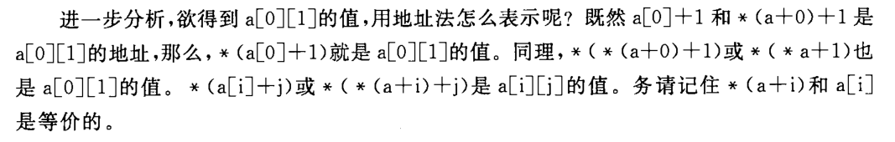

总结

> 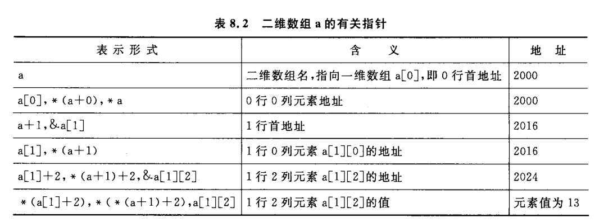

#### 二维数组的遍历

操作数组名

```c
int array[3][4] = {{1, 2, 3, 4}, {5, 6, 7, 8}, {9, 10, 11, 12}};

for (int i = 0; i < 3; i++)
    for (int j = 0; j < 4; j++) {
        //几种写法一样效果
        printf("%d ", array[i][j]);
        printf("%d ", *(array[i] + j));
        printf("%d ", *(*(array + i) + j));
    }
```

操作指针

```cpp
int array[3][4] = {{1, 2, 3, 4}, {5, 6, 7, 8}, {9, 10, 11, 12}};

int *p1 = &array[0][0];
int (*p2)[4] = array;  //数组指针，定义一个指针，指向一个数组，数组指针才是真正等同于二维数组名

for (int i = 0; i < 3; i++)
    for (int j = 0; j < 4; j++) {
        printf("%d ", *p1++);
        printf("%d ", *(*(p2 + i) + j));
    }
```


### 字符串

#### 定义

C语言并不存在字符串这个数据类型，而是用字符数组来保存字符串，但字符数组和字符串是完全不同的两个概念。

```c
/*字符数组赋初值*/
char cArr[] = {'I'，'L'，'O'，'V'，'E'，'C'};
/*字符串赋初值*/
char sArr[] = "ILOVEC";

也可以写成如下等价形式：

/*字符数组赋初值*/
char cArr[6] = {'I'，'L'，'O'，'V'，'E'，'C'};
/*字符串赋初值*/
char sArr[7] = "ILOVEC";
```

对于字符串 sArr，可以直接使用 printf 的 %s 打印其内容；而对字符数组，很显然使用 printf 的 %s 打印其内容是不合适的。

```c
//输出字符串方式
printf("%s", sArr);
puts(sArr);
```

#### 字符数组和字符串的区别

1. 字符串指针变量本身是一个变量，用于存放字符串的首地址。而字符串本身是存放在以该首地址为首的一块连续的内存空间中并以 `\0` 作为串的结束。

   ```c
   char str[] = "hello";   //字符串数组，可以修改数组内容
   char *pchar = "hello";  //字符串指针变量，此时的"hello"为字符串常量，不能再通过指针来修改其内容
   ```

2. 字符数组是由若干个数组元素组成，它可用来存放整个字符串。

3. 字符串指针变量只是一个指向字符串首地址的指针变量，我们可以对指针变量进行赋值，确定其指向的地址空间==（指针指向的字符串为字符串常量，不能再通过指针来修改其内容）==；
   而字符串数组在定义时便在内存中为其分配了空间，也就是说，我们不能随意的改变这个数组的地址。

   ```cpp
   对字符串指针方式 char *ps="C Language"; 定义时可以写为：
   char *ps;
   ps="C Language";
   -------------------------------------
   而对数组方式： static char st[]={"C Language"}; 只能对字符数组的各元素逐个赋值,不能写为：
   char st[20];
   st={"C Language"};  //错误
   ```

4. 差别体现在sizeof的值。用字符串数组定义的"helloword"占11个字节，是因为"helloword"加上结尾的"\0"一共十一个char型字符，每个char型字符占1个字节；而用字符串指针变量定义时，sizeof的值仅为4个字节，这是因为s2是一个指针，在32位系统中，地址占4个字节。

   ```c
   我们通过一个小程序来认识这个区别。
   
   #include <stdio.h>
   #include <string.h>
   
   int main()
   {
       char c1[] ="helloworld";
       char *c2 = "helloworld";
   
       printf("sizeof(s1) :  %d %d\n", sizeof(c1), sizeof(c2));
       printf("strlen(s2) :  %d %d\n", strlen(c1), strlen(c2));
   
       return 0;
   }
   这段程序运行的结果是：
       sizeof(s1):  11  4
       strlen(s2):  10  10
   
   "helloword"一共10个字符，所以strlen的值都为10；
   ```

#### sizeof()和strlen()的区别

```c
char str[] = "hello";  //结尾有'\0'
sizeof(str);  //6，计算的是整个空间的长度
strlen(str);  //5，只计算有效字符，会忽略结尾的'\0'

char *p = "hello";
sizeof(p);  //8，p是一个char *
strlen(p);  //5
```

#### 动态开辟字符串

常用函数，需要包含头文件`#include <stdlib.h>`

> 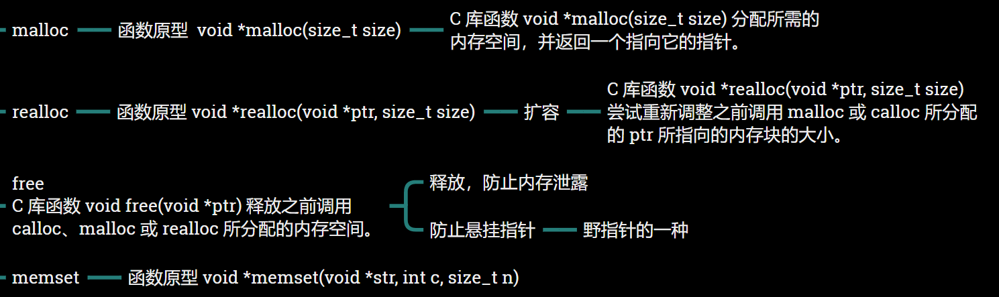

举例

```c
#include <stdio.h>
#include <stdlib.h>
#include <string.h>

int main()
{
    char *p; //未赋初值，为野指针
    p = (char *)malloc(1); //p有了具体的内存指向
    *p = 'c';
    free(p);  //释放空间，防止内存泄漏
    
    p = (char *)malloc(12);  //开辟新空间
    strcpy(p, "yanghaoqing");  //为新空间赋值
    
    int len = strlen("112123123adfadfasdf");
    realloc(p, len - 12 + 1);  //扩容，调整之前分配的空间，起始地址并未变化
    strcpy(p, "112123123adfadfasdf");
    
    puts(p); 
    free(p);  //释放空间
    p = NULL;  //防止为悬挂指针，防止野指针
    return 0;
}
```

#### 野指针

**悬挂指针：**指针的指向内存被删除导致

1. 例子1：

   - 退出if的范围之后，c变量不再存在，p指向的地址被操作系统回收了。

   - 指针被悬挂了，后续如果再被使用就会有问题。

   - `int *p = nullptr;if (p == nullptr){undefined  int c = 100;p = &c;}`

2. 例子2：变量p指向被释放了，指针被悬挂了，后续如果再被使用就会有问题。

   - `int *p = nullptr;{undefined  int *q = new intp = q;delete q;}`

**野指针：**指针变量未初始化

指向不可用内存区域的指针（非法内存，垃圾内存）。野指针不是NULL指针，是指向“垃圾”内存的指针。人们一般不会错用NULL指针，因为if语句能够判断。但是野指针是很危险的，if不能判断一个指针是正常指针还是野指针。

野指针的成因主要有3种：

1. 指针变量没有被初始化。 任何指针（全局指针变量除外，全局指针变量为NULL）变量在刚被创建的时候不会自动成为NULL指针，它的缺省值是随机的。所以指针变量在创建的时候，要么设置为NULL，要么指向合法的内存。
2. 指针p被free/delete之后，没有置为NULL(最好加一句p = NULL;)，经常性的我们会以为p是个合法的指针。他们只是把指针指向的内存给释放掉，并没有把指针本身干掉，此时指针指向的就是“垃圾”内存。所以我们应该在释放完之后，立即将指针置为NULL，防止出现乱指的情况
3. 指针操作超越了变量的作用范围。不要返回指向栈内存的指针或引用，因为栈内存在函数结束时会被释放。也就是说指向的对象的声明周期已经结束了，然而我们还使用该指针访问该对象。

#### 常用字符串函数

可能需要包含头文件`#include <string.h>`

**输出字符串**

```c
char *p = "yanghaoqing";
puts("请输入一个字符串：");  //输出字符串后，会自动输出一个回车符
puts(p);
printf("%s\n", p);
```

**获取字符串**

gets() 函数原型

```c
include <stdio.h>
char *gets(char *str);   
```

gets() 函数注意事项

1. 可以直接输入带空格的字符串

2. gets() 函数的功能是从输入缓冲区中读取一个字符串存储到字符指针变量 str 所指向的内存空间。缓冲区（Buffer）又称为缓存（Cache），是内存空间的一部分。有时候，从键盘输入的内容，或者将要输出到显示器上的内容，会暂时进入缓冲区，待时机成熟，再一股脑将缓冲区中的所有内容“倒出”，我们才能看到变量的值被刷新，或者屏幕产生变化。

3. 因为本函数可以无限读取，易发生溢出。如果溢出，多出来的字符将被写入到堆栈中，这就覆盖了堆栈原先的内容，破坏一个或多个不相关变量的值。

4. 关于使用 gets() 函数需要注意：使用 gets() 时，系统会将最后“敲”的换行符从缓冲区中取出来，然后丢弃，所以缓冲区中不会遗留换行符。这就意味着，如果前面使用过 gets()，而后面又要从键盘给字符变量赋值的话就不需要吸收回车清空缓冲区了，因为缓冲区的回车已经被 gets() 取出来扔掉了。

   ```c
   # include <stdio.h>
   int main(void)
   {
       char str[30];
       char ch;
       printf("请输入字符串：");
       gets(str);
       printf("%s\n", str);
       scanf("%c", &ch);
       printf("ch = %c\n", ch);
       return 0;
   }
   ```

   > 输出结果是：
   > 请输入字符串：i love you
   > i love you
   > Y
   > ch = Y
   >
   > 我们看到，没有清空缓冲区照样可以输入'Y'，因为 gets() 已经将缓冲区中的回车取出来丢掉了。如果前面使用的不是 gets() 而是 scanf，那么通过键盘给 ch 赋值前就必须先使用 getchar() 清空缓冲区。

gets() 函数使用例程

```c
char *p = "yanghaoqing";  //不能更改指向的字符串
char str[128] = "\0";   //字符数组初始化\0
scanf("%s", str);
gets(str); 
```

对字符指针变量所指向的内存单元进行初始化也可以用 gets()

```c
char str[30];
char *string = str;  //一定要先将指针变量初始化
gets(string);  //也可以写成gets(str);
printf("%s\n", string);  //输出参数是已经定义好的“指针变量名”
```

**strncpy()函数**

表示把src所指向的字符串中以src地址开始的前n个字节复制到dest所指的数组中，并返回被赋值后的dest。

`char *strncpy(char *dest, const char *src, int n)`

**strcpy()函数**

自己实现字符串拷贝函数 strcpy() 和 strncpy()函数

```c
#include <stdio.h>

char *myStrcpy(char *des, char *src)
{
    if (des == NULL || src == NULL)
        return NULL;
    char *bak = des;
    while (*src != '\0')
        *des++ = *src++;
    *des = '\0';
    return bak;
}

char *myStrncpy(char *des, char *src, int count)
{
    if (des == NULL || src == NULL)
        return NULL;
    char *bak = des;
    while (*src != '\0' && count-- > 0)
        *des++ = *src++;
    if (count > 0)
        while (count-- > 0) 
            *des = '\0';
    else
	    *des = '\0';
    return bak;
}

int main()
{
    char str[128] = "\0";
    char *p = "1231asdfas";
    myStrcpy(str, p);
    puts(str);
    myStrncpy(str, p, 5);
    puts(str);
    return 0;
}
```

**strcat()函数 字符串拼接函数** 

把src所指向的字符串（包括“\0”）复制到dest所指向的==字符串后面==（删除`*dest`原来末尾的“\0”）。要保证`*dest`足够长，以容纳被复制进来的`*src`。`*src`中原有的字符不变。返回指向dest的指针。

`char *strcat(char *dest, const char *src);`

```c
#include <stdio.h>
#include <string.h>
#include <assert.h>
//自己实现
char *myStrcat(char *des, char *src)  //写法1
{
    assert(des != NULL && src != NULL);  //断言，主动报错
    char *bak = des;
    while (*des != '\0')  //定位到结尾
        des++;
    while (*src != '\0')  //开始拼接
        *des++ = *src++;
    *des = '\0';
    return bak;
}

char *myStrcat2(char *des, char *src)  //写法2
{
    assert(des != NULL && src != NULL);  //断言，主动报错
    char *bak = des;
    strcpy(des + strlen(des), src); //先偏移有效字符个数后再拷贝字符串
    return bak;
}

int main()
{
    char str[128] = "casdfkadkdf";
    char *p = "handsome";
    char *pNew;
    pNew = strcat(str, p);  //有返回值，返回拼接好字符串的地址
    puts(str);
    puts(pNew);
    
    myStrcat(str, p);
    puts(str);
    
    return 0;
}
```

**strcmp()函数**

比较相同位置上字符的ASCll码值的大小。

若str1=str2，则返回零；若str1<str2，则返回负数；若str1>str2，则返回正数

`int strcmp(const char *s1,const char *s2);`

```c
#include <stdio.h>
#include <string.h>
#include <assert.h>
//官方实现代码
int myStrcmp(const char *string1, const char *string2)  
{
	int ret = 0;
    assert(string1);
    assert(string2); //判断是否等于NULL
    
    //用unsigned char* 强转因为我们相减的字符ASC码值为正数没有负数，也就是无符号数
    while (!(ret = *(unsigned char *)string1 - *(unsigned char *)string2) && *string2)
    {
        string1++;
        string2++;
    }
    if (ret < 0)
        ret = -1;
    else if (ret > 0)
        ret = 1;
    return ret;
}

int main()
{
    char *p1 = "12akdadf";
    char *p2 = "23sdkfajl";
    int ret = strcmp(p1, p2);
    
    printf("%d\n", ret);
    return 0;
}
```

**strncmp()函数**

功能是把 str1 和 str2 进行比较，最多比较前 n 个字节，若str1与str2的前n个字符相同，则返回0；若s1大于s2，则返回大于0的值；若s1 小于s2，则返回小于0的值。

`int strncmp ( const char * str1, const char * str2, size_t n )`

**memset()函数**

包含在头文件 `# include <string.h>` 

1. memset函数为初始化函数，可以将一段**连续的内存初始化**为某个值。**但它是以字节为单位进行初始化的。**
2. 函数的功能是：将指针变量 s 所指向的前 n 字节的内存单元用一个“整数” c 替换，注意 c 是 int 型。s 是 void* 型的指针变量，所以它可以为任何类型的数据进行初始化。
3. memset() 的作用是在一段内存块中填充某个给定的值。因为它只能填充一个值，所以该函数的初始化为原始初始化，无法将变量初始化为程序中需要的数据。用memset初始化完后，后面程序中再向该内存空间中存放需要的数据。
4. memset 一般使用“0”初始化内存单元，而且通常是给数组或结构体进行初始化。一般的变量如 char、int、float、double 等类型的变量直接初始化即可，没有必要用 memset。如果用 memset 的话反而显得麻烦。
5. 当然，数组也可以直接进行初始化，但 memset 是对较大的数组或结构体进行清零初始化的最快方法，因为它是直接对内存进行操作的。
6. 虽然参数 c 要求是一个整数，但是整型和字符型是互通的。但是赋值为 '\0' 和 0 是等价的，因为字符 '\0' 在内存中就是 0。所以在 memset 中初始化为 0 也具有结束标志符 '\0' 的作用，所以通常我们就写“0”。
7. memset 函数的第三个参数 n 的值一般用 sizeof() 获取，这样比较专业。注意，如果是对指针变量所指向的内存单元进行清零初始化，那么一定要先对这个指针变量进行初始化，即一定要先让它指向某个有效的地址。而且用memset给指针变量如p所指向的内存单元进行初始化时，n 千万别写成 sizeof(p)，这是新手经常会犯的错误。因为 p 是指针变量，不管 p 指向什么类型的变量，sizeof(p) 的值都是 4。

函数原型：

```cpp
#include <string.h>
void *memset(void *s, int c, unsigned long n);
void memset(首地址, 值, sizeof(地址总大小));
```

比如对数组a赋值：

```cpp
memset(a, 0, sizeof(a));
```

memset以字节为单位进行初始化，这句话是什么意思呢？

> 就是说它进行初始化时并不关心你要初始化的数组是什么类型的，它均以字节为单位进行初始化。
> 比如你的数组是int型的。int为4字节。

举例1：

```cpp
memset(a, 1, sizeof(a));
```

==在a中每个元素占 4字节==
比如int型的0为 0x00000000
==int 型的最大值为 0x7FFFFFFF==
0xF = 0x1111 占四位
==1字节为8bit ，所以两位为1字节==
使用memset进行初始化后会变为 0x01010101 也就是16843009
所以以下两种初始化效果是一样的

```cpp
memset(a,-1,sizeof(a));
memset(a,255,sizeof(a));
```

举例2：

```c
# include <stdio.h>
# include <string.h>
int main(void)
{
    int i;  //循环变量
    char str[10];
    char *p = str;
    memset(str, 0, sizeof(str));  //只能写sizeof(str), 不能写sizeof(p)
    for (i=0; i<10; ++i)
    {
        printf("%d\x20", str[i]);
    }
    printf("\n");
    return 0;
}
```

> 根据memset函数的不同，输出结果也不同，分为以下几种情况：
> `memset(p, 0, sizeof(p));` //地址的大小都是4字节
> 0 0 0 0 -52 -52 -52 -52 -52 -52
>
> `memset(p, 0, sizeof(*p));` //*p表示的是一个字符变量, 只有一字节
> 0 -52 -52 -52 -52 -52 -52 -52 -52 -52
>
> `memset(p, 0, sizeof(str));`
> 0 0 0 0 0 0 0 0 0 0
>
> `memset(str, 0, sizeof(str));`
> 0 0 0 0 0 0 0 0 0 0
>
> `memset(p, 0, 10);` //直接写10也行, 但不专业
> 0 0 0 0 0 0 0 0 0 0


### 结构体

详细介绍，看笔记【C 结构体】

- 通过结构体变量名访问，用点（成员选择（对象））运算符
- 通过结构体指针间接访问，先取内容为结构体，然后用点（成员选择（对象））运算符

- 通过结构体指针间接访问，用->（成员选择（指针））运算符

```c
struct Test {
    int idata;
    char cdata;
};
int main()
{
    struct Test t = {10, 'c'};
    struct Test *p = &t;
    
    //三种访问结构体成员方法
    printf("%d\n", t.idata);
    printf("%d\n", (*p).idata);  //点的优先级比*高，需要加括号
    printf("%d\n", p->idata);
    
    return 0;
}
```


### 共用体（联合体）

**共用体**是一种特殊的数据类型，允许您在相同的内存位置存储不同的数据类型。您可以定义一个带有多成员的共用体，但是任何时候只能有一个成员带有值。共用体提供了一种使用相同的内存位置的有效方式。

共用体占用的内存应足够存储共用体中最大的成员。

共用体赋值会导致覆盖。

```c
#include <stdio.h>

struct Person {
    char name[32];
    int age;
    char job;  
    //由于没有结构名，在此定义语句后面无法再定义这个类型的其他结构变量。一般情况下，除非变量不会再增加，否则建议采用另两种结构变量的定义形式。
    union {  
        int class;
        char sub[12];
    }mes;
};

int main()
{
    struct Person p[2];
    for (int i = 0; i < 2; i++) {
        printf("请输入职业：t代表老师，s代表学生\n");
        scanf("%c", &p[i].job);  //注意加&
        if (p[i].job == 's') {
            printf("请输入学生班级:\n");
        	scanf("%d", &p[i].mes.class);  //注意加&
            getchar();  //读入回车或空格
            printf("学生班级是：%d\n", p[i].mes.class);
        }
        else if (p[i].job == 't') {
            printf("请输入老师科目:\n");
        	scanf("%s", p[i].mes.sub);
            getchar();  //读入回车或空格
            printf("老师科目是：%s\n", p[i].mes.sub);
        }
        else {
            printf("错误");
            return -1;
        }
    }
    return 0;
}
```


### 枚举

枚举是 C 语言中的一种基本数据类型，它可以让数据更简洁，更易读。

枚举语法定义格式为：

```c
enum　枚举名　{枚举元素1,枚举元素2,……};
```

接下来我们举个例子，比如：一星期有 7 天，如果不用枚举，我们需要使用 #define 来为每个整数定义一个别名：

```c
#define MON  1
#define TUE  2
#define WED  3
#define THU  4
#define FRI  5
#define SAT  6
#define SUN  7
```

这个看起来代码量就比较多，接下来我们看看使用枚举的方式：

```c
enum DAY
{
      MON=1, TUE, WED, THU, FRI, SAT, SUN
};
```

这样看起来是不是更简洁了。

**注意：**==第一个枚举成员的默认值为整型的 0，后续枚举成员的值在前一个成员上加 1。我们在这个实例中把第一个枚举成员的值定义为 1，第二个就为 2，以此类推。==

> 可以在定义枚举类型时改变枚举元素的值：
>
> ```
> enum season {spring, summer=3, autumn, winter};
> ```
>
> 没有指定值的枚举元素，其值为前一元素加 1。也就说 spring 的值为 0，summer 的值为 3，autumn 的值为 4，winter 的值为 5

#### 枚举变量的定义

前面我们只是声明了枚举类型，接下来我们看看如何定义枚举变量。

我们可以通过以下三种方式来定义枚举变量

**1、先定义枚举类型，再定义枚举变量**

```c
enum DAY
{
      MON=1, TUE, WED, THU, FRI, SAT, SUN
};
enum DAY day;
```

**2、定义枚举类型的同时定义枚举变量**

```c
enum DAY
{
      MON=1, TUE, WED, THU, FRI, SAT, SUN
} day;
```

**3、省略枚举名称，直接定义枚举变量**

```c
enum
{
      MON=1, TUE, WED, THU, FRI, SAT, SUN
} day;
```

**实例1**

```c
#include <stdio.h>
 
enum DAY
{
      MON=1, TUE, WED, THU, FRI, SAT, SUN
};
 
int main()
{
    enum DAY day;
    day = WED;
    printf("%d",day);
    return 0;
}
```

以上实例输出结果为：

```
3
```

在C 语言中，枚举类型是被当做 int 或者 unsigned int 类型来处理的，所以按照 C 语言规范是没有办法遍历枚举类型的。

不过在一些特殊的情况下，枚举类型必须连续是可以实现有条件的遍历。

以下实例使用 for 来遍历枚举的元素：

**实例2**

```c
#include <stdio.h>
 
enum DAY
{
      MON=1, TUE, WED, THU, FRI, SAT, SUN
} day;
int main()
{
    // 遍历枚举元素
    for (day = MON; day <= SUN; day++) {
        printf("枚举元素：%d \n", day);
    }
}
```

以上实例输出结果为：

```c
枚举元素：1 
枚举元素：2 
枚举元素：3 
枚举元素：4 
枚举元素：5 
枚举元素：6 
枚举元素：7
```

以下枚举类型不连续，这种枚举无法遍历。

```c
enum
{
    ENUM_0,
    ENUM_10 = 10,
    ENUM_11
};
```

**实例3 - 枚举在 switch 中的使用**

```c
#include <stdio.h>
#include <stdlib.h>
int main()
{
 
    enum color { red=1, green, blue };
 
    enum  color favorite_color;
 
    /* 用户输入数字来选择颜色 */
    printf("请输入你喜欢的颜色: (1. red, 2. green, 3. blue): ");
    scanf("%u", &favorite_color);
 
    /* 输出结果 */
    switch (favorite_color)
    {
    case red:
        printf("你喜欢的颜色是红色");
        break;
    case green:
        printf("你喜欢的颜色是绿色");
        break;
    case blue:
        printf("你喜欢的颜色是蓝色");
        break;
    default:
        printf("你没有选择你喜欢的颜色");
    }
 
    return 0;
}
```

以上实例输出结果为：

```
请输入你喜欢的颜色: (1. red, 2. green, 3. blue): 1
你喜欢的颜色是红色
```

**实例4 - 将整数转换为枚举**

```c
#include <stdio.h>
#include <stdlib.h>
 
int main()
{
 
    enum day
    {
        saturday,
        sunday,
        monday,
        tuesday,
        wednesday,
        thursday,
        friday
    } workday;
 
    int a = 1;
    enum day weekend;
    weekend = ( enum day ) a;  //类型转换
    //weekend = a; //错误
    printf("weekend:%d",weekend);
    return 0;
}
```

以上实例输出结果为：

```
weekend:1
```


 
