## C 知识积累 - HQ

[TOC]

------

### 注意

- 

------

## 替换gets函数

### gets()用处

gets从标准输入设备读字符串函数，其可以无限读取，不会判断上限，可以包含空格，以回车结束读取。

### gets()的危险之处

因为该函数可以无限读取，所以应该确保buffer的空间足够大，以便在执行读操作时不发生溢出。如果溢出，多出来的字符将被写入到堆栈中，这就覆盖了堆栈原先的内容，破坏一个或多个不相关变量的值。这个事实导致gets函数只适用于玩具程序。

### gets()的几种替代方法

既然gets()的用处是用来读取一个包含空格的字符串，那么我们就有了以下几种方法来代替gets()：

#### 一、用%c循环输入直到遇到换行结束

```cpp
#include<iostream>
#include<stdio.h>
#include<string.h>
#include<string>
using namespace std;
int main()
{
    char str[100];
    char ch;
    int i=0;
    while(scanf("%c", &ch) && ch != '\n')
    {
        str[i++] = ch;
    }
    cout << str << endl;
    return 0;
}
```

我们可以用上面的方法来读取一个包含空格的字符串，但是实际操作中遇到了下面的情况：

> 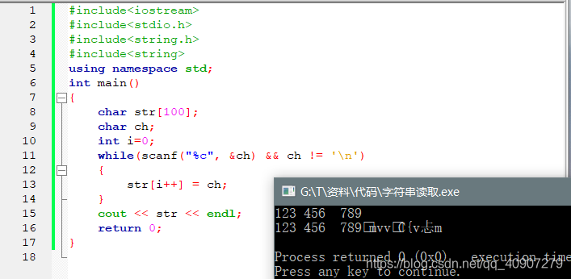

从图片中可以看出，我们给str输入的是“123 456 789”，但是输出结果却并不是我们想要的，这是为什么呢？

答案很简单，当我们输出str字符串的时候，系统是以'\0'符号来判断一个字符串的末尾的，我们输入遇到'\n'的时候就跳出循环了，所以后面的内容是不可预知的，直到遇到'\0'才停止输出。

要怎样解决呢？

更简单了，既然字符串需要以'\0'结束，那我们只需要把字符串的末尾的那个字符手动赋值为'\0'即可：

```cpp
#include<iostream>
#include<stdio.h>
#include<string.h>
using namespace std;
int main()
{
    char str[100];
    char ch;
    int i=0;
    while(scanf("%c", &ch) && ch != '\n')
    {
        str[i++] = ch;
    }
    str[i] = '\0';    //手动吧字符串末尾字符赋值成'\0'
    cout << str << endl;
    return 0;
}
```

这个时候我们再来验证一下，发现问题就解决了：

> 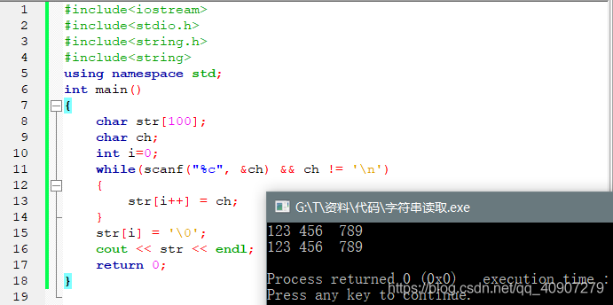

#### 二、用getchar()循环输入直到遇到换行结束

这个方法从原理是跟上面的方法是一样的，只是写法不一样，下面直接放上参考代码：（值得注意的是末尾仍要赋成'\0'）

```cpp
#include<iostream>
#include<stdio.h>
#include<string.h>
using namespace std;
int main()
{
    char str[100];
    char ch;
    int i=0;
    while((ch = getchar()) != '\n')
    {
        str[i++] = ch;
    }
    str[i] = '\0';    //手动吧字符串末尾字符赋值成'\0'
    cout << str << endl;
    return 0;
}
```

#### 三、scanf的另一种用法

我们知道用scanf的%s可以用来输入一个字符串，但是%s遇到空格之后便停止了，不能达到输入空格的效果，所以我们可以使用另一种方法：

```cpp
scanf("%[^\n]%*c", str);
```

看似很复杂的一句代码，下面我们来解读一下：

```
这句话的意思是碰见了回车就退出，然后把缓冲区里面的内容按字符串格式输入str中，回车依然留在缓冲区。

其中"%[^\n]"表示读入一个字符串，遇到'\n'停止，并设置末尾的'\0'。^ 是“非”的意思，意思就是说把一个非“\n”字符读入字符串，直到遇到“\n”停止输入。

而“%*c”呢，则是代表读入一个字符到缓冲区，但是不向任何地方输入。这样，就解决了字符串后边的“\n”对下面数据的影响，如果不加“%*c”的话，则大多数情况下需要在scanf前加一句getchar()来消除回车的影响。
```

**附：**

```
其实所有对%s起作用的控制都可以用%[],比如%[0-9]表示只读入'0'到'9'之间的字符，%[a-zA-Z]表示只读入字母，'-'是范围连接符，当然也可以直接列出你需要读入的字符。
如果你只需要读"abc"里面的字符就可以用%[abc] (或者%[cab]、%[acb]、%[a-c]、%[c-a].....),
如果想读入某个范围之外的字符串就在前面加一个'^',如：%[^a-z]就表示读入小写字母之外的字符。
```

例如从键盘输入的"1235ab86"中读取1235、86给n,有如下方法：

```cpp
#include <stdio.h>
bool skip(){
     scanf("%*[^0-9]");
     return true;
}
void main()
{
      int n;
      while(skip() && scanf("%d", &n)!=EOF)
        printf("%d\n", n);
}
```

输出为：

```undefined
1235

86
```

#### 四、c++中的getline()方法

getline不是C库函数，而是gcc的扩展定义或者C++库函数。它会生成一个包含一串从输入流读入的字符的字符串。

具体用法：

```cpp
getline(cin, str);
```

需要注意的是，str字符串必须是C++中的string字符串类型

也就是说必须包含头文件

```cpp
#include<string>
```

并且str必须定义为string类型

```cpp
string str;
```

需要注意的是，既然str定义的是string类型，则说明求字符串长度函数strlen()将不再可用，C++提供了另一种方法：

```cpp
int len = str.size();
```

下面来验证一下：

> 

#### 五、解决方案使用fgets代替

```pgsql
fgets（temp，sizeof（temp），stdin）;   
```

`gets `已被弃用，因为它很危险，可能会导致缓冲区溢出。

解决方案

```lisp
//接收用户输入，gets函数已经被弃用，这里替换成fgets函数，由于fgets函数会读入回车，这里将回车去掉
fgets(msg.data, sizeof(msg.data), stdin);
//printf("%s", msg.data);
msg.data[strlen(msg.data) - 1] = '\0';
//printf("-------------\n");
//printf("%s", msg.data);
```


## 回车与换行

### 一.知其然

\n是换行，英文是New line

\r是回车，英文是Carriage return

> 

### 二.知其所以然

机械打字机有回车和换行两个键作用分别是:  

- 换行就是把滚筒卷一格，不改变水平位置。

- 回车就是把水平位置复位，不卷动滚筒。

**Enter = 回车+换行(\r\n)   注:\r\n连用时,  不能调换顺序**

- unix换行：\n(0x0A)

- MAC回车：\r(0x0D)

- WIN回车换行：\r\n(0x0D,0x0A)


## 关键字，操作符和函数区别

#### 1：关键字

所谓关键字就是已被:语言本身使用, 不能作其它用途使用的字。

#### 2：操作符

操作符是在表达式中用于连接不同对象的运算符，不同的操作符指定了不同的运算方式。

可以把操作符理解为语言内置的，最基础的函数，不可代替的函数！

操作符本质上也是函数。只是操作符是编译器需要进行进一步解释。

#### 3：函数

函数是一组一起执行一个任务的语句

函数与操作符区别：

1：运算符只能重载，不能自定义，函数的名字随便起，只要是个标识符就行；但运算符不行。

2：函数本身有一段代码，程序执行时，遇到函数时，会先将函数的参数入栈，再跳到函数的代码来运行。而操作符则是在本地直接运算。


## 命令行参数argv

`argv`的类型为`char **`。它不是数组。它是指向char的指针。命令行参数存储在内存中，每个内存位置的地址存储在数组中。该数组是指向`char`的指针的数组。 `argv`指向此数组的第一个元素。

> 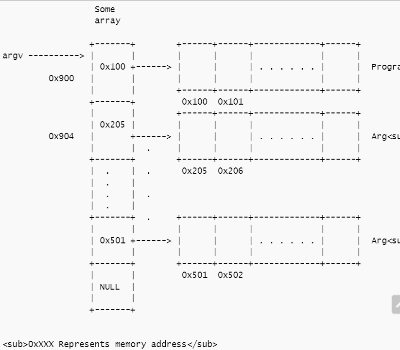

在大多数情况下，`argv[0]`表示程序名称，但是如果主机环境中无法使用程序名称，则`argv[0][0]`表示空字符。


## 原码补码

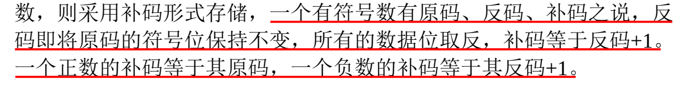

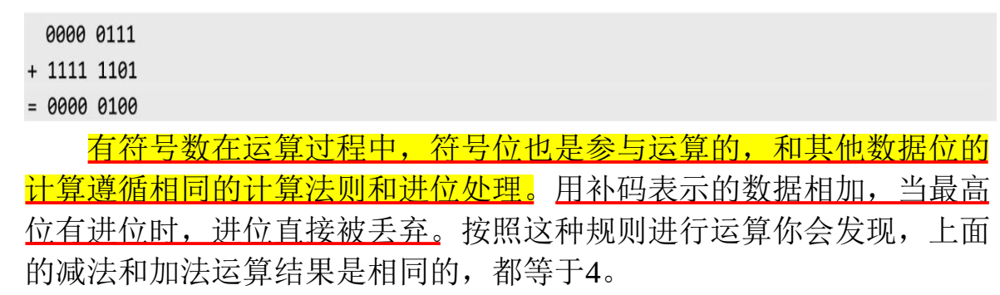

#### 补码加法

- **题目** `int i = -20; unsigned int j = 10; i + j ?`

- **题解** 答案为 `-10`

  > 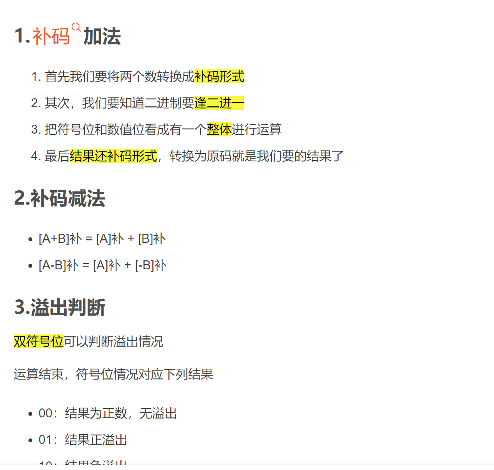


## Linux C 语法分析

### 结构体指针类型函数

- > 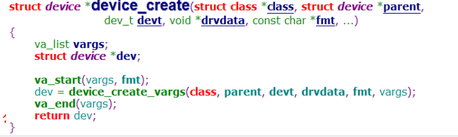

- 一个函数，函数返回值类型为**结构体指针**。

### 宏定义

- > 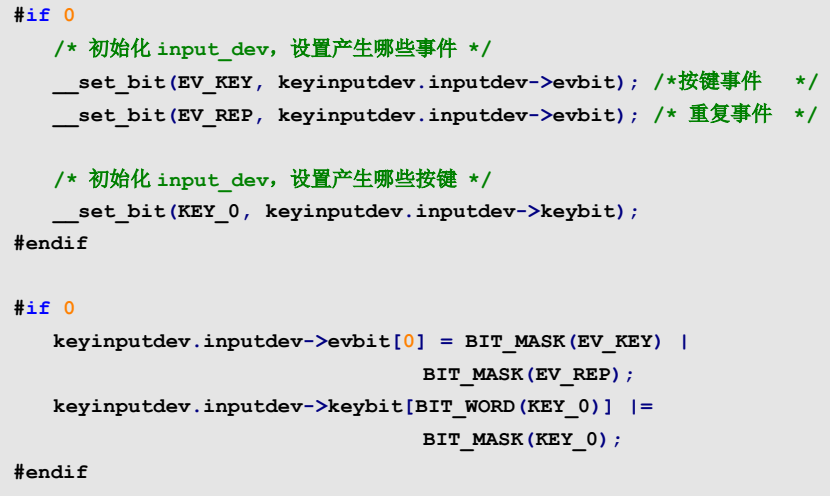

- ```cpp
  #if 表达式      
  　　 程序段1    
  #else         
  　　程序段2    
  #endif
  表示：如果表达式为真，则编译程序段1，否则编译程序段2.
  ```

- code中定义的是一些调试版本的代码，此时code完全被编译器忽略。如果想让code生效，只需把`#if 0`改成`#if 1` 

- `#if 0`还有一个重要的用途就是用来当成注释，如果你想要注释的程序很长，这个时候`#if 0`是最好的，保证不会犯错误。（但是林锐的书上说千万不要把`#if 0` 来当作块注释使用） `#if 1`可以让其间的变量成为局部变量。 

- 这个结构表示你先前写好的code，现在用不上了，又不想删除，就用这个方法，比注释方便。

- 说白了`#if 0/1 #endif` 就相当于一段注释，改成1就不注释 改成0就是注释掉。

### 其他（待补充）

- `__unregister_chrdev()`   前面的 `__` 一般代表函数为多重封装过的函数。

- > 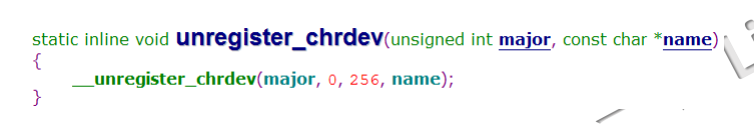

- > 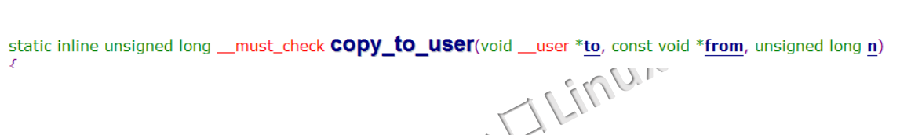


## const语法整理

有时候我们希望定义这样一种变量，它的值不能被改变，在整个作用域中都保持固定。例如，用一个变量来表示班级的最大人数，或者表示缓冲区的大小。为了满足这一要求，可以使用const关键字对变量加以限定：

```c
const int MaxNum = 100;  //班级的最大人数
```

这样 MaxNum 的值就不能被修改了，任何对 MaxNum 赋值的行为都将引发错误：

```c
MaxNum = 90;  //错误，试图向 const 变量写入数据
```

我们经常将 const 变量称为常量（Constant）。创建常量的格式通常为：

```c
const type name = value;
```

const 和 type 都是用来修饰变量的，它们的位置可以互换，也就是将 type 放在 const 前面：

```c
type const name = value;
```

**但我们通常采用第一种方式，不采用第二种方式。**另外建议**将常量名的首字母大写，以提醒程序员这是个常量。**

由于常量一旦被创建后其值就不能再改变，所以==常量必须在定义的同时赋值（初始化），后面的任何赋值行为都将引发错误。==一如既往，初始化常量可以使用任意形式的表达式，如下所示：

```c
#include <stdio.h>
int getNum(){
    return 100;
}
int main(){
    int n = 90;
    const int MaxNum1 = getNum();  //运行时初始化
    const int MaxNum2 = n;         //运行时初始化
    const int MaxNum3 = 80;        //编译时初始化
    printf("%d, %d, %d\n", MaxNum1, MaxNum2, MaxNum3);
    return 0;
}
```

运行结果：
100, 90, 80

**一、const 和指针**

const 也可以和指针变量一起使用，这样可以限制指针变量本身，也可以限制指针指向的数据。const 和指针一起使用会有几种不同的顺序，如下所示：

```c
const int *p1;
int const *p2;
int * const p3;
```

在最后一种情况下，指针是只读的，也就是 p3 本身的值不能被修改；在前面两种情况下，指针所指向的数据是只读的，也就是 p1、p2 本身的值可以修改（指向不同的数据），但它们指向的数据不能被修改。

当然，指针本身和它指向的数据都有可能是只读的，下面的两种写法能够做到这一点：

```c
const int * const p4;
int const * const p5;
```

> const 和指针结合的写法多少有点让初学者摸不着头脑，大家可以这样来记忆：const 离变量名近就是用来修饰指针变量的，离变量名远就是用来修饰指针指向的数据，如果近的和远的都有，那么就同时修饰指针变量以及它指向的数据。

**二、const 和函数形参**

在C语言中，单独定义 const 变量没有明显的优势，完全可以使用#define命令代替。const 通常用在函数形参中，==如果形参是一个指针，为了防止在函数内部修改指针指向的数据，就可以用 const 来限制。==

在C语言标准库中，有很多函数的形参都被 const 限制了，下面是部分函数的原型：

```c
size_t strlen ( const char * str );
int strcmp ( const char * str1, const char * str2 );
char * strcat ( char * destination, const char * source );
char * strcpy ( char * destination, const char * source );
int system (const char* command);
int puts ( const char * str );
int printf ( const char * format, ... );
```

我们自己在定义函数时也可以使用 const 对形参加以限制，例如查找字符串中某个字符出现的次数：

```c
#include <stdio.h>
size_t strnchr(const char *str, char ch){
    int i, n = 0, len = strlen(str);
    for(i=0; i<len; i++){
        if(str[i] == ch){
            n++;
        }
    }
    return n;
}
int main(){
    char *str = "http://c.biancheng.net";
    char ch = 't';
    int n = strnchr(str, ch);
    printf("%d\n", n);
    return 0;
}
```

运行结果：

3

根据 strnchr() 的功能可以推断，函数内部要对字符串 str 进行遍历，不应该有修改的动作，用 const 加以限制，不但可以防止由于程序员误操作引起的字符串修改，还可以给用户一个提示，函数不会修改你提供的字符串，请你放心。

**三、const 和非 const 类型转换**

当一个指针变量 str1 被 const 限制时，并且类似const char *str1这种形式，说明指针指向的数据不能被修改；如果将 str1 赋值给另外一个未被 const 修饰的指针变量 str2，就有可能发生危险。因为通过 str1 不能修改数据，而赋值后通过 str2 能够修改数据了，意义发生了转变，所以编译器不提倡这种行为，会给出错误或警告。

也就是说，const char *和char *是不同的类型，==不能将const char *类型的数据赋值给char *类型的变量。但反过来是可以的，编译器允许将char *类型的数据赋值给const char *类型的变量。==

这种限制很容易理解，**char *指向的数据有读取和写入权限，而const char *指向的数据只有读取权限，降低数据的权限不会带来任何问题，但提升数据的权限就有可能发生危险。**

C语言标准库中很多函数的参数都被 const 限制了，但我们在以前的编码过程中并没有注意这个问题，经常将非 const 类型的数据传递给 const 类型的形参，这样做从未引发任何副作用，原因就是上面讲到的，将非 const 类型转换为 const 类型是允许的。

下面是一个将 const 类型赋值给非 const 类型的例子：

```c
#include <stdio.h>

void func(char *str){ }

int main(){
    const char *str1 = "c.biancheng.net";
    char *str2 = str1;
    func(str1);
    return 0;
}
```

第7、8行代码分别通过赋值、传参（传参的本质也是赋值）将 const 类型的数据交给了非 const 类型的变量，编译器不会容忍这种行为，会给出警告，甚至直接报错。


## switch和if else的比较

- **if-else**

  只是单纯地一个接一个比较；if...else每个条件都计算一遍；

- **switch**

  使用了Binary Tree算法；绝大部分情况下switch会快一点，除非是if-else的第一个条件就为true编译器编译switch与编译if...else...不同。不管有多少case，都直接跳转，不需逐个比较查询；switch只计算一次值，然后都是test , jmp,

  > 有很多else if的时候，用switch case比较清晰。==switch使用查找表的方式决定了case的条件必须是一个连续的常量。==而if-else则可以灵活的多。对于switch语句来说，起实际是使用一个跳转表实现分支结构，不需要一次进行比较每一个所需要的条件。进行比较的次数为1.但是对于if…else语句来说：最少的比较次数为1，跟switch相比，在时间方面，switch语句的执行速度比if else要快，但是在程序执行占用的空间方面，switch语句需要一张跳转表来维护。这个跳转，表的本质是一个拥有标号的数组，需要额外的存储空间，if else语句的空间效率更好一点。switch是一个很典型的空间换时间的例子。但是switch只能判断是一个指定值的数据，而不能对一个区间中的数据进行判断。这时候选择if…else语句是一个很好的选择。

- **switch case与if else的效率问题**

  switch case与if else的区别：switch case会生成一个跳转表来指示实际的case分支的地址，而if...else却需要遍历条件分支直到命中条件。

- **switch case的优缺点**
  - switch case的优点：
    1. 当分支较多时，用switch的效率是很高的。因为switch是确定了选择值之后直接跳转到那个特定的分支.
  - switch case的缺点：
    1. switch...case占用较多的代码空间，因为它要生成跳表，特别是当case常量分布范围很大但实际有效值又比较少的情况，switch...case的空间利用率将变得很低。
    2. switch...case只能处理case为常量的情况。

- **if else的优缺点**
  - if else的优点：if else能应用于更多的场所以if else比较灵活。
  - if else的缺点：if else必须遍历所以的可能值。

- **总结**

  在选择分支较多时，选用switch…case结构会提高程序的效率，但switch不足的地方在于**只能处理字符或者数字类型的变量**，if…else结构更加灵活一些，if…else结构可以用于判断表达式是否成立，比如if(a+b>c),if…else的应用范围更广，switch…case结构在某些情况下可以替代if…else结构。


## #pragma once

### 1、#pragma once有什么作用？  

为了避免同一个头文件被包含（include）多次，C/C++中有两种宏实现方式：**一种是#ifndef方式**；**另一种是#pragma once方式**。

在能够支持这两种方式的编译器上，二者并没有太大的区别。但两者仍然有一些细微的区别。

### 2、两者的使用方式有何区别  

示例代码如下：

```c
//方式一：
#ifndef  __SOMEFILE_H__
#define   __SOMEFILE_H__
 ... ... // 声明、定义语句
#endif

//方式二：
#pragmaonce
 ... ... // 声明、定义语句
```

### 3、两者各有何特点  

#### （1）#ifndef

\#ifndef的方式受C/C++语言标准支持。==它不仅可以保证同一个文件不会被包含多次，也能保证内容完全相同的两个文件（或者代码片段）不会被不小心同时包含。==

当然，缺点就是如果不同头文件中的宏名不小心“撞车”，可能就会导致你看到头文件明明存在，但编译器却硬说找不到声明的状况——这种情况有时非常让人郁闷。

由于编译器每次都需要打开头文件才能判定是否有重复定义，因此**在编译大型项目时，ifndef会使得编译时间相对较长，因此一些编译器逐渐开始支持#pragma once的方式。**

#### （2）#pragma once

\#pragma once 一般由编译器提供保证：同一个文件不会被包含多次。**==注意这里所说的“同一个文件”是指物理上的一个文件，而不是指内容相同的两个文件。==**

你无法对一个头文件中的一段代码作pragma once声明，而只能针对文件。

**其好处是，你不必再担心宏名冲突了**，当然也就不会出现宏名冲突引发的奇怪问题。大型项目的编译速度也因此提高了一些。

对应的缺点就是如果某个头文件有多份拷贝，本方法不能保证他们不被重复包含。当然，相比宏名冲突引发的“找不到声明”的问题，这种重复包含很容易被发现并修正。

另外，这种方式不支持跨平台！

### 4、两者之间有什么联系？ 

\#pragma once 方式产生于#ifndef之后，因此很多人可能甚至没有听说过。目前看来#ifndef更受到推崇。因为#ifndef受C/C++语言标准的支持，不受编译器的任何限制；

而**#pragma once方式却不受一些较老版本的编译器支持**，一些支持了的编译器又打算去掉它，所以它的兼容性可能不够好。

一般而言，当程序员听到这样的话，都会选择#ifndef方式，为了努力使得自己的代码“存活”时间更久，通常宁愿降低一些编译性能，这是程序员的个性，当然这是题外话啦。

还看到一种用法是把两者放在一起的：

```c
#pragma once
#ifndef __SOMEFILE_H__
#define __SOMEFILE_H__

... ... // 声明、定义语句

#endif
```

**总结：**

看起来似乎是想兼有两者的优点。不过只要使用了#ifndef就会有宏名冲突的危险，也无法避免不支持#pragma once的编译器报错，所以混用两种方法似乎不能带来更多的好处，倒是会让一些不熟悉的人感到困惑。

选择哪种方式，应该在了解两种方式的情况下，视具体情况而定。只要有一个合理的约定来避开缺点，我认为哪种方式都是可以接受的。而这个已经不是标准或者编译器的责任了，应当由程序员自己或者小范围内的开发规范来搞定。

**方式一由语言支持所以移植性好，方式二 可以避免名字冲突。**


## 逗号表达式

1. 优先级最低
2. ==从左到右逐个计算==
3. 逗号表达式作为一个整体，==它的值为最后一个表达式的值==
4. `x = (++i, i++, i+10);`      逗号表达式中，i 在遇到每个逗号后，认为本计算单位已经结束，i 这时候自加。


## C 嵌入式代码整理

#### 获取键盘输入

``` c
scanf("%d",&cmd);
getchar();              //加一个getchar()防止输入乱码，程序跑飞
```

#### 为结构体内元素单独赋值（Linux中）

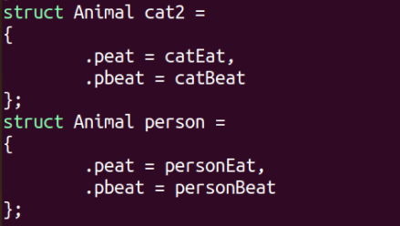

``` c
static struct file_operations pin4_fops =
{
        .owner = THIS_MODULE,
        .open  = pin4_open,         //.a = 1, .b = 2,
        .write = pin4_write
};
```

#### 字符串拷贝输出

``` c
size_t readData(void *ptr, size_t size, size_t nmemb, void *stream)
{
        char buf[1024] = {'\0'};
        strncpy(buf, ptr, 1024);
        printf("===========================================");
        printf("%s\n",buf);
}
```

#### 程序运行系统功能

```c
#include <stdlib.h>
int main(int argc,char **argv)
{
    int time = atoi(argv[1]);
    for(int i=0;i<time;i++)
    {
        system("sl");
    }    
}


---
#include <stdlib.h>
int main()
{
    int i = 0;
    for(i=0;i<10;i++)
    {
        system("./pthread");
    }
}
```

#### C结构体定义

```c
struct Student
{    
    int age;
}
int main()
{
    struct Student *p;
    p = malloc(sizeof(struct Student)); //需要分配空间
    p->age;
}
```


