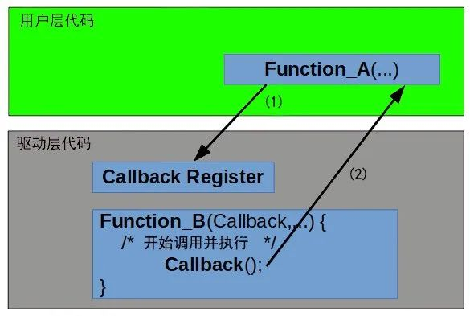
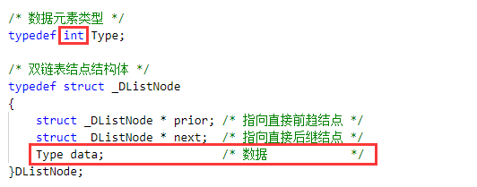
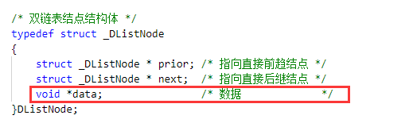
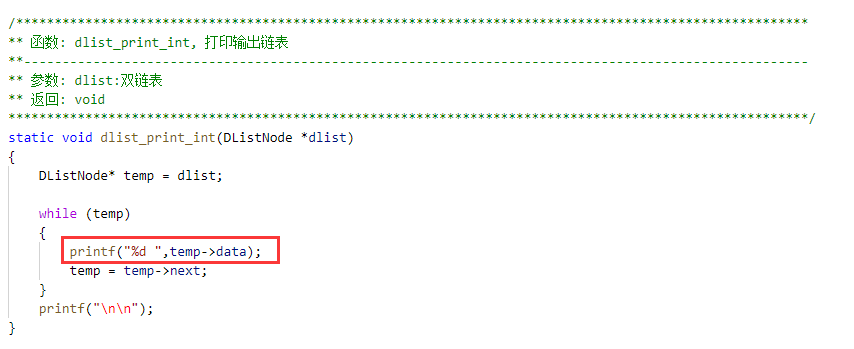
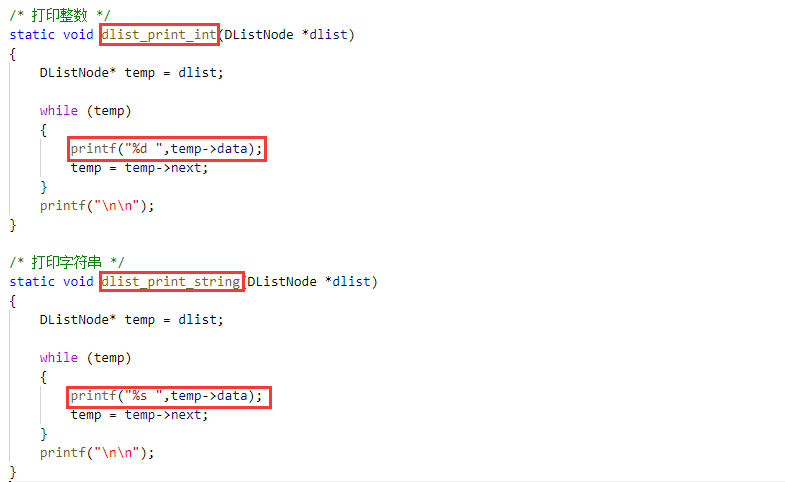
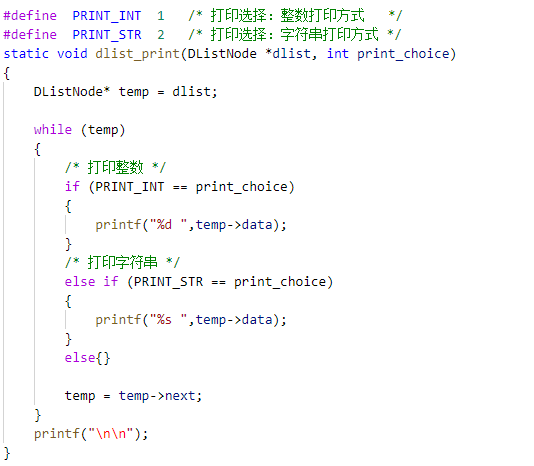
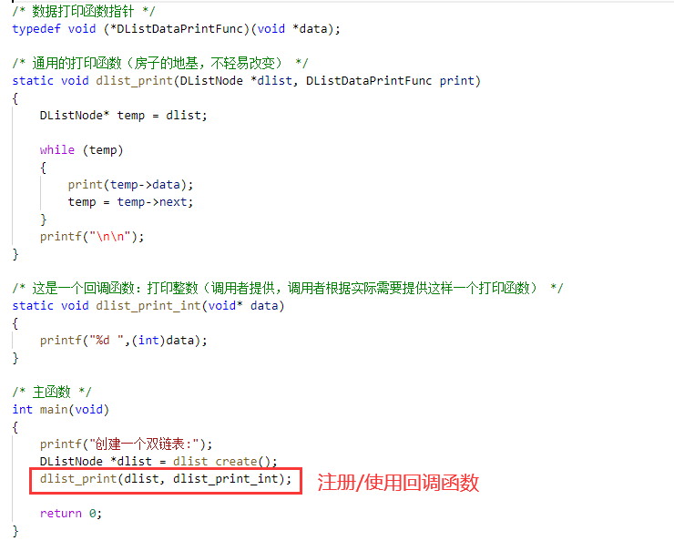
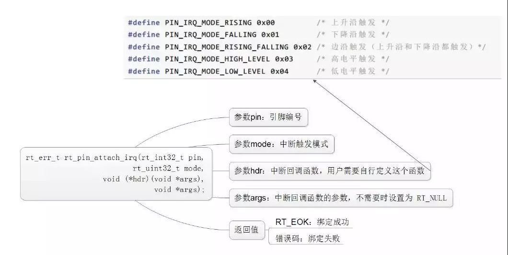
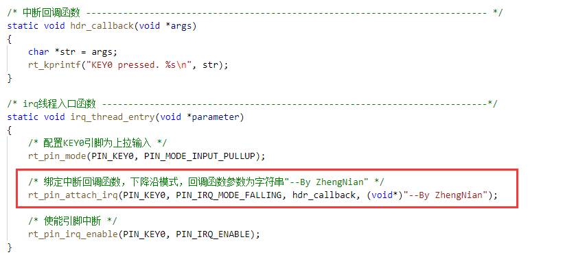
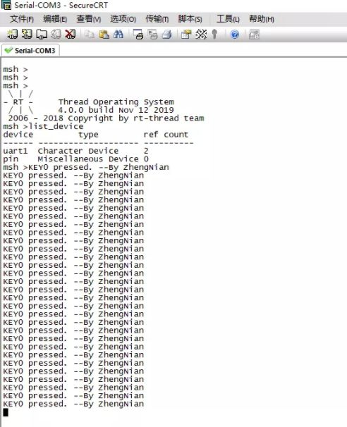

## C 回调函数 - HQ

[TOC]

------

#### 注意

- 

------

## 回调函数详解 - 摘录

在我们平时开发STM32或者其它单片机时，我们经常都会用到原厂提供的固件库函数，固件库函数中有非常多回调函数。

那么什么是回调函数呢？==回调函数是作为参数传递给另一个函数的函数。==**接受回调作为参数的函数预计会在某个时间点执行它。回调机制允许下层软件层调用上层软件层定义的函数。**

> 

上图表示用户应用程序代码和硬件驱动程序之间的交互。硬件驱动程序是一个独立的可重用驱动程序，它不了解上面的层(在本例中为用户应用程序)。**硬件驱动程序提供 API 函数，允许用户应用程序将函数注册为回调。**

然后，**此回调函数由硬件驱动程序作为执行的一部分进行调用。**如果不使用回调，就会被编码为直接调用。这将使硬件驱动程序特定于特定的高级软件级别，并降低其可重用性。**回调机制的另一个好处是，在程序执行期间可以动态更改被调用的回调函数。**

#### 1、C语言中的回调

不同的编程语言有不同的实现回调的方式。在本文中，我们将重点介绍C编程语言，因为它是用于嵌入式软件开发的最流行的语言。**C语言中的回调是使用函数指针实现的。**函数指针就像普通指针一样，但它不是指向变量的地址，而是指向函数的地址。

在程序运行期间，**可以设置相同的函数指针指向不同的函数**。在下面的代码中，我们可以看到如何==使用函数指针将函数作为参数传递给函数。==该函数将函数指针和两个整数值作为参数和。将执行的算术运算取决于将传递给函数指针参数的函数。

```
uint16_t cal_sum(uint8_t a, uint8_t b) 
{
    return a + b;
}
uint16_t cal_mul(uint8_t a, uint8_t b) 
{
    return a * b;
}
uint16_t cal_op (uint16_t (*callback_func)(uint8_t, uint8_t),uint8_t a, uint8_t b) 
{   
    return callback_func(a,b);
}

void main() 
{
    cal_op(cal_mul,4,10); 
    cal_op(cal_sum,9,5); 
}
```

#### 2、回调的实际使用

回调可用于多种情况，并广泛用于嵌入式固件开发。它们提供了更大的代码灵活性，并允许我们开发可由最终用户进行微调而无需更改代码的驱动程序。

**在我们的代码中具有回调功能所需的元素是：**

- **将被调用的函数(回调函数)**
- **将用于访问回调函数的函数指针**
- **将调用回调函数的函数("调用函数")**

接下来介绍使用回调函数的简单流程。首先声明一个函数指针，用于访问回调函数我们可以简单地将函数指针声明为：

```
uint8_t (*p_CallbackFunc)(void);
```

但是对于更清晰的代码，最好定义一个函数指针类型：

```
typedef uint8_t (*CallbackFunc_t) (void); 
```

**定义回调函数——重要的是要注意回调函数只是一个函数。由于它的使用方式(通过函数指针访问)，我们将其称为回调。**所以这一步只是我们之前声明的指针将指向的函数的定义。

```
uint8_t Handler_Event(void) 
{
/* code of the function */
}
```

**注册回调函数——这是为函数指针分配地址的操作。**在我们的例子中，地址应该是回调函数的地址。可以有一个专门的函数来注册回调函数，如下所示：

```
static CallbackFunc_t HandlerCompleted;

/*用来注册回调函数的功能函数*/
void CallbackRegister (CallbackFunc_t callback_func) 
{
     HandlerCompleted = callback_func;
}

/* 注册Handler_Event作为回调*/
CallbackRegister(Handler_Event);
```

#### 3、代码应用案例

##### 3.1、事件回调

在这个例子中，我们展示了如何使用回调来处理事件。下面的示例代码是基于较低级别物理通信接口(例如 UART、SPI、I2C 等)构建的数据通信协议栈。通信协议栈实现了两种不同类型的帧——标准通信帧和增强型通信帧。

有两种不同的函数用于处理接收到的字节事件。在初始化函数中，函数指针被分配了应该使用的函数的地址用于处理事件。这是注册回调函数的操作。

```
/*指向回调函数的函数指针*/
uint8_t ( *Receive_Byte) ( void );

/*
 * 简化的初始化函数
 * 这里函数指针被分配了一个函数的地址(注册回调函数)
 */
void Comm_Init( uint8_t op_mode) {
        switch ( op_mode ) {
        case STD_FRAME:           
            Receive_Byte     = StdRxFSM;
            break;
        case ENHANCED_FRAME:  
            Receive_Byte     = EnhancedRxFSM;
            break;
        default:
            Receive_Byte     = EnhancedRxFSM;
        }
}

/* 这些是在通信栈中实现的函数(回调)
* 它们不会在任何地方直接调用，而是使用函数指针来访问它们 */
uint8_t  StdRxFSM(void) 
{
    //在这里完成处理工作
}
uint8_t  EnhancedRxFSM(void) 
{
    //在这里完成处理工作
}
```

当从物理通信接口(例如 UART)接收到新字节(事件)时，用户应用程序代码会调用我们示例中的回调函数。

```
extern uint8_t (*Receive_Byte)( void );
void receive_new_byte() 
{
   Receive_Byte(); 
}
```

#### 3.2、寄存器中的多个回调

这个例子展示了我们如何创建一个寄存器来存储回调函数。它是使用数据类型元素的数组实现的。数据类型是具有成员和成员的结构。**用于为寄存器中的每个回调函数分配一个标识(唯一编号)。函数指针被分配与唯一关联的回调函数的地址。**以下实现的是添加和删除回调的功能：

```
#define FUNC_REGISTER_SIZE 255
#define FUNC_ID_MAX 127
//函数指针类型
typedef  uint8_t (*callback_func) ( uint8_t * p_data, uint16_t len );
typedef struct {
    uint8_t           function_id;
    callback_func p_callback_func;
} function_register_t;

//一组函数处理程序，每个处理程序都有一个id
static function_register_t func_register[FUNC_REGISTER_SIZE];

//注册函数回调
uint8_t RegisterCallback (uint8_t function_id, callback_func p_callback_func ) {
    uint8_t    status;
    if ((0 < function_id) && (function_id <= FUNC_ID_MAX)) 
    {
        //向寄存器添加函数
        if ( p_callback_func != NULL ) { 
            for (int i = 0; i < FUNC_REGISTER_SIZE; i++ ) {
                if (( func_register[i].p_callback_func == NULL ) ||
                    ( func_register[i].p_callback_func == p_callback_func )) {
                    func_register[i].function_id = function_id;
                    func_register[i].p_callback_func = p_callback_func;
                    break;
                }
            }
     if (i != FUNC_REGISTER_SIZE) {
        status = SUCESSFULL;
     }
     else {
        status = FAILURE;
     }
        }
        else { 
            //从寄存器中删除
            for ( i = 0; i < FUNC_REGISTER_SIZE; i++ ) {
                if ( func_register[i].function_id == function_id ) {
                    func_register[i].function_id = 0;
                    func_register[i].p_callback_func = NULL;
                    break;
                }
            }
            status = SUCESSFULL;
        }
    }
    else {
        status = FAILURE; /* Invalid argument */
    }
    return status;
}
```

在下面的代码中，我们可以看到一个函数示例，该函数可用于根据函数 id 调用回调。

```
//具有特定函数代码的回调函数如何被调用的示例
uint8_t execute_callback(uint8_t FuncCode, uint8_t * p_data_buf, uint16_t len) 
{  
    uint8_t status;
    status = FAILURE;
    for( i = 0; i < FUNC_REGISTER_SIZE; i++ ){
        /* No more callbacks registered, exit. */
        if( func_register[i].function_id == 0 ){
            break;
        }
        else if( func_register[i].function_id == FuncCode) {
            status = func_register[i].p_callback_func( p_data_buf, len );
            break;
        }
     }
     return status;
}
```

#### 4、结论

我们可以编写不使用回调的程序，但是通过将它们添加到我们的工具库中，它们可以使我们的代码更高效且更易于维护。**明智地使用它们很重要，否则过度使用回调(函数指针)会使代码难以进行排查和调试。**==另一件需要考虑的事情是使用函数指针可能会阻止编译器执行的一些优化(例如函数内联)。==


## C语言、嵌入式重点知识：回调函数 - 摘录

[参考文章](https://mp.weixin.qq.com/s?__biz=MzU5MzcyMjI4MA==&mid=2247486525&idx=1&sn=a1b602fc247a8c4e8d65e14ff0f3135e&chksm=fe0d62fac97aebeca9dc3c8b23989c9f3ef14fa61b15ca70b6b670471411b74c3e00fcf594e2&scene=21#wechat_redirect)

### 前言

上文分享了一个`专用`的双链表的基本操作示例：[**双链表的操作示例（附代码）**](http://mp.weixin.qq.com/s?__biz=MzU5MzcyMjI4MA==&mid=2247486512&idx=1&sn=511d0f58371c22d0611c14fcd0918e6f&chksm=fe0d62f7c97aebe1f06b852c0e4a8d93106a68ddc6349a98bf25de584840b9516b42e59aae32&scene=21#wechat_redirect)

这里提到了一个关键词：`专用`。与`专用`对应的词是`通用`。

我们从字面上可以很容易理解这两个词，专用就是针对特定情况的，特点就是很有局限性。

通用就是可以针对大多数情况（更理想的就是所有情况），特点就是适用性广。

为什么说上篇笔记的双链表是专用的？

> 

从我们的定义的元素数据类型就可以知道，我们这个双链表是只是用来存储`int类型`的数据的，这就很能体现出了局限性（这只是其中一点，当然还有其它的很多局限性），因此是个专用的双链表。

我们要编写一个通用的双链表的话，我们首先要做的是就是修改双链表结点结构体了，可以修改为：

> 

如果我们要存放整数，我们可以把`void*`强制转换成整数使用。当然这篇笔记的重点不是分享通用的双链表。

我们这篇笔记要分享的是`回调函数`，下面进入重点内容：

### 回调函数法 VS 常规法

我们上篇笔记中有一个打印输出链表数据的函数：

> 

这是我们这个`专用`的双链表中打印链表数据函数，我们存储的是整数，所以用`%d`打印。那么，如果我们面向的是通用的双链表呢？

我们无法预知其中的数据，可能是整数，也可能是字符串，或者是其它的数据。那么怎么办呢？这里有几种方法：

**方法一：实现多个函数，需要用到哪个就调哪个**

> 

比如存放的是整数，可以调用`dlist_print_int`函数来打印；存放的是字符串，可以调用`dlist_print_string`函数来打印。

这种方法很简单，但有个缺点：每个函数都很相似，会有大量重复的代码。

**方法二：传入一个附加的参数来选择打印的方式**

> 

这种方法使用一个参数来选择打印的方式。避免了方法一中产生大量重复的代码的问题。

但是我们每当要增加新类型时，都得修改这个`dlist_print`函数，对于一个通用的双链表来说，这样的修改是不够好的。

这里`dlist_print`函数也是通用双链表的一部分，我们应该尽量少去修改它。

假如我们把一个通用的双链表的基础操作比喻做一栋楼房的`地基`，地基一旦牢牢固固的搭好之后，我们就不要再去动它了，应该把精力放在如何搭建房子的上层上。

**方法三：回调函数法**

上面两种方法应该是很容易想到的方法。现在来分享我们可能想不到的方法——`回调函数法`，这也是本篇笔记要分享的重点。

可能有很多朋友没用过回调函数，甚至有些朋友都没听说过。这里先简单介绍回调函数的一些概念（以下概念来自百度百科）：

> ==`回调函数`就是一个通过`函数指针`调用的函数。==**如果你把函数的指针（地址）作为参数传递给另一个函数，当这个指针被用来调用其所指向的函数时，我们就说这是回调函数。**

==回调函数不是由该函数的实现方直接调用，而是在特定的事件或条件发生时由另外的一方调用的，用于对该事件或条件进行响应。==

> 知识点：变量指针指向的是一块数据，指针指向不同的变量，则取到的是不同的数据；函数指针指向的是一段代码（即函数），指针指向不同的函数，则具有不同的行为。

回归正题，下面看如何使用回调函数法来实现上面的需求。

> 

首先，我们需要实现一个通用的打印函数`dlist_print`，把函数指针变量作为其中一个参数传入。

其次，我们调用者得根据实际情况实现一个用于打印的回调函数，这里我们实现的的回调函数是`dlist_print_int`。

最后，在用到打印的地方调用`dlist_print`函数即可。

用回调函数法是不是很巧妙？

此处，我们用到了`typedef`来“封装”一个打印链表数据的函数指针类型，这可能会刷新了初学者对于`typedef`关键字的认识。

因为我们刚开始学C语言的时候，总认为typedef取别名的一般形式为：

```
typedef  旧名字  新名字;
```

确实也是这样，但遇到给函数指针类型、数组类型等定义别名的时候就要特别区分了。如：

```
typedefchar ARRAY20[20];
ARRAY20 a1,a2; /* 等价于char a1[20],a2[20]; */
```

别问为什么，就是这样的。。。

### 回调函数的例子

上面分析了那么多，可能很多朋友会觉得回调函数太麻烦了，没必要用。但是现实是，回调函数在我们的C编程、嵌入式编程中用得很广泛。

**1、在C编程中**

在C语言的通用工具库`stdlib.h`中，有如下一个函数原型：

```
void qsort(void *, size_t, size_t, int (comp*)(const void *, const void *));
```

这是在C通用工具库中声明的一个快速排序算法函数，其可以用来排序int类型、float类型以及字符串数据。

可以按从小到大的顺序也可以按从大到小的顺序排序。其关键在于函数指针comp指向的函数的具体实现。

**2、在嵌入式编程中**

我们之前的笔记：[**【RT-Thread笔记】PIN设备中断配置**](http://mp.weixin.qq.com/s?__biz=MzU5MzcyMjI4MA==&mid=2247486024&idx=1&sn=4656bfdd22f0d1c9dedeb94d5eea6b0b&chksm=fe0d648fc97aed99d1d49cb58b1c95ab415381b0dcc94920b996ad466847017b4317aedaa943&scene=21#wechat_redirect)中，就有用到回调函数。

RT-Thread给我们提供了PIN设备中断回调绑定函数：`rt_pin_attach_irq`

> 

> 

这是个中断实验，产生中断会回调我们的回调函数，所以可以在在我们的回调函数里做一些产生中断后需要做的操作。

比如我们在这个中断回调里打印一串字符串。每当中断来时，就会打印该字符串：

> 

### 总结

回调函数是一个很重要的知识点，我们需要掌握。而回调函数又与函数指针联系密切，我们要努力把函数指针弄懂、用熟。

在C语言中，指针很重要，函数指针更重要。正如前辈们常说类似这样子的话：`不会C指针，就没学会C语言；不会函数指针，就不要称自己是C语言高手。`

在这几种方法中的分析中，其实回调函数更多的是体现出了`软件分层`的思想。`分层思想`在我们软件开发中是一种很重要的思想，简单的分层我们都会，但是怎么才能算是分层分得很好呢？

那就是不该动的地方不动，该动的地方才动，衔接得很好，就像上面的回调函数法。

对于编程的学习，关于编程语言的学习，知识点就是那么多，很快就能学完了，但是真正灵活的、熟练应用起来真的是不容易，这需要我们大量地分析、思考、练习。

有时间的话我们也应该多读读一些关于软件设计思想的书籍，这也是我最近在读的一类书，学学前辈们总结出的一些精华知识。


