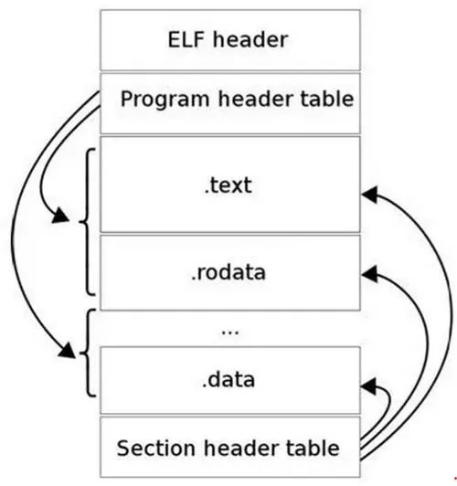

## C 编译原理

[TOC]

------

#### 注意

- 

------

## 公众号文章 - 摘录

### 引入

大家肯定都知道计算机程序设计语言通常分为机器语言、汇编语言和高级语言三类。高级语言需要通过翻译成机器语言才能执行，而翻译的方式分为两种，一种是编译型，另一种是解释型，因此我们基本上将高级语言分为两大类，一种是编译型语言，例如C，C++，Java，另一种是解释型语言，例如Python、Ruby、MATLAB 、JavaScript。

本文将介绍如何将高层的C/C++语言编写的程序转换成为处理器能够执行的二进制代码的过程，包括四个步骤：

- 预处理（Preprocessing）
- 编译（Compilation）
- 汇编（Assembly）
- 链接（Linking）


#### GCC 工具链介绍

通常所说的GCC是GUN Compiler Collection的简称，是Linux系统上常用的编译工具。GCC工具链软件包括GCC、Binutils、C运行库等。


GCC

GCC（GNU C Compiler）是编译工具。本文所要介绍的将C/C++语言编写的程序转换成为处理器能够执行的二进制代码的过程即由编译器完成。


Binutils

一组二进制程序处理工具，包括：addr2line、ar、objcopy、objdump、as、ld、ldd、readelf、size等。这一组工具是开发和调试不可缺少的工具，分别简介如下：

- addr2line：用来将程序地址转换成其所对应的程序源文件及所对应的代码行，也可以得到所对应的函数。该工具将帮助调试器在调试的过程中定位对应的源代码位置。

- as：主要用于汇编，有关汇编的详细介绍请参见后文。

- ld：主要用于链接，有关链接的详细介绍请参见后文。

- ar：主要用于创建静态库。为了便于初学者理解，在此介绍动态库与静态库的概念：

- - 如果要将多个.o目标文件生成一个库文件，则存在两种类型的库，一种是静态库，另一种是动态库。
  - 在windows中静态库是以 .lib 为后缀的文件，共享库是以 .dll 为后缀的文件。在linux中静态库是以.a为后缀的文件，共享库是以.so为后缀的文件。
  - 静态库和动态库的不同点在于代码被载入的时刻不同。静态库的代码在编译过程中已经被载入可执行程序，因此体积较大。共享库的代码是在可执行程序运行时才载入内存的，在编译过程中仅简单的引用，因此代码体积较小。在Linux系统中，可以用ldd命令查看一个可执行程序依赖的共享库。
  - 如果一个系统中存在多个需要同时运行的程序且这些程序之间存在共享库，那么采用动态库的形式将更节省内存。

- ldd：可以用于查看一个可执行程序依赖的共享库。

- objcopy：将一种对象文件翻译成另一种格式，譬如将.bin转换成.elf、或者将.elf转换成.bin等。

- objdump：主要的作用是反汇编。有关反汇编的详细介绍，请参见后文。

- readelf：显示有关ELF文件的信息，请参见后文了解更多信息。

- size：列出可执行文件每个部分的尺寸和总尺寸，代码段、数据段、总大小等，请参见后文了解使用size的具体使用实例。


#### C运行库

C语言标准主要由两部分组成：一部分描述C的语法，另一部分描述C标准库。C标准库定义了一组标准头文件，每个头文件中包含一些相关的函数、变量、类型声明和宏定义，譬如常见的printf函数便是一个C标准库函数，其原型定义在stdio头文件中。

C语言标准仅仅定义了C标准库函数原型，并没有提供实现。因此，C语言编译器通常需要一个C运行时库（C Run Time Libray，CRT）的支持。C运行时库又常简称为C运行库。与C语言类似，C++也定义了自己的标准，同时提供相关支持库，称为C++运行时库。


### 编译准备工作

由于GCC工具链主要是在Linux环境中进行使用，因此本文也将以Linux系统作为工作环境。为了能够演示编译的整个过程，本节先准备一个C语言编写的简单Hello程序作为示例，其源代码如下所示：

```
#include <stdio.h> 

//此程序很简单，仅仅打印一个Hello World的字符串。
int main(void)
{
  printf("Hello World! \n");
  return 0;
}
```


### 编译过程

#### 1.预处理

==预处理的过程主要包括以下过程：==

- **将所有的#define删除，并且展开所有的宏定义，并且处理所有的条件预编译指令，比如#if #ifdef #elif #else #endif等。**
- **处理#include预编译指令，将被包含的文件插入到该预编译指令的位置。**
- **删除所有注释“//”和“/* */”。**
- 添加行号和文件标识，以便编译时产生调试用的行号及编译错误警告行号。
- **保留所有的#pragma编译器指令，后续编译过程需要使用它们。**

使用gcc进行预处理的命令如下：

```
$ gcc -E hello.c -o hello.i // 将源文件hello.c文件预处理生成hello.i
                        // GCC的选项-E使GCC在进行完预处理后即停止
```

hello.i文件可以作为普通文本文件打开进行查看，其代码片段如下所示：

```
// hello.i代码片段

extern void funlockfile (FILE *__stream) __attribute__ ((__nothrow__ , __leaf__));
# 942 "/usr/include/stdio.h" 3 4

# 2 "hello.c" 2


# 3 "hello.c"
int
main(void)
{
  printf("Hello World!" "\n");
  return 0;
}
```


#### 2.编译

**编译过程就是对预处理完的文件进行一系列的词法分析，语法分析，语义分析及优化后生成相应的汇编代码。**

使用gcc进行编译的命令如下：

```
$ gcc -S hello.i -o hello.s // 将预处理生成的hello.i文件编译生成汇编程序hello.s
                        // GCC的选项-S使GCC在执行完编译后停止，生成汇编程序
```

上述命令生成的汇编程序hello.s的代码片段如下所示，其全部为汇编代码。

```
// hello.s代码片段

main:
.LFB0:
    .cfi_startproc
    pushq   %rbp
    .cfi_def_cfa_offset 16
    .cfi_offset 6, -16
    movq    %rsp, %rbp
    .cfi_def_cfa_register 6
    movl    $.LC0, %edi
    call    puts
    movl    $0, %eax
    popq    %rbp
    .cfi_def_cfa 7, 8
    ret
    .cfi_endproc
```


#### 3.汇编

**汇编过程调用对汇编代码进行处理，生成处理器能识别的指令，保存在后缀为.o的目标文件中。**由于每一个汇编语句几乎都对应一条处理器指令，因此，**汇编相对于编译过程比较简单，通过调用Binutils中的汇编器as根据汇编指令和处理器指令的对照表一一翻译即可。**

当程序由多个源代码文件构成时，每个文件都要先完成汇编工作，生成.o目标文件后，才能进入下一步的链接工作。==注意：目标文件已经是最终程序的某一部分了，但是在链接之前还不能执行。==

使用gcc进行汇编的命令如下：

```
$ gcc -c hello.s -o hello.o // 将编译生成的hello.s文件汇编生成目标文件hello.o
                        // GCC的选项-c使GCC在执行完汇编后停止，生成目标文件
//或者直接调用as进行汇编
$ as -c hello.s -o hello.o //使用Binutils中的as将hello.s文件汇编生成目标文件
```

注意：hello.o目标文件为ELF（Executable and Linkable Format）格式的可重定向文件。


#### 4.链接

链接也分为静态链接和动态链接，其要点如下：

- **静态链接是指在编译阶段直接把静态库加入到可执行文件中去，这样可执行文件会比较大。**链接器将函数的代码从其所在地（不同的目标文件或静态链接库中）拷贝到最终的可执行程序中。为创建可执行文件，链接器必须要完成的主要任务是：符号解析（把目标文件中符号的定义和引用联系起来）和重定位（把符号定义和内存地址对应起来然后修改所有对符号的引用）。

- **动态链接则是指链接阶段仅仅只加入一些描述信息，而程序执行时再从系统中把相应动态库加载到内存中去。**

- - 在Linux系统中，gcc编译链接时的动态库搜索路径的顺序通常为：
    - 首先从gcc命令的参数-L指定的路径寻找；
    - 再从环境变量LIBRARY_PATH指定的路径寻址；
    - 再从默认路径/lib、/usr/lib、/usr/local/lib寻找。
  - 在Linux系统中，执行二进制文件时的动态库搜索路径的顺序通常为：
    - 首先搜索编译目标代码时指定的动态库搜索路径；
    - 再从环境变量LD_LIBRARY_PATH指定的路径寻址；
    - 再从配置文件/etc/ld.so.conf中指定的动态库搜索路径；
    - 再从默认路径/lib、/usr/lib寻找。
  - 在Linux系统中，可以用ldd命令查看一个可执行程序依赖的共享库。


由于链接动态库和静态库的路径可能有重合，所以如果在路径中有同名的静态库文件和动态库文件，比如libtest.a和libtest.so，gcc链接时默认优先选择动态库，会链接libtest.so，如果要让gcc选择链接libtest.a则可以指定gcc选项-static，该选项会强制使用静态库进行链接。以Hello World为例：

- 如果使用命令“gcc hello.c -o hello”则会使用动态库进行链接，生成的ELF可执行文件的大小（使用Binutils的size命令查看）和链接的动态库（使用Binutils的ldd命令查看）如下所示：

  ```
  $ gcc hello.c -o hello
  $ size hello  //使用size查看大小
     text    data     bss     dec     hex filename
     1183     552       8    1743     6cf     hello
  $ ldd hello //可以看出该可执行文件链接了很多其他动态库，主要是Linux的glibc动态库
          linux-vdso.so.1 =>  (0x00007fffefd7c000)
          libc.so.6 => /lib/x86_64-linux-gnu/libc.so.6 (0x00007fadcdd82000)
          /lib64/ld-linux-x86-64.so.2 (0x00007fadce14c000)
  ```

- 如果使用命令“gcc -static hello.c -o hello”则会使用静态库进行链接，生成的ELF可执行文件的大小（使用Binutils的size命令查看）和链接的动态库（使用Binutils的ldd命令查看）如下所示：

  ```
  $ gcc -static hello.c -o hello
  $ size hello //使用size查看大小
       text    data     bss     dec     hex filename
   823726    7284    6360  837370   cc6fa     hello //可以看出text的代码尺寸变得极大
  $ ldd hello
         not a dynamic executable //说明没有链接动态库
  ```

链接器链接后生成的最终文件为ELF格式可执行文件，一个ELF可执行文件通常被链接为不同的段，常见的段譬如.text、.data、.rodata、.bss等段。


### 分析ELF文件

#### 1.ELF文件的段

ELF文件格式如下图所示，位于ELF Header和Section Header Table之间的都是段（Section）。一个典型的ELF文件包含下面几个段：

- .text：已编译程序的指令代码段。
- .rodata：ro代表read only，即只读数据（譬如常数const）。
- .data：已初始化的C程序全局变量和静态局部变量。
- .bss：未初始化的C程序全局变量和静态局部变量。
- .debug：调试符号表，调试器用此段的信息帮助调试。



==可以使用readelf -S查看其各个section的信息如下：==

```
$ readelf -S hello
There are 31 section headers, starting at offset 0x19d8:

Section Headers:
  [Nr] Name              Type             Address           Offset
       Size              EntSize          Flags  Link  Info  Align
  [ 0]                   NULL             0000000000000000  00000000
       0000000000000000  0000000000000000           0     0     0
……
  [11] .init             PROGBITS         00000000004003c8  000003c8
       000000000000001a  0000000000000000  AX       0     0     4
……
  [14] .text             PROGBITS         0000000000400430  00000430
       0000000000000182  0000000000000000  AX       0     0     16
  [15] .fini             PROGBITS         00000000004005b4  000005b4
……
```


#### 2.反汇编ELF

由于ELF文件无法被当做普通文本文件打开，如果希望直接查看一个ELF文件包含的指令和数据，需要使用反汇编的方法。

==使用objdump -D对其进行反汇编如下：==

```
$ objdump -D hello
……
0000000000400526 <main>:  // main标签的PC地址
//PC地址：指令编码                  指令的汇编格式
  400526:    55                          push   %rbp 
  400527:    48 89 e5                mov    %rsp,%rbp
  40052a:    bf c4 05 40 00          mov    $0x4005c4,%edi
  40052f:    e8 cc fe ff ff          callq  400400 <puts@plt>
  400534:    b8 00 00 00 00          mov    $0x0,%eax
  400539:    5d                      pop    %rbp
  40053a:    c3                          retq   
  40053b:    0f 1f 44 00 00          nopl   0x0(%rax,%rax,1)
……
```

==使用objdump -S将其反汇编并且将其C语言源代码混合显示出来：==

```
$ gcc -o hello -g hello.c //要加上-g选项
$ objdump -S hello
……
0000000000400526 <main>:
#include <stdio.h>

int
main(void)
{
  400526:    55                          push   %rbp
  400527:    48 89 e5                mov    %rsp,%rbp
  printf("Hello World!" "\n");
  40052a:    bf c4 05 40 00          mov    $0x4005c4,%edi
  40052f:    e8 cc fe ff ff          callq  400400 <puts@plt>
  return 0;
  400534:    b8 00 00 00 00          mov    $0x0,%eax
}
  400539:    5d                          pop    %rbp
  40053a:    c3                          retq   
  40053b:    0f 1f 44 00 00          nopl   0x0(%rax,%rax,1)
……
```


## C语言编译过程 - 摘录

https://mp.weixin.qq.com/s?__biz=MzI1MDg4OTMwMw==&mid=2247491532&idx=2&sn=3f1f2d4754123899bb9f7778c95c4eec&chksm=e9fa0af4de8d83e23dc0dc1aa239a60e28a35c77e0d46e28783c779686a49ff92a4266e9145b&scene=21#wechat_redirect

C语言的编译链接过程要把我们编写的一个C程序源代码，转换成可以在硬件上运行的程序（可执行代码），需要进行编译和链接。过程图解如下：

> 

本文讲解C语言编译过程中所做的工作，对我们理解头文件、库等的工作过程是有帮助的。而且清楚的了解编译链接过程还对我们在编程时定位错误，以及编程时尽量调动编译器的检测错误会有很大的帮助的。

#### 编译

编译是读取源程序（字符流），对之进行词法和语法的分析，将高级语言指令转换为功能等效的汇编代码，源文件的编译过程包含预处理与编译优化两个主要阶段。

#### 预处理

第一个阶段是预处理阶段，在正式的编译阶段之前进行。预处理阶段将根据已放置在文件中的预处理指令来修改源文件的内容。如#include指令就是一个预处理指令，它把头文件的内容添加到.cpp文件中。这个在编译之前修改源文件的方式提供了很大的灵活性，以适应不同的计算机和操作系统环境的限制。一个环境需要的代码跟另一个环境所需的代码可能有所不同，因为可用的硬件或操作系统是不同的。在许多情况下，可以把用于不同环境的代码放在同一个文件中，再在预处理阶段修改代码，使之适应当前的环境。

  主要是以下几方面的处理：

- 宏定义指令，如 #define a b

  对于这种伪指令，预编译所要做的是将程序中的所有a用b替换，但作为字符串常量的 a则不被替换。还有 #undef，则将取消对某个宏的定义，使以后该串的出现不再被替换。

- 条件编译指令，如#ifdef，#ifndef，#else，#elif，#endif等。

  这些伪指令的引入使得程序员可以通过定义不同的宏来决定编译程序对哪些代码进行处理。预编译程序将根据有关的文件，将那些不必要的代码过滤掉。

- 头文件包含指令，如#include "FileName"或者#include <FileName>等。

  在头文件中一般用伪指令#define定义了大量的宏（最常见的是字符常量），同时包含有各种外部符号的声明。采用头文件的目的主要是为了使某些定义可以供多个不同的C源程序使用。因为在需要用到这些定义的C源程序中，只需加上一条#include语句即可，而不必再在此文件中将这些定义重复一遍。预编译程序将把头文件中的定义统统都加入到它所产生的输出文件中，以供编译程序对之进行处理。包含到c源程序中的头文件可以是系统提供的，这些头文件一般被放在 /usr/include目录下。在程序中#include它们要使用尖括号（< >）。另外开发人员也可以定义自己的头文件，这些文件一般与c源程序放在同一目录下，此时在#include中要用双引号（""）。

- 特殊符号，预编译程序可以识别一些特殊的符号。

  例如在源程序中出现的LINE标识将被解释为当前行号（十进制数），FILE则被解释为当前被编译的C源程序的名称。预编译程序对于在源程序中出现的这些串将用合适的值进行替换。

  预编译程序所完成的基本上是对源程序的“替代”工作。经过此种替代，生成一个没有宏定义、没有条件编译指令、没有特殊符号的输出文件。这个文件的含义同没有经过预处理的源文件是相同的，但内容有所不同。下一步，此输出文件将作为编译程序的输出而被翻译成为机器指令。

#### 编译、优化

  第二个阶段编译、优化阶段，经过预编译得到的输出文件中，只有常量；如数字、字符串、变量的定义，以及c语言的关键字，如main,if,else,for,while,{,}, +,-,*,\等等。

  编译程序所要做的工作就是通过词法分析和语法分析，在确认所有的指令都符合语法规则之后，将其翻译成等价的中间代码表示或汇编代码。

  优化处理是编译系统中一项比较艰深的技术。它涉及到的问题不仅同编译技术本身有关，而且同机器的硬件环境也有很大的关系。优化一部分是对中间代码的优化。这种优化不依赖于具体的计算机。另一种优化则主要针对目标代码的生成而进行的。

  对于前一种优化，主要的工作是删除公共表达式、循环优化（代码外提、强度削弱、变换循环控制条件、已知量的合并等）、复写传播，以及无用赋值的删除，等等。

  后一种类型的优化同机器的硬件结构密切相关，最主要的是考虑是如何充分利用机器的各个硬件寄存器存放的有关变量的值，以减少对于内存的访问次数。另外，如何根据机器硬件执行指令的特点（如流水线、RISC、CISC、VLIW等）而对指令进行一些调整使目标代码比较短，执行的效率比较高，也是一个重要的研究课题。

#### 汇编

  汇编实际上指把汇编语言代码翻译成目标机器指令的过程。对于被翻译系统处理的每一个C语言源程序，都将最终经过这一处理而得到相应的目标文件。目标文件中所存放的也就是与源程序等效的目标的机器语言代码。目标文件由段组成。通常一个目标文件中至少有两个段：

  **代码段：该段中所包含的主要是程序的指令。**

  该段一般是可读和可执行的，但一般却不可写。

  **数据段：主要存放程序中要用到的各种全局变量或静态的数据。一般数据段都是可读，可写，可执行的。**

  UNIX环境下主要有三种类型的目标文件：

- 可重定位文件

  其中包含有适合于其它目标文件链接来创建一个可执行的或者共享的目标文件的代码和数据。

- 共享的目标文件

  这种文件存放了适合于在两种上下文里链接的代码和数据。第一种是链接程序可把它与其它可重定位文件及共享的目标文件一起处理来创建另一个 目标文件；第二种是动态链接程序将它与另一个可执行文件及其它的共享目标文件结合到一起，创建一个进程映象。

- 可执行文件

  它包含了一个可以被操作系统创建一个进程来执行之的文件。汇编程序生成的实际上是第一种类型的目标文件。对于后两种还需要其他的一些处理方能得到，这个就是链接程序的工作了。

#### 链接过程

  由汇编程序生成的目标文件并不能立即就被执行，其中可能还有许多没有解决的问题。

  例如，某个源文件中的函数可能引用了另一个源文件中定义的某个符号（如变量或者函数调用等）；在程序中可能调用了某个库文件中的函数，等等。所有的这些问题，都需要经链接程序的处理方能得以解决。

  链接程序的主要工作就是将有关的目标文件彼此相连接，也即将在一个文件中引用的符号同该符号在另外一个文件中的定义连接起来，使得所有的这些目标文件成为一个能够诶操作系统装入执行的统一整体。

  根据开发人员指定的同库函数的链接方式的不同，链接处理可分为两种：

- 静态链接

  在这种链接方式下，函数的代码将从其所在的静态链接库中被拷贝到最终的可执行程序中。这样该程序在被执行时这些代码将被装入到该进程的虚拟地址空间中。静态链接库实际上是一个目标文件的集合，其中的每个文件含有库中的一个或者一组相关函数的代码。

- 动态链接

  在此种方式下，函数的代码被放到称作是动态链接库或共享对象的某个目标文件中。链接程序此时所做的，只是在最终的可执行程序中记录下共享对象的名字以及其它少量的登记信息。在此可执行文件被执行时，动态链接库的全部内容将被映射到运行时相应进程的虚地址空间。动态链接程序将根据可执行程序中记录的信息找到相应的函数代码。

  对于可执行文件中的函数调用，可分别采用动态链接或静态链接的方法。使用动态链接能够使最终的可执行文件比较短小，并且当共享对象被多个进程使用时能节约一些内存，因为在内存中只需要保存一份此共享对象的代码。但并不是使用动态链接就一定比使用静态链接要优越。在某些情况下动态链接可能带来一些性能上损害。


