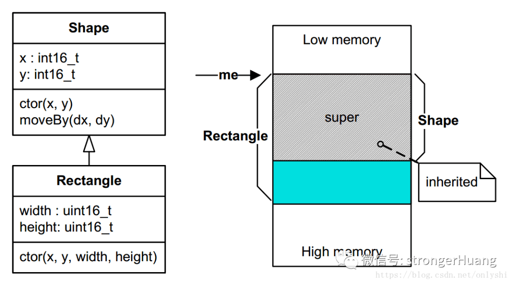
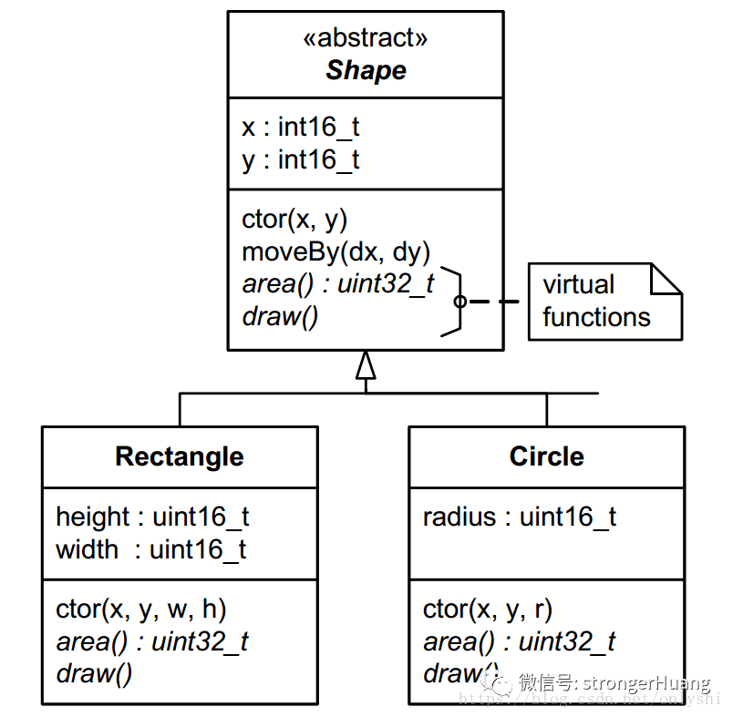
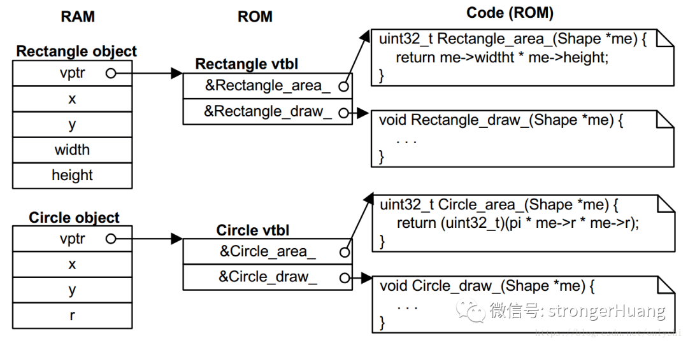

## C 面向对象 - HQ

[TOC]

------

#### 注意

- 

------

# C语言的高级用法，面向对象 - 摘录

> 原文地址：https://blog.csdn.net/onlyshi/article/details/81672279
>
> 文章来源：嵌入式情报局，strongerhuang

不知道有多少人去了解过语言的发展史，早期C语言的语法功能其实比较简单。随着应用需求和场景的变化，C语言的语法功能在不断升级变化。

虽然我们的教材有这么一个结论：C语言是**面向过程**的语言，C++是**面向对象**的编程语言，但面向对象的概念是在C语言阶段就有了，而且应用到了很多地方，比如某些操作系统内核、通信协议等。

面向对象编程，也就是大家说的OOP（Object Oriented Programming）并不是一种特定的语言或者工具，**它只是一种设计方法、设计思想**，它表现出来的三个最基本的特性就是**封装、继承与多态**。


## 1、为什么用C实现OOP  

阅读文本之前肯定有读者会问这样的问题：我们有C++面向对象的语言，为什么还要用C语言实现面向对象呢？

C语言这种非面向对象的语言，同样也可以使用面向对象的思路来编写程序的。

**只是用面向对象的\**C++\**语言来实现面向对象编程会更简单一些，但是C语言的高效性是其他面向对象编程语言无法比拟的。**

当然使用C语言来实现面向对象的开发**相对不容易理解**，这就是为什么大多数人学过C语言却看不懂Linux内核源码。

所以这个问题其实很好理解，只要有一定C语言编程经验的读者都应该能明白：**面向过程的C语言和面向对象的C++语言相比，代码运行效率、代码量都有很大差异**。在性能不是很好、资源不是很多的MCU中使用C语言面向对象编程就显得尤为重要。


## 2、所具备的条件  

要想使用C语言实现面向对象，首先需要具备一些基础知识。比如：（C语言中的）结构体、函数、指针，以及函数指针等，（C++中的）基类、派生、多态、继承等。

首先，不仅仅是了解这些基础知识，而是有一定的编程经验，因为上面说了“面向对象是一种设计方法、设计思想”，如果只是停留在字面意思的理解，没有这种设计思想肯定不行。

因此，不建议初学者使用C语言实现面向对象，特别是在真正项目中。建议把基本功练好，再使用。

利用C语言实现面向对象的方法很多，下面就来描述最基本的封装、继承和多态。


## 3、封装 

**封装就是把数据和函数打包到一个类里面，**其实大部分C语言编程者都已近接触过了。

C 标准库中的 fopen(), fclose(), fread(), fwrite()等函数的操作对象就是 FILE。数据内容就是 FILE，数据的读写操作就是 fread()、fwrite()，fopen() 类比于构造函数，fclose() 就是析构函数。

这个看起来似乎很好理解，那下面我们实现一下基本的封装特性。

```
#ifndef SHAPE_H
#define SHAPE_H
#include <stdint.h>
// Shape 的属性
typedef struct {
    int16_t x; 
    int16_t y; 
} Shape;
// Shape 的操作函数，接口函数
void Shape_ctor(Shape * const me, int16_t x, int16_t y);
void Shape_moveBy(Shape * const me, int16_t dx, int16_t dy);
int16_t Shape_getX(Shape const * const me);
int16_t Shape_getY(Shape const * const me);
#endif /* SHAPE_H */
```

这是 Shape 类的声明，非常简单，很好理解。一般会把声明放到头文件里面 “Shape.h”。来看下 Shape 类相关的定义，当然是在 “Shape.c” 里面。

```
#include "shape.h"
// 构造函数
void Shape_ctor(Shape * const me, int16_t x, int16_t y)
{
    me->x = x;
    me->y = y;
}
void Shape_moveBy(Shape * const me, int16_t dx, int16_t dy) 
{
    me->x += dx;
    me->y += dy;
}
// 获取属性值函数
int16_t Shape_getX(Shape const * const me) 
{
    return me->x;
}
int16_t Shape_getY(Shape const * const me) 
{
    return me->y;
}
```

再看下 main.c

```
#include "shape.h"  /* Shape class interface */
#include <stdio.h>  /* for printf() */
int main() 
{
    Shape s1, s2; /* multiple instances of Shape */
    Shape_ctor(&s1, 0, 1);
    Shape_ctor(&s2, -1, 2);
    printf("Shape s1(x=%d,y=%d)\n", Shape_getX(&s1), Shape_getY(&s1));
    printf("Shape s2(x=%d,y=%d)\n", Shape_getX(&s2), Shape_getY(&s2));
    Shape_moveBy(&s1, 2, -4);
    Shape_moveBy(&s2, 1, -2);
    printf("Shape s1(x=%d,y=%d)\n", Shape_getX(&s1), Shape_getY(&s1));
    printf("Shape s2(x=%d,y=%d)\n", Shape_getX(&s2), Shape_getY(&s2));
    return 0;
}
```

编译之后，看看执行结果：

```
Shape s1(x=0,y=1)
Shape s2(x=-1,y=2)
Shape s1(x=2,y=-3)
Shape s2(x=0,y=0)
```

整个例子，非常简单，非常好理解。以后写代码时候，要多去想想标准库的文件IO操作，这样也有意识的去培养面向对象编程的思维。


## 4、继承 

**继承就是基于现有的一个类去定义一个新类**，这样有助于重用代码，更好的组织代码。在 C 语言里面，去实现单继承也非常简单，只要把基类放到继承类的第一个数据成员的位置就行了。

例如，我们现在要创建一个 Rectangle 类，我们只要继承 Shape 类已经存在的属性和操作，再添加不同于 Shape 的属性和操作到 Rectangle 中。

下面是 Rectangle 的声明与定义：

```
#ifndef RECT_H
#define RECT_H
#include "shape.h" // 基类接口
// 矩形的属性
typedef struct {
    Shape super; // 继承 Shape
    // 自己的属性
    uint16_t width;
    uint16_t height;
} Rectangle;
// 构造函数
void Rectangle_ctor(Rectangle * const me, int16_t x, int16_t y,
                    uint16_t width, uint16_t height);
#endif /* RECT_H */
```

```
#include "rect.h"
// 构造函数
void Rectangle_ctor(Rectangle * const me, int16_t x, int16_t y,
                    uint16_t width, uint16_t height)
{
    /* first call superclass’ ctor */
    Shape_ctor(&me->super, x, y);
    /* next, you initialize the attributes added by this subclass... */
    me->width = width;
    me->height = height;
}
```

我们来看一下 Rectangle 的继承关系和内存布局：



因为有这样的内存布局，所以你可以很安全的传一个指向 Rectangle 对象的指针到一个期望传入 Shape 对象的指针的函数中，就是一个函数的参数是 “Shape *”，你可以传入 “Rectangle *”，并且这是非常安全的。这样的话，基类的所有属性和方法都可以被继承类继承！

```
#include "rect.h"  
#include <stdio.h> 
int main() 
{
    Rectangle r1, r2;
    // 实例化对象
    Rectangle_ctor(&r1, 0, 2, 10, 15);
    Rectangle_ctor(&r2, -1, 3, 5, 8);
    printf("Rect r1(x=%d,y=%d,width=%d,height=%d)\n",
           Shape_getX(&r1.super), Shape_getY(&r1.super),
           r1.width, r1.height);
    printf("Rect r2(x=%d,y=%d,width=%d,height=%d)\n",
           Shape_getX(&r2.super), Shape_getY(&r2.super),
           r2.width, r2.height);
    // 注意，这里有两种方式，一是强转类型，二是直接使用成员地址
    Shape_moveBy((Shape *)&r1, -2, 3);
    Shape_moveBy(&r2.super, 2, -1);
    printf("Rect r1(x=%d,y=%d,width=%d,height=%d)\n",
           Shape_getX(&r1.super), Shape_getY(&r1.super),
           r1.width, r1.height);
    printf("Rect r2(x=%d,y=%d,width=%d,height=%d)\n",
           Shape_getX(&r2.super), Shape_getY(&r2.super),
           r2.width, r2.height);
    return 0;
}
```

输出结果：

```
Rect r1(x=0,y=2,width=10,height=15)
Rect r2(x=-1,y=3,width=5,height=8)
Rect r1(x=-2,y=5,width=10,height=15)
Rect r2(x=1,y=2,width=5,height=8)
```


## 5、多态  

C++ 语言实现多态就是使用虚函数。在 C 语言里面，也可以实现多态。

现在，我们又要增加一个圆形，并且在 Shape 要扩展功能，我们要增加 area() 和 draw() 函数。但是 Shape 相当于抽象类，不知道怎么去计算自己的面积，更不知道怎么去画出来自己。而且，矩形和圆形的面积计算方式和几何图像也是不一样的。

下面让我们重新声明一下 Shape 类：

```
#ifndef SHAPE_H
#define SHAPE_H
#include <stdint.h>
struct ShapeVtbl;
// Shape 的属性
typedef struct {
    struct ShapeVtbl const *vptr;
    int16_t x; 
    int16_t y; 
} Shape;
// Shape 的虚表
struct ShapeVtbl {
    uint32_t (*area)(Shape const * const me);
    void (*draw)(Shape const * const me);
};
// Shape 的操作函数，接口函数
void Shape_ctor(Shape * const me, int16_t x, int16_t y);
void Shape_moveBy(Shape * const me, int16_t dx, int16_t dy);
int16_t Shape_getX(Shape const * const me);
int16_t Shape_getY(Shape const * const me);
static inline uint32_t Shape_area(Shape const * const me) 
{
    return (*me->vptr->area)(me);
}
static inline void Shape_draw(Shape const * const me)
{
    (*me->vptr->draw)(me);
}
Shape const *largestShape(Shape const *shapes[], uint32_t nShapes);
void drawAllShapes(Shape const *shapes[], uint32_t nShapes);
#endif /* SHAPE_H */
```

看下加上虚函数之后的类关系图：



**5.1 虚表和虚指针**

虚表（Virtual Table）是这个类所有虚函数的函数指针的集合。

虚指针（Virtual Pointer）是一个指向虚表的指针。这个虚指针必须存在于每个对象实例中，会被所有子类继承。

在《Inside The C++ Object Model》的第一章内容中，有这些介绍。

**5.2 在构造函数中设置vptr**

在每一个对象实例中，vptr 必须被初始化指向其 vtbl。最好的初始化位置就是在类的构造函数中。事实上，在构造函数中，C++ 编译器隐式的创建了一个初始化的vptr。在 C 语言里面， 我们必须显示的初始化vptr。

下面就展示一下，在 Shape 的构造函数里面，如何去初始化这个 vptr。

```
#include "shape.h"
#include <assert.h>
// Shape 的虚函数
static uint32_t Shape_area_(Shape const * const me);
static void Shape_draw_(Shape const * const me);
// 构造函数
void Shape_ctor(Shape * const me, int16_t x, int16_t y) 
{
    // Shape 类的虚表
    static struct ShapeVtbl const vtbl = 
    { 
       &Shape_area_,
       &Shape_draw_
    };
    me->vptr = &vtbl; 
    me->x = x;
    me->y = y;
}
void Shape_moveBy(Shape * const me, int16_t dx, int16_t dy)
{
    me->x += dx;
    me->y += dy;
}
int16_t Shape_getX(Shape const * const me) 
{
    return me->x;
}
int16_t Shape_getY(Shape const * const me) 
{
    return me->y;
}
// Shape 类的虚函数实现
static uint32_t Shape_area_(Shape const * const me) 
{
    assert(0); // 类似纯虚函数
    return 0U; // 避免警告
}
static void Shape_draw_(Shape const * const me) 
{
    assert(0); // 纯虚函数不能被调用
}
Shape const *largestShape(Shape const *shapes[], uint32_t nShapes) 
{
    Shape const *s = (Shape *)0;
    uint32_t max = 0U;
    uint32_t i;
    for (i = 0U; i < nShapes; ++i) 
    {
        uint32_t area = Shape_area(shapes[i]);// 虚函数调用
        if (area > max) 
        {
            max = area;
            s = shapes[i];
        }
    }
    return s;
}
void drawAllShapes(Shape const *shapes[], uint32_t nShapes) 
{
    uint32_t i;
    for (i = 0U; i < nShapes; ++i) 
    {
        Shape_draw(shapes[i]); // 虚函数调用
    }
}
```

**5.3 继承 vtbl 和 重载 vptr**

上面已经提到过，基类包含 vptr，子类会自动继承。但是，vptr 需要被子类的虚表重新赋值。并且，这也必须发生在子类的构造函数中。下面是 Rectangle 的构造函数。

```
#include "rect.h"  
#include <stdio.h> 
// Rectangle 虚函数
static uint32_t Rectangle_area_(Shape const * const me);
static void Rectangle_draw_(Shape const * const me);
// 构造函数
void Rectangle_ctor(Rectangle * const me, int16_t x, int16_t y,
                    uint16_t width, uint16_t height)
{
    static struct ShapeVtbl const vtbl = 
    {
        &Rectangle_area_,
        &Rectangle_draw_
    };
    Shape_ctor(&me->super, x, y); // 调用基类的构造函数
    me->super.vptr = &vtbl;           // 重载 vptr
    me->width = width;
    me->height = height;
}
// Rectangle's 虚函数实现
static uint32_t Rectangle_area_(Shape const * const me) 
{
    Rectangle const * const me_ = (Rectangle const *)me; //显示的转换
    return (uint32_t)me_->width * (uint32_t)me_->height;
}
static void Rectangle_draw_(Shape const * const me) 
{
    Rectangle const * const me_ = (Rectangle const *)me; //显示的转换
    printf("Rectangle_draw_(x=%d,y=%d,width=%d,height=%d)\n",
           Shape_getX(me), Shape_getY(me), me_->width, me_->height);
}
```

**5.4 虚函数调用**

有了前面虚表（Virtual Tables）和虚指针（Virtual Pointers）的基础实现，虚拟调用（后期绑定）就可以用下面代码实现了。

```
uint32_t Shape_area(Shape const * const me)
{
    return (*me->vptr->area)(me);
}
```

这个函数可以放到.c文件里面，但是会带来一个缺点就是每个虚拟调用都有额外的调用开销。为了避免这个缺点，如果编译器支持内联函数（C99）。我们可以把定义放到头文件里面，类似下面：

```
static inline uint32_t Shape_area(Shape const * const me) 
{
    return (*me->vptr->area)(me);
}
```

如果是老一点的编译器（C89），我们可以用宏函数来实现，类似下面这样：

```
#define Shape_area(me_) ((*(me_)->vptr->area)((me_)))
```

看一下例子中的调用机制：



**5.5 main.c**

```
#include "rect.h"  
#include "circle.h" 
#include <stdio.h> 
int main() 
{
    Rectangle r1, r2; 
    Circle    c1, c2; 
    Shape const *shapes[] = 
    { 
        &c1.super,
        &r2.super,
        &c2.super,
        &r1.super
    };
    Shape const *s;
    // 实例化矩形对象
    Rectangle_ctor(&r1, 0, 2, 10, 15);
    Rectangle_ctor(&r2, -1, 3, 5, 8);
    // 实例化圆形对象
    Circle_ctor(&c1, 1, -2, 12);
    Circle_ctor(&c2, 1, -3, 6);
    s = largestShape(shapes, sizeof(shapes)/sizeof(shapes[0]));
    printf("largetsShape s(x=%d,y=%d)\n", Shape_getX(s), Shape_getY(s));
    drawAllShapes(shapes, sizeof(shapes)/sizeof(shapes[0]));
    return 0;
}
```

输出结果：

```
largetsShape s(x=1,y=-2)
Circle_draw_(x=1,y=-2,rad=12)
Rectangle_draw_(x=-1,y=3,width=5,height=8)
Circle_draw_(x=1,y=-3,rad=6)
Rectangle_draw_(x=0,y=2,width=10,height=15)
```


## 6、总结  

还是那句话，**面向对象编程是一种方法，并不局限于某一种编程语言。**用 C 语言实现封装、单继承，理解和实现起来比较简单，多态反而会稍微复杂一点，如果打算广泛的使用多态，还是推荐转到 C++ 语言上，毕竟这层复杂性被这个语言给封装了，你只需要简单的使用就行了。但并不代表，C 语言实现不了多态这个特性。


