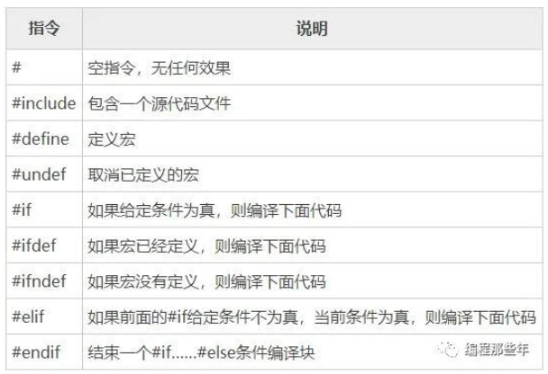
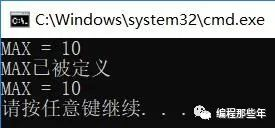
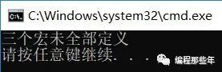

## C 预处理 - HQ

[TOC]

------

#### 注意

- [编程那些年文章](https://mp.weixin.qq.com/s?__biz=MzkzMDE4MDM2NQ==&mid=2247484126&idx=1&sn=fafe66957eab8ae20c188ed472d32615&chksm=c27f7ebcf508f7aace41ccf9c3e6e6f29ba2c27808384b990159e67a75ded2c5ef29d9742791&scene=178&cur_album_id=1893764190448746499#rd)

------

### 预处理命令

在接触#if、#undef这类预处理指令前，大部分都都接触过#define、#include等预处理命令，通俗来讲预处理命令的作用就是在编译和链接之前，对源文件进行一些文本方面的操作，比如文本替换、文件包含、删除部分代码等，这个过程叫做预处理（在编译之前对源文件进行简单加工）

（#define是一种宏定义命令，是预处理命令的一种）

> 

 

### #include（文件包含命令）

\#include的用法有两种，尖括号<>和双引号""

第一种----**尖括号**

```
#include <stdio.h>
```

 第二种----**双引号**

```
#include "stdio.h"
```

使用尖括号和双引号的区别在于头文件的搜索路径

**尖括号**：编译器会到系统路径下查找头文件

**双引号**：编译器会先在当前目录下查找头文件，如果没有找到，再到系统路径下查找

注意事项：

1、一个 #include 命令只能包含一个头文件

2、同一个头文件可以被多次引入，多次引入的效果和一次引入的效果相同，因为头文件在代码层面有防止重复引入的机制

3、头文件包含允许嵌套

（头文件只能包含变量和函数的**声明**，不能包含**定义**，否则在多次引入时会引起重复定义错误） 

 

### #define（宏定义命令）

格式：#define 标识符 字符串 

并不是所有情况下#define所定义的字符串都会被替换，有一种特殊情况：**被替换的字符串在""内**

代码示例：

```
#include <stdio.h>
#define MAX 10
int main()
{
    printf("MAX");
}
```

还有需要注意的一点是，不管是在某个函数内，还是在所有函数之外（不太建议把#define写在函数内），#define作用域都是从**定义开始直到整个文件结尾**（这一点和typedef就区别很大）

**#define（宏定义）----由预处理器来处理**

**typedef----在编译阶段由编译器处理**

 代码示例：

```
 #include <stdio.h>
 
 void fun();
 int main()
 {
   #define MAX int
   MAX a = 10;
   printf("%d", a);
   fun();
}

void fun()
{
   MAX b = 10;
   printf("%d", b);
}
```

**define与typedef作用域的的区别：**

**typedef：**

如果放在所有函数之外，它的作用域就是从**它定义开始直到文件尾**

如果放在某个函数内，它的作用域就是从**它定义开始直到该函数结尾**

**#define：**

不管是在某个函数内，还是在所有函数之外，作用域都是从定义开始直到整个文件结尾（不管是typedef还是define，其作用域都不会扩展到别的文件，即使是同一个程序的不同文件，也不能互相使用）

这里说下题外话#define叫宏定义，但是在笔者的认识里对声明和定义的理解是：声明不分配内存，定义才分配内存，所以#define虽然名字里面有“定义”两个字，但并不占存储空间（为什么不叫宏声明···）

总结：#define和**声明、定义都不同**，宏定义不占内存空间，因为宏在预处理阶段就会被替换掉，到了编译的阶段是没有宏存在的，它在预编译阶段就被处理了

 

### #undef 

上文提到#define的作用域是从它声明开始到文件结尾，#undef就是取消之前的宏定义（也就是#define的标识符）

格式：#undef 标识符（注意：如果标识符当前没有被定义成一个宏名称，那么就会**忽略**该指令）

```
 #include <stdio.h>
  
 #define MAX 10
 int main()
{
     printf("%d", MAX);
 #undef MAX
 #define MAX 20
     printf("%d", MAX);
}
```


### #if（条件编译）

\#if的使用和if else的使用非常相似，一般使用格式如下

**#if 整型常量表达式1
  程序段1
\#elif 整型常量表达式2
  程序段2
\#else
  程序段3
\#endif**

执行起来就是，如果整形常量表达式为真，则执行程序段1，否则继续往后判断依次类推（注意是整形常量表达式），最后#endif是#if的结束标志

代码示例：

```
#include "stdio.h"

#define MAX 10
int main()
{
   printf("MAX = %d\n", MAX);

#if MAX == 10
   printf("MAX已被定义\n");
#else 
   printf("MAX未被定义\n");
   #undef MAX
   #define  MAX 20
#endif


    printf("MAX = %d\n", MAX); 
    return 0;
}
```

运行结果：

> 

代码稍加修改：

```
#include "stdio.h"

#define MAX 10
int main()
{
#if  MAX == 1
   printf("MAX已被定义\n");
#else 
   printf("MAX未被定义\n");
   #undef MAX
   #define    MAX 20
#endif
   printf("MAX = %d\n", MAX);

   return 0;
}
```

运行结果：

\#if命令要求判断条件为**整型常量表达式**，也就是说表达式中不能包含**变量**，而且结果必须是**整数**；而if后面的表达式没有限制，只要符合语法就行,这是#if和if的一个重要区别

 

### #ifdef

\#ifdef的作用是判断某个宏是否定义，如果该宏已经定义则执行后面的代码，一般使用格式如下

**#ifdef  宏名
  程序段1
\#else
  程序段2
\#endif**

它的意思是，如果该宏已被定义过，则对**程序段1**进行编译，否则对**程序段2**进行编译（这个和上面的#if一样最后都需要#endif），上述格式也可以不用#else，这一点上和if else相同

代码示例：

```
#include <stdio.h>

#define MAX 10
int main()
{
#ifdef MAX
    printf("MAX已被定义\n");
#else 
    printf("MAX未被定义\n");
    #undef MAX
    #define    MAX 20
#endif


    printf("MAX = %d\n", MAX);

    return 0;
}
```

 

### #ifndef

\#ifndef恰好和#ifdef相反

**#ifndef 宏名
  程序段1 
\#else 
  程序段2 
\#endif**

如果该宏未被定义，则对“程序段1”进行编译，否则对“程序段2”进行编译

代码示例：

```
#include <stdio.h>
#define MAX 10
int main()
{
 #ifndef MAX
    printf("MAX未被定义\n");
#else 
    printf("MAX已被定义\n");
    #undef MAX
    #define    MAX 20
#endif
    printf("MAX = %d\n", MAX);
    return 0;
}
```


### #elif

\#elif相当于if else语句中的else if()语句，需要注意的是该语句是#elif，而不是#elseif

代码示例：

```
 #include <stdio.h>
 
#define MAX 10
int main()
{
#if MAX==0
    printf("MAX=0");
 #elif MAX==10
    printf("MAX=10\n");
#endif

    return 0;
}
 
```


### #endif

\#endif上面已经用过多次了，需要知道的就是**#endif**是**#if, #ifdef, #ifndef**这些条件命令的结束标志.这里就不再赘述了

上面说了8种预处理命令，下面再补充一个预处理**函数**（注意是**函数**且该函数有返回值）

 

### defined函数

defined函数的作用是判断某个宏是否被定义,若该宏被定义则返回**1**，否则返回**0**，该函数经常与#if #elif #else配合使用，一般使用格式为：

**defined 宏名**

**或**

**defined (宏名)----（个人建议，还是加上括号比较好）**

上文提到有#ifdef、#ifndef来判断宏名是否被定义，乍一看defined有点多余，其实不然，#ifdef和#ifndef仅能一次判断一个宏名，而defined能做到一次判断多个宏名

代码示例：

```
 #include <stdio.h>
 
 #define MAX 10
 #define MIN 2
 #define AVE 6
 int main()
{
 #if defined (MAX) && defined (MIN) && defined (AVE)
     printf("三个宏已全部定义\n");
 #elif MAX==10
     printf("三个宏未全部定义\n");
 #endif


     return 0;
}
```

运行效果：


代码稍加修改：

```
#include <stdio.h>

#define MAX 10
#define MIN 2

int main()
{
#if defined (MAX) && defined (MIN) && defined (AVE)
    printf("三个宏已全部定义\n");
 #elif MAX==10
     printf("三个宏未全部定义\n");
 #endif

    return 0;
}
```

运行结果：



预处理功能是C语言特有的功能，使用预处理功能便于程序的修改、阅读、移植和调试，也便于实现模块化程序设计


