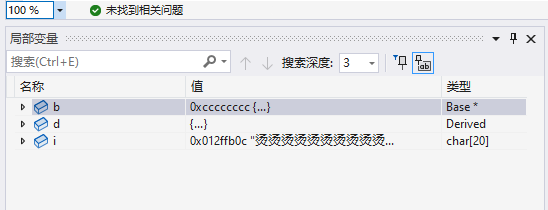

## 程序调试 - HQ

[TOC]

------

#### 注意

- 参考文章 https://copyfuture.com/blogs-details/20210730121250769n

------

## Visual Studio软件调试方法

根据需要，设置断点

> 

代码写好后，选择开始调试

> 

程序运行后，会显示断点处的变量值

> 

查看程序运行时内存数据，也可以根据需要选择其他窗口来查看程序运行时的内容

> 

