## 剑指offer刷题笔记 - HQ

[TOC]

----

### 注意内容

- map 是 O(logn) ，底层实现是平衡树，unorder_map 是 O(1)，哈希表。
- 树 - 节点， 链表 - 结点
- `(*p).num` 改用 `p->num` 来代替，它表示 `*p` 所指向的结构体变量中的 `num` 成员，同样，`(*p).name` 等价于 `p->name`。
- 补充：`A & B | A & C = A & (B | C)`
- cur是cursor的缩写，译为光标。
- 深度优先遍历一般是通过递归来实现的，广度优先遍历一般是通过队列来实现的。
- C++中判断指针是否为空
  - ` if (root == nullptr) return nullptr;`
  - `if (!root) return NULL;`
- 下面两种写法等价，因为只有在`i = -1` 时` ~i = 0`
  - `for (int i = n - 1; ~i; i--) `
  - `for (int i = n - 1; i >= 0; i--) `
- 在用while做指针扫描时，要注意在每个while中进行指针是否越界的判断，因为使用while时往往会越界
  - 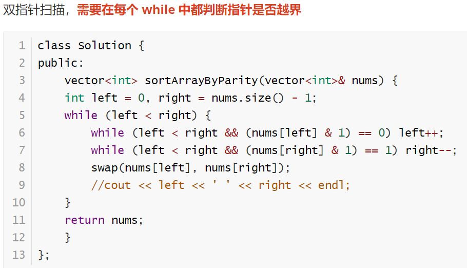


----

## 时间复杂度

- 计算机1G的空间大约有 10^9^个int，而计算机一秒能运算 10^7^到10^8^次，所以时间复杂度比空间复杂度更重要。

- 量级

  - C++    一秒能算 10^7 ~ 10^8 次，一千万次到一亿次
  - 2^20 约等于 100万，即百万个字节约等于1M
  - 2^30 约等于 10亿，即10亿个字节约等于1G
  - log10^x 约等于 3x

- 时间复杂度排序

  - `O(1)<O(lgN)<O(N)<O(N*lgN)<O(n²)<O(n3)<O(2ⁿ)`

  - > 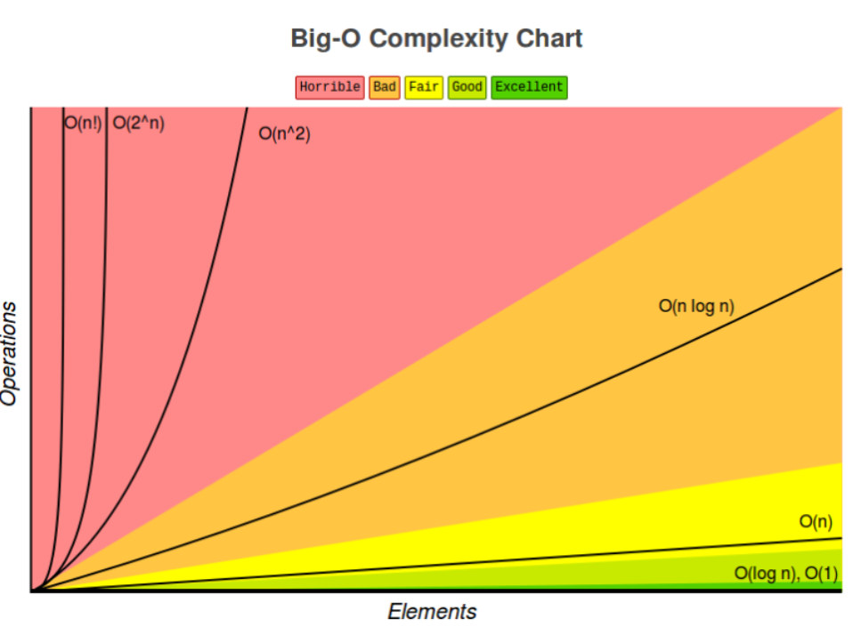

  - > 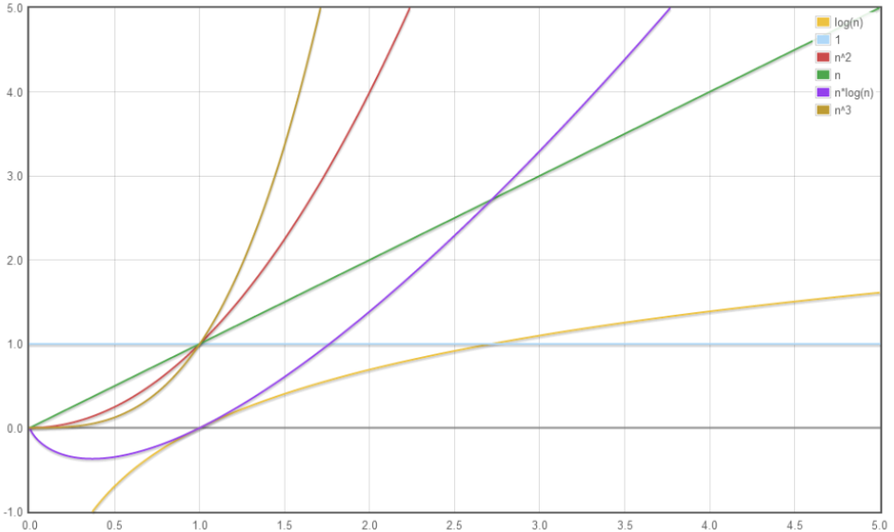

- 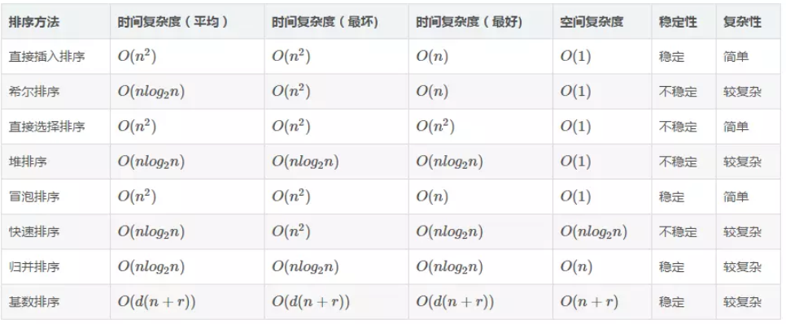


## C++ 语法知识补充：

- `erase()函数`

  erase函数的原型如下：

  （1）`string& erase(size_t pos = 0, size_t n = npos);`

  （2）`interator erase(iterator position);`

  （3）`iterator erase(iterator first, iterator last);`

  有三种用法：

  （1）`erase(pos, n);` 删除从pos开始的n个字符，例如erase( 0, 1)，删除0位置的一个字符，即删除第一个字符。

  （2）`erase(position);` 删除position处的一个字符（position是个string类型的迭代器）。

  （3）`erase(first，last);`删除从first到last之间的字符（first和last都是迭代器）。

  ```cpp
  int main ()
  {
    string str ("This is an example phrase.");
    string::iterator it;
   
    // 第(1)种用法
    str.erase (10,8);
    cout << str << endl;        // "This is an phrase."
   
    // 第(2)种用法
    it=str.begin()+9;
    str.erase (it);
    cout << str << endl;        // "This is a phrase."
   
    // 第(3)种用法
    str.erase (str.begin()+5, str.end()-7);
    cout << str << endl;        // "This phrase."
    return 0;
  }
  ```

- `reverse`函数用于反转在==[first,last)==范围内的顺序==（包括first指向的元素，不包括last指向的元素）==

- `push_back()`向容器中加入一个右值元素(临时对象)时，首先会调用构造函数构造这个临时对象，然后需要调用拷贝构造函数将这个临时对象放入容器中。原来的临时变量释放。这样造成的问题就是临时变量申请资源的浪费。 

- `emplace_back()`  在容器尾部添加一个元素，这个元素原地构造，不需要触发拷贝构造和转移构造。而且调用形式更加简洁，直接根据参数初始化临时对象的成员。

- `stoi()`   把数字字符串转换成`int`输出，参数是`const string*`,不需要转化为 `const char*`

- `atoi()`    把数字字符串转换成`int`输出，参数是 `const char*` ,因此对于一个字符串str我们必须调用 `c_str()`的方法把这个string转换成 `const char*`类型的

- `sub_string(string str, int a)`  第a个字符开始截取后面所有的字符串

- `resize(n)`  设置大小（size）
  - 调整容器的长度大小，使其能容纳n个元素。
  - 如果n小于容器的当前的size，则删除多出来的元素。
  - 否则，添加采用值初始化的元素。
  - 容器调用resize()函数后，所有的空间都已经初始化了，所以可以直接访问。

- `resize(n, t)`  多一个参数t，将所有新添加的元素初始化为t

- `reserve()`  设置容量（capacity）预分配n个元素的存储空间。
  - reserve()函数预分配出的空间没有被初始化，所以不可访问。

- `auto`   C++11 auto可以在声明变量的时候根据变量初始值的类型自动为此变量选择匹配的类型。

  - 用auto声明的变量必须初始化（auto是根据后面的值来推测这个变量的类型，如果后面没有值，自然会报错）

  - 函数和模板参数不能被声明为auto（原因同上）

  - 因为auto是一个占位符，并不是一个他自己的类型，因此不能用于类型转换或其他一些操作，如sizeof和typeid。

  - 定义在一个auto序列的变量必须始终推导成同一类型

    - `auto x1 = 5, x2 = 5.0, x3='r';  *// This is too much....we cannot combine like this*`

  - 示例：

    - ```cpp
      std::vector<std::string> ve;
      std::vector<std::string>::iterator it = ve.begin();
      //用atuo来代替那个初始化类型
      auto it = ve.begin();
      ```

- int 数据范围

  ```cpp
  C中int类型是32位的，范围是-2147483648到2147483647 
  #define INT_MAX 2147483647
  #define INT_MIN (-INT_MAX - 1)
  ```


### 优先级

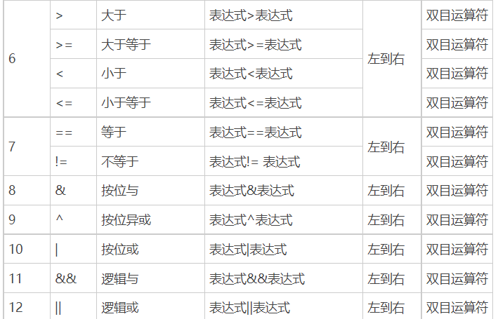


### new 和 delete

1. new

   - new和delete运算符是用于动态分配和撤销内存的运算符，必须成对适用；

   - new用法——开辟单变量地址空间、开辟数组空间；

   - new作用—— 使用new运算符时必须已知数据类型，**new运算符会向系统堆区申请足够的存储空间，如果申请成功，就返回该内存块的首地址，如果申请不成功，则返回零值；**

   - new出来的对象**用对应数据类型的指针接收**——**new运算符返回的是一个指向所分配类型变量（对象）的指针。**对所创建的变量或对象，都是通过该指针来间接操作的；

   - new一般使用格式（3种）(开辟单变量地址空间)
     1. `指针类型*  指针变量名 = new 数据类型;`
        - `int *a = new int`     将一个int类型的地址赋值给整型指针a
     2. `指针类型*  指针变量名 = new 数据类型（初值）;`
        - `int *a = new int(2)`     作用同上, 但是同时将整数空间赋值为2
     3. `指针类型*  指针变量名 = new 数据类型（内存单元个数）;`

   - 开辟数组空间
     - `指针类型*  指针变量名 = new 数组类型[数组元素个数];`
     - 一维:    `int *a = new int[100];`    //开辟一个大小为100的整型数组空间
     - 二维:    `int **a = new int[5][6];`

2. delete

   - delete [] 的方括号中不需要填数组元素数，系统自知。即使写了，编译器也忽略。

   - delete用法
     1. 删除单变量地址空间
        - `int *a = new int[2];`
        - `delete a;`     //释放单个int的空间
     2. 删除数组空间
        - `int *a = new int[5];`
        - `delete []a;`    //释放int数组空间

### 树的遍历

DLR--前序遍历--根左右（根在前，从左往右，一棵树的根永远在左子树前面，左子树又永远在右子树前面 ）

LDR--中序遍历--左根右（根在中，从左往右，一棵树的左子树永远在根前面，根永远在右子树前面）

LRD--后序遍历--左右根（根在后，从左往右，一棵树的左子树永远在右子树前面，右子树永远在根前面）

- 前序遍历（根 左 右）

  > 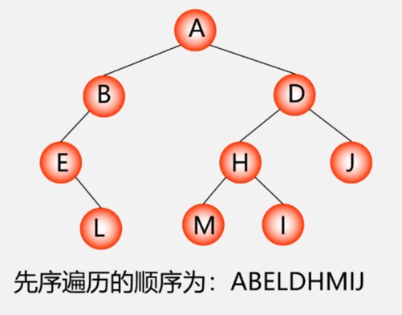

- 中序遍历（左 根 右）

  > 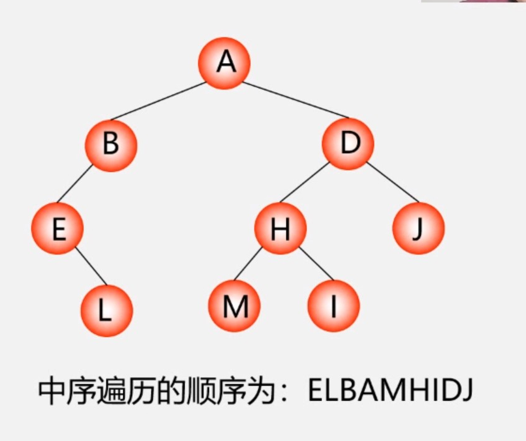

  ```cpp
  // 打印中序遍历
  void dfs(Node* root) {
      if(root == nullptr) return;
      dfs(root->left); // 左
      cout << root->val << endl; // 根
      dfs(root->right); // 右
  }
  ```

- 后序遍历（左 右 根）

  > 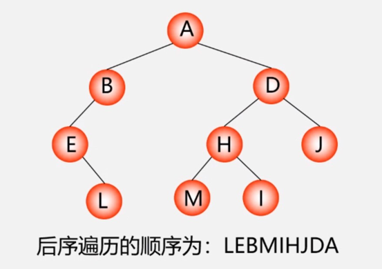


## 算法模板

### string类判断字符串为空

**1、string类有自己的成员函数empty, 可以用来判断是否为空：**

```cpp
string str;
if (str.empty())  //成立则为空
```

**2、判断字符串长度。如果长度为0，则为空：**

```c
string str;
if (str.size() == 0)  //成立则为空
```

**3、与空串比较，如果相等则为空：**

```c
string str;
if(str == "") //引号里没有空格，成立则为空
```

几种方法中，**empty函数**是效率最高也是最常用的一种。

**注意：**

不能使用`str==NULL`来判断，NULL一般只拿和指针做比较或者赋给指针，string是类，传参进函数时str调用默认的构造函数已经初始化了，并且str都已经是对象了，它不可能为NULL,也不能和NULL比较。


### 归并

归并算法核心是分治思想：

- 分，划分成很多个小的问题，然后递归处理。

- 治，将分阶段得到的答案整合起来，即为分治思想。

步骤：

1. 先确定分界点
2. 然后递归处理（排序）
3. 最后归并 - 合二为一

归并的每层时间复杂度都是O(n)，一共logn层，所以时间复杂度为O(nlogn)


### 递归

常用递归方法的三种情况：

- 递归定义的数学函数
- 具有递归特性的数学结构
- 可递归求解的问题

> 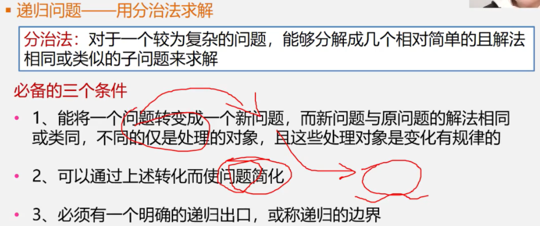

分治法求解递归问题算法的一般形式：

```cpp
void p(参数表)
{
    if (递归结束条件)
        可直接求解步骤;   //基本项
    else
        p(较小的参数);   //归纳项
}
```

例如：

```cpp
long Fact(long n)
{
    if (n == 0)
        return 1;  //基本项
    else
        return n * Fact(n - 1);  //归纳项
}
```


### 整数二分算法模板

二分模板一共有两个，分别适用于不同情况。
算法思路：假设目标值在闭区间`[l, r]`中， 每次将区间长度缩小一半，当`l = r`时，我们就找到了目标值。

**版本1**

当我们将区间`[l, r]`划分成`[l, mid]`和`[mid + 1, r]`时，其更新操作是`r = mid(左半边区间)`或者`l = mid + 1;(右半边区间)`计算`mid`时不需要加1。

**C++ 代码模板：**

```cpp
int bsearch_1(int l, int r)
{
    while (l < r)
    {
        int mid = l + r >> 1;
        if (check(mid)) r = mid;
        else l = mid + 1;
    }
    return l;
}
```

**版本2**

当我们将区间`[l, r]`划分成`[l, mid - 1]`和`[mid, r]`时，其更新操作是`r = mid - 1(左半边区间)`或者`l = mid;(右半边区间)`，此时为了防止死循环，计算`mid`时需要加1。

**C++ 代码模板：**

```cpp
int bsearch_2(int l, int r)
{
    while (l < r)
    {
        int mid = l + r + 1 >> 1;
        if (check(mid)) l = mid;
        else r = mid - 1;
    }
    return l;
}
```


## week 1

### 1. 找出数组中重复的数字

#### 题目

>给定一个长度为 n 的整数数组 `nums`，数组中所有的数字都在 0∼n−1 的范围内。
>
>数组中某些数字是重复的，但不知道有几个数字重复了，也不知道每个数字重复了几次。
>
>请找出数组中任意一个重复的数字。
>
>**注意**：如果某些数字不在 0∼n−1 的范围内，或数组中不包含重复数字，则返回 -1；
>
>#### 数据范围
>
>0≤n≤1000
>
>#### 样例
>
>```
>给定 nums = [2, 3, 5, 4, 3, 2, 6, 7]。
>返回 2 或 3。
>```

#### 题解

##### (数组遍历) O(n)

首先遍历一遍数组，如果存在某个数不在0到n-1的范围内，则返回-1。

下面的算法的**主要思想是把每个数放到对应的位置上**，即让 `nums[i] = i`。

从前往后遍历数组中的所有数，假设当前遍历到的数是 nums[i]=x，那么：

- 如果`x != i && nums[x] == x`，则说明 x 出现了多次，直接返回 x 即可；
- 如果`nums[x] != x`，那我们就把 x 交换到正确的位置上，即 `swap(nums[x], nums[i])`，交换完之后如果`nums[x] != x`，则重复进行该操作。由于每次交换都会将一个数放在正确的位置上，所以swap操作最多会进行 n 次，不会发生死循环。

循环结束后，如果没有找到任何重复的数，则返回-1。

**时间复杂度分析**

每次`swap`操作都会将一个数放在正确的位置上，最后一次`swap`会将两个数同时放到正确位置上，一共只有 n 个数和 n 个位置，所以`swap`最多会进行 n−1次。所以总时间复杂度是 O(n)。

```cpp
class Solution {
public:
    int duplicateInArray(vector<int>& nums) {
        int n = nums.size();
        for (auto x : nums)
            if (x < 0 || x > n - 1)
                return -1;
                
        for (int i = 0; i < n; i++) {
            while (nums[i] != nums[nums[i]])    //注意，这里是while，一直交换
                swap(nums[i], nums[nums[i]]);
            if (nums[i] != i)
                return nums[i];
        }
        return -1;
    }
};
```


### 2. 不修改数组找出重复的数字

#### 题目

>给定一个长度为 n+1 的数组`nums`，数组中所有的数均在 1∼n 的范围内，其中 n≥1。
>
>请找出数组中任意一个重复的数，但不能修改输入的数组。
>
>#### 数据范围
>
>1≤n≤1000
>
>#### 样例
>
>```
>给定 nums = [2, 3, 5, 4, 3, 2, 6, 7]。
>返回 2 或 3。
>```

#### 题解

##### (分治，抽屉原理) O(nlogn)

这道题目主要应用了抽屉原理和分治的思想。

> 抽屉原理：n+1 个苹果放在 n 个抽屉里，那么至少有一个抽屉中会放两个苹果。

用在这个题目中就是，一共有 n+1 个数，每个数的取值范围是1到n，所以至少会有一个数出现两次。

然后我们采用分治的思想，将每个数的取值的区间[1, n]划分成[1, n/2]和[n/2+1, n]两个子区间，然后分别统计两个区间中数的个数。
注意这里的区间是指 **数的取值范围**，而不是 **数组下标**。

划分之后，左右两个区间里一定至少存在一个区间，区间中数的个数大于区间长度。

> 这个可以用反证法来说明：如果两个区间中数的个数都小于等于区间长度，那么整个区间中数的个数就小于等于n，和有n+1个数矛盾。

因此我们可以把问题划归到左右两个子区间中的一个，而且由于区间中数的个数大于区间长度，根据抽屉原理，在这个子区间中一定存在某个数出现了两次。

依次类推，每次我们可以把区间长度缩小一半，直到区间长度为1时，我们就找到了答案。

**复杂度分析**

1. 时间复杂度：每次会将区间长度缩小一半，一共会缩小 O(logn) 次。每次统计两个子区间中的数时需要遍历整个数组，时间复杂度是 O(n)。所以总时间复杂度是 O(nlogn)。
2. 空间复杂度：代码中没有用到额外的数组，所以额外的空间复杂度是 O(1)。

```cpp
class Solution {
public:
    int duplicateInArray(vector<int>& nums) {
        int l = 1, r = nums.size() - 1; //要将每个数的取值区间[1,n]划分成两个子区间，所以要-1
        while (l < r) {
            int mid = l + r >> 1; // 划分的区间：[l, mid], [mid + 1, r]
            int s = 0;
            for (auto x : nums)
            	if (x >= l && x <= mid) s++;
            	//s += x >= l && x <= mid;
           		// 先判断(x >= l && x <= mid),再 s += ***
            if (s > mid - l + 1)
                r = mid;
            else
                l = mid + 1;
        }
        return r;  //
    }
};
```


### 3. 二维数组中的查找

#### 题目

>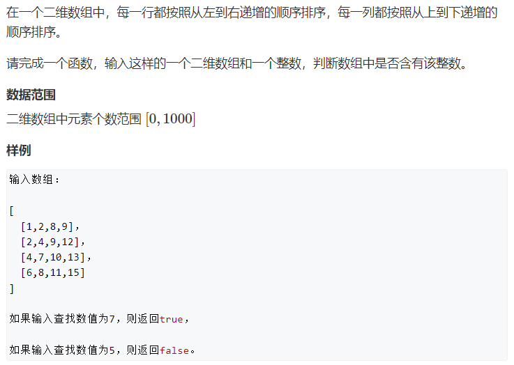

#### 题解

##### (单调性扫描) O(n+m)

 核心在于发现每个子矩阵右上角的数的性质：

- 如下图所示，x左边的数都小于等于x，x下边的数都大于等于x。

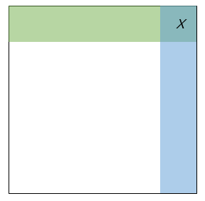

 因此我们可以从整个矩阵的右上角开始枚举，假设当前枚举的数是 x：

- 如果 x 等于target，则说明我们找到了目标值，返回true；
- 如果 x 小于target，则 x 左边的数一定都小于target，我们可以直接排除当前一整行的数；
- 如果 x 大于target，则 x 下边的数一定都大于target，我们可以直接排除当前一整列的数；

排除一整行就是让枚举的点的横坐标加一，排除一整列就是让纵坐标减一。
当我们排除完整个矩阵后仍没有找到目标值时，就说明目标值不存在，返回false。

**时间复杂度分析**

每一步会排除一行或者一列，矩阵一共有 n 行，m 列，所以最多会进行n+m 步。所以时间复杂度是 O(n+m)。

```cpp
class Solution {
public:
    bool findNumberIn2DArray(vector<vector<int>>& matrix, int target) {
        if (array.empty() || array[0].empty()) return false;
        int i = 0, j = array[0].size() - 1;  // j 初始为右上角的位置
        while (i < array.size() && j >= 0) {
            if (array[i][j] == target) return true;
            if (array[i][j] > target) --j;  // 锁定当前行，排除当前列
            else ++i;  // 排除当前行，往下搜索
        }
        return false;
    }
};
```


### 4.替换空格

#### 题目

> 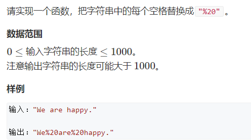

#### 题解

##### (线性扫描) O(n)

这个题在C++里比较好做，我们可以从前往后枚举原字符串：

- 如果遇到空格，则在string类型的答案中添加 `"%20"`；
- 如果遇到其他字符，则直接将它添加在答案中；

> 但在C语言中，我们没有string这种好用的模板，需要自己malloc出char数组来存储答案。
> 此时我们就需要分成三步来做：
>
> 1. 遍历一遍原字符串，计算出答案的最终长度；
> 2. malloc出该长度的char数组；
> 3. 再遍历一遍原字符串，计算出最终的答案数组；
>

**时间复杂度分析**

原字符串只会被遍历常数次，所以总时间复杂度是 O(n)。

```cpp
class Solution {
public:
    string replaceSpaces(string &str) {
        string res;
        for (auto x : str)
            if (x == ' ')
                res += "%20";
            else 
                res += x;
        return res;
    }
};
```

##### (双指针扫描) O(n)

在部分编程语言中，我们可以动态地将原数组长度扩大，此时我们就可以使用双指针算法，来降低空间的使用：

1. 首先遍历一遍原数组，求出最终答案的长度length；
2. 将原数组resize成length大小；
3. 使用两个指针，指针`i`指向原字符串的末尾，指针`j`指向length的位置；
4. 两个指针分别从后往前遍历，如果`str[i] == ' '`，则指针`j`的位置上依次填充`'0', '2', '%'`，这样倒着看就是`"%20"`；如果`str[i] != ' '`，则指针`j`的位置上填充该字符即可。

由于`i`之前的字符串，在变换之后，长度一定不小于原字符串，所以遍历过程中一定有`i <= j`，这样可以保证`str[j]`不会覆盖还未遍历过的`str[i]`，从而答案是正确的。

**时间复杂度分析**

原字符串只会被遍历常数次，所以总时间复杂度是 O(n)。

```cpp
class Solution {
public:
    string replaceSpaces(string &str) {
        int len = 0;
        for (auto c : str)
            if (c == ' ') len += 3;
            else len++;
                
        //str.size() 字符串中有几个字符，大小就为几    
        //定义两个指针，字符串的长度和实际下标位置差1
        int i = str.size() - 1, j = len - 1;  
        str.resize(len);  //调整字符串大小
        while (i >= 0) {
            if (str[i] == ' ') {
                str[j--] = '0';
                str[j--] = '2';
                str[j--] = '%';
            }
            else str[j--] = str[i];
            i--;
        }
        return str;
    }
};
```


### 5.从尾到头打印链表

#### 题目

> 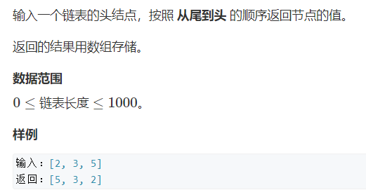

#### 题解

##### (遍历链表) O(n)

单链表只能从前往后遍历，不能从后往前遍历。

因此我们先从前往后遍历一遍输入的链表，将结果记录在答案数组中。
最后再将得到的数组逆序即可。

**语法补充：**

>**begin**
>语法：`iterator begin();`
>解释：begin()函数返回一个迭代器,指向字符串的第一个元素.
>
>**end**
>语法：`iterator end();`
>解释：end()函数返回一个迭代器，指向字符串的末尾(最后一个字符的**下一个位置**).
>
>**rbegin**
>语法：`const reverse_iterator rbegin();`
>解释：rbegin()返回一个逆向迭代器，指向字符串的最后一个字符。
>
>**rend**
>语法：`const reverse_iterator rend();`
>解释：rend()函数返回一个逆向迭代器，指向字符串的开头（第一个字符的**前一个位置**）。
>
>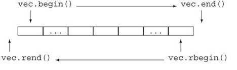

**时间复杂度分析**
链表和答案数组仅被遍历了常数次，所以总时间复杂度是 O(n)。

```cpp
/**
 * Definition for singly-linked list.
 * struct ListNode {
 *     int val;
 *     ListNode *next;
 *     ListNode(int x) : val(x), next(NULL) {}
 * };
 */
class Solution {
public:
    vector<int> printListReversingly(ListNode* head) {
        vector<int> res;
        while (head) {
            res.push_back(head->val);
            head = head->next;
        }
        return vector<int>(res.rbegin(), res.rend()); //反向迭代器
    }
};
```


### 6.重建二叉树

#### 题目

> 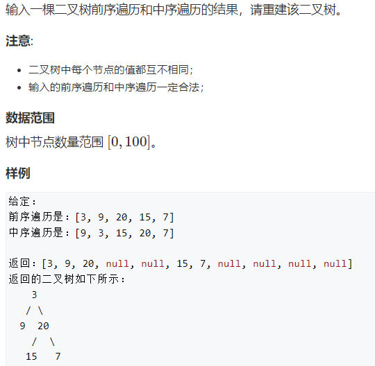

#### 题解

##### (递归) O(n)

递归建立整棵二叉树：先递归创建左右子树，然后创建根节点，并让指针指向两棵子树。

前序遍历（根 左 右）中序遍历（左 根 右） 后序遍历（左 右 根）

具体步骤如下：

1. 先利用前序遍历找根节点：前序遍历（根 左 右）的第一个数，就是根节点的值；
2. 在中序遍历中找到根节点的位置 k，**则 k 左边是左子树的中序遍历（左 根 右），右边是右子树的中序遍历；**
3. 假设左子树的中序遍历的长度是 l，则在前序遍历中，**根节点后面的 l 个数，是左子树的前序遍历，剩下的数是右子树的前序遍历；**
4. 有了左右子树的前序遍历和中序遍历，我们可以先递归创建出左右子树，然后再创建根节点；

**时间复杂度分析**

我们在初始化时，用哈希表(`unordered_map<int,int>`)记录每个值在中序遍历中的位置，这样我们在递归到每个节点时，在中序遍历中查找根节点位置的操作，只需要 O(1) 的时间。此时，创建每个节点需要的时间是 O(1)，所以总时间复杂度是 O(n)。

```cpp
/**
 * Definition for a binary tree node.
 * struct TreeNode {
 *     int val;
 *     TreeNode *left;
 *     TreeNode *right;
 *     TreeNode(int x) : val(x), left(NULL), right(NULL) {}
 * };
 */
//preorder前序遍历（根 左 右），inorder中序遍历（左 根 右）
class Solution {
public:
    unordered_map<int, int> pos; 
    
    TreeNode* buildTree(vector<int>& preorder, vector<int>& inorder) {
        int n = preorder.size();
        for (int i = 0; i < n; ++i)
            pos[inorder[i]] = i;  //用哈希表记录每个值在中序遍历中的位置 
        return dfs(preorder, inorder, 0, n - 1, 0, n - 1);    
    }
    //前序遍历pre的范围是[pl,pr], 中序遍历in的范围是[il,ir]
    TreeNode* dfs(vector<int>& pre, vector<int>& in, int pl, int pr, int il, int ir) {
        if (pl > pr) return NULL;
        int k = pos[pre[pl]] - il;  //寻找前序的根节点在中序遍历中是在第几个位置
        TreeNode* root = new TreeNode(pre[pl]); //生成新的根节点
        root->left = dfs(pre, in, pl + 1, pl + k, il, il + k - 1);
        root->right = dfs(pre, in, pl + k + 1, pr, il + k + 1, ir);
        return root;
    }
};
```


### 7.二叉树的下一个节点

#### 题目

> 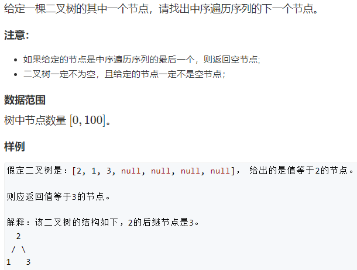

#### 题解

##### (模拟) O(h)

这道题目就是让我们求二叉树中给定节点的后继。

中序遍历（左  根  右）

分情况讨论即可，如下图所示：

1. （左  ==根==  右）**如果当前节点有右儿子，则右子树中最左侧的节点就是当前节点的后继**。比如F的后继是H；
2. （左  根）如果当前节点没有右儿子，**则需要沿着father域一直向上找，找到第一个是其(这个其非当前节点)father左儿子的节点，该节点的father就是当前节点的后继。**比如当前节点是D，则第一个满足是其father左儿子的节点是F，则C的father就是D的后继，即F是D的后继。

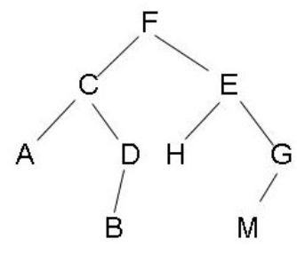

**时间复杂度分析**

不论往上找还是往下找，总共遍历的节点数都不大于树的高度。所以时间复杂度是 O(h)，其中 h 是树的高度。

```cpp
/**
 * Definition for a binary tree node.
 * struct TreeNode {
 *     int val;
 *     TreeNode *left;
 *     TreeNode *right;
 *     TreeNode *father;
 *     TreeNode(int x) : val(x), left(NULL), right(NULL), father(NULL) {}
 * };
 */
class Solution{
public:
	TreeNode* inorderSuccessor(TreeNode* p) {
        if (p->right) {
            p = p->right;  //易错带
            while (p->left) p = p->left;
            return p;
        }
        //p == p->father->right 用来判断p是否是右节点
        while (p->father && p == p->father->right) p = p->father;
        return p->father;
    }
};
```


### 8.用两个栈实现队列

#### 题目

> 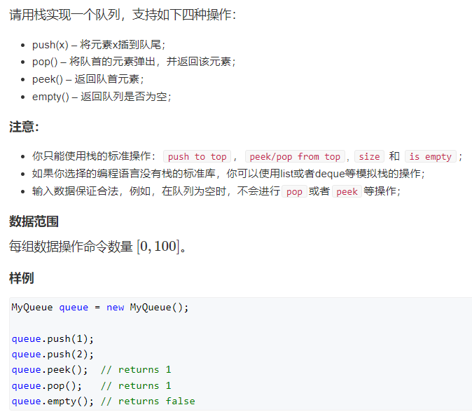

#### 题解

##### (栈，队列) O(n)

这是一道基础题，只要把功能实现对就可以，不需要考虑运行效率。

我们用两个栈来做，一个主栈，用来存储数据；一个辅助栈，用来当缓存。

栈：先进后出，队列：先进先出

- `push(x)`，我们直接将 x 插入主栈中即可。
- `pop()`，此时我们需要弹出最先进入栈的元素，也就是栈底元素。我们可以先将所有元素从主栈中弹出，压入辅助栈中。则辅助栈的栈顶元素就是我们要弹出的元素，将其弹出即可。然后再将辅助栈中的元素全部弹出，压入主栈中。
- `peek()`，可以用和`pop()`操作类似的方式，得到最先压入栈的元素。
- `empty()`，直接判断主栈是否为空即可。

**时间复杂度分析**

- `push()`：O(1)；
- `pop()`: 每次需要将主栈元素全部弹出，再压入，所以需要 O(n) 的时间；
- `peek()`：类似于`pop()`，需要 O(n) 的时间；
- `empty()`：O(1)；

```cpp
class MyQueue {
public:
    /** Initialize your data structure here. */
    stack<int> stk, cache;
    
    MyQueue() {  //初始化，如果栈不为空，则用while()清空
        while (!stk.empty()) {
            stk.pop();
        }
        while (!cache.empty()) {
            cache.pop();
        }
    }
    
    /** Push element x to the back of queue. */
    void push(int x) {
        stk.push(x);
    }
    
    void copy(stack<int>& a, stack<int>& b) {
        while (a.size()) {
            b.push(a.top());
            a.pop();
        }
    }
    
    /** Removes the element from in front of queue and returns that element. */
    int pop() {
        if (stk.empty()) return -1;  //如果栈为空，返回-1
        copy(stk, cache);
        int res = cache.top();
        cache.pop();
        copy(cache, stk);
        return res;
    }
    
    /** Get the front element. */
    int peek() {
        if (stk.empty()) return NULL;  //如果栈为空，返回NULL
        copy(stk, cache);
        int res = cache.top();
        copy(cache, stk);
        return res;
    }
    
    /** Returns whether the queue is empty. */
    bool empty() {
        return stk.empty();
    }
};

/**
 * Your MyQueue object will be instantiated and called as such:
 * MyQueue obj = MyQueue();
 * obj.push(x);
 * int param_2 = obj.pop();
 * int param_3 = obj.peek();
 * bool param_4 = obj.empty();
 */
```


### 9.斐波那契数列

#### 题目

>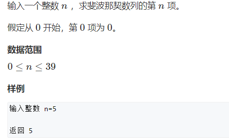

#### 题解

##### (递推 + 滚动变量) O(n)

这题的数据范围很小，我们直接模拟即可。
当数据范围很大时，就需要采用其他方式了，可以参考 [求解斐波那契数列的若干方法](https://www.acwing.com/blog/content/25/) 。

F(0) = 0,   F(1) = 1
F(N) = F(N - 1) + F(N - 2), 其中 N > 1.
斐波那契数列由 0 和 1 开始，之后的斐波那契数就是由之前的两数相加而得出。

用两个变量滚动式得往后计算，a 表示第 n−1 项，b 表示第 n 项。
则令 c=a+b 表示第 n+1 项，然后让 a, b 顺次往后移一位。

**时间复杂度分析**

总共需要计算 n 次，所以时间复杂度是 O(n) ，但空间复杂度变成了 O(1)。

```cpp
class Solution {
public:
    const int MOD = 1e9 + 7;    //1000000007
    int Fibonacci(int n) {
        int a = 0, b = 1;
        while (n--)  
        {
            int c = (a + b) % MOD;  //取模优先级比加减高，比乘数低
            a = b, b = c;   //逗号运算符，从左到右计算
        }
        return a;
    }
};  
//  	 0 1 1 2 3 5
//第几项  0 1 2 3 4 5 
```


### 剑指offer 10 - II 青蛙跳台阶问题

#### 题目

> 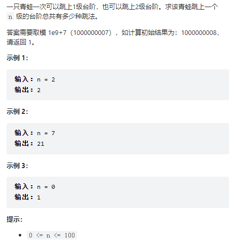

#### 题解

此类求 *多少种可能性* 的题目一般都有 **递推性质** ，即 `f(n) 和 f(n-1)…f(1)` 之间是有联系的。

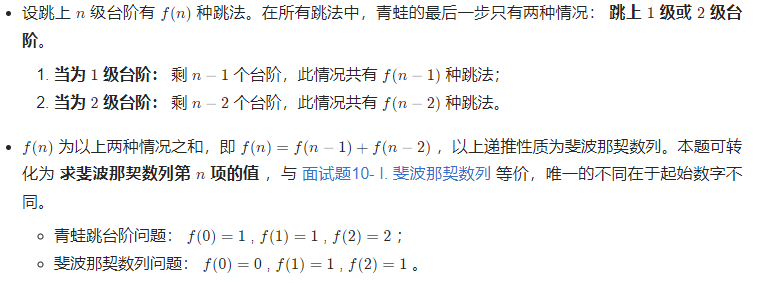

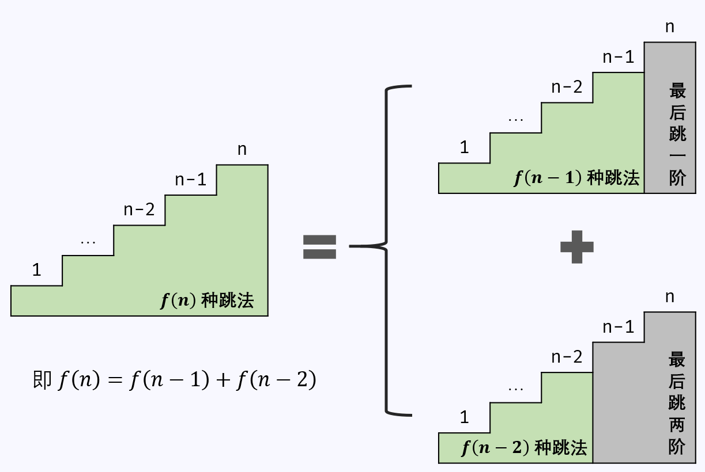

计算 f(n) 需循环 n 次，每轮循环内计算操作使用 O(1) ，所以时间复杂度是 O(n) 。

几个标志变量使用常数大小的额外空间，空间复杂度为 O(1)。

```cpp
class Solution {
public:
    const int MOD = 1e9 + 7;    //1000000007
    int numWays(int n) {
        int a = 1, b = 1;   //只有起始条件不同，其它都与上题相同
        while (n--)  
        {
            int c = (a + b) % MOD;  //取模优先级比加减高，比乘数低
            a = b, b = c;   //逗号运算符，从左到右计算
        }
        return a;
    }
};
```


### 10.旋转数组的最小数字

#### 题目

> 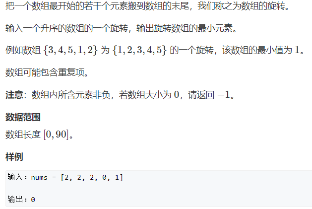

#### 题解

##### (二分) O(n)

为了便于分析，我们先将数组中的数画在二维坐标系中，横坐标表示数组下标，纵坐标表示数值，  图中水平的实线段表示相同元素。如下所示：

> 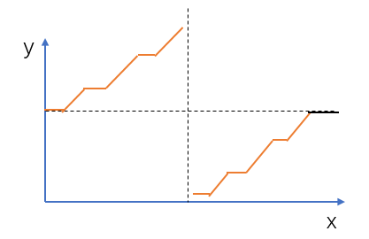

我们发现除了最后水平的一段（黑色水平那段）之外，其余部分满足二分性质：竖直虚线左边的数满足 nums[i]≥nums[0]；而竖直虚线右边的数不满足这个条件。

> 二分是二分性而不是单调性。只要满足可以找到一个值一半满足一半不满足即可，而不用满足单调性。

分界点就是整个数组的最小值，所以我们先将最后水平的一段删除即可。

另外，不要忘记处理数组完全单调的特殊情况：

当我们删除最后水平的一段之后，如果剩下的最后一个数大于等于第一个数，则说明数组完全单调。

**时间复杂度分析**

二分的时间复杂度是 O(logn)，删除最后水平一段的时间复杂度最坏是 O(n)，所以总时间复杂度是 O(n)。

```cpp
class Solution
{
public:
    int findMin(vector<int>& nums)
    {
        int n = nums.size() - 1;
        if(n < 0) return -1;
        
        while (n > 0 && nums[n] == nums[0]) n--; //删除最后水平的一段，当n=0时，只有一个数，也要退出循环
        if (nums[n] >= nums[0]) return nums[0]; //当没有元素旋转时，则出现这种情况
        
        int l = 0, r = n;
        while (l < r) {
            int mid = l + r >> 1;  //[l, mid], [mid + 1, r]
		  	if (nums[mid] < nums[0]) r = mid;
            else l = mid + 1;
        }
        return nums[r];
    }
};
```


### 11.矩阵中的路径

#### 题目

> 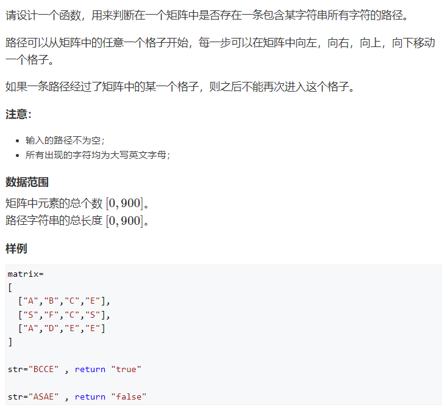

#### 题解

##### (DFS) O(n^2^3^k^)

在深度优先搜索中，最重要的就是考虑好搜索顺序。

我们先枚举单词的起点，然后依次枚举单词的每个字母。
过程中需要将已经使用过的字母改成一个特殊字母，以避免重复使用字符。

时间复杂度分析：单词起点一共有 n^2^ 个，单词的每个字母一共有上下左右四个方向可以选择，但由于不能走回头路，所以除了单词首字母外，仅有三种选择。所以总时间复杂度是 O(n^2^3^k^)。

```cpp
class Solution {
public:
    bool hasPath(vector<vector<char>>& matrix, string &str) {
        //int len1 = matrix.size(), len2 = matrix[0].size();
        for (int i = 0; i < matrix.size(); i++)  //列
            for (int j = 0; j < matrix[i].size(); j++)  //行
                if (dfs(matrix, str, 0, i, j))
                    return true;
        return false;
    }
    
    bool dfs(vector<vector<char>>& matrix, string& str, int u, int x, int y) {
        if (matrix[x][y] != str[u]) return false;  //当前字母不匹配
        if (u == str.size() - 1) return true;  //最后一个字母匹配成功
        int dx[4] = {-1, 0, 1, 0}, dy[4] = {0, 1, 0, -1}; //上，右，下，左
        char t = matrix[x][y];
        matrix[x][y] = '*';  //已使用，避免重复使用字符
        for (int i = 0; i < 4; i++) {
            int a = x + dx[i], b = y + dy[i];  //x列坐标，y行坐标
            if (a >= 0 && a < matrix.size() && b >= 0 && b < matrix[a].size()) {
                if (dfs(matrix, str, u + 1, a, b)) return true;
            }
        }
        matrix[x][y] = t;  //本次匹配失败，恢复现场，继续其他匹配
        return false;
    }
};
```


## week 2

### 12.机器人的运动范围

#### 题目

> 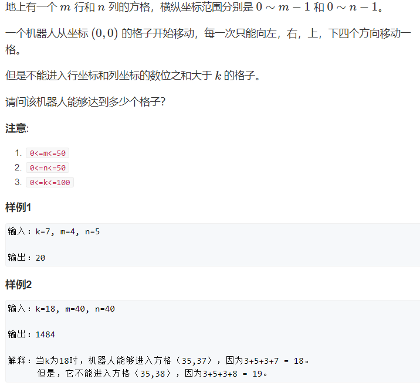

#### 题解

##### (BFS) O(nm)

这是一个典型的广度优先搜索问题，我们从 (0, 0) 点开始，每次朝上下左右四个方向扩展新的节点即可。

扩展时需要注意新的节点需要满足如下条件：

- 之前没有遍历过，这个可以用个`bool`数组来判断；
- 没有走出边界；
- 横纵坐标的各位数字之和小于 k；

最后答案就是所有遍历过的合法的节点个数。

**时间复杂度**

每个节点最多只会入队一次，所以时间复杂度不会超过方格中的节点个数。
最坏情况下会遍历方格中的所有点，所以时间复杂度就是 O(nm)。

```cpp
class Solution
{
public:
    //计算数位之和
    int get_sum(pair<int, int> p) {   
        int s = 0;
        while (p.first) {
            s += p.first % 10; //个位
            p.first /= 10;  //十位移到个位上
        }
        while (p.second) {
            s += p.second % 10;
            p.second /= 10;
        }
        return s;
    }
    
    //门槛、阈值threshold，行rows，列cols
    int movingCount(int threshold, int rows, int cols) { 
        if (!rows || !cols) return 0;  //为0，则方格不存在
        queue<pair<int, int>> q;  //bfs一般用队列来存储实现，此处创建的是由pair队组构成的队列
        vector<vector<bool>> st(rows, vector<bool>(cols, false)); //生成一个布尔类型的二维变长vector容器(数组)，并全部初始化为false
		
        int dx[4] = {-1, 0, 1, 0}, dy[4] = {0, 1, 0, -1};  //上，由，左，下
        int res = 0;
        q.push({0, 0}); //第一个点入队，从队尾插入
        
        while (q.size()) {
            auto t = q.front(); //选择队头的点进行判断
            q.pop();  //当前选择的点出队，队头弹出
            if (st[t.first][t.second] || get_sum(t) > threshold) continue; //如果这个点已经计算过了或者数位之和大于k则continue
			res++;  //进入到这一步的格子符合要求，结果+1
            st[t.first][t.second] = true;
            for (int i = 0; i < 4; i++) {
                int x = t.first + dx[i], y = t.second + dy[i];
                //这里可能出现重复入队的情况，但是后面if会筛掉已经判断过的点
                if (x >= 0 && x < rows && y >= 0 && y < cols) q.push({x, y});
            }           
        }
        return res;  
    }
};
```


### 13.剪绳子

#### 题目

> 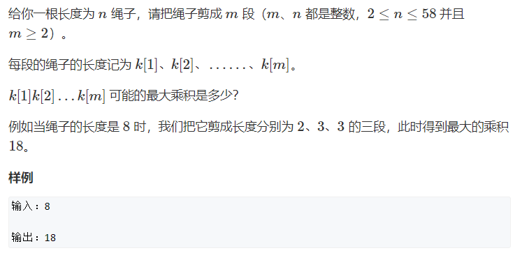

#### 题解

##### (数学) O(n)

这道题目是数学中一个很经典的问题。
下面我们给出证明：

首先把一个正整数 N 拆分成若干正整数只有有限种拆法，所以存在最大乘积。
假设 `N=n1+n2+…+nk`，并且 `n1×n2×…×nk` 是最大乘积。

1. 显然1不会出现在其中；
2. 如果对于某个 `i` 有 `ni≥5`，那么把 `ni`拆分成 `3+(ni−3)`，我们有 `3(ni−3)=3ni−9>ni`；
3. 如果 `ni=4`，拆成 `2+2`乘积不变，所以不妨假设没有`4`；
4. 如果有三个以上的`2`，那么 `3×3>2×2×2`，所以替换成`3`乘积更大；

综上，选用尽量多的`3`，直到剩下`2`或者`4`时，用`2`。

**时间复杂度分析**

当 n 比较大时，n 会被拆分成 `⌈n/3⌉` 个数，我们需要计算这么多次减法和乘法，所以时间复杂度是 O(n)。

```cpp
class Solution
{
public:
    int maxProductAfterCutting(int n)
    {
        if (n <= 3) return 1 * (n - 1);
        int res = 1;
        //排除这两种情况后，n一定为3的整数倍
        if (n % 3 == 1) res = 4, n -= 4; 
        else if (n % 3 == 2) res = 2, n -= 2;
        
        while (n) res *= 3, n -= 3;
        return res;
    }
};
```


### 剑指offer 14-II 剪绳子 II

#### 题目

> 

#### 题解

**大数求余方法**

此题与上题 剪绳子 主体等价，唯一不同在于本题目涉及 “大数越界情况下的求余问题” 。

**切分规则：**

1. **最优：** 3 。把绳子尽可能切为多个长度为 3 的片段，留下的最后一段绳子的长度可能为 0,1,2 三种情况。
2. **次优：** 2 。若最后一段绳子长度为 2 ；则保留，不再拆为 1+1 。
3. **最差：** 1 。若最后一段绳子长度为 1 ；则应把一份 3 + 1 替换为 2 + 2，因为 2 x 2 > 3 ×1。

##### 大数求余解法：

> **大数越界：** 当 a 增大时，最后返回的 3^a^ 大小以指数级别增长，可能超出 `int32` 甚至 `int64` 的取值范围，导致返回值错误。
> **大数求余问题：** 在仅使用 `int32` 类型存储的前提下，正确计算 x^a^ 对 p 求余的值。
> **解决方案：** *循环求余* 、 *快速幂求余* ，其中后者的时间复杂度更低。

##### 求 (x^a) % p —— 循环求余法

```cpp
public long remainder(int x, int a, int p){//x为底数，a为幂，p为要取的模
        long rem = 1 ;
        for (int i = 0; i < a; i++) {
            rem = (rem * x) % p ;   
        }
        return rem;
    }
```

```cpp
class Solution {
public:
    int cuttingRope(int n) {
        if (n <= 3) return 1 * (n - 1);
        int p = 1e9 + 7;   //1e9 + 7
        long res = 1;      //long

        if (n % 3 == 1) res = 4, n -= 4;
        else if (n % 3 == 2) res = 2, n -= 2;
        while (n) res = res * 3 % p, n -= 3;  //每次模p
        return res;
    }
};
```


### 14.二进制中1的个数

#### 题目

> 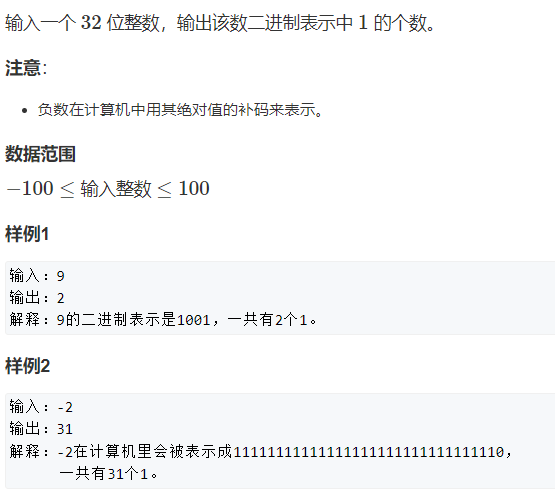

#### 题解

##### (位运算) O(logn)

迭代进行如下两步，直到 n 变成0为止：

1. 如果 n 在二进制表示下末尾是1，则在答案中加1；
2. 将 n 右移一位，也就是将 n 在二进制表示下的最后一位删掉；

这里有个难点是如何处理负数。
在C++中如果我们右移一个负整数，系统会自动在最高位补1，这样会导致 n 永远不为0，就死循环了。
解决办法是把 n 强制转化成无符号整型，这样 n的二进制表示不会发生改变，但在右移时系统会自动在最高位补0。

> 详细见 csapp，这里大概说一下大部分语言实现的类型转换，底层二进制是不变的，只是改变了二进制位的解释，无符号类型的右移是逻辑右移，即高位补 0

**时间复杂度**

每次会将 n 除以2，最多会除 logn 次，所以时间复杂度是 O(logn)。

```cpp
class Solution
{
public:
    int NumberOf1(int n)
    {
        int res = 0;
        unsigned int un = n;
        //逗号运算符，从左到右，先与，再+=，最后右移1位
        while (un) res += un & 1, un >>= 1;
        return res;
    }
};
```


### 15.数值的整数次方

#### 题目

> 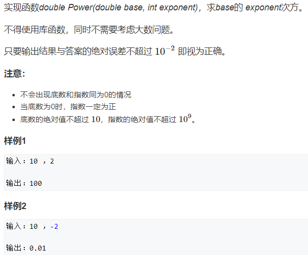

#### 题解

##### (模拟，快速幂)  O(n)

由于本题的指数是`int`范围，可能很大，所以需要用快速幂求解。

快速幂模板可以参考：[AcWing 875. 快速幂](https://www.acwing.com/problem/content/877/)。（反复平方法）

把次方数从十进制拆成二进制，可行，同样，将K次方拆成logk个数。

> ​	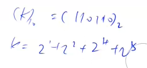

> 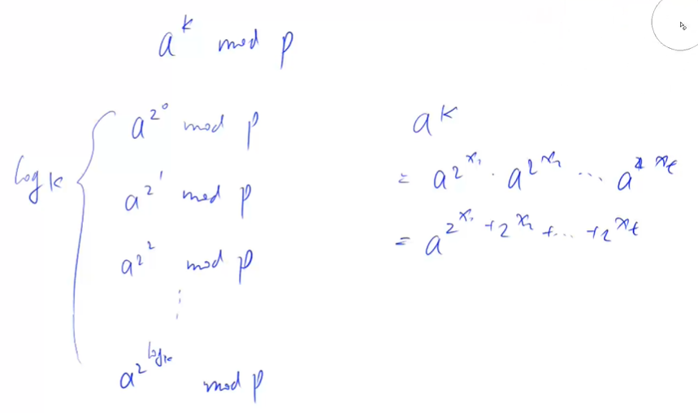

进行预处理

> 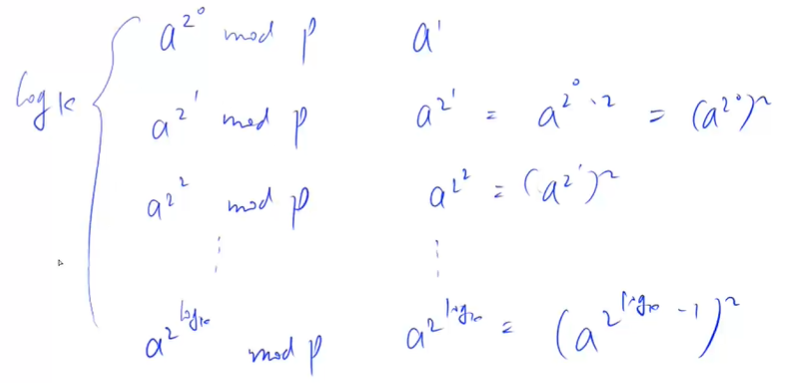

注意当指数是负数时，我们需要先取指数的绝对值，最后将乘积的倒数作为答案。

**时间复杂度**

假设指数是 n，则一共会循环 O(logn) 次，所以时间复杂度是 O(logn)。

```cpp
class Solution
{
public:
    double Power(double base, int exponent) { //底数，指数
        double x = base;
        int n = exponent;
        
        typedef long long LL;
        bool is_minus = n < 0;  //判断是否为负数
		double res = 1;
        for (LL k = abs(LL(n)); k; k >>= 1) { //取指数的绝对值
      		if (k & 1) res *= x;
            x *= x;
        }
        if (is_minus) res = 1 / res;
        return res;        
    }
};
```


### 剑指offer 17 打印从1到最大的n位数

#### 题目

> 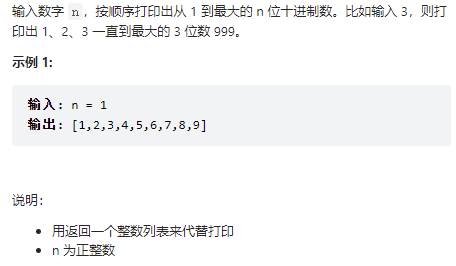

#### 题解

**普通解法**

```cpp
class Solution {
public:
    vector<int> printNumbers(int n) {
        vector<int> res;
        int max = 1;
        while(n--) max *= 10;
        for (int i = 1; i < max; i++)
            res.push_back(i);
        return res;
    }
};
```

**大数解法**

本题的主要考点是大数越界情况下的打印。

1. 表示大数的变量类型：

- 无论是 short / int / long ... 任意变量类型，数字的取值范围都是有限的。因此，大数的表示应用字符串 String 类型。

2. 生成数字的字符串集：

- 使用 int 类型时，每轮可通过 +1 生成下个数字，而此方法无法应用至 String 类型。并且， String 类型的数字的进位操作效率较低，例如 `"9999"` 至 `"10000"` 需要从个位到千位循环判断，进位 4 次。
- 观察可知，生成的列表实际上是 n 位 0 - 9 的 **全排列** ，因此可避开进位操作，通过递归生成数字的 String 列表。

3. 递归生成全排列：

- 基于分治算法的思想，先固定高位，向低位递归，当个位已被固定时，添加数字的字符串。例如当 n = 2 时（数字范围 1 - 99 ），固定十位为 0 - 9 ，按顺序依次开启递归，固定个位 0 - 9 ，终止递归并添加数字字符串。

> 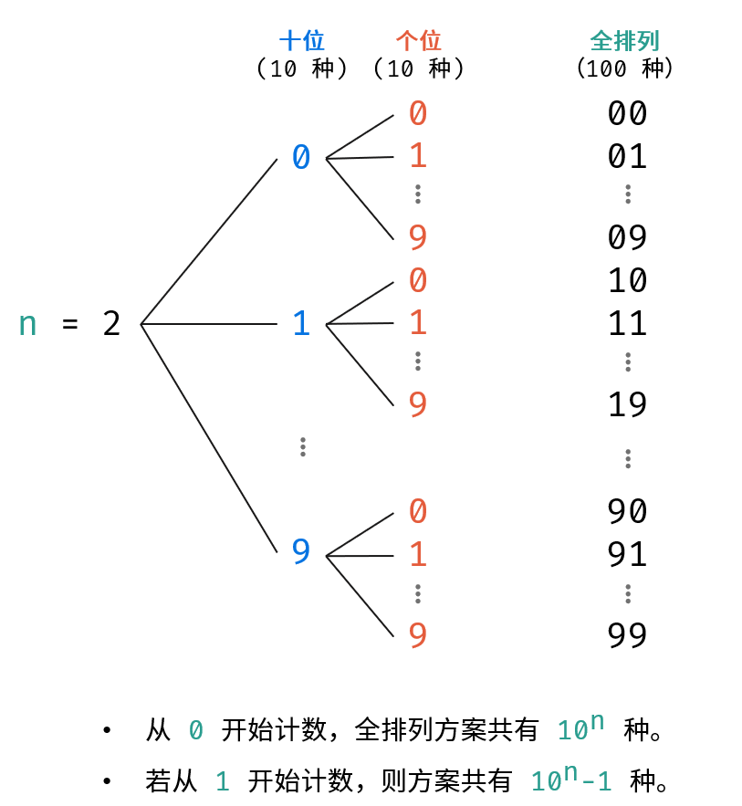

```cpp
class Solution {
public:
    vector<int> nums;
    string s;
    vector<int> printNumbers(int n) {
        s.resize(n, '0');
        dfs(n, 0);
        return nums;
    }
    
    // 枚举所有情况，生成的数字长度为len，正在确定第index位
    void dfs(int len, int index) {
        if (index == len) {
            save(); 
            return;
        }
        for (int i = 0; i <= 9; ++i) {
            s[index] = i + '0';
            dfs(len, index + 1);
        }
    }
    
    // 去除首部0
    void save() {
        int ptr = 0;
        while (ptr < s.size() && s[ptr] == '0') ptr++;  //从左到右筛查，不是0时停止
        if (ptr != s.size())  //表示s不都是0
            nums.emplace_back(stoi(s.substr(ptr)));
    }
};
```

**换种写法**

辅助函数 dfs(x, len) 的作用是：生成长度为len的数字，正在确定第 x 位。当 x=0 时表示左边第一位，不能为0，这样可以避免出现 0 开头的字符串。

```cpp
class Solution {
public:
    vector<string> res;
    string cur;
    char NUM[10] = {'0', '1', '2', '3', '4', '5', '6', '7', '8', '9'};
    
    // 生成长度为 len 的数字，正在确定第x位（从左往右）
    void dfs(int x, int len) {
        if(x == len) {
            res.push_back(cur);
            return;
        }               
        //如果x等于0，即正在确定最左边的数，start应该从1开始，否则start从0开始
        int start = x==0 ? 1 : 0; // X=0表示左边第一位数字，不能为0
        for (int i = start; i < 10; i++) {
            cur.push_back(NUM[i]); // 确定本位数字
            dfs(x + 1, len); // 确定下一位数字
            cur.pop_back(); // 删除本位数字，由于cur是全局变量，存储的是当前的数字字符串，在存储后要删除当前位，空出位置给下个数
        }
    }

    vector<string> printNumbers(int n) {
        for (int i = 1; i <= n; i++) // 数字长度：1~n
            dfs(0, i);
        return res;
    }
};
```


### 16.在O(1)时间删除链表结点

#### 题目

> 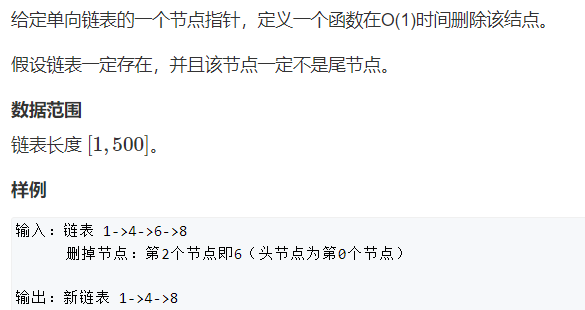

#### 题解

##### (链表) O(1)

由于是单链表，我们不能找到前驱节点，所以我们不能按常规方法将该节点删除。
我们可以换一种思路，==将下一个节点的值复制到当前节点，然后将下一个节点删除即可。==

**时间复杂度**

只有常数次操作，所以时间复杂度是 O(1)。

```cpp
/**
 * Definition for singly-linked list.
 * struct ListNode {
 *     int val;
 *     ListNode *next;
 *     ListNode(int x) : val(x), next(NULL) {}
 * };
 */
class Solution {
public:
    void deleteNode(ListNode* node) {
        //auto p = node->next;
        //node->val = p->val;
        //node->next = p->next;
        // 这两步的作用就是将 *(node->next) 赋值给 *node，所以可以合并成一条语句：
        *node = *(node->next);
        //delete p;
    }
};
```


### 剑指offer 18 删除链表的节点

#### 题目

> 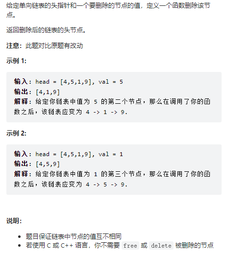

#### 题解

##### (双指针) O(n)

本题删除值为 `val` 的节点分需为两步：定位节点、修改引用。

1. **定位节点：** 遍历链表，直到 `head.val == val` 时跳出，即可定位目标节点。
2. **修改引用：** 设节点 `cur` 的前驱节点为 `pre` ，后继节点为 `cur.next` ；则执行 `pre.next = cur.next` ，即可实现删除 `cur` 节点。

> 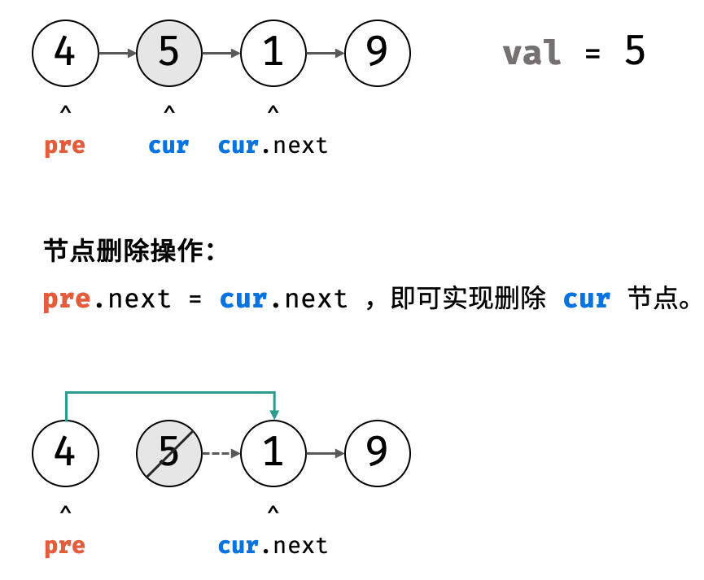

```cpp
class Solution {
public:
    ListNode* deleteNode(ListNode* head, int val) {
        if (head->val == val) return head->next;  //特例，为头节点时，直接返回下一个节点
        ListNode *pre = head, *cur = head->next;
        while (cur != nullptr && cur->val != val) {
            pre = cur;
            cur = cur->next;
        }
        //若 cur 指向某节点，则执行 pre.next = cur.next ；
        //若 cur 指向 null ，代表链表中不包含值为 val 的节点。
        if (cur != nullptr) pre->next = cur->next; 
        return head;        
    }
};
```

**其他解法**

在链表前面再加一个头指针，这样就不用再判断是否为第一个结点了。

```cpp
class Solution {
public:
    ListNode* deleteNode(ListNode* head, int val) {
        ListNode* temp = new ListNode(-1);
        temp->next = head;
        head = temp;
        while (temp->next != nullptr) {
            if (temp->next->val == val) {
                temp->next = temp->next->next;
                return head->next;
            }
            temp = temp->next;
        }
        return head->next;
    }
};
```


### 17.删除链表中重复的节点

#### 题目

> 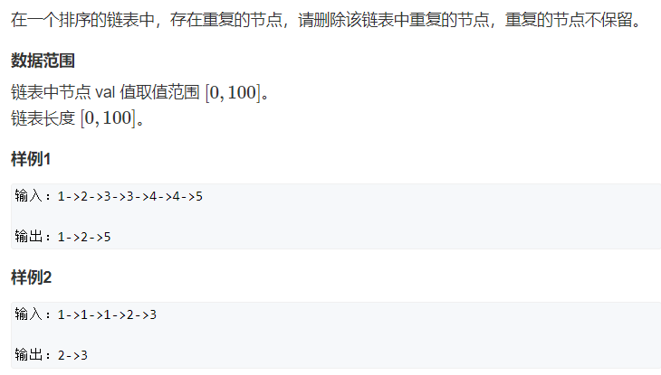

#### 题解

##### (线性扫描) O(n)

为了方便处理边界情况，我们定义一个虚拟元素 dummy 指向链表头节点。
然后从前往后扫描整个链表，每次扫描元素相同的一段，如果这段中的元素个数多于1个，则将整段元素直接删除。

**时间复杂度**

整个链表只扫描一遍，所以时间复杂度是 O(n)。

```cpp
/**
 * Definition for singly-linked list.
 * struct ListNode {
 *     int val;
 *     ListNode *next;
 *     ListNode(int x) : val(x), next(NULL) {}
 * };
 */
class Solution {
public:
    ListNode* deleteDuplication(ListNode* head) {
    	auto dummy = new ListNode(-1);
        dummy->next = head;
        
        auto p = dummy; //定义一个节点指针p，等于dummy
        while (p->next) {
            auto q = p->next; //定义一个节点指针q，等于head
            //p->next->val指向一个节点的val值，q->val用来判断后面是否与它重复 
            while (q && q->val == p->next->val) q = q->next; 
                       
            if (p->next->next == q) p = p->next; //如果没有重复，则直接指向下一个
            else p->next = q; //如果有重复，则跳转到q
        }
		return dummy->next;        
    }
};
```


### ==18.正则表达式匹配==

#### 题目

> 

#### 题解

##### (动态规划) O(nm)

注意：`*`不能单独用，它前面必须有字母。题意是只有第二个串有正则表达式。

状态表示：`f[i][j]`表示p从j开始到结尾，是否能匹配s从i开始到结尾。
状态转移：

1. 如果`p[j+1]`不是通配符`'*'`，则`f[i][j]`是真，当且仅当`s[i]`可以和`p[j]`匹配，且`f[i+1][j+1]`是真；

2. 如果`p[j+1]`是通配符`'*'`，则下面的情况只要有一种满足，`f[i][j]`就是真；
   - `f[i][j+2]`是真；
   - `s[i]`可以和`p[j]`匹配，且`f[i+1][j]`是真；

第1种情况下的状态转移很好理解，那第2种情况下的状态转移怎么理解呢？

> 最直观的转移方式是这样的：枚举通配符`'*'`可以匹配多少个`p[j]`，只要有一种情况可以匹配，则`f[i][j]`就是真；
> 这样做的话，我们发现，`f[i][j]`除了枚举0个`p[j]`之外，其余的枚举操作都包含在`f[i+1][j]`中了，所以我们只需判断`f[i+1][j]`是否为真，以及`s[i]`是否可以和`p[j]`匹配即可。

**时间复杂度分析**：n 表示s的长度，m 表示p的长度，总共 nm 个状态，状态转移复杂度O(1)，所以总时间复杂度是 O(nm).

```cpp
class Solution {
public:
    vector<vector<int>> f;
    int n, m;
    bool isMatch(string s, string p) {
        n = s.size();
        m = p.size();
        f = vector<vector<int>>(n + 1, vector<int>(m + 1, -1));
        return dp(0, 0, s, p);
    }

    bool dp(int x, int y, string &s, string &p)
    {
        if (f[x][y] != -1) return f[x][y];
        if (y == m)
            return f[x][y] = x == n;
        bool first_match = x < n && (s[x] == p[y] || p[y] == '.');
        bool ans;
        if (y + 1 < m && p[y + 1] == '*')
        {
            ans = dp(x, y + 2, s, p) || first_match && dp(x + 1, y, s, p);
        }
        else
            ans = first_match && dp(x + 1, y + 1, s, p);
        return f[x][y] = ans;
    }
};
```


### 19.表示数值的字符串

#### 题目

> 

#### 题解

##### (模拟，字符串处理) O(n)

**思路1：**

1. 先去除行首和行尾空格；
2. 行首如果有一个正负号，直接忽略；
3. 如果字符串为空或只有一个`'.'`，则不是一个合法数；
4. 循环整个字符串，去掉以下几种情况：
   (1) `'.'`或`'e'`多于1个;
   (2) `'.'`在`'e'`后面出现；
   (3) `'e'`后面或前面为空，或者`'e'`前面紧跟着`'.'`；
   (4) `'e'`后面紧跟着正负号，但正负号后面为空；
5. 剩下的情况都合法；

**时间复杂度分析：**整个字符串只遍历一遍，所以时间复杂度是 O(n)。

```cpp
class Solution
{
public:
    bool isNumber(string s)
    {
        int i = 0;
        while (i < s.size() && s[i] == ' ') i++;  //计算行首空格数
        int j = s.size() - 1;
        while (j >= 0 && s[j] == ' ') j--;  //计算除去行尾空格剩下字符个数
        s = s.substr(i, j - i + 1);  //将字符串前后空格筛掉
        
        if (s[0] == '-' || s[0] == '+') s = s.substr(1);  //忽略行首正负号
        if (s.empty() || s[0] == '.' && s.size() == 1) return false;
        
        int dot = 0, e = 0;
        for (int i = 0; i < s.size(); i++)
        {
            if (s[i] >= '0' && s[i] <= '9');
            else if (s[i] == '.')
            {
                dot++;
                if (e || dot > 1) return false;
            }
            else if (s[i] == 'e' || s[i] == 'E')
            {
                e++;
                if (i + 1 == s.size() || !i || e > 1 || i == 1 && s[0] == '.') return false;
                if (s[i + 1] == '+' || s[i + 1] == '-')
                {
                    if (i + 2 == s.size()) return false;
                    i++;
                }
            }
            else return false;
        }
        return true;   
    }
};
```

> **思路2：**
>
> **使用指针巧解表示数值的字符串**
> 核心思想为使用一个指针从前往后逐个检查字符串中的字符是否合法，如果合法，则指针后移，否则指针停止移动，显然如果字符串是合法的，这个指针应该移动到字符串的最末尾。
>
> 同时在移动指针的过程中判断从字符串开始到当前位置的字符子串是否是合法的数值，并将它存储在isNum中，显然isNum记录了指针所指位置的字符子串是否能表示为数值的信息。
>
> **指针的最终位置和isNum的值决定最终的结果**
>
> ```cpp
> class Solution {
> public:
>     bool isNumber(string s) {
>         
>         int i = 0;
>         while (i < s.size() && s[i] == ' ') i++;  //计算行首空格数
>         int j = s.size() - 1;
>         while (j >= 0 && s[j] == ' ') j--;  //计算除去行尾空格剩下字符个数
>         //if (i > j) return false;  //这一步不加也行，理应恒成立
>         s = s.substr(i, j - i + 1);  //将字符串前后空格筛掉
>         
>         s += '\0';   //指针移动过程中，最后会有一位的溢出，加上一位空字符防止字符串下标越界
>         bool isNum = false; //该变量表示从0开始，到i位置的字符串是否构成合法数字，初始化为false
> 
>         i = 0;  //检测指针初始化为0
>         if (s[i] == '+' || s[i] == '-') ++i; //一个‘-’或‘+’为合法输入，指针后移
>         while (s[i] >= '0' && s[i] <= '9')
>         {  //此处如果出现数字，为合法输入，指针后移，同时isNum置为true
>             isNum = true;  //显然,在此处，前面的所有字符是可以构成合法数字的
>             ++i;
>         }
>         if (s[i] == '.') ++i;    
>         //按照前面的顺序，在此处出现小数点也是合法的，指针后移（此处能否构成合法字符取决于isNum）
>         while (s[i] >= '0' && s[i] <= '9')
>         {  //小数点后出现数字也是合法的，指针后移
>             isNum = true;   //无论前面是什么，此处应当是合法数字
>             ++i;
>         }
>         //上面的部分已经把所有只包含小数点和正负号以及数字的情况包括进去了，如果只判断不含E或e的合法数字，到此处就可以停止了
>         if (isNum && (s[i] == 'e' || s[i] == 'E'))
>         { //当前面的数字组成一个合法数字时（isNum = true），此处出现e或E也是合法的
>             ++i;
>             isNum = false; //但到此处，E后面还没有数字，根据isNum的定义，此处的isNum应等于false;
>             if (s[i] == '-' || s[i] == '+') ++i; //E或e后面可以出现一个‘-’或‘+’，指针后移
>             while (s[i] >= '0' & s[i] <= '9') 
>             {
>                 ++i;
>                 isNum = true; //E后面接上数字后也就成了合法数字
>             }
>         }
>         //如果字符串为合法数字，指针应当移到最后，即是s[i] == '\0' 同时根据isNum判断数字是否合法
>         //整个过程中只有当i位置处的输入合法时，指针才会移动
>         return (s[i] == '\0' && isNum);
>     }
> };
> ```
>


### 20.调整数组顺序使奇数位于偶数前面

#### 题目

> 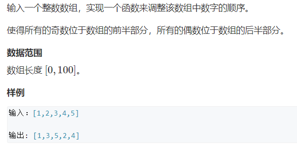

#### 题解

##### (双指针扫描) O(n)

用两个指针分别从首尾开始，往中间扫描。扫描时保证第一个指针前面的数都是奇数，第二个指针后面的数都是偶数。

每次迭代时需要进行的操作：

1. 第一个指针一直往后走，直到遇到第一个偶数为止；
2. 第二个指针一直往前走，直到遇到第一个奇数为止；
3. 交换两个指针指向的位置上的数，再进入下一层迭代，直到两个指针相遇为止；

**时间复杂度**

当两个指针相遇时，走过的总路程长度是 n，所以时间复杂度是 O(n)。

```cpp
class Solution
{
public:
    void reOrderArray(vector<int>& array)
    {
        int l = 0, r = array.size() - 1;
        while (l < r)
        {	//判断奇数  array[i] & 1 == 1
            while (l < r && array[l] % 2 == 1) l++; //奇数时一直往后扫描
            while (l < r && array[r] % 2 == 0) r--; //偶数时一直往前扫描
            if (l < r) swap(array[l], array[r]);
        }
    }
};
```


### 21.链表中倒数第k个节点

#### 题目

> 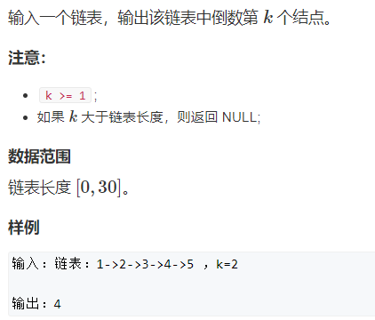
>
> 规定：链表的尾结点是倒数第1个结点。

#### 题解

##### (链表) O(n)

由于单链表不能索引到前驱节点，所以只能从前往后遍历。

我们一共遍历两次：

1. 第一次遍历得到链表总长度 n；
2. 链表的倒数第 k个节点，相当于正数第 n−k+1 个节点。所以第二次遍历到第 n−k+1个节点，就是我们要找的答案。

注意当 k>n 时要返回`nullptr`。

**时间复杂度**

链表总共遍历两次，所以时间复杂度是 O(n)。

```cpp
/**
 * Definition for singly-linked list.
 * struct ListNode {
 *     int val;
 *     ListNode *next;
 *     ListNode(int x) : val(x), next(NULL) {}
 * };
 */
class Solution {
public:
    ListNode* findKthToTail(ListNode* head, int k) {
        int n = 0;
        for (auto p = head; p; p = p->next) n++;
        if (n < k) return nullptr;
        auto p = head;
        for (int i = 0; i < n - k; i++) p = p->next;
        return p;
    }
};
```


### 22.链表中环的入口结点

#### 题目

> 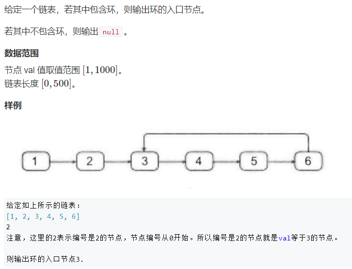

#### 题解

##### (链表，快慢指针扫描) O(n)

> 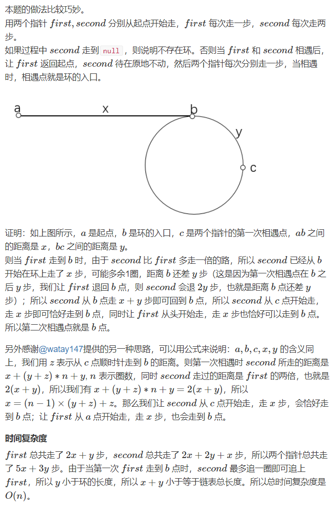

```cpp
/**
 * Definition for singly-linked list.
 * struct ListNode {
 *     int val;
 *     ListNode *next;
 *     ListNode(int x) : val(x), next(NULL) {}
 * };
 */
class Solution {
public:
    ListNode *entryNodeOfLoop(ListNode *head) 
    {
        if (!head || !head->next) return 0;
        ListNode *first = head, *second = head;
        
        while (first && second)
        {
            first = first->next;
            second = second->next;
            if (second) second = second->next;
            else return 0;
            
            if (first == second)
            {
                first = head;
                while (first != second)
                {
                    first = first->next;
                    second = second->next;
                }
                return first;
            }
        }
        return 0;
    }
};
```


## week 3

### 23.反转链表

#### 题目

> 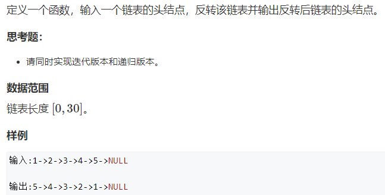

#### 题解

**算法1**

##### (链表操作，迭代) O(n)

翻转即将所有节点的next指针指向前驱节点。
由于是单链表，我们在迭代时不能直接找到前驱节点，所以我们需要一个额外的指针保存前驱节点。同时在改变当前节点的next指针前，不要忘记保存它的后继节点。

**空间复杂度分析：**遍历时只有3个额外变量，所以额外的空间复杂度是 O(1)。
**时间复杂度分析：**只遍历一次链表，时间复杂度是 O(n)。

```cpp
/**
 * Definition for singly-linked list.
 * struct ListNode {
 *     int val;
 *     ListNode *next;
 *     ListNode(int x) : val(x), next(NULL) {}
 * };
 */
class Solution {
public:
    ListNode* reverseList(ListNode* head)
    {
        ListNode* prev = nullptr;
        ListNode* cur = head;
        while (cur)
        {
            ListNode* next = cur->next;
            cur->next = prev;
            prev = cur, cur = next;
        }
        return prev;
    }
};
```

**算法2**

##### (链表操作，递归) O(n)

首先我们先考虑 `reverseList` 函数能做什么，它可以翻转一个链表，并返回新链表的头节点，也就是原链表的尾节点。
所以我们可以先递归处理 `reverseList(head->next)`，这样我们可以将以`head->next`为头节点的链表翻转，并得到原链表的尾节点`tail`，此时`head->next`是新链表的尾节点，我们令它的next指针指向`head`，并将`head->next`指向空即可将整个链表翻转，且新链表的头节点是`tail`。

**空间复杂度分析：**总共递归 n 层，系统栈的空间复杂度是 O(n)，所以总共需要额外 O(n) 的空间。
**时间复杂度分析：**链表中每个节点只被遍历一次，所以时间复杂度是 O(n)。

```cpp
/**
 * Definition for singly-linked list.
 * struct ListNode {
 *     int val;
 *     ListNode *next;
 *     ListNode(int x) : val(x), next(NULL) {}
 * };
 */
class Solution 
{
public:
    ListNode* reverseList(ListNode* head) 
    {
        if (!head || !head->next) return head;
        ListNode* tail = reverseList(head->next);  
        //1->2->3->4->5->NULL,当head=4时，5->next=NULL开始执行第一句return head，5作为第一个尾结点，依次翻转
        head->next->next = head; //5->next = 4;
        head->next = nullptr;  //4->next = NULL;
        return tail;
    }
};
```


### 24.合并两个排序的链表

#### 题目

> 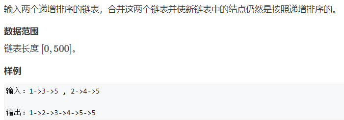

#### 题解

##### (二路归并) O(n)

1. 新建头部的保护结点dummy，设置cur指针指向dummy。
2. 若当前`l1`指针指向的结点的值`val`比`l2`指针指向的结点的值`val`小，则令`cur`的`next`指针指向`l1`，且`l1`后移；否则指向`l2`，且`l2`后移。
3. 然后`cur`指针按照上一步设置好的位置后移。
4. 循环以上步骤直到`l1`或`l2`为空。
5. 将剩余的`l1`或`l2`接到`cur`指针后边。

**时间复杂度**

两个链表各遍历一次，所以时间复杂度为O(n)

```cpp
/**
 * Definition for singly-linked list.
 * struct ListNode {
 *     int val;
 *     ListNode *next;
 *     ListNode(int x) : val(x), next(NULL) {}
 * };
 */
class Solution {
public:
	ListNode* merge(ListNode* l1, ListNode* l2)
    {
        ListNode* dummy = new ListNode(0);  //新建一个头结点
        ListNode* cur = dummy;
        while (l1 != NULL && l2 != NULL)
        {
            if (l1->val < l2->val)
            {
                cur->next = l1;
                l1 = l1->next;
            }
            else 
            {
                cur->next = l2;
                l2 = l2->next;
            }
            cur = cur->next;
        }
        cur->next = (l1 != NULL ? l1 : l2);  //将剩余的l1或l2接到curl指针后面
        return dummy->next;   
    }
};
```


### 25.树的子结构

#### 题目

> 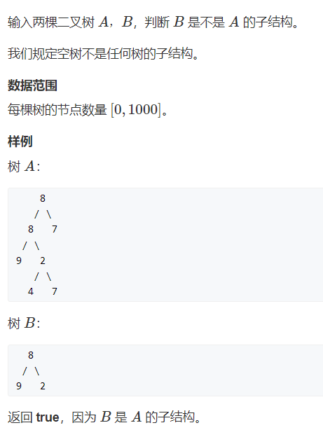

#### 题解

##### (二叉树，递归) O(nm)

代码分为两个部分：

1. 遍历树A中的所有非空节点R；
2. 判断树A中以R为根节点的子树是不是包含和树B一样的结构，且我们从根节点开始匹配；

对于第一部分，我们直接递归遍历树A即可，遇到非空节点后，就进行第二部分的判断。

对于第二部分，我们同时从根节点开始遍历 **左右** 两棵子树：

- 如果树B中的节点为空，则表示当前分支是匹配的，返回true；
- 如果树A中的节点为空，但树B中的节点不为空，则说明不匹配，返回false；
- 如果两个节点都不为空，但数值不同，则说明不匹配，返回false；
- 否则说明当前这个点是匹配的，然后**递归判断左子树和右子树是否分别匹配即可**；

**时间复杂度**

最坏情况下，我们对于树A中的每个节点都要递归判断一遍，每次判断在最坏情况下需要遍历完树B中的所有节点。
所以时间复杂度是 O(nm)，其中 n 是树A中的节点数， m 是树B中的节点数。

```cpp
/**
 * Definition for a binary tree node.
 * struct TreeNode {
 *     int val;
 *     TreeNode *left;
 *     TreeNode *right;
 *     TreeNode(int x) : val(x), left(NULL), right(NULL) {}
 * };
 */
class Solution
{
public:
    bool hasSubtree(TreeNode* pRoot1, TreeNode* pRoot2)
    {
        if (!pRoot1 || !pRoot2) return false;
        if (isSame(pRoot1, pRoot2)) return true;
        return hasSubtree(pRoot1->left, pRoot2) || hasSubtree(pRoot1->right, pRoot2); 
    }
    
    bool isSame(TreeNode* pRoot1, TreeNode* pRoot2)
    {
        if (!pRoot2) return true;
        if (!pRoot1 || pRoot1->val != pRoot2->val) return false;
        return isSame(pRoot1->left, pRoot2->left) && isSame(pRoot1->right, pRoot2->right);
    }
};
```


### 26.二叉树的镜像

#### 题目

> 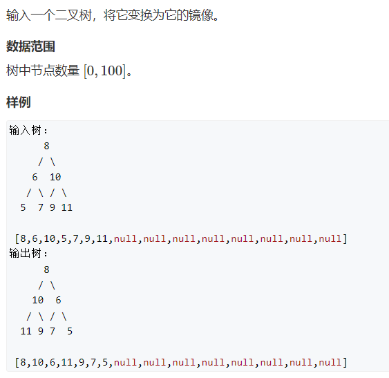

#### 题解

##### (二叉树，递归) O(n)

仔细观察原树和镜像之后的树：

```
原树：
      8
     / \
    6  10
   / \ / \
  5  7 9 11

镜像后的树：
      8
     / \
    10  6
   / \ / \
  11 9 7  5
```

我们可以发现镜像后的树就是**将原树的所有节点的左右儿子互换**！

所以我们**递归遍历原树的所有节点，将每个节点的左右儿子互换即可。**

**时间复杂度**

原树仅被遍历一次，所以时间复杂度是O(n)。

```cpp
/**
 * Definition for a binary tree node.
 * struct TreeNode {
 *     int val;
 *     TreeNode *left;
 *     TreeNode *right;
 *     TreeNode(int x) : val(x), left(NULL), right(NULL) {}
 * };
 */
class Solution {
public:
    void mirror(TreeNode* root) {
        if (!root) return;
        swap(root->left, root->right);
        mirror(root->left);
        mirror(root->right);
    }
};
```


### 27.对称的二叉树

#### 题目

> 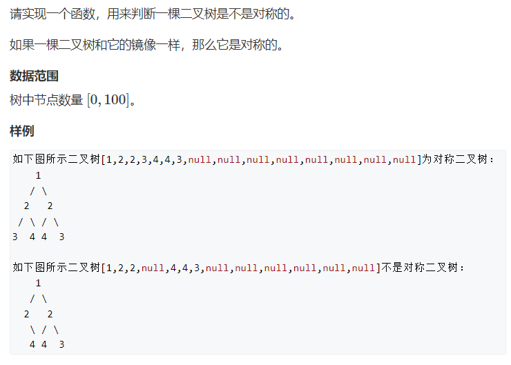

#### 题解

**算法1**

##### (二叉树，递归) O(n)

递归判断两个子树是否互为镜像。

两个子树互为镜像当且仅当：

1. 两个子树的根节点值相等；
2. 第一棵子树的左子树和第二棵子树的右子树互为镜像，且第一棵子树的右子树和第二棵子树的左子树互为镜像；

**时间复杂度**

从上到下每个节点仅被遍历一遍，所以时间复杂度是 O(n)。

```cpp
/**
 * Definition for a binary tree node.
 * struct TreeNode {
 * 		int val;
 * 		TreeNode* left;
 *		TreeNOde* right;
 *		TreeNode(int x) : val(x), left(NULL), right(NULL){}
 * };
 */
class Solution
{
public:
    bool isSymmetric(TreeNode* root)
    {
        return !root || dfs(root->left, root->right);
    }
    
    bool dfs(TreeNode* p, TreeNode* q)
    {
        if (!p || !q) return !p && !q; //判断左右子树的空节点是否对称
        return p->val == q->val && dfs(p->left, q->right) && dfs(p->right, q->left);
    }
};
```

**算法2**

##### (迭代) O(n)

用栈模拟递归，对根节点的左子树，我们用中序遍历(左根右)；对根节点的右子树，我们用反中序遍历(右根左)。
则两个子树互为镜像，当且仅当同时遍历两课子树时，对应节点的值相等。

**时间复杂度**

树中每个节点仅被遍历一遍，所以时间复杂度是 O(n)。

```cpp
/**
 * Definition for a binary tree node.
 * struct TreeNode {
 * 		int val;
 * 		TreeNode* left;
 *		TreeNOde* right;
 *		TreeNode(int x) : val(x), left(NULL), right(NULL){}
 * };
 */
class Solution
{
public:
    bool isSymmetric(TreeNode* root)
    {
        if (!root) return true; //如果树为空，为镜像树
        stack<TreeNode*> left, right;
        TreeNode* lc = root->left;
        TreeNode* rc = root->right;
        
        while (lc || rc || left.size())
        {
            while (lc && rc)  //用栈（先进后出）模拟递归，将所有的左/右子树入栈
            {
                left.push(lc), right.push(rc);
                lc = lc->left, rc = rc->right;
            }
            if (lc || rc) return false;  //如果一边还有多余的节点，则可以判断不对称
            lc = left.top(), rc = right.top();  //开始出栈，判断节点是否相同
            left.pop(), right.pop();
            
            if (lc->val != rc->val) return false;//全程对称操作，依次判断相对应节点值是否相等
            lc = lc->right, rc = rc->left;   //中序遍历(左根右)，反中序遍历(右根左)
        }
        return true;
    }
};
```


### 28.顺时针打印矩阵

#### 题目

> 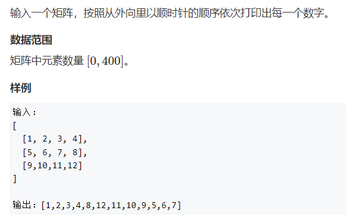

#### 题解

##### (模拟) O(n^2^)

我们顺时针定义四个方向：上右下左。
从左上角开始遍历，先往右走，走到不能走为止，然后更改到下个方向，再走到不能走为止，依次类推，遍历 n^2^ 个格子后停止。

**时间复杂度**

矩阵中每个格子遍历一次，所以总时间复杂度是 O(n^2^)。

```cpp
class Solution {
public:
    vector<int> printMatrix(vector<vector<int>>& matrix) {
        vector<int> res;
        if (matrix.empty()) return res;
        int n = matrix.size(), m = matrix[0].size();  //n为行数，m为列数
        vector<vector<bool>> st(n, vector<bool>(m, false)); //布尔类型的二维数组，并全部初始化为false
        
        int dx[4] = {-1, 0, 1, 0}, dy[4] = {0, 1, 0, -1};  //上右下左
        int x = 0, y = 0, d = 1;  //x表示行，y表示列，x与y记录当前坐标
       
        for (int k = 0; k < n * m; k++)
        {
            res.push_back(matrix[x][y]);
            st[x][y] = true;  //标记已遍历
            
            int a = x + dx[d], b = y + dy[d];
            //遇到边界或已遍历过的数就改变方向
            if (a < 0 || a >= n || b < 0 || b >= m || st[a][b]) 
            {
                d = (d + 1) % 4;
                a = x + dx[d], b = y + dy[d];  //在原来x，y的基础上向新方向移动
            }
            x = a, y = b;  //x与y记录当前坐标
        }
        return res;
    }
};
```


### 29.包含min函数的栈

#### 题目

> 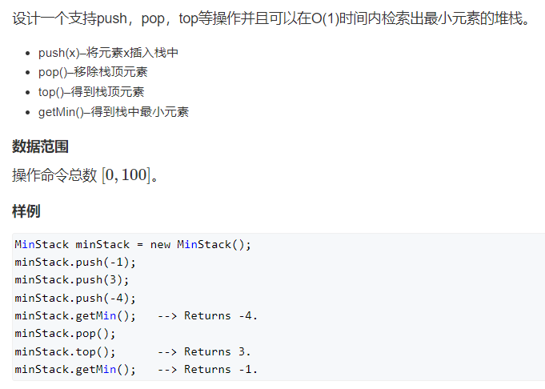

#### 题解

##### (单调栈) O(1)

我们除了维护基本的栈结构之外，还需要维护一个单调栈，来实现返回最小值的操作。
下面介绍如何维护单调栈：

- 当我们向栈中压入一个数时，如果该数 ≤ 单调栈的栈顶元素，则将该数同时压入单调栈中；否则，不压入，这是由于栈具有先进后出性质，所以在该数被弹出之前，栈中一直存在一个数比该数小，所以该数一定不会被当做最小数输出。
- 当我们从栈中弹出一个数时，如果该数等于单调栈的栈顶元素，则同时将单调栈的栈顶元素弹出。
- 单调栈由于其具有单调性，所以它的栈顶元素，就是当前栈中的最小数。

**时间复杂度**

四种操作都只有常数次入栈出栈操作，所以时间复杂度都是 O(1).

```cpp
class MinStack {
public:
    /** initialize your data structure here. */
    stack<int> stackValue;
    stack<int> stackMin;
       
    void push(int x) 
    {
        stackValue.push(x);
        if (stackMin.empty() || stackMin.top() >= x)
            stackMin.push(x);
    }
    
    void pop() 
    {
        if (stackMin.top() == stackValue.top()) stackMin.pop();
        stackValue.pop();        
    }
    
    int top() 
    {
        return stackValue.top();
    }
    
    int getMin() 
    {
        return stackMin.top();
    }
};

/**
 * Your MinStack object will be instantiated and called as such:
 * MinStack obj = new MinStack();
 * obj.push(x);
 * obj.pop();
 * int param_3 = obj.top();
 * int param_4 = obj.getMin();
 */
```


### 30.栈的压入、弹出序列

#### 题目

> 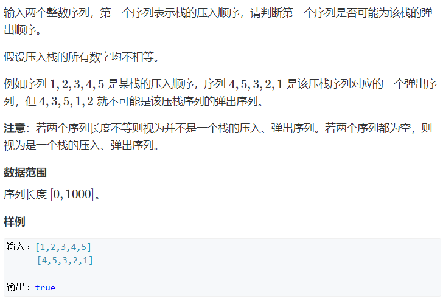

#### 题解

##### (栈) O(n)

用一个新栈s来模拟实时**进出栈**操作：

在for循环中依次喂数，每push一个数字就检查有没有能pop出来的。

如果最后s为空（或者popId==popV.size())，说明一进一出刚刚好。

**时间复杂度分析：**一共push n次，pop n次，时间复杂度为O(n)。

```cpp
class Solution
{
public:
    bool isPopOrder(vector<int>& pushV, vector<int>& popV)
    {
        if (pushV.empty() && popV.empty()) return true;
        if (pushV.empty() || popV.empty() || pushV.size() != popV.size()) 
            return false;
        
        stack<int> s;  
        int popId = 0;
        for (int pushId = 0; pushId < pushV.size(); pushId++) //空栈开始依次放入数
        {
            s.push(pushV[pushId]); 
            while (!s.empty() && s.top() == popV[popId]) //检查有没有能pop出来的
            {
                s.pop();
                popId++;
            }
        }
        if (s.empty()) return true; //刚好一进一出
        else return false;
    }
};
```


### 31.不分行从上往下打印二叉树

#### 题目

> 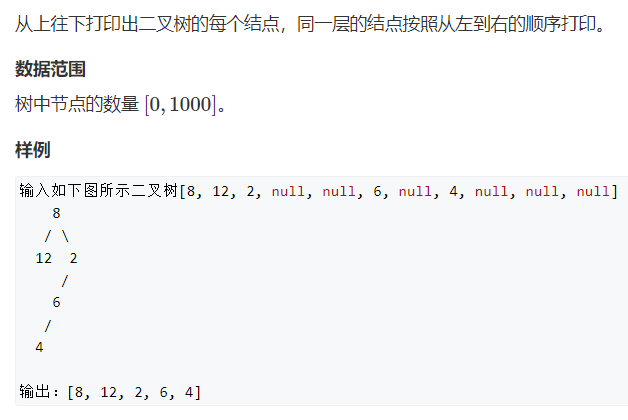

#### 题解

##### (BFS) O(n)

我们从根节点开始按宽度优先的顺序遍历整棵树（广度优先遍历 BFS），每次先扩展左儿子，再扩展右儿子。

这样我们会：

1. 先扩展根节点；
2. 再依次扩展根节点的左右儿子，也就是从左到右扩展第二层节点；
3. 再依次从左到右扩展第三层节点；
4. 依次类推

所以BFS的顺序就是这道题目要求的顺序。

**时间复杂度**

BFS时每个节点仅被遍历一次，所以时间复杂度是 O(n)。

```cpp
/**
 * Definition for a binary tree node.
 * struct TreeNode {
 *     int val;
 *     TreeNode *left;
 *     TreeNode *right;
 *     TreeNode(int x) : val(x), left(NULL), right(NULL) {}
 * };
 */
class Solution {
public:
    vector<int> printFromTopToBottom(TreeNode* root) {
		vector<int> res;
        if (!root) return res;
        queue<TreeNode*> q;  //结构体指针类型的队列
        q.push(root);
        
        while (q.size())
        {
            auto t = q.front();   
            q.pop();
            res.push_back(t->val);  
            if (t->left) q.push(t->left);   //用队列实现 bfs
            if (t->right) q.push(t->right);
        }
        return res;
    }    
};
```


### 32.分行从上往下打印二叉树

#### 题目

> 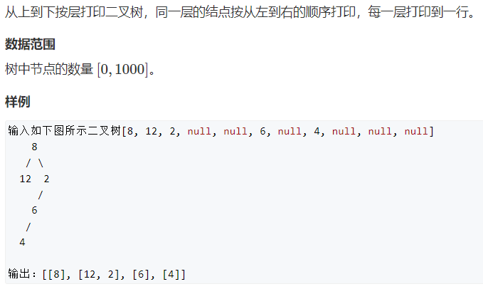

#### 题解

##### (BFS) O(n)

区别在于，每一层结束的时候，往queue里塞一个NULL做标记。

在queue里读取一个数出来之后，先看看是不是level标识符NULL(**因为是BFS，当前level读完，下一个level有哪些要读的也都放在queue里了，可以在queue结尾给加一个新的NULL**), 是的话再看看是不是整个树读完了(即queue里没有点了)。

时间复杂度分析：每个点遍历一次, 时间复杂度是 O(n)。

```cpp
class Solution {
public:
    vector<vector<int>> printFromTopToBottom(TreeNode* root) {
        vector<vector<int>> res;
        if (!root) return res;
        queue<TreeNode*> q;    //用队列实现 bfs
        q.push(root);
        q.push(NULL); 	 //root层的标识符
        
        vector<int> cur; //同一层节点暂存容器
        while (q.size())
        {
            TreeNode* t = q.front();
            q.pop();
            if (t)  //t不是NULL则执行
            {
                cur.push_back(t->val);
                if (t->left) q.push(t->left);
                if (t->right) q.push(t->right);
            }
            else  //t是NULL,代表当前层结束
            {
                if (q.size()) q.push(NULL);  //关键，在每层结束时加入NULL
                res.push_back(cur);
                cur.clear();
            }
        }
        return res;
    }
};
```


### 33.之字形打印二叉树

#### 题目

>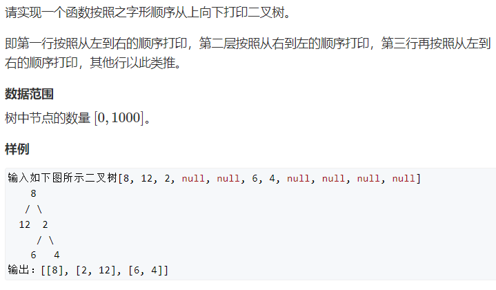

#### 题解

##### (BFS) O(n)

定义一个变量记录行数，当偶数行时直接反转数组。

```cpp
/**
 * Definition for a binary tree node.
 * struct TreeNode {
 *     int val;
 *     TreeNode *left;
 *     TreeNode *right;
 *     TreeNode(int x) : val(x), left(NULL), right(NULL) {}
 * };
 */
class Solution {
public:
    vector<vector<int>> printFromTopToBottom(TreeNode* root) 
    {
        vector<vector<int>> res;
        if (!root) return res;
        queue<TreeNode*> q;   //用队列实现 bfs
        q.push(root); 
        int i = 1;  //记录当前行数
        
        vector<int> cur; //同一层节点暂存容器
        while (q.size())
        {
            int len = q.size();
            for (int j = 0; j < len; j++) //队列长度，为该层的节点个数
            {
                auto t = q.front();
                q.pop();
                cur.push_back(t->val);
                if (t->left) q.push(t->left);
                if (t->right) q.push(t->right);
            }
            if (i % 2 == 0) reverse(cur.begin(), cur.end());  //偶数行直接数组倒排
            res.push_back(cur); 
            cur.clear();  //清空
            i++;
        }
        return res;        
    }
};
```


## week 4

### 34.二叉搜索树的后序遍历序列

#### 题目

> 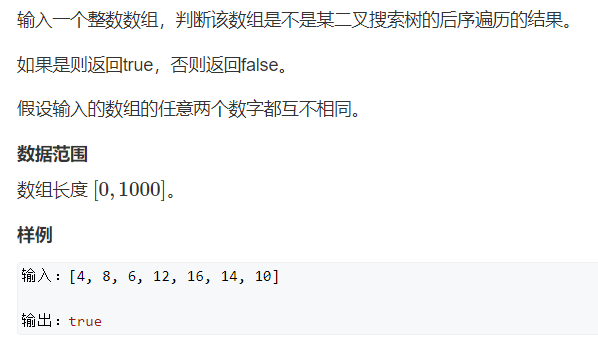

#### 题解

二叉搜索树：

==左子树中所有节点的值 < 根节点的值；右子树中所有节点的值 > 根节点的值；==其左、右子树也分别为二叉搜索树。

> 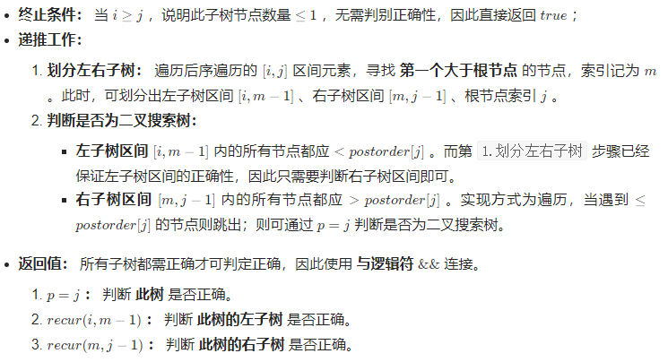

> 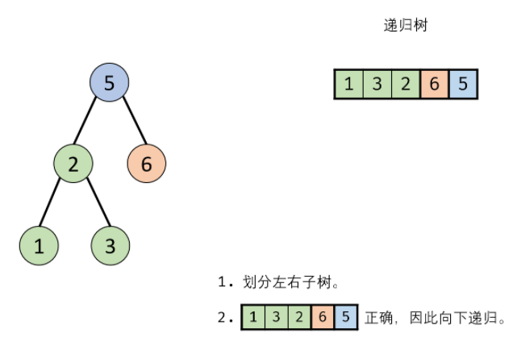

**时间复杂度 O(N^2^)** ： 每次调用 `recur(i,j)` 减去一个根节点，因此递归占用 O(N) ；最差情况下（即当树退化为链表），每轮递归都需遍历树所有节点，占用 O(N) 。
**空间复杂度 O(N)** ： 最差情况下（即当树退化为链表），递归深度将达到 N 。

```cpp
class Solution
{
public:
    vector<int> seq;
    bool verifySequenceOfBST(vector<int>& sequence)
    {
        seq = sequence;
        return dfs(0, seq.size() - 1);
    }
    bool dfs(int l, int r)  //深度优先遍历，每次传入子树的左右边界
    {
        if (l >= r) return true; //当l>=r,说明此子树节点数量<=1
        int root = seq[r];  
        int k = l;
        while (k < r && seq[k] < root) k++; //划分右子树，寻找第一个大于根节点的节点
        for (int i = k; i < r; i++)
            if (seq[i] < root)  //判断右子树中的是否都比根节点大
                return false;  
        return dfs(l, k - 1) && dfs(k, r - 1);        
    }
};
```


### 35.二叉树中和为某一值得路径

#### 题目

> 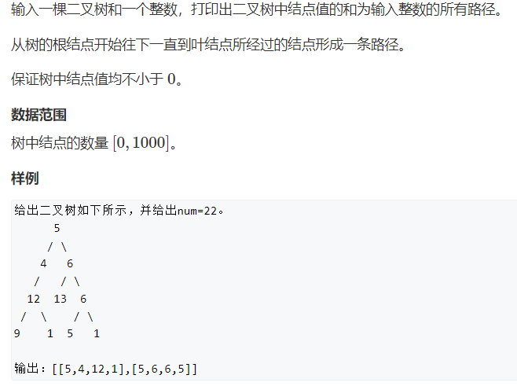

#### 题解

通过深度优先遍历，遍历判断每一条路径值的和是否等于sum。

题目要求一条路径的终点应该是节点，当节点的左右孩子都是空，且sum为0时，当前路径符合要求。

注意，path为引用变量，每个递归函数在判断结束后要恢复现场。

```cpp
/**
 * Definition for a binary tree node.
 * struct TreeNode {
 *     int val;
 *     TreeNode *left;
 *     TreeNode *right;
 *     TreeNode(int x) : val(x), left(NULL), right(NULL) {}
 * };
 */
class Solution {
public:
    vector<vector<int>> ans;
    vector<vector<int>> findPath(TreeNode* root, int sum) 
    {
		vector<int> path;
        dfs(root, sum, path); //深度优先遍历
        return ans;
    }
    void dfs(TreeNode* root, int sum, vector<int>& path) //注意，这里path为引用
    {
        if (!root) return;
        path.push_back(root->val);
        sum -= root->val;
        
        if (!root->left && !root->right && !sum) ans.push_back(path); 
        //题目要求一条路径的终点应该是节点，当节点的左右孩子都是空，且sum为0时，当前路径符合要求
        dfs(root->left, sum, path);
        dfs(root->right, sum, path);
        
        path.pop_back();  //恢复现场
        //sum += root->val; //恢复现场
    }
};
```


### 36.复杂链表的复刻

#### 题目

> 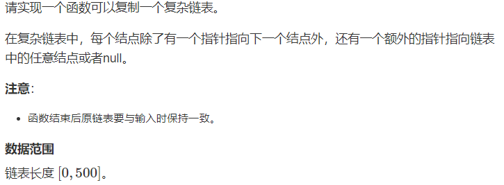

#### 题解

**算法1 - 哈希**

**O(n)**
使用hash存储，key = 源链表节点，value = 目标链表节点，遍历源链表，判断每个节点和random节点是否在hash表中，如果不存在则创建。

缺点：需要用额外O(n)的空间。

```cpp
/*
 * Definition for singly-linked list with a random pointer.
 * struct ListNode {
 *     int val;
 *     ListNode *next, *random;
 *     ListNode(int x) : val(x), next(NULL), random(NULL) {}
 * }; 
---------------------------------------- 
Definition for a Node.
class Node {
public:
    int val;
    Node* next;
    Node* random;
    
    Node(int _val) {
        val = _val;
        next = NULL;
        random = NULL;
    }
};
*/
class Solution
{
public:
    ListNode* copyRandomList(ListNode* head)
    {
        unordered_map<ListNode*, ListNode*> hash;
        hash[nullptr] = nullptr; //在哈希表中提前存放空节点，当后面判断到空节点时则不会去生成一个空节点
        auto dup = new ListNode(-1), tail = dup;
        
        while (head)  //count(key) 统计key的元素个数
        {   //不存在此结点时运行
            if (!hash.count(head)) hash[head] = new ListNode(head->val);
            if (!hash.count(head->random)) hash[head->random] = new ListNode(head->random->val);
            
            tail->next = hash[head];
            tail->next->random = hash[head->random];
            
            tail = tail->next;
            head = head->next;            
        }
        return dup->next;
    }
};
```

**算法2**

1. 先在原链表每个结点的后面复制它前面的一个结点，然后在每个点的后面接上它复制的结点。（原来的链接会断开）

2. 循环一遍，将每个复制结点的random指针指好。
3. 将复制的结点拆出来，组成一条新链表。

> 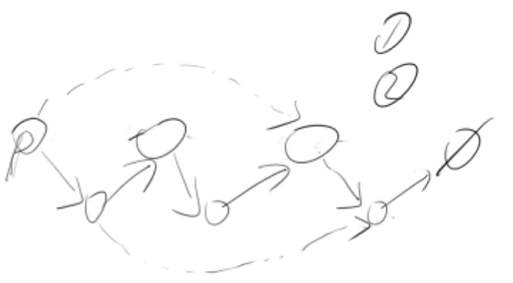
>
> 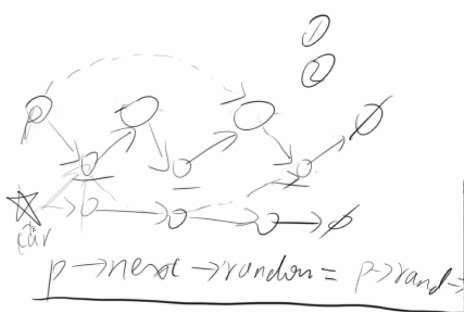

```cpp
class Solution {
public:
    ListNode *copyRandomList(ListNode *head) {
        for (auto p = head; p;)
        {   
            auto np = new ListNode(p->val);  //新建一个复制的结点
            auto next = p->next;  
            p->next = np;  
            np->next = next;
            p = next;
        }

        for (auto p = head; p; p = p->next->next)
        {
            if (p->random)  //如果存在random指针
                p->next->random = p->random->next;
        }

        auto dummy = new ListNode(-1);  //定义一个虚拟头结点，便于返回新链表的头结点
        auto cur = dummy;  //cur一直指向当前新链表的尾结点
        //剥离新链表的时候，不用考虑结点的random指针
        for (auto p = head; p; p = p->next)
        {
            cur->next = p->next;
            cur = cur->next;
            p->next = p->next->next;
        }
        return dummy->next;
    }
};
```


### 37.二叉搜索树与双向链表

#### 题目

> 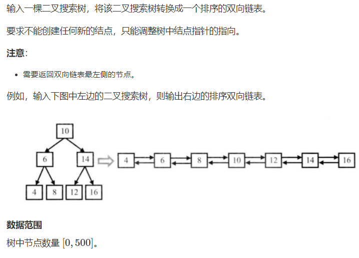

#### 题解

**算法1 - 创建了一个新结点指针(非结点，符合题意)**

就在中序递归遍历的基础上改了一点点，用一个pre指针保存中序遍历的前一个结点。
因为是==中序遍历（左根右），遍历顺序就是双向链表的建立顺序；==
每一个结点访问时它的左子树肯定被访问过了，所以放心大胆的改它的left指针，不怕树断掉；
同理，pre指向的结点保存的数肯定小于当前结点，所以其左右子树肯定都访问过了，所以其right指针也可以直接改。

最后需要一直向左找到双向链表的头结点。

```cpp
/**
 * Definition for a binary tree node.
 * struct TreeNode {
 *     int val;
 *     TreeNode *left;
 *     TreeNode *right;
 *     TreeNode(int x) : val(x), left(NULL), right(NULL) {}
 * };
 */
class Solution {
public:
    TreeNode* pre = NULL;
    TreeNode* convert(TreeNode* root) 
    {
        if (!root) return NULL;
        dfs(root);
        while (root && root->left) root = root->left;  //从最右侧的结点指回去，到头结点
        return root;
    }
    void dfs(TreeNode* root)
    {
        if (!root) return;
        dfs(root->left);  //递归遍历左子树（左）
        
        root->left = pre;
        if (pre) pre->right = root;  //关键
        pre = root;  //关键（根）
        dfs(root->right);  //递归遍历右子树（右）
    }
};
```

**算法2 - 力扣要求是首尾相连**

```cpp
class Solution {
public:
    TreeNode *pre = NULL, *head = NULL;

    TreeNode* convert(TreeNode* root) {
        if (!root) return NULL;
        dfs(root);

        // leetcode 是 循环链表,  要加上 这里
        // 循环链表 首尾相连, pre 最后在 链表尾结点
        head->left = pre, pre->right = head;

        return head;
    }

    void dfs(TreeNode* cur) { // 此处 用 cur 游标更贴切
        if (!cur) return;

        dfs(cur->left); // 中序遍历: 左中右

        if (!pre) head = cur; // pre为NULL, 找到头结点
        else { // 存在 pre, 将 pre 与 cur 左右 互连 
            pre->right = cur; 
            cur->left = pre;
        }

        pre = cur; // 更新 pre

        dfs(cur->right);
    }
};
```

**算法3 - 建立pair对组来存储**

递归做，递归处理左子树，递归处理右子树，分别返回当前子树的最左侧节点和最右侧节点，然后拼接到一起。

此外，要特判一下左子树只存在一个或右子树只存在一个的情况。

```cpp
class Solution
{
public:
    TreeNode* convert(TreeNode* root)
    {
        if (!root) return NULL;
        auto sides = dfs(root);
        return sides.first;
    }
    //递归函数，左参数为当前子树的最左侧节点，右参数为当前子树的最右侧节点
    pair<TreeNode*, TreeNode*> dfs(TreeNode* root)
    {
        if (!root->left && !root->right) return {root, root};
        if (root->left && root->right)
        {   //递归处理左子树，递归处理右子树
            auto lside = dfs(root->left), rside = dfs(root->right);
            //把左右子树拼接到一起
            lside.second->right = root, root->left = lside.second;
            root->right = rside.first, rside.first->left = root;
            return {lside.first, rside.second};
        }
        if (root->left)  //左子树只存在一个
        {
            auto lside = dfs(root->left);
            lside.second->right = root, root->left = lside.second;
            return {lside.first, root};
        }
        if (root->right)  //右子树只存在一个
        {
            auto rside = dfs(root->right);
            rside.first->left = root, root->right = rside.first;
            return {root, rside.second};
        }
    }
};
```


### 38.序列化二叉树

#### 题目

> 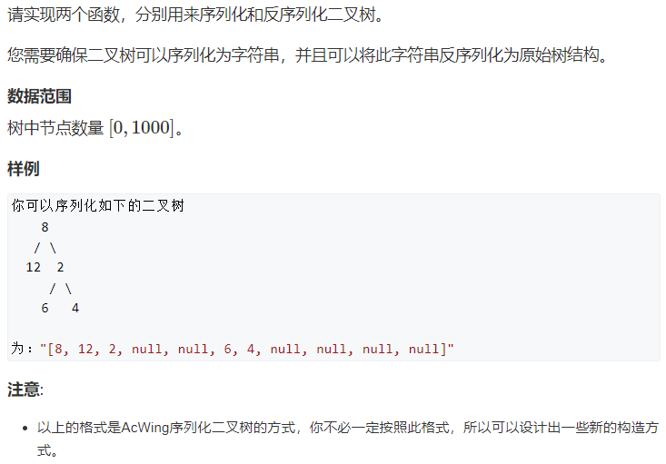

#### 题解

按照前序遍历进行序列化和反序列化。

- 序列化
  - 参考前序遍历（根左右）建树的过程，通过深度优先遍历（递归）来序列化。
  - 序列化后是[8 12 2 null null 6 4 null null null null ]

- 反序列化
  - 通过变量u作为游标，从前往后指向每个字母，
  - 通过变量k指向当前判断字母序列的结尾。
  - 参考前序遍历（根左右）建树的过程，通过深度优先遍历（递归）来反序列化。

```cpp
/**
 * Definition for a binary tree node.
 * struct TreeNode {
 *     int val;
 *     TreeNode *left;
 *     TreeNode *right;
 *     TreeNode(int x) : val(x), left(NULL), right(NULL) {}
 * };
 */
class Solution {
public:
    // Encodes a tree to a single string.
    string serialize(TreeNode* root) {
        string res;
        dfs_s(root, res);
        return res;
    }
    //根左右遍历方式
    void dfs_s(TreeNode* root, string& res)
    {
        if (!root) 
        {
            res += "null ";  //空节点序列化，要注意null
            return;
        }
        res += to_string(root->val) + ' '; //根节点序列化
        dfs_s(root->left, res);   //左子树序列化
        dfs_s(root->right, res);  //右子树序列化 
    }
	    
    // Decodes your encoded data to tree.
    TreeNode* deserialize(string data) {
        int u = 0;
        return dfs_d(data, u);
    }
    
    TreeNode* dfs_d(string data, int& u)
    {
        if (u == data.size()) return NULL; 
        int k = u;      //u作为游标，从前往后指向每个字母
        while (data[k] != ' ') k++; //跳过字母，指向空格，其实是指向当前判断字母序列的结尾
        if (data[u] == 'n')
        {	
            u = k + 1;  //跳过"null"，指向下一组字母序列
            return NULL;
        }
        
        int val = 0, sign = 1;
        if (u < k && data[u] == '-') sign = -1, u++; //判断是否是负数
        for (int i = u; i < k; i++) val = val * 10 + data[i] - '0';//字符串恢复成数字
        val *= sign; //负数情况处理
        u = k + 1;   //u指向下一组字母序列
        
        auto root = new TreeNode(val);////反序列化根节点
        root->left = dfs_d(data, u);  //反序列化左子树
        root->right = dfs_d(data, u); //反序列化右子树
        return root;
    }
};
```


### 剑指offer 38. 字符串的排列

#### 题目

>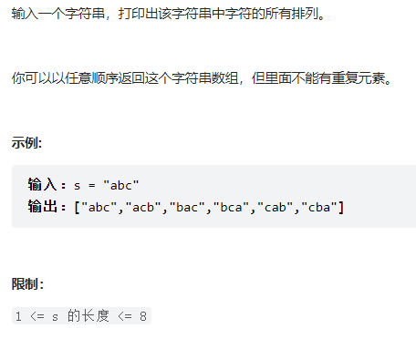

#### 题解

对于一个长度为 n 的字符串（假设字符互不重复），其排列方案数共有：

`n x (n - 1) x (n - 2) ... x 2 x 1`

**排列方案的生成：**

根据字符串排列的特点，考虑深度优先搜索所有排列方案。即通过字符交换，先固定第 1 位字符（ n 种情况）、再固定第 2 位字符（ n-1 种情况）、... 、最后固定第 n 位字符（ 1 种情况）。

> 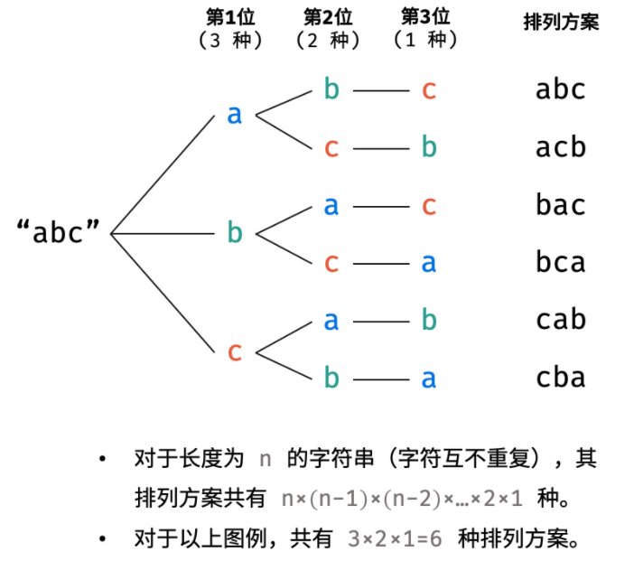

**重复排列方案与剪枝：**

当字符串存在重复字符时，排列方案中也存在重复的排列方案。为排除重复方案，需在固定某位字符时，保证 “每种字符只在此位固定一次” ，**即遇到重复字符时不交换，直接跳过。**从 DFS 角度看，此操作称为 **“剪枝”** 。

> 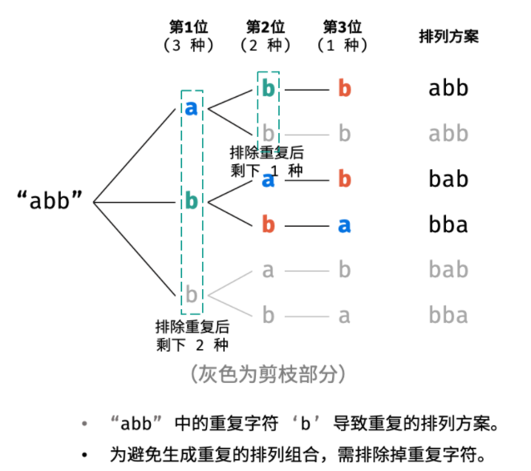
>
> 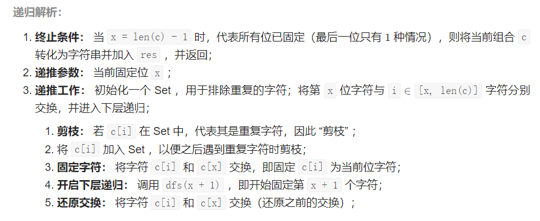

```cpp
class Solution {
public:
    vector<string> permutation(string s) {
        dfs(s, 0);
        return res;
    }
private:
    vector<string> res;
    void dfs(string s, int x) {
        if (x == s.size() - 1) {   //代表所有位已固定（最后一位只有 1 种情况）,去掉-1也行
            res.push_back(s);  
            return;
        }
        set<int> st;  //堆，不允许有重复元素出现，且插入的数据会自动排序，即初始化一个Set，用于排除重复的字符，当前位不能为重复字符
        for (int i = x; i < s.size(); i++) {
            //if (st.find(s[i]) != st.end()) continue; //find()查找key是否存在，若存在，返回该键的元素的迭代器；若不存在，返回set.end()
            if (st.count(s[i])) continue;   //重复，因此剪枝
            st.insert(s[i]);
            swap(s[i], s[x]);   // 交换，将 s[i] 固定在第 x 位
            dfs(s, x + 1);      // 开启固定第 x + 1 位字符
            swap(s[i], s[x]);   // 恢复交换           
        }
    }
};
```

**方法二 - 同下题** 

```cpp
class Solution {
public:
    vector<string> ans;
    string path;
    vector<string> permutation(string s) {
        sort(s.begin(), s.end());  //排序对于字符串同样可行
        path.resize(s.size());   //由于后面直接用到了path[i]=s[u]，所以这里一定要提前开辟空间
        dfs(s, 0, 0, 0);
        return ans;
    }
    
    void dfs(string s, int u, int start, int state) {
        if (u == s.size()) {
            ans.push_back(path);
            return;
        }
        if (!u || s[u] != s[u - 1]) start = 0;
        for (int i = start; i < s.size(); i++) {
            if (!(state >> i & 1)) {
                path[i] = s[u];
                dfs(s, u + 1, i + 1, state + (1 << i));
            }
        }
    }
};
```


### 39.数字排列

#### 题目

> 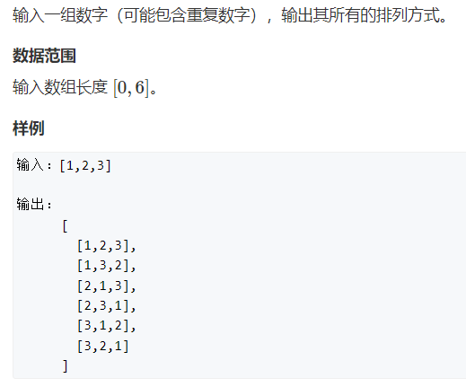

#### 题解

注意：要考虑重复数字的情况

先将一个数分别放到每个位置上，如果后一个数与它相等，则规定必须放在这个数的后面（非紧临着），当前一个数的后面没有空位置了，则直接返回。

> 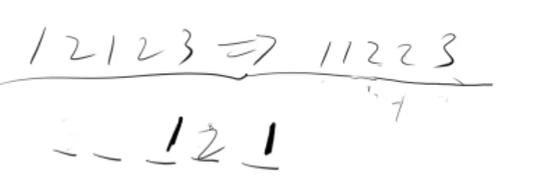
>
> 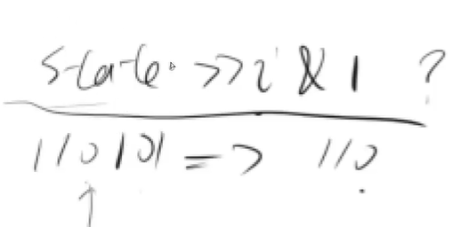

```cpp
class Solution
{
public:
    vector<vector<int>> ans;  //最终答案
    vector<int> path;   //记录每条路径
    
    vector<vector<int>> permutation(vector<int>& nums)
    {
        sort(nums.begin(), nums.end()); //排序，将相同数字放到一起
        path.resize(nums.size());  //调整容器大小
        dfs(nums, 0, 0, 0);  
        return ans;
    }
   
    //u表示当前到第几位数字了，start记录一下上一个数的位置在哪，当前数应该从哪个位置开始枚举（为了方便相同数的处理），state用来记录一下哪些位置是空的（二进制来判断）（每个数都是一个n位的二进制数）
    void dfs(vector<int>& nums, int u, int start, int state)
    {
		if (u == nums.size())  //遍历完所有数，代表已经找到了一个方案
        {
            ans.push_back(path);
            return;
        }
        if (!u || nums[u] != nums[u - 1]) start = 0; //第一个数或者当前数和上一个数不同，则可以从第0位开始枚举，如果相同，则从原start值位置开始
        for (int i = start; i < nums.size(); i++) 
        {   //判断数的二进制表示中第i位是否为1
            if (!(state >> i & 1))  // >>的优先级高于&
            {
                path[i] = nums[u]; //如果不是1，代表这一位没有被用过，把当前数放到坑上，递归处理下一位
                dfs(nums, u + 1, i + 1, state + (1 << i));//把state的第i位从0变成1
            }
        }
    }
};
```


### 40.数组中出现次数超过一半的数字

#### 题目

> 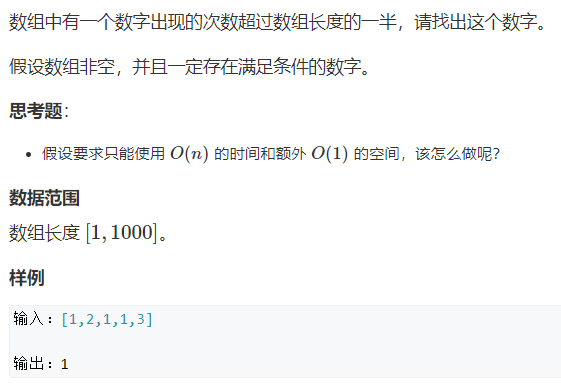

#### 题解

摩尔投票算法 - 对拼消耗

（如果一个数大于一半，这个数最后的数量肯定大于其他所有数的数量之和）

cnt 用来记录次数，val 用来记录答案数，就是把不同的数字相互抵消

1. cnt 为 0 时，val 等于当前数
2. cnt 不为 0 时，后面的数与 val 相同，cnt++ ，不同，cnt-- 

3. 循环，最终val值为答案

时间复杂的 O(n)，空间复杂度 O(1)

> 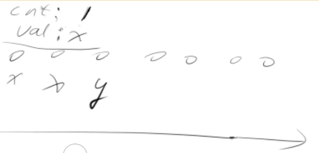

```cpp
class Solution
{
public:
    int moreThanHalfNum_Solution(vector<int>& nums)
    {
        int cnt = 0, val = -1;
        for (auto x : nums)
            if (x == val)
                cnt++;
        	else
            {
                if (cnt) cnt--;
                else
                {
                    cnt = 1;
                    val = x;
                }
            }
        return val;
    }
};
```


### 41.最小的k个数

#### 题目

>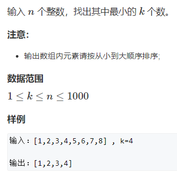

#### 题解

**算法1**

直接排序，时间复杂度O(nlogn + k)

**算法2**

使用堆来做，时间复杂度O(nlogk)

用堆来维护最小的k个数，每次将新数插入后，然后判断堆大小是否超过，超过则弹出最大的一个数。

> priority_queue<int> heap;   //优先队列，默认大顶堆，堆顶最大
>
> set<int> st;   //集合容器，不允许有重复元素出现，且插入的数据会自动排序，一般用于数据的查找和统计
>
> multiset<int> ms;   //关联式容器，允许有重复元素出现，且插入的数据会自动排序，一般用于数据的查找和统计

集合大小每次都是k，一共插入n个数，所以时间复杂度为O(nlogk)

> 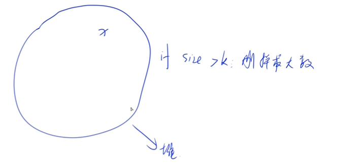

```cpp
class Solution  //使用优先队列，由于倒叙插入，返回时需要反转
{
public:
    vector<int> getLeastNumbers_Solution(vector<int> input, int k)
    {
        priority_queue<int> heap; //优先队列，默认大顶堆，堆顶最大
        for (auto x : input)
        {
            heap.push(x);
            if (heap.size() > k) heap.pop(); //弹出最大的堆顶
        }
        vector<int> res;  //最后生成答案数组
        while (heap.size()) res.push_back(heap.top()), heap.pop(); //把优先队列中的所有数都放入vector容器中（优先队列大小最大为）
        reverse(res.begin(), res.end());
        return res;
    }
};
```


### 42.数据流中的中位数

#### 题目

> 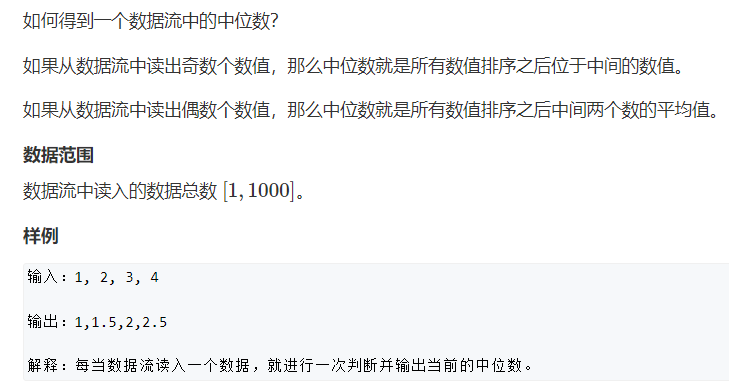

#### 题解

上面是小根堆，下面是大根堆，他们各自的顶端是中位数。

>小根堆：是一种经过排序的完全二叉树，其中任一非终端节点的数据值均不大于其左子节点和右子节点的值。
>
>大根堆：是指根结点（亦称为堆顶）是堆里所有结点关键字中最大者，属于二叉堆的两种形式之一。

如果是奇数，要保证下面的数的个数比上面多一个，

1. 每次将数插入到大根堆中，如果下面的堆顶和上面的堆顶逆序（最大值不能满足小于上面小根堆的最小值），则将逆序点交换。
2. 如果下面的个数比上面的个数多2，则将下面的堆顶弹到上面。

>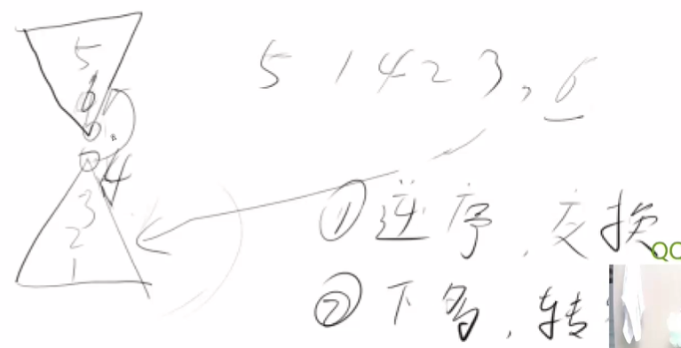

```cpp
class Solution 
{
public:
    priority_queue<int> max_heap;  //大根堆
    priority_queue<int, vector<int>, greater<int>> min_heap;   //小根堆
    
    void insert(int num)
    {
        max_heap.push(num);
        while (min_heap.size() && min_heap.top() < max_heap.top())  //两个堆顶逆序，则将逆序点交换（前提是两个堆都不为空）
        {
            auto minv = min_heap.top(), maxv = max_heap.top();
            min_heap.pop(), max_heap.pop();
            max_heap.push(minv), min_heap.push(maxv);
        }
        if (max_heap.size() > min_heap.size() + 1) //如果下面的个数比上面的个数多2，则将下面的堆顶弹到上面
        {
            min_heap.push(max_heap.top());
            max_heap.pop();
        }
    }

    double getMedian()
    {   //加减乘除优先级大于 & ^ |  大于  &&  ||
        if (max_heap.size() + min_heap.size() & 1)  //n & 1 为 1 时，代表n为奇数 
            return max_heap.top();  
        return (max_heap.top() + min_heap.top()) / 2.0;  //注意结果可能是double类型
    }
};
```


### 43.连续子数组的最大和

#### 题目

> 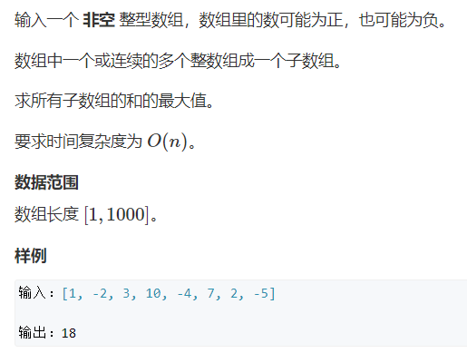

#### 题解

动态规划

用一个变量来做动态规划，

s 中存 **以前一个数为结尾的子数组的和**，分两种情况：

1. s > 0, s = s + x
2. s <= 0,  s = x

注意，要考虑 int 数据范围

```cpp
C中int类型是32位的，范围是-2147483648到2147483647 
#define INT_MAX 2147483647
#define INT_MIN (-INT_MAX - 1)
```

> 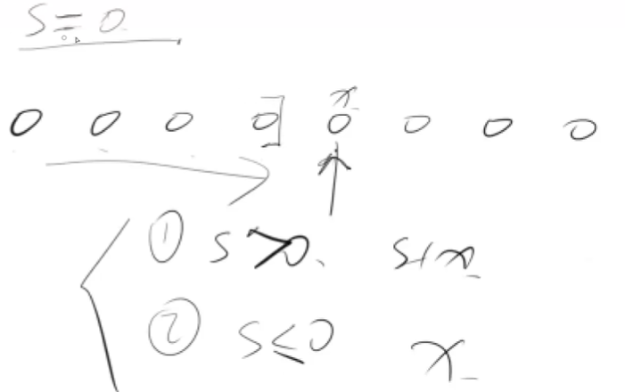

```cpp
class Solution
{
public:
    int maxSubArray(vector<int>& nums)
    {   
        int res = INT_MIN, s = 0;  //INT_MIN为负无穷常量
        for (auto x : nums)
        {
            if (s < 0) s = 0;
            s += x;
            res = max(res, s);
        }
        return res;
    }
};    
```


### ==44.从1到n整数中1出现的次数==

#### 题目

> 

#### 题解

**算法0**

> `f(abc) = a * f(99) + x + f(bc)`
>
> 若 `a = 1, x = bc + 1`
>
> 若 `a > 1, x = 100`
>
> `f(0) = 0, f(1 - a) = 1`
>
> ```cpp
> class Solution {
> public:
>     int numberOf1(int n) {
>         if (!n) return 0;
>         else if (n < 10) return 1;
>         else {
>             int num = n, count = 1;
>             while (num >= 10) {
>                 cont *= 10;
>                 num /= 10;
>             }
>             if (num > 1)
>                 return num * numberOf1(count - 1) + count + numberOf1(n - num * count);
>             else return num * numberOf1(count - 1) + (n - num * count + 1) + numberOf1(n - num * count);
>         }
>     }
> };
> ```


**算法1**

时间复杂度：O(logn)

分情况讨论

> 
>
> 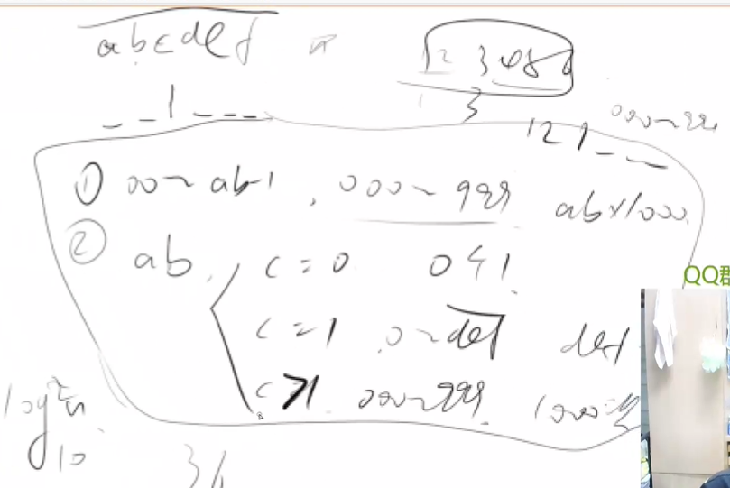

```cpp
class Solution {
public:
    int numberOf1Between1AndN_Solution(int n) {
        if (!n) return 0;
        vector<int> number;  
        while (n) number.push_back(n % 10), n /= 10;  //把每一位先扣出来
        long long res = 0; 
        for (int i = number.size() - 1; i >= 0; i -- )  //从最高位开始枚举
        {   //123456枚举到3时，left=12,right=456
            int left = 0, right = 0, t = 1;
            for (int j = number.size() - 1; j > i; j -- ) left = left * 10 + number[j];
            for (int j = i - 1; j >= 0; j -- ) right = right * 10 + number[j], t *= 10;
            res += left * t;
            if (number[i] == 1) res += right + 1;
            else if (number[i] > 1) res += t;
        }
        return res;
    }
};
```

**算法2**

https://www.cnblogs.com/xuanxufeng/p/6854105.html

我们从一个5位的数字讲起，先考虑其百位为1的情况。分3种情况讨论：

> **百位数字>=2  example: 31256** 当其百位为>=时，有以下这些情况满足(为方便起见，计312为a，56为b)：
>
> ​     100 ~  199
>
>    1100 ~  1199
>
> ​    .....
>
>  31100 ~ 31199
>
>  余下的都不满足！
>
> 因此，百位>=2的5位数字，其百位为1的情况有（a/10+1）*100个数字  （a/10+1）=>对应于 0 ~ 31，且每一个数字，对应范围是100个数（末尾0-99）
>
> **百位数字 ==1 example: 31156** 当其百位为1时，有以下这些情况满足：
>
> ​     100 ~  199
>
>    1100 ~  1199
>
> ​     ......
>
>  30100 ~ 30199
>
>  31100 ~ 31156
>
> 因此，百位为1的5位数字，共有（a/10）*100+(b+1)
>
> **百位数字 ==0 example: 31056** 当其百位为0时，有以下这些情况满足：
>
> ​     100 ~  199
>
>    1100 ~  1199
>
>  30100 ~ 30199
>
>  其余都不满足
>
> 因此，百位数为0的5位数字，共有(a/10)*100个数字满足要求

我们可以进一步统一以下表达方式，即

当百位>=2或=0时，有`[(a+8)/10]*100`

当百位=1时，有`[(a+8)/10]*100+(b+1)` 

用代码表示就是： `[(a+8)/10]*100+(a%10==1)?(b+1):0；`

**为什么要加8呢？**  因为只有大于2的时候才会产生进位等价于（a/10+1），当等于0和1时就等价于(a/10)。另外，等于1时要单独加上(b+1)，这里我们用a对10取余是否等于1的方式判断该百位是否为1。

> **Question：有缺陷或逻辑错误吗？**
>
> **有人可能会有疑惑，比如11100，这个数在考虑百位为1的时候算作了一次，在考虑千位的时候也算了一次，在考虑万位为1的时候又算了一次，一共计了3次，这不是明显重复吗？**
>
> **我的回答是，不重复！**
>
> **分析：**题目中要我们统计出现的1的个数，那么我们可以看到11100一共是3个1,如果剔除了重复的情况只考虑一次才会是问题。换言之，在计算从1到n整数中1的出现次数时，我们把10位出现1的情况个数加上百位出现1的情况个数一直加到最高位是1的情况的个数，这里面一个数可能被统计过多次；11100百位出现1，千位和万位都为1，那么被重复统计了3次。

`for (long m = 1; m <= n; m *= 10)` 在这里的作用是，从个位开始考虑，再到十位，百位，千位，一直到超出这个数！

**为什么m要用long型呢？**  因为n可能没有超过整型的表达范围（int刚好可以表示n），而10*m恰恰有可能刚刚超过！`ones += (n/m + 8) / 10 * m + (n/m % 10 == 1 ? n%m + 1 : 0);`  这里ones用于表示1的个数，当m=100时，n/m其实代表的是a，而n%m代表的是b, 此时考虑的是百位为1的情况；当m=1000，自然考虑的就是千位等于1的情况了~ 至于为什么加8，那个三目运算符是干嘛子用的上面都已经讲过了。

```cpp
class Solution {
public:
    int numberOf1Between1AndN_Solution(int n) {
        int count = 0;
        for (long i = 1; i <= n; i *= 10) {
            int a = n / i,b = n % i;
            //之所以补8，是因为当百位为0，则a/10==(a+8)/10，
            //当百位>=2，补8会产生进位位，效果等同于(a/10+1)
         count += (a + 8) / 10 * i + ((a % 10 == 1) ? b + 1 : 0);
        }
        return count;
    }
};
//总结一下以上的算法，可以看到，当计算右数第 i 位包含的 X 的个数时：

//取第 i 位左边（高位）的数字，乘以 10i−1，得到基础值 a。
//取第 i 位数字，计算修正值： 
	//如果大于 X，则结果为 a+10i−1。
	//如果小于 X，则结果为 a。
	//如果等 X，则取第 i 位右边（低位）数字，设为 b，最后结果为 a+b+1。
```


## Week 5

### 45.数字序列中某一位的数字

#### 题目

> 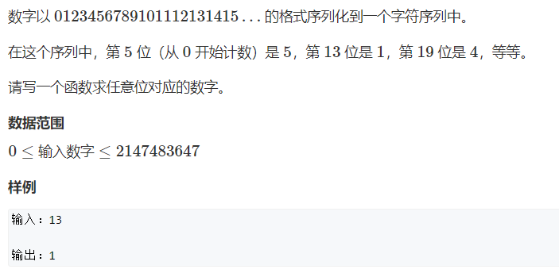

#### 题解

题目要求是在递增排列的字符序列中，找到指定位置上的数字。

分几步讨论。

时间复杂度：O(logn)

> 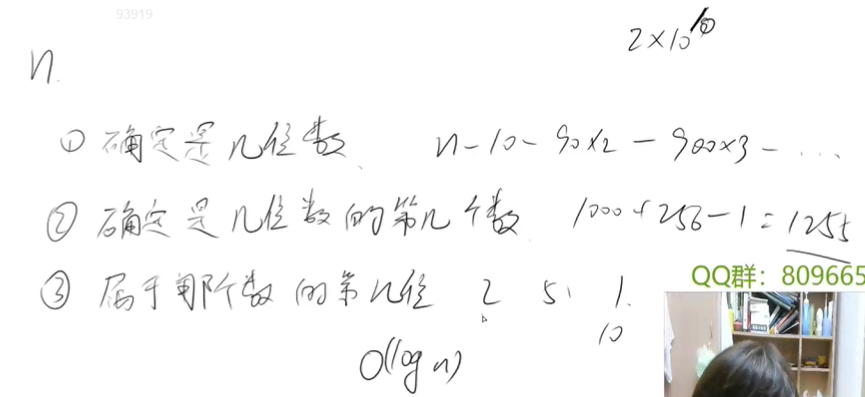

```cpp
class Solution
{
public:
    int digitAtIndex(int n)
    {
        //n++; n--; 抵消不写
        //n++;我们从1开始算，而题目要从0，所以先加1  
        //n--;一位数字是10个，两位数是90个，三位数是900个，所以先把0减去，让一位数字为9个，与两位数90个，三位数900个相仿，便于处理
     	 long long i = 1, s = 9, base = 1;
         //i表示是几位数（从1位开始枚举），s表示位数共有多少个，base表示位数的起始值。
         while(n > i * s) 
         {   // 9, 90, 900, 9000, 90000, i * s表示位数总共占多少位。
             n -= i * s;        
             // 1000 - 9 - 90 * 2 - 900 * 3 ,当 i= 3 时不符合条件，说明是在三位数里面。
             i++;                
             s *= 10;
             base *= 10;
         }
         int number = base + (n + i - 1) / i - 1; 
        //求位数的第几个数， 1000 - 9 - 180 = n , n / 3 + base - 1（考虑0故减1）, 向上取整 n + i - 1。
        //(n / i) 的上取整无法直接计算，转化成((n + i - 1) / i)的下取整来计算
         int r = n % i ? n % i : i; // 除不尽就是第几位，除尽力了就是最后一位。
         for (int j = 0; j < i - r; j ++) number /= 10; //求数的第i - r位，取出第i - r位。
         return number % 10;
    }
};
```


### 46.把数组排成最小的数

#### 题目

> 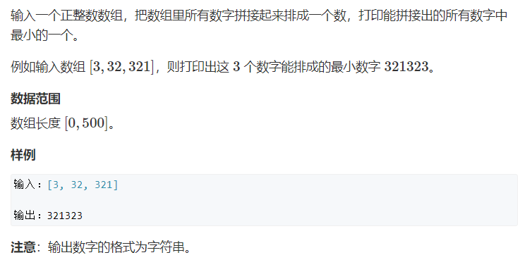

#### 题解

首先把数组里面的所有数按照自定义的方式排序，即当ab顺序连接比ba顺序连接小时，认为a < b

> 离散数学定义，一个简单数组能排序需要满足的关系是：
>
> 反对称性a <= b, b <=a  推出 a = b
>
> 传递性a <= b, b <= c 推出 a <=c

利用了传递性，从已比较过的数据，可以推出其他数直接的大小关系。

经分析证明，这题满足这两个条件。

```cpp
class Solution
{
public:
    static bool cmp(int a, int b)  //sort()的传入函数类型要求必须是static类型
    {	//转换成字符串，后面直接进行字符串拼接然后比较拼接后大小
        auto as = to_string(a), bs = to_string(b);
        return as + bs < bs + as;
    }
    string printMinNumber(vector<int>& nums)
    {
        sort(nums.begin(), nums.end(), cmp);
        string res;
        for (auto x : nums) res += to_string(x);
        return res;
    }
};
```


### 47.把数字翻译成字符串

#### 题目

> 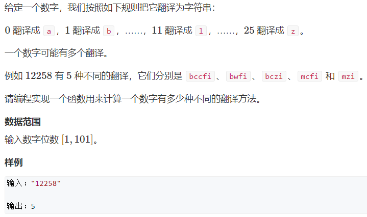

#### 题解

动态规划

1. 状态表示，用 `f[i]` 来表示前 `i` 位数字一共有多少种表示方式

2. 状态如何计算，`f[i] = f[i - 1] + f[i - 2]` ，因为第`i`位只有一种固定的情况了, 又因为一个字母可能是一个数字变得，也可能是两个数字变得，所以存在`f[i - 1] +  f[i - 2]`两类。

   > 但是要保证，0-25之间，且没有05，06这种0开头情况，即`10 <= si-1,s <= 25`

3. 边界，`f[0] = 1`,   `f[0]`的值需要保证边界是对的，即`f[1]`和`f[2]`是对的，在任何情况下`f[0]`取`1`都可以保证`f[1]`和`f[2]`是正确的，所以`f[0]`应该取`1`。

   >一般情况下dp的边界都可以这么考虑，直接去想的话确实不太好确定，因为有些状态是没有对应实际意义的。

```cpp
class Solution
{
public:
    int getTranslationCount(string s)
    {
        int n = s.size();
        vector<int> f(n + 1); //动态规划的数组是从0开始的
        f[0] = 1;
        f[1] = 1;
        for (int i = 2; i <= n; i++) //由于后面有s[i - 2]，i最小从2开始，否则越界
        {
            f[i] = f[i - 1];
            int t = (s[i - 2] - '0') * 10 + s[i - 1] - '0'; //根据t大小，判断是否可以转移
            if (t >= 10 && t <= 25) f[i] += f[i - 2]; //当i == 1的时候，t一定小于10，所以 if (t >= 10 && t <= 25) f[i] += f[i - 2]; 是不成立的。
        }
        return f[n];
    }
};
```

**算法2 - 递归**

```cpp
class Solution {
public:
    int translateNum(int num) {
        string s = to_string(num);
        return getTranslateCount(string s);
    }
    int getTranslateCount(string s) {
        if (s.size() < 2) return 1;
        int num = 10 * (s[0] - '0') + s[1] - '0';
        if (s[0] != '0' && num < 26) 
            return getTranslateCount(s.substr(1, s.size())) + getTranslateCount(s.substr(2, s.size()));
        else return getTranslateCount(s.substr(1, s.size()));
    }
};
```


### 48.礼物的最大价值

#### 题目

> 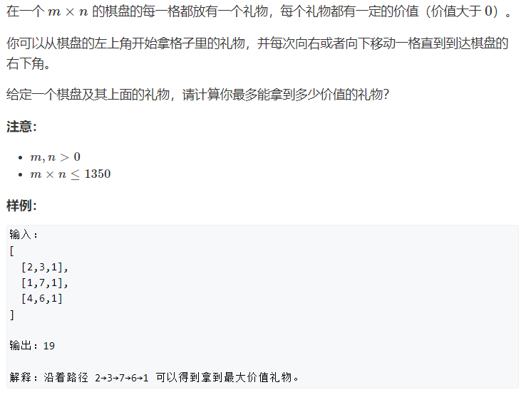

#### 题解

动态规划（此题行与列的取值太大，不能用dfs，dfs的时间复杂度是指数级别的，考虑用动态规划）

1. 状态表示，`f[i, j]`  表示从左上角走到 `i,j` 这个格子时的最大价值

2. 状态计算，`f[i, j] = max(f[i - 1, j], f[i, j - 1]) + gift[i, j]` (只有左或上面这两种状态)

3. 边界情况，`f[i, 0] = f[0, j] = 0`，答案为 `f[n, m]`

这题如果要求经过的路径，计算完所有状态后，从最后一个状态反推出从起点的路径即可。

> 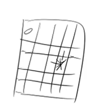

```cpp
class Solution
{
public:
    int getMaxValue(vector<vector<int>>& grid)
    {
        int n = grid.size(), m = grid[0].size();
        vector<vector<int>> f(n + 1, vector<int>(m + 1, 0)); //下标从1开始算，不用处理边界问题，如果从0开始，下标减一会越界，将数据全部初始化为0
        for (int i = 1; i <= n; i++)
            for (int j = 1; j <= m; j++)
                //grid[i - 1][j - 1] 因为i,j是从1开始算的，所以要往前偏移一个
                f[i][j] = max(f[i - 1][j], f[i][j - 1]) + grid[i - 1][j - 1];
        return f[n][m];
    }
};
```


### 49.最长不含重复字符的子字符串

#### 题目

> 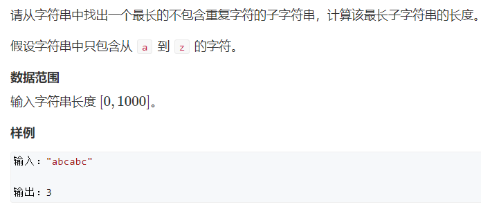

#### 题解

双指针算法，时间复杂度 O(n)

**双指针算法的适用情景之一：两个指针同时往后移，当第二个指针往后移时，第一个指针也往后移（移动期间不会从头重新开始移，一直从当前点往后移），满足这样单调的条件，可以用双指针算法。**

当 `j` 往后移，当前指向的字母在哈希表中个数超过`1`个，则 `i` 往后移（删），直到没有重复。每次循环结束更新一下答案。

> 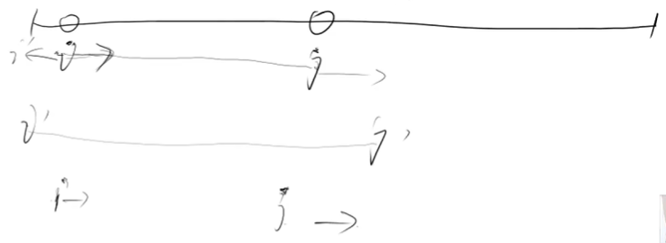

```cpp
class Solution
{
public:
    int longestSubstringWithoutDuplication(string s)
    {
        unordered_map<char, int> count;
        int res = 0;
        for (int i = 0, j = 0; j < s.size(); j++)
        {
            if (++count[s[j]] > 1) //表示有重复字母（使用++count省去将每个字母的值变为1的初始化）
            {
                while (count[s[i]] == 1) count[s[i++]]--; //没有找到重复字母，i一直后移
                count[s[i++]]--; //找到重复字母，减掉
            }
            res = max(res, j - i + 1);  //记录能达到的最长长度
        }
        return res;
    }
};
```


### 50.丑数

#### 题目

> 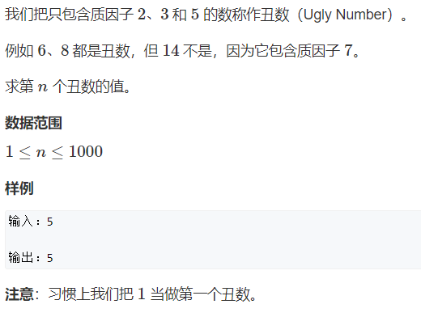

#### 题解

这种题，不好做，一般先得把思路猜出来，然后再解。

使用三个指针进行三路归并，最后将三路合并，判重取并集，每次挑一个当前最小的丑数放过去。

>归并算法核心是分治思想：分，划分成很多个小的问题，然后递归处理。治，将分阶段得到的答案整合起来，即为分治思想。

详细分析：

1. 这题可以理解为求取只包含2，3，5质因子的数按从小到大的排序集合，可以考虑为一个三路归并的问题。
2. 第一路是包含质因子2的所有数的集合，第二路是包含3的质因子的所有数的集合，第三路是包含5的质因子的所有数的集合。
3. 可以看出，丑数就是这三路去重后的交集。

> 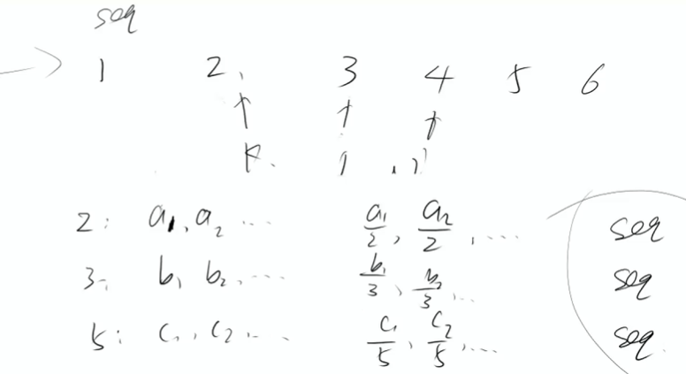

```cpp
class Solution
{
public:
    int getUglyNumber(int n)   
    {
     	vector<int> q(1, 1);
        //等同vector<int> q; q.push_back(1);
        //1是丑数，把1放入，后面只需进行n-1次循环
        int i = 0, j = 0, k = 0;  //分别为2,3,5质因子的指针
        while (--n)    //while(--n) 循环n-1次，while(n--) 循环n次
        {
            int t = min(q[i] * 2, min(q[j] * 3, q[k] * 5));
            q.push_back(t); 
            //丑数肯定是在丑数的基础上，所以都在一个数列中
            //下面判断这次加入的t是由那个质因子得到的，其指针就往下移，保证依次有序在各自列中不重复
            if (q[i] * 2 == t) i++;
            if (q[j] * 3 == t) j++;
            if (q[k] * 5 == t) k++;
        }
        return q.back();
    }
};
```


### 51.字符串中第一个只出现一次的字符

#### 题目

> 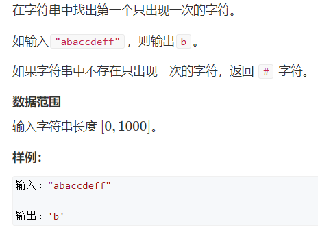

#### 题解

哈希表，先统计一遍，然后找哈希表中第一个个数为1的字符

```cpp
class Solution
{
public:
    char firstNotRepeatingChar(string s)
    {
        unordered_map<char, int> hash;
        for (auto c : s) hash[c]++;
        char res = '#';
        for (auto c : s)
            if (hash[c] == 1)
            {
                res = c;
                break;
            }
        return res;
    }
};
```


### 52.字符流中第一个只出现一次的字符

#### 题目

> 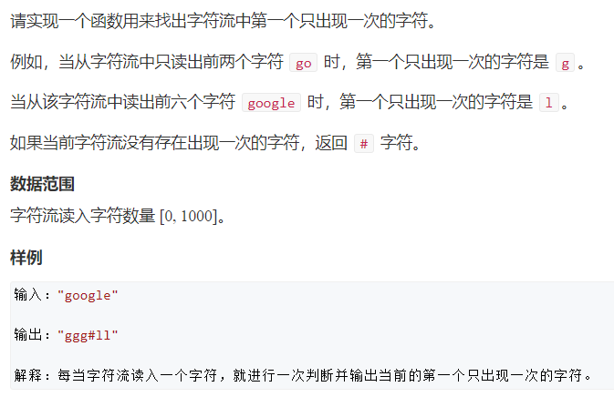

#### 题解

双指针算法

> 如果按照上题的做法做，每输出一次是O(n)，输出n次就是O(n^2^)，所以要想办法优化到O(n)。
>
> 从前往字符流中加字符的过程中，答案也是从前往后依次找的。所以可以用双指针算法。
>
> 不一定用双指针来写，也可以用队列。单调队列和双指针是有很大关联的数据结构，把队头和队尾看成了两个双指针，好处是可以省空间。

双指针算法，维护一个哈希表，为所有字符出现的次数，每次加入新字符进行判断，个数不为1则删掉。

加字符为O(1)，从前往后遍历指针的操作复杂度均摊（遍历的次数越往后越少，总次数为n步）为O(1)。所以，总的时间复杂度为O(n)。

> 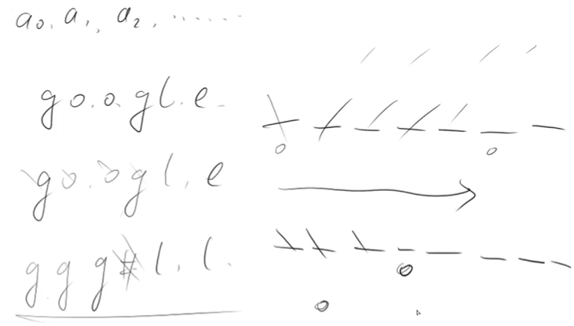

```cpp
class Solution{
public:  
    unordered_map<char, int> count;
    queue<char> q;  //队列用来顺序压入本次为第一次出现的ch字母
    //Insert one char from stringstream
    void insert(char ch)
    {
        if (++count[ch] > 1) //表示有重复字母（使用++count省去将每个字母的值变为1的初始化）
        {   //随着插入不断进行，队列中间的字母出现的次数可能不为1，所以要放在while循环中，直到找到第一个次数为1的字母
            while (q.size() && count[q.front()] > 1) 
                q.pop();
        }
        else q.push(ch);
    }
    //return the first appearence once char in current stringstream
    char firstAppearingOnce()
    {
        if (q.empty()) return '#';
        else return q.front();
    }
};
```


### 53.数组中的逆序对

#### 题目

> 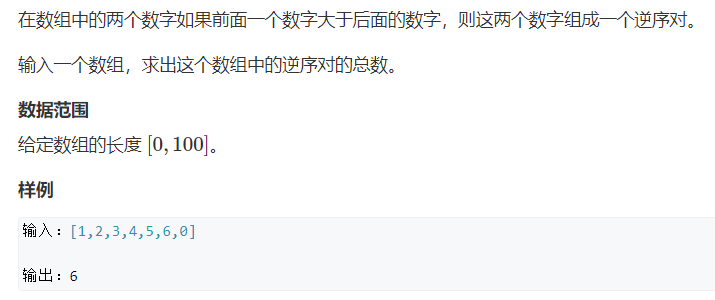

#### 题解

归并排序（分治思想，先确定分界点，然后递归处理，最后归并 - 合二为一）

归并的每层时间复杂度都是O(n)，一共logn层，所以时间复杂度为O(nlogn)

>首先想到的暴力一定不是面试官想要的，暴力的复杂度为n平方，那么比暴力更快一点的复杂度为nlogn，怎么才会有logn出现呢？每次切一半就会有logn出现，怎么样把一半一半用到这道题上呢？ 使用归并。

利用有序性，判断逆序对，比如数组 `arr1=[1,2,3,4]` 和 `arr2=[0,5,6]` ，

`arr1`里的 1 是大于`arr2`里的 0 的，那么`arr1`里 1 且其之后的所有数字都比 0 大，则对于 0 来说，有 4 个逆序对 。

利用归并算法（分治思想），将给定的数组，先递归成很小的部分（递归的同时进行排序，这样就不会重复计算逆序对），然后再依次归并，最终每一部分的res总和就是总的逆序对个数。

>

```cpp
class Solution
{
public:
    int merge(vector<int>& nums, int l, int r)
    {
        if (l >= r) return 0;
        
        int mid = l + r >> 1;
        int res = merge(nums, l, mid) + merge(nums, mid + 1, r); //先递归，再归并
        //归并的过程
        vector<int> temp;
        int i = l, j = mid + 1;
        while (i <= mid && j <= r)
            if (nums[i] <= nums[j]) temp.push_back(nums[i++]); //不是逆序对，直接压入数组
        	else
            {
                temp.push_back(nums[j++]);  //压入数组
                res += mid - i + 1;  //关键，计算当前在前半段中，比nums[i]大的数有多少个
            }
        //扫尾
        while (i <= mid) temp.push_back(nums[i++]); //将剩余的数加入数组
        while (j <= r) temp.push_back(nums[j++]);  //将剩余的数加入数组
        //物归原主
        int k = l;
        for (auto x : temp) nums[k++] = x;  //将nums覆盖为排序结果，即将临时数组里的元素放回去
        return res;
    }
    
    int inversePairs(vector<int>& nums)
    {
        return merge(nums, 0, nums.size() - 1);
    }
};
```


### 54.两个链表的第一个公共结点

#### 题目

> 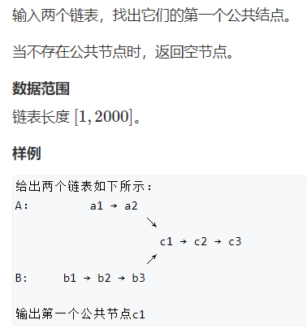

#### 题解

时间复杂度O(n)

如果有公共结点肯定是在后面重叠，且后面部分都是共同的。
方法1：先计算出两个链表的长度，可以让比较长的先走两个链表长度之差的步数，两个再一起走。
方法2：

1. 不同部分为a， 和b，公共部分为c
2. 则，a + c + b = b + c + a
3. 让两个一起走，a走到头就转向b， b走到头转向a，则在公共部分相遇。

> 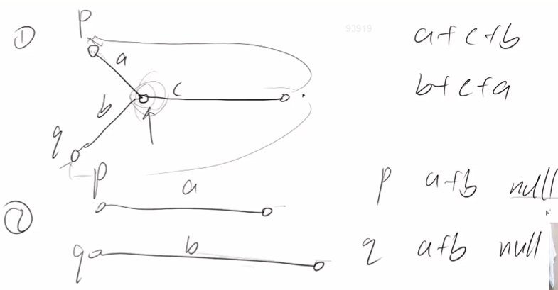

```cpp
/**
 * Definition for singly-linked list.
 * struct ListNode {
 *     int val;
 *     ListNode *next;
 *     ListNode(int x) : val(x), next(NULL) {}
 * };
 */
class Solution {
public:
    ListNode *findFirstCommonNode(ListNode *headA, ListNode *headB) {
        auto p = headA, q = headB;
        while (p != q)
        {
            if (p) p = p->next;
            else p = headB;
            if (q) q = q->next;
            else q = headA;
        }
        return p;
    }
};
```


### 55.数字在排序数组中出现的次数

#### 题目

> 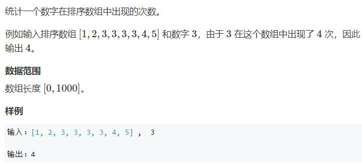

#### 题解

**算法1 -  二分算法**

普通做法如哈希表扫一遍，时间复杂度为O(n)，用二分算法时间复杂度为O(logn)。【4ms】

本题用二分算法找出k第一次和最后一次出现的位置。

> 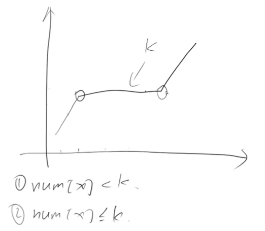

```cpp
class Solution
{
public:
    int getNumberOfK(vector<int>& nums, int k)
    {
   		if (nums.empty()) return 0;
        
        int l = 0, r = nums.size() - 1;  //找左端点 
        while (l < r)
        {
            int mid = l + r >> 1;
            if (nums[mid] < k) l = mid + 1;
            else r = mid;
        }
        
        if (nums[l] != k) return 0;  //这里写l和r都一样，因为l = r 
        int left = l;  //记录左端点
        
        l = 0, r = nums.size() - 1;   //重新找右端点
        while (l < r)
        {
            int mid = l + r + 1 >> 1;
            if (nums[mid] <= k) l = mid;
            else r = mid - 1;
        }
        return r - left + 1;
    }
};
```

**算法2 - 使用有序多重集合multiset**

时间复杂度 O(n)【28ms】

```cpp
class Solution
{
public:
    int getNumberOfK(vector<int>& nums, int k)
    {
        multiset<int> s;
        for (int x : nums) s.insert(x);
        return s.count(k);
    }
};
```

**算法3 - 遍历vector，计数**

时间复杂度 O(n)【8ms】

```cpp
class Solution
{
public:
    int getNumberOfK(vector<int>& nums, int k)
    {
        int cnt = 0;
        for (int x : nums)
            if (x == k)
                cnt++;
        return cnt;
    }
};
```

**算法4 - 使用lower_bound和upper_bound**

`lower_bound/upper_bound`  二分

- `lower_bound` 的第三个参数传入一个元素`x`，**在两个迭代器（指针）指定的部分上执行二分查找，返回指向第一个大于等于`x`的元素的位置的迭代器（指针）。**
- `upper_bound` 的用法和`lower_bound`大致相同，**唯一的区别是查找第一个大于`x`的元素。当然，两个迭代器（指针）指定的部分应该是提前排好序的。**

```cpp
class Solution
{
public:
    int getNumberOfK(vector<int>& nums, int k)
    {
        auto l = lower_bound(nums.begin(), nums.end(), k);
        auto r = upper_bound(nums.begin(), nums.end(), k);
        return r - l;
    }
};
```

**算法5 - 直接使用count**

时间复杂度 O(n)【16ms】

```cpp
class Solution
{
public:
    int getNumberOfK(vector<int>& nums, int k)
    {
        int num = count(nums.begin(), nums.end(), k);
        return num;
    }
};
```


## Week 6

### 56. 0到n-1中缺失的数字

#### 题目

> 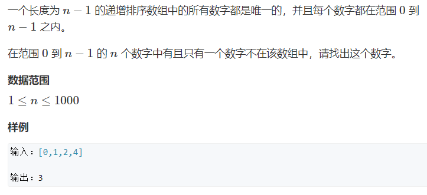

#### 题解

**(二分) O(logn)**

这道题目给定的是递增数组，假设数组中第一个缺失的数是 x，那么数组中的数如下所示；
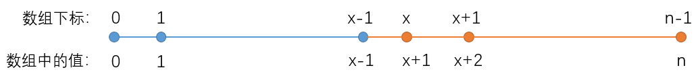

从中可以看出，数组左边蓝色部分都满足`nums[i] == i`，数组右边橙色部分都不满足`nums[i] == i`，因此我们可以二分出分界点 x 的值。

另外要注意特殊情况：当所有数都满足`nums[i] == i`时，表示缺失的是 n。

> 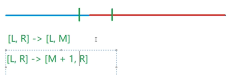

**时间复杂度分析**

二分中的迭代只会执行 O(logn) 次，因此时间复杂度是 O(logn)。

```cpp
class Solution {
public:
    int missingNumber(vector<int>& nums) {
    //if (nums.empty()) return 0;
    sort(nums.begin(), nums.end());
    int l = 0, r = nums.size() - 1;
    
    while (l < r) {
        int mid = l + r + 1 >> 1;
        if (nums[mid] != mid) r = mid - 1;
        else l = mid; 
    }
    if (nums[r] == r) r++;
    return r;
    }
};
```


### 57.数组中数值和下标相等的元素

#### 题目

>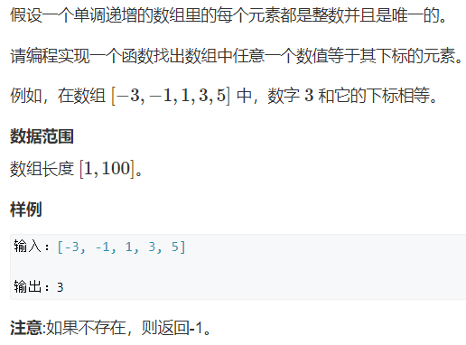

#### 题解

**(二分) O(logn)**

经分析，下面的等式成立，所以推出{ nums[i] - i }是个单调序列，

单调递增 (非严格单调，严格单调中每个元素一定比前一个元素大，单调只是大于等于)，

可以使用二分来查找等于 0 的元素。

> 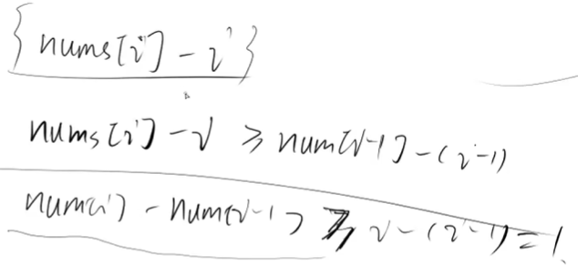

```cpp
class Solution
{
public:
    int getNumberSameAsIndex(vector<int>& nums)
    {
        int l = 0, r = nums.size() - 1;
        while (l < r)
        {
            int mid = l + r >> 1;
            if (nums[mid] - mid >= 0) r = mid;
            else l = mid + 1;
        }
        if (nums[r] - r == 0) return r;
        return -1;
    }
};
```


### 58.二叉搜索树的第k个节点

#### 题目

> 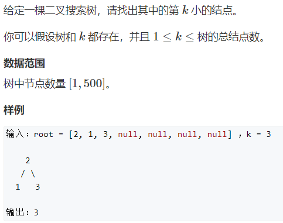

#### 题解

==二叉搜索树的中序遍历就是递增的顺序==

按照中序遍历（左 根 右），每遍历一个点就k--，k减到0即为答案。

时间复杂度：O(n)

> 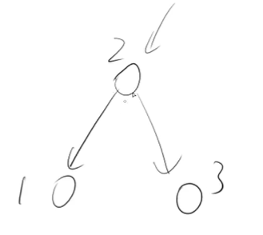

```cpp
/**
 * Definition for a binary tree node.
 * struct TreeNode {
 *     int val;
 *     TreeNode *left;
 *     TreeNode *right;
 *     TreeNode(int x) : val(x), left(NULL), right(NULL) {}
 * };
 */
class Solution 
{
public:
    TreeNode* ans;
    
    TreeNode* kthNode(TreeNode* root, int k)
    {
    	dfs(root, k);
        return ans;
    }
    void dfs(TreeNode* root, int &k) 
    {
        if (!root) return;
        dfs(root->left, k);
        k--;
        if (!k) 
            ans = root;
        else dfs(root->right, k);  //已优化，加特判，剪枝，这样就不必非要遍历右子树，找到答案，直接返回
    }
};
```


### 59.二叉树的深度

#### 题目

> 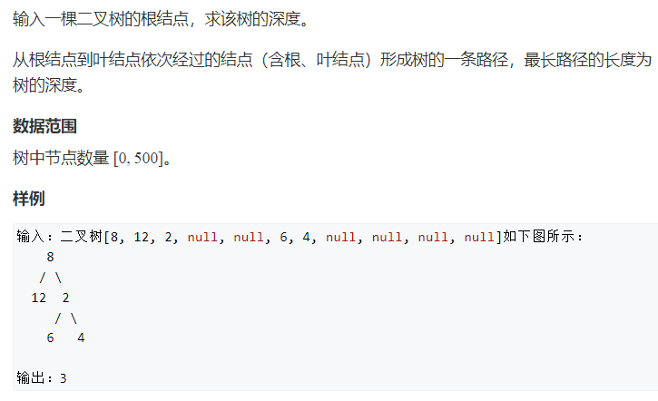

#### 题解

由于树是递归定义的，所以二叉树的题一般考虑递归算法。

二叉树的最大深度为 `max {左子树的最大深度，右子树的最大深度} + 1`

```cpp
class Solution 
{
public:
    int treeDepth(TreeNode* root) 
    {
        if (!root) return 0;
        return max(treeDepth(root->left), treeDepth(root->right)) + 1;
    }
};
```


### 60.平衡二叉树

#### 题目

> 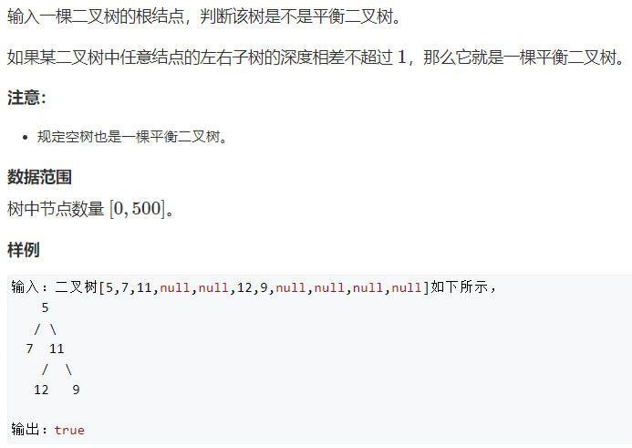

#### 题解

平衡二叉树：对任意节点而言，左右子树的最多深度之差不超过1。

在上一题的基础上，附加判断左右子树的深度之差是否大于1。

```cpp
class Solution 
{
public:
    bool ans = true;
    bool isBalanced(TreeNode* root) 
    {
        dfs(root);
        return ans;
    }
    int dfs(TreeNode* root)
    {
        if (!root) return 0;
        int left = dfs(root->left), right = dfs(root->right);
        if (abs(left - right) > 1) ans = false;
        return max(left, right) + 1;
    }
};
```


### 61.数组中只出现一次的两个数字

#### 题目

> 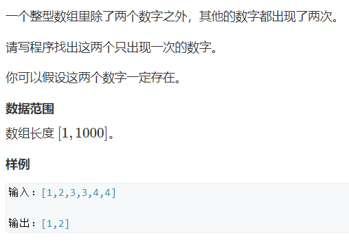

#### 题解

异或运算可以找到只出现一次的数。把所有的数异或一遍，相同的两个数都会变为0，只剩下只出现一次的数。

> 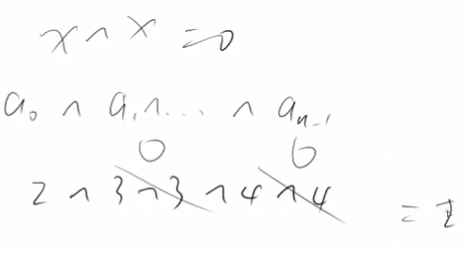

异或

> 如果a、b两个值不相同，则异或结果为1。如果a、b两个值相同，异或结果为0。
>
> 异或也叫半加运算，其运算法则相当于不带进位的二进制加法：二进制下用1表示真，0表示假，则异或的运算法则为：0⊕0=0，1⊕0=1，0⊕1=1，1⊕1=0（同为0，异为1），这些法则与加法是相同的，只是不带进位。

解题思路：

1. 异或所有数字，得到 x^y (不等于 0)

   > 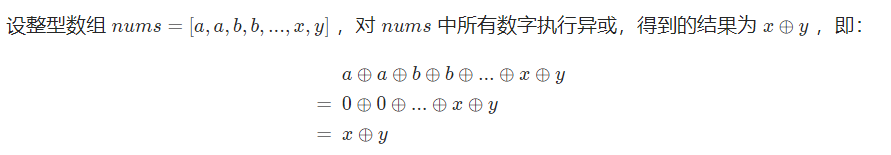

2. 根据如下操作，将数分为两个集合，第 k 位为 1 的集合和第 k 位不是 1 的集合

   > 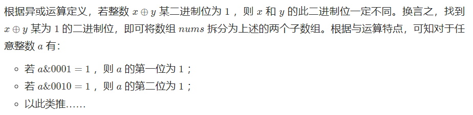

3. 其中 x y 分别在这两个集合，且相同的元素是在同一个集合里面

4. 于是将其转化成了求重复数字中的单个数值的问题

时间复杂度：O(n) ,  异或第一遍是 O(n) , 划分成两个集合 分别异或 也是 O(n)。

```cpp
class Solution 
{
public:
    vector<int> findNumsAppearOnce(vector<int>& nums)
    {
        int sum = 0;
        for (auto x : nums) sum ^= x;
        int k = 0;
        while (!(sum >> k & 1)) k++; //(sum >> k & 1) 判断第k位是否是1
        int first = 0;
        for (auto x : nums)
            if (x >> k & 1)  //如果第k位为1
                first ^= x;
        return vector<int>{first, sum ^ first};  //两次异或运算
    }
};
```


### 62.数组中唯一只出现一次的数字

#### 题目

> 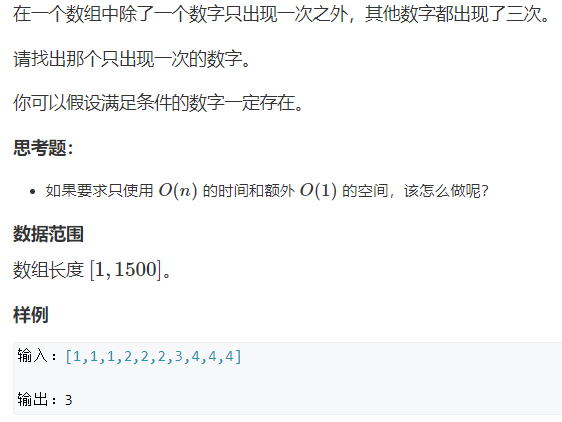

#### 题解

题目要求O(1)空间，开很大的哈希表不满足要求。

**算法1**

计算二进制下的每一位1的个数，最后把模3为1的位（由于其他数字都出现了3次，模3为1代表答案数字此位为1），组合成一个数。

时间复杂度：O(32n) ，但是由于`32 > logn` , 所以` 32n > nlogn` ，即这题的时间复杂度为O(n log n )。

```cpp
class Solution 
{
public:
    int findNumberAppearingOnce(vector<int>& nums) 
    {
        int ans = 0;
        for (int i = 31; i >= 0; --i) 
        {
            int cnt = 0;
            for (int x : nums)
                if (x >> i & 1) cnt++;  //左右移优先级大于 &
           	//下面过程是ans每次都左移1位（乘2），如果此位为1则再加1，一共执行32次。
            if (cnt % 3 == 1)
                ans = (ans << 1) + 1;  //这里加减的优先级大于左移右移
            else
                ans = ans << 1;
        }
        return ans;
    }       
};
```

**算法2**

`& | ~ ^` 这四种位运算在运算时，对于二进制的每一位运算都是独立的，

且计算机对一个数二进制的32位进行判断时，是只算一次运算的(时间复杂度为O(1)，而非32次循环)。

即，使用位运算比普通循环（依次循环判断每一位）快32倍。

我们目的要找出x的哪些位为1。

核心思想：**状态机**。(靠经验或者直觉去猜题目的解题方法)

1. 找到规律，遇到三个1就变成循环，如果遇上0为自环。

2. 状态机，(0, 0) 遇到1变为 (1, 0) , 再遇到 1 变为 (0, 1) ，再遇到 1 就循环回去。

3. 当把所有的数都过一遍，如果模3为1，则到 (1, 0) 状态。

4. 最后，ones这位上存的就是模3为1的数。

   >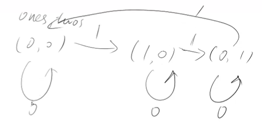

推广：所有 一个数出现 1 次，其他数出现 k 次的情况，可构造长度为k的状态机。

> 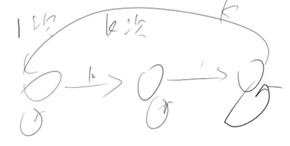

```cpp
class Solution 
{
public:
    int findNumberAppearingOnce(vector<int>& nums) 
    {
        int ones = 0, twos = 0;
        for (auto x : nums) 
        {
            ones = (ones ^ x) & ~twos;
            twos = (twos ^ x) & ~ones;
        }
        return ones;
    }        
};
```

 

### 63.和为S的两个数字

#### 题目

>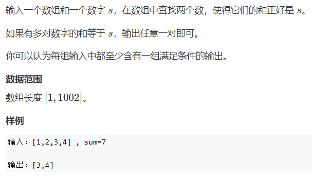

#### 题解

暴力算法：O(n^2^)

排序，双指针扫描：O(logn)

优化：O(n)，通过哈希表判断，来省掉一层循环

```cpp
class Solution 
{
public:
    vector<int> findNumbersWithSum(vector<int>& nums, int target) 
    {
        unordered_set<int> hash;
        for (int i = 0; i < nums.size(); ++i) 
        {
            if (hash.count(target - nums[i])) //通过哈希表判断，来省掉一层循环
                return vector<int>{target - nums[i], nums[i]};
            	//vector<int>({1, 2, 3, 4}),构造时小括号可以省略
          	hash.insert(nums[i]);
        }
        return vector<int>();  //以防万一
    }
};
```


### 64.和为S的连续正数序列

#### 题目

> 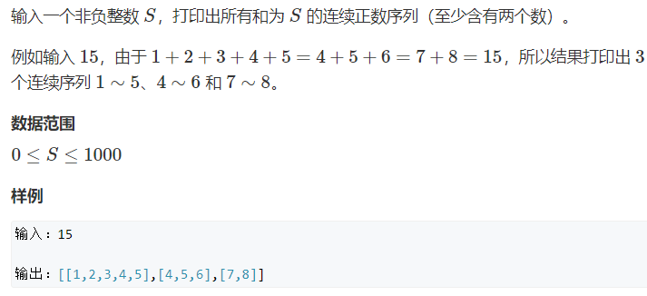

#### 题解

**(双指针) O(n)**

由于题目要求是正整数序列，不含0和负数，所以存在单调性，i 往后移， j 也得往后移，两个指针，每个指针最多走n步，时间复杂度为 O(n)

1. 设置两个指针 `i` 和`j`，分别指向连续正数序列的起始和终止
2. 用`s`表示当前连续正数序列的和，即`s=i+(i+1)+…+j`
3. 以 `i` 递增的方式遍历整个序列 `(1到n)`，代表查找以`i`开头的时候结尾`j`应该是多少。当`s<sum`时 `j` 应该往后移动，当`s=sum`时满足题意，当`s>sum`时，尾指针不动，头指针往后移。
4. 注意上述遍历过程中，`s=sum`的情况下不需要把`j`往前移动，原因是当进入下一个循环前`s=s-i`，即从`(i+1)`到 `j` 的和肯定小于 `sum`。

> 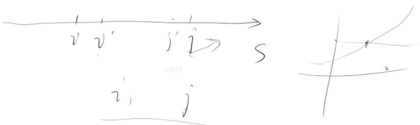

```cpp
class Solution 
{
public:
    vector<vector<int>> findContinuousSequence(int sum) 
    {
        vector<vector<int>> res;
        for (int i = 1, j = 1, s = 1; i <= sum; i++) //正整数序列，从1开始
        {
            while (s < sum)  //当s<sum时，尾指针往后移
                s += ++j;  //++j, s += j; 逗号运算符，从左到右运算  
            if (s == sum && j > i)  //找到符合的序列，加入答案
            {
                vector<int> line;
                for (int k = i; k <= j; k++) line.push_back(k);
                res.push_back(line);
            }
            s -= i; //头指针往后移
        }
        return res;
    }
};
```


### 65.翻转单词顺序

#### 题目

> 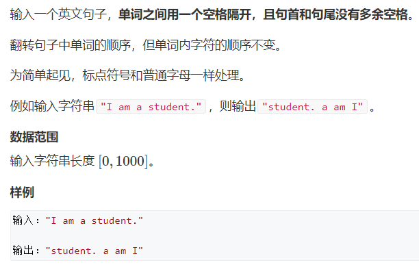

#### 题解

如果直接做不好做，可以将一个操作分解为几个操作。

1. 翻转整个句子
2. 翻转每个单词

时间复杂度：O(n) , 空间复杂度：O(1)

【补充】reverse函数用于反转在==[first,last)==范围内的顺序==（包括first指向的元素，不包括last指向的元素）==

```cpp
class Solution
{
public:
    string reverseWords(string s)
    {
        //翻转句子
        //for (int i = 0, j = s.size() - 1; i < j; i++, j--) swap(s[i], s[j]);
        reverse(s.begin(), s.end());
        //经典写法，找出每一段
        for (int i = 0; i < s.size(); i++)
        {
            int j = i;
            while (j < s.size() && s[j] != ' ') j++;
            reverse(s.begin() + i, s.begin() + j);
            i = j;  //重点
        }
        return s;
    }
};
```


### 剑指offer 58 - I 翻转单词顺序 - 变体

#### 题目

力扣题目要求给定单词间会出现多个空格，但是答案只能输出一个空格。

> 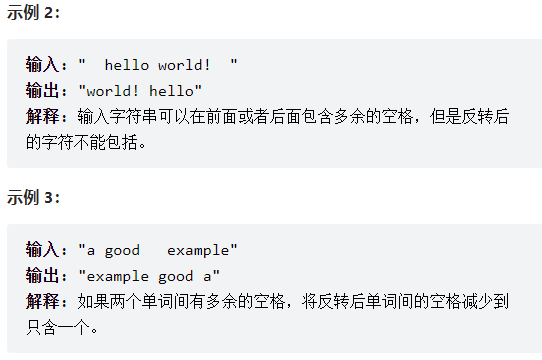

#### 题解

**算法1 - 上题基础改进**

1. 去除字符串两端空格
2. 翻转整个句子
3. 翻转每个单词（有多个空格时，只保留一个空格）

【补充】`erase()函数`

erase函数的原型如下：

（1）`string& erase(size_t pos = 0, size_t n = npos);`

（2）`interator erase(iterator position);`

（3）`iterator erase(iterator first, iterator last);`

有三种用法：

（1）`erase(pos, n);` 删除从pos开始的n个字符，例如erase( 0, 1)，删除0位置的一个字符，即删除第一个字符。

（2）`erase(position);` 删除position处的一个字符（position是个string类型的迭代器）。

（3）`erase(first，last);`删除从first到last之间的字符（first和last都是迭代器）。

```cpp
class Solution
{
public:
    string reverseWords(string s)
    {
        int i = 0;
        while (i < s.size() && s[i] == ' ') i++;  //计算行首空格数
        int j = s.size() - 1;
        while (j >= 0 && s[j] == ' ') j--;  //计算除去行尾空格剩下字符个数
        s = s.substr(i, j - i + 1);  //将字符串前后空格筛掉
       
        reverse(s.begin(), s.end()); 
        //经典写法，找出每一段
        for (int i = 0; i < s.size(); i++)
        {
            int j = i;
            //由于reverse是左必右开，所以将j定位到单词后面的空格
            while (j < s.size() && s[j] != ' ') j++; 
            reverse(s.begin() + i, s.begin() + j);
            //将单词后面多余一个的空格删掉
            while (j < s.size() && s[j] == ' ' && s[j + 1] == ' ') s.erase(j, 1);
            i = j;  //重点，后面重新进入for循环时，i会++指向下一个单词的首字母
        }
        return s;
    }
};
```

**算法2 - 双指针**

1. 倒序遍历字符串 s ，记录单词左右索引边界 i , j 

2. 每确定一个单词的边界，则将其添加至单词列表 res 
3. 最终，将单词列表拼接为字符串，并返回即可。

```cpp
class Solution {
public:
    string reverseWords(string s) {
        string res;
        if (s.empty()) return res;
        int right = s.size() - 1;
        
        while (right >= 0){
            //从后往前寻找第一字符
            while (right >= 0 && s[right] == ' ') right--;
            if(right < 0) break;

            //从后往前寻找第一个空格
            int left = right;
            while (left >= 0 && s[left] != ' ' ) left--;

            //添加单词到结果
            res += s.substr(left + 1, right - left);
            res += ' ';

            //继续往前分割单词
            right = left;
        }
        //去除最后一个字符空格
        if (!res.empty()) res.pop_back();
        return res;
    }
};
```


### 66.左旋转字符串

#### 题目

> 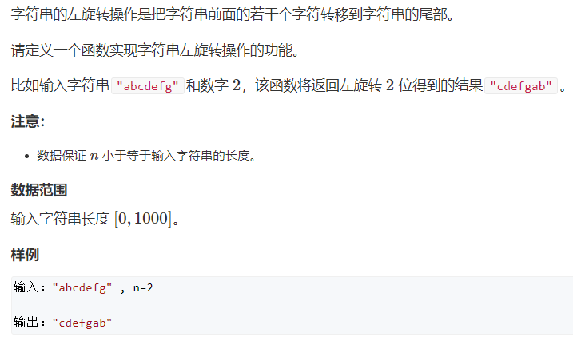

#### 题解

直接做不好做，通过几次操作完成。

1. 先把整个字符串翻转
2. 再把前一部分 n - k 翻转，后一部分 k 个翻转。

时间复杂度：O(1) ，空间复杂度：O(n)

```cpp
class Solution
{
public:
    string leftRotateString(string str, int n)
    {
        reverse(str.begin(), str.end());
        reverse(str.begin(), str.begin() + str.size() - n);
        reverse(str.begin() + str.size() - n, str.end());
        return str;
    }
};
```


## week 7

### 67.滑动窗口的最大值

#### 题目

>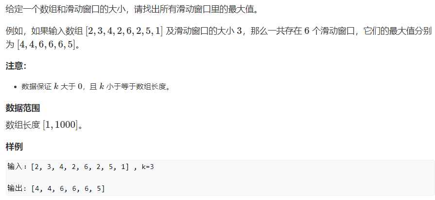

#### 题解

**(单调队列) O(n)**

首先，最直接的做法当然是模拟滑动窗口的过程，每向右滑动一次都遍历一遍窗口内的数字找最大的输出，这样的复杂度是O(kn)，我们可以考虑优化一下。

窗口向右滑动的过程实际上就是将处于窗口的第一个数字（最左侧数字）删除，同时在窗口的末尾（最右侧）添加一个新的数字，这就可以用**双向队列（双端数组deque）**来模拟，**每次把尾部的数字弹出，再把新的数字压入到头部，然后找队列中最大的元素即可。**

为了更快地找到最大的元素，我们可以**在队列中只保留那些可能成为窗口最大元素的数字，去掉那些不可能成为窗口中最大元素的数字。**考虑这样一个情况，如果队列中进来一个较大的数字，那么队列中比这个数更小的数字就不可能再成为窗口中最大的元素了，因为这个大的数字是后进来的，一定会比之前早进入窗口的小的数字要晚离开窗口，那么那些早进入且比较小的数字就“永无出头之日”，所以就可以弹出队列。

于是我们维护一个**双向单调队列**，==队列放的是元素的下标==。我们假设该双端队列的**队头是整个队列的最大元素所在下标**，**至队尾下标代表的元素值依次降低**。

1. 初始时单调队列为空。随着对数组的遍历过程中，每次插入元素前，首先需要看队头是否还能留在队列中，**如果队头下标距离i超过了k，则应该出队。**
2. 同时需要维护队列的单调性，如果nums[i]大于或等于队尾元素下标所对应的值，则当前队尾再也不可能充当某个滑动窗口的最大值了，故需要队尾出队。
3. **始终保持队中元素从队头到队尾单调递减。**依次遍历一遍数组，每次队头就是每个滑动窗口的最大值所在下标。

时间复杂度分析：每个元素最多入队出队一次，复杂度为O(n)

> 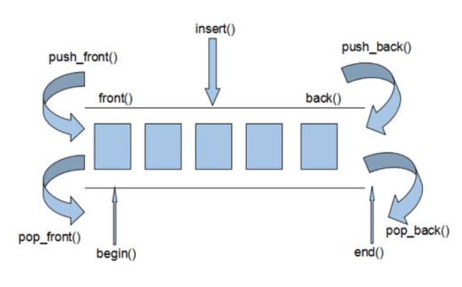

```cpp
class Solution
{
public:
    vector<int> maxInWindows(vector<int>& nums, int k)
    {
        vector<int> res;
        deque<int> q;
        for (int i = 0; i < nums.size(); i++)
        {	//判断队头是否需要出队
        	if (q.size() && q.front() <= i - k) 		
                q.pop_front();
            //维护队列单调性
            //如果新加入的数大于或等于队尾元素下标所对应的值，则当前队尾再也不可能充当某个滑动窗口的最大值了，故需要队尾出队。
            while (q.size() && nums[q.back()] <= nums[i]) 
                q.pop_back();
         	//如果新加入的数小，则正常放入队列的队尾
            q.push_back(i);
            //i>=k-1,表示可以作为一个滑动窗口，将队头作为当前滑动窗口的最大值放入答案数组
            if (i >= k - 1) res.push_back(nums[q.front()]);
        }
        return res;
    }
};
```


### 剑指offer 59 II 队列的最大值

#### 题目

> 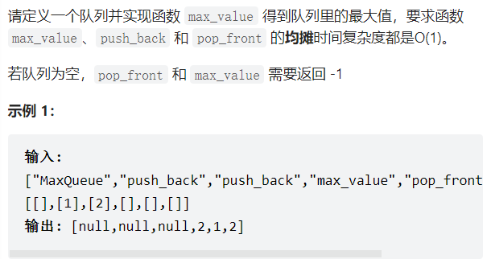

#### 题解

**维护一个单调的双端队列**

按照上题的思路：从队列尾部插入元素时，我们可以提前取出队列中所有比这个元素小的元素，使得队列中只保留对结果有影响的数字。这样的方法等价于要求维持队列单调递减，即要保证每个元素的前面都没有比它小的元素。

**复杂度分析**

- 时间复杂度：O(1)（插入，删除，求最大值）
  删除操作于求最大值操作显然只需要 O(1) 的时间。
  而插入操作虽然看起来有循环，做一个插入操作时最多可能会有 n 次出队操作。但要注意，由于每个数字只会出队一次，因此对于所有的 n 个数字的插入过程，对应的所有出队操作也不会大于 n 次。因此将出队的时间均摊到每个插入操作上，时间复杂度为 O(1)。
- 空间复杂度：O(n)，需要用队列存储所有插入的元素。

```cpp
class MaxQueue {
    queue<int> q;
    deque<int> d;
public:
    MaxQueue() {}
    
    int max_value() {
        if (d.empty())
            return -1;
        return d.front();
    }
    
    void push_back(int value) {
        while (!d.empty() && d.back() < value) 
            d.pop_back();
        d.push_back(value);
        q.push(value);
    }
    
    int pop_front() {
        if (q.empty())
            return -1;
        int ans = q.front();
        if (ans == d.front())
            d.pop_front();
        q.pop();
        return ans;
    }
};
```


### 68.骰子的点数

#### 题目

> 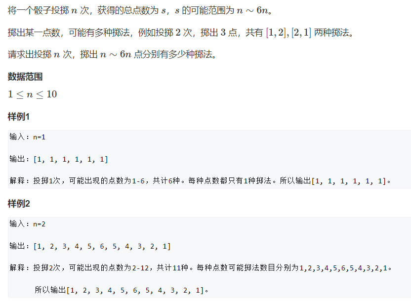

#### 题解

**算法1**

(DFS、暴力搜索)  深度优先遍历，枚举每一种做法，超时

1. DFS跟动规一样，注重3点：

   > - 状态的表示，也就是状态的定义。
   > - 按照什么样的顺序来计算这个状态
   > - 边界情况，**最后一次**掷色子的情况，分为6类

2. `dfs(n, s)`表示一共投了`n`次色子，总和是`s`的情况下，方案数是多少。

3. `dfs()`表示的就是**答案**，也就是要求的东西。

**时间复杂度：**O(n!)

```cpp
class Solution
{
public:
    vector<int> numberOfDics(int n)
    {
        vector<int> res;
        for (int i = n; i <= n * 6; i++) //最小点数为n,最大点数为6n		
            res.push_back(dfs(n, i));
        return res;
    }
    int dfs(int n, int sum)
    {
        if (sum < 0) return 0;
        if (n == 0) return !sum; 
        //不是合法方案，返回非sum，(!真) = 0, (!0) = 1
        //意思就是，如果n为0的时候sum也是0，则为一种合法方案，返回1
   		//如果n为0的时候sum不为0，则不是一种合法方案，返回0
        int res = 0;
        for (int i = 1; i <= 6; i++)
            res += dfs(n - 1, sum - i);
        return res;
    }
};
```

**算法2**

(线性DP)

1. DP与DFS类似，也要考虑**状态表示**，**状态计算**，和**最后的边界**情况。

   > 只不过DP对于同样的状态只会算一次，之后就不会再算第二遍了，避免很多重复计算，将DFS指数级别的复杂度降到多项式级别。

2. `f[i][j]`表示前 i 次掷色子，总和是 j 的方案数。

3. 边界就是最后一次的情况，分6类，不同的类对应不同的结果。

4. 三重 for 循环中，投掷1次，就有6种可能的点数，投掷2次，就有12种可能的点数，所以投掷 n 次，就有 6n 种可能的点数。所以在第2重循环中，`j <= i * 6`，因为可能还没到第 n 次，总数 j 也不会到 6n 个。

5. 最后一重循环，因为最后的模型是`f[i][j] += f[i - 1][j - k]`。也就是 i 次中，投出 1 次后，变成 `i - 1` 次，总和从 j 变到 `j - k` 后剩余的方案数。因为是`j - k`，不能越界，所以`j >= k`，所以`k = min(j, 6)`，可能前期 j 还没有枚举到6，那么 k 就不能取到6。

6. 最后我们将计算好的答案放在res中， `f[n][i]`，`i = n ~ 6n`，表示投掷n次后，总和分别为`n~6n`的所有方案数。

时间复杂度：O(n^2^)

**状态如何去计算：(适用于DFS和DP)**

所有方案的集合直接算不好算，我们要按照某种条件，把它划分成更小的集合（若干个不相交的集合），

一种划分方法就是枚举一下最后一次骰子置的点数是多少，按照最后一次的情况划分成6个不相交集合，划分如下，

> 最后一次是1点的时候所有方案的集合，
>
> 最后一次是2点的时候所有方案的集合，
>
> ......
>
> 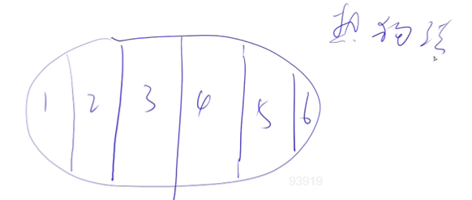

```cpp
class Solution
{
public:
    vector<int> numberOfDice(int n)
    {
        vector<vector<int>> f(n + 1, vector<int>(n * 6 + 1));  //DP的状态表示，从1开始枚举到n，即(n+1)；(n*6+1)为总方案数，将f[0][0] = 1的状态另加上
        f[0][0] = 1; //当一个骰子没有投，总和只有0这1种方案
        for (int i = 1; i <= n; i++)  //循环次数
            for (int j = 1; j <= i * 6; j++) //循环总和
                for (int k = 1; k <= min(j, 6); k++)//枚举最后一次的点数是多少
                    f[i][j] += f[i - 1][j - k];
        vector<int> res;
        for (int i = n; i <= n * 6; i++) res.push_back(f[n][i]);
        return res;
        /*
        力扣要求用一个浮点数数组返回答案，其中第 i 个元素代表这 n 个骰子所能掷出的点数集合中第 i 小的那个的概率
        int sum = 0;
        vector<double> res_d;
        for (auto x : res) {
            sum += x;
        } 
        for (auto x : res) {
            res_d.push_back((double)x / (double)sum);
        }   
        return res_d;
        */
    }
};
```


### 69.扑克牌的顺子

#### 题目

> 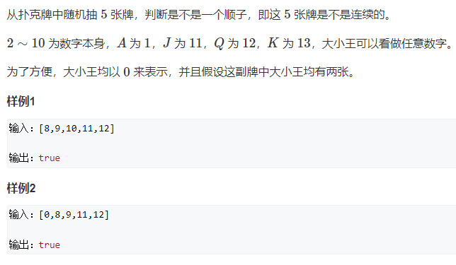

#### 题解

能组成顺子需要满足的两个条件是：

1. 除了0以外不能出现两个相同的数字；
2. **排序后两个相邻数字的差值不能大于0的个数。**

解题步骤：

1. 排序
2. 删掉行首的0
3. 判断是否有重复
4. 判断最大最小值间的差值

```cpp
class Solution
{
public:
    bool isContinuous(vector<int>& nums)
    {
        if (nums.empty()) return false; //判空
        sort(nums.begin(), nums.end()); //排序
        int k = 0;
        while (!nums[k]) k++;  //处理行首0
        for (int i = k + 1; i < nums.size(); i++)  //判重
            if (nums[i] == nums[i - 1])
                return false;
        return nums.back() - nums[k] <= 4;  //判断排序后的最大最小值间差值（因为已经判过重了，这样可行）
    }
};
```


### 70.圆圈中最后剩下的数字

#### 题目

> 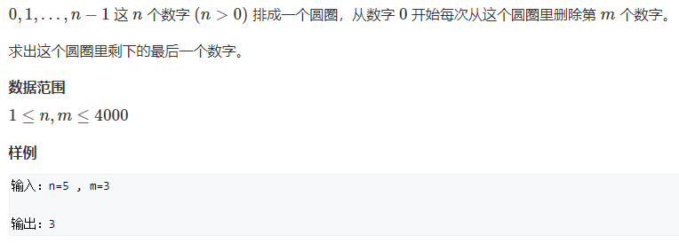

#### 题解

**约瑟夫问题 / 枪毙问题**

**算法1**

**(链表模拟) O(mn)**

本题就是有名的约瑟夫环问题。我们可以环形列表来模拟，每次从这个列表中删除第m个元素，一直到列表最后剩下一个元素为止。

考虑用STL中`std::list`**（双向循环链表，并非环形链表）**来模拟这个环形列表，由于list并不是一个环形的结构，因此每次跌代器扫描到列表末尾的时候，要记得把跌代器移到列表的头部。这样就是按照一个圆圈的顺序来遍历这个列表了。

由于我们需要一个有n个结点的环形列表来模拟这个删除的过程，因此内存开销为O(n)。而且这种方法每删除一个数字需要m步运算，总共有n个数字，因此总的时间复杂度是O(mn)。

**时间复杂度分析：**O(mn)

> 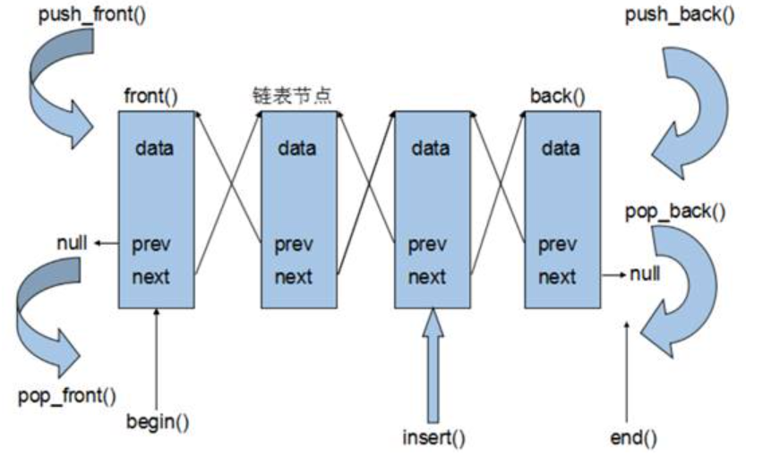

```cpp
#include <list>
class Solution
{
public:
    int lastRemaining(int n, int m)
    {
        list<int> nums;
        for (int i = 0; i < n; i++) nums.push_back(i);
        auto it = nums.begin();
       
        while (nums.size() > 1)
        {
            int k = m - 1;  //用来找到第m个数
            while (k--)
            {
                it++; //迭代器指向下一个结点
                if (it == nums.end()) it = nums.begin();//将迭代器移到开头实现模拟环形列表
            }
            it = nums.erase(it); //删除第m个元素，erase()函数返回下一个数据的位置
            if (it == nums.end()) it = nums.begin();
        }
        return nums.front();
    }
};
```

**算法2**

**(推导递推公式) O(n)**

要得到 n 个数字序列最后剩下的数字，只需要得到 n-1 个数字序列最后剩下的数字，并可以依此类推。

当 n=1 时，也就是序列中开始只有一个数字0，那么很显然最后剩下的数字就是0。

结合下面分析，得到递推公式：

- `当n = 1时，f(n, m) = 0`
- `当n > 1时，f(n, m) = [f(n - 1, m) + m] % n`

因此就可以递归求解，复杂度为O(n)。

> 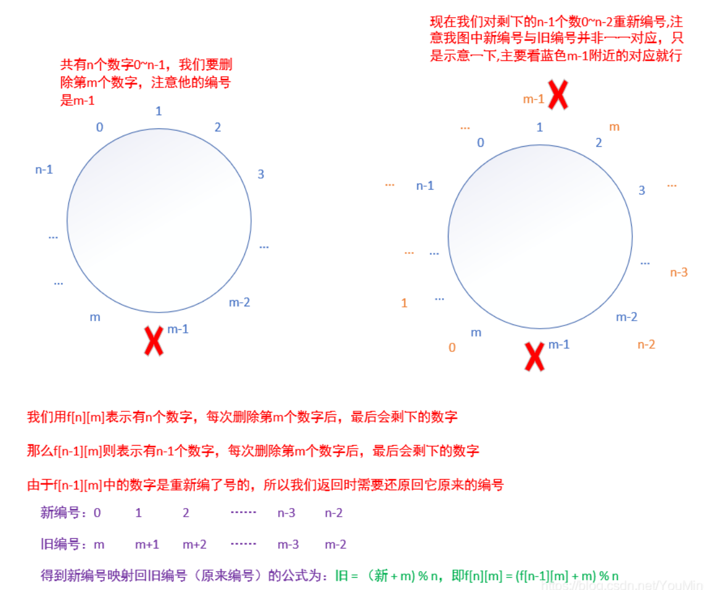

```cpp
class Solution
{
public:
	int lastRemaining(int n, int m)
    {
        if (n == 1) return 0;
        return (lastRemaining(n - 1, m) + m) % n;
    }
};
```


### 71.股票的最大利润

#### 题目

> 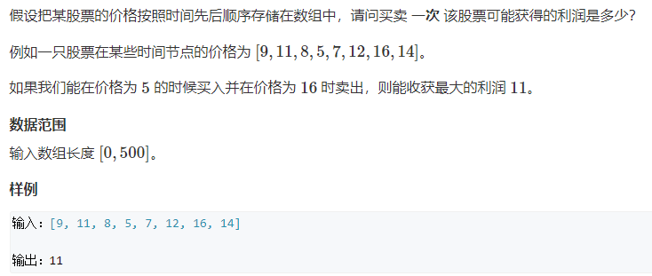

#### 题解

由于只允许做一次股票买卖交易，枚举每一天作为卖出的日子，买入日子一定在卖出日子之前，为了获利最多，希望买入的日子的股票价格尽可能低。

解法：用`minv`记录当前最低的买入价格，用`res`记录当前最大利润，遍历更新这两项。

> 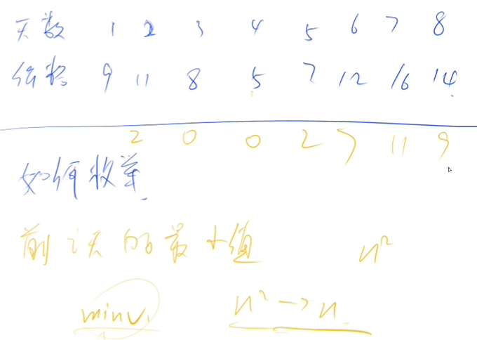

```cpp
class Solution
{
public:
    int maxDiff(vector<int>& nums)
    {
        if (nums.empty()) return 0;
        int res = 0;
        for (int i = 1, minv = nums[0]; i < nums.size(); i++)
        {
            //minv表示前i天的最小值，res表示前i天中出现的最大利润
            minv = min(minv, nums[i]);
            res = max(res, nums[i] - minv);
        }
        return res;
    }
};
```


### 72.求1+2+...+n

#### 题目

> 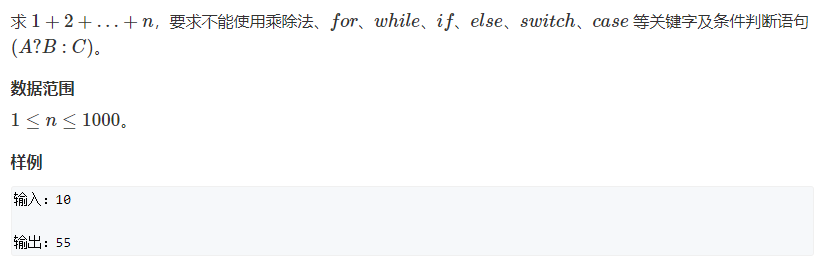

#### 题解

**算法1**

利用 `&&` 的短路原则

```cpp
class Solution
{
public:
    int getSum(int n)
    {
        int res = n;
        //if (!n) return res; (此时res = n = 0)
        n > 0 && (res += getSum(n - 1));
        return res;
    }
};
```

**算法2**

`(1+2+……+n) == (1……n的等差数列n项和) == (这个字符数组的大小除以2)`

sizeof 输出整个字符数组的大小，值等于 n * (n+1)  ，最后除以 2 ，

即为(1……n的等差数列n项和)。

```cpp
class Solution
{
public:
    int getSum(int n)
    {
        char a[n][n + 1];
        return sizeof(a) >> 1;
    }
};
```


### 73.不用加减乘除法做加法

#### 题目

> 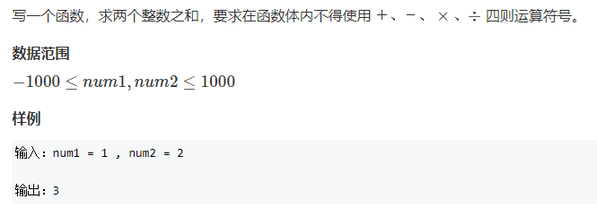

#### 题解

很容易想到通过**位运算**来解决问题。

以5+17=22为例，参考十进制加法：

1. 只做各位相加不进位运算，即得到12 

2. 做进位运算，即得到10

3. 把前面两个结果先相加，即得到22；

同样==二进制加法==也一样：

1. **两个整数做异或^，得到各位相加不进位的运算结果**；
2. **两个整数做与&，然后再左移一位，即得到进位的运算结果**；
3. **将上面两个结果相加，即重复步骤1,2，直至进位的运算结果为0**；

在计算机系统中，数值一律用 **补码** 来表示和存储。**补码的优势：** 加法、减法可以统一处理（CPU只有加法器）。因此，以上方法 **同时适用于正数和负数的加法** 。

时间复杂度 O(1) ： 最差情况下（例如 a = 0x7fffffff , b = 1 时），需循环 32 次，使用 O(1) 时间；每轮中的常数次位操作使用 O(1) 时间。

> 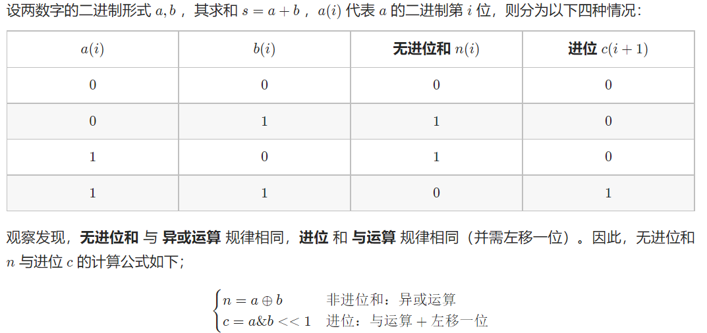

```cpp
class Solution
{
public:
    int add(int num1, int num2)
    {
        //因为不允许用+号，所以求出异或部分和进位部分依然不能用+号，所以只能循环到没有进位为止
        while (num2)
        {
            int sum = num1 ^ num2;//不进位的加法
            //保存进位值，下次循环用
            //leetcode的编译环境问题，负数不支持左移位，转换一下即可
            int carry = (unsigned int)(num1 & num2) << 1;
            num1 = sum;
            num2 = carry;
        }
        return num1;
    }
};
```


### 74.构建乘积数组

#### 题目

> 给定一个数组 A[0,1,…,n-1]，请构建一个数组 B[0,1,…,n-1]，**其中 B[i] 的值是数组 A 中除了下标 i 以外的元素的积**,  即 B[i]=A[0]×A[1]×…×A[i-1]×A[i+1]×…×A[n-1]。不能使用除法。
>
> 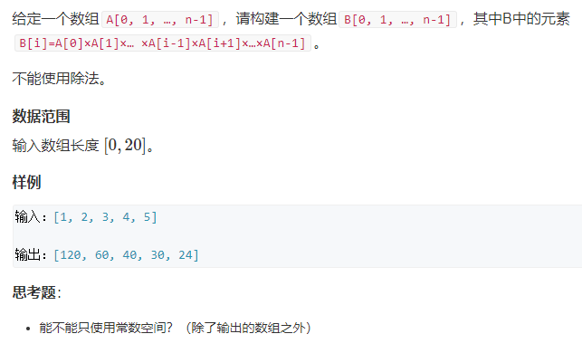

#### 题解

初始化：数组 B ，其中 B[0] = 1 ；辅助变量 tmp = 1 ；

1. 计算 B[i] 的 **下三角** 各元素的乘积，记为 tmp ，直接乘入 B[i] ；
2. 计算 B[i] 的 **上三角** 各元素的乘积，记为 tmp ，并乘入 B[i] ；
3. 返回 B 。

时间复杂度分析：需要遍历数组，复杂度为O(n)

> 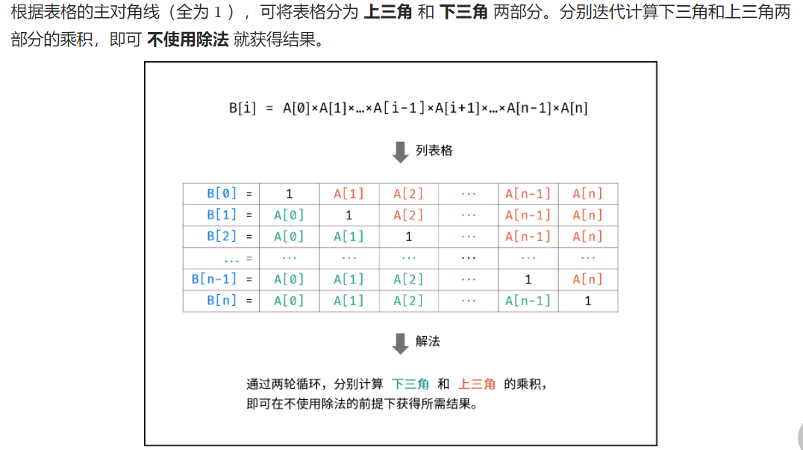

```cpp
class Solution
{
public:
     vector<int> multiply(const vector<int>& A)
     {
         if (A.empty()) return vector<int>();
         
         int n = A.size();
         vector<int> B(n);
         
         for (int i = 0, tmp = 1; i < n; i++)
         {
             B[i] = tmp;
             tmp *= A[i];
         }
         
         for (int i = n - 1, tmp = 1; i >= 0; i--) 
         {
             B[i] *= tmp;
             tmp *= A[i];
         }
         return B;
     }
};
```


### 75.把字符串转换成整数

#### 题目

> 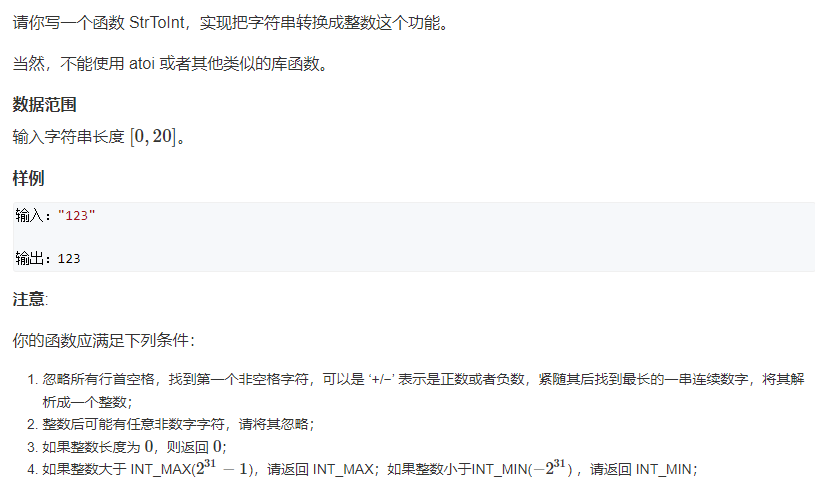

#### 题解

分享一个字符串处理的小技巧，不用每次判断下标索引是否越界，提升代码可读性与实用性：

**在字符串后面加上一个空字符`‘\0’`**，当下标指向`‘\0’`时，下标将不会继续前进（代入实际情况理解一下就好了），从而防止了下标越界。

```cpp
class Solution {
public:
    int strToInt(string str) {
        int k = 0;
        while (k < str.size() && str[k] == ' ') k++; //处理字符串前面的空格
        long long res = 0;

        int minus = 1; //正负数标志变量
        if (k < str.size())
        {
            if (str[k] == '-') minus = -1, k++;
            else if (str[k] == '+') k++ ;
        }
        while (k < str.size() && str[k] >= '0' && str[k] <= '9')
        {
            res = res * 10 + (str[k] - '0');
            if (res > 1e11) break;
            k ++ ;
        }
        res *= minus;
        if (res > INT_MAX) res = INT_MAX;
        if (res < INT_MIN) res = INT_MIN;
        return res;
    }
};
```


### 76.树中两个结点的最低公共祖先

#### 题目

> 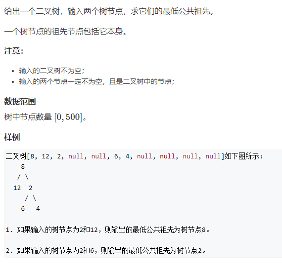

#### 题解

**(递归) O(n)**

**最近公共祖先的定义**：对于有根树 T 的两个结点 p、q，最近公共祖先表示为一个结点 x，满足 x 是 p、q 的祖先且 x 的深度尽可能大（离这两个点更近）（一个节点也可以是它自己的祖先）。

在左子树和右子树中分别递归查找这两个节点：

1. 如果两个节点分别位于当前节点的左子树和右子树，则最低公共祖先为当前节点（root）。
2. 若左子树中两个节点都找不到，说明最低公共祖先一定在右子树中。
3. 反之亦然。

**时间复杂度分析：**需要遍历树，复杂度为 O(n)

> 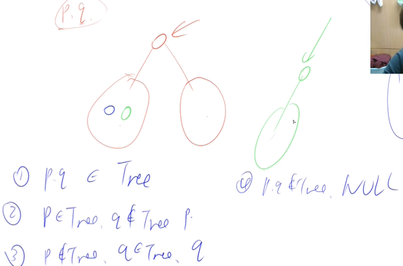

```cpp
/**
 * Definition for a binary tree node.
 * struct TreeNode {
 *     int val;
 *     TreeNode *left;
 *     TreeNode *right;
 *     TreeNode(int x) : val(x), left(NULL), right(NULL) {}
 * };
 */
class Solution {
public:
    TreeNode* lowestCommonAncestor(TreeNode* root, TreeNode* p, TreeNode* q) {
        if (!root) return NULL;
        if (root == p || root == q) return root;
        auto left = lowestCommonAncestor(root->left, p, q);
        auto right = lowestCommonAncestor(root->right, p, q);
        if (left && right) return root;
        if (left) return left;
        return right;
    }
};
```


### 2022.3.14  AcWing 第一遍

> 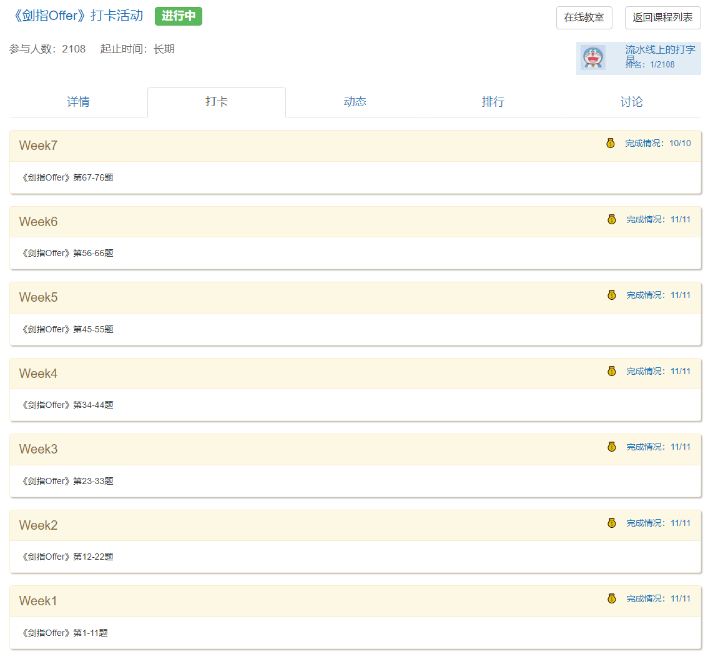

### 2022.4.15 LeetCode 第一遍

> 


