## 笔试输入输出写法 - HQ

[TOC]

------

#### 注意

- ==语法知识参考C++笔记中的 [C++基础语法 - AcWing - HQ](../2 - C++笔记/4. C++基础语法 - AcWing - HQ.md)==
- 

------

## 注意内容积累

#### 注意内容 - 最新补充

1. 输出换行  `puts("");`
2. scanf()
   - `char op[2];`
   - `scanf("%s%d%d", op, &a, &b);`    scanf()读字符串时会自动忽略空格和回车，如果输入的数据行末有空格等则会忽略
   - `scanf("%c", &a);`    scanf()会读入空格回车等字符
3. 输入输出问题
   - 输入的数据量多的时候，尽量用scanf()来读入，比cin快
   - `ios::sync_with_stdio(false)`作用是让cin提高读取速度，但不能再用scanf()

#### 注意内容

- 有些语言中 `(4/3)` 无法得到 `1.3333…`，建议在公式中使用 `(4/3.0)`
- **99%的评测器，会自动过滤掉最后一个回车和每一行结尾的空格**
- 当输出较多时，将`cin`和`cout`全部换成`printf`和`scanf`就会节约很多运行时间
- **==函数内比如`for(int i[100000];;)`定义的局部变量将存放在栈内，看编译器的设置，默认`1M`，如果超出会出现段错误等；如果将变量定义为全局变量放在函数外，则存放在堆内，取决于内存的大小。==**
- ==**在函数内定义的局部变量如果不进行初始化，则全部为随机值；而全局变量则定义后会默认初始化为0，无需主动初始化**==

#### 运算中的注意事项

- 取模只能对整数，小数不行
- `4 / 3 = 1`,  `4.0 / 3` 则为浮点数运算， `4 / 3.0` 也为浮点数运算
- 两个整型数相除，只将其中一个转换为`double`类型即可`(double)r / s 或者 1.0 * r / s`
- 不要将判断字符串长度放到循环判断中，否则会增加不必要的运算量`for (int i = 1, len = s.size(); i <= len / 2; i ++ )`

#### 算法小技巧

- **如果题目涉及到小数运算，可以先转换为整数，然后再同比缩小**

- `if (x == 0)` 可以简化写为 `if (!x)`

- `if (i % 2 != 0)` 可以简化写为 `if (i % 2)`

- `while (~a)` 等价于 `while (a != -1)`

- 程序遇到`return 0`就结束，所以可以在`for`中加入`return 0`来结束程序

- 注释快捷键 `ctrl+/` ，整体缩进 选中后`+tab` , 整体取消缩进 选中后`shift+tab`

- 常用的变量
  
  |            英文            |    含义    |
  | :------------------------: | :--------: |
  |            cnt             |    个数    |
  | flag， bool is_xxxx = true |    标志    |
  |            sum             |    求和    |
  |          position          |    位置    |
  |         max_value          |   最大值   |
  |           value            |   输入值   |
  |            temp            |   暂存值   |
  |          ans, res          |    答案    |
  |           dummy            | 虚拟头结点 |
  |            cur             |    游标    |
  |            str             |   字符串   |
  |                            |            |
  |                            |            |
  |                            |            |
  |                            |            |
  |                            |            |
  |                            |            |
  |                            |            |
  
  


## 语法基础积累

#### 头文件

- **万能头文件，包含所有头文件`#include <bits/stdc++.h>`**

  - 整理笔试时候常用的输入输出，可以使用

    ```cpp
    #include <bits/stdc++.h>
    ```

    来一次性输入所有的C++头文件包括：

    ```cpp
    #include <iostream>
    #include <cstdio>
    #include <fstream>
    #include <algorithm>
    #include <cmath>
    #include <deque>
    #include <vector>
    #include <queue>
    #include <string>
    #include <cstring>
    #include <map>
    #include <stack>
    #include <set>
    等等……
    ```

- ==`#include <cstdio>`==
  - `printf()`
  - `scanf()`
  - `puts()`
- `#include <iostream>`  //头文件更大一点 
  - `cin >>    cout <<`
  - `abs()` 求绝对值
  - `min(fig1, fig2)` 求最小值
  - `max(fig1, fig2)` 求最大值
- `#include <cmath>`
  - `sqrt()` 根号
  - `pow(2, 3)` 求2的3次方
- `#include <algorithm>`
  - `reverse(a, a + size);`    //翻转数组 a 的 0 到 size - 1
    - reverse函数用于反转在==[first,last)==范围内的顺序==（包括first指向的元素，不包括last指向的元素）==，reverse函数没有返回值
    - `for (int i = 0, j = size - 1; i < j; i ++ , j -- )  {swap(a[i], a[j]);}`
  - `swap(x, y);`   //交换两个值，变量可以是任意类型

#### 命名空间

- `using namespace std;`
- 如果不声明命名空间则需要在变量前加 `std::`
- 如果只用了 `scanf,printf` 则不需要再加`using namespace std;`

#### 变量类型

- 定义

  - `1e11=1*(10^11)=10^11=1000,0000,0000`
  - `int a, b = 2, c = b;`   //逗号运算符，从左到右计算
  - `float d = 1.5, e = 1, f = 1.235e2;`
  - `bool g = true, h = false;`
  - `char j = 'a', k = 'b';`
  - `long long l = 1231231LL;`   (加`LL`或`ll`代表是`long long`类型的整数)
    - **LL代表的意思是long long类型， 1LL是为了在计算时，把int类型的变量转化为long long类型，然后再赋值给long long类型的变量**
  - `long double m = 123.45;`

- 静态变量

  - ```cpp
    int output(void)
    {   //相当于在函数内部开了一个只有该函数能用的全局变量
        //函数内部的静态变量只会在第一次被调用的时候赋初值
        //没有赋初值则默认为0，与全局变量一样，且都存储在堆中
    	static int cnt = 0;
    }   	
    ```

- 布尔型 bool

  - `1byte`
  - `true` 真 1
  - `false` 假 0

- 字符型 char

  - `1byte`
  - 存储一个字符`'a'`或 `'\n'`

- 整型 int

  - `4byte`
  - `-2的31次方~2的31次方-1`
  - `-2147483648~2147483647`   共10位有效数字

- 浮点型 float (单精度浮点数，`6-7`位有效数字)

  - `4byte`
  - `123.5`    `1.235e2`

- 双精度浮点数 double (`15-16`位有效数字)

  - `8byte`
  - `%lf`

- long long 

  - `8byte`
  - `printf("%lld", a)`
  - `-2的63次方~2的63次方-1`
  - `long double`   (`18~19`位有效数字)

#### 输入输出

| 函数                   | 总结                                                         |
| ---------------------- | ------------------------------------------------------------ |
| cin>>                  | 遇到空格和换行自动停止读入，换行空格仍在缓存区中，下次读入自动跳过 读取后面的字符 |
| cin.get()              | 读入字符                                                     |
| getline(cin,str,delim) | 读取整行数据到 str 中 ,delim 分隔符                          |
| cin.getline(char*,int) | 接收字符串储存到 char * 中，长度为 n 可以接受空格            |
| char a; cin.get(a)     | a 中可以储存被 cin 丢弃的换行符                              |

- 输入 `cin >> a >> b;`  //把cin的值拿到a中，再拿到b中

- 输出 `cout << a + b << endl;`  //把a+b的值拿到cout中，再把endl（回车）拿到cout中
- 输入 `scanf("%f%f", &a, &b);`
  - ==在scanf()中，%c会读入空格，%d不会读入空格，cin >>也会过滤空格==
  - ==scanf("%d%d %c", a, b, c); 这样写空格不会被读入c（需要手动加空格过滤）==
  - ==scanf("%d%d\n%c", a, b, c); 这样写回车不会被读入c（需要手动加回车过滤）==
- 输出 保留1位和两位小数 `printf("%.1f %.2f\n", a + b, a * b);`
- 格式化输出
  - `printf("%5d", a)` 占用5个宽度，若不足则在前面补空格，若自身超过，则为原来长度，默认右对齐
  - `printf("%-5d", a)` 左对齐
  - `printf("%05d", a)` 将补空格改为补0
  - `printf("%5.2lf", a)` 保留2位小数，且一共占5位
  - 转义字符  `%% \\ \' \n`

#### 类型转换

- ==`float,double`转换为`int`时下取整==
  - `float 5.23` 转换为`int`时为`5`

#### 判断/循环

- 等于 `==`
- 不等于 `!=`
- else 就近原则，else和往上离他最近的if匹配
- **变量作用域，括号里面定义的变量只能在括号里面用，作用域只在括号内**
- while()是不断循环的if()

#### 条件表达式

- 与 `&&`
- 或 `||`
- 非 `!`
- 注意：短路原则，如果前面能决定整个式子的真假，则不会执行后面的式子

#### 求补码

- 先将负数取正，然后进行**取反+1**
  - -2取正为2，2的原码为0000 0010（正数的补码与原码一样）
  - 取反得到 1111 1101
  - +1 得到最终 -2 的补码为 `1111 1110`
- `~0 = -1`
  - `0 为 00000000` 
  - `~0 为 11111111`
- `~-1 = 0`   //负号和取反符号优先级相同，运算顺序从右到左
  - `-1 的原码为 10000001`
  - `-1 的反码为 11111110`    ==负数的反码为除符号位取反得反码，负数在计算机中用补码表示==
  - `-1 的补码为 11111111`


## 代码模板

#### C语言模板

```cpp
#include<stdio.h>

int main(void) 
{
    puts("Hello World!");
    return 0;
}
```

#### C++模板

```cpp
#include <iostream>
using namespace std;

int main() 
{
    std::cout << "Hello World!\n";
}
```

#### 读入字符串

```cpp
#include <cstdio>
#include <iostream>
using namespace std;
int main()
{
    string name;
    cin >> name;
    return 0;
}
```

#### 当输入0时结束的几种写法

==cin会有返回值, 读到文件结束符（EOF = -1）的时候会返回false停止==

==scanf()读到文件结束符时也会返回一个值，返回为-1==

```cpp
while(cin >> c){}  //当输入结束时停止
一：
int x;
while (true)
{
    cin >> x;
    if (!x) break;
    ....
}
二： // cin会有返回值, 读到文件结束符（EOF = -1）的时候会返回false停止
while(cin >> x && x)             //while (cin >> m >> n, m > 0 && n > 0)
{
    ....
}
三： // 逗号表达式， 逗号表达式的值等于最后一个数的值
while(cin >> x, x)
{
    ....
}
四： // scanf()读到文件结束符时也会返回一个值，返回为-1
while(scanf("%d", &x) ！= -1)      等价写法    while(~scanf("%d", &x))
{
    ....
}
```

#### 其他

（1）输入一个数字再加上空格间隔的数组：

```cpp
int num;
cin >> num;
int *arr = new int[len + 1]
for(int i = 0; i <= num; i++) {
    cin >> arr[i]; 
}
```

（2）需要多次输入形式重复的数据：

```cpp
while(cin >> k)
```

（3）对于不存在空格的字符数组：

```cpp
char str[30];
cin >> str;
```

（4）输入带有空格的字符数组：

```cpp
char str[30];
cin.getline(str, len); //读入整行数据，它使用回车键输入的换行符来确定输入结尾。
//cin.get(str,len);  //这个还会保留换行符
```

（5）输入字符串string

```cpp
string str;
getline(cin, str); 
```

（6）输入多个整数

```cpp
int a, b, c, d;
cin >> a >> b >> c >> d;
```

（7）具体应用：数组从小到大排列并去除重复项

- sort，将这组数字从小到大排列；
- unique，**将相邻且重复的数放到vector的尾部，然后返回指向第一个重复元素的迭代器**（需要注意的是，被放在尾部的数据有时会产生变化，所以不能继续使用了，需要废弃掉）；
- erase，擦除重复的数据

```cpp
#include <iostream>
#include <algorithm>
#include <vector>
using namespace std;

int main()
{
    vector<int> v;
    cout << "please input the number of vector's element" << endl;
    int number;
    cin >> number;
    for (int i = 0; i < number; i++)
    {
        int temp;
        cin >> temp;
        v.push_back(temp);   //在vector尾部加入一个数据
    }
    sort(v.begin(), v.end());
    v.erase(unique(v.begin(), v.end()), v.end());
    for (int i = 0; i < v.size(); i++)
    {
        cout << v[i] << " ";
    }
    return 0;
}
```

（8）输出不定量的行的字符串

```cpp
string str;
while(cin >> str)
```

（9）处理多行数组：

输入：

```cpp
1 2 3 4 5
2 3 4 5 6
```

方式一：

```cpp
vector<int> ls1;
vector<int> ls2;
int temp;
while(cin >> temp)
{
    ls1.push_back(temp);
    if(getchar() == '\n')
        break;
}
while(cin>> temp)
{
    ls2.push_back(temp);
    if(getchar() == '\n')
        break;
}
```

方式二：

```cpp
#include <iostream>
#include <sstream>
#include <vector>

string line1, line2;
getline(cin, line1);
getline(cin, line2);
istringstream iss1(line1), iss2(line2);
vector<int> a1, a2;
int t, p1 = 0, p2 = 0;
while(iss1 >> t) a1.push_back(t);
while(iss2 >> t) a2.push_back(t);
```

（10）最大值最小值所在函数库

```cpp
#include<limits.h>
```

（11）求set的交集并集差集

```cpp
需要包含库：
#include <iterator>
std::set<int> v1;
std::set<int> v2 ;
std::set<int> dest1;
std::set_union(v1.begin(), v1.end(),v2.begin(), v2.end(),std::back_inserter(dest1));         
```

（12）输出字符串s某段内容

```cpp
输出s从i开始，到i+n-1一共n个字符
s.substr(i, n)
```


## 练习题中的输入输出 - 牛客网

### 1. A + B

#### 题目

> 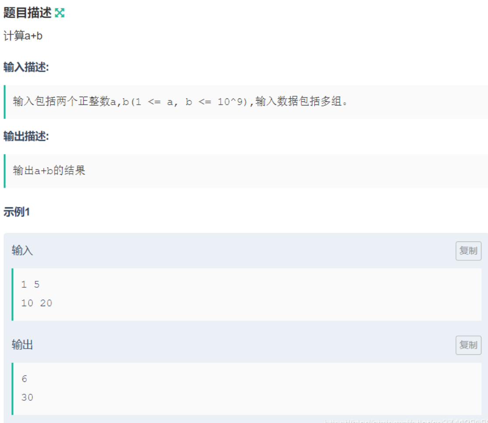

#### 题解

```cpp
#include <iostream>
using namespace std;

int main()
{
    int a, b;
    while (cin >> a >> b) {
        cout << a + b << endl;
    }
    return 0;
}
```


### 2. A + B

#### 题目

> 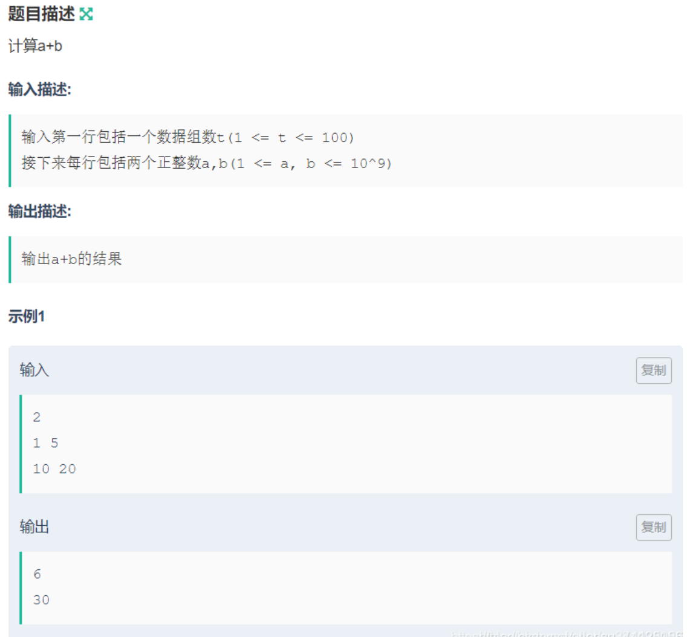

#### 题解

```cpp
#include <iostream>
using namespace std;

int main()
{
    int n, a, b;
    cin >> n;
    while (n--) {
        cin >> a >> b;
        cout << a + b << endl;
    }
    return 0;
}
```


### 3. A + B

#### 题目

> 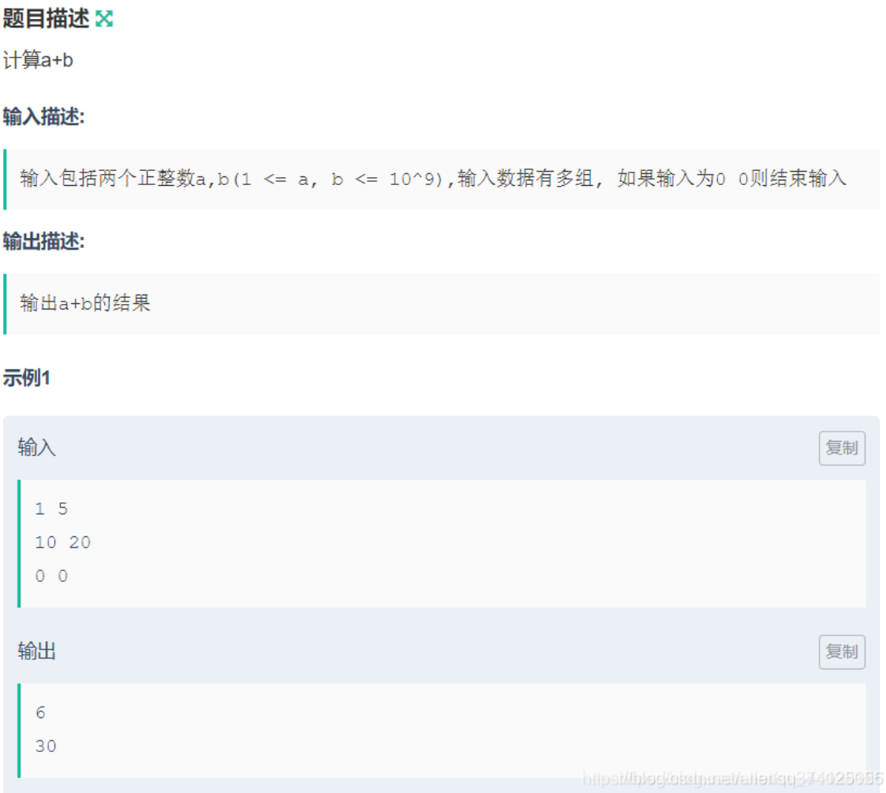

#### 题解

```cpp
#include <iostream>
using namespace std;

int main()
{
    int a, b;
    while (cin >> a >> b) {
        if (a == 0 && b == 0) break;
        cout << a + b << endl;
    }
    return 0;
}
```


### 4. A + B

#### 题目

> 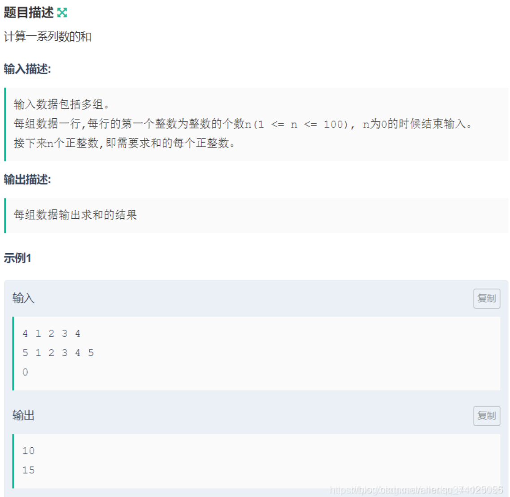

#### 题解

```cpp
#include <iostream>
using namespace std;

int main()
{
    int n;
    while (cin >> n) {
		if (n == 0) break;
    	int sum = 0, num;
        while (n--) {
        	cin >> num;
            sum += num;
    	}
        cout << sum << endl;
    }
    return 0;
}
```


### 5. A + B

#### 题目

> 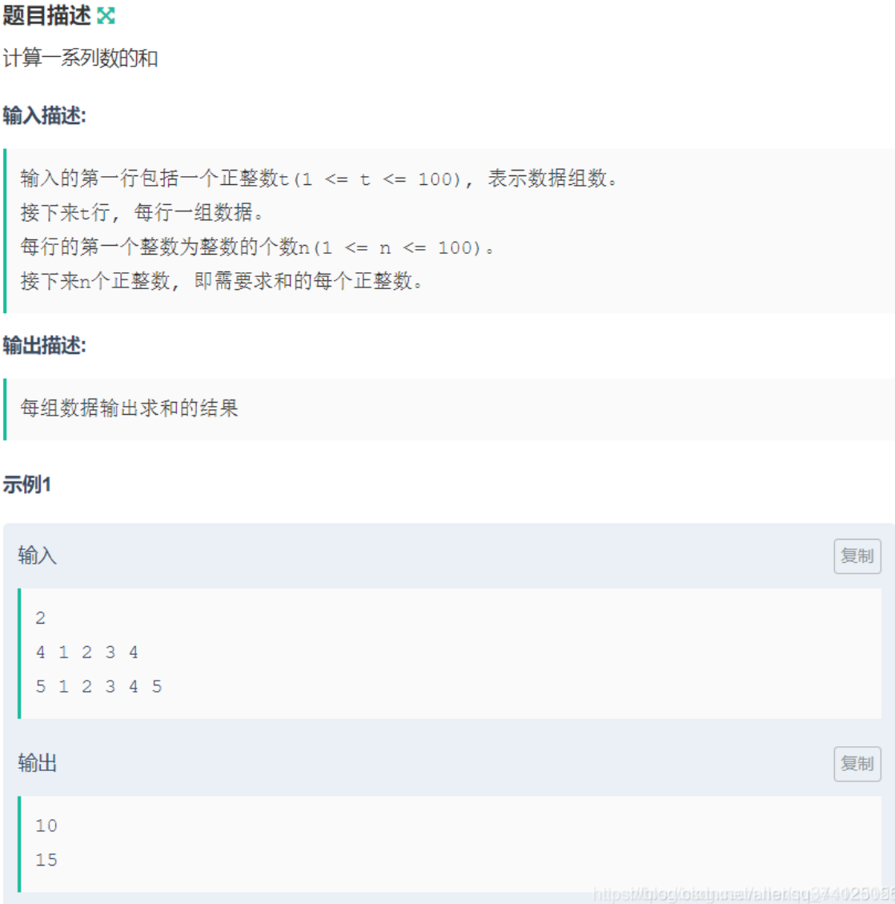

#### 题解

```cpp
#include <iostream>
using namespace std;

int main()
{
    int t;
    cin >> t;
    while (t--) {
        int n;
        cin >> n;
        int sum = 0, num;
        while (n--) {
            cin >> num;
            sum += num;
        }
        cout << sum << endl;        
    }
    return 0;
}
```


### 6. A + B

#### 题目

> 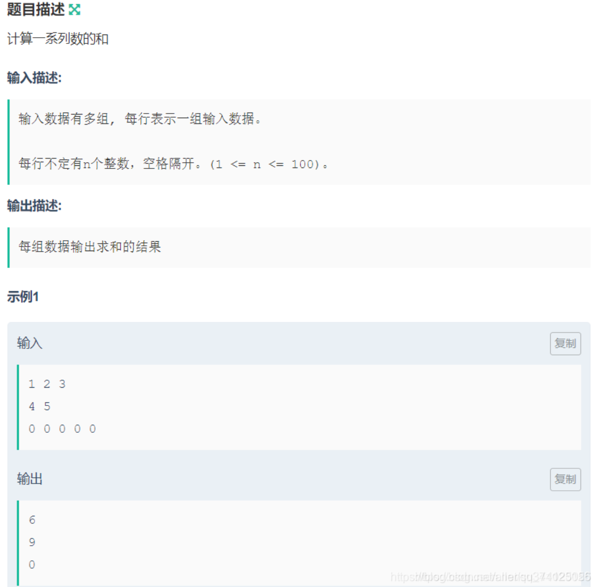

#### 题解

```cpp
#include <iostream>
using namespace std;

int main()
{
    int a;
    int sum = 0;
    while (cin >> a) {
        sum += a;
        if (cin.get() == '\n') {   //if (getchar() == '\n')
            cout << sum << endl;
            sum = 0;
        }
    }
    return 0;
}
```


### 7. 字符串排序

#### 题目

>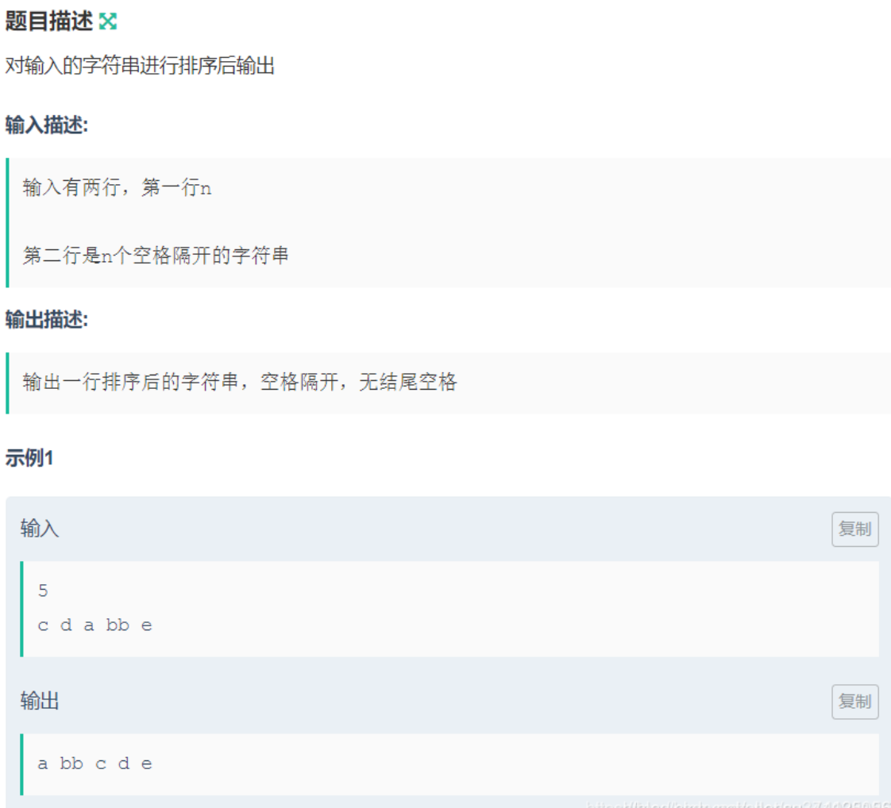

#### 题解

```cpp
#include <iostream>
#include <vector>
#include <algorithm>
using namespace std;

int main()
{
    string s;
    vector<string> ans;
    int n;
    cin >> n;
    while (cin >> s)
        ans.push_back(s);
    sort(ans.begin(), ans.end());
    
    for (int i = 0; i < n; i++)
        cout << ans[i] << ' ';
    cout << endl;
    return 0;
}
```


### 8. 字符串排序

#### 题目

>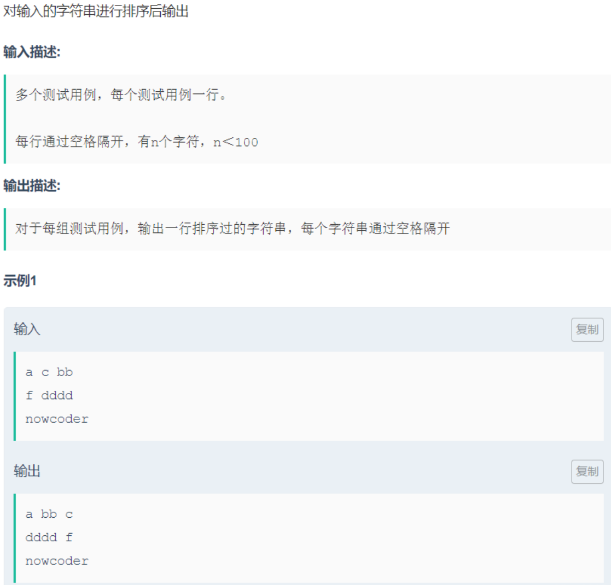

#### 题解

```cpp
#include <iostream>
#include <vector>
#include <algorithm>
using namespace std;

int main()
{
    string str;
    vector<string> ans;
    while (cin >> str) {
        ans.push_back(str);
        if (cin.get() == '\n') {
            sort(ans.begin(), ans.end());
            int n = ans.size() - 1;
            for (int i = 0; i < n; i++)
                cout << ans[i] << ' ';  //最后一个字母的后面不用再加空格
            cout << ans[n] << endl;
            ans.clear();
        }
    }
    return 0;
}
```


### 9. 字符串排序

#### 题目

>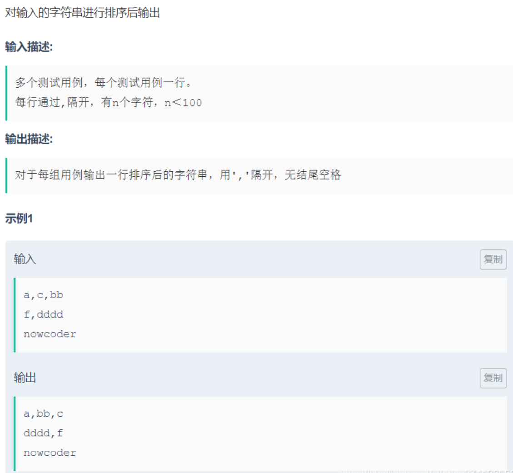

#### 题解

C++引入了ostringstream、istringstream、stringstream这三个输入输出控制类，要使用他们创建对象就必须包含<sstream>这个头文件。

istringstream类用于执行C++风格的串流的输入操作。

ostringstream类用于执行C风格的串流的输出操作。

strstream类同时可以支持C风格的串流的输入输出操作。

```cpp
#include <iostream>
#include <vector>
#include <string>
#include <algorithm>
#include <sstream>
using namespace std;

int main()
{
    string line, str;
    vector<string> ans;
    while (getline(cin, line)) {  //getline读取cin流里的字符串到line中,遇到文件结束符或遇到换行符结束并返回
        istringstream sin(line);  //istringstream sin(line);定义一个字符串输入流的对象sin,并调用sin的复制构造函数，将line中所包含的字符串放入sin对象中
        
        while (getline(sin, str, ',')) 
            ans.push_back(str);
        
        sort(ans.begin(), ans.end());
        int n = ans.size() - 1;
        for (int i = 0; i < n; i++)
            cout << ans[i] << ',';  //最后一个字母的后面不用再加逗号
        cout << ans[n] << endl;
        ans.clear();
    }
    return 0;
}
```

**常规做法 - 通过判断读入的每个字符是否是逗号**

判断最终结束用 `do {} while (c != EOF);`

```cpp
#include <iostream>
#include <vector>
#include <string>
#include <algorithm>
using namespace std;

int main()
{
    string s;
    vector<string> res;
    char c;
    do {
        c = cin.get();
        if (c != ',' && c != '\n')
            s += c;
        else if(c == ',') {
            res.push_back(s);
            s.clear();
        }
        else {
            if (!s.empty()) {
                res.push_back(s);
                s.clear();
            }
        sort(res.begin(), res.end());
        for (int i = 0; i < res.size(); i++) {
            cout << res[i];
            if (i < res.size() - 1)
                cout << ',';
        }
        cout << endl;
        res.clear();
        }
    } while (c != EOF);
    return 0;
}
```


### 10. 自测本地通过提交为0

#### 题目

> 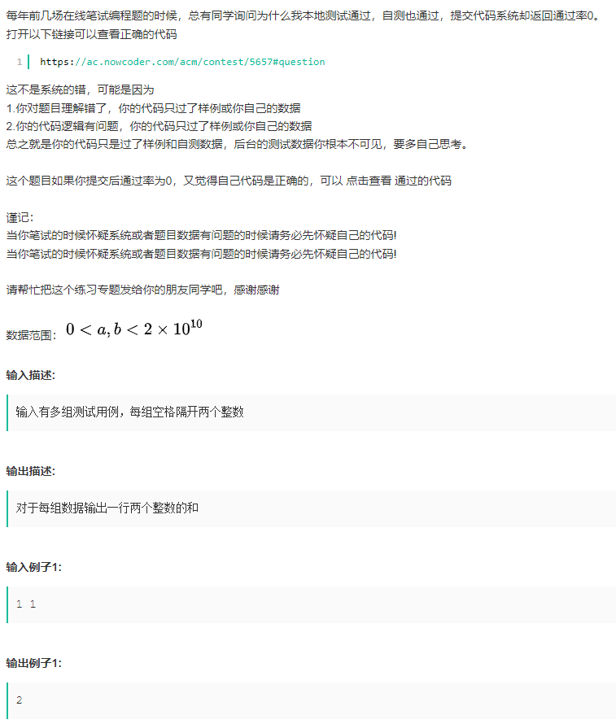

#### 题解

```cpp
#include <iostream>
using namespace std;

int main() {
    long long a, b;
    while (cin >> a >> b) {
        cout << a + b << endl;
    }
    return 0;
}

#include <iostream>
using namespace std;

int main() {
    long long sum = 0, a;
    while (cin >> a) {
        sum += a;
        if (cin.get() == '\n') {
            cout << sum << endl;
            sum = 0;
        }
    }
    return 0;
}
```


## 输入函数 - 详细分析

### cin 函数

**cin是不会读空格和回车的**

cin是遇到回车停止输入，按照空格输出的。

空格、回车等会被丢弃（这些还在缓冲区中，下次若用cin会自动丢弃），下次又会读取流中剩下的内容。（对于要输入一个字符串如果用cin>>input;这样的方法来输入一个字符串，则遇到空白换行，制表之类的，输入都会停止）因为从流中读入数据保存到string中，string会遇到空格就停止录入。这样当我们输入一行带空格的字符串，就要考虑getline函数，从流中读入一行字符串。

```cpp
#include <iostream>
using namespace std;
int main() {
    int a, b;
    while(cin >> a >> b) {
        cout << a+b << endl;
    }
    return 0;
}
```

计算a+b

**输入描述:**

> 输入包括两个正整数a,b(1 <= a, b <= 10^9),输入数据包括多组。

**输出描述:**

> 输出a+b的结果

**输入例子1:**

> 1 5
> 10 20

**输出例子1:**

> 6
> 30


### cin.get() 函数

使用cin.get()，可以只读一个字符，空白字符和换行符都可以读进去。

像getchar()

**输入描述:**

> 输入数据有多组, 每行表示一组输入数据。
>
> 每行不定有n个整数，空格隔开。(1 <= n <= 100)。

**输出描述:**

> 每组数据输出求和的结果

**输入例子1:**

> 1 2 3
> 4 5
> 0 0 0 0 0

**输出例子1:**

> 6
> 9
> 0

**代码：**

```c++
#include <iostream>
using namespace std;
int main() {
    int num;
    int sum = 0;
    while(cin >> num) {
        sum += num;
        if(cin.get() == '\n') {
            cout << sum << endl;
            sum = 0;
        }
    }
    return 0;
}
```


### cin.getline() 函数


### getline() 函数

**get与getline区别不是很大，但一个明显的区别是get遇到'\n '字符后便返回，这时 '\n '还在缓冲区中，所以下次读出来的将是 '\n '，而getline遇到'\n '也返回，但它会把 '\n '从缓冲区里移除掉，所以很多时候用getline方便些。**

*cin.getline()*函数是处理数组字符串的，其原型为*cin.getline(char\* , int)*，第一个参数为一个*char*指针，第二个参数为数组字符串长度。似乎也可以加入一个结束标志符。加入结束标识符是读到结束标志符停止的，没有的话是读入一行。

*getline(cin,str)*函数是处理*string*类的函数。第二个参数为*string*类型的变量。

**getline(cin,str,'结束标识符')读到结束标志符停止读入。**

一些编程题要求先输入字符串行数，然后再一行一行读入字符串。如果正常顺写编程的话，会发现第一行字符串读入的是空，后续才能正常录入每行字符串。 这是因为第一行输入一个string数据后，换行符并没有被忽略，直接被准备读入第一行字符串的getline俘获。 所以需要调用cin.ignore()忽略下面的一个流录入，将其抛弃。

> 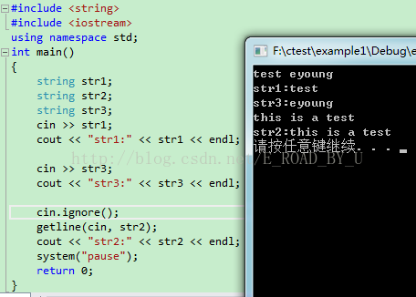
> 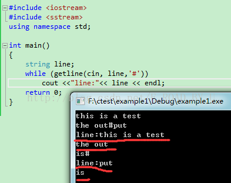

红色是输出，可以观察输入有#，回车后就会输出，一行一行的输出。下次#后的会照样输出。但#丢弃。


### get() 函数

用get进行单字符输入，在有参数或者没有参数的情况下，get函数读取一个输入字符，不管这个字符是啥换行，制表都可以，直接读进去。（有参数的情况下，可根据你输入的参数确定读出的字符数），其中get（void）将字符转换成整形后返回。如果读取倒了文件尾，或者键盘输入的尾部等没东西可读的情况的时候，cin.get(ch);会返回false，其余正常情况返回的都是true。

get()函数在遇到换行符读取完字符时并不会读取换行符或者是本来的默认分界符，而这些东西都只会留在原始流之内。

char input[10];

char ch;

cin.get(input,10,'a');//a是输入结束的标志，10是读取流的大小（超出的被丢弃）

cout <<input << endl;

cin.get(ch);//此时a还留在缓冲区中，故下面的会输出a

cout<<ch<<endl;

输入sdsdsda 

输出sdsdsda

而getline（）函数会自动丢弃换行符等分界符。

```
char input[10]；
char ch;
cin.getline(input,10,'a');读入字符，直到遇到a，\n也会读入
cout << input << endl;
cin.get(ch);//a被丢弃
cout<<ch<<endl;
```

输入 sdsdsda

输出sdsdsd

 因为丢弃分界符，则分界符a被丢弃，下面的cin.get(ch)读到的是换行符，所以输出的时候就只是输出一个换行符。


### getchar() 函数

```
getchar()是stdio.h中的库函数，它的作用是从stdin流中读入一个字符，也就是说，如果stdin有数据的话不用输入它就可以直接读取了，第一次getchar()时，确实需要人工的输入，但是如果你输了多个字符，以后的getchar()再执行时就会直接从缓冲区中读取了。
当你输入一行完成后，程序才会进入while中，一一根据流判断每个字符。当判断起头不是空格，cin会将直到下个空格前的整个数据赋给int类型。这块巧妙应用了ungetc()函数返回字符到流中的功能。
```

> 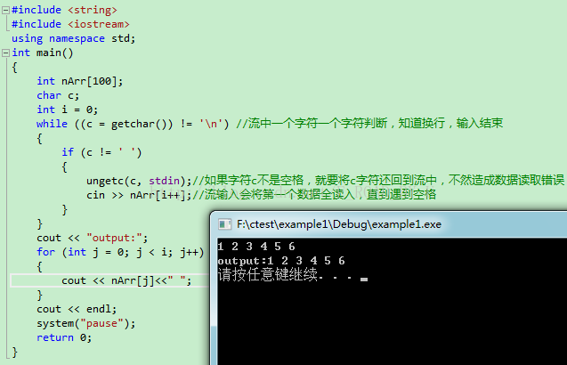


### fgets 函数

*fgets*从文件流读取一行，送到缓冲区。（带s的函数）需要注意的是*fgets*保留换行符*'\n'*，而*gets*是从*stdin*输入，在读取字符串时会删除结尾的换行符*'\n';*同样，*fputs*写入时不包括换行符，而*puts*在写入字符串时会在末尾添加一个换行符。


