## 语法题典型题难题汇总 - AcWing

[TOC]

------

#### 注意

- 关于是否需要定义一个题目要求的字符串还是说只要输出正确即可

  - 解答：只要输出符合要求即可，无论什么方法

  - 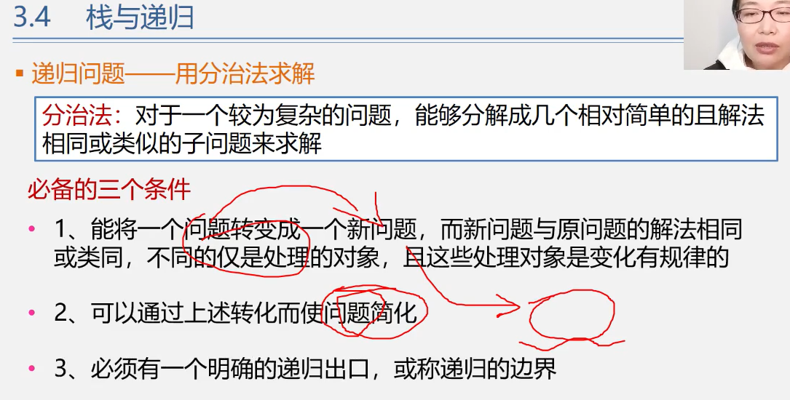

  - ```cpp
    #include <iostream>
    
    
    using namespace std;
    
    
    int main()
    {
        string s;
        getline(cin, s);
        
        string b;
        for (auto c : s) b = b + c + ' ';
        
        b.pop_back();  // 把最后的空格删掉
        
        cout << b << endl;
        
    //   for (auto c : s)
    //   {
    //       cout << c << ' ';
    //   }
        
        return 0;
    }
    ```


丢失图片：

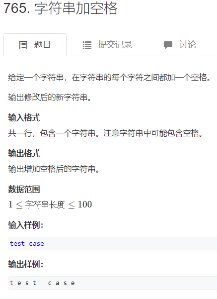


------

### 典型题汇总

#### 题目中常用写法：

- 定义判断标志位
  - bool is_same = true; 
  - if (!is_same) ...

#### 判断闰年

- 闰年有两种情况：
- 能被100整除时，必须能被400整除` a%100==0,a%400==0`
- 不能被100整除时，被4整除即可` a%100!==0,a%4==0`
- (被除数一般就是 "÷" 前面的数,除数就是 "÷"后面的数.)

#### 三个数降序排列

```cpp
int a, b, c, t;
if (b > a)
{
    t = a;    a = b;    b = t;
}
if (c > a)
{
    t = a;    a = c;    c = t;
}
if (c > b)
{
    t = b;    b = c;    c = t;
}
```

#### 游戏时间判断 AcWing 668

一种思路是直接判断，注意满60进位减一

简单思路是先全部转换为分钟，然后加减得总分钟数

#### 斐波那契数列

f(1) = 1，f(2) = 2, f(n) = f(n-1) + f(n-2), n >= 3

```cpp
通过一个变量来输出所有
#include <iostream>


using namespace std;


int main()
{
    int n;
    cin >> n;
    int a = 0, b = 1;
    for (int i = 0; i < n; i ++ )
    {
        cout << a << ' ';
        int c = a + b;
        a = b;
        b = c;
    }
    cout << endl;
    retrun 0;
}
```

```cpp
通过数组输出
#include <iostream>


using namespace std;


int main()
{
    int f[100];
    f[0] = 0, f[1] = 1;
    int n;
    cin >> n;
    
    for (int i = 2; i <= n; i ++ )
        f[i] = f [i - 1] + f [i - 2];
    cout << f[n] << endl;
    
    return 0;
}
```

#### 质数

大于等于2，且因数除了1和它本身无其他。

2,3,5,7,11,13,17,19...

枚举一下从2~n-1有没有它的倍数

```cpp
#include <iostream>

using namespace std;


int main()
{
    int n;
    cin >> n;
    
    bool is_prime = true;
    
    for (int i = 2; i <= n - 1; i ++ )
        if (n % i == 0)
        {
            is_prime = false;
            break;
        }
    if (is_prime) cout << "Yes" << endl;
    else cout << "No" << endl;
    return 0;
}
```

#### 内外嵌套的for循环

```c++
for (int i = 1, k = 1; i <= n; i ++ )
{
    for (int j = 1; j <= n; j ++, k ++ )
	printf("%-5d", k);
	cout << endl;
}
```

#### 距离

曼哈顿距离

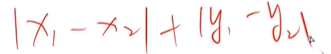

欧几里得距离：

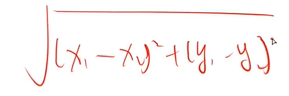


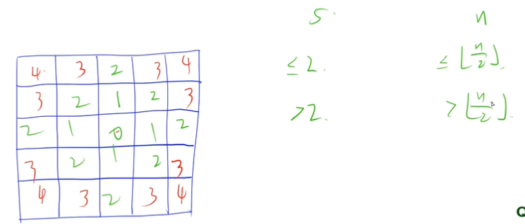

```cpp
#include <iostream>


using namespace std;


int main()
{
    int n;
    cin >> n;
    
    int cx = n / 2, cy = n / 2; //中心点坐标
    for (int i = 0; i < n; i ++ )
    {
        for (int j = 0; j < n; j ++ )
            if (abs(i - cx) + abs(j - cy) <= n / 2) //曼哈顿距离
                cout << '*';
            else
                cout << ' ';
            cout << endl;
    }
    
    return 0;
}
```

#### 循环妙用(循环n次的其他写法)

```cpp
cin >> n;           //n为几就循环几次
while (n - - )        //- -先用在减，当n为1时，先循环1次，然后为0结束循环，当n为3时，3,2,1，循环3次
{

}
```

#### 数组旋转

- 旋转一次为将数组最后一个放到第一个位置
- 首先将数组颠倒
- 然后翻转前半部分
- 然后翻转后半部分
- 翻转函数#include <algorithm> reverse(a, a + 1); (数组翻转的起始位置，终止位置加一)

```cpp
#include <iostream>
#include <algorithm>


using namespace std;


int main()
{
    int a[100];
    int n, k;
    cin >> n >> k;
    for (int i = 0; i < n; i ++ ) cin >> a[i];
    
    reverse(a, a + n);
    reverse(a, a + n);
    reverse(a + k, a + n);
    
    for (int i = 0; i < n; i ++ ) cout << a[i] << ' ';
    
    return 0;
}
```

#### 浮点数比较

相减小于多少精度

```cpp
#include <iostream>
#include <cmath>


using namespace std;


const double eps = 1e-6;


int main()
{
    double x = 1.234567;
    double a = x * x;
    double b = sqrt(a);
    
    if (fabs(x - b) < eps) puts("相等");
    
    return 0;
}
```

#### 高精度运算（数组）

```c
求2的N次方
#include <iostream>


using namespace std;


const int N = 3010;  //定义数组长度


int main()
{
    int a[N] = {1};  //数组初始化
    int n;
    cin >> n;        //求2的n次方
    int size = 1;    //当前数组存放到了多少位
    
    for (int i = 0; i < n; i ++ )  //2的多少次方
    {
        int t = 0;                        //用t暂存当前的计算值
        for (int j = 0; j < size; j ++ )  //当前需要计算到多少位
        {
            t += a[j] * 2;   //数组的每一位都乘2，用t暂存下一位用到的计算值
            a[j] = t % 10;   //数组当前位置存放当前计算值的个位数
            t /= 10;         //当前计算值舍去个位数
        }
        if (t) a[size ++ ] = 1;   //提前将下一位计算值置1，且总位数加1
    }
    
    for (int i = size - 1; i >= 0; i -- ) cout << a[i];
    cout << endl;
    
    return 0;
}
```

#### 猜拳问题（字符串）

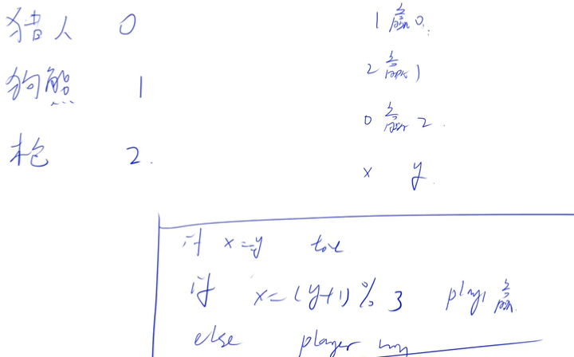

列出对应关系，找规律

```c
#include <iostream>
#include <cstdio>


using namespace std;


int main()
{
    int t;
    cin >> t;
    
    while (t -- )
    {
        string a, b;
        cin >> a >> b;
        int x, y;
        
        if (a == "Hunter") x = 0;
        else if (a == "Bear") x = 1;
        else x = 2;
        
        if (b == "Hunter") y = 0;
        else if (b == "Bear") y = 1;
        else y = 2;
        
        if (x == y) puts("Tie");
        else if (x == (y + 1) % 3) puts("Player1");
        else puts("Player2");
    }
    return 0;
}
```

#### 双指针算法（循环）

第一类双指针算法输入一个字符串，字符串中可能包含多个连续的空格，请将多余的空格去掉，只留下一个空格。（acwing766）

```cpp
for (int i = 0; i < s.size(); i ++ )
    {
        if (s[i] != ' ') r += s[i];
        else
        {
            r += ' ';
            int j = i;
            while (j < s.size() && s[j] == ' ') j ++ ;
            i = j - 1;
        }
    }
```

其他做法，判断局部性，判断上一个是否是空格

`if (!i || s[i - 1] != ' ') r += ' ';`

求一个字符串中最长的连续出现的字符，输出该字符及其出现次数，字符串中无空白字符（空格、回车和 tabtab），如果这样的字符不止一个，则输出第一个。（acwing 771）

```c
  for (int i = 0; i < str.size(); i ++ )
        {
            int j = i;
            while (j < str.size() && str[j] == str[i])
                j ++ ;
            if (j - i > cnt)
                cnt = j - i, c = str[i];
            i = j - 1;
        }
        cout << c << ' ' << cnt << endl;
```

#### 查看程序运行时间

\#include <ctime>

int start_time = clock(); //返回程序的开始时刻，放在程序开头

cout << clock() - start_time << endl; //显示运行时间，单位是ms


### 基本题汇总

#### 完全数（循环语句）

注：类似的题还有判断是否为质数，一对约数间是对应的，所以判断的范围取根号，i * i <= n

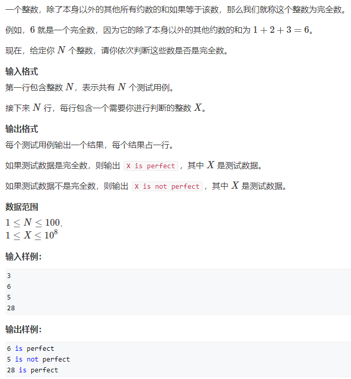

```cpp
#include <iostream>


using namespace std;


int main()
{
    int n;
    cin >> n;
    while (n -- )
    {
        int x;
        cin >> x;
        int s = 0;
        
        for (int i = 1; i * i <= x; i ++)
        {
            if (x % i == 0)
            {
                if (i < x) s += i;
                if (i != x / i && x / i < x) s += x / i;
            }
        }
        
        if (s == x)
            cout << x << " is perfect" << endl;
        else
            cout << x << " is not perfect" << endl;
    }
    return 0;
}
```

#### 回形矩阵（数组）acwing 1116

关键在于到上下左右四条边的最小值，分别为i,j,n-i+1,n-j+1

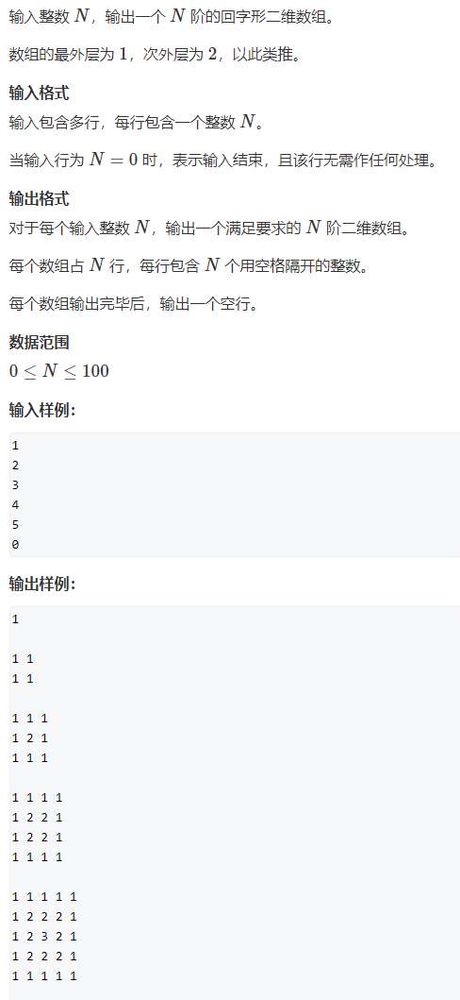

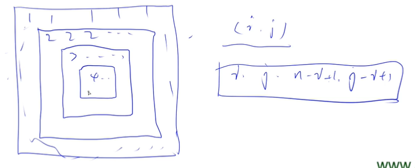

```cpp
#include <iostream>


using namespace std;


int main()
{
    int n;
    while (cin >> n, n)
    {
        for (int i = 1; i <= n; i ++ )
        {
            for (int j = 1; j <= n; j ++ )
            {
                int up = i, down = n - i + 1, left = j, right = n - j + 1;
                cout << min(min(up, down), min(left, right)) << ' ';
            }
            cout << endl;
        }
        cout << endl;
    }
    return 0;
}
```

#### 蛇形矩阵（数组）acwing 756

利用偏移量，将位置信息简化存放到矩阵中，即dx[] = {-1, 0, 1, 0}, dy[] = {0, 1, 0, -1};

这样每次改变方向时，只需要更改代表对应方位的变量，

通过`if(a < 0 || a >= n || b < 0 || b >= m || q[a][b])`来判断何时改变方向

通过改变方向d = (d + 1) % 4来达到蛇形的目的

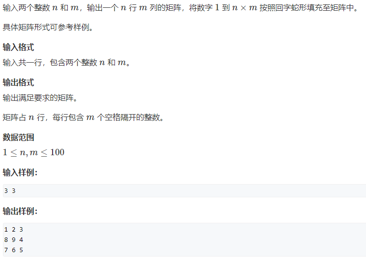

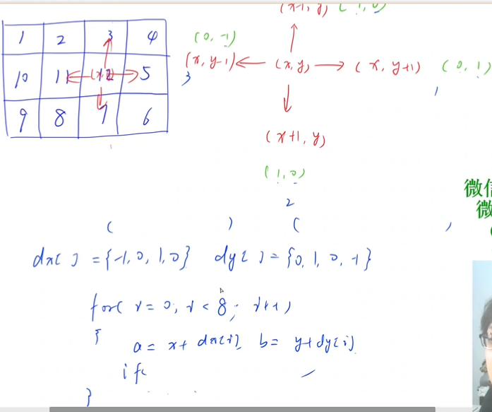

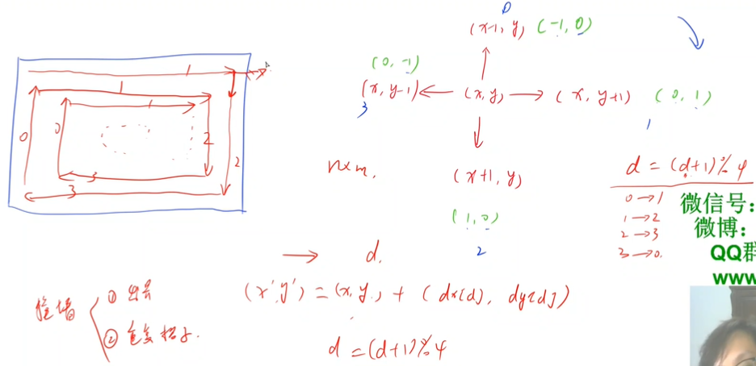


```cpp
#include <iostream>


using namespace std;


const int N = 110;


int n, m;
int q[N][N];


int main()
{
    cin >> n >> m;
    int dx[] = {-1, 0, 1, 0}, dy[] = {0, 1, 0, -1};
    int x = 0, y = 0, d = 1;
    for (int i = 1; i <= n * m; i ++ )
    {
        q[x][y] = i;
        int a = x + dx[d], b = y + dy[d];
        if(a < 0 || a >= n || b < 0 || b >= m || q[a][b])
        {
            d = (d + 1) % 4;
            a = x + dx[d], b = y + dy[d];
        }
        x = a, y = b;
    }
    for (int i = 0; i < n; i ++ )
    {
        for (int j = 0; j < m; j ++ )
            cout << q[i][j] << ' ';
        cout << endl;
    }
    return 0;
}
```

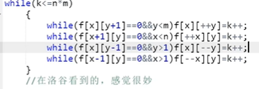


### 递归算法(函数调用)

#### 跳台阶（acwing 821）

一个楼梯共有 nn 级台阶，每次可以走一级或者两级，问从第 00 级台阶走到第 nn 级台阶一共有多少种方案。画"递归搜索树"，枚举所有情况

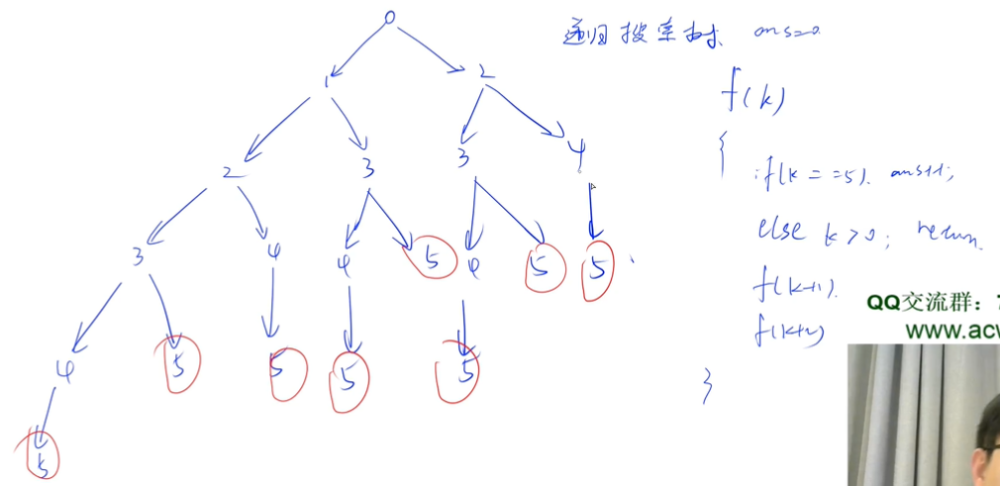

```cpp
#include <iostream>

using namespace std;

int n;
int ans;

void f(int k)
{
    if (k == n) ans ++ ;
    else if (k < n)
    {
        f(k + 1);
        f(k + 2);
    }
}

int main()
{
    cin >> n;
    f(0);
    cout << ans << endl;
    
    return 0;
}
```

#### 走方格

给定一个 n×mn×m 的方格阵，沿着方格的边线走，从左上角 (0,0)(0,0) 开始，每次只能往右或者往下走一个单位距离，问走到右下角 (n,m)(n,m) 一共有多少种不同的走法。深度优先遍历dfs，此处为二维，比一维问题又包含一重判断，两层判断

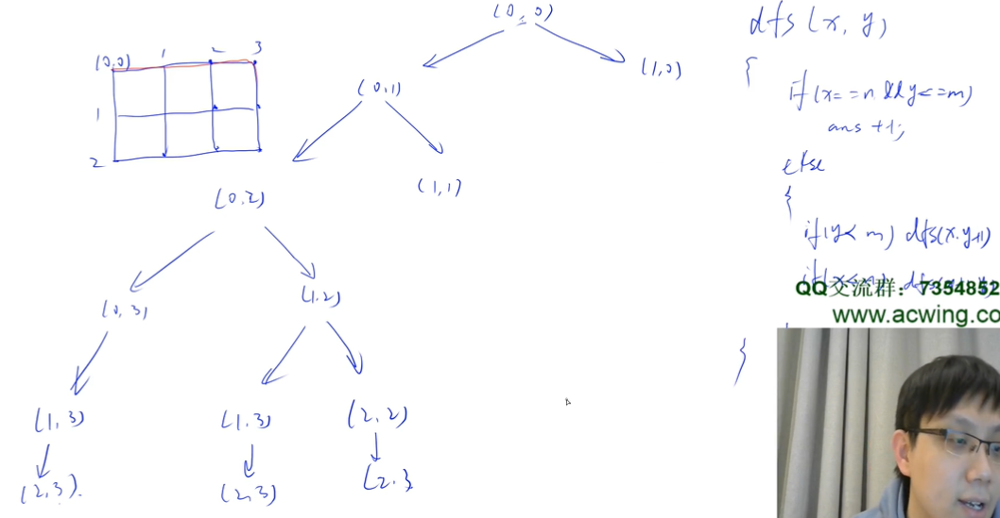

```cpp
#include <iostream>


using namespace std;


int N, M;
int ans;


void f(int n, int m)
{
    if (n == N && m == M) ans ++ ;
    else if (n < N || m < M)
    {
        if(n < N) f(n + 1, m + 0);
        if(m < M) f(n + 0, m + 1);
    }
}


int main()
{
    cin >> N >> M;
    f(0, 0);
    cout << ans << endl;
    
    return 0;
}
```

#### 字典序排列

给定一个整数 nn，将数字 1∼n1∼n 排成一排，将会有很多种排列方法。现在，请你按照字典序将所有的排列方法输出。

递归搜索树

注意在搜索返回一个结点时需要恢复置1的状态

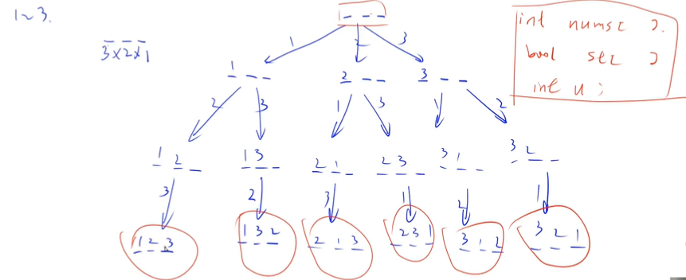

```cpp
#include <iostream>


using namespace std;


const int N = 10;


int n;


void dfs(int u, int nums[], bool st[])
{
    if (u > n)
    {
        for (int i = 1; i <= n; i ++ ) cout << nums[i] << ' ';
        cout << endl;
    }
    else
    {
        for (int i = 1; i <= n; i ++)
            if(!st[i])          //st[i]代表每个数字是否被用过
            {
                st[i] = true;
                nums[u] = i;
                cout << "这是第" << u << "个位置上," << "判断" << i << endl;
                dfs(u + 1, nums, st);    //u代表当前枚举到第几位了
                st[i] = false;  //恢复现场
            }
    }
}
int main()
{
   cin >> n;
   int nums[N];
   bool st[N] = {0};
   dfs(1, nums, st);
    
    return 0;
}

输出
这是第1个位置上,判断1
这是第2个位置上,判断2
这是第3个位置上,判断3
1 2 3
这是第2个位置上,判断3
这是第3个位置上,判断2
1 3 2
这是第1个位置上,判断2
这是第2个位置上,判断1
这是第3个位置上,判断3
2 1 3
这是第2个位置上,判断3
这是第3个位置上,判断1
2 3 1
这是第1个位置上,判断3
这是第2个位置上,判断1
这是第3个位置上,判断2
3 1 2
这是第2个位置上,判断2
这是第3个位置上,判断1
3 2 1
```


### 短路用法

求 1+2+…+n1+2+…+n，要求不能使用乘除法、forfor、whilewhile、ifif、elseelse、switchswitch、casecase 等关键字及条件判断语句 (A?B:C)(A?B:C)。 （acwing 84）

```cpp
class Solution {
public:
    int getSum(int n) {
        int res = n;
        n > 0 && (res += getSum(n - 1));
        return res;
    }
};
```


### 二路归并算法（链表）

输入两个递增排序的链表，合并这两个链表并使新链表中的结点仍然是按照递增排序的。（acwing 36）样例 输入：1->3->5 , 2->4->5，输出：1->2->3->4->5->5

```cpp
/**
* Definition for singly-linked list.
* struct ListNode {
*     int val;
*     ListNode *next;
*     ListNode(int x) : val(x), next(NULL) {}
* };
*/
class Solution {
public:
    ListNode* merge(ListNode* l1, ListNode* l2) {
        auto dummy = new ListNode(-1); // 定义一个虚拟头结点
        auto tail = dummy;  // 新链表的尾结点
        while (l1 && l2)   // 遍历链表
        {
            if (l1->val < l2->val)
            {
                tail->next = l1;    // 此处为将l1拿过来做结点
                tail = tail->next;  // 要明确此时的tail, l1, tail->next都是结构体指针，都是地址
                l1 = l1->next;
            }
            else
            {
                tail->next = l2; // 第二次运行时，tail->next已经为l1->next了
                tail = tail->next;
                l2 = l2->next;
            }
        }
        if (l1) tail->next = l1;  // 最后最多剩一个
        if (l2) tail->next = l2;
        return dummy->next;
        
    }
};
```


### 链表

#### 反转链表（链表）

定义一个函数，输入一个链表的头结点，反转该链表并输出反转后链表的头结点。

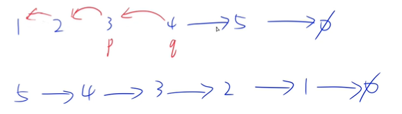

新建两个指向相邻两个结点的指针，通过他们将链表从头到尾依次反转

```cpp
/**
* Definition for singly-linked list.
* struct ListNode {
*     int val;
*     ListNode *next;
*     ListNode(int x) : val(x), next(NULL) {}
* };
*/
class Solution {
public:
    ListNode* reverseList(ListNode* head) {
        if (!head || !head->next) return head;// 空列表和只有一个结点的链表不需要反转


        auto p = head, q = p->next;
        while (q)
        {
            auto o = q->next;
            q->next = p;
            p = q, q = o;
        }
        head->next = NULL;


        return p;


    }
};
```

递归算法

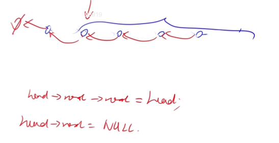

递归算法其实就是从后往前推，从点推出线，从最后的两个结点开始反转指向，然后依次往前推，tail一直都是指向尾结点，整个过程中没有变。

```cpp
class Solution {
public:
    ListNode* reverseList(ListNode* head) {
        if (!head || !head->next) return head;   // 如果是空链表或是尾结点则返回指向该结点的指针
        auto tail = reverseList(head->next);  // 让tail指向尾结点
        head->next->next = head;
        head->next = NULL;
        return tail;
    }
};
```

#### 两个链表的第一个公共结点（链表）

输入两个链表，找出它们的第一个公共结点。当不存在公共节点时，返回空节点。（acwing 66）

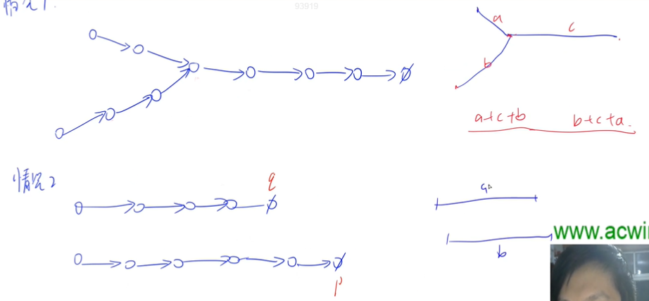

两个指针同时从两侧走，第一次走到空时交换起点重新走，当相等时输出

```cpp
/**
* Definition for singly-linked list.
* struct ListNode {
*     int val;
*     ListNode *next;
*     ListNode(int x) : val(x), next(NULL) {}
* };
*/
class Solution {
public:
    ListNode *findFirstCommonNode(ListNode *headA, ListNode *headB) {
        auto p = headA, q = headB;
        
        while (p != q)
        {
            if (p) p = p->next;
            else p = headB;
            if (q) q = q->next;
            else q = headA;
        }
        return p;
    }
};
```

#### 删除链表中重复的节点（链表）

- 在一个排序的链表中，存在重复的结点，请删除该链表中重复的结点，重复的结点不保留。（acwing 29）

- 构建两个指针，一个往后扫描，扫描到相同的，之前的指针就跳过重复

- 结点添加虚拟结点dummy，处理头结点被删掉的情况，最后返回虚拟结点->next

- auto dummy = new ListNode(-1); dummy->next = head;

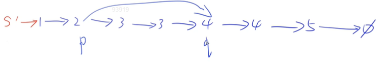

```cpp
/**
* Definition for singly-linked list.
* struct ListNode {
*     int val;
*     ListNode *next;
*     ListNode(int x) : val(x), next(NULL) {}
* };
*/
class Solution {
public:
    ListNode* deleteDuplication(ListNode* head) {
        auto dummy = new ListNode(-1);
        dummy->next = head;
        auto p = dummy;
        
        while (p->next)
        {
            auto q = p->next;
            while (q->next && q->next->val == p->next->val) q = q->next;
            if (q == p->next) p = q;
            else p->next = q->next;
        }
        return dummy->next;
    }
};
```


