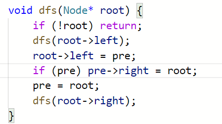
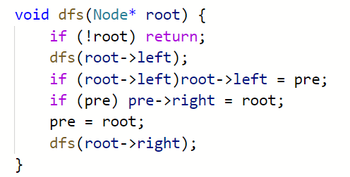
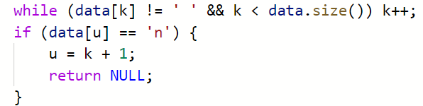

## 常见错误汇总 - HQ

[TOC]

------

#### 注意

- 

------

## LeetCode刷题

#### 错误原因：试图使用空指针

错误题目：剑指 Offer 36. 二叉搜索树与双向链表

报错信息：`LeetCode报错:runtime error: member access within null pointer of type 'struct ListNode'`

解决方法：增加判断条件，并且判断的顺序不能改变。排除对空指针的引用。

详细说明：

> 说是试图会使用空指针，while循环里面的判断，是先判断fast->next,后判断fast，但有可能fast是nullptr，如果是这样的话，先判断fast->next就会出错，这句话就跑不过。

原始

> 

改进

> 

### 错误原因：数组越界访问

错误题目：剑指 Offer 37. 序列化二叉树

报错信息：`AddressSanitizer: heap-buffer-overflow on address 0x6020000001cc at pc……`

解决方法：一般是修改循环条件，如:<改为<=

详细说明：

> LeetCode使用了AddressSanitizer检查了是否存在内存非法访问,一般是数组越界，上下都有可能

> Address Sanitizer（ASan）是一个快速的内存错误检测工具。从gcc 4.8开始，AddressSanitizer成为gcc的一部分。

原始

> 

改进

> 

