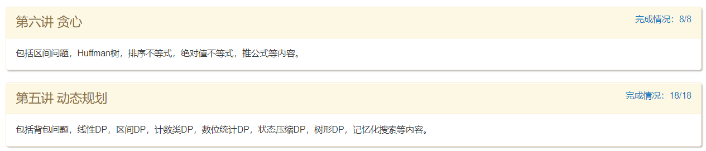
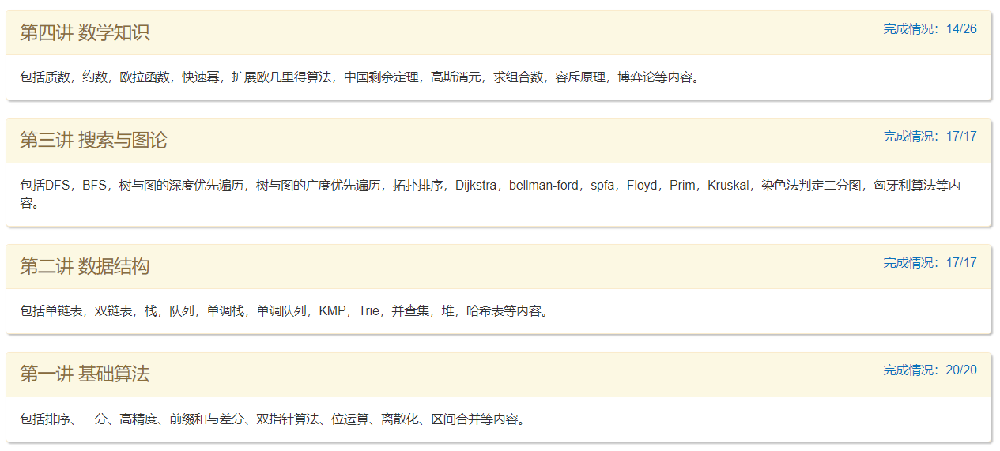

### 算法学习内容目录 - AcWing - HQ

---

---

https://www.acwing.com/activity/content/11/

1.基础算法 —— 代码模板链接 常用代码模板1——基础算法

- 排序
- 二分
- 高精度
- 前缀和与差分
- 双指针算法
- 位运算
- 离散化
- 区间合并

2.数据结构 —— 代码模板链接 常用代码模板2——数据结构

- 链表与邻接表：树与图的存储
- 栈与队列：单调队列、单调栈
- kmp
- Trie
- 并查集
- 堆
- Hash表

3.搜索与图论 —— 代码模板链接 常用代码模板3——搜索与图论

- DFS与BFS
- 树与图的遍历：拓扑排序
- 最短路
- 最小生成树
- 二分图：染色法、匈牙利算法

4.数学知识 —— 代码模板链接 常用代码模板4——数学知识

- 质数
- 约数
- 欧拉函数
- 快速幂
- 扩展欧几里得算法
- 中国剩余定理
- 高斯消元
- 组合计数
- 容斥原理
- 简单博弈论

5.动态规划

- 背包问题
- 线性DP
- 区间DP
- 计数类DP
- 数位统计DP
- 状态压缩DP
- 树形DP
- 记忆化搜索

6.贪心

7.时空复杂度分析

---
