## 基础算法学习 - AcWing - HQ

[TOC]

----

### 注意内容

- 学习过程
  - 上课学习算法主要思想
  - 下课背过算法模板并做题目（尤其是涉及边界问题的算法最好背过模板）
  - 提高熟练度-题目反复做，做完删掉重新做，做3-5遍

----

### 目录

> 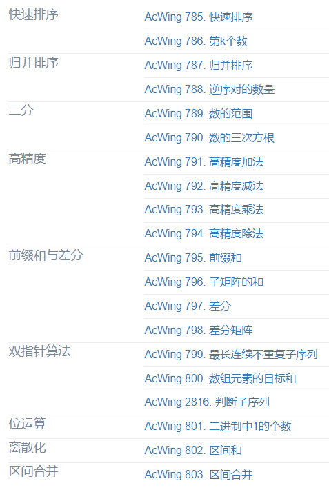


### 递归算法

==常用递归方法的三种情况：==

- 递归定义的数学函数
- 具有递归特性的数学结构
- 可递归求解的问题

> 

==分治法求解递归问题算法的一般形式：==

```cpp
void p(参数表)
{
    if (递归结束条件)
        可直接求解步骤;   //基本项
    else
        p(较小的参数);   //归纳项
}
```

例如：

```cpp
long Fact(long n)
{
    if (n == 0)
        return 1;  //基本项
    else
        return n * Fact(n - 1);  //归纳项
}
```


### 排序算法

> 


### 快速算法

#### 快速排序

**题目**

> 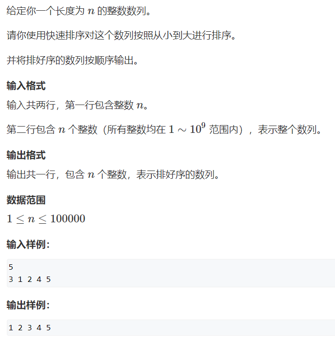

**基本思想**

指针i、j同时向中间移动，如果i指向的数比x小，则往下一个移动，如果比x大，则去移动j，当j指向的数比x小，则交换i、j指向的数，直到两个指针相遇，依次递归。

> 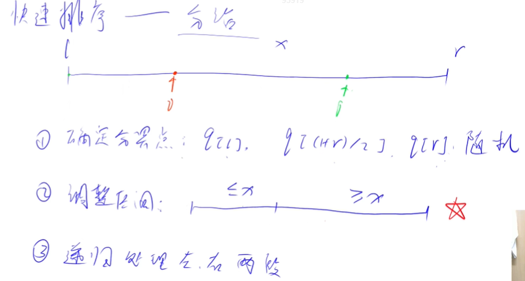

**快速排序的暴力做法**

找两个辅助空间，先分别比较大小将大于小于的放入，然后在放回q[]，依次循环。

> 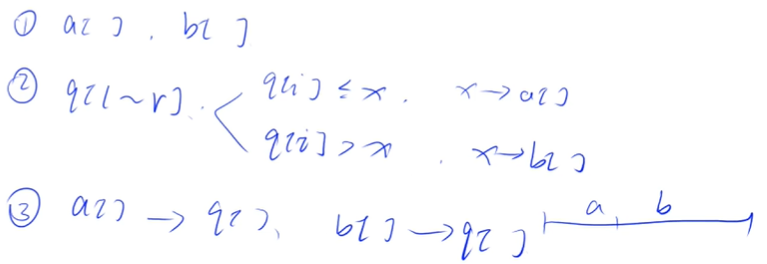

```cpp
//快速排序对这个数列按照从小到大进行排序
#include <iostream>

using namespace std;
const int N = 1e6 + 10;

int n;
int q[N];

void quick_sort(int q[], int l, int r)
{
    if (l >= r) return;  //递归结束条件，此处一定要写>=
    //右移运算符的优先级在加减之后，左移<<为乘以2，右移>>为除以2
    int i = l - 1, j = r + 1, x = q[l + r >> 1];  
    while (i < j)  //i >= j时，结束本次排序
    {
        do i++; while (q[i] < x);  //小于x时，继续循环，直到大于等于x时停止
        do j--; while (q[j] > x);  //大于x时，继续循环，直到小于等于x时停止
        if (i < j) swap(q[i], q[j]);
    }
    quick_sort(q, l, j);  //左侧依次递归排序
    quick_sort(q, j + 1, r);  //右侧依次递归排序
}

int main()
{
    scanf("%d", &n);
    for (int i = 0; i < n; i++) scanf("%d", &q[i]);
    
    quick_sort(q, 0, n - 1);  //左右边界
    
    for (int i = 0; i < n; i++) printf("%d ", q[i]);
    
    return 0;
}
```


#### 快速选择算法

**题目**

>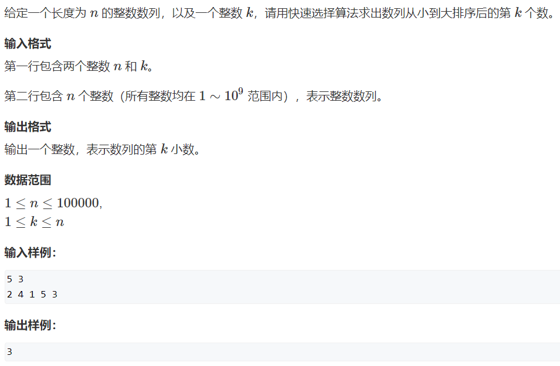

时间复杂度O(n)，每次排完序判断下k在左侧还是右侧，然后直接对所在的范围内进行递归

> 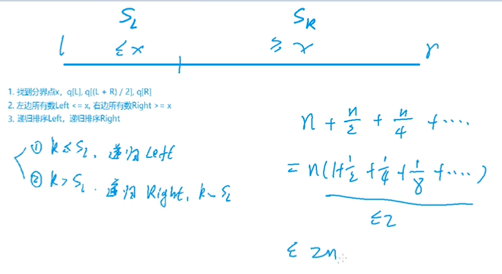

```cpp
//请用快速选择算法求出数列从小到大排序后的第 k 个数
#include <iostream>

using namespace std;
const int N = 1e5 + 10;

int q[N];

int quick_sort(int q[], int l, int r, int k)
{
    if (l >= r) return q[l];  //仅剩一个数，则q[l]就是答案,此处可以写==因为k一定在区间中
    
    int i = l - 1, j = r + 1, x = q[l + r >> 1];
    while (i < j)
    {
        do i++; while (q[i] < x);
        do j--; while (q[j] > x);
        if (i < j) swap(q[i], q[j]);
    }
    // j - l + 1 代表排序的左侧一共有多少个数，此处判断k是否在左侧范围内
    if (j - l + 1 >= k) return quick_sort(q, l, j, k);
    else return quick_sort(q, j + 1, r, k - (j - l + 1));
}

int main()
{
    int n, k;
    scanf("%d%d", &n, &k);
    for (int i = 0; i < n; i++) scanf("%d", &q[i]);
    
    cout << quick_sort(q, 0, n - 1, k) << endl;
    
    return 0;
}
```


### 归并算法

#### 归并排序

**题目**

>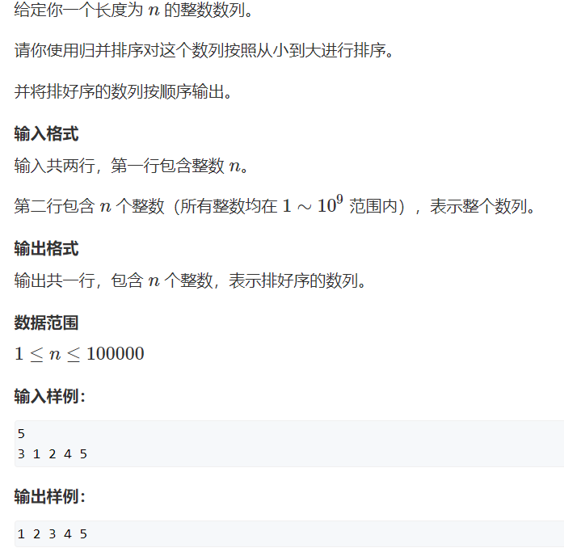

**基本思想**

先递归，再归并

>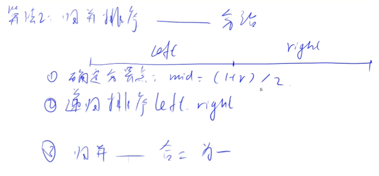

每层时间复杂度都是O(n)，一共logn层，所以时间复杂度为O(nlogn)

> 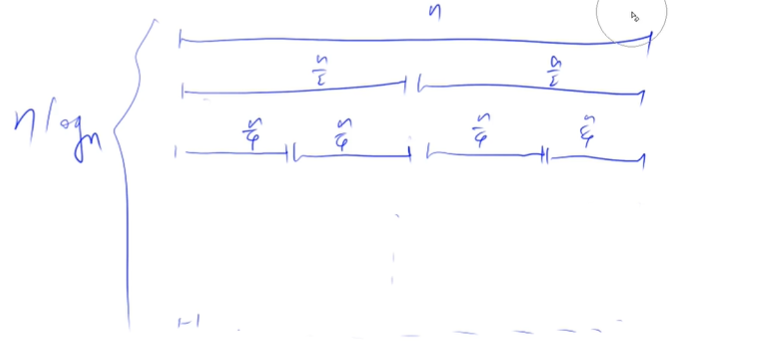

```cpp
#include <iostream>

using namespace std;

const int N = 1000010;

int n;
int q[N], tmp[N];

void merge_sort(int q[], int l, int r)
{
    if (l >= r) return;  //此处可以写成==
    
    int mid = l + r >> 1;
    merge_sort(q, l, mid);  //递归排序左边
    merge_sort(q, mid + 1, r);  //递归排序右边
    //归并过程，把两个有序序列合并成一个有序序列
    int k = 0, i = l, j = mid + 1;  
    while (i <= mid && j <= r)  
        if (q[i] <= q[j]) tmp[k++] = q[i++];
    	else tmp[k++] = q[j++];
    //判断左右两边是否都循环完，最多只会执行一个
    while (i <= mid) tmp[k++] = q[i++];
    while (j <= r) tmp[k++] = q[j++];
    
    for (i = l, j = 0; i <= r; i++, j++) q[i] = tmp[j];
}

int main()
{
    scanf("%d", &n);
    for (int i = 0; i < n; i++) scanf("%d", &q[i]);
    
    merge_sort(q, 0, n - 1);
    
    for (int i = 0; i < n; i++) printf("%d ", q[i]);
    
    return 0;
}
```


#### 逆序对数量

**题目**

>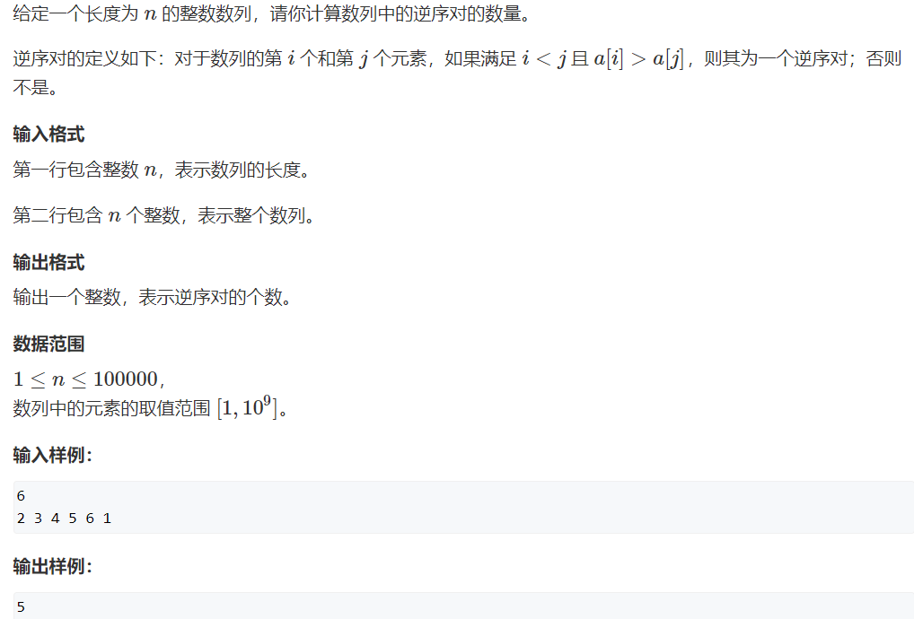

>

```cpp
//给定一个长度为 n 的整数数列，请你计算数列中的逆序对的数量。
//对于数列的第 i 个和第 j 个元素，如果满足 i<j 且 a[i]>a[j]，则其为一个逆序对；否则不是。
#include <iostream>

using namespace std;

typedef long long LL;  //这里面数据最差的情况，5x10^9会大于int

const int N = 1e5 + 10;

int a[N], tmp[N];

LL merge_sort(int q[], int l, int r)
{
    if (l >= r) return 0;
    
    int mid = l + r >> 1;
    
    LL res = merge_sort(q, l, mid) + merge_sort(q, mid + 1, r);
    //归并的过程
    int k = 0, i = l, j = mid + 1;
    while (i <= mid && j <= r)
        if (q[i] <= q[j]) tmp[k++] = q[i++];
        else
        {
            res += mid - i + 1;  //最关键的一句
            tmp[k++] = q[j++];
        }
    //扫尾
    while (i <= mid) tmp[k++] = q[i++];
    while (j <= r) tmp[k++] = q[j++];
    //物归原主
    for (i = l, j = 0; i <= r; i++, j++) q[i] = tmp[j];
    
    return res;
}

int main()
{
    int n;
    scanf("%d", &n);
    for (int i = 0; i < n; i++) scanf("%d", &a[i]);
    
    cout << merge_sort(a, 0, n - 1) << endl;
    
    return 0;
}
```


### 二分算法

#### 整数二分算法模板

二分模板一共有两个，分别适用于不同情况。
算法思路：假设目标值在闭区间`[l, r]`中， 每次将区间长度缩小一半，当`l = r`时，我们就找到了目标值。

**版本1**

当我们将区间`[l, r]`划分成`[l, mid]`和`[mid + 1, r]`时，其更新操作是`r = mid(左半边区间)`或者`l = mid + 1;(右半边区间)`计算`mid`时不需要加1。

**C++ 代码模板：**

```cpp
int bsearch_1(int l, int r)
{
    while (l < r)
    {
        int mid = l + r >> 1;
        if (check(mid)) r = mid;
        else l = mid + 1;
    }
    return l;
}
```

**版本2**

当我们将区间`[l, r]`划分成`[l, mid - 1]`和`[mid, r]`时，其更新操作是`r = mid - 1(左半边区间)`或者`l = mid;(右半边区间)`，此时为了防止死循环，计算`mid`时需要加1。

**C++ 代码模板：**

```cpp
int bsearch_2(int l, int r)
{
    while (l < r)
    {
        int mid = l + r + 1 >> 1;
        if (check(mid)) l = mid;
        else r = mid - 1;
    }
    return l;
}
```

#### 整数二分模板

```cpp
bool check(int x) {/* ... */} // 检查x是否满足某种性质

// 区间[l, r]被划分成[l, mid]和[mid + 1, r]时使用：
int bsearch_1(int l, int r)
{
    while (l < r)
    {
        int mid = l + r >> 1;
        if (check(mid)) r = mid;    // check()判断mid是否满足性质
        else l = mid + 1;
    }
    return l;
}
// 区间[l, r]被划分成[l, mid - 1]和[mid, r]时使用：
int bsearch_2(int l, int r)
{
    while (l < r)
    {
        int mid = l + r + 1 >> 1;
        if (check(mid)) l = mid;
        else r = mid - 1;
    }
    return l;
}
```

#### 浮点数二分模板

由于浮点数没有向下取整，可以严格的整除，所以不需要考虑边界问题。

如果题目让保留4位小数，则写1e-6,如过让保留5位小数，则写1e-7，如6，写1e-8。

```cpp
bool check(double x) {/* ... */} // 检查x是否满足某种性质

double bsearch_3(double l, double r)
{
    const double eps = 1e-6;   // eps 表示精度，取决于题目对精度的要求
    while (r - l > eps)
    {
        double mid = (l + r) / 2;  //浮点数不能写右移一位
        if (check(mid)) r = mid;
        else l = mid;
    }
    return l;
}
```


#### 整数二分求数的范围

**题目**

> 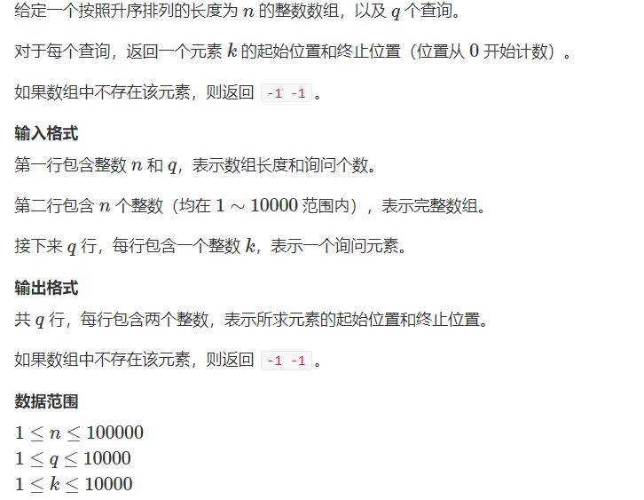
>
> 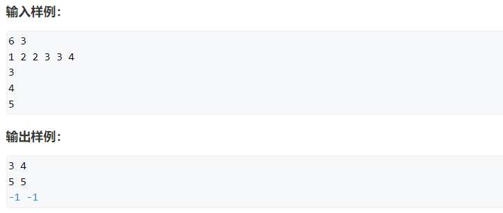

**基本思想**

==将区间一分为二，利用二分寻找“性质”的边界。==

==首先分析一下更新区间情况是l = mid还是r=mid，确定mid，然后套模板。==

> 

==红色边界点 （如果更新区间情况是l = mid，则需要给mid补上+1，防止l = r - 1时陷入死循环）==

> 

==绿色边界点==

> 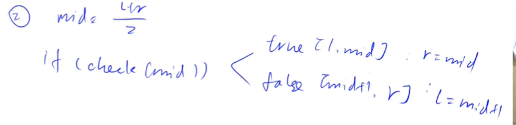

**讲解链接**

[二分查找bilibili动画演示](https://www.bilibili.com/video/BV1d54y1q7k7?from=search&seid=14378360076371462119)

[二分查找AcWing题解](https://www.acwing.com/solution/content/3338/ )

```cpp
//给定一个按照升序排列的长度为 n 的整数数组，以及 q 个查询。
//对于每个查询，返回一个元素 k 的起始位置和终止位置（位置从 0 开始计数）。
#include <iostream>

using namespace std;
const int N = 100010;

int n, m;
int q[N];

int main()
{
    scanf("%d%d", &n, &m);
    for (int i = 0; i < n; i++) scanf("%d", &q[i]);
    
    while (m--)
    {
        int x;
        scanf("%d", &x);    
        int l = 0, r = n - 1;  //数组左右边界
        while (l < r)
        {
            int mid = l + r >> 1;
            if (q[mid] >= x) r = mid;
            else l = mid + 1;
        }
        
        if (q[l] != x) cout << "-1 -1" << endl;
        else
        {
            cout << l << ' ';
            int l = 0, r = n - 1;
            while (l < r)
            {
                int mid = l + r + 1 >> 1;
                if (q[mid] <= x) l = mid;
                else r = mid - 1;
            }
            cout << l << endl;
        }
    }
    return 0;
}
```


#### 浮点数二分计算数的三次方根

**题目**

>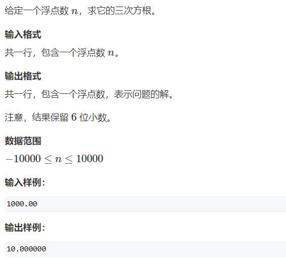

给定一个浮点数 nn，求它的三次方根。

> 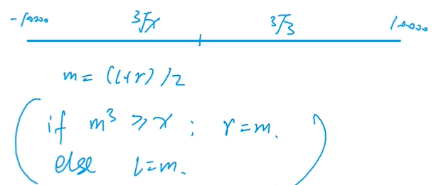

```cpp
#include <iostream>

using namespace std;

int main()
{
    double n;
    cin >> n;
    
    double l = -10000, r = 10000;
    while (r - l > 1e-8)
    {   
        double mid = (l + r) / 2;
        if (mid * mid * mid >= n) r = mid;
        else l = mid;
    }
    printf("%lf\n", l);  //默认6位小数

    return 0;
}
```


### 高精度算法

大整数存储

#### 高精度加法

**题目**

>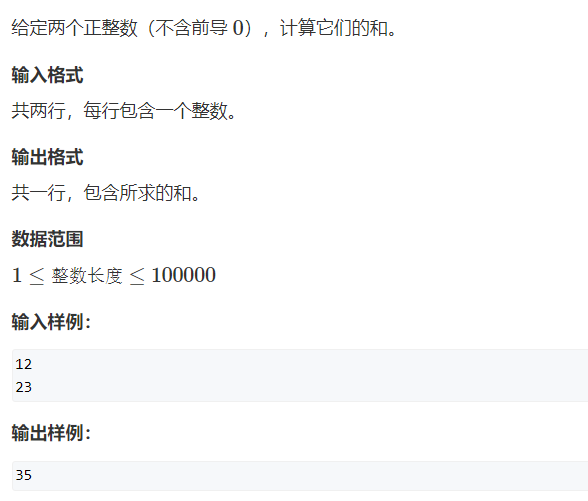

**不压位做法**

> 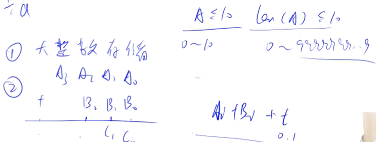

```cpp
#include <iostream>
#include <vector>

using namespace std;

//用数组表示的整数A, B, C
// C = A + B, A >= 0, B >= 0
vector<int> add(vector<int>& A, vector<int>& B)
{
    if (A.size() < B.size()) return add(B, A);  //让位数多的在前
    
    vector<int> C;
    int t = 0;  //进位
    for (int i = 0; i < A.size(); i++)
    {
        t += A[i];
        if (i < B.size()) t += B[i];
        C.push_back(t % 10);
        t /= 10;  //判断要不要进位
    }
    if (t) C.push_back(t);  //循环加运算结束后，判断最高位是否要进位
    return C;
}

int main()
{
    string a,b; // a = "1234"
    vector<int> A, B;
    
    cin >> a >> b;
    //由于输入的数字被读入到string中，为ASCII码值，要转换为数字，需要减去'0'
    for (int i = a.size() - 1; i >= 0; i--) A.push_back(a[i] - '0');  //A = [4,3,2,1]
    for (int i = b.size() - 1; i >= 0; i--) B.push_back(b[i] - '0'); 
    
    auto C = add(A, B);
    
    for (int i = C.size() - 1; i >= 0; i--) printf("%d", C[i]);
    return 0;
}
```

**压9位做法（快一倍）**

```cpp
#include <iostream>
#include <vector>

using namespace std;

const int base = 1000000000;

vector<int> add(vector<int> &A, vector<int> &B)
{
    if (A.size() < B.size()) return add(B, A);

    vector<int> C;
    int t = 0;
    for (int i = 0; i < A.size(); i ++ )
    {
        t += A[i];
        if (i < B.size()) t += B[i];
        C.push_back(t % base);
        t /= base;
    }

    if (t) C.push_back(t);
    return C;
}

int main()
{
    string a, b;
    vector<int> A, B;
    cin >> a >> b;

    for (int i = a.size() - 1, s = 0, j = 0, t = 1; i >= 0; i -- )
    {
        s += (a[i] - '0') * t;
        j ++, t *= 10;
        if (j == 9 || i == 0)
        {
            A.push_back(s);
            s = j = 0;
            t = 1;
        }
    }
    for (int i = b.size() - 1, s = 0, j = 0, t = 1; i >= 0; i -- )
    {
        s += (b[i] - '0') * t;
        j ++, t *= 10;
        if (j == 9 || i == 0)
        {
            B.push_back(s);
            s = j = 0;
            t = 1;
        }
    }

    auto C = add(A, B);

    cout << C.back();
    for (int i = C.size() - 2; i >= 0; i -- ) printf("%09d", C[i]);
    cout << endl;

    return 0;
}
```


#### 高精度减法

**题目**

>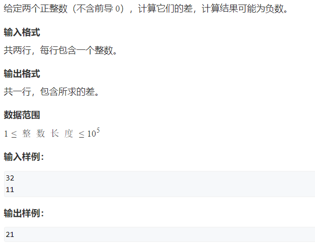

> 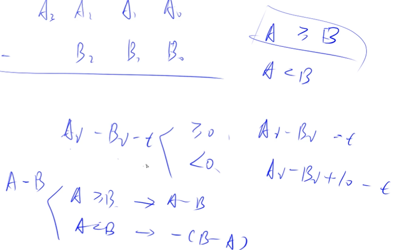

```cpp
#include <iostream>
#include <vector>

using namespace std;

//判断是否有 A >= B
bool cmp(vector<int>& A, vector<int>& B)
{
    if (A.size() != B.size()) return A.size() > B.size();
    for (int i = A.size() - 1; i >= 0; i--)
        if (A[i] != B[i])
            return A[i] > B[i];
    return true;
}

// C = A - B, 满足A >= B, A >= 0, B >= 0
vector<int> sub(vector<int>& A, vector<int>& B)
{
	vector<int> C;
    for (int i = 0, t = 0; i < A.size(); i++)
    {
        t = A[i] - t;
        if (i < B.size()) t -= B[i];
        C.push_back((t + 10) % 10);   //防止t为负数
        if (t < 0) t = 1;
        else t = 0;
    }
    while (C.size() > 1 && C.back() == 0) C.pop_back(); //去掉前导0
    return C;
}

int main()
{
    string a,b; // a = "1234"
    vector<int> A, B;
    
    cin >> a >> b;
    for (int i = a.size() - 1; i >= 0; i--) A.push_back(a[i] - '0');  //A = [4,3,2,1]
    for (int i = b.size() - 1; i >= 0; i--) B.push_back(b[i] - '0'); 
    
    if (cmp(A, B))
    {
        auto C = sub(A, B);
        for (int i = C.size() - 1; i >= 0; i--) printf("%d", C[i]);
    }
    else
    {
        auto C = sub(B, A);
        printf("-");
		for (int i = C.size() - 1; i >= 0; i--) printf("%d", C[i]);
    }
    return 0;
}
```


#### 高精度乘低精度

**题目**

>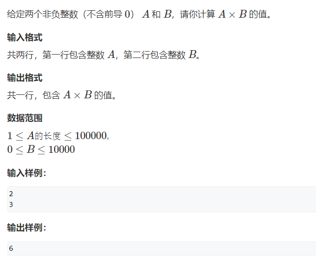

将b看成一个整体与A相乘

> 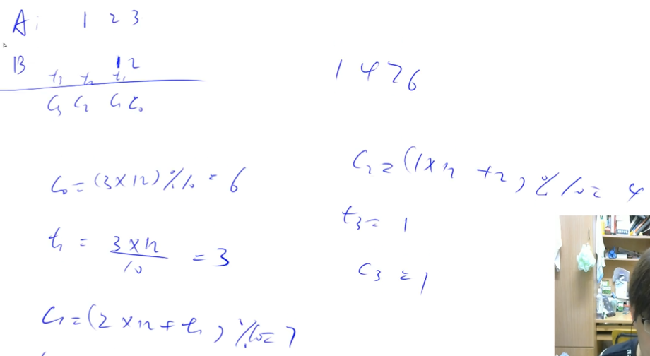

```cpp
#include <iostream>
#include <vector>

using namespace std;

// C = A * b, A >= 0, b >= 0
vector<int> mul(vector<int>& A, int b)
{
    vector<int> C;
    
    int t = 0;
    for (int i = 0; i < A.size() || t; i++)
    {
        if (i < A.size()) t += A[i] * b;
        C.push_back(t % 10);
        t /= 10;
    }
    while (C.size() > 1 && C.back() == 0) C.pop_back();
    return C;
}

int main()
{
    string a;
    int b;
    
    cin >> a >> b;
    vector<int> A;
    for (int i = a.size() - 1; i >= 0; i--) A.push_back(a[i] - '0');
    
    auto C = mul(A, b);
    
    for (int i = C.size() - 1; i >= 0; i--) printf("%d", C[i]);
    
    return 0;
}
```


#### 高精度除以低精度

**题目**

>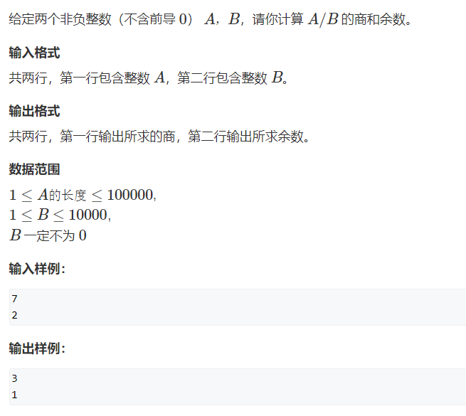

> 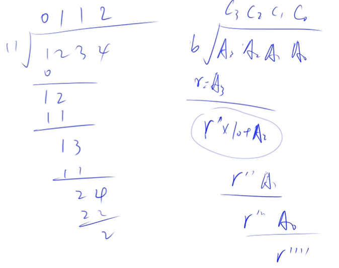

```cpp
#include <iostream>
#include <vector>
#include <algorithm>

using namespace std;

// A / b = C ... r, A >= 0, b > 0
vector<int> div(vector<int>& A, int b, int& r)
{
    vector<int> C;
    r = 0;
    for (int i = A.size() - 1; i >= 0; i -- )
    {
        r = r * 10 + A[i];
        C.push_back(r / b);
        r %= b;
    }
    reverse(C.begin(), C.end());  //反转数组
    while (C.size() > 1 && C.back() == 0) C.pop_back();
    return C;
}

int main()
{
    string a;
    vector<int> A;

    int B;
    cin >> a >> B;
    for (int i = a.size() - 1; i >= 0; i--) A.push_back(a[i] - '0');

    int r;
    auto C = div(A, B, r);

    for (int i = C.size() - 1; i >= 0; i--) cout << C[i];

    cout << endl << r << endl;

    return 0;
}
```


### 前缀和

#### 一维前缀和

**题目**

>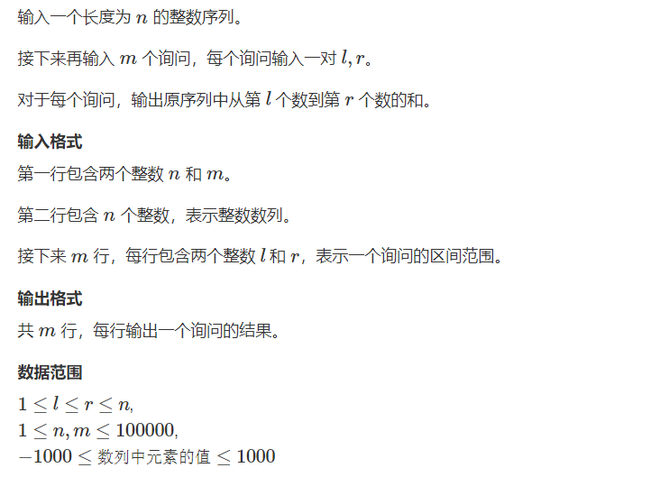
>
>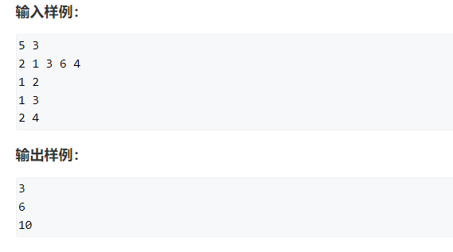

为了便于运算，防止越界，前缀和下标一般从1开始，S0 = 0

通过建立S[i]，使求前缀和的时间复杂度从O(n)变为O(1)。

> 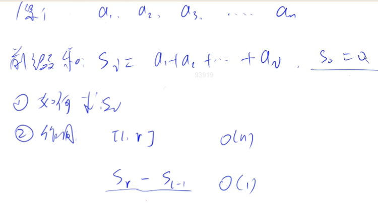
>
> 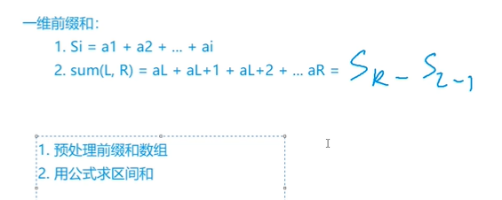

```cpp
//输入一个长度为 n 的整数序列。
//接下来再输入 m 个询问，每个询问输入一对 l,r。
//对于每个询问，输出原序列中从第 l 个数到第 r 个数的和。
#include <iostream>

using namespace std;

const int N = 100010;

int n, m;
int a[N], s[N];

int main()
{
    scanf("%d%d", &n, &m);
    for (int i = 1; i <= n; i ++ ) scanf("%d", &a[i]);

    for (int i = 1; i <= n; i ++ ) s[i] = s[i - 1] + a[i]; // 前缀和的初始化

    while (m -- )
    {
        int l, r;
        scanf("%d%d", &l, &r);
        printf("%d\n", s[r] - s[l - 1]); // 区间和的计算
    }

    return 0;
}
```

#### 一维前缀和模板

```cpp
S[i] = a[1] + a[2] + ... a[i]
a[l] + ... + a[r] = S[r] - S[l - 1]
```


#### 二维前缀和

**题目**

>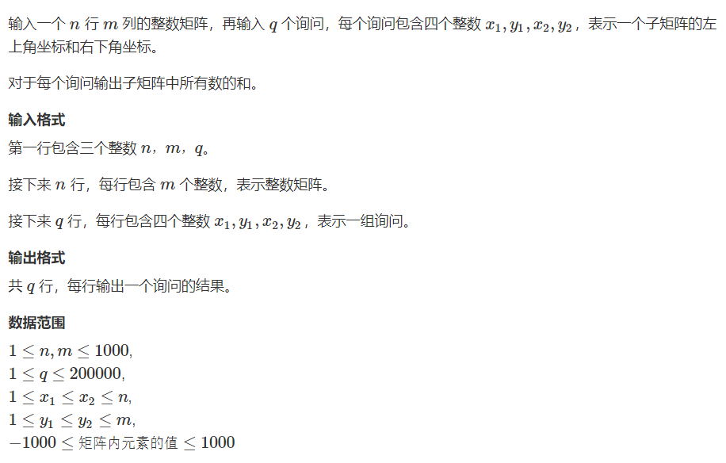
>
>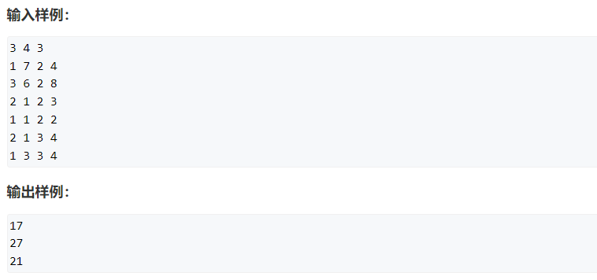

为了便于运算，前缀和下标一般从1开始

Sij代表其及其左上角所有数的和

> 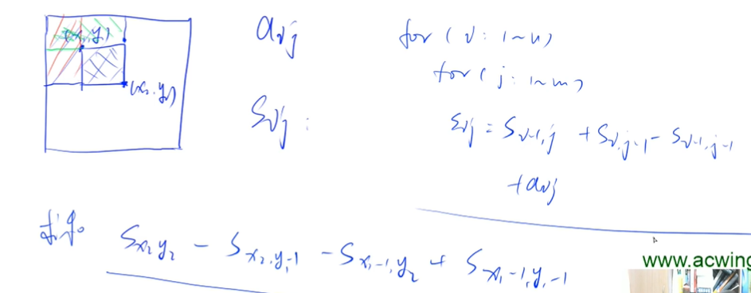
>
> 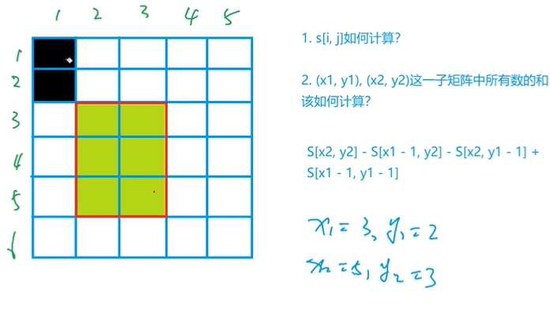

```cpp
//输入一个 n 行 m 列的整数矩阵，再输入 q 个询问，每个询问包含四个整数 x1,y1,x2,y2，表示一个子矩阵的左上角坐标和右下角坐标。
//对于每个询问输出子矩阵中所有数的和。
#include <iostream>

using namespace std;

const int N = 1010;

int n, m, q;
int s[N][N];

int main()
{
    scanf("%d%d%d", &n, &m, &q);

    for (int i = 1; i <= n; i ++ )
        for (int j = 1; j <= m; j ++ )
            scanf("%d", &s[i][j]);
	//初始化前缀和数组
    for (int i = 1; i <= n; i ++ )
        for (int j = 1; j <= m; j ++ )
            s[i][j] += s[i - 1][j] + s[i][j - 1] - s[i - 1][j - 1];  //求前缀和
	//询问
    while (q -- )
    {
        int x1, y1, x2, y2;
        scanf("%d%d%d%d", &x1, &y1, &x2, &y2);
        printf("%d\n", s[x2][y2] - s[x1 - 1][y2] - s[x2][y1 - 1] + s[x1 - 1][y1 - 1]);  //算子矩阵和
    }

    return 0;
}
```

#### 二维前缀和模板

```cpp
//S[i, j] = 第i行j列格子左上部分所有元素的和
s[i][j] += s[i - 1][j] + s[i][j - 1] - s[i - 1][j - 1];  //求前缀和
//以(x1, y1)为左上角，(x2, y2)为右下角的子矩阵的和为：
S[x2, y2] - S[x1 - 1, y2] - S[x2, y1 - 1] + S[x1 - 1, y1 - 1]
```


### 差分

#### 一维差分

**题目**

>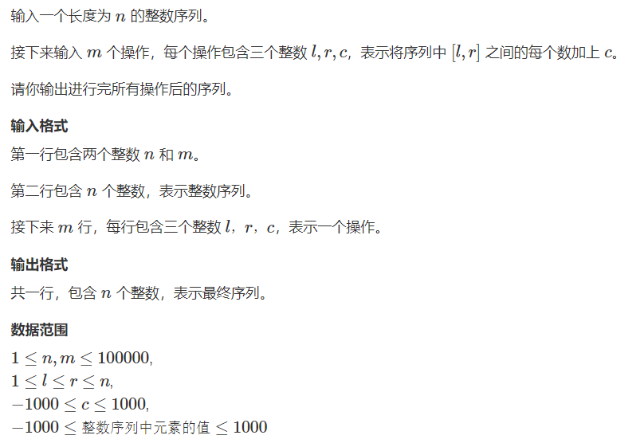
>
>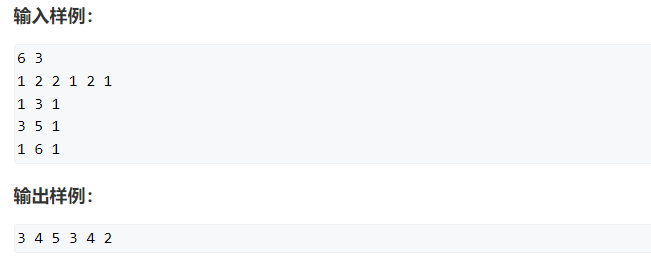

差分的作用，用O(1)的时间给原数组中间的某一个连续区间全部加上一个固定的值。

a[i]为b[i]的前缀和。

> 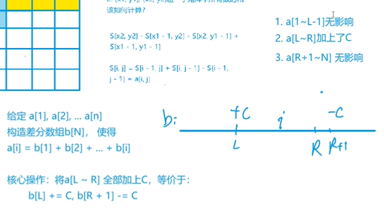

> 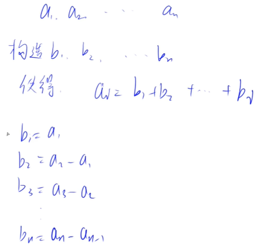

> 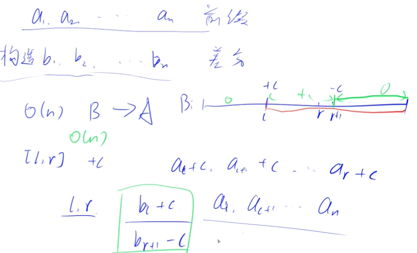

```cpp
//输入一个长度为 n 的整数序列。
//接下来输入 m 个操作，每个操作包含三个整数 l,r,c，表示将序列中 [l,r] 之间的每个数加上 c。
//请你输出进行完所有操作后的序列。
#include <iostream>

using namespace std;

const int N = 100010;

int n, m;
int a[N], b[N];

void insert(int l, int r, int c)
{
    b[l] += c;
    b[r + 1] -= c;
}

int main()
{
    scanf("%d%d", &n, &m);
    for (int i = 1; i <= n; i ++ ) scanf("%d", &a[i]);
	//第一遍生成b[i]时，b[i + 1] = a[i + 1] - a[i]
    for (int i = 1; i <= n; i ++ ) insert(i, i, a[i]);

    while (m -- )
    {   
        int l, r, c;
        scanf("%d%d%d", &l, &r, &c);
        insert(l, r, c);  //此处b[l] = b[l] + c = a[l] + a[l - 1] + c
    }
	//第二遍生成b[i]时(即题目需要的a[i])，
    //b[l] = b[l] + b[l - 1]=a[l] - a[l - 1] + a[l - 1] + c = a[l] + c, 依次类推直到-c处
    for (int i = 1; i <= n; i ++ ) b[i] += b[i - 1];

    for (int i = 1; i <= n; i ++ ) printf("%d ", b[i]);

    return 0;
}
```

#### 一维差分模板

```cpp
给区间[l, r]中的每个数加上c：B[l] += c, B[r + 1] -= c
```


#### 二维差分

**题目**

>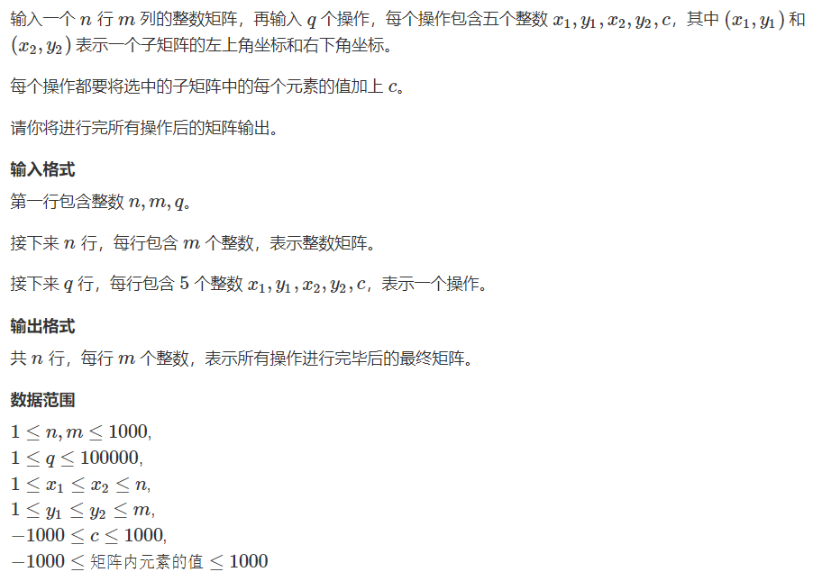
>
>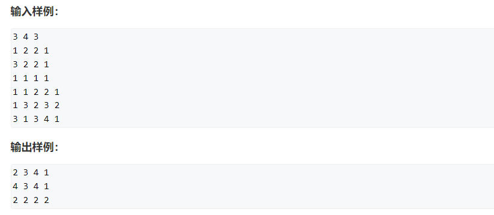

> 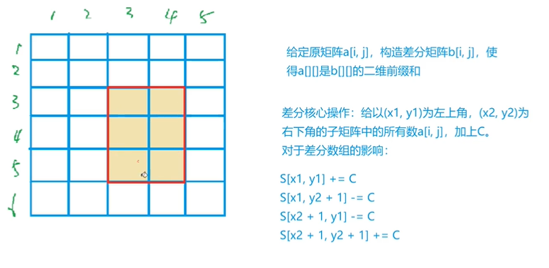

> 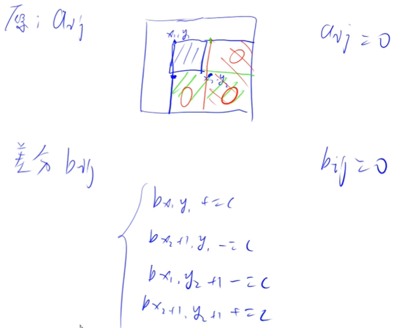

```cpp
//输入一个 n 行 m 列的整数矩阵，再输入 q 个操作，每个操作包含五个整数 x1,y1,x2,y2,c，其中 (x1,y1) 和 (x2,y2) 表示一个子矩阵的左上角坐标和右下角坐标。
//每个操作都要将选中的子矩阵中的每个元素的值加上 c。
//请你将进行完所有操作后的矩阵输出。
#include <iostream>

using namespace std;

const int N = 1010;

int n, m, q;
int a[N][N], b[N][N];

void insert(int x1, int y1, int x2, int y2, int c)
{
    b[x1][y1] += c;          //包含这个点的前缀和+c
    b[x2 + 1][y1] -= c;      //包含这个点的前缀和-c
    b[x1][y2 + 1] -= c;      //包含这个点的前缀和-c
    b[x2 + 1][y2 + 1] += c;  //包含这个点的前缀和+c
}

int main()
{
    scanf("%d%d%d", &n, &m, &q);

    for (int i = 1; i <= n; i ++ )
        for (int j = 1; j <= m; j ++ )
            scanf("%d", &a[i][j]);

    for (int i = 1; i <= n; i ++ )
        for (int j = 1; j <= m; j ++ )
            insert(i, j, i, j, a[i][j]);

    while (q -- )
    {
        int x1, y1, x2, y2, c;
        cin >> x1 >> y1 >> x2 >> y2 >> c;
        insert(x1, y1, x2, y2, c);
    }

    for (int i = 1; i <= n; i ++ )
        for (int j = 1; j <= m; j ++ )
            b[i][j] += b[i - 1][j] + b[i][j - 1] - b[i - 1][j - 1];

    for (int i = 1; i <= n; i ++ )
    {
        for (int j = 1; j <= m; j ++ ) printf("%d ", b[i][j]);
        puts("");
    }

    return 0;
}
```

#### 二维差分模板

```cpp
//给以(x1, y1)为左上角，(x2, y2)为右下角的子矩阵中的所有元素加上c
S[x1, y1] += c, S[x2 + 1, y1] -= c, S[x1, y2 + 1] -= c, S[x2 + 1, y2 + 1] += c
```


### 双指针算法

常见问题分类：
 (1) 对于一个序列，用两个指针维护一段区间
 (2) 对于两个序列，维护某种次序，比如归并排序中合并两个有序序列的操作

先写一个暴力n^2的做法，然后判断i和j有没有单调关系，利用单调关系套模板把时间复杂度变成O(n)

> 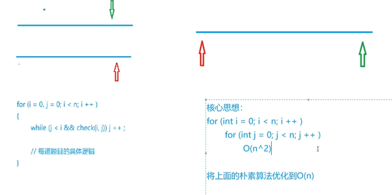
>
> 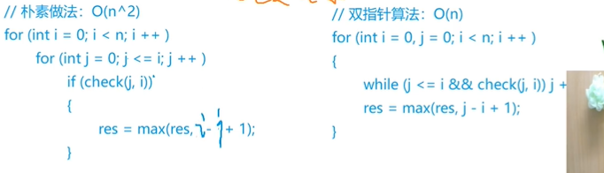

#### 双指针模板

```cpp
for (int i = 0, j = 0; i < n; i++)
{
    while (j < i && check(i, j)) j++;

    // 具体问题的逻辑
}
```


#### 双指针输出单词

**题目**

>abc def chi 输出每个单词

```cpp
//abc def chi 输出每个单词
#include <iostream>
#include <string.h>

using namespace std;

int main()
{
    char str[1000];
    gets(str);
    int n = strlen(str);
    for (int i = 0; i < n; i++)
    {
        int j = i;
        while (j < n && str[j] != ' ') j++;
        //这道题的具体实现
        for (int k = i; k < j; k++) cout << str[k];
        cout << endl;
        i = j;
    }
    return 0;        
}
```


#### 最长连续不重复子序列

**题目**

>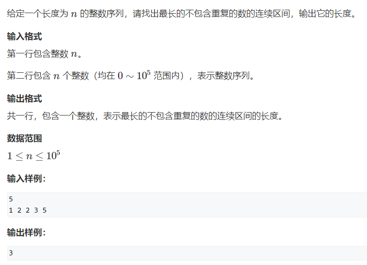

> 核心思路：
>
> 遍历数组a中的每一个元素a[i], 对于每一个i，找到j使得双指针[j, i]维护的是以a[i]结尾的最长连续不重复子序列，长度为i - j + 1, 将这一长度与r的较大者更新给r。
> 对于每一个i，如何确定j的位置：由于[j, i - 1]是前一步得到的最长连续不重复子序列，所以如果[j, i]中有重复元素，一定是a[i]，因此右移j直到a[i]不重复为止==（由于[j, i - 1]已经是前一步的最优解，此时j只可能右移以剔除重复元素a[i]，不可能左移增加元素，因此，j具有“单调性”、本题可用双指针降低复杂度）。==
> 用数组s记录子序列a[j ~ i]中各元素出现次数，遍历过程中对于每一个i有四步操作：cin元素a[i] -> 将a[i]出现次数s[a[i]]加1 -> 若a[i]重复则右移j（s[a[j]]要减1） -> 确定j及更新当前长度i - j + 1给r。
> 注意细节：
>
> 当a[i]重复时，先把a[j]次数减1，再右移j。

```cpp
//给定一个长度为 n 的整数序列，请找出最长的不包含重复的数的连续区间，输出它的长度。
#include <iostream>

using namespace std;

const int N = 100010;

int n;
int a[N], s[N];

int main()
{
    scanf("%d", &n);
    for (int i = 0; i < n; i++) scanf("%d", &a[i]);
    
    int res = 0;
    for (int i = 0,j = 0; i < n; i++)
    {
        s[a[i]]++;  //数列中新增的数是a[i]
        //新增的a[i]与原数列中有一个重复的数，为了剔除之前那个重复的数，需要右移j直到数列中那个数的 s[a[i]] = s[a[j]] = 1, 然后j++
        while (j < i && s[a[i]] > 1) s[a[j++]]--;
        res = max(res, i - j + 1);
    }
    cout << res << endl;
    return 0;
}
```


#### 数组元素的目标和

**题目**

>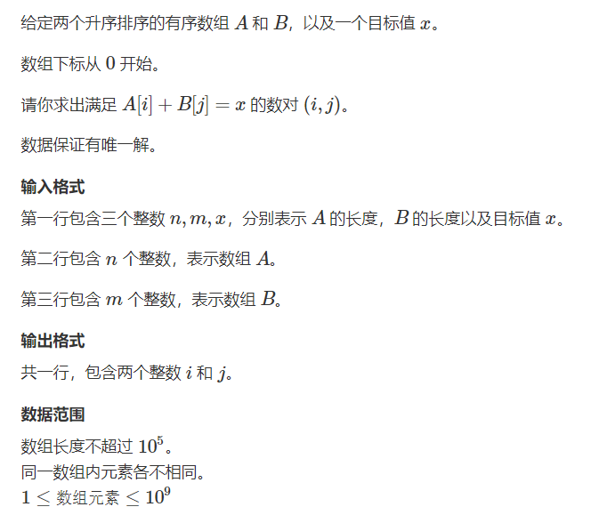
>
>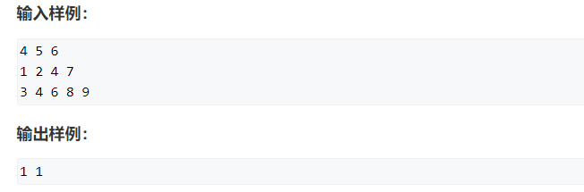

双指针算法就是先把暴力的做法写出来，查看有没有单调性，如果有就用双指针算法优化，

O(n^2)的复杂度优化为O(n+m)

> 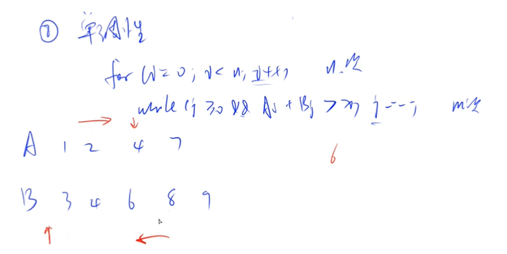

```cpp
/*给定两个升序排序的有序数组 A 和 B，以及一个目标值 x。

数组下标从 0 开始。

请你求出满足 A[i]+B[j]=x 的数对 (i,j)。

数据保证有唯一解。*/
#include <iostream>
#include <algorithm>

using namespace std;

const int N = 100010;

int n, m, x;
int a[N], b[N];

int main()
{
    scanf("%d%d%d", &n, &m, &x);
    for (int i = 0; i < n; i++) scanf("%d", &a[i]);
    for (int i = 0; i < m; i++) scanf("%d", &b[i]);
    
    for (int i = 0, j = m - 1; i < n; i++)
    {
        while (j >= 0 && a[i] + b[j] > x) j--;
        if (a[i] + b[j] == x)
        {
            printf("%d %d\n", i, j);
            break;
        }
    }
    return 0;
}
```


#### 判断子序列

**题目**

>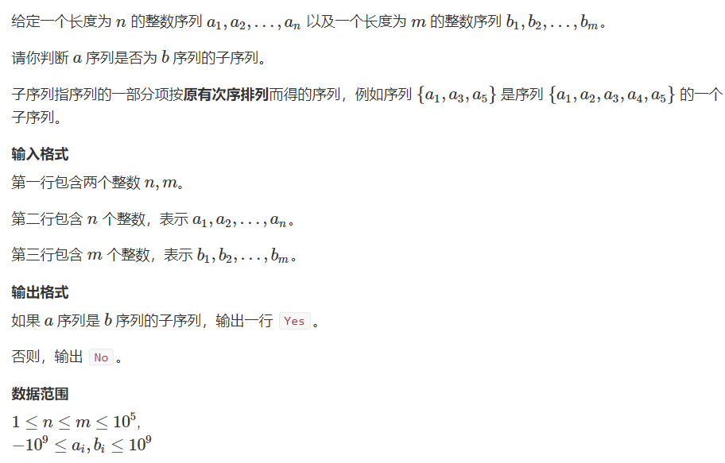
>
>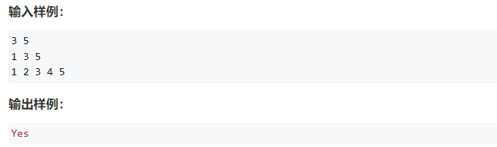

>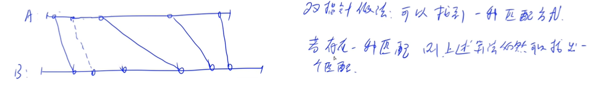

```cpp
/*给定一个长度为 n 的整数序列 a1,a2,…,an 以及一个长度为 m 的整数序列 b1,b2,…,bm。
请你判断 a 序列是否为 b 序列的子序列。
子序列指序列的一部分项按原有次序排列而得的序列，例如序列 {a1,a3,a5} 是序列 {a1,a2,a3,a4,a5} 的一个子序列。
*/
#include <iostream>
#include <cstring>

using namespace std;

const int N = 100010;

int n, m;
int a[N], b[N];

int main()
{
    scanf("%d%d", &n, &m);
    for (int i = 0; i < n; i++) scanf("%d", &a[i]);
    for (int i = 0; i < m; i++) scanf("%d", &b[i]);
    
    int i = 0, j = 0;
    while (i < n && j < m)
    {
        if (a[i] == b[j]) i++;
        j++;
    }
    
    if (i == n) puts("Yes");
    else puts("No");
    
    return 0;
}
```


### 位运算

#### 求n的第k位数字

> 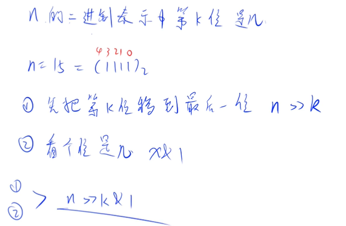

#### 返回n的最后一位1

`-x = ~x + 1`

`x & -x = x & (~x + 1)`

#### 位运算模板

```cpp
求n的第k位数字: n >> k & 1
返回n的最后一位1：lowbit(n) = n & -n
```


#### 二进制中1的个数

**题目**

>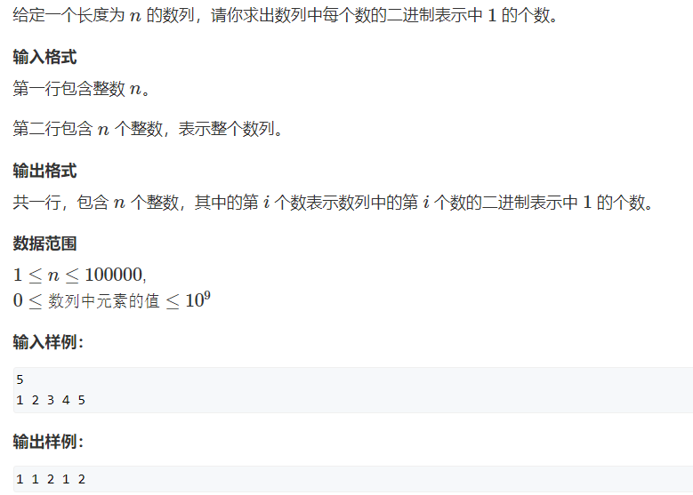

> 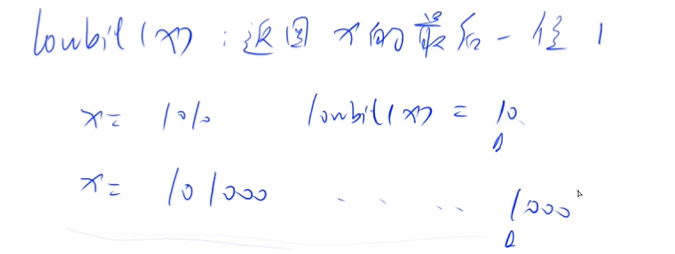
>
> 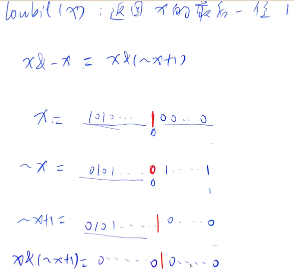

```cpp
//给定一个长度为 n 的数列，请你求出数列中每个数的二进制表示中 1 的个数。
#include <iostream>

using namespace std;

int lowbit(int x)
{
    return x & -x;
}

int main()
{
    int n;
    cin >> n;
    while (n--)
    {
        int x;
        cin >> x;
        
        int res = 0;
        while (x) x-= lowbit(x), res++; //每次减去x的最后一位1
        
        cout << res << ' ';
    }
    return 0;
}
```


### 离散化

数据范围跨度很大，但数据少，非常稀疏

#### 离散化模板

```cpp
vector<int> alls; // 存储所有待离散化的值
sort(alls.begin(), alls.end()); // 将所有值排序
alls.erase(unique(alls.begin(), alls.end()), alls.end());   // 去掉重复元素
//unique()将数组当中所有元素去重，将重复元素放到最后，并返回重复元素开头的地址
// 二分求出x对应的离散化的值
int find(int x) // 找到第一个大于等于x的位置
{
    int l = 0, r = alls.size() - 1;
    while (l < r)
    {
        int mid = l + r >> 1;
        if (alls[mid] >= x) r = mid;
        else l = mid + 1;
    }
    return r + 1; // 映射到1, 2, ...n,不加1从0映射
}
```


#### 区间和

**题目**

>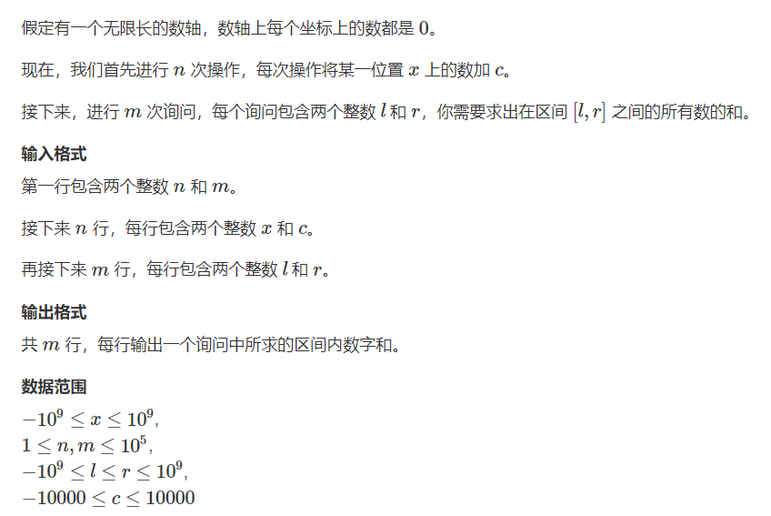
>
>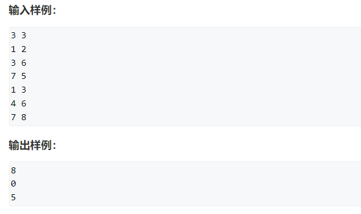

>主要分为5大步：
>1.读输入。将每次读入的x c push_back()到add中，将每次读入的位置x push_back()到alls中，将每次读入的l r push_back()到query中。
>2.排序、去重。
>3.通过遍历add，完成在离散化的数组映射到的a数组中进行加上c的操作（用到find函数）。
>4.初始化s数组。
>5.通过遍历query，完成求区间[l,r]的和。
>
>问题
>1.为什么要在alls中需要alls.push_back(l);alls.push_back(r);？
>
>首先要明确alls中存放的是位置而不是值，也就是存放的是x而不是c。
>
>因为再求区间和的时候，我们提前分析到可以使用前缀和来做，求前缀和就需要下标l r，如果不加入l r到alls中的话，第5步中遍历时query就没有办法通过输入的l r去访问a或者s。因为find函数就是输入映射前的下标，返回在alls中的下标+1。
>
>举个例子，拿平时的数组来说，下标都是整形，但是如果要求a[1.5]肯定是有错误的，在这里也一样。
>
>2.为什么要排序和去重？
>
>首先要明确find函数的功能，输入一个离散数组的位置（映射前的位置）x返回连续数组的位置+1（映射后的位置+1）。+1的目的是为了求区间和时少一步下标为0的判断。
>
>排序很好理解，因为在find函数中是使用了二分来查找x在alls中的下标+1，想要使用二分alls就必须具有某种性质这里就可以找一个最简单的办法使他单调（但是y总说过二分!=单调性）。
>
>去重看我下面画的图，图中的例子为本题的样例。（前半部分为在x处加c后alls与a中的内容，后半部分为假设不去重求[3 7]的区间和）
>
>

> 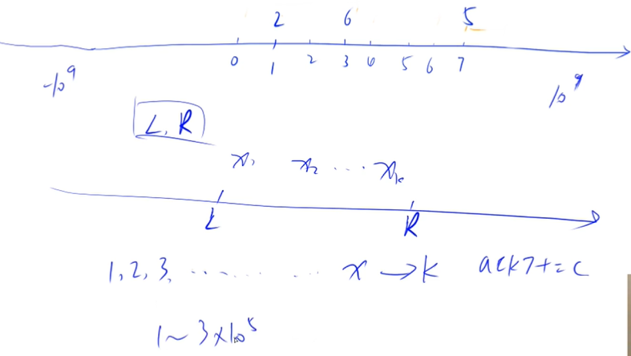

```cpp
//假定有一个无限长的数轴，数轴上每个坐标上的数都是 0。
//现在，我们首先进行 n 次操作，每次操作将某一位置 x 上的数加 c。
//接下来，进行 m 次询问，每个询问包含两个整数 l 和 r，你需要求出在区间 [l,r] 之间的所有数的和。
#include <iostream>
#include <vector>
#include <algorithm>

using namespace std;

typedef pair<int, int> PII;  //类型定义，每次询问的两个整数

const int N = 300010;

int n, m;
int a[N], s[N];  //a[N]为离散化后的数组,s[N]是a数组的前缀和

vector<int> alls;  //alls存的为所有要离散化的值
vector<PII> add, query;  

int find(int x)  //将坐标序号排序后，通过find()求得坐标序号在alls数组中的对应的下标，则其对应的值就是a数组响应下标+1对应的值,即a[r + 1]
{
    int l = 0, r = alls.size() - 1;
    while (l < r)
    {
        int mid = l + r >> 1;
        if (alls[mid] >= x) r = mid;
        else l = mid + 1;
    }
    return r + 1;
}
/*int find(int x)
{
	//lower_bound()查找(返回)有序区间中第一个大于或等于给定值的元素的位置
    return lower_bound(alls.begin(), alls.end(), x) - alls.begin() + 1;
}
*/

vector<int>::iterator unique(vector<int> &a)  //在有序的前提下，去重，要么它是第一个，要么是它跟前一个元素不一样
{
    int j = 0;
    for (int i = 0; i < a.size(); i ++ )
        if (!i || a[i] != a[i - 1])   //!i代表第一个数
            a[j ++ ] = a[i];
    // a[0] ~ a[j - 1] 所有a中不重复的数

    return a.begin() + j;
}

int main()
{
    cin >> n >> m;
    for (int i = 0; i < n; i ++ )  //插入操作
    {
        int x, c;
        cin >> x >> c;
        add.push_back({x, c});  //存储x,c,方便后面进行下标x的位置+c

        alls.push_back(x);  //下标x要离散化，把它存入待离散化的数组
    }

    for (int i = 0; i < m; i ++ )  //读入所有左右区间
    {
        int l, r;
        cin >> l >> r;
        query.push_back({l, r});

        alls.push_back(l);
        alls.push_back(r);
    }

    // 去重
    sort(alls.begin(), alls.end());
    alls.erase(unique(alls), alls.end());

    // 处理插入
    for (auto item : add)
    {
        int x = find(item.first);  //找到x对应的新的排序后的下标位置
        a[x] += item.second;   //a数组相应下标位置进行+c操作
    }

    // 预处理前缀和
    for (int i = 1; i <= alls.size(); i ++ ) s[i] = s[i - 1] + a[i];

    // 处理询问
    for (auto item : query)
    {
        int l = find(item.first), r = find(item.second);
        cout << s[r] - s[l - 1] << endl;
    }

    return 0;
}
```


### 区间合并

#### 区间合并模板

```cpp
// 将所有存在交集的区间合并
void merge(vector<PII> &segs)
{
    vector<PII> res;

    sort(segs.begin(), segs.end());

    int st = -2e9, ed = -2e9;
    for (auto seg : segs)
        if (ed < seg.first)
        {
            if (st != -2e9) res.push_back({st, ed});
            st = seg.first, ed = seg.second;
        }
        else ed = max(ed, seg.second);

    if (st != -2e9) res.push_back({st, ed});

    segs = res;
}
```


#### 区间合并习题

**题目**

>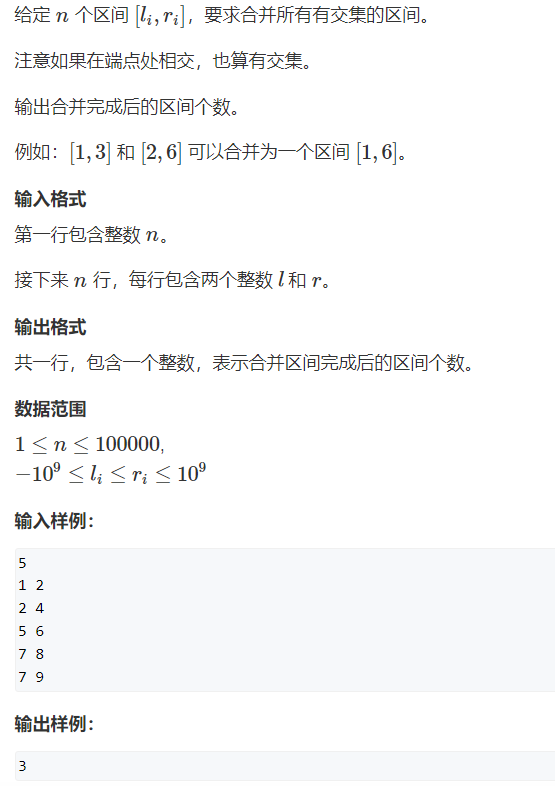

>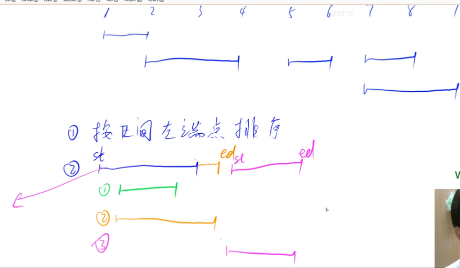

```cpp
//给定 n 个区间 [li,ri]，要求合并所有有交集的区间。
//注意如果在端点处相交，也算有交集。输出合并完成后的区间个数。
//例如：[1,3] 和 [2,6] 可以合并为一个区间 [1,6]。
#include <iostream>
#include <vector>
#include <algorithm>

using namespace std;

typedef pair<int, int> PII;

void merge(vector<PII> &segs)
{
    vector<PII> res;

    sort(segs.begin(), segs.end());  //按左端点排序
 
    int st = -2e9, ed = -2e9;  //st代表区间开头,ed代表区间结尾
    for (auto seg : segs)
        if (ed < seg.first)  //情况1，两个区间无法合并
        {
            if (st != -2e9) res.push_back({st, ed});  //区间1放进res数组
            st = seg.first, ed = seg.second;  //维护区间2
        }
        //情况2，两个区间可以合并，且区间1不包含区间2，区间2不包含区间1
        else ed = max(ed, seg.second);
 //考虑循环结束时的st,ed变量，此时的st,ed变量不需要继续维护，
//只需要放进res数组即可。因为这是最后的一个序列，所以不可能继续进行合并。
    if (st != -2e9) res.push_back({st, ed});

    segs = res;
}

int main()
{
    int n;
    scanf("%d", &n);

    vector<PII> segs;
    for (int i = 0; i < n; i ++ )
    {
        int l, r;
        scanf("%d%d", &l, &r);
        segs.push_back({l, r});
    }

    merge(segs);

    cout << segs.size() << endl;

    return 0;
}
```


