## 数据结构学习 - AcWing - HQ

[TOC]

----

#### 注意内容

- 


----

## 目录

> 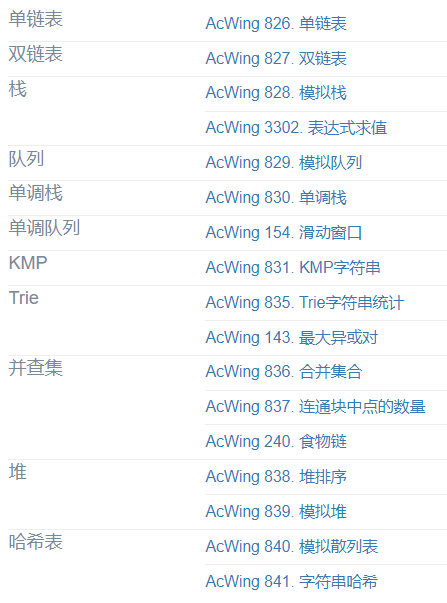


## 链表

链表分类及用来处理的问题

> 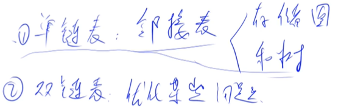

### 单链表

单链表结构形式

> 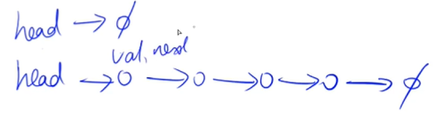

单链表在数组中的表示形式

> 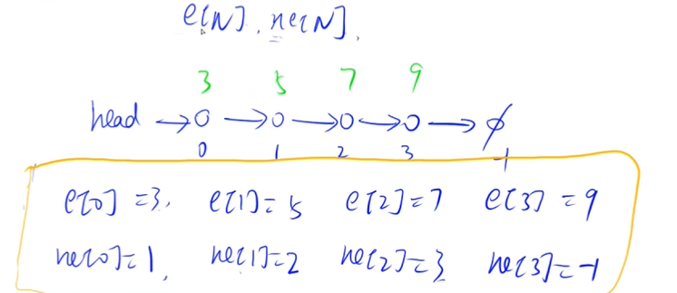

#### 单链表模板

```cpp
// head存储链表头，e[]存储节点的值，ne[]存储节点的next指针，idx表示当前用到了哪个节点
int head, e[N], ne[N], idx;

// 初始化
void init()
{
    head = -1;
    idx = 0;
}

// 在链表头插入一个数a
void insert(int a)
{
    e[idx] = a, ne[idx] = head, head = idx ++ ;
}

// 将头结点删除，需要保证头结点存在
void remove()
{
    head = ne[head];
}
```


#### 单链表习题

**题目**

>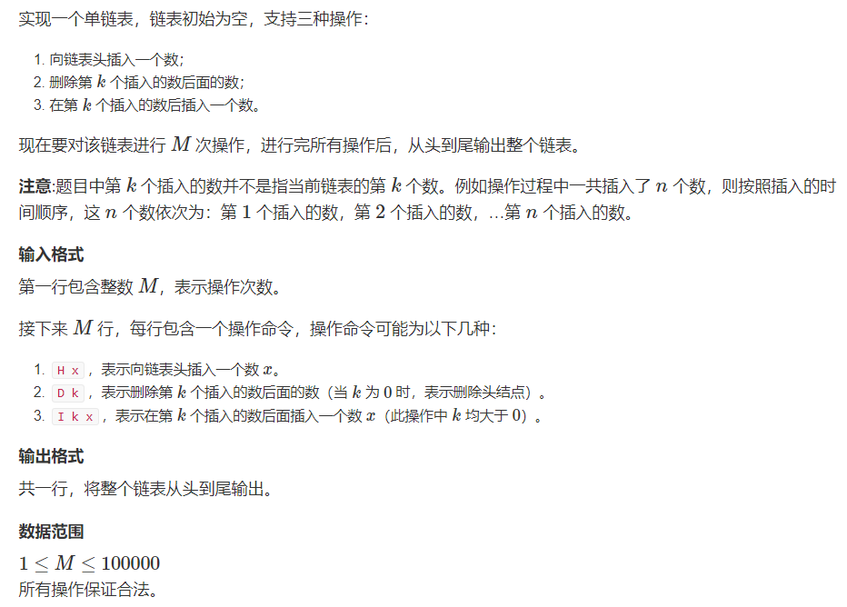
>
>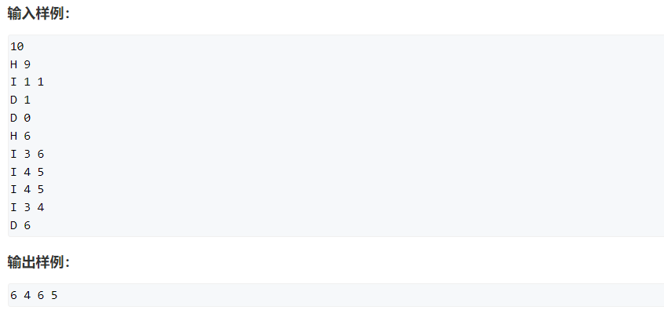

**链表操作图片演示**

> 将x插到头结点
>
> 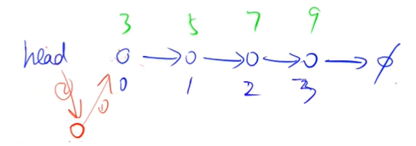

>将x插到下标为k的结点后面
>
>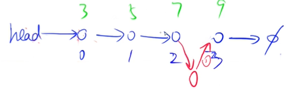

>将下标为k的点后面的点删掉
>
>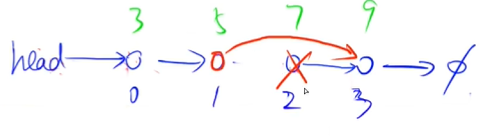

```cpp
/*实现一个单链表，链表初始为空，支持三种操作：

向链表头插入一个数；
删除第 k 个插入的数后面的数；
在第 k 个插入的数后插入一个数。
现在要对该链表进行 M 次操作，进行完所有操作后，从头到尾输出整个链表。*/
#include <iostream>

using namespace std;

const int N = 100010;

//head 表示头结点的下标
//e[i] 表示节点i的值
//ne[i] 表示节点i的next指针是多少
//idx 存储当前已经用到了哪个点
int head, e[N], ne[N], idx;

//初始化
void init()
{
    head = -1;
    idx = 0;
}

//将x插到头结点
void add_to_head(int x)
{
    e[idx] = x, ne[idx] = head, head = idx++;    
}

//将x插到下标为k的结点后面
void add(int k, int x)
{
    e[idx] = x, ne[idx] = ne[k], ne[k] = idx++;
}

//将下标为k的点后面的点删掉
void remove(int k)
{
    ne[k] = ne[ne[k]]; 
}

int main()
{
    int m;
    cin >> m;
    
    init();
    
    while (m--)
    {
        int k, x;
        char op;
        
        cin >> op;
        if (op == 'H')
        {
            cin >> x;
            add_to_head(x);
        }
        else if (op == 'D')
        {
            cin >> k;
            if (!k) head = ne[head];
            remove(k - 1);
        }
        else
        {
            cin >> k >> x;
            add(k - 1, x);
        }
    }
    for (int i = head; i != -1; i = ne[i]) cout << e[i] << ' ';
    cout << endl;
}
```


### 双链表

双链表结构形式

> 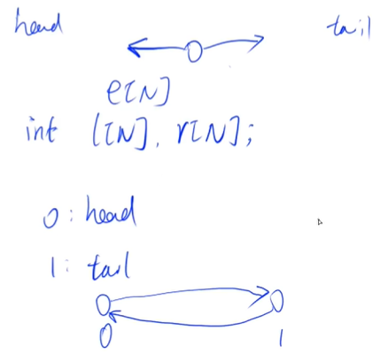

#### 双链表模板

```cpp
// e[]表示节点的值，l[]表示节点的左指针，r[]表示节点的右指针，idx表示当前用到了哪个节点
int e[N], l[N], r[N], idx;

// 初始化
void init()
{
    //0是左端点，1是右端点
    r[0] = 1, l[1] = 0;
    idx = 2;
}

// 在节点a的右边插入一个数x
void insert(int a, int x)
{
    e[idx] = x;
    l[idx] = a, r[idx] = r[a];
    l[r[a]] = idx, r[a] = idx ++ ;
}

// 删除节点a
void remove(int a)
{
    l[r[a]] = l[a];
    r[l[a]] = r[a];
}
```


#### 双链表习题

**题目**

>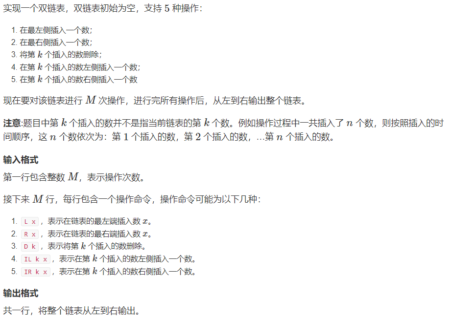
>
>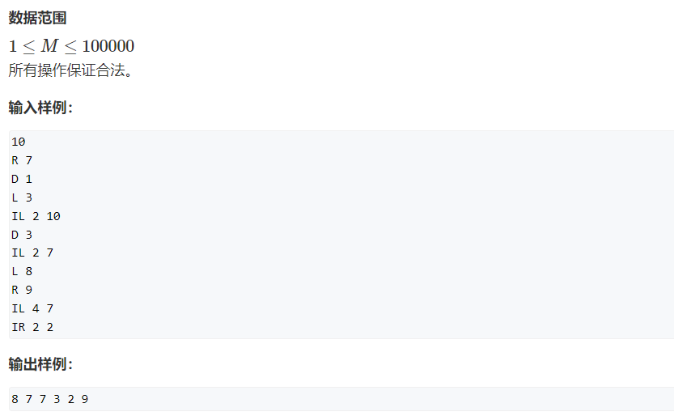

**链表操作图片演示**

> 在下标是k的点的右边，插入一个点x
>
> 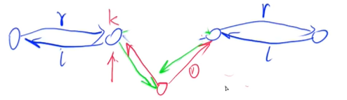

>删除第k个点
>
>

> 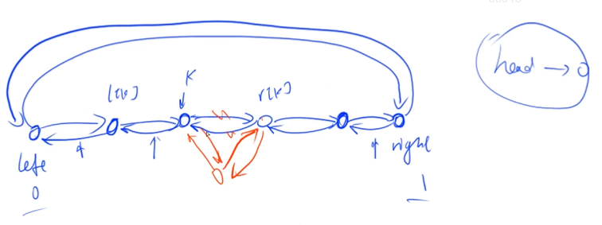

```cpp
/*实现一个双链表，双链表初始为空，支持 5 种操作：

在最左侧插入一个数；
在最右侧插入一个数；
将第 k 个插入的数删除；
在第 k 个插入的数左侧插入一个数；
在第 k 个插入的数右侧插入一个数
现在要对该链表进行 M 次操作，进行完所有操作后，从左到右输出整个链表。*/
#include <iostream>

using namespace std;

const int N = 100010;

int m;
int e[N], l[N], r[N], idx;

//初始化
void init()
{
    //0表示左端点，1表示右端点
    r[0] = 1, l[1] = 0;
    idx = 2;
}

// 在节点a的右边插入一个数x
void insert(int a, int x)
{
    e[idx] = x;
    l[idx] = a, r[idx] = r[a];
    l[r[a]] = idx, r[a] = idx ++ ;
}

// 删除节点a
void remove(int a)
{
    l[r[a]] = l[a];
    r[l[a]] = r[a];
}

int main()
{
    cin >> m;

   	init();

    while (m -- )
    {
        string op;
        cin >> op;
        int k, x;
        if (op == "L")
        {
            cin >> x;
            insert(0, x);
        }
        else if (op == "R")
        {
            cin >> x;
            insert(l[1], x);
        }
        else if (op == "D")
        {
            cin >> k;
            remove(k + 1);
        }
        else if (op == "IL")
        {
            cin >> k >> x;
            insert(l[k + 1], x);
        }
        else
        {
            cin >> k >> x;
            insert(k + 1, x);
        }
    }

    for (int i = r[0]; i != 1; i = r[i]) cout << e[i] << ' ';
    cout << endl;

    return 0;
}
```


## 栈和队列

栈——先进后出

队列——先进先出

### 栈

#### 栈模板

```cpp
1. 普通栈
// tt表示栈顶
int stk[N], tt = 0;

// 向栈顶插入一个数
stk[ ++ tt] = x;

// 从栈顶弹出一个数
tt -- ;

// 栈顶的值
stk[tt];

// 判断栈是否为空
if (tt > 0)
{
	//not empty
}

2. 单调栈
常见模型：找出每个数左边离它最近的比它大/小的数
int tt = 0;
for (int i = 1; i <= n; i ++ )
{
    while (tt && check(stk[tt], i)) tt -- ;
    stk[ ++ tt] = i;
}
```


#### 栈习题 —— 模拟栈

**题目**

>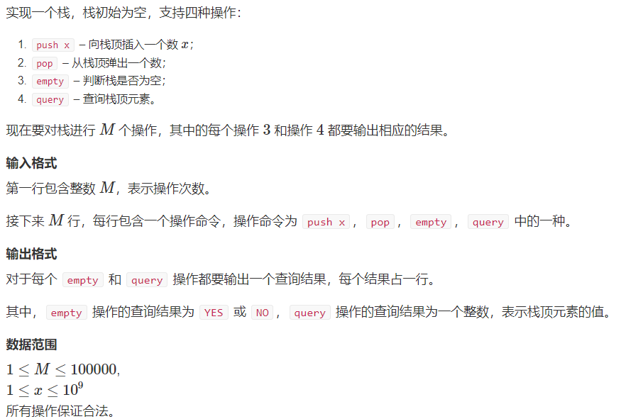
>
>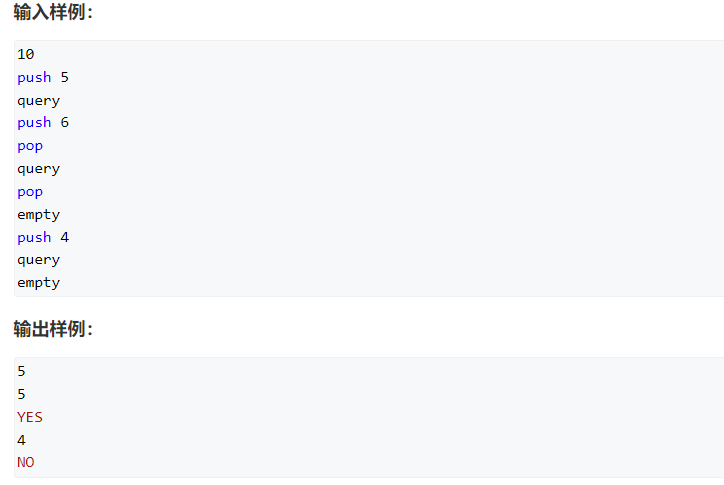

```cpp
/*实现一个栈，栈初始为空，支持四种操作：

push x – 向栈顶插入一个数 x；
pop – 从栈顶弹出一个数；
empty – 判断栈是否为空；
query – 查询栈顶元素。
现在要对栈进行 M 个操作，其中的每个操作 3 和操作 4 都要输出相应的结果。
*/
#include <iostream>

using namespace std;

const int N = 100010;

int m;
int stk[N], tt;

int main()
{
    cin >> m;
    while (m--)
    {
        string op;
        int x;
        
        cin >> op;
        if (op == "push")
        {
            cin >> x;
            stk[++tt] = x;
        }
        else if (op == "pop") tt--;
        else if (op == "empty") cout << (tt ? "NO" : "YES") << endl;
        else cout << stk[tt] << endl;
    }
    return 0;
}
```


#### 栈习题 —— 表达式求值

**题目**

>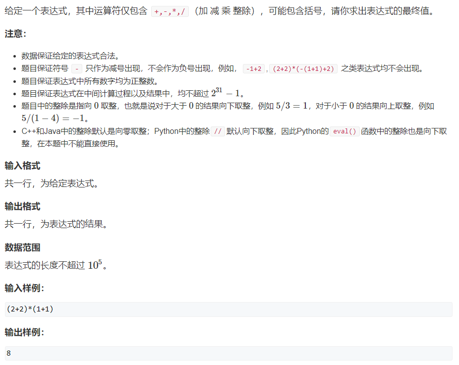

```cpp
/*给定一个表达式，其中运算符仅包含 +,-,*,/（加 减 乘 整除），可能包含括号，请你求出表达式的最终值。*/
#include <iostream>
#include <cstring>
#include <algorithm>
#include <stack>
#include <unordered_map>

using namespace std;

stack<int> num;
stack<char> op;

void eval()
{
    auto b = num.top(); num.pop();
    auto a = num.top(); num.pop();
    auto c = op.top(); op.pop();
    int x;
    if (c == '+') x = a + b;
    else if (c == '-') x = a - b;
    else if (c == '*') x = a * b;
    else x = a / b;
    num.push(x);
}

int main()
{
    unordered_map<char, int> pr{{'+', 1}, {'-', 1}, {'*', 2}, {'/', 2}};
    string str;
    cin >> str;
    for (int i = 0; i < str.size(); i ++ )
    {
        auto c = str[i];
        if (isdigit(c))
        {
            int x = 0, j = i;
            while (j < str.size() && isdigit(str[j]))
                x = x * 10 + str[j ++ ] - '0';
            i = j - 1;
            num.push(x);
        }
        else if (c == '(') op.push(c);
        else if (c == ')')
        {
            while (op.top() != '(') eval();
            op.pop();
        }
        else
        {
            while (op.size() && op.top() != '(' && pr[op.top()] >= pr[c]) eval();
            op.push(c);
        }
    }
    while (op.size()) eval();
    cout << num.top() << endl;
    return 0;
}
```


#### 单调栈

**题目**

>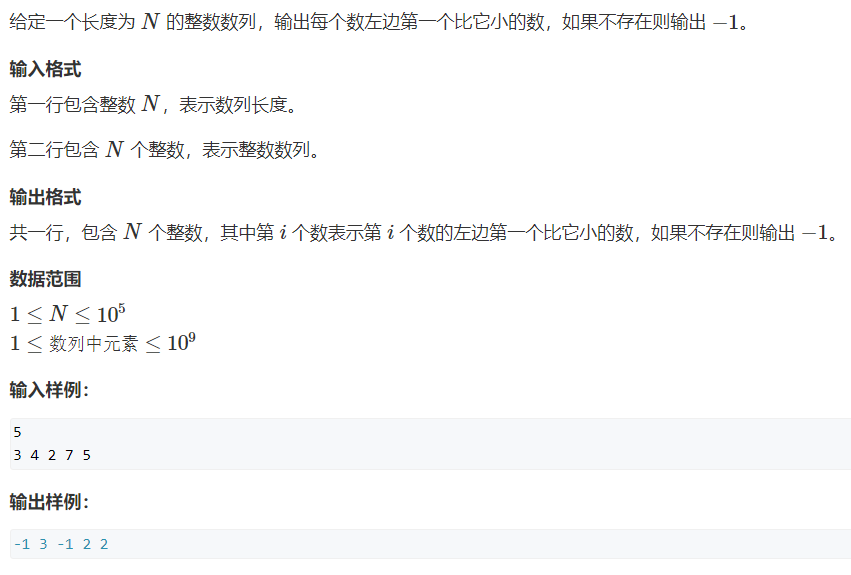

常见模型：找出每个数左边离它最近的比它大/小的数

>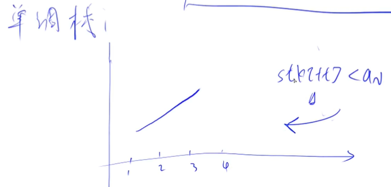

```cpp
//给定一个长度为 N 的整数数列，输出每个数左边第一个比它小的数，如果不存在则输出 −1。
#include <iostream>

using namespace std;

const int N = 100010;

int n;
int stk[N], tt;

int main()
{
    cin.tie(0);
    ios::sync_with_stdio(false);  //提高输入速度，scanf()比cin()快10倍
    
    cin >> n;
    
    for (int i = 0; i < n; i++)
    {
        int x; 
        cin >> x;
        while (tt && stk[tt] >= x) tt--;
        if (tt) cout << stk[tt] << endl;
        else cout << -1 << ' ';
        
        stk[++tt] = x;
    }
    return 0;
}
```


### 队列

先进先出（队尾进，队头出），队列弹出元素，hh++

> 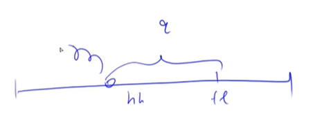

#### 队列模板

```cpp
1. 普通队列：
// hh 表示队头，tt表示队尾
int q[N], hh = 0, tt = -1;

// 向队尾插入一个数
q[ ++ tt] = x;

// 从队头弹出一个数
hh ++ ;

// 队头的值
q[hh];

// 判断队列是否为空
if (hh <= tt)
{

}

2. 循环队列
// hh 表示队头，tt表示队尾的后一个位置
int q[N], hh = 0, tt = 0;

// 向队尾插入一个数
q[tt ++ ] = x;
if (tt == N) tt = 0;

// 从队头弹出一个数
hh ++ ;
if (hh == N) hh = 0;

// 队头的值
q[hh];

// 判断队列是否为空
if (hh != tt)
{

}

3. 单调队列
常见模型：找出滑动窗口中的最大值/最小值
int hh = 0, tt = -1;
for (int i = 0; i < n; i ++ )
{
    while (hh <= tt && check_out(q[hh])) hh ++ ;  // 判断队头是否滑出窗口
    while (hh <= tt && check(q[tt], i)) tt -- ;
    q[ ++ tt] = i;
}

```


#### 队列习题 —— 模拟队列

**题目**

>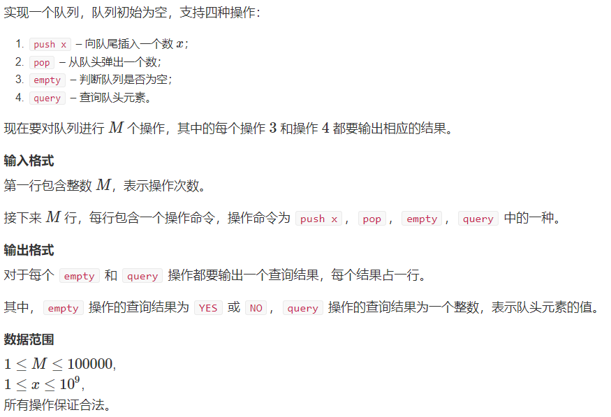
>
>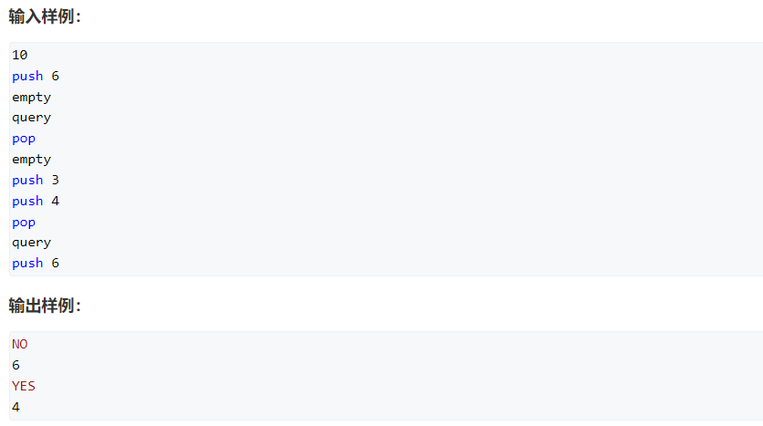

```cpp
/*实现一个队列，队列初始为空，支持四种操作：

push x – 向队尾插入一个数 x；
pop – 从队头弹出一个数；
empty – 判断队列是否为空；
query – 查询队头元素。
现在要对队列进行 M 个操作，其中的每个操作 3 和操作 4 都要输出相应的结果。
*/
#include <iostream>

using namespace std;

const int N = 100010;

int m;
int q[N], hh, tt = -1;

int main()
{
    cin >> m;
    
    while (m--)
    {
        string op;
        int x;
        
        cin >> op;
        if (op == "push")
        {
            cin >> x;
            q[++tt] = x;
        }
        else if (op == "pop") hh++;
        else if (op == "empty") cout << (hh <= tt ? "NO" : "YES") << endl;
        else cout << q[hh] << endl;
    }
    return 0;
}
```


#### 单调队列

**题目**

>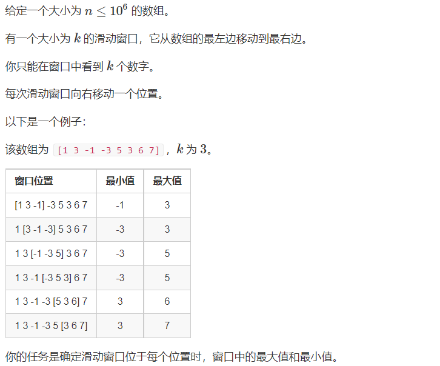
>
>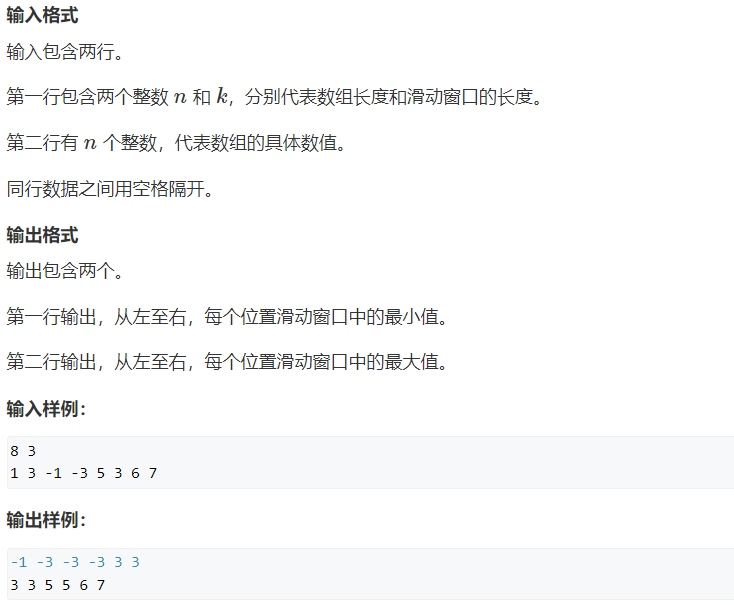

优化方式：先考虑暴力如何求解，然后考虑把没有用的元素删掉，再看有没有单调性。

创建一个严格单调上升的队列，则每个划框的最小值就是队头元素。

> 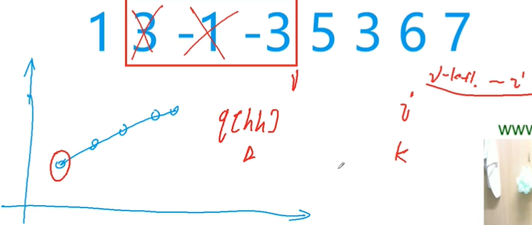

```cpp
/*给定一个大小为 n≤106 的数组。

有一个大小为 k 的滑动窗口，它从数组的最左边移动到最右边。

你只能在窗口中看到 k 个数字。

每次滑动窗口向右移动一个位置。*/
#include <iostream>

using namespace std;

const int N = 1000010;

int n, k;
int a[N], q[N];

int main()
{
    scanf("%d%d", &n, &k);
    for (int i = 0; i < n; i++) scanf("%d", &a[i]);
    
    int hh = 0, tt = -1;
    for (int i = 0; i < n; i++)
    {
        //队列中存放的是下标，而非具体元素值
        //i - k + 1为队列终点，判断队头是否已经滑出窗口，hh <= tt判断队列是否为空
        if (hh <= tt && i - k + 1 > q[hh]) hh++;
        //如果新插入的数比队尾大的话，则删掉
        while (hh <= tt && a[q[tt]] >= a[i]) tt--; 
        q[++tt] = i;  //向队尾插入一个新元素
        if (i >= k - 1) printf("%d ", a[q[hh]]);  //每次只输出队头即可
    }
    puts("");
    
    hh = 0, tt = -1;
    for (int i = 0; i < n; i++)
    {
        //判断队头是否已经滑出窗口
        if (hh <= tt && i - k + 1 > q[hh]) hh++;
        while (hh <= tt && a[q[tt]] <= a[i]) tt--;
        q[++tt] = i;
        if (i >= k - 1) printf("%d ", a[q[hh]]);
    }
    puts("");
    
}
```


## KMP算法

字符匹配 - 暴力算法

> 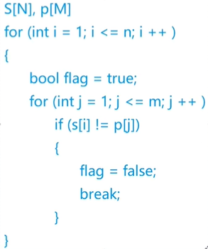

字符匹配 - KMP算法

> 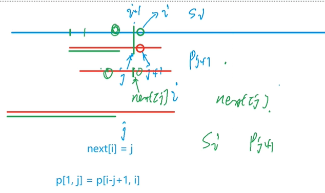

KMP算法 - 求next数组

>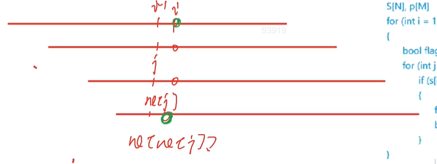
>
>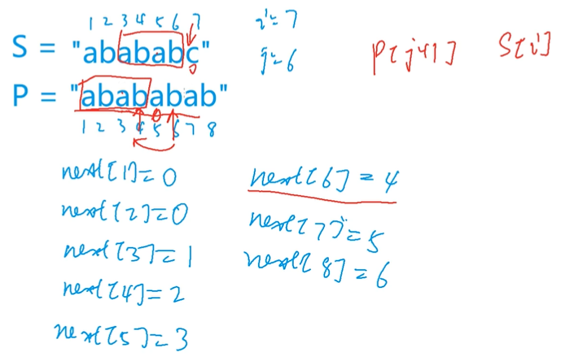

#### KMP模板

```cpp
// s[]是长文本，p[]是模式串，n是s的长度，m是p的长度
求模式串的Next数组：
for (int i = 2, j = 0; i <= m; i ++ )
{
    while (j && p[i] != p[j + 1]) j = ne[j];
    if (p[i] == p[j + 1]) j ++ ;
    ne[i] = j;
}

// 匹配
for (int i = 1, j = 0; i <= n; i ++ )
{
    while (j && s[i] != p[j + 1]) j = ne[j];
    if (s[i] == p[j + 1]) j ++ ;
    if (j == m)
    {
        j = ne[j];
        // 匹配成功后的逻辑
    }
}
```


#### KMP习题

**题目**

>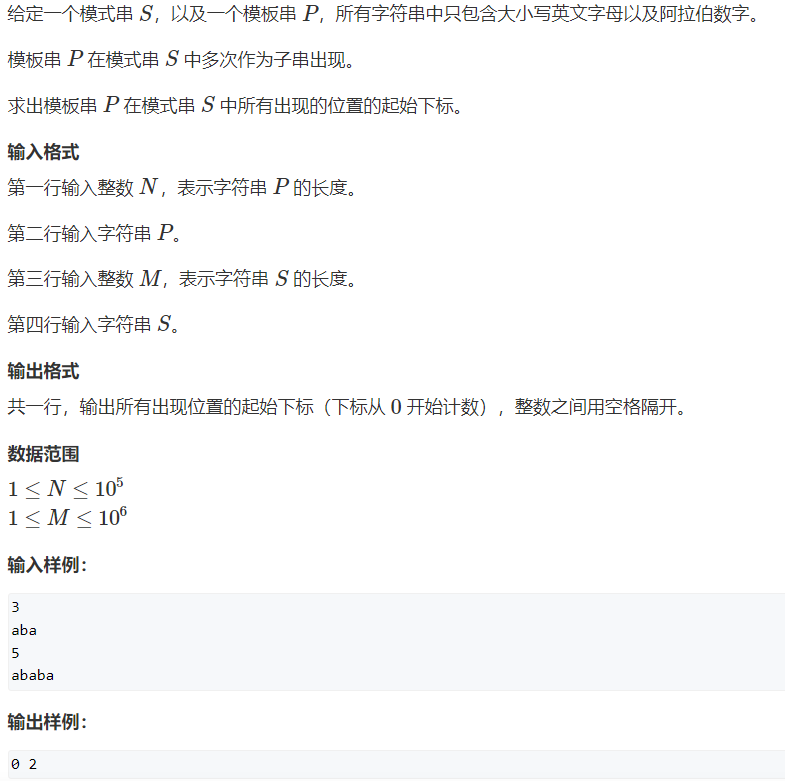

```cpp
/*给定一个模式串 S，以及一个模板串 P，所有字符串中只包含大小写英文字母以及阿拉伯数字。

模板串 P 在模式串 S 中多次作为子串出现。

求出模板串 P 在模式串 S 中所有出现的位置的起始下标。*/
#include <iostream>

using namespace std;

const int N = 100010, M = 1000010;

int n, m;
int ne[N];
char s[M], p[N];

int main()
{
    cin >> n >> p + 1 >> m >> s + 1;

    for (int i = 2, j = 0; i <= n; i ++ )
    {
        while (j && p[i] != p[j + 1]) j = ne[j];
        if (p[i] == p[j + 1]) j ++ ;
        ne[i] = j;
    }

    for (int i = 1, j = 0; i <= m; i ++ )
    {
        while (j && s[i] != p[j + 1]) j = ne[j];
        if (s[i] == p[j + 1]) j ++ ;
        if (j == n)
        {
            printf("%d ", i - n);
            j = ne[j];
        }
    }

    return 0;
}
```


## Trie 树

Trie: 高效的存储和查找字符串集合的数据结构。

串树的存储

> 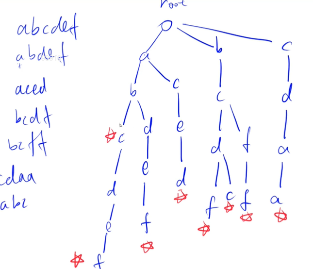

#### Trie模板

```cpp
int son[N][26], cnt[N], idx;
// 0号点既是根节点，又是空节点
// son[][]存储树中每个节点的子节点
// cnt[]存储以每个节点结尾的单词数量
// idx当前用到了哪个下标/节点

// 插入一个字符串
void insert(char *str)
{
    int p = 0;
    for (int i = 0; str[i]; i ++ )
    {
        int u = str[i] - 'a';
        if (!son[p][u]) son[p][u] = ++ idx; //子节点不存在则创建
        p = son[p][u];
    }
    cnt[p] ++ ;
}

// 查询字符串出现的次数
int query(char *str)
{
    int p = 0;
    for (int i = 0; str[i]; i ++ )
    {
        int u = str[i] - 'a';
        if (!son[p][u]) return 0;
        p = son[p][u];
    }
    return cnt[p];
}
```


#### Trie字符串统计

**题目**

>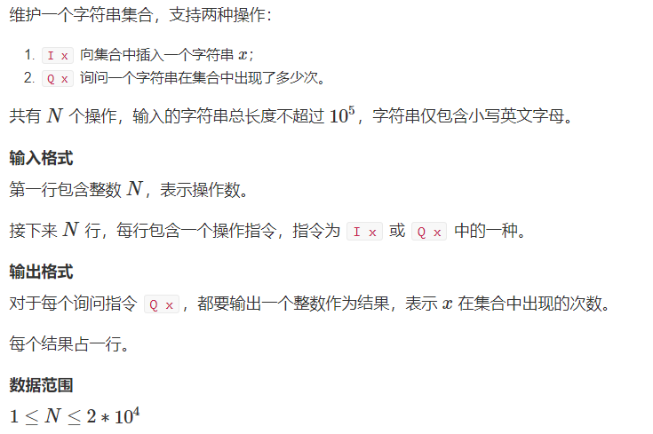
>
>

```cpp
/*维护一个字符串集合，支持两种操作：

I x 向集合中插入一个字符串 x；
Q x 询问一个字符串在集合中出现了多少次。
共有 N 个操作，输入的字符串总长度不超过 105，字符串仅包含小写英文字母。
*/
#include <iostream>

using namespace std;

const int N = 100010;

int son[N][26], cnt[N], idx;  //idx存当前用到了哪个下标，下标是0的点，既是根节点，又是空节点
char str[N];

void insert(char str[])
{
    int p = 0;
    for (int i = 0; str[i]; i++)
    {
        int u = str[i] - 'a';
        if (!son[p][u]) son[p][u] = ++idx; //如果当前p节点上不存在u这个儿子的话则把它创建出来
        p = son[p][u];
    }
    cnt[p]++; //此处结尾的单词数量加一
}

int query(char str[])
{
    int p = 0;
    for (int i = 0; str[i]; i++)
    {
        int u = str[i] - 'a';
        if (!son[p][u]) return 0;
        p = son[p][u];
    }
    return cnt[p];
}

int main()
{
    int n;
    scanf("%d", &n);
    while(n--)
    {
        char op[2];
        scanf("%s%s", op, str);
        if (op[0] == 'I') insert(str);
        else printf("%d\n", query(str));
    }
    return 0;
}
```


#### 最大异或对

**题目**

>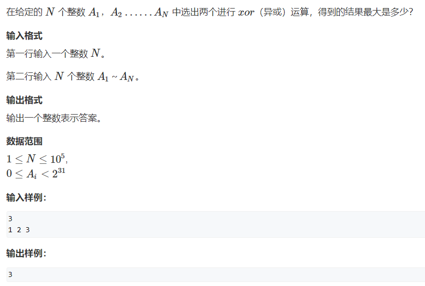

异或：相同为0，不同为1 （不进位加法）

> 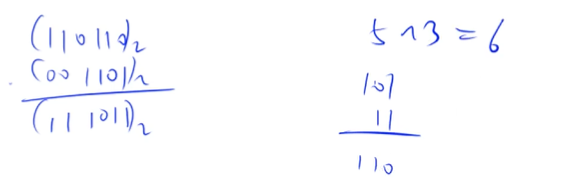

暴力做法：时间复杂度为O(n)

```cpp
int res = 0;
for (int i = 0; i < n; i++)  //枚举第一个数
{
    for (int j = 0; j < i; j++)  //枚举第二个数
        res = max(res, a[i] ^ a[j]);
}
```

> 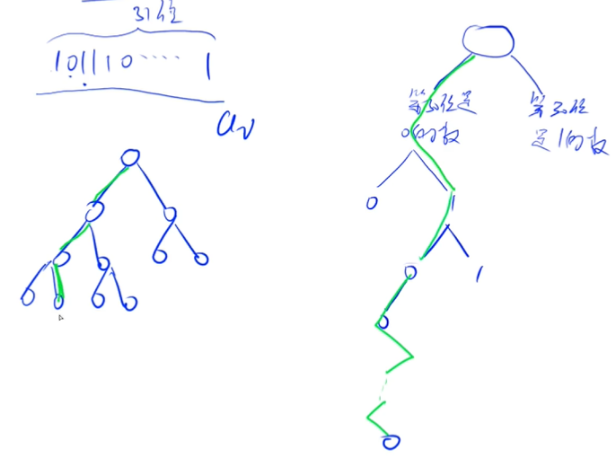
>
> 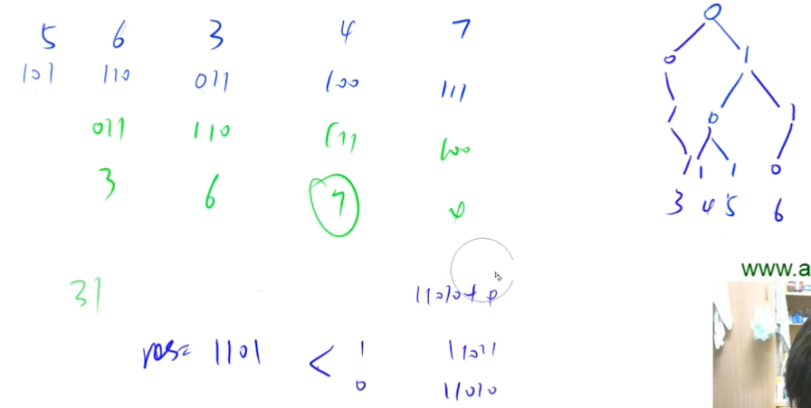

```cpp
//在给定的 N 个整数 A1，A2……AN 中选出两个进行 xor（异或）运算，得到的结果最大是多少
//数据范围   1≤N≤10^5, 0≤Ai<2^31
//时间复杂度大概为O(nlogn)
#include <iostream>
#include <algorithm>

using namespace std;

const int N = 100010, M = 3100010;

int n;
int a[N], son[M][2], idx;
// 在trie树中 二维数组son存的是节点的下标                 
// 第一维就是下标的值  第二维代表着儿子 在本题中 只有0或1 两个儿子
void insert(int x)
{
    int p = 0;  //根节点
    for (int i = 30; i >= 0; i -- )
    {
        int &s = son[p][x >> i & 1]; //int u = x >> i & 1;
        if (!s) s = ++ idx;
        p = s;  //son[][]存储树中每个节点的子节点，即让p指向下一个节点
    }
}

int search(int x)
{
    int p = 0, res = 0;
    for (int i = 30; i >= 0; i -- )
    {
        int s = x >> i & 1;
        if (son[p][!s]) //与之相反的数若存在
        {
            res += 1 << i;
            p = son[p][!s];
        }
        else p = son[p][s];
    }
    return res;
}

int main()
{
    scanf("%d", &n);
    for (int i = 0; i < n; i ++ )
    {
        scanf("%d", &a[i]);
        insert(a[i]); //插入一个数，先插入再查询避免了最开始时没有数的边界问题
    }

    int res = 0;
    for (int i = 0; i < n; i ++ ) res = max(res, search(a[i]));

    printf("%d\n", res);

    return 0;
}
```


## 并查集

用来处理的问题：时间复杂度近乎 O(1) 

1. 将两个集合合并   2. 询问两个元素是否在一个集合当中

基本原理：

每个集合用一棵树来表示，树根的编号就是整个集合的编号。每个节点存储它的父节点，p[x]表示x的父节点。

问题：

1. 如何判断树根  `if (p[x] == x)`
2. 如何求x的集合编号 `while (p[x] != x) x = p[x]`，可以使用路径压缩进行优化，查到祖先之后就把p[x]都存成祖先
3. 如何合并两个集合  px是x的集合编号，py是y的集合编号  `p[x] = y`

> 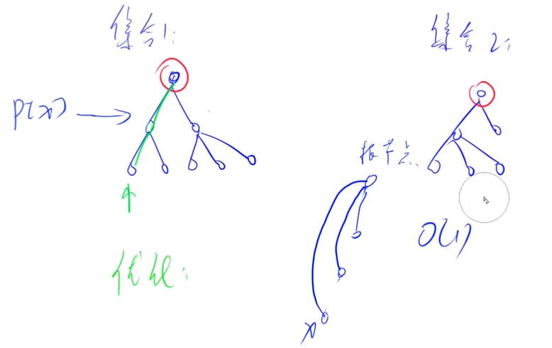

#### 并查集模板

```cpp
(1)朴素并查集：

    int p[N]; //存储每个点的祖宗节点

    // 返回x的祖宗节点
    int find(int x)
    {
        if (p[x] != x) p[x] = find(p[x]);
        return p[x];
    }

    // 初始化，假定节点编号是1~n
    for (int i = 1; i <= n; i ++ ) p[i] = i;

    // 合并a和b所在的两个集合：
    p[find(a)] = find(b);


(2)维护size的并查集：

    int p[N], size[N];
    //p[]存储每个点的祖宗节点, size[]只有祖宗节点的有意义，表示祖宗节点所在集合中的点的数量

    // 返回x的祖宗节点
    int find(int x)
    {
        if (p[x] != x) p[x] = find(p[x]);
        return p[x];
    }

    // 初始化，假定节点编号是1~n
    for (int i = 1; i <= n; i ++ )
    {
        p[i] = i;
        size[i] = 1;
    }

    // 合并a和b所在的两个集合：
    size[find(b)] += size[find(a)];
    p[find(a)] = find(b);


(3)维护到祖宗节点距离的并查集：

    int p[N], d[N];
    //p[]存储每个点的祖宗节点, d[x]存储x到p[x]的距离

    // 返回x的祖宗节点
    int find(int x)
    {
        if (p[x] != x)
        {
            int u = find(p[x]);
            d[x] += d[p[x]];
            p[x] = u;
        }
        return p[x];
    }

    // 初始化，假定节点编号是1~n
    for (int i = 1; i <= n; i ++ )
    {
        p[i] = i;
        d[i] = 0;
    }

    // 合并a和b所在的两个集合：
    p[find(a)] = find(b);
    d[find(a)] = distance; // 根据具体问题，初始化find(a)的偏移量
```


#### 合并集合

**题目**

>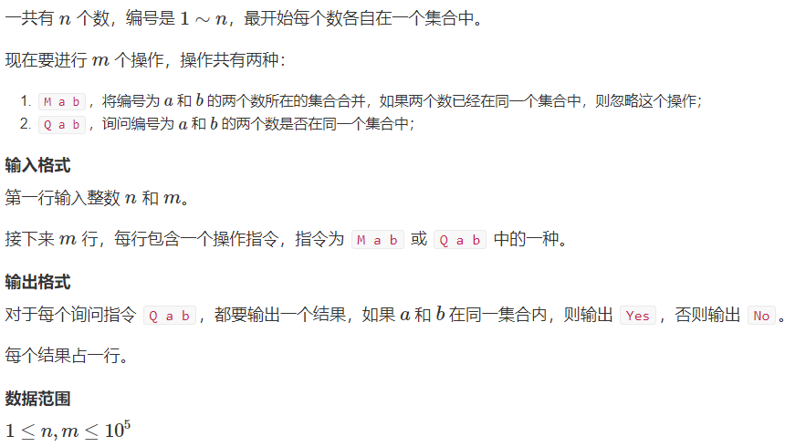
>
>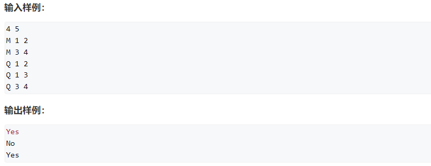

```cpp
/*一共有 n 个数，编号是 1∼n，最开始每个数各自在一个集合中。

现在要进行 m 个操作，操作共有两种：

M a b，将编号为 a 和 b 的两个数所在的集合合并，如果两个数已经在同一个集合中，则忽略这个操作；
Q a b，询问编号为 a 和 b 的两个数是否在同一个集合中
*/
#include <iostream>

using namespace std;

const int N = 100010;

int n, m;
int p[N];

int find(int x) // 返回x的祖宗节点 + 路径压缩优化
{
    if (p[x] != x) p[x] = find(p[x]);
    return p[x];
}

int main()
{
    scanf("%d%d", &n, &m);
    
    for (int i = 1; i <= n; i++) p[i] = i;
    
    while (m--)
    {
        char op[2];
        int a, b;
        scanf("%s%d%d", op, &a, &b);
        
        if (op[0] == 'M') p[find(a)] = find(b); //将a的祖宗节点加到b的祖宗节点之下
        else
        {
            if (find(a) == find(b)) puts("Yes");
            else puts("No");
        }
    }
    return 0;
}
```


#### 连通块中点的数量

**题目**

>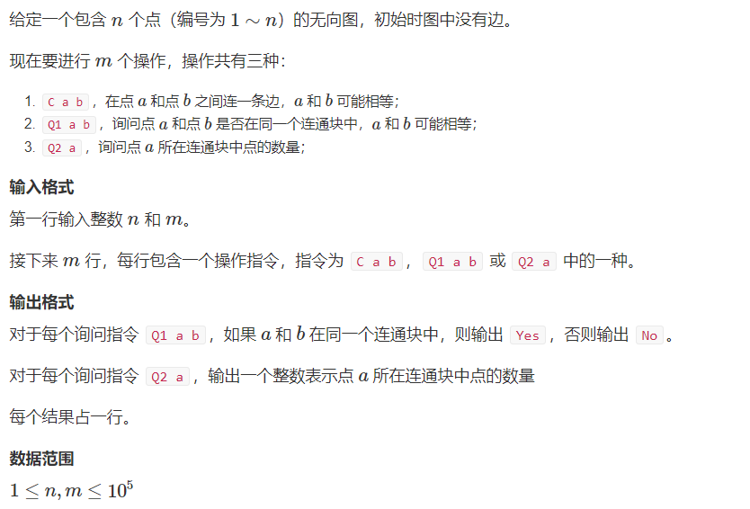
>
>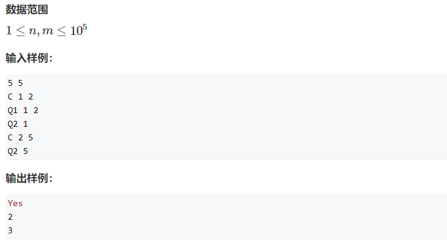

> 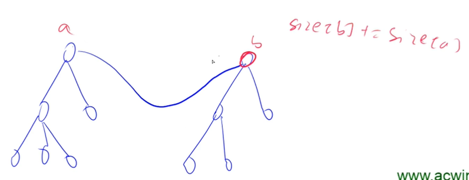

```cpp
/*给定一个包含 n 个点（编号为 1∼n）的无向图，初始时图中没有边。

现在要进行 m 个操作，操作共有三种：

C a b，在点 a 和点 b 之间连一条边，a 和 b 可能相等；
Q1 a b，询问点 a 和点 b 是否在同一个连通块中，a 和 b 可能相等；
Q2 a，询问点 a 所在连通块中点的数量
*/
#include <iostream>

using namespace std;

const int N = 100010;

int n, m;
int p[N], cnt[N];

int find(int x) // 返回x的祖宗节点 + 路径压缩
{
    if (p[x] != x) p[x] = find(p[x]);
    return p[x];
}

int main()
{
    scanf("%d%d", &n, &m);
    
    for (int i = 1; i <= n; i++)
    {
        p[i] = i;
        cnt[i] = 1;
    }
    
    while (m--)
    {
        char op[5];
        int a, b;
        scanf("%s", op);
        
        if (op[0] == 'C')
        {
            scanf("%d%d", &a, &b);
            if (find(a) == find(b)) continue;
            cnt[find(b)] += cnt[find(a)];
            p[find(a)] = find(b);
        }
        else if (op[1] == '1')
        {
            scanf("%d%d", &a, &b);
            if (find(a) == find(b)) puts("Yes");
            else puts("No");
        }
        else
        {
            scanf("%d", &a);
            printf("%d\n", cnt[find(a)]);
        }
    }
    return 0;
}
```


#### 食物链

**题目**

>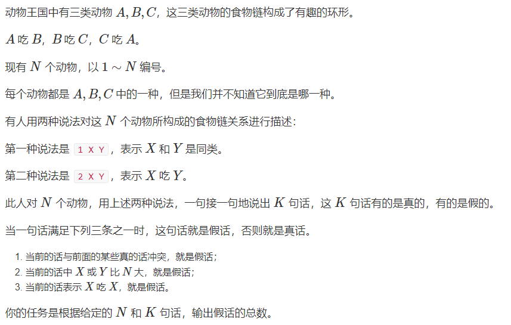
>
>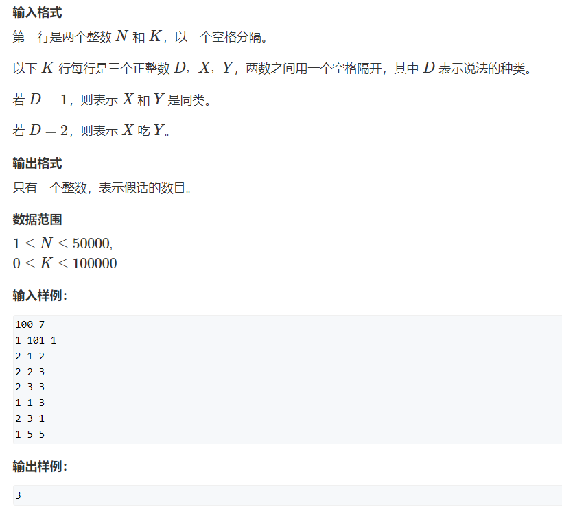

确定每个点和根节点间的关系，即到根节点间的距离（取模运算可将所有数据分为3类）

> 
>
> 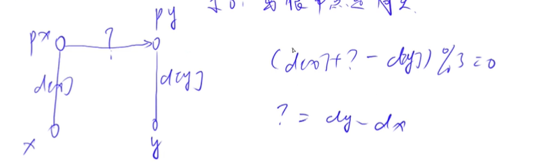
>
> 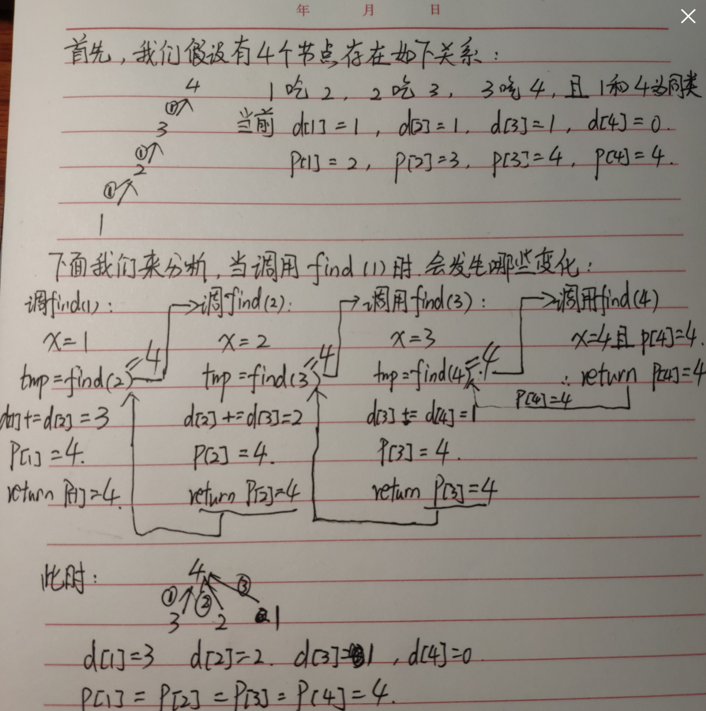

路径压缩示意图

> 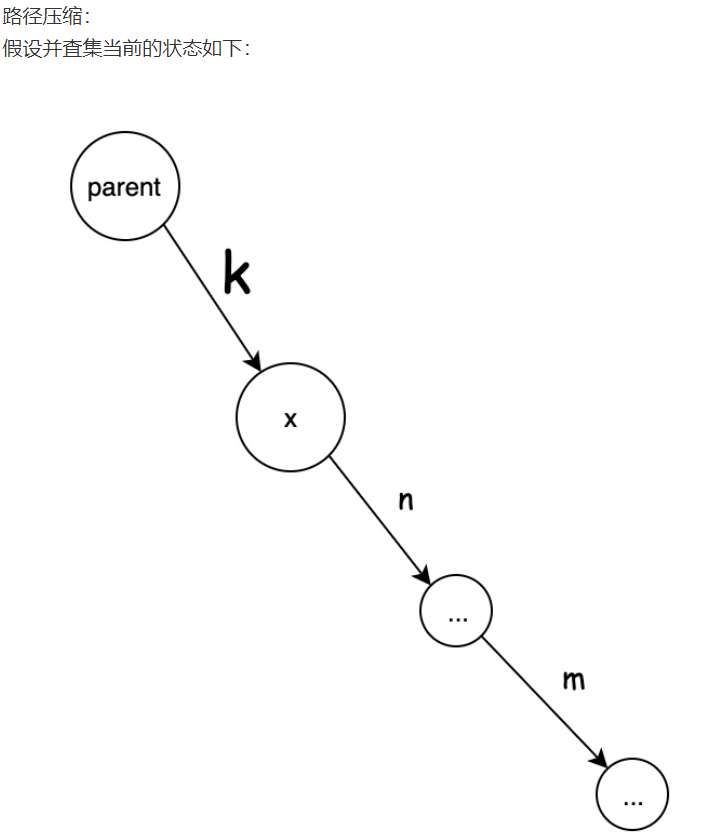
>
> 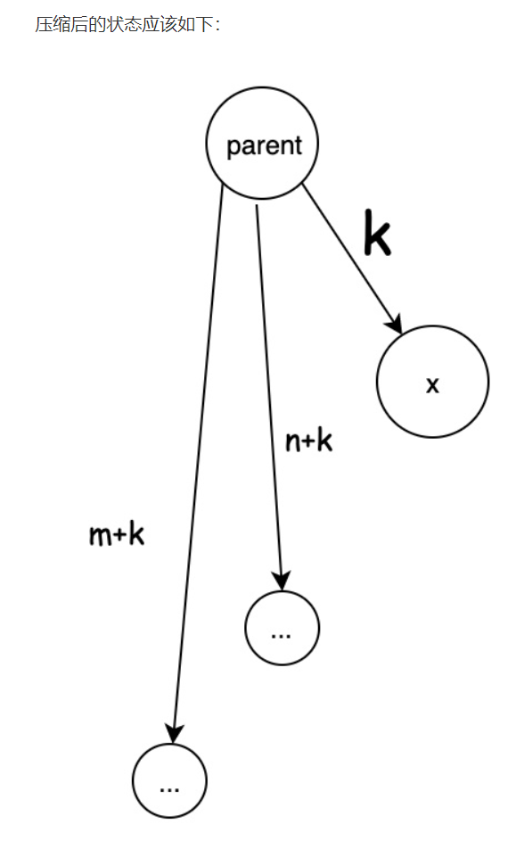

合并示意图

> 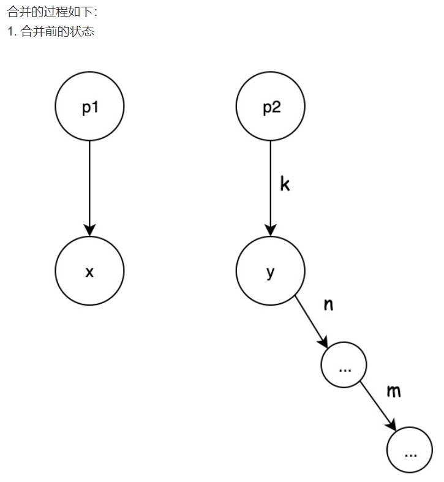
>
> 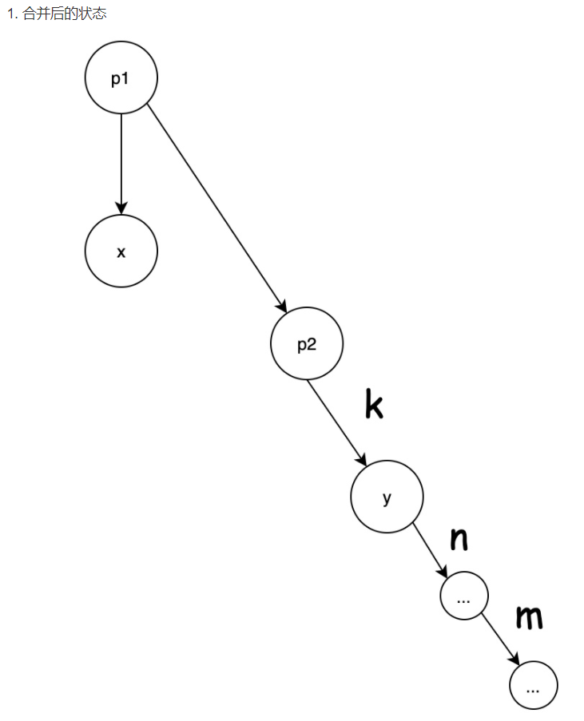

```cpp
/*动物王国中有三类动物 A,B,C，这三类动物的食物链构成了有趣的环形。
A 吃 B，B 吃 C，C 吃 A。
现有 N 个动物，以 1∼N 编号。
每个动物都是 A,B,C 中的一种，但是我们并不知道它到底是哪一种。
有人用两种说法对这 N 个动物所构成的食物链关系进行描述：
第一种说法是 1 X Y，表示 X 和 Y 是同类。
第二种说法是 2 X Y，表示 X 吃 Y。
此人对 N 个动物，用上述两种说法，一句接一句地说出 K 句话，这 K 句话有的是真的，有的是假的。
当一句话满足下列三条之一时，这句话就是假话，否则就是真话。
当前的话与前面的某些真的话冲突，就是假话；
当前的话中 X 或 Y 比 N 大，就是假话；
当前的话表示 X 吃 X，就是假话。
你的任务是根据给定的 N 和 K 句话，输出假话的总数。
*/
//t表示询问的种类，t = 0, 1, 2
//d[i]的正确理解，应是第 i 个节点到其父节点距离
#include <iostream>

using namespace std;

const int N = 50010;

int n, m;
int p[N], d[N];

int find(int x)
{
    if (p[x] != x)  
    {
        int t = find(p[x]);
        d[x] += d[p[x]];
        p[x] = t;
    }
    return p[x];
}

int main()
{
    scanf("%d%d", &n, &m);

    for (int i = 1; i <= n; i ++ ) p[i] = i;

    int res = 0;
    while (m -- )
    {
        int t, x, y;
        scanf("%d%d%d", &t, &x, &y);

        if (x > n || y > n) res ++ ;
        else
        {
            int px = find(x), py = find(y);
            if (t == 1)
            {   //如果 x 和 y 的父节点（p1, p2）在同一个 root 节点上（说明 p1 和 p2 已经处理过关系了），判断距离是否相等 (d[x] % M == d[y] % M)，如果之间距离差为1或2则为假话
                if (px == py && (d[x] - d[y]) % 3) res ++ ;
                else if (px != py)  //如果 p1 != p2，说明 x 和 y 还没有关系，可以进行合并
                {
                    p[px] = py;
                    d[px] = d[y] - d[x];
                }
            }
            else
            {
                if (px == py && (d[x] - d[y] - 1) % 3) res ++ ;
                else if (px != py)
                {
                    p[px] = py;
                    d[px] = d[y] + 1 - d[x];
                }
            }
        }
    }

    printf("%d\n", res);

    return 0;
}
```


## 堆

堆的操作：

0. 下标从1开始，便于处理左右儿子

1. 插入一个数  `heap[++size] = x; up(size);`

2. 求集合当中的最小值  `heap[1];`

3. 删除最小值 (删除最后一个点，对整个队伍影响最小，所以用最后一个点去覆盖第一个点，然后让第一个点往下走)  

    `heap[1] = heap[size]; size--; down(1);`

4. 删除任意一个元素   `heap[k] = heap[size]; size--; down(k); up[k]; //up()down()只会执行一个`

5. 修改任意一个元素   `heap[k] = x; down(k); up(k);`

堆的概念：

1. 堆是一棵完全二叉树，除了最后一层节点之外，上面所有节点都是非空的，最后一层节点是从左向右依次排布。
2. 小根堆：每个根节点都小于左右两边的点。

>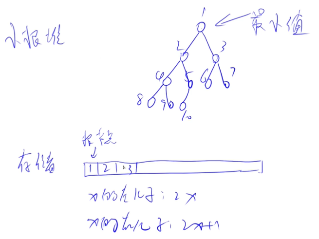

#### 堆排序模板

```cpp
// h[N]存储堆中的值, h[1]是堆顶，x的左儿子是2x, 右儿子是2x + 1
// ph[k]存储第k个插入的点在堆中的位置
// hp[k]存储堆中下标是k的点是第几个插入的
int h[N], ph[N], hp[N], size;

// 交换两个点，及其映射关系
void heap_swap(int a, int b)
{
    swap(ph[hp[a]],ph[hp[b]]);
    swap(hp[a], hp[b]);
    swap(h[a], h[b]);
}

void down(int u)
{
    int t = u;
    if (u * 2 <= size && h[u * 2] < h[t]) t = u * 2;
    if (u * 2 + 1 <= size && h[u * 2 + 1] < h[t]) t = u * 2 + 1;
    if (u != t)
    {
        heap_swap(u, t);
        down(t);
    }
}

void up(int u)
{
    while (u / 2 && h[u] < h[u / 2])  //u/2判断存在父节点
    {
        heap_swap(u, u / 2);
        u >>= 1;  // u /= 2;
    }
}

// O(n)建堆
for (int i = n / 2; i; i -- ) down(i);
```


#### 堆排序

**题目**

>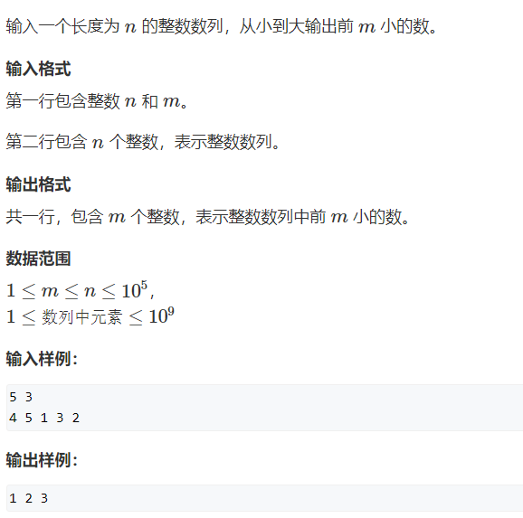

> 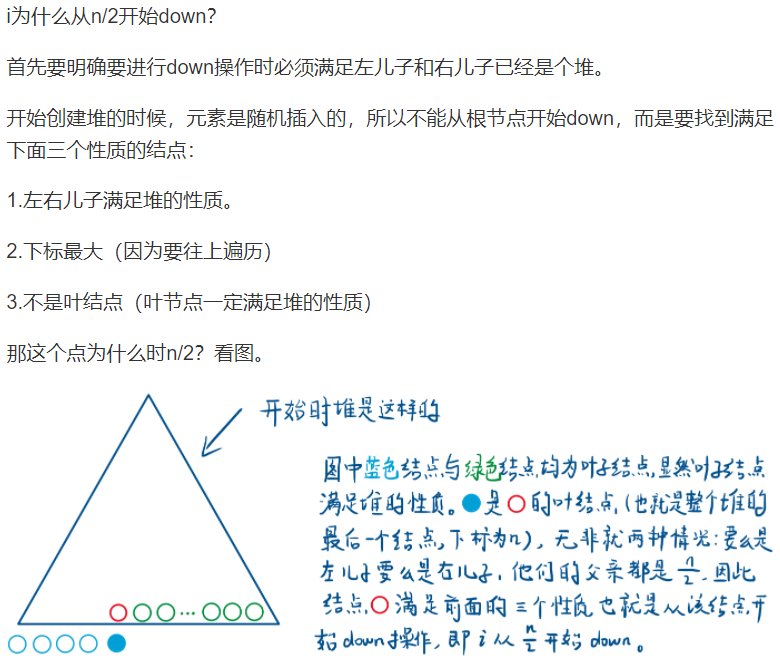

```cpp
//输入一个长度为 n 的整数数列，从小到大输出前 m 小的数。
#include <iostream>
#include <algorithm>

using namespace std;

const int N = 100010;

int n, m;
int h[N], cnt;

void down(int u)
{
    int t = u;
    if (u * 2 <= cnt && h[u * 2] < h[t]) t = u * 2;
    if (u * 2 + 1 <= cnt && h[u * 2 + 1] < h[t]) t = u * 2 + 1;
    if (u != t)
    {
        swap(h[u], h[t]);
        down(t);
    }
}

int main()
{
    scanf("%d%d", &n, &m);
    for (int i = 1; i <= n; i++) scanf("%d", &h[i]);
    cnt = n;
    
    for (int i = n / 2; i; i--) down(i);
    
    while (m--)
    {
        printf("%d ", h[1]);
        h[1] = h[cnt];
        cnt--;
        down(1);
    }
    return 0;
}
```


#### 模拟堆

**题目**

>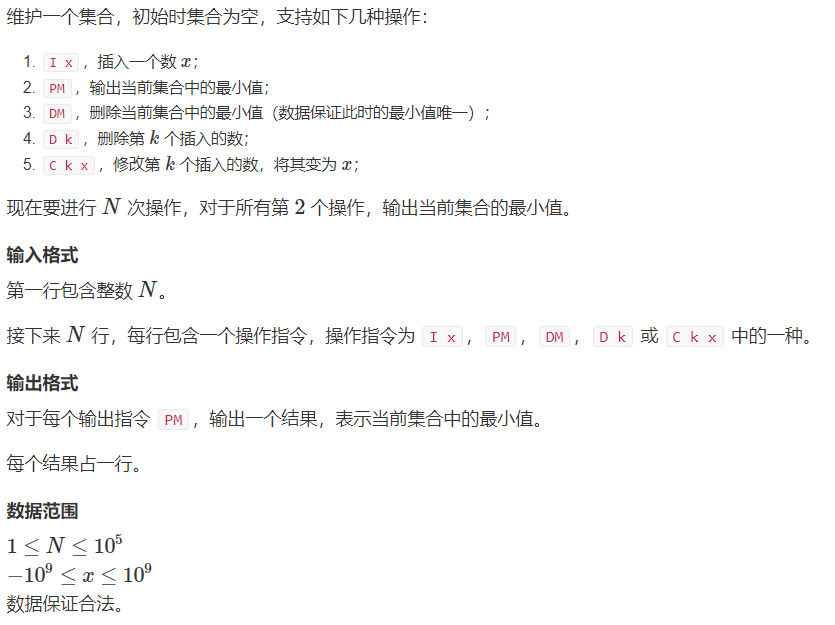
>
>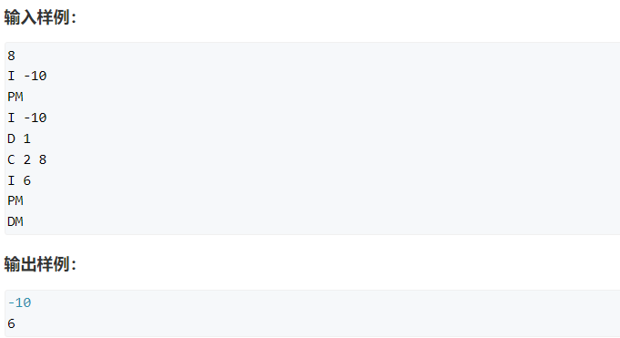

为什么会用ph和hp这两个数组呢？

> hp[k]是heap pointer的缩写，表示堆数组中下标到第k个插入的映射，堆中某一个点是第几个插入的点
> ph[k]是pointer heap的缩写，表示第k个插入到堆数组中的下标的映射，第k个插入的点在哪
> hp和ph数组是互为反函数的
>
> 原因在于在删除第k个插入元素的操作中，我们首先得知道第k个插入元素在堆数组中的什么位置，即堆数组下标是啥。
> 很显然，用一个ph数组来存储会方便查找。这样我们就知道了第k个插入的元素在哪了。然后我们需要做的是和堆尾元素交换，最后再在原来第k个元素所在的位置进行down和up操作。
>
> 由于交换完后ph[k]的值变了，为ph[size]了，所以必须要在之前保存ph[k]的值，不然无法进行down和up操作。
>
> 似乎有了ph数组就可以完成所有操作了，但为什么还要有一个hp数组呢？
> 原因就在于在swap操作中我们输入是堆数组的下标，无法知道每个堆数组的下标对应的是第几个插入的元素。
> 所以需要hp数组方便查找

> 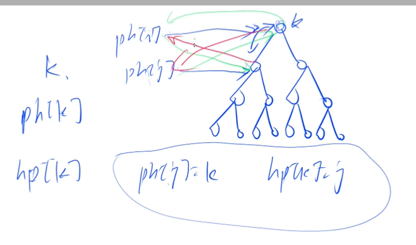

```cpp
/*维护一个集合，初始时集合为空，支持如下几种操作：

I x，插入一个数 x；
PM，输出当前集合中的最小值；
DM，删除当前集合中的最小值（数据保证此时的最小值唯一）；
D k，删除第 k 个插入的数；
C k x，修改第 k 个插入的数，将其变为 x；
现在要进行 N 次操作，对于所有第 2 个操作，输出当前集合的最小值。
*/
#include <iostream>
#include <algorithm>
#include <string.h>

using namespace std;

const int N = 100010;

int h[N], ph[N], hp[N], cnt;

void heap_swap(int a, int b)
{
    swap(ph[hp[a]], ph[hp[b]]);
    swap(hp[a], hp[b]);
    swap(h[a], h[b]);
}

void down(int u)
{
    int t = u;
    if (u * 2 <= cnt && h[u * 2] < h[t]) t = u * 2;
    if (u * 2 + 1 <= cnt && h[u * 2 + 1] < h[t]) t = u * 2 + 1;
    if (u != t)
    {
        heap_swap(u, t);
        down(t);
    }
}

void up(int u)
{
    while (u / 2 && h[u] < h[u / 2])
    {
        heap_swap(u, u / 2);
        u >>= 1;
    }
}

int main()
{
    int n, m = 0;
    scanf("%d", &n);
    while (n--)
    {
        char op[5];
        int k, x;
        scanf("%s", op);
        if (!strcmp(op, "I"))
        {
            scanf("%d", &x);
            cnt++; //当前堆大小
            m++; //记录第几次插入
            ph[m] = cnt, hp[cnt] = m; //每次插入都是在堆尾插入
            h[cnt] = x; //记录插入的值
            up(cnt);
        }
        else if (!strcmp(op, "PM")) printf("%d\n", h[1]);
        else if (!strcmp(op, "DM"))
        {
            heap_swap(1, cnt);
            cnt--;
            down(1);
        }
        else if (!strcmp(op, "D"))
        {
            scanf("%d", &k);
            k = ph[k];  //必须要保存当前被删除结点的位置
            heap_swap(k, cnt); //第k个插入的元素移到了堆尾，此时ph[k]指向堆尾 
            cnt--; //删除堆尾
            up(k); //k是之前记录被删除的结点的位置
            down(k);
        }
        else
        {
            scanf("%d%d", &k, &x)
            k = ph[k];
            h[k] = x;
            up(k);
            down(k);
        }
    }
    return 0;
}
```


## 哈希表

哈希表 

1. 存储结构 ： 开放寻址法 ， 拉链法
2. 字符串哈希方式

哈希算法题中一般只进行添加、查找操作，一般的删除操作则是对删除的点进行标记。

哈希表的时间复杂度为O(1)，一般用到哈希表的题目的暴力时间复杂度为O(n)。

注：为了尽可能的减少重复，一般取模的数要尽可能是个质数，且离2的次方远。

#### 哈希表模板 - 一般哈希

```cpp
1.一般哈希
(1) 拉链法
    int h[N], e[N], ne[N], idx;

    // 向哈希表中插入一个数
    void insert(int x)
    {
        int k = (x % N + N) % N;
        e[idx] = x;
        ne[idx] = h[k];
        h[k] = idx ++ ;
    }

    // 在哈希表中查询某个数是否存在
    bool find(int x)
    {
        int k = (x % N + N) % N;
        for (int i = h[k]; i != -1; i = ne[i])
            if (e[i] == x)
                return true;

        return false;
    }

(2) 开放寻址法
    int h[N];

    // 如果x在哈希表中，返回x的下标；如果x不在哈希表中，返回x应该插入的位置
    int find(int x)
    {
        int t = (x % N + N) % N;
        while (h[t] != null && h[t] != x)
        {
            t ++ ;
            if (t == N) t = 0;
        }
        return t;
    }
```

#### 哈希表模板 - 字符串哈希

```cpp
2.字符串哈希
核心思想：将字符串看成P进制数，P的经验值是131或13331，取这两个值的冲突概率低
小技巧：取模的数用2^64，这样直接用unsigned long long存储，溢出的结果就是取模的结果

typedef unsigned long long ULL;
ULL h[N], p[N]; // h[k]存储字符串前k个字母的哈希值, p[k]存储 P^k mod 2^64

// 初始化
p[0] = 1;
for (int i = 1; i <= n; i ++ )
{
    h[i] = h[i - 1] * P + str[i];
    p[i] = p[i - 1] * P;
}

// 计算子串 str[l ~ r] 的哈希值
ULL get(int l, int r)
{
    return h[r] - h[l - 1] * p[r - l + 1];
} 
```


#### 取大于N的第一个质数

**题目**

>取大于N的第一个质数 

```cpp
//取大于N的第一个质数    
//注：为了尽可能的减少重复，一般取模的数要尽可能是个质数，且离2的次方远。
#include <iostream>

using namespace std;

const int N = 100010;  //结果为N = 100003

int main()
{
    for (int i = 100000;; i++)
    {
        bool flag = true;
        for (int j = 2; j * j <= i; j++)
      		if (i % j == 0)
            {
                flag = false;
                break;
            }
        if (flag)
        {
            cout << i << endl;
            break;
        }
    }
    return 0;
}
```


#### 模拟散列表

**题目**

>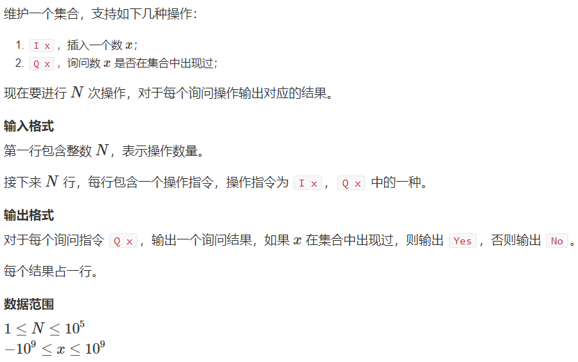
>
>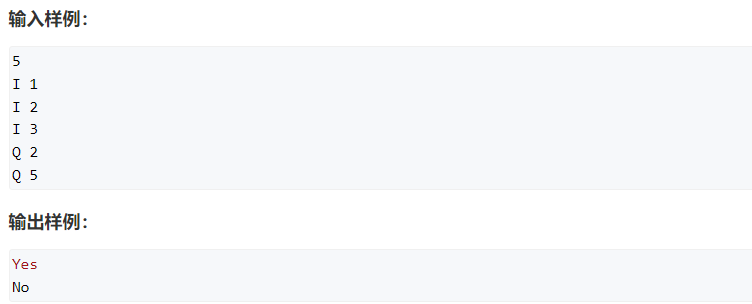
>
>

**拉链法**

想一个哈希函数，将从0到10^9^的数映射到0道10^5^之间

> 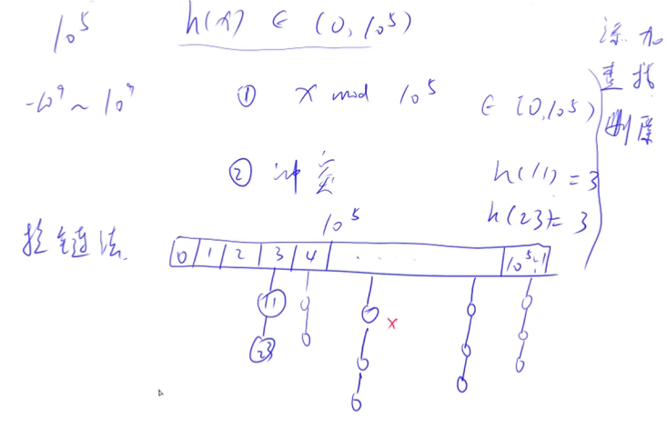

```cpp
/*维护一个集合，支持如下几种操作：
I x，插入一个数 x；Q x，询问数 x 是否在集合中出现过；
现在要进行 N 次操作，对于每个询问操作输出对应的结果。
*/
#include <iostream>
#include <cstring>

using namespace std;

const int N = 100003;

int h[N], e[N], ne[N], idx; //将一整个数组拆分成若干个单链表，每个使用到的h[k]为一个头结点

void insert(int x)
{
    int k = (x % N + N) % N;
    e[idx] = x;  //结点插入链表
    ne[idx] = h[k];
    h[k] = idx++;  //h[k]指向第一个点，h[k]为头结点
}

bool find(int x)
{
    int k = (x % N + N) % N;  // 加N再模N  目的让其成为一个正数  负数模正数等于负数
    for (int i = h[k]; i != -1; i = ne[i]) //遍历链表
        if (e[i] == x)
            return true;
    return false;
}

int main()
{
    int n;
    scanf("%d", &n);
    
    memset(h, -1, sizeof h);// 作用是将某一块内存中的内容全部设置为指定的值，这个函数通常为新申请的内存做初始化工作
    
    while (n--)
    {
        char op[2];
        int x;
        scanf("%s%d", op, &x);
        
        if (*op == 'I') insert(x);
        else
        {
            if (find(x)) puts("Yes");
            else puts("No");
        }
    }
    return 0;
}
```

**开放寻址法**

只开了一个一维数组，长度经验上来说，一般为题目要求数据范围的2~3倍的最小质数（方法同上）。

> 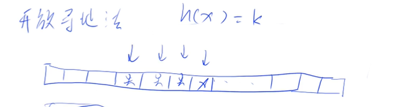

```cpp
/*维护一个集合，支持如下几种操作：
I x，插入一个数 x；Q x，询问数 x 是否在集合中出现过；
现在要进行 N 次操作，对于每个询问操作输出对应的结果。
*/
//约定一个大于10^9的数(不在范围内)
#include <iostream>
#include <cstring>

using namespace std;

const int N = 200003, null = 0x3f3f3f3f;

int h[N];

int find(int x)
{
    int k = (x % N + N) % N;
    while (h[k] != null && h[k] != x)
    {
        k++;
        if (k == N) k = 0;  //从头重新开始找
    }
    return k;
}

int main()
{
    int n;
    scanf("%d", &n);
    
    memset(h, 0x3f, sizeof h);  //按字节初始化，而非按数来初始化，int是4个字节，正好把int的每个字节全部初始化为0x3f
    
    while (n--)
    {
        char op[2];
        int x;
        scanf("%s%d", op, &x);
        
        int k = find(x);
        if (*op == 'I') h[k] = x;
        else
        {
            if (h[k] != null) puts("Yes");
            else puts("No");
        }
    }
    return 0;
}
```


#### 字符串哈希

**题目**

>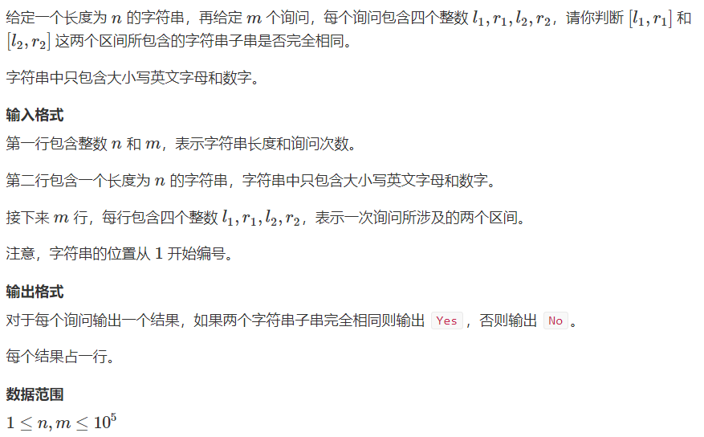
>
>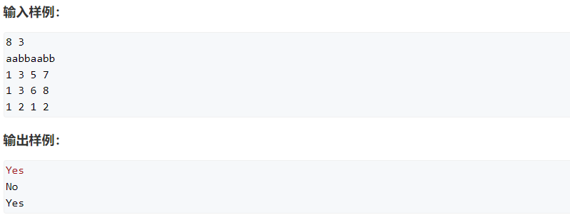

字符串前缀哈希法:  

把字符串变成一个p进制数字（哈希值），实现不同的字符串映射到不同的数字。

对形如 X1X2X3⋯Xn−1XnX1X2X3⋯Xn−1Xn 的字符串,采用字符的ascii 码乘上 P 的次方来计算哈希值。

映射公式 (X1×Pn−1+X2×Pn−2+⋯+Xn−1×P1+Xn×P0)modQ

注意点：
1. 任意字符不可以映射成0，否则会出现不同的字符串都映射成0的情况，比如A,AA,AAA皆为0

2. 冲突问题：通过巧妙设置P (131 或 13331) , Q (264)(264)的值，一般可以理解为不产生冲突。

3. 求一个字符串的哈希值就相当于求前缀和，求一个字符串的子串哈希值就相当于求部分和。

   >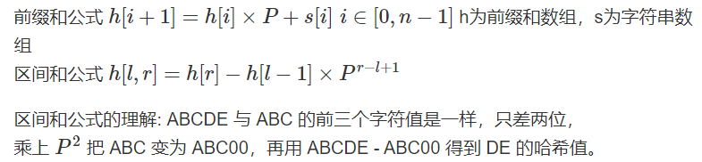

注意点：

1. 不能把某一个数字映射成0
2. P取131或13331，Q取2^64^(经验值，99.99%不会发生冲突，且字符串哈希不能出现冲突）
3. 如果用unsigned long long 来存储h的话，则不需要对2^64^取模，因为正好溢出掉

>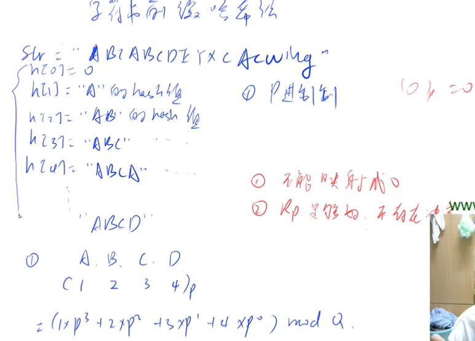
>
>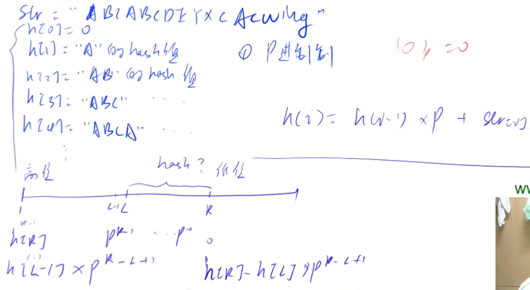

```cpp
/*给定一个长度为 n 的字符串，再给定 m 个询问，每个询问包含四个整数 l1,r1,l2,r2，请你判断 [l1,r1] 和 [l2,r2] 这两个区间所包含的字符串子串是否完全相同。
字符串中只包含大小写英文字母和数字。
*/
#include <iostream>

using namespace std;

typedef unsigned long long ULL;

const int N = 100010, P = 131;

int n, m;
char str[N];
ULL h[N], p[N];
// h[]表示某一个前缀的哈希值 h[i]前i个字符的hash值
// 字符串变成一个p进制数字，体现了字符+顺序，需要确保不同的字符串对应不同的数字
ULL get(int l, int r)
{
    return h[r] - h[l - 1] * p[r - l + 1];
}

int main()
{
    scanf("%d%d%s", &n, &m, str + 1);
    
    p[0] = 1; //p的0次方等于1
    for (int i = 1; i <= n; i++) //字符串从1开始编号，h[1]为前一个字符的哈希值
    {
        p[i] = p[i - 1] * P;
        h[i] = h[i - 1] * P + str[i]; //前缀和求整个字符串的哈希值
    }
    
    while (m--)
    {
        int l1, r1, l2, r2;
        scanf("%d%d%d%d", &l1, &r1, &l2, &r2);
        
        if (get(l1, r1) == get(l2, r2)) puts("Yes");
        else puts("No");
    }
    return 0;    
}
```


