## 搜索与图论学习 - AcWing - HQ

[TOC]

----

#### 注意内容

- 
  

----

## 目录

> 


## 搜索算法

时间复杂度 O(n+m)， n 表示点数，m 表示边数

DFS 与 BFS对比：

==凡是对空间要求比较高的思路比较奇怪的用DFS，涉及最短xx用BFS。==

>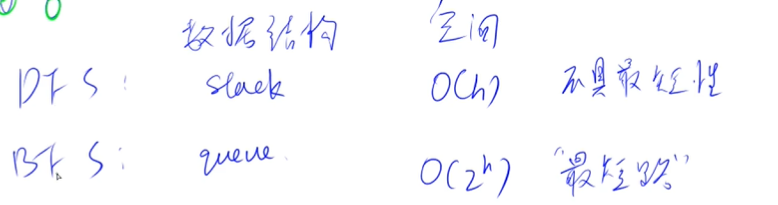


### 深度优先搜索 DFS

不管往哪条路走，一定会走到头，然后再后退到上一层继续往下走。

> 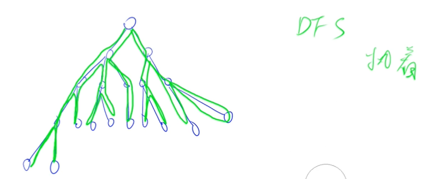

#### 排列数字

**题目**

>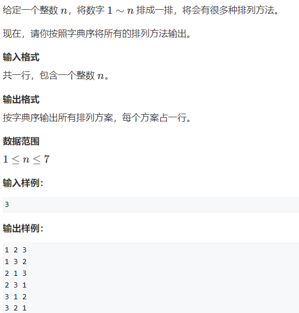

把所有路径遍历一遍，回溯时一定要注意恢复现场。

>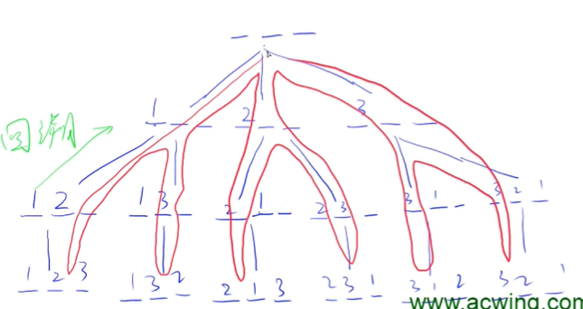

```cpp
/*给定一个整数 n，将数字 1∼n 排成一排，将会有很多种排列方法。
现在，请你按照字典序将所有的排列方法输出。
*/
#include <iostream>

using namespace std;

const int N = 10;

int n;
int path[N]; //path数组保存排列，当排列的长度为n时，是一种方案，输出
bool st[N];  //state数组表示数字是否用过

void dfs(int u)  //dfs(i)表示在path[i]处填写数字，然后递归的在下一个位置填写数字
{
    if (u == n)  //数字填完了，输出
    {   
        //在第几层就看第几个数，当在第三层时，代表填完，则直接输出
        for (int i = 0; i < n; i++) printf("%d ", path[i]);
        puts("");
        return;
    }
    for (int i = 1; i <= n; i++)  //空位上可以选择的数字为 1~
    	if (!st[i])   //如果数字i没有被用过
        {
            path[u] = i;    //放入空位
            st[i] = true;   //数字被用，修改状态
            dfs(u + 1);     //填下一个位           
            st[i] = false;  //恢复现场，回溯，取出i
        }
}
int main()
{
    cin >> n;
    dfs(0);  
    return 0;
}
```


#### N-皇后问题

**题目**

>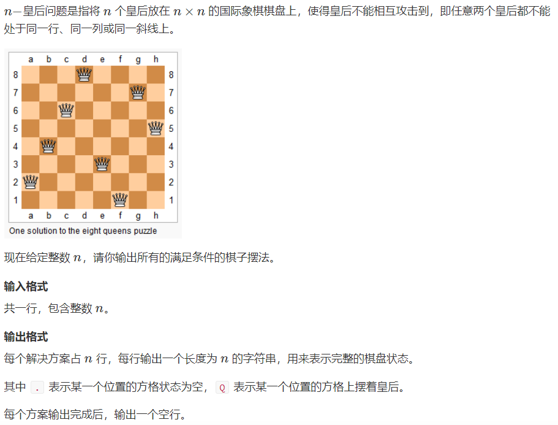
>
>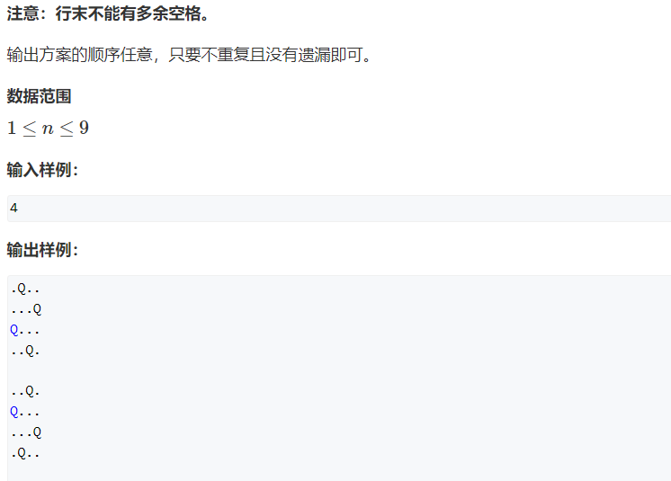

类似全排列问题，枚举每一行，但要注意剪枝。

剪枝，如果在某一环节发现产生了冲突，则直接停止，不再继续往下走，直接回溯。（提前判断当前方案错误，提前返回）

> 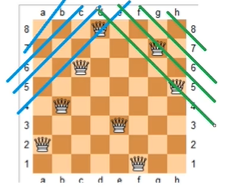

**斜线截距表示方法**

> 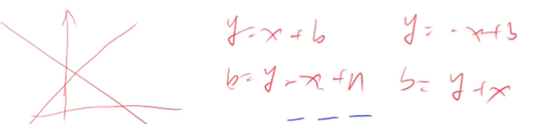

```cpp
/*n− 皇后问题是指将 n 个皇后放在 n×n 的国际象棋棋盘上，使得皇后不能相互攻击到，即任意两个皇后都不能处于同一行、同一列或同一斜线上。
现在给定整数 n，请你输出所有的满足条件的棋子摆法。
*/
//时间复杂度O(n*n!)
#include <iostream>
using namespace std;
const int N = 20;

int n;
char g[N][N]; //记录方案
bool col[N], dg[N], udg[N];  //同一列，正对角线，反对角线

void dfs(int u)
{
    if (u == n)
    {
        for (int i = 0; i < n; i++) puts(g[i]);
        puts("");
        return;
    }
    for (int i = 0; i < n; i++)  //枚举每一列
        //不符合要求则剪枝
    	if (!col[i] && !dg[u + i] && !udg[n - u + i])  //u是坐标x,i是坐标y 
        {
            g[u][i] = 'Q';
            col[i] = dg[u + i] = udg[n - u + i] = true; //等号运算顺序从右向左 
            dfs(u + 1);
            col[i] = dg[u + i] = udg[n - u + i] = false;
            g[u][i] = '.';
        }
}

int main()
{
    cin >> n;
    for (int i = 0; i < n; i++)
   		for (int j = 0; j < n; j++)
            g[i][j] = '.';
    dfs(0);
    return 0;
}
```

**方法二 - 改变搜索顺序**

一个格子一个格子枚举，每个格子有两种情况即两个分支，当枚举完最后一个格子(n^2)，则完成

> 

```cpp
/*n− 皇后问题是指将 n 个皇后放在 n×n 的国际象棋棋盘上，使得皇后不能相互攻击到，即任意两个皇后都不能处于同一行、同一列或同一斜线上。
现在给定整数 n，请你输出所有的满足条件的棋子摆法。
*/
//时间复杂度 为 2的n方次方
#include <iostream>
using namespace std;
const int N = 20;

int n;
char g[N][N]; //记录方案
bool row[N], col[N], dg[N], udg[N];  //同一行，同一列，正对角线，反对角线

void dfs(int x, int y, int s)
{
    if (y == n) y = 0, x++; //判断每行是否出界
          
    if (x == n)  //枚举完最后一行了
    {
   		if (s == n)  //只有摆了N个皇后才是一组解
        {
       		 for (int i = 0; i < n; i++) puts(g[i]);
             puts("");
        }
        return;
    }
    
    // 不放皇后
    dfs(x, y + 1, s);
    
    // 放皇后
    if (!row[x] && !col[y] && !dg[x + y] && !udg[x - y + n])
    {
        g[x][y] = 'Q';
        row[x] = col[y] = dg[x + y] = udg[x - y + n] = true;  //记录下状态，已经放上皇后
        dfs(x, y + 1, s + 1);
        row[x] = col[y] = dg[x + y] = udg[x - y + n] = false;  //恢复现场
        g[x][y] = '.';
    }
}

int main()
{
    cin >> n;
    for (int i = 0; i < n; i++)
   		for (int j = 0; j < n; j++)
            g[i][j] = '.';
    dfs(0, 0, 0);
    return 0;
}
```


### 宽度优先搜索 BFS

每次只会扩展一层，只有最近层扩展完才会继续扩展。

> 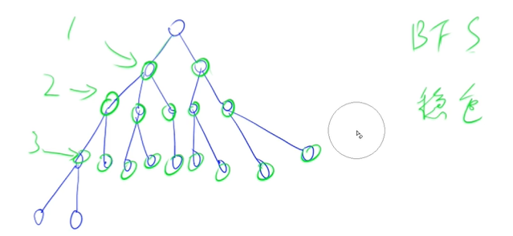

#### 走迷宫

**题目**

>

深度搜索也可以找到终点，但不能保证路径是最短的，所以要用宽度搜索。

如果要输出最短的路径，则存下每个状态从哪个状态转移过来的。

> 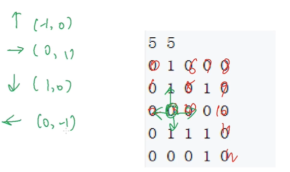

```cpp
/*给定一个 n×m 的二维整数数组，用来表示一个迷宫，数组中只包含 0 或 1，其中 0 表示可以走的路，1 表示不可通过的墙壁。
最初，有一个人位于左上角 (1,1) 处，已知该人每次可以向上、下、左、右任意一个方向移动一个位置。
请问，该人从左上角移动至右下角 (n,m) 处，至少需要移动多少次。
数据保证 (1,1) 处和 (n,m) 处的数字为 0，且一定至少存在一条通路。
*/
#include <cstring>
#include <iostream>
#include <algorithm>
#include <queue>

using namespace std;

typedef pair<int, int> PII;

const int N = 110;

int n, m;
int g[N][N], d[N][N];  //g数组存的是图，d数组存的是每一个点到起点的距离
//int Prew[N][N];  //记录路径

int bfs()
{
    queue<PII> q;

    memset(d, -1, sizeof d);
    d[0][0] = 0;   //走过了
    q.push({0, 0});

    int dx[4] = {-1, 0, 1, 0}, dy[4] = {0, 1, 0, -1};  //用向量表示运动的方向

    while (q.size())
    {
        auto t = q.front();
        q.pop();

        for (int i = 0; i < 4; i ++ )
        {
            int x = t.first + dx[i], y = t.second + dy[i];

            if (x >= 0 && x < n && y >= 0 && y < m && g[x][y] == 0 && d[x][y] == -1)
            {
                d[x][y] = d[t.first][t.second] + 1;
                //Prev[x][y] = t;  //记录前一个状态
                q.push({x, y});
            }
        }
    }
//    int x = n - 1, y = m - 1;
//    while (x || y)  //输出路径
//    {
//        cout << x << ' ' << y << endl;
//        auto t = Prev[x][y];
//        x = t.first, y = t.second;
//    }
    return d[n - 1][m - 1];
}

int main()
{
    cin >> n >> m;
    for (int i = 0; i < n; i ++ )
        for (int j = 0; j < m; j ++ )
            cin >> g[i][j];

    cout << bfs() << endl;

    return 0;
}
```


#### 八数码

题目

> 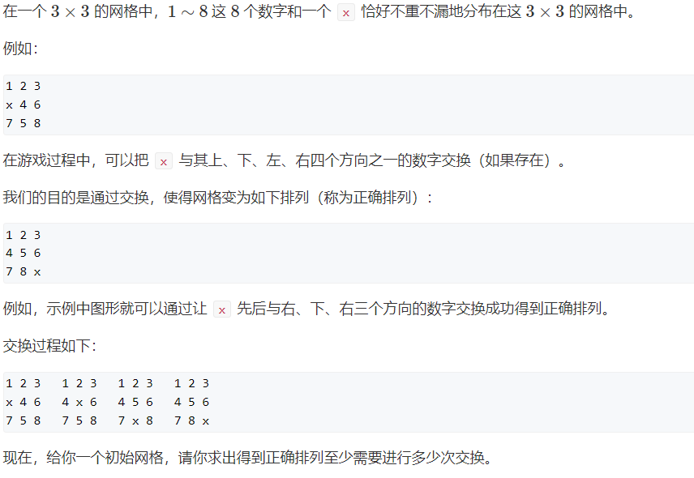
>
> 

难点：1.状态表示复杂   2.如何记录每个状态的距离  

> 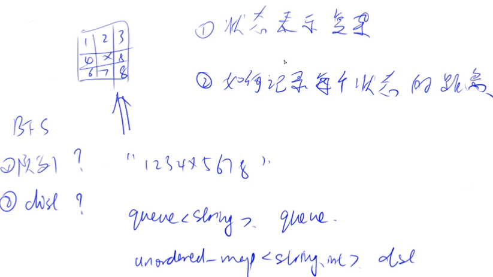

解题思路

>1、移动情况:
>
>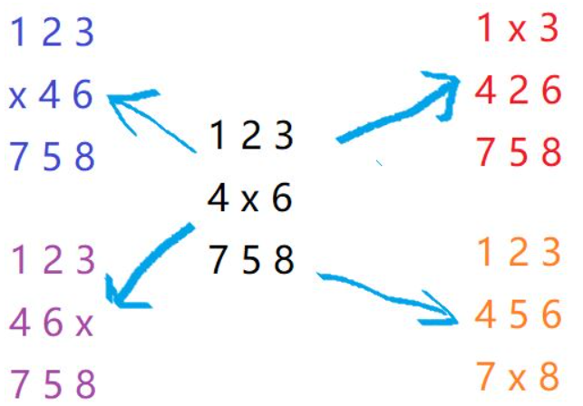
>
>2、移动方式：
>
>转化后：a = x + dx[i], b = y + dy[i].
>
>思想：将每一种情况作为1个节点，目标情况即为终点
>
>从初始状况移动到目标情况 —> 求最短路
>
>3、问题
>
>第一点：怎么表示一种情况使其能作为节点？
>
>第二点：如何记录每一个状态的“距离”（即需要移动的次数）？
>
>第三点：队列怎么定义，dist数组怎么定义？
>
>4、解决方案
>
>将 “3*3矩阵” 转化为 “字符串”
>
>如：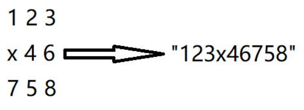
>
>所以：
>
>队列可以用 queue<string>直接存转化后的字符串
>dist数组用 unordered_map<string, int>将字符串和数字联系在一起，字符串表示状态，数字表示距离
>5、矩阵与字符串的转换方式
>
>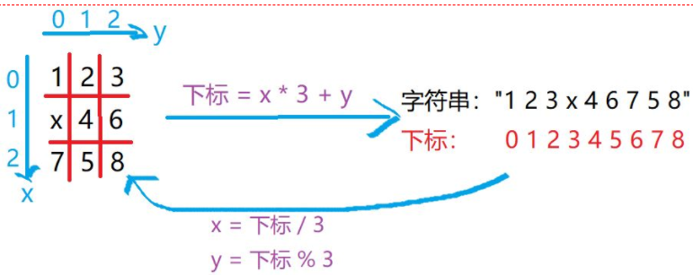

```cpp
#include <iostream>
#include <algorithm>
#include <queue>
#include <unordered_map>

using namespace std;

int bfs(string start)
{
    //定义目标状态
    string end = "12345678x";
    //定义队列和dist数组
    queue<string> q;
    unordered_map<string, int> d; 
    //初始化队列和dist数组
    q.push(start);
    d[start] = 0;
    //转移方式
    int dx[4] = {1, -1, 0, 0}, dy[4] = {0, 0, 1, -1};

    while(q.size())
    {
        auto t = q.front();  //queue<string>类型
        q.pop();
        //记录当前状态的距离，如果是最终状态则return返回距离
        int distance = d[t];
        if(t == end) return distance;
        //查询x在字符串中的下标，然后转换为在矩阵中的坐标
        int k = t.find('x');
        int x = k / 3, y = k % 3;

        for(int i = 0; i < 4; i++)
        {
            //求转移后x的坐标
            int a = x + dx[i], b = y + dy[i];
            //当前坐标没有越界
            if(a >= 0 && a < 3 && b >= 0 && b < 3)
            {
                //转移x
                swap(t[k], t[a * 3 + b]);  //交换两个队列的内容
                //如果当前状态是第一次遍历，记录距离，入队
                if(!d.count(t))
                {
                    d[t] = distance + 1;
                    q.push(t);
                }
                //还原状态，为下一种转换情况做准备
                swap(t[k], t[a * 3 + b]);
            }
        }
    }
    //无法转换到目标状态，返回-1
    return -1;
}

int main()
{
    string c, start;
    //输入起始状态
    for(int i = 0; i < 9; i++)
    {
        cin >> c;
        start += c;
    }

    cout << bfs(start) << endl;

    return 0;
}
```


## 树与图

### 树与图的存储

树是一种特殊的图（树是无环连通图），与图的存储方式相同。  
对于无向图中的边  `ab`，存储两条有向边  `a->b, b->a`。
因此我们可以只考虑有向图的存储。

1.  邻接矩阵：通过二维数组 `g[a][b]` 存储边 `a->b`
2.  邻接表：

用 h 数组保存各个节点能到的第一个节点的编号。开始时，h[i] 全部为 -1。

用 e 数组保存节点编号，ne 数组保存 e 数组对应位置的下一个节点所在的索引。

用 idx 保存下一个 e 数组中，可以放入节点位置的索引

插入边使用的头插法，例如插入：a->b。首先把b节点存入e数组，e[idx] = b。然后 b 节点的后继是h[a]，ne[idx] = h[a]。最后，a 的后继更新为 b 节点的编号，h[a] = idx，索引指向下一个可以存储节点的位置，idx ++ 。

> 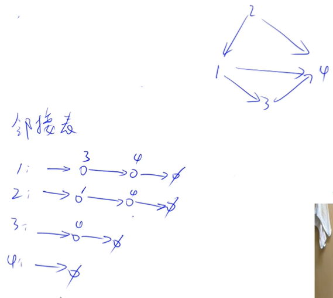

```cpp
// 对于每个点k，开一个单链表，存储k所有可以走到的点。h[k]存储这个单链表的头结点
int h[N], e[N], ne[N], idx;

// 添加一条边a->b
void add(int a, int b)
{
    e[idx] = b, ne[idx] = h[a], h[a] = idx ++ ;
}

// 初始化
idx = 0;
memset(h, -1, sizeof h);
```


### 树与图的遍历

时间复杂度 O(n+m)， n 表示点数，m 表示边数

#### 树与图的深度优先遍历

时间复杂度 O(n+m)， n 表示点数，m 表示边数

> 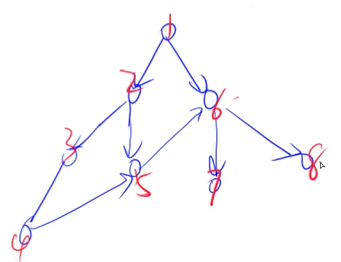

```cpp
int h[N], e[M], ne[M];
bool st[N];

int dfs(int u) //u表示当前遍历到的点
{
    st[u] = true; // st[u] 表示点u已经被遍历过

    for (int i = h[u]; i != -1; i = ne[i])
    {
        int j = e[i];  //j表示当前链表里的节点对应图里面的编号是多少
        if (!st[j]) dfs(j);
    }
}
```

#### 树的重心

**题目**

>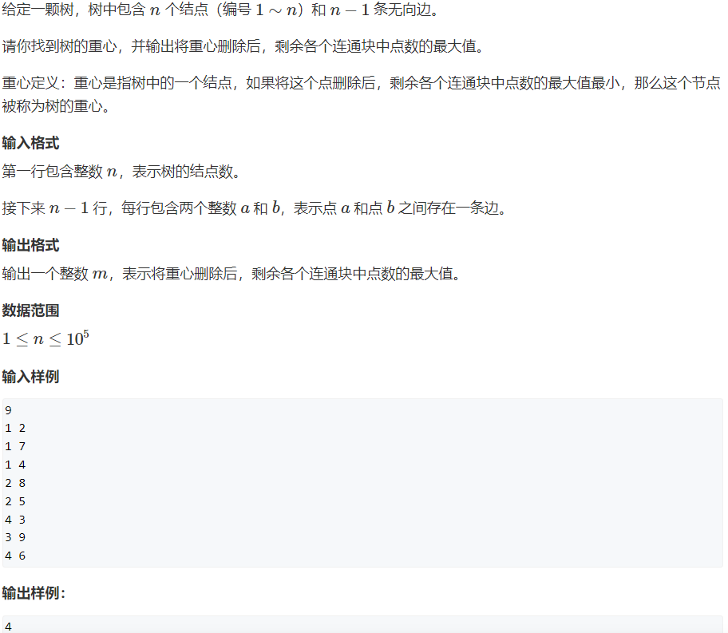

下图的重心为1，将这个点删除后，剩余各个连通块中点数的最大值最小。

> 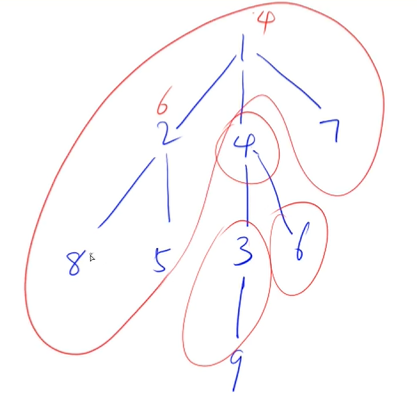

4之下的点数为size，则4之上的点数为n - size。

> 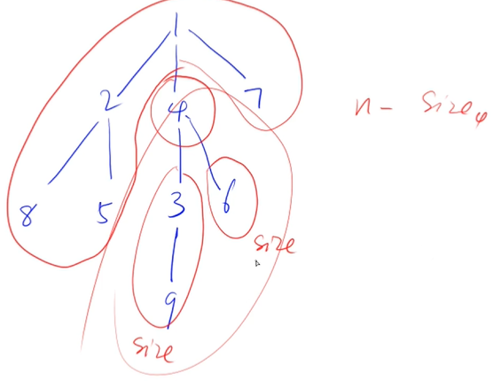

```cpp
/*给定一颗树，树中包含 n 个结点（编号 1∼n）和 n−1 条无向边。
请你找到树的重心，并输出将重心删除后，剩余各个连通块中点数的最大值。
重心定义：重心是指树中的一个结点，如果将这个点删除后，剩余各个连通块中点数的最大值最小，那么这个节点被称为树的重心。
*/
// 每次dfs可以确定以u为重心的最大连通块的节点数，并且更新一下ans。也就是说，dfs并不直接返回答案，而是在每次更新中迭代一次答案。
#include <iostream>
#include <algorithm>
#include <cstring>

using namespace std;

const int N = 1e5 + 10; //数据范围是10的5次方
const int M = 2 * N; //以有向图的格式存储无向图，所以每个节点至多对应2n-2条边

int h[N]; //邻接表存储树，有n个节点，所以需要n个队列头节点
int e[M]; //存储元素
int ne[M]; //存储列表的next值
int idx; //单链表指针
int n; //题目所给的输入，n个节点
int ans = N; //表示重心的所有的子树中，最大的子树的结点数目

bool st[N]; //记录节点是否被访问过，访问过则标记为true

//a所对应的单链表中插入b  a作为根 
void add(int a, int b) 
{
    e[idx] = b, ne[idx] = h[a], h[a] = idx++;
}

//返回以u为根的子树中节点的个数，包括u节点
int dfs(int u) 
{
    int res = 0; //存储 删掉某个节点之后，最大的连通子图节点数
    st[u] = true; //标记访问过u节点
    int sum = 1; //存储 以u为根的树 的节点数, 包括u，如图中的4号节点

    //访问u的每个子节点
    for (int i = h[u]; i != -1; i = ne[i]) 
    {
        int j = e[i];
        //因为每个节点的编号都是不一样的，所以 用编号为下标 来标记是否被访问过
        if (!st[j]) 
        {
            int s = dfs(j);  // u节点的单棵子树节点数 如图中的size值
            res = max(res, s); // 记录最大联通子图的节点数
            sum += s; //以j为根的树 的节点数
        }
    }

    //n-sum 如图中的n-size值，不包括根节点4；
    res = max(res, n - sum); // 选择u节点为重心，最大的 连通子图节点数
    ans = min(res, ans); //遍历过的假设重心中，最小的最大联通子图的 节点数
    return sum;
}

int main() 
{
    memset(h, -1, sizeof h); //初始化h数组 -1表示尾节点
    cin >> n; //表示树的结点数

    // 题目接下来会输入，n-1行数据，
    // 树中是不存在环的，对于有n个节点的树，必定是n-1条边
    for (int i = 0; i < n - 1; i++) 
    {
        int a, b;
        cin >> a >> b;
        add(a, b), add(b, a); //无向图
    }

    dfs(1); //可以任意选定一个节点开始 u<=n

    cout << ans << endl;

    return 0;
}
```


#### 树与图的宽度优先遍历

时间复杂度 O(n+m)， n 表示点数，m 表示边数

> 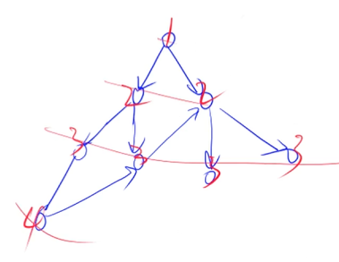

```cpp
queue<int> q;
st[1] = true; // 表示1号点已经被遍历过
q.push(1); //1号点入队

while (q.size())
{
    int t = q.front(); //每一次取得队头元素
    q.pop();  

    for (int i = h[t]; i != -1; i = ne[i])  //拓展t所有邻点
    {
        int j = e[i]; //j = e[i] 表示当前遍历的节点对应图里的编号是多少
        if (!st[j])
        {
            st[j] = true; // 表示点j已经被遍历过
            q.push(j);  //节点入队，待原节点的相邻节点链表遍历结束后，再重新从队列中取出遍历
        }
    }
}
```

#### 图中点的层次

**题目**

>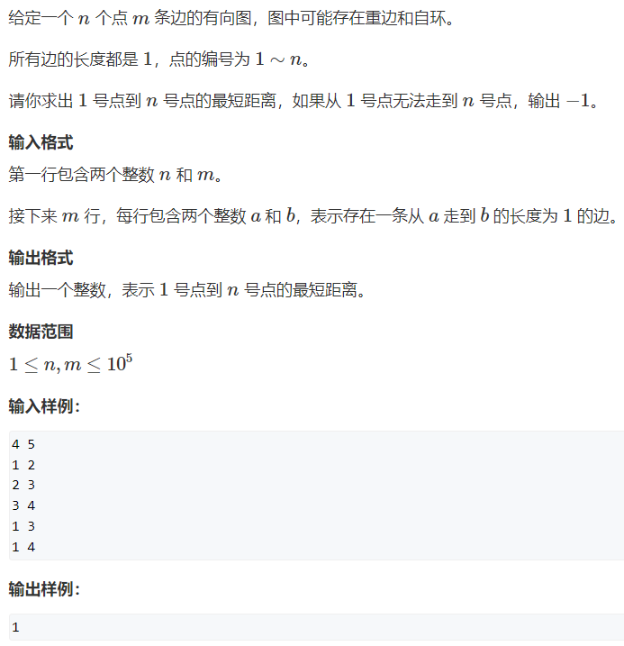

> 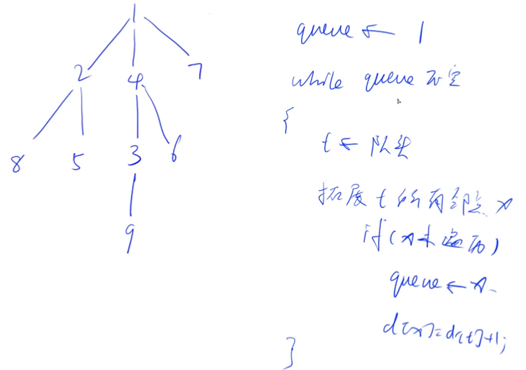

```cpp
/*给定一个 n 个点 m 条边的有向图，图中可能存在重边和自环。
所有边的长度都是 1，点的编号为 1∼n。
请你求出 1 号点到 n 号点的最短距离，如果从 1 号点无法走到 n 号点，输出 −1。
*/
#include <iostream>
#include <cstring>
#include <algorithm>

using namespace std;

const int N = 100010;

int n, m;
int h[N], e[N], ne[N], idx;
int d[N], q[N];

void add(int a, int b)
{
    e[idx] = b, ne[idx] = h[a], h[a] = idx++;
}

int bfs()
{
    int hh = 0, tt = 0;  //定义队头队尾
    q[0] = 1;  //第一个元素为起点1
    
    memset(d, -1, sizeof d);  //-1表示没有被遍历过
    
    d[1] = 0; //最开始只有第一个点被遍历过了，距离为0
    
    while (hh <= tt)  //队列不空
    {
        int t = q[hh++];  //每次取队头
        
        for (int i = h[t]; i != -1; i = ne[i])  //直接扩展每个点的邻边
        {
            int j = e[i];
            if (d[j] == -1)
            {
                d[j] = d[t] + 1;
                q[++tt] = j;
            }
        }
    }
    return d[n];
}

int main()
{
    cin >> n >> m;
    
    memset(h, -1, sizeof h);
    
    for (int i = 0; i < m; i++)
    {
        int a, b;
        cin >> a >> b;
        add(a, b);
    }
    cout << bfs() << endl;
    return 0;
}
```


## 拓扑排序

拓扑序列：

若一个由图中所有点构成的序列 A 满足：对于图中的每条边 (x,y)，x 在 A 中都出现在 y 之前，则称 A 是该图的一个拓扑序列。即所有的边都是从前指向后的。

有向图才会有拓扑序列，无向图没有。并不是所有图都有，如果图中存在环，则一定不存在拓扑序列。

可以证明有向无环图一定存在拓扑序列，其也被称为拓扑图。

可以证明一个有向无环图，至少存在一个入度为0的点。

度：

入度：一个点有多少条边指向自己。

出度：一个点有几条边指向其他点。

#### 拓扑排序模板

时间复杂度 O(n+m),  n 表示点数，m 表示边数

```cpp
bool topsort()
{
    int hh = 0, tt = -1;

    // d[i] 存储点i的入度
    for (int i = 1; i <= n; i ++ )
        if (!d[i])
            q[ ++ tt] = i;

    while (hh <= tt)
    {
        int t = q[hh ++ ];

        for (int i = h[t]; i != -1; i = ne[i])
        {
            int j = e[i];
            if (-- d[j] == 0)
                q[ ++ tt] = j;
        }
    }

    // 如果所有点都入队了，说明存在拓扑序列；否则不存在拓扑序列。
    return tt == n - 1;
}
```


#### 有向图的拓扑序列

**题目**

>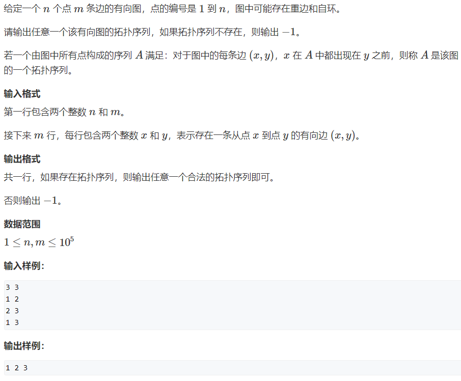

所有入度为0的点都可以排在当前最前面的位置，因此第一步就是把所有入度为0的点入队。

>
>
>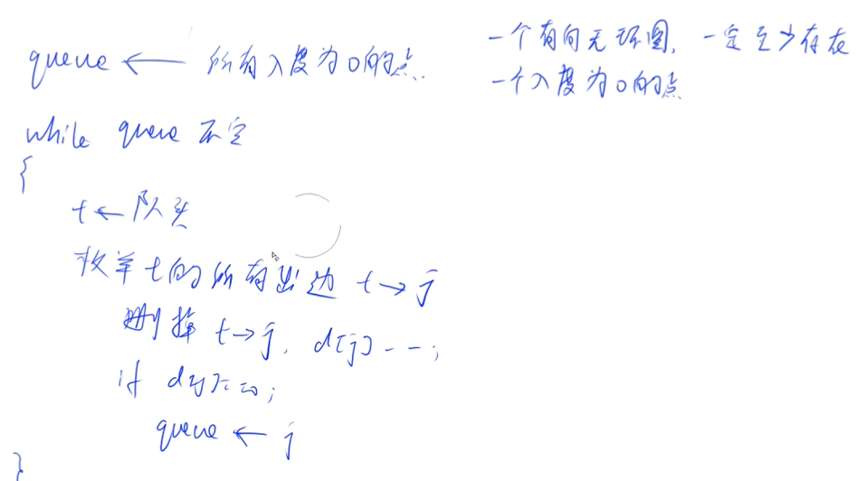

```cpp
/*给定一个 n 个点 m 条边的有向图，点的编号是 1 到 n，图中可能存在重边和自环。
请输出任意一个该有向图的拓扑序列，如果拓扑序列不存在，则输出 −1。
若一个由图中所有点构成的序列 A 满足：对于图中的每条边 (x,y)，x 在 A 中都出现在 y 之前，则称 A 是该图的一个拓扑序列。
*/
#include<iostream>
#include<cstring>
#include<algorithm>
using namespace std;

const int N=100010;
int h[N],e[N],ne[N],idx;
int n,m;
int q[N],d[N];//q表示队列,d表示点的入度

void add(int a,int b)
{
    e[idx]=b;
    ne[idx]=h[a];
    h[a]=idx++;
}

bool topsort()
{
    int hh=0,tt=-1;
   
    for(int i=1;i<=n;i++)
   		if(!d[i]) 
  			q[++tt]=i;//将入度为零的点入队
    
    while(hh<=tt)
    {
        int t=q[hh++];
        for(int i=h[t];i!=-1;i=ne[i])
        {
            int j=e[i];
            d[j]--;//删除点t指向点j的边
            if(d[j]==0)//如果点j的入度为零了,就将点j入队
            q[++tt]=j;
        }
    }
    return tt==n-1;
    //表示如果n个点都入队了话,那么该图为拓扑图,返回true,否则返回false
}

int main()
{
    cin>>n>>m;
    memset(h,-1,sizeof(h));//如果程序时间溢出，就是没有加上这一句
    for(int i=0;i<m;i++)
    {
        int a,b;
        scanf("%d%d",&a,&b);
        add(a,b);//因为是a指向b,所以b点的入度要加1
        d[b]++;
    }
    if(topsort()) 
    {
        for(int i=0;i<n;i++)
        printf("%d ",q[i]);
        //经上方循环可以发现队列中的点的次序就是拓扑序列
        //注:拓扑序列的答案并不唯一,可以从解析中找到解释
        puts("");
    }
    else
    puts("-1");

    return 0;
}
```


## 最短路问题

源点 —— 起点 ， 汇点 —— 终点 ，n —— 点数 ， m —— 边数

1. 稠密图（m 和 n^2^一个级别的叫稠密图）用朴素Dijkstra ，稀疏图（m和n一个级别）用堆优化版的Dijkstra。

2. 如果图中存在负权边（一个起点到其他点的最短路）用SPFA，如果存在负权边且题目限制经过不超过K条边的最短路用Bellman-Ford。
3. 只要图中没有负环，就可以用SPFA算法，99%的最短路问题不存在负环。有负环则要用Bellman-Ford算法。
4. 多源汇最短路（很多不同起点到其他点的最短路）用Bellman-Ford。
5. 最短路考察的侧重点是建图，如何把原问题抽象成最短路问题，如果定义点和边，使得问题变成最短路问题，不会考察算法的证明，而是算法的实现。
6. Dijkstra算法基于贪心，Floyd算法基于动态规划，Bellman-Ford基于离散数学。

> 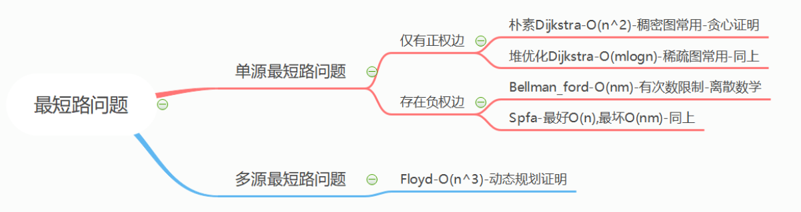
>
> 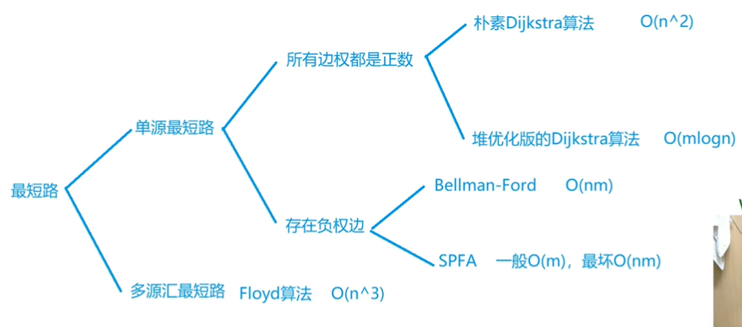

**汇总整理**

Dijkstra-朴素O(n^2)

>初始化距离数组, dist[1] = 0, dist[i] = inf;
>for n次循环 每次循环确定一个min加入S集合中，n次之后就得出所有的最短距离
>将不在S中dist_min的点->t
>t->S加入最短路集合
>用t更新到其他点的距离

Dijkstra-堆优化O(mlogm)

>利用邻接表，优先队列
>在priority_queue[HTML_REMOVED], greater[HTML_REMOVED] > heap;中将返回堆顶
>利用堆顶来更新其他点，并加入堆中类似宽搜

Bellman_fordO(nm)

>注意连锁想象需要备份, struct Edge{inta,b,c} Edge[M];
>初始化dist, 松弛dist[x.b] = min(dist[x.b], backup[x.a]+x.w);
>松弛k次，每次访问m条边

Spfa O(n)~O(nm)

>利用队列优化仅加入修改过的地方
>for k次
>for 所有边利用宽搜模型去优化bellman_ford算法
>更新队列中当前点的所有出边

Floyd O(n^3)

>初始化d
>k, i, j 去更新d


### Dijkstra算法

稠密图（m 和 n^2^一个级别的叫稠密图）用朴素Dijkstra ，稀疏图（m和n一个级别）用堆优化版的Dijkstra。

一般情况优先选择堆优化版的Dijkstra算法。

稠密图用邻接矩阵来存储，稀疏图用邻接表来存储。

#### 朴素版的Dijkstra算法

算法步骤：

0. 定义集合s为当前已确定最短距离（从1号点到当前这个点的最短距离）的点

1. 先初始化距离     一号点dist[1] = 0,  其他所有点dist[i] = 正无穷
2. for循环   i : 0 ~ n
   1. 找到不在s中的距离最近的点t
   2. 把t加到s中
   3. 用t更新其他所有点的距离 

> 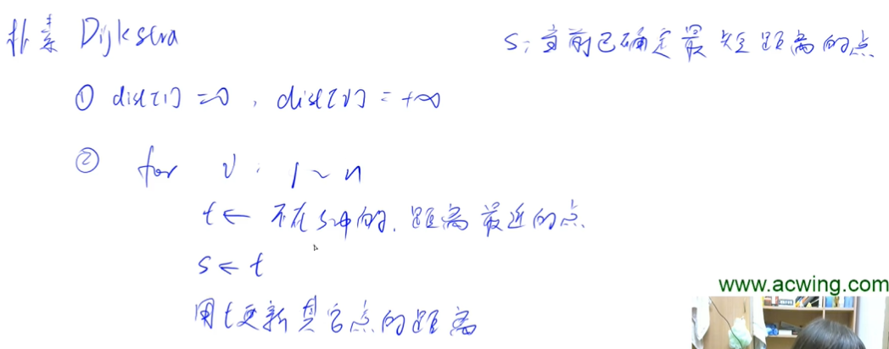

**算法模板**

时间复杂是 O(n^2^+m), n 表示点数，m 表示边数

```cpp
int g[N][N];  // 存储每条边
int dist[N];  // 存储1号点到每个点的最短距离
bool st[N];   // 存储每个点的最短路是否已经确定

// 求1号点到n号点的最短路，如果不存在则返回-1
int dijkstra()
{
    memset(dist, 0x3f, sizeof dist);
    dist[1] = 0;

    for (int i = 0; i < n - 1; i ++ )
    {
        int t = -1;     // 在还未确定最短路的点中，寻找距离最小的点
        for (int j = 1; j <= n; j ++ )
            if (!st[j] && (t == -1 || dist[t] > dist[j]))
                t = j;

        // 用t更新其他点的距离
        for (int j = 1; j <= n; j ++ )
            dist[j] = min(dist[j], dist[t] + g[t][j]);

        st[t] = true;
    }

    if (dist[n] == 0x3f3f3f3f) return -1;
    return dist[n];
}
```

#### Dijkstra求最短路I

**题目**

>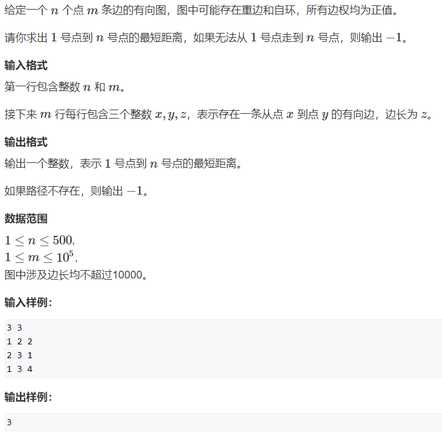

稠密图用邻接矩阵来存储。

> 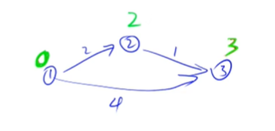

```cpp
/*给定一个 n 个点 m 条边的有向图，图中可能存在重边和自环，所有边权均为正值。
请你求出 1 号点到 n 号点的最短距离，如果无法从 1 号点走到 n 号点，则输出 −1。
1≤n≤500,1≤m≤105,图中涉及边长均不超过10000。
*/
#include <cstring>
#include <iostream>
#include <algorithm>
using namespace std;

const int N = 510;

int n, m;
int g[N][N];  // 存储每条边
int dist[N];  // 存储1号点到每个点的最短距离
bool st[N];   // 存储每个点的最短路是否已经确定

int dijkstra()
{
    memset(dist, 0x3f, sizeof dist); //初始化距离 0x3f表示无限大
    dist[1] = 0;  //第一个点到自身的距离为0
    
    for (int i = 0; i < n; i++)  //有n个点所以要进行n次  迭代
    {
        int t = -1;  //t存储当前访问的点 将t设置为-1 因为Dijkstra算法适用于不存在负权边的图
        
        //每次迭代的过程中我们都先找到当前未确定的最短距离的点中距离最短的点
        for (int j = 1; j <= n; j++)  //这里的j代表的是从1号点开始
            //该步骤即寻找还未确定最短路的点中路径最短的点
            if (!st[j] && (t == -1 || dist[t] > dist[j]))
                t = j;
        
        st[t] = true;
        
        for (int j = 1; j <= n; j++)  //依次更新每个点所到相邻的点路径值
            dist[j] = min(dist[j], dist[t] + g[t][j]);
    }
    if (dist[n] == 0x3f3f3f3f) return -1; //如果第n个点路径为无穷大即不存在最短路径
    return dist[n];
}

int main()
{
    cin >> n >> m;
    
    memset(g, 0x3f, sizeof g); //初始化图 因为是求最短路径 所以每个点初始为无限大
    
    while (m--)
    {
        int x, y, z;
        cin >> x >> y >> z;
        g[x][y] = min(g[x][y], z);  //如果发生重边的情况则保留最短的一条边
    }
    
    cout << dijkstra() << endl;
    return 0;
}
```


#### 堆优化版Dijkstra算法

**算法模板**

时间复杂度 O(mlogn),  n 表示点数，m 表示边数

```cpp
typedef pair<int, int> PII;

int n;      // 点的数量
int h[N], w[N], e[N], ne[N], idx;       // 邻接表存储所有边
int dist[N];        // 存储所有点到1号点的距离
bool st[N];     // 存储每个点的最短距离是否已确定

// 求1号点到n号点的最短距离，如果不存在，则返回-1
int dijkstra()
{
    memset(dist, 0x3f, sizeof dist);
    dist[1] = 0;
    priority_queue<PII, vector<PII>, greater<PII>> heap;
    heap.push({0, 1});      // first存储距离，second存储节点编号

    while (heap.size())
    {
        auto t = heap.top();
        heap.pop();

        int ver = t.second, distance = t.first;

        if (st[ver]) continue;
        st[ver] = true;

        for (int i = h[ver]; i != -1; i = ne[i])
        {
            int j = e[i];
            if (dist[j] > distance + w[i])
            {
                dist[j] = distance + w[i];
                heap.push({dist[j], j});
            }
        }
    }

    if (dist[n] == 0x3f3f3f3f) return -1;
    return dist[n];
}
```

#### Dijkstra求最短路II

**题目**

>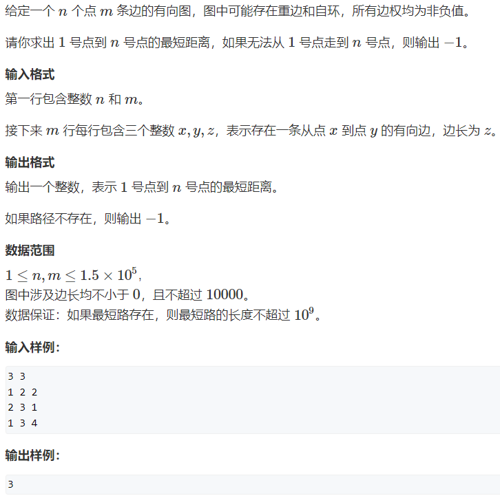

朴素Dijkstra算法每个步骤运行的次数，总时间复杂是 O(n^2^+m)。

使用堆来寻找距离最近的点，优化后的运行次数，总时间复杂度 O(mlogn)。

> 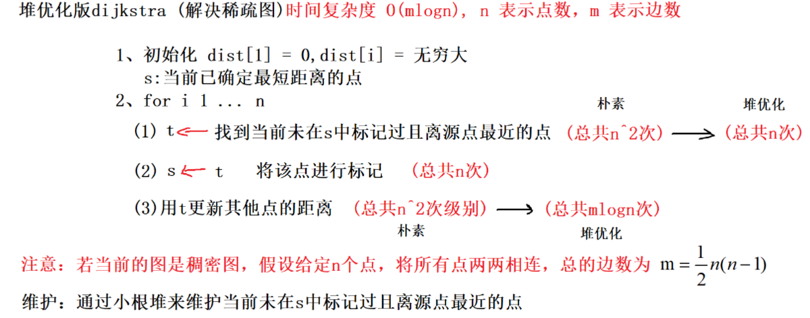
>
> 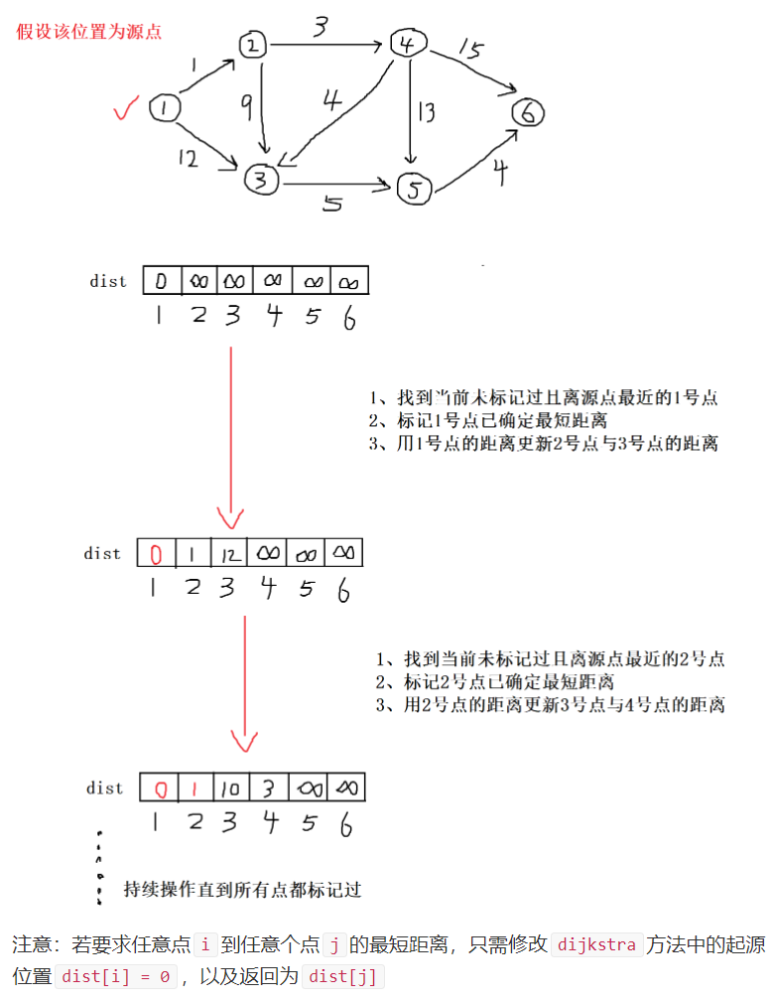

稀疏图用邻接表来存储。

1. 一号点的距离初始化为零，其他点初始化成无穷大。
2. 将一号点放入堆中。
3. 不断循环，直到堆空。每一次循环中执行的操作为：
    弹出堆顶（与朴素版diijkstra找到S外距离最短的点相同，并标记该点的最短路径已经确定）。
    用该点更新临界点的距离，若更新成功就加入到堆中。

```cpp
/*给定一个 n 个点 m 条边的有向图，图中可能存在重边和自环，所有边权均为非负值。
请你求出 1 号点到 n 号点的最短距离，如果无法从 1 号点走到 n 号点，则输出 −1。
1≤n,m≤1.5×105,图中涉及边长均不小于 0，且不超过 10000。
*/
#include<iostream>
#include<cstring>
#include<queue>

using namespace std;

typedef pair<int, int> PII;

const int N = 100010; // 把N改为150010就能ac

// 稀疏图用邻接表来存
int h[N], e[N], ne[N], idx;
int w[N]; // 用来存权重
int dist[N];
bool st[N]; // 如果为true说明这个点的最短路径已经确定

int n, m;

void add(int x, int y, int c)
{
    w[idx] = c; // 有重边也不要紧，假设1->2有权重为2和3的边，再遍历到点1的时候2号点的距离会更新两次放入堆中
    e[idx] = y; // 这样堆中会有很多冗余的点，但是在弹出的时候还是会弹出最小值2+x（x为之前确定的最短路径），并
    ne[idx] = h[x]; // 标记st为true，所以下一次弹出3+x会continue不会向下执行。
    h[x] = idx++;
}

int dijkstra()
{
    memset(dist, 0x3f, sizeof(dist));
    dist[1] = 0;
    priority_queue<PII, vector<PII>, greater<PII> > heap; // 定义一个小根堆
    // 这里heap中为什么要存pair呢，首先小根堆是根据距离来排的，所以有一个变量要是距离，其次在从堆中拿出来的时    
    // 候要知道知道这个点是哪个点，不然怎么更新邻接点呢？所以第二个变量要存点。
    heap.push({ 0, 1 }); // 这个顺序不能倒，pair排序时是先根据first，再根据second，这里显然要根据距离排序
    while(heap.size())
    {
        PII k = heap.top(); // 取不在集合S中距离最短的点
        heap.pop();
        int ver = k.second, distance = k.first;

        if(st[ver]) continue;
        st[ver] = true;

        for(int i = h[ver]; i != -1; i = ne[i])
        {
            int j = e[i]; // i只是个下标，e中在存的是i这个下标对应的点。
            if(dist[j] > distance + w[i])
            {
                dist[j] = distance + w[i];
                heap.push({ dist[j], j });
            }
        }
    }
    if(dist[n] == 0x3f3f3f3f) return -1;
    else return dist[n];
}

int main()
{
    memset(h, -1, sizeof(h));
    scanf("%d%d", &n, &m);

    while (m--)
    {
        int x, y, c;
        scanf("%d%d%d", &x, &y, &c);
        add(x, y, c);
    }

    cout << dijkstra() << endl;

    return 0;
}
```


### Bellman-Ford算法

算法步骤：

1. for n次
2. for 所有边 a,b,w (松弛操作)
3. dist[b] = min(dist[b],back[a] + w)

注意：back[] 数组是上一次迭代后 dist[] 数组的备份，由于是每个点同时向外出发，因此需要对 dist[] 数组进行备份，若不进行备份会因此发生串联效应，影响到下一个点

若图中存在负权回路，则不存在最短路，通过Bellman-Ford算法可以判断负环（但时间复杂度高）。

>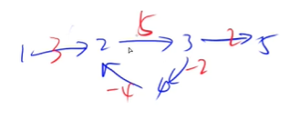

**算法模板**

时间复杂度 O(nm), n 表示点数，m 表示边数
注意在模板题中需要对下面的模板稍作修改，加上备份数组，详情见模板题。

```cpp
int n, m;       // n表示点数，m表示边数
int dist[N];        // dist[x]存储1到x的最短路距离

struct Edge     // 边，a表示出点，b表示入点，w表示边的权重
{
    int a, b, w;
}edges[M];

// 求1到n的最短路距离，如果无法从1走到n，则返回-1。
int bellman_ford()
{
    memset(dist, 0x3f, sizeof dist);
    dist[1] = 0;

    // 如果第n次迭代仍然会松弛三角不等式，就说明存在一条长度是n+1的最短路径，由抽屉原理，路径中至少存在两个相同的点，说明图中存在负权回路。
    for (int i = 0; i < n; i ++ )
    {
        for (int j = 0; j < m; j ++ )
        {
            int a = edges[j].a, b = edges[j].b, w = edges[j].w;
            if (dist[b] > dist[a] + w)
                dist[b] = dist[a] + w;
        }
    }

    if (dist[n] > 0x3f3f3f3f / 2) return -1;
    return dist[n];
}
```

#### 有边数限制的最短路

**题目**

>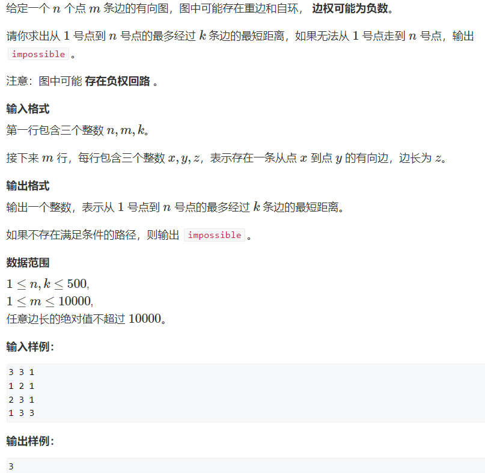

> 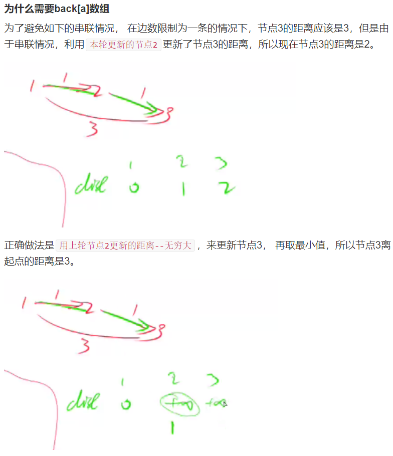

```cpp
/*给定一个 n 个点 m 条边的有向图，图中可能存在重边和自环，边权可能为负数。
请你求出从 1 号点到 n 号点的最多经过 k 条边的最短距离，如果无法从 1 号点走到 n 号点，输出 impossible。
注意：图中可能 存在负权回路 。
*/
#include<iostream>
#include<cstring>

using namespace std;

const int N = 510, M = 10010;

struct Edge 
{
    int a;
    int b;
    int w;
} e[M];//把每个边保存下来即可
int dist[N];//距离
int back[N];//备份数组防止串联
int n, m, k;//k代表最短路径最多包涵k条边

void bellman_ford() 
{
    memset(dist, 0x3f, sizeof dist);
    dist[1] = 0;
    for (int i = 0; i < k; i++) 
    {//k次循环
        memcpy(back, dist, sizeof dist);
        for (int j = 0; j < m; j++) 
        {//遍历所有边
            auto l = e[j];
            dist[l.b] = min(dist[l.b], back[l.a] + l.w);
            //使用backup:避免给a更新后立马更新b, 这样b一次性最短路径就多了两条边出来
        }
    }
}

int main() {
    scanf("%d%d%d", &n, &m, &k);
    for (int i = 0; i < m; i++) 
    {
        int a, b, w;
        scanf("%d%d%d", &a, &b, &w);
        e[i] = {a, b, w};
    }
        //5号节点距离起点的距离是无穷大，利用5号节点更新n号节点距离起点的距离，将得到109−2109−2, 虽然小于109109, 但并不存在最短路，(在边数限制在k条的条件下)。
    bellman_ford();

    if (dist[n] > 0x3f3f3f3f / 2) puts("impossible");
    else printf("%d\n", dist[n]);

    return 0;
}
```


### SPFA算法

SPFA 算法是 Bellman-Ford算法 的队列优化算法的别称，通常用于求含负权边的单源最短路径，以及判负权环。SPFA一般情况复杂度是O(m)O(m) 最坏情况下复杂度和朴素 Bellman-Ford 相同，为O(nm)O(nm)。

只要图中没有负环，就可以用SPFA算法，99%的最短路问题不存在负环。

bellman-ford算法操作如下：

1. for n次
2. for 所有边 a,b,w (松弛操作)
3. dist[b] = min(dist[b],back[a] + w)

spfa算法对第二行中所有边进行松弛操作进行了优化，原因是在bellman—ford算法中，即使该点的最短距离尚未更新过，但还是需要用尚未更新过的值去更新其他点，由此可知，该操作是不必要的，我们只需要找到更新过的值去更新其他点即可。

SPFA 算法步骤：

1. queue <- 1

2. while queue 不为空

   (1) t <- 队头     queue.pop()
    (2)用 t 更新所有出边 t –> b，权值为w ，queue <– b (若该点被更新过，则拿该点更新其他点)

**算法模板**

SPFA算法（队列优化的Bellman-Ford算法）

时间复杂度 平均情况下 O(m)，最坏情况下 O(nm), n 表示点数，m 表示边数

```cpp
int n;      // 总点数
int h[N], w[N], e[N], ne[N], idx;       // 邻接表存储所有边
int dist[N];        // 存储每个点到1号点的最短距离
bool st[N];     // 存储每个点是否在队列中

// 求1号点到n号点的最短路距离，如果从1号点无法走到n号点则返回-1
int spfa()
{
    memset(dist, 0x3f, sizeof dist);
    dist[1] = 0;

    queue<int> q;
    q.push(1);
    st[1] = true;

    while (q.size())
    {
        auto t = q.front();
        q.pop();

        st[t] = false;

        for (int i = h[t]; i != -1; i = ne[i])
        {
            int j = e[i];
            if (dist[j] > dist[t] + w[i])
            {
                dist[j] = dist[t] + w[i];
                if (!st[j])     // 如果队列中已存在j，则不需要将j重复插入
                {
                    q.push(j);
                    st[j] = true;
                }
            }
        }
    }

    if (dist[n] == 0x3f3f3f3f) return -1;
    return dist[n];
}
```

#### spfa判断图中是否存在负环

时间复杂度是 O(nm), n 表示点数，m 表示边数

```cpp
int n;      // 总点数
int h[N], w[N], e[N], ne[N], idx;       // 邻接表存储所有边
int dist[N], cnt[N];        // dist[x]存储1号点到x的最短距离，cnt[x]存储1到x的最短路中经过的点数
bool st[N];     // 存储每个点是否在队列中

// 如果存在负环，则返回true，否则返回false。
bool spfa()
{
    // 不需要初始化dist数组
    // 原理：如果某条最短路径上有n个点（除了自己），那么加上自己之后一共有n+1个点，由抽屉原理一定有两个点相同，所以存在环。

    queue<int> q;
    for (int i = 1; i <= n; i ++ )
    {
        q.push(i);
        st[i] = true;
    }

    while (q.size())
    {
        auto t = q.front();
        q.pop();

        st[t] = false;

        for (int i = h[t]; i != -1; i = ne[i])
        {
            int j = e[i];
            if (dist[j] > dist[t] + w[i])
            {
                dist[j] = dist[t] + w[i];
                cnt[j] = cnt[t] + 1;
                if (cnt[j] >= n) return true;       // 如果从1号点到x的最短路中包含至少n个点（不包括自己），则说明存在环
                if (!st[j])
                {
                    q.push(j);
                    st[j] = true;
                }
            }
        }
    }

    return false;
}
```


#### SPFA求最短路

**题目**

>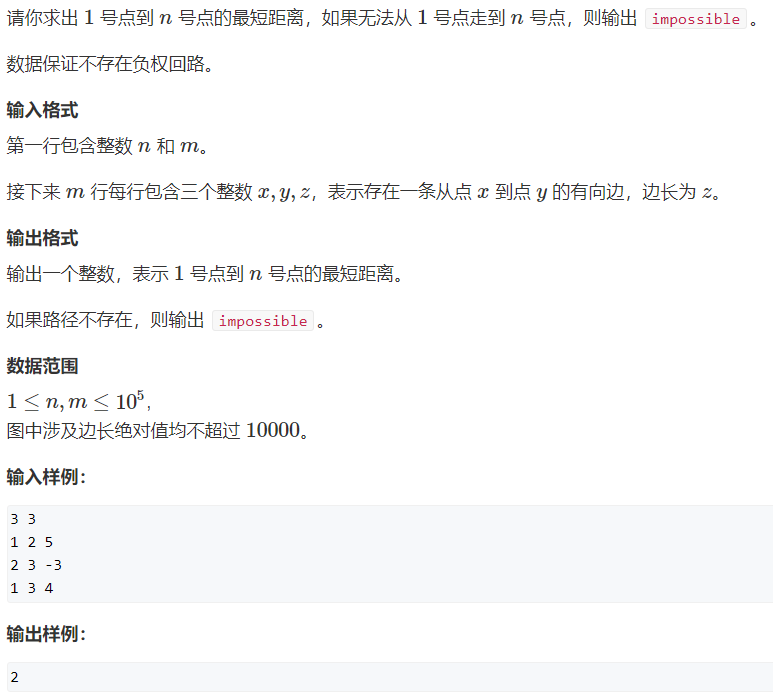

Bellman_ford算法会遍历所有的边，但是有很多的边遍历了其实没有什么意义，我们只用遍历那些到源点距离变小的点所连接的边即可，只有当一个点的前驱结点更新了，该节点才会得到更新；因此考虑到这一点，我们将创建一个队列每一次加入距离被更新的结点。

1) st数组的作用：判断当前的点是否已经加入到队列当中了；已经加入队列的结点就不需要反复的把该点加入到队列中了，就算此次还是会更新到源点的距离，那只用更新一下数值而不用加入到队列当中。
即便不使用st数组最终也没有什么关系，但是使用的好处在于可以提升效率。
2) SPFA算法看上去和Dijstra算法长得有一些像但是其中的意义还是相差甚远的:

> 1] Dijkstra算法中的st数组保存的是当前确定了到源点距离最小的点，且一旦确定了最小那么就不可逆了(不可标记为true后改变为false)；SPFA算法中的st数组仅仅只是表示的当前发生过更新的点，且spfa中的st数组可逆(可以在标记为true之后又标记为false)。顺带一提的是BFS中的st数组记录的是当前已经被遍历过的点。
> 2] Dijkstra算法里使用的是优先队列保存的是当前未确定最小距离的点，目的是快速的取出当前到源点距离最小的点；SPFA算法中使用的是队列(你也可以使用别的数据结构),目的只是记录一下当前发生过更新的点。

3) ⭐Bellman_ford算法里最后return-1的判断条件写的是dist[n]>0x3f3f3f3f/2;而spfa算法写的是dist[n]==0x3f3f3f3f;其原因在于Bellman_ford算法会遍历所有的边，因此不管是不是和源点连通的边它都会得到更新；但是SPFA算法不一样，它相当于采用了BFS，因此遍历到的结点都是与源点连通的，因此如果你要求的n和源点不连通，它不会得到更新，还是保持的0x3f3f3f3f。

4) ⭐️ Bellman_ford算法可以存在负权回路，是因为其循环的次数是有限制的因此最终不会发生死循环；但是SPFA算法不可以，由于用了队列来存储，只要发生了更新就会不断的入队，因此假如有负权回路请你不要用SPFA否则会死循环。

5) ⭐️由于SPFA算法是由Bellman_ford算法优化而来，在最坏的情况下时间复杂度和它一样即时间复杂度为 O(nm) ，假如题目时间允许可以直接用SPFA算法去解Dijkstra算法的题目。(如果出题人不卡你时间复杂度的话，用Dijstra算法解的题也可以用SPFA，因为SPFA最坏情况为O(nm))

6) ⭐️求负环一般使用SPFA算法，方法是用一个cnt数组记录每个点到源点的边数，一个点被更新一次就+1，一旦有点的边数达到了n那就证明存在了负环。

```cpp
/*给定一个 n 个点 m 条边的有向图，图中可能存在重边和自环， 边权可能为负数。
请你求出 1 号点到 n 号点的最短距离，如果无法从 1 号点走到 n 号点，则输出 impossible。
数据保证不存在负权回路。
*/
#include <cstring>
#include <iostream>
#include <algorithm>
#include <queue>

using namespace std;

const int N = 100010;

int n, m;
int h[N], w[N], e[N], ne[N], idx;
int dist[N];  //各点到源点的距离
bool st[N];

void add(int a, int b, int c)
{
    e[idx] = b, w[idx] = c, ne[idx] = h[a], h[a] = idx ++ ;
}

int spfa()
{
    memset(dist, 0x3f, sizeof dist);
    dist[1] = 0;

    queue<int> q;
    q.push(1);
    st[1] = true;

    while (q.size())
    {
        int t = q.front();
        q.pop();
  //从队列中取出来之后该节点st被标记为false,代表之后该节点如果发生更新可再次入队
        st[t] = false;

        for (int i = h[t]; i != -1; i = ne[i])
        {
            int j = e[i];
            if (dist[j] > dist[t] + w[i]) //判断是否可以更新
            {
                dist[j] = dist[t] + w[i];
  //当前已经加入队列的结点，无需再次加入队列，即便发生了更新也只用更新数值即可，重复添加降低效率
                if (!st[j]) //判断是否在队列中，不在，则加入到队列中
                {
                    q.push(j);
                    st[j] = true;
                }
            }
        }
    }

    return dist[n];
}

int main()
{
    scanf("%d%d", &n, &m);

    memset(h, -1, sizeof h);

    while (m -- )
    {
        int a, b, c;
        scanf("%d%d%d", &a, &b, &c);
        add(a, b, c);
    }

    int t = spfa();

    if (t == 0x3f3f3f3f) puts("impossible");
    else printf("%d\n", t);

    return 0;
}
```


#### SPFA判断负环

**题目**

> 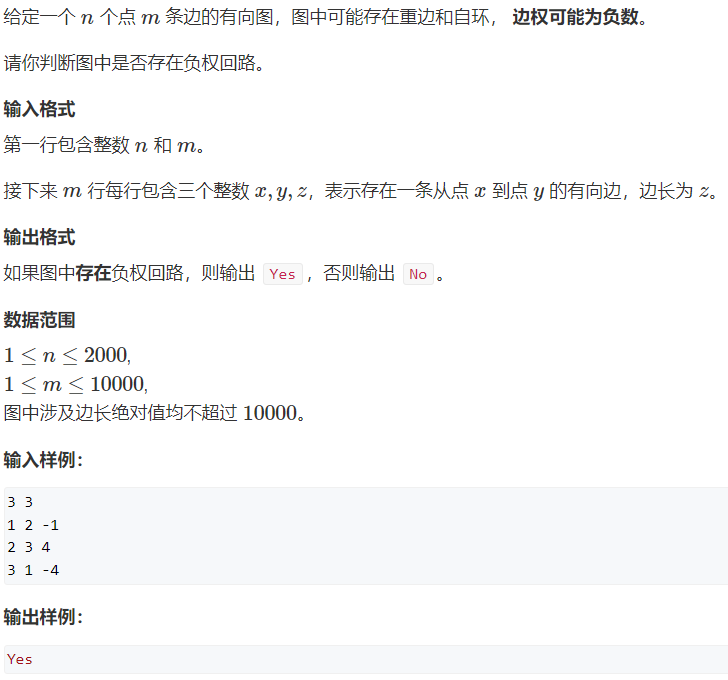

求负环的常用方法，基于SPFA，一般都用方法 2（该题也是用方法 2）：

方法 1：统计每个点入队的次数，如果某个点入队n次，则说明存在负环
方法 2：统计当前每个点的最短路中所包含的边数，如果某点的最短路所包含的边数大于等于n，则也说明存在环

算法步骤：

1、dist[x] 记录虚拟源点到x的最短距离

2、cnt[x] 记录当前x点到虚拟源点最短路的边数，初始每个点到虚拟源点的距离为0，只要他能再走n步，即cnt[x] >= n，则表示该图中一定存在负环，由于从虚拟源点到x至少经过n条边时，则说明图中至少有n + 1个点，表示一定有点是重复使用

3、若dist[j] > dist[t] + w[i],则表示从t点走到j点能够让权值变少，因此进行对该点j进行更新，并且对应cnt[j] = cnt[t] + 1,往前走一步

注意：该题是判断是否存在负环，并非判断是否存在从1开始的负环，因此需要将所有的点都加入队列中，更新周围的点

```cpp
/*给定一个 n 个点 m 条边的有向图，图中可能存在重边和自环， 边权可能为负数。
请你判断图中是否存在负权回路。
*/
#include <cstring>
#include <iostream>
#include <algorithm>
#include <queue>

using namespace std;

const int N = 2010, M = 10010;

int n, m;
int h[N], w[M], e[M], ne[M], idx;
int dist[N], cnt[N];
bool st[N];

void add(int a, int b, int c)
{
    e[idx] = b, w[idx] = c, ne[idx] = h[a], h[a] = idx ++ ;
}

bool spfa()
{
    queue<int> q;

    for (int i = 1; i <= n; i ++ )
    {
        st[i] = true;
        q.push(i);
    }

    while (q.size())
    {
        int t = q.front();
        q.pop();

        st[t] = false;

        for (int i = h[t]; i != -1; i = ne[i])
        {
            int j = e[i];
            if (dist[j] > dist[t] + w[i])
            {
                dist[j] = dist[t] + w[i];
                cnt[j] = cnt[t] + 1;

                if (cnt[j] >= n) return true;
                if (!st[j])
                {
                    q.push(j);
                    st[j] = true;
                }
            }
        }
    }

    return false;
}

int main()
{
    scanf("%d%d", &n, &m);

    memset(h, -1, sizeof h);

    while (m -- )
    {
        int a, b, c;
        scanf("%d%d%d", &a, &b, &c);
        add(a, b, c);
    }

    if (spfa()) puts("Yes");
    else puts("No");

    return 0;
}
```


### Floyd算法

邻接矩阵存储所有边。

**算法模板**

时间复杂度是 O(n^3^), n 表示点数

```cpp
初始化：
    for (int i = 1; i <= n; i ++ )
        for (int j = 1; j <= n; j ++ )
            if (i == j) d[i][j] = 0;
            else d[i][j] = INF;

// 算法结束后，d[a][b]表示a到b的最短距离
void floyd()
{
    for (int k = 1; k <= n; k ++ )
        for (int i = 1; i <= n; i ++ )
            for (int j = 1; j <= n; j ++ )
                d[i][j] = min(d[i][j], d[i][k] + d[k][j]);
}
```

#### Floyd算法求最短路

**题目**

>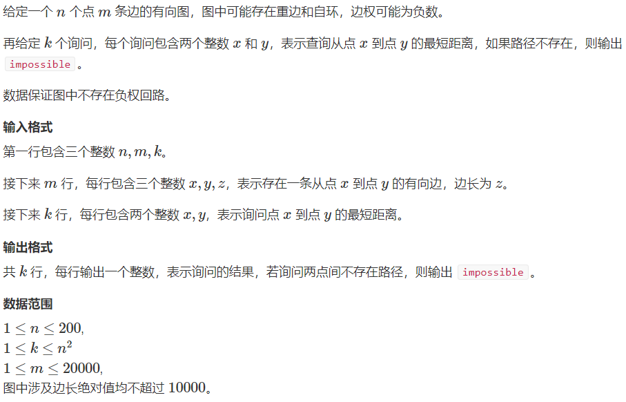
>
>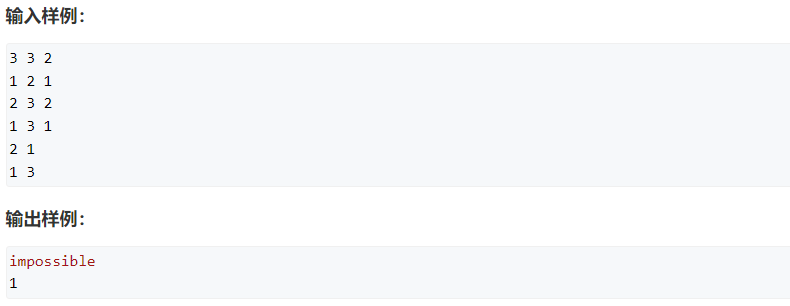

f[i, j, k]表示从i走到j的路径上除i和j点外只经过1到k的点的所有路径的最短距离。那么f[i, j, k] = min(f[i, j, k - 1), f[i, k, k - 1] + f[k, j, k - 1]。
因此在计算第k层的f[i, j]的时候必须先将第k - 1层的所有状态计算出来，所以需要把k放在最外层。

在下面代码中，判断从a到b是否是无穷大距离时，需要进行if(t > INF/2)判断，而并非是if(t == INF)判断，原因是INF是一个确定的值，并非真正的无穷大，会随着其他数值而受到影响，t大于某个与INF相同数量级的数即可

```cpp
/*给定一个 n 个点 m 条边的有向图，图中可能存在重边和自环，边权可能为负数。
再给定 k 个询问，每个询问包含两个整数 x 和 y，表示查询从点 x 到点 y 的最短距离，如果路径不存在，则输出 impossible。
数据保证图中不存在负权回路。
*/
#include <iostream>
using namespace std;

const int N = 210, M = 2e+10, INF = 1e9;

int n, m, k, x, y, z;
int d[N][N];  //邻接矩阵

void floyd() 
{
    for(int k = 1; k <= n; k++)
        for(int i = 1; i <= n; i++)
            for(int j = 1; j <= n; j++)
                d[i][j] = min(d[i][j], d[i][k] + d[k][j]);
}

int main() 
{
    cin >> n >> m >> k;
    for(int i = 1; i <= n; i++)
        for(int j = 1; j <= n; j++)
            if(i == j) d[i][j] = 0;
            else d[i][j] = INF;  //其他边初始化为正无穷
    while(m--) 
    {
        cin >> x >> y >> z;
        d[x][y] = min(d[x][y], z);
        //注意保存最小的边
    }
    floyd();
    while(k--) 
    {
        cin >> x >> y;
        if(d[x][y] > INF/2) puts("impossible");
        //由于有负权边存在所以约大过INF/2也很合理
        else cout << d[x][y] << endl;
    }
    return 0;
}
```


## 最小生成树

稠密图用朴素版Prim算法（代码短思路短），稀疏图用克鲁斯卡尔算法，堆优化版Prim算法也用于稀疏图但不如克鲁斯卡尔算法好用。

[超清楚的b站讲解视频](https://www.bilibili.com/video/BV1Eb41177d1/)

> 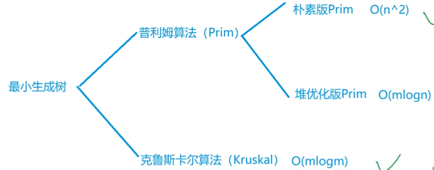


### 朴素版Prim算法

稠密图用朴素版Prim算法（代码短思路短）,用邻接矩阵存储。

算法步骤：

0. 集合s表示当前已经在连通块里面的点

1. 把所有距离初始化为正无穷 dist[i] <- 正无穷
2. 进行n次迭代  for (int i = 0; i < n; i++)
3. 找到集合外距离最近的点 赋给 t
4. 用 t 更新其他点到**集合**的距离
5. 把 t 加到集合中  st[t] = true

> 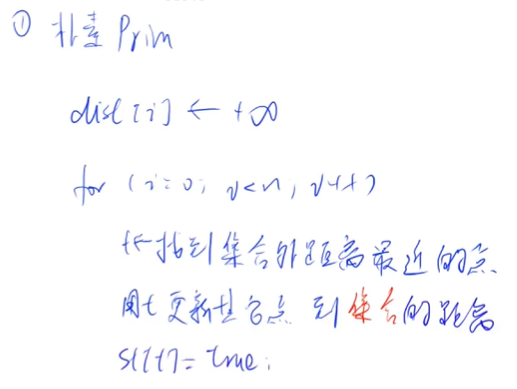

**算法模板**

时间复杂度是 O(n^2^+m), n 表示点数，m 表示边数

```cpp
int n;      // n表示点数
int g[N][N];        // 邻接矩阵，存储所有边
int dist[N];        // 存储其他点到当前最小生成树的距离
bool st[N];     // 存储每个点是否已经在生成树中


// 如果图不连通，则返回INF(值是0x3f3f3f3f), 否则返回最小生成树的树边权重之和
int prim()
{
    memset(dist, 0x3f, sizeof dist);

    int res = 0;
    for (int i = 0; i < n; i ++ )
    {
        int t = -1;
        for (int j = 1; j <= n; j ++ )
            if (!st[j] && (t == -1 || dist[t] > dist[j]))
                t = j;

        if (i && dist[t] == INF) return INF;

        if (i) res += dist[t];
        st[t] = true;

        for (int j = 1; j <= n; j ++ ) dist[j] = min(dist[j], g[t][j]);
    }

    return res;
}
```

#### Prim算法求最小生成树

**题目**

>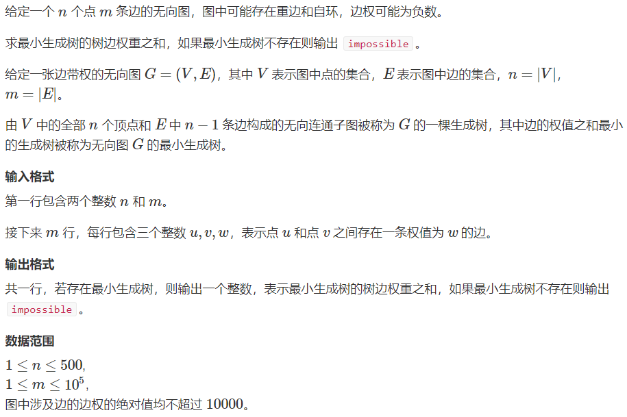
>
>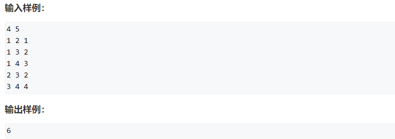

详细题解

> 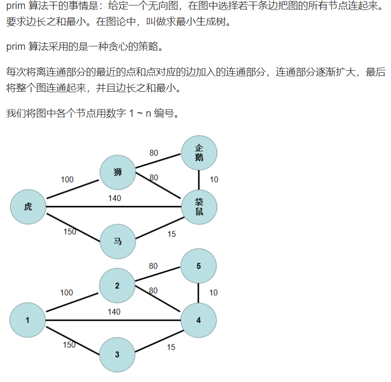
>
> 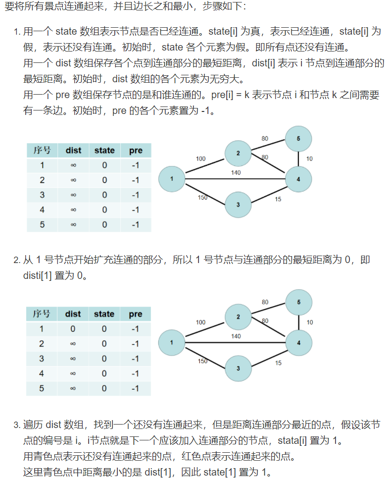
>
> 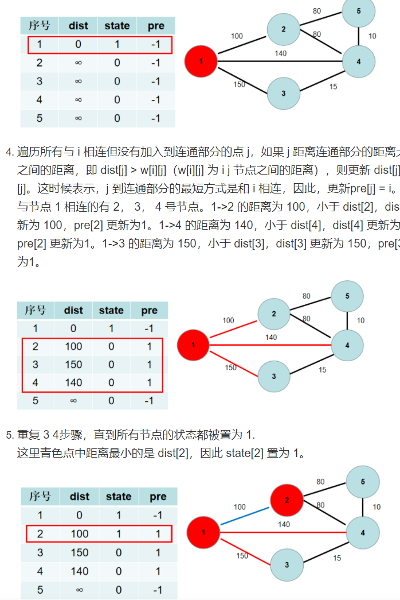
>
> 
>
> 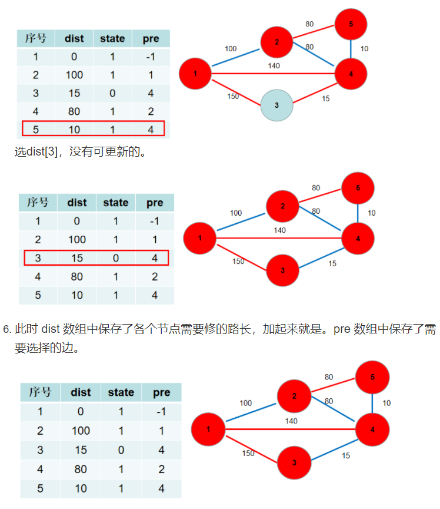

伪代码

```cpp
int dist[n],state[n],pre[n];
dist[1] = 0;
for(i : 1 ~ n)
{
    t <- 没有连通起来，但是距离连通部分最近的点;
    state[t] = 1;
    更新 dist 和 pre;
}
```

优化

上面代码的时间复杂度为 O(n^2)。

与Dijkstra类似，Prim算法也可以用堆优化，优先队列代替堆，优化的Prim算法时间复杂度O(mlogn)。适用于稀疏图，但是稀疏图的时候求最小生成树，Kruskal 算法更加实用。

Dijkstra 算法的优化见：

迪杰斯特拉算法–助我去网吧：https://mp.weixin.qq.com/s/dvxtcGBuVCQ8xH6cy3p0ng

[超清楚的b站讲解视频](https://www.bilibili.com/video/BV1Eb41177d1/)

```cpp
/*给定一个 n 个点 m 条边的无向图，图中可能存在重边和自环，边权可能为负数。
求最小生成树的树边权重之和，如果最小生成树不存在则输出 impossible。
给定一张边带权的无向图 G=(V,E)，其中 V 表示图中点的集合，E 表示图中边的集合，n=|V|，m=|E|。
由 V 中的全部 n 个顶点和 E 中 n−1 条边构成的无向连通子图被称为 G 的一棵生成树，其中边的权值之和最小的生成树被称为无向图 G 的最小生成树。
*/
#include <cstring>
#include <iostream>
#include <algorithm>

using namespace std;

const int N = 510, INF = 0x3f3f3f3f;

int n, m;
int g[N][N];//存储图
int dist[N];//存储各个节点到生成树的距离
bool st[N];//节点是否被加入到生成树中


int prim()
{
    memset(dist, 0x3f, sizeof dist);//初始化距离数组为一个很大的数（10亿左右）

    int res = 0;//存储最小生产树中所有边的长度之和
    for (int i = 0; i < n; i ++ )//每次循环选出一个点加入到生成树
    {
        int t = -1;
        for (int j = 1; j <= n; j ++ )//每个节点一次判断
            if (!st[j] && (t == -1 || dist[t] > dist[j]))//如果没有在树中，且到树的距离最短，则选择该点
                t = j;

        if (i && dist[t] == INF) return INF;//如果不是第一个点且当前距离最小的点是正无穷，说明图不连通，不存在最小生成树

        if (i) res += dist[t];//把边的距离加入到答案中
        st[t] = true;//把点加入到集合中

        for (int j = 1; j <= n; j ++ ) dist[j] = min(dist[j], g[t][j]);////更新生成树外的点到生成树的距离
    }

    return res;
}


int main()
{
    scanf("%d%d", &n, &m);//输入节点数和边数

    memset(g, 0x3f, sizeof g);//各个点之间的距离初始化成很大的数

    while (m -- )
    {
        int a, b, c;
        scanf("%d%d%d", &a, &b, &c);//输入边的两个顶点和权重
        g[a][b] = g[b][a] = min(g[a][b], c);//存储权重
    }

    int t = prim();

    if (t == INF) puts("impossible");
    else printf("%d\n", t);

    return 0;
}
```


### Kruskal算法

稀疏图用克鲁斯卡尔算法。不需要用邻接表或邻接矩阵来存图，只需要用结构体来存每条边即可。

算法步骤：

1. 现将所有边按权重从小到大排序（快排，调用系统sort()函数）
2. 枚举每条边 a - b 权重 c
3. 如果a - b不连通，则将这条边加到集合中

> 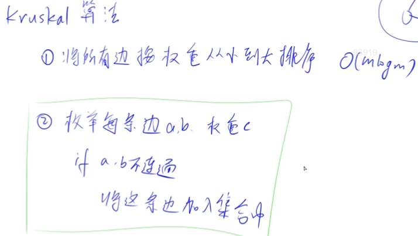

**算法模板**

时间复杂度是 O(mlogm), n 表示点数，m 表示边数

```cpp
int n, m;       // n是点数，m是边数
int p[N];       // 并查集的父节点数组

struct Edge     // 存储边
{
    int a, b, w;

    bool operator< (const Edge &W)const
    {
        return w < W.w;
    }
}edges[M];

int find(int x)     // 并查集核心操作
{
    if (p[x] != x) p[x] = find(p[x]);
    return p[x];
}

int kruskal()
{
    sort(edges, edges + m);

    for (int i = 1; i <= n; i ++ ) p[i] = i;    // 初始化并查集

    int res = 0, cnt = 0;
    for (int i = 0; i < m; i ++ )
    {
        int a = edges[i].a, b = edges[i].b, w = edges[i].w;

        a = find(a), b = find(b);
        if (a != b)     // 如果两个连通块不连通，则将这两个连通块合并
        {
            p[a] = b;
            res += w;
            cnt ++ ;
        }
    }

    if (cnt < n - 1) return INF;
    return res;
}
```

#### Kruskal算法求最小生成树

**题目**

>
>
>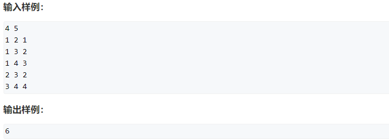

> 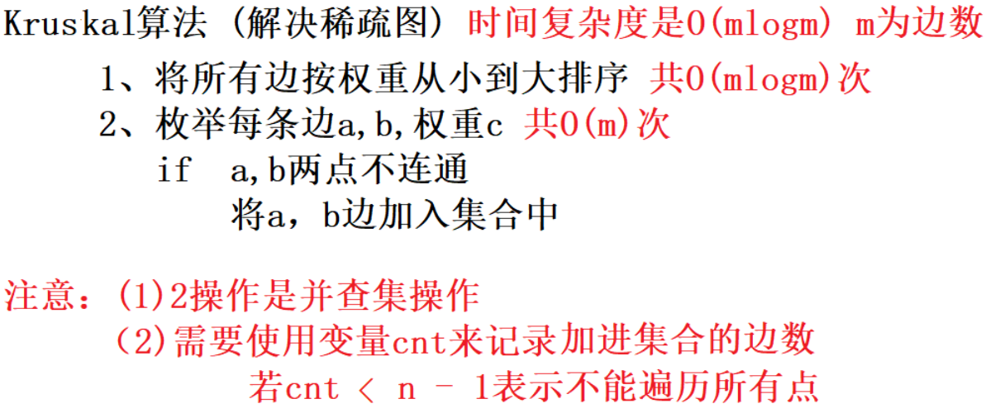
>
> 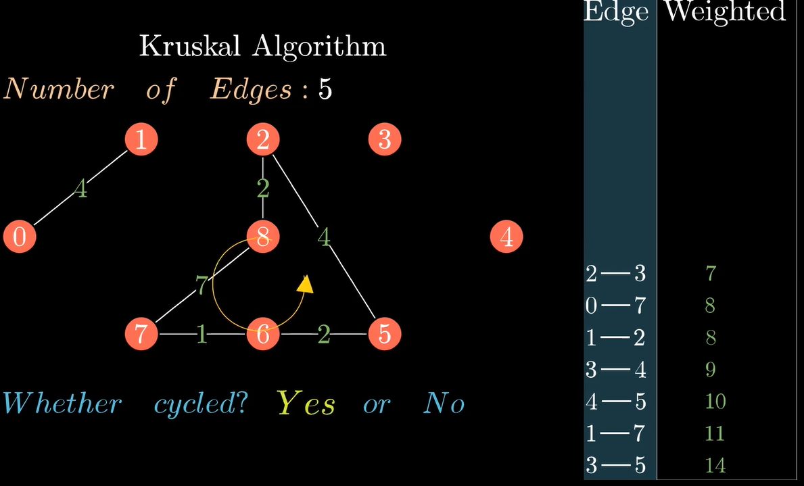

[超清楚的b站讲解视频](https://www.bilibili.com/video/BV1Eb41177d1/)

```cpp
/*给定一个 n 个点 m 条边的无向图，图中可能存在重边和自环，边权可能为负数。
求最小生成树的树边权重之和，如果最小生成树不存在则输出 impossible。
给定一张边带权的无向图 G=(V,E)，其中 V 表示图中点的集合，E 表示图中边的集合，n=|V|，m=|E|。
由 V 中的全部 n 个顶点和 E 中 n−1 条边构成的无向连通子图被称为 G 的一棵生成树，其中边的权值之和最小的生成树被称为无向图 G 的最小生成树。
*/
#include <cstring>
#include <iostream>
#include <algorithm>

using namespace std;

const int N = 100010, M = 200010, INF = 0x3f3f3f3f;

int n, m;
int p[N];//并查集里的数组

struct Edge
{
    int a, b, w;

    bool operator< (const Edge &W)const  //重载，对w排序
    {
        return w < W.w;
    }
}edges[M];

int find(int x)//并查集模板
{
    if (p[x] != x) p[x] = find(p[x]);
    return p[x];
}

int kruskal()
{
    sort(edges, edges + m);  //将边的权重按照大小一一排序

    for (int i = 1; i <= n; i ++ ) p[i] = i;    // 初始化并查集

    int res = 0, cnt = 0;
    for (int i = 0; i < m; i ++ )//从小到大枚举所有边
    {
        int a = edges[i].a, b = edges[i].b, w = edges[i].w;
/* 具体可以参考连通块中点的数量,如果a和b已经在一个集合当中了,说明这两个点已经被一种方式连接起来了,
  如果加入a-b这条边,会导致集合中有环的生成,而树中不允许有环生成,所以一个连通块中的点的数量假设
 为x,那么里面x个节点应该是被串联起来的,有x-1条边,所以只有当a,b所属的集合不同时,才能将a-b这条
  边加入到总集合当中去
        */
        a = find(a), b = find(b);
        if (a != b)
        {
            p[a] = b;  //将a,b所在的两个集合连接起来
            res += w;  //res存的是最小生成树中所有树边的权重之和
            cnt ++ ;   //cnt记录的是全部加入到树的集合中边的数量(可能有多个集合)
        }
    }

    if (cnt < n - 1) return INF;//树中有n个节点便有n-1条边,如果cnt不等于n-1的话,说明无法生成有n个节点的树
    return res;//可以生成最小生成树
}

int main()
{
    scanf("%d%d", &n, &m);

    for (int i = 0; i < m; i ++ )
    {
        int a, b, w;
        scanf("%d%d%d", &a, &b, &w);
        edges[i] = {a, b, w};
    }

    int t = kruskal();

    if (t == INF) puts("impossible");
    else printf("%d\n", t);

    return 0;
}
```


## 二分图

一个图是二分图当且仅当图中不含奇数环。

二分图：当且仅当图中不含有奇数环，两个集合内部的内部没有边

以下全是二分图

> 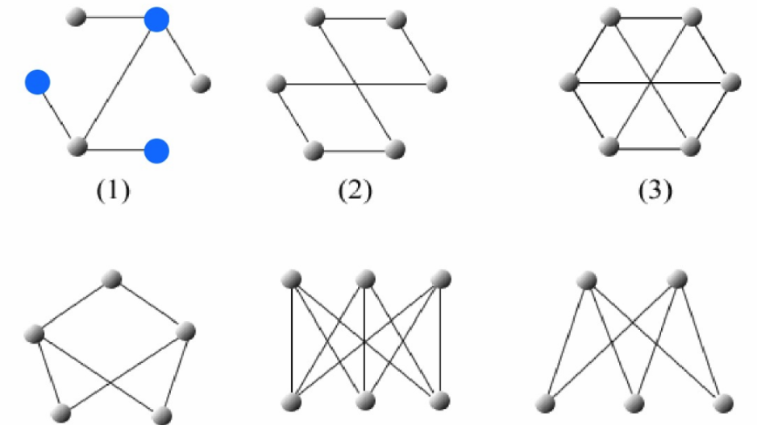

判断二分图的方法

> 

#### 染色法判定二分图 - 算法模板

由于图中不含有奇数环，所以染色过程中一定没有矛盾，所以可以用染色法来判断二分图。

**算法模板**

时间复杂度是 O(n+m), n 表示点数，m 表示边数

```cpp
int n;      // n表示点数
int h[N], e[M], ne[M], idx;     // 邻接表存储图
int color[N];       // 表示每个点的颜色，-1表示未染色，0表示白色，1表示黑色

// 参数：u表示当前节点，c表示当前点的颜色
bool dfs(int u, int c)
{
    color[u] = c;
    for (int i = h[u]; i != -1; i = ne[i])
    {
        int j = e[i];
        if (color[j] == -1)
        {
            if (!dfs(j, !c)) return false;
        }
        else if (color[j] == c) return false;
    }

    return true;
}

bool check()
{
    memset(color, -1, sizeof color);
    bool flag = true;
    for (int i = 1; i <= n; i ++ )
        if (color[i] == -1)
            if (!dfs(i, 0))
            {
                flag = false;
                break;
            }
    return flag;
}
```

#### 染色法判定二分图

**题目**

>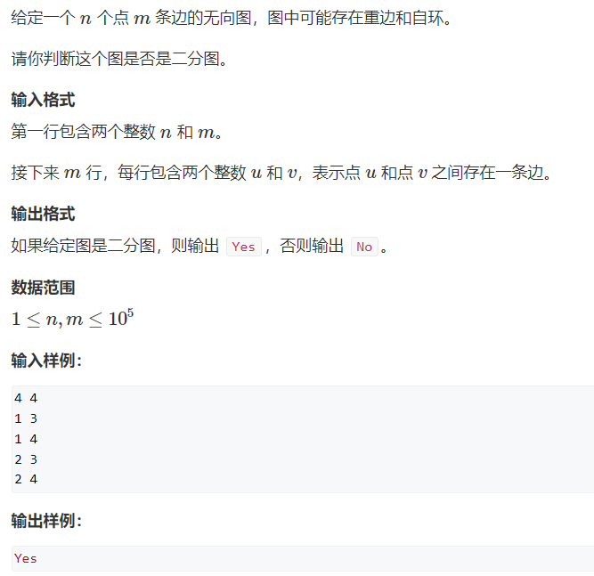

##### DFS版本(邻接表存储图)

> 

```cpp
/*给定一个 n 个点 m 条边的无向图，图中可能存在重边和自环。
请你判断这个图是否是二分图。
*/
#include <iostream>
#include <algorithm>
#include <cstring>

using namespace std;
const int N = 1e5 + 10, M = 2e5 + 10; // 无向图, 所以最大边数是2倍
int e[M], ne[M], h[N], idx;
int st[N];

void add(int a, int b)
{
    e[idx] = b, ne[idx] = h[a], h[a] = idx ++;
}

bool dfs(int u, int color) 
{
    st[u] = color;

    for(int i = h[u]; i != -1; i = ne[i])
    {
        int j = e[i];
        if(!st[j]) 
        {
            if(!dfs(j, 3 - color)) return false;  //1  &  2
        }
        else if(st[j] == color) return false;
    }

    return true;
}

int main(){
    int n, m;
    scanf("%d%d", &n, &m);

    memset(h, -1, sizeof h);
    while (m --)
    {
        int a, b;
        scanf("%d%d", &a, &b);
        add(a, b), add(b,a);  // 无向图
    }

    bool flag = true;
    for(int i = 1; i <= n; i ++)
    {
        if(!st[i])
        {
            if(!dfs(i, 1))
            {
                flag = false;
                break;
            }
        }
    }

    if(flag) puts("Yes");
    else puts("No");
    return 0;
}
```

##### BFS版本（邻接表存储图）

> 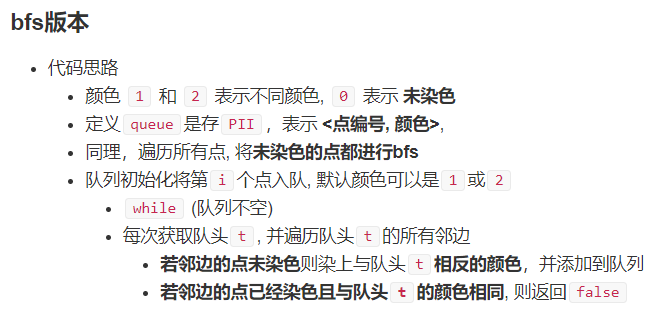

```cpp
/*给定一个 n 个点 m 条边的无向图，图中可能存在重边和自环。
请你判断这个图是否是二分图。
*/
#include <iostream>
#include <algorithm>
#include <cstring>

using namespace std;
const int N = 1e5 + 10, M = 2e5 + 10;
typedef pair<int, int> PII;

int e[M], ne[M], h[N], idx;
int n, m;
int st[N];

void add(int a, int b)
{
    e[idx] = b, ne[idx] = h[a], h[a] = idx ++;
}

bool bfs(int u)
{
    int hh = 0, tt = 0;
    PII q[N];
    q[0] = {u, 1};
    st[u] = 1;

    while(hh <= tt)
    {
        auto t = q[hh ++];
        int ver = t.first, c = t.second;

        for (int i = h[ver]; i != -1; i = ne[i])
        {
            int j = e[i];

            if(!st[j])
            {
                st[j] = 3 - c;
                q[++ tt] = {j, 3 - c};
            }
            else if(st[j] == c) return false;
        }
    }

    return true;
}

int main(){
    scanf("%d%d", &n, &m);

    memset(h, -1, sizeof h);
    while(m --)
    {
        int a, b;
        scanf("%d%d", &a, &b);
        add(a, b), add(b, a); // 无向图
    }

    int flag = true;
    for(int i = 1; i <= n; i ++) 
    {
        if (!st[i]){
            if(!bfs(i)){
                flag = false;
                break;
            }
        }
    }

    if (flag) puts("Yes");
    else puts("No");
    return 0;
}
```


## 匈牙利算法

要了解匈牙利算法必须先理解下面的概念：

> 匹配：在图论中，一个「匹配」是一个边的集合，其中任意两条边都没有公共顶点。
>
> 最大匹配：一个图所有匹配中，所含匹配边数最多的匹配，称为这个图的最大匹配。

下面是一些补充概念：

> 完美匹配：如果一个图的某个匹配中，所有的顶点都是匹配点，那么它就是一个完美匹配。
>
> 交替路：从一个未匹配点出发，依次经过非匹配边、匹配边、非匹配边…形成的路径叫交替路。
>
> 增广路：从一个未匹配点出发，走交替路，如果途径另一个未匹配点（出发的点不算），则这条交替 路称为增广路（agumenting path）。

**算法模板**

时间复杂度是 O(nm),  n 表示点数，m 表示边数，实际运行时间远小于O(nm)

```cpp
int n1, n2;     // n1表示第一个集合中的点数，n2表示第二个集合中的点数
int h[N], e[M], ne[M], idx;     // 邻接表存储所有边，匈牙利算法中只会用到从第一个集合指向第二个集合的边，所以这里只用存一个方向的边
int match[N];       // 存储第二个集合中的每个点当前匹配的第一个集合中的点是哪个
bool st[N];     // 表示第二个集合中的每个点是否已经被遍历过
//这个函数的作用是用来判断,如果加入x来参与模拟配对,会不会使匹配数增多
bool find(int x)
{   //遍历自己喜欢的女孩
    for (int i = h[x]; i != -1; i = ne[i])
    {
        int j = e[i];
        if (!st[j])//如果在这一轮模拟匹配中,这个女孩尚未被预定
        {
            st[j] = true;//那x就预定这个女孩了
            //如果女孩j没有男朋友，或者她原来的男朋友能够预定其它喜欢的女孩。配对成功,更新match
            if (match[j] == 0 || find(match[j]))
            {
                match[j] = x;
                return true;
            }
        }
    }
	//自己中意的全部都被预定了。配对失败。
    return false;
}

// 求最大匹配数，依次枚举第一个集合中的每个点能否匹配第二个集合中的点
int res = 0;
for (int i = 1; i <= n1; i ++ )
{
    //因为每次模拟匹配的预定情况都是不一样的所以每轮模拟都要初始化
    memset(st, false, sizeof st);
    if (find(i)) res ++ ;
}
```

#### 二分图的最大匹配

**题目**

>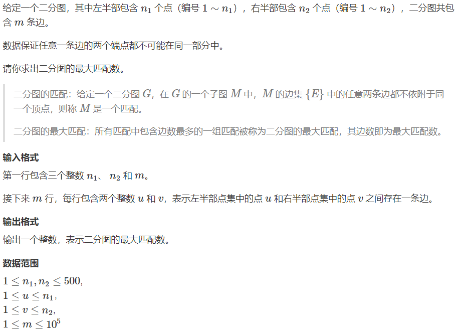
>
>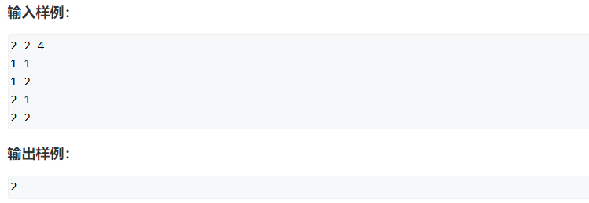

```cpp
/*给定一个二分图，其中左半部包含 n1 个点（编号 1∼n1），右半部包含 n2 个点（编号 1∼n2），二分图共包含 m 条边。
数据保证任意一条边的两个端点都不可能在同一部分中。请你求出二分图的最大匹配数。
二分图的匹配：给定一个二分图 G，在 G 的一个子图 M 中，M 的边集 {E} 中的任意两条边都不依附于同一个顶点，则称 M 是一个匹配。
二分图的最大匹配：所有匹配中包含边数最多的一组匹配被称为二分图的最大匹配，其边数即为最大匹配数。
*/
#include<iostream>
#include<cstring>
using namespace std;

const int N = 510 , M = 100010;

int n1,n2,m;
int h[N],ne[M],e[M],idx;
bool st[N];
int match[N];

void add(int a , int b)
{
    e[idx] = b, ne[idx] = h[a], h[a] = idx++;
}

bool find(int x)
{
    //遍历自己喜欢的女孩
    for(int i = h[x] ; i != -1 ;i = ne[i])
    {
        int j = e[i];
        if(!st[j])//如果在这一轮模拟匹配中,这个女孩尚未被预定
        {
            st[j] = true;//那x就预定这个女孩了
            //如果女孩j没有男朋友，或者她原来的男朋友能够预定其它喜欢的女孩。配对成功
            if(!match[j] || find(match[j]))
            {
                match[j] = x;
                return true;
            }
        }
    }
    //自己中意的全部都被预定了。配对失败。
    return false;
}

int main()
{
    
   cin >> n1 >> n2 >> m;
    
    memset(h,-1,sizeof h);
    
    while(m--)
    {
        int a,b;
        cin >> a >> b;
        add(a,b);
    }
    
    int res = 0;
    for(int i = 1; i <= n1 ;i ++)
    {  
          //因为每次模拟匹配的预定情况都是不一样的所以每轮模拟都要初始化
          memset(st,false,sizeof st);
          if (find(i)) res++;
    }  
    cout << res << endl;
    return 0;
}
```


