## 数学知识学习 - AcWing - HQ

[TOC]

----

### 注意内容

- 

----

### 目录

> 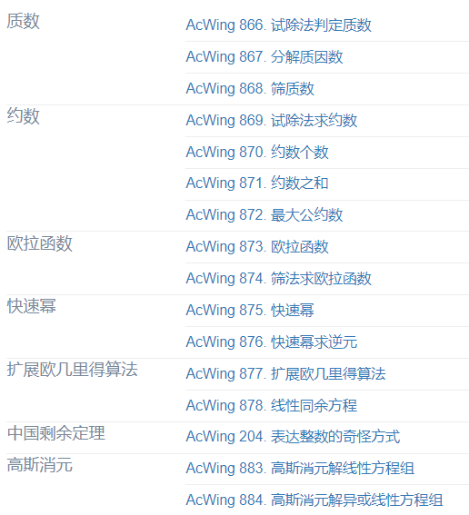
>
> 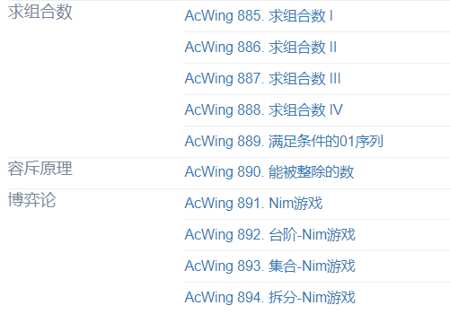


### 质数

质数：

在大于1的整数中，如果只包含1和本身这两个约数，就被成为质数或者叫素数。

合数：

合数是指在大于1的整数中除了能被1和本身整除外，还能被其他数（0除外）整除的数。与之相对的是质数，而1既不属于质数也不属于合数。最小的合数是4。

除法知识：

>被整除   除以    整除。
>
>例如，3能整除6，6能被3整除    6 / 3
>
>数学中定义： y / x
>
>x “除” y 中，x 是除数， y 是被除数      
>
>y “除以 ”x 中，y 是被除数，x 是除数  

#### 质数模板

##### 试除法判定质数

```cpp
bool is_prime(int x)
{
    if (x < 2) return false;
    for (int i = 2; i <= x / i; i ++ )
        if (x % i == 0)
            return false;
    return true;
}
```

##### 试除法分解质因数

```cpp
void divide(int x)
{
    for (int i = 2; i <= x / i; i ++ )
        if (x % i == 0)
        {
            int s = 0;
            while (x % i == 0) x /= i, s ++ ;
            cout << i << ' ' << s << endl;
        }
    if (x > 1) cout << x << ' ' << 1 << endl;
    cout << endl;
}
```

##### 朴素筛法求素数

```cpp
int primes[N], cnt;     // primes[]存储所有素数
bool st[N];         // st[x]存储x是否被筛掉

void get_primes(int n)
{
    for (int i = 2; i <= n; i ++ )
    {
        if (st[i]) continue;
        primes[cnt ++ ] = i;
        for (int j = i + i; j <= n; j += i)
            st[j] = true;
    }
}
```

##### 线性筛法求素数

```cpp
int primes[N], cnt;     // primes[]存储所有素数
bool st[N];         // st[x]存储x是否被筛掉

void get_primes(int n)
{
    for (int i = 2; i <= n; i ++ )
    {
        if (!st[i]) primes[cnt ++ ] = i;
        for (int j = 0; primes[j] <= n / i; j ++ )
        {
            st[primes[j] * i] = true;
            if (i % primes[j] == 0) break;
        }
    }
}
```


#### 质数的判定 —— 试除法

**题目**

> 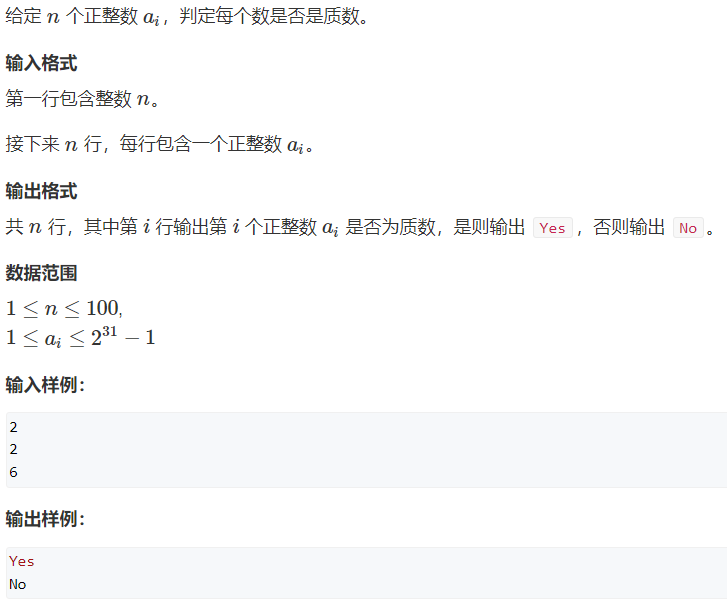

时间复杂度  O(sqrt(n))，一定是根号n

> 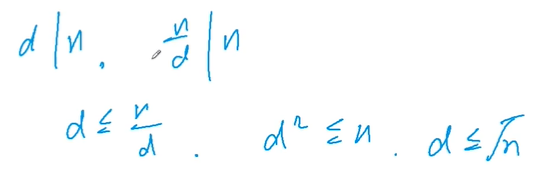

```cpp
#include <iostream>
#include <algorithm>
using namespace std;

bool is_prime_1(int n)   //O(n)
{
    if (n < 2) return false;
    for (int i = 2; i < n; i++)
        if (n % i == 0)
            return false;
    return true
}

//优化：枚举时只枚举每一对约数（例如6的约数2和3）中较小的一个
bool is_prime_2(int n)   //O(sqrt(n))
{
    if (n < 2) return false;
    for (int i = 2; i <= n / i; i++)
        if (n % i == 0)
            return false;
    return true
}

int main()
{
    int n;
    cin >> n;
    while (n--)
    {
        int a;
        cin >> a;
        if (is_prime_2(a)) cout << "Yes" << endl;
        else cout << "No" << endl;
    }
    return 0;
}
```


#### 分解质因数 —— 试除法

**题目**

>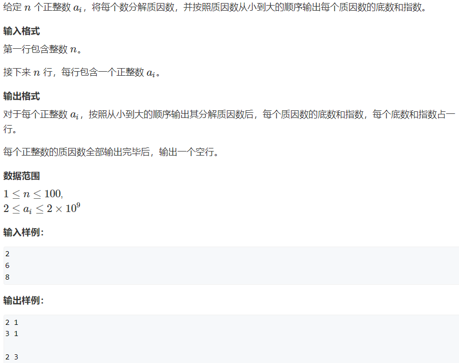

时间复杂度  O(sqrt(n))，最好logn，最坏根号n

可证：n中最多只包含一个大于sqrt(n)的质因子。

```cpp
//给定 n 个正整数 ai，将每个数分解质因数，并按照质因数从小到大的顺序输出每个质因数的底数和指数。
#include <iostream>
#include <algorithm>
using namespace std;

void divide_1(int x)  //O(n)
{
    for (int i = 2; i <= n; i++)
   		if (n % i == 0)  // i 一定是质数
        {
            int s = 0;
            while (n % i == 0)
            {
                n /= i;
                s++;
            }
            printf("%d %d\n", i, s);
        }
}

//优化：先枚举sqrt(n)之前的数，然后再判断大于sqrt(n)的一个质因子。
void divide_2(int n)    //O(sqrt(n))
{
    for (int i = 2; i <= n / i; i++)
   		if (n % i == 0)  // i 一定是质数
        {
            int s = 0;     //每层循环都被重新定义
            while (n % i == 0)
            {
                n /= i;
                s++;
            }
            printf("%d %d\n", i, s);//从小到大的顺序输出每个质因数的底数和指数。
        }
    //如果最后除完所有质因数后的n大于1，则剩下这个数就是那个大于根号n的质因子
    if (n > 1) printf("%d %d\n", n, 1); 
    puts("");
}
int main()
{
    int n;
    cin >>n;
    while (n--)
    {
        int a;
        cin >> a;
        divide_2(a);
    }
    return 0;
}
```


#### 筛质数

**题目**

>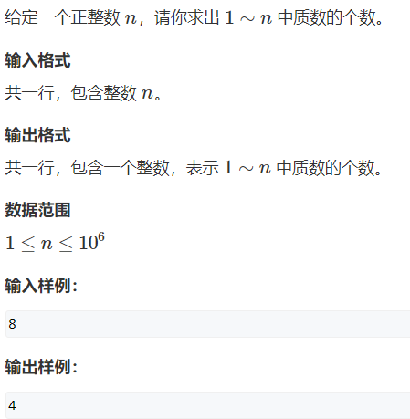

##### 朴素筛法

把每个数的倍数删掉，剩下的就是质数。

##### 埃氏筛法

对朴素筛法进行优化，每次只将质数的倍数删掉，不是质数的数则不用把他所有的倍数删掉。

定理：1~N中有N/lnN个质数

> 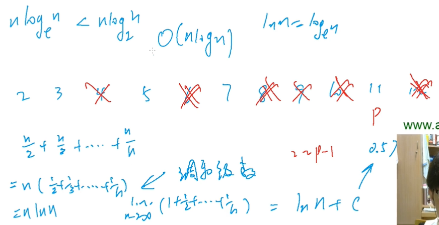

```cpp
//给定一个正整数 n，请你求出 1∼n 中质数的个数。
#include <iostream>
#include <algorithm>
using namespace std;

const int N = 1000010;

int primes[N], cnt;
bool st[N];

void get_primes_1(int n)   //时间复杂度小于O(nlogn)
{
    for (int i = 2; i <= n; i++)
    {
        if (!st[i])
        {
        	primes[cnt++] = n;
        }
        for (int j = i + i; j <= n; j += i) st[j] = true;
    }
}

void get_primes_2(int n)   //称为埃氏筛法，时间复杂度为O(nloglogn),近似为O(n)  
{
    for (int i = 2; i <= n; i++)
    {
        if (!st[i])
        {
        	primes[cnt++] = n;
            for (int j = i + i; j <= n; j += i) st[j] = true;
        }       
    }
}

int main()
{
    int n;
    cin >> n;
    get_primes(n);
    cout << cnt << endl;
    return 0;
}
```

##### 线性筛法

**题目**

>

每个数i只会被他的最小质因子筛掉，且对于每一个合数x都会被筛掉。

每个数都会被他的最小质因子筛掉，每个数都只有一个最小质因子，每个数只会被筛一次，所以是线性的。

当n=10^7^时比埃氏筛法快一倍，当n=10^6^时，和埃氏筛法速度差不多。

实际中常用线性筛法。

> 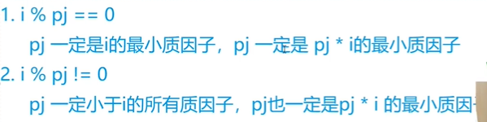

```cpp
//给定一个正整数 n，请你求出 1∼n 中质数的个数。
#include <iostream>
#include <algorithm>
using namespace std;

const int N = 1000010;

int primes[N], cnt;
bool st[N];

void get_primes(int n)   
{
    for (int i = 2; i <= n; i++)
    {
        if (!st[i]) primes[cnt++] = i;
        for (int j = 0; primes[j] <= n / i; j++) //从小到大枚举所有的质数
        {
            st[primes[j] * i] = true;  //每次把当前的质数和i的乘积筛掉
            if (i % primes[j] == 0) break; //意味着primes[j]一定是i的最小质因子
        }
    }
}

int main()
{
    int n;
    cin >> n;
    get_primes(n);
    cout << cnt << endl;
    return 0;
}
```


### 约数

知识点：int范围内，约数个数最多的数 大约有1500个左右的约数。

#### 约数模板

##### 试除法求所有约数

```cpp
vector<int> get_divisors(int x)
{
    vector<int> res;
    for (int i = 1; i <= x / i; i ++ )
        if (x % i == 0)
        {
            res.push_back(i);
            if (i != x / i) res.push_back(x / i);
        }
    sort(res.begin(), res.end());
    return res;
}
```

##### 约数个数 & 约数之和

```cpp
如果 N = p1^c1 * p2^c2 * ... *pk^ck
约数个数： (c1 + 1) * (c2 + 1) * ... * (ck + 1)
约数之和： (p1^0 + p1^1 + ... + p1^c1) * ... * (pk^0 + pk^1 + ... + pk^ck)
```

##### 欧几里得算法

```cpp
int gcd(int a, int b)
{
    return b ? gcd(b, a % b) : a;
}
```


#### 求约数 —— 试除法

**题目**

>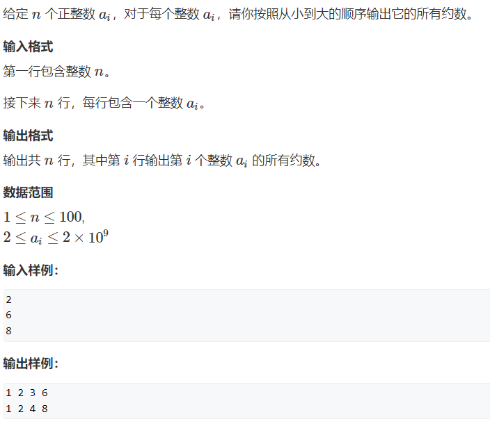

时间复杂度O(sqrt(n))

一个数的约数是成对出现的，在枚举时只需要枚举较小的一个即可。

```cpp
//给定 n 个正整数 ai，对于每个整数 ai，请你按照从小到大的顺序输出它的所有约数。
#include <iostream>
#include <vector>
#include <algorithm>
using namespace std;

vector<int> get_divisors(int n)  //时间复杂度O(sqrt(n))
{
    vector<int> res;
    
    for (int i = 1; i <= n / i; i++) //从前往后枚举
    	if (n % i == 0)
        {
        	res.push_back(i);
        	if (i != n / i) res.push_back(n / i); //边界判断，防止n重复放入两次
    	}
    sort(res.begin(), res.end()); //排序的时间复杂度小于O(sqrt(n))
    return res;
}

int main()
{
	int n;
    cin >> n;
    
    while (n--)
    {
        int x;
        cin >> x;
    	auto res = get_divisors(x);
    	for (auto t : res) cout << t << ' ';
    	cout << endl;
    }
    return 0;
}
```


#### 约数个数

**题目**

>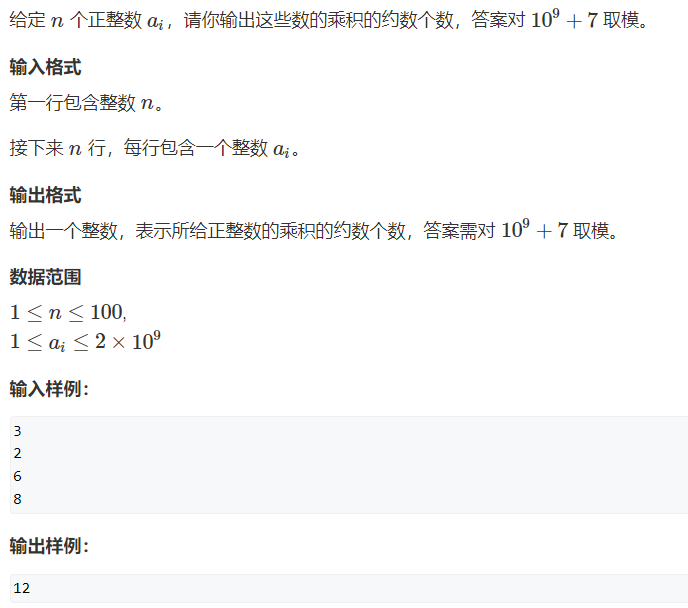

约数个数推导

> 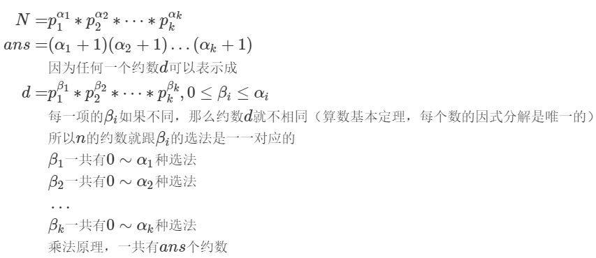
>
> 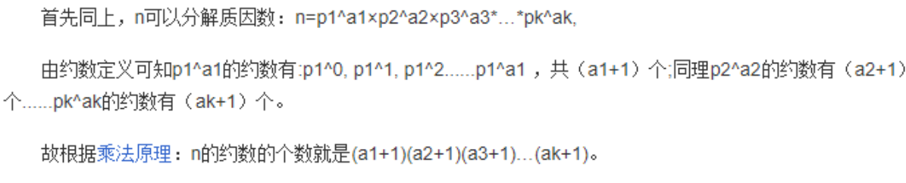

分别分解每一个的质因子，然后把所有质因子的次数累加。

```cpp
/*给定 n 个正整数 ai，请你输出这些数的乘积的约数个数，答案对 109+7 取模。*/
#include <iostream>
#include <algorithm>
#include <unordered_map>
using namespace std;

typedef long long LL;

const int mod = 1e9 + 7;

int main()
{
    int n;
    cin >> n;
    
    unordered_map<int, int> primes;  //存所有质因数的指数
    while (n--)
    {
        int x; 
        cin >> x;
        
        for (int i = 2; i <= x / i; i++)
        	while (x % i == 0)
            {
                x /= i;  //方便求得约数的数量
                primes[i]++; //i的质因数的指数+1
            }
        if (x > 1) primes[x]++;  //x的最大公约数可能大于sqrt(x);
    }
    LL res = 1;
    //将统计出来的数按照由图中公式所得出来的结论得出答案
    for (auto prime : primes) res = res * (prime.second + 1) % mod; //*和%从左到右计算
    cout << res << endl;
    return 0;
}
```


#### 约数之和

**题目**

> 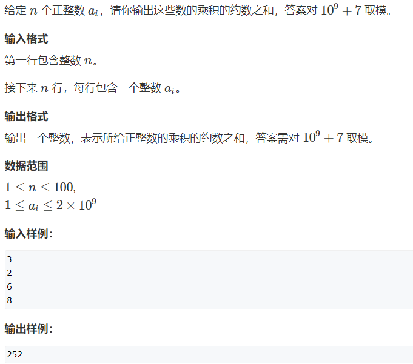

约数之和推导

> 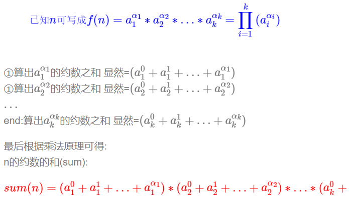

while (a--) t = (t * p + 1) % mod;

> 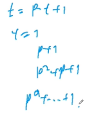

```cpp
/*给定 n 个正整数 ai，请你输出这些数的乘积的约数之和，答案对 109+7 取模。*/
#include <iostream>
#include <algorithm>
#include <unordered_map>
using namespace std;

typedef long long LL;

const int mod = 1e9 + 7;

int main()
{
    int n;
    cin >> n;
    
    unordered_map<int, int> primes;  //存所有质因数的指数
    while (n--)
    {
        int x; 
        cin >> x;
        
        for (int i = 2; i <= x / i; i++)
        	while (x % i == 0)
            {
                x /= i;  //方便求得约数的数量
                primes[i]++; //i的质因数的指数+1
            }
        if (x > 1) primes[x]++;  //x的最大公约数可能大于sqrt(x);
    }
    LL res = 1;
    //将统计出来的数按照由图中公式所得出来的结论得出答案
    for (auto prime : primes) 
    {
        int p = prime.first, a = prime.second;//p为底数，a为指数
        LL t = 1;
        while (a--) t = (t * p + 1) % mod;
        res = res * t % mod;
    }    
    cout << res << endl;
    return 0;
}
```


#### 最大公约数 —— 欧几里得算法(辗转相除法)

**题目**

>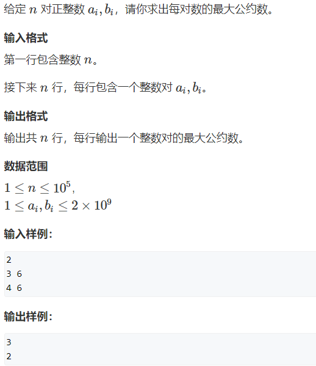

定理：d能整除a，d能整除b，则d也能整除(a+b)，或(ax + by)

a与b的最大公约数，等于b与(a mod b) 的最大公约数

> 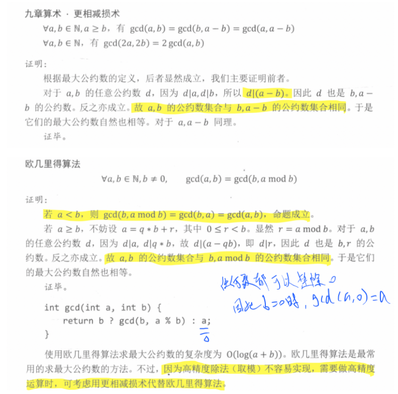

```cpp
/*给定 n 对正整数 ai,bi，请你求出每对数的最大公约数。*/
#include <iostream>
using namespace std;

int gcd(int a, int b)
{
    return b ? gcd(b, a % b) : a;
}
int main()
{
    int n;
    scanf("%d", &n);
    while (n--)
    {
        int a, b;
        scanf("%d%d", &a, &b);
        printf("%d\n", gcd(a, b));
    }
    return 0;
}
```


### 欧拉函数

欧拉函数：1~n中与n互质数的个数。1的欧拉函数等于1。

互质：是公约数只有1的两个整数，叫做互质整数。

欧拉定理：

> 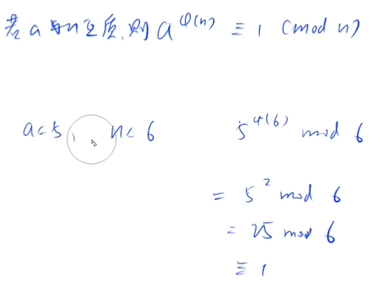

#### 欧拉函数模板

##### 定义求欧拉函数

```cpp
int phi(int x)
{
    int res = x;
    for (int i = 2; i <= x / i; i ++ )
        if (x % i == 0)
        {
            res = res / i * (i - 1);
            while (x % i == 0) x /= i;
        }
    if (x > 1) res = res / x * (x - 1);

    return res;
}
```

##### 筛法求欧拉函数

```cpp
int primes[N], cnt;     // primes[]存储所有素数
int euler[N];           // 存储每个数的欧拉函数
bool st[N];         // st[x]存储x是否被筛掉


void get_eulers(int n)
{
    euler[1] = 1;
    for (int i = 2; i <= n; i ++ )
    {
        if (!st[i])
        {
            primes[cnt ++ ] = i;
            euler[i] = i - 1;
        }
        for (int j = 0; primes[j] <= n / i; j ++ )
        {
            int t = primes[j] * i;
            st[t] = true;
            if (i % primes[j] == 0)
            {
                euler[t] = euler[i] * primes[j];
                break;
            }
            euler[t] = euler[i] * (primes[j] - 1);
        }
    }
}
```


#### 定义法求欧拉函数

**题目**

>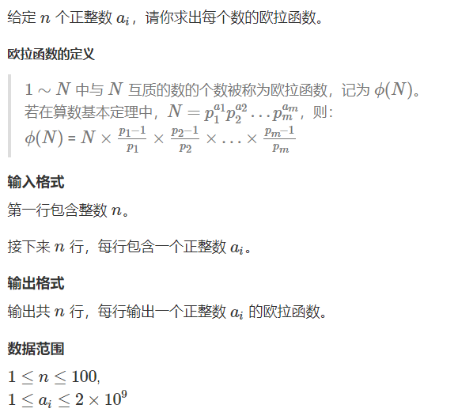
>
>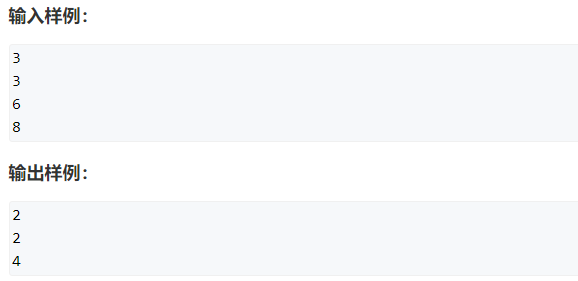

时间复杂度：O(sqrt(n))

> 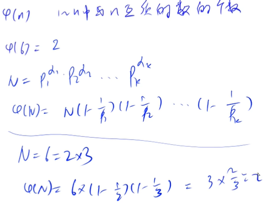

> 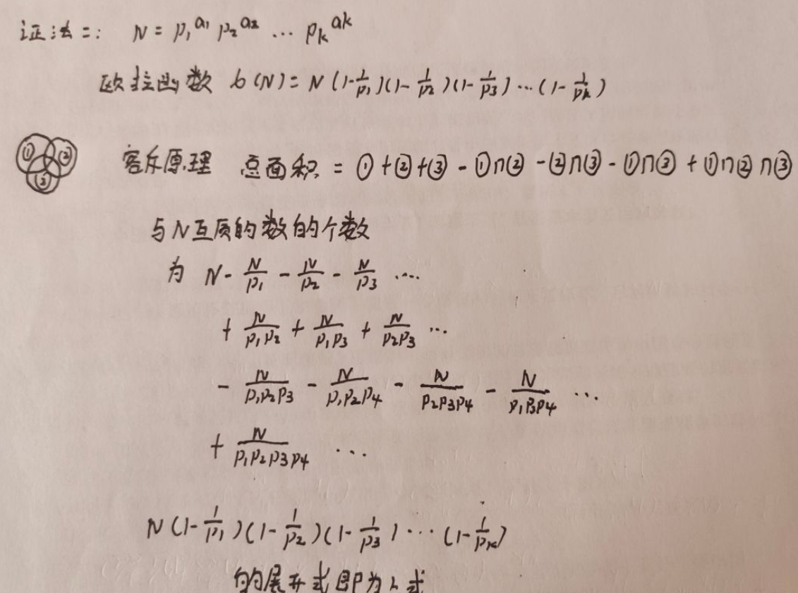

```cpp
/*给定 n 个正整数 ai，请你求出每个数的欧拉函数。*/
#include <iostream>
#include <algorithm>
using namespace std;

int main()
{
    int n;
    cin >> n;
    while (n--)
    {
        int a;
        cin >> a;
        int res = a;
        for (int i = 2; i <= a / i; i++) //分解质因数
        	if (a % i == 0)
            {   //初始式子是(1-1/p)，化简后是（p-1)/p,先除后乘因为整除运算不能有小数
                res = res / i * (i - 1);  //注意先除再乘
                while (a % i == 0) a /= i;
            }
        if (a > 1) res = res / a * (a - 1);  //说明 a 有一个大的质因子
        cout << res << endl;
    }
    return 0;
}
```


#### 筛法法求欧拉函数

**题目**

>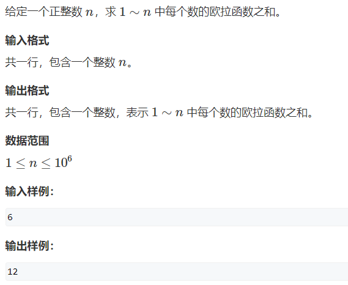

时间复杂度：O(n)

一个质数p的欧拉函数，显然1~p-1都与他互质，则其欧拉函数为p-1。

> 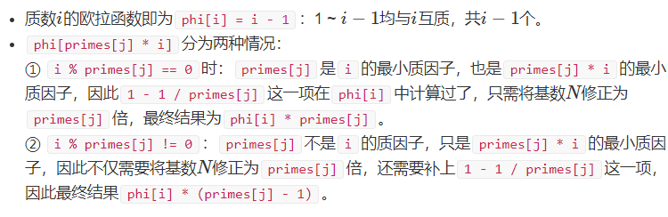

```cpp
/*给定一个正整数 n，求 1∼n 中每个数的欧拉函数之和。*/
#include <iostream>
#include <algorithm>
using namespace std;

typedef long long LL;

const int N = 1000010;

int primes[N], cnt;
int phi[N];
bool st[N];

LL get_eulers(int n)
{
    phi[1] = 1;
    for (int i = 2; i <= n; i++)
    {
        if (!st[i])
        {
            primes[cnt++] = i;
            phi[i] = i - 1;  //一个质数p的欧拉函数为p-1
        }
        for (int j = 0; primes[j] <= n / i; j++) //从小到大枚举所有的质数
        {
            st[primes[j] * i] = true;
            if (i % primes[j] == 0)
            {
            	phi[primes[j] * i] = phi[i] * primes[j];
                break;
            }
            phi[primes[j] * i] = phi[i] * (primes[j] - 1);
        }
    }
    LL res = 0;
    for (int i = 1; i <= n; i++) res += phi[i];
    return res;
}
int main()
{
    int n;
    cin >> n;
    cout << get_eulers(n) << endl;
    return 0;
}
```


### 快速幂

#### 快速幂模板

```cpp
求 m^k mod p，时间复杂度 O(logk)。

int qmi(int m, int k, int p)
{
    int res = 1 % p, t = m;
    while (k)
    {
        if (k&1) res = res * t % p;
        t = t * t % p;
        k >>= 1;
    }
    return res;
}
```


#### 求快速幂

**题目**

>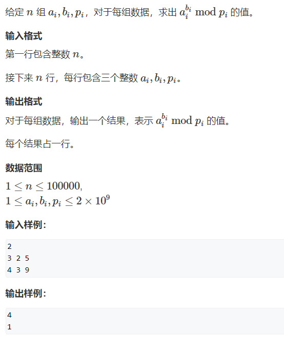

将a^k^ mod p的时间复杂度提高到O(log(k))

基本思路

> 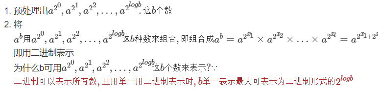

举例演示

> 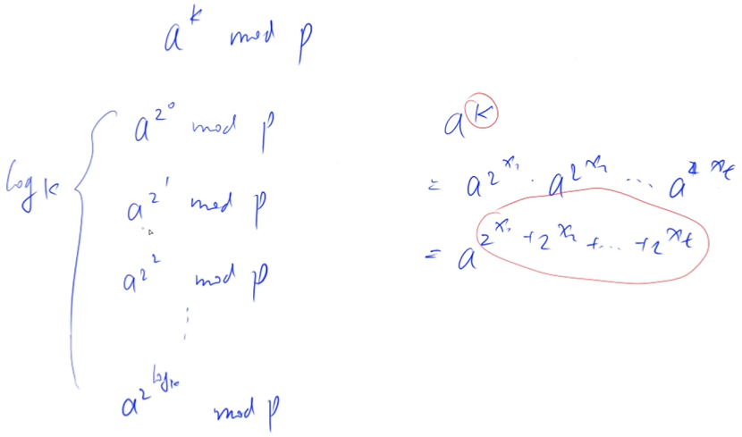
>
> 
>
> 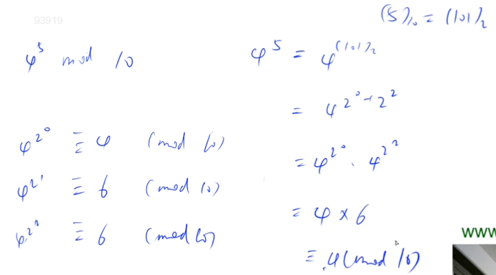

```cpp
//给定 n 组 ai,bi,pi，对于每组数据，求出 ai^bi mod pi 的值。
#include <iostream>
#include <algorithm>
using namespace std;

typedef long long LL;

//a^k % p
int qmi(int a, int k, int p)
{
    int res = 1;
    while (k)//对b进行二进制化,从低位到高位
    {
        //如果b的二进制表示的第0位为1,则乘上当前的a
        if (k & 1) res = (LL)res * a % p; 
        //b&1就是判断b的二进制表示中第0位上的数是否为1,若为1,b&1=true,反之b&1=false
        //b&1也可以用来判断奇数和偶数,b&1=true时为奇数,反之b&1=false时为偶数
        k >>= 1;  //b右移一位
        //更新a,a依次为a^{2^0},a^{2^1},a^{2^2},....,a^{2^logb}
        a = (LL)a * a % p;          
    }
    return res;
}

int main()
{
    int n;
    scanf("%d", &n);
    while (n--)
    {
        int a, k, p;
        scanf("%d%d%d", &a, &k, &p);
        printf("%d\n", qmi(a, k, p));
   	}
    return 0;
}
```


#### 快速幂求逆元

**题目**

>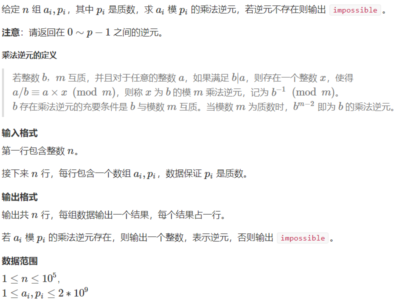
>
>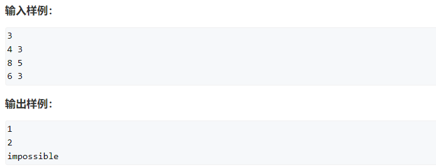

乘法逆元定义

> 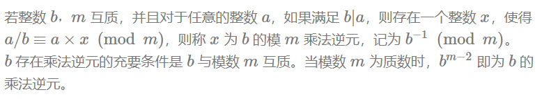

原理推导

> 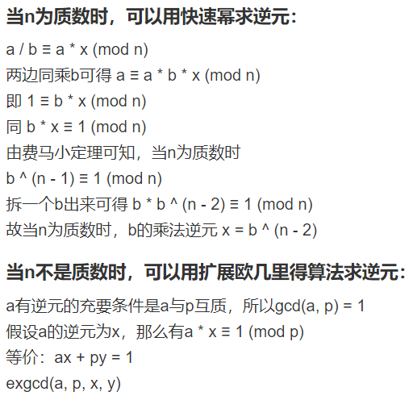

##### 快速幂求逆元

```cpp
/*给定 n 组 ai,pi，其中 pi 是质数，求 ai 模 pi 的乘法逆元，若逆元不存在则输出 impossible。
注意：请返回在 0∼p−1 之间的逆元。*/
#include <iostream>
#include <algorithm>

using namespace std;

typedef long long LL;

LL qmi(int a, int b, int p)
{
    LL res = 1;
    while (b)
    {
        if (b & 1) res = res * a % p;
        a = a * (LL)a % p;
        b >>= 1;
    }
    return res;
}
int main()
{
    int n;
    scanf("%d", &n);
    while (n -- )
    {
        int a, p;
        scanf("%d%d", &a, &p);
        if (a % p == 0) puts("impossible");
        else printf("%lld\n", qmi(a, p - 2, p));
    }

    return 0;
}
```

##### 扩展欧几里得算法求逆元

```cpp
#include <iostream>
using namespace std;
typedef long long LL;
int n;

int exgcd(int a, int b, int &x, int &y)
{
    if (!b) 
    {
        x = 1, y = 0;
        return a;
    }
    int d = exgcd(b, a % b, y, x);
    y -= a / b * x;
    return d;
}
int main()
{
    cin >> n;
    while (n --)
    {
        int a, p, x, y;
        // if (a < p) swap(a, p);
        cin >>  a >> p;
        int d = exgcd(a, p, x, y);
        if (d == 1) cout << ((LL)x + p) % p << endl;//保证x是正数
        else puts("impossible");

    }
    return 0;
}
```


### 扩展欧几里得算法

#### 扩展欧几里得算法模板

```cpp
// 求x, y，使得ax + by = gcd(a, b)
int exgcd(int a, int b, int &x, int &y)
{
    if (!b)
    {
        x = 1; y = 0;
        return a;
    }
    int d = exgcd(b, a % b, y, x);
    y -= (a/b) * x;
    return d;
}
```


**题目**

>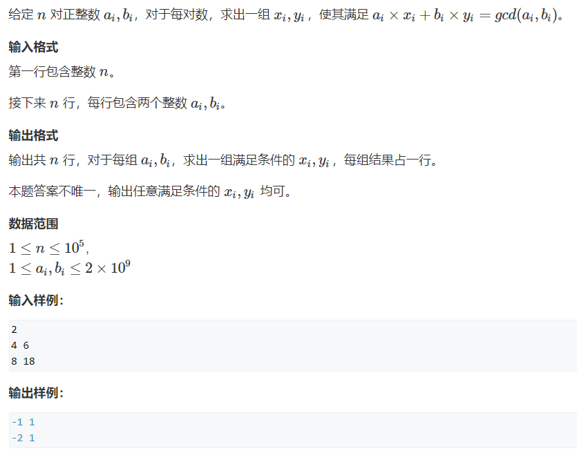

裴蜀定理：对于任意正整数a, b，那么一定存在非零整数x, y，使得ax + by = (a, b)   a 与 b 的最大公约数。

使用扩展欧几里得算法求x, y。

推导过程

> 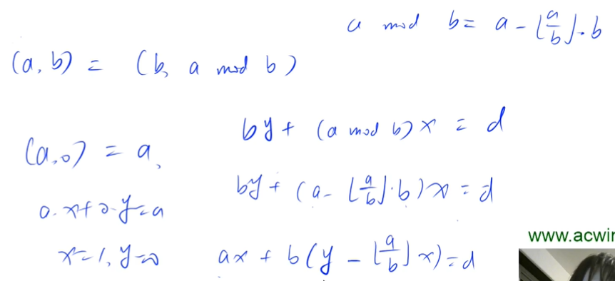

x, y通解

>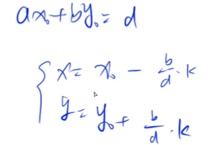

```cpp
/*给定 n 对正整数 ai,bi，对于每对数，求出一组 xi,yi，使其满足 ai×xi+bi×yi=gcd(ai,bi)。gcd为最大公约数
*/
#include <iostream>
#include <algorithm>

using namespace std;

int exgcd(int a, int b, int &x, int &y)
{
    if (!b)
    {
        x = 1, y = 0;
        return a;
    }
    int d = exgcd(b, a % b, y, x);
    y -= a / b * x;
    return d;
}

int main()
{
    int n;
    scanf("%d", &n);

    while (n -- )
    {
        int a, b;
        scanf("%d%d", &a, &b);
        int x, y;
        exgcd(a, b, x, y);
        printf("%d %d\n", x, y);
    }

    return 0;
}
```


#### 求解线性同余方程

**题目**

>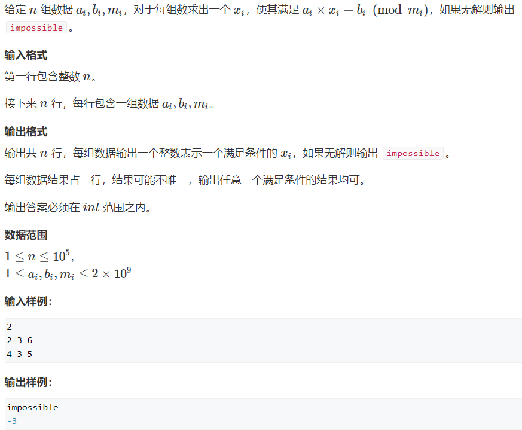

> 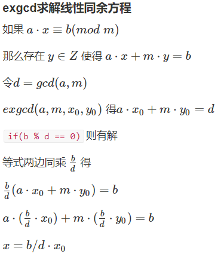

```cpp
//给定 n 组数据 ai,bi,mi，对于每组数求出一个 xi，使其满足 ai × xi ≡ bi (mod mi)，如果无解则输出 impossible。
#include <iostream>
#include <algorithm>

using namespace std;

typedef long long LL;

int exgcd(int a, int b, int &x, int &y)
{
    if (!b)
    {
        x = 1, y = 0;
        return a;
    }
    int d = exgcd(b, a % b, y, x);
    y -= a / b * x;
    return d;
}
int main()
{
    int n;
    scanf("%d", &n);
    while (n -- )
    {
        int a, b, m;
        scanf("%d%d%d", &a, &b, &m);

        int x, y;
        int d = exgcd(a, m, x, y);
        if (b % d) puts("impossible");
        else printf("%d\n", (LL)b / d * x % m);
    }

    return 0;
}
```


### 中国剩余定理

#### 表达整数的奇怪方式

**题目**

>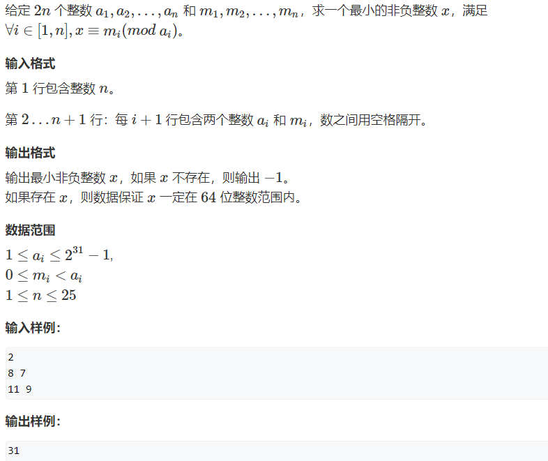

```cpp
#include <iostream>
#include <algorithm>

using namespace std;

typedef long long LL;


LL exgcd(LL a, LL b, LL &x, LL &y)
{
    if (!b)
    {
        x = 1, y = 0;
        return a;
    }

    LL d = exgcd(b, a % b, y, x);
    y -= a / b * x;
    return d;
}


int main()
{
    int n;
    cin >> n;

    LL x = 0, m1, a1;
    cin >> m1 >> a1;
    for (int i = 0; i < n - 1; i ++ )
    {
        LL m2, a2;
        cin >> m2 >> a2;
        LL k1, k2;
        LL d = exgcd(m1, m2, k1, k2);
        if ((a2 - a1) % d)
        {
            x = -1;
            break;
        }

        k1 *= (a2 - a1) / d;
        k1 = (k1 % (m2/d) + m2/d) % (m2/d);

        x = k1 * m1 + a1;

        LL m = abs(m1 / d * m2);
        a1 = k1 * m1 + a1;
        m1 = m;
    }

    if (x != -1) x = (a1 % m1 + m1) % m1;

    cout << x << endl;

    return 0;
}
```


### 高斯消元

#### 高斯消元算法模板

```cpp
// a[N][N]是增广矩阵
int gauss()
{
    int c, r;
    for (c = 0, r = 0; c < n; c ++ )
    {
        int t = r;
        for (int i = r; i < n; i ++ )   // 找到绝对值最大的行
            if (fabs(a[i][c]) > fabs(a[t][c]))
                t = i;

        if (fabs(a[t][c]) < eps) continue;

        for (int i = c; i <= n; i ++ ) swap(a[t][i], a[r][i]);      // 将绝对值最大的行换到最顶端
        for (int i = n; i >= c; i -- ) a[r][i] /= a[r][c];      // 将当前行的首位变成1
        for (int i = r + 1; i < n; i ++ )       // 用当前行将下面所有的列消成0
            if (fabs(a[i][c]) > eps)
                for (int j = n; j >= c; j -- )
                    a[i][j] -= a[r][j] * a[i][c];

        r ++ ;
    }

    if (r < n)
    {
        for (int i = r; i < n; i ++ )
            if (fabs(a[i][n]) > eps)
                return 2; // 无解
        return 1; // 有无穷多组解
    }

    for (int i = n - 1; i >= 0; i -- )
        for (int j = i + 1; j < n; j ++ )
            a[i][n] -= a[i][j] * a[j][n];

    return 0; // 有唯一解
}
```


#### 高斯消元解线性方程组

**题目**

>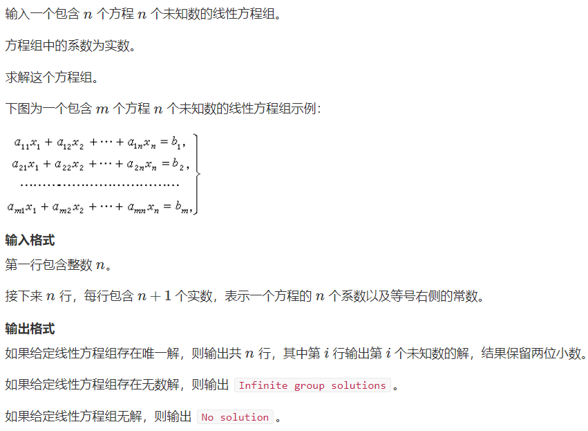
>
>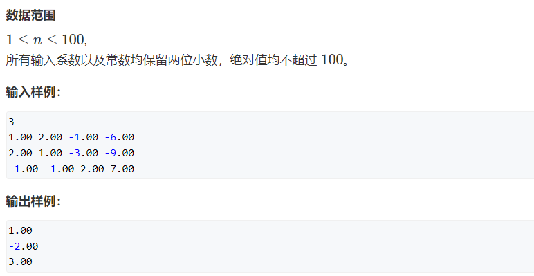

```cpp
#include <iostream>
#include <cstring>
#include <algorithm>
#include <cmath>

using namespace std;

const int N = 110;
const double eps = 1e-8;

int n;
double a[N][N];

int gauss()  // 高斯消元，答案存于a[i][n]中，0 <= i < n
{
    int c, r;
    for (c = 0, r = 0; c < n; c ++ )
    {
        int t = r;
        for (int i = r; i < n; i ++ )  // 找绝对值最大的行
            if (fabs(a[i][c]) > fabs(a[t][c]))
                t = i;

        if (fabs(a[t][c]) < eps) continue;

        for (int i = c; i <= n; i ++ ) swap(a[t][i], a[r][i]);  // 将绝对值最大的行换到最顶端
        for (int i = n; i >= c; i -- ) a[r][i] /= a[r][c];  // 将当前行的首位变成1
        for (int i = r + 1; i < n; i ++ )  // 用当前行将下面所有的列消成0
            if (fabs(a[i][c]) > eps)
                for (int j = n; j >= c; j -- )
                    a[i][j] -= a[r][j] * a[i][c];

        r ++ ;
    }

    if (r < n)
    {
        for (int i = r; i < n; i ++ )
            if (fabs(a[i][n]) > eps)
                return 2; // 无解
        return 1; // 有无穷多组解
    }

    for (int i = n - 1; i >= 0; i -- )
        for (int j = i + 1; j < n; j ++ )
            a[i][n] -= a[i][j] * a[j][n];

    return 0; // 有唯一解
}


int main()
{
    scanf("%d", &n);
    for (int i = 0; i < n; i ++ )
        for (int j = 0; j < n + 1; j ++ )
            scanf("%lf", &a[i][j]);

    int t = gauss();
    if (t == 2) puts("No solution");
    else if (t == 1) puts("Infinite group solutions");
    else
    {
        for (int i = 0; i < n; i ++ )
        {
            if (fabs(a[i][n]) < eps) a[i][n] = 0;  // 去掉输出 -0.00 的情况
            printf("%.2lf\n", a[i][n]);
        }
    }

    return 0;
}
```


#### 高斯消元解异或线性方程组

**题目**

>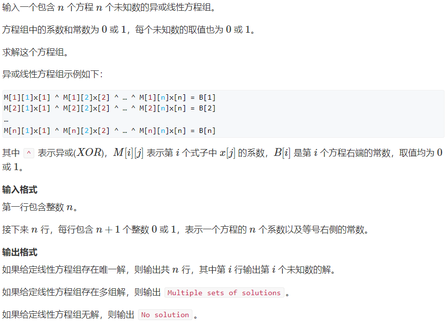
>
>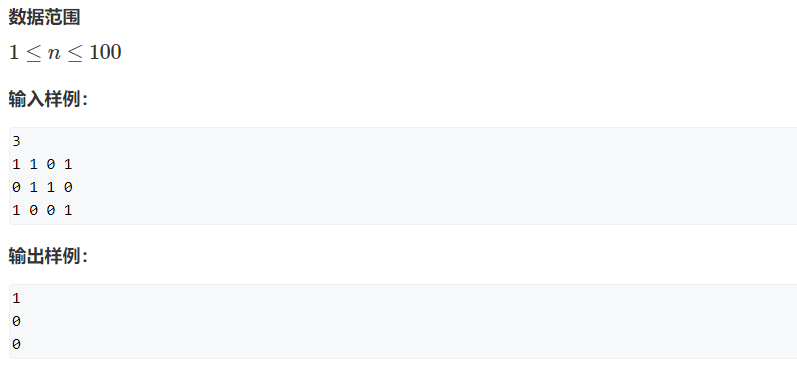

```cpp
#include <iostream>
#include <algorithm>

using namespace std;

const int N = 110;


int n;
int a[N][N];


int gauss()
{
    int c, r;
    for (c = 0, r = 0; c < n; c ++ )
    {
        int t = r;
        for (int i = r; i < n; i ++ )
            if (a[i][c])
                t = i;

        if (!a[t][c]) continue;

        for (int i = c; i <= n; i ++ ) swap(a[r][i], a[t][i]);
        for (int i = r + 1; i < n; i ++ )
            if (a[i][c])
                for (int j = n; j >= c; j -- )
                    a[i][j] ^= a[r][j];

        r ++ ;
    }

    if (r < n)
    {
        for (int i = r; i < n; i ++ )
            if (a[i][n])
                return 2;
        return 1;
    }

    for (int i = n - 1; i >= 0; i -- )
        for (int j = i + 1; j < n; j ++ )
            a[i][n] ^= a[i][j] * a[j][n];

    return 0;
}


int main()
{
    cin >> n;

    for (int i = 0; i < n; i ++ )
        for (int j = 0; j < n + 1; j ++ )
            cin >> a[i][j];

    int t = gauss();

    if (t == 0)
    {
        for (int i = 0; i < n; i ++ ) cout << a[i][n] << endl;
    }
    else if (t == 1) puts("Multiple sets of solutions");
    else puts("No solution");

    return 0;
}
```


### 求组合数

#### 求组合数 I

**题目**

>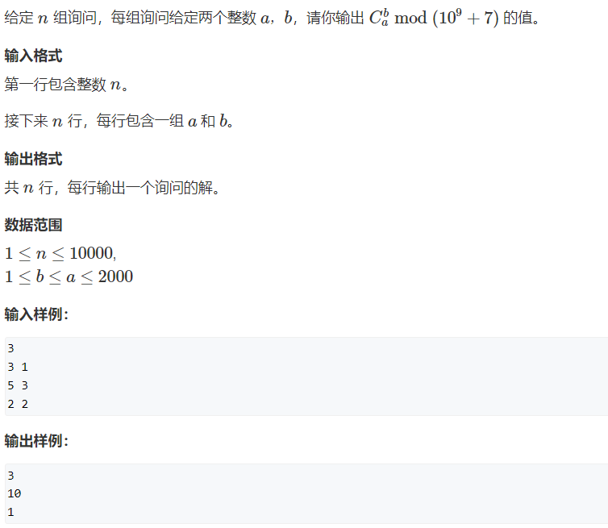

```cpp
#include <iostream>
#include <algorithm>

using namespace std;

const int N = 2010, mod = 1e9 + 7;


int c[N][N];


void init()
{
    for (int i = 0; i < N; i ++ )
        for (int j = 0; j <= i; j ++ )
            if (!j) c[i][j] = 1;
            else c[i][j] = (c[i - 1][j] + c[i - 1][j - 1]) % mod;
}


int main()
{
    int n;

    init();

    scanf("%d", &n);

    while (n -- )
    {
        int a, b;
        scanf("%d%d", &a, &b);

        printf("%d\n", c[a][b]);
    }

    return 0;
}
```


#### 求组合数 II

**题目**

>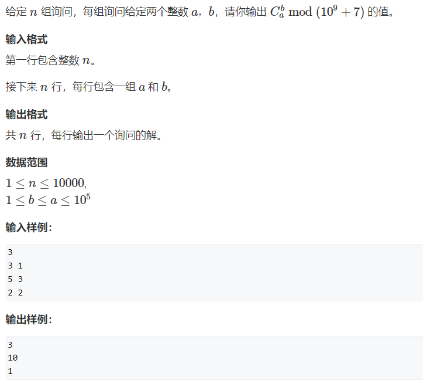

```cpp
#include <iostream>
#include <algorithm>

using namespace std;

typedef long long LL;

const int N = 100010, mod = 1e9 + 7;


int fact[N], infact[N];


int qmi(int a, int k, int p)
{
    int res = 1;
    while (k)
    {
        if (k & 1) res = (LL)res * a % p;
        a = (LL)a * a % p;
        k >>= 1;
    }
    return res;
}


int main()
{
    fact[0] = infact[0] = 1;
    for (int i = 1; i < N; i ++ )
    {
        fact[i] = (LL)fact[i - 1] * i % mod;
        infact[i] = (LL)infact[i - 1] * qmi(i, mod - 2, mod) % mod;
    }


    int n;
    scanf("%d", &n);
    while (n -- )
    {
        int a, b;
        scanf("%d%d", &a, &b);
        printf("%d\n", (LL)fact[a] * infact[b] % mod * infact[a - b] % mod);
    }

    return 0;
}
```


#### 求组合数 III

**题目**

>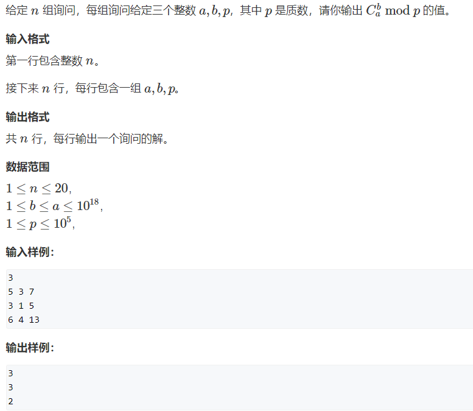

```cpp
#include <iostream>
#include <algorithm>

using namespace std;

typedef long long LL;


int qmi(int a, int k, int p)
{
    int res = 1;
    while (k)
    {
        if (k & 1) res = (LL)res * a % p;
        a = (LL)a * a % p;
        k >>= 1;
    }
    return res;
}


int C(int a, int b, int p)
{
    if (b > a) return 0;

    int res = 1;
    for (int i = 1, j = a; i <= b; i ++, j -- )
    {
        res = (LL)res * j % p;
        res = (LL)res * qmi(i, p - 2, p) % p;
    }
    return res;
}


int lucas(LL a, LL b, int p)
{
    if (a < p && b < p) return C(a, b, p);
    return (LL)C(a % p, b % p, p) * lucas(a / p, b / p, p) % p;
}


int main()
{
    int n;
    cin >> n;

    while (n -- )
    {
        LL a, b;
        int p;
        cin >> a >> b >> p;
        cout << lucas(a, b, p) << endl;
    }

    return 0;
}
```


#### 求组合数 IV

**题目**

>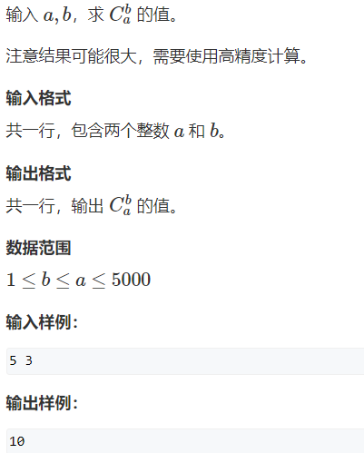

```cpp
#include <iostream>
#include <algorithm>
#include <vector>

using namespace std;


const int N = 5010;

int primes[N], cnt;
int sum[N];
bool st[N];


void get_primes(int n)
{
    for (int i = 2; i <= n; i ++ )
    {
        if (!st[i]) primes[cnt ++ ] = i;
        for (int j = 0; primes[j] <= n / i; j ++ )
        {
            st[primes[j] * i] = true;
            if (i % primes[j] == 0) break;
        }
    }
}


int get(int n, int p)
{
    int res = 0;
    while (n)
    {
        res += n / p;
        n /= p;
    }
    return res;
}


vector<int> mul(vector<int> a, int b)
{
    vector<int> c;
    int t = 0;
    for (int i = 0; i < a.size(); i ++ )
    {
        t += a[i] * b;
        c.push_back(t % 10);
        t /= 10;
    }
    while (t)
    {
        c.push_back(t % 10);
        t /= 10;
    }
    return c;
}


int main()
{
    int a, b;
    cin >> a >> b;

    get_primes(a);

    for (int i = 0; i < cnt; i ++ )
    {
        int p = primes[i];
        sum[i] = get(a, p) - get(a - b, p) - get(b, p);
    }

    vector<int> res;
    res.push_back(1);

    for (int i = 0; i < cnt; i ++ )
        for (int j = 0; j < sum[i]; j ++ )
            res = mul(res, primes[i]);

    for (int i = res.size() - 1; i >= 0; i -- ) printf("%d", res[i]);
    puts("");

    return 0;
}
```


#### 满足条件的01序列

**题目**

>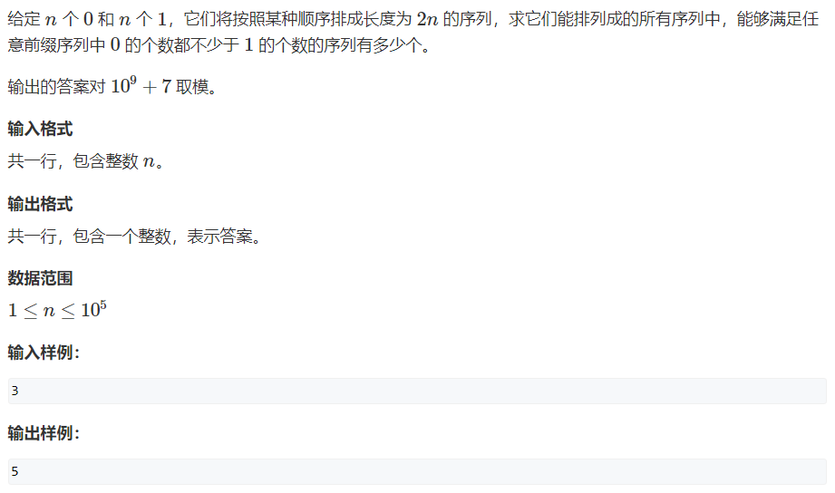

```cpp
#include <iostream>
#include <algorithm>

using namespace std;

typedef long long LL;

const int N = 100010, mod = 1e9 + 7;


int qmi(int a, int k, int p)
{
    int res = 1;
    while (k)
    {
        if (k & 1) res = (LL)res * a % p;
        a = (LL)a * a % p;
        k >>= 1;
    }
    return res;
}


int main()
{
    int n;
    cin >> n;

    int a = n * 2, b = n;
    int res = 1;
    for (int i = a; i > a - b; i -- ) res = (LL)res * i % mod;

    for (int i = 1; i <= b; i ++ ) res = (LL)res * qmi(i, mod - 2, mod) % mod;

    res = (LL)res * qmi(n + 1, mod - 2, mod) % mod;

    cout << res << endl;

    return 0;
}
```


#### 递归法求组合数

```cpp
// c[a][b] 表示从a个苹果中选b个的方案数
for (int i = 0; i < N; i ++ )
    for (int j = 0; j <= i; j ++ )
        if (!j) c[i][j] = 1;
        else c[i][j] = (c[i - 1][j] + c[i - 1][j - 1]) % mod;
```

#### 通过预处理逆元的方式求组合数

```cpp
首先预处理出所有阶乘取模的余数fact[N]，以及所有阶乘取模的逆元infact[N]
如果取模的数是质数，可以用费马小定理求逆元
int qmi(int a, int k, int p)    // 快速幂模板
{
    int res = 1;
    while (k)
    {
        if (k & 1) res = (LL)res * a % p;
        a = (LL)a * a % p;
        k >>= 1;
    }
    return res;
}

// 预处理阶乘的余数和阶乘逆元的余数
fact[0] = infact[0] = 1;
for (int i = 1; i < N; i ++ )
{
    fact[i] = (LL)fact[i - 1] * i % mod;
    infact[i] = (LL)infact[i - 1] * qmi(i, mod - 2, mod) % mod;
}
```

#### Lucas定理

```cpp
若p是质数，则对于任意整数 1 <= m <= n，有：
    C(n, m) = C(n % p, m % p) * C(n / p, m / p) (mod p)

int qmi(int a, int k, int p)  // 快速幂模板
{
    int res = 1 % p;
    while (k)
    {
        if (k & 1) res = (LL)res * a % p;
        a = (LL)a * a % p;
        k >>= 1;
    }
    return res;
}

int C(int a, int b, int p)  // 通过定理求组合数C(a, b)
{
    if (a < b) return 0;

    LL x = 1, y = 1;  // x是分子，y是分母
    for (int i = a, j = 1; j <= b; i --, j ++ )
    {
        x = (LL)x * i % p;
        y = (LL) y * j % p;
    }

    return x * (LL)qmi(y, p - 2, p) % p;
}

int lucas(LL a, LL b, int p)
{
    if (a < p && b < p) return C(a, b, p);
    return (LL)C(a % p, b % p, p) * lucas(a / p, b / p, p) % p;
}
```

#### 分解质因数法求组合数

```cpp
当我们需要求出组合数的真实值，而非对某个数的余数时，分解质因数的方式比较好用：
    1. 筛法求出范围内的所有质数
    2. 通过 C(a, b) = a! / b! / (a - b)! 这个公式求出每个质因子的次数。 n! 中p的次数是 n / p + n / p^2 + n / p^3 + ...
    3. 用高精度乘法将所有质因子相乘

int primes[N], cnt;     // 存储所有质数
int sum[N];     // 存储每个质数的次数
bool st[N];     // 存储每个数是否已被筛掉


void get_primes(int n)      // 线性筛法求素数
{
    for (int i = 2; i <= n; i ++ )
    {
        if (!st[i]) primes[cnt ++ ] = i;
        for (int j = 0; primes[j] <= n / i; j ++ )
        {
            st[primes[j] * i] = true;
            if (i % primes[j] == 0) break;
        }
    }
}


int get(int n, int p)       // 求n！中的次数
{
    int res = 0;
    while (n)
    {
        res += n / p;
        n /= p;
    }
    return res;
}


vector<int> mul(vector<int> a, int b)       // 高精度乘低精度模板
{
    vector<int> c;
    int t = 0;
    for (int i = 0; i < a.size(); i ++ )
    {
        t += a[i] * b;
        c.push_back(t % 10);
        t /= 10;
    }

    while (t)
    {
        c.push_back(t % 10);
        t /= 10;
    }

    return c;
}

get_primes(a);  // 预处理范围内的所有质数

for (int i = 0; i < cnt; i ++ )     // 求每个质因数的次数
{
    int p = primes[i];
    sum[i] = get(a, p) - get(b, p) - get(a - b, p);
}

vector<int> res;
res.push_back(1);

for (int i = 0; i < cnt; i ++ )     // 用高精度乘法将所有质因子相乘
    for (int j = 0; j < sum[i]; j ++ )
        res = mul(res, primes[i]);

```

#### 卡特兰数 

```cpp
给定n个0和n个1，它们按照某种顺序排成长度为2n的序列，满足任意前缀中0的个数都不少于1的个数的序列的数量为： Cat(n) = C(2n, n) / (n + 1)
```


### 容斥原理

#### 能被整除的数

**题目**

>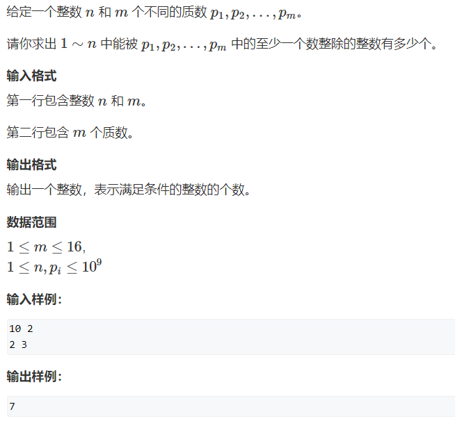

> 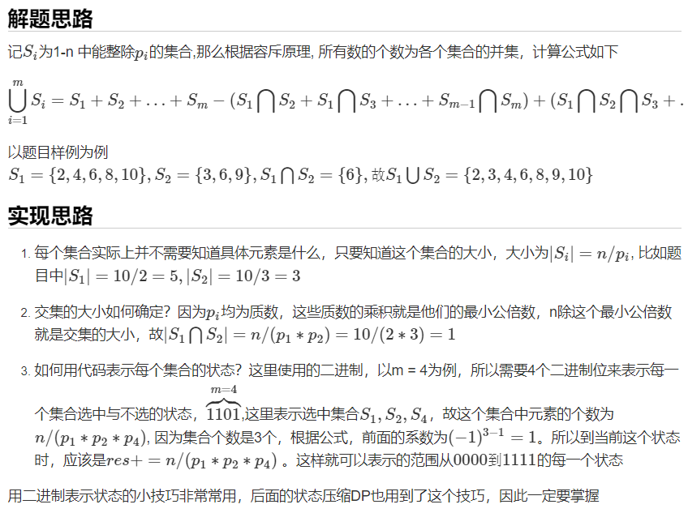

```cpp
//给定一个整数 n 和 m 个不同的质数 p1,p2,…,pm。
//请你求出 1∼n 中能被 p1,p2,…,pm 中的至少一个数整除的整数有多少个。
#include<iostream>
using namespace std;
typedef long long LL;

const int N = 20;
int p[N], n, m;

int main() {
    cin >> n >> m;
    for(int i = 0; i < m; i++) cin >> p[i];

    int res = 0;
    //枚举从1 到 1111...(m个1)的每一个集合状态, (至少选中一个集合)
    for(int i = 1; i < 1 << m; i++) {
        int t = 1;             //选中集合对应质数的乘积
        int s = 0;             //选中的集合数量

        //枚举当前状态的每一位
        for(int j = 0; j < m; j++){
            //选中一个集合
            if(i >> j & 1){
                //乘积大于n, 则n/t = 0, 跳出这轮循环
                if((LL)t * p[j] > n){    
                    t = -1;
                    break;
                }
                s++;                  //有一个1，集合数量+1
                t *= p[j];
            }
        }

        if(t == -1) continue;  

        if(s & 1) res += n / t;              //选中奇数个集合, 则系数应该是1, n/t为当前这种状态的集合数量
        else res -= n / t;                      //反之则为 -1
    }

    cout << res << endl;
    return 0;
}
```


### 博弈论

#### 知识补充

> 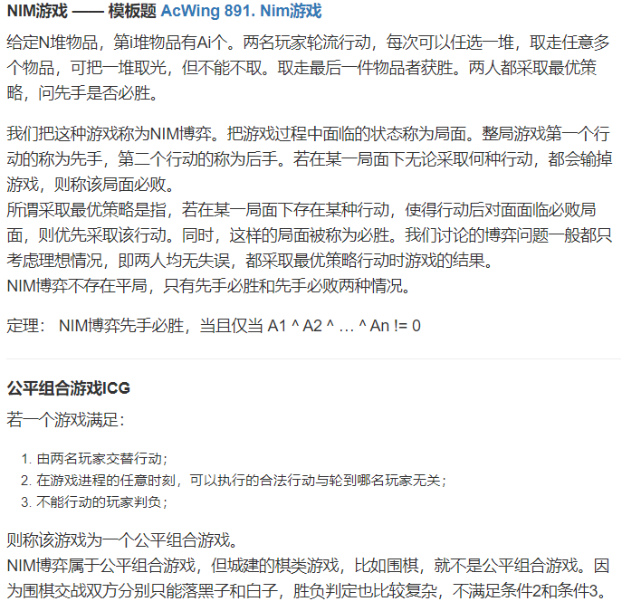
>
> 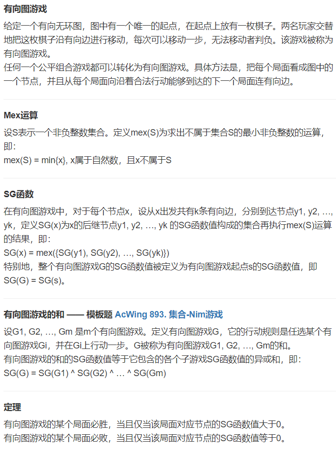


#### Nim游戏

**题目**

>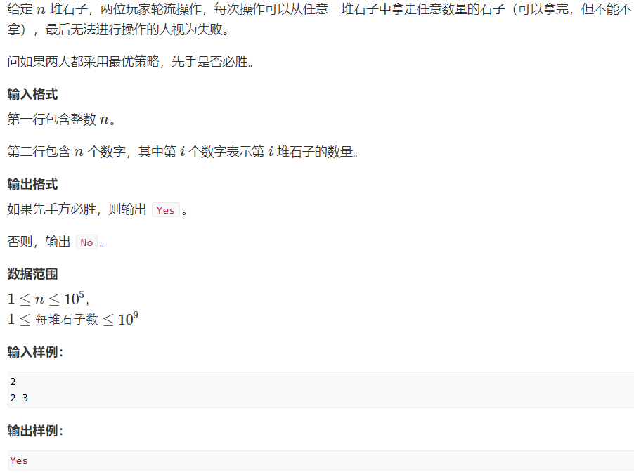

必胜状态和必败状态

> 必胜状态，先手进行某一个操作，留给后手是一个必败状态时，对于先手来说是一个必胜状态。即先手可以走到某一个必败状态。
> 必败状态，先手无论如何操作，留给后手都是一个必胜状态时，对于先手来说是一个必败状态。即先手走不到任何一个必败状态。

结论

> 假设nn堆石子，石子数目分别是a1,a2,…,ana1,a2,…,an，如果a1⊕a2⊕…⊕an≠0a1⊕a2⊕…⊕an≠0，先手必胜；否则先手必败。

基于上述三个证明：

> 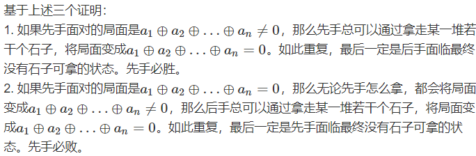

```cpp
/*给定 n 堆石子，两位玩家轮流操作，每次操作可以从任意一堆石子中拿走任意数量的石子（可以拿完，但不能不拿），最后无法进行操作的人视为失败。
问如果两人都采用最优策略，先手是否必胜。*/

#include <iostream>
#include <cstdio>
using namespace std;

/*
先手必胜状态：先手操作完，可以走到某一个必败状态
先手必败状态：先手操作完，走不到任何一个必败状态
先手必败状态：a1 ^ a2 ^ a3 ^ ... ^an = 0
先手必胜状态：a1 ^ a2 ^ a3 ^ ... ^an ≠ 0
*/

int main(){
    int n;
    scanf("%d", &n);
    int res = 0;
    for(int i = 0; i < n; i++) 
    {
        int x;
        scanf("%d", &x);
        res ^= x;
    }
    if(res == 0) puts("No");
    else puts("Yes");
}
```


#### 台阶-Nim游戏

**题目**

>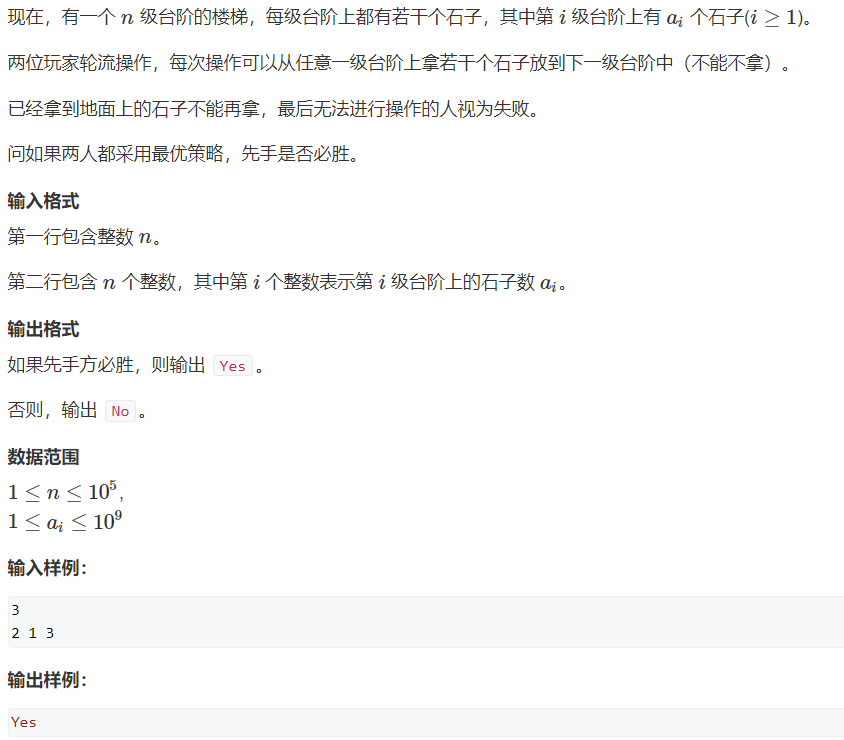

```cpp
#include <iostream>
#include <algorithm>

using namespace std;

const int N = 100010;

int main()
{
    int n;
    scanf("%d", &n);

    int res = 0;
    for (int i = 1; i <= n; i ++ )
    {
        int x;
        scanf("%d", &x);
        if (i & 1) res ^= x;
    }

    if (res) puts("Yes");
    else puts("No");

    return 0;
}
```


#### 集合-Nim游戏

**题目**

>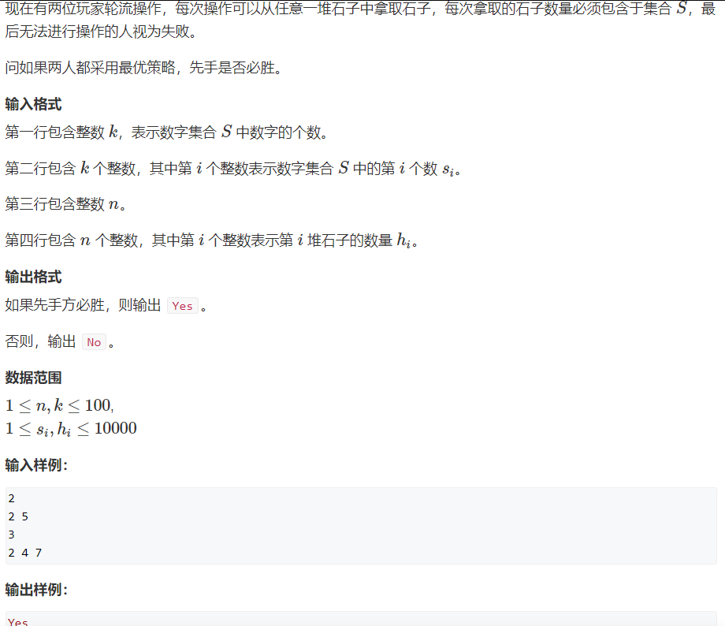

```cpp
#include <cstring>
#include <iostream>
#include <algorithm>
#include <unordered_set>

using namespace std;

const int N = 110, M = 10010;

int n, m;
int s[N], f[M];


int sg(int x)
{
    if (f[x] != -1) return f[x];

    unordered_set<int> S;
    for (int i = 0; i < m; i ++ )
    {
        int sum = s[i];
        if (x >= sum) S.insert(sg(x - sum));
    }

    for (int i = 0; ; i ++ )
        if (!S.count(i))
            return f[x] = i;
}


int main()
{
    cin >> m;
    for (int i = 0; i < m; i ++ ) cin >> s[i];
    cin >> n;

    memset(f, -1, sizeof f);

    int res = 0;
    for (int i = 0; i < n; i ++ )
    {
        int x;
        cin >> x;
        res ^= sg(x);
    }

    if (res) puts("Yes");
    else puts("No");

    return 0;
}
```


#### 拆分-Nim游戏

**题目**

>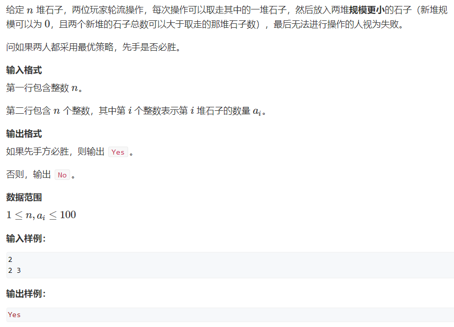

```cpp
#include <cstring>
#include <iostream>
#include <algorithm>
#include <unordered_set>

using namespace std;

const int N = 110;


int n;
int f[N];


int sg(int x)
{
    if (f[x] != -1) return f[x];

    unordered_set<int> S;
    for (int i = 0; i < x; i ++ )
        for (int j = 0; j <= i; j ++ )
            S.insert(sg(i) ^ sg(j));

    for (int i = 0;; i ++ )
        if (!S.count(i))
            return f[x] = i;
}


int main()
{
    cin >> n;

    memset(f, -1, sizeof f);

    int res = 0;
    while (n -- )
    {
        int x;
        cin >> x;
        res ^= sg(x);
    }

    if (res) puts("Yes");
    else puts("No");

    return 0;
}
```


