## 动态规划学习 - AcWing - HQ

[TOC]

----

### 注意内容

- ==动态规划注意==
  - 当题目涉及到 f[i - 1] 下标时，i要从1开始，否则从0开始。
  - 动态规划的时间复杂度一般等于，状态数量 * 转移的计算量
  - 状态表示维数选择，在答案能够表示且能推出来的前提下，维数越小越好，一般是从小往大考虑。（维数越大，时间复杂度越高）

----

### 目录

> 


### 背包问题

有 N 件物品和一个容量是 V 的背包。

第 i 件物品的体积是 vi，价值是 wi。

求解将哪些物品装入背包，可使这些物品的总体积不超过背包容量，且总价值最大。输出最大价值。

问题分类：

1. 01背包问题：每件物品最多只用一次。
2. 完全背包问题：每件物品有无限个。
3. 多重背包问题：每个物品的个数不一样，最多有Si个，不同物品的Si不一样。（朴素版/优化版）
4. 分组背包问题：有n组物品，每组物品有若干个，每一组最多可以选1个物品。

DP问题的优化一般来说是对动态规划的代码或方程做等价变型。


#### 01背包问题

**题目**

>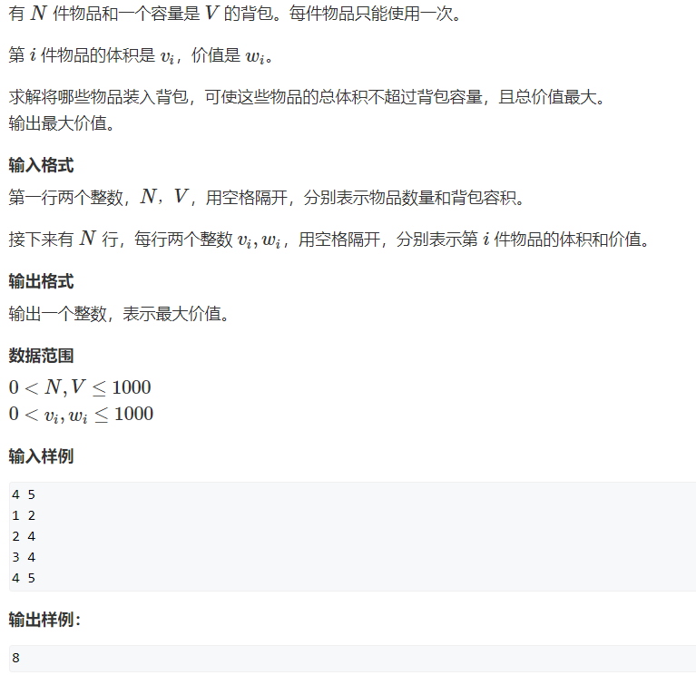

动态规划是不断决策求最优解的过程，「0-1 背包」即是不断对第 i 个物品的做出决策，「0-1」正好代表不选与选两种决定。

> 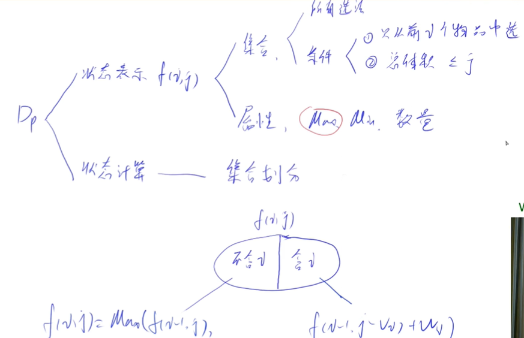

重要变量 & 公式解释

```cpp
f[i][j]:表示所有选法集合中,只从前i个物品中选,并且总体积≤j的选法的集合,它的值是这个集合中每一个选法的最大值.
状态转移方程
f[i][j] = max(f[i-1][j], f[i-1][j-v[i]]+w[i])
f[i-1][j]:不选第i个物品的集合中的最大值
f[i-1][j-v[i]]+w[i]:选第i个物品的集合,但是直接求不容易求所在集合的属性,这里迂回打击一下,先将第i个物品的体积减去,求剩下集合中选法的最大值.
```

##### 二维

> 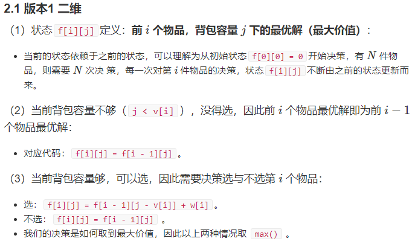

```cpp
/*有 N 件物品和一个容量是 V 的背包。每件物品只能使用一次。
第 i 件物品的体积是 vi，价值是 wi。
求解将哪些物品装入背包，可使这些物品的总体积不超过背包容量，且总价值最大。输出最大价值。
*/
#include <iostream>
#include <algorithm>
using namespace std;

const int N = 1010;

int n, m;  //n表示所有物品个数，m表示背包容量
int v[N], w[N]; //v体积，w价值
int f[N][N];  // f[i][j], j体积下前i个物品的最大价值

int main()
{
    cin >> n >> m;
    for (int i = 1; i <= n; i++) cin >> v[i] >> w[i]; //读入所有物品
    //初始化时，要枚举所有状态
    
    for (int i = 1; i <= n; i++)
    	for (int j = 0; j <= m; j++)
        {   
            //  当前背包容量装不进第i个物品，则价值等于前i-1个物品
            if(j < v[i]) 
                f[i][j] = f[i - 1][j];
            // 能装，需进行决策是否选择第i个物品
            else    
                f[i][j] = max(f[i - 1][j], f[i - 1][j - v[i]] + w[i]);
         
            //f[i][j] = f[i - 1][j];
            //if (j >= v[i]) f[i][j] = max(f[i][j], f[i - 1][j - v[i]] + w[i]);
        }
    cout << f[n][m] << endl;
    return 0;
}
```

##### 一维

> 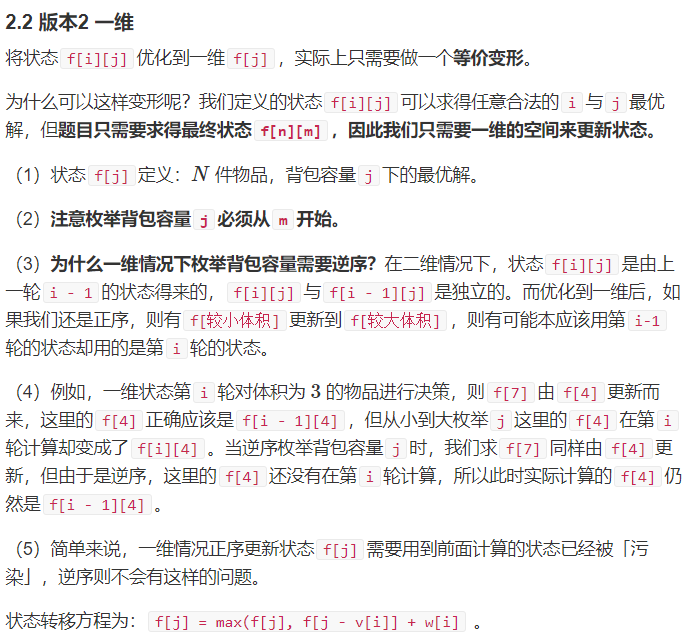
>
> 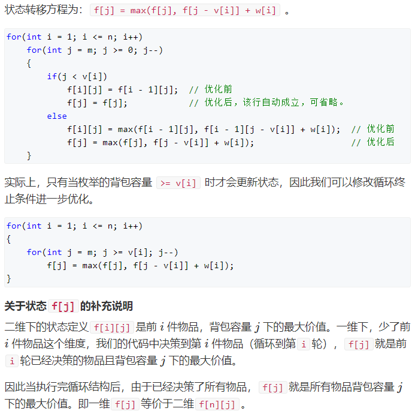

```cpp
/*有 N 件物品和一个容量是 V 的背包。每件物品只能使用一次。
第 i 件物品的体积是 vi，价值是 wi。
求解将哪些物品装入背包，可使这些物品的总体积不超过背包容量，且总价值最大。输出最大价值。
*/
//有优化版
/*
1. f[i] 仅用到了f[i-1]层, 
2. j与j-v[i] 均小于j
3.若用到上一层的状态时,从大到小枚举, 反之从小到大哦
*/
#include <iostream>
#include <algorithm>
using namespace std;

const int N = 1010;

int n, m;  //n表示所有物品个数，m表示背包容量
int v[N], w[N]; //v体积，w价值
int f[N];  //状态

int main()
{
    cin >> n >> m;
    for (int i = 1; i <= n; i++) cin >> v[i] >> w[i]; //读入所有物品
    //初始化时，要枚举所有状态
    
    for (int i = 1; i <= n; i++)
    	for (int j = m; j >= v[i]; j--)
            f[j] = max(f[j], f[j - v[i]] + w[i]);
      
    cout << f[m] << endl;
    return 0;
}
```


#### 完全背包问题

**题目**

>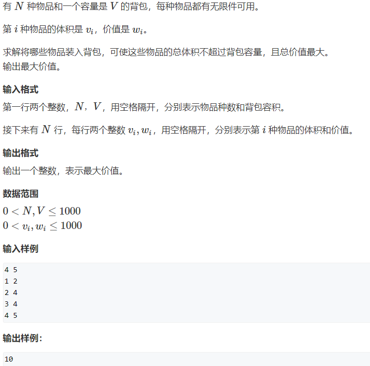

##### 二维

###### 朴素做法

> 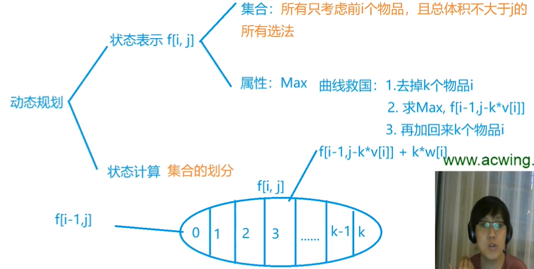

```cpp
/*有 N 种物品和一个容量是 V 的背包，每种物品都有无限件可用。
第 i 种物品的体积是 vi，价值是 wi。
求解将哪些物品装入背包，可使这些物品的总体积不超过背包容量，且总价值最大。输出最大价值。
*/
#include <iostream>
using namespace std;

const int N = 1010;

int n, m;
int v[N], w[N];
int f[N][N];

int main()
{
    cin >> n >> m;
    for (int i = 1; i <= n; i++) cin >> v[i] >> w[i];
    
    for (int i = 1; i <= n; i++)
        for (int j = 0; j <= m; j++)
            for (int k = 0; k * v[i] <= j; k++)
                f[i][j] = max(f[i][j], f[i - 1][j - v[i] * k] + w[i] * k);
    cout << f[n][m] << endl;
    return 0;
}
```

###### 优化做法

> 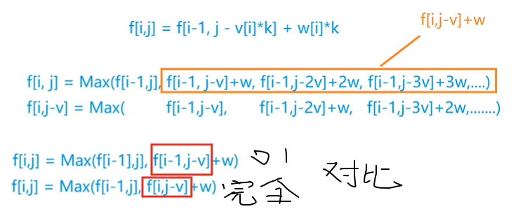
>
> 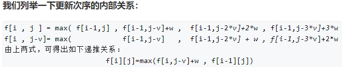

```cpp
/*有 N 种物品和一个容量是 V 的背包，每种物品都有无限件可用。
第 i 种物品的体积是 vi，价值是 wi。
求解将哪些物品装入背包，可使这些物品的总体积不超过背包容量，且总价值最大。输出最大价值。
*/
#include <iostream>
using namespace std;

const int N = 1010;

int n, m;
int v[N], w[N];
int f[N][N];

int main()
{
    cin >> n >> m;
    for (int i = 1; i <= n; i++) cin >> v[i] >> w[i];
    
    for (int i = 1; i <= n; i++)
        for (int j = 0; j <= m; j++)
        {
            f[i][j] = f[i - 1][j];
            if (j >= v[i]) f[i][j] = max(f[i][j], f[i][j - v[i]] + w[i])
        }
    cout << f[n][m] << endl;
    return 0;
}
```

##### 一维

上一篇代码中，解释过，逆序是为了保证更新当前状态时，用到的状态是上一轮的状态，保证每个物品只有一次或零次;
在这里，因为每个物品可以取任意多次，所以不再强求用上一轮的状态，即本轮放过的物品，在后面还可以再放;

```cpp
首先dp数组初始化全为0：给定物品种类有4种，包最大体积为5，数据来源于题目的输入
v[1] = 1, w[1] = 2
v[2] = 2, w[2] = 4
v[3] = 3, w[3] = 4
v[4] = 4, w[4] = 5

i = 1 时： j从v[1]到5
dp[1] = max(dp[1],dp[0]+w[1]) = w[1] = 2 (用了一件物品1）
dp[2] = max(dp[2],dp[1]+w[1]) = w[1] + w[1] = 4（用了两件物品1）
dp[3] = max(dp[3],dp[2]+w[1]) = w[1] + w[1] + w[1] = 6（用了三件物品1）
dp[4] = max(dp[4],dp[3]+w[1]) = w[1] + w[1] + w[1] + w[1] = 8（用了四件物品1）
dp[5] = max(dp[3],dp[2]+w[1]) = w[1] + w[1] + w[1] + w[1] + w[1] = 10（用了五件物品）

i = 2 时：j从v[2]到5
dp[2] = max(dp[2],dp[0]+w[2]) = w[1] + w[1] = w[2] =  4（用了两件物品1或者一件物品2）
dp[3] = max(dp[3],dp[1]+w[2]) = 3 * w[1] = w[1] + w[2] =  6（用了三件物品1，或者一件物品1和一件物品2）
dp[4] = max(dp[4],dp[2]+w[2]) = 4 * w[1] = dp[2] + w[2] =  8（用了四件物品1或者，两件物品1和一件物品2或两件物品2）
dp[5] = max(dp[5],dp[3]+w[2]) = 5 * w[1] = dp[3] + w[2] =  10（用了五件物品1或者，三件物品1和一件物品2或一件物品1和两件物品2）

i = 3时：j从v[3]到5
dp[3] = max(dp[3],dp[0]+w[3]) = dp[3] = 6 # 保持第二轮的状态 
dp[4] = max(dp[4],dp[1]+w[3]) = dp[4] = 8 # 保持第二轮的状态 
dp[5] = max(dp[5],dp[2]+w[3]) = dp[4] = 10 # 保持第二轮的状态

i = 4时：j从v[4]到5
dp[4] = max(dp[4],dp[0]+w[4]) = dp[4] = 10 # 保持第三轮的状态
dp[5] = max(dp[5],dp[1]+w[4]) = dp[5] = 10 # 保持第三轮的状态

上面模拟了完全背包的全部过程，也可以看出，最后一轮的dp[m]即为最终的返回结果。
```

根据模拟过程可以发现，遍历每一轮i时，用到的v[i]和w[i]只来自本轮的输入，并且之后不会再用到，因此不用创建数组来存这两个值。

```cpp
#include <iostream>
using namespace std;

const int N = 1010;

int n, m;
int v[N], w[N];
int f[N];

int main()
{
    cin >> n >> m;
    for (int i = 1; i <= n; i++) cin >> v[i] >> w[i];
    
    for (int i = 1; i <= n; i++)
        for (int j = v[i]; j <= m; j++)
            f[j] = max(f[j], f[j - v[i]] + w[i]);
   
    cout << f[m] << endl;
    return 0;
}
```


#### 多重背包问题

**题目**

>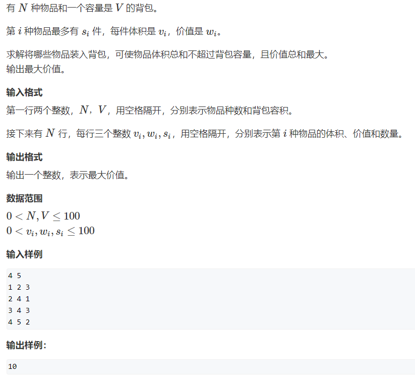

##### 二维

###### 朴素做法

依次枚举第i个物品选几个

> 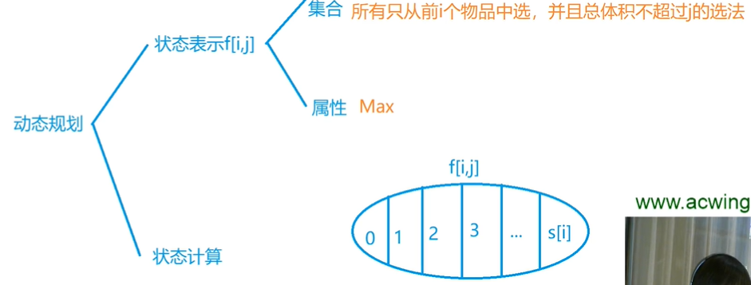

`f[i][j] = max(f[i - 1][j - v[i] * k] + w[i] * k); k = 0, 1, 2, ..., s[i]`

```cpp
/*有 N 种物品和一个容量是 V 的背包。
第 i 种物品最多有 si 件，每件体积是 vi，价值是 wi。
求解将哪些物品装入背包，可使物品体积总和不超过背包容量，且价值总和最大。输出最大价值。
*/
#include <iostream>
using namespace std;

const int N = 110;

int n, m;
int v[N], w[N], s[N];
int f[N][N];

int main()
{
    cin >> n >> m;
    for (int i = 1; i <= n; i++) cin >> v[i] >> w[i] >> s[i];
    
    for (int i = 1; i <= n; i++)
        for (int j = 0; j <= m; j++)
            for (int k = 0; k <= s[i] && k * v[i] <= j; k++)
  	    		f[i][j] = max(f[i][j], f[i - 1][j - v[i] * k] + w[i] * k);
    cout << f[n][m] << endl;
    return 0;
}
```


#### 多重背包问题 II

**题目**

> 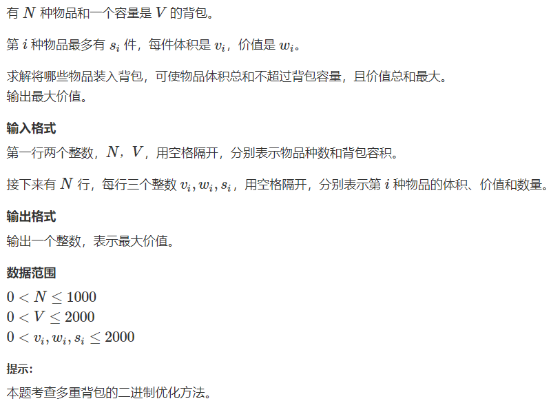
>
> 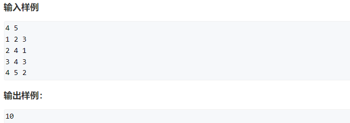

##### 一维

###### 优化做法

二进制优化的方法

> 假设有一组商品，一共有11个。我们知道，十进制数字 11 可以这样表示
> 11=1011(B)=0111(B)+(11−0111(B))=0111(B)+0100(B)
>
> 正常背包的思路下，我们要求出含这组商品的最优解，我们要枚举12次（枚举装0，1，2....12个）。
>
> 现在，如果我们把这11个商品分别打包成含商品个数为1个，2个，4个，4个（分别对应0001,0010,0100,0100）的四个”新的商品 “, 将问题转化为01背包问题，对于每个商品，我们都只枚举一次，那么我们只需要枚举四次 ，就可以找出这含组商品的最优解。 这样就大大减少了枚举次数。
>
> 这种优化对于大数尤其明显，例如有1024个商品，在正常情况下要枚举1025次 ， 二进制思想下转化成01背包只需要枚举10次。

优化的合理性的证明

> 先讲结论：上面的1，2，4，4是可以通过组合来表示出0~11中任何一个数的，还是拿11证明一下（举例一下）：
>
> 首先，11可以这样分成两个二进制数的组合：
> 11=0111(B)+(11−0111(B))=0111(B)+0100(B)
>
> 其中0111通过枚举这三个1的取或不取（也就是对0001(B)，0010(B)，0100(B)的组合），可以表示十进制数0~7( 刚好对应了 1，2，4 可以组合出 0~7 ) , 0~7的枚举再组合上0100(B)( 即 十进制的 4 ) ，可以表示十进制数 0~11。其它情况也可以这样证明。这也是为什么，这个完全背包问题可以等效转化为01背包问题，有木有觉得很奇妙
>
> 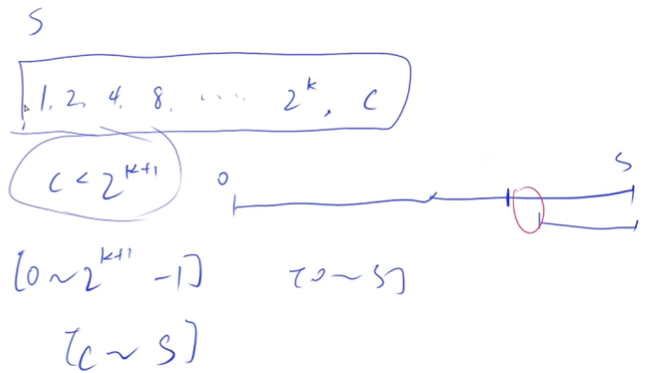

举例

>取这样一个例子:要求在一堆苹果选出n个苹果。我们传统的思维是一个一个地去选，选够n个苹果就停止。这样选择的次数就是n次
>
>二进制优化思维就是：现在给出一堆苹果和10个箱子，选出n个苹果。将这一堆苹果分别按照1,2,4,8,16,.....512分到10个箱子里，那么由于任何一个数字x ∈[1,1024]
>都可以从这10个箱子里的苹果数量表示出来，但是这样选择的次数就是 ≤10次 

怎么合理划分一个十进制数?

> 上面我把11划分为
>
> 11=0111(B)+(11−0111(B))=0111(B)+0100(B)
> 是因为 0111(B)刚好是小于11的最大的尾部全为1的二进制 ( 按照上面的证明，这样的划分没毛病 ) , 然后那个尾部全为1的数又可以 分解为 0000....1 , 0000....10 , 0000....100 等等。

时间复杂度：从O(NVS)降到O(NVlogS)

```cpp
/*有 N 种物品和一个容量是 V 的背包。
第 i 种物品最多有 si 件，每件体积是 vi，价值是 wi。
求解将哪些物品装入背包，可使物品体积总和不超过背包容量，且价值总和最大。输出最大价值。
*/
#include <iostream>
using namespace std;

const int N = 25000, M = 2000;  //物品个数 = N * logS 

int n, m;
int v[N], w[N];
int f[N];

int main()
{
    cin >> n >> m;
    int cnt = 0;  //存储我们所有新的物品（的编号）
    for (int i = 1; i <= n; i++) 
    {
        int a, b, s;
        cin >> a >> b >> s;
        int k = 1;
        while (k <= s)
        {
            cnt++;
            v[cnt] = a * k;
            w[cnt] = b * k;
            s -= k;
            k *= 2;
        }
        if (s > 0)
        {
            cnt++;
            v[cnt] = a * s;
            w[cnt] = b * s;
        }
    }   
    n = cnt;
    for (int i = 1; i <= n; i++)
        for (int j = m; j >= v[i]; j--)
            f[j] = max(f[j], f[j - v[i]] + w[i]);
            
    cout << f[m] << endl;
    return 0;
}
```


#### 分组背包问题

**题目**

>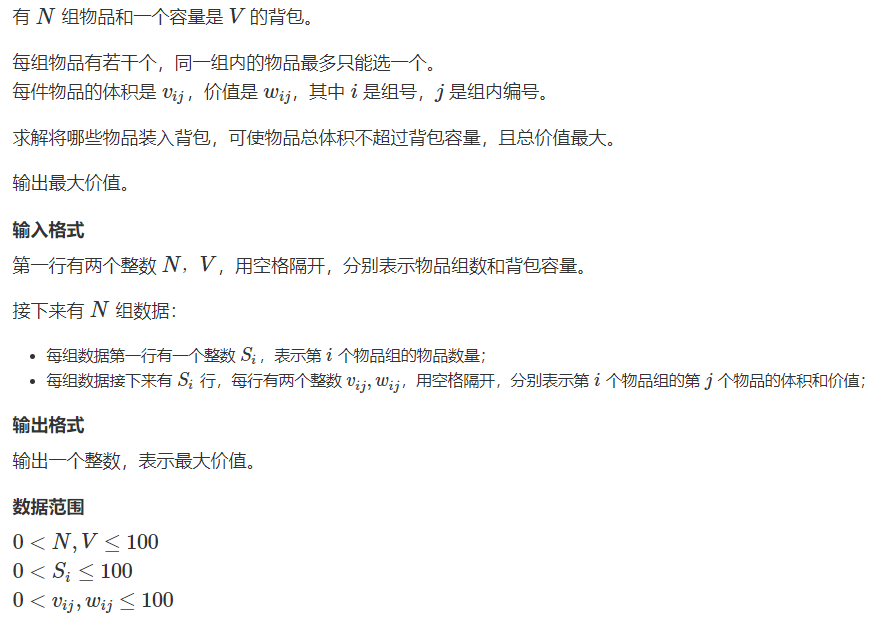
>
>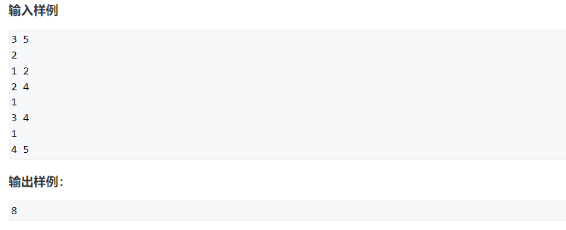

枚举第i组物品选哪个或不选。

> 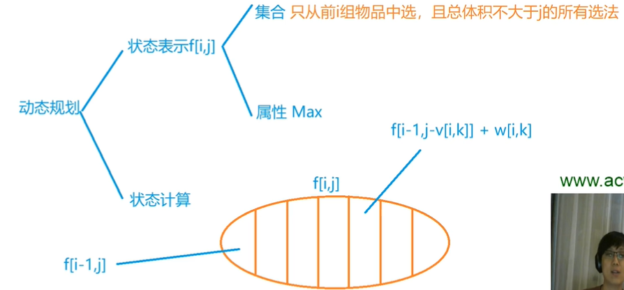

```cpp
/*有 N 组物品和一个容量是 V 的背包。
每组物品有若干个，同一组内的物品最多只能选一个。
每件物品的体积是 vij，价值是 wij，其中 i 是组号，j 是组内编号。
求解将哪些物品装入背包，可使物品总体积不超过背包容量，且总价值最大。输出最大价值。
*/
#include <iostream>
using namespace std;

const int N = 110;

int n, m;
int v[N][N], w[N][N], s[N];  //s存每组物品个数
int f[N];

int main()
{
    cin >> n >> m;
    for (int i = 1; i <= n; i++) 
    {
        cin >> s[i];
        for (int j = 0; j < s[i]; j++)
            cin >> v[i][j] >> w[i][j];
    }
    
    for (int i = 1; i <= n; i++)  //从前往后枚举每一组物品
        for (int j = m; j >= 0; j--)  //从大到小枚举所有体积
            for (int k = 0; k < s[i]; k++) //枚举每组的所有选择
  	    		if (v[i][k] <= j) //体积还能容下才有更新的必要
                    f[j] = max(f[j], f[j - v[i][k]] + w[i][k]);
    cout << f[m] << endl;
    return 0;
}
```


### 线性DP

当题目涉及到 f[i - 1] 下标时，i要从1开始，否则从0开始。

#### 数字三角形

**题目**

>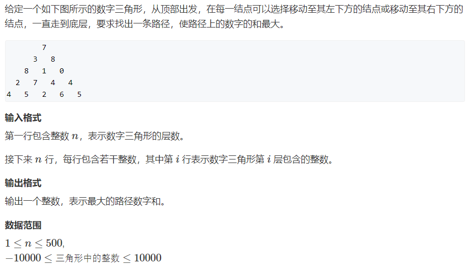
>
>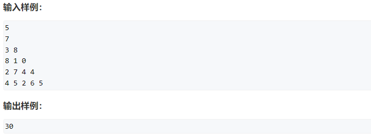

状态计算有两种情况，来自左上和来自右上，取两者的最大值。

> 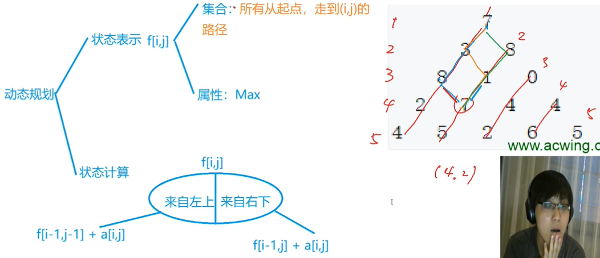

边界问题，需要多初始化一列数据

> 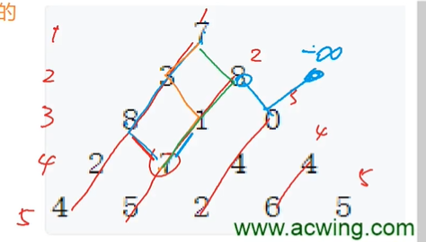

```cpp
/*给定一个如下图所示的数字三角形，从顶部出发，在每一结点可以选择移动至其左下方的结点或移动至其右下方的结点，一直走到底层，要求找出一条路径，使路径上的数字的和最大。
        7
      3   8
    8   1   0
  2   7   4   4
4   5   2   6   5
------------------输入顺序
7
3 8
8 1 0 
2 7 4 4
4 5 2 6 5
*/
#include <iostream>
using namespace std;

const int N = 510, INF = 1e9;

int n;
int a[N][N];  //存储三角形
int f[N][N];

int main()
{
    scanf("%d", &n);
    for (int i = 1; i <= n; i++)
        for (int j = 1; j <= i; j++)
            scanf("%d", &a[i][j]);
    
    for (int i = 0; i <= n; i++)  //为了不处理边界，将所有状态初始化为负无穷
        for (int j = 0; j <= i + 1; j++)  //当处理到最右侧时，其右上为空，需要多初始一列数据
            f[i][j] = -INF;
    
    f[1][1] = a[1][1];  //边界起点是固定值
    for (int i = 2; i <= n; i++)
        for (int j = 1; j <= i; j++)
            f[i][j] = max(f[i - 1][j - 1] + a[i][j], f[i - 1][j] + a[i][j]);
    
    int res = -INF;
    for (int i = 1; i <= n; i++) res = max(res, f[n][i]); //枚举终点，得到最终的答案
    printf("%d\n", res);
    return 0;
}
```


#### 最长上升子序列

##### 最长上升子序列I

**题目**

>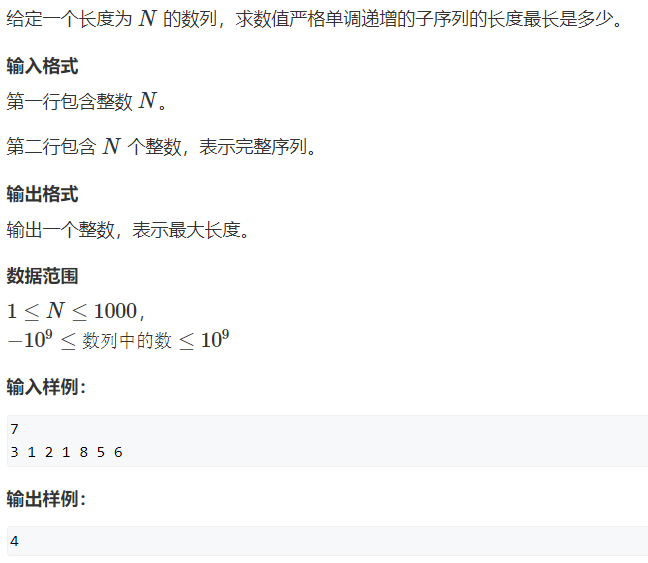

解题思路：用倒数第二个数来分类。

> 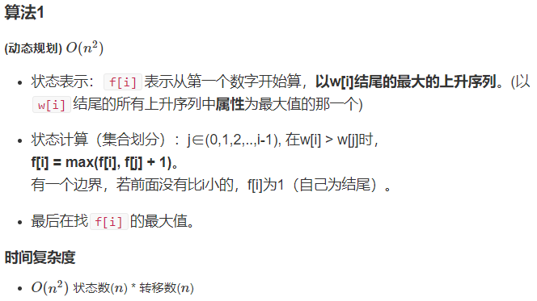

状态转移方程

> 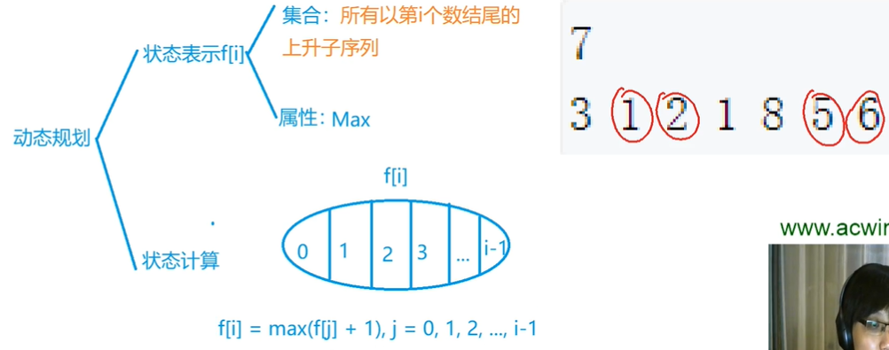

```cpp
//给定一个长度为 N 的数列，求数值严格单调递增的子序列的长度最长是多少。
//1≤N≤1000，−109≤数列中的数≤109
#include <iostream>
#include <algorithm>
using namespace std;

const int N = 1010;

int n;
int a[N], f[N];

int main()
{
    scanf("%d", &n);
    for (int i = 1; i <= n; i++) scanf("%d", &a[i]);
    
    for (int i = 1; i <= n; i++)
    {
        f[i] = 1; //只有a[i]一个数
        for (int j = 1; j < i; j++)
            if (a[j] < a[i])
                f[i] = max(f[i], f[j] + 1);
    }
    
    int res = 0;
    for (int i = 1; i <= n; i++) res = max(res, f[i]);
    printf("%d\n", res);
    return 0;
}
```

输出最长的子序列

动态规划记录方案就是将状态转移存下来。

```cpp

#include <iostream>
#include <algorithm>
using namespace std;

const int N = 1010;

int n;
int a[N], f[N], g[N];  //用g数组来保存下每个转移是怎么做出来的

int main()
{
    scanf("%d", &n);
    for (int i = 1; i <= n; i++) scanf("%d", &a[i]);
    
    for (int i = 1; i <= n; i++)
    {
        f[i] = 1; 
        g[i] = 0; //表示只有一个数
        for (int j = 1; j < i; j++)
            if (a[j] < a[i])
                if (f[i] < f[j] + 1)
                {
                    f[i] = f[j] + 1; //更新f[i]
                    g[i] = j; //记录哪个状态是从哪个状态转移的
                }
    }
    int k = 1;  //记录最优解下标
    for (int i = 1; i <= n; i++)
        if (f[k] < f[i])   //f[k]表示以k结尾的序列
            k = i;
    printf("%d\n", f[k]); 
    
    for (int i = 0, len = f[k]; i < len; i++) //倒着输出
    {
        printf("%d", a[k]);
        k = g[k];  //g数组记录哪个状态是从哪个状态转移的
    }
    return 0;
}
```


#### 最长上升子序列II

**题目**

>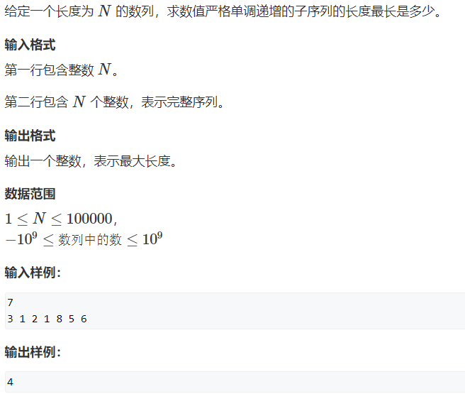

解题思路：

> 首先数组a中存输入的数（原本的数），开辟一个数组f用来存结果，最终数组f的长度就是最终的答案；
>
> 假如数组f现在存了数，当到了数组a的第i个位置时，首先判断a[i] > f[cnt] ？ 若是大于则直接将这个数添加到数组f中，即f[++cnt] = a[i]; 这个操作时显然的。
>
> 当a[i] <= f[cnt] 的时,我们就用a[i]去替代数组f中的第一个大于等于a[i]的数，因为在整个过程中我们维护的数组f 是一个递增的数组，所以我们可以用二分查找在 logn 的时间复杂的的情况下直接找到对应的位置，然后替换，即f[l] = a[i]。

我们用a[i]去替代f[i]的含义是：

> 以a[i]为最后一个数的严格单调递增序列,这个序列中数的个数为l个。
>
> 这样当我们遍历完整个数组a后就可以得到最终的结果。

时间复杂度分析：O(nlogn)， 序列具有线性特性。

> 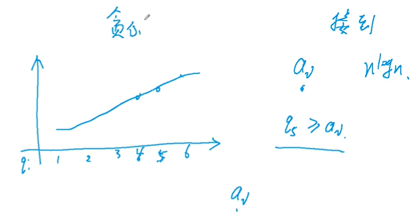

```cpp
/*给定一个长度为 N 的数列，求数值严格单调递增的子序列的长度最长是多少。
1≤N≤100000，−109≤数列中的数≤109
*/
#include <iostream>
#include <algorithm>
using namespace std;

const int N = 100010;

int n;
int a[N];  //存储每个数
int q[N];  //所有不同长度的上升子序列结尾的最小值

int main()
{
    scanf("%d", &n);
    for (int i = 0; i < n; i++) scanf("%d", &a[i]);
    
    int len = 0;
    q[0] = -2e9;  //边界
    for (int i = 0; i < n; i++)
    {
        int l = 0, r = len;
        while (l < r)
        {
            int mid = l + r + 1 >> 1;
            if (q[mid] < a[i]) l = mid;
            else r = mid - 1;
        }
        len = max(len, r + 1);
        q[r + 1] = a[i];
    }
    printf("%d\n", len);
    return 0;
}
```


#### 最长公共子序列

**题目**

>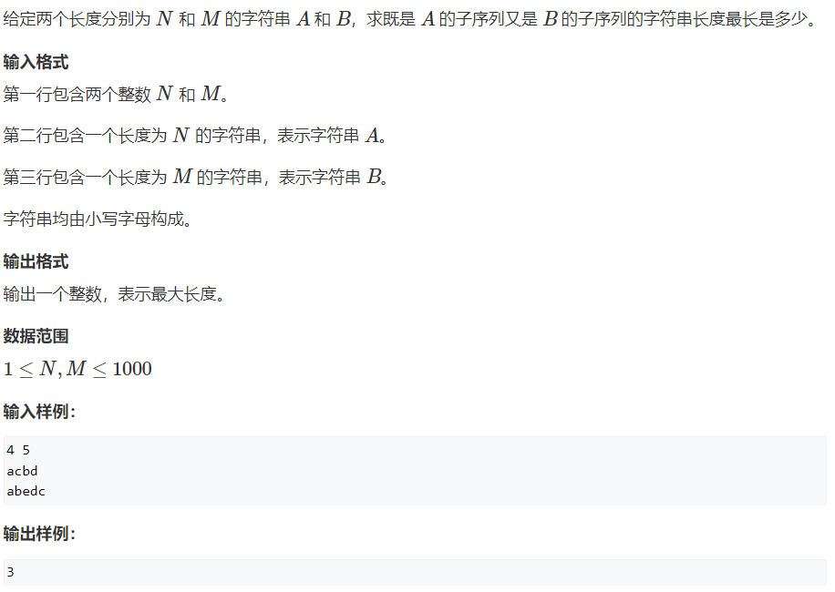

其中00的那种情况包含在了后面01或10情况中。

> 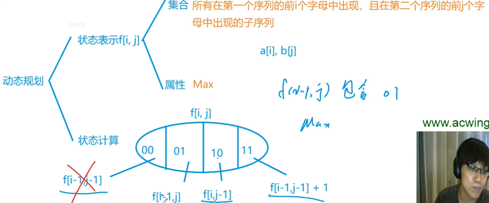

求最大值分成的子问题可以有重叠，但是求数量时不行

> 

详细思路

> 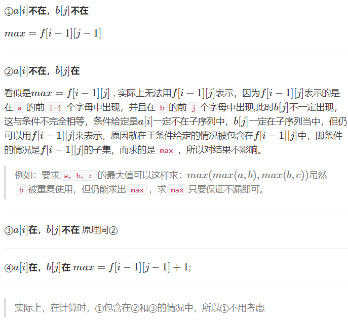

```cpp
//给定两个长度分别为 N 和 M 的字符串 A 和 B，求既是 A 的子序列又是 B 的子序列的字符串长度最长是多少。
#include <iostream>
#include <algorithm>
using namespace std;

const int N = 1010;

int n, m;
char a[N], b[N];//表示两个字符串
int f[N][N];   //表示状态

int main()
{
    scanf("%d%d", &n, &m);
    scanf("%s%s", a + 1, b + 1);
    
    for (int i = 1; i <= n; i++)
        for (int j = 1; j <= m; j++)
        {
            f[i][j] = max(f[i - 1][j], f[i][j - 1]);
            if (a[i] == b[j]) f[i][j] = max(f[i][j], f[i - 1][j - 1] + 1);
        }
    printf("%d\n", f[n][m]);
    return 0;
}
```


#### 编辑距离

##### 最短编辑距离

**题目**

>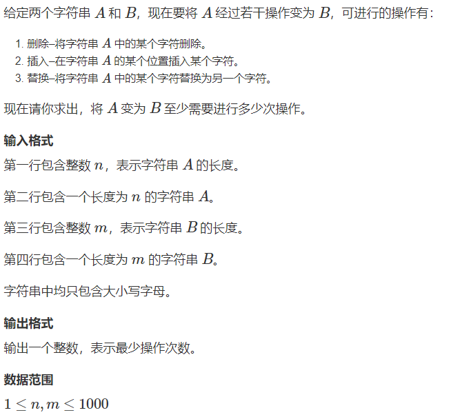
>
>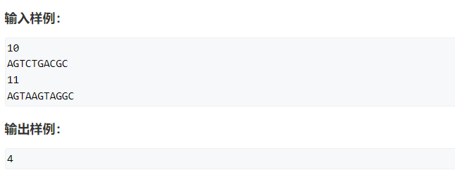

时间复杂度：O(n^2^)

解题思路：

> 有三种操作，所以有三个子集，ok子集划分完了
> 考虑状态转移的时候
> 先考虑如果我没有进行这个操作应该是什么状态
> 然后考虑你进行这一步操作之后会对你下一个状态造成什么影响
> 然后再加上之前状态表示中你决策出来的那个DP属性
> 这样就可以自然而然地搞出来转移方程啦

```cpp
1)删除操作：把a[i]删掉之后a[1~i]和b[1~j]匹配
            所以之前要先做到a[1~(i-1)]和b[1~j]匹配
            f[i-1][j] + 1
2)插入操作：插入之后a[i]与b[j]完全匹配，所以插入的就是b[j] 
            那填之前a[1~i]和b[1~(j-1)]匹配
            f[i][j-1] + 1 
3)替换操作：把a[i]改成b[j]之后想要a[1~i]与b[1~j]匹配 
            那么修改这一位之前，a[1~(i-1)]应该与b[1~(j-1)]匹配
            f[i-1][j-1] + 1
            但是如果本来a[i]与b[j]这一位上就相等，那么不用改，即
            f[i-1][j-1] + 0

好的那么f[i][j]就由以上三个可能状态转移过来，取个min
```

细节问题：初始化怎么搞

> 先考虑有哪些初始化嘛
>
> 1. 你看看在for遍历的时候需要用到的但是你事先没有的
>    （往往就是什么0啊1啊之类的）就要预处理 
> 2. 如果要找min的话别忘了INF
>      要找有负数的max的话别忘了-INF

ok对应的： 

> 1. `f[0][i]`如果a初始长度就是0，那么只能用插入操作让它变成b
>     `f[i][0]`同样地，如果b的长度是0，那么a只能用删除操作让它变成b
> 2. `f[i][j] `= INF //虽说这里没有用到，但是把考虑到的边界都写上还是保险

>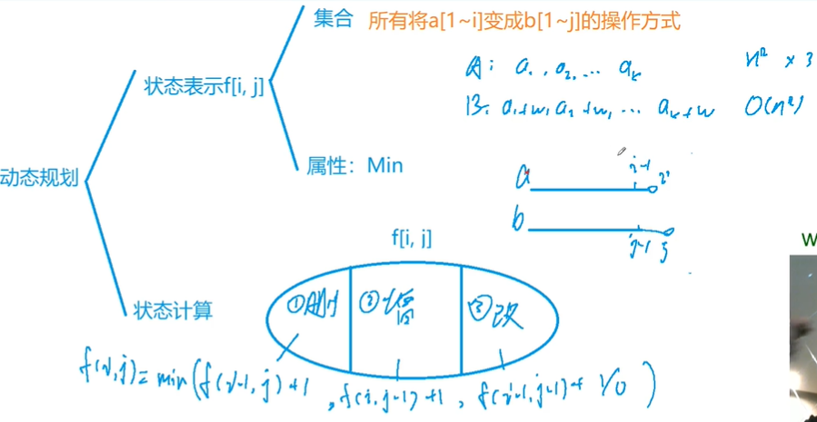

```cpp
/*给定两个字符串 A 和 B，现在要将 A 经过若干操作变为 B，可进行的操作有：
删除–将字符串 A 中的某个字符删除。
插入–在字符串 A 的某个位置插入某个字符。
替换–将字符串 A 中的某个字符替换为另一个字符。
现在请你求出，将 A 变为 B 至少需要进行多少次操作。
*/
#include <iostream>
#include <algorithm>
using namespace std;

const int N = 1010;

int n, m;  //A与B对应的长度
char a[N], b[N];
int f[N][N];

int main()
{
    scanf("%d%s", &n, a + 1);
    scanf("%d%s", &m, b + 1);
    
    for (int i = 0; i <= m; i++) f[0][i] = i;  //初始化
    for (int i = 0; i <= n; i++) f[i][0] = i;  //初始化
    
    for (int i = 1; i <= n; i++)
        for (int j = 1; j <= m; j++)
        {
            f[i][j] = min(f[i - 1][j] + 1, f[i][j - 1] + 1);
            if (a[i] == b[j]) f[i][j] = min(f[i][j], f[i - 1][j - 1]);
            else f[i][j] = min(f[i][j], f[i - 1][j - 1] + 1);
        }
    printf("%d\n", f[n][m]);
    return 0;
}
```


#### 编辑距离

**题目**

>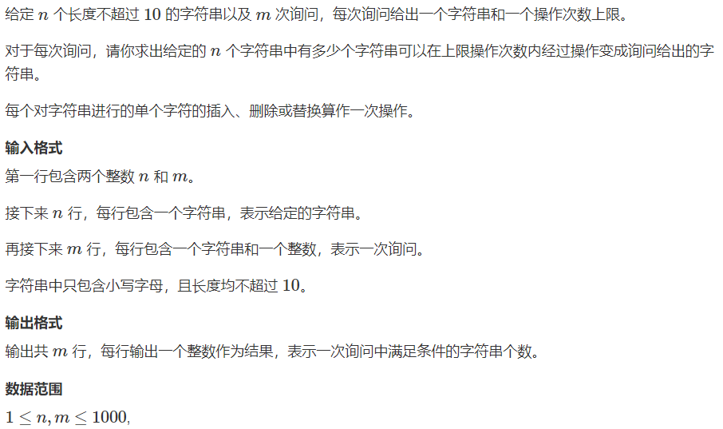
>
>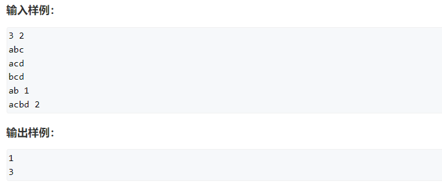

思路同上一题。

```cpp
/*给定 n 个长度不超过 10 的字符串以及 m 次询问，每次询问给出一个字符串和一个操作次数上限。
对于每次询问，请你求出给定的 n 个字符串中有多少个字符串可以在上限操作次数内经过操作变成询问给出的字符串。
每个对字符串进行的单个字符的插入、删除或替换算作一次操作。
*/
#include <iostream>
#include <cstring>
#include <algorithm>
using namespace std;

const int N = 15, M = 1010;

int n, m;
int f[N][N];
char str[M][N];

int edit_distance(char a[], char b[])
{
    int la = strlen(a + 1), lb = strlen(b + 1);
    
    for (int i = 0; i <= lb; i++) f[0][i] = i;
    for (int i = 0; i <= la; i++) f[i][0] = i;
    
    for (int i = 1; i <=la; i++)
        for (int j = 1; j <= lb; j++)
        {
            f[i][j] = min(f[i - 1][j] + 1, f[i][j - 1] + 1);
            f[i][j] = min(f[i][j], f[i - 1][j - 1] + (a[i] != b[j]));        
        }
    return f[la][lb];
}

int main()
{
    scanf("%d%d", &n, &m);
    for (int i = 0; i < n; i++) scanf("%s", str[i] + 1);//编辑距离从1下标比较方便
    
    while (m--)
    {
        char s[N];
        int limit;
        scanf("%s%d", s + 1, &limit);
        
        int res = 0;
        for (int i = 0; i < n; i++)
            if (edit_distance(str[i], s) <= limit)
                res++;
        printf("%d\n", res);
    }
}
```


### 区间DP

区间DP常用模板

所有的区间dp问题，第一维都是枚举区间长度，一般 len = 1 用来初始化，枚举从 len = 2 开始，第二维枚举起点 i （右端点 j 自动获得，j = i + len - 1）

> 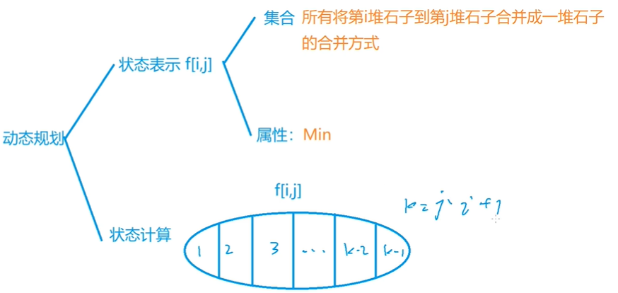

```cpp
for (int i = 1; i <= n; i++) {
    dp[i][i] = 初始值
}
for (int len = 2; len <= n; len++)           //区间长度
    for (int i = 1; i + len - 1 <= n; i++) 
    { //枚举起点
        int j = i + len - 1;                 //区间终点
        for (int k = i; k < j; k++) 
        {        //枚举分割点，构造状态转移方程
            dp[i][j] = max(dp[i][j], dp[i][k] + dp[k + 1][j] + w[i][j]);
        }
    }
```

#### 石子合并

**题目**

>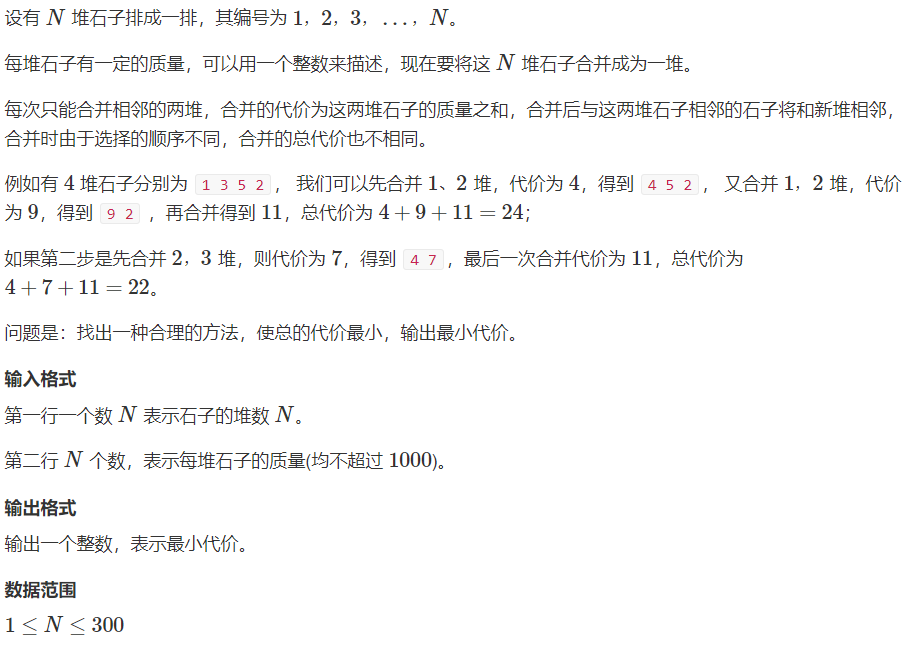
>
>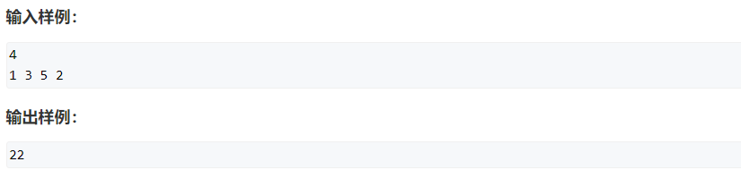

状态表示的是某一个区间。

以最后一次分界线的位置分类，枚举最后一次合并。

答案是`f[1][N]`表示将第1堆到第N堆合并起来的最小代价。

解题思路

> 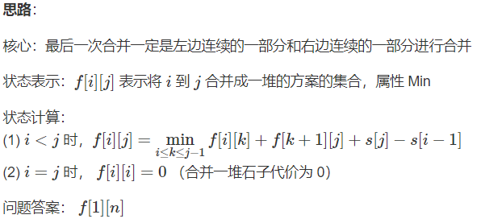

状态转移方程

> 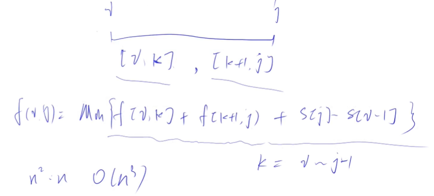

```cpp
/*设有 N 堆石子排成一排，其编号为 1，2，3，…，N。
每堆石子有一定的质量，可以用一个整数来描述，现在要将这 N 堆石子合并成为一堆。
每次只能合并相邻的两堆，合并的代价为这两堆石子的质量之和，合并后与这两堆石子相邻的石子将和新堆相邻，合并时由于选择的顺序不同，合并的总代价也不相同。
例如有 4 堆石子分别为 1 3 5 2， 我们可以先合并 1、2 堆，代价为 4，得到 4 5 2， 又合并 1，2 堆，代价为 9，得到 9 2 ，再合并得到 11，总代价为 4+9+11=24；
如果第二步是先合并 2，3 堆，则代价为 7，得到 4 7，最后一次合并代价为 11，总代价为 4+7+11=22。
问题是：找出一种合理的方法，使总的代价最小，输出最小代价。
*/
#include <iostream>
#include <algorithm>
using namespace std;

const int N = 310;

int n;
int s[N];
int f[N][N];

int main()
{
    scanf("%d", &n);
    for (int i = 1; i <= n; i++) scanf("%d", &s[i]);
    
    for (int i = 1; i <= n; i++) s[i] += s[i - 1];  //前缀和
    
    // 区间 DP 枚举套路：长度+左端点 
    for (int len = 2; len <= n; len++) // len表示i和j堆下标的差值
        for (int i = 1; i + len - 1 <= n; i++) //枚举起点 
        {
            int l = i, r = i + len - 1;  //左右端点  
            f[l][r] = 1e8;   //初始化
            for (int k = l; k < r; k++) 
                f[l][r] = min(f[l][r], f[l][k] + f[k + 1][r] + s[r] - s[l - 1]);
        }
    printf("%d\n", f[1][n]);
    return 0;
}
```


### 计数类DP

#### 整数划分

**题目**

>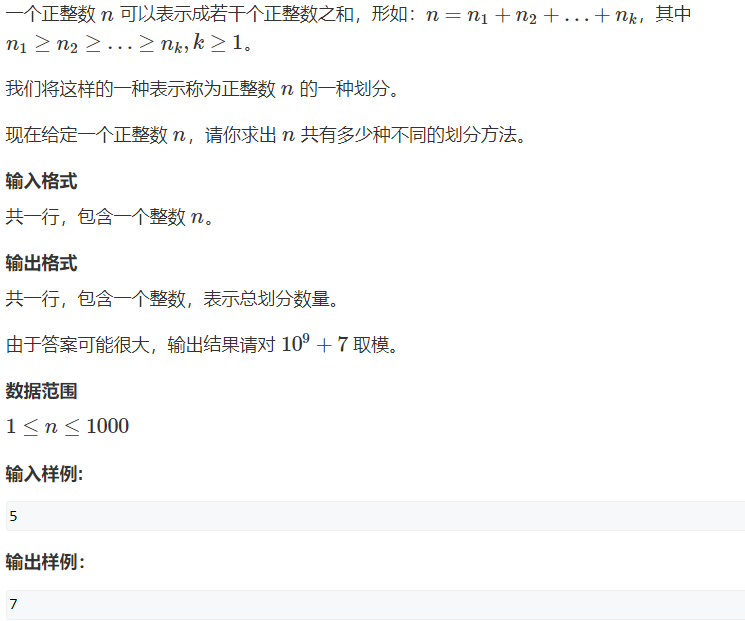

##### 二维

完全背包解法思路：

把1,2,3, … n分别看做n个物体的体积，这n个物体均无使用次数限制，问**恰好**能装满总体积为n的背包的总方案数（完全背包问题变形）

> 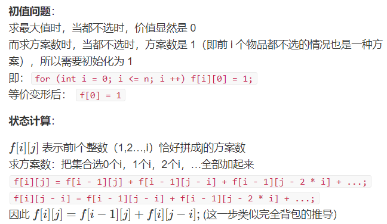
>
> 

完全背包解法 O(n^3^)

> 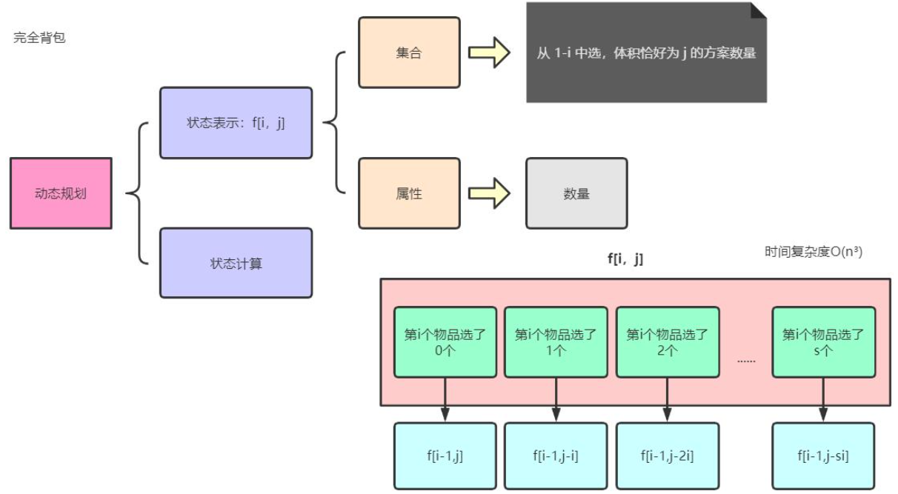

```cpp
// f[i][j] = f[i - 1][j] + f[i][j - i]
#include <iostream>

using namespace std;

const int N = 1e3 + 7, mod = 1e9 + 7;

int f[N][N];

int main() {
    int n;
    cin >> n;

    for (int i = 0; i <= n; i ++) {
        f[i][0] = 1; // 容量为0时，前 i 个物品全不选也是一种方案
    }

    for (int i = 1; i <= n; i ++) {
        for (int j = 0; j <= n; j ++) {
            f[i][j] = f[i - 1][j] % mod; // 特殊 f[0][0] = 1
            if (j >= i) f[i][j] = (f[i - 1][j] + f[i][j - i]) % mod;
        }
    }
    cout << f[n][n] << endl;
    return 0;
}
```

##### 一维

>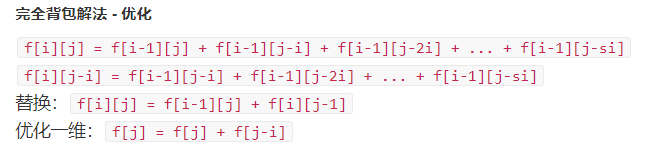

```cpp
/*一个正整数 n 可以表示成若干个正整数之和，形如：n=n1+n2+…+nk，其中 n1≥n2≥…≥nk,k≥1。
我们将这样的一种表示称为正整数 n 的一种划分。
现在给定一个正整数 n，请你求出 n 共有多少种不同的划分方法。
*/
#include <iostream>
#include <algorithm>
using namespace std;

const int N = 1010, mod = 1e9 + 7;

int n;
int f[N];

int main()
{
    cin >> n;
    
    f[0] = 1;
    for (int i = 1; i <= n; i++)
        for (int j = i; j <= n; j++)
            f[j] = (f[j] + f[j - i]) % mod;
    cout << f[n] << endl;
    return 0;
}
```

##### 其他解法

状态表示：`f[i][j]`表示总和为i，总个数为j的方案数

状态转移方程：`f[i][j] = f[i - 1][j - 1] + f[i - j][j]`

> 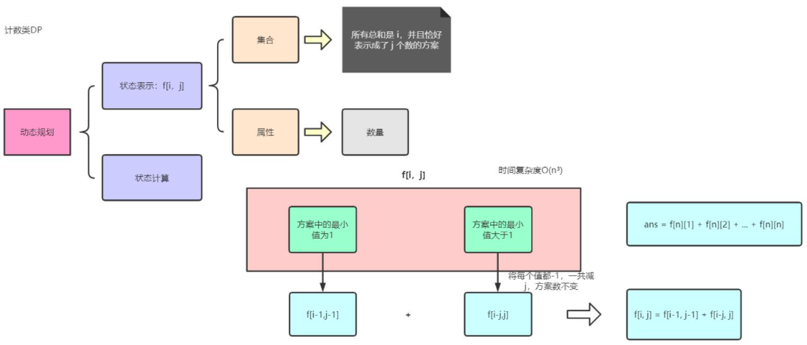

```cpp
#include <iostream>
#include <algorithm>
using namespace std;

const int N = 1010, mod = 1e9 + 7;

int n;
int f[N][N];

int main()
{
    cin >> n;
    f[0][0] = 1;
    for (int i = 1; i <= n; i++)
        for (int j = 1; j <= i; j++)
            f[i][j] = (f[i - 1][j - 1] + f[i - j][j]) % mod;
    int res = 0;
    for (int i = 1; i <= n; i++) res = (res + f[n][i]) % mod;
    cout << res << endl;
    return 0;
}
```


### 数位统计DP

核心思想：分情况讨论。

#### 计数问题

**题目**

>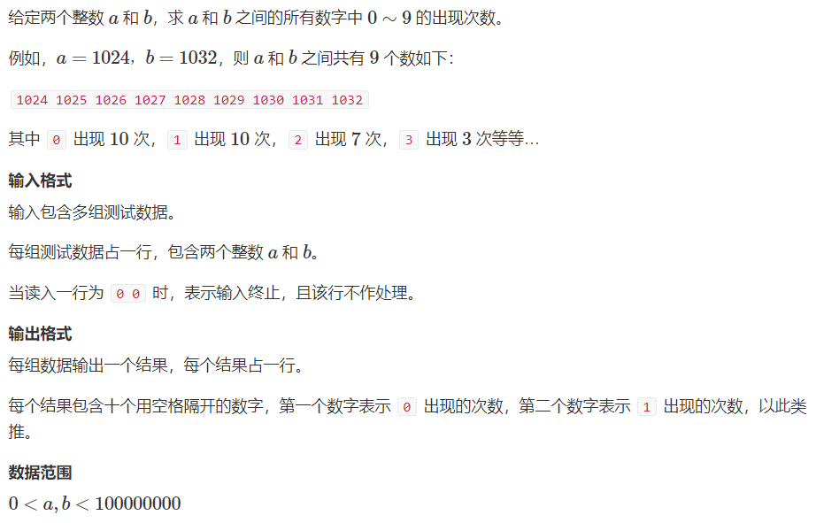
>
>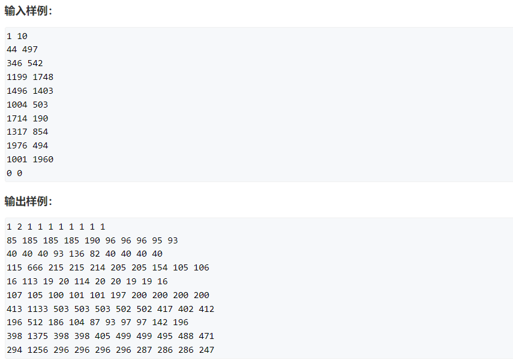

参考思路1

> 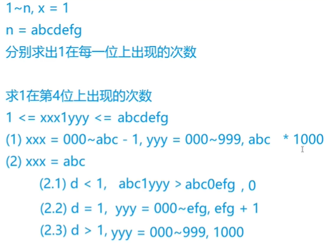

参考思路2

> 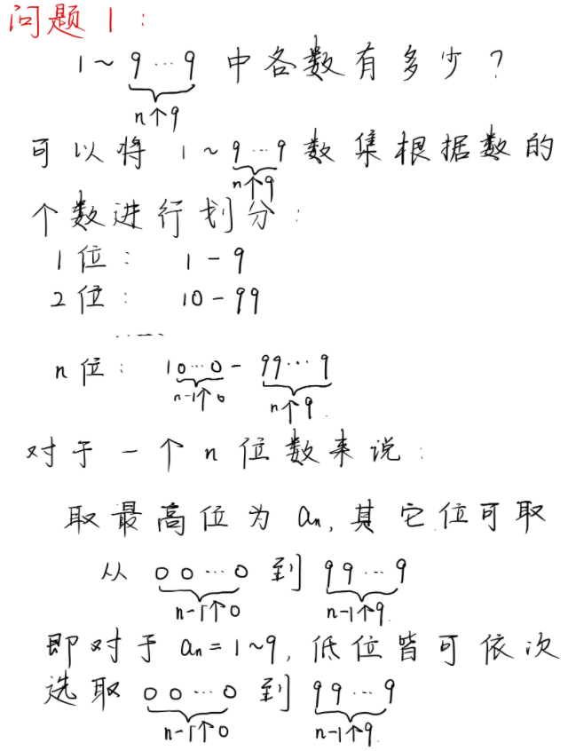
>
> 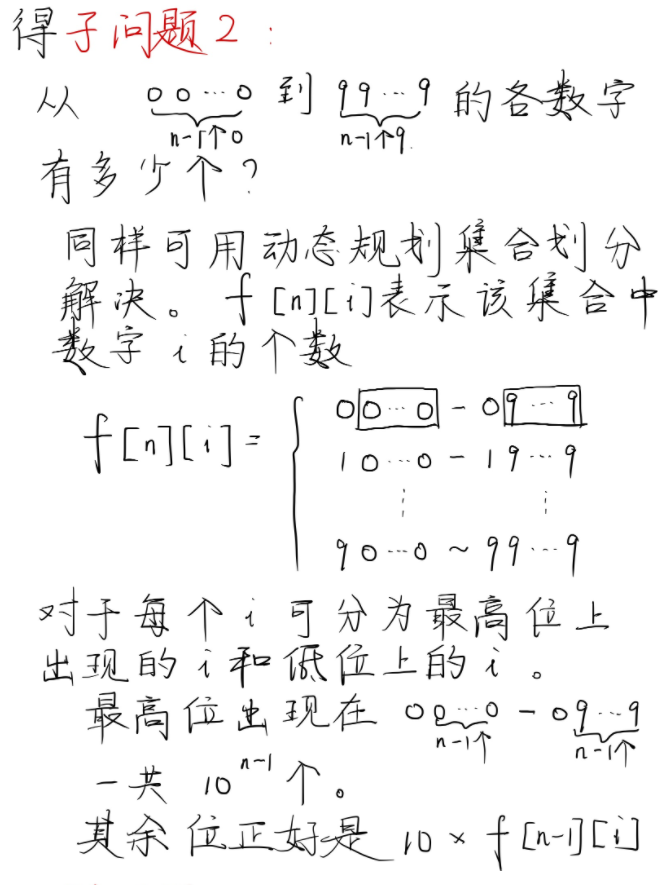
>
> 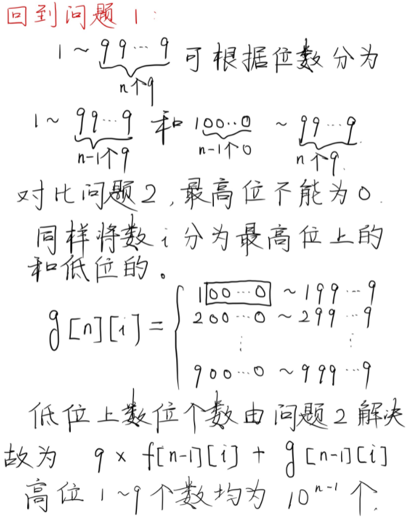
>
> 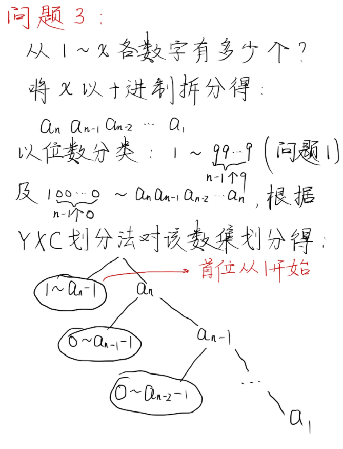
>
> 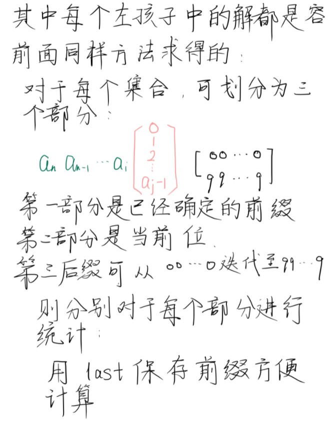

```cpp
/*给定两个整数 a 和 b，求 a 和 b 之间的所有数字中 0∼9 的出现次数。
例如，a=1024，b=1032，则 a 和 b 之间共有 9 个数如下：
1024 1025 1026 1027 1028 1029 1030 1031 1032
其中 0 出现 10 次，1 出现 10 次，2 出现 7 次，3 出现 3 次等等…
*/
#include <iostream>
#include <vector>

using namespace std;

int base[10];
int f[10][10];
int g[10][10];

void init()
{
    base[0] = 1;
    for(int i = 1 ; i <= 9 ; i++) base[i] = base[i-1]*10;

    //从00……0 - 99……9 的各位数字有多少个，其中i为数字个数（包含前导零）
    for(int i = 0 ; i <= 9 ; i++) f[1][i] = 1;
    for(int i = 2 ; i <= 9 ; i++)
        for(int j = 0 ; j <= 9 ; j++)
            f[i][j] = f[i-1][j]*10 + base[i-1];

    //从1 - 99……9 的各位数字有多少个，其中i为数字个数（不包含前导零）
    for(int i = 1 ; i <= 9 ; i++) g[1][i] = 1;//循环从1开始
    for(int i = 2 ; i <= 9 ; i++) {
        g[i][0] = g[i-1][0] + f[i-1][0]*9;
        for(int j = 1 ; j <= 9 ; j++)
            g[i][j] = g[i-1][j] + f[i-1][j]*9 + base[i-1];
    }
}

vector<int> dp(int n)
{
    vector<int> ans(10,0); //记录答案
    if(n<=0) return ans; //边界条件

    vector<int> nums;
    while(n) nums.push_back(n%10), n/=10;

    vector<int> last(10,0); //记录前缀中各个数字个数

    //统计1 - 99……9(n-1个9)里面各个数字有多少个
    for(int i = 0 ; i <= 9 ; i++) ans[i] = g[nums.size()-1][i];
    //统计大于10……0(n-1个0) 的树里各个数字有多少个
    for(int i = nums.size()-1 ; i >=0 ; i--) {
        //循环变量i可以表示剩下的数字有多少个
        int x = nums[i];
        for(int j = i==nums.size()-1 ; j < x ; j++) { //第一次循环不能有0
            //前缀部分
            for(int k = 0 ; k <= 9 ; k++)
                ans[k] += last[k] * base[i];
            //当前位置部分
            ans[j] += base[i];
            //后缀部分
            for(int k = 0 ; k <= 9 ; k++)
                ans[k] += f[i][k];
        }
        //更新前缀计数器
        last[x] ++;

        //统计叶子节点（这个数本身）
        if(!i) for(int k = 0 ; k <= 9 ; k++) ans[k] += last[k];
    }
    return ans;
}

vector<int> ask(int a, int b)
{
    auto x = dp(b);
    auto y = dp(a-1);
    vector<int> ans;
    for(int i = 0 ; i <= 9 ; i++) ans.push_back(x[i]-y[i]);
    return ans;
}

void print(vector<int> ans)
{
    for(auto x:ans) printf("%d ",x);
    puts("");
}

bool check(int x)
{
    auto t = ask(x,x);
    vector<int> cnt(10,0);
    while(x) cnt[x%10]++,x/=10;
    for(int i = 0 ; i <= 9 ; i++)
        if(cnt[i] != t[i])
            return false;
    return true;
}

int main()
{
    init();

    //这里是一个DEBUG函数
    // for(int i = 1 ; i <= 1000000 ; i*=10) {
    //     if(!check(i))
    //         printf("ERROR:%d\n",i);
    // }

    int a,b;
    while(cin >> a >> b, a||b) {
        if(a>b) swap(a,b);
        auto t = ask(a,b);
        print(t);
    }

    return 0;
}
```


### 状态压缩DP

#### 蒙德里安的梦想

**题目**

>
>
>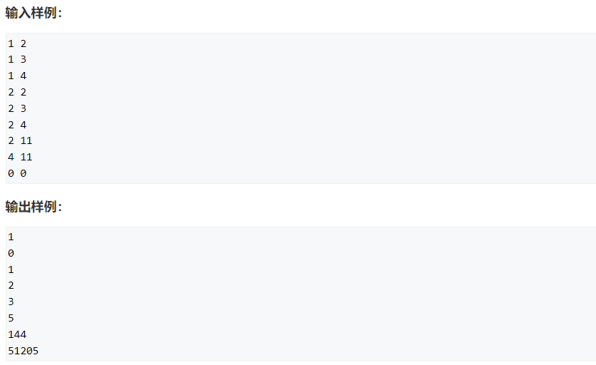

题目

> 

解题思路1

摆放方块的时候，先放横着的，再放竖着的。

总方案数等于只放横着的小方块的合法方案数。

> 如何判断，当前方案数是否合法？ 所有剩余位置能否填充满竖着的小方块。可以按列来看，每一列内部所有连续的空着的小方块需要是偶数个。
>
> 这是一道动态规划的题目，并且是一道 状态压缩的dp：用一个N位的二进制数，每一位表示一个物品，0/1表示不同的状态。因此可以用0→2N−1（N二进制对应的十进制数）0→2N−1（N二进制对应的十进制数）中的所有数来枚举全部的状态。

状态表示

> ==状态表示：``f[i][j]``表示已经将前 i -1 列摆好，且从第i−1列，伸出到第 i 列的状态是 j 的所有方案。==其中j是一个二进制数，用来表示哪一行的小方块是横着放的，其位数和棋盘的行数一致。

状态转移

> 既然第 i 列固定了，我们需要看 第i-2 列是怎么转移到到第 i-1列的（看最后转移过来的状态）。假设此时对应的状态是k（第i-2列到第i-1列伸出来的二进制数，比如00100），k也是一个二进制数，1表示哪几行小方块是横着伸出来的，0表示哪几行不是横着伸出来的。
>
> 它对应的方案数是 f[i−1,k] ，即前i-2列都已摆完，且从第i-2列伸到第i-1列的状态为 k 的所有方案数。
>
> 这个k需要满足什么条件呢?
>
> 首先==k不能和 j在同一行==（如下图）：因为从i-1列到第i列是横着摆放的12的方块，那么i-2列到i-1列就不能是横着摆放的，否则就是1 3的方块了！这与题意矛盾。所以 k和j不能位于同一行。
>
> 既然不能同一行伸出来，那么对应的代码为(k & j ) ==0 ，表示两个数相与，如果有1位相同结果就不是0， (k & j ) ==0表示 k和j没有1位相同， 即没有1行有冲突。
>
> 既然从第i-1列到第i列横着摆的，和第i-2列到第i-1列横着摆的都确定了，那么第i-1列 空着的格子就确定了，这些空着的格子将来用作竖着放。如果 某一列有这些空着的位置，那么该列所有连续的空着的位置长度必须是偶数。
>
> 总共m列，我们假设列下标从0开始，即第0列，第1列……，第m-1列。根据状态表示f[i ] [j] 的定义，我们答案是什么呢？ 请读者返回定义处思考一下。答案是``f[m][0]``， 意思是 前m-1列全部摆好,且从第m-1列到m列状态是0（意即从第m-1列到第m列没有伸出来的）的所有方案，即整个棋盘全部摆好的方案。

时间复杂度

> dp的时间复杂度 =状态表示× 状态转移
>
> 状态表示 `f[i][j]` 第一维i可取11，第二维j（二进制数）可取2^11^ ，所以状态表示 11×2^11^
> 状态转移 也是2^11^
> 所以总的时间复杂度
> 11×2^11^×2^11^≈4×10^7^ 可以过

解题思路2

> 1. 所谓的状态压缩DP，就是用二进制数保存状态。为什么不直接用数组记录呢？因为用一个二进制数记录方便作位运算。前面做过的八皇后，八数码，也用到了状态压缩。
>
> 2. 本题等价于找到所有横放 1 X 2 小方格的方案数，因为所有横放确定了，那么竖放方案是唯一的。
>
> 3. 用f[i][j]记录第i列第j个状态。j状态位等于1表示上一列有横放格子，本列有格子捅出来。转移方程很简单，本列的每一个状态都由上列所有“合法”状态转移过来``f[i][j] += f[i - 1][k]``
>
> 4. 两个转移条件： i 列和 i - 1列同一行不同时捅出来 ； 本列捅出来的状态j和上列捅出来的状态k求或，得到上列是否为奇数空行状态，奇数空行不转移。
>
> 5. 初始化条件`f[0][0] = 1`，第0列只能是状态0，无任何格子捅出来。返回`f[m][0]`。第m + 1列不能有东西捅出来。
>

图解

> 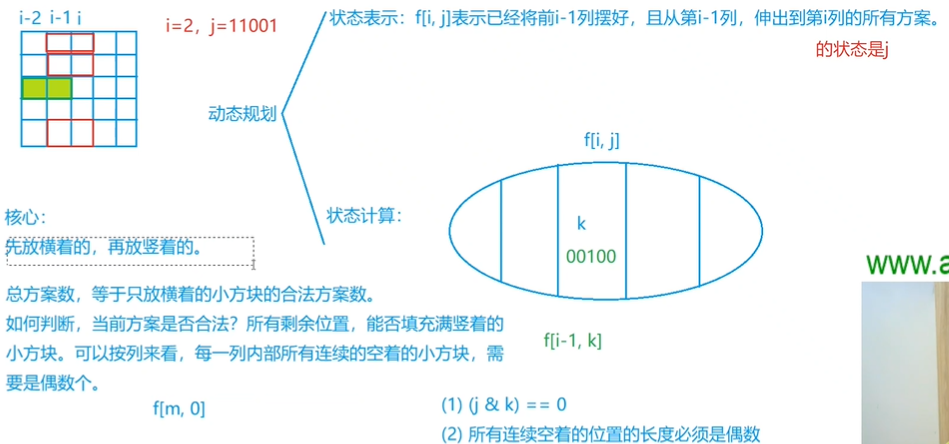

```cpp
/*求把 N×M 的棋盘分割成若干个 1×2 的的长方形，有多少种方案。
例如当 N=2，M=4 时，共有 5 种方案。当 N=2，M=3 时，共有 3 种方案。
*/

/*
下文对  if((j&k )==0 && st[ j| k] )  有清晰的解释！！！
*/
#include<bits/stdc++.h>
using namespace std;

const int N=12, M = 1<< N;  

long long f[N][M] ;// 第一维表示列， 第二维表示所有可能的状态

bool st[M];  //存储每种状态是否有奇数个连续的0，如果奇数个0是无效状态，如果是偶数个零置为true。

//vector<int > state[M];  //二维数组记录合法的状态
vector<vector<int>> state(M);  //两种写法等价:二维数组
int m , n;

int main(){

    while(cin>>n>>m, n||m){ //读入n和m，并且不是两个0即合法输入就继续读入

        //第一部分：预处理1
        //对于每种状态，先预处理每列不能有奇数个连续的0
        //就是对状态j进行枚举, 当出现连续的段有奇数个0时就置为false

        for(int i=0; i< 1<<n; i++){   //1 * 2^n

            int cnt =0 ;//记录连续的0的个数

            bool isValid = true; // 某种状态没有奇数个连续的0则标记为true

            for(int j=0;j<n;j++){ //遍历这一列，从上到下

                 if( i>>j &1){  //i>>j位运算，表示i（i在此处是一种状态）的二进制数的第j位； &1为判断该位是否为1，如果为1进入if
                    if(cnt &1) { //这一位为1，看前面连续的0的个数，如果是奇数（cnt &1为真）则该状态不合法
                        isValid =false;break;
                    } 
                    cnt=0; // 既然该位是1，并且前面不是奇数个0（经过上面的if判断），计数器清零。//其实清不清零没有影响
                 }
                 else cnt++; //否则的话该位还是0，则统计连续0的计数器++。
            }
            if(cnt &1)  isValid =false; //最下面的那一段判断一下连续的0的个数

            st[i]  = isValid; //状态i是否有奇数个连续的0的情况,输入到数组st中
        }

        //第二部分：预处理2
        // 经过上面每种状态 连续0的判断，已经筛掉一些状态。
        //下面来看进一步的判断：看第i-2列伸出来的和第i-1列伸出去的是否冲突

        for(int j=0;j< 1<<n;j++){ //对于第i列的所有状态
            state[j].clear(); //清空上次操作遗留的状态，防止影响本次状态。
            for(int k=0;k< 1<<n;k++){ //对于第i-1列所有状态
                if((j&k )==0 && st[ j| k] ) // 第i-2列伸出来的 和第i-1列伸出来的不冲突(不在同一行) 
                //解释一下st[j | k] 
                //已经知道st[]数组表示的是这一列没有连续奇数个0的情况，
                //我们要考虑的是第i-1列（第i-1列是这里的主体）中从第i-2列横插过来的，还要考虑自己这一列（i-1列）横插到第i列的
                //比如 第i-2列插过来的是k=10101，第i-1列插出去到第i列的是 j =01000，
                //那么合在第i-1列，到底有多少个1呢？自然想到的就是这两个操作共同的结果：两个状态或。 j | k = 01000 | 10101 = 11101
                //这个 j|k 就是当前 第i-1列的到底有几个1，即哪几行是横着放格子的

                    state[j].push_back(k);  //二维数组state[j]表示第j行， 
                    //j表示 第i列“真正”可行的状态，如果第i-1列的状态k和j不冲突则压入state数组中的第j行。
                    //“真正”可行是指：既没有前后两列伸进伸出的冲突；又没有连续奇数个0。
            }

        }

        //第三部分：dp开始

        memset(f,0,sizeof f);  //全部初始化为0，因为是连续读入，这里是一个清空操作。类似上面的state[j].clear()

        f[0][0]=1 ;// 这里需要回忆状态表示的定义，按定义这里是：前第-1列都摆好，且从-1列到第0列伸出来的状态为0的方案数。
        //首先，这里没有-1列，最少也是0列。其次，没有伸出来，即没有横着摆的。即这里第0列只有竖着摆这1种状态。

        for(int i=1;i<= m;i++){ //遍历每一列:第i列合法范围是(0~m-1列)
            for(int j=0; j< 1<<n; j++){  //遍历当前列（第i列）所有状态j
                for( auto k : state[j])    // 遍历第i-1列的状态k，如果“真正”可行，就转移
                    f[i][j] += f[i-1][k];    // 当前列的方案数就等于之前的第i-1列所有状态k的累加。
            }
        }

        //最后答案是什么呢？
        //f[m][0]表示 前m-1列都处理完，并且第m-1列没有伸出来的所有方案数。
        //即整个棋盘处理完的方案数

        cout<< f[m][0]<<endl;
    }
}   
```


#### 最短Hamilton路径

**题目**

>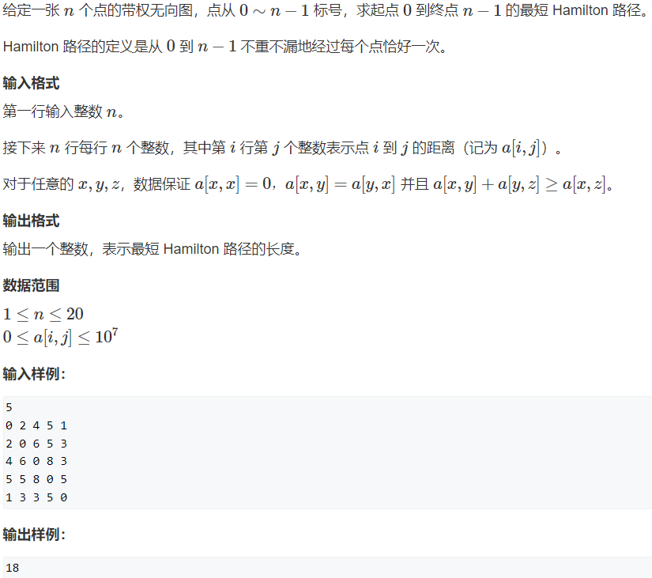

题解

> 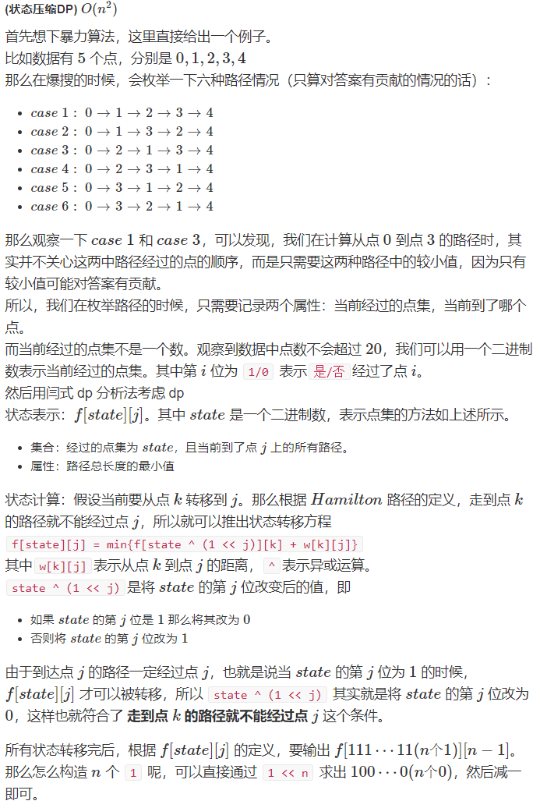

时间复杂度

> 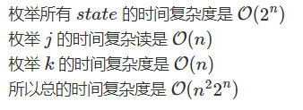

图解

> 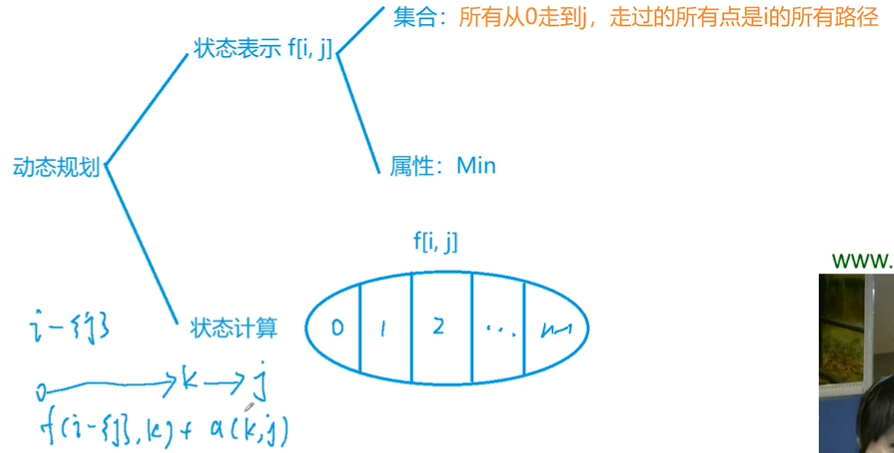

```cpp
/*给定一张 n 个点的带权无向图，点从 0∼n−1 标号，求起点 0 到终点 n−1 的最短 Hamilton 路径。
Hamilton 路径的定义是从 0 到 n−1 不重不漏地经过每个点恰好一次。
*/
#include <bits/stdc++.h>
using namespace std;
int n,f[1<<20][21],i,j,k;
int weight[21][21];
int main()
{
    ios::sync_with_stdio(false);//加快cin的读入速度，但是scanf将会不能用。
    memset(f,0x3f,sizeof(f));//初始化最大值
    cin>>n;
    for (i=0; i<n; i++)
        for (j=0; j<n; j++)
            cin>>weight[i][j];
    f[1][0]=0;//第一个点是不需要任何费用的
    for (i=1; i<(1<<n); i++)//i代表着是一个方案集合，其中每一个位置1和0，代表着这个点经过还是没有经过
        for (j=0; j<n; j++)//枚举当前到了哪一个点
            if ((i>>j & 1))//如果i集合中第j位是1，也就是到达过这个点
                for (k=0; k<n; k++)//枚举到达j的点k
                    if ((i^(1<<j)) >> k & 1)//重点，判断k和j的条件，具体在上面解说
                        f[i][j]=min(f[i][j],f[i^(1<<j)][k]+weight[k][j]);//选择最小值，也就是判断，k点到j点最优，还是以前的方案最优
    cout<<f[(1<<n)-1][n-1];//输出最后的最优值
    return 0;
}
```


### 树形DP

#### 没有上司的舞会

**题目**

>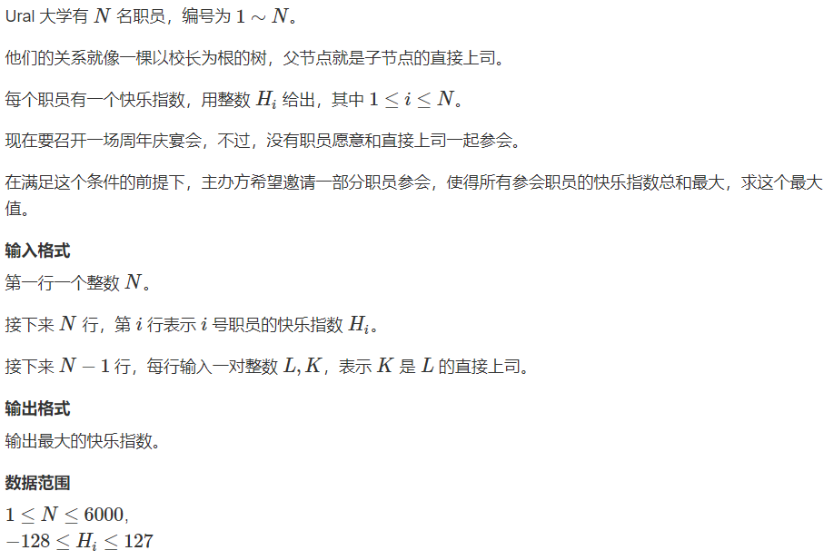
>
>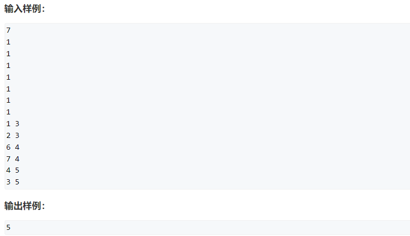

题解

> 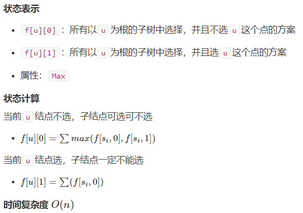

图解

> 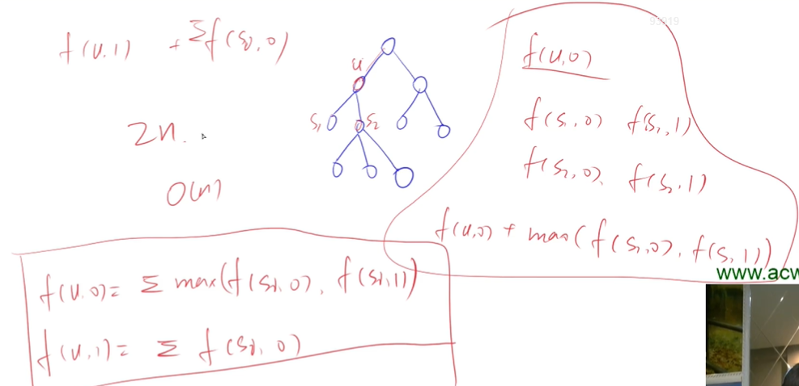

```cpp
/*Ural 大学有 N 名职员，编号为 1∼N。
他们的关系就像一棵以校长为根的树，父节点就是子节点的直接上司。
每个职员有一个快乐指数，用整数 Hi 给出，其中 1≤i≤N。
现在要召开一场周年庆宴会，不过，没有职员愿意和直接上司一起参会。
在满足这个条件的前提下，主办方希望邀请一部分职员参会，使得所有参会职员的快乐指数总和最大，求这个最大值。
*/
#include <cstring>
#include <iostream>
#include <algorithm>

using namespace std;

const int N = 6010;

int n;
int h[N], e[N], ne[N], idx;
int happy[N];
int f[N][2];
bool has_fa[N];

void add(int a, int b)
{
    e[idx] = b, ne[idx] = h[a], h[a] = idx ++ ;
}

void dfs(int u)
{
    f[u][1] = happy[u];

    for (int i = h[u]; ~i; i = ne[i])
    {
        int j = e[i];
        dfs(j);

        f[u][1] += f[j][0];
        f[u][0] += max(f[j][0], f[j][1]);
    }
}

int main()
{
    scanf("%d", &n);

    for (int i = 1; i <= n; i ++ ) scanf("%d", &happy[i]);

    memset(h, -1, sizeof h);
    for (int i = 0; i < n - 1; i ++ )
    {
        int a, b;
        scanf("%d%d", &a, &b);
        add(b, a);
        has_fa[a] = true;
    }

    int root = 1;
    while (has_fa[root]) root ++ ;

    dfs(root);

    printf("%d\n", max(f[root][0], f[root][1]));

    return 0;
}
```


### 记忆化搜索

#### 滑雪

题目

> 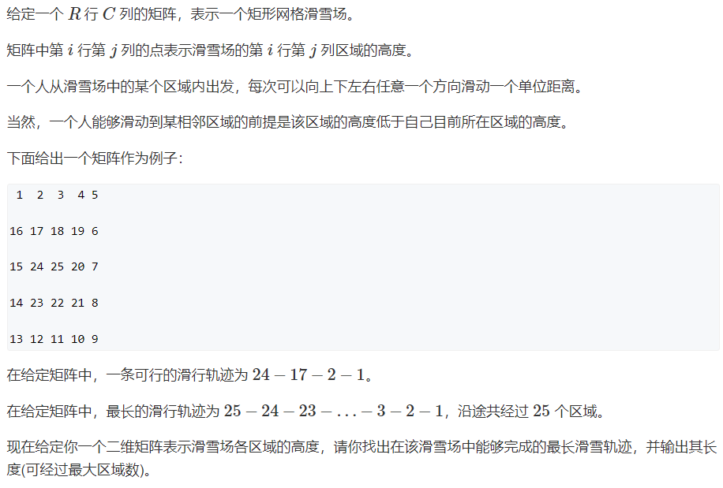
>
> 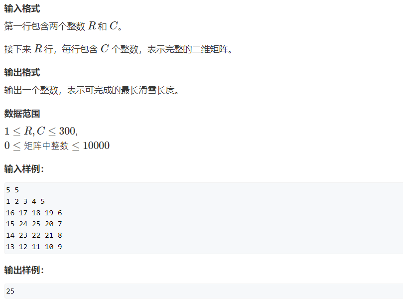

思路

本来是一个dfs的过程，遍历所有的位置，找到从当前位置往下走的最大路径，再取最大值，可是这样做会有很多重复的位置被重新计算过，因此可以利用空间换时间的思想，把遍历过的位置往下走的路径的最大值进行记录，这就是记忆化搜索

注意：``f[][]``二维数组初始化的时候最好统一赋值为-1，如果不进行初始化直接用0判断，此题可以，可是如果遇到一些记忆化搜索的问题要求方案数的时候，初始化是0可能会导致个别情况计算出来的恰好结果是0时，却被认为未遍历过，因此统一赋值为-1就没错了

时间复杂度 O(n^2^)

图解

> 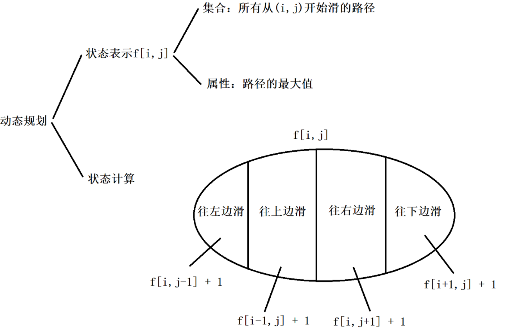

```cpp
#include <cstring>
#include <iostream>
#include <algorithm>

using namespace std;

const int N = 310;

int n, m;
int g[N][N];
int f[N][N];

int dx[4] = {-1, 0, 1, 0}, dy[4] = {0, 1, 0, -1};

int dp(int x, int y)
{
    int &v = f[x][y];
    if (v != -1) return v;

    v = 1;
    for (int i = 0; i < 4; i ++ )
    {
        int a = x + dx[i], b = y + dy[i];
        if (a >= 1 && a <= n && b >= 1 && b <= m && g[x][y] > g[a][b])
            v = max(v, dp(a, b) + 1);
    }
    return v;
}

int main()
{
    scanf("%d%d", &n, &m);
    for (int i = 1; i <= n; i ++ )
        for (int j = 1; j <= m; j ++ )
            scanf("%d", &g[i][j]);

    memset(f, -1, sizeof f);

    int res = 0;
    for (int i = 1; i <= n; i ++ )
        for (int j = 1; j <= m; j ++ )
            res = max(res, dp(i, j));

    printf("%d\n", res);

    return 0;
}
```


