## 贪心学习 - AcWing - HQ

[TOC]

----

### 注意内容

- 

----

### 目录

> 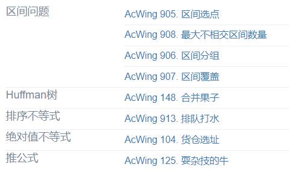


### 贪心算法 - 算法模板

贪心—>猜

一般贪心算法模板

```cpp
#include <algorithm>

using namespace std;

const int N = 100005;

int n, res;
int a[N];

int main()
{
    scanf("%d", &n);
    for (int i = 0; i < n; i ++ ) scanf("%d", &a[i]);

    sort(a, a + n);

    for (int i = 0; i < n; i ++ ) res += abs(a[i] - a[n >> 1]);
    printf("%d\n", res);

    return 0;
}
```


### 区间问题

#### 区间选点

**题目**

>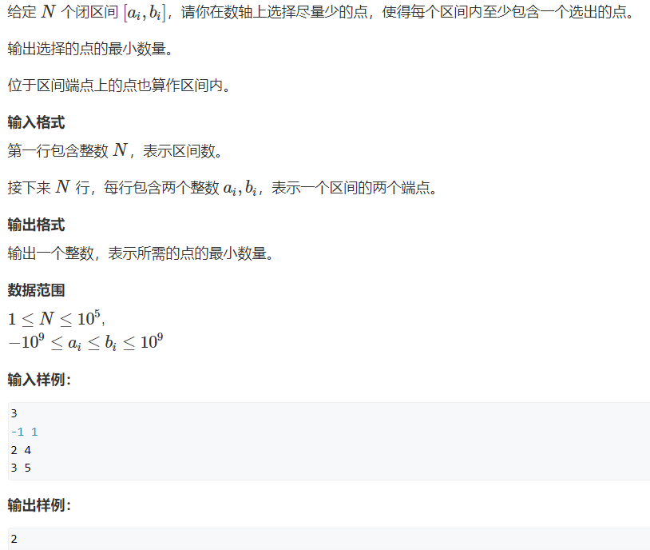

题解

> 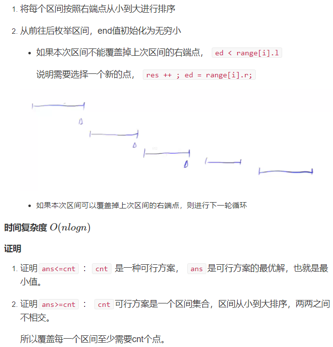

图解

> 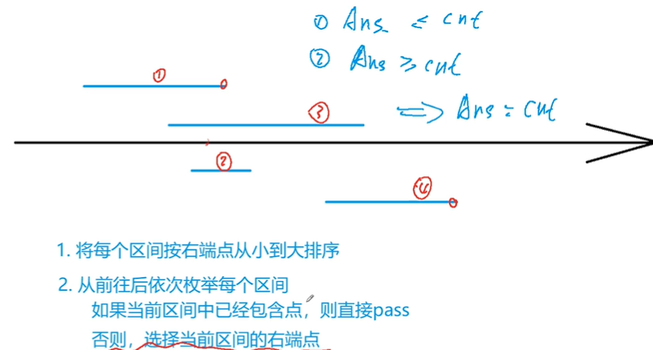
>
> 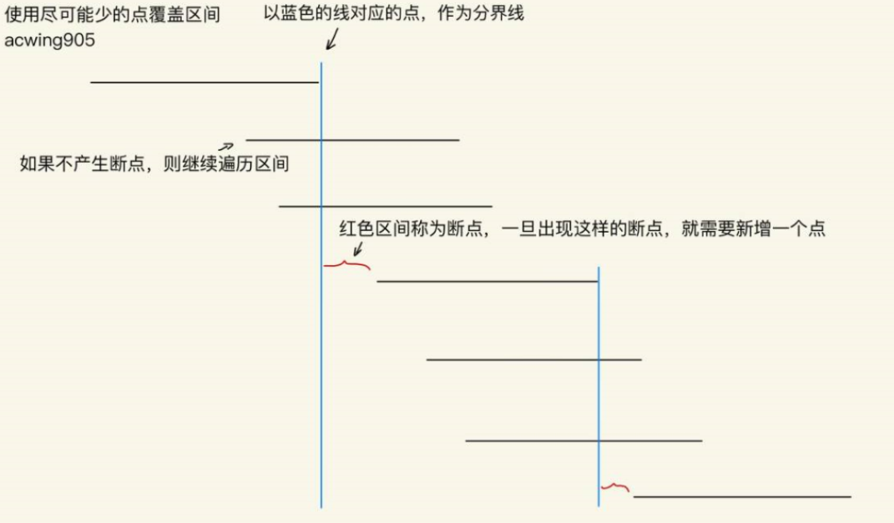

```cpp
/*给定 N 个闭区间 [ai,bi]，请你在数轴上选择尽量少的点，使得每个区间内至少包含一个选出的点。
输出选择的点的最小数量。位于区间端点上的点也算作区间内。
*/
#include <iostream>
#include <algorithm>
using namespace std;

const int N = 100010;

int n;
struct Range  //区间
{
    int l, r;
    bool operator< (const Range &W) const
    {
        return r < W.r;
    }
}range[N];

int main()
{
    scanf("%d", &n);
    for (int i = 0; i < n; i++)
    {
        int l, r;
        scanf("%d%d", &l, &r);
        range[i] = {l, r};
    }
    sort(range, range + n);
    
    int res = 0, ed = -2e9;  // res表示当前选择点的数量，ed表示上一个点的下标
	for (int i = 0; i < n; i++)
    	if (range[i].l > ed)
        {
            res++;
            ed = range[i].r;
        }
    printf("%d\n", res);
    return 0;
}
```


#### 最大不相交区间数量

**题目**

>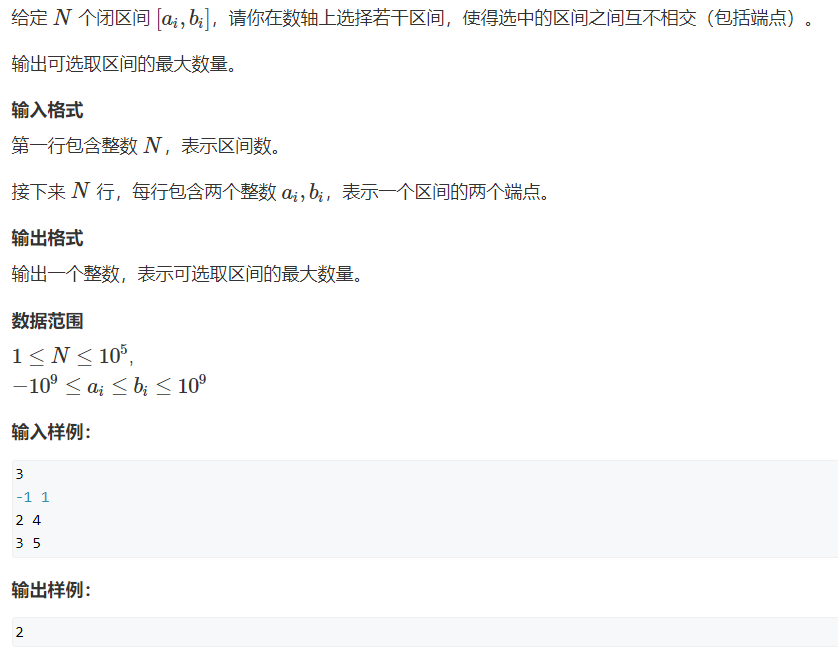

时间复杂度：(贪心) O(nlogn)
这道题也可以按左端点最小到大排序。

即排完序后的线段，在数组位置靠前线段左端点 < 数组位置靠后线段的左端点。
即对于每个线段i，要找到一个j使得，`Li>Rj(loclast+1<=j<i) `，所以我们搞个前缀min就行了。

注释：这里的loclast指上一个选的线段的位置。

```cpp
/*给定 N 个闭区间 [ai,bi]，请你在数轴上选择若干区间，使得选中的区间之间互不相交（包括端点）。
输出可选取区间的最大数量。
*/
#include <algorithm>
#include <iostream>
using namespace std;

const int N = 100010;

int n;
struct Range
{
    int l, r;
    bool operator< (const Range &W) const
    {
        return r < W.r;
    }
}range[N];

int main()
{
    scanf("%d", &n);
    for (int i = 0; i < n; i++)
    {
        int l, r;
        scanf("%d%d", &l, &r);
        range[i] = {l, r};
    }
    sort(range, range + n);
    
    int res = 0, ed = -2e9;
    for (int i = 0; i < n; i++)
    	if (ed < range[i].l)
        {
            res++;
            ed = range[i].r;
        }
    printf("%d\n", res);
    return 0;
}
```


#### 区间分组

**题目**

>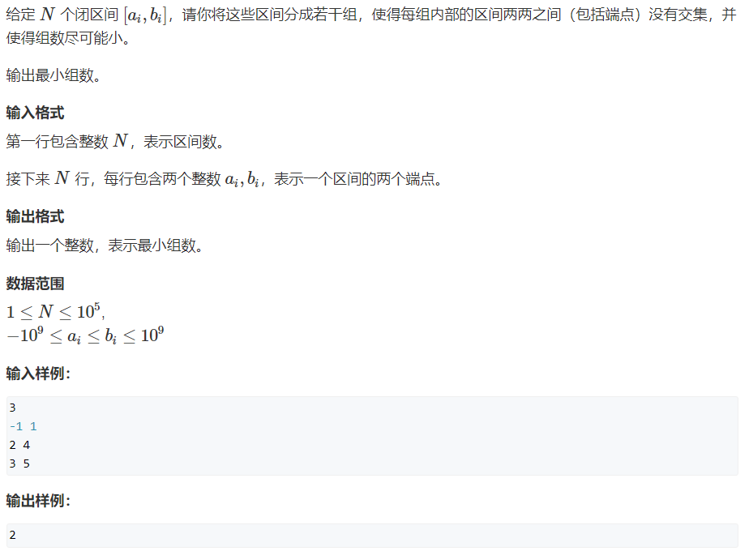

题解

从前往后枚举每个区间，判断此区间能否将其放到现有的组中

> 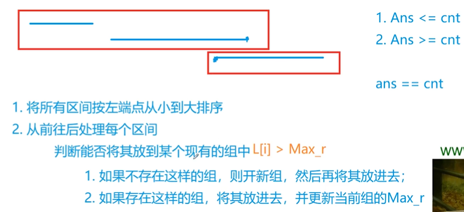

算法流程

> 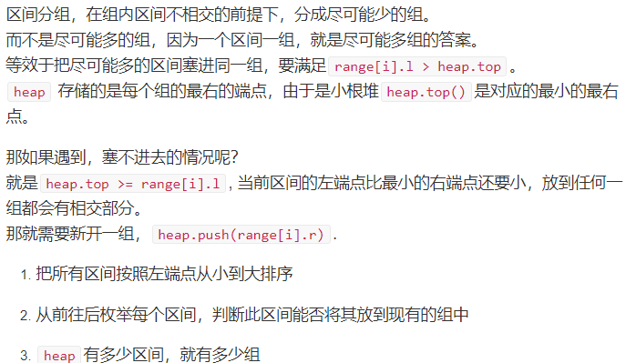

```cpp
/*给定 N 个闭区间 [ai,bi]，请你将这些区间分成若干组，使得每组内部的区间两两之间（包括端点）没有交集，并使得组数尽可能小。输出最小组数。
*/
#include <iostream>
#include <algorithm>
#include <queue>
using namespace std;

const int N = 100010;

int n;
struct Range
{
    int l, r;
    bool operator< (const Range &W) const
    {
        return l < W.l;
    }
}range[N];

int main()
{
    scanf("%d", &n);
    for (int i = 0; i < n; i++)
    {
        int l, r;
        scanf("%d%d", &l, &r);
        range[i] = {l, r};
    }
    sort(range, range + n);
    
    priority_queue<int, vector<int>, greater<int>> heap;
    for (int i = 0; i < n; i++)
    {
        auto r = range[i];
        if (heap.empty() || heap.top() >= r.l) heap.push(r.r);
        else
        {
            int t = heap.top();
            heap.pop();
            heap.push(r.r);          
        }
    }
    printf("%d\n", heap.size());
    return 0;
}
```


#### 区间覆盖

**题目**

>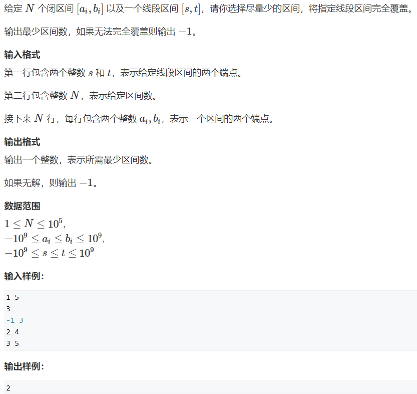

题解

>将所有区间按照左端点从小到大进行排序
>
>从前往后枚举每个区间，在所有能覆盖start的区间中，选择右端点的最大区间，然后将start更新成右端点的最大值  (这一步用到了贪心决策)

图解

> 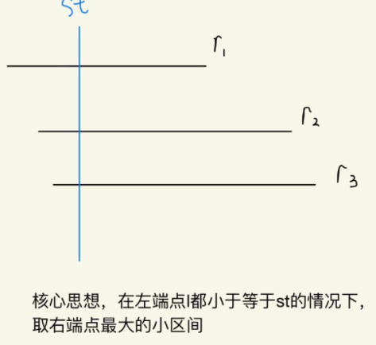

算法证明(通过调整的方法直接证)：任何一个最优解，都可以通过调整的方式变成当前方案。

> 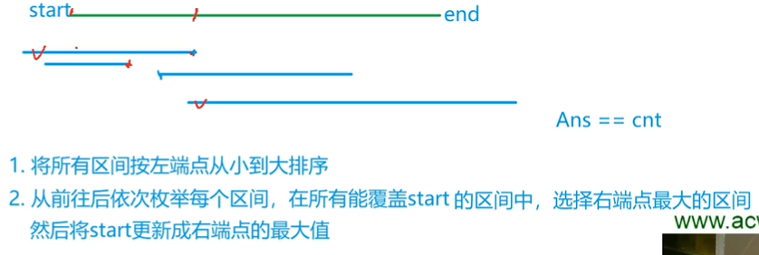

```cpp
/*给定 N 个闭区间 [ai,bi] 以及一个线段区间 [s,t]，请你选择尽量少的区间，将指定线段区间完全覆盖。
输出最少区间数，如果无法完全覆盖则输出 −1。
*/
#include <iostream>
#include <algorithm>

using namespace std;

const int N = 100010;

int n;
struct Range
{
    int l, r;
    bool operator< (const Range &W)const
    {
        return l < W.l;
    }
}range[N];

int main()
{
    int st, ed;
    scanf("%d%d", &st, &ed);  // 目标区间
    scanf("%d", &n);
    for (int i = 0; i < n; i ++ )
    {
        int l, r;
        scanf("%d%d", &l, &r);
        range[i] = {l, r};  // 读入左右端点
    }

    sort(range, range + n);

    int res = 0;
    bool success = false;
    for (int i = 0; i < n; i ++ )  
    {
        int j = i, r = -2e9;    // 双指针算法扫描一遍
        while (j < n && range[j].l <= st)  //遍历所有左端点在start左边的区间，找到右端点最大的区间
        {
            r = max(r, range[j].r);
            j ++ ;
        }

        if (r < st) //无解情况
        {
            res = -1;
            break;
        }

        res ++ ;
        if (r >= ed) 
        {
            success = true;
            break;
        }

        st = r;
        i = j - 1;
    }

    if (!success) res = -1;
    printf("%d\n", res);

    return 0;
}
```


### Huffman树

#### 合并果子

题目

> 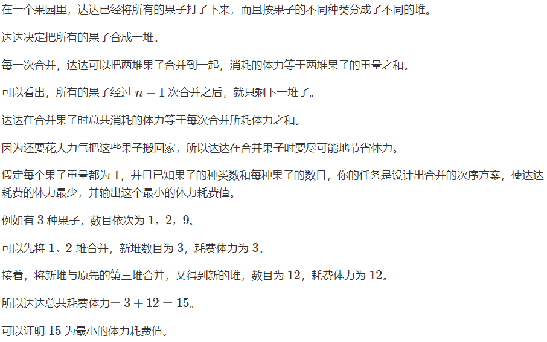
>
> 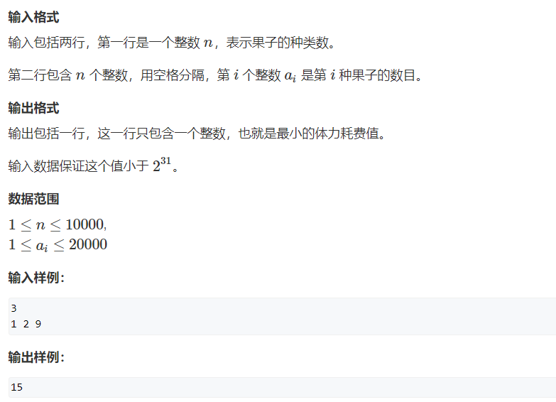

题解

> (贪心,哈夫曼树,堆,优先队列) O(nlogn)
> 经典哈夫曼树的模型，每次合并重量最小的两堆果子即可。

时间复杂度

> 使用小根堆维护所有果子，每次弹出堆顶的两堆果子，并将其合并，合并之后将两堆重量之和再次插入小根堆中。
>
> 每次操作会将果子的堆数减一，一共操作 n−1 次即可将所有果子合并成1堆。每次操作涉及到2次堆的删除操作和1次堆的插入操作，计算量是 O(logn)。因此总时间复杂度是 O(nlogn)。

```cpp
#include <iostream>
#include <algorithm>
#include <queue>

using namespace std;

int main()
{
    int n;
    scanf("%d", &n);

    priority_queue<int, vector<int>, greater<int>> heap;
    while (n -- )
    {
        int x;
        scanf("%d", &x);
        heap.push(x);
    }

    int res = 0;
    while (heap.size() > 1)
    {
        int a = heap.top(); heap.pop();
        int b = heap.top(); heap.pop();
        res += a + b;
        heap.push(a + b);
    }

    printf("%d\n", res);
    return 0;
}
```


### 排序不等式

#### 排队打水

**题目**

>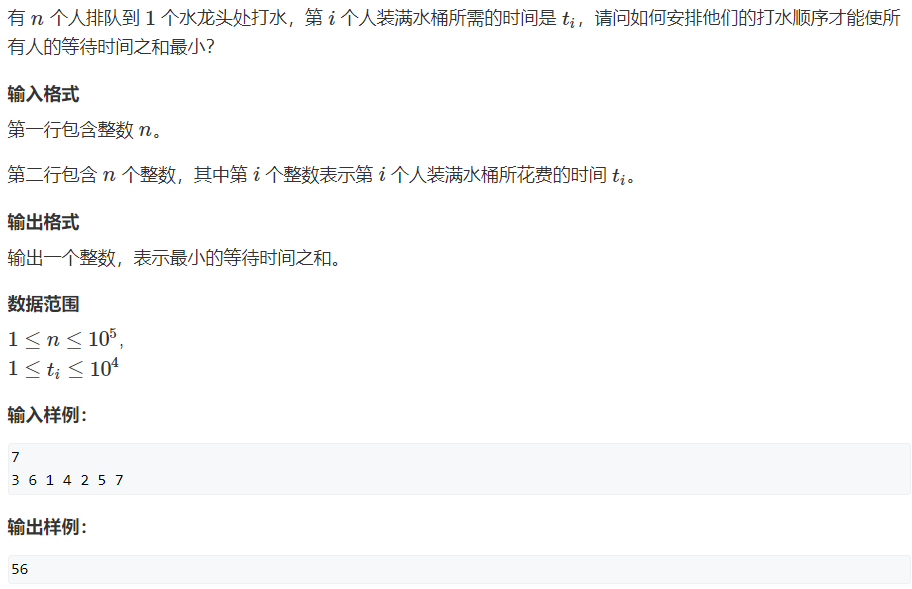

题解

> 安排他们的打水顺序才能使所有人的等待时间之和最小，则需要将打水时间最短的人先打水。
>
> Huffman树适用于有选择的题目，两条路径进行选择，而此题只有一条路径。

图解

> 

时间复杂度 O(nlogn)

```cpp
/*有 n 个人排队到 1 个水龙头处打水，第 i 个人装满水桶所需的时间是 ti，请问如何安排他们的打水顺序才能使所有人的等待时间之和最小？
*/
#include <iostream>
#include <algorithm>
using namespace std;

typedef long long LL; //题目中10^5的平方除以2等于50亿，int范围是20亿，需要用long long
const int N = 100010;

int n;
int t[N];

int main()
{
    scanf("%d", &n);
    for (int i = 0; i < n; i++) scanf("%d", &t[i]);
    
    sort(t, t + n);
    
    LL res = 0;
    for (int i = 0; i < n; i++) res += t[i] * (n - i - 1);
    printf ("%lld\n", res);
    return 0;
}
```


### 绝对值不等式

#### 仓库选址

**题目**

>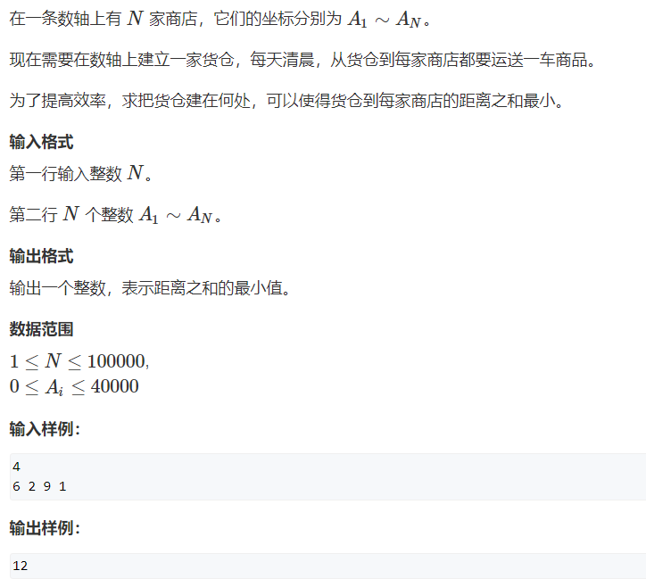

题解

> 中位数有非常优秀的性质，比如说在这道题目中，每一个点到中位数的距离，都是满足全局的最有性，而不是局部最优性。
>
> 具体的来说，我们设在仓库左边的所有点，到仓库的距离之和为p,右边的距离之和则为q，那么我们就必须让p+q的值尽量小。
>
> 当仓库向左移动的话，p会减少x，但是q会增加n−x，所以说当为仓库中位数的时候,p+q最小。

图解

> 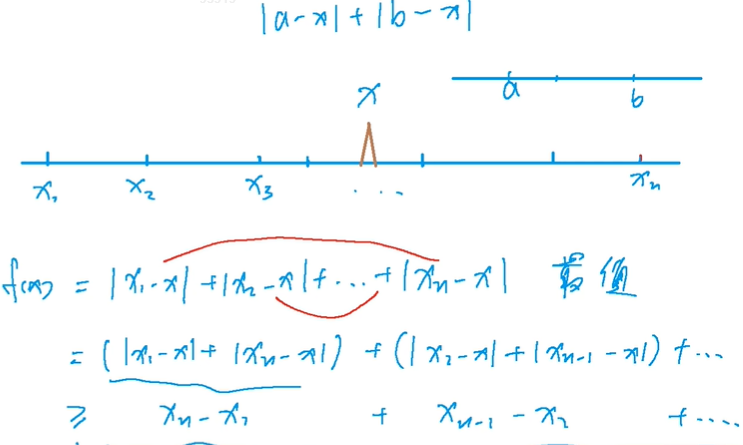

```cpp
/*在一条数轴上有 N 家商店，它们的坐标分别为 A1∼AN。
现在需要在数轴上建立一家货仓，每天清晨，从货仓到每家商店都要运送一车商品。
为了提高效率，求把货仓建在何处，可以使得货仓到每家商店的距离之和最小。
*/
#include <iostream>
#include <algorithm>
using namespace std;

const int N = 100010;

int n;
int a[N];

int main()
{
    scanf("%d", &n);
    for (int i = 0; i < n; i ++) scanf("%d", &a[i]);
    
    sort(a, a + n);
    
    int res = 0;
    for (int i = 0; i < n; i++) res += abs(a[i] - a[n / 2]);
    printf("%d\n", res);
    return 0;
}
```


### 推公式

#### 耍杂技的牛

**题目**

>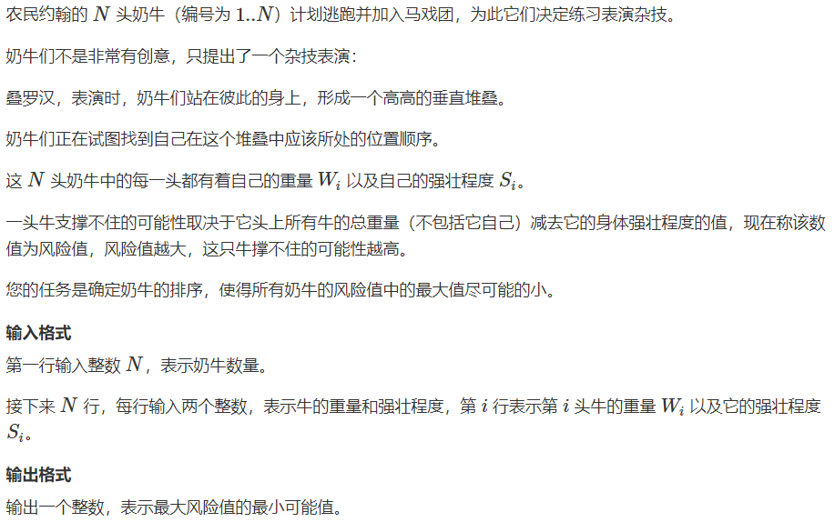
>
>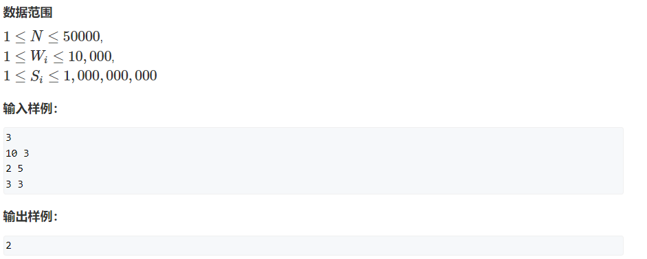

题解

>

图解

> 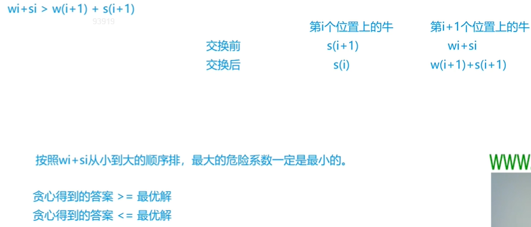

```cpp
/*农民约翰的 N 头奶牛（编号为 1..N）计划逃跑并加入马戏团，为此它们决定练习表演杂技。
奶牛们不是非常有创意，只提出了一个杂技表演：
叠罗汉，表演时，奶牛们站在彼此的身上，形成一个高高的垂直堆叠。
奶牛们正在试图找到自己在这个堆叠中应该所处的位置顺序。
这 N 头奶牛中的每一头都有着自己的重量 Wi 以及自己的强壮程度 Si。
一头牛支撑不住的可能性取决于它头上所有牛的总重量（不包括它自己）减去它的身体强壮程度的值，现在称该数值为风险值，风险值越大，这只牛撑不住的可能性越高。
您的任务是确定奶牛的排序，使得所有奶牛的风险值中的最大值尽可能的小。
*/
#include <iostream>
#include <algorithm>
using namespace std;

typedef pair<int, int> PII;
const int N = 50010;

int n;
PII cow[N];

int main()
{
    scanf("%d", &n);
    for (int i = 0; i < n; i++)
    {
        int w, s;
        scanf("%d%d", &w, &s);
        cow[i] = {w + s, w};
    }
    sort(cow, cow + n);
    
    int res = -2e9, sum = 0;
    for (int i = 0; i < n; i++)
    {
        int w = cow[i].second, s = cow[i].first - w;
        res = max(res, sum - s);
        sum += w;
    }
    printf("%d\n", res);
    return 0;
}
```


