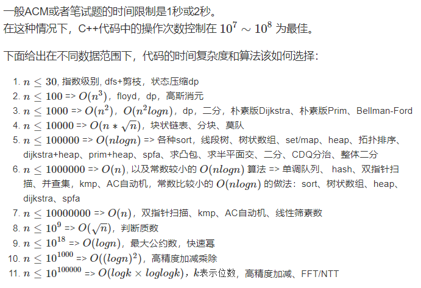

## 时空复杂度分析 - AcWing - HQ

[TOC]

----

### 注意内容

-   

----

### 由数据范围反推算法复杂度以及算法内容

详细分类

> 

补充对应习题

1. 排列数字， n皇后，八数码，蒙德里安的梦想

#### 代码时间复杂度具体分析

1. 纯循环 —— 有几重循环就是多少次方的复杂度 —— DP背包问题，最长上升子序列
2. 递归 —— 通过主定理推出复杂度（百度学习）—— 快速排序，归并排序（每层O(n)，快排最多logn层，归并一定logn层）
3. 双指针算法 —— 两层循环，但是内层循环小于等于n，所以复杂度为O(n)
4. 单链表 —— 插入删除都是O(1)
5. 单调栈/队列 —— 两层循环，但是每个元素只会进队一次，只会出队一次，最多出队n次（内层循环），所以复杂度为O(n)
6. KMP —— 两层循环，同上类似，复杂度为O(n)
7. 并查集 ——时间复杂度O(nlogn)，记住即可 —— 若加上 路径压缩的优化后，时间复杂度最坏为O(nlogn)  ——若加上 路径压缩，按秩合并的优化后，时间复杂度为O(loglogn) 
8. 堆 —— 插入，删除 O(logn)
9. 哈希表 —— 增删改查 时间复杂度默认为O(1)，极少极少概率不是
10. 图 —— DFS，BFS，拓扑排序，O(n + m)
11. 理论时间复杂度很高，但是实际运行效果非常快 —— SPFA，二分图匈牙利算法，最大流算法
12. 动态规划问题的计算量 = 状态数量 * 状态转移的计算量（计算每个状态需要的时间）
13. 分组背包问题 ： 状态数量NV，状态转移计算量N，O(NV * N)
14. 贪心：排序O(logn)  +  循环

#### 代码空间复杂度具体分析

- 1 Byte = 8 bit
- 1 KB = 1024 Byte
- 1 MB = 1024 * 1024 Byte
- 1 GB = 1024 * 1024 * 1024 Byte

- int 4 Byte
- cha 1 Byte
- double , long long 8 Byte
- bool 1 Byte

- 64MB = 2^26^ Byte
- 2^26^ / 4 = 2^24^ 个 int  ,   大约为16000000个 int
- 但是考虑到程序其他部分的占用，一般用到50MB

- 开很大的数组，但是只开没用，不会爆内存，初始化后则会爆内存

- cout << (sizeof v + sizeof w + sizeof f) / 1024  << endl;
- 快速排序  额外空间为 O(logn)，递归多少层需要的空间就是多少

