## 算法知识整理 - HQ

[TOC]

------

#### 注意

- 

------

## 八大算法思想图解

### 一、枚举算法

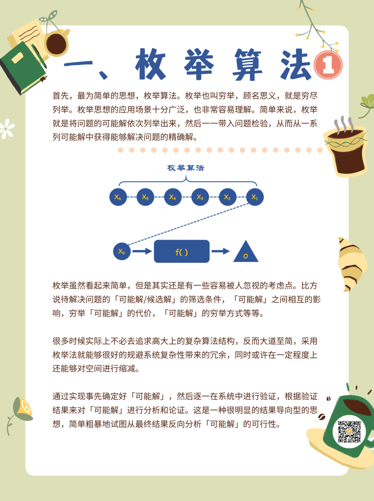

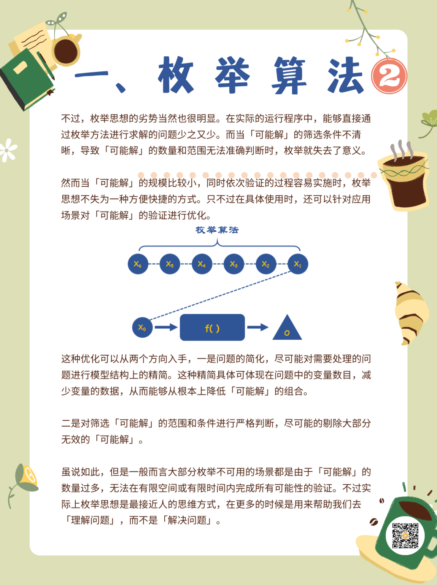

### 二、递推算法

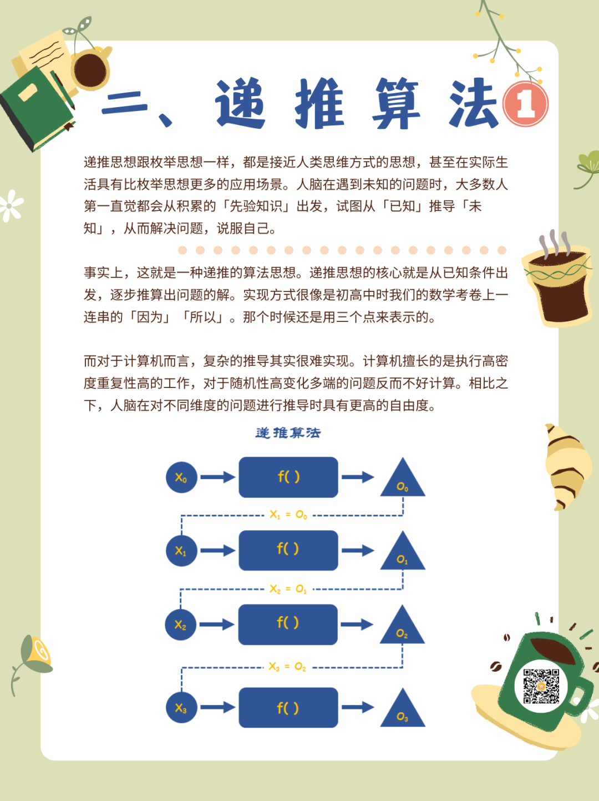

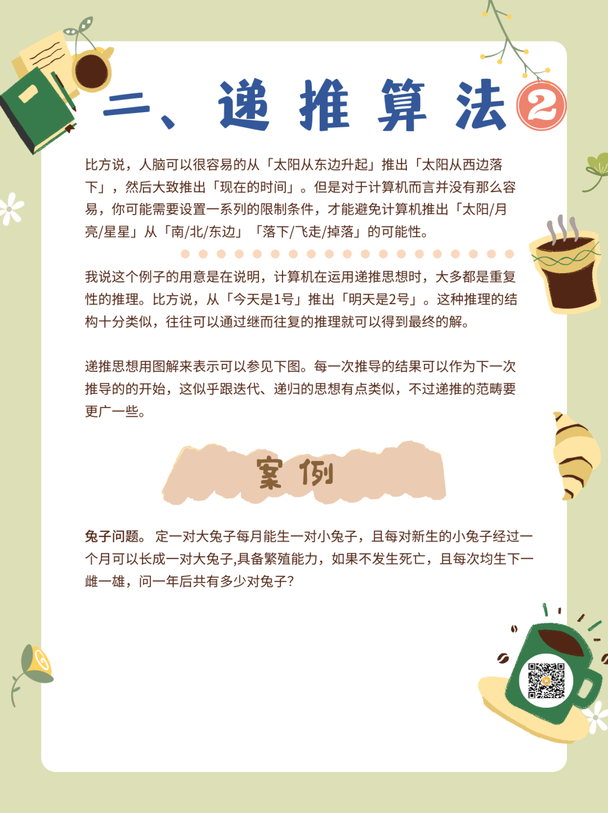

### 三、递归算法

### 四、分治算法

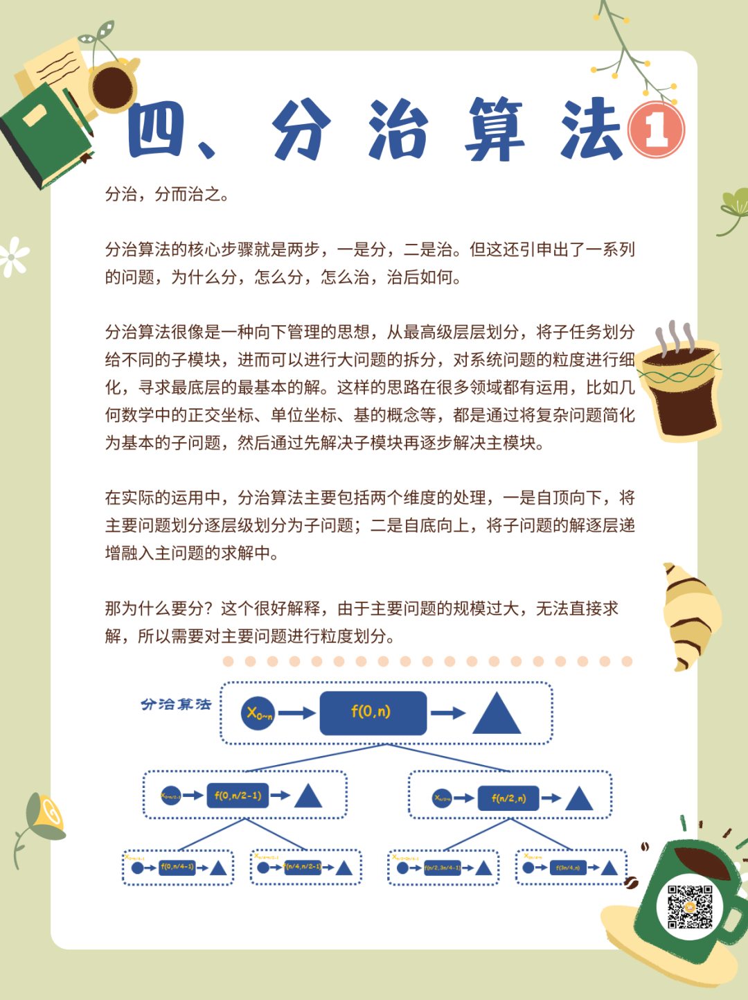

### 五、动态规划

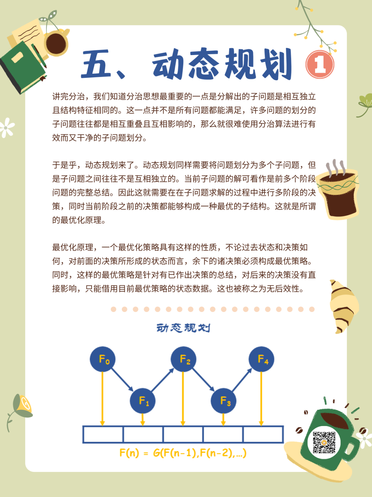

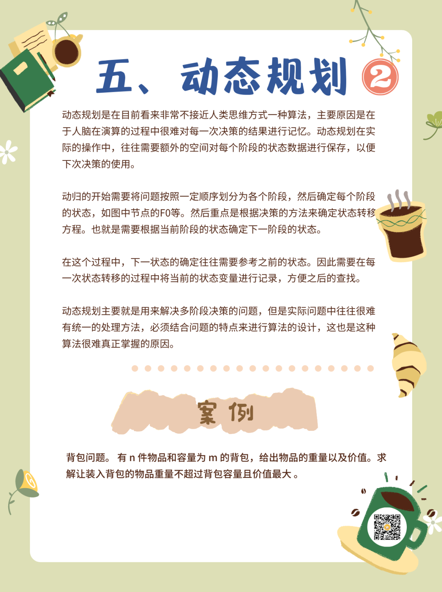

### 六、贪心算法

==每一次都会选择最大的收益。==

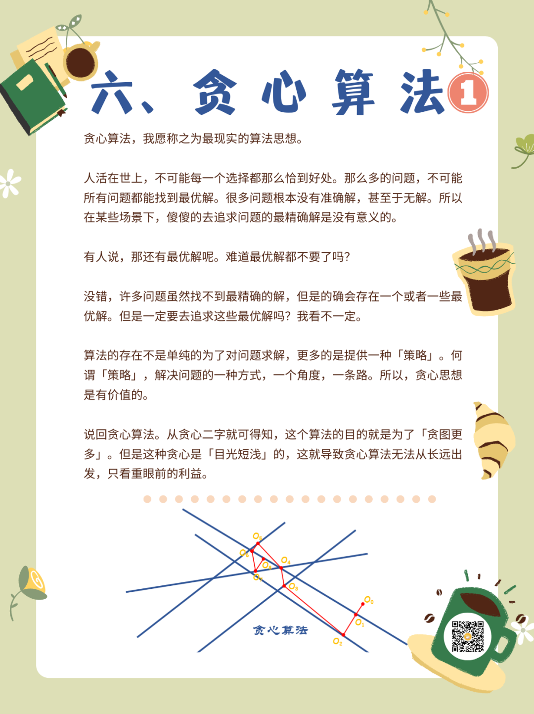

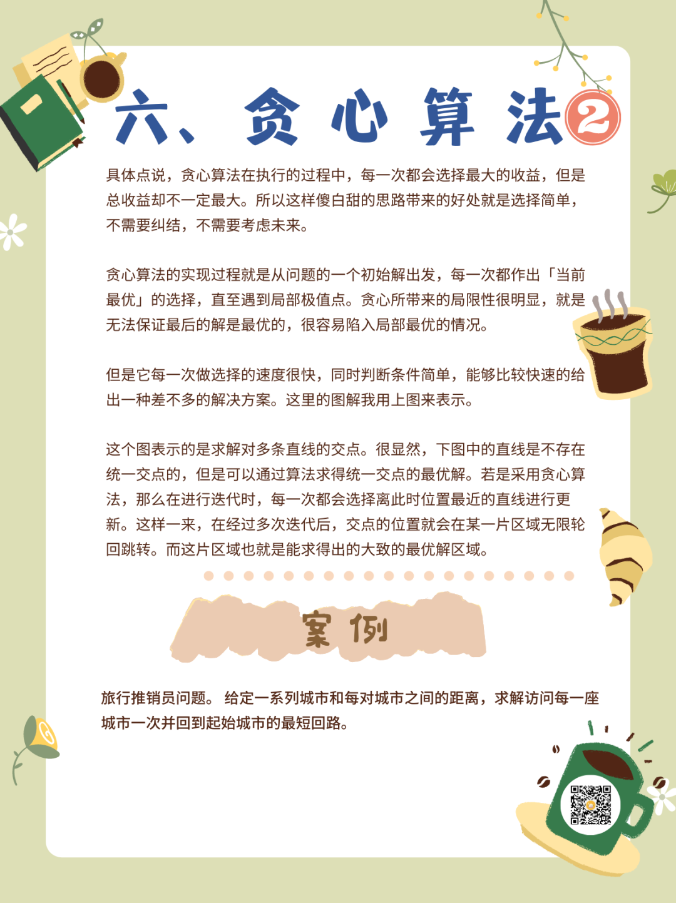

### 七、回溯算法

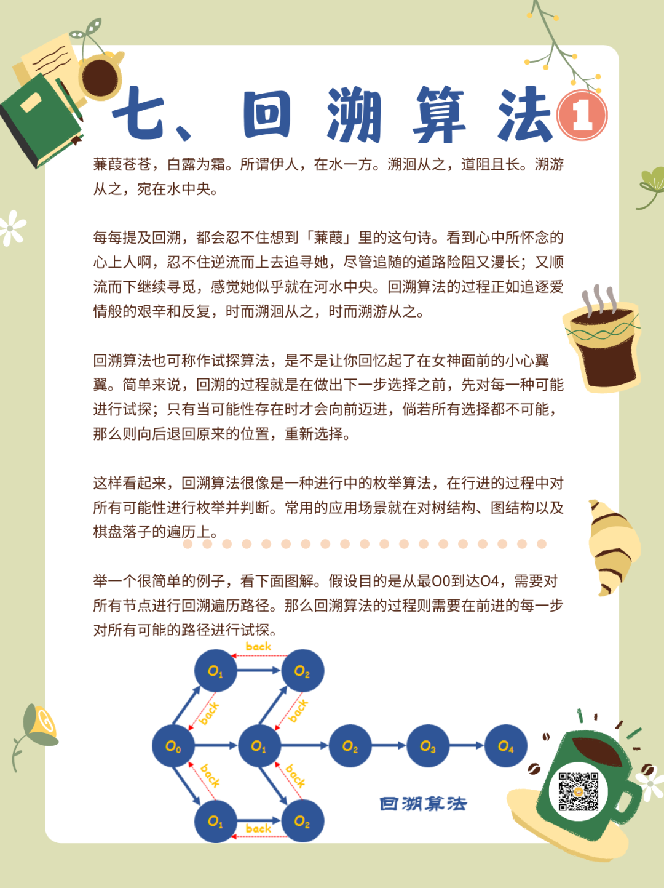

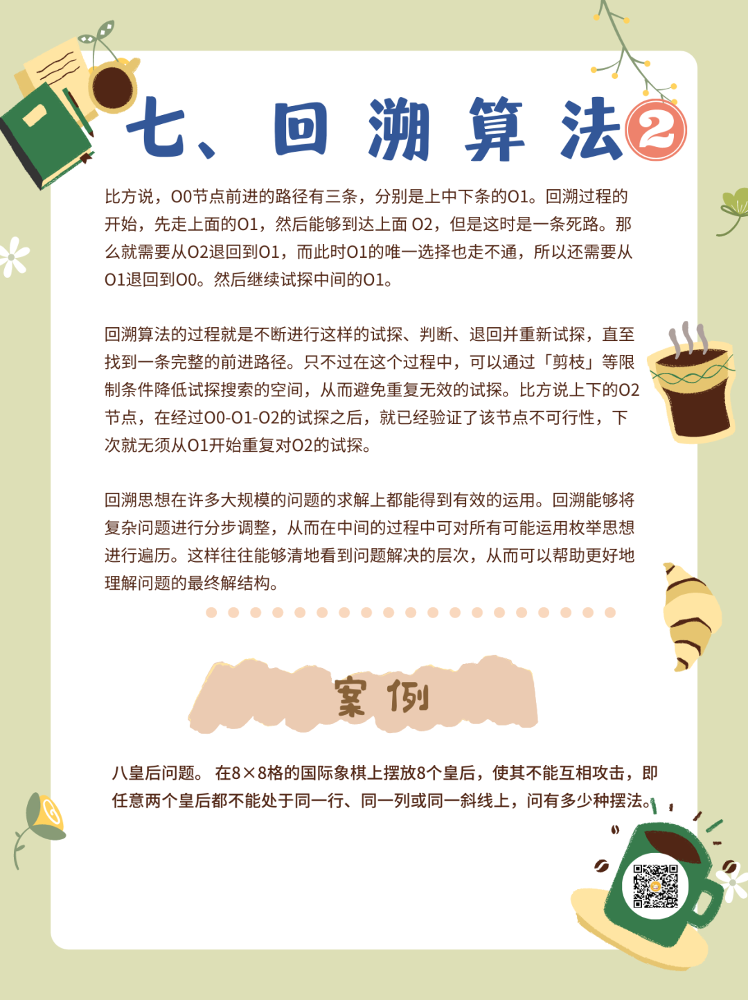

### 八、模拟算法

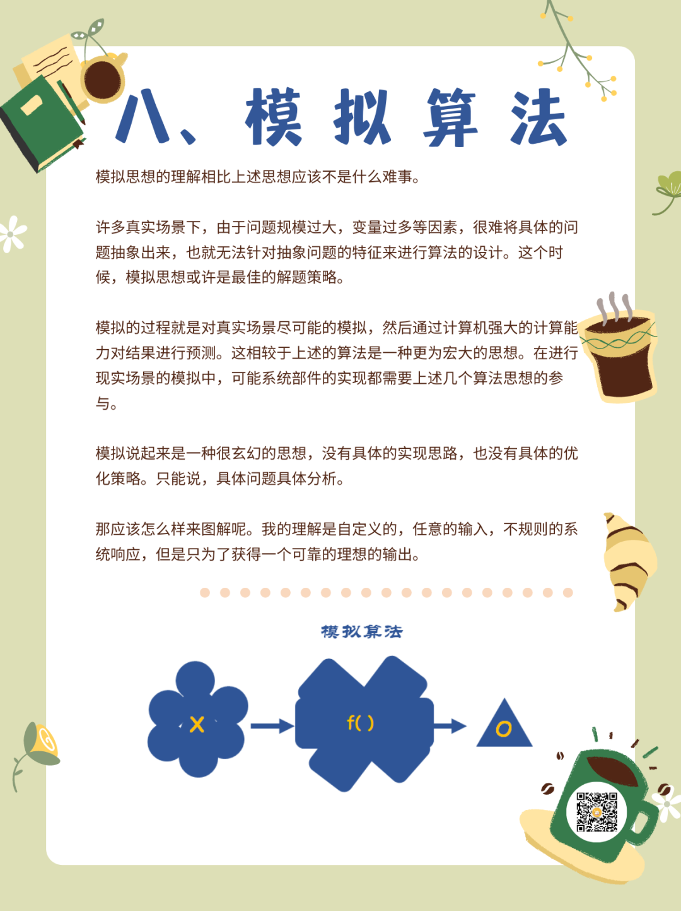

