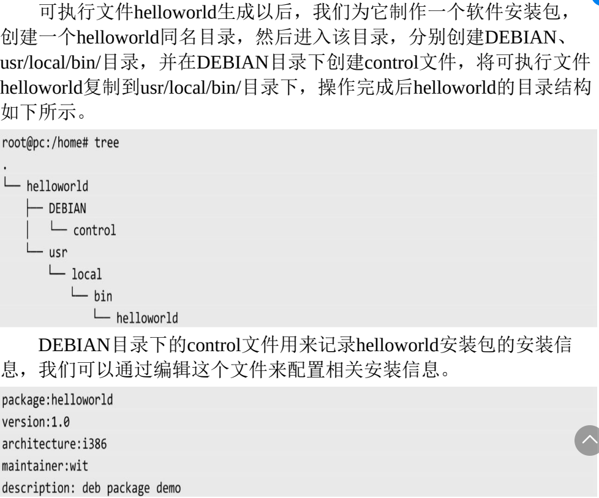
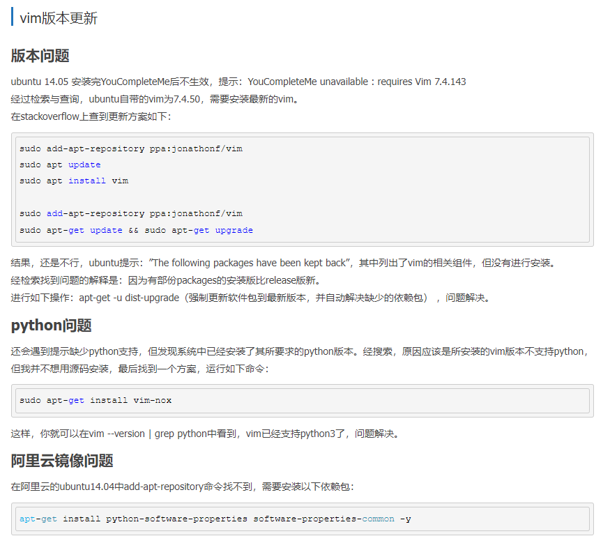

## Linux常用指令汇总 - HQ

[TOC]

------

### 注意

- 

------

## 指令与快捷键汇总

#### 快捷键

|            作用             |                 快捷键                  |
| :-------------------------: | :-------------------------------------: |
| ctrl + y / ctrl + shift + y |            重做（取消撤销）             |
|          ctrl + z           |                挂起进程                 |
|             fg              |              打开挂起进程               |
|          ctrl + d           |                  结束                   |
|                             |                                         |
|          ctrl + c           |        杀死进程 / 取消命令并换行        |
|          ctrl + u           |              清空本行命令               |
|          ctrl + l           |                  清屏                   |
|             tab             | 补全命令和文件名 / 连按两次显示备选选项 |
|              ↑              |              显示之前命令               |
|        Ctrl + insert        |                复制文本                 |
|       Shift + insert        |                粘贴文本                 |
|                             |                                         |
|                             |                                         |
|                             |                                         |
|                             |                                         |
|                             |                                         |
|                             |                                         |
|                             |                                         |

#### 指令

| 指令                 | 功能                       |
| -------------------- | -------------------------- |
| `pstree -h PID号`    | 以树的形式展示进程父子结构 |
| `cat /proc/PID/maps` | 查看PID号进程的内存布局    |
|                      |                            |
|                      |                            |
|                      |                            |
|                      |                            |
|                      |                            |
|                      |                            |
|                      |                            |
|                      |                            |
|                      |                            |
|                      |                            |
|                      |                            |
|                      |                            |
|                      |                            |
|                      |                            |
|                      |                            |
|                      |                            |
|                      |                            |

---

|       指令        |                   作用                   | 选项  |         作用         | 选项 |          作用          |
| :---------------: | :--------------------------------------: | :---: | :------------------: | :--: | :--------------------: |
|        ls         |               显示所有文件               |  -l   |     显示更多信息     |  -h  |       人性化输出       |
|                   |                                          |  -a   |     显示隐藏文件     |      |                        |
|        ll         | 查看所有文件权限（直接显示所以隐藏文件） |  -h   |     更好的给人看     |      |                        |
|        pwd        |               显示当前路径               |       |                      |      |                        |
|        cd         |               进入制定目录               | 默认  |      进入家目录      |  -   |     返回上一个目录     |
|       mkdir       |                 新建目录                 | a/b/c |    可连续建立目录    |  -p  |       没有才创建       |
|       touch       |               新建一个文件               |       |                      |      |                        |
|        cp         |           复制 + 粘贴 + 重命名           |  -r   |       复制目录       |  \   |   名称有空格加转义符   |
|    cp XXX YYY     |            将XXX文件复制成YYY            |       |                      |      |                        |
|        mv         |           剪切 + 粘贴 + 重命名           |       |                      |      |                        |
|      history      |               显示历史命令               |       |                      |      |                        |
|       tree        |                显示目录树                |       |                      |      |                        |
|        rm         |           删除文件(没有回收站)           | *.txt |    支持正则表达式    |  -r  |    递归删(删文件夹)    |
|                   |                                          |  -f   |   删除受保护的文件   |  /*  | 删除文件夹中的所有内容 |
|        cat        |               显示文件内容               |       |                      |      |                        |
|       type        |          检查命令是什么类型命令          |       |       type ls        |      |     type readonly      |
|       time        |  在运行的指令前加，可以测得指令运行时间  |       | time g++ -c main.cpp |      |                        |
|       clear       |                   清屏                   |       |                      |      |                        |
| cat /proc/cpuinfo |               查看cpu信息                |       |                      |      |                        |
|      su xxx       |                 切换用户                 |       |                      |      |                        |
|       reset       |   重新初始化屏幕，清除历史命令操作记录   |       |                      |      |                        |
|                   |                                          |       |                      |      |                        |
|                   |                                          |       |                      |      |                        |


## dmesg 命令

Linux dmesg（英文全称：display message）命令用于显示开机信息。

kernel 会将开机信息存储在 ring buffer 中。您若是开机时来不及查看信息，可利用 dmesg 来查看。开机信息亦保存在 /var/log 目录中，名称为 dmesg 的文件里。

**语法**

```
dmesg [-cn][-s <缓冲区大小>]
```

**参数说明**

- -c 　显示信息后，清除 ring buffer 中的内容。
- -s<缓冲区大小> 　预设置为 8196，刚好等于 ring buffer 的大小。
- -n 　设置记录信息的层级。

**使用举例**

```shell
dmesg |less
```

显示开机信息

```
# dmesg > boot.msg //将开机信息保存到 boot.msg文件中
#ls //显示当前目录文件
boot.msg
```


## 制作安装包常用指令

**准备工作**

> 

安装成功后，在系统的/usr/local/bin下就会看到安装成功的helloworld可执行文件。安装成功后，在Shell终端的任何目录下，直接输入helloworld命令都可以直接运行。

| 指令                                          | 功能               |
| --------------------------------------------- | ------------------ |
| `dpkg -b helloworld/ helloworld_1.0_i386.deb` | 制作安装包         |
| `dpkg -i helloworld_1.0_i386.deb`             | 安装deb包          |
| `whereis helloworld`                          | 查找可执行文件位置 |
| `dpkg -P helloworld`                          | 卸载程序及配置文件 |
| `dpkg -r helloworld`                          | 卸载程序           |
|                                               |                    |


## 编译分析常用指令

| 指令                                                         | 功能                                                         |
| ------------------------------------------------------------ | ------------------------------------------------------------ |
| `arm-linux-gnueabi-gcc test.c -o a.out` & `arm-linux-gnueabi-objdump -D a.out > a.S` | 将C程序编译后进行反汇编                                      |
| `readelf -h a.out`                                           | 获取可执行文件的头部信息                                     |
| `readlf -S a.out`                                            | 查看可执行文件的节头表                                       |
| `readlf -s sub.o`                                            | 查看目标文件的文件表信息                                     |
| `arm-linux-gnueabi-ld --verbose`                             | 查看链接器使用的默认链接脚本                                 |
| `arm-linux-gnueabi-objdump -r main.o` & `arm-linux-gnueabi-readelf -r main.o` | 查看目标文件中的重定位表信息                                 |
| `arm-linux-gnueabi-readelf -l a.out`                         | 查看可执行文件的段头表                                       |
| `arm-linux-gnueabi-objdump -D a.out > a.S`                   | 反编译可执行文件/目标文件                                    |
| `arm-linux-gnueabi-gcc -nostartfiles -e <入口函数> xx.c`     | 改变一个项目的入口地址                                       |
| `arm-linux-gnueabi-gcc -nostartfiles -e mymain test.c`       | 将项目的入口地址改为mymain                                   |
| `gcc -c test.c`                                              | 生成目标文件                                                 |
| `ar rcs libtest.a test.o`                                    | 将test.o打包成静态库                                         |
| `gcc main.c -L. -ltest`                                      | 指定要链接的库的名字和路径（编译参数大写L表示要链接的库的路径，小写l表示要链接的库名字。链接时库的名字要去掉前后缀libtest.a->test） |
| `gcc -fPIC -shared test.c -o libtest.so`                     | 将test.c打包成动态链接库（加上-fPIC参数生成的指令，实现了代码与地址无关，放到哪里都可以执行) |
| `gcc main.c libtest.so`                                      | 指定动态链接库（可执行文件a.out是采用动态链接生成的，所以在运行a.out之前，libtest.so这个动态链接库要放到/lib、/usr/lib等系统默认的库路径下，否则a.out就会动态链接失败，无法正常运行） |
| `arm-linux-gnueabi-objdump -j .interp -s a.out`              | 可执行文件的.interp段存放的有动态链接器的加载路径            |
| `export LD_LIBRARY_PATH = /home/wit/lib:/usr/test/lib`       | 有时候我们也可以使用LD_LIBRARY_PATH环境变量临时改变共享库的查找路径，而不会影响系统中的其他应用程序。我们可以将多个共享库的路径添加到这个环境变量中，各个路径用冒号隔开。 |
| `gcc test.c -shared -fPIC -o libtest.so`                     | 将test.c中的函数封装成一个插件（动态共享库）                 |
| `readelf -h hello.ko`                                        | 查看目标文件的文件头信息                                     |
| `ulimit -s`                                                  | 查看栈大小，单位是KB                                         |
| `ulimit -s 4096`                                             | 设置栈空间大小为4MB                                          |
| `objdump -j .rodata -s a.out`                                | 查看可执行文件中的.rodata段中只读数据信息                    |
| `readelf -s a.out`                                           | 查看符号表                                                   |
|                                                              |                                                              |
|                                                              |                                                              |
|                                                              |                                                              |
|                                                              |                                                              |


## 驱动开发常用指令

1. Ubuntu下所有的设备文件都在目录“ “/dev”里面，所以插上 SD卡以后也会出现在“ “/dev
   里面，其中存储设备都是以“ “/dev/sd”开头的。我们要先看一下不插 SD卡的时候电脑都有哪些
   存储设备，以防插入 SD卡 以后分不清谁是谁。
   
2. `sudo fdisk -l`  查看SD卡挂载节点

3. `tar -vxjf uboot-imx-xxxx.tar.bz2`  uboot解压缩命令

4. `tar -vcjf alientek_uboot.tar.bz2 alientek_uboot`   uboot压缩命令

4. 检查一下 SD 卡和 EMMC 驱动是否正常
   - `mmc list`     列出当前的 MMC 设备
   - `mmc dev 0`    `mmc info`    检查每个MMC设备信息
   
5. 查找文件
   - find
     - `find <指定目录> <指定条件> <指定动作>`  
     - `find / -name 'xxxx'`   使用find命令搜索在根目录下的所有interfaces文件所在位置
   - locate
     - `locate xxxx`   使用locate命令在根目录下搜索interfaces文件
     - 比find命令快。因为它查询的是数据库(/var/lib/locatedb)，数据库包含本地所有的文件信息。
   - whereis
     - `whereis xxx`   使用whereis命令搜索xxx二进制文件
     - 搜索linux系统中的所有可执行文件即二进制文件
   - which
     - `which xxx`   使用which命令查看xxx命令是否存在以及存在的目录
     - 使用which命令查看系统命令是否存在，并返回系统命令所在的位置
   - type
     - `type cd`    使用type命令查看cd命令是否为系统自带的命令
     - 使用type命令查看系统中的某个命令是否为系统自带的命令。
   
7. `ls mmc 1:1`    检查EMMC的分区1中有没有zImage文件和设备树文件

8. `cat /proc/devices`      查看当前系统中所有已经使用了的设备号

9. 打开 VSCode，按下`Crtl+Shift+P`打开 VSCode 的控制台

10. `lsmod`  查看当前系统中存在的模块

11. 卸载NFS目录  `umount get`

12. ==为防止可能之前修改过环境变量而导致无法挂载，我们可以使用 `env default -a` 指令先清除环境变量。==

13. `ps` 查看进程PID号      `kill -9 PID`   杀死指定的PID进程

    > 用“kill -9 PID”杀死指定进程的方法就是向指定的进程(PID)发送SIGKILL 这个信号。当按下键盘上的 CTRL+C 组合键以后会向当前正在占用终端的应用程序发出 SIGINT 信号，SIGINT 信号默认的动作是关闭当前应用程序。


## 软件安装常用指令

| 命令                                         | 含义                                                         |
| -------------------------------------------- | ------------------------------------------------------------ |
| `sudo apt-get install -f`                    | 这个命令是修复依赖关系（depends）的命令，就是假如你的系统上有某个package不满足依赖条件，这个命令就会自动修复，安装那个package依赖的package。不出意外的话就可以解决了 |
| `sudo apt-get update 、sudo apt-get upgrade` | 软件更新                                                     |
| `su root \ sudo su`                          | 使用超级用户                                                 |
| `sudo dpkg -i xxxx`                          | 安装.deb的安装包                                             |
| `ls --help`                                  | 查看指令提示信息                                             |
| `./curl --help`                              | 查看指令提示信息                                             |
| `apt-get install inetutils-ping`             | 安装ping指令                                                 |
| `sudo shutdown -h now`                       | 安全关机                                                     |
| `sudo halt`                                  | 安全关机                                                     |
| `sudo poweroff`                              | 安全关机                                                     |
| `sudo init 0`                                | 安全关机                                                     |
| `sudo reboot`                                | 重启                                                         |
| `shutdown -r now`                            | 重启                                                         |
|                                              |                                                              |


## 指令图片汇总

### vim

> 


## 其他各场景下指令整理

### 重装Nginx

删除nginx，–purge包括配置文件

```
sudo apt-get --purge remove nginx
```

自动移除全部不使用的软件包

```
sudo apt-get autoremove　
```

罗列出与nginx相关的软件

```
dpkg --get-selections | grep nginx
```

删除1.3查询出与nginx有关的软件

```
sudo apt-get --purge remove nginx
sudo apt-get --purge remove nginx-commonsudo 
apt-get --purge remove nginx-core
```

这样就可以完全卸载掉nginx包括配置文件

查看nginx正在运行的进程，如果有就kill掉

```
ps -ef | grep nginx
```

kill nginx进程

```
sudo kill -9 7875 7876 7877 7879　
```

全局查找与nginx相关的文件

```
sudo find / -name nginx*
```

依次删除4列出的所有文件

```
sudo rm -rf file
```

再次重装

```
sudo apt-get update
sudo apt-get install nginx
```


### libcurl使用过程

.bz2 
　　解压1：bzip2 -d FileName.bz2 
　　解压2：bunzip2 FileName.bz2 
　　压缩： bzip2 -z FileName 
.tar.bz2 
　　解压：tar jxvf FileName.tar.bz2   或 tar --bzip xvf FileName.tar.bz2 
　　压缩：tar jcvf FileName.tar.bz2 DirName 
make  编译当前文件夹的内容
make install 安装
`./configure --prefix=$PWD/_install  使用默认gcc编译/安装在当前路径的_install文件夹中
./configure --prefix=$PWD/_install --host=arm-linux  使用arm-linux编译器编译/安装在当前路径的_install文件夹中`
gcc demo1.c -I ./curl-7.71.1/_install/include/ -L ./curl-7.71.1/_install/lib/ -lcurl    -I是链接头文件，-L是链接库文件
export LD_LIBRARY_PATH=./curl-7.71.1/_install/lib/       链接库地址  
./a.out
vi /tmp/get.html   查看调用libcurl编程访问的百度主页


### curses库

是一组函数，程序员可以用它们来设置光标的位置和终端屏幕上显示的字符样式。curses库最初是由UCB的开发小组开发的。大部分控制终端屏幕的程序使用curses。曾经由一组简单的函数组成的库现在包括了许多复杂的特性。

Ubuntu下安装方法：sudo apt-get install libncurses5-dev


### sleep（）函数

C语言标准库中没有sleep这个函数，它实际上是一个系统API函数。

**函数功能: 执行挂起一段时间**

1、在VC中使用带上头文件，而且全称为Sleep()，第一个字母需要大写。

```
include <windows.h> //需要添加头文件
Sleep(unisgned long); //函数声明
Windows中，Sleep()里面的单位，是以毫秒为单位，所以如果想让函数滞留1秒的话，应该写成：
Sleep(1000);
```

2、在gcc中，使用的头文件因gcc版本的不同而不同，一般来说，linux系统需要添加的头文件为：

```
include <unistd.h>
应该是Sleep(1000);
在Linux下，sleep()里面的单位是秒，而不是毫秒。
```


### linux 中 man 1 man2 man3 ......man N的区别

1、Standard commands （标准命令）
2、System calls （系统调用）
3、Library functions （库函数）
4、Special devices （设备说明）
5、File formats （文件格式）
6、Games and toys （游戏和娱乐）
7、Miscellaneous （杂项）
8、Administrative Commands （管理员命令）
9 其他（Linux特定的）， 用来存放内核例行程序的文档。


## 必备的 Linux 指令 - 摘录

https://mp.weixin.qq.com/s/n1yELM_aNdbOQmMzA1UIhw

### 基本操作

#### Linux关机,重启

```
# 关机
shutdown -h now

# 重启
shutdown -r now
```

#### 查看系统,CPU信息

```
# 查看系统内核信息
uname -a

# 查看系统内核版本
cat /proc/version

# 查看当前用户环境变量
env

cat /proc/cpuinfo

# 查看有几个逻辑cpu, 包括cpu型号
cat /proc/cpuinfo | grep name | cut -f2 -d: | uniq -c

# 查看有几颗cpu,每颗分别是几核
cat /proc/cpuinfo | grep physical | uniq -c

# 查看当前CPU运行在32bit还是64bit模式下, 如果是运行在32bit下也不代表CPU不支持64bit
getconf LONG_BIT

# 结果大于0, 说明支持64bit计算. lm指long mode, 支持lm则是64bit
cat /proc/cpuinfo | grep flags | grep ' lm ' | wc -l
```

#### 建立软连接

```
ln -s /usr/local/jdk1.8/ jdk
```

#### rpm相关

```
# 查看是否通过rpm安装了该软件
rpm -qa | grep 软件名
```

#### sshkey

```
# 创建sshkey
ssh-keygen -t rsa -C your_email@example.com

#id_rsa.pub 的内容拷贝到要控制的服务器的 home/username/.ssh/authorized_keys 中,如果没有则新建(.ssh权限为700, authorized_keys权限为600)
```

#### 命令重命名

```
# 在各个用户的.bash_profile中添加重命名配置
alias ll='ls -alF'
```

#### 同步服务器时间

```
sudo ntpdate -u ntp.api.bz
```

#### 后台运行命令

```
# 后台运行,并且有nohup.out输出
nohup xxx &

# 后台运行, 不输出任何日志
nohup xxx > /dev/null &

# 后台运行, 并将错误信息做标准输出到日志中 
nohup xxx >out.log 2>&1 &
```

#### 强制活动用户退出

```
# 命令来完成强制活动用户退出.其中TTY表示终端名称
pkill -kill -t [TTY]
```

#### 查看命令路径

```
which <命令>
```

#### 查看进程所有打开最大fd数

```
ulimit -n
```

#### 配置dns

```
vim /etc/resolv.conf
```

#### nslookup,查看域名路由表

```
nslookup google.com
```

#### last, 最近登录信息列表

```
# 最近登录的5个账号
last -n 5
```

#### 设置固定ip

```
ifconfig em1  192.168.5.177 netmask 255.255.255.0
```

#### 查看进程内加载的环境变量

```
# 也可以去 cd /proc 目录下, 查看进程内存中加载的东西
ps eww -p  XXXXX(进程号)
```

#### 查看进程树找到服务器进程

```
ps auwxf
```

#### 查看进程启动路径

```
cd /proc/xxx(进程号)
ls -all
# cwd对应的是启动路径
```

#### 添加用户, 配置sudo权限

```
# 新增用户
useradd 用户名
passwd 用户名

#增加sudo权限
vim /etc/sudoers
# 修改文件里面的
# root    ALL=(ALL)       ALL
# 用户名 ALL=(ALL)       ALL
```

#### 强制关闭进程名包含xxx的所有进程

```
ps aux|grep xxx | grep -v grep | awk '{print $2}' | xargs kill -9
```

### 磁盘,文件,目录相关操作

#### vim操作

```
#normal模式下 g表示全局, x表示查找的内容, y表示替换后的内容
:%s/x/y/g

#normal模式下
0  # 光标移到行首(数字0)
$  # 光标移至行尾
shift + g # 跳到文件最后
gg # 跳到文件头

# 显示行号
:set nu

# 去除行号
:set nonu

# 检索
/xxx(检索内容)  # 从头检索, 按n查找下一个
?xxx(检索内容)  # 从尾部检索
```

#### 打开只读文件,修改后需要保存时(不用切换用户即可保存的方式)

```
# 在normal模式下
:w !sudo tee %
```

#### 查看磁盘, 文件目录基本信息

```
# 查看磁盘挂载情况
mount

# 查看磁盘分区信息
df

# 查看目录及子目录大小
du -H -h

# 查看当前目录下各个文件, 文件夹占了多少空间, 不会递归
du -sh *
```

#### wc命令

```
# 查看文件里有多少行
wc -l filename

# 看文件里有多少个word
wc -w filename

# 文件里最长的那一行是多少个字
wc -L filename

# 统计字节数
wc -c
```

#### 压缩命令

```
tar czvf xxx.tar 压缩目录

zip -r xxx.zip 压缩目录
```

#### 解压缩命令

```
tar zxvf xxx.tar

# 解压到指定文件夹
tar zxvf xxx.tar -C /xxx/yyy/

unzip xxx.zip
```

#### 变更文件所属用户, 用户组

```
chown eagleye.eagleye xxx.log
```

#### cp, scp, mkdir

```
#复制
cp xxx.log

# 复制并强制覆盖同名文件
cp -f xxx.log

# 复制文件夹
cp -r xxx(源文件夹) yyy(目标文件夹)

# 远程复制
scp -P ssh端口 username@10.10.10.101:/home/username/xxx /home/xxx

# 级联创建目录
mkdir -p /xxx/yyy/zzz

# 批量创建文件夹, 会在test,main下都创建java, resources文件夹
mkdir -p src/{test,main}/{java,resources}
```

#### 比较两个文件

```
diff -u 1.txt 2.txt
```

#### 日志输出的字节数,可以用作性能测试

```
# 如果做性能测试, 可以每执行一次, 往日志里面输出 “.” , 这样日志中的字节数就是实际的性能测试运行的次数, 还可以看见实时速率.
tail -f xxx.log | pv -bt
```

#### 查看, 去除特殊字符

```
# 查看特殊字符
cat -v xxx.sh

# 去除特殊字符
sed -i 's/^M//g’ env.sh  去除文件的特殊字符, 比如^M:  需要这样输入: ctrl+v+enter
```

#### 处理因系统原因引起的文件中特殊字符的问题

```
# 可以转换为该系统下的文件格式
cat file.sh > file.sh_bak

# 先将file.sh中文件内容复制下来然后运行, 然后粘贴内容, 最后ctrl + d 保存退出
cat > file1.sh

# 在vim中通过如下设置文件编码和文件格式
:set fileencodings=utf-8 ，然后 w （存盘）一下即可转化为 utf8 格式，
:set fileformat=unix

# 在mac下使用dos2unix进行文件格式化
find . -name "*.sh" | xargs dos2unix
```

#### tee, 重定向的同时输出到屏幕

```
awk ‘{print $0}’ xxx.log | tee test.log
```

### 检索相关

#### grep

```
# 反向匹配, 查找不包含xxx的内容
grep -v xxx

# 排除所有空行
grep -v '^/pre>

# 返回结果 2,则说明第二行是空行
grep -n “^$” 111.txt    

# 查询以abc开头的行
grep -n “^abc” 111.txt 

# 同时列出该词语出现在文章的第几行
grep 'xxx' -n xxx.log

# 计算一下该字串出现的次数
grep 'xxx' -c xxx.log

# 比对的时候，不计较大小写的不同
grep 'xxx' -i xxx.log
```

#### awk

```
# 以':' 为分隔符,如果第五域有user则输出该行
awk -F ':' '{if ($5 ~ /user/) print $0}' /etc/passwd 

# 统计单个文件中某个字符（串）(中文无效)出现的次数
awk -v RS='character' 'END {print --NR}' xxx.txt
```

#### find检索命令

```
# 在目录下找后缀是.mysql的文件
find /home/eagleye -name '*.mysql' -print

# 会从 /usr 目录开始往下找，找最近3天之内存取过的文件。
find /usr -atime 3 –print

# 会从 /usr 目录开始往下找，找最近5天之内修改过的文件。
find /usr -ctime 5 –print

# 会从 /doc 目录开始往下找，找jacky 的、文件名开头是 j的文件。  
find /doc -user jacky -name 'j*' –print

# 会从 /doc 目录开始往下找，找寻文件名是 ja 开头或者 ma开头的文件。
find /doc \( -name 'ja*' -o- -name 'ma*' \) –print

#  会从 /doc 目录开始往下找，找到凡是文件名结尾为 bak的文件，把它删除掉。-exec 选项是执行的意思，rm 是删除命令，{ } 表示文件名，“\;”是规定的命令结尾。 
find /doc -name '*bak' -exec rm {} \;
```

### 网络相关

#### 查看什么进程使用了该端口

```
lsof -i:port
```

#### 获取本机ip地址

```
/sbin/ifconfig -a|grep inet|grep -v 127.0.0.1|grep -v inet6|awk '{print $2}'|tr -d "addr:"
```

#### iptables

```
# 查看iptables状态
service iptables status

# 要封停一个ip
iptables -I INPUT -s ***.***.***.*** -j DROP

# 要解封一个IP，使用下面这条命令：
iptables -D INPUT -s ***.***.***.*** -j DROP

备注: 参数-I是表示Insert（添加），-D表示Delete（删除）。后面跟的是规则，INPUT表示入站，***.***.***.***表示要封停的IP，DROP表示放弃连接。

#开启9090端口的访问
/sbin/iptables -I INPUT -p tcp --dport 9090 -j ACCEPT 

# 防火墙开启、关闭、重启
/etc/init.d/iptables status
/etc/init.d/iptables start
/etc/init.d/iptables stop
/etc/init.d/iptables restart
```

#### nc命令, tcp调试利器

```
#给某一个endpoint发送TCP请求,就将data的内容发送到对端
nc 192.168.0.11 8000 < data.txt

#nc可以当做服务器，监听某个端口号,把某一次请求的内容存储到received_data里
nc -l 8000 > received_data

#上边只监听一次，如果多次可以加上-k参数
nc -lk 8000
```

#### tcpdump

```
# dump出本机12301端口的tcp包
tcpdump -i em1 tcp port 12301 -s 1500 -w abc.pcap
```

#### 跟踪网络路由路径

```
# traceroute默认使用udp方式, 如果是-I则改成icmp方式
traceroute -I www.163.com

# 从ttl第3跳跟踪
traceroute -M 3 www.163.com  

# 加上端口跟踪
traceroute -p 8080 192.168.10.11
```

#### ss

```
# 显示本地打开的所有端口
ss -l 

# 显示每个进程具体打开的socket
ss -pl 

# 显示所有tcp socket
ss -t -a 

# 显示所有的UDP Socekt
ss -u -a 

# 显示所有已建立的SMTP连接
ss -o state established '( dport = :smtp or sport = :smtp )'  

# 显示所有已建立的HTTP连接 
ss -o state established '( dport = :http or sport = :http )'  

找出所有连接X服务器的进程
ss -x src /tmp/.X11-unix/*  

列出当前socket统计信息
ss -s 

解释：netstat是遍历/proc下面每个PID目录，ss直接读/proc/net下面的统计信息。所以ss执行的时候消耗资源以及消耗的时间都比netstat少很多
```

#### netstat

```
# 输出每个ip的连接数，以及总的各个状态的连接数
netstat -n | awk '/^tcp/ {n=split($(NF-1),array,":");if(n<=2)++S[array[(1)]];else++S[array[(4)]];++s[$NF];++N} END {for(a in S){printf("%-20s %s\n", a, S[a]);++I}printf("%-20s %s\n","TOTAL_IP",I);for(a in s) printf("%-20s %s\n",a, s[a]);printf("%-20s %s\n","TOTAL_LINK",N);}'

# 统计所有连接状态, 
# CLOSED：无连接是活动的或正在进行
# LISTEN：服务器在等待进入呼叫
# SYN_RECV：一个连接请求已经到达，等待确认
# SYN_SENT：应用已经开始，打开一个连接
# ESTABLISHED：正常数据传输状态
# FIN_WAIT1：应用说它已经完成
# FIN_WAIT2：另一边已同意释放
# ITMED_WAIT：等待所有分组死掉
# CLOSING：两边同时尝试关闭
# TIME_WAIT：主动关闭连接一端还没有等到另一端反馈期间的状态
# LAST_ACK：等待所有分组死掉
netstat -n | awk '/^tcp/ {++state[$NF]} END {for(key in state) print key,"\t",state[key]}'

# 查找较多time_wait连接
netstat -n|grep TIME_WAIT|awk '{print $5}'|sort|uniq -c|sort -rn|head -n20
```

### 监控linux性能命令

#### top

```
按大写的 F 或 O 键，然后按 a-z 可以将进程按照相应的列进行排序, 然后回车。而大写的 R 键可以将当前的排序倒转
```

| 列名    | 含义                                                         |
| :------ | :----------------------------------------------------------- |
| PID     | 进程id                                                       |
| PPID    | 父进程id                                                     |
| RUSER   | Real user name                                               |
| UID     | 进程所有者的用户id                                           |
| USER    | 进程所有者的用户名                                           |
| GROUP   | 进程所有者的组名                                             |
| TTY     | 启动进程的终端名。不是从终端启动的进程则显示为 ?             |
| PR      | 优先级                                                       |
| NI      | nice值。负值表示高优先级，正值表示低优先级                   |
| P       | 最后使用的CPU，仅在多CPU环境下有意义                         |
| %CPU    | 上次更新到现在的CPU时间占用百分比                            |
| TIME    | 进程使用的CPU时间总计，单位秒                                |
| TIME+   | 进程使用的CPU时间总计，单位1/100秒                           |
| %MEM    | 进程使用的物理内存百分比                                     |
| VIRT    | 进程使用的虚拟内存总量，单位kb。VIRT=SWAP+RES                |
| SWAP    | 进程使用的虚拟内存中，被换出的大小，单位kb。                 |
| RES     | 进程使用的、未被换出的物理内存大小，单位kb。RES=CODE+DATA    |
| CODE    | 可执行代码占用的物理内存大小，单位kb                         |
| DATA    | 可执行代码以外的部分(数据段+栈)占用的物理内存大小，单位kb    |
| SHR     | 共享内存大小，单位kb                                         |
| nFLT    | 页面错误次数                                                 |
| nDRT    | 最后一次写入到现在，被修改过的页面数。                       |
| S       | 进程状态。D=不可中断的睡眠状态,R=运行,S=睡眠,T=跟踪/停止,Z=僵尸进程 |
| COMMAND | 命令名/命令行                                                |
| WCHAN   | 若该进程在睡眠，则显示睡眠中的系统函数名                     |
| Flags   | 任务标志，参考 sched.h                                       |

#### dmesg,查看系统日志

```
dmesg
```

#### iostat,磁盘IO情况监控

```
iostat -xz 1

# r/s, w/s, rkB/s, wkB/s：分别表示每秒读写次数和每秒读写数据量（千字节）。读写量过大，可能会引起性能问题。
# await：IO操作的平均等待时间，单位是毫秒。这是应用程序在和磁盘交互时，需要消耗的时间，包括IO等待和实际操作的耗时。如果这个数值过大，可能是硬件设备遇到了瓶颈或者出现故障。
# avgqu-sz：向设备发出的请求平均数量。如果这个数值大于1，可能是硬件设备已经饱和（部分前端硬件设备支持并行写入）。
# %util：设备利用率。这个数值表示设备的繁忙程度，经验值是如果超过60，可能会影响IO性能（可以参照IO操作平均等待时间）。如果到达100%，说明硬件设备已经饱和。
# 如果显示的是逻辑设备的数据，那么设备利用率不代表后端实际的硬件设备已经饱和。值得注意的是，即使IO性能不理想，也不一定意味这应用程序性能会不好，可以利用诸如预读取、写缓存等策略提升应用性能。
```

#### free,内存使用情况

```
free -m

eg:

     total       used       free     shared    buffers     cached
Mem:          1002        769        232          0         62        421
-/+ buffers/cache:          286        715
Swap:          1153          0       1153

第一部分Mem行:
total 内存总数: 1002M
used 已经使用的内存数: 769M
free 空闲的内存数: 232M
shared 当前已经废弃不用,总是0
buffers Buffer 缓存内存数: 62M
cached Page 缓存内存数:421M

关系：total(1002M) = used(769M) + free(232M)

第二部分(-/+ buffers/cache):
(-buffers/cache) used内存数：286M (指的第一部分Mem行中的used – buffers – cached)
(+buffers/cache) free内存数: 715M (指的第一部分Mem行中的free + buffers + cached)

可见-buffers/cache反映的是被程序实实在在吃掉的内存,而+buffers/cache反映的是可以挪用的内存总数.

第三部分是指交换分区
```

#### sar,查看网络吞吐状态

```
# sar命令在这里可以查看网络设备的吞吐率。在排查性能问题时，可以通过网络设备的吞吐量，判断网络设备是否已经饱和
sar -n DEV 1

#
# sar命令在这里用于查看TCP连接状态，其中包括：
# active/s：每秒本地发起的TCP连接数，既通过connect调用创建的TCP连接；
# passive/s：每秒远程发起的TCP连接数，即通过accept调用创建的TCP连接；
# retrans/s：每秒TCP重传数量；
# TCP连接数可以用来判断性能问题是否由于建立了过多的连接，进一步可以判断是主动发起的连接，还是被动接受的连接。TCP重传可能是因为网络环境恶劣，或者服务器压力过大导致丢包
sar -n TCP,ETCP 1
```

#### vmstat, 给定时间监控CPU使用率, 内存使用, 虚拟内存交互, IO读写

```
# 2表示每2秒采集一次状态信息, 1表示只采集一次(忽略既是一直采集)
vmstat 2 1

eg:
r b swpd free buff cache si so bi bo in cs us sy id wa
1 0 0 3499840 315836 3819660 0 0 0 1 2 0 0 0 100 0
0 0 0 3499584 315836 3819660 0 0 0 0 88 158 0 0 100 0
0 0 0 3499708 315836 3819660 0 0 0 2 86 162 0 0 100 0
0 0 0 3499708 315836 3819660 0 0 0 10 81 151 0 0 100 0
1 0 0 3499732 315836 3819660 0 0 0 2 83 154 0 0 100 0
```

- r 表示运行队列(就是说多少个进程真的分配到CPU)，我测试的服务器目前CPU比较空闲，没什么程序在跑，当这个值超过了CPU数目，就会出现CPU瓶颈了。这个也和top的负载有关系，一般负载超过了3就比较高，超过了5就高，超过了10就不正常了，服务器的状态很危险。top的负载类似每秒的运行队列。如果运行队列过大，表示你的CPU很繁忙，一般会造成CPU使用率很高。
- b 表示阻塞的进程,这个不多说，进程阻塞，大家懂的。
- swpd 虚拟内存已使用的大小，如果大于0，表示你的机器物理内存不足了，如果不是程序内存泄露的原因，那么你该升级内存了或者把耗内存的任务迁移到其他机器。
- free 空闲的物理内存的大小，我的机器内存总共8G，剩余3415M。
- buff Linux/Unix系统是用来存储，目录里面有什么内容，权限等的缓存，我本机大概占用300多M
- cache cache直接用来记忆我们打开的文件,给文件做缓冲，我本机大概占用300多M(这里是Linux/Unix的聪明之处，把空闲的物理内存的一部分拿来做文件和目录的缓存，是为了提高 程序执行的性能，当程序使用内存时，buffer/cached会很快地被使用。)
- si 每秒从磁盘读入虚拟内存的大小，如果这个值大于0，表示物理内存不够用或者内存泄露了，要查找耗内存进程解决掉。我的机器内存充裕，一切正常。
- so 每秒虚拟内存写入磁盘的大小，如果这个值大于0，同上。
- bi 块设备每秒接收的块数量，这里的块设备是指系统上所有的磁盘和其他块设备，默认块大小是1024byte，我本机上没什么IO操作，所以一直是0，但是我曾在处理拷贝大量数据(2-3T)的机器上看过可以达到140000/s，磁盘写入速度差不多140M每秒
- bo 块设备每秒发送的块数量，例如我们读取文件，bo就要大于0。bi和bo一般都要接近0，不然就是IO过于频繁，需要调整。
- in 每秒CPU的中断次数，包括时间中断
- cs 每秒上下文切换次数，例如我们调用系统函数，就要进行上下文切换，线程的切换，也要进程上下文切换，这个值要越小越好，太大了，要考虑调低线程或者进程的数目,例如在apache和nginx这种web服务器中，我们一般做性能测试时会进行几千并发甚至几万并发的测试，选择web服务器的进程可以由进程或者线程的峰值一直下调，压测，直到cs到一个比较小的值，这个进程和线程数就是比较合适的值了。系统调用也是，每次调用系统函数，我们的代码就会进入内核空间，导致上下文切换，这个是很耗资源，也要尽量避免频繁调用系统函数。上下文切换次数过多表示你的CPU大部分浪费在上下文切换，导致CPU干正经事的时间少了，CPU没有充分利用，是不可取的。
- us 用户CPU时间，我曾经在一个做加密解密很频繁的服务器上，可以看到us接近100,r运行队列达到80(机器在做压力测试，性能表现不佳)。
- sy 系统CPU时间，如果太高，表示系统调用时间长，例如是IO操作频繁。
- id 空闲 CPU时间，一般来说，id + us + sy = 100,一般我认为id是空闲CPU使用率，us是用户CPU使用率，sy是系统CPU使用率。
- wt 等待IO CPU时间。


