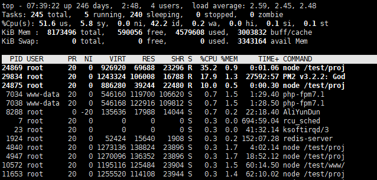
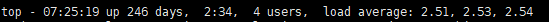
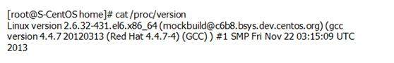
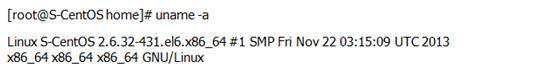
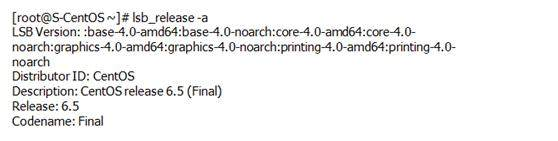
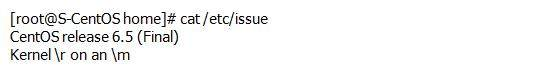

## Linux指令分类整理 - HQ

[TOC]

------

#### 注意

- 

------

## TOP

https://mp.weixin.qq.com/s/oIoRYyTGWP-9M26a5GhUag

top: 动态查看进程变化，监控 linux 的系统状况，是 Linux 下常用的性能分析工具，能够实时显示系统中各个进程的资源占用状况，类似于 Windows 的任务管理器。

下面详细介绍它的使用方法：



### 统计信息区

前五行是系统整体的统计信息。

第一行是任务队列信息，同 uptime 命令的执行结果。其内容如下：



> 07:25:19  当前时间
> up 246 days  系统运行时间
> 2:34
> 4 user  当前登录用户数
> load average: 2.51, 2.53, 2.53  系统负载，即任务队列的平均长度。
> 三个数值分别为 1分钟、5分钟、15分钟前到现在的平均值。

第二、三行为进程和 CPU 的信息。当有多个 CPU 时，这些内容可能会超过两行。内容如下：

> Tasks:
> total  进程总数
> running  正在运行的进程数
> sleeping  睡眠的进程数
> stopped  停止的进程数
> zombie  僵尸进程数

```
Cpu(s): 
us   用户空间占用CPU百分比 
sy   内核空间占用CPU百分比 
ni   用户进程空间内改变过优先级的进程占用CPU百分比 
id   空闲CPU百分比 
wa   等待输入输出的CPU时间百分比 
hi   硬中断（Hardware IRQ）占用CPU的百分比
si   软中断（Software Interrupts）占用CPU的百分比
st   (Steal time) 是当 hypervisor 服务另一个虚拟处理器的时候，虚拟 CPU 等待实际 CPU 的时间的百分比。
```

```
Mem: 
total   物理内存总量 
free   空闲内存总量 
used   使用的物理内存总量 
buff/cache   用作内核缓存的内存量
```

```
Swap: 
total   交换区总量 
free   空闲交换区总量 
used   使用的交换区总量
avail Mem 缓冲的交换区总量
```

内存中的内容被换出到交换区，而后又被换入到内存，但使用过的交换区尚未被覆盖，该数值即为这些内容已存在于内存中的交换区的大小。

相应的内存再次被换出时可不必再对交换区写入。

### 进程信息区

统计信息区域的下方显示了各个进程的详细信息。首先来认识一下各列的含义。

```
PID 进程id 
PPID 父进程id 
RUSER Real user name 
d UID 进程所有者的用户id 
e USER 进程所有者的用户名 
f GROUP 进程所有者的组名 
g TTY 启动进程的终端名。不是从终端启动的进程则显示为 ? 
h PR 优先级 
i NI nice值。负值表示高优先级，正值表示低优先级 
j P 最后使用的CPU，仅在多CPU环境下有意义 
k %CPU 上次更新到现在的CPU时间占用百分比 
l TIME 进程使用的CPU时间总计，单位秒 
m TIME+ 进程使用的CPU时间总计，单位1/100秒 
n %MEM 进程使用的物理内存百分比 
o VIRT 进程使用的虚拟内存总量，单位kb。VIRT=SWAP+RES 
p SWAP 进程使用的虚拟内存中，被换出的大小，单位kb。
q RES 进程使用的、未被换出的物理内存大小，单位kb。RES=CODE+DATA 
r CODE 可执行代码占用的物理内存大小，单位kb 
s DATA 可执行代码以外的部分(数据段+栈)占用的物理内存大小，单位kb 
t SHR 共享内存大小，单位kb 
u nFLT 页面错误次数 
v nDRT 最后一次写入到现在，被修改过的页面数。
w S 进程状态。
D=不可中断的睡眠状态 
R=运行 
S=睡眠 
T=跟踪/停止 
Z=僵尸进程 
x COMMAND 命令名/命令行 
y WCHAN 若该进程在睡眠，则显示睡眠中的系统函数名 
z Flags 任务标志，参考 sched.h
```

默认情况下仅显示比较重要的 PID、USER、PR、NI、VIRT、RES、SHR、S、% CPU、% MEM、TIME+、COMMAND 列。可以通过下面的快捷键来更改显示内容。

### top 命令选项

```
top [-] [d] [p] [q] [C] [S] [s] [n] 
-d 后跟秒数，指定每两次屏幕信息刷新之间的时间间隔，表示进程界面更新时间（默认为5秒）。如：将top进程表在/tmp/top.txt中打印2次。
 top -b -n 2 > /tmp/top.txt
-p进程ID    如：查看进程号为1的进程。top -p 1
-q 该选项将使top没有任何延迟的进行刷新。如果调用程序有超级用户权限，那么top将以尽可能高的优先级运行。
-S 指定累计模式 
-s 使top命令在安全模式中运行。这将去除交互命令所带来的潜在危险。
-i 使top不显示任何闲置或者僵死进程。
-c 显示整个命令行而不只是显示命令名
```

### Top 命令常见的操作

1、 2500 毫秒刷新一次 TOP 内容，总共 5 次，输出内容存放到 performace.txt 文件中

```
top -b -d 2.5 -n 5 > performace.txt
```

> 注：要将内容输出到文件中，必须使用 - b，表示批处理选项

2、TOP 命令如何快速按 % CPU、% MEM、TIME + 列排序

a) % CPU：使用大写字母按键：P
b) % MEM：使用大写字母按键：M
c) T IME + 使用大写字母按键：T

> 注：TOP 默认排序为倒序，如果确实需要升序排序，可以使用大写字母按键：R

3、TOP 命令中显示其它列值、将两列互换等

a) 选择显示列或隐藏列：使用小写字母按键：f
c) 交换列显示顺序：使用小写字母按键：o
b) 选择需要排序的列：使用大写字母按键：F

### CPU steal time

如果你想要部署虚拟环境（例如：Amazon EC2），steal time就是你想要关注的性能指标之一。如果这个指标的数值很高，那么说明机器状态非常糟糕。

虚拟机（VM）会与虚拟环境的宿主机上的多个虚拟机实例共享物理资源。其中之一共享的就是CPU时间切片。如果你的VM的物理机虚拟比是1/4， 那么它的CPU使用率不会限制于25%的CPU时间切片－它能够使用超过它设置的虚拟比。（有别于内存的使用，内存大小是严格控制的）。

可以使用Linux 的 TOP 命令来看到实时的一些性能指标。

两个你可能较为熟悉的是 %id(空闲 百分比) 和 %wa(I/O 等待 百分比)。如果 %id 很低， 那么说明CPU的工作负载很大并且没有多少计算负载能力剩余。如果 %wa 很高，则说明瓶 CPU 处于等待计算的状态，但是正在等待I/O活动的完成(类似 从数据库中获取存储在 磁盘上 的一行数据)。

%st（percent steal time） 是CPU展示的最后一个性能指标。

更多%st 的详细用法，请参考其他资料，期待共同进步。


## 查看Linux系统版本信息的几种方法

一、查看Linux内核版本命令（两种方法）：

1、cat /proc/version


2、uname -a


二、查看Linux系统版本的命令（3种方法）：

1、lsb_release -a，即可列出所有版本信息：


这个命令适用于所有的Linux发行版，包括RedHat、SUSE、Debian…等发行版。

2、cat /etc/redhat-release，这种方法只适合Redhat系的Linux：

[root@S-CentOS home]# cat /etc/redhat-release

CentOS release 6.5 (Final)

3、cat /etc/issue，此命令也适用于所有的Linux发行版。




## 系统磁盘调优及分析相关命令汇总

按照目录大小排序战士最前面15个目录或者文件

```
du -xB M --max-depth=2 /var | sort -rn | head -n 15
```

列出当前所有子目录的文件大小

```
du -h --max-depth=1
```

列出当前文件或者目录最大的10个

```
du -s * | sort -n | tail
```

按照目录大小从大到小排序

```
du -b --max-depth 1 | sort -nr | perl -pe 's{([0-9]+)}{sprintf "%.1f%s", $1>=2**30? ($1/2**30, "G"): $1>=2**20? ($1/2**20, "M"): $1>=2**10? ($1/2**10, "K"): ($1, "")}e'
```

列出path这个目录的文件树

```
du -h /path | sort -h
```

每隔60s监控对应目录的文件大小变化

```
watch -n60 du /var/log/messages
```

递归删除当前目录下所有子目录中的.svn目录

```
find . -type d -name '.svn' -print0 | xargs -0 rm -rdf
```

列出当前磁盘的使用情况

```
df -P | column -t
```

监控磁盘的使用情况

```
watch -d -n 5 df
```

列出当前inode的使用情况

```
df -i  <partition>
```

按照每个磁盘使用量从高到低排序

```
df -h | grep -v ^none | ( read header ; echo "$header" ; sort -rn -k 5)
```

查看物理磁盘的使用情况

```
df -x tmpfs | grep -vE "(gvfs|procbususb|rootfs)"
```

查看当前所有磁盘的大小和使用量

```
df -H
```

查看所有分区使用情况

```
fdisk -l /dev/sda
```

显示系统所有的分区或给定的分区

```
fdisk -l  

```

显示时，显示的是扇区数不是柱面数   
`fdisk -u `    
显示指定partition的block数

```
fdisk -s partition       
```

查看磁盘的读写容量

```
iostat -m -d /dev/sda1
```

测试磁盘的读写速度

```
hdparm -t /dev/sda
```

查看某个文件的所有链接

```
find -L / -samefile /path/to/file -exec ls -ld {} +
```

查看最大的5个文件

```
find . -type f -exec ls -s {} \; | sort -n -r | head -5
```

查看365天前的文件并删除

```
find ./ -type f -mtime +365 -exec rm -f {} \;
```

查看大于100M的文件

```
find . -type f -size +100M
```


