## Linux知识点整理 - HQ

[TOC]

------

#### 注意

- 


------

## Linux 编码风格

Linux有独特的编码风格，在内核源代码下存在一个文件`Documentation/CodingStyle`，进行了比较详细的描述。

Linux程序的命名习惯和Windows程序的命名习惯及著名的匈牙利命名法有很大的不同。

在Windows程序和单片机程序中，习惯以如下方式命名宏、变量和函数：

```c
#define PI 3.1415926 /* 用大写字母代表宏 */ 

int minValue, maxValue; /* 变量：第一个单词全小写，其后单词的第一个字母大写 */ 

void SendData(void); /* 函数：所有单词第一个字母都大写 */
```

这种命名方式在程序员中非常盛行，意思表达清晰且避免了匈牙利法的臃肿，单词之间通过首字母大写来区分。**通过第1个单词的首字母是否大写可以区分名称属于变量还是属于函数，而看到整串的大写字母可以断定为 宏。**实际上，Windows的命名习惯并非仅限于Windows编程，许多领域的程序开发都遵照此习惯。

但是Linux不以这种习惯命名，对于上面的一段程序，在Linux中它会被命名为：

```c
#define PI 3.1415926 

int min_value, max_value; 

void send_data(void);
```

在上述命名方式中，下划线大行其道，不按照Windows所采用的用首字母大写来区分单词的方式。Linux的命名 习惯与Windows命名习惯各有千秋。

**Linux 的代码缩进使用“TAB”键，不用空格键。**

### Linux 中代码括号“{”和“}”的使用原则

**1）对于结构体、if/for/while/switch语句，“{”不另起一行，例如：**

```c
struct var_data { 
    int len; 
    char data[0]; 
};
if (a == b) { 
    a = c; 
    d = a; 
}
for (i = 0; i < 10; i++) {
    a = c; 
    d = a;
}
```

**2）如果if、for循环后只有1行，不要加“{”和“}”，例如：**

```c
for (i = 0; i < 10; i++) {
      a = c; 
}
```

应该改为：

```c
for (i = 0; i < 10; i++) 
      a = c;
```

**3）if和else混用的情况下，else语句不另起一行，例如：**

```c
if (x == y) { 
    ... 
} else if (x > y) { 
    ... 
} else { 
    ... 
}
```

**4）对于函数，“{”另起一行，譬如：**

```c
int add(int a, int b) 
{ 
    return a + b; 
}
```

在switch/case语句方面，Linux 建议switch和case对齐，例如：

```c
switch (suffix) { 
case 'G': 
case 'g': 
    mem <<= 30;
    break; 
case 'M': 
case 'm': 
    mem <<= 20; 
    break; 
case 'K': 
case 'k': 
    mem <<= 10; 
    /* fall through */ 
default:
    break; 
}
```

内核下的 `Documentation/CodingStyle` 描述了Linux内核对编码风格的要求，内核下的 scripts/checkpatch.pl 提供了1个检查代码风格的脚本。如果使用`scripts/checkpatch.pl` 检查包含如下代码块的源程序：

```c
for (i = 0; i < 10; i++) { 
      a = c; 
}
```

就会产生`“WARNING：braces{}are not necessary for single statement blocks”`的警告。

另外，注意上面 for 函数空格的使用，中间是有很多空格的，用以清晰代码。

在工程阶段，一般可以在 SCM 软件的服务器端使能 `pre-commit hook`，自动检查工程师提交的代码是否符合 Linux 的编码风格，如果不符合，则自动拦截。


## 文件系统

#### 文件系统定义

文件系统是操作系统用于明确存储设备组织文件的方法。

即：文件管理系统（程序），简称文件系统。

#### 查看文件系统指令

```
df -T
```

#### 文件系统类型

- vfat : boot(bootloader, kernel)
- ext4 : 根目录
- tmpfs : 内存文件系统

#### 文件系统分区

嵌入式系统可分为4个区

- bootloader : 启动代码
- para : 启动代码向内核传递参数的位置
- kernel : 内核分区
- 根分区 ：文件系统结构

#### Linux文件系统目录结构

在Linux系统中，目录被组织成一个==单根倒置树结构==，文件系统从根目录开始，用`/`来表示。

文件名称区分大小写（大小写敏感还需要看具体的文件系统格式 ），以`.`开头的为隐藏文件，路径用`/`来进行分割（windows中使用`\`来分割），文件有两个种类，**元数据与数据本身**。

在操作linux系统时，通常会遵循以下的分层结构规则：

```
LSB (Linux Standard Base) / FHS(Filesystem Hierarchy Standard)
```

> 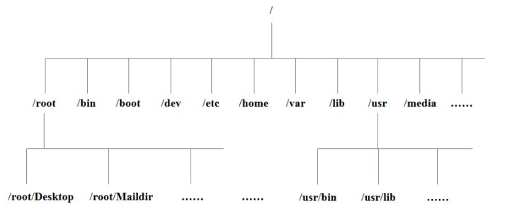

```
/ 所有linux操作系统的顶点目录,不像windows,每个分区都有一个顶点目录
/boot 存放系统启动时相关的文件,比如kernel内核,grub引导菜单.(不要删除.)
/bin 存放的都是命令,但仅普通用户能执行
/sbin 超级管理员能执行的命令.
/home 存放普通用户的家目录
/root 超级管理员的家目录,普通用户是无法进入
/etc 存放配置文件的目录,
/etc/hostname 主机名
/etc/hosts 本地解析域名一种方式
/etc/sysconfig/network-script/ifcfg-* 网卡的配置文件
/dev 设备目录,硬盘\硬盘的分区\光盘.....
/dev/null 黑洞,接收所有的东西,只进不出
/dev/zero 摇钱树,可以生产源源不断的数据
/dev/random 产生随机数的一个设备
/dev/pts/0 虚拟的Bash Shell终端,提供给远程用户使用 0,代表一个终端 1代表2个终端 以此类推
/usr 类似于windows的C盘下面的windows目录
/usr/lib 共享库文件,后缀都是so结尾, share object
/usr/lib64 共享库文件64位,后缀都是so结尾, share object
/usr/local 早起大家都把软件放在这个目录下,和windows C:\ProgramFile
/usr/bin
/usr/sbin
/var 存放一些可变化的内容,比如/var/log日志,可以人为让其发生变化,也或者是随着时间推移产生变化
/tmp 存放临时文件,无论哪个用户都可以放
/proc 反馈当前运行的进程的状态信息.
/run 存放程序运行后所产生的pid文件
/media
/mnt 提供挂载的一个目录
/opt 早期第三方厂商的软件存放的目录.
/srv 物理设备产生的一些文件
```

- 在 Linux 系统中，有几个目录是比较重要的，平时需要注意不要误删除或者随意更改内部文件。
- `/etc` 这个是系统中的配置文件，如果你更改了该目录下的某个文件可能会导致系统不能启动。
- `/bin, /sbin, /usr/bin, /usr/sbin` 这是==系统预设的执行文件的放置目录==，比如 `ls` 就是在`/bin/ls` 目录下的。
- 值得提出的是，`/bin, /usr/bin` 是给==系统用户==使用的指令（除root外的通用户），而`/sbin, /usr/sbin` 则是给==`root`==使用的指令。
- `/var` 这是一个非常重要的目录，系统上跑了很多程序，那么每个程序都会有相应的==日志==产生，而这些==日志就被记录到这个目录下==，具体在`/var/log` 目录下，另外`mail`的预设放置也是在这里。

#### 虚拟文件系统

vfs就是对各种文件系统的一个抽象，它为各种文件系统提供了一个通用的接口。

作用之一：简化了应用程序员的开发，不管什么文件类型，不管文件是磁盘还是设备，都只用open read write统一操作。

#### shell

一个shell对应一个终端，是一个图形化窗口。通过这个窗口输入或者输出文本，这个文本直接传递给shell进行分析解释，然后执行。（shell也是个应用程序，是提供给用户与内核打交道的工具）


## 软链接与硬链接

#### 软链接

**概念：**

1. 软链接文件类似于Windows的快捷方式。在你选定的位置上生成一个文件的镜像，不会占用磁盘空间。

2. 符号连接（Symbolic Link），也叫软连接，它实际上是一个特殊的文件。在符号连接中，文件实际上是一个文本文件，其中包含的有另一文件的位置信息。
3. 无论是软链接还是硬链接，文件都保持同步变化。

**生成软连接：**

`ln -s libwiringPi.so.2.50 libwiringPi.so`

`ln -s /bin/less /usr/local/bin/less`

> 指令 参数  要被链接的文件  软链接文件名字

#### 硬链接

**概念：**

1. 硬连接指通过索引节点来进行连接。
2. 在Linux的文件系统中，保存在磁盘分区中的文件不管是什么类型都给它分配一个编号，称为索引节点号(Inode Index)。
3. ==在Linux中，多个文件名指向同一索引节点是存在的。一般这种连接就是硬连接。==
4. 硬连接的作用是允许一个文件拥有多个有效路径名，这样用户就可以建立硬连接到重要文件，以防止“误删”的功能。
5. 其原因如上所述，因为对应该目录的索引节点有一个以上的连接。只删除一个连接并不影响索引节点本身和其它的连接，只有当最后一个连接被删除后，文件的数据块及目录的连接才会被释放。也就是说，文件真正删除的条件是与之相关的所有硬连接文件均被删除。

**生成硬连接：**

在你选定的位置上生成一个和源文件大小相同的文件

`ln libwiringPi.so.2.50 libwiringPi.so`


## 进程上下文

### 1、概念

- **上下文切换**：操作系统通过处理器调度让处理器轮流执行多个进程。实现不同进程中指令交替执行的机制称为进程的上下文切换。
- 进程的上下文：进程的物理实体（代码和数据等）和支持运行的环境合称为进程的上下文。进程的上下文包括用户级上下文和系统级上下文。
  - **用户级上下文**：由用户的程序块、数据块、运行时的堆和用户栈（统称为用户堆栈）等组成的用户空间信息被称为用户级上下文。
  - **系统级上下文**：由进程标识信息、进程现场信息、进程控制信息（包含进程表、页表、打开文件表等）和系统内核栈等组成的内核空间信息被称为系统级上下文。
- **寄存器上下文**：处理器中各个寄存器的内容被称为寄存器上下文（或硬件上下文）。

用户级上下文地址空间和系统级上下文地址空间一起构成了一个**进程的整个存储器映像**，如下表所示：

| 系统级上下文 | 用户级上下文 |
| ------------ | ------------ |
| 进程标识信息 | 用户堆栈     |
| 进程现场信息 | 用户数据块   |
| 进程控制信息 | 用户程序块   |
| 系统内核级   | 共享地址空间 |

实际上它就是进程的虚拟地址空间。

- **进程控制信息**：包含各种内核数据结构，如记录有关进程信息的进程表、页表、打开文件表等。

### 2、上下文切换

上下文切换发生在操作系统调度一个新进程到处理器时，它需要完成以下三件事：

1. **将当前处理器的寄存器上下文保存到当前进程的系统级上下文的现场信息中；**
2. **将新进程系统级上下文中的现场信息作为新的寄存器上下文恢复到处理器的各个寄存器中；**
3. **将控制转移到新进程执行。**

这里，一个重要的上下文信息是PC的值，当前进程被打断的断点处的PC作为寄存器上下文的一部分被保存在**进程现场信息**中，这样，下次改进程再被调度到处理器上执行时，就可以从其现场信息中获得断点处的PC，从而能从断点处开始执行。

下面给出的例子是一种典型的进程上下文切换场景。以下是经典的hello.c程序。

```c
# include<stdio.h>

int main () 
{
    printf ( "hello, world\n") ;
}
```

对于上述高级语言源程序，==首先需先对其进行预处理、编译成汇编语言表示，然后再用汇编程序将其转换为可重定位的二进制目标程序，再和库函数目标文件printf.o进行链接，生成最终的可执行目标文件hello。==

假定在UNIX系统上启动hello程序，其 shell命令行和 hello程序运行的结果如下。

```powershell
unix> ./hello [Enter]
hello, world
unix>
```

**上下文切换指把正在运行的进程换下，换一个新进程到处理器执行**。图给出了上述 shell 命令行执行过程中 shell 进程和 hello 进程的上下文切换过程：

1. 首先运行 shell 进程，从 shell 命令行中读入字符串“./ hello”到主存；
2. 当 shell 进程读到字符“[Enter]”后，转到操作系统执行，由**操作系统**进行上下文切换，以保存 shell
   进程的上下文并创建 hello 进程的上下文；
3. hello 进程执行结束后，再转到操作系统完成将控制权从 hello 进程交回给 shell 进程。

>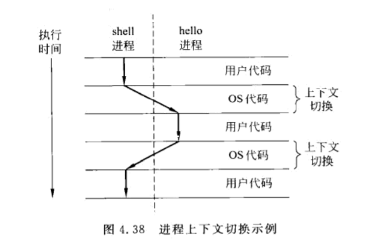

从上述过程可以看出，在一个进程的整个生命周期中，可能会有其他不同的进程在处理器中交替运行，例如，对于图4.38中的 hello 进程用户感觉到的时间除 hello 本身的执行时间外，还包括了操作系统执行上下文切换的时间。因此，对于每个进程的运行很难凭感觉给出准确时间。

### 3、作用

显然，处理器调度等事件会引起用户进程的正常执行被打断，因而形成了突变的异常控制流，而进程的上下文切换机制很好地解决了这类异常控制流，实现了从一个进程安全切换到另一个进程执行的过程。


## 在命令行创建以当前日期命名的目录或文件

在Linux中创建以年-月-日形式的当前日期命名的目录或文件

想要用当前日期创建目录，可以使用如下的命令：

```r
aufs]# date +%Y-%m-%d

2021-05-18

aufs]# mkdir $(date +%Y-%m-%d)
```


命令运行后将创建一个目录，并以 `yyyy-mm-dd` 形式的当前日期来命名。

 要切换到该目录，只需把 `mkdir` 改为 `cd` ：

```perl
$ cd "$(date +"%Y-%m-%d")"
```

同样地，如果要新建一个以当前日期命名的文件，只需把 `mkdir` 改为 `touch` 即可。

```perl
$ touch "$(date +"%Y-%m-%d")"
```

创建名称包含当前日期的目录或文件

如果要创建名称包含当前日期的目录或文件，也很简单，比如：

```r
aufs]# mkdir test-$(date +%Y-%m-%d)
```

创建文件：

```r
aufs]# touch test-$(date +%Y-%s-%d)
```

由于 yyyy-mm-dd` 格式也就是 ISO 格式，因此之前的命令也可以简单写为：

```ruby
aufs]# date -I

2021-05-18

$ mkdir $(date -I)
```

或者

```r
aufs]# date +%F

2021-05-18

aufs]# mkdir $(date +%F)
```

其他例子

如果只想使用当前**日期**，可以使用以下命令：

```perl
$ mkdir "$(date +%d)"
```

如果只想使用当前**月份**，可以使用以下命令：

```perl
$ mkdir "$(date +%m)"
```

如果只想使用当前**年份**，可以使用以下命令。其中小写 y 表示年份的后两位，大写 Y 表示四位完整年份：

```perl
$ mkdir "$(date +%y)"
$ mkdir "$(date +%Y)"
```

如果想使用当前**时间**创建目录，可以使用以下命令：

```perl
$ mkdir "$(date +%r)"
```

以上命令将会以 `hh:mm:ss PM/AM` 为格式的当前时间作为名称来创建目录。

如果只需要当前**秒数**，则执行以下命令：

```perl
$ mkdir "$(date +%S)"
```

如果只需要当前**分钟数**，则执行以下命令：

```perl
$ mkdir "$(date +%M)"
```

如果只需要当前**星期**，则执行以下命令：

```perl
$ mkdir "$(date +%A)"
```

> 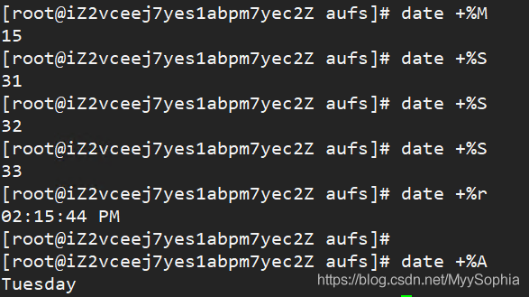

如果只需要当前**月份**，则执行以下命令：

```perl
$ mkdir "$(date +%B)"
```

当然，还有很多其它选项，限于篇幅本文就不一一罗列了。

这里列出了支持的操作：

```perl
%a     星期的简称，例如 Sun,Mon 等
%A     星期的全称，例如 Sunday,Monday 等
%b     月份的简称，例如 Jan,Feb 等
%B     月份的全称，例如 January,February 等
%c     日期和时间，例如 Sat 29 Oct 2020 05:02:25 PM CST
%C     世纪
%d     当月的第几天
%D     日期，相当于 %m/%d/%y
%e     当月的第几天，用空格代替首位的0，相当于 %_d
%F     日期，相当于 %Y-%m-%d
%g     年份的后两位
%G     四位年份
%h     相当于 %b
%H     小时，从00到23
%I     小时，从01到12
%j     当年的第几天，001到366之间
%k     小时，用空格代替首位的0，相当于 %_H
%l     小时，用空格代替首位的0，相当于 %_I
%m     月份，从01到12
%M     分钟，从00到59
%n     换行
%N     纳秒，从000000000到999999999
%p     上午(AM)或下午(PM)
%P     类似月%p，但是为小写
%q     一年的四分之几，1到4
%r     12小时制时间，例如 11:11:04 PM
%R     24小时制时间，相当于%H:%M
%s     从 1970-01-01 00:00:00 UTC 到当前的秒数
%S     second (00..60)
%t     tab符
%T     时间，相当于 %H:%M:%S
%u     星期几，从1到7，1表示星期一
%U     一年的第几个星期，以星期六作为星期的开始，00到53
%V     ISO星期数, 以星期一作为星期的开始，01到53
%w     星期几(0..6); 0 表示星期六
%W     ISO星期数, 以星期一作为星期的开始，00到53
%x     日期，例如 12/31/99
%X     时间，例如 23:13:48
%y     年份的后两位(00..99)
%Y     四位年份
%z     时区，例如 -0400
%:z    时区，例如 -04:00
%::z   时区，例如 -04:00:00
%:::z  时区，例如 -04, +05:30
%Z     时区, 例如 EDT
```

要了解更多 `date` 、`mkdir` 、 `touch` 命令的信息，可以使用 `man` 命令查看它们的详细用法。


## 结束程序快捷键区分

### ctrl + z

把当前进程转到后台运行，使用`fg`命令恢复。

> 比如`top -d1` 然后 `ctrl+z`，到后台，然后 `fg`  , 重新恢复。

将任务中止（暂停的意思）。

此时此任务并没有结束，仍然在进程中他只是维持挂起的状态。用户可以使用`fg/bg`操作继续前台或后台的任务，`fg`命令重新启动前台被中断的任务, `bg`命令把被中断的任务放在后台执行。

> 发送 SIGTSTP 信号给前台进程组中的所有进程，常用于挂起一个进程。
>
> 例如:当你vi一个文件是,如果需要用shell执行别的操作,但是你又不打算关闭vi,因为你得存盘推出,你可以简单的按下ctrl+z,shell会将vi进程挂起~,当你结束了那个shell操作之后,你可以用fg命令继续vi你的文件。

### ctrl + c

强制中断程序的执行，进程已经终止。

> 发送 SIGINT 信号给前台进程组中的所有进程。常用于终止正在运行的程序。

### ctrl + d

不是发送信号，而是表示一个特殊的二进制值，表示 EOF。

> 在shell中，ctrl-d表示退出当前shell.


## ubuntu关闭防火墙方法

1、打开终端，查看当前防火墙状态，输入命令

```bash
sudo ufw status
```

输入密码之后看到的结果是（如果显示是英文的话：active表示为开启状态）


2、关闭防火墙，输入命令

```bash
sudo ufw disable
```

之后继续输入状态查询命令可以看到结果（如果是英文的话：inactive表示为关闭状态）


3、**如果有需要开启的话**输入命令

```bash
sudo ufw enable
```

此时防火墙为开启状态。


4、至此，双方能够相互[ping](https://so.csdn.net/so/search?q=ping&spm=1001.2101.3001.7020)通。


## shell

shell就是一个应用程序，我们可以通过键盘、串口给它发送命令，回车后它就会去执行这些命令。

以“ls -l”命令为例，

① 接收键盘数据并回显

比如：我们使用键盘给shell程序发送字母l，它收到后会在屏幕上显示出来

② 解析输入的字符串，寻找程序，执行程序：

当我们使用键盘给shell程序发送回车时，它就知道字符输入结束了

a. shell会解析字符串，这些字符串用空格分为好几部分

第1部分就是程序名、命令名，

其他部分是参数

b. shell会去寻找该程序，去哪里找？去PATH环境变量所指示的位置找。

  你当然也可以指定绝对、相对路径，shell就会直接去这些路径找到程序

c. 找到程序后，会启动该程序，并传入参数

 


## apt命令常用功能介绍

### apt简介

apt全称为Advanced Package Tool， 是Debian、Ubuntu及他们的其衍生产品的主要命令行软件包管理器。它提供了用于搜索，管理和查询有关软件包的信息的命令行工具。在Ubuntu系列中，从16.04开始，引入了apt命令工具，其基本等价于apt-get、apt-cache 和 apt-config中最常用命令选项的集合。

### 测试环境

**基础系统：**Ubuntu 18.04

### apt常用参数简介

 list - 基于包名称列出所有源上软件包
 search - 搜索软件包
 show - 显示软件包具体信息
 install - 安装软件包
 remove -卸载软件包
 autoremove - 自动卸载所有不使用的软件包
 update - 更新软件源
 upgrade - 更新已安装的软件包
 full-upgrade -在升级软件包时自动处理依赖关系
 edit-sources - 编辑源文件，即/etc/apt/sources.list
 build-dep - 为源码包配置编译依赖

### apt命令常用实例

#### apt update

用于更新系统软件源中的所有软件列表，通常我们在第一次安装软包或者apt源时会执行该命令(等价于"apt-get update"命令),需要管理员权限，如：

```
linux@ubuntu:~$ sudo apt update
Hit:1 http://mirrors.aliyun.com/ubuntu bionic InRelease
Hit:2 http://mirrors.aliyun.com/ubuntu bionic-security InRelease
Hit:3 http://mirrors.aliyun.com/ubuntu bionic-updates InRelease                
Hit:4 http://mirrors.aliyun.com/ubuntu bionic-backports InRelease              
Hit:5 http://mirrors.aliyun.com/ubuntu bionic-proposed InRelease               
Reading package lists... Done                                                  
Building dependency tree       
Reading state information... Done
378 packages can be upgraded. Run 'apt list --upgradable' to see them.
```

#### apt install <软件名称>

安装指定软件(等价于"apt-get install"命令)，此命令需管理员权限。如安装ssh服务：

```
linux@ubuntu:~$ sudo apt install openssh-server
[sudo] password for linux: 
Reading package lists... Done
Building dependency tree       
Reading state information... Done
The following additional packages will be installed:
  ncurses-term openssh-client openssh-sftp-server ssh-import-id
Suggested packages:
  keychain libpam-ssh monkeysphere ssh-askpass molly-guard rssh
The following NEW packages will be installed:
  ncurses-term openssh-server openssh-sftp-server ssh-import-id
The following packages will be upgraded:
  openssh-client
1 upgraded, 4 newly installed, 0 to remove and 377 not upgraded.
Need to get 1,249 kB of archives.
After this operation, 5,321 kB of additional disk space will be used.
Do you want to continue? [Y/n] y
Get:1 http://mirrors.aliyun.com/ubuntu bionic-proposed/main amd64 openssh-client amd64 
```

#### apt remove <软件名称>

  用来卸载指定软件(等价于"apt-get remove"命令)， 此命令需管理员权限，如要卸载vim命令：

```
linux@ubuntu:~$ sudo apt remove vim
Reading package lists... Done
Building dependency tree       
Reading state information... Done
The following package was automatically installed and is no longer required:
  vim-runtime
Use 'sudo apt autoremove' to remove it.
The following packages will be REMOVED:
  vim
0 upgraded, 0 newly installed, 1 to remove and 375 not upgraded.
After this operation, 2,856 kB disk space will be freed.
Do you want to continue? [Y/n] y
(Reading database ... 131636 files and directories currently installed.)
Removing vim (2:8.0.1453-1ubuntu1.4) ...
update-alternatives: using /usr/bin/vim.tiny to provide /usr/bin/vi (vi) in auto mode
update-alternatives: using /usr/bin/vim.tiny to provide /usr/bin/view (view) in auto mode
update-alternatives: using /usr/bin/vim.tiny to provide /usr/bin/ex (ex) in auto mode
update-alternatives: using /usr/bin/vim.tiny to provide /usr/bin/rview (rview) in auto mode
linux@ubuntu:~$ 
```

#### apt search <软件关键字>

通过关键字进行搜索，列出所有与该关键字相关的软件包和其描述(等价于"apt-cache search"命令)，如我们要搜索ssh服务软件包，但又不知道详细的名称，可输入如下命令搜索：

```
linux@ubuntu:~$ apt search ssh
Sorting... Done
Full Text Search... Done
4pane/bionic 5.0-1 amd64
  four-pane detailed-list file manager
.#太多了，这里省略一些
.
.
#软件包名/版本信息
#软件包功能介绍
openssh-client/bionic-proposed,now 1:7.6p1-4ubuntu0.4 amd64 [installed,automatic]
  secure shell (SSH) client, for secure access to remote machines

openssh-client-ssh1/bionic 1:7.5p1-10 amd64
  secure shell (SSH) client for legacy SSH1 protocol

openssh-known-hosts/bionic,bionic 0.6.2-1 all
  download, filter and merge known_hosts for OpenSSH

openssh-server/bionic-proposed,now 1:7.6p1-4ubuntu0.4 amd64 [installed]
  secure shell (SSH) server, for secure access from remote machines
.
.
.
```

通过搜索查找，我们可确认ssh服务的软件包名称为openssh-server,此时可用上面介绍的"apt install openssh-server"命令对ssh服务进行安装

#### apt source <软件名称>

有时候我们需要下载当前系统软件包的源码，比如我下载Ubuntu 18.04系统中linux 4.15.0的内核源码，则通过如下方式获取：

```
linux@ubuntu:~$ sudo apt-get source linux-source-4.15.0
Reading package lists... Done
Picking 'linux' as source package instead of 'linux-source-4.15.0'
NOTICE: 'linux' packaging is maintained in the 'Git' version control system at:
git://git.launchpad.net/~ubuntu-kernel/ubuntu/+source/linux/+git/bionic
Please use:
git clone git://git.launchpad.net/~ubuntu-kernel/ubuntu/+source/linux/+git/bionic
to retrieve the latest (possibly unreleased) updates to the package.
Need to get 168 MB of source archives.
Get:1 http://mirrors.aliyun.com/ubuntu bionic-security/main linux 4.15.0-130.134 (dsc) [7,060 B]
Get:2 http://mirrors.aliyun.com/ubuntu bionic-security/main linux 4.15.0-130.134 (tar) [158 MB]
Get:3 http://mirrors.aliyun.com/ubuntu bionic-security/main linux 4.15.0-130.134 (diff) [10.6 MB]                                                                                   
Fetched 168 MB in 21s (7,936 kB/s)                                                                                                                                                  
dpkg-source: info: extracting linux in linux-4.15.0
dpkg-source: info: unpacking linux_4.15.0.orig.tar.gz
```

#### apt build-dep <软件名称>

  为源码包配置编译安装依赖 ，需要管理员权限，如我们要编译上面下载下来的linux-source-4.15.0的源码，这个时候我们就可以使用该命令安装其编译所需的所有依赖，确保我们编译时不会出现依赖问题：

```
linux@ubuntu:~$ sudo apt build-dep linux-source-4.15.0
Reading package lists... Done
Picking 'linux' as source package instead of 'linux-source-4.15.0'
Reading package lists... Done
Building dependency tree       
Reading state information... Done
The following package was automatically installed and is no longer required:
  vim-runtime
Use 'sudo apt autoremove' to remove it.
The following NEW packages will be installed:
  asciidoc asciidoc-base asciidoc-common autoconf automake autopoint autotools-dev bison ca-certificates-java curl debhelper default-jdk-headless default-jre-headless
  dh-autoreconf dh-strip-nondeterminism dh-systemd dkms docbook-dsssl docbook-utils docbook-xml docbook-xsl docutils-common fig2dev flex fonts-font-awesome fonts-lato
  fonts-lmodern gawk java-common kernel-wedge libaudit-dev libbison-dev libcap-ng-dev libcurl4 libdw-dev libelf-dev libexpat1-dev libfile-stripnondeterminism-perl libiberty-dev
  libjs-jquery libjs-modernizr libjs-sphinxdoc libjs-underscore liblzma-dev libnewt-dev libnuma-dev libosp5 libostyle1c2 libpci-dev libpng-dev libpotrace0 libptexenc1
  libpython-dev libpython-stdlib libpython2.7-dev libsgmls-perl libsigsegv2 libslang2-dev libssl-dev libsynctex1 libtexlua52 libtexluajit2 libtool libudev-dev libunwind-dev
  libxml2-utils libzzip-0-13 lynx lynx-common m4 makedumpfile openjade openjdk-11-jdk-headless openjdk-11-jre-headless opensp pkg-config po-debconf preview-latex-style python
  python-alabaster python-babel python-babel-localedata python-certifi python-chardet python-dev python-docutils python-idna python-imagesize python-jinja2 python-markupsafe
  python-minimal python-pkg-resources python-pygments python-requests python-roman python-six python-sphinx python-sphinx-rtd-theme python-typing python-tz python-urllib3
  python2.7 python2.7-dev python2.7-minimal python3-docutils python3-roman sgml-base sgml-data sgmlspl sharutils sphinx-common sphinx-rtd-theme-common tex-common texlive-base
  texlive-binaries texlive-fonts-recommended texlive-formats-extra texlive-latex-base texlive-latex-extra texlive-latex-recommended texlive-pictures texlive-plain-generic
  texlive-xetex tipa uuid-dev xml-core xmlto xsltproc zlib1g-dev
The following packages will be upgraded:
  libpython2.7 libpython2.7-minimal libpython2.7-stdlib libssl1.1 libudev1 libuuid1 udev
7 upgraded, 129 newly installed, 0 to remove and 359 not upgraded.
Need to get 413 MB of archives.
After this operation, 882 MB of additional disk space will be used.
Do you want to continue? [Y/n]  
Get:1 http://mirrors.aliyun.com/ubuntu bionic/main amd64 libsigsegv2 amd64 2.12-1 [14.7 kB]
Get:2 http://mirrors.aliyun.com/ubuntu bionic/main amd64 m4 amd64 1.4.18-1 [197 kB]
Get:3 http://mirrors.aliyun.com/ubuntu bionic/main amd64 flex amd64 2.6.4-6 [316 kB]
Get:4 http://mirrors.aliyun.com/ubuntu bionic/main amd64 fonts-lato all 2.0-2 [2,698 kB]
1% [4 fonts-lato 8,172 B/2,698 kB 0%]^C
```


## 推荐一个apt命令加速神器

### 引入

有时候使用apt/apt-get命令时，会遇到下载比较慢的情况，特别是遇到有需要安装PPA上的软件的时候，这时就可以用apt-fast神器来对其进行加速。其实现原理是利用了aria2进行多线程下载，原理这里不做展开。仅讲解下如何在Ubuntu和在树莓派中安装该神器。

### 测试环境

基础系统：Ubuntu 18.04

树莓派系统：Debian armhf版本

### Ubuntu上的安装方法

首先、添加apt-fast的安装源：

```
linux@ubuntu:~$ sudo add-apt-repository ppa:apt-fast/stable
 This PPA contains tested (stable) builds of apt-fast.
 More info: https://launchpad.net/~apt-fast/+archive/ubuntu/stable
Press [ENTER] to continue or Ctrl-c to cancel adding it.

Hit:1 http://mirrors.aliyun.com/ubuntu bionic InRelease
Get:2 http://mirrors.aliyun.com/ubuntu bionic-security InRelease [88.7 kB]                         
Get:3 http://mirrors.aliyun.com/ubuntu bionic-updates InRelease [88.7 kB]                                      
Get:4 http://mirrors.aliyun.com/ubuntu bionic-backports InRelease [74.6 kB] 
```

其次、安装apt-fast软件包：

```
linux@ubuntu:~$ sudo apt-get install apt-fast
Reading package lists... Done
Building dependency tree       
Reading state information... Done
The following package was automatically installed and is no longer required:
  vim-runtime
Use 'sudo apt autoremove' to remove it.
The following additional packages will be installed:
  aria2 libc-ares2
Suggested packages:
  aptitude zsh fish
The following NEW packages will be installed:
  apt-fast aria2 libc-ares2
0 upgraded, 3 newly installed, 0 to remove and 370 not upgraded.
Need to get 1,309 kB of archives.
After this operation, 5,040 kB of additional disk space will be used.
Do you want to continue? [Y/n] y
Get:1 http://mirrors.aliyun.com/ubuntu bionic/main amd64 libc-ares2 amd64 1.14.0-1 [37.1 kB]
Get:2 http://mirrors.aliyun.com/ubuntu bionic/universe amd64 aria2 amd64 1.33.1-1 [1,236 kB]
Get:3 http://ppa.launchpad.net/apt-fast/stable/ubuntu bionic/main amd64 apt-fast all 1.9.10-1~ubuntu18.04.1 [35.4 kB]
42% [2 aria2 526 kB/1,236 kB 43%] [3 apt-fast 8,370 B/35.4 kB 24%]                     
Fetched 1,309 kB in 2s (869 kB/s)                                 
Preconfiguring packages ...
Selecting previously unselected package libc-ares2:amd64.
(Reading database ... 136645 files and directories currently installed.)
....中间省略
Processing triggers for libc-bin (2.27-3ubuntu1) ...
```

中间提示选择命令时，如果系统有apt命令就选择apt，没有选择apt-get

> 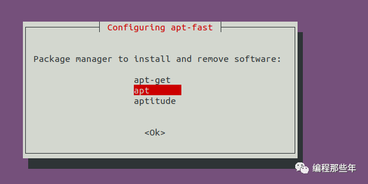

线程设为16

> 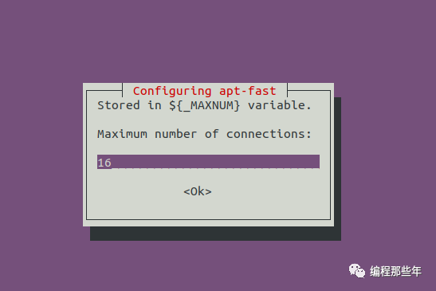

然后选择YES

> 

这样神器就安装完成了，以后需要使用apt或apt-get命令时，直接将apt/apt-get替换成apt-fast即可，比如要安装openssh-server软件，可输入如下命令进行安装：

```
linux@ubuntu:~$ sudo apt-fast  install  openssh-server 


01/16 07:33:52 [NOTICE] Downloading 4 item(s)

01/16 07:33:53 [NOTICE] Verification finished successfully. file=/var/cache/apt/apt-fast/ssh-import-id_5.7-0ubuntu1.1_all.deb

01/16 07:33:53 [NOTICE] Download complete: /var/cache/apt/apt-fast/ssh-import-id_5.7-0ubuntu1.1_all.deb

01/16 07:33:53 [NOTICE] Verification finished successfully. file=/var/cache/apt/apt-fast/openssh-server_1%3a7.6p1-4ubuntu0.4_amd64.deb

01/16 07:33:53 [NOTICE] Download complete: /var/cache/apt/apt-fast/openssh-server_1%3a7.6p1-4ubuntu0.4_amd64.deb

01/16 07:33:53 [NOTICE] Verification finished successfully. file=/var/cache/apt/apt-fast/ncurses-term_6.1-1ubuntu1.18.04_all.deb

01/16 07:33:53 [NOTICE] Download complete: /var/cache/apt/apt-fast/ncurses-term_6.1-1ubuntu1.18.04_all.deb

01/16 07:33:53 [NOTICE] Verification finished successfully. file=/var/cache/apt/apt-fast/openssh-sftp-server_1%3a7.6p1-4ubuntu0.4_amd64.deb

01/16 07:33:53 [NOTICE] Download complete: /var/cache/apt/apt-fast/openssh-sftp-server_1%3a7.6p1-4ubuntu0.4_amd64.deb

Download Results:
gid   |stat|avg speed  |path/URI
======+====+===========+=======================================================
54e7a0|OK  |    10MiB/s|/var/cache/apt/apt-fast/ssh-import-id_5.7-0ubuntu1.1_all.deb
a0fd11|OK  |   2.1MiB/s|/var/cache/apt/apt-fast/openssh-server_1%3a7.6p1-4ubuntu0.4_amd64.deb
e80297|OK  |   2.5MiB/s|/var/cache/apt/apt-fast/ncurses-term_6.1-1ubuntu1.18.04_all.deb
18d3c5|OK  |   136KiB/s|/var/cache/apt/apt-fast/openssh-sftp-server_1%3a7.6p1-4ubuntu0.4_amd64.deb

Status Legend:
(OK):download completed.
Reading package lists... Done
....中间省略
Processing triggers for systemd (237-3ubuntu10.33) ...
linux@ubuntu:~$ 
```

### 树莓派上的安装方法

首先下载"apt-fast-master.zip"软件包（*PS：可公众号上直接回复**"apt神器"**获取软件包*）
然后解压软件包，并将apt-fast命令拷贝到/usr/local/bin目录下，将apt-fast.conf配置文件拷贝到/etc目录下，如下：

```
pi@raspberrypi:~ $ unzip apt-fast-master.zip 
Archive:  apt-fast-master.zip
5f853c97ddc3704898b47e2e5af9714d68e2ff69
   creating: apt-fast-master/
  inflating: apt-fast-master/LICENSE  
  inflating: apt-fast-master/Makefile  
  inflating: apt-fast-master/README.md  
  inflating: apt-fast-master/apt-fast  
  inflating: apt-fast-master/apt-fast.conf  
   creating: apt-fast-master/completions/
   creating: apt-fast-master/completions/bash/
  inflating: apt-fast-master/completions/bash/apt-fast  
   creating: apt-fast-master/completions/fish/
  inflating: apt-fast-master/completions/fish/apt-fast.fish  
   creating: apt-fast-master/completions/zsh/
  inflating: apt-fast-master/completions/zsh/_apt-fast  
   creating: apt-fast-master/man/
  inflating: apt-fast-master/man/apt-fast.8  
  inflating: apt-fast-master/man/apt-fast.conf.5  
  inflating: apt-fast-master/quick-install.sh  

pi@raspberrypi:~ $ cd apt-fast-master/
pi@raspberrypi:~/apt-fast-master $ sudo cp apt-fast /usr/local/bin/
pi@raspberrypi:~/apt-fast-master $ sudo cp apt-fast.conf  /etc/
```

然后安装aria2 软件（*PS:建议先执行下sudo apt update 或者sudo  apt-get update* ）

```
pi@raspberrypi:~/apt-fast-master $ sudo apt install  aria2 -y
Reading package lists... Done
Building dependency tree       
Reading state information... Done
The following additional packages will be installed:
  libaria2-0 libc-ares2
The following NEW packages will be installed:
  aria2 libaria2-0 libc-ares2
0 upgraded, 3 newly installed, 0 to remove and 196 not upgraded.
2 not fully installed or removed.
Need to get 1,350 kB of archives.
After this operation, 5,395 kB of additional disk space will be used.
Get:1 http://mirrors.aliyun.com/raspbian/raspbian buster/main armhf libc-ares2 armhf 1.14.0-1 [80.4 kB]
Get:2 http://mirrors.aliyun.com/raspbian/raspbian buster/main armhf libaria2-0 armhf 1.34.0-4 [908 kB]
Get:3 http://mirrors.aliyun.com/raspbian/raspbian buster/main armhf aria2 armhf 1.34.0-4 [362 kB]
Fetched 1,350 kB in 6s (228 kB/s)
```

之后就可以用apt-fast愉快的替换apt或者apt命令了，如安装open-sserver软件就可以用

```
sudo apt-fast  install  openssh-server 
```


## Linux更换软件源

这篇文章不仅讲如何简单的替换Ubuntu指定版本的源文件内容，还教你以后怎么准确的将其他Linux常见系统源换成阿里源。以下以Ubuntu为例来说下如何正确的更换apt源。

### 备份源

首先，出于防止更换错误导致无法还原，我们先备份下原来的源文件

```
sudo cp /etc/apt/sources.list  /etc/apt/sources.list_bak
```

### 确认系统别名

通过**"lsb_release -a"**命令查看系统的Code name，如在Ubuntu 18.04上，查看到的是如下的信息

```
linux@ubuntu:~$ lsb_release -a
No LSB modules are available.
Distributor ID:    Ubuntu
Description:    Ubuntu 18.04.5 LTS
Release:    18.04
Codename:    bionic 
linux@ubuntu:~$ 
```

当然，如果知道系统的版本，也可以直接通过Ubuntu 的wiki官网查找到对应的Code name 如下：

> 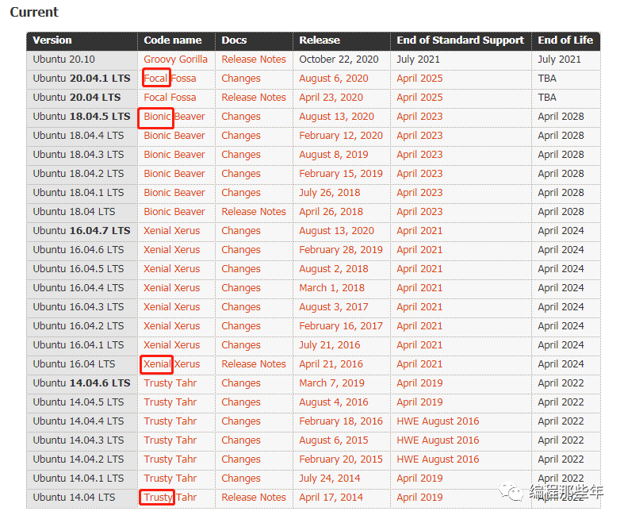

> 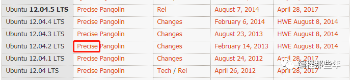

### 替换镜像源

首先进入阿里云官方镜像站（**https://developer.aliyun.com/mirror/**），找到Ubuntu的下载地址

> 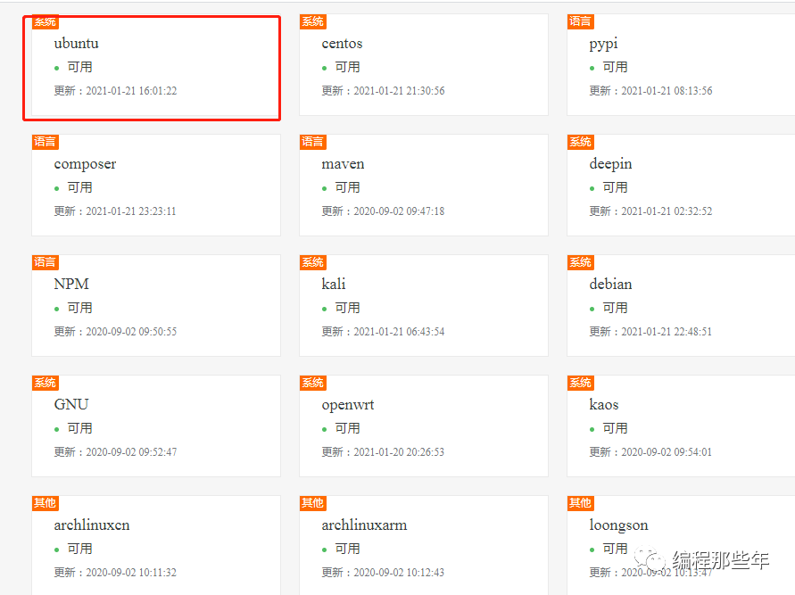

点进去，其实可以看到，里面教你如何包含了从14.04到20.04的几个长期维护版本的源如何替换。我们可以拷贝其中一份，比如14.04的源放进/etc/apt/sources.list，即：

```
$ vi /etc/apt/sources.list #打开该文件，添加下面这些源内容

deb https://mirrors.aliyun.com/ubuntu/ trusty main restricted universe multiverse
deb-src https://mirrors.aliyun.com/ubuntu/ trusty main restricted universe multiverse
deb https://mirrors.aliyun.com/ubuntu/ trusty-security main restricted universe multiverse
deb-src https://mirrors.aliyun.com/ubuntu/ trusty-security main restricted universe multiverse

deb https://mirrors.aliyun.com/ubuntu/ trusty-updates main restricted universe multiverse
deb-src https://mirrors.aliyun.com/ubuntu/ trusty-updates main restricted universe multiverse

deb https://mirrors.aliyun.com/ubuntu/ trusty-backports main restricted universe multiverse
deb-src https://mirrors.aliyun.com/ubuntu/ trusty-backports main restricted universe multiverse

## Not recommended
# deb https://mirrors.aliyun.com/ubuntu/ trusty-proposed main restricted universe multiverse
# deb-src https://mirrors.aliyun.com/ubuntu/ trusty-proposed main restricted universe multiverse
```

然后假如我们需要的是**12.04**的源，那只需要将其中14.04的Code name也就是**trusty**替换成**precise**即可（*PS：可以到https://mirrors.aliyun.com/ubuntu/dists/确认下相关的Ubuntu系统源是否存在*）

> 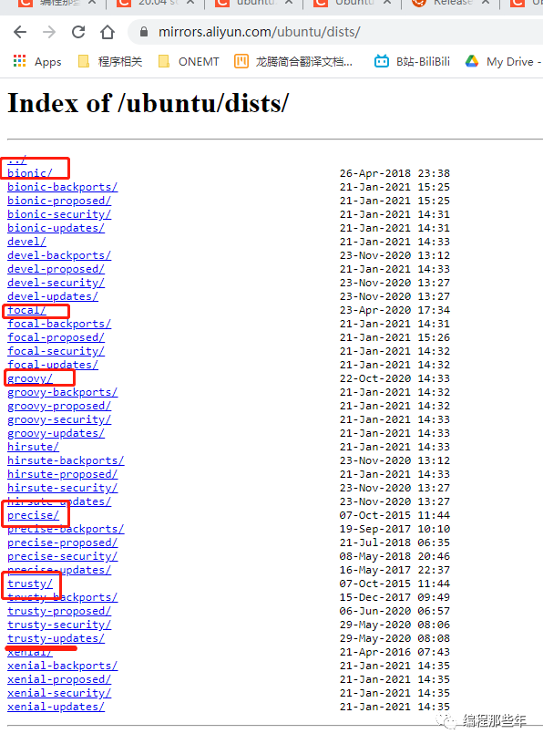

### 更新软件源

最后就是执行apt update 更新系统软件源中的所有软件列表。

```
$ sudo apt update
```

这样就完成了更换源的操作

### 附上其他Ubuntu常用的源地址

#### Ubuntu 18.04(bionic)的阿里源（/etc/apt/sources.list）配置如下：

```
deb http://mirrors.aliyun.com/ubuntu/ bionic main restricted universe multiverse
deb-src http://mirrors.aliyun.com/ubuntu/ bionic main restricted universe multiverse

deb http://mirrors.aliyun.com/ubuntu/ bionic-security main restricted universe multiverse
deb-src http://mirrors.aliyun.com/ubuntu/ bionic-security main restricted universe multiverse

deb http://mirrors.aliyun.com/ubuntu/ bionic-updates main restricted universe multiverse
deb-src http://mirrors.aliyun.com/ubuntu/ bionic-updates main restricted universe multiverse

deb http://mirrors.aliyun.com/ubuntu/ bionic-proposed main restricted universe multiverse
deb-src http://mirrors.aliyun.com/ubuntu/ bionic-proposed main restricted universe multiverse

deb http://mirrors.aliyun.com/ubuntu/ bionic-backports main restricted universe multiverse
deb-src http://mirrors.aliyun.com/ubuntu/ bionic-backports main restricted universe multiverse
```

#### Ubuntu 20.04(focal)的阿里源（/etc/apt/sources.list）配置如下：

```
deb http://mirrors.aliyun.com/ubuntu/ focal main restricted universe multiverse
deb-src http://mirrors.aliyun.com/ubuntu/ focal main restricted universe multiverse

deb http://mirrors.aliyun.com/ubuntu/ focal-security main restricted universe multiverse
deb-src http://mirrors.aliyun.com/ubuntu/ focal-security main restricted universe multiverse

deb http://mirrors.aliyun.com/ubuntu/ focal-updates main restricted universe multiverse
deb-src http://mirrors.aliyun.com/ubuntu/ focal-updates main restricted universe multiverse

deb http://mirrors.aliyun.com/ubuntu/ focal-proposed main restricted universe multiverse
deb-src http://mirrors.aliyun.com/ubuntu/ focal-proposed main restricted universe multiverse

deb http://mirrors.aliyun.com/ubuntu/ focal-backports main restricted universe multiverse
deb-src http://mirrors.aliyun.com/ubuntu/ focal-backports main restricted universe multiverse
```

#### Ubuntu 16.04的阿里源（/etc/apt/sources.list）配置如下：

```
deb http://mirrors.aliyun.com/ubuntu/ xenial main
deb-src http://mirrors.aliyun.com/ubuntu/ xenial main

deb http://mirrors.aliyun.com/ubuntu/ xenial-updates main
deb-src http://mirrors.aliyun.com/ubuntu/ xenial-updates main

deb http://mirrors.aliyun.com/ubuntu/ xenial universe
deb-src http://mirrors.aliyun.com/ubuntu/ xenial universe
deb http://mirrors.aliyun.com/ubuntu/ xenial-updates universe
deb-src http://mirrors.aliyun.com/ubuntu/ xenial-updates universe

deb http://mirrors.aliyun.com/ubuntu/ xenial-security main
deb-src http://mirrors.aliyun.com/ubuntu/ xenial-security main
deb http://mirrors.aliyun.com/ubuntu/ xenial-security universe
deb-src http://mirrors.aliyun.com/ubuntu/ xenial-security universe
```

### 针对树莓派

如果是树莓派呢？按上面一样的方法， 我们同样可以在阿里云官方镜像站里找到Raspbian镜像的阿里源模板(Raspbian 10的apt源)

```
deb https://mirrors.aliyun.com/raspbian/raspbian/ buster main non-free contrib
deb-src https://mirrors.aliyun.com/raspbian/raspbian/ buster main non-free contrib
```

那么通过"**lsb_release -a"**命令确认**Code Name**之后，将**buster** 字段改成相应的**Code Name**即可
(***PS:***可以到https://mirrors.aliyun.com/raspbian/raspbian/dists/确认下相关的Raspbian系统源是否存在）
如针对Raspbian 9的apt源改成如下效果：

```
deb https://mirrors.aliyun.com/raspbian/raspbian/ stretch main non-free contrib
deb-src https://mirrors.aliyun.com/raspbian/raspbian/ stretch main non-free contrib
```

最后执行"sudo **apt update** "更新系统软件源中的所有软件列表。


## 根目录

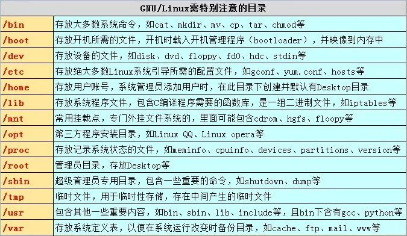

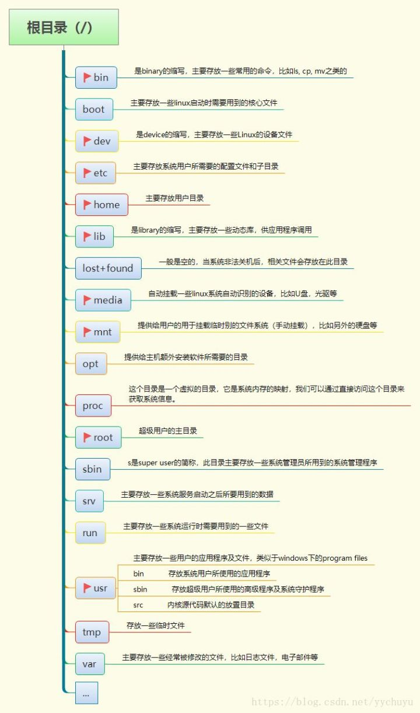

## 常用软件

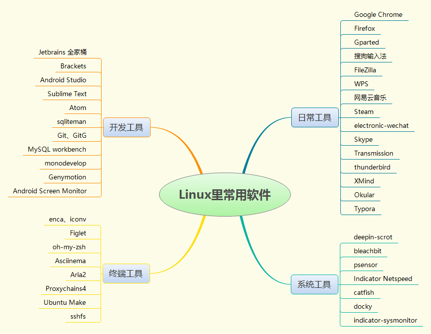

## 必读书籍

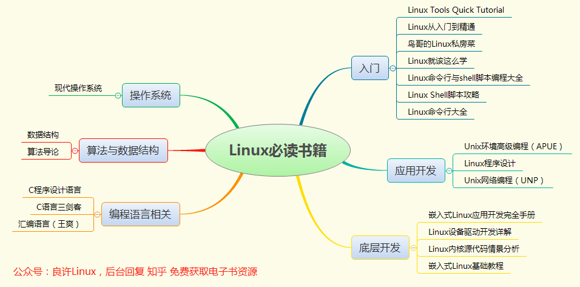

## 从业方向

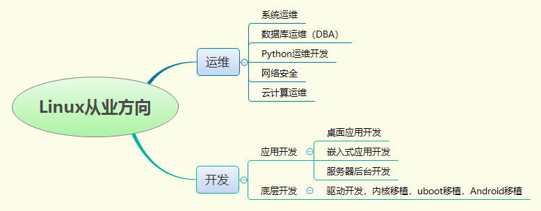


