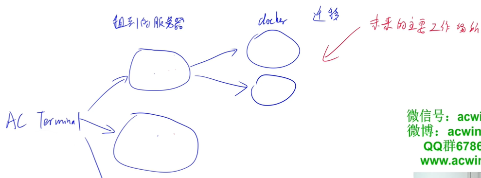
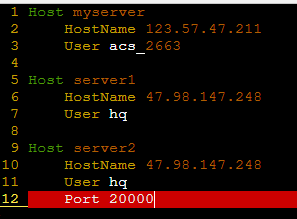
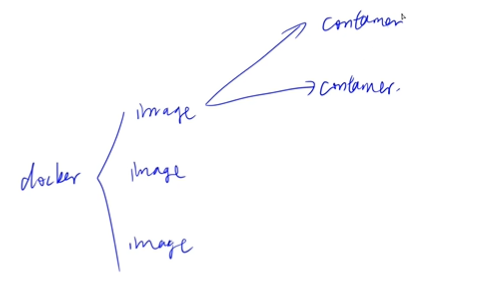

## 配置云服务器

[TOC]

------

#### 注意

- 

------

## 云平台

##### 云平台的作用:

1. 存放我们的docker容器，让计算跑在云端。
2. 获得公网IP地址，让每个人可以访问到我们的服务。

##### 任选一个云平台即可，推荐配置：

1. 1核 2GB（后期可以动态扩容，前期配置低一些没关系）
2. 网络带宽采用按量付费，最大带宽拉满即可（费用取决于用量，与最大带宽无关）
3. 系统版本：ubuntu 20.04 LTS（推荐用统一版本，避免后期出现配置不兼容的问题）

##### 服务器与docker：

1. 租到的服务器是毛坯房，服务器配置就是对毛坯房进行装修。
2. docker就是带装修的每个小房间，一个毛坯房可以有多个dockor。

> 


## 租云服务器及安装docker

### 阿里云

阿里云地址：https://www.aliyun.com/

#### 创建工作用户`acs`并赋予`sudo`权限

登录到新服务器。打开[AC Terminal](https://www.acwing.com/file_system/file/content/whole/index/content/2543025/)，然后：

```
ssh root@xxx.xxx.xxx.xxx  # xxx.xxx.xxx.xxx替换成新服务器的公网IP
```

创建`acs`用户：

```
adduser acs  # 创建用户acs
usermod -aG sudo acs  # 给用户acs分配sudo权限
```

登出：`logout`

------

#### 配置免密登录方式

退回[AC Terminal](https://www.acwing.com/file_system/file/content/whole/index/content/2543025/)，然后配置`acs`用户的别名和免密登录，可以参考[4. ssh——ssh登录](https://www.acwing.com/file_system/file/content/whole/index/content/2898263/)。

`ssh-keygen`：生成ssh密钥对。

`cd .ssh/`：进入ssh文件夹。

`vi config`：修改配置文件。

```
Host myserver
    HostName 123.57.47.211
    User acs_2663

Host server1
    HostName 47.98.147.248
    User hq
```

`ssh-copy-id server1`：一键添加公钥到远程服务器。

> 

------

#### 配置新服务器的工作环境

将[AC Terminal](https://www.acwing.com/file_system/file/content/whole/index/content/2543025/)的配置传到新服务器上：

```
scp .bashrc .vimrc .tmux.conf server_name:  
# server_name需要换成自己配置的别名
```

------

#### 安装`tmux`和`docker`

登录自己的服务器，然后安装`tmux`：

```
sudo apt-get update
sudo apt-get install tmux
```

打开`tmux`。（养成好习惯，所有工作都在`tmux`里进行，防止意外关闭终端后，工作进度丢失）

然后在`tmux`中根据[docker安装教程](https://docs.docker.com/engine/install/ubuntu/)安装`docker`即可。


### 腾讯云

腾讯云地址：https://cloud.tencent.com/

#### 创建工作用户`acs`并赋予`sudo`权限

登录到新服务器。打开[AC Terminal](https://www.acwing.com/file_system/file/content/whole/index/content/2543025/)，然后：

```
ssh root@xxx.xxx.xxx.xxx  # 注意腾讯云登录的用户不是root，而是ubuntu
```

创建`acs`用户：

```
adduser acs  # 创建用户acs
usermod -aG sudo acs  # 给用户acs分配sudo权限
```

------

#### 配置免密登录方式

退回[AC Terminal](https://www.acwing.com/file_system/file/content/whole/index/content/2543025/)，然后配置`acs`用户的别名和免密登录，可以参考[4. ssh——ssh登录](https://www.acwing.com/file_system/file/content/whole/index/content/2898263/)。

------

#### 配置新服务器的工作环境

将[AC Terminal](https://www.acwing.com/file_system/file/content/whole/index/content/2543025/)的配置传到新服务器上：

```
scp .bashrc .vimrc .tmux.conf server_name:  # server_name需要换成自己配置的别名
```

------

#### 安装`tmux`和`docker`

登录自己的服务器，然后安装`tmux`：

```
sudo apt-get update
sudo apt-get install tmux
```

打开`tmux`。（养成好习惯，所有工作都在`tmux`里进行，防止意外关闭终端后，工作进度丢失）

然后在`tmux`中根据[docker安装教程](https://docs.docker.com/engine/install/ubuntu/)安装`docker`即可。


### 华为云

华为云地址：https://www.huaweicloud.com/

#### 创建工作用户`acs`并赋予`sudo`权限

登录到新服务器。打开[AC Terminal](https://www.acwing.com/file_system/file/content/whole/index/content/2543025/)，然后：

```
ssh root@xxx.xxx.xxx.xxx  # xxx.xxx.xxx.xxx替换成新服务器的公网IP
```

创建`acs`用户：

```
adduser acs  # 创建用户acs
usermod -aG sudo acs  # 给用户acs分配sudo权限
```

------

#### 配置免密登录方式

退回[AC Terminal](https://www.acwing.com/file_system/file/content/whole/index/content/2543025/)，然后配置`acs`用户的别名和免密登录，可以参考[4. ssh——ssh登录](https://www.acwing.com/file_system/file/content/whole/index/content/2898263/)。

------

#### 配置新服务器的工作环境

将[AC Terminal](https://www.acwing.com/file_system/file/content/whole/index/content/2543025/)的配置传到新服务器上：

```
scp .bashrc .vimrc .tmux.conf server_name:  # server_name需要换成自己配置的别名
```

------

#### 安装`tmux`和`docker`

登录自己的服务器，然后安装`tmux`：

```
sudo apt-get update
sudo apt-get install tmux
```

打开`tmux`。（养成好习惯，所有工作都在`tmux`里进行，防止意外关闭终端后，工作进度丢失）

然后在`tmux`中根据[docker安装教程](https://docs.docker.com/engine/install/ubuntu/)安装`docker`即可。

跟着教程装完后通过`docker --version`：查看版本，确认是否安装成功。


## docker教程

#### 将当前用户添加到`docker`用户组

为了避免每次使用`docker`命令都需要加上`sudo`权限，可以将当前用户加入安装中自动创建的`docker`用户组(可以参考[官方文档](https://docs.docker.com/engine/install/linux-postinstall/))：（执行命令后要重新登录才能生效）

```
sudo usermod -aG docker $USER
```

------

#### 镜像（images）

docker相当于虚拟机，镜像类似于模板。

镜像和容器就可以理解成面向对象的**类和实例**的关系。

> 

1. `docker pull ubuntu:20.04`：拉取一个镜像
2. `docker images`：列出本地所有镜像
3. `docker image rm ubuntu:20.04` 或 `docker rmi ubuntu:20.04`：删除镜像`ubuntu:20.04`
4. `docker [container] commit CONTAINER IMAGE_NAME:TAG`：创建某个`container`的镜像
5. `docker save -o ubuntu_20_04.tar ubuntu:20.04`：将镜像`ubuntu:20.04`导出到本地文件`ubuntu_20_04.tar`中
6. `docker load -i ubuntu_20_04.tar`：将镜像`ubuntu:20.04`从本地文件`ubuntu_20_04.tar`中加载出来
6. `scp server1:ubuntu_20_04.tar .`：将server1服务器中的镜像文件复制到当前目录下

------

#### 容器(container)

1. `docker [container] create -it ubuntu:20.04`：利用镜像`ubuntu:20.04`创建一个容器。
2. `docker ps`：查看本地正在运行的容器
3. `docker ps -a`：查看本地的所有容器
4. `docker [container] start CONTAINER`：启动容器
5. `docker [container] stop CONTAINER`：停止容器
6. `docker [container] restart CONTAINER`：重启容器
7. `docker [contaienr] run -itd ubuntu:20.04`：创建并启动一个容器
7. `docker [container] attach CONTAINER`：进入容器

   - 先按`Ctrl + p`，再按`Ctrl + q`可以挂起容器
- `ctrl + d`：直接关闭容器
9. `docker [container] exec CONTAINER COMMAND`：在容器中执行命令
10. `docker [container] rm CONTAINER`：删除容器
11. `docker container prune`：删除所有已停止的容器
12. `docker export -o xxx.tar CONTAINER`：将容器`CONTAINER`导出到本地文件`xxx.tar`中
13. `docker import xxx.tar image_name:tag`：将本地文件`xxx.tar`导入成镜像，并将镜像命名为`image_name:tag`
13. `docker export/import`与`docker save/load` 的区别：
    - `export/import`会丢弃历史记录和元数据信息，仅保存容器当时的快照状态
    - `save/load`会保存完整记录，体积更大
15. `docker top CONTAINER`：查看某个容器内的所有进程
16. `docker stats`：查看所有容器的统计信息，包括CPU、内存、存储、网络等信息
17. `docker cp xxx CONTAINER:xxx` 或 `docker cp CONTAINER:xxx xxx`：在本地和容器间复制文件
18. `docker rename CONTAINER1 CONTAINER2`：重命名容器
18. `docker update CONTAINER --memory 500MB`：修改容器限制

#### 实战

进入AC Terminal，然后：

```
scp /var/lib/acwing/docker/images/docker_lesson_1_0.tar server_name:  # 将镜像上传到自己租的云端服务器

ssh server_name  # 登录自己的云端服务器

docker load -i docker_lesson_1_0.tar  # 将镜像加载到本地

docker run -p 20000:22 --name my_docker_server -itd docker_lesson:1.0  # 创建并运行docker_lesson:1.0镜像
（-p 20000:22为进行端口号映射）

docker attach my_docker_server  # 进入创建的docker容器

passwd  # 设置root密码
```

去云平台控制台中修改安全组配置，放行端口`20000`。

返回AC Terminal，即可通过`ssh`登录自己的`docker`容器：

```
ssh root@xxx.xxx.xxx.xxx -p 20000  # 将xxx.xxx.xxx.xxx替换成自己租的服务器的IP地址
```

然后，可以仿照上节课内容，创建工作账户`acs`。

`adduser xx`：添加用户

`usermod -aG sudo xx`：分配sudo权限

`apt-get install sudo`：安装sudo指令

 `su xx`：切换用户

最后，可以参考[4. ssh——ssh登录](https://www.acwing.com/file_system/file/content/whole/index/content/2898263/)配置`docker`容器的别名和免密登录。

------

#### 小Tips

如果`apt-get`下载软件速度较慢，可以参考[清华大学开源软件镜像站](https://mirrors.tuna.tsinghua.edu.cn/help/ubuntu/)中的内容，修改软件源。


