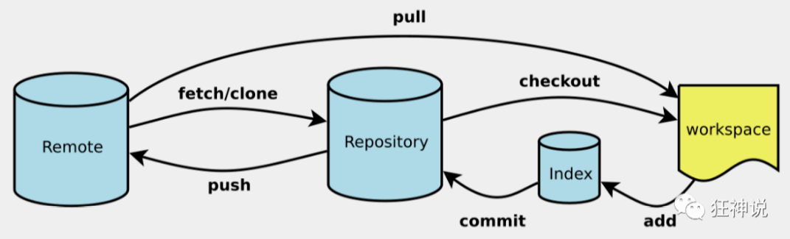
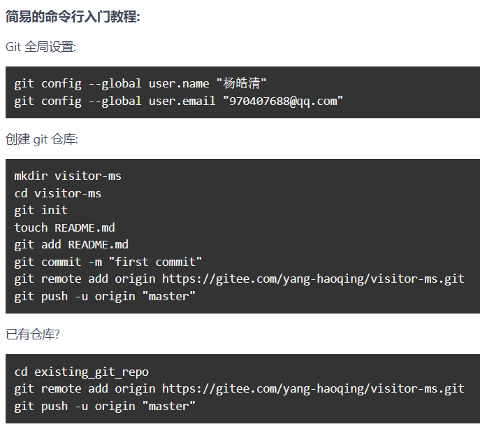
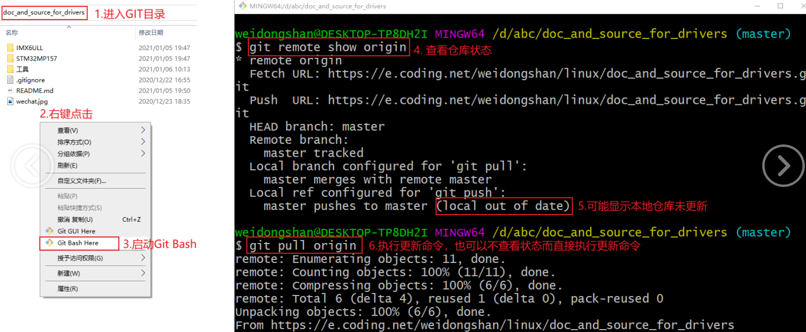
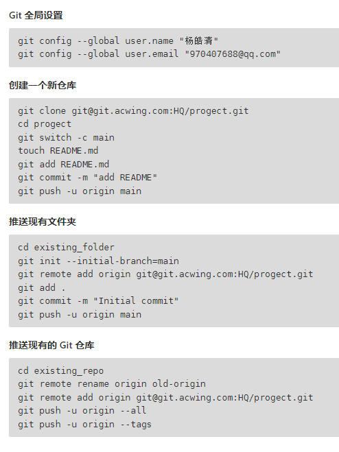
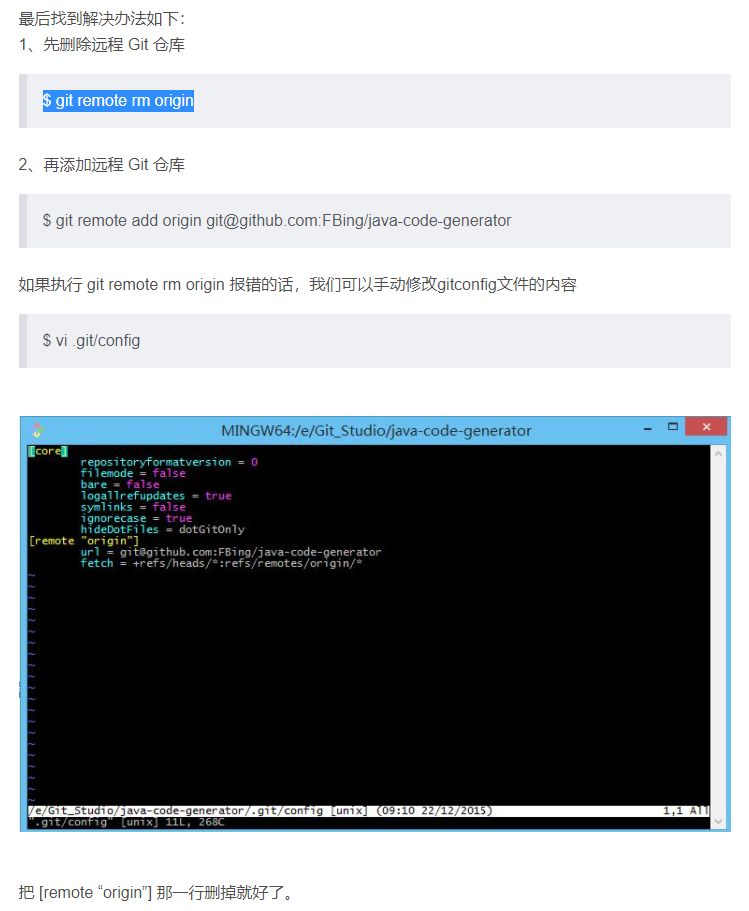
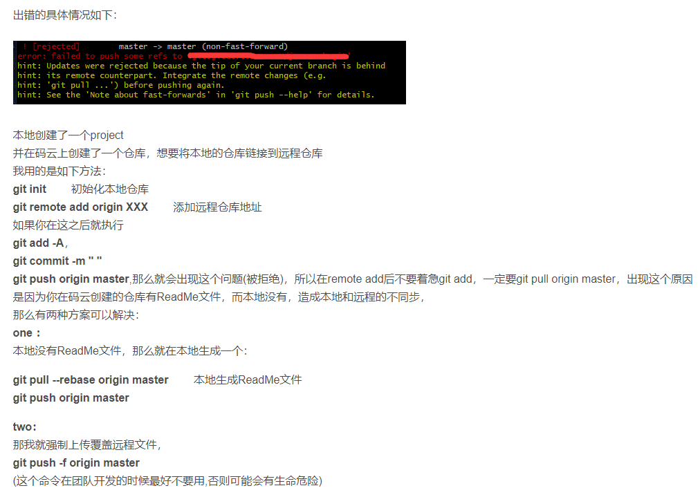

## git学习笔记

[TOC]

------

#### 注意

- 

------

### git命令分类整理



#### 日常使用步骤

Git 全局设置:

```
git config --global user.name "杨皓清"
git config --global user.email "970407688@qq.com"
```

Gitee 账号密码：

```
Username:yang-haoqing
Password:X
```

1. 首先在gitee上新建仓库并配置，然后再本地文件夹中打开git bash
2. `git init`：将当前目录配置成git仓库，信息记录在隐藏的.git文件夹中
3. `git remote add origin git@git.acwing.com:xxx/XXX.git`：将本地仓库关联到远程仓库
4. `git pull origin master`：将远程仓库内容保存到本地（可选）
5. `git add .` ：将XX文件添加到暂存区
6. `git commit -m "xxx"`：将暂存区的内容提交到当前分支
7. `git push -u origin master`：第一次将分支推送到远程仓库

> 

####  全局设置

1. `git config --global user.name xxx`：设置全局用户名，信息记录在`~/.gitconfig`文件中
2. `git config --global user.email xxx@xxx.com`：设置全局邮箱地址，信息记录在`~/.gitconfig`文件中
3. `git init`：将当前目录配置成git仓库，信息记录在隐藏的.git文件夹中
3. `ssh-keygen -t rsa -C "970407688@qq.com"`：生成自己的ssh密钥对，然后添加公钥到远程仓库
3. `git remote add origin git@git.acwing.com:xxx/XXX.git`：将本地仓库关联到远程仓库
3. 关联后，使用命令`git push -u origin master`第一次推送master分支的所有内容

#### 常用命令

1. `git add XX` ：将XX文件添加到暂存区
2. `git commit -m "给自己看的备注信息"`：将暂存区的内容提交到当前分支
3. `git status`：查看仓库状态
4. `git log`：查看当前分支的所有版本
5. `git push -u (第一次需要-u以后不需要)`  ：将当前分支推送到远程仓库
6. `git clone git@git.acwing.com:xxx/XXX.git`：将远程仓库XXX下载到当前目录下
7. `git branch`：查看所有分支和当前所处分支
8. 直接执行，强制提交并覆盖远程仓库

   ```
   git push -f origin master
   ```


#### 查看命令

1. `git diff XX`：查看XX文件相对于暂存区修改了哪些内容
2. `git status`：查看仓库状态
3. `git log`：查看当前分支的所有版本
   - `git log --pretty=oneline`：用一行来显示
4. `git reflog`：查看HEAD指针的移动历史（包括被回滚的版本）
5. `git branch`：查看所有分支和当前所处分支
6. `git pull` ：将远程仓库的当前分支与本地仓库的当前分支合并
6. `git remote -v`：查看本地与远程仓库关联情况
6. `git config --system --list`：查看系统config
6. `git config --global --list`：查看当前用户(global)配置

#### 删除命令

1. `git rm --cached XX`：将文件从仓库索引目录中删掉，不希望管理这个文件
2. `git restore --staged xx`：==将xx从暂存区里移除==
3. `git checkout — XX`或`git restore XX`：==将XX文件尚未加入暂存区的修改全部撤销==

#### 代码回滚

1. `git reset --hard HEAD^`  或`git reset --hard HEAD~` ：将代码库回滚到上一个版本
   - `git reset --hard HEAD^^`：往上回滚两次，以此类推
   - `git reset --hard HEAD~100`：往上回滚100个版本
   - `git reset --hard 版本号`：回滚到某一特定版本

#### 远程仓库

1. `git remote add origin git@git.acwing.com:xxx/XXX.git`：将本地仓库关联到远程仓库
2. `git push -u (第一次需要-u以后不需要)`  ：将当前分支推送到远程仓库
   - `git push origin branch_name`：将本地的某个分支推送到远程仓库
   - `git push -u origin branch_name`：第一次将分支推送到远程仓库
3. `git clone git@git.acwing.com:xxx/XXX.git`：将远程仓库XXX下载到当前目录下
4. `git push --set-upstream origin branch_name`：设置本地的`branch_name`分支对应远程仓库的`branch_name`分支（在远程创建分支并推送内容）
5. `git push -d origin branch_name`：删除远程仓库的`branch_name`分支
6. `git checkout -t origin/branch_name` 将远程的`branch_name`分支拉取到本地
7. `git pull` ：将远程仓库的当前分支与本地仓库的当前分支合并
   - `git pull origin branch_name`：将远程仓库的`branch_name`分支与本地仓库的当前分支合并
8. `git branch --set-upstream-to=origin/branch_name1 branch_name2`：将远程的`branch_name1`分支与本地的`branch_name2`分支对应
8. `git remote rm origin`：删除远程git仓库
8. `git remote -v`：查看本地与远程仓库关联情况

#### 分支命令

1. `git branch branch_name`：创建新分支
2. `git branch`：查看所有分支和当前所处分支
3. `git checkout -b branch_name`：创建并切换到`branch_name`这个分支
4. `git checkout branch_name`：切换到`branch_name`这个分支
5. `git merge branch_name`：将分支`branch_name`合并到当前分支上
6. `git branch -d branch_name`：删除本地仓库的`branch_name`分支
7. `git push --set-upstream origin branch_name`：设置本地的`branch_name`分支对应远程仓库的`branch_name`分支
8. `git push -d origin branch_name`：删除远程仓库的`branch_name`分支
9. `git checkout -t origin/branch_name` 将远程的`branch_name`分支拉取到本地
10. `git pull` ：将远程仓库的当前分支与本地仓库的当前分支合并
    - `git pull origin branch_name`：将远程仓库的`branch_name`分支与本地仓库的当前分支合并
11. `git branch --set-upstream-to=origin/branch_name1 branch_name2`：将远程的`branch_name1`分支与本地的`branch_name2`分支对应

#### stash暂存

1. `git stash`：将工作区和暂存区中尚未提交的修改存入栈中
2. `git stash apply`：将栈顶存储的修改恢复到当前分支，但不删除栈顶元素
3. `git stash drop`：删除栈顶存储的修改
4. `git stash pop`：将栈顶存储的修改恢复到当前分支，同时删除栈顶元素
5. `git stash list`：查看栈中所有元素


---

####  git基本概念

- 工作区：仓库的目录。工作区是独立于各个分支的。
- 暂存区：数据暂时存放的区域，类似于工作区写入版本库前的缓存区。暂存区是独立于各个分支的。
- 版本库：存放所有已经提交到本地仓库的代码版本
- 版本结构：树结构，树中每个节点代表一个代码版本。

####  git常用命令

1. `git config --global user.name xxx`：设置全局用户名，信息记录在`~/.gitconfig`文件中
2. `git config --global user.email xxx@xxx.com`：设置全局邮箱地址，信息记录在`~/.gitconfig`文件中
3. `git init`：将当前目录配置成git仓库，信息记录在隐藏的.git文件夹中
4. `git add XX` ：将XX文件添加到暂存区
- `git add .`：将所有待加入暂存区的文件加入暂存区
5. `git rm --cached XX`：将文件从仓库索引目录中删掉，不希望管理这个文件
   - `git restore --staged xx`：==将它从暂存区里移除==

6. `git commit -m "给自己看的备注信息"`：将暂存区的内容提交到当前分支
7. `git status`：查看仓库状态
8. `git diff XX`：查看XX文件相对于暂存区修改了哪些内容
9. `git log`：查看当前分支的所有版本
   - `git log --pretty=oneline`：用一行来显示

10. `git reflog`：查看HEAD指针的移动历史（包括被回滚的版本）
11. `git reset --hard HEAD^`  或`git reset --hard HEAD~` ：将代码库回滚到上一个版本

    - `git reset --hard HEAD^^`：往上回滚两次，以此类推
    - `git reset --hard HEAD~100`：往上回滚100个版本
    - `git reset --hard 版本号`：回滚到某一特定版本
12. `git checkout — XX`或`git restore XX`：==将XX文件尚未加入暂存区的修改全部撤销==
13. `git remote add origin git@git.acwing.com:xxx/XXX.git`：将本地仓库关联到远程仓库
14. `git push -u (第一次需要-u以后不需要)`  ：将当前分支推送到远程仓库

    - `git push origin branch_name`：将本地的某个分支推送到远程仓库
15. `git clone git@git.acwing.com:xxx/XXX.git`：将远程仓库XXX下载到当前目录下
16. `git checkout -b branch_name`：创建并切换到`branch_name`这个分支
17. `git branch`：查看所有分支和当前所处分支
18. `git checkout branch_name`：切换到`branch_name`这个分支
19. `git merge branch_name`：将分支`branch_name`合并到当前分支上
20. `git branch -d branch_name`：删除本地仓库的`branch_name`分支
21. `git branch branch_name`：创建新分支
22. `git push --set-upstream origin branch_name`：设置本地的`branch_name`分支对应远程仓库的`branch_name`分支
23. `git push -d origin branch_name`：删除远程仓库的`branch_name`分支
24. `git pull` ：将远程仓库的当前分支与本地仓库的当前分支合并
    - `git pull origin branch_name`：将远程仓库的`branch_name`分支与本地仓库的当前分支合并
25. `git branch --set-upstream-to=origin/branch_name1 branch_name2`：将远程的`branch_name1`分支与本地的`branch_name2`分支对应
26. `git checkout -t origin/branch_name` 将远程的`branch_name`分支拉取到本地
27. `git stash`：将工作区和暂存区中尚未提交的修改存入栈中
28. `git stash apply`：将栈顶存储的修改恢复到当前分支，但不删除栈顶元素
29. `git stash drop`：删除栈顶存储的修改
30. `git stash pop`：将栈顶存储的修改恢复到当前分支，同时删除栈顶元素
31. `git stash list`：查看栈中所有元素


---

### 参考资料

#### 下载资料与同步




#### 新建仓库步骤



#### fatal: remote origin already exists 错误解决办法




#### git push后出现错误 ![rejected] 

master -> master(non-fast-forward) error:failed to push some refs to XXX




#### 远程仓库有更改，无法提交

错误：无法将某些引用推送到'https://gitee.com/yang-haoqing/visitor-ms.git'
提示：更新被拒绝，因为远程包含您所做的工作
提示：不要在本地使用。这通常是由另一个存储库推送引起的
提示：指向同一个参考。您可能需要首先集成远程更改
提示：（例如，“git pull…”）然后再推。
提示：有关详细信息，请参阅“git推送-帮助”中的“关于快进的说明”。

```
error: failed to push some refs to 'https://gitee.com/yang-haoqing/visitor-ms.git'
hint: Updates were rejected because the remote contains work that you do
hint: not have locally. This is usually caused by another repository pushing
hint: to the same ref. You may want to first integrate the remote changes
hint: (e.g., 'git pull ...') before pushing again.
hint: See the 'Note about fast-forwards' in 'git push --help' for details.
```

直接执行，强制提交并覆盖远程仓库

```
git push -f origin master
```

> 


## 使用Git过程中经常会遇到的问题 - 摘录

https://mp.weixin.qq.com/s/QI33RSNd7RNExwLQJOLIng

### git pull如何强制覆盖本地文件

error: Untracked working tree file ‘public/images/icon.gif’ would be overwritten by merge.

**使用git reset命令**
重要提示：如果您有任何本地更改，将会丢失。无论是否有–hard选项，任何未被推送的本地提交都将丢失。

```
# 从远程下载最新的，而不尝试合并或rebase任何东西
git fetch -all

# 将主分支重置为您刚刚获取的内容
git reset --hard origin/<branch_name>
```

在重置之前可以通过从master创建一个分支来维护当前的本地提交：

```
git checkout master
git branch new-branch-to-save-current-commits
git fetch --all
git reset --hard origin/master
```

在此之后，所有旧的提交都将保存在new-branch-to-save-current-commits中。然而，没有提交的更改(即使staged)将会丢失。确保存储和提交任何你需要的东西。

### Git如何同时删除本地分支和远程分支

删除分支使用`--delete`(`-d`)选项，命令如下：

```
git push --delete <remote_name> <branch_name>
git branch -d <branch_name>

# 只删除本地分支
git branch -d branch_name
git branch -D branch_name
```

其中：

远程分支名称一般是origin，比如：origin/dev

`-d`选项的全写是`--delete`，当前分支必须从上游分支完全合并才能删除

`-D`选项的全写是`--delete --force`，强制删除，无论当前分支的合并状态如何

另外根据Git版本的不同，还可以选用下面的命令

```
# Git v1.7.0以上版本
git push <remote_name> --delete <branch_name>
# 上面的命令可简写
git push <remote_name> :<branch_name>

# Git v2.8.0以上版本可以用 -d`
git push <remote_name> --d <branch_name>
```

### Git如何撤销最近一次提交

如果你只是在本地进行提交`commit`，还没有推送`push`到远程，可以使用`git reset HEAD~`：

`git reset --soft HEAD~` 保留提交之后的本地文件修改

`git reset --hard HEAD~` 不保留提交之后的本地文件修改

`git reset --soft HEAD~1` 和 `git reset --soft HEAD~` 等效

```
# 弄错了一次错误提交
git commit -m '错误提交'

# 撤销本地提交
git reset HEAD~

# 修改文件后继续提交
git add ...
git commit -c ORIG_HEAD
```

使用`git reset HEAD~`命令会使工作树（磁盘上文件的状态）保持不变，但会撤销本地提交，并使您提交的更改保持未保存状态（这些更改将显示为“未提交的更改”，您需要在提交之前再次添加它们）。

另外还需要注意，如果你想保留上次提交之后本地的文件修改，使用`--soft`

#### Git撤销最近一次远程提交

如果你已经把提交推送到远程，只能本地回滚然后再次提交。

回滚到上一次的命令使用`git revert HEAD`，对文件重新修改后提交到远程即可。

### 如何修改提交信息和文件

#### 修改本地提交信息（未推送到远程）

如果你在本地进行了一次提交commit，这个提交还未推送到远程，但是这次提交你忘了写message或者少提交了文件。

一方面可以使用上面介绍的方法撤销这次提交，修改之后再提交一次。
另一方面你可以使用`git commit --amend -m '新的提交信息'`提交一次。

**修改远程提交信息**

如果想要修改的提交信息已经被推送到远程，可以使用`git push -f`强制提交覆盖：

```
git push <remote> <branch> --force
# Or
git push <remote> <branch> -f
```

另外也可以使用`git rebase`命令，该命令可以修改所有的提交信息（即使不是最后一次提交）。

```
# X 表示落后于HEAD的提交次数，如果不填默认为1，即上一次提交
git rebase -i HEAD~X
```

### Git如何在提交之前撤销`git add`

如果你不小心把某个配置文件进行`git add`，可以使用`git reset`进行撤销。

```
git reset <file>
git reset HEAD <file>
git rm --cached <added_file_to_undo>
# git add错了一个配置文件
git add db.conf

# 撤销上一次git add
git reset db.conf
```

### Git如何重命令本地分支

使用`git branch -m`即可，其中`-m`表示`move`(mv)：

```
# 重命名本地分支
git branch -m <oldname> <newname>

# 如果重命名的是当前分支
git branch -m <newname>
```

### 如何在Git中添加一个空文件夹

在Git中添加空文件夹并不会被提交，如果要提交一个空文件夹该怎么做呢？

可以在空文件夹中创建一个`.gitignorefile`文件或者`.gitkeep`文件，并提交即可。

### 如何在Git中从远程分支克隆到本地

如果只是克隆Git项目，默认本地是master分支，可以使用`git checkout`克隆其他远程分支：

```
# 克隆git项目
git clone <Git_Project>

# 克隆远程分支到本地
git checkout <branch_name>

# 拉取远程分支，创建本地分支并切换到新分支
git checkout -b <local_branch> origin/<remote_branch>

# 只克隆远程分支
git checkout origin/<remote_branch>
```

### Git如何将本地分支推送到远程

在Git 1.7.0版本以后，可以像下面一样操作：

```
# 在本地新建分支
git checkout -b <branch>
# 将本地分支推送到远程
git push -u origin <branch>
```

**如何在Git中丢弃掉当前工作分支下所有untracked的文件**

untracked的文件即没有`git add`的文件，可以按照下面的步骤进行操作，该操作一定要确保这些文件确实不再需要：

```
# 先检查当前的Untracked文件列表
git status

# 丢弃所有 untracked 文件
git checkout -- .

# 只丢弃特定的 untracked 文件 
git checkout - path/to/file

# 另外 git clean 命令也可以用于清理
git clean -df
```

### Git如何从远程拉取并强制覆盖本地文件

当我们本地修改了很多测试代码时，需要全部丢弃掉这些修改，或者需要更新到最新的远程分支。

```
# 从远程拉取所有修改
git fetch --all

# 强制重置到远程分支
git reset --hard origin/<branch_name>
```

当我们本地因为乱七八糟的修改导致无法提交、合并或者冲突，但是又不关心本地的修改时，可用下面的万能命令：

```
git reset --hard
git pull
```

### Git提交代码时发生冲突不能合入

这种冲突发生在Web端对分支进行了操作，但是本地端没有`git pull`同步代码就修改提交，导致两部分代码冲突。按照下面的步骤来，比如当前分支`uusama`，推送到远程合并时出现冲突。

按照下面的步骤来，比如当前分支`uusama`，推送到远程合并时出现冲突。

```
# Step1. 在本地仓库中, 更新并合并代码
git fetch origin
git rebase origin/uusama
# Step2. 依据提示分别打开冲突的文件, 逐一修改冲突代码
# Step3. 所有冲突都修改完毕后, 提交修改的代码
git add -u
git rebase --continue
# Step4. 提交代码到远程分支 uusama
git push origin HEAD:refs/for/uusama
```

其中使用`HEAD:refs/for/uusama`表示代码需要CODE review才可以合入。如果不用CODE review，可直接使用`git push origin uusama`。

### Git两个分支之间出现冲突如何解决

比如当前有一个共有的开发分支`dev`（基准分支），个人分支`uusama`两个分支出现冲突。

```
# 拉取分支需要解决冲突的分支
git checkout uusama
# 从基准分支合并
git merge --no-ff origin/dev
git add .
git commit -m "合并分支解决冲突"
# 提交代码到远程分支 uusama
git push origin HEAD:refs/for/uusama
```


