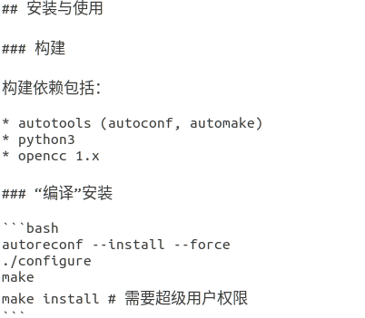
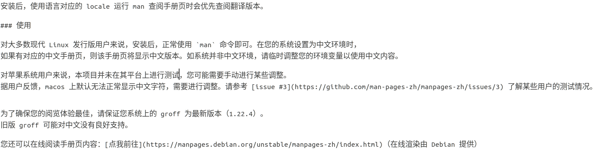

## man手册 - HQ

[TOC]

------

#### 注意

- 

------

## man手册的使用

首先man分为八个目录，每个目录用一个数字表示

- 1.可执行程序
- 2.系统调用
- 3.库函数
- 4.特殊文件
- 5.文件格式和规范
- 6.游戏
- 7.杂项，包括宏包和规范
- 8.系统管理命令

每个页面的基本内容

- [NAME] 命令的名称
- [SYNOPISIS] 表示命令的常用参数
- [DESCRIPTION] 描述了命令的功能

快捷键

- 回车 下一行
- page up 上一行
- page down 下一行
- home[方向键左]第一页
- end[方向键右] 最后一页
- 空格 下一页
- b 上一页
- q 退出
- /string 从上往下搜索字符串string
- ?string 从下往上搜索字符串string
- n 下一个搜索匹配项
- N 上一个搜索匹配项

既然man是一个命令，它也有许多自己的参数

- -P 指定用什么工具查看文档
- -a 列出所有命令
- -f 只显示命令的描述，相当于whatis命令


## Linux man中文手册

### 安装man中文手册

#### 通过安装包安装

1. 进入中文man包网站下载源码包

   > https://src.fedoraproject.org/repo/pkgs/man-pages-zh-CN/
   >
   > ```shell
   > #ubuntu可通过wget下载源码
   > wget https://src.fedoraproject.org/repo/pkgs/man-pages-zh-CN/manpages-zh-1.5.1.tar.gz/13275fd039de8788b15151c896150bc4/manpages-zh-1.5.1.tar.gz
   > ```

2. 解压编译安装（参考README手册)

   > 

```bash
tar zxf manpages-zh-1.5.1.tar.gz -C /usr/src
./configure --disable-zhtw #默认安装 
make && make install
```

#### 通过apt安装

> 

```shell
#ubuntu / Debian
sudo apt update
sudo apt install manpages-zh 
```


### 配置man中文手册

#### README使用说明

> 
>
> 

#### 配置步骤

为了不抵消man，我们新建cman命令作为中文查询

> 如果是通过apt自动安装，默认已经替换man指令

```bash
cd ~
vi .bash_profile
#在.bash_profile中增加:
alias cman='man -M /usr/local/zhman/share/man/zh_CN' #根据个人安装目录，配置路径
source .bash_profile #更新bash_profile 使其生效
```

安装完成！进行测试！

```shell
[root@bogon ~]# cman ls
//安装完成之后，注意就得使用cman来获取man手册帮助信息了
```

效果如下：

> 


