## thrift学习笔记

[TOC]

------

#### 注意

- 

------

# thrift - 摘要

（也称RPC框架，远程函数调用）

##### thrift教程

1. [thrift官网](https://thrift.apache.org/)
2. [范例代码地址](https://git.acwing.com/yxc/thrift_lesson)

##### 整体框图


##### 程序编译

编译

- `gcc -c main.cpp match_server/*.cpp`：一次编译多个.cpp文件

链接

- `g++ *.o -o main -lthrift -pthread`：链接库


# thrift - 笔记（含知识点介绍）

> 我们写一个应用时，这个应用程序并不止一个服务，而且不同的服务分配到不同服务器(或者进程)上，也就是我们常说的[微服务](https://baike.baidu.com/item/%E5%BE%AE%E6%9C%8D%E5%8A%A1/18758759?fr=aladdin) 。

### 简介

[thrift官网](https://thrift.apache.org/)
**官网教程:进入官网->Tutorial->tutorial.thrift**

**Apache Thrift**软件框架用于可伸缩的跨语言服务开发，它将**软件栈**和**代码生成引擎**结合在一起，以构建在C++、Java、Python、PHP、Ruby、Erlang、Perl、Haskell、C#、Cocoa、JavaScript、Node.js、Smalltalk、OCaml和Delphi等语言之间高效、无缝地工作的服务。

**Thrift使用C++进行编写**，在安装使用的时候需要安装依赖，windows安装方式见官网即可。安装方式：[thrift官网介绍安装方式](http://thrift.apache.org/docs/install/) 

```
thrift -version //查看thrift版本
```

### Thrift IDL

Thrift 采用IDL（Interface Definition Language）来定义通用的服务接口，然后通过Thrift提供的编译器，可以将服务接口编译成不同语言编写的代码，通过这个方式来实现跨语言的功能。

- 通过命令调用Thrift提供的编译器将服务接口编译成不同语言编写的代码。
- 这些代码又分为服务端和客户端，将所在不同进程(或服务器)的功能连接起来。

```
thrift -r --gen <language> <Thrift filename>
```

### 如何创建一个Thrift服务?

1. 定义服务接口(存放接口的文件夹就是thrift文件)
2. 作为服务端的服务，需要生成server。
3. 作为请求端的服务，需要生成client。


## 接下来写个栗子来熟悉thrift的使用

#### 一个游戏的匹配服务分析

**一般情况如图所示**

 

**分析图示内容**
这个游戏的功能可能运行在一个或多个服务器(或进程)上，而thrift就是将不同服务器不同语言的功能连接起来。
图中的三个节点(功能)是完全独立的，既可以在同一个服务器上，也可以在不同服务器上。
每一个节点就是一个进程，每个进程可以使用不同的语言来实现。

- 在GAME节点上实现客户端通过调用匹配系统的服务端中实现的两个服务接口函数获取功能，实现跨语言跨服务的工作。
- 每个节点(功能)之间通过thrift定义的服务接口作为有向边进行连接。
  弧尾所在的节点创建客户端，弧头所在的节点创建服务端。
- 匹配系统节点实现服务端，其中有一个匹配池：不断的接收玩家和删除玩家，同时根据一定的规则给每个玩家安排一局游戏。
- 匹配系统节点实现客户端，通过调用数据存储节点的服务端中实现的一个服务接口函数获取功能，实现跨语言跨服务的工作。
- 每个功能(节点)之间通过thrift定义的服务接口作为有向边进行连接。
  弧尾所在的节点创建客户端，弧头所在的节点创建服务端。
- 数据存储节点实现服务端。别人已经将服务接口和服务端实现好了。
- 服务接口功能介绍:
  add_user：向匹配池中添加玩家。
  remove_user：从匹配池中删除玩家。
  save_data：将匹配信息存储起来。

**补充**

- 有向边也称弧,边的始点称为弧尾,终点称为弧头。
- 当做项目时，可能有人已经将服务接口实现好了，即将服务端实现了，我们只需要创建客户端即可。

#### 分析总结:

在实现服务之前，最好先画个图分析，这样目标明确、思路清晰。

**图中的要素**

1. 不同服务作为节点
2. 每个服务是在哪个服务器上实现的
3. 每个服务通过什么语言实现
4. 服务之间通过怎样的服务接口进行连接。
5. 通过业务逻辑确认每个服务需要创建哪些服务端和客户端。


## 实现一个游戏的匹配服务

这里为了方便我们需要创建两个文件夹表示game节点(game)和匹配服务节点(match_system)，其实也可以放在不同的服务器上，不过条件不允许啊，而数据存储节点的服务端已经实现好了，只要调用服务接口实现的函数即可。

接下来创建一个thrift文件夹存储.thrift文件，.thrift文件定义服务接口。其中有两个.thrift文件分别表示两条有向边，一条有向边可以包含多个服务接口。

先定义服务接口。
定义添加玩家和删除玩家的两个接口。
在thrift文件夹中，创建match.thrift文件。然后进行接下来的内容。

---

### ①名字空间NameSpace

Thrift中的命名空间类似于C++中的namespace和java中的package，它们提供了一种组织（隔离）代码的简便方式。名字空间也可以用于解决类型定义中的名字冲突。

由于每种语言均有自己的命名空间定义方式（如:python中有module）, thrift允许开发者针对特定语言定义namespace。

简单的demo：

```
namespace java com.xtxxtx.test
```

转换成

```
package com.xtxxtx.test
```

**教程中的介绍:**

```
/**
 * Thrift files can namespace, package, or prefix their output in various
 * target languages.
 */

namespace cl tutorial
namespace cpp tutorial  
namespace d tutorial
namespace dart tutorial
namespace java tutorial
namespace php tutorial
namespace perl tutorial
namespace haxe tutorial
namespace netstd tutorial

//匹配系统我们用C++实现。
//语法:namespace 使用的语言 空间名称
namespace cpp match_dao
```

---

### ②结构体struct

数据类型在结构体中定义。
struct有以下一些约束：

1. struct不能继承，但是可以嵌套，不能嵌套自己。(0.12.0版本可以支持嵌套自己本身)
2. 其成员都是有明确类型
3. 成员是被正整数编号过的，其中的编号使不能重复的，这个是为了在传输过程中编码使用。
4. 成员分割符可以是逗号（,）或是分号（;），而且可以混用
5. 字段会有optional和required之分和protobuf一样，但是如果不指定则为无类型–可以不填充该值，但是在序列化传输的时候也会序列化进去，optional是不填充则部序列化，required是必须填充也必须序列化。
6. 每个字段可以设置默认值
7. 同一文件可以定义多个struct，也可以定义在不同的文件，进行include引入。

**教程中介绍:**

```
/**
 * Structs are the basic complex data structures. They are comprised of fields
 * which each have an integer identifier, a type, a symbolic name, and an
 * optional default value.
 *
 * Fields can be declared "optional", which ensures they will not be included
 * in the serialized output if they aren't set.  Note that this requires some
 * manual management in some languages.
 */
 
struct Work {
  1: i32 num1 = 0, //默认值
  2: i32 num2, //默认字段类型是optional
  3: Operation op,
  4: optional string comment,
  5: required string name, //本字段必须填充
}

//这里我们定义结构体用来存储用户信息。其中i32表示int，string表示字符串。
struct User {
    1: i32 id,
    2: string name,
    3: i32 score,
}
```

规则：

- 如果required标识的域没有赋值，Thrift将给予提示；
- 如果optional标识的域没有赋值，该域将不会被序列化传输；
- 如果某个optional标识域有缺省值而用户没有重新赋值，则该域的值一直为缺省值；
- 如果某个optional标识域有缺省值或者用户已经重新赋值，而不设置它的__isset为true，也不会被序列化传输。

---

### ③ 服务定义类型Service

服务的定义方法在语义上等同于面向对象语言中的接口。比如java中的接口，只是参数需要加上编号。

**教程中介绍:**

```
/**
 * Ahh, now onto the cool part, defining a service. Services just need a name
 * and can optionally inherit from another service using the extends keyword.
 */
service Calculator extends shared.SharedService {

  /**
   * A method definition looks like C code. It has a return type, arguments,
   * and optionally a list of exceptions that it may throw. Note that argument
   * lists and exception lists are specified using the exact same syntax as
   * field lists in struct or exception definitions.
   */

   void ping(),

   i32 add(1:i32 num1, 2:i32 num2),

   i32 calculate(1:i32 logid, 2:Work w) throws (1:InvalidOperation ouch),

   /**
    * This method has a oneway modifier. That means the client only makes
    * a request and does not listen for any response at all. Oneway methods
    * must be void.
    */
   oneway void zip()

}

/**
  * 我们需要定义两个接口方法:add_user(), remove_user()
  * 其中`2: string info`表示额外信息。
  * 作用:以后想要更改接口时，不用更改接口，你可以直接将想传的信息传入到info中，
  * 然后对info进行序列化一个jinsen即可。
  */
service Match {
    i32 add_user(1: User user, 2: string info),

    i32 remove_user(1: User user, 2: string info),
}
```

---

### ④ 定义服务接口之后，先实现match-server

**如何通过接口生成C++版本的服务端?**

```
//通过这个命令就可以实现，不过在此之前需要做一些准备工作。
//tutorial.thrift表示从当前目录到定义接口的路径。
thrift -r --gen cpp tutorial.thrift
```

具体操作如图所示:
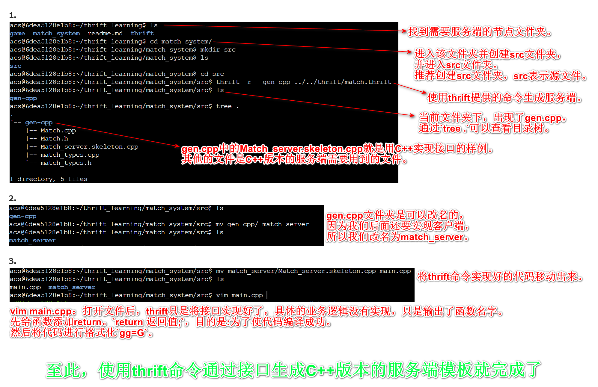 

- 做到这里我们发现:有了接口之后，通过命令就可以生成C++版本的服务端相关的代码。但是具体业务我们还是需要具体写哦!
- $\color{red}{好习惯:写thrift服务的时候，先编译成功，然后再逐步向文件中添加模块。}$

---

### ⑤ 如何编译thrift生成的C++代码?

因为$Thrift$由`C++`编写，所以编译的过程与`C++`一样。
本质就是编译一堆`C++`源文件(.cpp)。
$\color{green}{C++编译过程:}$
$\color{red}{①编译}$
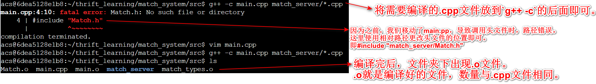 
$\color{red}{②链接}$
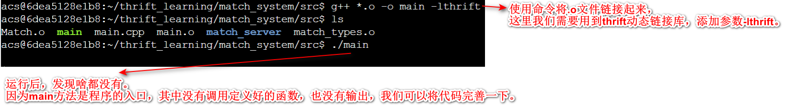 
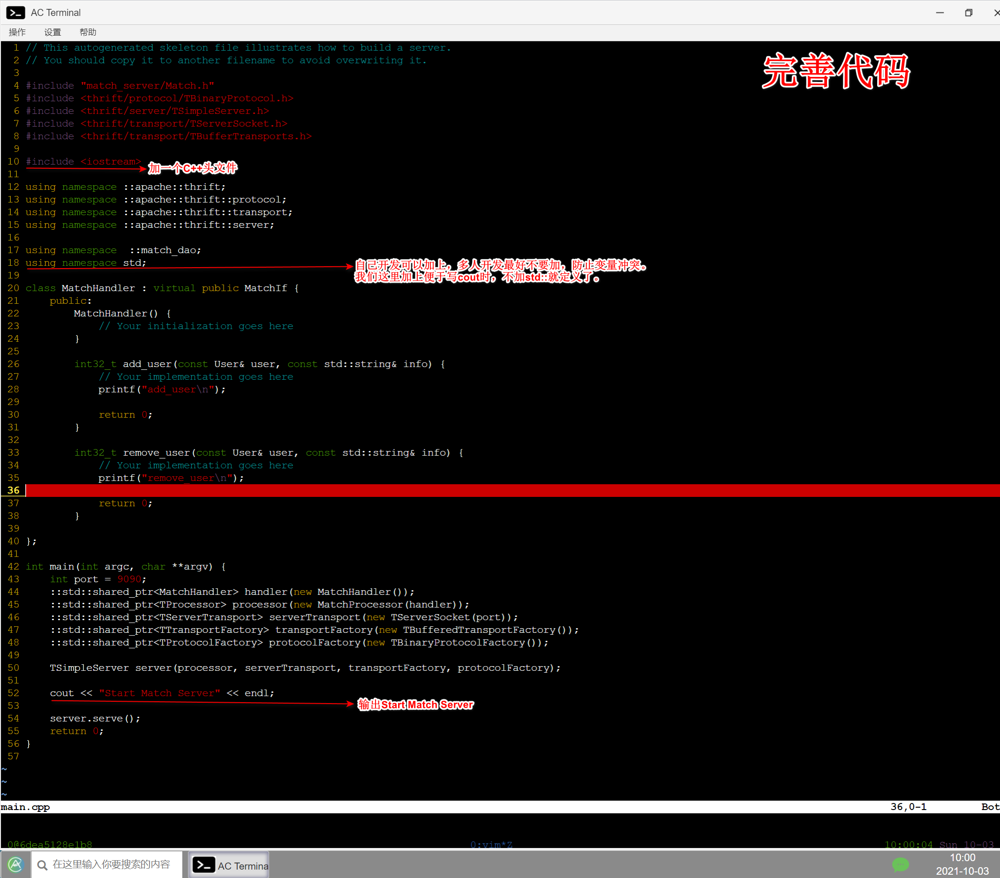 
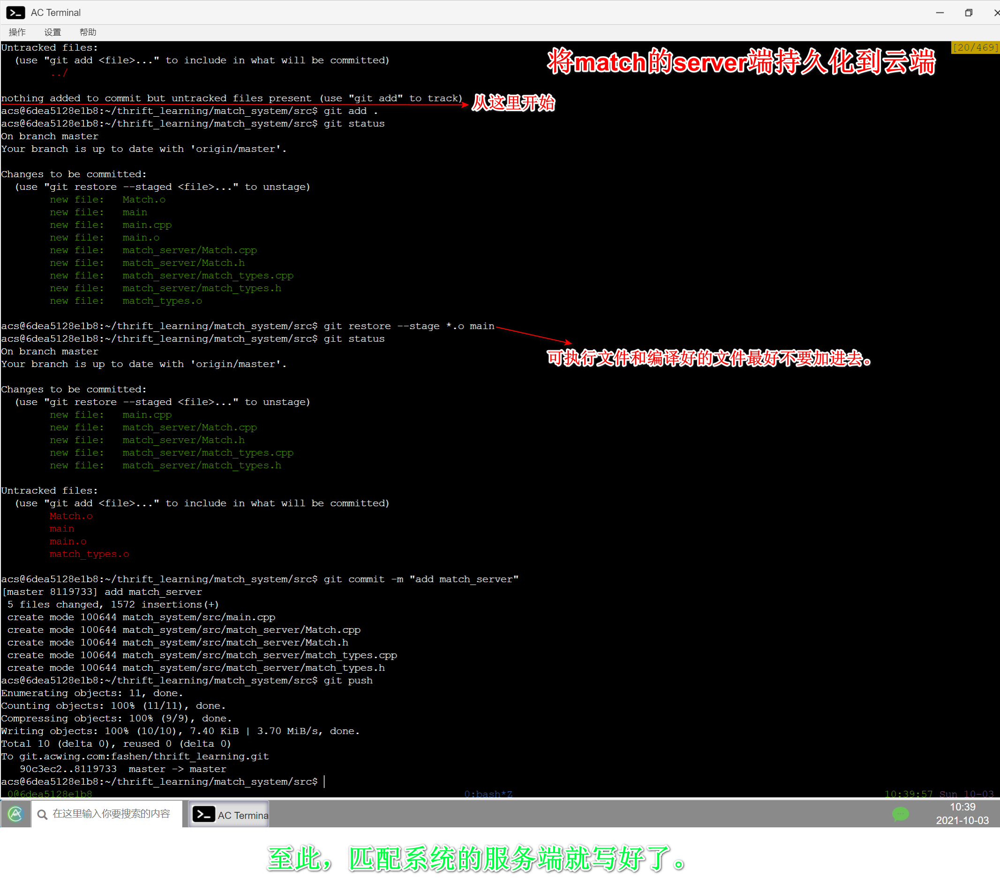 

- 好习惯:可执行文件和编译好的文件最好不要加进去，只加.cpp和.h文件。

C++编译很慢，链接很快。所以每次修改项目，重新编译时，只需要编译修改过的.cpp文件即可，防止编译时间过长。
即修改哪个文件就编译哪个文件。
基于这一点考虑就有了make和cmake工具。但没啥用。

```
//前面加上time查看编译和链接的时间。
time g++ -c .cpp文件
time g++ -o .o文件 -lthrift -pthread
```

---

### ⑥ 实现match-client

```
//使用该命令创建python版本的服务端，然后通过修改得到客户端。
//这个命令python2和python3是兼容的。
thrift -r --gen py tutorial.thrift
```

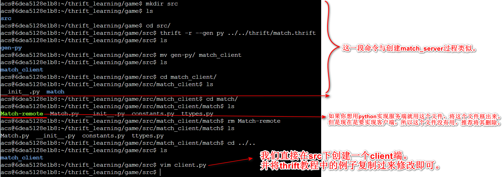 
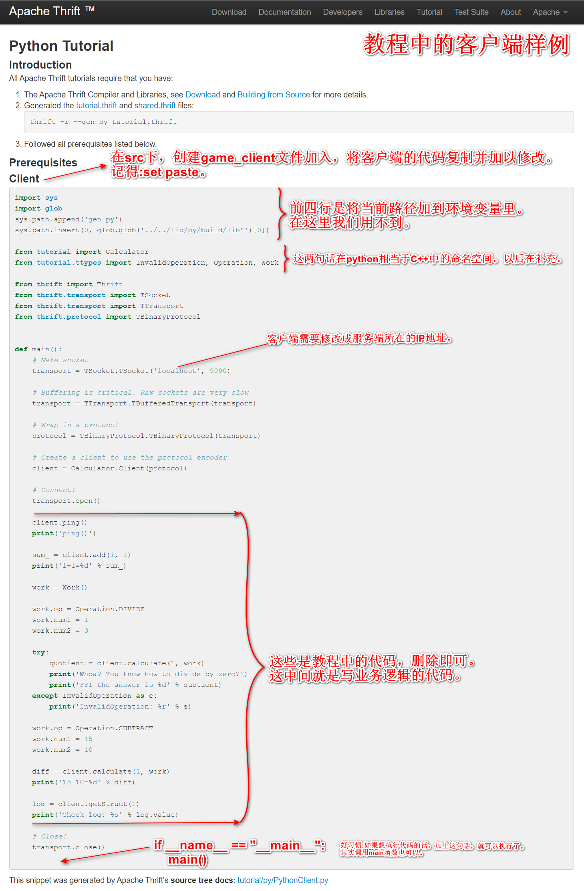 
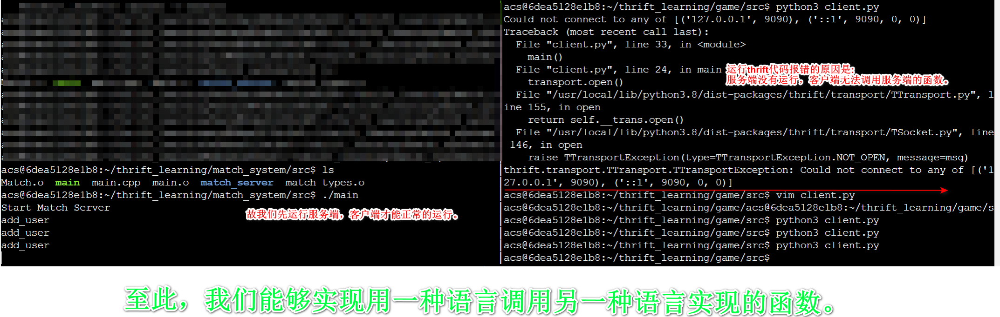 
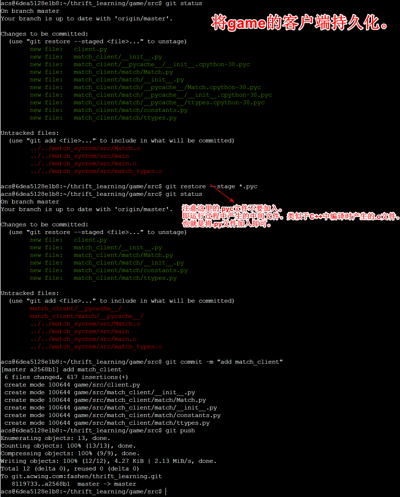 

- $\color{red}{好习惯:每完成一个客户(服务)端时，推荐使用git进行持久化。}$

---

> 现在client端还不是很方便。因为每次都需要运行一下代码，而且代码是写死的。

### ⑦ 将match-client的代码改成从标准输入中获取信息

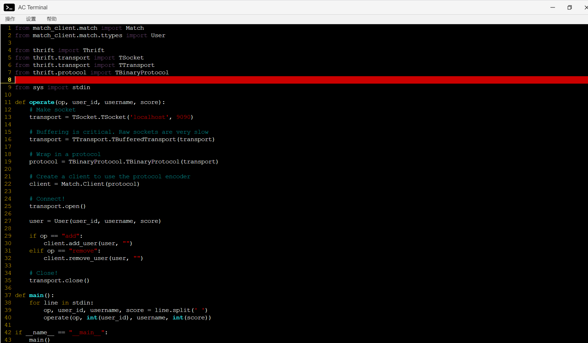 
至此，game的client端就完成了。最后将其持久化作为最终版。

- $\color{red}{好习惯:在编译和运行时，产生的文件都不要持久化，这没有意义，只会占用网络带宽，会显得你的仓库不专业。}$

---

> 写server端需要分析业务模型。
> 需要进行监控，支持增加用户和删除用户。同时还要有一个线程去不停地进行匹配。
> 这个时候，我们发现需要实现两个功能，添加删除用户和匹配用户，根据微服务的概念需要开两个进程实现两个功能。

### ⑧ 完善match-server

完善server端需要并利用`C++`实现多线程。视频定位：55:30

项目代码中有注解。

编译C++时，如果你用到了线程，需要加上线程的动态链接库的参数`-pthread`。
`-lthrift`参数将所有thrift动态连接文件连接起来。

```
g++ *.o -o main -lthrift -pthread
```

---

### ⑨ 实现save_client

因为一个节点(功能)只能由一个main方法作为程序的入口，所以匹配系统中的客户端和服务端写在同一个main方法中。我们这里根据逻辑将其实现在一个函数中。

- 注意:复制教程中的代码时，一些细节需要更改。例如:其中带Calculator的字段都需要更改。
- 一些thrift接口和服务端有人会帮我们实现，这时我们只需调用接口实现的函数即可。例如:这里使用已经实现好的save_data()接口。

---

> 我们现在的匹配系统是傻瓜式匹配，从队头逮到两个人就匹配成功，所以需要制定一些规则进行升级。
> 这里我们指定分差50以内的进行匹配。

### ⑩ 升级match-server

---

> 一个线程处理输入输出，如果以后要处理并发量时，需要开多个线程处理。

### ⑪ 将thrift的单独Server模式改成多线程Server模式

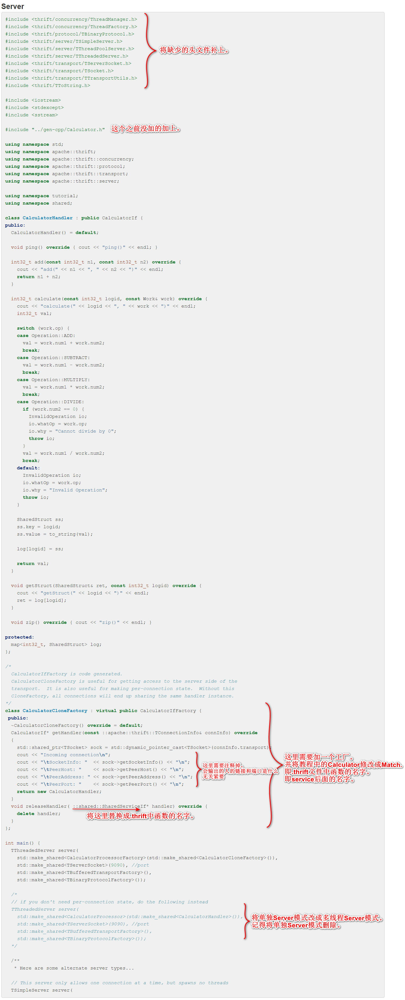 

---

### ⑫ 添加match-server的规则

匹配机制：等待时间越长，阈值越大。即匹配的范围随时间的推移而变大
故需要记录当前玩家在匹配池中等待的秒数。

至此，游戏的匹配服务就全部完成了。


## 知识点:

#### [C 头文件](https://www.runoob.com/cprogramming/c-header-files.html) 

C 语言中 include <> 与include "" 的区别?
`#include < >`:引用的是编译器的类库路径里面的头文件。
`#include " "`:==引用的是你程序目录的相对路径中的头文件==，如果在程序目录没有找到引用的头文件则到编译器的类库路径的目录下找该头文件。

#### [using namespace std的作用](https://baike.baidu.com/item/using%20namespace%20std/10360651?fr=aladdin) 

C++标准程序库中的所有标识符都被定义于一个名为std的namespace中。 由于namespace的概念，使用C++标准程序库的任何标识符时，可以有三种选择，具体看百度百科。
但是如果加上这段代码，就不用前缀。
比如:
`std::cout << std::endl;`加上using namespace std后，就可以写成这样`cout << endl`。
`std::ios::sync_with_stdio(false);`加上using namespace std后，就可以写成这样`ios::sync_with_stdio(false);`。(想了解[ios::sync_with_stdio(false);](https://blog.csdn.net/weixin_51333606/article/details/116738816) 用法点开这篇文章)


### localhost，127.0.0.1 和 本机IP 三者的区别

#### [端口](https://baike.baidu.com/item/%E7%AB%AF%E5%8F%A3/103505?fr=aladdin)

如果把IP地址比作一间房子 ，端口就是出入这间房子的门。真正的房子只有几个门，但是一个IP地址的端口可以有65536（即：2^16）个之多！端口是通过端口号来标记的，端口号只有整数，范围是从0 到65535（2^16-1）。
同一个端口只能由一个进程来监听。所以我们一旦启动了一个服务，那么这个服务就不能在被另一个进程启动了。
服务器的端口号要与客户端的端口号相同。

---

> 每执行一个程序就是开了一个进程。每一个进程可以开一堆线程。
> 开多线程的开销是很小的，开多进程的开销是很大的。

#### `#include <thread>`

C++中有一个thread的库，可以用来开线程。
通过定义一个变量将函数名作为参数，就能开一个线程了。
首先定义线程的操作。
并行中经典的生产者和消费者模型。
生产者、消费者是两个线程。
生产者:add_user()、remove_user()
消费者:匹配用户的功能。
生产者和消费者之间需要一个媒介。
这个媒介可以有很多种方法。比如:消费队列。
很多语言都有自己实现的消费队列，也可以自己实现消费队列。
实现消费队列，就需要用到一些锁(mutex)。
并行编程的基本概念:锁。


#### 互斥锁

在编程中，引入了对象互斥锁的概念，来保证共享数据操作的完整性。每个对象都对应于一个可称为" 互斥锁" 的标记，这个标记用来保证在任一时刻，只能有一个线程访问该对象。

锁🔒有两个操作。一个P操作(上锁)，一个V操作(解锁)。
定义互斥锁:mutex m;
锁一般使用信号量来实现的，mutex其实就是一个信号量(它特殊也叫互斥量)。互斥量就是同一时间能够分给一个人，即S=1。
信号量S:S=10表示可以将信号量分给10个人来用。

P操作的主要动作是: 
①S减1； 
②若S减1后仍大于或等于0，则进程继续执行；  
③若S减1后小于0，则该进程被阻塞后放入等待该信号量的等待队列中，然后转进程调度。  
V操作的主要动作是： 
①S加1； 
②若相加后结果大于0，则进程继续执行； 
③若相加后结果小于或等于0，则从该信号的等待队列中释放一个等待进程，然后再返回原进程继续执行或转进程调度。

对于P和V都是原子操作，就是在执行P和V操作时，不会被插队。从而实现对共享变量操作的原子性。
特殊:S=1表示互斥量，表示同一时间，信号量只能分配给一个线程。

多线程为啥要用锁? 因为多线程可能共享一个内存空间，导致出现重复读取并修改的现象。

---

#### #include <condition_variable>

---

#### vector的size()是无符号整数类型。

---

#### vector的erase()是左闭右开。

---

#### 求一个字符串的md5值。

输入命令"md5sum"，输入字符串回车然后`Ctrl + d`就行了。
md5加密

---

> 随着学习的深入，用到英语的地方越来越多，很多技术都是外国实现，中国的计算机技术还需要我辈去完善创新。

#### 英语知识

- IDL:接口定义语言（Interface Definition Language）
- RPC:远程过程调用（Remote Procedure Call）
- client:客户，客户端

<font face="楷书" color=red>最后说一句，会了英语学编程真香，不说了，我去学英语了。</font>


# thrift - 笔记(4种由易到难的匹配系统,含源码)

### 准备工作

1. 创建项目文件夹`thrift_project`
2. 业务逻辑图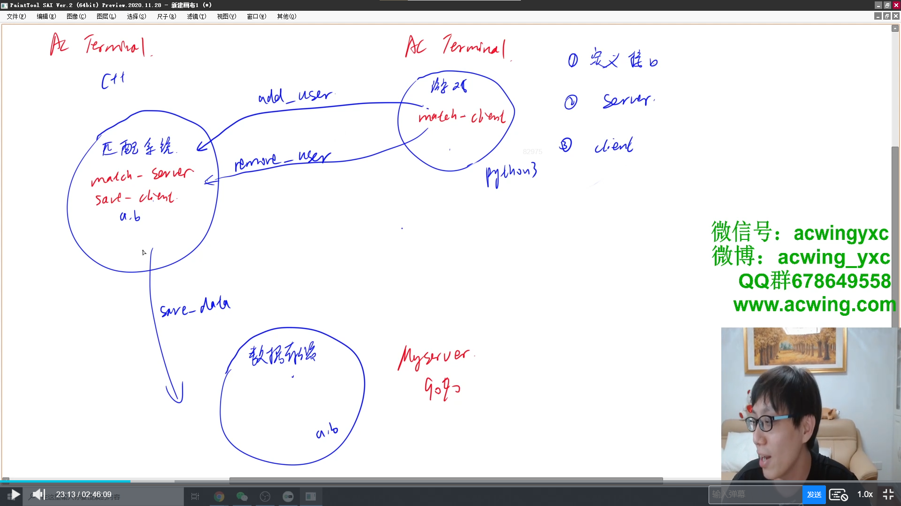
3. `游戏节点`，创建`game`文件夹；

`匹配系统节点`，创建`match_system`文件夹；

`thrift`相关文件,创建`thrift`文件夹

## thrift简单语法介绍

使用Thrift开发程序，首先要做的事情就是对接口进行描述， 然后再使用Thrift将接口的描述文件编译成对应语言的版本

#### 1.命名空间

thrift文件命名一般都是以`.thrift`作为后缀：`XXX.thrift`，可以在该文件的开头为该文件加上命名空间限制，格式为：

```
namespace 语言名称 名称
```

例如对c++来说，有：

```
namespace cpp match_service
```

#### 2.数据类型

大小写敏感，它共支持以下几种基本的数据类型：

1. `string`， 字符串类型，注意是全部小写形式；
2. `i16`, 16位整形类型，
3. `i32`，32位整形类型，对应C/C++/java中的int类型；
4. `i64`，64位整形，对应C/C++/java中的long类型；
5. `byte`，8位的字符类型，对应C/C++中的char，java中的byte类型
6. `bool`, 布尔类型，对应C/C++中的bool，java中的boolean类型；
7. `double`，双精度浮点类型，对应C/C++/java中的double类型；
8. `void`，空类型，对应C/C++/java中的void类型；该类型主要用作函数的返回值，

除上述基本类型外，ID还支持以下类型：

1. `map`，map类型，例如，定义一个map对象：map[HTML_REMOVED] newmap;
2. `set`，集合类型，例如，定义set[HTML_REMOVED]对象：set[HTML_REMOVED] aSet;
3. `list`，链表类型，例如，定义一个list[HTML_REMOVED]对象：list[HTML_REMOVED] aList;

struct，自定义结构体类型，在IDL中可以自己定义结构体，对应C中的struct，c++中的struct和class，java中的class。例如：

```
struct User{
      1: i32 id,
      2: string name,
      3: i32 score
}
```

**注意，在struct定义结构体时需要对每个结构体成员用序号标识：“序号: ”。**

#### 3.函数接口

文件中对所有接口函数的描述都放在service中，service的名字可以自己指定，该名字也将被用作生成的特定语言接口文件的名字。

**接口函数需要对参数使用序号标号，除最后一个接口函数外，要以`,`结束对函数的描述。**

如：

```
namespace cpp match_service

struct User {
    1: i32 id,
    2: string name,
    3: i32 score
}

service Match {

    i32 add_user(1: User user, 2: string info),

    i32 remove_user(1: User user, 2: string info),
}
```


## 服务端的建立

对于匹配系统的thrift相关配置，我们在`thrift`文件夹下，创建`match.thrift`文件

打开[thrift官网](https://thrift.apache.org/)，在上方选择`Tutorial`项，查看thrift官方教程

点击下方的`tutorial.thrift`进入一个示例文件

变写thrift配置文件，只需要在文件中写明`接口`和`对象`.然后执行命令

```
thrift -r --gen <语言名> <.thrift文件的路径>
```

就会生成各种配置和连接文件，还有`代码框架`，只需要在框架中实现自己的业务即可

### 步骤

#### 1.在`thrift`文件夹下，编辑`match.thrift`文件，用来生成`匹配系统服务端`的一系列文件

match.thrift 文件内容如下：

```cpp
##c++命名空间
namespace cpp match_service

struct User {
    1: i32 id,
    2: string name,
    3: i32 score
}

service Match {

    /**
     * user: 添加的用户信息
     * info: 附加信息
     * 在匹配池中添加一个名用户
     */
    i32 add_user(1: User user, 2: string info),

    /**
     * user: 删除的用户信息
     * info: 附加信息
     * 从匹配池中删除一名用户
     */
    i32 remove_user(1: User user, 2: string info),
}
```

#### 2.进入到`match_system`文件夹，创建`src`文件夹。在`src`下执行语句：

```bash
thrift -r --gen cpp ../../thrift/match.thrift
```

这样，thrift服务端的一系列文件就会生成在`src`文件夹中的`gen-cpp`文件夹下，为了划分业务模块将`gen-cpp`重命名为`match_server`

文件结构如下：

```
.
`-- match_server
    |-- Match.cpp
    |-- Match.h
    |-- Match_server.skeleton.cpp
    |-- match_types.cpp
    `-- match_types.h
```

其中`Match_server.skeleton.cpp`: 服务端的代码框架，具体业务就是在这个文件夹下编写实现

将`Match_server.skeleton.cpp`移动到`match_system/src`下并重命名为`main.cpp`，`match_system`的整个业务逻辑就是在这个文件中实现

#### 3.初始`main.cpp`的改动

1. 之前`main.cpp`在`match_server`下，现在在`match_system/src`下，所以`main.cpp`中对`Match.h`头文件的引入需要**修改路径**
2. 文件中的两个函数`int32_t add_user`和`int32_t remove_user`需要有返回值，原来没有，会报警告，需要手动加上


`main.cpp`初始文件内容如下：

```cpp
// This autogenerated skeleton file illustrates how to build a server.
// You should copy it to another filename to avoid overwriting it.

#include "match_server/Match.h"
#include <thrift/protocol/TBinaryProtocol.h>
#include <thrift/server/TSimpleServer.h>
#include <thrift/transport/TServerSocket.h>
#include <thrift/transport/TBufferTransports.h>

using namespace ::apache::thrift;
using namespace ::apache::thrift::protocol;
using namespace ::apache::thrift::transport;
using namespace ::apache::thrift::server;

using namespace  ::match_service;

class MatchHandler : virtual public MatchIf {
 public:
  MatchHandler() {
    // Your initialization goes here
  }

  int32_t add_user(const User& user, const std::string& info) {
    // Your implementation goes here
    printf("add_user\n");


    return 0;
  }

  int32_t remove_user(const User& user, const std::string& info) {
    // Your implementation goes here
    printf("remove_user\n");


    return 0;
  }

};

int main(int argc, char **argv) {
  int port = 9090;
  ::std::shared_ptr<MatchHandler> handler(new MatchHandler());
  ::std::shared_ptr<TProcessor> processor(new MatchProcessor(handler));
  ::std::shared_ptr<TServerTransport> serverTransport(new TServerSocket(port));
  ::std::shared_ptr<TTransportFactory> transportFactory(new TBufferedTransportFactory());
  ::std::shared_ptr<TProtocolFactory> protocolFactory(new TBinaryProtocolFactory());

  TSimpleServer server(processor, serverTransport, transportFactory, protocolFactory);
  server.serve();
  return 0;
}
```

### c++文件的编译、链接和运行

#### C++的编译过程

(注意大小写)假设我有一个main.cpp文件

1. `-E`：只对文件进行预处理，不进行编译和汇编。`g++ -E main.cpp`——>在dos命令行查看某文件的预处理过程，如果你想查看详细的预处理，可以重定向到一个文件中，如：`g++ -E main.cpp -o main.i`
2. `-s`：编译到汇编语言，不进行汇编和链接,即只激活预处理和编译，生成汇编语言,如果你想查看详细的编译，可以重定向到一个文件中，如：`g++ -S main.cpp -o main.s`
3. `-c`:编译到目标代码,`g++ -c main.s -o 文件名.o`
4. `-o`:生成链接文件: 如果该文件是独立的，与其他自己编写的文件无依赖关系。直接`g++ main.o -o 生成的可执行文件的文件名`，

假设该文件依赖其他源文件（不需要加入头文件）`temp.cpp`,在对`temp.cpp`文件进行预处理->编译->汇编后，使用指令`g++ temp.o main.o -o main`

1. `.\`:执行文件，输出结果。如: `.\main`，当然你可以直接`g++ main.cpp temp.cpp -o main` 生成目标文件让编译器自动为你处理其他流程。

#### 步骤

1.编译`src`文件夹下的所有`.cpp`文件

```
g++ -c *.cpp
```

2.将所有生成的`.o`文件链接成一个可执行文件，要用到thrift动态链接库

```
g++ *.o -o main -lthrift
```

3.执行生成的可执行文件`main`

```
./main
```

为了判断文件是否正确执行，可以在`main.cpp`中写一些输出语句，验证效果

4.将项目版本提交git，提交时，一般会删除中间生成的文件和可执行文件

```
git add .
git restore --stage *.o
git restore --stage match_system/src/main
git commit -m "first can run"
```


## 客户端的实现

### python文件的执行

```
python 文件路径
```

### 步骤

#### 1.在`game`下创建`src`,在`src`下执行：

```
thrift -r --gen py ../../thrift/match.thrift
```

这样，thrift服务端的一系列文件就会生成在`src`文件夹中的`gen-py`文件夹下，为了划分业务模块将`gen-py`重命名为`match_client`

文件结构如下：

```
.
|-- __init__.py
`-- match
    |-- Match-remote
    |-- Match.py
    |-- __init__.py
    |-- constants.py
    `-- ttypes.py
```

因为我们只需要实现客户端，不需要服务端，所以可以把`Match-remote`删除

#### 2.在`src`下创建文件`client.py`，将 [Apache Thrift - Python](https://thrift.apache.org/tutorial/py.html) ，页面中，`client`中的代码复制到该文件中，并将代码进行适当的改动和删除，`client.py`中的初始代码如下：

```python
from match_client.match import Match
from match_client.match.ttypes import User

from thrift import Thrift
from thrift.transport import TSocket
from thrift.transport import TTransport
from thrift.protocol import TBinaryProtocol


def main():
    # Make socket
    transport = TSocket.TSocket('127.0.0.1', 9090)

    # Buffering is critical. Raw sockets are very slow
    transport = TTransport.TBufferedTransport(transport)

    # Wrap in a protocol
    protocol = TBinaryProtocol.TBinaryProtocol(transport)

    # Create a client to use the protocol encoder
    client = Match.Client(protocol)

    # Connect!
    transport.open()

    user = User(1,"lyt",50000)
    client.add_user(user,"")

    # Close!
    transport.close()


if __name__ == "__main__":
    main()
```

#### 3.运行查错

1. 先在`thrift_project/match_system/src`下，执行:`./main`,使服务端运行
2. 再在`thrift_project/game/src`下，执行：`python3 client.py`,使客户端运行
3. 观察服务端运行处有无相应输出，若有，说明成功运行

我们可以将此版本代码提交git

#### 4.第一个简单输入输出版的`client`

```python
from match_client.match import Match
from match_client.match.ttypes import User

from thrift import Thrift
from thrift.transport import TSocket
from thrift.transport import TTransport
from thrift.protocol import TBinaryProtocol
from sys import stdin


def operate(op: str, user_id: int, username: str, score: int):
    # Make socket
    transport = TSocket.TSocket('localhost', 9090)

    # Buffering is critical. Raw sockets are very slow
    transport = TTransport.TBufferedTransport(transport)

    # Wrap in a protocol
    protocol = TBinaryProtocol.TBinaryProtocol(transport)

    # Create a client to use the protocol encoder
    client = Match.Client(protocol)

    # Connect!
    transport.open()

    user = User(user_id, username, score)

    if op == "add":
        client.add_user(user, "")
    elif op == "remove":
        client.remove_user(user, "")

    # Close!
    transport.close()


def main():
    for line in stdin:
        op, user_id, username, score = line.split(" ")
        operate(op, int(user_id), username, int(score))


if __name__ == "__main__":
    main()
```

进行`运行查错`步骤并做正确输入，如果服务端处有相应输出，说明函数调用成功，运行成功

我们可以将此版本代码提交git


## 服务端具体匹配业务的实现

### 多线程编程

学习各种语言多线程，需要关注的要点：

1. 用哪些头文件
2. 如何创建一个线程(创建线程要用哪些函数)
3. 如何使用锁(相关的函数)
4. 如何使用条件变量

#### c++多线程

参考博客：

[C++多线程编程 - kaleidopink - 博客园 (](https://www.cnblogs.com/kaleidopink/p/13817039.html)[cnblogs.com](http://cnblogs.com/))

[C多线程编程_Nine days-CSDN博客_c多线程](https://blog.csdn.net/u011808673/article/details/80811998)

#### java多线程

### 步骤

#### 1.继续编写`thrift_project/match_system/src`下的`main.cpp`

先添加头文件：

```cpp
#include "mutex"  //锁的头文件
#include "thread"  //线程的头文件
#include "condition_variable"  //条件变量的头文件
#include "queue"
```

傻瓜式匹配版`main.cpp`:

```cpp
// 这个自动生成的框架文件演示了如何构建服务器。
// 你应该把它复制到另一个文件名以避免覆盖它。

#include "match_server/Match.h"
#include <thrift/protocol/TBinaryProtocol.h>
#include <thrift/server/TSimpleServer.h>
#include <thrift/transport/TServerSocket.h>
#include <thrift/transport/TBufferTransports.h>
#include <iostream>
#include "mutex"  //锁的头文件
#include "thread"  //线程的头文件
#include "condition_variable"  //条件变量的头文件
#include "queue"
#include "vector"

using namespace ::apache::thrift;
using namespace ::apache::thrift::protocol;
using namespace ::apache::thrift::transport;
using namespace ::apache::thrift::server;
using namespace std;
using namespace ::match_service;

struct Task {
    User user;
    string type;
};

struct MessageQueue {
    //队列是互斥的，同时只能有一个线程访问队列
    queue<Task> q;
    mutex m;
    condition_variable cv;
} message_queue;

class Poll {
public:
    void add(User user) {
        users.push_back(user);
    }

    void remove(User user) {
        for (uint32_t i = 0; i < users.size(); i++) {
            if (users[i].id == user.id) {
                users.erase(users.begin() + i);
                break;
            }
        }
    }

    void match() {
        while (users.size() > 1) {
//            printf("队列长度为: %ld\n", users.size());
            auto player1 = users[0];
            auto player2 = users[1];
            users.erase(users.begin());
            users.erase(users.begin());

            save_result(player1.id, player2.id);
        }
    }

    void save_result(int a, int b) {
        printf(" %d 和 %d 匹配成功\n", a, b);
    }

private:
    vector<User> users;
} pool;


class MatchHandler : virtual public MatchIf {
public:
    MatchHandler() {
        // 在这里初始化
    }

    int32_t add_user(const User &user, const std::string &info) {
        // 在这里实现接口
        printf("add_user\n");


        unique_lock<mutex> lock1(message_queue.m);//加锁
        message_queue.q.push({user, "add"});
        //当有操作时，应该唤醒线程
        message_queue.cv.notify_all();


        return 0;
    }

    int32_t remove_user(const User &user, const std::string &info) {
        // 在这里实现接口
        printf("remove_user\n");


        unique_lock<mutex> lock1(message_queue.m);//加锁,在队列为空的时候，不能拿到锁
        message_queue.q.push({user, "remove"});
        //当有操作时，应该唤醒线程
        message_queue.cv.notify_all();

        return 0;
    }

};


//线程操作的函数
void consume_task() {
    while (true) {
        unique_lock<mutex> lock1(message_queue.m);//加锁
        if (message_queue.q.empty()) {
            //因为队列初始一定是空的，如果直接continue，会死循环。因此在初始时，应在有add操作后，才应该执行这里
            //continue
            message_queue.cv.wait(lock1);
        } else {
            auto task = message_queue.q.front();
            message_queue.q.pop();
            //因为只有队列是互斥的，为了保证程序的快速运行，操作完队列就应该释放锁
            lock1.unlock();
            //具体任务
            if (task.type == "add") {
                pool.add(task.user);
//                printf("执行了1次add");
            } else if (task.type == "remove") {
                pool.remove(task.user);
            }
            pool.match();

        }
    }
}

int main(int argc, char **argv) {
    int port = 9090;
    ::std::shared_ptr<MatchHandler> handler(new MatchHandler());
    ::std::shared_ptr<TProcessor> processor(new MatchProcessor(handler));
    ::std::shared_ptr<TServerTransport> serverTransport(new TServerSocket(port));
    ::std::shared_ptr<TTransportFactory> transportFactory(new TBufferedTransportFactory());
    ::std::shared_ptr<TProtocolFactory> protocolFactory(new TBinaryProtocolFactory());
    TSimpleServer server(processor, serverTransport, transportFactory, protocolFactory);
    printf("Match server start\n");

    thread matching_thread(consume_task);


    server.serve();
    return 0;
}
```

### 2.编译链接`main.cpp`

先编译`main.cpp`,在链接时，要用到`thrift动态链接库`和`线程相关的动态链接库`，所以链接时应该执行：

```
g++ *.o -o main -lthrift -pthread
```


## 数据存储客户端的实现

### 获取一个字符串的MD5加密串

执行命令：

```
md5sum
```

回车后输入`原字符串`。在回车后按`ctrl+d`,就会生成MD5加密串

### 步骤：

#### 1.在`thrift`文件夹下，编辑`save.thrift`，用来生成`数据存储客户端`的一系列文件

这里的thrift接口由y总给出，可以在上课代码的git上找到，`save.thrift`中的代码如下：

```cpp
namespace cpp save_service

service Save {

    /**
     * username: myserver的名称
     * password: myserver的密码的md5sum的前8位
     * 用户名密码验证成功会返回0，验证失败会返回1
     * 验证成功后，结果会被保存到myserver:homework/lesson_6/result.txt中
     */
    i32 save_data(1: string username, 2: string password, 3: i32 player1_id, 4: i32 player2_id)
}
```

#### 2.在`match_system/src`下执行：

```
thrift -r --gen cpp ../../thrift/save.thrift
```

这样，thrift服务端的一系列文件就会生成在`src`文件夹中的`gen-cpp`文件夹下，为了划分业务模块将`gen-cpp`重命名为`save_client`

注意：

由于c++整个项目只能有一个`main`函数，而整个服务端的逻辑都在`thrift_project/match_system/src`下的`main.cpp`实现。所以一定要删除`thrift_project/match_system/src/save_client`下的`Save_server.skeleton.cpp`。而python没有这个问题，所以在用python实现客户端时，主框架文件可删可不删。

#### 3.改动`main.cpp`将数据存储端的业务写进去

##### 改动点：

1. 引入头文件，即`save_client/Save.h`
2. 补全命名空间，即添加`using namespace ::save_service;`
3. 在`class Pool`中的`save_resut`函数中，添加[官网 C++样例](https://thrift.apache.org/tutorial/cpp.html)的`client`中的`main`函数中的所有代码
4. 由于数据存储是实现在`myserver`上，所以在连接时要更改`ip地址`。`myserver`的ip地址可以执行`homework 4 getinfo`查看
5. 将`CalculatorClient`改为`SaveClient`
6. 将`transport->open()`和`transport->close();`之间的教程代码删除，在此之间实现自己的业务

这里给出`save_result`函数：

```cpp
    void save_result(int a, int b) {
        printf(" %d 和 %d 匹配成功\n", a, b);

        std::shared_ptr<TTransport> socket(new TSocket("123.57.47.211", 9090));
        std::shared_ptr<TTransport> transport(new TBufferedTransport(socket));
        std::shared_ptr<TProtocol> protocol(new TBinaryProtocol(transport));
        CalculatorClient client(protocol);

        try {
            transport->open();
            //----------在此之间实现自己的业务------------
                //第二个参数是myserver密码的MD5值的前8位
            client.save_data("acs_1642","6a46581f",a,b);

            //-----------------------------------------
            transport->close();
        } catch (TException &tx) {
            cout << "ERROR: " << tx.what() << endl;
        }

    }
```

#### 4.编译运行，并验证结果

1.编译链接：

```
g++ -c save_client/*.cpp
g++ -c main.cpp
g++ *.o -o main -lthrift -pthread
```

2.登录到myserver服务器上查看存储的结果：

```
ssh myserver
cd homework/lesson_6 
cat result.txt
```

可以把此版本提交git


## 匹配系统2.0(按照分差匹配用户)

#### c++lamda表达式

[C++之Lambda表达式 - 季末的天堂 - 博客园 (](https://www.cnblogs.com/jimodetiantang/p/9016826.html)[cnblogs.com](http://cnblogs.com/))

改动`main.cpp`:

```cpp
// 这个自动生成的框架文件演示了如何构建服务器。
// 你应该把它复制到另一个文件名以避免覆盖它。

#include "match_server/Match.h"
#include "save_client/Save.h"
#include <thrift/protocol/TBinaryProtocol.h>
#include <thrift/server/TSimpleServer.h>
#include <thrift/transport/TServerSocket.h>
#include <thrift/transport/TBufferTransports.h>
#include <thrift/transport/TSocket.h>
#include <thrift/transport/TTransportUtils.h>
#include <iostream>
#include <mutex>  //锁的头文件
#include <thread>  //线程的头文件
#include <condition_variable>  //条件变量的头文件
#include <queue>
#include <vector>
#include <unistd.h>

using namespace ::apache::thrift;
using namespace ::apache::thrift::protocol;
using namespace ::apache::thrift::transport;
using namespace ::apache::thrift::server;
using namespace ::match_service;
using namespace ::save_service;
using namespace std;

struct Task {
    User user;
    string type;
};

struct MessageQueue {
    //队列是互斥的，同时只能有一个线程访问队列
    queue <Task> q;
    mutex m;
    condition_variable cv;
} message_queue;

class Poll {
public:
    void add(User user) {
        users.push_back(user);
    }

    void remove(User user) {
        for (uint32_t i = 0; i < users.size(); i++) {
            if (users[i].id == user.id) {
                users.erase(users.begin() + i);
                break;
            }
        }
    }

    void match() {
        while (users.size() > 1) {
//            printf("队列长度为: %ld\n", users.size());
            sort(users.begin(),users.end(),[&](User &a,User b){
                return a.score<b.score;
            });
            bool flag = true;
            for(uint32_t i = 1 ; i <users.size(); i++) {
              auto a = users[i-1],b = users[i];
                if (b.score-a.score<=50){
                    users.erase(users.begin()+i,users.begin()+i+1);

                    save_result(a.id,b.id);
                    flag = false;
                    break;
                }
            }
            if (flag){
                break;
            }

        }
    }

    void save_result(int a, int b) {
        printf(" %d 和 %d 匹配成功\n", a, b);

        std::shared_ptr<TTransport> socket(new TSocket("123.57.47.211", 9090));
        std::shared_ptr<TTransport> transport(new TBufferedTransport(socket));
        std::shared_ptr<TProtocol> protocol(new TBinaryProtocol(transport));
        SaveClient client(protocol);

        try {
            transport->open();
            //----------在此之间实现自己的业务------------
                //第二个参数是myserver密码的MD5值的前8位
            client.save_data("acs_1642","6a46581f",a,b);

            //-----------------------------------------
            transport->close();
        } catch (TException &tx) {
            cout << "ERROR: " << tx.what() << endl;
        }

    }

private:
    vector <User> users;
} pool;


class MatchHandler : virtual public MatchIf {
public:
    MatchHandler() {
        // 在这里初始化
    }

    int32_t add_user(const User &user, const std::string &info) {
        // 在这里实现接口
        printf("add_user\n");


        unique_lock <mutex> lock1(message_queue.m);//加锁
        message_queue.q.push({user, "add"});
        //当有操作时，应该唤醒线程
        message_queue.cv.notify_all();


        return 0;
    }

    int32_t remove_user(const User &user, const std::string &info) {
        // 在这里实现接口
        printf("remove_user\n");


        unique_lock <mutex> lock1(message_queue.m);//加锁,在队列为空的时候，不能拿到锁
        message_queue.q.push({user, "remove"});
        //当有操作时，应该唤醒线程
        message_queue.cv.notify_all();

        return 0;
    }

};


//线程操作的函数
void consume_task() {
    while (true) {
        unique_lock <mutex> lock1(message_queue.m);//加锁
        if (message_queue.q.empty()) {
            //因为队列初始一定是空的，如果直接continue，会死循环。因此在初始时，应在有add操作后，才应该执行这里
            //continue
//            message_queue.cv.wait(lock1);
            lock1.unlock();
            pool.match();
            sleep(1);
            //当队列为空时。当前线程放弃持有锁，由其他线程持有锁，在进行匹配。这个过程1s后，再进行后面的判断
        } else {
            auto task = message_queue.q.front();
            message_queue.q.pop();
            //因为只有队列是互斥的，为了保证程序的快速运行，操作完队列就应该释放锁
            lock1.unlock();
            //具体任务
            if (task.type == "add") {
                pool.add(task.user);
//                printf("执行了1次add");
            } else if (task.type == "remove") {
                pool.remove(task.user);
            }
            pool.match();

        }
    }
}

int main(int argc, char **argv) {
    int port = 9090;
    ::std::shared_ptr<MatchHandler> handler(new MatchHandler());
    ::std::shared_ptr<TProcessor> processor(new MatchProcessor(handler));
    ::std::shared_ptr<TServerTransport> serverTransport(new TServerSocket(port));
    ::std::shared_ptr<TTransportFactory> transportFactory(new TBufferedTransportFactory());
    ::std::shared_ptr<TProtocolFactory> protocolFactory(new TBinaryProtocolFactory());
    TSimpleServer server(processor, serverTransport, transportFactory, protocolFactory);
    printf("Match server start\n");

    thread matching_thread(consume_task);


    server.serve();
    return 0;
}
```


## 匹配系统3.0(升级为多线程服务器)

之前的版本都是用一个线程来add和remove `user`，想要提高效率和并发量，可以将服务端升级为多线程版本

### 步骤

1. 引入[官网 C++样例](https://thrift.apache.org/tutorial/cpp.html)的`Server`中,`main.cpp`没有的头文件。
2. 将`main`函数中的`TSimpleServer`即相关函数，替换成[官网 C++样例](https://thrift.apache.org/tutorial/cpp.html)的`Server`中的`main`函数中的`TThreadedServer`相关内容
3. 将[官网 C++样例](https://thrift.apache.org/tutorial/cpp.html)的`Server`中的`class CalculatorCloneFactory`相关内容加进来
4. 将文件中的所有`Calculator`替换为`Match`,在vim中的具体操作为：

```
shell :1,$s/Calculator/Match/g
```

1. 将

```
c++ void releaseHandler(::shared::SharedServiceIf *handler) override { delete handler; }
```

替换为：

```
c++ void releaseHandler(MatchIf *handler) override { delete handler; }
```

编译运行检查错误


## 匹配系统4.0(随时间扩大匹配阈值)

```cpp
// 这个自动生成的框架文件演示了如何构建服务器。
// 你应该把它复制到另一个文件名以避免覆盖它。

#include "match_server/Match.h"
#include "save_client/Save.h"
#include <thrift/protocol/TBinaryProtocol.h>
#include <thrift/server/TSimpleServer.h>
#include <thrift/server/TThreadPoolServer.h>
#include <thrift/server/TThreadedServer.h>
#include <thrift/transport/TServerSocket.h>
#include <thrift/transport/TSocket.h>
#include <thrift/transport/TTransportUtils.h>
#include <thrift/transport/TBufferTransports.h>
#include <thrift/transport/TTransportUtils.h>
#include <thrift/concurrency/ThreadManager.h>
#include <thrift/concurrency/ThreadFactory.h>
#include <thrift/TToString.h>
#include <iostream>
#include <mutex>  //锁的头文件
#include <thread>  //线程的头文件
#include <condition_variable>  //条件变量的头文件
#include <queue>
#include <vector>
#include <unistd.h>

using namespace ::apache::thrift;
using namespace ::apache::thrift::protocol;
using namespace ::apache::thrift::transport;
using namespace ::apache::thrift::server;
using namespace ::match_service;
using namespace ::save_service;
using namespace std;

struct Task {
    User user;
    string type;
};

struct MessageQueue {
    //队列是互斥的，同时只能有一个线程访问队列
    queue<Task> q;
    mutex m;
    condition_variable cv;
} message_queue;

class Poll {
public:
    void add(User user) {
        users.push_back(user);
        wt.push_back(0);
    }

    void remove(User user) {
        for (uint32_t i = 0; i < users.size(); i++) {
            if (users[i].id == user.id) {
                users.erase(users.begin() + i);
                break;
            }
        }
     }

    bool check_match(uint32_t i, uint32_t j) {
        auto a = users[i], b = users[j];

        int dt = abs(a.score - b.score);
        int a_max_dif = wt[i] * 50;
        int b_max_dif = wt[j] * 50;

        return dt <= a_max_dif && dt <= b_max_dif;
    }

    void match() {
        for (uint32_t i = 0; i < wt.size(); i++)
            wt[i]++;   // 等待秒数 + 1
//            sort(users.begin(), users.end(), [&](User &a, User b) {
//                return a.score < b.score;
//            });
        while (users.size() > 1) {
            bool flag = true;
            for (uint32_t i = 0; i < users.size(); i++) {
                for (uint32_t j = i + 1; j < users.size(); j++) {
                    if (check_match(i, j)) {
                        auto a = users[i], b = users[j];
                        users.erase(users.begin() + j);
                        users.erase(users.begin() + i);
                        wt.erase(wt.begin() + j);
                        wt.erase(wt.begin() + i);
                        save_result(a.id, b.id);
                        flag = false;
                        break;
                    }
                }

                if (!flag) break;
            }

            if (flag) break;
        }
    }


    void save_result(int a, int b) {
        printf(" %d 和 %d 匹配成功\n", a, b);

        std::shared_ptr<TTransport> socket(new TSocket("123.57.47.211", 9090));
        std::shared_ptr<TTransport> transport(new TBufferedTransport(socket));
        std::shared_ptr<TProtocol> protocol(new TBinaryProtocol(transport));
        SaveClient client(protocol);

        try {
            transport->open();
            //----------在此之间实现自己的业务------------
            //第二个参数是myserver密码的MD5值的前8位
            client.save_data("acs_1642", "6a46581f", a, b);

            //-----------------------------------------
            transport->close();
        } catch (TException &tx) {
            cout << "ERROR: " << tx.what() << endl;
        }

    }

private:
    vector<User> users;
    vector<int> wt;
} pool;


class MatchHandler : virtual public MatchIf {
public:
    MatchHandler() {
        // 在这里初始化
    }

    int32_t add_user(const User &user, const std::string &info) {
        // 在这里实现接口
        printf("add_user\n");


        unique_lock<mutex> lock1(message_queue.m);//加锁
        message_queue.q.push({user, "add"});
        //当有操作时，应该唤醒线程
        message_queue.cv.notify_all();


        return 0;
    }

    int32_t remove_user(const User &user, const std::string &info) {
        // 在这里实现接口
        printf("remove_user\n");


        unique_lock<mutex> lock1(message_queue.m);//加锁,在队列为空的时候，不能拿到锁
        message_queue.q.push({user, "remove"});
        //当有操作时，应该唤醒线程
        message_queue.cv.notify_all();

        return 0;
    }

};

class MatchCloneFactory : virtual public MatchIfFactory {
public:
    ~MatchCloneFactory() override = default;

    MatchIf *getHandler(const ::apache::thrift::TConnectionInfo &connInfo) override {
        std::shared_ptr<TSocket> sock = std::dynamic_pointer_cast<TSocket>(connInfo.transport);
//        cout << "Incoming connection\n";
//        cout << "\tSocketInfo: "  << sock->getSocketInfo() << "\n";
//        cout << "\tPeerHost: "    << sock->getPeerHost() << "\n";
//        cout << "\tPeerAddress: " << sock->getPeerAddress() << "\n";
//        cout << "\tPeerPort: "    << sock->getPeerPort() << "\n";
        return new MatchHandler;
    }

    void releaseHandler(MatchIf *handler) override {
        delete handler;
    }
};

//线程操作的函数
void consume_task() {
    while (true) {
        unique_lock<mutex> lock1(message_queue.m);//加锁
        if (message_queue.q.empty()) {
            //因为队列初始一定是空的，如果直接continue，会死循环。因此在初始时，应在有add操作后，才应该执行这里
            //continue
//            message_queue.cv.wait(lock1);
            lock1.unlock();
            pool.match();
            sleep(1);
            //当队列为空时。当前线程放弃持有锁，由其他线程持有锁，在进行匹配。这个过程1s后，再进行后面的判断
        } else {
            auto task = message_queue.q.front();
            message_queue.q.pop();
            //因为只有队列是互斥的，为了保证程序的快速运行，操作完队列就应该释放锁
            lock1.unlock();
            //具体任务
            if (task.type == "add") {
                pool.add(task.user);
//                printf("执行了1次add");
            } else if (task.type == "remove") {
                pool.remove(task.user);
            }
//            pool.match();

        }
    }
}

int main(int argc, char **argv) {
    TThreadedServer server(
            std::make_shared<MatchProcessorFactory>(std::make_shared<MatchCloneFactory>()),
            std::make_shared<TServerSocket>(9090), //port
            std::make_shared<TBufferedTransportFactory>(),
            std::make_shared<TBinaryProtocolFactory>()
    );
    printf("Match server start\n");

    thread matching_thread(consume_task);


    server.serve();
    return 0;
}
```


# Ubuntu 安装 Thrift 以及常见问题

**本文演示ubuntu20.04下安装Thrift 0.15.0并配置CPP和Python3的使用环境**
**AC Terminal 中的 thrift为 0.16.0**

官方教程链接:[Ubuntu/Debian install](https://thrift.apache.org/docs/install/debian.html),[Building From Source](https://thrift.apache.org/docs/BuildingFromSource)

先安装好 g++ 和 python3

```
sudo apt update
sudo apt install g++
sudo apt install python3
```

### 安装 Thrift

安装相关依赖包

```
sudo apt-get install automake bison flex g++ git libboost-all-dev libevent-dev libssl-dev libtool make pkg-config
```

安装python packages

```
sudo apt install python-all python-all-dev python-all-dbg
```

下载 Thrift 并解压

```
wget https://dlcdn.apache.org/thrift/0.15.0/thrift-0.15.0.tar.gz
tar -xf thrift-0.15.0.tar.gz
```

执行命令

```
cd thrift-0.15.0/
./configure
```

执行完后最后的输出内容如下，yes即代表将支持的语言

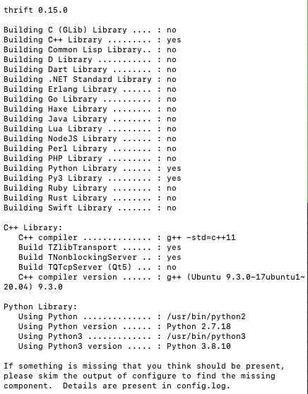

执行命令

```
sudo make //此步骤花费时间稍长
sudo make install
thrift -version //若正常输出Thrift的版本则证明安装完成
```

### 常见问题

#### 找不到动态链接库

报错类似 `./main: error while loading shared libraries: libthrift-0.15.0.so: cannot open shared object file: No such file or directory`

配置 /etc/ld.so.conf 文件，否则可能会报找不到动态链接库等错误

执行命令

```
vim /etc/ld.so.conf
```

添加内容 `/usr/local/lib`，添加后文件内容如下

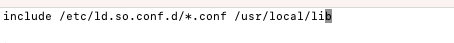

执行命令使添加的内容生效

```
sudo /sbin/ldconfig
```

#### python找不到thrift模块

报错内容类似：

**ModuleNotFoundError: No module named ‘thrift’**

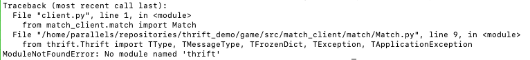

可通过pip安装thrift解决，若未安装pip，先执行安装pip的命令

```
sudo apt install python3-pip
```

然后执行

```
sudo pip install thrift
```

即可解决找不到thrift模块的问题


