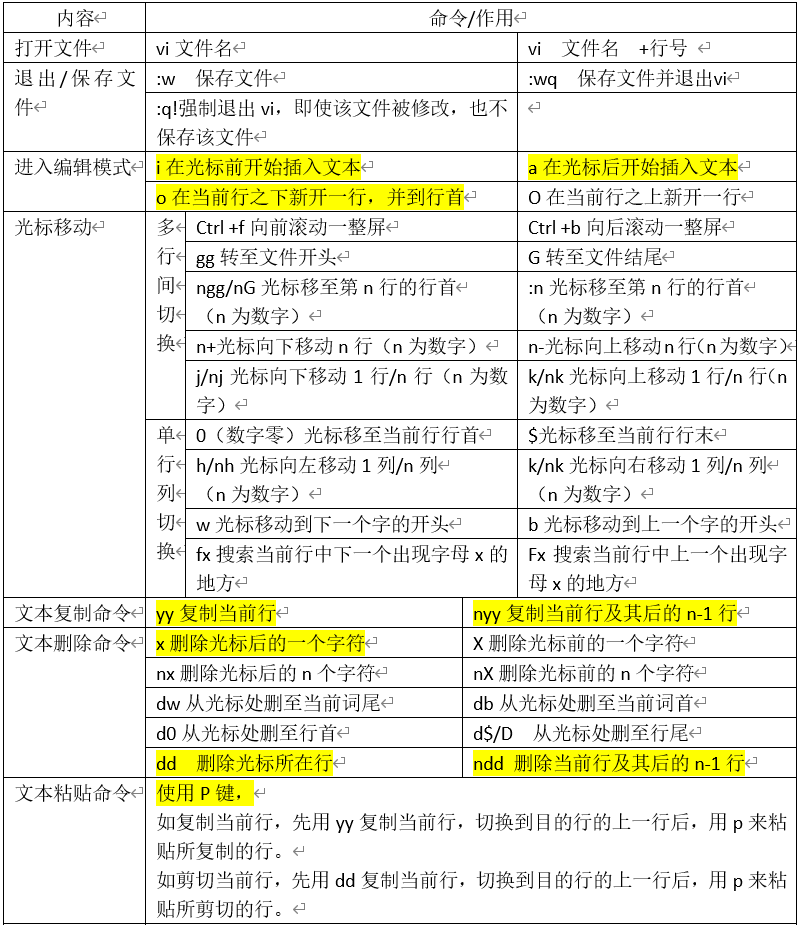
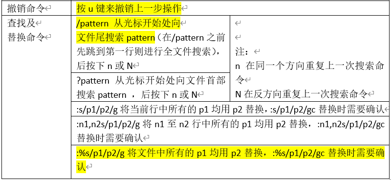
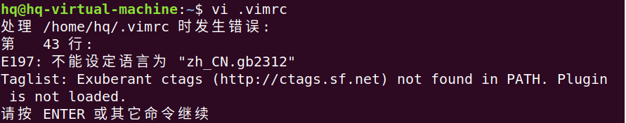
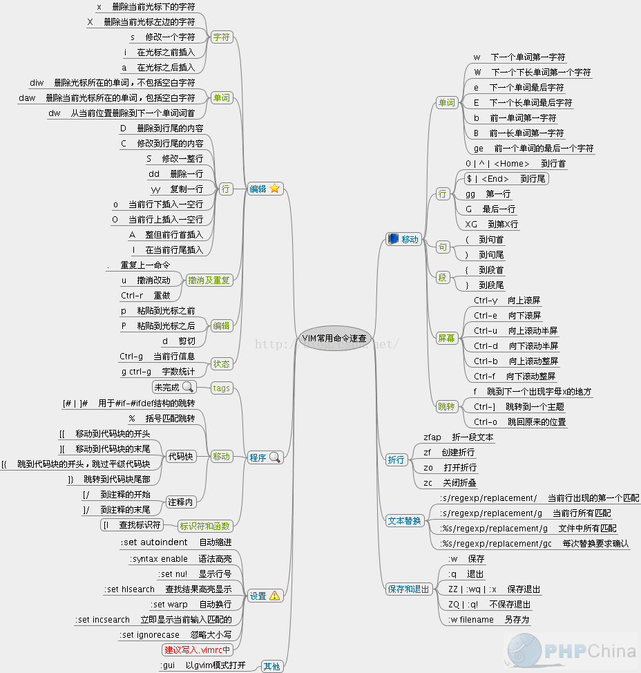
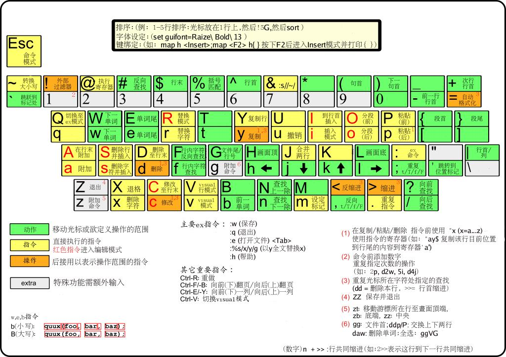

## vim - HQ

[TOC]

------

### 注意

- 

------

## vim编辑器

### vim使用 - 个人整理

- 来自正点原子手册

  > 


### vim使用 - AcWing 课程学习

##### 功能：

​    (1) 命令行模式下的文本编辑器。
​    (2) 根据文件扩展名自动判别编程语言。支持代码缩进、代码高亮等功能。
​    (3) 使用方式：vim filename
​        如果已有该文件，则打开它。
​        如果没有该文件，则打开个一个新的文件，并命名为filename

##### 模式：

​    (1) 一般命令模式
​        默认模式。命令输入方式：类似于打游戏放技能，按不同字符，即可进行不同操作。可以复制、粘贴、删除文本等。
​    (2) 编辑模式
​        在一般命令模式里按下i，会进入编辑模式。
​        按下ESC会退出编辑模式，返回到一般命令模式。
​    (3) 命令行模式
​        在一般命令模式里按下:/?三个字母中的任意一个，会进入命令行模式。命令行在最下面。
​        可以查找、替换、保存、退出、配置编辑器等。

##### 操作：

​    (1) i：进入编辑模式
​    (2) ESC：进入一般命令模式
​    (3) h 或 左箭头键：光标向左移动一个字符
​    (4) j 或 向下箭头：光标向下移动一个字符
​    (5) k 或 向上箭头：光标向上移动一个字符
​    (6) l 或 向右箭头：光标向右移动一个字符
​    (7) n<Space>：n表示数字，按下数字后再按空格，光标会向右移动这一行的n个字符
​    (8) 0 或 功能键[Home]：光标移动到本行开头
​    (9)  美元符号 或 功能键[End]：光标移动到本行末尾
​    (10) G：光标移动到最后一行
​    (11) :n 或 nG：n为数字，光标移动到第n行
​    (12) gg：光标移动到第一行，相当于1G
​    (13) n<Enter>：n为数字，光标向下移动n行
​    (14) /word：向光标之下寻找第一个值为word的字符串。
​    (15) ?word：向光标之上寻找第一个值为word的字符串。
​    (16) n：重复前一个查找操作
​    (17) N：反向重复前一个查找操作，:noh  取消查找的高亮
​    (18) :n1,n2s/word1/word2/g   n1与n2为数字，在第n1行与n2行之间寻找word1这个字符串，并将该字符串替换为word2
​    (19) :1, 美元符号加s/word1/word2/g  将全文的word1替换为word2
​    (20) :1, 美元符号加s/word1/word2/gc  将全文的word1替换为word2，且在替换前要求用户确认。
​    (21) v：选中文本
​    (22) d：删除选中的文本
​    (23) dd: 删除当前行
​    (24) y：复制选中的文本
​    (25) yy: 复制当前行
​    (26) p: 将复制的数据在光标的下一行/下一个位置粘贴
​    (27) u：撤销
​    (28) Ctrl + r：取消撤销
​    (29) 大于号 >：将选中的文本整体向右缩进一次
​    (30) 小于号 <：将选中的文本整体向左缩进一次
​    (31) :w 保存
​    (32) :w! 强制保存
​    (33) :q 退出
​    (34) :q! 强制退出
​    (35) :wq 保存并退出
​    (36) :set paste 设置成粘贴模式，取消代码自动缩进
​    (37) :set nopaste 取消粘贴模式，开启代码自动缩进
​    (38) :set nu 显示行号
​    (39) :set nonu 隐藏行号
​    (40) gg=G：将全文代码格式化
​    (41) :noh 关闭查找关键词高亮
​    (42) Ctrl + q：当vim卡死时，可以取消当前正在执行的命令

##### 常用连招

- ggdG   清空文本（删除全文）

##### 异常处理：

​    每次用vim编辑文件时，会自动创建一个.filename.swp的临时文件。
​    如果打开某个文件时，该文件的swp文件已存在，则会报错。此时解决办法有两种：
​        (1) 找到正在打开该文件的程序，并退出
​        (2) 直接删掉该swp文件即可

##### 其他问题：

​	在Linux中用vim编辑文本时，有时候会遇到按Esc键无法进入命令模式的情况。

​	后来发现可以使用【ctrl】+【[】（左中括号）的快捷指令直接进入命令模式。

​	还有一种方式就是按住【ctrl】+【c】，也能强制进入命令模式。


## PowerVim 高效工具

这套vim配置我已经打磨了将近四年，不断调整优化，已经可以完全满足工业级打开的需求了。所以我给它起名为PowerVim，一个真正强大的vim。

```
  _____                    __      ___           
  |  __ \                   \ \    / (_)          
  | |__) |____      _____ _ _\ \  / / _ _ __ ___  
  |  ___/ _ \ \ /\ / / _ \ '__\ \/ / | | '_ ` _ \ 
  | |  | (_) \ V  V /  __/ |   \  /  | | | | | | | 
  |_|   \___/ \_/\_/ \___|_|    \/   |_|_| |_| |_|
```

### 预览

来感受一下PowerVim的使用体验，看起来很酷吧！注意这些操作都不用鼠标的，一波键盘控制流！所以我平时写代码是不碰鼠标的！


### 安装

PowerVim的安装非常简单，我已经写好了安装脚本，只要执行以下就可以安装，而且不会影响你之前的vim配置，之前的配置都给做了备份，大家看一下脚本就知道备份在哪里了。

安装过程非常简单。如下三行命令：

```bash
git clone https://github.com/youngyangyang04/PowerVim.git
cd PowerVim
sh install.sh
```

在按照的过程中 ubantu 操作系统 会出现 这样的问题`Syntax error: "(" unexpected`，是系统语言问题，看本项目上方issue，已经给出解决办法

```
chmod 777 install.sh
./install.sh
```

### 特性

* CPP、PHP、JAVA代码补全，如果需要其他语言补全，可自行配置关键字列表在PowerVim/.vim/dictionary目录下
* 显示文件函数变量列表
* MiniBuf显示打开过的文件
* 语法高亮支持C++ (including C++11), go,java, php, html, json and markdown
* 显示git状态，和主干或分支的添加修改删除的情况
* 显示项目文件目录，方便快速打开
* 快速注释，使用gcc注释当前行，gc注释选中的块
* 项目内搜索关键字和文件夹
* 漂亮的颜色搭配和状态栏显示

### 使用方法

PowerVim的快捷键以`;`为开始
这里列出的快捷键是PowerVim配置的，vim通用的快捷键就不一一列出。

```
正常模式下的快捷键（非插入模式）
;n              // 打开文件目录树显示在屏幕左侧
;m              // 打开当前函数和变量目录树显示在屏幕右侧
;h              // 光标移动到左窗口 
;l              // 光标移动到右窗口
;k              // 光标移动到上窗口
;j              // 光标移动到下窗口 以上四个快捷键特别是打开多个窗口情况下。使用这个快捷键组合非常实用
;w              // 保存文件
;u              // 向上翻半屏
;d              // 向下翻半屏
;1              // 光标快速移动到行首
;2              // 光标快速移动到行末
;a              // 快速切换.h和cpp文件，写C++的时候很方便
;e              // 打开一个新文件
;z              // 切回shell交互命令，输入fg在切回vim，非常实用
;s              // 水平分屏，并打开文件目录选取想打开的文件，如果想新建文件，;e 就好 
;v              // 竖直分屏，并打开文件目录选取想打开的文件，如果想新建文件，;e 就好 
;fw             // 查找项目内关键字，前提是你的系统已经按照了ACK 
;ff             // 查找项目内文件名 
;gt             // 跳转到变量或者函数定义的地方，前提是安装ctags，并且在在PowerVim输入 ;tg命令 Jump to the definition of the keyword where the cursor is located, but make sure you have make ctags
;gr             // 跳回，对应着;gt
;tg             // 对当前目录打ctag 
;y              // 保存当前选中的目录到系统剪切板，前提是vim支持系统剪切板的寄存器
;gg             // 按顺序光标跳转各个窗口

// 一下快捷键是不用;的，直接在 非插入模式 下输入
e               // 快速删除光标所在的词 
tabc            // 关闭当前tab，可以用:tabnew来打开一个新的tab Close tab, of course you should :tabnew a file first. 
F1              // 编译并运行C++文件，自己写的C++例子的时候一键编译。前提手动在当前目录建一个bin文件夹，这是用来存放编译产生的执行文件 
F1              // 编译Java文件
F2              // 运行Java编译的class文件，一般如果要编译并运行Java文件 按F1编译，在按F2运行
gc              // 快速注释选中的块（是visual模式下选中的块） 
gcc             // 快速当前行
{               // 光标向上移动一个代码块
}               // 光标向下移动一个代码块
di(             // 删除括号里的内容
di{             // 删除花括号里的内容
```

### 插件

* a.vim [https://github.com/vim-scripts/a.vim](https://github.com/vim-scripts/a.vim)
* minibufexpl.vim [https://github.com/fholgado/minibufexpl.vim](https://github.com/fholgado/minibufexpl.vim)
* statusline.vim [https://github.com/youngyangyang04/PowerVim/blob/master/.vim/plugin/statusline.vim](https://github.com/youngyangyang04/PowerVim/blob/master/.vim/plugin/statusline.vim)
* taglist.vim [https://github.com/vim-scripts/taglist.vim](https://github.com/vim-scripts/taglist.vim)
* ack [https://github.com/mileszs/ack.vim](https://github.com/mileszs/ack.vim)
* autocomplpop [https://github.com/vim-scripts/AutoComplPop](https://github.com/vim-scripts/AutoComplPop)
* commentary [https://github.com/tpope/vim-commentary](https://github.com/tpope/vim-commentary)
* nerdtree [https://github.com/scrooloose/nerdtree](https://github.com/scrooloose/nerdtree) 
* vim-gitgutter [https://github.com/airblade/vim-gitgutter](https://github.com/airblade/vim-gitgutter)

### 配置

每个人都可以在这个基础上进行修改，改成一个属于自己的PowerVim

* 改变快捷键的方式在.vimrc
* 可以添加支持代码补全的语言，你可以在.vim/dictionary文件下添加该编程语言的补全关键字文本，并且在.vimrc上添加一下dict

### 错误解决

1. 注释掉43行

2. 安装工具 `sudo apt-get install exuberant-ctags`

   > 

### 疑问解答

PowerVim没有安装youcompleteme来完善代码补全，主要有以下方面

* PowerVim已经有很好的代码补全，足够开发使用 
* 安装youcompleteme比较麻烦，而且不通用，就是我安装成功，你按照一样的步骤安装并不一定成功 
* 安装youcompleteme后，vim会变得比较慢 
* PowerVim 后面也会尝试加上youcompleteme，可以让这个插件可以简单的被安装 


## vim使用 - 摘自网络

https://www.cnblogs.com/yangjig/p/6014198.html

### 图片介绍

> 

> 

 在命令状态下对当前行用== （连按=两次）, 或对多行用n==（n是自然数）表示自动缩进从当前行起的下面n行。你可以试试把代码缩进任意打乱再用n==排版，相当于一般IDE里的code format。使用gg=G可对整篇代码进行排版。

  

### vim 选择文本，删除，复制，粘贴 

文本的选择，对于编辑器来说，是很基本的东西，也经常被用到，总结如下：

v   从光标当前位置开始，光标所经过的地方会被选中，再按一下v结束。 

V   从光标当前行开始，光标经过的行都会被选中，再按一下Ｖ结束。 

Ctrl + v  从光标当前位置开始，选中光标起点和终点所构成的矩形区域，再按一下Ｃtrl + v结束。 

ggVG 选中全部的文本， 其中gg为跳到行首，V选中整行，G末尾

选中后就可以用编辑命令对其进行编辑，如 
d  删除 

y  复制 （默认是复制到"寄存器） 

p  粘贴 （默认从"寄存器取出内容粘贴） 

 "+y   复制到系统剪贴板(也就是vim的+寄存器） 

"+p  从系统剪贴板粘贴 


### vim命令总结 

1.删除字符
 要删除一个字符，只需要将光标移到该字符上按下"x"。

2.删除一行
 删除一整行内容使用"dd"命令。删除后下面的行会移上来填补空缺。

3.删除换行符
 在Vim中你可以把两行合并为一行，也就是说两行之间的换行符被删除了：命令是"J"。

4.撤销
 如果你误删了过多的内容。显然你可以再输入一遍，但是命令"u" 更简便，它可以撤消上一次的操作。

5.重做
 如果你撤消了多次，你还可以用CTRL-R(重做)来反转撤消的动作。换句话说，它是对撤消的撤消。撤消命令还有另一种形式，"U"命令，它一次撤消对一行的全部操作。第二次使用该命令则会撤消前一个"U"的操作。用"u"和CTRL-R你可以找回任何一个操作状态。

6.追加
 "i"命令可以在当前光标之前插入文本。
 "a"命令可以在当前光标之后插入文本。
 "o"命令可以在当前行的下面另起一行，并使当前模式转为Insert模式。
 "O"命令(注意是大写的字母O)将在当前行的上面另起一行。

7.使用命令计数
 假设你要向上移动9行。这可以用"kkkkkkkkk"或"9k"来完成。事实上，很多命令都可以接受一个数字作为重复执行同一命令的次数。比如刚才的例子，要在行尾追加三个感叹号，当时用的命令是"a!!!"。另一个办法是用"3a!"命令。3说明该命令将被重复执行3次。同样，删除3个字符可以用"3x"。指定的数字要紧挨在它所要修饰的命令前面。

8.退出
 要退出Vim，用命令"ZZ"。该命令保存当前文件并退出Vim。

9.放弃编辑
 丢弃所有的修改并退出，用命令":q!"。用":e!"命令放弃所有修改并重新载入该文件的原始内容。

10.以Word为单位的移动
 使用"w"命令可以将光标向前移动一个word的首字符上；比如"3w"将光标向前移动3个words。"b"命令则将光标向后移动到前一个word的首字符上。
 "e"命令会将光标移动到下一个word的最后一个字符。命令"ge"，它将光标移动到前一个word的最后一个字符上。、

11.移动到行首或行尾
 "$"命令将光标移动到当前行行尾。如果你的键盘上有一个键，它的作用也一样。"^"命令将光标移动到当前行的第一个非空白字符上。"0"命令则总是把光标移动到当前行的第一个字符上。键也是如此。"$"命令还可接受一个计数，如"1$"会将光标移动到当前行行尾，"2$"则会移动到下一行的行尾，如此类推。"0"命令却不能接受类似这样的计数，命令"^"前加上一个计数也没有任何效果。

12.移动到指定字符上
 命令"fx"在当前行上查找下一个字符x（向右方向），可以带一个命令计数"F"命令向左方向搜索。"tx"命令形同"fx"命令，只不过它不是把光标停留在被搜索字符上，而是在它之前的一个字符上。提示："t"意为"To"。该命令的反方向版是"Tx"。这4个命令都可以用";"来重复。以","也是重复同样的命令，但是方向与原命令的方向相反。

13.以匹配一个括号为目的移动
 用命令"%"跳转到与当前光标下的括号相匹配的那一个括号上去。如果当前光标在"("上，它就向前跳转到与它匹配的")"上，如果当前在")"上，它就向后自动跳转到匹配的"("上去.

14.移动到指定行
 用"G"命令指定一个命令计数，这个命令就会把光标定位到由命令计数指定的行上。比如"33G"就会把光标置于第33行上。没有指定命令计数作为参数的话, "G"会把光标定位到最后一行上。"gg"命令是跳转到第一行的快捷的方法。
 另一个移动到某行的方法是在命令"%"之前指定一个命令计数比如"50%"将会把光标定位在文件的中间. "90%"跳到接近文件尾的地方。
 命令"H","M","L",分别将光标跳转到第一行，中间行，结尾行部分。

15.告诉你当前的位置
 使用CTRL-G命令。"set number"在每行的前面显示一个行号。相反关闭行号用命令":set nonumber"。":set ruler"在Vim窗口的右下角显示当前光标位置。

16.滚屏
 CTRL-U显示文本的窗口向上滚动了半屏。CTRL-D命令将窗口向下移动半屏。一次滚动一行可以使用CTRL-E(向上滚动)和CTRL-Y(向下滚动)。要向前滚动一整屏使用命令CTRL-F。另外CTRL-B是它的反向版。"zz"命令会把当前行置为屏幕正中央，"zt"命令会把当前行置于屏幕顶端，"zb"则把当前行置于屏幕底端.

17.简单搜索
 "/string"命令可用于搜索一个字符串。要查找上次查找的字符串的下一个位置,使用"n"命令。如果你知道你要找的确切位置是目标字符串的第几次出现，还可以在"n"之前放置一个命令计数。"3n"会去查找目标字符串的第3次出现。
 "?"命令与"/"的工作相同，只是搜索方向相反."N"命令会重复前一次查找，但是与最初用"/"或"?"指定的搜索方向相反。
 如果查找内容忽略大小写，则用命令"set ignorecase", 返回精确匹配用命令"set noignorecase" 。

18.在文本中查找下一个word
 把光标定位于这个word上然后按下"*"键。Vim将会取当前光标所在的word并将它作用目标字符串进行搜索。"#"命令是"*"的反向版。还可以在这两个命令前加一个命令计数:"3*"查找当前光标下的word的第三次出现。

19.查找整个word
 如果你用"/the"来查找Vim也会匹配到"there"。要查找作为独立单词的"the"使用如下命令："/the\>"。"\>"是一个特殊的记法，它只匹配一个word的结束处。近似地，"\<"匹配到一个word的开始处。这样查找作为一个word的"the"就可以用:"/\"。

20.高亮显示搜索结果
 开启这一功能用":set hlsearch"，关闭这一功能：":set nohlsearch"。如果只是想去掉当前的高亮显示，可以使用下面的命令：":nohlsearch"(可以简写为noh)。

21.匹配一行的开头与结尾
  ^ 字符匹配一行的开头。$字符匹配一行的末尾。
  所以"/was$"只匹配位于一行末尾的单词was，所以"/^was"只匹配位于一行开始的单词was。

22.匹配任何的单字符
 .这个字符可以匹配到任何字符。比如"c.m"可以匹配任何前一个字符是c，后一个字符是m的情况，不管中间的字符是什么。

23.匹配特殊字符
 放一个反斜杠在特殊字符前面。如果你查找"ter。"，用命令"/ter\。"

24.使用标记
 当你用"G"命令从一个地方跳转到另一个地方时，Vim会记得你起跳的位置。这个位置在Vim中是一个标记。使用命令" `` "可以使你跳回到刚才的出发点。
 ``命令可以在两点之间来回跳转。CTRL-O命令是跳转到你更早些时间停置光标的位置(提示:O意为older). CTRL-I则是跳回到后来停置光标的更新的位置(提示：I在键盘上位于O前面)。
  注:使用CTRL-I 与按下键一样。

25.具名标记
  命令"ma"将当前光标下的位置名之为标记"a"。从a到z一共可以使用26个自定义的标记。要跳转到一个你定义过的标记，使用命令" `marks "marks就是定义的标记的名字。命令" 'a "使你跳转到a所在行的行首，" `a "会精确定位a所在的位置。命令：":marks"用来查看标记的列表。
 命令delm！删除所有标记。

26.操作符命令和位移
 "dw"命令可以删除一个word，"d4w"命令是删除4个word，依此类推。类似有"d2e"、"d$"。此类命令有一个固定的模式：操作符命令+位移命令。首先键入一个操作符命令。比如"d"是一个删除操作符。接下来是一个位移命。比如"w"。这样任何移动光标命令所及之处，都是命令的作用范围。

27.改变文本
 操作符命令是"c"，改变命令。它的行为与"d"命令类似，不过在命令执行后会进入Insert模式。比如"cw"改变一个word。或者，更准确地说，它删除一个word并让你置身于Insert模式。
 "cc"命令可以改变整行。不过仍保持原来的缩进。
 "c$"改变当前光标到行尾的内容。
 快捷命令：x 代表dl(删除当前光标下的字符)
      X 代表dh(删除当前光标左边的字符)
      D 代表d$(删除到行尾的内容)
      C 代表c$(修改到行尾的内容)
      s 代表cl(修改一个字符)
      S 代表cc(修改一整行)
 命令"3dw"和"d3w"都是删除3个word。第一个命令"3dw"可以看作是删除一个word的操作执行3次；第二个命令"d3w"是一次删除3个word。这是其中不明显的差异。事实上你可以在两处都放上命令记数，比如，"3d2w"是删除两个word，重复执行3次，总共是6个word。

28.替换单个字符
 "r"命令不是一个操作符命令。它等待你键入下一个字符用以替换当前光标下的那个字符。"r"命令前辍以一个命令记数是将多个字符都替换为即将输入的那个字符。要把一个字符替换为一个换行符使用"r"。它会删除一个字符并插入一个换行符。在此处使用命令记数只会删除指定个数的字符："4r"将把4个字符替换为一个换行符。

29.重复改动
 "."命令会重复上一次做出的改动。"."命令会重复你做出的所有修改，除了"u"命令CTRL-R和以冒号开头的命令。"."需要在Normal模式下执行，它重复的是命令，而不是被改动的内容，

30.Visual模式
 按"v"可以进入Visual模式。移动光标以覆盖你想操纵的文本范围。同时被选中的文本会以高亮显示。最后键入操作符命令。

31.移动文本
 以"d"或"x"这样的命令删除文本时，被删除的内容还是被保存了起来。你还可以用p命令把它取回来。"P"命令是把被去回的内容放在光标之前，"p"则是放在光标之后。对于以"dd"删除的整行内容，"P"会把它置于当前行的上一行。"p"则是至于当前行的后一行。也可以对命令"p"和"P"命令使用命令记数。它的效果是同样的内容被取回指定的次数。这样一来"dd"之后的"3p"就可以把被删除行的3 份副本放到当前位置。
 命令"xp"将光标所在的字符与后一个字符交换。

**32.****复制文本（VIM编辑器内复制）**
 "y"操作符命令会把文本复制到一个寄存器3中。然后可以用"p"命令把它取回。因为"y"是一个操作符命令，所以你可以用"yw"来复制一个word. 同样可以使用命令记数。如下例中用"y2w"命令复制两个word，"yy"命令复制一整行，"Y"也是复制整行的内容，复制当前光标至行尾的命令是"y$"。

33.文本对象
 "diw" 删除当前光标所在的word(不包括空白字符) "daw" 删除当前光标所在的word(包括空白字符)

34.快捷命令
 x 删除当前光标下的字符("dl"的快捷命令)
 X 删除当前光标之前的字符("dh"的快捷命令)
 D 删除自当前光标至行尾的内容("d$"的快捷命令)
 dw 删除自当前光标至下一个word的开头
 db 删除自当前光标至前一个word的开始
 diw 删除当前光标所在的word(不包括空白字符)
 daw 删除当前光标所在的word(包括空白字符)
 dG 删除当前行至文件尾的内容
 dgg 删除当前行至文件头的内容
 如果你用"c"命令代替"d"这些命令就都变成更改命令。使用"y"就是yank命令，如此类推。

35.编辑另一个文件
 用命令":edit foo.txt"，也可简写为":e foo.txt"。

36.文件列表
 可以在启动Vim时就指定要编辑多个文件，用命令"vim one.c two.c three.c"。Vim将在启动后只显示第一个文件，完成该文件的编辑后，可以用令：":next"或":n"要保存工作成果并继续下一个文件的编辑，命令：":wnext"或":wn"可以合并这一过程。

37.显示当前正在编辑的文件
 用命令":args"。

38.移动到另一个文件
 用命令":previous" ":prev"回到上一个文件,合并保存步骤则是":wprevious" ":wprev"。要移到最后一个文件":last",到第一个":first".不过没有":wlast"或者":wfirst"这样的命令。可以在":next"和":previous"命令前面使用一个命令计数。

39.编辑另一个文件列表
 不用重新启动Vim，就可以重新定义一个文件列表。命令":args five.c six.c seven.h"定义了要编辑的三个文件。

39.自动存盘
 命令":set autowrite","set aw"。自动把内容写回文件: 如果文件被修改过，在每个:next、:rewind、:last、:first、:previous、:stop、:suspend、:tag、:!、:make、CTRL-] 和 CTRL-^命令时进行。
 命令":set autowriteall","set awa"。和 'autowrite' 类似，但也适用于":edit"、":enew"、":quit"、":qall"、":exit"、":xit"、":recover" 和关闭 Vim 窗口。置位本选项也意味着 Vim 的行为就像打开 'autowrite' 一样。

40.切换到另一文件
 要在两个文件间快速切换，使用CTRL-^。

41.文件标记
 以大写字母命名的标记。它们是全局标记，它们可以用在任何文件中。比如，正在编辑"fab1.[Java](http://lib.csdn.net/base/javaee)",用命令"50%mF"在文件的中间设置一个名为F的标记。然后在"fab2.java"文件中，用命令"GnB"在最后一行设置名为B的标记。在可以用"F"命令跳转到文件"fab1.java"的半中间。或者编辑另一个文件，"'B"命令会再把你带回文件"fab2.java"的最后一行。
 要知道某个标记所代表的位置是什么，可以将该标记的名字作为"marks"命令的参数":marks M"或者连续跟上几个参数":marks MJK"
 可以用CTRL-O和CTRL-I可以跳转到较早的位置和靠后的某位置。

42.查看文件
 仅是查看文件，不向文件写入内容，可以用只读形式编辑文件。用命令：
vim -R file。如果是想强制性地避免对文件进行修改，可以用命令：
vim -M file。

43.更改文件名
 将现有文件存成新的文件，用命令":sav(eas) move.c"。如果想改变当前正在编辑的文件名，但不想保存该文件，就可以用命令：":f(ile) move.c"。

44.分割一个窗口
 打开一个新窗口最简单的办法就是使用命令：":split"。CTRL-W 命令可以切换当前活动窗口。

45.关闭窗口
 用命令："close".可以关闭当前窗口。实际上,任何退出文件编辑的命令":quit"和"ZZ"都会关闭窗口，但是用":close"可以阻止你关闭最后一个Vim，以免以意外地整个关闭了Vim。

46.关闭除当前窗口外的所有其他窗口
 用命令：":only",关闭除当前窗口外的所有其它窗口。如果这些窗口中有被修改过的，你会得到一个错误信息，同时那个窗口会被留下来。

47.为另一个文件分隔出一个窗口
 命令":split two.c"可以打开第二个窗口同时在新打开的窗口中开始编辑作为
参数的文件。如果要打开一个新窗口并开始编辑一个空的缓冲区，使用命令:":new"。

48.垂直分割
 用命令":vsplit或：:vsplit two.c"。同样有一个对应的":vnew"命令，用于垂直分隔窗口并在其中打开一个新的空缓冲区。

49.切换窗口
 CTRL-W h 到左边的窗口
 CTRL-W j 到下面的窗口
 CTRL-W k 到上面的窗口
 CTRL-W l 到右边的窗口
 CTRL-W t 到顶部窗口
 CTRL-W b 到底部窗口

50.针对所有窗口操作的命令
 ":qall"放弃所有操作并退出，":wall"保存所有，":wqall"保存所有并退出。

51.为每一个文件打开一个窗口
 使用"-o"选项可以让Vim为每一个文件打开一个窗口：
"vim -o one.txt two.txt three.txt"。

52.使用vimdiff查看不同
 "vimdiff main.c~ main.c",另一种进入diff模式的办法可以在Vim运行中操作。编辑文件"main.c"，然后打开另一个分隔窗口显示其不同:
 ":edit main.c"
 ":vertical diffpatch main.c.diff"。
53.页签
  命令":tabe(dit) thatfile"在一个窗口中打开"thatfile"，该窗口占据着整个的Vim显示区域。命令":tab split/new"结果是新建了一个拥有一个窗口的页签。以用"gt"命令在不同的页签间切换。

 


