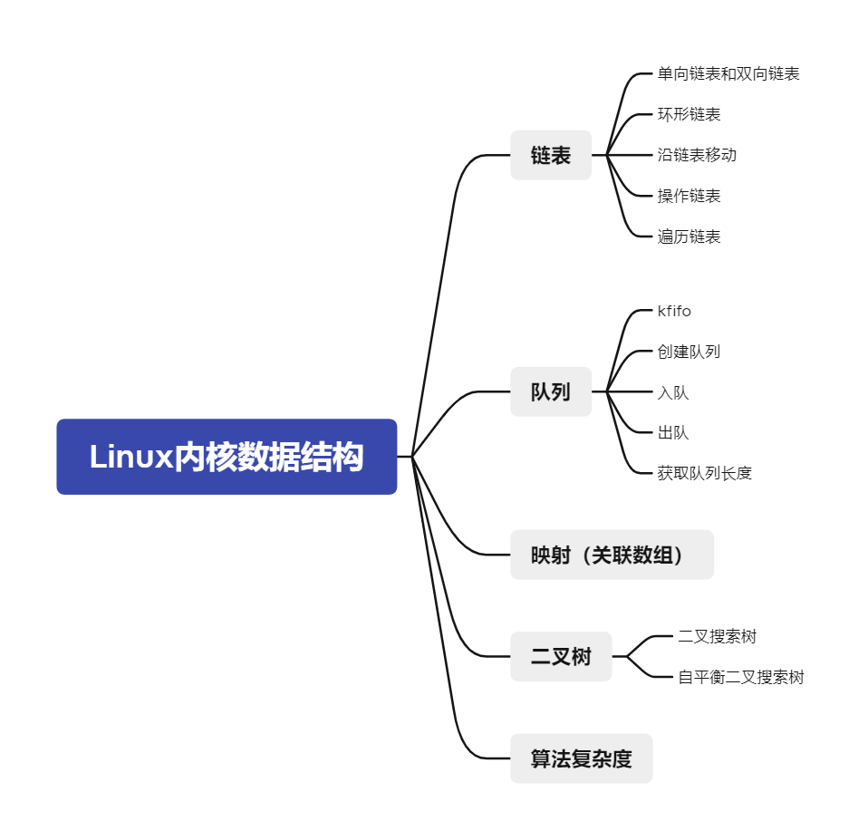
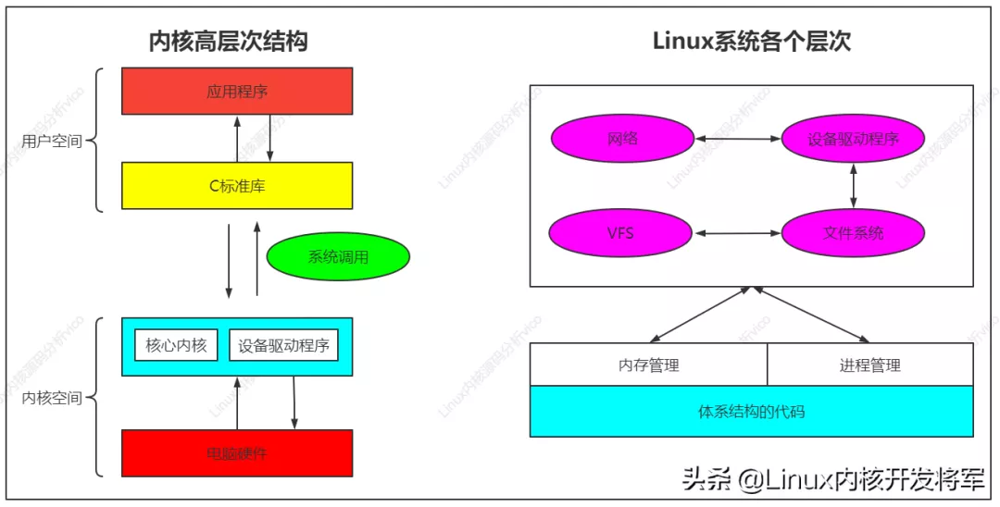
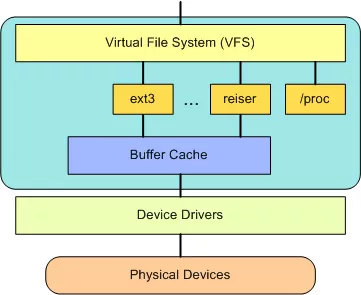
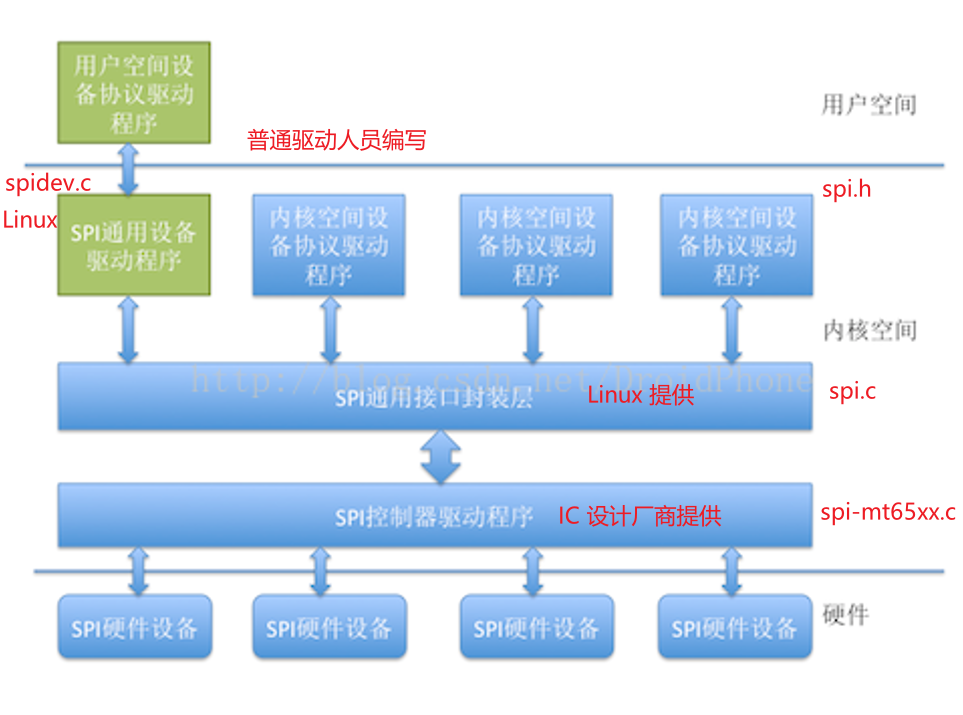
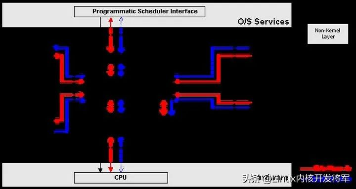
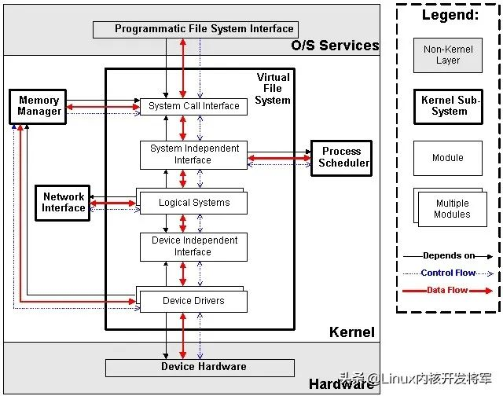
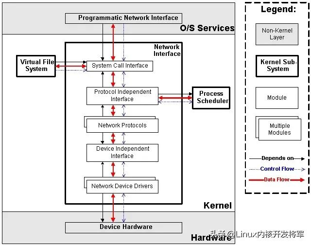
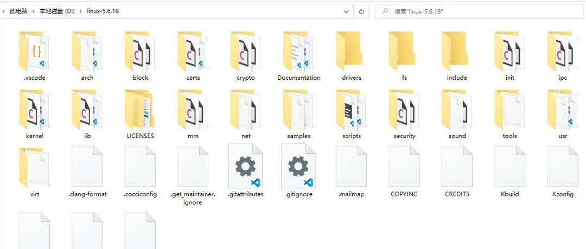

## Linux系统基础知识 - HQ

[TOC]

------

#### 注意

- 

------

## Linux内核源码在线网址

Linux内核源码

https://elixir.bootlin.com/linux/latest/source

Android源码

http://androidxref.com/9.0.0_r3/xref/

http://aospxref.com/

https://www.androidos.net.cn/sourcecode

## Linux目录结构

### 内核源码顶层目录结构

```

include/ ---- 内核头文件，需要提供给外部模块（例如用户空间代码）使用。
kernel/ ---- Linux内核的核心代码，包含了3.2小节所描述的进程调度子系统，以及和进程调度相关的模块。
mm/ ---- 内存管理子系统（3.3小节）。
fs/ ---- VFS子系统（3.4小节）。
net/ ---- 不包括网络设备驱动的网络子系统（3.5小节）。
ipc/ ---- IPC（进程间通信）子系统。
arch// ---- 体系结构相关的代码，例如arm, x86等等。
arch//mach- ---- 具体的machine/board相关的代码。
arch//include/asm ---- 体系结构相关的头文件。
arch//boot/dts ---- 设备树（Device Tree）文件。
init/ ---- Linux系统启动初始化相关的代码。
block/ ---- 提供块设备的层次。
sound/ ---- 音频相关的驱动及子系统，可以看作“音频子系统”。
drivers/ ---- 设备驱动（在Linux kernel 3.10中，设备驱动占了49.4的代码量）。
lib/ ---- 实现需要在内核中使用的库函数，例如CRC、FIFO、list、MD5等。
crypto/ ----- 加密、解密相关的库函数。
security/ ---- 提供安全特性（SELinux）。
virt/ ---- 提供虚拟机技术（KVM等）的支持。
usr/ ---- 用于生成initramfs的代码。
firmware/ ---- 保存用于驱动第三方设备的固件。
samples/ ---- 一些示例代码。
tools/ ---- 一些常用工具，如性能剖析、自测试等。
Kconfig, Kbuild, Makefile, scripts/ ---- 用于内核编译的配置文件、脚本等。
COPYING ---- 版权声明。
MAINTAINERS ----维护者名单。
CREDITS ---- Linux主要的贡献者名单。
REPORTING-BUGS ---- Bug上报的指南。
Documentation, README ---- 帮助、说明文档
```

### Ubuntu系统文件介绍

-  /
   ├── bin          所有用户都可以使用的、基本的命令
   ├── boot         启动文件，比如内核等
   ├── dev          设备文件，Linux特有的
   ├── etc          配置文件
   ├── home         家目录
   │   ├── book     用户book的家目录
   ├── lib          库
   ├── media        插上U盘等外设时会挂载到该目录下
   ├── mnt          用来挂载其他文件系统
   ├── opt          Optional，可选的程序
   ├── proc         用来挂载虚拟的proc文件系统，可以查看各进程(process)的信息
   ├── root         root用户的家目录
   ├── sbin         基本的系统命令，系统管理员才能使用
   ├── sys          用来挂载虚拟的sys文件系统，可以查看系统信息：比如设备信息
   ├── tmp          临时目录，存放临时文件
   ├── usr          Unix Software Resource, 存放可分享的与不可变动的的数据
   │   ├── bin      绝大部分的用户可使用指令都放在这里(与开机无关), /bin中的命令跟开机有关
   │   ├── games    游戏
   │   ├── include  头文件
   │   ├── lib      库
   │   ├── local    系统管理员在本机自行安装、下载的软件
   │   ├── sbin     非系统正常运作所需要的系统命令
   │   ├── share    放置共享文件的地方, 比如/usr/share/man里存放帮助文件
   │   └── src      源码
   └── var          主要针对常态性变动的文件，包括缓存(cache)、log文件等


## Linux内核数据结构




## Linux系统框架介绍

### Linux内核图解


### Linux系统框架介绍

> 

最上面是用户（或应用程序）空间。这是用户应用程序执行的地方。用户空间之下是内核空间，Linux 内核正是位于这里。

**GNU C Library （glibc）也在这里。它提供了连接内核的系统调用接口，还提供了在用户空间应用程序和内核之间进行转换的机制。**

内核和用户空间的应用程序使用的是不同的保护地址空间。

每个用户空间的进程都使用自己的虚拟地址空间，而内核则占用单独的地址空间。

Linux 内核可以进一步划分成 3 层。最上面是系统调用接口，它实现了一些基本的功能，例如 read 和 write。

系统调用接口之下是内核代码，可以更精确地定义为独立于体系结构的内核代码。这些代码是 Linux 所支持的所有处理器体系结构所通用的。

在这些代码之下是依赖于体系结构的代码，构成了通常称为 BSP（Board Support Package）的部分。这些代码用作给定体系结构的处理器和特定于平台的代码。


==内核主要系统包括：==

1. SCI：系统调用接口 
2. PM：进程管理 
3. MM：内存管理 
4. VFS：虚拟文件系统 
5. Network Stack：内核协议栈 
6. Arch：体系架构
7. DD：设备驱动

#### 1 系统调用接口

SCI 层提供了某些机制执行从用户空间到内核的函数调用。这个接口依赖于体系结构，甚至在相同的处理器家族内也是如此。

SCI 实际上是一个非常有用的函数调用多路复用和多路分解服务。

在 ./linux/kernel 中您可以找到 SCI 的实现，并在 ./linux/arch 中找到依赖于体系结构的部分。

#### 2 进程管理

进程管理的重点是进程的执行。

在内核中，这些进程称为线程，代表了单独的处理器虚拟化（线程代码、数据、堆栈和 CPU 寄存器）。

在用户空间，通常使用进程 这个术语，不过 Linux 实现并没有区分这两个概念（进程和线程）。

内核通过 SCI 提供了一个应用程序编程接口（API）来创建一个新进程（fork、exec 或 Portable Operating System Interface [POSIX] 函数），停止进程（kill、exit），并在它们之间进行通信和同步（signal 或者 POSIX 机制）。

#### 3 内存管理

内核所管理的另外一个重要资源是内存。为了提高效率，==如果由硬件管理虚拟内存，内存是按照所谓的内存页方式进行管理的（对于大部分体系结构来说都是 4KB）。==

Linux 包括了管理可用内存的方式，以及物理和虚拟映射所使用的硬件机制。

#### 4 虚拟文件系统

虚拟文件系统（VFS）是 Linux 内核中非常有用的一个方面，因为它为文件系统提供了一个通用的接口抽象。VFS 在 SCI 和内核所支持的文件系统之间提供了一个交换层。



==在 VFS 上面，是对诸如 open、close、read 和 write 之类的函数的一个通用 API 抽象。在 VFS 下面是文件系统抽象，它定义了上层函数的实现方式。==

它们是给定文件系统（超过 50 个）的插件。文件系统的源代码可以在 ./linux/fs 中找到。

文件系统层之下是缓冲区缓存，它为文件系统层提供了一个通用函数集（与具体文件系统无关）。

这个缓存层通过将数据保留一段时间（或者随即预先读取数据以便在需要是就可用）优化了对物理设备的访问。缓冲区缓存之下是设备驱动程序，它实现了特定物理设备的接口。

#### 5 网络堆栈

网络堆栈在设计上遵循模拟协议本身的分层体系结构。

回想一下，Internet Protocol (IP) 是传输协议（通常称为传输控制协议或 TCP）下面的核心网络层协议。TCP 上面是 socket 层，它是通过 SCI 进行调用的。

socket 层是网络子系统的标准 API，它为各种网络协议提供了一个用户接口。

从原始帧访问到 IP 协议数据单元（PDU），再到 TCP 和 User Datagram Protocol (UDP)，socket 层提供了一种标准化的方法来管理连接，并在各个终点之间移动数据。内核中网络源代码可以在 ./linux/net 中找到。

#### 6 设备驱动程序

Linux 内核中有大量代码都在设备驱动程序中，它们能够运转特定的硬件设备。

Linux 源码树提供了一个驱动程序子目录，这个目录又进一步划分为各种支持设备，例如 Bluetooth、I2C、serial 等。设备驱动程序的代码可以在 ./linux/drivers 中找到。


## Linux五大模块内核源码，内核整体架构设计

Linux内核源码分析，要以内核的核心功能为出发点，描述Linux内核的整体架构，以及架构之下主要的软件子系统。

### 1、Linux内核的核心功能

如下图所示，Linux内核只是Linux操作系统一部分。对下，它管理系统的所有硬件设备；对上，它通过系统调用，向Library Routine（例如C库）或者其它应用程序提供接口。



因此，其核心功能就是：管理硬件设备，供应用程序使用。而现代计算机（无论是PC还是嵌入式系统）的标准组成，就是CPU、Memory（内存和外存）、输入输出设备、网络设备和其它的外围设备。所以为了管理这些设备，Linux内核提出了如下的架构。

### 2、Linux内核的整体架构

#### 2.1  整体架构和子系统划分


上图说明了Linux内核的整体架构。根据内核的核心功能，Linux内核提出了5个子系统，分别负责如下的功能：

1. Process Scheduler，也称作进程管理、进程调度。负责管理CPU资源，以便让各个进程可以以尽量公平的方式访问CPU。
2. Memory Manager，内存管理。负责管理Memory（内存）资源，以便让各个进程可以安全地共享机器的内存资源。另外，内存管理会提供虚拟内存的机制，该机制可以让进程使用多于系统可用Memory的内存，不用的内存会通过文件系统保存在外部非易失存储器中，需要使用的时候，再取回到内存中。
3. VFS（Virtual File System），虚拟文件系统。Linux内核将不同功能的外部设备，例如Disk设备（硬盘、磁盘、NAND Flash、Nor Flash等）、输入输出设备、显示设备等等，抽象为可以通过统一的文件操作接口（open、close、read、write等）来访问。这就是Linux系统“一切皆是文件”的体现（其实Linux做的并不彻底，因为CPU、内存、网络等还不是文件，如果真的需要一切皆是文件，还得看贝尔实验室正在开发的"Plan 9”的）。
4. Network，网络子系统。负责管理系统的网络设备，并实现多种多样的网络标准。
5. IPC（Inter-Process Communication），进程间通信。IPC不管理任何的硬件，它主要负责Linux系统中进程之间的通信。

#### 2.2  进程调度（Process Scheduler)

进程调度是Linux内核中最重要的子系统，它主要提供对CPU的访问控制。因为在计算机中，CPU资源是有限的，而众多的应用程序都要使用CPU资源，所以需要“进程调度子系统”对CPU进行调度管理。

进程调度子系统包括4个子模块（见下图），它们的功能如下：




1. Scheduling Policy，实现进程调度的策略，它决定哪个（或哪几个）进程将拥有CPU。
2. Architecture-specific Schedulers，体系结构相关的部分，用于将对不同CPU的控制，抽象为统一的接口。这些控制主要在suspend和resume进程时使用，牵涉到CPU的寄存器访问、汇编指令操作等。
3. Architecture-independent Scheduler，体系结构无关的部分。它会和“Scheduling Policy模块”沟通，决定接下来要执行哪个进程，然后通过“Architecture-specific Schedulers模块”resume指定的进程。
4. System Call Interface，系统调用接口。进程调度子系统通过系统调用接口，将需要提供给用户空间的接口开放出去，同时屏蔽掉不需要用户空间程序关心的细节。

#### 2.3  内存管理（Memory Manager, MM)

内存管理同样是Linux内核中最重要的子系统，它主要提供对内存资源的访问控制。Linux系统会在硬件物理内存和进程所使用的内存（称作虚拟内存）之间建立一种映射关系，这种映射是以进程为单位，因而不同的进程可以使用相同的虚拟内存，而这些相同的虚拟内存，可以映射到不同的物理内存上。

内存管理子系统包括3个子模块（见下图），它们的功能如下：


1. Architecture Specific Managers，体系结构相关部分。提供用于访问硬件Memory的虚拟接口。
2. Architecture Independent Manager，体系结构无关部分。提供所有的内存管理机制，包括：以进程为单位的memory mapping；虚拟内存的Swapping。
3. System Call Interface，系统调用接口。通过该接口，向用户空间程序应用程序提供内存的分配、释放，文件的map等功能。

#### 2.4  虚拟文件系统（Virtual Filesystem, VFS）

传统意义上的文件系统，是一种存储和组织计算机数据的方法。它用易懂、人性化的方法（文件和目录结构），抽象计算机磁盘、硬盘等设备上冰冷的数据块，从而使对它们的查找和访问变得容易。因而文件系统的实质，就是“存储和组织数据的方法”，文件系统的表现形式，就是“从某个设备中读取数据和向某个设备写入数据”。

随着计算机技术的进步，存储和组织数据的方法也是在不断进步的，从而导致有多种类型的文件系统，例如FAT、FAT32、NTFS、EXT2、EXT3等等。而为了兼容，操作系统或者内核，要以相同的表现形式，同时支持多种类型的文件系统，这就延伸出了虚拟文件系统（VFS）的概念。

VFS的功能就是管理各种各样的文件系统，屏蔽它们的差异，以统一的方式，为用户程序提供访问文件的接口。

我们可以从磁盘、硬盘、NAND Flash等设备中读取或写入数据，因而最初的文件系统都是构建在这些设备之上的。这个概念也可以推广到其它的硬件设备，例如内存、显示器（LCD）、键盘、串口等等。

我们对硬件设备的访问控制，也可以归纳为读取或者写入数据，因而可以用统一的文件操作接口访问。Linux内核就是这样做的，除了传统的磁盘文件系统之外，它还抽象出了设备文件系统、内存文件系统等等。这些逻辑，都是由VFS子系统实现。

VFS子系统包括6个子模块（见下图），它们的功能如下：



1. Device Drivers，设备驱动，用于控制所有的外部设备及控制器。由于存在大量不能相互兼容的硬件设备（特别是嵌入式产品），所以也有非常多的设备驱动。因此，Linux内核中将近一半的Source Code都是设备驱动，大多数的Linux底层工程师（特别是国内的企业）都是在编写或者维护设备驱动，而无暇估计其它内容（它们恰恰是Linux内核的精髓所在）。
2. Device Independent Interface， 该模块定义了描述硬件设备的统一方式（统一设备模型），所有的设备驱动都遵守这个定义，可以降低开发的难度。同时可以用一致的形势向上提供接口。
3. Logical Systems，每一种文件系统，都会对应一个Logical System（逻辑文件系统），它会实现具体的文件系统逻辑。
4. System Independent Interface，该模块负责以统一的接口（快设备和字符设备）表示硬件设备和逻辑文件系统，这样上层软件就不再关心具体的硬件形态了。
5. System Call Interface，系统调用接口，向用户空间提供访问文件系统和硬件设备的统一的接口。

#### 2.5  网络子系统（Net）

网络子系统在Linux内核中主要负责管理各种网络设备，并实现各种网络协议栈，最终实现通过网络连接其它系统的功能。在Linux内核中，网络子系统几乎是自成体系，它包括5个子模块（见下图），它们的功能如下：



1. Network Device Drivers，网络设备的驱动，和VFS子系统中的设备驱动是一样的。
2. Device Independent Interface，和VFS子系统中的是一样的。
3. Network Protocols，实现各种网络传输协议，例如IP, TCP, UDP等等。
4. Protocol Independent Interface，屏蔽不同的硬件设备和网络协议，以相同的格式提供接口（socket)。
5. System Call interface，系统调用接口，向用户空间提供访问网络设备的统一的接口。

至于IPC子系统，由于功能比较单纯，这里就不再描述。

### 3  Linux内核源代码的目录结构

Linux内核源代码包括三个主要部分：

1. 内核核心代码，包括第2章所描述的各个子系统和子模块，以及其它的支撑子系统，例如电源管理、Linux初始化等
2. 其它非核心代码，例如库文件（因为Linux内核是一个自包含的内核，即内核不依赖其它的任何软件，自己就可以编译通过）、固件集合、KVM（虚拟机技术）等
3. 编译脚本、配置文件、帮助文档、版权说明等辅助性文件

下图r所示使用ls命令看到的内核源代码的顶层目录结构，具体描述如下。

> 


## 其他Linux相关框图


## 其他知识

同一个 Linux 操作系统 ，可以跑到不同的硬件上面，把操作系统移植到不同的硬件上面，这个过程叫做移植。设备驱动移植步骤如下：


